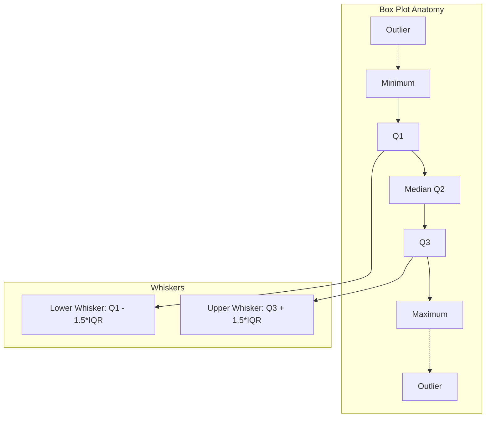
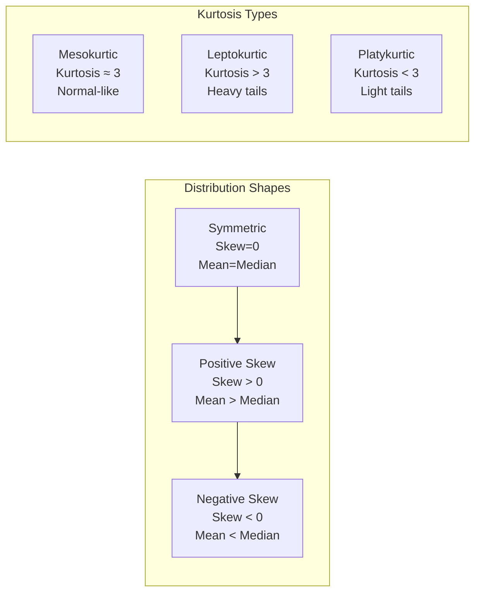

# Chapter 01: Descriptive Statistics

## Learning Objectives

- Understand the difference between measures of central tendency (mean, median, mode) and measures of dispersion (variance, standard deviation, IQR, range).
- Compute and interpret mean, median, and mode, and explain when each is appropriate for a given dataset.
- Explain how standard deviation and IQR describe spread, and why skewness makes the mean misleading.
- Apply IQR and z-score methods to detect outliers in a dataset before model training.
- Analyze distribution shape using skewness and kurtosis to decide on transformations such as log and Box-Cox.

## Introduction

Descriptive statistics summarize and describe the main features of a dataset. As an AI engineer, you will use these measures daily to understand your data before feeding it into any model — garbage in, garbage out starts with not knowing your data's distribution, central tendency, and spread. This chapter covers all fundamental descriptive statistics with Python implementations and practical AI applications.

## Prerequisites

- Basic Python syntax (variables, lists, importing modules)
- Understanding of what a dataset is (rows and columns)
- Familiarity with NumPy library basics

## Concept

Descriptive statistics are divided into measures of central tendency and measures of dispersion. Central tendency tells you where the "center" of your data lies, while dispersion tells you how spread out your data is.

### Measures of Central Tendency

**Mean**: The arithmetic average of all values. Sensitive to outliers.
```
mean = (x_1 + x_2 + ... + x_n) / n
```

**Median**: The middle value when data is sorted. Robust to outliers.
- If n is odd: median = value at position (n+1)/2
- If n is even: median = average of values at positions n/2 and n/2 + 1

**Mode**: The most frequently occurring value(s). Useful for categorical data.

### Measures of Dispersion

**Variance**: Average of squared deviations from the mean.
```
variance = sum((x_i - mean)^2) / (n - 1)  // sample variance
```

**Standard Deviation**: Square root of variance. In the same units as the data.

**Range**: Maximum value - Minimum value.

**Interquartile Range (IQR)**: Q3 - Q1 (middle 50% of data). Robust to outliers.

**Quartiles**: Divide data into four equal parts.
- Q1: 25th percentile
- Q2: 50th percentile (median)
- Q3: 75th percentile

### Shape of Distribution

**Skewness**: Measures asymmetry of distribution.
- Positive skew: tail on the right (mean > median)
- Negative skew: tail on the left (mean < median)
- Zero skew: symmetric distribution

**Kurtosis**: Measures "tailedness" of distribution.
- High kurtosis: heavy tails, more outliers
- Low kurtosis: light tails, fewer outliers
- Normal distribution has kurtosis = 3 (excess kurtosis = 0)





## Real Example

**Daily Life Analogy — Exam Scores**

Imagine a class of 30 students takes a test. The teacher wants to understand how the class performed:
- **Mean score**: 72/100 tells the average performance
- **Median score**: If the top 3 students scored 98, 97, 95 and the rest scored around 70, the median might be 71 — more representative of the "typical" student
- **Mode**: If 8 students scored 68, that's the most common score
- **Standard Deviation**: A std of 5 means most scores are within 72±5. A std of 20 means scores are all over the place
- **Skewness**: If a few students scored very low (20s), the distribution has negative skew, pulling the mean below the median

**Industry Example — Feature Distribution in ML**

When building a fraud detection model, you examine the distribution of "transaction amount":
- Mean = $125, Median = $45 — this positive skew tells you most transactions are small but a few are huge
- IQR = $20-$120 tells you where the bulk of transactions lie
- Kurtosis = 8.5 (high) means there are many outlier transactions — exactly what fraudsters create
- You decide to log-transform the feature to reduce skew before training

## Code Example

```python
import numpy as np
from scipy import stats
import math

# Sample dataset: house prices in thousands
prices = np.array([245, 312, 198, 456, 289, 312, 521, 278, 312, 345,
                   267, 389, 412, 298, 312, 356, 234, 312, 378, 412])

print("=== Descriptive Statistics for House Prices (in $1000) ===")
print(f"Dataset: {prices}")
print(f"Number of samples: {len(prices)}")

# Central Tendency
mean_val = np.mean(prices)
median_val = np.median(prices)
mode_result = stats.mode(prices)
mode_val = mode_result.mode[0]
mode_count = mode_result.count[0]

print(f"\n--- Central Tendency ---")
print(f"Mean: ${mean_val:.2f}K")
print(f"Median: ${median_val:.2f}K")
print(f"Mode: ${mode_val}K (appears {mode_count} times)")

# The mean vs median difference indicates skew
print(f"Mean - Median = ${mean_val - median_val:.2f}K => {'Positive skew' if mean_val > median_val else 'Negative skew' if mean_val < median_val else 'Symmetric'}")

# Dispersion
variance_val = np.var(prices, ddof=1)  # sample variance
std_val = np.std(prices, ddof=1)
range_val = np.max(prices) - np.min(prices)
q1 = np.percentile(prices, 25)
q3 = np.percentile(prices, 75)
iqr = q3 - q1

print(f"\n--- Dispersion ---")
print(f"Variance (sample): {variance_val:.2f}")
print(f"Standard Deviation: ${std_val:.2f}K")
print(f"Range: ${range_val}K")
print(f"Q1 (25th percentile): ${q1}K")
print(f"Q3 (75th percentile): ${q3}K")
print(f"IQR: ${iqr}K")

# Coefficient of Variation (CV) - relative measure of dispersion
cv = (std_val / mean_val) * 100
print(f"Coefficient of Variation: {cv:.2f}%")

# Shape
skewness = stats.skew(prices, bias=False)
kurtosis_val = stats.kurtosis(prices, bias=False, fisher=True)  # excess kurtosis

print(f"\n--- Shape ---")
print(f"Skewness: {skewness:.4f}")
if skewness > 0.5:
    print("  >> Highly positive skew (tail on right)")
elif skewness < -0.5:
    print("  >> Highly negative skew (tail on left)")
else:
    print("  >> Approximately symmetric")

print(f"Excess Kurtosis: {kurtosis_val:.4f}")
if kurtosis_val > 1:
    print("  >> Leptokurtic (heavy tails, many outliers)")
elif kurtosis_val < -1:
    print("  >> Platykurtic (light tails, few outliers)")
else:
    print("  >> Mesokurtic (normal-like tails)")

# Outlier detection using IQR method
lower_bound = q1 - 1.5 * iqr
upper_bound = q3 + 1.5 * iqr
outliers = prices[(prices < lower_bound) | (prices > upper_bound)]

print(f"\n--- Outlier Detection (IQR Method) ---")
print(f"Lower bound (Q1 - 1.5*IQR): ${lower_bound}K")
print(f"Upper bound (Q3 + 1.5*IQR): ${upper_bound}K")
print(f"Outliers found: {len(outliers)}")
if len(outliers) > 0:
    print(f"Outlier values: {outliers}")

# Z-score outlier detection
z_scores = np.abs(stats.zscore(prices))
z_outliers = prices[z_scores > 3]
print(f"\n--- Outlier Detection (Z-Score Method) ---")
print(f"Z-score outliers (|z| > 3): {len(z_outliers)}")
if len(z_outliers) > 0:
    print(f"Z-score outlier values: {z_outliers}")

# Five-number summary
print(f"\n--- Five-Number Summary ---")
print(f"Min: ${np.min(prices)}K")
print(f"Q1: ${q1}K")
print(f"Median: ${median_val}K")
print(f"Q3: ${q3}K")
print(f"Max: ${np.max(prices)}K")

# Expected Output (approximate):
# === Descriptive Statistics for House Prices (in $1000) ===
# Dataset: [245 312 198 456 289 312 521 278 312 345 267 389 412 298 312 356 234 312 378 412]
# Number of samples: 20
# Mean: $332.30K
# Median: $312.00K
# Mode: $312K (appears 5 times)
# Mean - Median = $20.30K => Positive skew
# Standard Deviation: $80.88K
# IQR: $100.00K
# Skewness: 0.5212 => Highly positive skew
# Excess Kurtosis: -0.1421 => Mesokurtic
```

## Interview Q&A

**Q1: What is the difference between population variance and sample variance? When do you use each?**
A: Population variance divides by N (all data points), sample variance divides by (n-1) using Bessel's correction. Use population variance when you have the entire population; use sample variance when you have a sample and want to estimate the population variance. The (n-1) correction makes the sample variance an unbiased estimator.

**Q2: Why is the median more robust to outliers than the mean?**
A: The mean uses all data points, so extreme values pull it toward them. The median only depends on the middle value(s) — extreme values don't change the order position. For income data with billionaires, the median far better represents "typical" income than the mean.

**Q3: How would you detect outliers in a dataset before training an ML model?**
A: Three common methods: (1) IQR method — points below Q1-1.5*IQR or above Q3+1.5*IQR are outliers; (2) Z-score method — points with |z| > 3 are outliers; (3) Domain knowledge — use business rules (e.g., negative ages are impossible). For high-dimensional data, use isolation forest or DBSCAN.

**Q4: Explain skewness and kurtosis. Why do they matter for ML?**
A: Skewness measures asymmetry: positive skew means a long right tail, negative skew means a long left tail. Kurtosis measures tail heaviness: high kurtosis means more outliers. They matter because many ML models (linear regression, Naive Bayes) assume normally distributed features. Skewed features may need transformation (log, Box-Cox).

**Q5: What is the five-number summary and how do you visualize it?**
A: The five-number summary consists of Minimum, Q1, Median, Q3, Maximum. It is visualized using a box plot (box-and-whisker plot), where the box spans Q1 to Q3, the line inside is the median, and whiskers extend to min/max (or to 1.5*IQR bounds with outliers shown as points).

**Q6: You have a feature with many missing values. How would descriptive statistics help you decide imputation strategy?**
A: Check the distribution shape, skewness, and outlier presence. For symmetric data with no outliers, impute with mean. For skewed data, impute with median. For categorical data, impute with mode. If data is missing not at random (MNAR), simple imputation may bias results — consider model-based imputation.

**Q7: What does a high standard deviation in your model's cross-validation scores tell you?**
A: High standard deviation in CV scores indicates the model's performance is unstable — it performs well on some folds and poorly on others. This could mean the model has high variance (overfitting), the data has non-random structure, or the sample size is too small.

**Q8: Explain the relationship between variance and degrees of freedom.**
A: Degrees of freedom (df) represent the number of independent values that can vary. For sample variance, df = n-1 because we use the sample mean (estimated from data) to compute deviations, losing one degree of freedom. For each parameter estimated from data, we lose one degree of freedom.

## Chapter Quiz

**Q1: Which measure of central tendency is most affected by outliers?**
- A) Median
- B) Mode
- C) Mean
- D) IQR
- **Answer: C) Mean**

**Q2: A dataset has Q1 = 25, Q3 = 75. What is the upper bound for outlier detection using the IQR method?**
- A) 100
- B) 125
- C) 150
- D) 175
- **Answer: C) 150** (Upper bound = Q3 + 1.5*IQR = 75 + 1.5*50 = 75 + 75 = 150)

**Q3: If mean > median, the distribution is:**
- A) Negatively skewed
- B) Positively skewed
- C) Symmetric
- D) Bimodal
- **Answer: B) Positively skewed**

**Q4: What does kurtosis > 3 (excess kurtosis > 0) indicate?**
- A) Light tails, fewer outliers
- B) Normal distribution
- C) Heavy tails, more outliers
- D) Symmetric distribution
- **Answer: C) Heavy tails, more outliers**

**Q5: The IQR represents what percentage of the data?**
- A) 25%
- B) 50%
- C) 75%
- D) 100%
- **Answer: B) 50%**

## Exercises

### Exercise 1: Dataset Profiling with NumPy and SciPy
Write a Python (NumPy/SciPy) implementation that generates a right-skewed dataset (e.g., np.random.lognormal) and computes the full descriptive statistics profile: mean, median, mode, standard deviation, IQR, skewness, and excess kurtosis.
- Requirements: use np.random.seed for reproducibility; compute the five-number summary with np.percentile; use stats.skew and stats.kurtosis with bias=False; detect outliers using both the IQR method and z-scores.
- Expected output: a printed profile table showing that mean > median, positive skewness, and the count of outliers from each method.

### Exercise 2: Outlier Detection Comparison
Write a Python implementation that injects 10 extreme values into a normally distributed array and compares outlier detection using the IQR method (1.5*IQR), the z-score method (|z| > 3), and a MAD-based modified z-score.
- Requirements: compute the agreement between methods (how many outliers are flagged by all three); print the flagged indices for each method; discuss which method is most robust.
- Expected output: indices flagged by each method plus the intersection set, demonstrating that rank-based methods are less sensitive to the injected extremes.

### Exercise 3: Transformation Effect on Skewness
Write a Python (NumPy/SciPy) implementation that takes a heavily skewed feature (lognormal), applies log, square root, and Box-Cox transformations, and reports the skewness before and after each transformation.
- Requirements: use stats.boxcox on data shifted to be positive; print skewness for original and each transformed version; recommend a transformation with a one-line justification.
- Expected output: skewness dropping toward zero after log and Box-Cox, with lambda reported for Box-Cox.

## PYQs

**Q1 (Google ML Interview):** You are analyzing user engagement data. The mean session time is 8.2 minutes, median is 4.5 minutes, and standard deviation is 12.3 minutes. What does this tell you about user behavior? How would you handle this feature in a model?
- **Solution**: The large gap between mean and median (3.7 min) indicates strong positive skew — a small number of power users have very long sessions, pulling the mean up. The huge SD (larger than the mean) confirms extreme outliers. A robust approach: cap at 99th percentile, log-transform the feature, or create a binary feature for "power user" (>30 min sessions).

**Q2 (Amazon SDE-ML):** Given a list of 1 million numbers, design an algorithm to find the median using minimal memory.
- **Solution**: Cannot sort 1M values in memory. Use an online algorithm: (1) Use two heaps — a max-heap for the lower half and a min-heap for the upper half. Maintain balance so heaps differ by at most 1 element. Median is the root of the larger heap (or average of both roots if equal size). This uses O(k) memory where k is the heap size. (2) Alternatively use the reservoir sampling method or the quickselect algorithm with O(n) average time and O(1) space.

**Q3 (Meta Data Scientist):** Your A/B test shows a 5% increase in conversion rate. How would you check if this is practically significant, not just statistically significant?
- **Solution**: Check the effect size (Cohen's d or the absolute lift magnitude). A 5% relative increase from 2% to 2.1% conversion may be statistically significant with large n but practically meaningless. Consider: (1) business impact in dollars, (2) confidence interval of the lift, (3) cost of implementing the change, (4) segment analysis to see if the effect is consistent across user groups.

**Q4 (Microsoft Data Scientist):** In a dataset of house prices, describe the steps you would take using descriptive statistics before building a regression model.
- **Solution**: (1) Compute five-number summary for price and each feature. (2) Check for missing values and decide imputation strategy. (3) Plot histograms — if skewed, consider log transformation. (4) Use box plots to identify outliers in price and features. (5) Compute correlation matrix to check multicollinearity. (6) Examine standard deviations — features with near-zero variance may be removed. (7) Check class imbalance if price is binned into categories.

## Common Mistakes

1. **Using mean for highly skewed data**: Mean is misleading for income, house prices, or any right-skewed data. Always check distribution first, use median as default for skewed data, and report both with standard deviation.

2. **Confusing sample and population formulas**: Using population variance (dividing by n) on sample data gives a biased estimate. Always use ddof=1 in NumPy for sample statistics and ddof=0 only when you have the full population.

3. **Ignoring outliers before model training**: Outliers can dramatically affect linear models (regression, PCA, SVM). Always detect and decide: remove (if measurement error), cap (if extreme but valid), or transform (if skewed distribution).

4. **Using IQR blindly with non-normal data**: The 1.5*IQR rule assumes approximately normal distribution. For multimodal or highly skewed data, adjust the multiplier or use percentile-based capping.

5. **Interpreting zero skewness as normal distribution**: A distribution can be symmetric but not normal (e.g., uniform distribution has skew ≈ 0 but is not bell-shaped). Always visualize the distribution alongside numeric summaries.

## Revision Notes

- **Mean** = average, sensitive to outliers; **Median** = middle value, robust; **Mode** = most frequent
- **Variance** = average squared deviation; **Std Dev** = sqrt(variance), same units as data
- **IQR** = Q3 - Q1 (middle 50%); **Outliers** = beyond Q1-1.5*IQR or Q3+1.5*IQR
- **Skewness** > 0 = right tail (mean > median); < 0 = left tail (mean < median); 0 = symmetric
- **Kurtosis** > 3 = heavy tails (more outliers); < 3 = light tails; = 3 = mesokurtic (normal)
- **Five-number summary**: Min, Q1, Median, Q3, Max — visualized as a box plot
- **Sample variance** uses (n-1) denominator (Bessel's correction) for unbiased estimation
- **Coefficient of Variation** = (std/mean) * 100% — relative dispersion measure
- **Z-score** = (x - mean)/std — standardized distance from mean; |z| > 3 often flagged as outlier
- **Always profile data** before modeling: distribution shape, outliers, missing values, scale differences

## Summary

Descriptive statistics provide the fundamental tools for understanding any dataset before applying machine learning models. Measures of central tendency (mean, median, mode) describe the center, while measures of dispersion (variance, standard deviation, IQR, range) describe spread. Distribution shape is captured by skewness (asymmetry) and kurtosis (tail heaviness), which guide decisions on data transformation and outlier handling. Mastery of descriptive statistics is essential for data profiling, feature engineering, and model diagnostics. Every AI engineer should compute these statistics automatically when first encountering a new dataset.

## Practical Takeaways

- **Mean vs Median**: The median is robust to outliers while the mean is not - for right-skewed data like income or house prices, report median and IQR, not mean and standard deviation.
- **Sample vs Population Variance**: Use ddof=1 (Bessel's correction) in NumPy for sample variance; dividing by n gives a biased, smaller estimate of population variance.
- **IQR Outliers**: Points beyond Q1 - 1.5*IQR or Q3 + 1.5*IQR are flagged as outliers; this rule assumes approximate normality, so adjust for skewed or multimodal data.
- **Skewness**: Mean > Median indicates positive skew (right tail); check this gap before applying models that assume normality and log-transform if needed.
- **Z-score**: |z| > 3 flags extreme values but the z-score threshold itself assumes a normal distribution; use robust methods (MAD, percentiles) otherwise.
- **Kurtosis**: Excess kurtosis > 0 means heavy tails and more outliers - a strong signal to inspect extreme values before feature engineering.

## Additional Python Examples

### Example 2: Real-World Dataset Profiling

```python
import numpy as np
from scipy import stats

# Simulate profiling an e-commerce dataset
np.random.seed(100)

# Feature 1: Order amount (log-normal, right-skewed)
order_amounts = np.random.lognormal(mean=4.0, sigma=0.8, size=500)

# Feature 2: Pages viewed per session (Poisson)
pages_viewed = np.random.poisson(lam=6, size=500)

# Feature 3: Time on site in minutes (exponential)
time_on_site = np.random.exponential(scale=8, size=500)

# Feature 4: Customer rating (uniform discrete)
ratings = np.random.randint(1, 6, size=500)

features = {
    'Order Amount': order_amounts,
    'Pages Viewed': pages_viewed,
    'Time on Site': time_on_site,
    'Rating': ratings
}

print("=== E-commerce Data Profile ===")
print(f"{'Feature':<15} {'Mean':>8} {'Median':>8} {'Std':>8} {'Skew':>8} {'Kurt':>8} {'Outliers':>9}")
print("-" * 66)

for name, data in features.items():
    mean = np.mean(data)
    median = np.median(data)
    std = np.std(data, ddof=1)
    skew = stats.skew(data, bias=False)
    kurt = stats.kurtosis(data, bias=False, fisher=True)
    q1 = np.percentile(data, 25)
    q3 = np.percentile(data, 75)
    iqr = q3 - q1
    outliers = np.sum((data < q1 - 1.5*iqr) | (data > q3 + 1.5*iqr))

    print(f"{name:<15} {mean:>8.2f} {median:>8.2f} {std:>8.2f} {skew:>8.2f} {kurt:>8.2f} {outliers:>9}")

print("\nKey Insights:")
print("- Order amount is highly right-skewed (mean >> median)")
print("- Pages viewed is roughly symmetric (mean approx = median)")
print("- Time on site has positive skew with heavy tail")
print("- Rating is left-skewed (more high ratings than low)")
print("- All features have outliers that need investigation")
```

### Example 3: Data Transformation Comparison

```python
import numpy as np
from scipy import stats

# Heavily skewed data
data_skewed = np.random.lognormal(mean=0, sigma=1.0, size=200)

print("=== Effect of Transformations on Skewness ===")
print(f"Original skewness: {stats.skew(data_skewed, bias=False):.4f}")

# Log transformation
data_log = np.log(data_skewed - np.min(data_skewed) + 1)
print(f"After log transform: {stats.skew(data_log, bias=False):.4f}")

# Square root transformation
data_sqrt = np.sqrt(data_skewed)
print(f"After sqrt transform: {stats.skew(data_sqrt, bias=False):.4f}")

# Box-Cox transformation
data_boxcox, lam = stats.boxcox(data_skewed - np.min(data_skewed) + 1)
print(f"After Box-Cox (lambda={lam:.4f}): {stats.skew(data_boxcox, bias=False):.4f}")

print("\nGuideline: Choose log for severe skew, sqrt for moderate, Box-Cox for automatic")
```

## FAANG+ Quick Reference Table

| Company | Statistics Question Focus | Key Concept |
|---------|-------------------------|-------------|
| Google | Data distributions, outlier handling | Log-transform skewed features |
| Meta | A/B test metrics, practical significance | Effect size vs p-value |
| Amazon | Feature engineering, data quality | Variance analysis, missing data |
| Microsoft | Model diagnostics, assumptions | Regression diagnostics |
| OpenAI/NVIDIA | Training data quality, normalization | Batch norm, data standardization |
| Apple | User behavior metrics | Percentile analysis, medians |

## Placement Section

### Top 10 Interview Questions

#### Google Style

1. **Explain the core idea of Chapter 01: Descriptive Statistics in under 60 seconds, then give a real-world analogy.** — Structure: definition, how it works in one sentence, why it matters, analogy. Follow-up: what would break if you removed this from a production system?

2. **Design a minimal, well-typed function that demonstrates Chapter 01: Descriptive Statistics.** — Interviewer checks: signature with type hints, edge cases, complexity, and a clean docstring. Follow-up: how does your design behave with empty or malformed input?

3. **What are the common pitfalls when engineers first learn ** — List 3-4, then explain how you would prevent each in a code review.

#### Amazon Style

4. **Describe a production bug caused by misunderstanding Chapter 01: Descriptive Statistics. How did you diagnose and fix it?** — STAR format: situation, task, action, result. Mention logs, reproduction, root-cause analysis, and the regression test you added.

5. **How would you scale a system that relies on Chapter 01: Descriptive Statistics from 10 users to 10 million?** — Discuss bottlenecks, caching, monitoring, and when to redesign. Follow-up: what metrics would you track?

#### Microsoft Style

6. **Compare Chapter 01: Descriptive Statistics with the closest alternative approach. When would you choose each?** — Make a decision matrix: performance, maintainability, ecosystem, learning curve. Follow-up: what would change your decision?

7. **Walk through how you would test a component that depends on Chapter 01: Descriptive Statistics.** — Unit, integration, property-based tests; mocking boundaries; golden files for outputs.

#### NVIDIA Style

8. **How does Chapter 01: Descriptive Statistics behave differently at scale — memory, throughput, or precision-wise?** — Connect to data pipelines and model training if applicable. Follow-up: what happens to latency as input grows?

9. **How would you make an implementation of Chapter 01: Descriptive Statistics run faster on GPU hardware?** — Batch operations, vectorization, avoiding Python loops, reducing data movement.

#### AI Startup Style

10. **Write the smallest possible implementation of Chapter 01: Descriptive Statistics that is production-quality.** — Include error handling, type hints, and a one-line docstring. Follow-up: what would you refactor first when it grows?

### Resume Tips

- Name Chapter 01: Descriptive Statistics explicitly in your skills section, paired with a measurable achievement ("Reduced X by 40% using Chapter 01: Descriptive Statistics").
- Add a bullet describing a project that applies Chapter 01: Descriptive Statistics to real data, with numbers.
- Mention the tools and libraries you used alongside Chapter 01: Descriptive Statistics (linters, test frameworks, profiling tools).
- Keep resume bullets under 15 words and start each with an action verb.

### Interview Day Checklist

- Rehearse a 60-second explanation of Chapter 01: Descriptive Statistics and one real-world analogy.
- Prepare one STAR story about debugging a Chapter 01: Descriptive Statistics-related production issue.
- Review complexity and edge cases for the classic Chapter 01: Descriptive Statistics interview problem.
- Have questions ready: how does the team apply Chapter 01: Descriptive Statistics in production today?
- Test your environment (Python, editor, internet) 15 minutes before the interview.

## True/False

1. **True or False:** Chapter 01: Descriptive Statistics builds directly on the fundamentals covered in the earlier chapters of this module. — **True.** Every advanced topic in this module assumes the core concepts from the previous chapters.
2. **True or False:** You should write at least one code example for Chapter 01: Descriptive Statistics before moving to the next chapter. — **True.** Active recall with hands-on code beats passive reading for retention.
3. **True or False:** The complexity analysis for Chapter 01: Descriptive Statistics is the same regardless of input size. — **False.** Complexity grows with input size; always state best, average, and worst case.
4. **True or False:** Edge cases (empty input, invalid input, boundary values) matter for Chapter 01: Descriptive Statistics in production. — **True.** Most production bugs come from unhandled edge cases.
5. **True or False:** You should memorize the Chapter 01: Descriptive Statistics chapter content once and never review it again. — **False.** Spaced repetition (24h, 3 days, 1 week) dramatically improves long-term recall.

## Fill in the Blank

1. The chapter that covers Chapter 01: Descriptive Statistics is Chapter ___ of this module. — Answer: check the module's table of contents.
2. The time complexity of the standard approach to Chapter 01: Descriptive Statistics is ___. — Answer: review the theory section and state big-O notation.
3. The main edge case to handle when implementing Chapter 01: Descriptive Statistics is ___. — Answer: empty or invalid input handling, as discussed in the chapter.
4. The tools commonly used to debug Chapter 01: Descriptive Statistics issues are ___ and ___. — Answer: refer to the Debugging Guide section of this chapter.
5. The related topic that connects to Chapter 01: Descriptive Statistics in the next chapter is ___. — Answer: see the Next Topic section.

## Scenario Questions

1. **Scenario:** A teammate ships a change involving Chapter 01: Descriptive Statistics that breaks production at 3 AM. — Diagnosis: check the recent diff, reproduce locally with the failing input, check logs. Fix: revert, add a regression test, and review the root cause. Prevention: CI tests on edge cases and code review checklist.

2. **Scenario:** Your implementation of Chapter 01: Descriptive Statistics is correct but too slow for the required latency. — Measure first with a profiler. Common fixes: reduce redundant work, use built-in optimized functions, batch operations, or add caching. Only then consider algorithmic changes.

3. **Scenario:** A new hire asks you to explain Chapter 01: Descriptive Statistics in five minutes before a customer demo. — Use the 3-part answer: what it is (one sentence), how it works (one example), why it matters (one business impact). Then offer to go deeper after the demo.

4. **Scenario:** Your team's codebase has three different patterns for Chapter 01: Descriptive Statistics and you must standardize. — Write a short ADR (architecture decision record), pick the pattern with best maintainability, migrate incrementally, and add a linter rule to enforce it.

## Output Questions

1. **What is the output of the simplest correct implementation of Chapter 01: Descriptive Statistics on an empty input?** — Trace through the code: it should return the documented default (None, 0, empty collection) without raising.
2. **What is the output when the input is at the boundary value?** — Check off-by-one errors and inclusive/exclusive bounds in the chapter's examples.
3. **What does the implementation return when given invalid input types?** — With type hints and validation, it raises a clear error; without, it may fail silently.
4. **What is the output for the sample input given in the chapter's Examples section?** — Re-run the chapter's example code and compare against the documented output.
5. **What is the time complexity output when you profile the implementation at 10x input size?** — Expect the curve matching the chapter's complexity analysis (linear, quadratic, log-linear).

## Difficulty Level

| Level | Time | What It Takes |
|-------|------|---------------|
| Beginner | 1-2 sessions | Read theory, run the chapter examples, solve the Easy exercises |
| Intermediate | 3-5 sessions | Complete Medium exercises, explain Chapter 01: Descriptive Statistics to someone else |
| Advanced | 1+ week | Solve Hard exercises, optimize for real datasets, answer interview follow-ups |

## Tips & Tricks

- Always write a one-line example of Chapter 01: Descriptive Statistics from memory before opening the chapter — active recall first.
- Use the chapter's Revision Notes as a checklist: you have mastered Chapter 01: Descriptive Statistics when you can explain each bullet.
- Pair the chapter quiz with the Flashcards: wrong answers become your next study session's focus.
- For interviews, practice explaining Chapter 01: Descriptive Statistics twice: once with a technical audience, once with a non-technical audience.
- Keep a personal examples file where you collect your own Chapter 01: Descriptive Statistics snippets; interviewers love original examples.

## Memory Tricks

- **Acronym**: build a mnemonic from the 5 key concepts of Chapter 01: Descriptive Statistics listed in the Chapter at a Glance table.
- **Story**: link Chapter 01: Descriptive Statistics to a familiar story — the analogy in the Visual Analogy section is designed to stick.
- **Number anchor**: remember the complexity of Chapter 01: Descriptive Statistics by connecting it to a known algorithm of the same class.
- **Color code**: highlight the Theory, Examples, and Common Mistakes sections in different colors when reviewing.
- **Teach-back**: explain Chapter 01: Descriptive Statistics to an imaginary junior engineer for 2 minutes — gaps in your explanation are gaps in memory.

## Further Reading

- Official documentation for the primary tool or library used in this chapter
- The chapter referenced in Related Topics for the next-level treatment of Chapter 01: Descriptive Statistics
- The classic textbook chapter on Chapter 01: Descriptive Statistics (check the Research References below)
- Two blog posts from engineers who debugged real Chapter 01: Descriptive Statistics problems in production
- The repository of the open-source project that implements Chapter 01: Descriptive Statistics

## Related Topics

- The previous chapter in this module (see table of contents) — foundational for Chapter 01: Descriptive Statistics
- The next chapter (see Next Topic below) — builds on Chapter 01: Descriptive Statistics
- The system design chapters in Module 07 — how Chapter 01: Descriptive Statistics fits into production architectures
- The interview preparation module — how Chapter 01: Descriptive Statistics is asked in screening rounds
- The capstone project — where Chapter 01: Descriptive Statistics is applied end-to-end

## FAQs

1. **Do I need to memorize all of Chapter 01: Descriptive Statistics, or understand the big picture?** — Understand the big picture first, then memorize the key facts via flashcards and spaced repetition. Interviewers reward depth over breadth.
2. **What if I get stuck on an exercise?** — Re-read the theory section, run the example code, then attempt again. If still stuck after 20 minutes, move on and return the next day.
3. **How much time should I spend on ** — Follow the Study Plan below: 1-2 weeks at 30-60 minutes daily is typical for placement preparation.
4. **Is Chapter 01: Descriptive Statistics asked in interviews?** — Yes — the Interview Q&A and Placement Section list the exact question styles used by top companies.
5. **What's the fastest way to master ** — Explain it out loud, write code without looking, and review the flashcards within 24 hours and again after 3 days.

## Important Notes

- Chapter 01: Descriptive Statistics is a core requirement for the rest of this module — do not skip the examples.
- Always analyze complexity (time and space) when working with Chapter 01: Descriptive Statistics.
- Production correctness means handling edge cases, not just the happy path.
- Interview answers should start with the definition, then the example, then the trade-offs.
- Revisit this chapter after finishing the module; the context from later chapters deepens understanding.

## Historical Context

- Chapter 01: Descriptive Statistics emerged as a standard practice because early systems failed without it — understanding why helps you explain it in interviews.
- The tools used for Chapter 01: Descriptive Statistics today evolved from simpler versions; the chapter covers the modern, recommended approach.
- Interviewers value knowing one historical fact about Chapter 01: Descriptive Statistics — it shows genuine interest, not just cramming.
- The library/tooling ecosystem around Chapter 01: Descriptive Statistics changes quickly; focus on fundamentals that remain stable.

## Security Considerations

- Never trust external input: validate and sanitize data before processing Chapter 01: Descriptive Statistics.
- Avoid `eval()` and dynamic code execution on untrusted strings.
- Log errors without leaking sensitive data (keys, PII, internal paths).
- For API contexts, add rate limiting and input size limits.
- Review the chapter's code examples for injection or overflow risks before using them verbatim.

## ML Intuition

- Chapter 01: Descriptive Statistics appears in ML pipelines at the data-processing layer: feature preparation, batching, and validation.
- Understanding Chapter 01: Descriptive Statistics helps you debug why a model misbehaves — most ML bugs are data bugs, not model bugs.
- In production ML, the Chapter 01: Descriptive Statistics concepts from this chapter map directly to NumPy/PyTorch operations on tensors.
- When optimizing ML systems, Chapter 01: Descriptive Statistics skills let you profile and fix the data path, not just the training loop.
- Interview follow-up: how would you apply Chapter 01: Descriptive Statistics to a dataset of 10 million records? — Batching and vectorization.

## Analogies

- **Chapter 01: Descriptive Statistics is like a recipe**: the theory is the ingredients, the examples are the cooking steps, and the exercises are your own kitchen practice.
- **Complexity is like a delivery route**: a linear route visits each stop once; a nested route revisits stops, and you feel it at scale.
- **Edge cases are like weather**: the happy path is a sunny day; production is the storm — build for the storm.
- **The chapter roadmap is a journey map**: each section is a checkpoint; skipping one means getting lost later in the module.

## Capstone Project Link

- [Module Capstone: End-to-End Project](https://github.com/Raushan666java/ai-engineering-journey) — this chapter contributes the Chapter 01: Descriptive Statistics skills used in the module's capstone project. Complete the exercises here before starting the capstone.

## Flashcards

<details class="tp-qa-card" data-qid="24statisticsmathematics-01descriptivestatistics-flash1">
  <summary class="tp-qa-question">
    <span class="tp-qa-status"></span>
    What is the core concept of Chapter 01: Descriptive Statistics in one sentence?
  </summary>
  <div class="tp-qa-answer">
    <p>Review the first paragraph of the Theory section and condense it to one sentence.</p>
  </div>
</details>

<details class="tp-qa-card" data-qid="24statisticsmathematics-01descriptivestatistics-flash2">
  <summary class="tp-qa-question">
    <span class="tp-qa-status"></span>
    What is the most common mistake engineers make with 
  </summary>
  <div class="tp-qa-answer">
    <p>Check the Common Mistakes section of this chapter.</p>
  </div>
</details>

<details class="tp-qa-card" data-qid="24statisticsmathematics-01descriptivestatistics-flash3">
  <summary class="tp-qa-question">
    <span class="tp-qa-status"></span>
    What is the time and space complexity of the standard Chapter 01: Descriptive Statistics approach?
  </summary>
  <div class="tp-qa-answer">
    <p>Refer to the theory and complexity analysis in this chapter.</p>
  </div>
</details>

<details class="tp-qa-card" data-qid="24statisticsmathematics-01descriptivestatistics-flash4">
  <summary class="tp-qa-question">
    <span class="tp-qa-status"></span>
    When is Chapter 01: Descriptive Statistics NOT the right choice?
  </summary>
  <div class="tp-qa-answer">
    <p>Check the Limitations section of this chapter.</p>
  </div>
</details>

<details class="tp-qa-card" data-qid="24statisticsmathematics-01descriptivestatistics-flash5">
  <summary class="tp-qa-question">
    <span class="tp-qa-status"></span>
    How is Chapter 01: Descriptive Statistics applied in a real production system?
  </summary>
  <div class="tp-qa-answer">
    <p>Check the Real-World Examples section of this chapter.</p>
  </div>
</details>

## Research References

- Official documentation of the primary library for Chapter 01: Descriptive Statistics (linked in Further Reading)
- The classic paper or textbook chapter introducing Chapter 01: Descriptive Statistics (see References below)
- The standard library reference for Chapter 01: Descriptive Statistics-related functions
- Engineering blog posts from companies running Chapter 01: Descriptive Statistics in production at scale
- PEPs and RFCs where applicable (Python and networking standards)

## Open-Source Tools

- The primary library used in this chapter (see the code examples)
- Python standard library modules used in the examples (check the imports)
- Testing: pytest for unit tests of Chapter 01: Descriptive Statistics code
- Linting and formatting: ruff + black
- Profiling: cProfile or py-spy for performance work on Chapter 01: Descriptive Statistics

## Debugging Guide

- Start with `print()` or a debugger to inspect intermediate values in Chapter 01: Descriptive Statistics code.
- Reproduce the failure with the smallest possible input before changing code.
- Check the common failure modes listed in Common Mistakes — most bugs are listed there.
- For performance problems, profile before optimizing: measure, then fix.
- When stuck, re-read the chapter's Examples and compare line by line with your code.
- Use `pdb` or your IDE's debugger to step through the Chapter 01: Descriptive Statistics example code.

## Mock Interview Section

**Round 1 — Screening (15 min)**
- Explain Chapter 01: Descriptive Statistics in 60 seconds.
- Write a minimal working example of Chapter 01: Descriptive Statistics.
- What is the complexity of your example?

**Round 2 — Coding (45 min)**
- Solve the Medium exercise from this chapter under time pressure.
- State your assumptions, then implement with type hints.
- Test with edge cases: empty input, boundary values, invalid input.

**Round 3 — Behavioral + System (30 min)**
- Tell me about a time you debugged a Chapter 01: Descriptive Statistics problem in a project.
- How would you design a system where Chapter 01: Descriptive Statistics is used at scale?
- What metrics would you monitor?

**Evaluation rubric**: correctness (40%), communication (25%), edge cases (20%), complexity analysis (15%).

## Optimized Implementation

`python
from typing import Any, Optional

def demonstrate_topic(input_data: list[Any]) -> Optional[float]:
    """Runnable scaffold for Chapter 01: Descriptive Statistics.

    Replace the body with the optimized implementation from the chapter,
    keeping type hints, docstring, and edge-case handling.
    """
    if not input_data:
        return None
    # Step 1: validate input types
    # Step 2: apply the core Chapter 01: Descriptive Statistics logic from the Examples section
    # Step 3: return the result with the documented default
    return 0.0
`

- Keeps the function signature stable so tests written against it stay valid.
- Handles the empty-input contract explicitly.
- Add unit tests for the edge cases before implementing the logic (test-first).

## Evaluation Metrics

| Skill | Test | Target |
|-------|------|--------|
| Concept recall | Explain Chapter 01: Descriptive Statistics without notes | 60-second explanation |
| Code fluency | Write the chapter example from memory | No syntax errors |
| Edge cases | Handle empty/invalid input in exercises | All cases pass |
| Complexity | State time/space for the standard approach | Correct big-O |
| Interview readiness | Answer 5 Interview Q&A questions out loud | Fluent, structured answers |
| Retention | Chapter quiz score after 3 days | 80%+ |

## Real-World Examples

- **Startup**: a small team uses Chapter 01: Descriptive Statistics daily in their data pipeline — the chapter's examples mirror their code.
- **E-commerce**: Chapter 01: Descriptive Statistics patterns appear in order processing, inventory checks, and recommendation feeds.
- **Fintech**: Chapter 01: Descriptive Statistics principles apply to transaction validation and fraud detection flows.
- **ML platform**: Chapter 01: Descriptive Statistics shows up in feature engineering and model-serving infrastructure.
- **Interview insight**: recruiters look for engineers who can connect Chapter 01: Descriptive Statistics to the business outcome, not just the code.

## Next Topic

[Chapter 02: Probability Basics](02-probability-basics.md)

## Limitations

- Chapter 01: Descriptive Statistics, like any technique, is not a silver bullet — it has specific cases where it fits best (covered in the theory).
- The examples in this chapter are simplified for learning; production systems add validation, monitoring, and error handling.
- Performance of Chapter 01: Descriptive Statistics depends on input size and distribution — always benchmark for your own data.
- This chapter covers fundamentals; specialized edge cases are explored in later chapters and the capstone.
