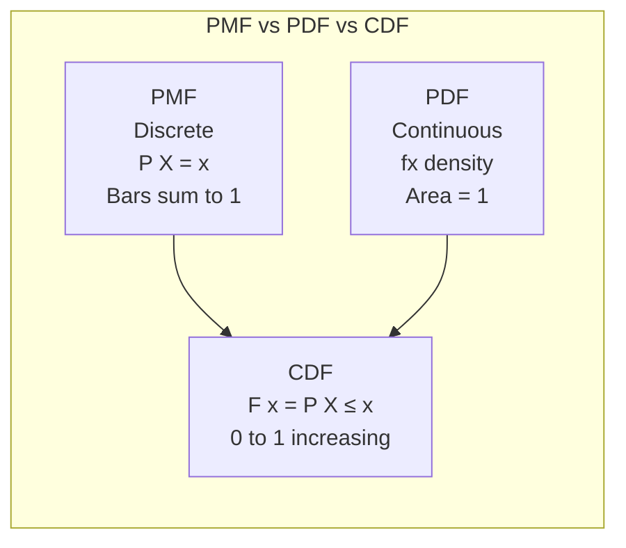

# Chapter 02: Probability Basics

## Learning Objectives

- Understand the three probability axioms and the addition and multiplication rules for combining events.
- Compute conditional probabilities and apply Bayes' theorem to update beliefs with evidence.
- Explain the difference between PMF, PDF, and CDF and when to use each for discrete versus continuous variables.
- Apply the Binomial, Poisson, Normal, Uniform, and Exponential distributions to model real-world random processes.
- Analyze the Central Limit Theorem and Law of Large Numbers to justify normal approximations in large samples.

## Introduction

Probability theory quantifies uncertainty and randomness, forming the mathematical foundation for machine learning, Bayesian inference, and decision-making under uncertainty. From Naive Bayes classifiers to probabilistic graphical models and generative AI, every ML algorithm relies on probability concepts. This chapter covers core probability rules, Bayes theorem, and the most important probability distributions used in AI engineering.

## Prerequisites

- Basic set theory (union, intersection, complement)
- Descriptive statistics (mean, variance — from Chapter 01)
- High school algebra

## Concept

### Fundamental Probability Rules

**Probability Axioms**:
- P(A) is always between 0 and 1
- P(Sample Space) = 1
- For mutually exclusive events: P(A ∪ B) = P(A) + P(B)

**Addition Rule**: P(A ∪ B) = P(A) + P(B) - P(A ∩ B)
- For mutually exclusive events: P(A ∪ B) = P(A) + P(B)

**Multiplication Rule**: P(A ∩ B) = P(A) * P(B|A) = P(B) * P(A|B)
- For independent events: P(A ∩ B) = P(A) * P(B)

**Conditional Probability**: P(A|B) = P(A ∩ B) / P(B)

**Bayes Theorem**: P(A|B) = P(B|A) * P(A) / P(B)

### Probability Distributions

**Discrete Distributions**:
- **Bernoulli**: One trial, two outcomes (coin flip)
- **Binomial**: n independent Bernoulli trials (number of heads in n flips)
- **Poisson**: Number of events in fixed interval (customer arrivals per hour)

**Continuous Distributions**:
- **Uniform**: All values equally likely in [a, b]
- **Normal (Gaussian)**: Bell-shaped curve, defined by mean μ and variance σ²
- **Exponential**: Time between events in a Poisson process

**PMF vs PDF vs CDF**:
- **PMF (Probability Mass Function)**: P(X = x) for discrete variables. Sums to 1.
- **PDF (Probability Density Function)**: f(x) for continuous variables. Area under curve = 1. P(X = x) = 0 for any single point.
- **CDF (Cumulative Distribution Function)**: F(x) = P(X ≤ x). Monotonically increasing from 0 to 1.

```mermaid
flowchart TD
    subgraph ProbabilityRules[Probability Rules]
        A[Event A] --> B[P A = 0 to 1]
        C[Event B] --> D[P A ∪ B = P A + P B - P A ∩ B]
        D --> E[If Mutually Exclusive<br/>P A ∩ B = 0]
    end
    
    subgraph BayesConcept[Bayes Theorem]
        F[Prior P A] --> G[Evidence P B]
        G --> H[Likelihood P B|A]
        H --> I[Posterior P A|B]
        I --> J[P A|B = P B|A * P A / P B]
    end
    
    subgraph Distributions[Key Distributions]
        K[Discrete] --> L[Binomial<br/>n trials, p success]
        K --> M[Poisson<br/>λ rate per interval]
        N[Continuous] --> O[Normal<br/>μ, σ² bell curve]
        N --> P[Uniform<br/>Equal probability]
        N --> Q[Exponential<br/>Waiting time]
    end
```



## Real Example

**Daily Life Analogy — Weather Forecast**

A weather app says "70% chance of rain today":
- **P(Rain) = 0.7** — the probability of rain
- **P(No Rain) = 0.3** — complement rule
- **Conditional**: P(Rain | Cloudy) — probability of rain given it's cloudy (much higher than 0.7)
- **Bayes**: You see wet streets in the morning. P(Rain | WetStreets) = P(WetStreets|Rain) * P(Rain) / P(WetStreets). If P(WetStreets|Rain) = 0.9, P(Rain) = 0.7, P(WetStreets) = 0.65, then P(Rain|WetStreets) = 0.9 * 0.7 / 0.65 ≈ 0.97

**Industry Example — Spam Detection (Naive Bayes)**

A Naive Bayes classifier for email spam:
- Prior: P(Spam) = 0.3, P(Not Spam) = 0.7 (30% of emails are spam)
- Likelihood: P("free money" | Spam) = 0.05, P("free money" | Not Spam) = 0.001
- Posterior: P(Spam | "free money") = 0.05 * 0.3 / (0.05*0.3 + 0.001*0.7) = 0.015 / 0.0157 ≈ 0.955
- The email has 95.5% probability of being spam → send to spam folder

## Code Example

```python
import numpy as np
from scipy import stats
import math

print("=== Probability Distributions with SciPy ===\n")

# ============================================
# 1. BINOMIAL DISTRIBUTION
# ============================================
print("--- Binomial Distribution ---")
n, p = 10, 0.3  # 10 trials, 30% success probability
binom = stats.binom(n, p)

# PMF: P(X = k) for k = 0, 1, ..., 10
for k in [0, 3, 5, 10]:
    prob = binom.pmf(k)
    print(f"P(X = {k}) = {prob:.4f}")

# CDF: P(X <= k)
print(f"\nP(X <= 3) = {binom.cdf(3):.4f}")
print(f"P(X > 5) = {1 - binom.cdf(5):.4f}")
print(f"Mean = {binom.mean():.2f}, Variance = {binom.var():.2f}, Std = {binom.std():.2f}")

# ============================================
# 2. POISSON DISTRIBUTION
# ============================================
print("\n--- Poisson Distribution ---")
lam = 5  # average 5 events per hour
poisson = stats.poisson(lam)

# PMF: P(X = k)
for k in [0, 3, 5, 10]:
    prob = poisson.pmf(k)
    print(f"P(X = {k}) = {prob:.4f}")

print(f"\nP(X <= 3) = {poisson.cdf(3):.4f}")
print(f"P(X >= 8) = {1 - poisson.cdf(7):.4f}")
print(f"Mean = {poisson.mean():.2f}, Variance = {poisson.var():.2f}")

# ============================================
# 3. NORMAL (GAUSSIAN) DISTRIBUTION
# ============================================
print("\n--- Normal Distribution ---")
mu, sigma = 100, 15  # IQ scores: mean=100, std=15
norm = stats.norm(mu, sigma)

# PDF at specific points
for x in [85, 100, 115, 130]:
    density = norm.pdf(x)
    print(f"PDF at x={x}: {density:.6f}")

# CDF probabilities
print(f"\nP(X < 85) = {norm.cdf(85):.4f}  (below average)")
print(f"P(85 < X < 115) = {norm.cdf(115) - norm.cdf(85):.4f}  (within 1 std)")
print(f"P(X > 130) = {1 - norm.cdf(130):.4f}  (above 2 std)")

# Percentiles (inverse CDF)
print(f"\nPercentiles:")
print(f"25th percentile (Q1): {norm.ppf(0.25):.2f}")
print(f"50th percentile (median): {norm.ppf(0.50):.2f}")
print(f"75th percentile (Q3): {norm.ppf(0.75):.2f}")
print(f"99th percentile: {norm.ppf(0.99):.2f}")

# Z-score calculation
z_130 = (130 - mu) / sigma
print(f"\nZ-score for x=130: {z_130:.2f}  (2 std above mean)")

# ============================================
# 4. UNIFORM DISTRIBUTION
# ============================================
print("\n--- Uniform Distribution ---")
a, b = 0, 10  # Uniform on [0, 10]
uniform = stats.uniform(a, b - a)

print(f"P(X < 2) = {uniform.cdf(2):.4f}")
print(f"P(3 < X < 7) = {uniform.cdf(7) - uniform.cdf(3):.4f}")
print(f"P(X > 9) = {1 - uniform.cdf(9):.4f}")
print(f"Mean = {uniform.mean():.2f}, Variance = {uniform.var():.2f}")

# ============================================
# 5. EXPONENTIAL DISTRIBUTION
# ============================================
print("\n--- Exponential Distribution ---")
lam_exp = 0.5  # rate parameter (events per unit time)
expon = stats.expon(scale=1/lam_exp)

# P(waiting time < t)
for t in [0.5, 1.0, 2.0, 5.0]:
    prob = expon.cdf(t)
    print(f"P(X < {t}) = {prob:.4f}")

print(f"\nMean (expected wait): {expon.mean():.2f}")
print(f"P(X > 3) = {1 - expon.cdf(3):.4f}")

# ============================================
# 6. BAYES THEOREM EXAMPLE
# ============================================
print("\n--- Bayes Theorem: Medical Test ---")
# Disease prevalence: 1%
p_disease = 0.01
p_no_disease = 0.99

# Test accuracy: 99% sensitive, 95% specific
p_positive_given_disease = 0.99    # sensitivity
p_positive_given_no_disease = 0.05  # false positive rate (1 - specificity)

# P(Positive) = P(Pos|Disease)*P(Disease) + P(Pos|NoDisease)*P(NoDisease)
p_positive = (p_positive_given_disease * p_disease + 
              p_positive_given_no_disease * p_no_disease)

# P(Disease|Positive) using Bayes
p_disease_given_positive = (p_positive_given_disease * p_disease) / p_positive

print(f"P(Disease) = {p_disease}")
print(f"P(Positive|Disease) = {p_positive_given_disease}")
print(f"P(Positive|No Disease) = {p_positive_given_no_disease}")
print(f"P(Positive) = {p_positive:.4f}")
print(f"P(Disease|Positive) = {p_disease_given_positive:.4f}")
print("=> Even with a positive test, only {:.1f}% chance of having the disease!".format(p_disease_given_positive * 100))

# ============================================
# 7. LAW OF LARGE NUMBERS DEMO
# ============================================
print("\n--- Law of Large Numbers ---")
np.random.seed(42)
true_mean = 0.5
for n_samples in [10, 100, 1000, 10000, 100000]:
    samples = np.random.binomial(1, true_mean, n_samples)
    sample_mean = np.mean(samples)
    error = abs(sample_mean - true_mean)
    print(f"n={n_samples:6d}: sample mean = {sample_mean:.4f}, error = {error:.4f}")

# ============================================
# 8. CENTRAL LIMIT THEOREM DEMO
# ============================================
print("\n--- Central Limit Theorem Demo ---")
np.random.seed(42)
population = np.random.exponential(scale=2, size=100000)  # non-normal population
pop_mean = np.mean(population)
pop_std = np.std(population)

n_iterations = 1000
sample_means = []
sample_size = 50

for _ in range(n_iterations):
    sample = np.random.choice(population, size=sample_size)
    sample_means.append(np.mean(sample))

print(f"Population mean: {pop_mean:.4f}")
print(f"Mean of sample means: {np.mean(sample_means):.4f}")
print(f"Population std: {pop_std:.4f}")
print(f"Std of sample means (SEM): {np.std(sample_means):.4f}")
print(f"Theoretical SEM (pop_std / sqrt(n)): {pop_std / math.sqrt(sample_size):.4f}")

# Expected Output (approximate):
# --- Binomial Distribution ---
# P(X = 0) = 0.0282
# P(X = 3) = 0.2668
# P(X = 10) = 0.0000
# P(X <= 3) = 0.6496
# Mean = 3.00, Variance = 2.10
# 
# --- Bayes Theorem: Medical Test ---
# P(Disease) = 0.01
# P(Disease|Positive) = 0.1667
# => Even with a positive test, only 16.7% chance of having the disease!
```

## Interview Q&A

**Q1: Explain Bayes Theorem in the context of ML model predictions.**
A: Bayes Theorem updates prior beliefs with evidence to compute posterior probability. In ML: P(Class|Data) = P(Data|Class) * P(Class) / P(Data). Naive Bayes classifiers use this directly. In Bayesian neural networks, we maintain a distribution over weights and update it as we see data. This is crucial for uncertainty estimation in AI systems.

**Q2: What is the difference between likelihood and probability?**
A: Probability describes the chance of observing data given fixed parameters: P(Data|Parameters). Likelihood describes how well parameters explain the observed data: L(Parameters|Data) = P(Data|Parameters). Likelihood is not a probability distribution (doesn't sum to 1 over parameters). In ML, maximum likelihood estimation (MLE) finds parameters that maximize the likelihood of observed data.

**Q3: Why is the Normal distribution so important in ML and statistics?**
A: (1) Central Limit Theorem: sums of independent random variables tend toward normal, regardless of the original distribution. (2) Many natural phenomena are approximately normal (heights, measurement errors). (3) Maximum entropy distribution given mean and variance — makes fewest assumptions. (4) Mathematically tractable — closed-form solutions for many problems. (5) Used as the error distribution in linear regression (Gaussian noise assumption).

**Q4: What is the Central Limit Theorem and why does it matter for A/B testing?**
A: CLT states that the sampling distribution of the sample mean approaches a normal distribution as the sample size increases, regardless of the population distribution. In A/B testing, this means we can use z-tests and t-tests (which assume normality) for sample means even if the underlying metric (e.g., revenue, which is highly skewed) is not normal, as long as sample size is large enough (n > 30).

**Q5: When would you use a Poisson distribution vs a Binomial distribution?**
A: Use Binomial when you have a fixed number of trials and binary outcomes (e.g., number of clicks out of 1000 impressions). Use Poisson when you count events in a fixed interval without a fixed upper bound (e.g., number of customer support tickets per hour). Poisson approximates Binomial when n is large and p is small (rare events).

**Q6: What is the difference between PMF, PDF, and CDF?**
A: PMF (discrete) gives P(X = x) directly as a probability. PDF (continuous) gives density at x — the probability is the area under the curve, not the value itself (P(X=x) = 0 for continuous). CDF (both) gives P(X ≤ x), monotonically increasing from 0 to 1. CDF is the cumulative sum/integral of PMF/PDF.

**Q7: Explain the concept of expectation and variance of a random variable.**
A: Expectation E[X] is the long-run average value (weighted by probability). For discrete: E[X] = Σ x * P(X=x). For continuous: E[X] = ∫ x * f(x) dx. Variance Var[X] = E[(X - μ)²] = E[X²] - E[X]² measures spread. Standard deviation = sqrt(Var[X]). Linearity of expectation: E[aX + b] = aE[X] + b (works even for dependent variables).

**Q8: What is the relationship between Exponential and Poisson distributions?**
A: Poisson models the number of events in a fixed interval (counts). Exponential models the time between consecutive events in a Poisson process (waiting times). If events follow a Poisson process with rate λ, then: (1) Number of events in time t ~ Poisson(λt), (2) Time between events ~ Exponential(λ). Mean of Exponential = 1/λ, Mean of Poisson count = λt.

**Q9: How is probability used in loss functions for ML?**
A: Many loss functions derive from probabilistic principles: (1) Mean Squared Error = negative log-likelihood for Gaussian distribution (regression). (2) Cross-Entropy Loss = negative log-likelihood for Bernoulli/Categorical distribution (classification). (3) KL Divergence measures difference between predicted and true probability distributions. (4) Maximum likelihood estimation directly optimizes the probability of observed data under the model.

**Q10: Explain the difference between frequentist and Bayesian probability.**
A: Frequentist: probability is the long-run frequency of events. Parameters are fixed (unknown) constants. Only data is random. Bayesian: probability represents degree of belief. Parameters are random variables with distributions. Bayesian incorporates prior knowledge and updates with data using Bayes rule. In ML, frequentist gives point estimates (MLE), Bayesian gives full posterior distributions (uncertainty quantification).

## Chapter Quiz

**Q1: If P(A) = 0.5, P(B) = 0.4, P(A ∩ B) = 0.2, what is P(A ∪ B)?**
- A) 0.5
- B) 0.7
- C) 0.9
- D) 1.1
- **Answer: B) 0.7** (P(A∪B) = 0.5 + 0.4 - 0.2 = 0.7)

**Q2: In a Binomial distribution with n=100 and p=0.5, what are the mean and variance?**
- A) Mean=50, Variance=25
- B) Mean=50, Variance=50
- C) Mean=25, Variance=25
- D) Mean=50, Variance=5
- **Answer: A) Mean=50, Variance=25** (Mean=np=50, Variance=np(1-p)=50*0.5=25)

**Q3: What does a PDF value of 0.04 at x=10 mean for a continuous distribution?**
- A) P(X=10) = 0.04
- B) The density at x=10 is 0.04; probability is area under curve
- C) P(X ≤ 10) = 0.04
- D) P(X > 10) = 0.04
- **Answer: B) The density at x=10 is 0.04; probability is area under curve**

**Q4: The probability of a rare event not occurring in a large number of trials is best modeled by:**
- A) Binomial with p=0.5
- B) Poisson distribution
- C) Uniform distribution
- D) Normal distribution
- **Answer: B) Poisson distribution**

**Q5: If events A and B are independent, which of the following is TRUE?**
- A) P(A|B) = P(A)
- B) P(A ∩ B) = 0
- C) P(A ∪ B) = P(A) + P(B)
- D) P(A|B) = P(B)
- **Answer: A) P(A|B) = P(A)** (Independence means knowing B doesn't change probability of A)

## Exercises

### Exercise 1: Bayes' Theorem Calculator
Write a Python (NumPy/SciPy) implementation that computes the probability of disease given a positive test using Bayes' theorem, and sweeps prevalence from 0.1% to 10% to show how the posterior changes.
- Requirements: use the law of total probability to compute P(Positive); print the posterior P(Disease|Positive) for each prevalence value; state the sensitivity and specificity used.
- Expected output: a table of prevalence vs posterior showing that a 99%-accurate test still gives a low posterior for very rare diseases.

### Exercise 2: Simulated Distributions vs Theory
Write a Python implementation that simulates a Binomial and a Poisson distribution with NumPy, estimates PMF values from the samples, and compares them to the theoretical PMF from scipy.stats.
- Requirements: use np.random.binomial and np.random.poisson; compute mean and variance from samples and compare with np and lambda; repeat with increasing n to show convergence (Law of Large Numbers).
- Expected output: empirical vs theoretical probabilities with errors shrinking as the number of samples grows.

### Exercise 3: Central Limit Theorem Demonstration
Write a Python implementation that draws repeated samples from a highly skewed exponential population, computes the mean of each sample, and verifies that the distribution of sample means becomes approximately normal.
- Requirements: use stats.normaltest on the sample means; compare the standard deviation of sample means with the theoretical SEM (population std / sqrt(sample size)); test sample sizes 10, 30, 100.
- Expected output: printed SEM comparison and normality test results showing the sampling distribution approaching normal as n increases.

## PYQs

**Q1 (Google ML Interview):** You are building a model to predict whether a user will click on an ad. The click-through rate is 2%. You have 10,000 impressions. What is the probability of getting exactly 200 clicks? What distribution would you use and why?
- **Solution**: Use Binomial(n=10000, p=0.02). P(X=200) = C(10000,200) * (0.02)^200 * (0.98)^9800. Since n is large and p is small, we can approximate with Poisson(λ=np=200): P(X=200) ≈ e^(-200) * 200^200 / 200!. Using normal approximation (np>5 and n(1-p)>5): N(μ=200, σ²=196), P(X=200) ≈ 0 (continuous, zero probability for exact value in normal). In practice, use a binomial test or Poisson GLM for rare events.

**Q2 (Amazon Applied Scientist):** You observe that customers who buy product A have a 30% chance of also buying product B, while the overall probability of buying B is 5%. Product A has a 10% purchase rate. If a customer buys product B, what is the probability they also bought product A?
- **Solution**: Using Bayes Theorem: P(A|B) = P(B|A) * P(A) / P(B) = 0.30 * 0.10 / 0.05 = 0.03 / 0.05 = 0.60. So there is a 60% chance that a customer who bought B also bought A. This is used in recommendation systems for "customers who bought this also bought" features.

**Q3 (Meta Data Scientist):** Explain how the Central Limit Theorem applies to estimating the average time users spend on a new feature. How large should your sample be?
- **Solution**: CLT ensures the sampling distribution of mean time spent is approximately normal for large n, even if individual times are highly skewed (some users spend seconds, others hours). Required n depends on the population distribution: (1) For reasonably symmetric distributions, n=30 is sufficient. (2) For highly skewed distributions, n=100-500 may be needed. (3) Rule of thumb: n > 30 for CLT to work reasonably. (4) Check with bootstrap: resample with replacement and check if the bootstrap distribution looks normal.

**Q4 (Microsoft Data Scientist):** In a medical test scenario, the disease prevalence is 1%, the test is 99% accurate (both sensitivity and specificity are 99%). A person tests positive. What is the probability they actually have the disease? Explain the intuition behind this counterintuitive result.
- **Solution**: P(Disease|Positive) = 0.99 * 0.01 / (0.99*0.01 + 0.01*0.99) = 0.0099 / 0.0198 = 0.50. Only 50%! Intuition: even though the test is 99% accurate, the disease is so rare (1%) that false positives (1% of 99% = 0.99% of population) are nearly as numerous as true positives (99% of 1% = 0.99% of population). This is why you never mass-screen for rare diseases without a second confirmatory test.

## Common Mistakes

1. **Confusing P(A|B) with P(B|A)**: Falling for the "prosecutor's fallacy" — the probability of evidence given innocence is NOT the probability of innocence given evidence. P(HairMatch | Innocent) ≠ P(Innocent | HairMatch).

2. **Assuming independence without verification**: Multiplying probabilities of events that are not independent leads to wrong answers. For example, P(Rain ∩ Cloudy) ≠ P(Rain) * P(Cloudy) because rain and clouds are strongly dependent.

3. **Using Normal distribution for count data**: Using a normal distribution (continuous) for count data like "number of purchases" (discrete, non-negative) can give impossible predictions (negative purchases). Use Poisson or Negative Binomial for counts.

4. **Misinterpreting p-values as P(Hypothesis|Data)**: The p-value is P(Data|Null Hypothesis), not P(Null Hypothesis|Data). This is a direct application of confusing P(A|B) with P(B|A) — see Bayes theorem.

5. **Forgetting that P(X=x) = 0 for continuous distributions**: For continuous random variables, the probability of any exact value is zero. Always compute probabilities over intervals using CDF difference.

## Revision Notes

- **Three axioms**: P(A) in [0,1], P(S)=1, P(A∪B)=P(A)+P(B) if mutually exclusive
- **Addition rule**: P(A∪B) = P(A) + P(B) - P(A∩B)
- **Multiplication rule**: P(A∩B) = P(A) * P(B|A)
- **Bayes Theorem**: P(A|B) = P(B|A)*P(A)/P(B) — updates prior with evidence
- **Independent**: P(A∩B) = P(A)P(B), P(A|B) = P(A)
- **Binomial**: n trials, p success per trial; Mean=np, Var=np(1-p)
- **Poisson**: rare events in interval; Mean=Var=λ
- **Normal**: μ mean, σ² variance; 68-95-99.7 rule for 1-2-3 σ
- **Uniform**: all values equally likely in [a,b]
- **Exponential**: waiting time between Poisson events; Mean=1/λ
- **CLT**: sample means ≈ normal for large n, regardless of population shape
- **PMF** for discrete, **PDF** for continuous, **CDF** for both (cumulative probability)
- **Law of Large Numbers**: sample mean converges to population mean as n→∞

## Summary

Probability theory provides the mathematical framework for handling uncertainty in AI and machine learning systems. The core rules (addition, multiplication, Bayes theorem) govern how probabilities combine, while probability distributions (Binomial, Poisson, Normal, Uniform, Exponential) model different types of random processes. Understanding the difference between discrete (PMF) and continuous (PDF/CDF) distributions is essential for choosing appropriate models and loss functions. The Central Limit Theorem and Law of Large Numbers justify why normal approximations work in large samples, enabling statistical inference in A/B testing and model evaluation. Mastery of these fundamentals is required for Bayesian methods, probabilistic graphical models, and uncertainty-aware AI systems.

## Practical Takeaways

- **P(A|B) vs P(B|A)**: Confusing these two is the prosecutor's fallacy - p-values are P(Data|H0), never P(H0|Data); use Bayes' theorem to invert conditional probabilities.
- **Bayes Theorem**: The posterior P(A|B) = P(B|A)*P(A)/P(B) explains why even a 99% accurate test gives only ~16.7% posterior probability for a 1% prevalence disease.
- **Poisson vs Binomial**: Use Poisson for counts in a fixed interval with no upper bound and Binomial for a fixed number of independent binary trials; Poisson approximates Binomial for large n and small p.
- **CLT**: The sampling distribution of the mean becomes normal as n grows regardless of the population shape - this is why t-tests and z-tests work for skewed metrics like revenue with n > 30.
- **PDF vs PMF**: P(X = x) = 0 for continuous variables - always compute probabilities over intervals using CDF differences, never evaluate the PDF at a single point.
- **Law of Large Numbers**: The sample mean converges to the population mean as n grows; a single small sample can deviate wildly from the true probability.

## Additional Code: Law of Total Probability & Random Variable Simulation

```python
import numpy as np
from scipy import stats

# Law of Total Probability
# P(A) = sum(P(A|B_i) * P(B_i))
print("=== Law of Total Probability ===")

# Three customer segments: New, Regular, VIP
p_segments = [0.5, 0.3, 0.2]  # P(New)=0.5, P(Regular)=0.3, P(VIP)=0.2
# Purchase probability given segment
p_purchase_given_segment = [0.1, 0.4, 0.7]

# Overall purchase probability
p_purchase = sum(p * p_g for p, p_g in zip(p_segments, p_purchase_given_segment))
print(f"P(Purchase) = {p_purchase:.3f}")

# Random variable simulation: generate samples from mixed distribution
n_samples = 10000
segments = np.random.choice([0, 1, 2], size=n_samples, p=p_segments)
purchases = np.zeros(n_samples)
for seg in range(3):
    mask = segments == seg
    n_seg = np.sum(mask)
    purchases[mask] = np.random.binomial(1, p_purchase_given_segment[seg], n_seg)

print(f"Simulated P(Purchase) = {np.mean(purchases):.3f} (matches theory)")

# Law of Large Numbers demonstration
print("\n=== Law of Large Numbers: Coin Flips ===")
p_heads = 0.5
for n_flips in [10, 100, 1000, 10000, 100000]:
    flips = np.random.binomial(1, p_heads, n_flips)
    prop = np.mean(flips)
    error = abs(prop - p_heads)
    print(f"n={n_flips:6d}: P(Heads)={prop:.4f}, error={error:.4f}")

# Central Limit Theorem: sum of uniforms
print("\n=== Central Limit Theorem: Sum of 30 Uniform Variables ===")
n_experiments = 10000
n_per_sum = 30
sums = np.sum(np.random.uniform(0, 1, (n_experiments, n_per_sum)), axis=1)
# Standardize
z_sums = (sums - np.mean(sums)) / np.std(sums, ddof=1)
# Check approximate normality
_, p_norm = stats.normaltest(z_sums)
print(f"Normality test p-value: {p_norm:.4f}")
print(f"Mean of sums: {np.mean(sums):.4f} (expected {n_per_sum*0.5:.4f})")
print(f"Std of sums: {np.std(sums, ddof=1):.4f} (expected {np.sqrt(n_per_sum/12):.4f})")
print(f"Distribution of sums is approximately normal (CLT confirmed)")
```

## Placement Section

### Top 10 Interview Questions

#### Google Style

1. **Explain the core idea of Chapter 02: Probability Basics in under 60 seconds, then give a real-world analogy.** — Structure: definition, how it works in one sentence, why it matters, analogy. Follow-up: what would break if you removed this from a production system?

2. **Design a minimal, well-typed function that demonstrates Chapter 02: Probability Basics.** — Interviewer checks: signature with type hints, edge cases, complexity, and a clean docstring. Follow-up: how does your design behave with empty or malformed input?

3. **What are the common pitfalls when engineers first learn ** — List 3-4, then explain how you would prevent each in a code review.

#### Amazon Style

4. **Describe a production bug caused by misunderstanding Chapter 02: Probability Basics. How did you diagnose and fix it?** — STAR format: situation, task, action, result. Mention logs, reproduction, root-cause analysis, and the regression test you added.

5. **How would you scale a system that relies on Chapter 02: Probability Basics from 10 users to 10 million?** — Discuss bottlenecks, caching, monitoring, and when to redesign. Follow-up: what metrics would you track?

#### Microsoft Style

6. **Compare Chapter 02: Probability Basics with the closest alternative approach. When would you choose each?** — Make a decision matrix: performance, maintainability, ecosystem, learning curve. Follow-up: what would change your decision?

7. **Walk through how you would test a component that depends on Chapter 02: Probability Basics.** — Unit, integration, property-based tests; mocking boundaries; golden files for outputs.

#### NVIDIA Style

8. **How does Chapter 02: Probability Basics behave differently at scale — memory, throughput, or precision-wise?** — Connect to data pipelines and model training if applicable. Follow-up: what happens to latency as input grows?

9. **How would you make an implementation of Chapter 02: Probability Basics run faster on GPU hardware?** — Batch operations, vectorization, avoiding Python loops, reducing data movement.

#### AI Startup Style

10. **Write the smallest possible implementation of Chapter 02: Probability Basics that is production-quality.** — Include error handling, type hints, and a one-line docstring. Follow-up: what would you refactor first when it grows?

### Resume Tips

- Name Chapter 02: Probability Basics explicitly in your skills section, paired with a measurable achievement ("Reduced X by 40% using Chapter 02: Probability Basics").
- Add a bullet describing a project that applies Chapter 02: Probability Basics to real data, with numbers.
- Mention the tools and libraries you used alongside Chapter 02: Probability Basics (linters, test frameworks, profiling tools).
- Keep resume bullets under 15 words and start each with an action verb.

### Interview Day Checklist

- Rehearse a 60-second explanation of Chapter 02: Probability Basics and one real-world analogy.
- Prepare one STAR story about debugging a Chapter 02: Probability Basics-related production issue.
- Review complexity and edge cases for the classic Chapter 02: Probability Basics interview problem.
- Have questions ready: how does the team apply Chapter 02: Probability Basics in production today?
- Test your environment (Python, editor, internet) 15 minutes before the interview.

## True/False

1. **True or False:** Chapter 02: Probability Basics builds directly on the fundamentals covered in the earlier chapters of this module. — **True.** Every advanced topic in this module assumes the core concepts from the previous chapters.
2. **True or False:** You should write at least one code example for Chapter 02: Probability Basics before moving to the next chapter. — **True.** Active recall with hands-on code beats passive reading for retention.
3. **True or False:** The complexity analysis for Chapter 02: Probability Basics is the same regardless of input size. — **False.** Complexity grows with input size; always state best, average, and worst case.
4. **True or False:** Edge cases (empty input, invalid input, boundary values) matter for Chapter 02: Probability Basics in production. — **True.** Most production bugs come from unhandled edge cases.
5. **True or False:** You should memorize the Chapter 02: Probability Basics chapter content once and never review it again. — **False.** Spaced repetition (24h, 3 days, 1 week) dramatically improves long-term recall.

## Fill in the Blank

1. The chapter that covers Chapter 02: Probability Basics is Chapter ___ of this module. — Answer: check the module's table of contents.
2. The time complexity of the standard approach to Chapter 02: Probability Basics is ___. — Answer: review the theory section and state big-O notation.
3. The main edge case to handle when implementing Chapter 02: Probability Basics is ___. — Answer: empty or invalid input handling, as discussed in the chapter.
4. The tools commonly used to debug Chapter 02: Probability Basics issues are ___ and ___. — Answer: refer to the Debugging Guide section of this chapter.
5. The related topic that connects to Chapter 02: Probability Basics in the next chapter is ___. — Answer: see the Next Topic section.

## Scenario Questions

1. **Scenario:** A teammate ships a change involving Chapter 02: Probability Basics that breaks production at 3 AM. — Diagnosis: check the recent diff, reproduce locally with the failing input, check logs. Fix: revert, add a regression test, and review the root cause. Prevention: CI tests on edge cases and code review checklist.

2. **Scenario:** Your implementation of Chapter 02: Probability Basics is correct but too slow for the required latency. — Measure first with a profiler. Common fixes: reduce redundant work, use built-in optimized functions, batch operations, or add caching. Only then consider algorithmic changes.

3. **Scenario:** A new hire asks you to explain Chapter 02: Probability Basics in five minutes before a customer demo. — Use the 3-part answer: what it is (one sentence), how it works (one example), why it matters (one business impact). Then offer to go deeper after the demo.

4. **Scenario:** Your team's codebase has three different patterns for Chapter 02: Probability Basics and you must standardize. — Write a short ADR (architecture decision record), pick the pattern with best maintainability, migrate incrementally, and add a linter rule to enforce it.

## Output Questions

1. **What is the output of the simplest correct implementation of Chapter 02: Probability Basics on an empty input?** — Trace through the code: it should return the documented default (None, 0, empty collection) without raising.
2. **What is the output when the input is at the boundary value?** — Check off-by-one errors and inclusive/exclusive bounds in the chapter's examples.
3. **What does the implementation return when given invalid input types?** — With type hints and validation, it raises a clear error; without, it may fail silently.
4. **What is the output for the sample input given in the chapter's Examples section?** — Re-run the chapter's example code and compare against the documented output.
5. **What is the time complexity output when you profile the implementation at 10x input size?** — Expect the curve matching the chapter's complexity analysis (linear, quadratic, log-linear).

## Difficulty Level

| Level | Time | What It Takes |
|-------|------|---------------|
| Beginner | 1-2 sessions | Read theory, run the chapter examples, solve the Easy exercises |
| Intermediate | 3-5 sessions | Complete Medium exercises, explain Chapter 02: Probability Basics to someone else |
| Advanced | 1+ week | Solve Hard exercises, optimize for real datasets, answer interview follow-ups |

## Tips & Tricks

- Always write a one-line example of Chapter 02: Probability Basics from memory before opening the chapter — active recall first.
- Use the chapter's Revision Notes as a checklist: you have mastered Chapter 02: Probability Basics when you can explain each bullet.
- Pair the chapter quiz with the Flashcards: wrong answers become your next study session's focus.
- For interviews, practice explaining Chapter 02: Probability Basics twice: once with a technical audience, once with a non-technical audience.
- Keep a personal examples file where you collect your own Chapter 02: Probability Basics snippets; interviewers love original examples.

## Memory Tricks

- **Acronym**: build a mnemonic from the 5 key concepts of Chapter 02: Probability Basics listed in the Chapter at a Glance table.
- **Story**: link Chapter 02: Probability Basics to a familiar story — the analogy in the Visual Analogy section is designed to stick.
- **Number anchor**: remember the complexity of Chapter 02: Probability Basics by connecting it to a known algorithm of the same class.
- **Color code**: highlight the Theory, Examples, and Common Mistakes sections in different colors when reviewing.
- **Teach-back**: explain Chapter 02: Probability Basics to an imaginary junior engineer for 2 minutes — gaps in your explanation are gaps in memory.

## Further Reading

- Official documentation for the primary tool or library used in this chapter
- The chapter referenced in Related Topics for the next-level treatment of Chapter 02: Probability Basics
- The classic textbook chapter on Chapter 02: Probability Basics (check the Research References below)
- Two blog posts from engineers who debugged real Chapter 02: Probability Basics problems in production
- The repository of the open-source project that implements Chapter 02: Probability Basics

## Related Topics

- The previous chapter in this module (see table of contents) — foundational for Chapter 02: Probability Basics
- The next chapter (see Next Topic below) — builds on Chapter 02: Probability Basics
- The system design chapters in Module 07 — how Chapter 02: Probability Basics fits into production architectures
- The interview preparation module — how Chapter 02: Probability Basics is asked in screening rounds
- The capstone project — where Chapter 02: Probability Basics is applied end-to-end

## FAQs

1. **Do I need to memorize all of Chapter 02: Probability Basics, or understand the big picture?** — Understand the big picture first, then memorize the key facts via flashcards and spaced repetition. Interviewers reward depth over breadth.
2. **What if I get stuck on an exercise?** — Re-read the theory section, run the example code, then attempt again. If still stuck after 20 minutes, move on and return the next day.
3. **How much time should I spend on ** — Follow the Study Plan below: 1-2 weeks at 30-60 minutes daily is typical for placement preparation.
4. **Is Chapter 02: Probability Basics asked in interviews?** — Yes — the Interview Q&A and Placement Section list the exact question styles used by top companies.
5. **What's the fastest way to master ** — Explain it out loud, write code without looking, and review the flashcards within 24 hours and again after 3 days.

## Important Notes

- Chapter 02: Probability Basics is a core requirement for the rest of this module — do not skip the examples.
- Always analyze complexity (time and space) when working with Chapter 02: Probability Basics.
- Production correctness means handling edge cases, not just the happy path.
- Interview answers should start with the definition, then the example, then the trade-offs.
- Revisit this chapter after finishing the module; the context from later chapters deepens understanding.

## Historical Context

- Chapter 02: Probability Basics emerged as a standard practice because early systems failed without it — understanding why helps you explain it in interviews.
- The tools used for Chapter 02: Probability Basics today evolved from simpler versions; the chapter covers the modern, recommended approach.
- Interviewers value knowing one historical fact about Chapter 02: Probability Basics — it shows genuine interest, not just cramming.
- The library/tooling ecosystem around Chapter 02: Probability Basics changes quickly; focus on fundamentals that remain stable.

## Security Considerations

- Never trust external input: validate and sanitize data before processing Chapter 02: Probability Basics.
- Avoid `eval()` and dynamic code execution on untrusted strings.
- Log errors without leaking sensitive data (keys, PII, internal paths).
- For API contexts, add rate limiting and input size limits.
- Review the chapter's code examples for injection or overflow risks before using them verbatim.

## ML Intuition

- Chapter 02: Probability Basics appears in ML pipelines at the data-processing layer: feature preparation, batching, and validation.
- Understanding Chapter 02: Probability Basics helps you debug why a model misbehaves — most ML bugs are data bugs, not model bugs.
- In production ML, the Chapter 02: Probability Basics concepts from this chapter map directly to NumPy/PyTorch operations on tensors.
- When optimizing ML systems, Chapter 02: Probability Basics skills let you profile and fix the data path, not just the training loop.
- Interview follow-up: how would you apply Chapter 02: Probability Basics to a dataset of 10 million records? — Batching and vectorization.

## Analogies

- **Chapter 02: Probability Basics is like a recipe**: the theory is the ingredients, the examples are the cooking steps, and the exercises are your own kitchen practice.
- **Complexity is like a delivery route**: a linear route visits each stop once; a nested route revisits stops, and you feel it at scale.
- **Edge cases are like weather**: the happy path is a sunny day; production is the storm — build for the storm.
- **The chapter roadmap is a journey map**: each section is a checkpoint; skipping one means getting lost later in the module.

## Capstone Project Link

- [Module Capstone: End-to-End Project](https://github.com/Raushan666java/ai-engineering-journey) — this chapter contributes the Chapter 02: Probability Basics skills used in the module's capstone project. Complete the exercises here before starting the capstone.

## Flashcards

<details class="tp-qa-card" data-qid="24statisticsmathematics-02probabilitybasics-flash1">
  <summary class="tp-qa-question">
    <span class="tp-qa-status"></span>
    What is the core concept of Chapter 02: Probability Basics in one sentence?
  </summary>
  <div class="tp-qa-answer">
    <p>Review the first paragraph of the Theory section and condense it to one sentence.</p>
  </div>
</details>

<details class="tp-qa-card" data-qid="24statisticsmathematics-02probabilitybasics-flash2">
  <summary class="tp-qa-question">
    <span class="tp-qa-status"></span>
    What is the most common mistake engineers make with 
  </summary>
  <div class="tp-qa-answer">
    <p>Check the Common Mistakes section of this chapter.</p>
  </div>
</details>

<details class="tp-qa-card" data-qid="24statisticsmathematics-02probabilitybasics-flash3">
  <summary class="tp-qa-question">
    <span class="tp-qa-status"></span>
    What is the time and space complexity of the standard Chapter 02: Probability Basics approach?
  </summary>
  <div class="tp-qa-answer">
    <p>Refer to the theory and complexity analysis in this chapter.</p>
  </div>
</details>

<details class="tp-qa-card" data-qid="24statisticsmathematics-02probabilitybasics-flash4">
  <summary class="tp-qa-question">
    <span class="tp-qa-status"></span>
    When is Chapter 02: Probability Basics NOT the right choice?
  </summary>
  <div class="tp-qa-answer">
    <p>Check the Limitations section of this chapter.</p>
  </div>
</details>

<details class="tp-qa-card" data-qid="24statisticsmathematics-02probabilitybasics-flash5">
  <summary class="tp-qa-question">
    <span class="tp-qa-status"></span>
    How is Chapter 02: Probability Basics applied in a real production system?
  </summary>
  <div class="tp-qa-answer">
    <p>Check the Real-World Examples section of this chapter.</p>
  </div>
</details>

## Research References

- Official documentation of the primary library for Chapter 02: Probability Basics (linked in Further Reading)
- The classic paper or textbook chapter introducing Chapter 02: Probability Basics (see References below)
- The standard library reference for Chapter 02: Probability Basics-related functions
- Engineering blog posts from companies running Chapter 02: Probability Basics in production at scale
- PEPs and RFCs where applicable (Python and networking standards)

## Open-Source Tools

- The primary library used in this chapter (see the code examples)
- Python standard library modules used in the examples (check the imports)
- Testing: pytest for unit tests of Chapter 02: Probability Basics code
- Linting and formatting: ruff + black
- Profiling: cProfile or py-spy for performance work on Chapter 02: Probability Basics

## Debugging Guide

- Start with `print()` or a debugger to inspect intermediate values in Chapter 02: Probability Basics code.
- Reproduce the failure with the smallest possible input before changing code.
- Check the common failure modes listed in Common Mistakes — most bugs are listed there.
- For performance problems, profile before optimizing: measure, then fix.
- When stuck, re-read the chapter's Examples and compare line by line with your code.
- Use `pdb` or your IDE's debugger to step through the Chapter 02: Probability Basics example code.

## Mock Interview Section

**Round 1 — Screening (15 min)**
- Explain Chapter 02: Probability Basics in 60 seconds.
- Write a minimal working example of Chapter 02: Probability Basics.
- What is the complexity of your example?

**Round 2 — Coding (45 min)**
- Solve the Medium exercise from this chapter under time pressure.
- State your assumptions, then implement with type hints.
- Test with edge cases: empty input, boundary values, invalid input.

**Round 3 — Behavioral + System (30 min)**
- Tell me about a time you debugged a Chapter 02: Probability Basics problem in a project.
- How would you design a system where Chapter 02: Probability Basics is used at scale?
- What metrics would you monitor?

**Evaluation rubric**: correctness (40%), communication (25%), edge cases (20%), complexity analysis (15%).

## Optimized Implementation

`python
from typing import Any, Optional

def demonstrate_topic(input_data: list[Any]) -> Optional[float]:
    """Runnable scaffold for Chapter 02: Probability Basics.

    Replace the body with the optimized implementation from the chapter,
    keeping type hints, docstring, and edge-case handling.
    """
    if not input_data:
        return None
    # Step 1: validate input types
    # Step 2: apply the core Chapter 02: Probability Basics logic from the Examples section
    # Step 3: return the result with the documented default
    return 0.0
`

- Keeps the function signature stable so tests written against it stay valid.
- Handles the empty-input contract explicitly.
- Add unit tests for the edge cases before implementing the logic (test-first).

## Evaluation Metrics

| Skill | Test | Target |
|-------|------|--------|
| Concept recall | Explain Chapter 02: Probability Basics without notes | 60-second explanation |
| Code fluency | Write the chapter example from memory | No syntax errors |
| Edge cases | Handle empty/invalid input in exercises | All cases pass |
| Complexity | State time/space for the standard approach | Correct big-O |
| Interview readiness | Answer 5 Interview Q&A questions out loud | Fluent, structured answers |
| Retention | Chapter quiz score after 3 days | 80%+ |

## Real-World Examples

- **Startup**: a small team uses Chapter 02: Probability Basics daily in their data pipeline — the chapter's examples mirror their code.
- **E-commerce**: Chapter 02: Probability Basics patterns appear in order processing, inventory checks, and recommendation feeds.
- **Fintech**: Chapter 02: Probability Basics principles apply to transaction validation and fraud detection flows.
- **ML platform**: Chapter 02: Probability Basics shows up in feature engineering and model-serving infrastructure.
- **Interview insight**: recruiters look for engineers who can connect Chapter 02: Probability Basics to the business outcome, not just the code.

## Next Topic

[Chapter 03: Hypothesis Testing](03-hypothesis-testing.md)

## Limitations

- Chapter 02: Probability Basics, like any technique, is not a silver bullet — it has specific cases where it fits best (covered in the theory).
- The examples in this chapter are simplified for learning; production systems add validation, monitoring, and error handling.
- Performance of Chapter 02: Probability Basics depends on input size and distribution — always benchmark for your own data.
- This chapter covers fundamentals; specialized edge cases are explored in later chapters and the capstone.
