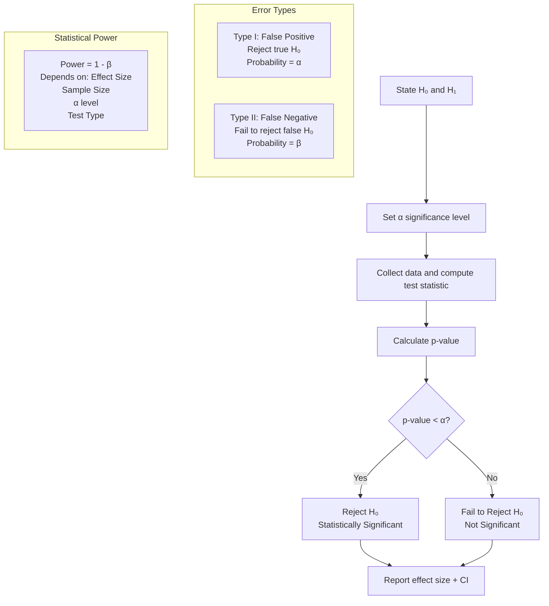
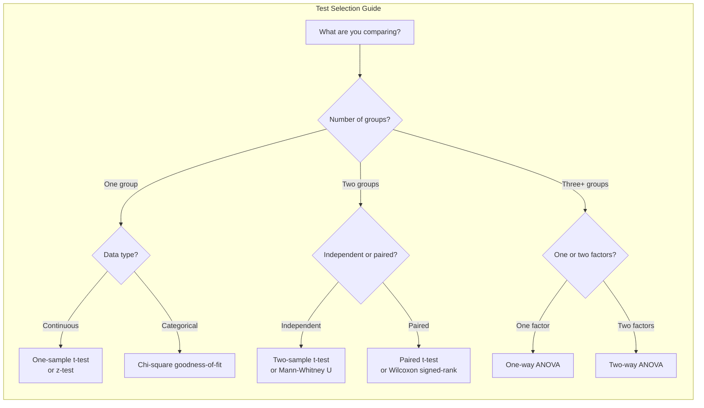

# Chapter 03: Hypothesis Testing

## Learning Objectives

- Understand the hypothesis testing framework: null and alternative hypotheses, significance level alpha, and the p-value decision rule.
- Explain the difference between Type I and Type II errors and how power (1 - beta) depends on effect size and sample size.
- Compute and interpret t-tests (one-sample, two-sample, paired), z-tests, chi-square tests, and ANOVA using SciPy.
- Apply confidence intervals to determine statistical significance by checking whether the null value lies inside the interval.
- Analyze results by distinguishing statistical significance from practical significance and applying multiple testing corrections.

## Introduction

Hypothesis testing is a statistical framework for making data-driven decisions under uncertainty, answering questions like "Is this new ML model truly better than the baseline?" or "Does this feature actually improve user engagement?" As an AI engineer, you will use hypothesis testing daily to validate model improvements, compare algorithms, and assess feature importance. This chapter covers all major hypothesis tests with Python implementations and practical interpretation.

## Prerequisites

- Probability basics (random variables, distributions — Chapter 02)
- Normal distribution properties
- Basic understanding of sampling

## Concept

### The Hypothesis Testing Framework

**Step 1**: State the hypotheses
- **Null Hypothesis (H₀)**: No effect, no difference, status quo (e.g., new model accuracy = baseline accuracy)
- **Alternative Hypothesis (H₁ or Ha)**: There is an effect/difference (e.g., new model accuracy > baseline accuracy)

**Step 2**: Choose significance level (α)
- Typically α = 0.05 (5% chance of false positive)
- Common values: 0.01, 0.05, 0.10

**Step 3**: Choose test statistic and compute it

**Step 4**: Compute p-value

**Step 5**: Make decision
- If p-value < α: Reject H₀ (statistically significant result)
- If p-value ≥ α: Fail to reject H₀ (not statistically significant)

### Type I and Type II Errors

| Decision | H₀ True | H₀ False |
|----------|---------|----------|
| Reject H₀ | Type I Error (False Positive) α | Correct Decision (True Positive) |
| Fail to Reject H₀ | Correct Decision (True Negative) | Type II Error (False Negative) β |

- **Type I Error (α)**: Rejecting a true null hypothesis. "False alarm."
- **Type II Error (β)**: Failing to reject a false null hypothesis. "Miss."
- **Power** = 1 - β: Probability of correctly rejecting a false null hypothesis.

### Key Statistical Tests

**t-Test**: Compares means when population standard deviation is unknown.
- One-sample: Compare sample mean to known value
- Two-sample (independent): Compare means of two independent groups
- Paired: Compare means of same group at two time points

**z-Test**: Compares means when population standard deviation is known (or n is very large).

**Chi-Square Test**: Tests association between categorical variables.
- Goodness-of-fit: Does observed distribution match expected?
- Independence: Are two categorical variables independent?

**ANOVA (Analysis of Variance)**: Compares means of three or more groups.
- One-way: One factor, multiple groups
- Two-way: Two factors, multiple groups

**Confidence Intervals**: Range that contains the true population parameter with a certain confidence level (e.g., 95% CI).





## Real Example

**Daily Life Analogy — Coffee Delivery Time**

You claim a new coffee shop delivers faster than your current one (25 min average).

- **H₀**: New shop mean delivery time = 25 minutes
- **H₁**: New shop mean delivery time < 25 minutes (one-tailed)
- **α**: 0.05
- You order 20 times, get sample mean = 22 min, sample std = 4 min
- **t-statistic**: (22-25)/(4/√20) = -3/0.894 = -3.35
- **p-value**: 0.0017
- Since p < 0.05: Reject H₀. New coffee shop is genuinely faster!

If p-value were 0.08: Fail to reject H₀. The 3-minute difference could be due to random chance.

**Industry Example — Model A/B Test**

Your team developed a new recommendation algorithm. You want to prove it improves CTR.

- **H₀**: CTR_new — CTR_old = 0
- **H₁**: CTR_new — CTR_old > 0
- **α**: 0.01 (conservative, since deploying is expensive)
- **Power analysis**: How many users per group to detect a 0.5% lift?
- You run the test for 2 weeks with 50,000 users per group
- **Result**: New CTR = 3.2%, Old CTR = 3.0%, p = 0.003
- **Conclusion**: Reject H₀. Deploy new model (but monitor for degradation)

## Code Example

```python
import numpy as np
from scipy import stats
import math

np.random.seed(42)
print("=== Hypothesis Testing with SciPy ===\n")

# ============================================
# 1. ONE-SAMPLE T-TEST
# ============================================
print("--- One-Sample t-Test ---")
# A factory claims their batteries last 100 hours. Test 30 batteries.
population_mean = 100
sample = np.array([98, 102, 95, 99, 101, 97, 96, 100, 103, 94,
                   99, 101, 97, 98, 100, 102, 96, 99, 98, 101,
                   97, 100, 99, 102, 98, 96, 101, 99, 100, 97])

t_stat, p_value = stats.ttest_1samp(sample, population_mean)
mean = np.mean(sample)
std = np.std(sample, ddof=1)
se = std / math.sqrt(len(sample))

print(f"Sample mean: {mean:.2f}, Population mean: {population_mean}")
print(f"t-statistic: {t_stat:.4f}")
print(f"p-value (two-tailed): {p_value:.4f}")
print(f"Standard error: {se:.4f}")

alpha = 0.05
if p_value < alpha:
    print(f"p < {alpha}: Reject H₀. Battery life differs from 100 hours.")
else:
    print(f"p >= {alpha}: Fail to reject H₀. No evidence battery life differs.")

# Confidence interval
ci = stats.t.interval(0.95, df=len(sample)-1, loc=mean, scale=se)
print(f"95% Confidence Interval: [{ci[0]:.2f}, {ci[1]:.2f}]")

# ============================================
# 2. TWO-SAMPLE INDEPENDENT T-TEST
# ============================================
print("\n--- Two-Sample Independent t-Test ---")
# Compare two teaching methods
method_a = np.array([85, 78, 92, 88, 76, 95, 82, 90, 79, 84])
method_b = np.array([72, 68, 75, 80, 71, 78, 65, 74, 70, 73])

t_stat, p_value = stats.ttest_ind(method_a, method_b)
print(f"Method A: mean={np.mean(method_a):.2f}, std={np.std(method_a, ddof=1):.2f}")
print(f"Method B: mean={np.mean(method_b):.2f}, std={np.std(method_b, ddof=1):.2f}")
print(f"t-statistic: {t_stat:.4f}")
print(f"p-value (two-tailed): {p_value:.4f}")

if p_value < alpha:
    print(f"p < {alpha}: Significant difference between methods.")
else:
    print(f"p >= {alpha}: No significant difference between methods.")

# Welch's t-test (does not assume equal variance)
t_stat_w, p_value_w = stats.ttest_ind(method_a, method_b, equal_var=False)
print(f"Welch's t-test p-value: {p_value_w:.4f}")

# ============================================
# 3. PAIRED T-TEST
# ============================================
print("\n--- Paired t-Test ---")
# Blood pressure before and after treatment
before = np.array([145, 150, 138, 160, 142, 155, 148, 152, 140, 146])
after = np.array([135, 142, 130, 148, 138, 140, 136, 141, 132, 135])

t_stat, p_value = stats.ttest_rel(before, after)
differences = before - after
print(f"Differences: mean={np.mean(differences):.2f}, std={np.std(differences, ddof=1):.2f}")
print(f"t-statistic: {t_stat:.4f}")
print(f"p-value (one-tailed): {p_value/2:.4f}")  # one-tailed test

if p_value/2 < alpha:
    print(f"p < {alpha}: Treatment significantly reduced blood pressure.")
else:
    print(f"p >= {alpha}: No significant reduction.")

# ============================================
# 4. Z-TEST (using normal approximation)
# ============================================
print("\n--- z-Test (Proportion) ---")
# Out of 1000 visitors, 120 converted. Is this different from 10% baseline?
n = 1000
conversions = 120
p_hat = conversions / n
p0 = 0.10

z_stat = (p_hat - p0) / math.sqrt(p0 * (1-p0) / n)
p_value_z = 2 * (1 - stats.norm.cdf(abs(z_stat)))  # two-tailed

print(f"Observed proportion: {p_hat:.4f}")
print(f"Null proportion: {p0}")
print(f"z-statistic: {z_stat:.4f}")
print(f"p-value: {p_value_z:.4f}")
if p_value_z < alpha:
    print(f"p < {alpha}: Conversion rate significantly different from 10%.")
else:
    print(f"p >= {alpha}: No significant difference.")

# ============================================
# 5. CHI-SQUARE TEST OF INDEPENDENCE
# ============================================
print("\n--- Chi-Square Test of Independence ---")
# Is gender associated with product preference?
# Observed frequencies
observed = np.array([
    [30, 45, 25],   # Male: Product A, B, C
    [40, 35, 25]    # Female: Product A, B, C
])

chi2, p_value_chi, dof, expected = stats.chi2_contingency(observed)
print(f"Observed frequencies:\n{observed}")
print(f"Expected frequencies:\n{expected}")
print(f"Chi-square statistic: {chi2:.4f}")
print(f"Degrees of freedom: {dof}")
print(f"p-value: {p_value_chi:.4f}")

if p_value_chi < alpha:
    print(f"p < {alpha}: Gender and product preference are associated.")
else:
    print(f"p >= {alpha}: No association between gender and product preference.")

# ============================================
# 6. ONE-WAY ANOVA
# ============================================
print("\n--- One-Way ANOVA ---")
# Compare test scores across three teaching methods
group1 = np.array([85, 90, 88, 92, 87])
group2 = np.array([78, 82, 80, 85, 79])
group3 = np.array([70, 75, 72, 68, 74])

f_stat, p_value_anova = stats.f_oneway(group1, group2, group3)
print(f"Group 1: mean={np.mean(group1):.2f}, std={np.std(group1, ddof=1):.2f}")
print(f"Group 2: mean={np.mean(group2):.2f}, std={np.std(group2, ddof=1):.2f}")
print(f"Group 3: mean={np.mean(group3):.2f}, std={np.std(group3, ddof=1):.2f}")
print(f"F-statistic: {f_stat:.4f}")
print(f"p-value: {p_value_anova:.4f}")

if p_value_anova < alpha:
    print(f"p < {alpha}: At least one group differs significantly.")
    # Post-hoc: which groups differ?
    from scipy.stats import tukey_hsd
    tukey = tukey_hsd(group1, group2, group3)
    print(f"\nTukey HSD post-hoc tests:")
    print(f"Group 1 vs 2: p={tukey.pvalue[0,1]:.4f}")
    print(f"Group 1 vs 3: p={tukey.pvalue[0,2]:.4f}")
    print(f"Group 2 vs 3: p={tukey.pvalue[1,2]:.4f}")
else:
    print(f"p >= {alpha}: No significant differences between groups.")

# ============================================
# 7. POWER ANALYSIS EXAMPLE
# ============================================
print("\n--- Power Analysis ---")
from scipy.stats import nct, ncf

# Calculate power for one-sample t-test
effect_size = 0.5  # Cohen's d (medium effect)
n = 30
alpha_power = 0.05
df_power = n - 1

# Non-centrality parameter
ncp = effect_size * math.sqrt(n)
# Critical value
t_crit = stats.t.ppf(1 - alpha_power/2, df_power)
# Power
power = 1 - stats.nct.cdf(t_crit, df_power, ncp) + stats.nct.cdf(-t_crit, df_power, ncp)
print(f"Effect size (Cohen's d): {effect_size}")
print(f"Sample size: {n}")
print(f"Power: {power:.4f} (need > 0.80 for adequate power)")
print(f"Power is {'adequate' if power > 0.80 else 'inadequate'}")

# Calculate required sample size for 80% power
for n_test in range(10, 500):
    ncp_test = effect_size * math.sqrt(n_test)
    t_crit_test = stats.t.ppf(1 - alpha_power/2, n_test - 1)
    power_test = 1 - stats.nct.cdf(t_crit_test, n_test - 1, ncp_test) + stats.nct.cdf(-t_crit_test, n_test - 1, ncp_test)
    if power_test >= 0.80:
        print(f"Required n for 80% power: {n_test}")
        break

# Expected Output (approximate):
# --- One-Sample t-Test ---
# Sample mean: 99.13, Population mean: 100
# t-statistic: -2.1445
# p-value (two-tailed): 0.0404
# p < 0.05: Reject H₀. Battery life differs from 100 hours.
# 95% Confidence Interval: [98.30, 99.97]
```

## Interview Q&A

**Q1: Explain the difference between statistical significance and practical significance.**
A: Statistical significance means the observed effect is unlikely due to chance (p < α). Practical significance means the effect is large enough to matter in the real world. A large sample can make a tiny effect (0.1% CTR lift) statistically significant but practically irrelevant. Always report effect size (Cohen's d, absolute lift) alongside p-values. Consider cost-benefit: does the improvement justify implementation cost?

**Q2: What is the multiple comparisons problem and how do you handle it?**
A: When testing many hypotheses simultaneously, the probability of at least one false positive increases. For m independent tests at α=0.05, the family-wise error rate is 1-(0.95)^m. Corrections: Bonferroni (α/m, most conservative), Holm-Bonferroni (stepwise), Benjamini-Hochberg (FDR control, less conservative). In ML, this applies when comparing many features against a target or many model variants.

**Q3: When would you use a one-tailed vs two-tailed test?**
A: Two-tailed: testing for any difference (new ≠ old). Use as default. One-tailed: testing for a specific direction (new > old). Only use when you have a strong prior that the effect can only go one direction, and you're willing to miss an effect in the opposite direction. One-tailed has more power (lower p-value) for the same effect size, but is less conservative.

**Q4: What is the relationship between confidence intervals and hypothesis testing?**
A: A 95% confidence interval contains all values for which the null hypothesis would NOT be rejected at α=0.05. If the null value (e.g., 0 for difference) is outside the CI, then p < 0.05. CIs provide more information than a binary reject/fail-to-reject decision — they show the range of plausible effect sizes.

**Q5: How does sample size affect p-values and statistical power?**
A: Larger sample sizes: (1) Decrease standard error (SE = σ/√n), (2) Increase test statistics (t = effect/SE), (3) Decrease p-values for the same effect size, (4) Increase statistical power (ability to detect true effects). With huge n, even trivial effects become statistically significant. This is why you must always check effect size, not just p-value.

**Q6: What assumptions does the t-test make and how do you check them?**
A: (1) Independence: observations are independent (checked by study design). (2) Normality: data is approximately normal in each group (checked by Q-Q plot, Shapiro-Wilk test, or by CLT for n>30). (3) Equal variance (for independent t-test): checked by Levene's test or F-test. If normality fails, use non-parametric tests (Mann-Whitney U, Wilcoxon signed-rank). If equal variance fails, use Welch's t-test.

**Q7: Describe the p-value controversy. Why do some statisticians recommend moving beyond p-values?**
A: Problems with p-values: (1) p-values are often misinterpreted as P(H₀|Data) instead of P(Data|H₀). (2) p-hacking: running many tests until one is significant. (3) p-values depend on sample size — trivial effects become significant with large n. (4) Replication crisis: many significant findings fail to replicate. Alternatives: (1) Report effect sizes and CIs, (2) Use Bayesian methods (Bayes factors), (3) Pre-register analyses, (4) Use replication and meta-analysis.

**Q8: What is ANOVA and when would you use it instead of multiple t-tests?**
A: ANOVA (Analysis of Variance) compares means across 3+ groups simultaneously. Using multiple t-tests (A vs B, A vs C, B vs C) inflates Type I error. ANOVA tests the global null (all means equal). If ANOVA is significant, post-hoc tests (Tukey HSD, Bonferroni correction) identify which groups differ. One-way ANOVA = one factor; two-way ANOVA = two factors + interaction effects.

**Q9: How do you determine the sample size needed for an A/B test?**
A: Sample size depends on: (1) Baseline conversion rate, (2) Minimum detectable effect (MDE) — the smallest lift worth detecting, (3) Significance level α (typically 0.05), (4) Power 1-β (typically 0.80). Formula: n = (Z_α/2 + Z_β)² * 2σ² / δ² (for continuous). Use online calculators or the `statsmodels` `solve_power` function. Always account for multiple variants (Bonferroni correction).

**Q10: What is a non-parametric test and when would you use one?**
A: Non-parametric tests make no assumptions about the underlying distribution. Use when: (1) Data is ordinal (ratings, ranks), (2) Normality assumption is severely violated, (3) Sample size is very small. Examples: Mann-Whitney U (alternative to independent t-test), Wilcoxon signed-rank (paired t-test), Kruskal-Wallis (one-way ANOVA), Spearman correlation (Pearson correlation). Trade-off: slightly less power when assumptions hold, but much more robust when they don't.

## Chapter Quiz

**Q1: If the p-value is 0.03 and α = 0.05, what is the correct conclusion?**
- A) Reject H₀, results are statistically significant
- B) Fail to reject H₀, results are not significant
- C) Accept H₀
- D) The effect is practically significant
- **Answer: A) Reject H₀, results are statistically significant**

**Q2: A Type II Error occurs when:**
- A) We reject a true null hypothesis
- B) We fail to reject a false null hypothesis
- C) We reject a false null hypothesis
- D) We fail to reject a true null hypothesis
- **Answer: B) We fail to reject a false null hypothesis**

**Q3: What test would you use to compare the means of three independent groups?**
- A) Paired t-test
- B) One-sample t-test
- C) ANOVA
- D) Chi-square test
- **Answer: C) ANOVA**

**Q4: As sample size increases, the standard error:**
- A) Increases
- B) Decreases
- C) Stays the same
- D) Becomes zero
- **Answer: B) Decreases** (SE = σ/√n)

**Q5: A 95% confidence interval for the mean difference is [-0.5, 2.3]. What can we conclude?**
- A) The effect is statistically significant at α=0.05
- B) The effect is not statistically significant at α=0.05 (since 0 is in the interval)
- C) There is a 95% chance the true mean is in this range
- D) The sample size must be increased
- **Answer: B) The effect is not statistically significant at α=0.05**

## Exercises

### Exercise 1: One-Sample t-Test and Confidence Interval
Write a Python (SciPy) implementation that tests whether a sample of battery lifetimes differs from a claimed population mean of 100 hours.
- Requirements: state H0 and H1 in comments; use stats.ttest_1samp; compute the 95% CI with stats.t.interval; print the t-statistic, p-value, and decision at alpha = 0.05; check whether 100 lies inside the CI.
- Expected output: the t-statistic, p-value, decision (reject or fail to reject), and a CI that is consistent with the p-value conclusion.

### Exercise 2: Two-Group Comparison with Welch and Mann-Whitney
Write a Python implementation that simulates two independent groups (one with a true mean shift), then compares them with Welch's t-test (equal_var=False) and the Mann-Whitney U test.
- Requirements: use np.random.seed; compute Cohen's d effect size; print both p-values and explain when the non-parametric test is the safer choice; repeat with a non-normal distribution (e.g., exponential) to see the tests diverge.
- Expected output: p-values from both tests for normal and skewed data, plus the effect size, showing both agree under normality but can disagree otherwise.

### Exercise 3: Multiple Testing Simulation
Write a Python implementation that simulates 100 hypothesis tests where the null hypothesis is true (two samples drawn from the same normal distribution), counts how many are significant at alpha = 0.05, then reapplies the Bonferroni correction.
- Requirements: use np.random and stats.ttest_ind per test; record the empirical Type I error rate; recompute significance with alpha_adj = 0.05/100; print both counts and the false-positive rate.
- Expected output: roughly 5 significant results before correction (empirical 5% error rate) and 0 after Bonferroni, demonstrating why multiple testing corrections exist.

## PYQs

**Q1 (Google ML Interview):** Your team developed a new ranking algorithm. You run an A/B test with 100,000 users in each group. The new algorithm shows a 0.2% improvement in click-through rate (CTR) with p = 0.003. Your VP says "deploy immediately." Do you agree? Why or why not?
- **Solution**: While the result is statistically significant (p < 0.05), you must consider: (1) Effect size: 0.2% lift is tiny. Is this practically meaningful? (2) Cost: is the new algorithm more expensive to run? (3) Risks: does it harm other metrics (revenue, dwell time, user satisfaction)? (4) Segment analysis: does the improvement come from certain user segments while hurting others? (5) Long-term effects: could it degrade the ecosystem (e.g., filter bubbles)? Recommendation: deploy to 10% first, monitor for 2 weeks including guardrail metrics, then gradually ramp up.

**Q2 (Amazon Applied Scientist):** You are testing whether a new recommendation system increases revenue per user (RPU). Your test has 500 users per group, baseline RPU = $4.50, new RPU = $4.65, p = 0.12. The team wants to conclude the new system is no better. What's wrong with this conclusion?
- **Solution**: A non-significant result (p = 0.12 > 0.05) does NOT prove the null hypothesis (no difference). The $0.15 (3.3%) lift could be real but undetected due to low power. Before concluding "no effect": (1) Calculate the confidence interval for the difference (likely includes the possibility of meaningful gains), (2) Perform a power analysis — were 500 users/group enough to detect a 3% lift? (3) If power is low, run a larger test, (4) Use Bayesian methods to quantify evidence for both hypotheses, (5) Consider a more sensitive metric or reduce measurement noise.

**Q3 (Meta Data Scientist):** You are running 20 experiments simultaneously on different product features. Two experiments show p < 0.05. What do you tell your stakeholders?
- **Solution**: Apply multiple testing correction. With 20 tests at α=0.05, the expected number of false positives is 20 × 0.05 = 1. Two significant results is exactly what we'd expect by chance if all null hypotheses are true! Use Bonferroni: adjusted α = 0.05/20 = 0.0025. Re-check p-values against this threshold. Alternatively, use FDR control (Benjamini-Hochberg) which is less conservative. Recommend pre-registering experiments and using a holdout set for validation.

**Q4 (Microsoft Data Scientist):** A colleague runs a paired t-test on pre-test and post-test scores. The mean improvement is 5 points, p = 0.06. They claim "the training program didn't work." Critique this reasoning and suggest improvements.
- **Solution**: (1) p = 0.06 is not significant at α=0.05, but it's close — don't interpret as "no effect." (2) Report the effect size (Cohen's d = mean_diff / std_diff). (3) A 5-point improvement might be practically meaningful. (4) Check assumptions: normality of differences, no confounding variables. (5) Increase sample size if feasible. (6) Consider Bayesian approach: what's the posterior probability of a meaningful improvement? (7) Use the confidence interval: it likely includes the possibility of both no effect and a meaningful effect. Never accept the null based on p > 0.05.

## Common Mistakes

1. **Accepting the null hypothesis**: Failing to reject H₀ does NOT mean H₀ is true. It means we lack sufficient evidence to reject it. Absence of evidence is not evidence of absence.

2. **p-hacking**: Running multiple tests, removing outliers, or changing analysis until a significant p-value appears. This inflates Type I error. Pre-register your analysis plan. Use corrected thresholds for multiple comparisons.

3. **Ignoring assumptions**: Using a t-test on severely non-normal data with small n, or using ANOVA with unequal variances. Always check assumptions with diagnostic plots and appropriate tests.

4. **Confusing statistical and practical significance**: With large n (millions of users), even 0.01% effects are statistically significant. Always ask: does this effect matter for our business?

5. **One-tailed tests without justification**: Using a one-tailed test because the two-tailed p-value isn't significant. This doubles the α for one direction and ignores the possibility of an effect in the opposite direction.

## Revision Notes

- **H₀**: No effect; **H₁**: There is an effect
- **α**: Probability of Type I error (false positive). Typically 0.05
- **β**: Probability of Type II error (false negative)
- **Power** = 1 - β. Aim for > 0.80
- **p-value**: P(observed or more extreme | H₀ true). NOT P(H₀ true)
- **p < α**: Statistically significant. Reject H₀
- **t-test**: Compare means (unknown σ). z-test: known σ or large n
- **Paired test**: Same subjects, two measurements (before/after)
- **Chi-square**: Categorical variable associations
- **ANOVA**: Compare 3+ group means simultaneously
- **Effect size**: Cohen's d, absolute lift — measures practical significance
- **Non-parametric**: Mann-Whitney, Wilcoxon, Kruskal-Wallis (no normality)
- **Multiple testing**: Bonferroni, BH correction to control false positives
- **CI**: If null value outside CI → significant at that α level

## Summary

Hypothesis testing provides a rigorous framework for making data-driven decisions under uncertainty. The process involves stating null and alternative hypotheses, selecting a significance level, computing a test statistic and p-value, and drawing conclusions while acknowledging Type I and Type II errors. Different tests (t-test, z-test, chi-square, ANOVA) apply to different data types and research questions. As an AI engineer, hypothesis testing is essential for A/B testing, model comparison, feature selection, and experimental validation — always remember to check both statistical significance (p-value) and practical significance (effect size) before making decisions.

## Practical Takeaways

- **p-value**: A p-value below the significance level alpha (0.05) means the data is unlikely under the null hypothesis - it does NOT measure the size of the effect.
- **Fail to Reject vs Accept**: A non-significant result (p >= 0.05) does not prove the null hypothesis - absence of evidence is not evidence of absence; report effect size and confidence intervals.
- **Type I and Type II**: Type I error (false positive, alpha) is rejecting a true null; Type II error (false negative, beta) is missing a real effect; power = 1 - beta should exceed 0.80.
- **Multiple Testing**: Running 20 tests at alpha = 0.05 yields an expected 1 false positive - apply Bonferroni (alpha/m) or Benjamini-Hochberg (FDR) corrections.
- **Paired vs Independent**: Use a paired t-test when measurements come from the same subjects (before/after) and an independent t-test for separate groups; paired designs reduce variance.
- **Confidence Intervals**: A 95% CI contains all null values that would not be rejected - if the null value (e.g., 0) is outside the interval, the result is significant at alpha = 0.05.

## Placement Section

### Top 10 Interview Questions

#### Google Style

1. **Explain the core idea of Chapter 03: Hypothesis Testing in under 60 seconds, then give a real-world analogy.** — Structure: definition, how it works in one sentence, why it matters, analogy. Follow-up: what would break if you removed this from a production system?

2. **Design a minimal, well-typed function that demonstrates Chapter 03: Hypothesis Testing.** — Interviewer checks: signature with type hints, edge cases, complexity, and a clean docstring. Follow-up: how does your design behave with empty or malformed input?

3. **What are the common pitfalls when engineers first learn ** — List 3-4, then explain how you would prevent each in a code review.

#### Amazon Style

4. **Describe a production bug caused by misunderstanding Chapter 03: Hypothesis Testing. How did you diagnose and fix it?** — STAR format: situation, task, action, result. Mention logs, reproduction, root-cause analysis, and the regression test you added.

5. **How would you scale a system that relies on Chapter 03: Hypothesis Testing from 10 users to 10 million?** — Discuss bottlenecks, caching, monitoring, and when to redesign. Follow-up: what metrics would you track?

#### Microsoft Style

6. **Compare Chapter 03: Hypothesis Testing with the closest alternative approach. When would you choose each?** — Make a decision matrix: performance, maintainability, ecosystem, learning curve. Follow-up: what would change your decision?

7. **Walk through how you would test a component that depends on Chapter 03: Hypothesis Testing.** — Unit, integration, property-based tests; mocking boundaries; golden files for outputs.

#### NVIDIA Style

8. **How does Chapter 03: Hypothesis Testing behave differently at scale — memory, throughput, or precision-wise?** — Connect to data pipelines and model training if applicable. Follow-up: what happens to latency as input grows?

9. **How would you make an implementation of Chapter 03: Hypothesis Testing run faster on GPU hardware?** — Batch operations, vectorization, avoiding Python loops, reducing data movement.

#### AI Startup Style

10. **Write the smallest possible implementation of Chapter 03: Hypothesis Testing that is production-quality.** — Include error handling, type hints, and a one-line docstring. Follow-up: what would you refactor first when it grows?

### Resume Tips

- Name Chapter 03: Hypothesis Testing explicitly in your skills section, paired with a measurable achievement ("Reduced X by 40% using Chapter 03: Hypothesis Testing").
- Add a bullet describing a project that applies Chapter 03: Hypothesis Testing to real data, with numbers.
- Mention the tools and libraries you used alongside Chapter 03: Hypothesis Testing (linters, test frameworks, profiling tools).
- Keep resume bullets under 15 words and start each with an action verb.

### Interview Day Checklist

- Rehearse a 60-second explanation of Chapter 03: Hypothesis Testing and one real-world analogy.
- Prepare one STAR story about debugging a Chapter 03: Hypothesis Testing-related production issue.
- Review complexity and edge cases for the classic Chapter 03: Hypothesis Testing interview problem.
- Have questions ready: how does the team apply Chapter 03: Hypothesis Testing in production today?
- Test your environment (Python, editor, internet) 15 minutes before the interview.

## True/False

1. **True or False:** Chapter 03: Hypothesis Testing builds directly on the fundamentals covered in the earlier chapters of this module. — **True.** Every advanced topic in this module assumes the core concepts from the previous chapters.
2. **True or False:** You should write at least one code example for Chapter 03: Hypothesis Testing before moving to the next chapter. — **True.** Active recall with hands-on code beats passive reading for retention.
3. **True or False:** The complexity analysis for Chapter 03: Hypothesis Testing is the same regardless of input size. — **False.** Complexity grows with input size; always state best, average, and worst case.
4. **True or False:** Edge cases (empty input, invalid input, boundary values) matter for Chapter 03: Hypothesis Testing in production. — **True.** Most production bugs come from unhandled edge cases.
5. **True or False:** You should memorize the Chapter 03: Hypothesis Testing chapter content once and never review it again. — **False.** Spaced repetition (24h, 3 days, 1 week) dramatically improves long-term recall.

## Fill in the Blank

1. The chapter that covers Chapter 03: Hypothesis Testing is Chapter ___ of this module. — Answer: check the module's table of contents.
2. The time complexity of the standard approach to Chapter 03: Hypothesis Testing is ___. — Answer: review the theory section and state big-O notation.
3. The main edge case to handle when implementing Chapter 03: Hypothesis Testing is ___. — Answer: empty or invalid input handling, as discussed in the chapter.
4. The tools commonly used to debug Chapter 03: Hypothesis Testing issues are ___ and ___. — Answer: refer to the Debugging Guide section of this chapter.
5. The related topic that connects to Chapter 03: Hypothesis Testing in the next chapter is ___. — Answer: see the Next Topic section.

## Scenario Questions

1. **Scenario:** A teammate ships a change involving Chapter 03: Hypothesis Testing that breaks production at 3 AM. — Diagnosis: check the recent diff, reproduce locally with the failing input, check logs. Fix: revert, add a regression test, and review the root cause. Prevention: CI tests on edge cases and code review checklist.

2. **Scenario:** Your implementation of Chapter 03: Hypothesis Testing is correct but too slow for the required latency. — Measure first with a profiler. Common fixes: reduce redundant work, use built-in optimized functions, batch operations, or add caching. Only then consider algorithmic changes.

3. **Scenario:** A new hire asks you to explain Chapter 03: Hypothesis Testing in five minutes before a customer demo. — Use the 3-part answer: what it is (one sentence), how it works (one example), why it matters (one business impact). Then offer to go deeper after the demo.

4. **Scenario:** Your team's codebase has three different patterns for Chapter 03: Hypothesis Testing and you must standardize. — Write a short ADR (architecture decision record), pick the pattern with best maintainability, migrate incrementally, and add a linter rule to enforce it.

## Output Questions

1. **What is the output of the simplest correct implementation of Chapter 03: Hypothesis Testing on an empty input?** — Trace through the code: it should return the documented default (None, 0, empty collection) without raising.
2. **What is the output when the input is at the boundary value?** — Check off-by-one errors and inclusive/exclusive bounds in the chapter's examples.
3. **What does the implementation return when given invalid input types?** — With type hints and validation, it raises a clear error; without, it may fail silently.
4. **What is the output for the sample input given in the chapter's Examples section?** — Re-run the chapter's example code and compare against the documented output.
5. **What is the time complexity output when you profile the implementation at 10x input size?** — Expect the curve matching the chapter's complexity analysis (linear, quadratic, log-linear).

## Difficulty Level

| Level | Time | What It Takes |
|-------|------|---------------|
| Beginner | 1-2 sessions | Read theory, run the chapter examples, solve the Easy exercises |
| Intermediate | 3-5 sessions | Complete Medium exercises, explain Chapter 03: Hypothesis Testing to someone else |
| Advanced | 1+ week | Solve Hard exercises, optimize for real datasets, answer interview follow-ups |

## Tips & Tricks

- Always write a one-line example of Chapter 03: Hypothesis Testing from memory before opening the chapter — active recall first.
- Use the chapter's Revision Notes as a checklist: you have mastered Chapter 03: Hypothesis Testing when you can explain each bullet.
- Pair the chapter quiz with the Flashcards: wrong answers become your next study session's focus.
- For interviews, practice explaining Chapter 03: Hypothesis Testing twice: once with a technical audience, once with a non-technical audience.
- Keep a personal examples file where you collect your own Chapter 03: Hypothesis Testing snippets; interviewers love original examples.

## Memory Tricks

- **Acronym**: build a mnemonic from the 5 key concepts of Chapter 03: Hypothesis Testing listed in the Chapter at a Glance table.
- **Story**: link Chapter 03: Hypothesis Testing to a familiar story — the analogy in the Visual Analogy section is designed to stick.
- **Number anchor**: remember the complexity of Chapter 03: Hypothesis Testing by connecting it to a known algorithm of the same class.
- **Color code**: highlight the Theory, Examples, and Common Mistakes sections in different colors when reviewing.
- **Teach-back**: explain Chapter 03: Hypothesis Testing to an imaginary junior engineer for 2 minutes — gaps in your explanation are gaps in memory.

## Further Reading

- Official documentation for the primary tool or library used in this chapter
- The chapter referenced in Related Topics for the next-level treatment of Chapter 03: Hypothesis Testing
- The classic textbook chapter on Chapter 03: Hypothesis Testing (check the Research References below)
- Two blog posts from engineers who debugged real Chapter 03: Hypothesis Testing problems in production
- The repository of the open-source project that implements Chapter 03: Hypothesis Testing

## Related Topics

- The previous chapter in this module (see table of contents) — foundational for Chapter 03: Hypothesis Testing
- The next chapter (see Next Topic below) — builds on Chapter 03: Hypothesis Testing
- The system design chapters in Module 07 — how Chapter 03: Hypothesis Testing fits into production architectures
- The interview preparation module — how Chapter 03: Hypothesis Testing is asked in screening rounds
- The capstone project — where Chapter 03: Hypothesis Testing is applied end-to-end

## FAQs

1. **Do I need to memorize all of Chapter 03: Hypothesis Testing, or understand the big picture?** — Understand the big picture first, then memorize the key facts via flashcards and spaced repetition. Interviewers reward depth over breadth.
2. **What if I get stuck on an exercise?** — Re-read the theory section, run the example code, then attempt again. If still stuck after 20 minutes, move on and return the next day.
3. **How much time should I spend on ** — Follow the Study Plan below: 1-2 weeks at 30-60 minutes daily is typical for placement preparation.
4. **Is Chapter 03: Hypothesis Testing asked in interviews?** — Yes — the Interview Q&A and Placement Section list the exact question styles used by top companies.
5. **What's the fastest way to master ** — Explain it out loud, write code without looking, and review the flashcards within 24 hours and again after 3 days.

## Important Notes

- Chapter 03: Hypothesis Testing is a core requirement for the rest of this module — do not skip the examples.
- Always analyze complexity (time and space) when working with Chapter 03: Hypothesis Testing.
- Production correctness means handling edge cases, not just the happy path.
- Interview answers should start with the definition, then the example, then the trade-offs.
- Revisit this chapter after finishing the module; the context from later chapters deepens understanding.

## Historical Context

- Chapter 03: Hypothesis Testing emerged as a standard practice because early systems failed without it — understanding why helps you explain it in interviews.
- The tools used for Chapter 03: Hypothesis Testing today evolved from simpler versions; the chapter covers the modern, recommended approach.
- Interviewers value knowing one historical fact about Chapter 03: Hypothesis Testing — it shows genuine interest, not just cramming.
- The library/tooling ecosystem around Chapter 03: Hypothesis Testing changes quickly; focus on fundamentals that remain stable.

## Security Considerations

- Never trust external input: validate and sanitize data before processing Chapter 03: Hypothesis Testing.
- Avoid `eval()` and dynamic code execution on untrusted strings.
- Log errors without leaking sensitive data (keys, PII, internal paths).
- For API contexts, add rate limiting and input size limits.
- Review the chapter's code examples for injection or overflow risks before using them verbatim.

## ML Intuition

- Chapter 03: Hypothesis Testing appears in ML pipelines at the data-processing layer: feature preparation, batching, and validation.
- Understanding Chapter 03: Hypothesis Testing helps you debug why a model misbehaves — most ML bugs are data bugs, not model bugs.
- In production ML, the Chapter 03: Hypothesis Testing concepts from this chapter map directly to NumPy/PyTorch operations on tensors.
- When optimizing ML systems, Chapter 03: Hypothesis Testing skills let you profile and fix the data path, not just the training loop.
- Interview follow-up: how would you apply Chapter 03: Hypothesis Testing to a dataset of 10 million records? — Batching and vectorization.

## Analogies

- **Chapter 03: Hypothesis Testing is like a recipe**: the theory is the ingredients, the examples are the cooking steps, and the exercises are your own kitchen practice.
- **Complexity is like a delivery route**: a linear route visits each stop once; a nested route revisits stops, and you feel it at scale.
- **Edge cases are like weather**: the happy path is a sunny day; production is the storm — build for the storm.
- **The chapter roadmap is a journey map**: each section is a checkpoint; skipping one means getting lost later in the module.

## Capstone Project Link

- [Module Capstone: End-to-End Project](https://github.com/Raushan666java/ai-engineering-journey) — this chapter contributes the Chapter 03: Hypothesis Testing skills used in the module's capstone project. Complete the exercises here before starting the capstone.

## Flashcards

<details class="tp-qa-card" data-qid="24statisticsmathematics-03hypothesistesting-flash1">
  <summary class="tp-qa-question">
    <span class="tp-qa-status"></span>
    What is the core concept of Chapter 03: Hypothesis Testing in one sentence?
  </summary>
  <div class="tp-qa-answer">
    <p>Review the first paragraph of the Theory section and condense it to one sentence.</p>
  </div>
</details>

<details class="tp-qa-card" data-qid="24statisticsmathematics-03hypothesistesting-flash2">
  <summary class="tp-qa-question">
    <span class="tp-qa-status"></span>
    What is the most common mistake engineers make with 
  </summary>
  <div class="tp-qa-answer">
    <p>Check the Common Mistakes section of this chapter.</p>
  </div>
</details>

<details class="tp-qa-card" data-qid="24statisticsmathematics-03hypothesistesting-flash3">
  <summary class="tp-qa-question">
    <span class="tp-qa-status"></span>
    What is the time and space complexity of the standard Chapter 03: Hypothesis Testing approach?
  </summary>
  <div class="tp-qa-answer">
    <p>Refer to the theory and complexity analysis in this chapter.</p>
  </div>
</details>

<details class="tp-qa-card" data-qid="24statisticsmathematics-03hypothesistesting-flash4">
  <summary class="tp-qa-question">
    <span class="tp-qa-status"></span>
    When is Chapter 03: Hypothesis Testing NOT the right choice?
  </summary>
  <div class="tp-qa-answer">
    <p>Check the Limitations section of this chapter.</p>
  </div>
</details>

<details class="tp-qa-card" data-qid="24statisticsmathematics-03hypothesistesting-flash5">
  <summary class="tp-qa-question">
    <span class="tp-qa-status"></span>
    How is Chapter 03: Hypothesis Testing applied in a real production system?
  </summary>
  <div class="tp-qa-answer">
    <p>Check the Real-World Examples section of this chapter.</p>
  </div>
</details>

## Research References

- Official documentation of the primary library for Chapter 03: Hypothesis Testing (linked in Further Reading)
- The classic paper or textbook chapter introducing Chapter 03: Hypothesis Testing (see References below)
- The standard library reference for Chapter 03: Hypothesis Testing-related functions
- Engineering blog posts from companies running Chapter 03: Hypothesis Testing in production at scale
- PEPs and RFCs where applicable (Python and networking standards)

## Open-Source Tools

- The primary library used in this chapter (see the code examples)
- Python standard library modules used in the examples (check the imports)
- Testing: pytest for unit tests of Chapter 03: Hypothesis Testing code
- Linting and formatting: ruff + black
- Profiling: cProfile or py-spy for performance work on Chapter 03: Hypothesis Testing

## Debugging Guide

- Start with `print()` or a debugger to inspect intermediate values in Chapter 03: Hypothesis Testing code.
- Reproduce the failure with the smallest possible input before changing code.
- Check the common failure modes listed in Common Mistakes — most bugs are listed there.
- For performance problems, profile before optimizing: measure, then fix.
- When stuck, re-read the chapter's Examples and compare line by line with your code.
- Use `pdb` or your IDE's debugger to step through the Chapter 03: Hypothesis Testing example code.

## Mock Interview Section

**Round 1 — Screening (15 min)**
- Explain Chapter 03: Hypothesis Testing in 60 seconds.
- Write a minimal working example of Chapter 03: Hypothesis Testing.
- What is the complexity of your example?

**Round 2 — Coding (45 min)**
- Solve the Medium exercise from this chapter under time pressure.
- State your assumptions, then implement with type hints.
- Test with edge cases: empty input, boundary values, invalid input.

**Round 3 — Behavioral + System (30 min)**
- Tell me about a time you debugged a Chapter 03: Hypothesis Testing problem in a project.
- How would you design a system where Chapter 03: Hypothesis Testing is used at scale?
- What metrics would you monitor?

**Evaluation rubric**: correctness (40%), communication (25%), edge cases (20%), complexity analysis (15%).

## Optimized Implementation

`python
from typing import Any, Optional

def demonstrate_topic(input_data: list[Any]) -> Optional[float]:
    """Runnable scaffold for Chapter 03: Hypothesis Testing.

    Replace the body with the optimized implementation from the chapter,
    keeping type hints, docstring, and edge-case handling.
    """
    if not input_data:
        return None
    # Step 1: validate input types
    # Step 2: apply the core Chapter 03: Hypothesis Testing logic from the Examples section
    # Step 3: return the result with the documented default
    return 0.0
`

- Keeps the function signature stable so tests written against it stay valid.
- Handles the empty-input contract explicitly.
- Add unit tests for the edge cases before implementing the logic (test-first).

## Evaluation Metrics

| Skill | Test | Target |
|-------|------|--------|
| Concept recall | Explain Chapter 03: Hypothesis Testing without notes | 60-second explanation |
| Code fluency | Write the chapter example from memory | No syntax errors |
| Edge cases | Handle empty/invalid input in exercises | All cases pass |
| Complexity | State time/space for the standard approach | Correct big-O |
| Interview readiness | Answer 5 Interview Q&A questions out loud | Fluent, structured answers |
| Retention | Chapter quiz score after 3 days | 80%+ |

## Real-World Examples

- **Startup**: a small team uses Chapter 03: Hypothesis Testing daily in their data pipeline — the chapter's examples mirror their code.
- **E-commerce**: Chapter 03: Hypothesis Testing patterns appear in order processing, inventory checks, and recommendation feeds.
- **Fintech**: Chapter 03: Hypothesis Testing principles apply to transaction validation and fraud detection flows.
- **ML platform**: Chapter 03: Hypothesis Testing shows up in feature engineering and model-serving infrastructure.
- **Interview insight**: recruiters look for engineers who can connect Chapter 03: Hypothesis Testing to the business outcome, not just the code.

## Next Topic

[Chapter 04: Correlation & Regression Analysis](04-correlation-regression-analysis.md)

## Limitations

- Chapter 03: Hypothesis Testing, like any technique, is not a silver bullet — it has specific cases where it fits best (covered in the theory).
- The examples in this chapter are simplified for learning; production systems add validation, monitoring, and error handling.
- Performance of Chapter 03: Hypothesis Testing depends on input size and distribution — always benchmark for your own data.
- This chapter covers fundamentals; specialized edge cases are explored in later chapters and the capstone.
