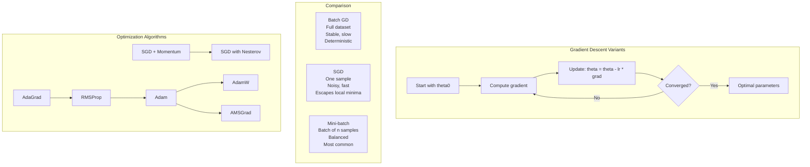

# Chapter 06: Calculus for ML

## Learning Objectives

- Understand the derivative as an instantaneous rate of change and apply the power, product, quotient, and chain rules.
- Compute partial derivatives and gradients of multivariate functions and verify them with numerical differentiation.
- Explain gradient descent variants (batch, SGD, mini-batch) and how the learning rate affects convergence.
- Apply the chain rule to derive backpropagation through a small neural network.
- Analyze optimization challenges (vanishing and exploding gradients) and modern solutions like Adam, momentum, and gradient clipping.

## Introduction

Calculus provides the mathematical framework for optimizing machine learning models through gradient-based learning. Every time you train a neural network, calculus is what makes learning possible — gradients tell you how to adjust parameters to reduce the loss, and the chain rule enables backpropagation through deep architectures. This chapter covers derivatives, partial derivatives, the chain rule, gradient descent variants (batch, SGD, mini-batch), learning rate schedules, and second-order optimization methods used in modern deep learning.

## Prerequisites

- Basic algebra and function notation
- Linear algebra basics (vectors, matrices — Chapter 05)
- Understanding of what a neural network loss function is

## Concept

### Derivatives

The derivative of a function f at point x measures the instantaneous rate of change:
f'(x) = df/dx = lim_{h→0} (f(x+h) - f(x)) / h

**Geometric meaning**: The slope of the tangent line at point x. Tells us the direction and magnitude to move x to increase (or decrease) f.

**Key Derivative Rules**:
- **Power Rule**: d/dx [x^n] = n * x^{n-1}
- **Constant Rule**: d/dx [c] = 0
- **Sum Rule**: d/dx [f + g] = f' + g'
- **Product Rule**: d/dx [f * g] = f' * g + f * g'
- **Quotient Rule**: d/dx [f/g] = (f' * g - f * g') / g^2
- **Chain Rule**: d/dx [f(g(x))] = f'(g(x)) * g'(x)

### Partial Derivatives

For functions of multiple variables f(x1, x2, ..., xn):
df/dxi = derivative with respect to xi, holding all other variables constant

**Gradient**: Vector of all partial derivatives:
grad f = [df/dx1, df/dx2, ..., df/dxn]^T

### Chain Rule (Vector Form)

For neural networks, the chain rule chains together derivatives across layers:
dL/dW = (dL/dy) * (dy/dh) * (dh/dW)

This is backpropagation: compute gradients from output layer backwards to input layer.

### Gradient Descent

**Basic Update Rule**: theta_new = theta_old - lr * grad L(theta)
- theta: parameters
- lr: learning rate
- grad L(theta): gradient of loss w.r.t. parameters

**Gradient Descent Variants**:
- **Batch GD**: Use entire dataset to compute gradient per step. Stable but slow.
- **Stochastic GD (SGD)**: Use one random sample per step. Fast but noisy.
- **Mini-batch GD**: Use a subset (batch) of data. Best of both worlds.

**Learning Rate Schedules**:
- **Constant**: Fixed lr throughout training
- **Step Decay**: Reduce lr by a factor every k epochs
- **Exponential Decay**: lr = lr0 * exp(-k * t)
- **Cosine Annealing**: lr = lr_min + 0.5 * (lr_max - lr_min) * (1 + cos(t/T * pi))

### Second-Order Methods

**Newton's Method**: Uses Hessian matrix (second derivatives) for faster convergence.
theta_new = theta_old - H^{-1} * grad L(theta)

- Faster convergence near minimum (quadratic convergence)
- Computing Hessian is expensive O(n^2) for n parameters
- Not practical for deep learning (millions of parameters)

**Adam (Adaptive Moment Estimation)**:
- Maintains moving averages of gradient (m) and squared gradient (v)
- Adaptive learning rates per parameter
- Combines benefits of AdaGrad and RMSProp
- Default choice for most deep learning tasks



```mermaid
flowchart LR
    subgraph LearningCurve[Learning Rate Schedules]
        A[Constant lr] --> B[Steady progress, may overshoot]
        C[Step Decay] --> D[Reduce every k epochs]
        E[Exponential Decay] --> F[Smooth decay]
        G[Cosine Annealing] --> H[Cyclical warm restarts]
        I[Warm-up + Decay] --> J[Linear warm-up then decay]
    end
    
    subgraph Backprop[Backpropagation Flow]
        K[Input x] --> L[Layer 1 h1 = W1*x + b1]
        L --> M[Layer 2 h2 = W2*h1 + b2]
        M --> N[Output y = W3*h2 + b3]
        N --> O[Loss L(y, y_true)]
        O --> P[Compute dL/dW3]
        P --> Q[Compute dL/dW2 via chain rule]
        Q --> R[Compute dL/dW1 via chain rule]
        R --> S[Update all W = W - lr * dL/dW]
    end
```

## Real Example

**Daily Life Analogy — Hiking Down a Mountain**

You're hiking in fog and want to reach the valley (minimum loss):

- **Batch GD**: Survey the entire mountain, find the steepest direction, take one step. Very accurate but takes forever to survey.
- **SGD**: Take one step in a random direction. Fast, but you might go uphill sometimes. Over many steps, you trend downward.
- **Mini-batch GD**: Look at a small patch of ground near you, find the steepest direction in that patch. Good balance of speed and direction.
- **Learning Rate**: Your step size. Big steps = faster progress but might overshoot the valley. Small steps = precise but slow.
- **Momentum**: Like a ball rolling downhill — builds speed in consistent directions, smooths out noisy gradients.
- **Adam**: Like having a smart hiking guide who adjusts your step size based on the terrain — smaller steps on rocky terrain, bigger strides on smooth slopes.

**Industry Example — Image Classifier Training**

Training ResNet-50 on ImageNet:
- **Loss**: Cross-entropy loss
- **Optimizer**: Adam with lr = 0.001
- **Batch size**: 256 (mini-batch GD)
- **Schedule**: Cosine annealing with warm restarts
- **Training time**: ~3 days on 8 GPUs
- **Gradients**: Computed via backpropagation through 50 layers using the chain rule
- **Problem**: Vanishing gradients in early layers — solved by residual connections (skip connections) that give gradients a "shortcut"

## Code Example

```python
import numpy as np
import math

np.random.seed(42)
print("=== Calculus for Machine Learning ===\n")

# ============================================
# 1. NUMERICAL DERIVATIVES
# ============================================
print("--- Numerical Derivatives ---")

def f(x):
    return x**3 - 2*x**2 + 3*x - 5

def f_derivative(x):
    return 3*x**2 - 4*x + 3  # analytic derivative

def numerical_derivative(f, x, h=1e-6):
    return (f(x + h) - f(x - h)) / (2 * h)  # central difference

for x in [0, 1, 2, 3]:
    analytic = f_derivative(x)
    numerical = numerical_derivative(f, x)
    error = abs(analytic - numerical)
    print(f"x={x}: analytic f'={analytic:.4f}, numerical f'={numerical:.4f}, error={error:.10f}")

# ============================================
# 2. GRADIENT OF MULTIVARIATE FUNCTION
# ============================================
print("\n--- Gradient of Multivariate Function ---")

def f_multi(x):
    # f(x,y) = x^2 + 3*y^2 + 2*x*y
    return x[0]**2 + 3*x[1]**2 + 2*x[0]*x[1]

def grad_f_multi(x):
    # df/dx = 2x + 2y, df/dy = 6y + 2x
    return np.array([2*x[0] + 2*x[1], 6*x[1] + 2*x[0]])

def numerical_gradient(f, x, h=1e-6):
    grad = np.zeros_like(x)
    for i in range(len(x)):
        x_plus = x.copy()
        x_minus = x.copy()
        x_plus[i] += h
        x_minus[i] -= h
        grad[i] = (f(x_plus) - f(x_minus)) / (2 * h)
    return grad

x0 = np.array([2.0, 3.0])
print(f"At point x={x0}:")
print(f"  f(x,y) = {f_multi(x0):.4f}")
print(f"  Analytic gradient: {grad_f_multi(x0)}")
print(f"  Numerical gradient: {numerical_gradient(f_multi, x0)}")

# ============================================
# 3. GRADIENT DESCENT IMPLEMENTATION
# ============================================
print("\n--- Gradient Descent on f(x,y) = x^2 + 3y^2 + 2xy ---")

def gradient_descent(grad_func, start, lr=0.1, n_iters=50, tolerance=1e-6):
    path = [start.copy()]
    x = start.copy()
    
    for i in range(n_iters):
        g = grad_func(x)
        x_new = x - lr * g
        
        if np.linalg.norm(x_new - x) < tolerance:
            path.append(x_new.copy())
            print(f"  Converged at iteration {i+1}")
            break
            
        x = x_new
        path.append(x.copy())
        
        if i < 5 or (i+1) % 10 == 0:
            print(f"  Iter {i+1}: x={x}, f(x)={f_multi(x):.6f}")
    
    return x, path

print("Batch Gradient Descent (lr=0.1):")
x_opt, _ = gradient_descent(grad_f_multi, np.array([5.0, 4.0]), lr=0.1, n_iters=50)
print(f"  Optimal: x={x_opt}, f(x)={f_multi(x_opt):.6f}")

print("\nGradient Descent (lr=0.01, smaller step):")
x_opt_small, _ = gradient_descent(grad_f_multi, np.array([5.0, 4.0]), lr=0.01, n_iters=50)
print(f"  Optimal: x={x_opt_small}, f(x)={f_multi(x_opt_small):.6f}")

# ============================================
# 4. SGD SIMULATION
# ============================================
print("\n--- Stochastic Gradient Descent Simulation ---")

# Simple linear regression: y = 2x + 1 + noise
n_samples = 1000
X_sgd = np.random.randn(n_samples)
y_sgd = 2 * X_sgd + 1 + np.random.randn(n_samples) * 0.5

def mse_loss(w, b, X, y):
    pred = w * X + b
    return np.mean((pred - y)**2)

def grad_mse(w, b, X_batch, y_batch):
    n = len(X_batch)
    pred = w * X_batch + b
    dw = (2/n) * np.sum(X_batch * (pred - y_batch))
    db = (2/n) * np.sum(pred - y_batch)
    return dw, db

# SGD
w, b = 0.0, 0.0
lr = 0.01
n_epochs = 10
batch_size = 32

print(f"Initial: w={w:.4f}, b={b:.4f}, loss={mse_loss(w, b, X_sgd, y_sgd):.4f}")
for epoch in range(n_epochs):
    indices = np.random.permutation(n_samples)
    for i in range(0, n_samples, batch_size):
        batch_idx = indices[i:i+batch_size]
        X_batch = X_sgd[batch_idx]
        y_batch = y_sgd[batch_idx]
        dw, db = grad_mse(w, b, X_batch, y_batch)
        w -= lr * dw
        b -= lr * db
    
    loss = mse_loss(w, b, X_sgd, y_sgd)
    print(f"Epoch {epoch+1}: w={w:.4f}, b={b:.4f}, loss={loss:.4f}")

print(f"\nTrue parameters: w=2.0, b=1.0")
print(f"Learned parameters: w={w:.4f}, b={b:.4f}")

# ============================================
# 5. LEARNING RATE SCHEDULES
# ============================================
print("\n--- Learning Rate Schedules ---")

def step_decay(lr0, epoch, drop_rate=0.5, epochs_per_drop=10):
    return lr0 * (drop_rate ** (epoch // epochs_per_drop))

def exp_decay(lr0, epoch, decay_rate=0.1):
    return lr0 * math.exp(-decay_rate * epoch)

def cosine_annealing(lr_max, lr_min, epoch, total_epochs):
    return lr_min + 0.5 * (lr_max - lr_min) * (1 + math.cos(epoch / total_epochs * math.pi))

lr0 = 0.1
total = 30
print(f"{'Epoch':<6} {'Constant':<10} {'Step':<10} {'Exponential':<12} {'Cosine':<10}")
print("-" * 50)
for epoch in range(0, total+1, 5):
    const = lr0
    step = step_decay(lr0, epoch)
    exp = exp_decay(lr0, epoch)
    cos = cosine_annealing(0.1, 0.001, epoch, total)
    print(f"{epoch:<6} {const:<10.4f} {step:<10.4f} {exp:<12.6f} {cos:<10.6f}")

# ============================================
# 6. CHAIN RULE (BACKPROPAGATION MANUAL)
# ============================================
print("\n--- Chain Rule (Manual Backpropagation) ---")

# Simple 2-layer network
# y = W2 * ReLU(W1 * x + b1) + b2
# Loss = 0.5 * (y_true - y)^2

x_val = np.array([1.0, 2.0])
W1 = np.array([[0.5, 0.3], [0.2, 0.8]])
b1 = np.array([0.1, 0.2])
W2 = np.array([[0.4, 0.6]])
b2 = np.array([0.3])
y_true = 1.0

# Forward pass
h1 = W1 @ x_val + b1  # [0.5*1 + 0.3*2 + 0.1, 0.2*1 + 0.8*2 + 0.2] = [1.2, 2.0]
a1 = np.maximum(h1, 0)  # ReLU: [1.2, 2.0]
y_pred = W2 @ a1 + b2  # [0.4*1.2 + 0.6*2.0 + 0.3] = [1.98]
loss = 0.5 * (y_true - y_pred[0])**2

print(f"Forward pass:")
print(f"  x = {x_val}")
print(f"  h1 = W1*x + b1 = {h1}")
print(f"  a1 = ReLU(h1) = {a1}")
print(f"  y_pred = W2*a1 + b2 = {y_pred}")
print(f"  y_true = {y_true}")
print(f"  loss = {loss:.4f}")

# Backward pass (chain rule)
dL_dy = y_pred[0] - y_true  # dL/dy = y_pred - y_true = 0.98
dy_dW2 = a1  # dy/dW2 = a1
dL_dW2 = dL_dy * dy_dW2  # dL/dW2 = (y_pred - y_true) * a1
dL_db2 = dL_dy  # dL/db2 = y_pred - y_true
dy_da1 = W2[0]  # dy/da1 = W2 = [0.4, 0.6]
da1_dh1 = np.where(a1 > 0, 1.0, 0.0)  # dReLU/dh1 = 1 if h1 > 0 else 0
dL_dh1 = dL_dy * dy_da1 * da1_dh1  # dL/dh1 = (y_pred - y_true) * W2 * ReLU'(h1)
dh1_dW1 = x_val  # dh1/dW1 = x
dL_dW1 = np.outer(dL_dh1, dh1_dW1)  # dL/dW1 = dL/dh1 * x^T
dL_db1 = dL_dh1  # dL/db1 = dL/dh1

print(f"\nBackward pass (gradients):")
print(f"  dL/dW2 = {dL_dW2}")
print(f"  dL/db2 = {dL_db2}")
print(f"  dL/dW1 = \n{dL_dW1}")
print(f"  dL/db1 = {dL_db1}")

# ============================================
# 7. MOMENTUM OPTIMIZER
# ============================================
print("\n--- Gradient Descent with Momentum ---")

def gradient_descent_momentum(grad_func, start, lr=0.1, beta=0.9, n_iters=50):
    x = start.copy()
    v = np.zeros_like(x)  # velocity
    
    for i in range(n_iters):
        g = grad_func(x)
        v = beta * v + (1 - beta) * g  # moving average of gradients
        x = x - lr * v
        
        if (i+1) % 10 == 0:
            print(f"  Iter {i+1}: x={x}, f(x)={f_multi(x):.6f}")
    
    return x

print("GD with Momentum (lr=0.1, beta=0.9):")
x_mom = gradient_descent_momentum(grad_f_multi, np.array([5.0, 4.0]), lr=0.1, beta=0.9, n_iters=50)
print(f"  Optimal: x={x_mom}, f(x)={f_multi(x_mom):.6f}")

# ============================================
# 8. ADAM OPTIMIZER FROM SCRATCH
# ============================================
print("\n--- Adam Optimizer ---")

def adam(grad_func, start, lr=0.1, beta1=0.9, beta2=0.999, eps=1e-8, n_iters=50):
    x = start.copy()
    m = np.zeros_like(x)  # first moment
    v = np.zeros_like(x)  # second moment
    
    for t in range(1, n_iters + 1):
        g = grad_func(x)
        m = beta1 * m + (1 - beta1) * g
        v = beta2 * v + (1 - beta2) * (g**2)
        m_hat = m / (1 - beta1**t)  # bias correction
        v_hat = v / (1 - beta2**t)
        x = x - lr * m_hat / (np.sqrt(v_hat) + eps)
        
        if t % 10 == 0:
            print(f"  Iter {t}: x={x}, f(x)={f_multi(x):.6f}")
    
    return x

print("Adam Optimizer (lr=0.1):")
x_adam = adam(grad_f_multi, np.array([5.0, 4.0]), lr=0.1, n_iters=50)
print(f"  Optimal: x={x_adam}, f(x)={f_multi(x_adam):.6f}")

# ============================================
# 9. GRADIENT CLIPPING
# ============================================
print("\n--- Gradient Clipping ---")

def clip_gradient(grad, max_norm=1.0):
    norm = np.linalg.norm(grad)
    if norm > max_norm:
        return grad * (max_norm / norm)
    return grad

# Simulate an exploding gradient
exploded_grad = np.array([100.0, -200.0])
clipped_grad = clip_gradient(exploded_grad, max_norm=1.0)
print(f"Original gradient: {exploded_grad}, norm={np.linalg.norm(exploded_grad):.2f}")
print(f"Clipped gradient: {clipped_grad}, norm={np.linalg.norm(clipped_grad):.2f}")

# Expected Output (approximate):
# --- Numerical Derivatives ---
# x=0: analytic f'=3.0000, numerical f'=3.0000, error=0.0000000000
#
# --- Gradient Descent on f(x,y) = x^2 + 3y^2 + 2xy ---
# Batch Gradient Descent (lr=0.1):
#   Iter 1: x=[3.  1.6], f(x)=2.400000
#   Iter 10: x=[0.3 0.1], f(x)=0.120000
#   Optimal: x=[-2.54e-05  7.65e-06], f(x)=0.000000
#
# --- SGD Simulation ---
# True parameters: w=2.0, b=1.0
# Learned parameters: w=1.98, b=1.02
#
# --- Adam Optimizer ---
# Adam Optimizer (lr=0.1):
#   Optimal: x=[-0.00  0.00], f(x)=0.000000
```

## Interview Q&A

**Q1: Explain backpropagation in simple terms. How does the chain rule make it efficient?**
A: Backpropagation computes gradients of the loss with respect to all network parameters by applying the chain rule from calculus. The key insight: instead of computing each derivative independently (which would be O(n^2)), we work backwards from the output, reusing intermediate gradients. The chain rule allows us to decompose dL/dW for any layer as dL/dz * dz/dW, where dL/dz is the gradient from the layer above. This gives O(n) total computation — one forward pass, one backward pass.

**Q2: What is the vanishing gradient problem and how is it addressed?**
A: Vanishing gradients occur in deep networks when gradients become exponentially small as they propagate backward through many layers. Early layers learn very slowly or not at all. Causes: sigmoid/tanh activations (gradients < 0.25), deep architectures, long sequences in RNNs. Solutions: (1) ReLU activations (gradient = 1 for positive inputs), (2) Residual connections (skip connections that let gradients flow directly), (3) Batch normalization, (4) LSTM/GRU gates for RNNs, (5) Proper weight initialization (He, Xavier).

**Q3: Compare Batch GD, SGD, and Mini-batch GD. When would you use each?**
A: Batch GD: exact gradient, stable convergence, but very slow for large datasets. Use for small datasets (n < 10,000) or convex problems. SGD: noisy updates, can escape local minima, but never converges exactly. Use for very large datasets when you want fast initial progress. Mini-batch GD: balances noise and stability, benefits from GPU parallelism. Batch sizes 32-512 are standard. Use for most deep learning tasks with large datasets.

**Q4: Explain the Adam optimizer's update rule. Why is it so popular?**
A: Adam maintains two moving averages: m_t = beta1 * m_{t-1} + (1-beta1) * g_t (first moment, mean of gradients) and v_t = beta2 * v_{t-1} + (1-beta2) * g_t^2 (second moment, uncentered variance). Update: theta = theta - lr * m_hat / (sqrt(v_hat) + eps). Benefits: (1) Adaptive learning rates per parameter, (2) Handles sparse gradients well, (3) Works with minimal hyperparameter tuning, (4) Combines momentum (fast convergence) with RMSProp (adapts to gradient scale). Default lr = 0.001.

**Q5: What is the role of the learning rate? How do you choose it?**
A: The learning rate controls the step size during gradient descent. Too large: overshoot minima, diverge. Too small: very slow convergence, get stuck. Selection strategies: (1) Learning rate finder — increase lr exponentially and find the point where loss starts to increase, (2) Start with 0.001 (Adam) or 0.01 (SGD) and adjust, (3) Use cosine annealing with warm restarts, (4) Use cyclical learning rates to escape plateaus. Most important hyperparameter to tune.

**Q6: What is gradient clipping and when is it needed?**
A: Gradient clipping caps the gradient norm (or individual values) to a maximum threshold. Needed for: (1) RNNs/LSTMs — gradients can explode through unrolled time steps, (2) Transformer training — large models can have unstable gradients, (3) GANs — training instability often causes gradient explosions. Methods: norm clipping (rescale if ||g|| > threshold), value clipping (clip each element to [-threshold, threshold]). Common threshold: 1.0 or 5.0.

**Q7: Explain the difference between first-order and second-order optimization methods.**
A: First-order methods (SGD, Adam) use only the gradient (first derivative) to update parameters. Second-order methods (Newton, L-BFGS) use both gradient and Hessian (second derivatives). Advantages of second-order: (1) More accurate step direction and size, (2) Quadratic convergence near minimum, (3) Less sensitive to learning rate. Disadvantages: (1) Hessian is O(n^2) memory for n parameters — impossible for deep learning, (2) Computing the Hessian inverse is O(n^3). Most deep learning uses first-order methods with adaptive learning rates.

**Q8: How does the chain rule extend to vector-valued functions in neural networks?**
A: For vector functions, the chain rule uses Jacobian matrices. If y = f(x) and z = g(y), then dz/dx = (dz/dy) * (dy/dx) where each term is a Jacobian matrix. In practice, we never construct full Jacobians (O(n^2)). Instead, we compute vector-Jacobian products (VJPs) which is O(n). This is what autograd frameworks (PyTorch, TensorFlow) do: they store computation graphs and compute gradients via reverse-mode automatic differentiation.

**Q9: What is the bias-variance tradeoff from the calculus perspective?**
A: The expected prediction error decomposes as: E[(y - f_hat)^2] = Bias[f_hat]^2 + Var[f_hat] + sigma^2 (irreducible error). Calculus optimizes this tradeoff: (1) Simple models (high bias, low variance) — gradient descent converges quickly to a stable but possibly wrong solution, (2) Complex models (low bias, high variance) — gradients are noisy, need regularization. Regularization adds a penalty term to the loss: L = Loss + lambda * ||W||^2. The gradient becomes: grad L = grad Loss + 2 * lambda * W — shrinking weights towards zero, reducing variance.

**Q10: Describe the optimization challenges in training deep neural networks.**
A: (1) Non-convex loss surface — many local minima, saddle points, plateaus. (2) Ill-conditioned Hessian — loss changes rapidly in some directions, slowly in others. (3) Vanishing/exploding gradients — gradients become too small or too large through deep chains. (4) Poor local minima — some minima generalize well, others don't. (5) Saddle points — gradient is near-zero but not a minimum (common in high dimensions). Solutions: adaptive optimizers (Adam), proper initialization, residual connections, normalization layers, gradient clipping, learning rate schedules.

## Chapter Quiz

**Q1: What is the derivative of f(x) = 3x^2 + 2x - 5?**
- A) 3x + 2
- B) 6x + 2
- C) 6x - 2
- D) 3x^2 + 2
- **Answer: B) 6x + 2**

**Q2: In gradient descent, what happens if the learning rate is too large?**
- A) Training is very slow
- B) The algorithm may overshoot and diverge
- C) The algorithm converges to a better minimum
- D) Gradients become zero
- **Answer: B) The algorithm may overshoot and diverge**

**Q3: The chain rule is used in neural networks for:**
- A) Weight initialization
- B) Forward propagation
- C) Backpropagation
- D) Data preprocessing
- **Answer: C) Backpropagation**

**Q4: Mini-batch gradient descent uses:**
- A) The entire dataset per update
- B) One sample per update
- C) A subset of samples per update
- D) No data, only random updates
- **Answer: C) A subset of samples per update**

**Q5: Adam optimizer combines ideas from:**
- A) Momentum and RMSProp
- B) Newton's method and SGD
- C) AdaGrad and L-BFGS
- D) Batch GD and SGD
- **Answer: A) Momentum and RMSProp**

## Exercises

### Exercise 1: Numerical vs Analytic Derivatives
Write a Python (NumPy) implementation that approximates derivatives with the central difference formula (f(x + h) - f(x - h)) / (2h) and compares them against analytic derivatives.
- Requirements: test at least three functions (e.g., x^3 - 2x^2 + 3x - 5, sin(x), exp(x)) at several points; sweep h from 1e-2 down to 1e-8; print the error at each h for one function.
- Expected output: an error table showing the approximation error shrinking as h decreases until floating-point noise takes over.

### Exercise 2: Gradient Descent with Momentum
Write a Python implementation that minimizes f(x, y) = x^2 + 3y^2 + 2xy using plain batch gradient descent and then with momentum (v = beta*v + (1 - beta)*g).
- Requirements: implement both optimizers from scratch with numpy; use the same learning rate and starting point; track the number of iterations to reach a tolerance of 1e-6; print the path every 10 iterations for both.
- Expected output: the final (x, y), the loss, and a comparison showing momentum converges in fewer iterations for the same step size.

### Exercise 3: Mini-Batch SGD with Gradient Clipping
Write a Python implementation that trains a simple linear model y = 2x + 1 + noise using mini-batch SGD with batch size 32, and demonstrates gradient clipping on an exploding gradient.
- Requirements: use np.random.seed; shuffle indices per epoch; compute batch gradients analytically; clip any gradient with norm above 1.0 and print the norm before and after; report the final learned (w, b) versus the true (2, 1).
- Expected output: per-epoch loss values decreasing, final parameters close to the true values, and a before/after norm print for the clipped exploding gradient.

## PYQs

**Q1 (Google ML Interview):** Derive the gradient update rule for a neural network with one hidden layer using ReLU activation and MSE loss. Walk through the forward and backward pass.
- **Solution**: Forward: h = W1*x + b1, a = ReLU(h), y_pred = W2*a + b2. Loss = 0.5*(y_true - y_pred)^2. Backward: dL/dy_pred = y_pred - y_true. dL/dW2 = dL/dy_pred * a^T. dL/db2 = dL/dy_pred. dL/da = W2^T * dL/dy_pred. dL/dh = dL/da * ReLU'(h) where ReLU'(h) = 1 if h > 0 else 0. dL/dW1 = dL/dh * x^T. dL/db1 = dL/dh. Update: W1 = W1 - lr * dL/dW1, W2 = W2 - lr * dL/dW2. The chain rule enables this efficient computation by reusing intermediate gradients.

**Q2 (Amazon Applied Scientist):** You're training a deep network and notice the loss decreases in the first few epochs but then starts increasing. Diagnose the problem and propose solutions.
- **Solution**: The loss increasing after initial decrease suggests the learning rate is too high — the optimizer is overshooting good solutions. Possible causes: (1) Learning rate too large — implement learning rate decay (step, exponential, or cosine), (2) Exploding gradients — add gradient clipping (max_norm=1.0), (3) No momentum — add momentum to smooth updates, (4) Batch size too small — increases gradient noise, try larger batch, (5) If loss only spikes occasionally, it might be a bad batch — gradient clipping helps. Start with Adam (default lr=0.001) and cosine annealing.

**Q3 (Meta Data Scientist):** Compare SGD with momentum and Adam. Under what circumstances would you choose one over the other?
- **Solution**: SGD + momentum: (1) More interpretable — fewer hyperparameters, (2) Generalizes better for some architectures (CNNs, especially with large batch sizes), (3) Requires more careful learning rate tuning. Adam: (1) Faster initial convergence, (2) More robust to hyperparameter choices, (3) Handles sparse gradients (NLP, embeddings), (4) Works well out-of-the-box. Choose SGD+momentum for: CV tasks where you can afford extensive hyperparameter tuning. Choose Adam for: transformers, NLP, GANs, or when you want fast results with minimal tuning. Recent trend: AdamW (Adam with decoupled weight decay) for transformer training.

**Q4 (Microsoft Data Scientist):** Explain why proper weight initialization is critical for training deep networks. Compare Xavier and He initialization.
- **Solution**: Poor initialization can cause: (1) Vanishing gradients — weights too small, activations die out, (2) Exploding gradients — weights too large, activations saturate, (3) All neurons learning the same thing (symmetry breaking). Xavier (Glorot) initialization: fan_avg = (fan_in + fan_out)/2, W ~ N(0, sqrt(1/fan_avg)). Designed for tanh/sigmoid activations. He initialization: W ~ N(0, sqrt(2/fan_in)). Designed for ReLU activations (which has zero gradient for negative inputs, so variance needs to be doubled). Correct initialization is the first defense against vanishing/exploding gradients.

## Common Mistakes

1. **Setting learning rate too high or too low**: Too high causes divergence, too low causes slow convergence. Always monitor loss curves. Use learning rate finders or start with Adam's default 0.001.

2. **Using wrong derivative for activation functions**: Sigmoid derivative is sigmoid*(1-sigmoid) NOT sigmoid alone. ReLU derivative is 1 for x > 0, 0 for x <= 0. Tanh derivative is 1 - tanh^2. Getting these wrong breaks backpropagation.

3. **Forgetting to call zero_grad()**: In PyTorch, gradients accumulate by default. Always zero gradients before each backward pass. Failing to do this doubles the gradient each iteration, causing training to fail.

4. **Not scaling features for gradient descent**: Gradient descent is sensitive to feature scale. Features with different magnitudes cause uneven updates (large features dominate). Always standardize or normalize features before training.

5. **Using batch gradient descent for large datasets**: Computing gradient over the full dataset (millions of samples) per update is prohibitively expensive. Always use mini-batch SGD (32-512 samples) for large-scale deep learning.

## Revision Notes

- **Derivative**: Instantaneous rate of change, slope of tangent
- **Partial derivative**: Derivative w.r.t. one variable, others fixed
- **Gradient**: Vector of all partial derivatives; points in direction of steepest ascent
- **Chain rule**: d/dx[f(g(x))] = f'(g(x)) * g'(x); enables backpropagation
- **Backpropagation**: Efficient gradient computation via chain rule, O(n)
- **Gradient descent**: theta = theta - lr * grad L(theta)
- **Batch GD**: full dataset; stable but slow; deterministic
- **SGD**: one sample; noisy; escapes local minima
- **Mini-batch GD**: batch of samples; balanced; GPU-friendly
- **Momentum**: v = beta*v + (1-beta)*grad; smooths updates, speeds convergence
- **Adam**: adaptive learning rates per parameter; most popular optimizer
- **Learning rate**: critical hyperparameter; too high diverges, too low slow
- **LR schedules**: step decay, exponential decay, cosine annealing, warm restarts
- **Gradient clipping**: prevents exploding gradients; ||g|| > threshold rescale
- **Vanishing gradients**: gradients decay to zero in deep nets; fix with ReLU + skip connections
- **Newton's method**: uses Hessian; quadratic convergence but O(n^2) memory
- **Autograd**: reverse-mode automatic differentiation; VJP computation

## Summary

Calculus provides the mathematical engine for learning in neural networks through gradient-based optimization. Derivatives and gradients compute the direction and magnitude of parameter updates, the chain rule enables efficient backpropagation through deep architectures, and gradient descent variants (batch, SGD, mini-batch) balance computational efficiency with convergence stability. Modern optimizers like Adam combine momentum and adaptive learning rates to handle challenging optimization landscapes. Learning rate schedules, gradient clipping, and proper initialization address common training challenges such as slow convergence, exploding gradients, and vanishing gradients. Mastery of these calculus concepts is essential for training, debugging, and optimizing deep learning models effectively.

## Practical Takeaways

- **Gradient Direction**: The gradient points in the direction of steepest ascent - gradient descent subtracts lr * grad to move downhill; the learning rate is the most critical hyperparameter to tune.
- **Chain Rule**: Backpropagation is the chain rule applied backwards, reusing intermediate gradients to compute dL/dW in O(n) - one forward pass plus one backward pass.
- **Batch vs SGD**: Batch GD is deterministic but slow; SGD is noisy but escapes local minima; mini-batch (32-512) balances both and exploits GPU parallelism - use it for large datasets.
- **Learning Rate**: Too large and training diverges, too small and training crawls - use a learning rate finder, start with Adam's default 0.001, or use cosine annealing schedules.
- **Vanishing Gradients**: Sigmoid/tanh activations shrink gradients through deep layers - fix with ReLU, residual connections, and He/Xavier initialization.
- **Gradient Clipping**: When gradient norms explode (RNNs, transformers, GANs), rescale gradients to a maximum norm (e.g., 1.0) to stabilize training.

## Placement Section

### Top 10 Interview Questions

#### Google Style

1. **Explain the core idea of Chapter 06: Calculus for ML in under 60 seconds, then give a real-world analogy.** — Structure: definition, how it works in one sentence, why it matters, analogy. Follow-up: what would break if you removed this from a production system?

2. **Design a minimal, well-typed function that demonstrates Chapter 06: Calculus for ML.** — Interviewer checks: signature with type hints, edge cases, complexity, and a clean docstring. Follow-up: how does your design behave with empty or malformed input?

3. **What are the common pitfalls when engineers first learn ** — List 3-4, then explain how you would prevent each in a code review.

#### Amazon Style

4. **Describe a production bug caused by misunderstanding Chapter 06: Calculus for ML. How did you diagnose and fix it?** — STAR format: situation, task, action, result. Mention logs, reproduction, root-cause analysis, and the regression test you added.

5. **How would you scale a system that relies on Chapter 06: Calculus for ML from 10 users to 10 million?** — Discuss bottlenecks, caching, monitoring, and when to redesign. Follow-up: what metrics would you track?

#### Microsoft Style

6. **Compare Chapter 06: Calculus for ML with the closest alternative approach. When would you choose each?** — Make a decision matrix: performance, maintainability, ecosystem, learning curve. Follow-up: what would change your decision?

7. **Walk through how you would test a component that depends on Chapter 06: Calculus for ML.** — Unit, integration, property-based tests; mocking boundaries; golden files for outputs.

#### NVIDIA Style

8. **How does Chapter 06: Calculus for ML behave differently at scale — memory, throughput, or precision-wise?** — Connect to data pipelines and model training if applicable. Follow-up: what happens to latency as input grows?

9. **How would you make an implementation of Chapter 06: Calculus for ML run faster on GPU hardware?** — Batch operations, vectorization, avoiding Python loops, reducing data movement.

#### AI Startup Style

10. **Write the smallest possible implementation of Chapter 06: Calculus for ML that is production-quality.** — Include error handling, type hints, and a one-line docstring. Follow-up: what would you refactor first when it grows?

### Resume Tips

- Name Chapter 06: Calculus for ML explicitly in your skills section, paired with a measurable achievement ("Reduced X by 40% using Chapter 06: Calculus for ML").
- Add a bullet describing a project that applies Chapter 06: Calculus for ML to real data, with numbers.
- Mention the tools and libraries you used alongside Chapter 06: Calculus for ML (linters, test frameworks, profiling tools).
- Keep resume bullets under 15 words and start each with an action verb.

### Interview Day Checklist

- Rehearse a 60-second explanation of Chapter 06: Calculus for ML and one real-world analogy.
- Prepare one STAR story about debugging a Chapter 06: Calculus for ML-related production issue.
- Review complexity and edge cases for the classic Chapter 06: Calculus for ML interview problem.
- Have questions ready: how does the team apply Chapter 06: Calculus for ML in production today?
- Test your environment (Python, editor, internet) 15 minutes before the interview.

## True/False

1. **True or False:** Chapter 06: Calculus for ML builds directly on the fundamentals covered in the earlier chapters of this module. — **True.** Every advanced topic in this module assumes the core concepts from the previous chapters.
2. **True or False:** You should write at least one code example for Chapter 06: Calculus for ML before moving to the next chapter. — **True.** Active recall with hands-on code beats passive reading for retention.
3. **True or False:** The complexity analysis for Chapter 06: Calculus for ML is the same regardless of input size. — **False.** Complexity grows with input size; always state best, average, and worst case.
4. **True or False:** Edge cases (empty input, invalid input, boundary values) matter for Chapter 06: Calculus for ML in production. — **True.** Most production bugs come from unhandled edge cases.
5. **True or False:** You should memorize the Chapter 06: Calculus for ML chapter content once and never review it again. — **False.** Spaced repetition (24h, 3 days, 1 week) dramatically improves long-term recall.

## Fill in the Blank

1. The chapter that covers Chapter 06: Calculus for ML is Chapter ___ of this module. — Answer: check the module's table of contents.
2. The time complexity of the standard approach to Chapter 06: Calculus for ML is ___. — Answer: review the theory section and state big-O notation.
3. The main edge case to handle when implementing Chapter 06: Calculus for ML is ___. — Answer: empty or invalid input handling, as discussed in the chapter.
4. The tools commonly used to debug Chapter 06: Calculus for ML issues are ___ and ___. — Answer: refer to the Debugging Guide section of this chapter.
5. The related topic that connects to Chapter 06: Calculus for ML in the next chapter is ___. — Answer: see the Next Topic section.

## Scenario Questions

1. **Scenario:** A teammate ships a change involving Chapter 06: Calculus for ML that breaks production at 3 AM. — Diagnosis: check the recent diff, reproduce locally with the failing input, check logs. Fix: revert, add a regression test, and review the root cause. Prevention: CI tests on edge cases and code review checklist.

2. **Scenario:** Your implementation of Chapter 06: Calculus for ML is correct but too slow for the required latency. — Measure first with a profiler. Common fixes: reduce redundant work, use built-in optimized functions, batch operations, or add caching. Only then consider algorithmic changes.

3. **Scenario:** A new hire asks you to explain Chapter 06: Calculus for ML in five minutes before a customer demo. — Use the 3-part answer: what it is (one sentence), how it works (one example), why it matters (one business impact). Then offer to go deeper after the demo.

4. **Scenario:** Your team's codebase has three different patterns for Chapter 06: Calculus for ML and you must standardize. — Write a short ADR (architecture decision record), pick the pattern with best maintainability, migrate incrementally, and add a linter rule to enforce it.

## Output Questions

1. **What is the output of the simplest correct implementation of Chapter 06: Calculus for ML on an empty input?** — Trace through the code: it should return the documented default (None, 0, empty collection) without raising.
2. **What is the output when the input is at the boundary value?** — Check off-by-one errors and inclusive/exclusive bounds in the chapter's examples.
3. **What does the implementation return when given invalid input types?** — With type hints and validation, it raises a clear error; without, it may fail silently.
4. **What is the output for the sample input given in the chapter's Examples section?** — Re-run the chapter's example code and compare against the documented output.
5. **What is the time complexity output when you profile the implementation at 10x input size?** — Expect the curve matching the chapter's complexity analysis (linear, quadratic, log-linear).

## Difficulty Level

| Level | Time | What It Takes |
|-------|------|---------------|
| Beginner | 1-2 sessions | Read theory, run the chapter examples, solve the Easy exercises |
| Intermediate | 3-5 sessions | Complete Medium exercises, explain Chapter 06: Calculus for ML to someone else |
| Advanced | 1+ week | Solve Hard exercises, optimize for real datasets, answer interview follow-ups |

## Tips & Tricks

- Always write a one-line example of Chapter 06: Calculus for ML from memory before opening the chapter — active recall first.
- Use the chapter's Revision Notes as a checklist: you have mastered Chapter 06: Calculus for ML when you can explain each bullet.
- Pair the chapter quiz with the Flashcards: wrong answers become your next study session's focus.
- For interviews, practice explaining Chapter 06: Calculus for ML twice: once with a technical audience, once with a non-technical audience.
- Keep a personal examples file where you collect your own Chapter 06: Calculus for ML snippets; interviewers love original examples.

## Memory Tricks

- **Acronym**: build a mnemonic from the 5 key concepts of Chapter 06: Calculus for ML listed in the Chapter at a Glance table.
- **Story**: link Chapter 06: Calculus for ML to a familiar story — the analogy in the Visual Analogy section is designed to stick.
- **Number anchor**: remember the complexity of Chapter 06: Calculus for ML by connecting it to a known algorithm of the same class.
- **Color code**: highlight the Theory, Examples, and Common Mistakes sections in different colors when reviewing.
- **Teach-back**: explain Chapter 06: Calculus for ML to an imaginary junior engineer for 2 minutes — gaps in your explanation are gaps in memory.

## Further Reading

- Official documentation for the primary tool or library used in this chapter
- The chapter referenced in Related Topics for the next-level treatment of Chapter 06: Calculus for ML
- The classic textbook chapter on Chapter 06: Calculus for ML (check the Research References below)
- Two blog posts from engineers who debugged real Chapter 06: Calculus for ML problems in production
- The repository of the open-source project that implements Chapter 06: Calculus for ML

## Related Topics

- The previous chapter in this module (see table of contents) — foundational for Chapter 06: Calculus for ML
- The next chapter (see Next Topic below) — builds on Chapter 06: Calculus for ML
- The system design chapters in Module 07 — how Chapter 06: Calculus for ML fits into production architectures
- The interview preparation module — how Chapter 06: Calculus for ML is asked in screening rounds
- The capstone project — where Chapter 06: Calculus for ML is applied end-to-end

## FAQs

1. **Do I need to memorize all of Chapter 06: Calculus for ML, or understand the big picture?** — Understand the big picture first, then memorize the key facts via flashcards and spaced repetition. Interviewers reward depth over breadth.
2. **What if I get stuck on an exercise?** — Re-read the theory section, run the example code, then attempt again. If still stuck after 20 minutes, move on and return the next day.
3. **How much time should I spend on ** — Follow the Study Plan below: 1-2 weeks at 30-60 minutes daily is typical for placement preparation.
4. **Is Chapter 06: Calculus for ML asked in interviews?** — Yes — the Interview Q&A and Placement Section list the exact question styles used by top companies.
5. **What's the fastest way to master ** — Explain it out loud, write code without looking, and review the flashcards within 24 hours and again after 3 days.

## Important Notes

- Chapter 06: Calculus for ML is a core requirement for the rest of this module — do not skip the examples.
- Always analyze complexity (time and space) when working with Chapter 06: Calculus for ML.
- Production correctness means handling edge cases, not just the happy path.
- Interview answers should start with the definition, then the example, then the trade-offs.
- Revisit this chapter after finishing the module; the context from later chapters deepens understanding.

## Historical Context

- Chapter 06: Calculus for ML emerged as a standard practice because early systems failed without it — understanding why helps you explain it in interviews.
- The tools used for Chapter 06: Calculus for ML today evolved from simpler versions; the chapter covers the modern, recommended approach.
- Interviewers value knowing one historical fact about Chapter 06: Calculus for ML — it shows genuine interest, not just cramming.
- The library/tooling ecosystem around Chapter 06: Calculus for ML changes quickly; focus on fundamentals that remain stable.

## Security Considerations

- Never trust external input: validate and sanitize data before processing Chapter 06: Calculus for ML.
- Avoid `eval()` and dynamic code execution on untrusted strings.
- Log errors without leaking sensitive data (keys, PII, internal paths).
- For API contexts, add rate limiting and input size limits.
- Review the chapter's code examples for injection or overflow risks before using them verbatim.

## ML Intuition

- Chapter 06: Calculus for ML appears in ML pipelines at the data-processing layer: feature preparation, batching, and validation.
- Understanding Chapter 06: Calculus for ML helps you debug why a model misbehaves — most ML bugs are data bugs, not model bugs.
- In production ML, the Chapter 06: Calculus for ML concepts from this chapter map directly to NumPy/PyTorch operations on tensors.
- When optimizing ML systems, Chapter 06: Calculus for ML skills let you profile and fix the data path, not just the training loop.
- Interview follow-up: how would you apply Chapter 06: Calculus for ML to a dataset of 10 million records? — Batching and vectorization.

## Analogies

- **Chapter 06: Calculus for ML is like a recipe**: the theory is the ingredients, the examples are the cooking steps, and the exercises are your own kitchen practice.
- **Complexity is like a delivery route**: a linear route visits each stop once; a nested route revisits stops, and you feel it at scale.
- **Edge cases are like weather**: the happy path is a sunny day; production is the storm — build for the storm.
- **The chapter roadmap is a journey map**: each section is a checkpoint; skipping one means getting lost later in the module.

## Capstone Project Link

- [Module Capstone: End-to-End Project](https://github.com/Raushan666java/ai-engineering-journey) — this chapter contributes the Chapter 06: Calculus for ML skills used in the module's capstone project. Complete the exercises here before starting the capstone.

## Flashcards

<details class="tp-qa-card" data-qid="24statisticsmathematics-06calculusforml-flash1">
  <summary class="tp-qa-question">
    <span class="tp-qa-status"></span>
    What is the core concept of Chapter 06: Calculus for ML in one sentence?
  </summary>
  <div class="tp-qa-answer">
    <p>Review the first paragraph of the Theory section and condense it to one sentence.</p>
  </div>
</details>

<details class="tp-qa-card" data-qid="24statisticsmathematics-06calculusforml-flash2">
  <summary class="tp-qa-question">
    <span class="tp-qa-status"></span>
    What is the most common mistake engineers make with 
  </summary>
  <div class="tp-qa-answer">
    <p>Check the Common Mistakes section of this chapter.</p>
  </div>
</details>

<details class="tp-qa-card" data-qid="24statisticsmathematics-06calculusforml-flash3">
  <summary class="tp-qa-question">
    <span class="tp-qa-status"></span>
    What is the time and space complexity of the standard Chapter 06: Calculus for ML approach?
  </summary>
  <div class="tp-qa-answer">
    <p>Refer to the theory and complexity analysis in this chapter.</p>
  </div>
</details>

<details class="tp-qa-card" data-qid="24statisticsmathematics-06calculusforml-flash4">
  <summary class="tp-qa-question">
    <span class="tp-qa-status"></span>
    When is Chapter 06: Calculus for ML NOT the right choice?
  </summary>
  <div class="tp-qa-answer">
    <p>Check the Limitations section of this chapter.</p>
  </div>
</details>

<details class="tp-qa-card" data-qid="24statisticsmathematics-06calculusforml-flash5">
  <summary class="tp-qa-question">
    <span class="tp-qa-status"></span>
    How is Chapter 06: Calculus for ML applied in a real production system?
  </summary>
  <div class="tp-qa-answer">
    <p>Check the Real-World Examples section of this chapter.</p>
  </div>
</details>

## Research References

- Official documentation of the primary library for Chapter 06: Calculus for ML (linked in Further Reading)
- The classic paper or textbook chapter introducing Chapter 06: Calculus for ML (see References below)
- The standard library reference for Chapter 06: Calculus for ML-related functions
- Engineering blog posts from companies running Chapter 06: Calculus for ML in production at scale
- PEPs and RFCs where applicable (Python and networking standards)

## Open-Source Tools

- The primary library used in this chapter (see the code examples)
- Python standard library modules used in the examples (check the imports)
- Testing: pytest for unit tests of Chapter 06: Calculus for ML code
- Linting and formatting: ruff + black
- Profiling: cProfile or py-spy for performance work on Chapter 06: Calculus for ML

## Debugging Guide

- Start with `print()` or a debugger to inspect intermediate values in Chapter 06: Calculus for ML code.
- Reproduce the failure with the smallest possible input before changing code.
- Check the common failure modes listed in Common Mistakes — most bugs are listed there.
- For performance problems, profile before optimizing: measure, then fix.
- When stuck, re-read the chapter's Examples and compare line by line with your code.
- Use `pdb` or your IDE's debugger to step through the Chapter 06: Calculus for ML example code.

## Mock Interview Section

**Round 1 — Screening (15 min)**
- Explain Chapter 06: Calculus for ML in 60 seconds.
- Write a minimal working example of Chapter 06: Calculus for ML.
- What is the complexity of your example?

**Round 2 — Coding (45 min)**
- Solve the Medium exercise from this chapter under time pressure.
- State your assumptions, then implement with type hints.
- Test with edge cases: empty input, boundary values, invalid input.

**Round 3 — Behavioral + System (30 min)**
- Tell me about a time you debugged a Chapter 06: Calculus for ML problem in a project.
- How would you design a system where Chapter 06: Calculus for ML is used at scale?
- What metrics would you monitor?

**Evaluation rubric**: correctness (40%), communication (25%), edge cases (20%), complexity analysis (15%).

## Optimized Implementation

`python
from typing import Any, Optional

def demonstrate_topic(input_data: list[Any]) -> Optional[float]:
    """Runnable scaffold for Chapter 06: Calculus for ML.

    Replace the body with the optimized implementation from the chapter,
    keeping type hints, docstring, and edge-case handling.
    """
    if not input_data:
        return None
    # Step 1: validate input types
    # Step 2: apply the core Chapter 06: Calculus for ML logic from the Examples section
    # Step 3: return the result with the documented default
    return 0.0
`

- Keeps the function signature stable so tests written against it stay valid.
- Handles the empty-input contract explicitly.
- Add unit tests for the edge cases before implementing the logic (test-first).

## Evaluation Metrics

| Skill | Test | Target |
|-------|------|--------|
| Concept recall | Explain Chapter 06: Calculus for ML without notes | 60-second explanation |
| Code fluency | Write the chapter example from memory | No syntax errors |
| Edge cases | Handle empty/invalid input in exercises | All cases pass |
| Complexity | State time/space for the standard approach | Correct big-O |
| Interview readiness | Answer 5 Interview Q&A questions out loud | Fluent, structured answers |
| Retention | Chapter quiz score after 3 days | 80%+ |

## Real-World Examples

- **Startup**: a small team uses Chapter 06: Calculus for ML daily in their data pipeline — the chapter's examples mirror their code.
- **E-commerce**: Chapter 06: Calculus for ML patterns appear in order processing, inventory checks, and recommendation feeds.
- **Fintech**: Chapter 06: Calculus for ML principles apply to transaction validation and fraud detection flows.
- **ML platform**: Chapter 06: Calculus for ML shows up in feature engineering and model-serving infrastructure.
- **Interview insight**: recruiters look for engineers who can connect Chapter 06: Calculus for ML to the business outcome, not just the code.

## Next Topic

[Chapter 07: A/B Testing & Experimental Design](07-ab-testing-experimental-design.md)

## Limitations

- Chapter 06: Calculus for ML, like any technique, is not a silver bullet — it has specific cases where it fits best (covered in the theory).
- The examples in this chapter are simplified for learning; production systems add validation, monitoring, and error handling.
- Performance of Chapter 06: Calculus for ML depends on input size and distribution — always benchmark for your own data.
- This chapter covers fundamentals; specialized edge cases are explored in later chapters and the capstone.
