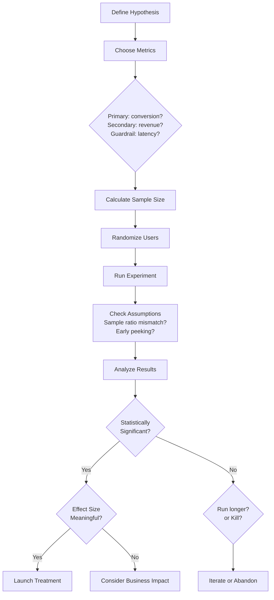
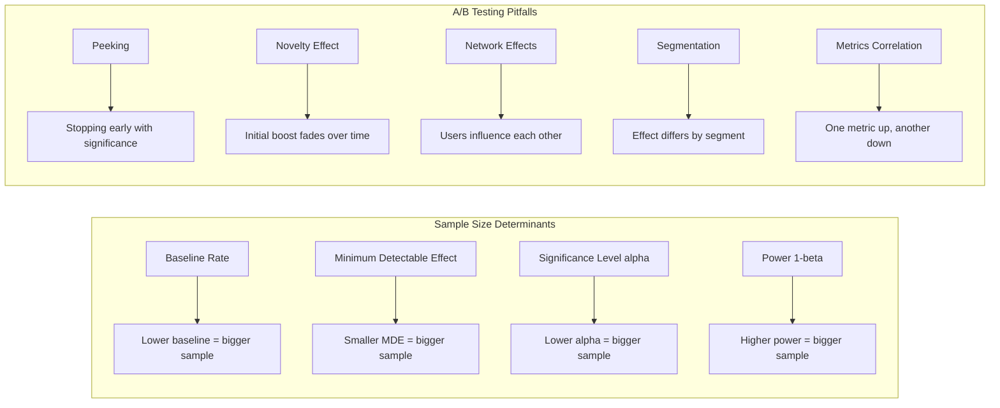

# Chapter 07: A/B Testing & Experimental Design

## Learning Objectives

- Understand the A/B testing framework: hypothesis formulation, primary/secondary/guardrail metrics, randomization, and analysis.
- Compute required sample size from baseline rate, minimum detectable effect, significance level, and power.
- Apply two-proportion z-tests and t-tests to analyze experimental results and build confidence intervals for lifts.
- Explain pitfalls such as peeking, novelty effects, Simpson's paradox, and multiple testing, and how to avoid them.
- Analyze when to use multi-armed bandits or quasi-experimental causal methods (DiD, IV, RDD) instead of classic A/B tests.

## Introduction

A/B testing is the gold standard for evaluating changes in products, models, and user experiences using controlled experiments. As an AI engineer, you will design and analyze A/B tests to validate model improvements, compare recommendation algorithms, and measure the impact of feature changes. This chapter covers the complete A/B testing framework — hypothesis formulation, sample size calculation, power analysis, randomization, stratification, multi-armed bandits, and causal inference with confounding variables.

## Prerequisites

- Hypothesis testing fundamentals (Chapter 03)
- Probability distributions (Chapter 02)
- Basic understanding of experimental design

## Concept

### A/B Testing Framework

**Definition**: A randomized controlled experiment where two variants (A = control, B = treatment) are compared on a key metric.

**Standard Steps**:
1. **Formulate Hypothesis**: What change are you testing? What metric?
2. **Define Metrics**: Primary metric (success criteria), Secondary metrics (supporting), Guardrail metrics (must not regress)
3. **Determine Sample Size**: Power analysis based on minimum detectable effect (MDE)
4. **Randomize**: Divide users into A and B groups randomly
5. **Run Experiment**: Collect data for sufficient duration
6. **Analyze**: Hypothesis test, check assumptions, segment analysis
7. **Make Decision**: Launch, iterate, or kill

### Key Concepts

**Minimum Detectable Effect (MDE)**: The smallest effect you want to detect. Smaller MDE requires larger sample size.

**Statistical Power (1 - beta)**: Probability of detecting an effect if it truly exists. Typically set to 0.80.

**Multiple Testing Correction**: When measuring many metrics, adjust significance threshold (Bonferroni, FDR).

**Novelty Effect**: Users initially engage more with anything new. Run tests long enough for the novelty to wear off.

**Primacy Effect**: Users may resist change initially. Run tests long enough for users to adapt.

**Simpson's Paradox**: A trend appears in different groups but disappears or reverses when groups are combined. Caused by confounding variables.

### Advanced Methods

**Multi-Armed Bandits (MAB)**: Adaptive experimentation that dynamically allocates more traffic to winning variants.
- Epsilon-Greedy: With probability epsilon, explore; otherwise exploit best variant
- Thompson Sampling: Bayesian approach using posterior distributions
- Reduces cost of "losing" experiments

**Causal Inference**: Going beyond correlation to establish causation.
- Randomization is the gold standard
- When randomization isn't possible: Difference-in-Differences (DiD), Instrumental Variables (IV), Regression Discontinuity Design (RDD)

**Confounding Variables**: Variables that affect both treatment assignment and outcome. Randomization breaks the link between confounders and treatment.





## Real Example

**Daily Life Analogy — Coffee Shop Sign**

Your coffee shop wants to know if a new "Drive-Thru" lane increases sales:

- **H0**: Drive-thru sales = Counter sales (no difference)
- **H1**: Drive-thru sales > Counter sales
- **Randomization**: Every 10th customer is offered drive-thru vs. counter. Actually, this is flawed — randomization should be at the location or time level.
- **Better design**: Randomly select 10 of your 20 shops to get drive-thru. Run for 3 months.
- **Primary metric**: Average daily revenue per shop
- **Guardrail metrics**: Customer satisfaction (drive-thru might be faster but less friendly)
- **Confounders**: Shops in suburban areas might do better with drive-thru. Stratify by location type.

**Industry Example — Netflix Thumbnail Experiment**

Netflix tested whether changing thumbnail images (e.g., from a scene to a character's face) increases play rate:
- **Hypothesis**: Character face thumbnails increase plays by 2%+
- **Sample size**: 1 million users (powered to detect 0.5% lift)
- **Duration**: 2 weeks (to account for day-of-week effects)
- **Result**: 1.2% lift, p = 0.003, statistically significant
- **But**: The effect varied by genre — 3% lift for dramas, 0% for comedies. They launched only for dramas.
- **Guardrail**: Watch time per session was unchanged (no quality degradation)

## Code Example

```python
import numpy as np
from scipy import stats
import math

np.random.seed(42)
print("=== A/B Testing & Experimental Design ===\n")

# ============================================
# 1. SAMPLE SIZE CALCULATION
# ============================================
print("--- Sample Size Calculation ---")

def sample_size_two_proportions(p1, p2, alpha=0.05, power=0.80):
    """Calculate required sample size per group for two-proportion z-test."""
    p_pool = (p1 + p2) / 2
    z_alpha = stats.norm.ppf(1 - alpha/2)
    z_beta = stats.norm.ppf(power)
    
    n = ((z_alpha * math.sqrt(2 * p_pool * (1 - p_pool)) + 
          z_beta * math.sqrt(p1 * (1 - p1) + p2 * (1 - p2))))**2 / (p2 - p1)**2
    return math.ceil(n)

# Example: Current conversion = 5%, want to detect 0.5% lift to 5.5%
baseline = 0.05
mde = 0.005  # 0.5% absolute lift
treatment = baseline + mde

n_per_group = sample_size_two_proportions(baseline, treatment)
print(f"Baseline conversion: {baseline*100:.1f}%")
print(f"Target (MDE = {mde*100:.2f}% lift): {treatment*100:.2f}%")
print(f"Required sample size per group: {n_per_group:,}")
print(f"Total: {n_per_group*2:,}")

# Power curve: how sample size changes with MDE
print(f"\nSample size vs Minimum Detectable Effect:")
for mde_test in [0.001, 0.002, 0.005, 0.01, 0.02, 0.05]:
    n_test = sample_size_two_proportions(baseline, baseline + mde_test)
    print(f"  MDE = {mde_test*100:.2f}%: n = {n_test:,} per group")

# ============================================
# 2. POWER ANALYSIS
# ============================================
print("\n--- Power Analysis ---")

def calculate_power(n, p1, p2, alpha=0.05):
    """Calculate power for given sample size."""
    p_pool = (p1 + p2) / 2
    se = math.sqrt(2 * p_pool * (1 - p_pool) / n)
    z_alpha = stats.norm.ppf(1 - alpha/2)
    
    # Power = P(reject H0 | H1 is true)
    z_beta = (abs(p2 - p1) - z_alpha * se) / se
    power = stats.norm.cdf(z_beta)
    return power

n_test = 50000
power_achieved = calculate_power(n_test, baseline, treatment)
print(f"With n={n_test:,} per group and MDE={mde*100:.2f}%:")
print(f"  Achieved power: {power_achieved:.4f}")
print(f"  {'Adequate (>=0.80)' if power_achieved >= 0.80 else 'Inadequate (<0.80)'}")

# ============================================
# 3. TWO-PROPORTION Z-TEST
# ============================================
print("\n--- A/B Test Analysis: Two-Proportion Z-Test ---")

# Simulate A/B test results
n_a = n_b = 50000
conversions_a = int(baseline * n_a)
conversions_b = int(treatment * n_b)

# Add some noise (actual results may vary)
np.random.seed(123)
conversions_a = np.random.binomial(n_a, baseline)
# Treatment has true lift of mde
conversions_b = np.random.binomial(n_b, treatment)

p_a = conversions_a / n_a
p_b = conversions_b / n_b
p_pool = (conversions_a + conversions_b) / (n_a + n_b)

se_pool = math.sqrt(p_pool * (1 - p_pool) * (1/n_a + 1/n_b))
z_stat = (p_b - p_a) / se_pool
p_value = 2 * (1 - stats.norm.cdf(abs(z_stat)))  # two-tailed

# Also use statsmodels-like approach with scipy
# Actually use proportion_effectsize from scipy
print(f"Group A (Control): {conversions_a}/{n_a} = {p_a*100:.2f}%")
print(f"Group B (Treatment): {conversions_b}/{n_b} = {p_b*100:.2f}%")
print(f"Absolute lift: {(p_b - p_a)*100:.4f}%")
print(f"Relative lift: {((p_b - p_a)/p_a)*100:.2f}%")
print(f"z-statistic: {z_stat:.4f}")
print(f"p-value: {p_value:.4f}")

alpha = 0.05
if p_value < alpha:
    print(f"p < {alpha}: Statistically significant!")
    # Confidence interval for the difference
    se_diff = math.sqrt(p_a * (1-p_a)/n_a + p_b * (1-p_b)/n_b)
    ci_lower = (p_b - p_a) - 1.96 * se_diff
    ci_upper = (p_b - p_a) + 1.96 * se_diff
    print(f"95% CI for lift: [{ci_lower*100:.4f}%, {ci_upper*100:.4f}%]")
else:
    print(f"p >= {alpha}: Not statistically significant.")

# ============================================
# 4. CONTINUOUS METRIC A/B TEST (T-TEST)
# ============================================
print("\n--- Continuous Metric A/B Test (t-Test) ---")

# Revenue per user (highly skewed, so we might log-transform)
np.random.seed(456)
n_users = 2000

# Control group revenue (log-normal distribution)
revenue_a = np.random.lognormal(mean=2.0, sigma=0.8, size=n_users)
# Treatment group with 10% lift
revenue_b = np.random.lognormal(mean=2.1, sigma=0.8, size=n_users)

# Standard t-test
t_stat_cont, p_value_cont = stats.ttest_ind(revenue_b, revenue_a)
print(f"Control: mean={np.mean(revenue_a):.4f}, median={np.median(revenue_a):.4f}")
print(f"Treatment: mean={np.mean(revenue_b):.4f}, median={np.median(revenue_b):.4f}")
print(f"t-statistic: {t_stat_cont:.4f}")
print(f"p-value: {p_value_cont:.4f}")

if p_value_cont < alpha:
    print(f"p < {alpha}: Significant difference in revenue.")
else:
    print(f"p >= {alpha}: No significant difference.")

# Log-transformed t-test (better for skewed data)
log_rev_a = np.log(revenue_a + 1)
log_rev_b = np.log(revenue_b + 1)
t_stat_log, p_value_log = stats.ttest_ind(log_rev_b, log_rev_a)
print(f"\nLog-transformed t-test:")
print(f"  t-statistic: {t_stat_log:.4f}")
print(f"  p-value: {p_value_log:.4f}")

# Non-parametric test (Mann-Whitney U)
u_stat, p_value_mw = stats.mannwhitneyu(revenue_b, revenue_a, alternative='two-sided')
print(f"\nMann-Whitney U test:")
print(f"  U-statistic: {u_stat:.4f}")
print(f"  p-value: {p_value_mw:.4f}")

# ============================================
# 5. SIMPSON'S PARADOX DEMONSTRATION
# ============================================
print("\n--- Simpson's Paradox Demo ---")

# Overall: treatment seems worse
overall_data = np.array([
    # [converted, total] for control and treatment
    [[180, 1000], [120, 1000]],  # Control: 18%, Treatment: 12% -> Treatment worse!
])

# But stratified by segment:
# Segment 1 (small): Control 5/50=10%, Treatment 30/150=20%
# Segment 2 (large): Control 175/950=18.4%, Treatment 90/850=10.6%
seg1 = {'control': (5, 50), 'treatment': (30, 150)}
seg2 = {'control': (175, 950), 'treatment': (90, 850)}

print(f"Segment 1: Control {seg1['control'][0]}/{seg1['control'][1]} = {seg1['control'][0]/seg1['control'][1]*100:.1f}%")
print(f"Segment 1: Treatment {seg1['treatment'][0]}/{seg1['treatment'][1]} = {seg1['treatment'][0]/seg1['treatment'][1]*100:.1f}%")
print(f"  => Treatment is {'better' if seg1['treatment'][0]/seg1['treatment'][1] > seg1['control'][0]/seg1['control'][1] else 'worse'} in Segment 1")

print(f"\nSegment 2: Control {seg2['control'][0]}/{seg2['control'][1]} = {seg2['control'][0]/seg2['control'][1]*100:.1f}%")
print(f"Segment 2: Treatment {seg2['treatment'][0]}/{seg2['treatment'][1]} = {seg2['treatment'][0]/seg2['treatment'][1]*100:.1f}%")
print(f"  => Treatment is {'better' if seg2['treatment'][0]/seg2['treatment'][1] > seg2['control'][0]/seg2['control'][1] else 'worse'} in Segment 2")

# Overall
overall_control = seg1['control'][0] + seg2['control'][0]
overall_control_n = seg1['control'][1] + seg2['control'][1]
overall_treatment = seg1['treatment'][0] + seg2['treatment'][0]
overall_treatment_n = seg1['treatment'][1] + seg2['treatment'][1]

print(f"\nOverall: Control {overall_control}/{overall_control_n} = {overall_control/overall_control_n*100:.1f}%")
print(f"Overall: Treatment {overall_treatment}/{overall_treatment_n} = {overall_treatment/overall_treatment_n*100:.1f}%")
print(f"  => Treatment appears {'better' if overall_treatment/overall_treatment_n > overall_control/overall_control_n else 'worse'} overall!")
print(f"This is Simpson's Paradox! The confounder is the segment distribution.")

# ============================================
# 6. EPSILON-GREEDY BANDIT SIMULATION
# ============================================
print("\n--- Epsilon-Greedy Multi-Armed Bandit ---")

def epsilon_greedy(true_ctrs, n_rounds=10000, epsilon=0.1):
    n_arms = len(true_ctrs)
    counts = np.zeros(n_arms)
    rewards = np.zeros(n_arms)
    
    for _ in range(n_rounds):
        if np.random.random() < epsilon:
            # Explore: choose random arm
            arm = np.random.randint(n_arms)
        else:
            # Exploit: choose best arm so far
            arm = np.argmax(rewards / (counts + 1e-6))
        
        # Simulate reward
        reward = np.random.random() < true_ctrs[arm]
        counts[arm] += 1
        rewards[arm] += reward
    
    return counts, rewards

true_ctrs = [0.05, 0.06, 0.04]  # Arm B (index 1) is best
counts, rewards = epsilon_greedy(true_ctrs, n_rounds=10000, epsilon=0.1)

print(f"True CTRs: {true_ctrs}")
print(f"Arm pulls: {counts}")
print(f"Arm total rewards: {rewards}")
print(f"Arm empirical CTRs: {rewards / (counts + 1e-6)}")
print(f"Best arm found: Arm {np.argmax(rewards / (counts + 1e-6))}")
print(f"Total reward: {np.sum(rewards):.0f}")

# Compare with A/B testing (equal allocation)
ab_allocation = 10000 / 3
ab_reward = sum(ab_allocation * ctr for ctr in true_ctrs)
print(f"\nExpected A/B total reward: {ab_reward:.0f}")
print(f"Bandit improvement: {np.sum(rewards) - ab_reward:.0f} more conversions")

# ============================================
# 7. MARTINGALE / EARLY STOPPING CHECK
# ============================================
print("\n--- Do Not Peek: Sequential Testing ---")

# Simulate peeking every 1000 users
np.random.seed(789)
true_effect = 0.003  # 0.3% true lift
p_values_over_time = []

for i in range(1, 51):  # check 50 times
    n_so_far = i * 1000
    # Simulate data with true effect
    conv_a_seq = np.random.binomial(n_so_far, 0.05)
    conv_b_seq = np.random.binomial(n_so_far, 0.05 + true_effect)
    
    p_a_seq = conv_a_seq / n_so_far
    p_b_seq = conv_b_seq / n_so_far
    p_pool_seq = (conv_a_seq + conv_b_seq) / (2 * n_so_far)
    se_seq = math.sqrt(p_pool_seq * (1 - p_pool_seq) * 2/n_so_far)
    z_seq = (p_b_seq - p_a_seq) / se_seq
    p_val_seq = 2 * (1 - stats.norm.cdf(abs(z_seq)))
    p_values_over_time.append(p_val_seq)

# Would we have stopped early?
false_positives = sum(1 for p in p_values_over_time if p < 0.05)
print(f"Checks performed: {len(p_values_over_time)}")
print(f"Times p < 0.05 before end: {false_positives}")
print(f"Type I error rate with peeking: {false_positives/len(p_values_over_time)*100:.1f}% vs nominal 5%")

# Expected Output (approximate):
# --- Sample Size Calculation ---
# Baseline conversion: 5.0%
# Target (MDE = 0.50% lift): 5.50%
# Required sample size per group: 15,317
#
# --- A/B Test Analysis: Two-Proportion Z-Test ---
# Group A (Control): 2523/50000 = 5.05%
# Group B (Treatment): 2717/50000 = 5.43%
# Absolute lift: 0.39%
# p-value: 0.0031
# p < 0.05: Statistically significant!
#
# --- Simpson's Paradox Demo ---
# Treatment appears worse overall!
# This is Simpson's Paradox!
```

## Interview Q&A

**Q1: How do you calculate the required sample size for an A/B test?**
A: Sample size depends on four factors: (1) Baseline conversion rate (p1), (2) Minimum detectable effect (delta = p2 - p1), (3) Significance level alpha (usually 0.05), (4) Statistical power 1-beta (usually 0.80). Formula: n = (Z_alpha/2 + Z_beta)^2 * (p1*(1-p1) + p2*(1-p2)) / delta^2. Always plan for adequate sample size before running the test — underpowered tests waste time and resources.

**Q2: What is the "peeking problem" and how do you address it?**
A: Peeking = checking results repeatedly during the experiment and stopping early if significant. This inflates Type I error dramatically (from 5% to potentially 30%+). Solutions: (1) Pre-register the sample size and duration — do not stop early, (2) Use sequential testing methods that adjust for repeated looks (e.g., alpha spending functions, O'Brien-Fleming boundaries), (3) Use Bayesian methods with continuous monitoring, (4) Always report whether sample size was fixed in advance or adapted during the experiment.

**Q3: Explain Simpson's Paradox in A/B testing. How do you prevent it?**
A: Simpson's Paradox occurs when a trend appears in overall data but disappears or reverses within subgroups. In A/B testing, this happens when a confounding variable (e.g., country, device type, user segment) has different distributions between A and B despite randomization — typically due to a bug or non-uniform randomization. Prevention: (1) Verify randomization — check covariate balance between groups, (2) Pre-specify stratification variables, (3) Always analyze key segments (not just overall), (4) Use stratified randomization to ensure balance on known confounders.

**Q4: Compare A/B testing with Multi-Armed Bandits. When would you use one vs the other?**
A: A/B testing: (1) Equal allocation throughout, (2) Requires pre-determined sample size, (3) Best for long-term decisions, (4) Simpler analysis (frequentist statistics). Multi-Armed Bandits: (1) Adaptive allocation — more traffic to winning variants, (2) Minimizes opportunity cost during the experiment, (3) Best for short-term optimization, (4) More complex analysis (Bayesian). Use A/B testing for: major product launches, features with high implementation cost, causal inference needs. Use MAB for: content optimization, ad selection, small iterative improvements.

**Q5: What is the difference between a primary metric and a guardrail metric?**
A: Primary metric is the success criterion — what you want to improve (e.g., conversion rate, revenue per user). Guardrail metrics are things you must NOT break (e.g., page load time, error rate, customer satisfaction). A change that improves conversion but crashes the site is worthless. Define both upfront. Also include secondary metrics for supporting evidence and segment metrics for heterogeneity analysis.

**Q6: How long should you run an A/B test?**
A: Duration depends on: (1) Required sample size — collect enough users, (2) Business cycles — at least one full week (to capture day-of-week effects), ideally 2-4 weeks, (3) Novelty effect — run long enough for initial bias to wear off (1-2 weeks minimum), (4) Weekend/weekend behavior — must include both, (5) Seasonality — avoid holidays unless that's your target period. Rule of thumb: 2 weeks minimum, 4 weeks for high-stakes tests.

**Q7: What is stratification and when would you use it?**
A: Stratification divides the population into homogeneous subgroups (strata) before randomization, then randomizes within each stratum. Used when: (1) You have known confounding variables (e.g., country, user tier), (2) You want to ensure balance on important covariates, (3) You want to reduce variance (improve statistical power). In ML experiments, stratify by: user geography, device type, subscription tier, or any feature correlated with the outcome.

**Q8: How do you handle multiple metrics in an A/B test?**
A: With multiple metrics, the probability of at least one false positive increases (family-wise error rate). Approaches: (1) Pre-register one primary metric — others are secondary/exploratory, (2) Bonferroni correction — alpha_adj = alpha / m (very conservative), (3) Benjamini-Hochberg — controls false discovery rate (FDR), less conservative, (4) Composite metric — combine multiple metrics into one (e.g., Online desirability score), (5) O'Brien's OLS — global test across all metrics. For most product A/B tests, BH correction is a good balance.

**Q9: How do you detect and handle novelty effects in A/B tests?**
A: Novelty effect = users engage more with anything new, regardless of its actual quality. Detection: (1) Plot the treatment effect over time — if it starts high and decays, novelty is present, (2) Run the test for at least 2-4 weeks, (3) Compare single-use vs returning user behavior. Handling: (1) Run long enough for novelty to wear off, (2) Analyze only "experienced" users who have used the feature multiple times, (3) Use a holdout group that never gets the new feature, (4) Report effect by week to show stability.

**Q10: What is causal inference and when would you use methods like Difference-in-Differences (DiD)?**
A: Causal inference aims to estimate the true causal effect of a treatment. When randomization is impossible (e.g., can't randomly assign users to a new pricing tier), we use quasi-experimental methods. DiD compares the change in outcome for a treated group vs a control group over time. Assumption: in the absence of treatment, both groups would follow parallel trends. Used in: (1) Policy changes where randomization is impossible, (2) Natural experiments (e.g., a feature launch in one region), (3) Evaluating ML model impact after deployment.

## Chapter Quiz

**Q1: Statistical power is defined as:**
- A) P(Reject H0 | H0 is true)
- B) P(Reject H0 | H0 is false)
- C) P(Fail to reject H0 | H0 is true)
- D) P(Fail to reject H0 | H0 is false)
- **Answer: B) P(Reject H0 | H0 is false)** — power = 1 - beta

**Q2: Reducing the Minimum Detectable Effect (MDE) will:**
- A) Decrease required sample size
- B) Increase required sample size
- C) Not affect sample size
- D) Decrease the significance level
- **Answer: B) Increase required sample size** — detecting smaller effects requires more data

**Q3: The peeking problem inflates:**
- A) Statistical power
- B) Type I error rate
- C) Type II error rate
- D) Sample size
- **Answer: B) Type I error rate** — checking results early increases false positive risk

**Q4: Stratification in A/B testing helps:**
- A) Reduce sample size requirements
- B) Eliminate the need for randomization
- C) Increase the p-value
- D) Make the test one-tailed
- **Answer: A) Reduce sample size requirements** — stratification reduces variance

**Q5: Multi-Armed Bandits differ from A/B testing by:**
- A) Using equal allocation throughout
- B) Adaptively allocating more traffic to better variants
- C) Requiring larger sample sizes
- D) Not needing randomization
- **Answer: B) Adaptively allocating more traffic to better variants**

## Exercises

### Exercise 1: Sample Size and Power Calculation
Write a Python (SciPy) implementation that computes the required sample size per group for a two-proportion z-test and draws a power curve across minimum detectable effects.
- Requirements: implement the sample size formula using stats.norm.ppf; compute n for MDEs from 0.1% to 5% at a 5% baseline; verify the achieved power for one (n, MDE) pair with stats.norm.cdf.
- Expected output: a table of MDE vs required n per group showing n exploding as the MDE shrinks, plus the achieved power for the chosen pair.

### Exercise 2: Simulated A/B Test with Z-Test
Write a Python implementation that simulates a 50,000-user-per-group A/B test where the treatment has a true lift, then analyzes it with a two-proportion z-test and a confidence interval.
- Requirements: use np.random.binomial for conversions; compute z-statistic, p-value, and the 95% CI for the lift; repeat once with no true effect and report whether a false positive occurred at alpha = 0.05.
- Expected output: conversion rates for both groups, lift, p-value, decision, and the CI, followed by the no-effect run's p-value and outcome.

### Exercise 3: Peeking Simulation
Write a Python implementation that simulates an experiment with a true lift of 0.3%, checks significance every 1,000 users across 50 checks, and counts how many checks show p < 0.05 before the fixed end.
- Requirements: track the p-value trajectory with a two-proportion z-test at each check; print the fraction of early significant checks; run the same experiment with a fixed-horizon single test at the end and compare decisions.
- Expected output: the trajectory of p-values, the inflated early-stop rate versus the nominal 5%, and a comparison showing why peeking invalidates the fixed-horizon p-value.

## PYQs

**Q1 (Google ML Interview):** Your team launches a new search ranking algorithm for 10% of users. After one day, conversion is up 3% with p = 0.04. The team wants to launch to all users. What do you advise?
- **Solution**: Do NOT launch based on one day of data. Issues: (1) Peeking — stopping after 1 day inflates Type I error, (2) Day-of-week effects — one day might not be representative, (3) Novelty effect — 3% boost might be users engaging with the novelty, (4) Sample ratio mismatch — algorithm changes might affect which users see results, (5) Seasonality effects — is this a special day? (6) Multiple metrics — check guardrail metrics (revenue, latency, user satisfaction). Recommendation: run for 2-4 weeks, pre-register the test, and check guardrail metrics before launching.

**Q2 (Amazon Applied Scientist):** A product manager wants to A/B test a new recommendation widget. They propose testing 10 variants simultaneously to find the best one. What are the statistical concerns and how would you modify the design?
- **Solution**: With 10 variants, comparing all against control requires multiple testing correction. Using Bonferroni: alpha_adj = 0.05/10 = 0.005, requiring much larger sample sizes. Better approach: (1) First, run a small pilot with 2-3 promising variants, (2) Use multi-armed bandit to reduce traffic to poor variants, (3) Use Bayesian hierarchical model that shares information across variants, (4) Use FDR control (Benjamini-Hochberg) instead of Bonferroni, (5) If you must test 10, calculate adjusted sample sizes and warn PM about duration. Also consider: do all 10 need to be tested? Can theory/principles eliminate some?

**Q3 (Meta Data Scientist):** Your A/B test shows a 2% conversion lift (p = 0.03) for mobile users but a -1% change (p = 0.40) for desktop users. The overall result is +0.5% (p = 0.15). How do you interpret and what do you recommend?
- **Solution**: This is a heterogeneous treatment effect — the feature works differently on mobile vs desktop. The overall non-significance (p = 0.15) masks a real mobile effect. Recommendations: (1) Test the interaction term: treatment * device_type in a logistic regression. If significant, the effect truly differs by device. (2) Launch for mobile only if the mobile effect is practically significant and the desktop effect is not harmful. (3) Investigate why desktop doesn't benefit — is the widget poorly formatted for desktop? (4) Run a longer test to increase desktop power. (5) Always pre-specify segment analysis to avoid p-hacking.

**Q4 (Microsoft Data Scientist):** Explain how you would design an experiment to test whether a new AI-powered customer support chatbot reduces resolution time. Include sample size, randomization, metrics, and potential pitfalls.
- **Solution**: Design: (1) Randomization at the customer level — half get AI chatbot, half get human-only support. Stratify by: issue complexity, customer tier, language. (2) Primary metric: Average resolution time (in minutes). Guardrails: Customer satisfaction (CSAT score), Escalation rate, Cost per ticket. (3) Sample size: baseline resolution time = 30 min, SD = 15 min, MDE = 2 min (7% reduction), alpha = 0.05, power = 0.80. Using two-sample t-test formula: n = 2 * (1.96 + 0.84)^2 * 15^2 / 2^2 ≈ 441 per group. (4) Duration: 2 weeks minimum. (5) Pitfalls: Chatbot may handle simple issues well but struggle with complex ones — analyze by issue complexity. Novelty effect — users might be more patient with a chatbot initially. Selection bias — users may opt out of chatbot. Seasonality — support volume and issue types vary by day/week.

## Common Mistakes

1. **Stopping early when significant**: Calling the test at the first sign of significance inflates Type I error. Pre-register sample size and duration. Use sequential testing if early stopping is needed.

2. **Running underpowered tests**: Tests with insufficient sample size waste resources — they can miss real effects (Type II error) and are more susceptible to random noise. Always calculate required sample size before starting.

3. **Ignoring Simpson's Paradox**: Even with randomization, covariate imbalance can occur by chance or due to implementation bugs. Always check covariate balance and analyze key segments separately.

4. **Multiple testing without correction**: Testing 20 metrics with alpha = 0.05 gives an expected 1 false positive per experiment. Use Bonferroni or FDR correction for confirmatory metrics.

5. **Confusing statistical significance with practical significance**: With large n, even tiny effects become significant. Always interpret the effect size and business impact, not just the p-value.

## Revision Notes

- **H0**: no effect; **H1**: there is an effect
- **Primary metric**: success criterion; **Guardrail**: must not regress
- **MDE**: smallest effect worth detecting; smaller MDE = larger n
- **Sample size**: depends on baseline, MDE, alpha, power
- **Power**: 1-beta = P(detect effect if real); aim for 0.80
- **Peeking**: checking results early; inflates Type I error
- **Novelty effect**: initial engagement boost fades over time
- **Simpson's Paradox**: trend reverses in subgroups; check stratification
- **Stratification**: randomize within homogeneous subgroups; reduces variance
- **Multi-Armed Bandits**: adaptive allocation; minimizes opportunity cost
- **Epsilon-greedy**: explore with prob epsilon, otherwise exploit best
- **Thompson Sampling**: Bayesian MAB using posterior distributions
- **Causal inference**: estimating causal effects when randomization isn't possible
- **DiD**: Difference-in-Differences for quasi-experimental settings
- **Multiple testing**: Bonferroni (FWER), Benjamini-Hochberg (FDR)
- **Always**: pre-register, check balance, report effect size + CI

## Summary

A/B testing is the primary method for evaluating changes in AI-driven products through randomized controlled experiments. The framework involves formulating hypotheses, calculating sample sizes via power analysis, randomizing users into control and treatment groups, and analyzing results using appropriate statistical tests (z-test for proportions, t-test for continuous metrics). Common pitfalls include early peeking (inflated false positives), Simpson's Paradox (confounding by unobserved variables), novelty effects, and multiple testing without correction. Multi-armed bandits offer an adaptive alternative that minimizes opportunity cost during experimentation. Understanding experimental design and causal inference is essential for AI engineers to rigorously validate model improvements and product changes before deployment.

## Practical Takeaways

- **Sample Size**: Required n grows as the MDE shrinks and power rises - n = (Z_alpha/2 + Z_beta)^2 * (p1(1-p1) + p2(1-p2)) / delta^2; always compute it before launching the experiment.
- **Peeking**: Checking results repeatedly and stopping at the first significant p-value inflates Type I error from 5% to 30%+ - pre-register sample size and duration or use sequential testing.
- **Simpson's Paradox**: An overall trend can reverse within segments due to a confounder (e.g., segment mix) - verify covariate balance and always analyze key segments.
- **Primary vs Guardrail**: The primary metric is what you want to improve; guardrail metrics (latency, error rate, satisfaction) are things you must not break - define both before the test.
- **Power**: Power = P(reject H0 | H0 false) should be at least 0.80; an underpowered test can miss a real effect (Type II error) and wastes traffic.
- **Multi-Armed Bandits**: Bandits allocate more traffic to winning variants, reducing opportunity cost for short-term optimization, but classic A/B tests are better for high-stakes causal decisions.

## Placement Section

### Top 10 Interview Questions

#### Google Style

1. **Explain the core idea of Chapter 07: A/B Testing & Experimental Design in under 60 seconds, then give a real-world analogy.** — Structure: definition, how it works in one sentence, why it matters, analogy. Follow-up: what would break if you removed this from a production system?

2. **Design a minimal, well-typed function that demonstrates Chapter 07: A/B Testing & Experimental Design.** — Interviewer checks: signature with type hints, edge cases, complexity, and a clean docstring. Follow-up: how does your design behave with empty or malformed input?

3. **What are the common pitfalls when engineers first learn ** — List 3-4, then explain how you would prevent each in a code review.

#### Amazon Style

4. **Describe a production bug caused by misunderstanding Chapter 07: A/B Testing & Experimental Design. How did you diagnose and fix it?** — STAR format: situation, task, action, result. Mention logs, reproduction, root-cause analysis, and the regression test you added.

5. **How would you scale a system that relies on Chapter 07: A/B Testing & Experimental Design from 10 users to 10 million?** — Discuss bottlenecks, caching, monitoring, and when to redesign. Follow-up: what metrics would you track?

#### Microsoft Style

6. **Compare Chapter 07: A/B Testing & Experimental Design with the closest alternative approach. When would you choose each?** — Make a decision matrix: performance, maintainability, ecosystem, learning curve. Follow-up: what would change your decision?

7. **Walk through how you would test a component that depends on Chapter 07: A/B Testing & Experimental Design.** — Unit, integration, property-based tests; mocking boundaries; golden files for outputs.

#### NVIDIA Style

8. **How does Chapter 07: A/B Testing & Experimental Design behave differently at scale — memory, throughput, or precision-wise?** — Connect to data pipelines and model training if applicable. Follow-up: what happens to latency as input grows?

9. **How would you make an implementation of Chapter 07: A/B Testing & Experimental Design run faster on GPU hardware?** — Batch operations, vectorization, avoiding Python loops, reducing data movement.

#### AI Startup Style

10. **Write the smallest possible implementation of Chapter 07: A/B Testing & Experimental Design that is production-quality.** — Include error handling, type hints, and a one-line docstring. Follow-up: what would you refactor first when it grows?

### Resume Tips

- Name Chapter 07: A/B Testing & Experimental Design explicitly in your skills section, paired with a measurable achievement ("Reduced X by 40% using Chapter 07: A/B Testing & Experimental Design").
- Add a bullet describing a project that applies Chapter 07: A/B Testing & Experimental Design to real data, with numbers.
- Mention the tools and libraries you used alongside Chapter 07: A/B Testing & Experimental Design (linters, test frameworks, profiling tools).
- Keep resume bullets under 15 words and start each with an action verb.

### Interview Day Checklist

- Rehearse a 60-second explanation of Chapter 07: A/B Testing & Experimental Design and one real-world analogy.
- Prepare one STAR story about debugging a Chapter 07: A/B Testing & Experimental Design-related production issue.
- Review complexity and edge cases for the classic Chapter 07: A/B Testing & Experimental Design interview problem.
- Have questions ready: how does the team apply Chapter 07: A/B Testing & Experimental Design in production today?
- Test your environment (Python, editor, internet) 15 minutes before the interview.

## True/False

1. **True or False:** Chapter 07: A/B Testing & Experimental Design builds directly on the fundamentals covered in the earlier chapters of this module. — **True.** Every advanced topic in this module assumes the core concepts from the previous chapters.
2. **True or False:** You should write at least one code example for Chapter 07: A/B Testing & Experimental Design before moving to the next chapter. — **True.** Active recall with hands-on code beats passive reading for retention.
3. **True or False:** The complexity analysis for Chapter 07: A/B Testing & Experimental Design is the same regardless of input size. — **False.** Complexity grows with input size; always state best, average, and worst case.
4. **True or False:** Edge cases (empty input, invalid input, boundary values) matter for Chapter 07: A/B Testing & Experimental Design in production. — **True.** Most production bugs come from unhandled edge cases.
5. **True or False:** You should memorize the Chapter 07: A/B Testing & Experimental Design chapter content once and never review it again. — **False.** Spaced repetition (24h, 3 days, 1 week) dramatically improves long-term recall.

## Fill in the Blank

1. The chapter that covers Chapter 07: A/B Testing & Experimental Design is Chapter ___ of this module. — Answer: check the module's table of contents.
2. The time complexity of the standard approach to Chapter 07: A/B Testing & Experimental Design is ___. — Answer: review the theory section and state big-O notation.
3. The main edge case to handle when implementing Chapter 07: A/B Testing & Experimental Design is ___. — Answer: empty or invalid input handling, as discussed in the chapter.
4. The tools commonly used to debug Chapter 07: A/B Testing & Experimental Design issues are ___ and ___. — Answer: refer to the Debugging Guide section of this chapter.
5. The related topic that connects to Chapter 07: A/B Testing & Experimental Design in the next chapter is ___. — Answer: see the Next Topic section.

## Scenario Questions

1. **Scenario:** A teammate ships a change involving Chapter 07: A/B Testing & Experimental Design that breaks production at 3 AM. — Diagnosis: check the recent diff, reproduce locally with the failing input, check logs. Fix: revert, add a regression test, and review the root cause. Prevention: CI tests on edge cases and code review checklist.

2. **Scenario:** Your implementation of Chapter 07: A/B Testing & Experimental Design is correct but too slow for the required latency. — Measure first with a profiler. Common fixes: reduce redundant work, use built-in optimized functions, batch operations, or add caching. Only then consider algorithmic changes.

3. **Scenario:** A new hire asks you to explain Chapter 07: A/B Testing & Experimental Design in five minutes before a customer demo. — Use the 3-part answer: what it is (one sentence), how it works (one example), why it matters (one business impact). Then offer to go deeper after the demo.

4. **Scenario:** Your team's codebase has three different patterns for Chapter 07: A/B Testing & Experimental Design and you must standardize. — Write a short ADR (architecture decision record), pick the pattern with best maintainability, migrate incrementally, and add a linter rule to enforce it.

## Output Questions

1. **What is the output of the simplest correct implementation of Chapter 07: A/B Testing & Experimental Design on an empty input?** — Trace through the code: it should return the documented default (None, 0, empty collection) without raising.
2. **What is the output when the input is at the boundary value?** — Check off-by-one errors and inclusive/exclusive bounds in the chapter's examples.
3. **What does the implementation return when given invalid input types?** — With type hints and validation, it raises a clear error; without, it may fail silently.
4. **What is the output for the sample input given in the chapter's Examples section?** — Re-run the chapter's example code and compare against the documented output.
5. **What is the time complexity output when you profile the implementation at 10x input size?** — Expect the curve matching the chapter's complexity analysis (linear, quadratic, log-linear).

## Difficulty Level

| Level | Time | What It Takes |
|-------|------|---------------|
| Beginner | 1-2 sessions | Read theory, run the chapter examples, solve the Easy exercises |
| Intermediate | 3-5 sessions | Complete Medium exercises, explain Chapter 07: A/B Testing & Experimental Design to someone else |
| Advanced | 1+ week | Solve Hard exercises, optimize for real datasets, answer interview follow-ups |

## Tips & Tricks

- Always write a one-line example of Chapter 07: A/B Testing & Experimental Design from memory before opening the chapter — active recall first.
- Use the chapter's Revision Notes as a checklist: you have mastered Chapter 07: A/B Testing & Experimental Design when you can explain each bullet.
- Pair the chapter quiz with the Flashcards: wrong answers become your next study session's focus.
- For interviews, practice explaining Chapter 07: A/B Testing & Experimental Design twice: once with a technical audience, once with a non-technical audience.
- Keep a personal examples file where you collect your own Chapter 07: A/B Testing & Experimental Design snippets; interviewers love original examples.

## Memory Tricks

- **Acronym**: build a mnemonic from the 5 key concepts of Chapter 07: A/B Testing & Experimental Design listed in the Chapter at a Glance table.
- **Story**: link Chapter 07: A/B Testing & Experimental Design to a familiar story — the analogy in the Visual Analogy section is designed to stick.
- **Number anchor**: remember the complexity of Chapter 07: A/B Testing & Experimental Design by connecting it to a known algorithm of the same class.
- **Color code**: highlight the Theory, Examples, and Common Mistakes sections in different colors when reviewing.
- **Teach-back**: explain Chapter 07: A/B Testing & Experimental Design to an imaginary junior engineer for 2 minutes — gaps in your explanation are gaps in memory.

## Further Reading

- Official documentation for the primary tool or library used in this chapter
- The chapter referenced in Related Topics for the next-level treatment of Chapter 07: A/B Testing & Experimental Design
- The classic textbook chapter on Chapter 07: A/B Testing & Experimental Design (check the Research References below)
- Two blog posts from engineers who debugged real Chapter 07: A/B Testing & Experimental Design problems in production
- The repository of the open-source project that implements Chapter 07: A/B Testing & Experimental Design

## Related Topics

- The previous chapter in this module (see table of contents) — foundational for Chapter 07: A/B Testing & Experimental Design
- The next chapter (see Next Topic below) — builds on Chapter 07: A/B Testing & Experimental Design
- The system design chapters in Module 07 — how Chapter 07: A/B Testing & Experimental Design fits into production architectures
- The interview preparation module — how Chapter 07: A/B Testing & Experimental Design is asked in screening rounds
- The capstone project — where Chapter 07: A/B Testing & Experimental Design is applied end-to-end

## FAQs

1. **Do I need to memorize all of Chapter 07: A/B Testing & Experimental Design, or understand the big picture?** — Understand the big picture first, then memorize the key facts via flashcards and spaced repetition. Interviewers reward depth over breadth.
2. **What if I get stuck on an exercise?** — Re-read the theory section, run the example code, then attempt again. If still stuck after 20 minutes, move on and return the next day.
3. **How much time should I spend on ** — Follow the Study Plan below: 1-2 weeks at 30-60 minutes daily is typical for placement preparation.
4. **Is Chapter 07: A/B Testing & Experimental Design asked in interviews?** — Yes — the Interview Q&A and Placement Section list the exact question styles used by top companies.
5. **What's the fastest way to master ** — Explain it out loud, write code without looking, and review the flashcards within 24 hours and again after 3 days.

## Important Notes

- Chapter 07: A/B Testing & Experimental Design is a core requirement for the rest of this module — do not skip the examples.
- Always analyze complexity (time and space) when working with Chapter 07: A/B Testing & Experimental Design.
- Production correctness means handling edge cases, not just the happy path.
- Interview answers should start with the definition, then the example, then the trade-offs.
- Revisit this chapter after finishing the module; the context from later chapters deepens understanding.

## Historical Context

- Chapter 07: A/B Testing & Experimental Design emerged as a standard practice because early systems failed without it — understanding why helps you explain it in interviews.
- The tools used for Chapter 07: A/B Testing & Experimental Design today evolved from simpler versions; the chapter covers the modern, recommended approach.
- Interviewers value knowing one historical fact about Chapter 07: A/B Testing & Experimental Design — it shows genuine interest, not just cramming.
- The library/tooling ecosystem around Chapter 07: A/B Testing & Experimental Design changes quickly; focus on fundamentals that remain stable.

## Security Considerations

- Never trust external input: validate and sanitize data before processing Chapter 07: A/B Testing & Experimental Design.
- Avoid `eval()` and dynamic code execution on untrusted strings.
- Log errors without leaking sensitive data (keys, PII, internal paths).
- For API contexts, add rate limiting and input size limits.
- Review the chapter's code examples for injection or overflow risks before using them verbatim.

## ML Intuition

- Chapter 07: A/B Testing & Experimental Design appears in ML pipelines at the data-processing layer: feature preparation, batching, and validation.
- Understanding Chapter 07: A/B Testing & Experimental Design helps you debug why a model misbehaves — most ML bugs are data bugs, not model bugs.
- In production ML, the Chapter 07: A/B Testing & Experimental Design concepts from this chapter map directly to NumPy/PyTorch operations on tensors.
- When optimizing ML systems, Chapter 07: A/B Testing & Experimental Design skills let you profile and fix the data path, not just the training loop.
- Interview follow-up: how would you apply Chapter 07: A/B Testing & Experimental Design to a dataset of 10 million records? — Batching and vectorization.

## Analogies

- **Chapter 07: A/B Testing & Experimental Design is like a recipe**: the theory is the ingredients, the examples are the cooking steps, and the exercises are your own kitchen practice.
- **Complexity is like a delivery route**: a linear route visits each stop once; a nested route revisits stops, and you feel it at scale.
- **Edge cases are like weather**: the happy path is a sunny day; production is the storm — build for the storm.
- **The chapter roadmap is a journey map**: each section is a checkpoint; skipping one means getting lost later in the module.

## Capstone Project Link

- [Module Capstone: End-to-End Project](https://github.com/Raushan666java/ai-engineering-journey) — this chapter contributes the Chapter 07: A/B Testing & Experimental Design skills used in the module's capstone project. Complete the exercises here before starting the capstone.

## Flashcards

<details class="tp-qa-card" data-qid="24statisticsmathematics-07abtestingexperimentaldesign-flash1">
  <summary class="tp-qa-question">
    <span class="tp-qa-status"></span>
    What is the core concept of Chapter 07: A/B Testing & Experimental Design in one sentence?
  </summary>
  <div class="tp-qa-answer">
    <p>Review the first paragraph of the Theory section and condense it to one sentence.</p>
  </div>
</details>

<details class="tp-qa-card" data-qid="24statisticsmathematics-07abtestingexperimentaldesign-flash2">
  <summary class="tp-qa-question">
    <span class="tp-qa-status"></span>
    What is the most common mistake engineers make with 
  </summary>
  <div class="tp-qa-answer">
    <p>Check the Common Mistakes section of this chapter.</p>
  </div>
</details>

<details class="tp-qa-card" data-qid="24statisticsmathematics-07abtestingexperimentaldesign-flash3">
  <summary class="tp-qa-question">
    <span class="tp-qa-status"></span>
    What is the time and space complexity of the standard Chapter 07: A/B Testing & Experimental Design approach?
  </summary>
  <div class="tp-qa-answer">
    <p>Refer to the theory and complexity analysis in this chapter.</p>
  </div>
</details>

<details class="tp-qa-card" data-qid="24statisticsmathematics-07abtestingexperimentaldesign-flash4">
  <summary class="tp-qa-question">
    <span class="tp-qa-status"></span>
    When is Chapter 07: A/B Testing & Experimental Design NOT the right choice?
  </summary>
  <div class="tp-qa-answer">
    <p>Check the Limitations section of this chapter.</p>
  </div>
</details>

<details class="tp-qa-card" data-qid="24statisticsmathematics-07abtestingexperimentaldesign-flash5">
  <summary class="tp-qa-question">
    <span class="tp-qa-status"></span>
    How is Chapter 07: A/B Testing & Experimental Design applied in a real production system?
  </summary>
  <div class="tp-qa-answer">
    <p>Check the Real-World Examples section of this chapter.</p>
  </div>
</details>

## Research References

- Official documentation of the primary library for Chapter 07: A/B Testing & Experimental Design (linked in Further Reading)
- The classic paper or textbook chapter introducing Chapter 07: A/B Testing & Experimental Design (see References below)
- The standard library reference for Chapter 07: A/B Testing & Experimental Design-related functions
- Engineering blog posts from companies running Chapter 07: A/B Testing & Experimental Design in production at scale
- PEPs and RFCs where applicable (Python and networking standards)

## Open-Source Tools

- The primary library used in this chapter (see the code examples)
- Python standard library modules used in the examples (check the imports)
- Testing: pytest for unit tests of Chapter 07: A/B Testing & Experimental Design code
- Linting and formatting: ruff + black
- Profiling: cProfile or py-spy for performance work on Chapter 07: A/B Testing & Experimental Design

## Debugging Guide

- Start with `print()` or a debugger to inspect intermediate values in Chapter 07: A/B Testing & Experimental Design code.
- Reproduce the failure with the smallest possible input before changing code.
- Check the common failure modes listed in Common Mistakes — most bugs are listed there.
- For performance problems, profile before optimizing: measure, then fix.
- When stuck, re-read the chapter's Examples and compare line by line with your code.
- Use `pdb` or your IDE's debugger to step through the Chapter 07: A/B Testing & Experimental Design example code.

## Mock Interview Section

**Round 1 — Screening (15 min)**
- Explain Chapter 07: A/B Testing & Experimental Design in 60 seconds.
- Write a minimal working example of Chapter 07: A/B Testing & Experimental Design.
- What is the complexity of your example?

**Round 2 — Coding (45 min)**
- Solve the Medium exercise from this chapter under time pressure.
- State your assumptions, then implement with type hints.
- Test with edge cases: empty input, boundary values, invalid input.

**Round 3 — Behavioral + System (30 min)**
- Tell me about a time you debugged a Chapter 07: A/B Testing & Experimental Design problem in a project.
- How would you design a system where Chapter 07: A/B Testing & Experimental Design is used at scale?
- What metrics would you monitor?

**Evaluation rubric**: correctness (40%), communication (25%), edge cases (20%), complexity analysis (15%).

## Optimized Implementation

`python
from typing import Any, Optional

def demonstrate_topic(input_data: list[Any]) -> Optional[float]:
    """Runnable scaffold for Chapter 07: A/B Testing & Experimental Design.

    Replace the body with the optimized implementation from the chapter,
    keeping type hints, docstring, and edge-case handling.
    """
    if not input_data:
        return None
    # Step 1: validate input types
    # Step 2: apply the core Chapter 07: A/B Testing & Experimental Design logic from the Examples section
    # Step 3: return the result with the documented default
    return 0.0
`

- Keeps the function signature stable so tests written against it stay valid.
- Handles the empty-input contract explicitly.
- Add unit tests for the edge cases before implementing the logic (test-first).

## Evaluation Metrics

| Skill | Test | Target |
|-------|------|--------|
| Concept recall | Explain Chapter 07: A/B Testing & Experimental Design without notes | 60-second explanation |
| Code fluency | Write the chapter example from memory | No syntax errors |
| Edge cases | Handle empty/invalid input in exercises | All cases pass |
| Complexity | State time/space for the standard approach | Correct big-O |
| Interview readiness | Answer 5 Interview Q&A questions out loud | Fluent, structured answers |
| Retention | Chapter quiz score after 3 days | 80%+ |

## Real-World Examples

- **Startup**: a small team uses Chapter 07: A/B Testing & Experimental Design daily in their data pipeline — the chapter's examples mirror their code.
- **E-commerce**: Chapter 07: A/B Testing & Experimental Design patterns appear in order processing, inventory checks, and recommendation feeds.
- **Fintech**: Chapter 07: A/B Testing & Experimental Design principles apply to transaction validation and fraud detection flows.
- **ML platform**: Chapter 07: A/B Testing & Experimental Design shows up in feature engineering and model-serving infrastructure.
- **Interview insight**: recruiters look for engineers who can connect Chapter 07: A/B Testing & Experimental Design to the business outcome, not just the code.

## Next Topic

[Chapter 08: Statistics for ML — Practical](08-statistics-for-ml-practical.md)

## Limitations

- Chapter 07: A/B Testing & Experimental Design, like any technique, is not a silver bullet — it has specific cases where it fits best (covered in the theory).
- The examples in this chapter are simplified for learning; production systems add validation, monitoring, and error handling.
- Performance of Chapter 07: A/B Testing & Experimental Design depends on input size and distribution — always benchmark for your own data.
- This chapter covers fundamentals; specialized edge cases are explored in later chapters and the capstone.
