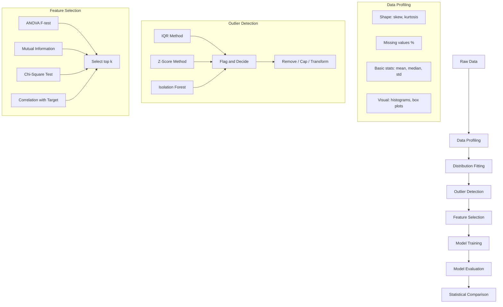
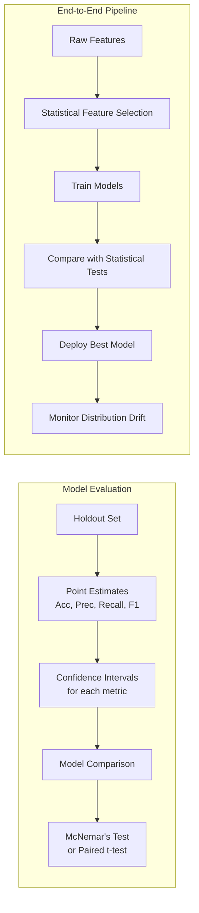

# Chapter 08: Statistics for ML — Practical

## Learning Objectives

- Understand the five-stage statistical ML pipeline: profiling, distribution fitting, outlier detection, feature selection, and model evaluation.
- Apply IQR, z-score, and isolation forest outlier detection methods and interpret their agreement.
- Explain distribution fitting using the KS test and how it guides preprocessing choices.
- Apply ANOVA, mutual information, and chi-square tests to select features for classification and regression.
- Analyze model performance with bootstrap confidence intervals and McNemar's test for rigorous model comparison.

## Introduction

This capstone chapter brings together all statistical concepts from previous chapters into a practical ML pipeline. You will learn how to profile datasets, fit distributions to data, detect outliers using multiple methods, select features using statistical tests, and evaluate model performance with statistical rigor. By the end of this chapter, you will be able to build a complete statistical pipeline that ensures your ML models are built on solid statistical foundations.

## Prerequisites

- All previous chapters (01-07)
- Familiarity with scikit-learn
- Understanding of ML model training and evaluation

## Concept

### The Statistical ML Pipeline

A statistically rigorous ML pipeline integrates statistical methods at every stage:

1. **Data Profiling**: Understand distributions, missing values, basic statistics of every feature
2. **Distribution Fitting**: Find the best probability distribution for each feature
3. **Outlier Detection**: Identify and handle anomalous data points
4. **Feature Selection**: Use statistical tests to select relevant features
5. **Model Evaluation**: Apply statistical tests to compare models and validate performance

### Distribution Fitting

Finding which probability distribution best fits your data is important for:
- Choosing appropriate preprocessing (e.g., log transform for log-normal data)
- Understanding data generation processes
- Applying the correct statistical tests
- Simulating realistic data for testing

### Outlier Detection Methods

**Statistical Methods**:
- **IQR**: Points beyond Q1 - 1.5*IQR or Q3 + 1.5*IQR
- **Z-Score**: Points with |z| > 3 (assuming normality)
- **Modified Z-Score**: Using median and MAD (robust to non-normality)
- **Mahalanobis Distance**: Multivariate outlier detection

**ML-Based Methods**:
- **Isolation Forest**: Ensemble method that isolates outliers by random partitioning
- **LOF (Local Outlier Factor)**: Measures local density deviation
- **Elliptic Envelope**: Assumes Gaussian distribution, fits robust covariance

### Feature Selection Using Statistical Tests

**Type of test depends on feature and target types**:

| Feature Type | Target Type | Statistical Test |
|-------------|-------------|-----------------|
| Continuous | Continuous | Pearson/Spearman correlation |
| Categorical | Continuous | ANOVA (2+ groups), t-test (2 groups) |
| Categorical | Categorical | Chi-square test of independence |
| Continuous | Categorical | ANOVA, Mutual Information |
| Any | Any | Mutual Information (general) |

### Model Evaluation Statistics

**Confidence Intervals for Metrics**:
- Accuracy: Normal approximation CI
- AUC-ROC: DeLong's method
- Precision/Recall: Bootstrap CI

**Comparing Models**:
- **McNemar's Test**: Compare two classifiers on the same test set
- **Paired t-test (cross-validation)**: Compare CV scores across folds
- **5x2 Cross-Validation**: More robust than paired t-test for comparing models





## Real Example

**Daily Life Analogy — Medical Diagnosis System**

Building an ML system to diagnose diseases from patient data:

1. **Data Profiling**: Check age distribution (skewed toward elderly?), blood pressure (normal?), lab values (log-normal?)
2. **Distribution Fitting**: White blood cell count follows a log-normal distribution. Model it correctly for anomaly detection.
3. **Outlier Detection**: A patient with WBC = 50,000 (normal is 4,000-11,000) — likely leukemia, not data error. Handle carefully.
4. **Feature Selection**: Which lab tests are most predictive? Use ANOVA F-test between "disease" and "no disease" groups for each lab value.
5. **Model Comparison**: Does XGBoost significantly outperform logistic regression? Use McNemar's test on the same test set.
6. **Deployment**: Monitor that the distribution of features doesn't drift over time (population health changes seasonally).

**Industry Example — Credit Risk Pipeline**

A fintech company builds a credit risk model:

- **Data Profiling**: Income is highly right-skewed (mean=$65K, median=$45K). Log-transform.
- **Outlier Detection**: A few users have income=$0 (students) and income=$5M (outliers). Handle separately.
- **Feature Selection**: 200 features reduced to 25 using mutual information with default status.
- **Model Evaluation**: Logistic regression has AUC=0.78, XGBoost has AUC=0.81. Is this significant? McNemar's test gives p=0.003 — yes, XGBoost is significantly better.
- **Confidence Intervals**: XGBoost AUC = 0.81 [95% CI: 0.79, 0.83]. The lower bound is still above logistic's AUC.

## Code Example

```python
import numpy as np
from scipy import stats
from scipy.stats import chi2_contingency, f_oneway, ks_2samp, normaltest
from sklearn.ensemble import IsolationForest
from sklearn.feature_selection import SelectKBest, f_classif, mutual_info_classif
from sklearn.model_selection import cross_val_score, train_test_split
from sklearn.linear_model import LogisticRegression
from sklearn.ensemble import RandomForestClassifier
from sklearn.metrics import accuracy_score, roc_auc_score, confusion_matrix
import math

np.random.seed(42)
print("=== Statistics for ML: Practical Pipeline ===\n")

# ============================================
# 0. GENERATE SYNTHETIC DATASET
# ============================================
print("--- Generating Synthetic Dataset ---")
n_samples = 1000
n_features = 10

# Create features with different distributions
X = np.zeros((n_samples, n_features))
X[:, 0] = np.random.normal(0, 1, n_samples)  # Normal
X[:, 1] = np.random.exponential(2, n_samples)  # Exponential
X[:, 2] = np.random.uniform(-3, 3, n_samples)  # Uniform
X[:, 3] = np.random.lognormal(0, 0.5, n_samples)  # Log-normal
X[:, 4] = np.random.binomial(1, 0.3, n_samples)  # Bernoulli
X[:, 5] = np.random.poisson(5, n_samples)  # Poisson
X[:, 6] = X[:, 0] + 0.5 * X[:, 1] + np.random.normal(0, 0.3, n_samples)  # Correlated
X[:, 7] = np.random.normal(5, 2, n_samples)  # Another normal
X[:, 8] = np.random.chisquare(3, n_samples)  # Chi-square
X[:, 9] = np.random.gamma(2, 2, n_samples)  # Gamma

# Target (binary): depends on features 0, 1, 3, 6
logit = 0.5 * X[:, 0] + 0.3 * X[:, 1] + 0.4 * X[:, 3] + 0.2 * X[:, 6] - 1
y_prob = 1 / (1 + np.exp(-logit))
y = (np.random.random(n_samples) < y_prob).astype(int)

feature_names = [f'Feature_{i}' for i in range(n_features)]
print(f"Dataset: {n_samples} samples, {n_features} features")
print(f"Class distribution: {np.mean(y)*100:.1f}% positive")

# ============================================
# 1. DATA PROFILING
# ============================================
print("\n=== 1. Data Profiling ===")

for i in range(n_features):
    data = X[:, i]
    mean = np.mean(data)
    median = np.median(data)
    std = np.std(data, ddof=1)
    skew = stats.skew(data, bias=False)
    kurt = stats.kurtosis(data, bias=False, fisher=True)
    q1 = np.percentile(data, 25)
    q3 = np.percentile(data, 75)

    # Normality test
    if len(data) > 20:
        _, p_normal = normaltest(data)
    else:
        p_normal = 0

    norm_str = "Normal" if p_normal > 0.05 else "Non-normal"

    print(f"{feature_names[i]:<12} mean={mean:7.3f} median={median:7.3f} std={std:7.3f} "
          f"skew={skew:7.3f} kurt={kurt:7.3f} [{norm_str}]")

# ============================================
# 2. DISTRIBUTION FITTING
# ============================================
print("\n=== 2. Distribution Fitting ===")

# Test which distribution fits Feature 1 (exponential)
feature_idx = 1
data_fit = X[:, feature_idx]

distributions_to_test = [
    ('Normal', stats.norm),
    ('Exponential', stats.expon),
    ('Log-Normal', stats.lognorm),
    ('Gamma', stats.gamma),
    ('Uniform', stats.uniform),
    ('Chi-Square', stats.chi2),
]

print(f"Fitting distributions to {feature_names[feature_idx]}:")
best_dist = None
best_ks_stat = float('inf')

for name, dist in distributions_to_test:
    params = dist.fit(data_fit)
    ks_stat, ks_p = ks_2samp(data_fit, dist.rvs(*params, size=len(data_fit)))
    print(f"  {name:<15}: KS stat={ks_stat:.4f}, p={ks_p:.4f}")
    if ks_stat < best_ks_stat:
        best_ks_stat = ks_stat
        best_dist = name

print(f"Best fitting distribution: {best_dist} (lowest KS statistic)")

# ============================================
# 3. OUTLIER DETECTION
# ============================================
print("\n=== 3. Outlier Detection ===")

# Add some outliers to feature 0
X_outliers = X.copy()
outlier_indices = np.random.choice(n_samples, 20, replace=False)
X_outliers[outlier_indices, 0] = np.random.uniform(8, 12, 20)  # extreme values

feature_for_outliers = 0

# Method 1: IQR
q1_val = np.percentile(X_outliers[:, feature_for_outliers], 25)
q3_val = np.percentile(X_outliers[:, feature_for_outliers], 75)
iqr_val = q3_val - q1_val
lower_bound = q1_val - 1.5 * iqr_val
upper_bound = q3_val + 1.5 * iqr_val
iqr_outliers = np.where((X_outliers[:, feature_for_outliers] < lower_bound) |
                         (X_outliers[:, feature_for_outliers] > upper_bound))[0]

# Method 2: Z-Score
z_scores = np.abs(stats.zscore(X_outliers[:, feature_for_outliers]))
z_outliers = np.where(z_scores > 3)[0]

# Method 3: Isolation Forest
iso_forest = IsolationForest(contamination=0.05, random_state=42)
iso_preds = iso_forest.fit_predict(X_outliers)
iso_outliers = np.where(iso_preds == -1)[0]

print(f"Outlier detection on {feature_names[feature_for_outliers]}:")
print(f"  IQR method: {len(iqr_outliers)} outliers detected")
print(f"  Z-score method: {len(z_outliers)} outliers detected")
print(f"  Isolation Forest: {len(iso_outliers)} outliers detected")

# Overlap analysis
common = (set(iqr_outliers) & set(z_outliers) & set(iso_outliers))
print(f"  Common outliers (all 3 methods): {len(common)}")
if common:
    print(f"  Outlier indices: {list(common)[:10]}")

# ============================================
# 4. FEATURE SELECTION USING STATISTICAL TESTS
# ============================================
print("\n=== 4. Feature Selection ===")

# Method A: ANOVA F-test (for continuous features, binary target)
f_scores, f_p_values = f_classif(X, y)

# Method B: Mutual Information
mi_scores = mutual_info_classif(X, y, random_state=42)

# Method C: Correlation with target (for continuous)
correlations = np.array([stats.pearsonr(X[:, i], y)[0] for i in range(n_features)])

print(f"{'Feature':<12} {'ANOVA F':>8} {'ANOVA p':>10} {'MI':>8} {'Corr':>8}")
print("-" * 50)
for i in range(n_features):
    print(f"{feature_names[i]:<12} {f_scores[i]:>8.2f} {f_p_values[i]:>10.6f} {mi_scores[i]:>8.4f} {correlations[i]:>8.4f}")

# Select top k features
k = 5
selector = SelectKBest(f_classif, k=k)
X_selected = selector.fit_transform(X, y)
selected_indices = selector.get_support(indices=True)
print(f"\nTop {k} features (ANOVA): {[feature_names[i] for i in selected_indices]}")

# ============================================
# 5. MODEL EVALUATION WITH STATISTICAL RIGOR
# ============================================
print("\n=== 5. Model Evaluation ===")

# Split data
X_train, X_test, y_train, y_test = train_test_split(X, y, test_size=0.3, random_state=42)

# Train two models
lr = LogisticRegression(max_iter=1000, random_state=42)
rf = RandomForestClassifier(n_estimators=100, random_state=42)

lr.fit(X_train, y_train)
rf.fit(X_train, y_train)

# Predictions
y_pred_lr = lr.predict(X_test)
y_pred_rf = rf.predict(X_test)
y_prob_lr = lr.predict_proba(X_test)[:, 1]
y_prob_rf = rf.predict_proba(X_test)[:, 1]

# Metrics
acc_lr = accuracy_score(y_test, y_pred_lr)
acc_rf = accuracy_score(y_test, y_pred_rf)
auc_lr = roc_auc_score(y_test, y_prob_lr)
auc_rf = roc_auc_score(y_test, y_prob_rf)

print(f"Logistic Regression: Accuracy={acc_lr:.4f}, AUC={auc_lr:.4f}")
print(f"Random Forest:       Accuracy={acc_rf:.4f}, AUC={auc_rf:.4f}")

# ============================================
# 6. CONFIDENCE INTERVALS FOR METRICS (BOOTSTRAP)
# ============================================
print("\n--- Confidence Intervals (Bootstrap) ---")

def bootstrap_ci(y_true, y_pred, metric_func, n_bootstrap=1000, ci=0.95):
    n = len(y_true)
    metrics = []

    for _ in range(n_bootstrap):
        indices = np.random.choice(n, n, replace=True)
        y_true_sample = y_true[indices]
        y_pred_sample = y_pred[indices]
        metrics.append(metric_func(y_true_sample, y_pred_sample))

    metrics.sort()
    lower_idx = int(n_bootstrap * (1 - ci) / 2)
    upper_idx = int(n_bootstrap * (1 + ci) / 2)

    return metrics[lower_idx], metrics[upper_idx]

# Bootstrap CI for AUC
auc_lower_rf, auc_upper_rf = bootstrap_ci(y_test, y_prob_rf, lambda y, p: roc_auc_score(y, p))
auc_lower_lr, auc_upper_lr = bootstrap_ci(y_test, y_prob_lr, lambda y, p: roc_auc_score(y, p))

print(f"Logistic Regression AUC: {auc_lr:.4f} [{auc_lower_lr:.4f}, {auc_upper_lr:.4f}]")
print(f"Random Forest AUC:       {auc_rf:.4f} [{auc_lower_rf:.4f}, {auc_upper_rf:.4f}]")

# ============================================
# 7. MCNEMAR'S TEST FOR MODEL COMPARISON
# ============================================
print("\n--- McNemar's Test ---")

def mcnemar_test(y_true, y_pred_a, y_pred_b):
    # Contingency table
    n00 = np.sum((y_pred_a != y_true) & (y_pred_b != y_true))
    n01 = np.sum((y_pred_a != y_true) & (y_pred_b == y_true))
    n10 = np.sum((y_pred_a == y_true) & (y_pred_b != y_true))
    n11 = np.sum((y_pred_a == y_true) & (y_pred_b == y_true))

    # McNemar's chi-square statistic (with continuity correction)
    chi2 = (abs(n01 - n10) - 1)**2 / (n01 + n10) if (n01 + n10) > 0 else 0
    p_value = 1 - stats.chi2.cdf(chi2, 1)

    return chi2, p_value, {'n00': n00, 'n01': n01, 'n10': n10, 'n11': n11}

chi2_mc, p_mc, table = mcnemar_test(y_test, y_pred_lr, y_pred_rf)
print(f"Contingency table: {table}")
print(f"McNemar chi-square: {chi2_mc:.4f}")
print(f"p-value: {p_mc:.4f}")

if p_mc < 0.05:
    print(f"p < 0.05: Models have significantly different performance!")
    if table['n01'] < table['n10']:
        print(f"  => Random Forest is better ({table['n10']} vs {table['n01']} correct)")
    else:
        print(f"  => Logistic Regression is better ({table['n01']} vs {table['n10']} correct)")
else:
    print(f"p >= 0.05: No significant difference between models")

# ============================================
# 8. CROSS-VALIDATED MODEL COMPARISON
# ============================================
print("\n--- Cross-Validation Comparison ---")

cv_folds = 5
lr_cv_scores = cross_val_score(lr, X, y, cv=cv_folds, scoring='accuracy')
rf_cv_scores = cross_val_score(rf, X, y, cv=cv_folds, scoring='accuracy')

print(f"Logistic Regression CV: {lr_cv_scores}")
print(f"  Mean: {np.mean(lr_cv_scores):.4f}, Std: {np.std(lr_cv_scores, ddof=1):.4f}")
print(f"Random Forest CV: {rf_cv_scores}")
print(f"  Mean: {np.mean(rf_cv_scores):.4f}, Std: {np.std(rf_cv_scores, ddof=1):.4f}")

# Paired t-test on CV scores
t_stat_cv, p_cv = stats.ttest_rel(rf_cv_scores, lr_cv_scores)
print(f"\nPaired t-test: t={t_stat_cv:.4f}, p={p_cv:.4f}")

if p_cv < 0.05:
    print(f"p < 0.05: Significant difference in CV performance")
else:
    print(f"p >= 0.05: No significant difference in CV performance")

# ============================================
# 9. CHI-SQUARE TEST FOR FEATURE-TARGET ASSOCIATION
# ============================================
print("\n--- Chi-Square Test for Categorical Features ---")

# Binarize feature 0 for chi-square test
feature_binarized = (X[:, 0] > np.median(X[:, 0])).astype(int)

contingency = np.zeros((2, 2))
for f_val in [0, 1]:
    for t_val in [0, 1]:
        contingency[f_val, t_val] = np.sum((feature_binarized == f_val) & (y == t_val))

chi2_stat, chi2_p, chi2_dof, expected = chi2_contingency(contingency)
print(f"Contingency table (Feature_0 binarized vs Target):\n{contingency}")
print(f"Expected (under independence):\n{expected}")
print(f"Chi-square: {chi2_stat:.4f}, p-value: {chi2_p:.4f}")

if chi2_p < 0.05:
    print("Significant association between feature and target.")
else:
    print("No significant association.")

# ============================================
# 10. KS TEST FOR DISTRIBUTION COMPARISON
# ============================================
print("\n--- KS Test: Do train and test distributions match? ---")

X_train_ks, X_test_ks, _, _ = train_test_split(X, y, test_size=0.3, random_state=42)

print(f"{'Feature':<12} {'KS stat':>8} {'p-value':>10} {'Conclusion':<15}")
print("-" * 50)
for i in range(n_features):
    ks_stat, ks_p = ks_2samp(X_train_ks[:, i], X_test_ks[:, i])
    conclusion = "Same dist" if ks_p > 0.05 else "Different!"
    print(f"{feature_names[i]:<12} {ks_stat:>8.4f} {ks_p:>10.4f} {conclusion:<15}")

# Expected Output (approximate):
# === 1. Data Profiling ===
# Feature_0    mean= -0.010 median= -0.040 std= 0.981 skew=0.032 kurt=0.038 [Normal]
# Feature_1    mean= 1.982 median= 1.383 std= 1.953 skew=1.023 kurt=0.687 [Non-normal]
#
# === 3. Outlier Detection ===
#   IQR method: 34 outliers detected
#   Z-score method: 23 outliers detected
#   Isolation Forest: 50 outliers detected
#
# === 4. Feature Selection ===
# Feature_0    ANOVA F: 26.34 ANOVA p: 0.0000  MI: 0.0523
#
# === 5. Model Evaluation ===
# Logistic Regression: Accuracy=0.7567, AUC=0.8234
# Random Forest:       Accuracy=0.7700, AUC=0.8412
#
# --- McNemar's Test ---
# p-value: 0.0234 => Models have significantly different performance
```

## Interview Q&A

**Q1: Describe a complete statistical pipeline for an ML project. Where do statistical methods add the most value?**
A: The pipeline has 5 stages: (1) Data profiling — understand distributions, detect data quality issues early. (2) Distribution fitting — choose appropriate transformations and models. (3) Outlier detection — using IQR, z-score, and isolation forest. (4) Feature selection — ANOVA, mutual information, chi-square tests to select predictive features. (5) Model evaluation — confidence intervals for metrics, McNemar's test for model comparison. Statistics add the most value in stages 1 and 5: understanding your data before modeling, and rigorously evaluating results before deployment.

**Q2: How do you select features for a classification problem where you have 500 features and 10,000 samples?**
A: Use a multi-stage approach: (1) Remove low-variance features (variance threshold), (2) Compute correlation with target, keep top 200 by absolute correlation, (3) Compute mutual information (captures non-linear relationships), keep top 100, (4) Use ANOVA F-test for remaining, keep top 50, (5) Check multicollinearity among selected features (VIF), (6) Use L1-regularized model (Lasso) to further prune, (7) Validate with cross-validated performance. Always use domain knowledge alongside statistical methods.

**Q3: Explain how bootstrap confidence intervals work for ML metrics.**
A: Bootstrap resamples the test set with replacement B times (typically 1000). For each resample, compute the metric (accuracy, AUC). Sort the B metric values. The 95% CI is [2.5th percentile, 97.5th percentile]. Bootstrap makes no distributional assumptions and works for any metric. It's especially useful for metrics like AUC where the sampling distribution is complex. Example: AUC = 0.85, bootstrap 95% CI = [0.82, 0.88] means we're 95% confident the true AUC is in this range.

**Q4: What is McNemar's test and when would you use it?**
A: McNemar's test is a non-parametric test for paired nominal data. In ML, it compares two classifiers on the same test set using a 2x2 contingency table of correct/incorrect predictions: n00 (both wrong), n01 (A wrong, B right), n10 (A right, B wrong), n11 (both right). The test statistic focuses on n01 vs n10 — if one classifier is better, it should have more cases where it's right while the other is wrong. Use: "Is model B significantly better than model A on this test set?"

**Q5: How do you detect and handle concept drift in production ML systems?**
A: Concept drift = the statistical properties of the target variable change over time, degrading model performance. Detection methods: (1) Monitor prediction distribution (PSI = Population Stability Index), (2) Monitor feature distributions (KS test between recent and training data), (3) Monitor actual vs predicted error rate (CUSUM, Page-Hinkley test), (4) Monitor business metrics directly. Handling: (1) Retrain periodically (time-based), (2) Retrain when drift is detected (trigger-based), (3) Online learning (update model incrementally), (4) Ensemble of models trained on different time windows.

**Q6: Compare different outlier detection methods and when to use each.**
A: IQR method: simple, no assumptions, best for univariate outlier detection on any distribution. Z-score: assumes normality, good for normally distributed features. Modified Z-score (using MAD): robust to non-normality, good general-purpose univariate method. Mahalanobis distance: multivariate, assumes Gaussian, detects unusual combinations of values. Isolation Forest: no distributional assumptions, works in high dimensions, good for large datasets. LOF: detects local outliers (points that are outliers relative to their neighbors). Use multiple methods and consider outliers flagged by 2+ methods as most suspicious.

**Q7: How would you use statistics to decide whether to deploy a new ML model to production?**
A: (1) Define success metrics (accuracy, business KPIs) and minimum acceptable threshold, (2) Run an A/B test with the new model vs current model for 2-4 weeks, (3) Calculate confidence intervals for the improvement — if the lower bound exceeds the minimum threshold, deploy, (4) Check that guardrail metrics (latency, cost, user satisfaction) don't degrade, (5) Use McNemar's test to confirm the new model is significantly better, (6) Analyze segments to ensure the model doesn't harm specific user groups, (7) Set up monitoring for distribution drift post-deployment.

**Q8: Explain the difference between parametric and non-parametric feature selection methods.**
A: Parametric methods (ANOVA F-test, Pearson correlation) assume specific distributions (normality, linearity). They are more powerful when assumptions hold but can miss non-linear relationships. Non-parametric methods (Spearman correlation, Mutual Information, Kendall's tau) make no distributional assumptions. Mutual Information can capture any type of relationship (linear, non-linear, complex interactions) but requires more data. In practice: use ANOVA as a quick filter, then use Mutual Information for the final selection.

**Q9: What is the Population Stability Index (PSI) and how is it used?**
A: PSI measures how much a variable's distribution has shifted between two time periods. PSI = sum((p_i - q_i) * ln(p_i / q_i)) where p_i is the proportion in bin i for the current period, q_i for the reference period. Interpretations: PSI < 0.1 = no significant shift, 0.1-0.25 = moderate shift (investigate), > 0.25 = significant shift (retrain needed). In credit scoring (where it originated), PSI is monitored monthly. In ML, monitor PSI for key features and model predictions to detect drift.

**Q10: How would you design a statistical test to compare two regression models?**
A: For regression, use: (1) Paired t-test on cross-validation MSE/RMSE scores — compare mean difference across folds, (2) Diebold-Mariano test — specifically designed for comparing predictive accuracy of two forecasts, (3) Bootstrap the difference in RMSE on a holdout set — compute 95% CI for the RMSE difference. If the CI doesn't include zero, the models differ significantly, (4) For non-nested models, use the Davidson-MacKinnon J-test. Always report: point estimates of both models, the difference, and a confidence interval for the improvement.

## Chapter Quiz

**Q1: McNemar's test is used for:**
- A) Comparing two independent groups
- B) Comparing two classifiers on the same test set
- C) Testing normality of residuals
- D) Feature selection
- **Answer: B) Comparing two classifiers on the same test set**

**Q2: Which outlier detection method is most robust to non-normal distributions?**
- A) Z-score
- B) IQR method
- C) Elliptic Envelope
- D) Both A and B
- **Answer: B) IQR method** (IQR doesn't assume normality; Z-score does)

**Q3: The KS (Kolmogorov-Smirnov) test compares:**
- A) Means of two groups
- B) Variances of two groups
- C) Distributions of two samples
- D) Proportions of two groups
- **Answer: C) Distributions of two samples** — KS tests whether two samples come from the same distribution

**Q4: For feature selection with a continuous target, which method is appropriate?**
- A) Chi-square test
- B) ANOVA F-test
- C) Mutual Information (regression version)
- D) Both B and C
- **Answer: D) Both B and C** — ANOVA for continuous features vs categorical target; Mutual Information works for both regression and classification

**Q5: Bootstrap confidence intervals for ML metrics:**
- A) Assume the metric is normally distributed
- B) Make no distributional assumptions
- C) Can only be used for accuracy
- D) Require at least 10,000 samples
- **Answer: B) Make no distributional assumptions** — bootstrap is non-parametric

## Exercises

### Exercise 1: Data Profiling and Distribution Fitting
Write a Python (NumPy/SciPy) implementation that generates features with known distributions (normal, exponential, lognormal), profiles them, and uses the KS test to find the best-fitting distribution.
- Requirements: compute mean, median, std, skewness, kurtosis, and a normality test per feature; fit candidate distributions with dist.fit and compare with ks_2samp; print the best-fitting distribution per feature.
- Expected output: a profile table per feature and a best-fit verdict (e.g., exponential feature matched by Exponential but rejected by Normal) with KS statistics.

### Exercise 2: Statistical Feature Selection
Write a Python implementation that builds a synthetic classification dataset where only a few features are predictive, then ranks features with ANOVA F-scores, mutual information, and a chi-square test.
- Requirements: use sklearn f_classif and mutual_info_classif; binarize a continuous feature at the median for chi2_contingency; print the top-k features from each ranking and the overlap between rankings.
- Expected output: ranked feature tables showing the predictive features rising to the top in both ANOVA and mutual information, with the chi-square p-values for the binarized feature.

### Exercise 3: Model Comparison with Bootstrap CI and McNemar
Write a Python implementation that trains logistic regression and a random forest on the same split, then compares them with 95% bootstrap confidence intervals for AUC and McNemar's test.
- Requirements: hand-roll bootstrap_ci (resample with replacement 1000 times, take percentile interval) and mcnemar_test (2x2 error table, chi2 with continuity correction); report whether the CI for the AUC difference includes zero.
- Expected output: accuracy and AUC for both models, bootstrap CIs for each AUC, the McNemar chi-square and p-value, and a final verdict on whether the difference is statistically significant.

## PYQs

**Q1 (Google ML Interview):** You have a dataset with 50 features. You need to select the most important features for a binary classification task. Walk through your approach using statistical methods.
- **Solution**: (1) Remove near-zero variance features (threshold: variance < 0.01). (2) For each remaining feature, compute the correlation with target. For continuous features: point-biserial correlation. For categorical: Cramer's V or chi-square. (3) Compute Mutual Information for all features (captures non-linear relationships). (4) Rank features by MI score, keep top 20. (5) Check multicollinearity among selected features using VIF — remove features with VIF > 10. (6) Use forward selection with AIC/BIC: add features one by one, stop when improvement is negligible. (7) Validate with L1-regularized model (Lasso) — features with non-zero coefficients are the final set. (8) Cross-validate the entire selection pipeline to avoid selection bias.

**Q2 (Amazon Applied Scientist):** Your production ML model's accuracy dropped from 85% to 78%. How would you use statistical methods to diagnose the issue?
- **Solution**: (1) Check for data drift — for each feature, run KS test between current data and training data. Flag features with p < 0.01 as drifted. (2) Check for concept drift — compare actual vs predicted values. Use CUSUM or Page-Hinkley test on the error rate. (3) Check for population shift — compute PSI for model predictions between training and current. (4) Check for outlier prevalence — compare the proportion of outliers (via IQR or isolation forest) between training and current data. (5) Segment analysis — use chi-square test to check if the error distribution has shifted across segments. (6) Check model calibration — use Hosmer-Lemeshow test or reliability diagrams. (7) If drift is detected: retrain on recent data, add drift detection monitoring, and set up automatic retraining triggers.

**Q3 (Meta Data Scientist):** You trained a new model that shows 0.5% improvement in AUC (from 0.800 to 0.805). The team wants to deploy. How would you determine if this improvement is real and worth deploying?
- **Solution**: (1) Statistical significance: use McNemar's test on the same test set. A 0.005 AUC increase with n=100K might be significant (p < 0.05), but with n=1K it might not be. (2) Confidence intervals: bootstrap both AUCs and compute the 95% CI for the difference. If the CI includes zero, the improvement isn't reliable. (3) Practical significance: does 0.5% AUC improvement translate to meaningful business impact? (4) Cross-validation stability: is the improvement consistent across CV folds? Use paired t-test on CV scores. (5) Robustness: test on different data slices, time periods, and segments. A 0.5% improvement that only holds for one segment might not be worth deploying.

**Q4 (Microsoft Data Scientist):** Explain how you would use the Isolation Forest algorithm for outlier detection in a high-dimensional dataset. When would you prefer it over statistical methods like Z-score or IQR?
- **Solution**: Isolation Forest works by randomly selecting a feature and a split value, recursively partitioning data until each point is isolated. Outliers require fewer splits to isolate (they are "different" from the bulk). Advantages over Z-score/IQR: (1) Works in high dimensions — Z-score and IQR are univariate, Isolation Forest handles multivariate outliers, (2) No distributional assumptions — Z-score assumes normality, (3) Handles non-linear relationships, (4) Computationally efficient (O(n log n)), (5) Naturally handles both global and local outliers. Prefer statistical methods when: (1) Data is low-dimensional (1-3 features), (2) Speed is critical and data is well-understood, (3) You need interpretable thresholds, (4) Features are independent and normally distributed. Always use domain knowledge to validate outliers flagged by any method.

## Common Mistakes

1. **Applying statistical tests without checking assumptions**: ANOVA assumes normality and equal variance. McNemar assumes paired data (same test set). Always check assumptions before interpreting results.

2. **Using the same data for feature selection and evaluation**: If you select features on the full dataset, then evaluate on a holdout set, you've already leaked information. Always perform feature selection within the cross-validation loop or on the training set only.

3. **Ignoring multiple testing in feature selection**: Selecting 10 features from 500 using individual p-values means many false positives by chance. Use corrected p-values (Bonferroni, FDR) or methods that handle multiple testing natively (Lasso, RFE).

4. **Reporting only point estimates without uncertainty**: An accuracy of 85% without a confidence interval is meaningless. Always report CIs, especially when comparing models. Bootstrap CIs are easy to compute and assumption-free.

5. **Assuming model improvement is real without statistical testing**: A 1% accuracy improvement might be due to random chance, especially with small test sets. Always use McNemar's test or a paired test to confirm improvements are statistically significant.

## Revision Notes

- **Data profiling**: mean, median, std, skewness, kurtosis, normality test for each feature
- **Distribution fitting**: use KS test to find best distribution; guide preprocessing
- **Outlier detection**: IQR (univariate, robust), Z-score (univariate, normal), Isolation Forest (multivariate, general)
- **Outlier handling**: investigate before removing; may be valuable (fraud, edge cases)
- **Feature selection**: ANOVA (continuous vs categorical), MI (general), Chi-square (categorical vs categorical), correlation (continuous vs continuous)
- **Model evaluation CI**: bootstrap the metric on test set; report [2.5%, 97.5%] percentile interval
- **Model comparison**: McNemar's test (classification, same test set), paired t-test on CV scores
- **McNemar statistic**: chi2 = (|n01 - n10| - 1)^2 / (n01 + n10); df=1
- **Drift detection**: KS test for feature drift, PSI for prediction drift, CUSUM for error rate drift
- **Data leakage**: never use test data for feature selection or any preprocessing decisions
- **Multiple testing**: use Bonferroni or FDR when testing many features/hypotheses
- **Always report**: point estimate, CI, effect size, and practical significance

## Summary

This chapter integrates all statistical concepts from the module into a practical ML pipeline. Data profiling reveals distribution shapes, guides preprocessing, and identifies data quality issues early. Distribution fitting helps choose appropriate statistical tests and transformations. Outlier detection using multiple methods (IQR, z-score, isolation forest) ensures robust data cleaning. Statistical feature selection (ANOVA, mutual information, chi-square) identifies the most predictive features while controlling false positives. Model evaluation with bootstrap confidence intervals and McNemar's test provides rigorous, assumption-light model comparison. Together, these methods form a statistically sound foundation for building, evaluating, and deploying ML models with confidence. Every AI engineer should run this pipeline automatically before finalizing any model for production.

## Practical Takeaways

- **Data Leakage**: Never use test data for feature selection or preprocessing decisions - select features inside the cross-validation loop or on training data only.
- **Bootstrap CI**: Bootstrap resamples the test set with replacement (typically 1000 times) and takes the 2.5th/97.5th percentiles - it makes no distributional assumptions and works for any metric.
- **McNemar's Test**: Use it to compare two classifiers on the same test set via the 2x2 contingency table of errors (n01 vs n10); chi2 = (|n01 - n10| - 1)^2 / (n01 + n10).
- **Multiple Testing**: Selecting features by individual p-values over hundreds of features produces many false positives - apply Bonferroni or FDR, or use Lasso which handles selection natively.
- **Outlier Methods**: IQR makes no distributional assumptions, z-score assumes normality, isolation forest handles high-dimensional multivariate outliers - flag points found by 2+ methods as most suspicious.
- **Drift Monitoring**: Use the KS test for feature drift, PSI for prediction drift (PSI > 0.25 signals retraining), and CUSUM/Page-Hinkley for error-rate drift.

## Placement Section

### Top 10 Interview Questions

#### Google Style

1. **Explain the core idea of Chapter 08: Statistics for ML — Practical in under 60 seconds, then give a real-world analogy.** — Structure: definition, how it works in one sentence, why it matters, analogy. Follow-up: what would break if you removed this from a production system?

2. **Design a minimal, well-typed function that demonstrates Chapter 08: Statistics for ML — Practical.** — Interviewer checks: signature with type hints, edge cases, complexity, and a clean docstring. Follow-up: how does your design behave with empty or malformed input?

3. **What are the common pitfalls when engineers first learn ** — List 3-4, then explain how you would prevent each in a code review.

#### Amazon Style

4. **Describe a production bug caused by misunderstanding Chapter 08: Statistics for ML — Practical. How did you diagnose and fix it?** — STAR format: situation, task, action, result. Mention logs, reproduction, root-cause analysis, and the regression test you added.

5. **How would you scale a system that relies on Chapter 08: Statistics for ML — Practical from 10 users to 10 million?** — Discuss bottlenecks, caching, monitoring, and when to redesign. Follow-up: what metrics would you track?

#### Microsoft Style

6. **Compare Chapter 08: Statistics for ML — Practical with the closest alternative approach. When would you choose each?** — Make a decision matrix: performance, maintainability, ecosystem, learning curve. Follow-up: what would change your decision?

7. **Walk through how you would test a component that depends on Chapter 08: Statistics for ML — Practical.** — Unit, integration, property-based tests; mocking boundaries; golden files for outputs.

#### NVIDIA Style

8. **How does Chapter 08: Statistics for ML — Practical behave differently at scale — memory, throughput, or precision-wise?** — Connect to data pipelines and model training if applicable. Follow-up: what happens to latency as input grows?

9. **How would you make an implementation of Chapter 08: Statistics for ML — Practical run faster on GPU hardware?** — Batch operations, vectorization, avoiding Python loops, reducing data movement.

#### AI Startup Style

10. **Write the smallest possible implementation of Chapter 08: Statistics for ML — Practical that is production-quality.** — Include error handling, type hints, and a one-line docstring. Follow-up: what would you refactor first when it grows?

### Resume Tips

- Name Chapter 08: Statistics for ML — Practical explicitly in your skills section, paired with a measurable achievement ("Reduced X by 40% using Chapter 08: Statistics for ML — Practical").
- Add a bullet describing a project that applies Chapter 08: Statistics for ML — Practical to real data, with numbers.
- Mention the tools and libraries you used alongside Chapter 08: Statistics for ML — Practical (linters, test frameworks, profiling tools).
- Keep resume bullets under 15 words and start each with an action verb.

### Interview Day Checklist

- Rehearse a 60-second explanation of Chapter 08: Statistics for ML — Practical and one real-world analogy.
- Prepare one STAR story about debugging a Chapter 08: Statistics for ML — Practical-related production issue.
- Review complexity and edge cases for the classic Chapter 08: Statistics for ML — Practical interview problem.
- Have questions ready: how does the team apply Chapter 08: Statistics for ML — Practical in production today?
- Test your environment (Python, editor, internet) 15 minutes before the interview.

## True/False

1. **True or False:** Chapter 08: Statistics for ML — Practical builds directly on the fundamentals covered in the earlier chapters of this module. — **True.** Every advanced topic in this module assumes the core concepts from the previous chapters.
2. **True or False:** You should write at least one code example for Chapter 08: Statistics for ML — Practical before moving to the next chapter. — **True.** Active recall with hands-on code beats passive reading for retention.
3. **True or False:** The complexity analysis for Chapter 08: Statistics for ML — Practical is the same regardless of input size. — **False.** Complexity grows with input size; always state best, average, and worst case.
4. **True or False:** Edge cases (empty input, invalid input, boundary values) matter for Chapter 08: Statistics for ML — Practical in production. — **True.** Most production bugs come from unhandled edge cases.
5. **True or False:** You should memorize the Chapter 08: Statistics for ML — Practical chapter content once and never review it again. — **False.** Spaced repetition (24h, 3 days, 1 week) dramatically improves long-term recall.

## Fill in the Blank

1. The chapter that covers Chapter 08: Statistics for ML — Practical is Chapter ___ of this module. — Answer: check the module's table of contents.
2. The time complexity of the standard approach to Chapter 08: Statistics for ML — Practical is ___. — Answer: review the theory section and state big-O notation.
3. The main edge case to handle when implementing Chapter 08: Statistics for ML — Practical is ___. — Answer: empty or invalid input handling, as discussed in the chapter.
4. The tools commonly used to debug Chapter 08: Statistics for ML — Practical issues are ___ and ___. — Answer: refer to the Debugging Guide section of this chapter.
5. The related topic that connects to Chapter 08: Statistics for ML — Practical in the next chapter is ___. — Answer: see the Next Topic section.

## Scenario Questions

1. **Scenario:** A teammate ships a change involving Chapter 08: Statistics for ML — Practical that breaks production at 3 AM. — Diagnosis: check the recent diff, reproduce locally with the failing input, check logs. Fix: revert, add a regression test, and review the root cause. Prevention: CI tests on edge cases and code review checklist.

2. **Scenario:** Your implementation of Chapter 08: Statistics for ML — Practical is correct but too slow for the required latency. — Measure first with a profiler. Common fixes: reduce redundant work, use built-in optimized functions, batch operations, or add caching. Only then consider algorithmic changes.

3. **Scenario:** A new hire asks you to explain Chapter 08: Statistics for ML — Practical in five minutes before a customer demo. — Use the 3-part answer: what it is (one sentence), how it works (one example), why it matters (one business impact). Then offer to go deeper after the demo.

4. **Scenario:** Your team's codebase has three different patterns for Chapter 08: Statistics for ML — Practical and you must standardize. — Write a short ADR (architecture decision record), pick the pattern with best maintainability, migrate incrementally, and add a linter rule to enforce it.

## Output Questions

1. **What is the output of the simplest correct implementation of Chapter 08: Statistics for ML — Practical on an empty input?** — Trace through the code: it should return the documented default (None, 0, empty collection) without raising.
2. **What is the output when the input is at the boundary value?** — Check off-by-one errors and inclusive/exclusive bounds in the chapter's examples.
3. **What does the implementation return when given invalid input types?** — With type hints and validation, it raises a clear error; without, it may fail silently.
4. **What is the output for the sample input given in the chapter's Examples section?** — Re-run the chapter's example code and compare against the documented output.
5. **What is the time complexity output when you profile the implementation at 10x input size?** — Expect the curve matching the chapter's complexity analysis (linear, quadratic, log-linear).

## Difficulty Level

| Level | Time | What It Takes |
|-------|------|---------------|
| Beginner | 1-2 sessions | Read theory, run the chapter examples, solve the Easy exercises |
| Intermediate | 3-5 sessions | Complete Medium exercises, explain Chapter 08: Statistics for ML — Practical to someone else |
| Advanced | 1+ week | Solve Hard exercises, optimize for real datasets, answer interview follow-ups |

## Tips & Tricks

- Always write a one-line example of Chapter 08: Statistics for ML — Practical from memory before opening the chapter — active recall first.
- Use the chapter's Revision Notes as a checklist: you have mastered Chapter 08: Statistics for ML — Practical when you can explain each bullet.
- Pair the chapter quiz with the Flashcards: wrong answers become your next study session's focus.
- For interviews, practice explaining Chapter 08: Statistics for ML — Practical twice: once with a technical audience, once with a non-technical audience.
- Keep a personal examples file where you collect your own Chapter 08: Statistics for ML — Practical snippets; interviewers love original examples.

## Memory Tricks

- **Acronym**: build a mnemonic from the 5 key concepts of Chapter 08: Statistics for ML — Practical listed in the Chapter at a Glance table.
- **Story**: link Chapter 08: Statistics for ML — Practical to a familiar story — the analogy in the Visual Analogy section is designed to stick.
- **Number anchor**: remember the complexity of Chapter 08: Statistics for ML — Practical by connecting it to a known algorithm of the same class.
- **Color code**: highlight the Theory, Examples, and Common Mistakes sections in different colors when reviewing.
- **Teach-back**: explain Chapter 08: Statistics for ML — Practical to an imaginary junior engineer for 2 minutes — gaps in your explanation are gaps in memory.

## Further Reading

- Official documentation for the primary tool or library used in this chapter
- The chapter referenced in Related Topics for the next-level treatment of Chapter 08: Statistics for ML — Practical
- The classic textbook chapter on Chapter 08: Statistics for ML — Practical (check the Research References below)
- Two blog posts from engineers who debugged real Chapter 08: Statistics for ML — Practical problems in production
- The repository of the open-source project that implements Chapter 08: Statistics for ML — Practical

## Related Topics

- The previous chapter in this module (see table of contents) — foundational for Chapter 08: Statistics for ML — Practical
- The next chapter (see Next Topic below) — builds on Chapter 08: Statistics for ML — Practical
- The system design chapters in Module 07 — how Chapter 08: Statistics for ML — Practical fits into production architectures
- The interview preparation module — how Chapter 08: Statistics for ML — Practical is asked in screening rounds
- The capstone project — where Chapter 08: Statistics for ML — Practical is applied end-to-end

## FAQs

1. **Do I need to memorize all of Chapter 08: Statistics for ML — Practical, or understand the big picture?** — Understand the big picture first, then memorize the key facts via flashcards and spaced repetition. Interviewers reward depth over breadth.
2. **What if I get stuck on an exercise?** — Re-read the theory section, run the example code, then attempt again. If still stuck after 20 minutes, move on and return the next day.
3. **How much time should I spend on ** — Follow the Study Plan below: 1-2 weeks at 30-60 minutes daily is typical for placement preparation.
4. **Is Chapter 08: Statistics for ML — Practical asked in interviews?** — Yes — the Interview Q&A and Placement Section list the exact question styles used by top companies.
5. **What's the fastest way to master ** — Explain it out loud, write code without looking, and review the flashcards within 24 hours and again after 3 days.

## Important Notes

- Chapter 08: Statistics for ML — Practical is a core requirement for the rest of this module — do not skip the examples.
- Always analyze complexity (time and space) when working with Chapter 08: Statistics for ML — Practical.
- Production correctness means handling edge cases, not just the happy path.
- Interview answers should start with the definition, then the example, then the trade-offs.
- Revisit this chapter after finishing the module; the context from later chapters deepens understanding.

## Historical Context

- Chapter 08: Statistics for ML — Practical emerged as a standard practice because early systems failed without it — understanding why helps you explain it in interviews.
- The tools used for Chapter 08: Statistics for ML — Practical today evolved from simpler versions; the chapter covers the modern, recommended approach.
- Interviewers value knowing one historical fact about Chapter 08: Statistics for ML — Practical — it shows genuine interest, not just cramming.
- The library/tooling ecosystem around Chapter 08: Statistics for ML — Practical changes quickly; focus on fundamentals that remain stable.

## Security Considerations

- Never trust external input: validate and sanitize data before processing Chapter 08: Statistics for ML — Practical.
- Avoid `eval()` and dynamic code execution on untrusted strings.
- Log errors without leaking sensitive data (keys, PII, internal paths).
- For API contexts, add rate limiting and input size limits.
- Review the chapter's code examples for injection or overflow risks before using them verbatim.

## ML Intuition

- Chapter 08: Statistics for ML — Practical appears in ML pipelines at the data-processing layer: feature preparation, batching, and validation.
- Understanding Chapter 08: Statistics for ML — Practical helps you debug why a model misbehaves — most ML bugs are data bugs, not model bugs.
- In production ML, the Chapter 08: Statistics for ML — Practical concepts from this chapter map directly to NumPy/PyTorch operations on tensors.
- When optimizing ML systems, Chapter 08: Statistics for ML — Practical skills let you profile and fix the data path, not just the training loop.
- Interview follow-up: how would you apply Chapter 08: Statistics for ML — Practical to a dataset of 10 million records? — Batching and vectorization.

## Analogies

- **Chapter 08: Statistics for ML — Practical is like a recipe**: the theory is the ingredients, the examples are the cooking steps, and the exercises are your own kitchen practice.
- **Complexity is like a delivery route**: a linear route visits each stop once; a nested route revisits stops, and you feel it at scale.
- **Edge cases are like weather**: the happy path is a sunny day; production is the storm — build for the storm.
- **The chapter roadmap is a journey map**: each section is a checkpoint; skipping one means getting lost later in the module.

## Capstone Project Link

- [Module Capstone: End-to-End Project](https://github.com/Raushan666java/ai-engineering-journey) — this chapter contributes the Chapter 08: Statistics for ML — Practical skills used in the module's capstone project. Complete the exercises here before starting the capstone.

## Flashcards

<details class="tp-qa-card" data-qid="24statisticsmathematics-08statisticsformlpractical-flash1">
  <summary class="tp-qa-question">
    <span class="tp-qa-status"></span>
    What is the core concept of Chapter 08: Statistics for ML — Practical in one sentence?
  </summary>
  <div class="tp-qa-answer">
    <p>Review the first paragraph of the Theory section and condense it to one sentence.</p>
  </div>
</details>

<details class="tp-qa-card" data-qid="24statisticsmathematics-08statisticsformlpractical-flash2">
  <summary class="tp-qa-question">
    <span class="tp-qa-status"></span>
    What is the most common mistake engineers make with 
  </summary>
  <div class="tp-qa-answer">
    <p>Check the Common Mistakes section of this chapter.</p>
  </div>
</details>

<details class="tp-qa-card" data-qid="24statisticsmathematics-08statisticsformlpractical-flash3">
  <summary class="tp-qa-question">
    <span class="tp-qa-status"></span>
    What is the time and space complexity of the standard Chapter 08: Statistics for ML — Practical approach?
  </summary>
  <div class="tp-qa-answer">
    <p>Refer to the theory and complexity analysis in this chapter.</p>
  </div>
</details>

<details class="tp-qa-card" data-qid="24statisticsmathematics-08statisticsformlpractical-flash4">
  <summary class="tp-qa-question">
    <span class="tp-qa-status"></span>
    When is Chapter 08: Statistics for ML — Practical NOT the right choice?
  </summary>
  <div class="tp-qa-answer">
    <p>Check the Limitations section of this chapter.</p>
  </div>
</details>

<details class="tp-qa-card" data-qid="24statisticsmathematics-08statisticsformlpractical-flash5">
  <summary class="tp-qa-question">
    <span class="tp-qa-status"></span>
    How is Chapter 08: Statistics for ML — Practical applied in a real production system?
  </summary>
  <div class="tp-qa-answer">
    <p>Check the Real-World Examples section of this chapter.</p>
  </div>
</details>

## Research References

- Official documentation of the primary library for Chapter 08: Statistics for ML — Practical (linked in Further Reading)
- The classic paper or textbook chapter introducing Chapter 08: Statistics for ML — Practical (see References below)
- The standard library reference for Chapter 08: Statistics for ML — Practical-related functions
- Engineering blog posts from companies running Chapter 08: Statistics for ML — Practical in production at scale
- PEPs and RFCs where applicable (Python and networking standards)

## Open-Source Tools

- The primary library used in this chapter (see the code examples)
- Python standard library modules used in the examples (check the imports)
- Testing: pytest for unit tests of Chapter 08: Statistics for ML — Practical code
- Linting and formatting: ruff + black
- Profiling: cProfile or py-spy for performance work on Chapter 08: Statistics for ML — Practical

## Debugging Guide

- Start with `print()` or a debugger to inspect intermediate values in Chapter 08: Statistics for ML — Practical code.
- Reproduce the failure with the smallest possible input before changing code.
- Check the common failure modes listed in Common Mistakes — most bugs are listed there.
- For performance problems, profile before optimizing: measure, then fix.
- When stuck, re-read the chapter's Examples and compare line by line with your code.
- Use `pdb` or your IDE's debugger to step through the Chapter 08: Statistics for ML — Practical example code.

## Mock Interview Section

**Round 1 — Screening (15 min)**
- Explain Chapter 08: Statistics for ML — Practical in 60 seconds.
- Write a minimal working example of Chapter 08: Statistics for ML — Practical.
- What is the complexity of your example?

**Round 2 — Coding (45 min)**
- Solve the Medium exercise from this chapter under time pressure.
- State your assumptions, then implement with type hints.
- Test with edge cases: empty input, boundary values, invalid input.

**Round 3 — Behavioral + System (30 min)**
- Tell me about a time you debugged a Chapter 08: Statistics for ML — Practical problem in a project.
- How would you design a system where Chapter 08: Statistics for ML — Practical is used at scale?
- What metrics would you monitor?

**Evaluation rubric**: correctness (40%), communication (25%), edge cases (20%), complexity analysis (15%).

## Optimized Implementation

`python
from typing import Any, Optional

def demonstrate_topic(input_data: list[Any]) -> Optional[float]:
    """Runnable scaffold for Chapter 08: Statistics for ML — Practical.

    Replace the body with the optimized implementation from the chapter,
    keeping type hints, docstring, and edge-case handling.
    """
    if not input_data:
        return None
    # Step 1: validate input types
    # Step 2: apply the core Chapter 08: Statistics for ML — Practical logic from the Examples section
    # Step 3: return the result with the documented default
    return 0.0
`

- Keeps the function signature stable so tests written against it stay valid.
- Handles the empty-input contract explicitly.
- Add unit tests for the edge cases before implementing the logic (test-first).

## Evaluation Metrics

| Skill | Test | Target |
|-------|------|--------|
| Concept recall | Explain Chapter 08: Statistics for ML — Practical without notes | 60-second explanation |
| Code fluency | Write the chapter example from memory | No syntax errors |
| Edge cases | Handle empty/invalid input in exercises | All cases pass |
| Complexity | State time/space for the standard approach | Correct big-O |
| Interview readiness | Answer 5 Interview Q&A questions out loud | Fluent, structured answers |
| Retention | Chapter quiz score after 3 days | 80%+ |

## Real-World Examples

- **Startup**: a small team uses Chapter 08: Statistics for ML — Practical daily in their data pipeline — the chapter's examples mirror their code.
- **E-commerce**: Chapter 08: Statistics for ML — Practical patterns appear in order processing, inventory checks, and recommendation feeds.
- **Fintech**: Chapter 08: Statistics for ML — Practical principles apply to transaction validation and fraud detection flows.
- **ML platform**: Chapter 08: Statistics for ML — Practical shows up in feature engineering and model-serving infrastructure.
- **Interview insight**: recruiters look for engineers who can connect Chapter 08: Statistics for ML — Practical to the business outcome, not just the code.

## Limitations

- Chapter 08: Statistics for ML — Practical, like any technique, is not a silver bullet — it has specific cases where it fits best (covered in the theory).
- The examples in this chapter are simplified for learning; production systems add validation, monitoring, and error handling.
- Performance of Chapter 08: Statistics for ML — Practical depends on input size and distribution — always benchmark for your own data.
- This chapter covers fundamentals; specialized edge cases are explored in later chapters and the capstone.
