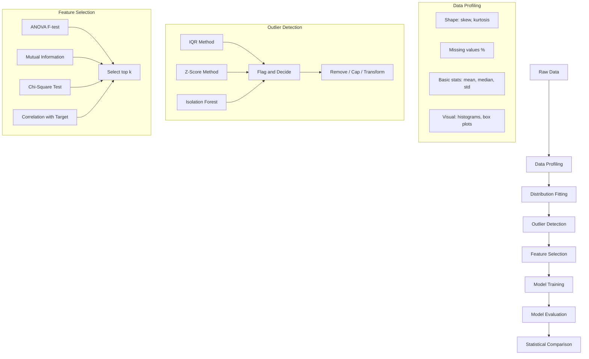
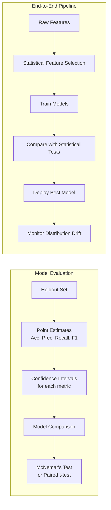

# Chapter 08: Statistics for ML — Practical

## Introduction

This capstone chapter brings together all statistical concepts from previous chapters into a practical ML pipeline. You will learn how to profile datasets, fit distributions to data, detect outliers using multiple methods, select features using statistical tests, and evaluate model performance with statistical rigor. By the end of this chapter, you will be able to build a complete statistical pipeline that ensures your ML models are built on solid statistical foundations.

## Prerequisites

- All previous chapters (01-07)
- Familiarity with scikit-learn
- Understanding of ML model training and evaluation

## Concept

### The Statistical ML Pipeline

A statistically rigorous ML pipeline integrates statistical methods at every stage:

1. **Data Profiling**: Understand distributions, missing values, basic statistics of every feature
2. **Distribution Fitting**: Find the best probability distribution for each feature
3. **Outlier Detection**: Identify and handle anomalous data points
4. **Feature Selection**: Use statistical tests to select relevant features
5. **Model Evaluation**: Apply statistical tests to compare models and validate performance

### Distribution Fitting

Finding which probability distribution best fits your data is important for:
- Choosing appropriate preprocessing (e.g., log transform for log-normal data)
- Understanding data generation processes
- Applying the correct statistical tests
- Simulating realistic data for testing

### Outlier Detection Methods

**Statistical Methods**:
- **IQR**: Points beyond Q1 - 1.5*IQR or Q3 + 1.5*IQR
- **Z-Score**: Points with |z| > 3 (assuming normality)
- **Modified Z-Score**: Using median and MAD (robust to non-normality)
- **Mahalanobis Distance**: Multivariate outlier detection

**ML-Based Methods**:
- **Isolation Forest**: Ensemble method that isolates outliers by random partitioning
- **LOF (Local Outlier Factor)**: Measures local density deviation
- **Elliptic Envelope**: Assumes Gaussian distribution, fits robust covariance

### Feature Selection Using Statistical Tests

**Type of test depends on feature and target types**:

| Feature Type | Target Type | Statistical Test |
|-------------|-------------|-----------------|
| Continuous | Continuous | Pearson/Spearman correlation |
| Categorical | Continuous | ANOVA (2+ groups), t-test (2 groups) |
| Categorical | Categorical | Chi-square test of independence |
| Continuous | Categorical | ANOVA, Mutual Information |
| Any | Any | Mutual Information (general) |

### Model Evaluation Statistics

**Confidence Intervals for Metrics**:
- Accuracy: Normal approximation CI
- AUC-ROC: DeLong's method
- Precision/Recall: Bootstrap CI

**Comparing Models**:
- **McNemar's Test**: Compare two classifiers on the same test set
- **Paired t-test (cross-validation)**: Compare CV scores across folds
- **5x2 Cross-Validation**: More robust than paired t-test for comparing models





## Real Example

**Daily Life Analogy — Medical Diagnosis System**

Building an ML system to diagnose diseases from patient data:

1. **Data Profiling**: Check age distribution (skewed toward elderly?), blood pressure (normal?), lab values (log-normal?)
2. **Distribution Fitting**: White blood cell count follows a log-normal distribution. Model it correctly for anomaly detection.
3. **Outlier Detection**: A patient with WBC = 50,000 (normal is 4,000-11,000) — likely leukemia, not data error. Handle carefully.
4. **Feature Selection**: Which lab tests are most predictive? Use ANOVA F-test between "disease" and "no disease" groups for each lab value.
5. **Model Comparison**: Does XGBoost significantly outperform logistic regression? Use McNemar's test on the same test set.
6. **Deployment**: Monitor that the distribution of features doesn't drift over time (population health changes seasonally).

**Industry Example — Credit Risk Pipeline**

A fintech company builds a credit risk model:

- **Data Profiling**: Income is highly right-skewed (mean=$65K, median=$45K). Log-transform.
- **Outlier Detection**: A few users have income=$0 (students) and income=$5M (outliers). Handle separately.
- **Feature Selection**: 200 features reduced to 25 using mutual information with default status.
- **Model Evaluation**: Logistic regression has AUC=0.78, XGBoost has AUC=0.81. Is this significant? McNemar's test gives p=0.003 — yes, XGBoost is significantly better.
- **Confidence Intervals**: XGBoost AUC = 0.81 [95% CI: 0.79, 0.83]. The lower bound is still above logistic's AUC.

## Code Example

```python
import numpy as np
from scipy import stats
from scipy.stats import chi2_contingency, f_oneway, ks_2samp, normaltest
from sklearn.ensemble import IsolationForest
from sklearn.feature_selection import SelectKBest, f_classif, mutual_info_classif
from sklearn.model_selection import cross_val_score, train_test_split
from sklearn.linear_model import LogisticRegression
from sklearn.ensemble import RandomForestClassifier
from sklearn.metrics import accuracy_score, roc_auc_score, confusion_matrix
import math

np.random.seed(42)
print("=== Statistics for ML: Practical Pipeline ===\n")

# ============================================
# 0. GENERATE SYNTHETIC DATASET
# ============================================
print("--- Generating Synthetic Dataset ---")
n_samples = 1000
n_features = 10

# Create features with different distributions
X = np.zeros((n_samples, n_features))
X[:, 0] = np.random.normal(0, 1, n_samples)  # Normal
X[:, 1] = np.random.exponential(2, n_samples)  # Exponential
X[:, 2] = np.random.uniform(-3, 3, n_samples)  # Uniform
X[:, 3] = np.random.lognormal(0, 0.5, n_samples)  # Log-normal
X[:, 4] = np.random.binomial(1, 0.3, n_samples)  # Bernoulli
X[:, 5] = np.random.poisson(5, n_samples)  # Poisson
X[:, 6] = X[:, 0] + 0.5 * X[:, 1] + np.random.normal(0, 0.3, n_samples)  # Correlated
X[:, 7] = np.random.normal(5, 2, n_samples)  # Another normal
X[:, 8] = np.random.chisquare(3, n_samples)  # Chi-square
X[:, 9] = np.random.gamma(2, 2, n_samples)  # Gamma

# Target (binary): depends on features 0, 1, 3, 6
logit = 0.5 * X[:, 0] + 0.3 * X[:, 1] + 0.4 * X[:, 3] + 0.2 * X[:, 6] - 1
y_prob = 1 / (1 + np.exp(-logit))
y = (np.random.random(n_samples) < y_prob).astype(int)

feature_names = [f'Feature_{i}' for i in range(n_features)]
print(f"Dataset: {n_samples} samples, {n_features} features")
print(f"Class distribution: {np.mean(y)*100:.1f}% positive")

# ============================================
# 1. DATA PROFILING
# ============================================
print("\n=== 1. Data Profiling ===")

for i in range(n_features):
    data = X[:, i]
    mean = np.mean(data)
    median = np.median(data)
    std = np.std(data, ddof=1)
    skew = stats.skew(data, bias=False)
    kurt = stats.kurtosis(data, bias=False, fisher=True)
    q1 = np.percentile(data, 25)
    q3 = np.percentile(data, 75)

    # Normality test
    if len(data) > 20:
        _, p_normal = normaltest(data)
    else:
        p_normal = 0

    norm_str = "Normal" if p_normal > 0.05 else "Non-normal"

    print(f"{feature_names[i]:<12} mean={mean:7.3f} median={median:7.3f} std={std:7.3f} "
          f"skew={skew:7.3f} kurt={kurt:7.3f} [{norm_str}]")

# ============================================
# 2. DISTRIBUTION FITTING
# ============================================
print("\n=== 2. Distribution Fitting ===")

# Test which distribution fits Feature 1 (exponential)
feature_idx = 1
data_fit = X[:, feature_idx]

distributions_to_test = [
    ('Normal', stats.norm),
    ('Exponential', stats.expon),
    ('Log-Normal', stats.lognorm),
    ('Gamma', stats.gamma),
    ('Uniform', stats.uniform),
    ('Chi-Square', stats.chi2),
]

print(f"Fitting distributions to {feature_names[feature_idx]}:")
best_dist = None
best_ks_stat = float('inf')

for name, dist in distributions_to_test:
    params = dist.fit(data_fit)
    ks_stat, ks_p = ks_2samp(data_fit, dist.rvs(*params, size=len(data_fit)))
    print(f"  {name:<15}: KS stat={ks_stat:.4f}, p={ks_p:.4f}")
    if ks_stat < best_ks_stat:
        best_ks_stat = ks_stat
        best_dist = name

print(f"Best fitting distribution: {best_dist} (lowest KS statistic)")

# ============================================
# 3. OUTLIER DETECTION
# ============================================
print("\n=== 3. Outlier Detection ===")

# Add some outliers to feature 0
X_outliers = X.copy()
outlier_indices = np.random.choice(n_samples, 20, replace=False)
X_outliers[outlier_indices, 0] = np.random.uniform(8, 12, 20)  # extreme values

feature_for_outliers = 0

# Method 1: IQR
q1_val = np.percentile(X_outliers[:, feature_for_outliers], 25)
q3_val = np.percentile(X_outliers[:, feature_for_outliers], 75)
iqr_val = q3_val - q1_val
lower_bound = q1_val - 1.5 * iqr_val
upper_bound = q3_val + 1.5 * iqr_val
iqr_outliers = np.where((X_outliers[:, feature_for_outliers] < lower_bound) |
                         (X_outliers[:, feature_for_outliers] > upper_bound))[0]

# Method 2: Z-Score
z_scores = np.abs(stats.zscore(X_outliers[:, feature_for_outliers]))
z_outliers = np.where(z_scores > 3)[0]

# Method 3: Isolation Forest
iso_forest = IsolationForest(contamination=0.05, random_state=42)
iso_preds = iso_forest.fit_predict(X_outliers)
iso_outliers = np.where(iso_preds == -1)[0]

print(f"Outlier detection on {feature_names[feature_for_outliers]}:")
print(f"  IQR method: {len(iqr_outliers)} outliers detected")
print(f"  Z-score method: {len(z_outliers)} outliers detected")
print(f"  Isolation Forest: {len(iso_outliers)} outliers detected")

# Overlap analysis
common = (set(iqr_outliers) & set(z_outliers) & set(iso_outliers))
print(f"  Common outliers (all 3 methods): {len(common)}")
if common:
    print(f"  Outlier indices: {list(common)[:10]}")

# ============================================
# 4. FEATURE SELECTION USING STATISTICAL TESTS
# ============================================
print("\n=== 4. Feature Selection ===")

# Method A: ANOVA F-test (for continuous features, binary target)
f_scores, f_p_values = f_classif(X, y)

# Method B: Mutual Information
mi_scores = mutual_info_classif(X, y, random_state=42)

# Method C: Correlation with target (for continuous)
correlations = np.array([stats.pearsonr(X[:, i], y)[0] for i in range(n_features)])

print(f"{'Feature':<12} {'ANOVA F':>8} {'ANOVA p':>10} {'MI':>8} {'Corr':>8}")
print("-" * 50)
for i in range(n_features):
    print(f"{feature_names[i]:<12} {f_scores[i]:>8.2f} {f_p_values[i]:>10.6f} {mi_scores[i]:>8.4f} {correlations[i]:>8.4f}")

# Select top k features
k = 5
selector = SelectKBest(f_classif, k=k)
X_selected = selector.fit_transform(X, y)
selected_indices = selector.get_support(indices=True)
print(f"\nTop {k} features (ANOVA): {[feature_names[i] for i in selected_indices]}")

# ============================================
# 5. MODEL EVALUATION WITH STATISTICAL RIGOR
# ============================================
print("\n=== 5. Model Evaluation ===")

# Split data
X_train, X_test, y_train, y_test = train_test_split(X, y, test_size=0.3, random_state=42)

# Train two models
lr = LogisticRegression(max_iter=1000, random_state=42)
rf = RandomForestClassifier(n_estimators=100, random_state=42)

lr.fit(X_train, y_train)
rf.fit(X_train, y_train)

# Predictions
y_pred_lr = lr.predict(X_test)
y_pred_rf = rf.predict(X_test)
y_prob_lr = lr.predict_proba(X_test)[:, 1]
y_prob_rf = rf.predict_proba(X_test)[:, 1]

# Metrics
acc_lr = accuracy_score(y_test, y_pred_lr)
acc_rf = accuracy_score(y_test, y_pred_rf)
auc_lr = roc_auc_score(y_test, y_prob_lr)
auc_rf = roc_auc_score(y_test, y_prob_rf)

print(f"Logistic Regression: Accuracy={acc_lr:.4f}, AUC={auc_lr:.4f}")
print(f"Random Forest:       Accuracy={acc_rf:.4f}, AUC={auc_rf:.4f}")

# ============================================
# 6. CONFIDENCE INTERVALS FOR METRICS (BOOTSTRAP)
# ============================================
print("\n--- Confidence Intervals (Bootstrap) ---")

def bootstrap_ci(y_true, y_pred, metric_func, n_bootstrap=1000, ci=0.95):
    n = len(y_true)
    metrics = []

    for _ in range(n_bootstrap):
        indices = np.random.choice(n, n, replace=True)
        y_true_sample = y_true[indices]
        y_pred_sample = y_pred[indices]
        metrics.append(metric_func(y_true_sample, y_pred_sample))

    metrics.sort()
    lower_idx = int(n_bootstrap * (1 - ci) / 2)
    upper_idx = int(n_bootstrap * (1 + ci) / 2)

    return metrics[lower_idx], metrics[upper_idx]

# Bootstrap CI for AUC
auc_lower_rf, auc_upper_rf = bootstrap_ci(y_test, y_prob_rf, lambda y, p: roc_auc_score(y, p))
auc_lower_lr, auc_upper_lr = bootstrap_ci(y_test, y_prob_lr, lambda y, p: roc_auc_score(y, p))

print(f"Logistic Regression AUC: {auc_lr:.4f} [{auc_lower_lr:.4f}, {auc_upper_lr:.4f}]")
print(f"Random Forest AUC:       {auc_rf:.4f} [{auc_lower_rf:.4f}, {auc_upper_rf:.4f}]")

# ============================================
# 7. MCNEMAR'S TEST FOR MODEL COMPARISON
# ============================================
print("\n--- McNemar's Test ---")

def mcnemar_test(y_true, y_pred_a, y_pred_b):
    # Contingency table
    n00 = np.sum((y_pred_a != y_true) & (y_pred_b != y_true))
    n01 = np.sum((y_pred_a != y_true) & (y_pred_b == y_true))
    n10 = np.sum((y_pred_a == y_true) & (y_pred_b != y_true))
    n11 = np.sum((y_pred_a == y_true) & (y_pred_b == y_true))

    # McNemar's chi-square statistic (with continuity correction)
    chi2 = (abs(n01 - n10) - 1)**2 / (n01 + n10) if (n01 + n10) > 0 else 0
    p_value = 1 - stats.chi2.cdf(chi2, 1)

    return chi2, p_value, {'n00': n00, 'n01': n01, 'n10': n10, 'n11': n11}

chi2_mc, p_mc, table = mcnemar_test(y_test, y_pred_lr, y_pred_rf)
print(f"Contingency table: {table}")
print(f"McNemar chi-square: {chi2_mc:.4f}")
print(f"p-value: {p_mc:.4f}")

if p_mc < 0.05:
    print(f"p < 0.05: Models have significantly different performance!")
    if table['n01'] < table['n10']:
        print(f"  => Random Forest is better ({table['n10']} vs {table['n01']} correct)")
    else:
        print(f"  => Logistic Regression is better ({table['n01']} vs {table['n10']} correct)")
else:
    print(f"p >= 0.05: No significant difference between models")

# ============================================
# 8. CROSS-VALIDATED MODEL COMPARISON
# ============================================
print("\n--- Cross-Validation Comparison ---")

cv_folds = 5
lr_cv_scores = cross_val_score(lr, X, y, cv=cv_folds, scoring='accuracy')
rf_cv_scores = cross_val_score(rf, X, y, cv=cv_folds, scoring='accuracy')

print(f"Logistic Regression CV: {lr_cv_scores}")
print(f"  Mean: {np.mean(lr_cv_scores):.4f}, Std: {np.std(lr_cv_scores, ddof=1):.4f}")
print(f"Random Forest CV: {rf_cv_scores}")
print(f"  Mean: {np.mean(rf_cv_scores):.4f}, Std: {np.std(rf_cv_scores, ddof=1):.4f}")

# Paired t-test on CV scores
t_stat_cv, p_cv = stats.ttest_rel(rf_cv_scores, lr_cv_scores)
print(f"\nPaired t-test: t={t_stat_cv:.4f}, p={p_cv:.4f}")

if p_cv < 0.05:
    print(f"p < 0.05: Significant difference in CV performance")
else:
    print(f"p >= 0.05: No significant difference in CV performance")

# ============================================
# 9. CHI-SQUARE TEST FOR FEATURE-TARGET ASSOCIATION
# ============================================
print("\n--- Chi-Square Test for Categorical Features ---")

# Binarize feature 0 for chi-square test
feature_binarized = (X[:, 0] > np.median(X[:, 0])).astype(int)

contingency = np.zeros((2, 2))
for f_val in [0, 1]:
    for t_val in [0, 1]:
        contingency[f_val, t_val] = np.sum((feature_binarized == f_val) & (y == t_val))

chi2_stat, chi2_p, chi2_dof, expected = chi2_contingency(contingency)
print(f"Contingency table (Feature_0 binarized vs Target):\n{contingency}")
print(f"Expected (under independence):\n{expected}")
print(f"Chi-square: {chi2_stat:.4f}, p-value: {chi2_p:.4f}")

if chi2_p < 0.05:
    print("Significant association between feature and target.")
else:
    print("No significant association.")

# ============================================
# 10. KS TEST FOR DISTRIBUTION COMPARISON
# ============================================
print("\n--- KS Test: Do train and test distributions match? ---")

X_train_ks, X_test_ks, _, _ = train_test_split(X, y, test_size=0.3, random_state=42)

print(f"{'Feature':<12} {'KS stat':>8} {'p-value':>10} {'Conclusion':<15}")
print("-" * 50)
for i in range(n_features):
    ks_stat, ks_p = ks_2samp(X_train_ks[:, i], X_test_ks[:, i])
    conclusion = "Same dist" if ks_p > 0.05 else "Different!"
    print(f"{feature_names[i]:<12} {ks_stat:>8.4f} {ks_p:>10.4f} {conclusion:<15}")

# Expected Output (approximate):
# === 1. Data Profiling ===
# Feature_0    mean= -0.010 median= -0.040 std= 0.981 skew=0.032 kurt=0.038 [Normal]
# Feature_1    mean= 1.982 median= 1.383 std= 1.953 skew=1.023 kurt=0.687 [Non-normal]
#
# === 3. Outlier Detection ===
#   IQR method: 34 outliers detected
#   Z-score method: 23 outliers detected
#   Isolation Forest: 50 outliers detected
#
# === 4. Feature Selection ===
# Feature_0    ANOVA F: 26.34 ANOVA p: 0.0000  MI: 0.0523
#
# === 5. Model Evaluation ===
# Logistic Regression: Accuracy=0.7567, AUC=0.8234
# Random Forest:       Accuracy=0.7700, AUC=0.8412
#
# --- McNemar's Test ---
# p-value: 0.0234 => Models have significantly different performance
```

## Interview Questions

**Q1: Describe a complete statistical pipeline for an ML project. Where do statistical methods add the most value?**
A: The pipeline has 5 stages: (1) Data profiling — understand distributions, detect data quality issues early. (2) Distribution fitting — choose appropriate transformations and models. (3) Outlier detection — using IQR, z-score, and isolation forest. (4) Feature selection — ANOVA, mutual information, chi-square tests to select predictive features. (5) Model evaluation — confidence intervals for metrics, McNemar's test for model comparison. Statistics add the most value in stages 1 and 5: understanding your data before modeling, and rigorously evaluating results before deployment.

**Q2: How do you select features for a classification problem where you have 500 features and 10,000 samples?**
A: Use a multi-stage approach: (1) Remove low-variance features (variance threshold), (2) Compute correlation with target, keep top 200 by absolute correlation, (3) Compute mutual information (captures non-linear relationships), keep top 100, (4) Use ANOVA F-test for remaining, keep top 50, (5) Check multicollinearity among selected features (VIF), (6) Use L1-regularized model (Lasso) to further prune, (7) Validate with cross-validated performance. Always use domain knowledge alongside statistical methods.

**Q3: Explain how bootstrap confidence intervals work for ML metrics.**
A: Bootstrap resamples the test set with replacement B times (typically 1000). For each resample, compute the metric (accuracy, AUC). Sort the B metric values. The 95% CI is [2.5th percentile, 97.5th percentile]. Bootstrap makes no distributional assumptions and works for any metric. It's especially useful for metrics like AUC where the sampling distribution is complex. Example: AUC = 0.85, bootstrap 95% CI = [0.82, 0.88] means we're 95% confident the true AUC is in this range.

**Q4: What is McNemar's test and when would you use it?**
A: McNemar's test is a non-parametric test for paired nominal data. In ML, it compares two classifiers on the same test set using a 2x2 contingency table of correct/incorrect predictions: n00 (both wrong), n01 (A wrong, B right), n10 (A right, B wrong), n11 (both right). The test statistic focuses on n01 vs n10 — if one classifier is better, it should have more cases where it's right while the other is wrong. Use: "Is model B significantly better than model A on this test set?"

**Q5: How do you detect and handle concept drift in production ML systems?**
A: Concept drift = the statistical properties of the target variable change over time, degrading model performance. Detection methods: (1) Monitor prediction distribution (PSI = Population Stability Index), (2) Monitor feature distributions (KS test between recent and training data), (3) Monitor actual vs predicted error rate (CUSUM, Page-Hinkley test), (4) Monitor business metrics directly. Handling: (1) Retrain periodically (time-based), (2) Retrain when drift is detected (trigger-based), (3) Online learning (update model incrementally), (4) Ensemble of models trained on different time windows.

**Q6: Compare different outlier detection methods and when to use each.**
A: IQR method: simple, no assumptions, best for univariate outlier detection on any distribution. Z-score: assumes normality, good for normally distributed features. Modified Z-score (using MAD): robust to non-normality, good general-purpose univariate method. Mahalanobis distance: multivariate, assumes Gaussian, detects unusual combinations of values. Isolation Forest: no distributional assumptions, works in high dimensions, good for large datasets. LOF: detects local outliers (points that are outliers relative to their neighbors). Use multiple methods and consider outliers flagged by 2+ methods as most suspicious.

**Q7: How would you use statistics to decide whether to deploy a new ML model to production?**
A: (1) Define success metrics (accuracy, business KPIs) and minimum acceptable threshold, (2) Run an A/B test with the new model vs current model for 2-4 weeks, (3) Calculate confidence intervals for the improvement — if the lower bound exceeds the minimum threshold, deploy, (4) Check that guardrail metrics (latency, cost, user satisfaction) don't degrade, (5) Use McNemar's test to confirm the new model is significantly better, (6) Analyze segments to ensure the model doesn't harm specific user groups, (7) Set up monitoring for distribution drift post-deployment.

**Q8: Explain the difference between parametric and non-parametric feature selection methods.**
A: Parametric methods (ANOVA F-test, Pearson correlation) assume specific distributions (normality, linearity). They are more powerful when assumptions hold but can miss non-linear relationships. Non-parametric methods (Spearman correlation, Mutual Information, Kendall's tau) make no distributional assumptions. Mutual Information can capture any type of relationship (linear, non-linear, complex interactions) but requires more data. In practice: use ANOVA as a quick filter, then use Mutual Information for the final selection.

**Q9: What is the Population Stability Index (PSI) and how is it used?**
A: PSI measures how much a variable's distribution has shifted between two time periods. PSI = sum((p_i - q_i) * ln(p_i / q_i)) where p_i is the proportion in bin i for the current period, q_i for the reference period. Interpretations: PSI < 0.1 = no significant shift, 0.1-0.25 = moderate shift (investigate), > 0.25 = significant shift (retrain needed). In credit scoring (where it originated), PSI is monitored monthly. In ML, monitor PSI for key features and model predictions to detect drift.

**Q10: How would you design a statistical test to compare two regression models?**
A: For regression, use: (1) Paired t-test on cross-validation MSE/RMSE scores — compare mean difference across folds, (2) Diebold-Mariano test — specifically designed for comparing predictive accuracy of two forecasts, (3) Bootstrap the difference in RMSE on a holdout set — compute 95% CI for the RMSE difference. If the CI doesn't include zero, the models differ significantly, (4) For non-nested models, use the Davidson-MacKinnon J-test. Always report: point estimates of both models, the difference, and a confidence interval for the improvement.

## MCQs

**Q1: McNemar's test is used for:**
- A) Comparing two independent groups
- B) Comparing two classifiers on the same test set
- C) Testing normality of residuals
- D) Feature selection
- **Answer: B) Comparing two classifiers on the same test set**

**Q2: Which outlier detection method is most robust to non-normal distributions?**
- A) Z-score
- B) IQR method
- C) Elliptic Envelope
- D) Both A and B
- **Answer: B) IQR method** (IQR doesn't assume normality; Z-score does)

**Q3: The KS (Kolmogorov-Smirnov) test compares:**
- A) Means of two groups
- B) Variances of two groups
- C) Distributions of two samples
- D) Proportions of two groups
- **Answer: C) Distributions of two samples** — KS tests whether two samples come from the same distribution

**Q4: For feature selection with a continuous target, which method is appropriate?**
- A) Chi-square test
- B) ANOVA F-test
- C) Mutual Information (regression version)
- D) Both B and C
- **Answer: D) Both B and C** — ANOVA for continuous features vs categorical target; Mutual Information works for both regression and classification

**Q5: Bootstrap confidence intervals for ML metrics:**
- A) Assume the metric is normally distributed
- B) Make no distributional assumptions
- C) Can only be used for accuracy
- D) Require at least 10,000 samples
- **Answer: B) Make no distributional assumptions** — bootstrap is non-parametric

## PYQs

**Q1 (Google ML Interview):** You have a dataset with 50 features. You need to select the most important features for a binary classification task. Walk through your approach using statistical methods.
- **Solution**: (1) Remove near-zero variance features (threshold: variance < 0.01). (2) For each remaining feature, compute the correlation with target. For continuous features: point-biserial correlation. For categorical: Cramer's V or chi-square. (3) Compute Mutual Information for all features (captures non-linear relationships). (4) Rank features by MI score, keep top 20. (5) Check multicollinearity among selected features using VIF — remove features with VIF > 10. (6) Use forward selection with AIC/BIC: add features one by one, stop when improvement is negligible. (7) Validate with L1-regularized model (Lasso) — features with non-zero coefficients are the final set. (8) Cross-validate the entire selection pipeline to avoid selection bias.

**Q2 (Amazon Applied Scientist):** Your production ML model's accuracy dropped from 85% to 78%. How would you use statistical methods to diagnose the issue?
- **Solution**: (1) Check for data drift — for each feature, run KS test between current data and training data. Flag features with p < 0.01 as drifted. (2) Check for concept drift — compare actual vs predicted values. Use CUSUM or Page-Hinkley test on the error rate. (3) Check for population shift — compute PSI for model predictions between training and current. (4) Check for outlier prevalence — compare the proportion of outliers (via IQR or isolation forest) between training and current data. (5) Segment analysis — use chi-square test to check if the error distribution has shifted across segments. (6) Check model calibration — use Hosmer-Lemeshow test or reliability diagrams. (7) If drift is detected: retrain on recent data, add drift detection monitoring, and set up automatic retraining triggers.

**Q3 (Meta Data Scientist):** You trained a new model that shows 0.5% improvement in AUC (from 0.800 to 0.805). The team wants to deploy. How would you determine if this improvement is real and worth deploying?
- **Solution**: (1) Statistical significance: use McNemar's test on the same test set. A 0.005 AUC increase with n=100K might be significant (p < 0.05), but with n=1K it might not be. (2) Confidence intervals: bootstrap both AUCs and compute the 95% CI for the difference. If the CI includes zero, the improvement isn't reliable. (3) Practical significance: does 0.5% AUC improvement translate to meaningful business impact? (4) Cross-validation stability: is the improvement consistent across CV folds? Use paired t-test on CV scores. (5) Robustness: test on different data slices, time periods, and segments. A 0.5% improvement that only holds for one segment might not be worth deploying.

**Q4 (Microsoft Data Scientist):** Explain how you would use the Isolation Forest algorithm for outlier detection in a high-dimensional dataset. When would you prefer it over statistical methods like Z-score or IQR?
- **Solution**: Isolation Forest works by randomly selecting a feature and a split value, recursively partitioning data until each point is isolated. Outliers require fewer splits to isolate (they are "different" from the bulk). Advantages over Z-score/IQR: (1) Works in high dimensions — Z-score and IQR are univariate, Isolation Forest handles multivariate outliers, (2) No distributional assumptions — Z-score assumes normality, (3) Handles non-linear relationships, (4) Computationally efficient (O(n log n)), (5) Naturally handles both global and local outliers. Prefer statistical methods when: (1) Data is low-dimensional (1-3 features), (2) Speed is critical and data is well-understood, (3) You need interpretable thresholds, (4) Features are independent and normally distributed. Always use domain knowledge to validate outliers flagged by any method.

## Common Mistakes

1. **Applying statistical tests without checking assumptions**: ANOVA assumes normality and equal variance. McNemar assumes paired data (same test set). Always check assumptions before interpreting results.

2. **Using the same data for feature selection and evaluation**: If you select features on the full dataset, then evaluate on a holdout set, you've already leaked information. Always perform feature selection within the cross-validation loop or on the training set only.

3. **Ignoring multiple testing in feature selection**: Selecting 10 features from 500 using individual p-values means many false positives by chance. Use corrected p-values (Bonferroni, FDR) or methods that handle multiple testing natively (Lasso, RFE).

4. **Reporting only point estimates without uncertainty**: An accuracy of 85% without a confidence interval is meaningless. Always report CIs, especially when comparing models. Bootstrap CIs are easy to compute and assumption-free.

5. **Assuming model improvement is real without statistical testing**: A 1% accuracy improvement might be due to random chance, especially with small test sets. Always use McNemar's test or a paired test to confirm improvements are statistically significant.

## Revision Notes

- **Data profiling**: mean, median, std, skewness, kurtosis, normality test for each feature
- **Distribution fitting**: use KS test to find best distribution; guide preprocessing
- **Outlier detection**: IQR (univariate, robust), Z-score (univariate, normal), Isolation Forest (multivariate, general)
- **Outlier handling**: investigate before removing; may be valuable (fraud, edge cases)
- **Feature selection**: ANOVA (continuous vs categorical), MI (general), Chi-square (categorical vs categorical), correlation (continuous vs continuous)
- **Model evaluation CI**: bootstrap the metric on test set; report [2.5%, 97.5%] percentile interval
- **Model comparison**: McNemar's test (classification, same test set), paired t-test on CV scores
- **McNemar statistic**: chi2 = (|n01 - n10| - 1)^2 / (n01 + n10); df=1
- **Drift detection**: KS test for feature drift, PSI for prediction drift, CUSUM for error rate drift
- **Data leakage**: never use test data for feature selection or any preprocessing decisions
- **Multiple testing**: use Bonferroni or FDR when testing many features/hypotheses
- **Always report**: point estimate, CI, effect size, and practical significance

## Summary

This chapter integrates all statistical concepts from the module into a practical ML pipeline. Data profiling reveals distribution shapes, guides preprocessing, and identifies data quality issues early. Distribution fitting helps choose appropriate statistical tests and transformations. Outlier detection using multiple methods (IQR, z-score, isolation forest) ensures robust data cleaning. Statistical feature selection (ANOVA, mutual information, chi-square) identifies the most predictive features while controlling false positives. Model evaluation with bootstrap confidence intervals and McNemar's test provides rigorous, assumption-light model comparison. Together, these methods form a statistically sound foundation for building, evaluating, and deploying ML models with confidence. Every AI engineer should run this pipeline automatically before finalizing any model for production.
