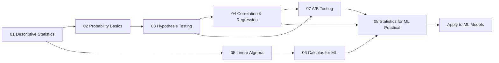

# Statistics & Mathematics for AI Engineers

## Overview

Statistics and mathematics form the backbone of artificial intelligence and machine learning. This module bridges the gap between theoretical foundations and practical AI applications, covering descriptive statistics, probability theory, hypothesis testing, regression analysis, linear algebra, calculus, experimental design, and applied statistical methods for ML. Every concept is taught through the lens of AI engineering — you will learn not just the math, but why it matters for building, debugging, and optimizing ML models.

## Table of Contents

| Chapter | Topic | Key Concepts | AI Relevance |
|---------|-------|-------------|--------------|
| 01 | Descriptive Statistics | Mean, median, mode, variance, std dev, quartiles, IQR, box plots, skewness, kurtosis | Data profiling, feature distribution analysis, outlier detection |
| 02 | Probability Basics | Probability rules, Bayes theorem, distributions (normal, binomial, Poisson, uniform, exponential), PMF vs PDF vs CDF | Model uncertainty, Bayesian inference, generative models, loss functions |
| 03 | Hypothesis Testing | Null/alternative hypothesis, p-value, t-test, z-test, chi-square, ANOVA, confidence intervals | A/B testing, feature selection, model comparison, statistical significance |
| 04 | Correlation & Regression Analysis | Pearson/Spearman correlation, covariance, linear regression assumptions, R-squared, residual analysis | Feature engineering, regression metrics, multicollinearity detection |
| 05 | Linear Algebra Essentials | Vectors, dot product, norm, matrices, eigenvalues/eigenvectors, SVD, PCA, matrix calculus | Neural network computations, dimensionality reduction, embeddings |
| 06 | Calculus for ML | Derivatives, partial derivatives, chain rule, gradient descent variants, learning rate schedules, Adam optimizer | Backpropagation, optimization, training dynamics, loss minimization |
| 07 | A/B Testing & Experimental Design | A/B testing framework, sample size calculation, power analysis, multi-armed bandits, causal inference | Experiment design, model deployment validation, causal ML |
| 08 | Statistics for ML — Practical | Data profiling, distribution fitting, outlier detection, feature selection tests, model evaluation statistics | End-to-end ML pipeline statistics, model validation, feature engineering |

## Learning Path

### Prerequisites for This Module

- Basic algebra and arithmetic operations
- Familiarity with Python (loops, functions, lists)
- Basic understanding of what ML models do
- No prior statistics knowledge required — we build from ground up

### Learning Objectives

By the end of this module, you will be able to:
1. Compute and interpret descriptive statistics for any dataset
2. Apply probability theory to model uncertainty in ML predictions
3. Design and interpret hypothesis tests for model evaluation
4. Build and diagnose linear regression models using statistical assumptions
5. Perform matrix operations and understand PCA/SVD decompositions
6. Implement gradient descent variants and understand optimization
7. Design statistically rigorous A/B tests for product changes
8. Build a complete statistical ML pipeline with proper validation

### Recommended Study Time

- **Theory reading**: 8–10 hours across all chapters
- **Code practice**: 6–8 hours running and extending Python examples
- **Interview prep**: 4–6 hours on questions and PYQs
- **Total**: 18–24 hours

### Tools & Libraries Used

- Python 3.8+
- NumPy — numerical computing
- SciPy — statistical distributions and tests
- scikit-learn — regression, PCA, feature selection
- Matplotlib / Seaborn — visualizations (conceptual)

### How to Use This Module

1. **Sequential order**: Chapters 01-08 build on each other. Start with descriptive statistics and progress through to the practical pipeline.
2. **Code first**: Run every Python code example. Modify parameters to see how outputs change.
3. **Interview prep**: Focus on the Interview Questions and PYQs sections for placement preparation.
4. **Revision**: Use the Revision Notes at the end of each chapter for quick memory refreshers.
5. **MCQs**: Test your understanding with the 5 MCQs per chapter before moving on.
6. **Practical application**: After completing all chapters, apply the statistical pipeline (Chapter 08) to a real dataset from Kaggle or your own projects.

### Key Formulas Reference

| Concept | Formula | Used In |
|---------|---------|---------|
| Mean | μ = (1/n) Σ x_i | Chapter 01 |
| Variance | σ² = (1/(n-1)) Σ (x_i - μ)² | Chapter 01 |
| Bayes Theorem | P(A|B) = P(B|A)·P(A)/P(B) | Chapter 02 |
| Z-score | z = (x - μ) / σ | Chapter 03 |
| t-statistic | t = (x̄ - μ) / (s/√n) | Chapter 03 |
| Pearson r | r = cov(X,Y) / (σ_X · σ_Y) | Chapter 04 |
| Linear Regression | y = β₀ + β₁x + ε | Chapter 04 |
| Dot Product | a·b = Σ a_i · b_i | Chapter 05 |
| Gradient Descent | θ = θ - η · ∇L(θ) | Chapter 06 |
| Sample Size | n ∝ (Z_α + Z_β)² · σ² / δ² | Chapter 07 |
| McNemar | χ² = (|n01 - n10| - 1)² / (n01 + n10) | Chapter 08 |

### Why Statistics Matters for AI Engineers

- **Data understanding**: You cannot build good models without understanding your data's distribution, outliers, and patterns.
- **Model validation**: Statistical tests tell you whether your model improvement is real or just random chance.
- **Feature engineering**: Correlation and ANOVA guide which features to create and which to discard.
- **Optimization**: Calculus and linear algebra are the engines that power neural network training.
- **Experimentation**: A/B testing and causal inference are essential for deploying ML in production.
- **Communication**: Statistics provides the language to communicate model performance to stakeholders.

### Related Modules

- **Module 05: Mathematics for AI** — Deeper dive into calculus and linear algebra
- **Module 08: Machine Learning Fundamentals** — Apply these statistics to ML algorithms
- **Module 17: A/B Testing & Product Analytics** — Extended coverage of experimentation
- **Module 22: Advanced AI Agents** — Bayesian methods for agent decision-making

### Contributing

Found an error or want to add content? Open an issue or PR at the repository. This module is actively maintained and updated with the latest interview questions and industry practices.

---

*"Statistics is the grammar of data science. Without it, you can speak, but you cannot be understood."*
