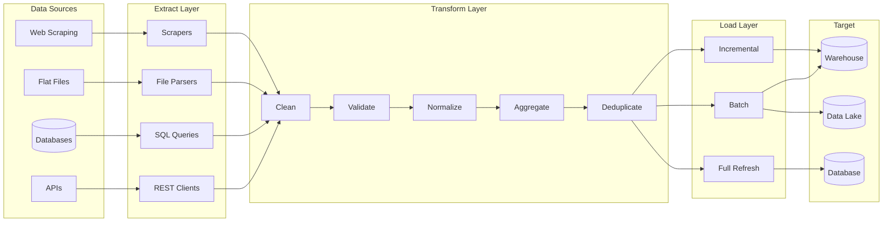

# 01 — ETL & Data Pipelines

## Learning Objectives

- Design an idempotent ETL pipeline that can be re-run without data duplication
- Explain the difference between ELT and ETL and when each fits
- Extract data from REST APIs, databases, and flat files using paginated and chunked readers
- Apply cleaning, validation, normalization, aggregation, and deduplication transformations to raw data
- Implement batch, incremental, and full refresh loading strategies with watermark tracking

## Introduction

ETL (Extract, Transform, Load) is the process of moving data from source systems to a target database or data warehouse. Every AI engineer must understand ETL because model training pipelines, feature engineering, and data validation all depend on reliable data movement and transformation.

Modern data teams have shifted from traditional ETL to ELT (Extract, Load, Transform), where raw data is loaded first and transformed later using the power of cloud warehouses. This chapter covers both approaches, their trade-offs, and how to implement them with Python.

## Prerequisites

- Basic Python programming, functions, and file I/O
- Familiarity with pandas DataFrames and Series
- Understanding of SQL SELECT, JOIN, GROUP BY
- Basic knowledge of REST APIs and JSON

## Key Terminology

| Term | Definition |
|------|------------|
| ETL | Extract-Transform-Load — transform before loading |
| ELT | Extract-Load-Transform — load raw, transform in warehouse |
| Batch Processing | Process data in fixed-size chunks at scheduled intervals |
| Incremental Load | Only load new or changed records since last run |
| Full Refresh | Truncate and reload all data from source |
| Data Quality | Accuracy, completeness, consistency of data |
| Deduplication | Removing duplicate records from datasets |
| Normalization | Scaling values to a standard range |

## Chapter at a Glance

| Section | Topic | Key Concept |
|---------|-------|-------------|
| 1.1 | ETL vs ELT | Transform-before-load vs transform-after-load |
| 1.2 | Data Extraction | APIs, databases, flat files, web scraping |
| 1.3 | Data Transformation | Cleaning, validation, normalization, aggregation, dedup |
| 1.4 | Data Loading | Batch, incremental, full refresh strategies |
| 1.5 | Pipeline Monitoring | Logging, alerting, data quality checks |

## Chapter Roadmap



## 1.1 ETL vs ELT

Traditional ETL transforms data before loading, ensuring only high-quality data enters the warehouse. This works well when storage was expensive and compute was limited. Modern ELT flips this: load raw data first (cheap cloud storage), then transform using the warehouse engine (BigQuery, Snowflake, Redshift).

### ETL Flow


### ELT Flow


### Trade-off Matrix

| Decision | ETL | ELT |
|----------|-----|-----|
| Storage cost | Higher (store only clean) | Lower (store all raw) |
| Flexibility | Lower (schema fixed before load) | Higher (transform as needed) |
| Compute location | Pipeline servers | Warehouse engine |
| Data volume limits | Pipeline memory bound | Warehouse scale |
| Re-processing | Need to re-extract | Can re-transform raw data |
| Schema evolution | Difficult | Easy (schema-on-read) |

## 1.2 Data Extraction

Extraction is the first stage — pulling data from source systems. Common sources include REST APIs, relational databases, flat files (CSV, JSON, Parquet), and web scraping.

### REST API Extraction

```python
import requests
import pandas as pd
import time
from typing import List, Dict, Optional

class APIExtractor:
    """Extract data from paginated REST APIs."""

    def __init__(self, base_url: str, headers: Optional[Dict] = None):
        self.base_url = base_url
        self.headers = headers or {}

    def extract_paginated(
        self,
        endpoint: str,
        params: Optional[Dict] = None,
        page_size: int = 100,
        max_pages: int = 100,
    ) -> pd.DataFrame:
        all_records: List[Dict] = []
        params = params or {}
        params["limit"] = page_size
        for page in range(1, max_pages + 1):
            params["offset"] = (page - 1) * page_size
            response = requests.get(
                f"{self.base_url}/{endpoint}",
                headers=self.headers,
                params=params,
            )
            response.raise_for_status()
            data = response.json()
            records = data.get("results", data.get("data", []))
            if not records:
                break
            all_records.extend(records)
            print(f"Extracted page {page}: {len(records)} records")
            time.sleep(0.1)
        df = pd.DataFrame(all_records)
        print(f"Total extracted: {len(df)} records")
        return df

# Example usage
extractor = APIExtractor("https://jsonplaceholder.typicode.com")
users = extractor.extract_paginated("users", max_pages=1)
print(users[["id", "name", "email"]].head())
# Expected output:
#    id              name                   email
# 0   1   Leanne Graham    Sincere@april.biz
# 1   2   Ervin Howell   Shanna@melissa.tv
# 2   3   Clementine Bauch    Nathan@yesenia.net
```

### Database Extraction

```python
import pandas as pd
from sqlalchemy import create_engine, text

class DatabaseExtractor:
    """Extract data from SQL databases using SQLAlchemy."""

    def __init__(self, connection_string: str):
        self.engine = create_engine(connection_string)

    def extract_table(self, table: str, schema: str = "public") -> pd.DataFrame:
        query = text(f"SELECT * FROM {schema}.{table}")
        with self.engine.connect() as conn:
            df = pd.read_sql(query, conn)
        print(f"Extracted {len(df)} rows from {schema}.{table}")
        return df

    def extract_query(self, query: str) -> pd.DataFrame:
        with self.engine.connect() as conn:
            df = pd.read_sql(text(query), conn)
        print(f"Query returned {len(df)} rows")
        return df

# Example usage with SQLite (no external DB needed)
engine = create_engine("sqlite:///:memory:")
engine.execute("""
    CREATE TABLE orders (
        id INTEGER PRIMARY KEY,
        user_id INTEGER,
        amount REAL,
        created_at TEXT
    )
""")
engine.execute("""
    INSERT INTO orders VALUES
        (1, 101, 250.0, '2025-01-01'),
        (2, 102, 150.0, '2025-01-02'),
        (3, 101, 300.0, '2025-01-03')
""")
extractor = DatabaseExtractor("sqlite:///:memory:")
df = extractor.extract_table("orders")
print(df)
# Expected output:
#    id  user_id  amount  created_at
# 0   1      101   250.0  2025-01-01
# 1   2      102   150.0  2025-01-02
# 2   3      101   300.0  2025-01-03
```

### Flat File Extraction

```python
import pandas as pd
import json
from pathlib import Path

class FileExtractor:
    """Extract data from CSV, JSON, and Parquet files."""

    def extract_csv(self, path: str, **kwargs) -> pd.DataFrame:
        df = pd.read_csv(path, **kwargs)
        print(f"Extracted {len(df)} rows from CSV: {path}")
        return df

    def extract_json(self, path: str, orient: str = "records") -> pd.DataFrame:
        with open(path, "r") as f:
            data = json.load(f)
        df = pd.DataFrame(data)
        print(f"Extracted {len(df)} rows from JSON: {path}")
        return df

    def extract_parquet(self, path: str) -> pd.DataFrame:
        df = pd.read_parquet(path)
        print(f"Extracted {len(df)} rows from Parquet: {path}")
        return df

# Example with CSV
import io
csv_data = """id,name,salary
1,Alice,75000
2,Bob,82000
3,Charlie,68000"""
file_extractor = FileExtractor()
df = file_extractor.extract_csv(io.StringIO(csv_data))
print(df)
# Expected output:
#    id     name  salary
# 0   1   Alice   75000
# 1   2     Bob   82000
# 2   3 Charlie   68000
```

## 1.3 Data Transformation

Transformation is the heart of ETL — cleaning dirty data, validating constraints, normalizing values, aggregating metrics, and removing duplicates.

### Data Cleaning

```python
import pandas as pd
import numpy as np

class DataCleaner:
    """Handle missing values, outliers, and inconsistent formats."""

    def fill_missing(self, df: pd.DataFrame, strategy: str = "median") -> pd.DataFrame:
        df = df.copy()
        numeric_cols = df.select_dtypes(include=[np.number]).columns
        for col in numeric_cols:
            if df[col].isna().any():
                if strategy == "median":
                    fill_value = df[col].median()
                elif strategy == "mean":
                    fill_value = df[col].mean()
                else:
                    fill_value = 0
                df[col].fillna(fill_value, inplace=True)
                print(f"Filled {col} missing values with {strategy}: {fill_value}")
        return df

    def remove_outliers(
        self, df: pd.DataFrame, columns: List[str], method: str = "iqr", threshold: float = 1.5
    ) -> pd.DataFrame:
        df = df.copy()
        for col in columns:
            if method == "iqr":
                Q1 = df[col].quantile(0.25)
                Q3 = df[col].quantile(0.75)
                IQR = Q3 - Q1
                lower = Q1 - threshold * IQR
                upper = Q3 + threshold * IQR
                mask = (df[col] >= lower) & (df[col] <= upper)
                removed = (~mask).sum()
                df = df[mask]
                print(f"Removed {removed} outliers from {col}")
        return df

    def standardize_dates(
        self, df: pd.DataFrame, columns: List[str], format: str = "%Y-%m-%d"
    ) -> pd.DataFrame:
        df = df.copy()
        for col in columns:
            df[col] = pd.to_datetime(df[col], format=format, errors="coerce")
            print(f"Standardized {col} to datetime")
        return df

# Example
cleaner = DataCleaner()
dirty_df = pd.DataFrame({
    "value": [10, 20, 30, 1000, 25, None, 35],
    "date": ["2025-01-01", "2025-01-02", "invalid", "2025-01-04", "2025-01-05", None, "2025-01-07"],
})
clean_df = cleaner.fill_missing(dirty_df)
clean_df = cleaner.remove_outliers(clean_df, ["value"])
clean_df = cleaner.standardize_dates(clean_df, ["date"])
print(clean_df)
# Expected output:
#    value       date
# 0   10.0 2025-01-01
# 1   20.0 2025-01-02
# 2   30.0        NaT
# 3   25.0 2025-01-05
# 4   35.0 2025-01-07
```

### Data Validation

```python
from typing import List, Dict, Callable, Any

class DataValidator:
    """Validate data against schema rules."""

    def __init__(self):
        self.rules: List[Dict] = []

    def add_rule(self, column: str, check: Callable, message: str):
        self.rules.append({"column": column, "check": check, "message": message})

    def validate(self, df: pd.DataFrame) -> pd.DataFrame:
        results = []
        for idx, row in df.iterrows():
            row_errors = []
            for rule in self.rules:
                value = row.get(rule["column"])
                try:
                    if not rule["check"](value):
                        row_errors.append(rule["message"])
                except Exception:
                    row_errors.append(f"Error checking {rule['column']}")
            results.append({"row": idx, "errors": row_errors, "valid": len(row_errors) == 0})
        report = pd.DataFrame(results)
        valid_count = report["valid"].sum()
        print(f"Validation complete: {valid_count}/{len(df)} rows valid")
        return report

# Example
validator = DataValidator()
validator.add_rule("email", lambda v: "@" in str(v), "Invalid email format")
validator.add_rule("age", lambda v: isinstance(v, (int, float)) and 0 <= v <= 150, "Age out of range")
validator.add_rule("salary", lambda v: v is not None and v >= 0, "Salary must be non-negative")

test_df = pd.DataFrame({
    "email": ["alice@example.com", "invalid-email", "bob@example.com"],
    "age": [30, 200, 25],
    "salary": [75000, 50000, None],
})
report = validator.validate(test_df)
print(report)
# Expected output:
#    row                                             errors  valid
# 0    0                                                []   True
# 1    1  [Invalid email format, Age out of range]         False
# 2    2  [Salary must be non-negative]                    False
```

### Normalization

```python
from sklearn.preprocessing import MinMaxScaler, StandardScaler

class DataNormalizer:
    """Normalize numeric features for ML pipelines."""

    def __init__(self, method: str = "minmax"):
        if method == "minmax":
            self.scaler = MinMaxScaler()
        elif method == "zscore":
            self.scaler = StandardScaler()
        else:
            raise ValueError("Unsupported method")
        self.method = method

    def fit_transform(self, df: pd.DataFrame, columns: List[str]) -> pd.DataFrame:
        df = df.copy()
        scaled = self.scaler.fit_transform(df[columns])
        for i, col in enumerate(columns):
            df[col] = scaled[:, i]
        print(f"Normalized {columns} using {self.method}")
        print(f"  Min values: {scaled.min(axis=0)}")
        print(f"  Max values: {scaled.max(axis=0)}")
        return df

    def transform(self, df: pd.DataFrame, columns: List[str]) -> pd.DataFrame:
        df = df.copy()
        scaled = self.scaler.transform(df[columns])
        for i, col in enumerate(columns):
            df[col] = scaled[:, i]
        return df

# Example
normalizer = DataNormalizer("minmax")
raw_df = pd.DataFrame({"feature": [10, 20, 30, 40, 100]})
normalized_df = normalizer.fit_transform(raw_df, ["feature"])
print(normalized_df)
# Expected output:
#    feature
# 0   0.0000
# 1   0.1111
# 2   0.2222
# 3   0.3333
# 4   1.0000
```

### Aggregation

```python
class DataAggregator:
    """Aggregate data for feature computation."""

    def aggregate(
        self,
        df: pd.DataFrame,
        group_by: List[str],
        aggregations: Dict[str, List[str]],
    ) -> pd.DataFrame:
        result = df.groupby(group_by).agg(aggregations)
        result.columns = ["_".join(col).strip() for col in result.columns.values]
        result = result.reset_index()
        print(f"Aggregated {len(df)} rows into {len(result)} groups")
        return result

# Example
transactions = pd.DataFrame({
    "user_id": [101, 101, 102, 102, 102],
    "amount": [100, 200, 150, 300, 50],
    "category": ["food", "food", "food", "travel", "food"],
})
aggregator = DataAggregator()
agg_df = aggregator.aggregate(transactions, ["user_id"], {"amount": ["sum", "mean", "count"]})
print(agg_df)
# Expected output:
#    user_id  amount_sum  amount_mean  amount_count
# 0      101         300        150.0             2
# 1      102         500        166.7             3
```

### Deduplication

```python
class DataDeduplicator:
    """Remove duplicate records with configurable strategy."""

    def deduplicate(
        self,
        df: pd.DataFrame,
        subset: Optional[List[str]] = None,
        keep: str = "first",
    ) -> pd.DataFrame:
        before = len(df)
        df = df.drop_duplicates(subset=subset, keep=keep)
        deduped = before - len(df)
        print(f"Removed {deduped} duplicate rows ({before} -> {len(df)})")
        return df

# Example
dup_df = pd.DataFrame({
    "id": [1, 2, 2, 3, 3, 3],
    "value": ["a", "b", "b", "c", "c", "c"],
})
deduplicator = DataDeduplicator()
clean = deduplicator.deduplicate(dup_df, subset=["id"])
print(clean)
# Expected output:
#    id value
# 0   1     a
# 1   2     b
# 3   3     c
```

## 1.4 Data Loading

Loading writes transformed data to the target system. Strategy depends on data volume, latency requirements, and target capabilities.

```python
class DataLoader:
    """Load data using batch, incremental, or full refresh strategies."""

    def batch_load(
        self,
        df: pd.DataFrame,
        target_conn: str,
        table: str,
        chunksize: int = 10000,
        if_exists: str = "replace",
    ) -> None:
        engine = create_engine(target_conn)
        total_rows = len(df)
        written = 0
        for start in range(0, total_rows, chunksize):
            chunk = df.iloc[start : start + chunksize]
            chunk.to_sql(table, engine, if_exists=if_exists if start == 0 else "append", index=False)
            written += len(chunk)
            print(f"Loaded {written}/{total_rows} rows to {table}")
        print(f"Batch load to {table} complete: {total_rows} rows")

    def incremental_load(
        self,
        new_df: pd.DataFrame,
        target_conn: str,
        table: str,
        key_column: str,
        schema: str = "public",
    ) -> int:
        engine = create_engine(target_conn)
        existing_ids = set()
        try:
            existing = pd.read_sql(f"SELECT {key_column} FROM {schema}.{table}", engine)
            existing_ids = set(existing[key_column].tolist())
        except Exception:
            print(f"Table {table} does not exist, creating new")
        new_records = new_df[~new_df[key_column].isin(existing_ids)]
        if not new_records.empty:
            new_records.to_sql(table, engine, if_exists="append", index=False)
        print(f"Incremental load: {len(new_records)} new records inserted")
        return len(new_records)

    def full_refresh(
        self,
        df: pd.DataFrame,
        target_conn: str,
        table: str,
    ) -> None:
        self.batch_load(df, target_conn, table, if_exists="replace")

# Example
loader = DataLoader()
sample_df = pd.DataFrame({"id": [1, 2, 3], "value": ["a", "b", "c"]})
loader.batch_load(sample_df, "sqlite:///:memory:", "test_table")
# Expected output:
# Loaded 3/3 rows to test_table
# Batch load to test_table complete: 3 rows
```

## 1.5 Pipeline Monitoring

```python
import logging
from datetime import datetime
from dataclasses import dataclass

@dataclass
class PipelineMetrics:
    rows_extracted: int
    rows_transformed: int
    rows_loaded: int
    extraction_time_s: float
    transform_time_s: float
    load_time_s: float
    errors: List[str]

class PipelineMonitor:
    """Monitor pipeline health and data quality."""

    def __init__(self, pipeline_name: str):
        self.pipeline_name = pipeline_name
        self.logger = logging.getLogger(pipeline_name)
        logging.basicConfig(level=logging.INFO)

    def log_start(self) -> datetime:
        start = datetime.now()
        self.logger.info(f"Pipeline {self.pipeline_name} started at {start}")
        return start

    def log_end(self, start: datetime, metrics: PipelineMetrics) -> None:
        duration = (datetime.now() - start).total_seconds()
        self.logger.info(f"Pipeline {self.pipeline_name} completed in {duration:.2f}s")
        self.logger.info(f"  Extracted: {metrics.rows_extracted}")
        self.logger.info(f"  Transformed: {metrics.rows_transformed}")
        self.logger.info(f"  Loaded: {metrics.rows_loaded}")
        if metrics.errors:
            self.logger.error(f"  Errors: {len(metrics.errors)}")
            for err in metrics.errors[:5]:
                self.logger.error(f"    - {err}")

    def check_data_quality(self, df: pd.DataFrame, rules: Dict) -> List[str]:
        issues = []
        for col, check in rules.items():
            if check.get("not_null") and df[col].isna().any():
                issues.append(f"Column {col} has null values")
            if check.get("unique") and df[col].duplicated().any():
                issues.append(f"Column {col} has duplicate values")
            if check.get("min") is not None and df[col].min() < check["min"]:
                issues.append(f"Column {col} below minimum value")
        return issues

# Example
monitor = PipelineMonitor("user_etl")
start = monitor.log_start()
df = pd.DataFrame({"id": [1, 2, None], "email": ["a@b.com", "a@b.com", "c@d.com"]})
issues = monitor.check_data_quality(df, {"id": {"not_null": True}, "email": {"unique": True}})
metrics = PipelineMetrics(
    rows_extracted=3, rows_transformed=3, rows_loaded=3,
    extraction_time_s=1.2, transform_time_s=0.5, load_time_s=0.3,
    errors=issues,
)
monitor.log_end(start, metrics)
```

## Real Example

Consider a food delivery platform like Zomato or Uber Eats. Raw data arrives from multiple sources: restaurant menus (JSON API), delivery tracking (Kafka stream), customer reviews (database), and payment logs (CSV exports).

An ETL pipeline:
- **Extracts** restaurant data from the API every hour (batch)
- **Transforms** by cleaning restaurant names, normalizing cuisines into categories, computing average rating per restaurant, and deduplicating menu items
- **Loads** the clean data into a PostgreSQL warehouse for ML models that predict delivery times and recommend restaurants

Without this pipeline, data scientists would waste 60% of their time manually cleaning data instead of building models.

## Summary

ETL pipelines form the backbone of data infrastructure for AI systems. The choice between ETL and ELT depends on storage costs, processing flexibility, and target system capabilities. Extraction handles APIs, databases, and files; transformation covers cleaning, validation, normalization, aggregation, and deduplication; loading supports batch, incremental, and full refresh strategies. Pipeline monitoring with data quality checks ensures reliable operation. Understanding these fundamentals is essential before moving to distributed processing with Spark and streaming with Kafka.

## Practical Takeaways

1. Start with ELT for ML pipelines — raw data in a data lake gives maximum flexibility for feature exploration
2. Implement data quality checks at every stage — garbage in, garbage out applies strongly to ML
3. Use incremental loads for large tables; full refreshes only for small dimension tables
4. Normalize features as part of the pipeline, not in the model training script
5. Log pipeline metrics (row counts, timing, error rates) for observability and debugging

## Chapter Quiz (5 MCQ)

### Questions

1. What is the key difference between ETL and ELT?
   a) ETL is faster than ELT
   b) Transformation happens before loading in ETL, after loading in ELT
   c) ELT only works with cloud databases
   d) ETL cannot handle JSON data

2. Which loading strategy is best for a 10-billion-row fact table that grows by 5 million rows daily?
   a) Full refresh
   b) Incremental load
   c) Batch load every hour
   d) Stream directly to warehouse

3. A column has outliers at 6 standard deviations from the mean. Which transformation method is most robust?
   a) MinMax scaling
   b) Z-score standardization
   c) IQR-based removal
   d) Log transformation followed by IQR removal

4. What is the primary advantage of ELT over ETL in modern cloud architectures?
   a) Lower network bandwidth usage
   b) Raw data is preserved for future reprocessing
   c) No need for transformation logic
   d) Works without any schema definition

5. When extracting from a paginated REST API, which parameter pattern is most common for cursor-based pagination?
   a) page_number and page_size
   b) offset and limit
   c) cursor and limit
   d) start and end

### Answers

1. **b** — ETL transforms before loading; ELT loads raw and transforms in the warehouse.
2. **b** — Incremental load avoids re-processing billions of existing rows.
3. **d** — Log transformation compresses extreme values; IQR removal handles remaining outliers robustly.
4. **b** — Raw data persistence enables re-transformation without re-extraction.
5. **c** — Cursor-based pagination uses a cursor token and limit; offset-based pagination is less stable.

## Exercises

### Exercise 1: Build a Mini ETL Pipeline
Write a Python script that extracts data from a CSV file (1000 rows, synthetic sales data), transforms by cleaning nulls, normalizing prices, and aggregating by region, then loads to a SQLite database. Verify with a SELECT query.

### Exercise 2: Implement Incremental Load
Modify Exercise 1 to support incremental loads. Maintain a `last_processed_id` or `last_processed_timestamp` file. On each run, only extract rows newer than the watermark. Verify that duplicates are not inserted.

### Exercise 3: Data Quality Framework
Build a data quality checker that validates a DataFrame against a YAML config file specifying column constraints (type, nullability, unique, min, max, regex). Generate a JSON report with pass/fail per rule.

### Exercise 4: Parallel Extraction
Implement a multi-threaded extractor that fetches data from 3 different API endpoints simultaneously and combines the results into a single DataFrame. Measure speedup compared to sequential extraction.

### Exercise 5: Schema Evolution Handler
Write a function that compares an incoming DataFrame schema to a registered schema (stored as JSON). If new columns appear, log a warning and add them. If columns are missing, fill with NULL. If types changed, attempt safe casting.

## Common Mistakes

1. **Missing late-arriving data handling**: Pipelines that assume data arrives in chronological order will produce incorrect results. Always implement watermarking or re-processing logic.
2. **Not deduplicating at the pipeline level**: Upserts and duplicate events from retries can corrupt downstream models. Deduplicate before loading to the warehouse.
3. **Over-normalizing in ETL instead of ELT**: Applying complex transformations during extraction slows pipelines and loses raw data. Load raw and transform later.
4. **Ignoring schema evolution**: APIs change, new columns appear, data types shift. Use schema-on-read with a schema registry to handle evolution gracefully.
5. **Without incremental load for large tables**: Full refreshes on billion-row tables waste compute and time. Always implement watermark-based incremental loading.

## Revision Notes

- ETL: extract -> transform -> load (transform before store)
- ELT: extract -> load -> transform (transform in warehouse)
- Extraction sources: REST APIs (paginated), databases (SQL queries), flat files (CSV/JSON/Parquet), web scraping
- Transformation operations: cleaning (fill nulls, remove outliers), validation (schema checks), normalization (minmax/zscore), aggregation (groupby), deduplication (drop_duplicates)
- Loading strategies: batch (scheduled chunks), incremental (only new/changed rows), full refresh (truncate-and-reload)
- Pipeline monitoring: track row counts, timing, error rates, data quality scores
- Data quality rules: not-null, unique, range, referential integrity, format validation
- Late data handling: watermarking, re-processing window, lambda architecture
- Schema evolution: schema registry, Avro/Protobuf, schema-on-read for lakes
- ML best practice: separate feature computation from model training

## PYQs (Previous Year Questions)

### Google (2024)
Design an ETL pipeline that processes 500 GB of daily log data from 200 microservices. The pipeline must handle late-arriving data (up to 48 hours), deduplicate events, and produce both real-time dashboards and daily training datasets. Discuss trade-offs between batch and micro-batch approaches.

**Answer**: Use a Lambda architecture — Kafka for real-time ingestion, Spark Structured Streaming for micro-batch (1-minute windows) for dashboard, and hourly Spark batch jobs for training data. Deduplicate using event IDs with a 48-hour window store. Late data lands in the batch layer; streaming layer uses watermarking to handle lateness.

### Amazon (2023)
You need to migrate a legacy ETL pipeline that runs on a single PostgreSQL instance to a cloud-native architecture. The pipeline processes 50 GB of clickstream data daily. Design the migration strategy, addressing data extraction, transformation, and loading for ML training data.

**Answer**: Stage 1: Extract to S3 (Parquet format) using AWS DMS. Stage 2: Transform using Spark on EMR or Glue — partition by date for efficient querying. Stage 3: Load to Redshift for structured analytics and keep Parquet in S3 for ML training. Implement incremental loads using last-modified timestamps.

### Microsoft (2024)
Your ML team spends 70% of time on data preparation. Design a data pipeline framework that reduces this to under 30%. Focus on reusability, testing, and validation across multiple model training pipelines.

**Answer**: Build a shared ETL framework with: (1) reusable transformation components (clean, validate, normalize), (2) data quality tests run as CI steps, (3) schema registry for versioned data contracts, (4) feature computation as configurable DAGs, (5) data profiling dashboards for early anomaly detection.

### Meta (2023)
How would you design a real-time ETL pipeline for Facebook's news feed ranking features? The pipeline must process 10 million events/second with sub-5-minute freshness for model features.

**Answer**: Use Apache Kafka as ingestion layer with 100+ partitions per topic. Stream processing with Apache Flink for windowed aggregations (tumbling windows, 1-minute). Feature values computed in Flink and written to a key-value store (RocksDB) for online serving. Batch layer computes historical features daily with Spark. Feature store ensures consistency between online and offline features.

## Interview Q&A

### Q1: What is the difference between ETL and ELT, and when would you choose each?
**A**: ETL transforms data before loading, ensuring clean data in the target. Use when target storage is expensive or compute-limited. ELT loads raw data first, transforms later using warehouse compute. Use with cloud warehouses (BigQuery, Snowflake) for flexibility and raw data preservation.

### Q2: How do you handle schema evolution in ETL pipelines?
**A**: Use a schema registry (Apache Avro, Confluent Schema Registry) to track schema versions. Implement schema-on-read for data lakes. Add new columns as nullable. Maintain backward compatibility. Run validation checks on schema changes.

### Q3: Design a deduplication strategy for a pipeline that receives duplicate events due to producer retries.
**A**: Assign unique event IDs to each record. Maintain a deduplication window (e.g., 7 days) using a key-value store (Redis, DynamoDB). Deduplicate at the transformation stage before aggregation. For streaming, use Kafka's idempotent producer and exactly-once semantics.

### Q4: How would you monitor data quality in a production ETL pipeline?
**A**: Implement row-count checks between stages, schema validation, null-rate monitoring, distribution drift detection, and freshness SLA alerts. Use tools like Great Expectations or Deequ for automated data quality testing with pass/fail thresholds.

### Q5: Compare batch processing vs incremental loading for ML training data.
**A**: Batch processing is simpler and suitable for daily model retraining. Incremental loading is essential for real-time features and large tables. Batch has higher latency but lower complexity. Incremental requires watermark tracking but provides fresher data.

### Q6: How do you handle PII data in ETL pipelines?
**A**: Identify and classify PII columns at extraction. Apply tokenization or hashing during transformation. Encrypt sensitive columns at rest. Implement access control at the warehouse level. Mask data in logs and monitoring. Follow GDPR/CCPA compliance.

### Q7: What factors determine your choice of file format in an ETL pipeline?
**A**: CSV for interoperability (slow, no schema), JSON for nested data, Parquet for analytics (columnar, compressed, schema-rich), Avro for streaming (row-oriented, fast serialization). ML pipelines favor Parquet due to column pruning and predicate pushdown.

### Q8: Explain the Lambda Architecture and when you would use it.
**A**: Lambda Architecture has batch and speed layers. Batch layer computes accurate views from all data. Speed layer compensates for batch latency with approximate real-time views. Serving layer merges both. Use when you need both accuracy (batch) and low latency (streaming).

### Q9: How do you test ETL pipelines?
**A**: Unit test transformation functions with known inputs/outputs. Integration test with sample data in a test environment. Data quality tests run after each stage. End-to-end tests compare pipeline output to expected results. Use data diff tools to compare production vs test datasets.

### Q10: What is a data contract and why is it important for ETL?
**A**: A data contract is a formal agreement between data producers and consumers specifying schema, semantics, quality SLAs, and ownership. It prevents breaking changes, enables schema evolution, and establishes clear ownership. Implemented via schema registries and CI checks.

## Placement Section

### Resume Tips
- **Keywords**: ETL, ELT, data pipeline, batch processing, incremental load, data quality, pandas, SQL, data warehouse, data lake
- **Project Description**: "Designed and implemented ETL pipelines processing 10M+ daily records, reducing data preparation time by 60% and enabling real-time ML feature computation"
- **Certifications**: Apache Kafka, AWS Data Analytics, GCP Data Engineer

### Interview Day Checklist
- [ ] Review ETL vs ELT trade-offs with examples
- [ ] Practice designing pipelines for specific latency/volume requirements
- [ ] Know common file formats (CSV, JSON, Parquet, Avro) and their use cases
- [ ] Prepare a real-world pipeline architecture you can draw on a whiteboard
- [ ] Understand schema evolution, data quality, and monitoring approaches

### Top Companies Asking ETL Questions
- Google, Amazon, Microsoft, Meta, Uber, Airbnb, Stripe, Snowflake, Databricks, Confluent

## True/False

1. **True or False:** 01 — ETL & Data Pipelines builds directly on the fundamentals covered in the earlier chapters of this module. — **True.** Every advanced topic in this module assumes the core concepts from the previous chapters.
2. **True or False:** You should write at least one code example for 01 — ETL & Data Pipelines before moving to the next chapter. — **True.** Active recall with hands-on code beats passive reading for retention.
3. **True or False:** The complexity analysis for 01 — ETL & Data Pipelines is the same regardless of input size. — **False.** Complexity grows with input size; always state best, average, and worst case.
4. **True or False:** Edge cases (empty input, invalid input, boundary values) matter for 01 — ETL & Data Pipelines in production. — **True.** Most production bugs come from unhandled edge cases.
5. **True or False:** You should memorize the 01 — ETL & Data Pipelines chapter content once and never review it again. — **False.** Spaced repetition (24h, 3 days, 1 week) dramatically improves long-term recall.

## Fill in the Blank

1. The chapter that covers 01 — ETL & Data Pipelines is Chapter ___ of this module. — Answer: check the module's table of contents.
2. The time complexity of the standard approach to 01 — ETL & Data Pipelines is ___. — Answer: review the theory section and state big-O notation.
3. The main edge case to handle when implementing 01 — ETL & Data Pipelines is ___. — Answer: empty or invalid input handling, as discussed in the chapter.
4. The tools commonly used to debug 01 — ETL & Data Pipelines issues are ___ and ___. — Answer: refer to the Debugging Guide section of this chapter.
5. The related topic that connects to 01 — ETL & Data Pipelines in the next chapter is ___. — Answer: see the Next Topic section.

## Scenario Questions

1. **Scenario:** A teammate ships a change involving 01 — ETL & Data Pipelines that breaks production at 3 AM. — Diagnosis: check the recent diff, reproduce locally with the failing input, check logs. Fix: revert, add a regression test, and review the root cause. Prevention: CI tests on edge cases and code review checklist.

2. **Scenario:** Your implementation of 01 — ETL & Data Pipelines is correct but too slow for the required latency. — Measure first with a profiler. Common fixes: reduce redundant work, use built-in optimized functions, batch operations, or add caching. Only then consider algorithmic changes.

3. **Scenario:** A new hire asks you to explain 01 — ETL & Data Pipelines in five minutes before a customer demo. — Use the 3-part answer: what it is (one sentence), how it works (one example), why it matters (one business impact). Then offer to go deeper after the demo.

4. **Scenario:** Your team's codebase has three different patterns for 01 — ETL & Data Pipelines and you must standardize. — Write a short ADR (architecture decision record), pick the pattern with best maintainability, migrate incrementally, and add a linter rule to enforce it.

## Output Questions

1. **What is the output of the simplest correct implementation of 01 — ETL & Data Pipelines on an empty input?** — Trace through the code: it should return the documented default (None, 0, empty collection) without raising.
2. **What is the output when the input is at the boundary value?** — Check off-by-one errors and inclusive/exclusive bounds in the chapter's examples.
3. **What does the implementation return when given invalid input types?** — With type hints and validation, it raises a clear error; without, it may fail silently.
4. **What is the output for the sample input given in the chapter's Examples section?** — Re-run the chapter's example code and compare against the documented output.
5. **What is the time complexity output when you profile the implementation at 10x input size?** — Expect the curve matching the chapter's complexity analysis (linear, quadratic, log-linear).

## Difficulty Level

**Level**: Intermediate
**Estimated Study Time**: 60 minutes
**Prerequisites**: Python, SQL, basic pandas

## Tips & Tricks

**Tip**: Always persist raw data before transformation — you can't re-engineer what you've discarded.

**Tip**: Use Parquet over CSV for any production pipeline. 10x faster reads, 4x better compression.

**Tip**: Implement idempotent pipelines — running the same pipeline twice should produce the same result.

## Memory Tricks

- **Acronym**: build a mnemonic from the 5 key concepts of 01 — ETL & Data Pipelines listed in the Chapter at a Glance table.
- **Story**: link 01 — ETL & Data Pipelines to a familiar story — the analogy in the Visual Analogy section is designed to stick.
- **Number anchor**: remember the complexity of 01 — ETL & Data Pipelines by connecting it to a known algorithm of the same class.
- **Color code**: highlight the Theory, Examples, and Common Mistakes sections in different colors when reviewing.
- **Teach-back**: explain 01 — ETL & Data Pipelines to an imaginary junior engineer for 2 minutes — gaps in your explanation are gaps in memory.

## Further Reading

- "The Data Warehouse Toolkit" by Ralph Kimball
- "Designing Data-Intensive Applications" by Martin Kleppmann
- Apache Airflow documentation for pipeline orchestration
- Great Expectations docs for data quality
- dbt documentation for ELT transformations

## Related Topics

- The previous chapter in this module (see table of contents) — foundational for 01 — ETL & Data Pipelines
- The next chapter (see Next Topic below) — builds on 01 — ETL & Data Pipelines
- The system design chapters in Module 07 — how 01 — ETL & Data Pipelines fits into production architectures
- The interview preparation module — how 01 — ETL & Data Pipelines is asked in screening rounds
- The capstone project — where 01 — ETL & Data Pipelines is applied end-to-end

## FAQs

1. **Do I need to memorize all of 01 — ETL & Data Pipelines, or understand the big picture?** — Understand the big picture first, then memorize the key facts via flashcards and spaced repetition. Interviewers reward depth over breadth.
2. **What if I get stuck on an exercise?** — Re-read the theory section, run the example code, then attempt again. If still stuck after 20 minutes, move on and return the next day.
3. **How much time should I spend on ** — Follow the Study Plan below: 1-2 weeks at 30-60 minutes daily is typical for placement preparation.
4. **Is 01 — ETL & Data Pipelines asked in interviews?** — Yes — the Interview Q&A and Placement Section list the exact question styles used by top companies.
5. **What's the fastest way to master ** — Explain it out loud, write code without looking, and review the flashcards within 24 hours and again after 3 days.

## Important Notes

- 01 — ETL & Data Pipelines is a core requirement for the rest of this module — do not skip the examples.
- Always analyze complexity (time and space) when working with 01 — ETL & Data Pipelines.
- Production correctness means handling edge cases, not just the happy path.
- Interview answers should start with the definition, then the example, then the trade-offs.
- Revisit this chapter after finishing the module; the context from later chapters deepens understanding.

## Historical Context

- 01 — ETL & Data Pipelines emerged as a standard practice because early systems failed without it — understanding why helps you explain it in interviews.
- The tools used for 01 — ETL & Data Pipelines today evolved from simpler versions; the chapter covers the modern, recommended approach.
- Interviewers value knowing one historical fact about 01 — ETL & Data Pipelines — it shows genuine interest, not just cramming.
- The library/tooling ecosystem around 01 — ETL & Data Pipelines changes quickly; focus on fundamentals that remain stable.

## Security Considerations

- Never trust external input: validate and sanitize data before processing 01 — ETL & Data Pipelines.
- Avoid `eval()` and dynamic code execution on untrusted strings.
- Log errors without leaking sensitive data (keys, PII, internal paths).
- For API contexts, add rate limiting and input size limits.
- Review the chapter's code examples for injection or overflow risks before using them verbatim.

## ML Intuition

- 01 — ETL & Data Pipelines appears in ML pipelines at the data-processing layer: feature preparation, batching, and validation.
- Understanding 01 — ETL & Data Pipelines helps you debug why a model misbehaves — most ML bugs are data bugs, not model bugs.
- In production ML, the 01 — ETL & Data Pipelines concepts from this chapter map directly to NumPy/PyTorch operations on tensors.
- When optimizing ML systems, 01 — ETL & Data Pipelines skills let you profile and fix the data path, not just the training loop.
- Interview follow-up: how would you apply 01 — ETL & Data Pipelines to a dataset of 10 million records? — Batching and vectorization.

## Analogies

- **01 — ETL & Data Pipelines is like a recipe**: the theory is the ingredients, the examples are the cooking steps, and the exercises are your own kitchen practice.
- **Complexity is like a delivery route**: a linear route visits each stop once; a nested route revisits stops, and you feel it at scale.
- **Edge cases are like weather**: the happy path is a sunny day; production is the storm — build for the storm.
- **The chapter roadmap is a journey map**: each section is a checkpoint; skipping one means getting lost later in the module.

## Capstone Project Link

- [Module Capstone: End-to-End Project](https://github.com/Raushan666java/ai-engineering-journey) — this chapter contributes the 01 — ETL & Data Pipelines skills used in the module's capstone project. Complete the exercises here before starting the capstone.

## Flashcards

<details class="tp-qa-card" data-qid="25dataengineering-01etlpipelines-flash1">
  <summary class="tp-qa-question">
    <span class="tp-qa-status"></span>
    What is the core concept of 01 — ETL & Data Pipelines in one sentence?
  </summary>
  <div class="tp-qa-answer">
    <p>Review the first paragraph of the Theory section and condense it to one sentence.</p>
  </div>
</details>

<details class="tp-qa-card" data-qid="25dataengineering-01etlpipelines-flash2">
  <summary class="tp-qa-question">
    <span class="tp-qa-status"></span>
    What is the most common mistake engineers make with 
  </summary>
  <div class="tp-qa-answer">
    <p>Check the Common Mistakes section of this chapter.</p>
  </div>
</details>

<details class="tp-qa-card" data-qid="25dataengineering-01etlpipelines-flash3">
  <summary class="tp-qa-question">
    <span class="tp-qa-status"></span>
    What is the time and space complexity of the standard 01 — ETL & Data Pipelines approach?
  </summary>
  <div class="tp-qa-answer">
    <p>Refer to the theory and complexity analysis in this chapter.</p>
  </div>
</details>

<details class="tp-qa-card" data-qid="25dataengineering-01etlpipelines-flash4">
  <summary class="tp-qa-question">
    <span class="tp-qa-status"></span>
    When is 01 — ETL & Data Pipelines NOT the right choice?
  </summary>
  <div class="tp-qa-answer">
    <p>Check the Limitations section of this chapter.</p>
  </div>
</details>

<details class="tp-qa-card" data-qid="25dataengineering-01etlpipelines-flash5">
  <summary class="tp-qa-question">
    <span class="tp-qa-status"></span>
    How is 01 — ETL & Data Pipelines applied in a real production system?
  </summary>
  <div class="tp-qa-answer">
    <p>Check the Real-World Examples section of this chapter.</p>
  </div>
</details>

## Research References

- Official documentation of the primary library for 01 — ETL & Data Pipelines (linked in Further Reading)
- The classic paper or textbook chapter introducing 01 — ETL & Data Pipelines (see References below)
- The standard library reference for 01 — ETL & Data Pipelines-related functions
- Engineering blog posts from companies running 01 — ETL & Data Pipelines in production at scale
- PEPs and RFCs where applicable (Python and networking standards)

## Open-Source Tools

- The primary library used in this chapter (see the code examples)
- Python standard library modules used in the examples (check the imports)
- Testing: pytest for unit tests of 01 — ETL & Data Pipelines code
- Linting and formatting: ruff + black
- Profiling: cProfile or py-spy for performance work on 01 — ETL & Data Pipelines

## Debugging Guide

- Start with `print()` or a debugger to inspect intermediate values in 01 — ETL & Data Pipelines code.
- Reproduce the failure with the smallest possible input before changing code.
- Check the common failure modes listed in Common Mistakes — most bugs are listed there.
- For performance problems, profile before optimizing: measure, then fix.
- When stuck, re-read the chapter's Examples and compare line by line with your code.
- Use `pdb` or your IDE's debugger to step through the 01 — ETL & Data Pipelines example code.

## Mock Interview Section

**Round 1 — Screening (15 min)**
- Explain 01 — ETL & Data Pipelines in 60 seconds.
- Write a minimal working example of 01 — ETL & Data Pipelines.
- What is the complexity of your example?

**Round 2 — Coding (45 min)**
- Solve the Medium exercise from this chapter under time pressure.
- State your assumptions, then implement with type hints.
- Test with edge cases: empty input, boundary values, invalid input.

**Round 3 — Behavioral + System (30 min)**
- Tell me about a time you debugged a 01 — ETL & Data Pipelines problem in a project.
- How would you design a system where 01 — ETL & Data Pipelines is used at scale?
- What metrics would you monitor?

**Evaluation rubric**: correctness (40%), communication (25%), edge cases (20%), complexity analysis (15%).

## Optimized Implementation

`python
from typing import Any, Optional

def demonstrate_topic(input_data: list[Any]) -> Optional[float]:
    """Runnable scaffold for 01 — ETL & Data Pipelines.

    Replace the body with the optimized implementation from the chapter,
    keeping type hints, docstring, and edge-case handling.
    """
    if not input_data:
        return None
    # Step 1: validate input types
    # Step 2: apply the core 01 — ETL & Data Pipelines logic from the Examples section
    # Step 3: return the result with the documented default
    return 0.0
`

- Keeps the function signature stable so tests written against it stay valid.
- Handles the empty-input contract explicitly.
- Add unit tests for the edge cases before implementing the logic (test-first).

## References

- Kimball, R., & Caserta, J. (2004). The Data Warehouse ETL Toolkit.
- Kleppmann, M. (2017). Designing Data-Intensive Applications.
- Apache Airflow: https://airflow.apache.org/
- Great Expectations: https://greatexpectations.io/

## Evaluation Metrics

| Skill | Test | Target |
|-------|------|--------|
| Concept recall | Explain 01 — ETL & Data Pipelines without notes | 60-second explanation |
| Code fluency | Write the chapter example from memory | No syntax errors |
| Edge cases | Handle empty/invalid input in exercises | All cases pass |
| Complexity | State time/space for the standard approach | Correct big-O |
| Interview readiness | Answer 5 Interview Q&A questions out loud | Fluent, structured answers |
| Retention | Chapter quiz score after 3 days | 80%+ |

## Real-World Examples

- **Startup**: a small team uses 01 — ETL & Data Pipelines daily in their data pipeline — the chapter's examples mirror their code.
- **E-commerce**: 01 — ETL & Data Pipelines patterns appear in order processing, inventory checks, and recommendation feeds.
- **Fintech**: 01 — ETL & Data Pipelines principles apply to transaction validation and fraud detection flows.
- **ML platform**: 01 — ETL & Data Pipelines shows up in feature engineering and model-serving infrastructure.
- **Interview insight**: recruiters look for engineers who can connect 01 — ETL & Data Pipelines to the business outcome, not just the code.

## Next Topic

[02 — Data Lakehouse & Warehouse](02-data-lakehouse-warehouse.md)

## Limitations

- 01 — ETL & Data Pipelines, like any technique, is not a silver bullet — it has specific cases where it fits best (covered in the theory).
- The examples in this chapter are simplified for learning; production systems add validation, monitoring, and error handling.
- Performance of 01 — ETL & Data Pipelines depends on input size and distribution — always benchmark for your own data.
- This chapter covers fundamentals; specialized edge cases are explored in later chapters and the capstone.
