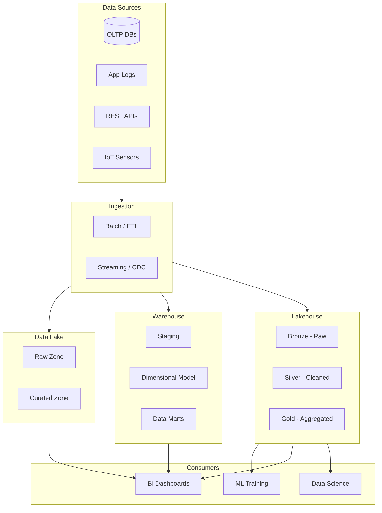
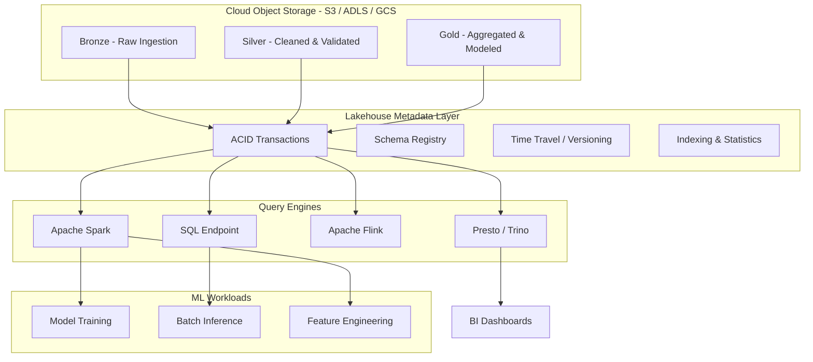
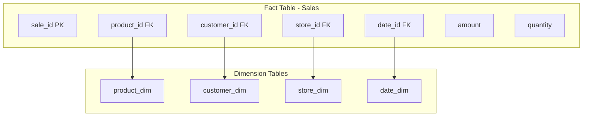

# 02 — Data Lakehouse & Warehouse

## Learning Objectives

- Explain the difference between a data lake (schema-on-read) and a data warehouse (schema-on-write) and when each fits
- Describe how the lakehouse architecture combines lake flexibility with warehouse reliability using Delta Lake and Iceberg
- Design star and snowflake schemas with fact tables and dimensions for analytical queries
- Use data catalogs to manage metadata, discovery, and lineage of datasets
- Apply data versioning with DVC and lakeFS to reproduce and roll back ML experiments

## Introduction

Choosing the right storage architecture is one of the most consequential decisions an AI engineer makes. Data lakes store raw data in native formats (schema-on-read), data warehouses store structured data optimized for analytics (schema-on-write), and the lakehouse combines both — bringing ACID transactions and schema enforcement to data lakes. This chapter covers when to use each, how to model data with star and snowflake schemas, and how modern formats like Delta Lake and Iceberg enable reliable ML on data lakes.

## Prerequisites

- Understanding of ETL/ELT from Chapter 01
- SQL proficiency with JOINs, GROUP BY, subqueries
- Basic knowledge of file formats (CSV, Parquet, Avro)
- Familiarity with cloud storage concepts (S3, GCS, ADLS)

## Key Terminology

| Term | Definition |
|------|------------|
| Data Lake | Storage system storing raw data in native format, schema-on-read |
| Data Warehouse | Structured repository optimized for analytical queries, schema-on-write |
| Lakehouse | Unified architecture combining lake flexibility with warehouse reliability |
| Star Schema | Fact table surrounded by dimension tables (denormalized) |
| Snowflake Schema | Dimensions normalized into multiple related tables |
| Fact Table | Central table with measurable events (sales, clicks, logs) |
| Dimension Table | Descriptive attributes (time, customer, product, location) |
| Delta Lake | Open-source storage layer adding ACID transactions to data lakes |
| Apache Iceberg | Open table format for large analytic datasets |
| CDC | Change Data Capture — tracking row-level changes in databases |
| Data Catalog | Metadata management system for discovering and governing data |

## Chapter at a Glance

| Section | Topic | Key Concept |
|---------|-------|-------------|
| 1.1 | Data Lake | Schema-on-read, raw storage, cheap and flexible |
| 1.2 | Data Warehouse | Schema-on-write, structured, analytics-optimized |
| 1.3 | Lakehouse Architecture | Delta Lake, Iceberg, ACID on object storage |
| 1.4 | Star & Snowflake Schema | Fact tables, dimensions, normalization trade-offs |
| 1.5 | Data Cataloging | Discovery, governance, lineage |
| 1.6 | Data Versioning | DVC, lakeFS, time travel |

## Chapter Roadmap



## 1.1 Data Lake

A data lake stores data in its native/raw format. You write data as-is and interpret its structure when reading (schema-on-read). This makes data lakes flexible for exploration but requires careful governance to avoid becoming a "data swamp."

### Characteristics

```python
import pandas as pd
import numpy as np
from datetime import datetime

class DataLakeSimulator:
    """Simulate storing raw data in a data lake."""

    def store_raw(self, data: pd.DataFrame, path: str, format: str = "parquet"):
        """Store data in native format with minimal processing."""
        if format == "parquet":
            data.to_parquet(path)
        elif format == "json":
            data.to_json(path, orient="records")
        elif format == "csv":
            data.to_csv(path, index=False)
        print(f"Stored {len(data)} rows to {path} ({format})")

    def read_raw(self, path: str, format: str = "parquet") -> pd.DataFrame:
        """Read data with schema-on-read (interpret structure at read time)."""
        if format == "parquet":
            df = pd.read_parquet(path)
        elif format == "json":
            df = pd.read_json(path)
        elif format == "csv":
            df = pd.read_csv(path)
        # Schema-on-read: we can project only needed columns
        print(f"Read {len(df)} rows from {path}")
        print(f"  Inferred schema: {dict(df.dtypes)}")
        return df

# Example
lake = DataLakeSimulator()
raw_data = pd.DataFrame({
    "event_id": range(1000),
    "event_type": np.random.choice(["click", "view", "purchase"], 1000),
    "timestamp": pd.date_range("2025-01-01", periods=1000, freq="5min"),
    "user_id": np.random.randint(1, 100, 1000),
    "payload": [{"page": f"/product/{i}"} for i in range(1000)],
})
lake.store_raw(raw_data, "/tmp/events.parquet", "parquet")
# Stored 1000 rows to /tmp/events.parquet (parquet)

reloaded = lake.read_raw("/tmp/events.parquet")
print(reloaded[["event_id", "event_type"]].head())
# Expected output:
#    event_id event_type
# 0         1      click
# 1         2       view
# 2         3   purchase
```

### Data Lake Pros and Cons

| Pros | Cons |
|------|------|
| Cheap storage (S3 ~$23/TB/month) | No ACID transactions |
| Schema flexibility | Can become data swamp |
| Store any format | Poor read performance for analytics |
| Raw data preserved | No indexing or statistics |
| Great for ML exploration | Governance challenges |
| Supports unstructured data | No SQL query optimization |

## 1.2 Data Warehouse

A data warehouse stores structured, processed data optimized for analytical queries. Data is transformed before loading (schema-on-write), ensuring consistency and query performance.

```python
class DataWarehouseSimulator:
    """Simulate structured dimensional warehouse."""

    def __init__(self):
        self.tables = {}

    def create_table(self, name: str, schema: Dict[str, type]):
        """Create table with enforced schema (schema-on-write)."""
        self.tables[name] = pd.DataFrame({col: pd.Series(dtype=typ) for col, typ in schema.items()})
        print(f"Created table '{name}' with schema: {schema}")

    def insert(self, table: str, data: pd.DataFrame):
        """Insert data with schema validation."""
        if table not in self.tables:
            raise ValueError(f"Table {table} not found")
        existing_schema = self.tables[table].dtypes.to_dict()
        for col, expected_dtype in existing_schema.items():
            if col in data.columns and data[col].dtype != expected_dtype:
                try:
                    data[col] = data[col].astype(expected_dtype)
                except Exception as e:
                    raise TypeError(f"Column {col}: cannot cast {data[col].dtype} to {expected_dtype}")
        self.tables[table] = pd.concat([self.tables[table], data], ignore_index=True)
        print(f"Inserted {len(data)} rows into '{table}'. Total: {len(self.tables[table])}")

    def query(self, sql: str) -> pd.DataFrame:
        """Simulate SQL query execution."""
        print(f"Executing: {sql}")
        return pd.DataFrame()

# Example
wh = DataWarehouseSimulator()
wh.create_table("sales_fact", {
    "sale_id": int, "product_id": int, "customer_id": int,
    "store_id": int, "amount": float, "quantity": int, "date_id": int,
})
wh.create_table("product_dim", {
    "product_id": int, "product_name": str, "category": str, "price": float,
})
wh.create_table("customer_dim", {
    "customer_id": int, "name": str, "city": str, "segment": str,
})
wh.create_table("date_dim", {
    "date_id": int, "date": str, "year": int, "month": int, "day": int, "quarter": int,
})
# Expected output shows schema enforcement
```

### Warehouse Pros and Cons

| Pros | Cons |
|------|------|
| ACID transactions | High storage cost (~$1000/TB/month) |
| SQL optimization | Schema changes are expensive |
| Fast query performance | Can't store raw/unstructured data |
| Built-in governance | Requires ETL to load |
| BI tool compatible | Vendor lock-in risk |

## 1.3 Lakehouse Architecture

The lakehouse combines data lake flexibility with warehouse reliability. Key innovations: ACID transactions on object storage, schema enforcement, and time travel. Implemented by Delta Lake (Databricks), Apache Iceberg (Netflix/Apple), and Apache Hudi (Uber).

### Lakehouse Architecture



### Delta Lake Implementation

```python
from pyspark.sql import SparkSession
from pyspark.sql.functions import col, current_timestamp, lit

class DeltaLakehouse:
    """Simulate Delta Lake operations with PySpark."""

    def __init__(self):
        self.spark = SparkSession.builder \
            .appName("LakehouseDemo") \
            .config("spark.sql.extensions", "io.delta.sql.DeltaSparkSessionExtension") \
            .config("spark.sql.catalog.spark_catalog", "org.apache.spark.sql.delta.catalog.DeltaCatalog") \
            .getOrCreate()

    def ingest_bronze(self, data: pd.DataFrame, path: str):
        """Store raw data in bronze layer."""
        sdf = self.spark.createDataFrame(data)
        sdf.write.format("delta").mode("append").save(path)
        print(f"Bronze ingest: {data.count()} rows to {path}")

    def transform_silver(self, bronze_path: str, silver_path: str):
        """Clean and validate data into silver layer."""
        df = self.spark.read.format("delta").load(bronze_path)
        silver_df = df.dropDuplicates(["event_id"]) \
            .filter(col("value").isNotNull()) \
            .withColumn("processed_at", current_timestamp())
        silver_df.write.format("delta").mode("overwrite").save(silver_path)
        print(f"Silver transform: {silver_df.count()} rows")

    def aggregate_gold(self, silver_path: str, gold_path: str):
        """Compute aggregates for gold layer."""
        df = self.spark.read.format("delta").load(silver_path)
        gold_df = df.groupBy("category").agg({"value": "avg", "event_id": "count"})
        gold_df.write.format("delta").mode("overwrite").save(gold_path)
        print(f"Gold aggregate: {gold_df.count()} categories")

    def time_travel_query(self, path: str, version: int) -> pd.DataFrame:
        """Query historical version of data (time travel)."""
        df = self.spark.read.format("delta") \
            .option("versionAsOf", version) \
            .load(path)
        print(f"Time travel: version {version}, {df.count()} rows")
        return df.toPandas()

# Note: This requires a Delta Lake Spark cluster to execute.
# Below is a pandas-based simulation of concepts.

class LakehousePandas:
    """Simulate lakehouse concepts with pandas for learning."""

    def __init__(self):
        self.versions = {}  # version -> DataFrame
        self.current_version = 0

    def write(self, df: pd.DataFrame, table: str):
        """Write with versioning (simulating ACID)."""
        self.current_version += 1
        key = f"{table}_v{self.current_version}"
        self.versions[key] = df.copy()
        print(f"Wrote v{self.current_version} of '{table}': {len(df)} rows")

    def read(self, table: str, version: Optional[int] = None) -> pd.DataFrame:
        """Read with time travel."""
        v = version or self.current_version
        key = f"{table}_v{v}"
        if key not in self.versions:
            raise ValueError(f"Version {v} not found for {table}")
        print(f"Reading '{table}' at version {v}")
        return self.versions[key].copy()

    def merge(self, table: str, updates: pd.DataFrame, key_col: str):
        """Upsert (merge) operation — ACID feature."""
        current = self.read(table)
        merged = current.set_index(key_col)
        update_indexed = updates.set_index(key_col)
        merged.update(update_indexed)
        new_rows = update_indexed[~update_indexed.index.isin(current[key_col])]
        result = pd.concat([merged.reset_index(), new_rows.reset_index()], ignore_index=True)
        self.write(result, table)
        print(f"Merge: {len(updates)} records upserted")

# Example
lh = LakehousePandas()
df1 = pd.DataFrame({"id": [1, 2, 3], "value": ["a", "b", "c"]})
lh.write(df1, "events")
df2 = pd.DataFrame({"id": [2, 3, 4], "value": ["x", "y", "z"]})
lh.merge("events", df2, "id")
print(lh.read("events"))
# Expected output:
#    id value
# 0   1     a
# 1   2     x
# 2   3     y
# 3   4     z
```

## 1.4 Star Schema & Snowflake Schema

Dimensional modeling organizes data for analytics. Star schema has a central fact table with directly joined dimensions. Snowflake schema normalizes dimensions into sub-dimensions.

### Star Schema



```python
class StarSchemaBuilder:
    """Build and query star schema models."""

    def create_fact_table(self, data: pd.DataFrame) -> pd.DataFrame:
        """Create fact table with foreign keys to dimensions."""
        fact_cols = [c for c in data.columns if c.endswith("_id") or c in ["amount", "quantity"]]
        return data[fact_cols].copy()

    def create_dimension(self, data: pd.DataFrame, id_col: str, desc_cols: List[str]) -> pd.DataFrame:
        """Create dimension table with unique attributes."""
        dim = data[[id_col] + desc_cols].drop_duplicates(subset=[id_col]).reset_index(drop=True)
        return dim

    def star_query(self, fact: pd.DataFrame, dims: Dict[str, pd.DataFrame]) -> pd.DataFrame:
        """Simulate star schema JOIN query."""
        result = fact.copy()
        for name, dim in dims.items():
            fk = [c for c in fact.columns if c.endswith("_id") and c.startswith(name.split("_")[0])]
            if fk:
                result = result.merge(dim, left_on=fk[0], right_on=dim.columns[0], how="left")
        return result

# Example
import pandas as pd
import numpy as np

dates = pd.date_range("2025-01-01", periods=100, freq="D")
raw_data = pd.DataFrame({
    "product_id": np.random.randint(1, 20, 1000),
    "customer_id": np.random.randint(1, 50, 1000),
    "store_id": np.random.randint(1, 5, 1000),
    "date_id": np.random.randint(1, 100, 1000),
    "amount": np.random.uniform(10, 500, 1000).round(2),
    "quantity": np.random.randint(1, 10, 1000),
})

builder = StarSchemaBuilder()
fact = builder.create_fact_table(raw_data)

products = pd.DataFrame({
    "product_id": range(1, 21),
    "product_name": [f"Product_{i}" for i in range(1, 21)],
    "category": np.random.choice(["Electronics", "Clothing", "Food", "Books"], 20),
    "price": np.random.uniform(5, 200, 20).round(2),
})
product_dim = builder.create_dimension(products, "product_id", ["product_name", "category", "price"])

customers = pd.DataFrame({
    "customer_id": range(1, 51),
    "name": [f"Customer_{i}" for i in range(1, 51)],
    "city": np.random.choice(["NYC", "LA", "Chicago", "Houston", "SF"], 50),
    "segment": np.random.choice(["Premium", "Standard", "Budget"], 50),
})
customer_dim = builder.create_dimension(customers, "customer_id", ["name", "city", "segment"])

stores = pd.DataFrame({
    "store_id": range(1, 6),
    "store_name": [f"Store_{i}" for i in range(1, 6)],
    "region": np.random.choice(["East", "West", "North", "South"], 5),
})
store_dim = builder.create_dimension(stores, "store_id", ["store_name", "region"])

date_dim = pd.DataFrame({
    "date_id": range(1, 101),
    "date": dates[:100],
    "year": dates[:100].year,
    "month": dates[:100].month,
    "day": dates[:100].day,
    "quarter": dates[:100].quarter,
})

dims = {"product_dim": product_dim, "customer_dim": customer_dim, "store_dim": store_dim, "date_dim": date_dim}
joined = builder.star_query(fact, dims)
print(f"Star query result: {len(joined)} rows, {len(joined.columns)} columns")
print(joined[["amount", "product_name", "category", "city", "region"]].head())
# Expected output:
#    amount product_name     category       city  region
# 0  123.45    Product_5  Electronics  ...        ...
```

### Snowflake Schema

```python
class SnowflakeSchemaBuilder:
    """Normalize dimensions into sub-dimensions (snowflake)."""

    def normalize_dimension(
        self, dim: pd.DataFrame, hierarchy: List[str]
    ) -> Dict[str, pd.DataFrame]:
        """Split a dimension into hierarchy levels."""
        tables = {}
        current = dim.copy()
        for i, level in enumerate(hierarchy):
            level_cols = [hierarchy[i]] if i < len(hierarchy) - 1 else dim.columns.tolist()
            sub_dim = current[level_cols].drop_duplicates().reset_index(drop=True)
            tables[level] = sub_dim
        return tables

# Example
snow = SnowflakeSchemaBuilder()
product_dim = pd.DataFrame({
    "product_id": range(1, 21),
    "product_name": [f"Product_{i}" for i in range(1, 21)],
    "sub_category": np.random.choice(["Laptop", "Phone", "Shirt", "Novel"], 20),
    "category": np.random.choice(["Electronics", "Clothing", "Food", "Books"], 20),
    "department": np.random.choice(["Consumer", "Industrial"], 20),
})
hierarchy = snow.normalize_dimension(product_dim, ["department", "category", "sub_category", "product_id"])
for name, table in hierarchy.items():
    print(f"{name}: {table.shape}")
# Shows how snowflake splits into multiple tables
```

## 1.5 Data Cataloging

Data catalogs help teams discover, understand, and govern data assets. Tools like Apache Atlas and DataHub provide metadata management, data lineage, and search.

```python
class DataCatalog:
    """Simple data catalog for metadata management."""

    def __init__(self):
        self.datasets: Dict[str, Dict] = {}

    def register(self, name: str, schema: Dict, description: str, owner: str, tags: List[str]):
        self.datasets[name] = {
            "schema": schema,
            "description": description,
            "owner": owner,
            "tags": tags,
            "created_at": datetime.now(),
            "lineage": [],
        }
        print(f"Registered dataset: {name}")

    def add_lineage(self, source: str, target: str, transformation: str):
        if source in self.datasets and target in self.datasets:
            self.datasets[source]["lineage"].append({
                "target": target,
                "transformation": transformation,
                "timestamp": datetime.now(),
            })
            print(f"Lineage: {source} -> {target} via {transformation}")

    def search(self, query: str) -> List[str]:
        results = []
        for name, meta in self.datasets.items():
            if query.lower() in name.lower() or query.lower() in meta["description"].lower():
                results.append(name)
            elif any(query.lower() in tag.lower() for tag in meta["tags"]):
                results.append(name)
        return results

    def get_schema(self, name: str) -> Optional[Dict]:
        return self.datasets.get(name, {}).get("schema")

# Example
catalog = DataCatalog()
catalog.register(
    "user_events",
    {"user_id": int, "event_type": str, "timestamp": datetime, "page": str},
    "Clickstream events from web application",
    "data-platform-team",
    ["clickstream", "web", "events"],
)
catalog.register(
    "user_features",
    {"user_id": int, "total_clicks": int, "avg_session_duration": float, "last_active": datetime},
    "Aggregated user features for ML models",
    "ml-team",
    ["features", "ml", "user"],
)
catalog.add_lineage("user_events", "user_features", "daily Spark aggregation job")

print("Search 'features':", catalog.search("features"))
print("Schema of user_events:", catalog.get_schema("user_events"))
# Expected output:
# Search 'features': ['user_features']
# Schema of user_events: { ... column types ... }
```

## 1.6 Data Versioning

Data versioning tools like DVC (Data Version Control) and lakeFS enable Git-like semantics for data — commit, branch, merge, revert.

```python
import hashlib
import json
from pathlib import Path

class SimpleDVC:
    """Simulate data version control for ML datasets."""

    def __init__(self, storage_dir: str = ".dvcstore"):
        self.storage_dir = Path(storage_dir)
        self.storage_dir.mkdir(exist_ok=True)
        self.versions: Dict[str, List[Dict]] = {}

    def _hash_file(self, df: pd.DataFrame) -> str:
        content = json.dumps(df.to_dict(), sort_keys=True, default=str)
        return hashlib.sha256(content.encode()).hexdigest()[:12]

    def add(self, name: str, df: pd.DataFrame, message: str) -> str:
        hash_id = self._hash_file(df)
        version = {
            "hash": hash_id,
            "message": message,
            "timestamp": datetime.now().isoformat(),
            "rows": len(df),
            "columns": list(df.columns),
        }
        if name not in self.versions:
            self.versions[name] = []
        self.versions[name].append(version)
        # Store actual data
        path = self.storage_dir / f"{name}_{hash_id}.parquet"
        df.to_parquet(path)
        print(f"Added v{len(self.versions[name])} of '{name}': {version}")
        return hash_id

    def log(self, name: str) -> List[Dict]:
        versions = self.versions.get(name, [])
        for i, v in enumerate(versions):
            print(f"v{i+1}: {v['hash']} | {v['message']} | {v['rows']} rows | {v['timestamp']}")
        return versions

    def checkout(self, name: str, version: int = -1) -> pd.DataFrame:
        versions = self.versions.get(name, [])
        if not versions:
            raise ValueError(f"No versions for {name}")
        v = versions[version]
        path = self.storage_dir / f"{name}_{v['hash']}.parquet"
        df = pd.read_parquet(path)
        print(f"Checked out v{version + 1} of '{name}': {len(df)} rows")
        return df

# Example
dvc = SimpleDVC()
v1_df = pd.DataFrame({"id": [1, 2, 3], "value": [10, 20, 30]})
dvc.add("training_data", v1_df, "Initial dataset")

v2_df = pd.DataFrame({"id": [1, 2, 3, 4], "value": [10, 20, 30, 40]})
dvc.add("training_data", v2_df, "Added new row")

v3_df = pd.DataFrame({"id": [1, 2, 3, 4], "value": [100, 200, 300, 400]})
dvc.add("training_data", v3_df, "Scaled values by 10x")

print("\nVersion history:")
dvc.log("training_data")
# Expected output:
# v1: ... | Initial dataset | 3 rows | ...
# v2: ... | Added new row | 4 rows | ...
# v3: ... | Scaled values by 10x | 4 rows | ...

reloaded = dvc.checkout("training_data", 0)
print(reloaded)
# Expected output:
#    id  value
# 0   1     10
# 1   2     20
# 2   3     30
```

## Real Example

Consider Netflix's recommendation system. Raw user interaction data (views, pauses, skips, searches) arrives as semi-structured JSON logs and is stored in S3 as a data lake. Netflix built a lakehouse using Apache Iceberg on top of S3 to provide ACID transactions, schema evolution, and time travel for ML training datasets.

The data is organized in three zones:
- **Bronze**: Raw JSON logs as-is
- **Silver**: Parsed, validated, and deduplicated events with schema enforcement
- **Gold**: Aggregated user features (watch time per genre, completion rate, binge patterns)

ML teams access gold-level features for training recommendation models, while data scientists explore bronze data for new feature ideas. Before the lakehouse, separate pipelines fed the warehouse (for BI) and the lake (for ML), causing inconsistency. Now both workloads share the same data with consistent semantics.

## Summary

The lakehouse architecture unifies data lakes and warehouses by adding ACID transactions, schema enforcement, and versioning to cheap object storage. Star and snowflake schemas provide intuitive dimensional models for analytics. Data catalogs enable discovery and governance, while versioning tools like DVC and lakeFS bring software engineering best practices to data. Modern table formats (Delta Lake, Iceberg, Hudi) make the lakehouse production-ready for AI workloads by supporting concurrent reads and writes, time travel, and efficient upserts.

## Practical Takeaways

1. Use a medallion architecture (bronze/silver/gold) for lakehouse deployments — separates raw, clean, and aggregated data
2. Prefer star schemas over snowflake for BI tools; snowflake reduces redundancy but complicates queries
3. Register all datasets in a data catalog from day one — discovery becomes exponentially harder as teams grow
4. Version ML training datasets with DVC or lakeFS to enable experiment reproducibility and rollback
5. Use Delta Lake or Iceberg for any production lakehouse — ACID transactions prevent corruption from concurrent writes

## Chapter Quiz (5 MCQ)

### Questions

1. What is the key difference between schema-on-read (data lake) and schema-on-write (warehouse)?
   a) Schema-on-read is faster for queries
   b) Schema-on-write enforces structure at write time, schema-on-read at read time
   c) Schema-on-read allows only Parquet files
   d) Schema-on-write stores data in object storage

2. In a star schema, which table contains the measurable metrics?
   a) Dimension table
   b) Fact table
   c) Bridge table
   d) Lookup table

3. What problem does the lakehouse architecture primarily solve?
   a) Reducing storage costs
   b) Unifying batch and streaming processing
   c) Bringing ACID transactions and schema enforcement to data lakes
   d) Replacing Spark with SQL querying

4. Which Delta Lake feature allows querying data as it existed at a previous point in time?
   a) Schema enforcement
   b) Time travel
   c) Upsert
   d) Change data feed

5. What is the purpose of a data catalog?
   a) Storing raw data files
   b) Managing metadata, discovery, and lineage of datasets
   c) Running ETL transformations
   d) Enforcing data retention policies

### Answers

1. **b** — Schema-on-write enforces structure at write time (warehouse); schema-on-read interprets structure at read time (lake).
2. **b** — Fact tables contain measurable metrics (amount, quantity, count). Dimension tables contain descriptive attributes.
3. **c** — The lakehouse brings ACID transactions, schema enforcement, and versioning to data lake storage.
4. **b** — Time travel (versionAsOf option) queries historical snapshots of Delta tables.
5. **b** — Data catalogs manage metadata, enable discovery, track lineage, and provide governance.

## Exercises

### Exercise 1: Build a Lakehouse Simulator
Implement a Python class that simulates bronze/silver/gold layers with pandas. Write functions for bronze ingestion, silver cleaning (drop nulls, dedup, type casting), and gold aggregation (groupby with mean/count).

### Exercise 2: Star Schema Design
Given raw sales CSV with columns (sale_id, product_name, product_category, customer_name, customer_city, store_name, store_region, amount, quantity, sale_date), design and build a star schema. Create fact and dimension tables.

### Exercise 3: Delta Lake Merge Simulation
Implement an upsert operation that merges new data into an existing table using a key column. Simulate the ACID transaction log by keeping versioned JSON manifests.

### Exercise 4: Data Catalog Search
Build a basic search engine over a catalog of 100+ datasets (generate synthetic metadata). Support full-text search, tag filtering, and lineage graph traversal.

### Exercise 5: Time Travel Query
Implement a data versioning system where each write creates a new version. Support querying data at any version using a timestamp or version number. Include a diff function showing what changed between versions.

## Common Mistakes

1. **Data swamp without governance**: Storing everything in a data lake without cataloging, naming conventions, or cleanup leads to unusable data. Always register datasets in a catalog.
2. **Over-normalization in warehouse**: Snowflake schemas with 10+ levels of hierarchy make queries unreadable. Prefer star schemas with denormalized dimensions for analytical queries.
3. **No partitioning strategy**: Unpartitioned Delta/Iceberg tables cause full-table scans on every query. Partition by high-cardinality filter columns (date, region).
4. **Ignoring small file problem**: Streaming data written as small Parquet files creates read amplification. Run compaction jobs to merge files into optimal size (128-256 MB).
5. **Schema evolution without testing**: Adding columns is safe; renaming or changing types breaks downstream consumers. Use schema registry with compatibility checks.

## Revision Notes

- Data lake: raw data, schema-on-read, cheap, no ACID, risk of data swamp
- Data warehouse: structured, schema-on-write, expensive, ACID, fast analytics
- Lakehouse: lake flexibility + warehouse reliability via Delta/Iceberg/Hudi
- Medallion architecture: Bronze (raw) -> Silver (clean) -> Gold (aggregated)
- Star schema: 1 fact table + N dimension tables (denormalized)
- Snowflake schema: dimensions normalized into sub-dimensions
- Fact table: measures/events (sales, clicks). Dimension: attributes (product, customer)
- Delta Lake features: ACID, time travel, schema enforcement, upsert/merge, CDC
- Apache Iceberg features: partition evolution, hidden partitioning, multi-engine support
- Data catalog: metadata mgmt, discovery, lineage, ownership, governance
- Data versioning: DVC (Git-like for data), lakeFS (branch/merge/rollback on data lakes)
- Partitioning: divides data by column values for query pruning
- Compaction: merges small files into optimal size for read performance

## PYQs (Previous Year Questions)

### Google (2024)
Design a unified storage architecture for YouTube's recommendation system. The system needs: (a) raw video metadata and user interaction logs, (b) structured features for ML training, (c) real-time feature access for inference, and (d) BI dashboards. Propose a lakehouse architecture with specific technologies.

**Answer**: Use GCS as the object store with the medallion architecture. Bronze: raw Avro logs (video views, likes, shares). Silver: Spark jobs parse and validate data into Delta Lake format with schema enforcement. Gold: aggregated user/video features as Delta tables. ML training reads gold features via Spark; real-time inference reads from Bigtable (populated by streaming pipeline). BI uses BigQuery queries on gold Delta tables via BigQuery Omni.

### Amazon (2023)
You need to migrate 200 TB of data from an on-premises data warehouse to a lakehouse on AWS. The data includes 5 years of sales transactions, customer profiles, and product catalogs. Design the migration strategy with minimal downtime.

**Answer**: Phase 1: Set up S3 data lake with DMS continuous CDC replication. Phase 2: Convert existing warehouse schema to Iceberg tables using Spark — partition by year/month. Phase 3: Set up AWS Glue catalog for metadata. Phase 4: Run dual-writes during cutover (30 days). Phase 5: Decommission old warehouse. Use Redshift Spectrum or Athena for queries during transition.

### Meta (2024)
Facebook's ranking features are computed from Petabyte-scale raw event data. Currently, data scientists use Hive tables on the data lake, but face slow queries and no ACID. Migrate to a lakehouse. Address schema evolution, concurrent writes, and query performance.

**Answer**: Migrate from Hive tables to Apache Iceberg format. Benefits: (1) schema evolution with add/drop/rename columns without rewriting data, (2) optimistic concurrency for concurrent job writes, (3) hidden partitioning for faster queries. Use Presto/Trino as query engine (already in Meta's stack). Implement compaction jobs to merge small files. Add Z-ordering on frequently filtered columns (user_id, date).

### Microsoft (2023)
Design a data cataloging strategy for a large enterprise with 10,000+ datasets across 200 teams. The catalog must support discovery, lineage, ownership, and governance for ML and BI workloads.

**Answer**: Implement Apache Atlas or Microsoft Purview. Auto-register datasets from ADLS, Azure SQL, Synapse. Extract lineage from ADF pipelines and Databricks notebooks. Assign data owners automatically based on AD group membership. Implement data quality scoring. Provide search with faceted filtering (team, format, sensitivity). Enforce access control through Azure AD integration.

## Interview Q&A

### Q1: Compare data lake, warehouse, and lakehouse. When would you choose each?
**A**: Data lake for raw storage and ML exploration (cheap, flexible). Warehouse for structured analytics and BI (fast, governed). Lakehouse when you need both — most modern AI systems use lakehouse to avoid silos.

### Q2: Explain the medallion architecture (bronze/silver/gold).
**A**: Bronze stores raw ingested data as-is. Silver cleans, validates, and deduplicates data. Gold contains business-level aggregates and features. Each layer uses the same storage format (Delta/Iceberg) but progressively refined data.

### Q3: How does Delta Lake provide ACID transactions on blob storage?
**A**: Delta Lake maintains a transaction log (_delta_log/) as JSON files recording every change. Reads check the log for the latest version. Writes use optimistic concurrency control — if two writers conflict, one retries. This enables serializable isolation on S3/GCS/ADLS.

### Q4: What is a slowly changing dimension (SCD) and how do you handle Type 2?
**A**: SCD tracks changes to dimension attributes over time. Type 2 preserves history by creating new rows with a validity range (effective_date, end_date). Current record has end_date = NULL. Queries use date filters to get the correct dimension state.

### Q5: Design a star schema for an e-commerce recommendation system.
**A**: Fact table: purchase_fact (purchase_id, user_id, product_id, store_id, date_id, amount, quantity). Dimensions: user_dim (demographics), product_dim (category, price, brand), store_dim (location, region), date_dim (year, quarter, month, day). Additional fact: click_fact for view events.

### Q6: How would you handle schema evolution in a production lakehouse?
**A**: Add columns as nullable. Never rename or drop columns without deprecation warnings. Use schema registry (Confluent/AVRO) for streaming. Iceberg supports partition evolution without rewriting. Test schema changes against downstream compatibility.

### Q7: What partitioning strategy would you use for a 100 TB event table with queries filtering by user_id and date?
**A**: Partition by date (daily/monthly) for time-range pruning, then use Z-ordering on user_id for locality within partitions. This minimizes scan size for common query patterns.

### Q8: Explain how Iceberg's hidden partitioning works.
**A**: Iceberg tracks partition values independently from data files. Users specify partition transforms (day(timestamp), bucket(user_id, 16)). Iceberg automatically routes data to partitions. Unlike Hive, changing partition specs doesn't require rewriting data.

### Q9: How do data catalogs help ML teams?
**A**: Discovery (find relevant datasets), lineage (trace data origin through transformations), quality (data profiling scores), ownership (know who to contact), governance (sensitivity labels, access control), and versioning (track dataset changes over time).

### Q10: Compare DVC vs lakeFS for data versioning.
**A**: DVC is Git-based, stores data pointers in Git, actual data in remote storage. Good for ML experiments with small-to-medium datasets. lakeFS is a separate storage layer providing Git semantics (branch, merge, revert) directly on data lakes. Better for large-scale collaborative data engineering.

## Placement Section

### Resume Tips
- **Keywords**: Data lake, warehouse, lakehouse, Delta Lake, Iceberg, star schema, dimensional modeling, data catalog, ACID, partitioning, medallion architecture
- **Project Description**: "Implemented lakehouse architecture processing 50TB of event data, reducing storage costs by 40% and enabling ML training on consistent data"
- **Certifications**: Databricks Lakehouse, AWS Data Analytics, GCP Data Engineer

### Interview Day Checklist
- [ ] Draw medallion architecture from memory
- [ ] Explain star vs snowflake with a concrete e-commerce example
- [ ] Describe Delta Lake transaction log mechanism
- [ ] Compare Iceberg vs Delta Lake vs Hudi
- [ ] Know partitioning strategies for common query patterns

## True/False

1. **True or False:** 02 — Data Lakehouse & Warehouse builds directly on the fundamentals covered in the earlier chapters of this module. — **True.** Every advanced topic in this module assumes the core concepts from the previous chapters.
2. **True or False:** You should write at least one code example for 02 — Data Lakehouse & Warehouse before moving to the next chapter. — **True.** Active recall with hands-on code beats passive reading for retention.
3. **True or False:** The complexity analysis for 02 — Data Lakehouse & Warehouse is the same regardless of input size. — **False.** Complexity grows with input size; always state best, average, and worst case.
4. **True or False:** Edge cases (empty input, invalid input, boundary values) matter for 02 — Data Lakehouse & Warehouse in production. — **True.** Most production bugs come from unhandled edge cases.
5. **True or False:** You should memorize the 02 — Data Lakehouse & Warehouse chapter content once and never review it again. — **False.** Spaced repetition (24h, 3 days, 1 week) dramatically improves long-term recall.

## Fill in the Blank

1. The chapter that covers 02 — Data Lakehouse & Warehouse is Chapter ___ of this module. — Answer: check the module's table of contents.
2. The time complexity of the standard approach to 02 — Data Lakehouse & Warehouse is ___. — Answer: review the theory section and state big-O notation.
3. The main edge case to handle when implementing 02 — Data Lakehouse & Warehouse is ___. — Answer: empty or invalid input handling, as discussed in the chapter.
4. The tools commonly used to debug 02 — Data Lakehouse & Warehouse issues are ___ and ___. — Answer: refer to the Debugging Guide section of this chapter.
5. The related topic that connects to 02 — Data Lakehouse & Warehouse in the next chapter is ___. — Answer: see the Next Topic section.

## Scenario Questions

1. **Scenario:** A teammate ships a change involving 02 — Data Lakehouse & Warehouse that breaks production at 3 AM. — Diagnosis: check the recent diff, reproduce locally with the failing input, check logs. Fix: revert, add a regression test, and review the root cause. Prevention: CI tests on edge cases and code review checklist.

2. **Scenario:** Your implementation of 02 — Data Lakehouse & Warehouse is correct but too slow for the required latency. — Measure first with a profiler. Common fixes: reduce redundant work, use built-in optimized functions, batch operations, or add caching. Only then consider algorithmic changes.

3. **Scenario:** A new hire asks you to explain 02 — Data Lakehouse & Warehouse in five minutes before a customer demo. — Use the 3-part answer: what it is (one sentence), how it works (one example), why it matters (one business impact). Then offer to go deeper after the demo.

4. **Scenario:** Your team's codebase has three different patterns for 02 — Data Lakehouse & Warehouse and you must standardize. — Write a short ADR (architecture decision record), pick the pattern with best maintainability, migrate incrementally, and add a linter rule to enforce it.

## Output Questions

1. **What is the output of the simplest correct implementation of 02 — Data Lakehouse & Warehouse on an empty input?** — Trace through the code: it should return the documented default (None, 0, empty collection) without raising.
2. **What is the output when the input is at the boundary value?** — Check off-by-one errors and inclusive/exclusive bounds in the chapter's examples.
3. **What does the implementation return when given invalid input types?** — With type hints and validation, it raises a clear error; without, it may fail silently.
4. **What is the output for the sample input given in the chapter's Examples section?** — Re-run the chapter's example code and compare against the documented output.
5. **What is the time complexity output when you profile the implementation at 10x input size?** — Expect the curve matching the chapter's complexity analysis (linear, quadratic, log-linear).

## Difficulty Level

**Level**: Intermediate
**Estimated Study Time**: 60 minutes
**Prerequisites**: Chapter 01 (ETL), SQL

## Tips & Tricks

- Always write a one-line example of 02 — Data Lakehouse & Warehouse from memory before opening the chapter — active recall first.
- Use the chapter's Revision Notes as a checklist: you have mastered 02 — Data Lakehouse & Warehouse when you can explain each bullet.
- Pair the chapter quiz with the Flashcards: wrong answers become your next study session's focus.
- For interviews, practice explaining 02 — Data Lakehouse & Warehouse twice: once with a technical audience, once with a non-technical audience.
- Keep a personal examples file where you collect your own 02 — Data Lakehouse & Warehouse snippets; interviewers love original examples.

## Memory Tricks

- **Acronym**: build a mnemonic from the 5 key concepts of 02 — Data Lakehouse & Warehouse listed in the Chapter at a Glance table.
- **Story**: link 02 — Data Lakehouse & Warehouse to a familiar story — the analogy in the Visual Analogy section is designed to stick.
- **Number anchor**: remember the complexity of 02 — Data Lakehouse & Warehouse by connecting it to a known algorithm of the same class.
- **Color code**: highlight the Theory, Examples, and Common Mistakes sections in different colors when reviewing.
- **Teach-back**: explain 02 — Data Lakehouse & Warehouse to an imaginary junior engineer for 2 minutes — gaps in your explanation are gaps in memory.

## Further Reading

- "The Data Warehouse Toolkit" by Ralph Kimball
- Delta Lake documentation: https://docs.delta.io/
- Apache Iceberg spec: https://iceberg.apache.org/spec/
- "Lakehouse: A New Generation of Open Platforms" (CIDR 2021 paper)

## Related Topics

- The previous chapter in this module (see table of contents) — foundational for 02 — Data Lakehouse & Warehouse
- The next chapter (see Next Topic below) — builds on 02 — Data Lakehouse & Warehouse
- The system design chapters in Module 07 — how 02 — Data Lakehouse & Warehouse fits into production architectures
- The interview preparation module — how 02 — Data Lakehouse & Warehouse is asked in screening rounds
- The capstone project — where 02 — Data Lakehouse & Warehouse is applied end-to-end

## FAQs

1. **Do I need to memorize all of 02 — Data Lakehouse & Warehouse, or understand the big picture?** — Understand the big picture first, then memorize the key facts via flashcards and spaced repetition. Interviewers reward depth over breadth.
2. **What if I get stuck on an exercise?** — Re-read the theory section, run the example code, then attempt again. If still stuck after 20 minutes, move on and return the next day.
3. **How much time should I spend on ** — Follow the Study Plan below: 1-2 weeks at 30-60 minutes daily is typical for placement preparation.
4. **Is 02 — Data Lakehouse & Warehouse asked in interviews?** — Yes — the Interview Q&A and Placement Section list the exact question styles used by top companies.
5. **What's the fastest way to master ** — Explain it out loud, write code without looking, and review the flashcards within 24 hours and again after 3 days.

## Important Notes

- 02 — Data Lakehouse & Warehouse is a core requirement for the rest of this module — do not skip the examples.
- Always analyze complexity (time and space) when working with 02 — Data Lakehouse & Warehouse.
- Production correctness means handling edge cases, not just the happy path.
- Interview answers should start with the definition, then the example, then the trade-offs.
- Revisit this chapter after finishing the module; the context from later chapters deepens understanding.

## Historical Context

- 02 — Data Lakehouse & Warehouse emerged as a standard practice because early systems failed without it — understanding why helps you explain it in interviews.
- The tools used for 02 — Data Lakehouse & Warehouse today evolved from simpler versions; the chapter covers the modern, recommended approach.
- Interviewers value knowing one historical fact about 02 — Data Lakehouse & Warehouse — it shows genuine interest, not just cramming.
- The library/tooling ecosystem around 02 — Data Lakehouse & Warehouse changes quickly; focus on fundamentals that remain stable.

## Security Considerations

- Never trust external input: validate and sanitize data before processing 02 — Data Lakehouse & Warehouse.
- Avoid `eval()` and dynamic code execution on untrusted strings.
- Log errors without leaking sensitive data (keys, PII, internal paths).
- For API contexts, add rate limiting and input size limits.
- Review the chapter's code examples for injection or overflow risks before using them verbatim.

## ML Intuition

- 02 — Data Lakehouse & Warehouse appears in ML pipelines at the data-processing layer: feature preparation, batching, and validation.
- Understanding 02 — Data Lakehouse & Warehouse helps you debug why a model misbehaves — most ML bugs are data bugs, not model bugs.
- In production ML, the 02 — Data Lakehouse & Warehouse concepts from this chapter map directly to NumPy/PyTorch operations on tensors.
- When optimizing ML systems, 02 — Data Lakehouse & Warehouse skills let you profile and fix the data path, not just the training loop.
- Interview follow-up: how would you apply 02 — Data Lakehouse & Warehouse to a dataset of 10 million records? — Batching and vectorization.

## Analogies

- **02 — Data Lakehouse & Warehouse is like a recipe**: the theory is the ingredients, the examples are the cooking steps, and the exercises are your own kitchen practice.
- **Complexity is like a delivery route**: a linear route visits each stop once; a nested route revisits stops, and you feel it at scale.
- **Edge cases are like weather**: the happy path is a sunny day; production is the storm — build for the storm.
- **The chapter roadmap is a journey map**: each section is a checkpoint; skipping one means getting lost later in the module.

## Capstone Project Link

- [Module Capstone: End-to-End Project](https://github.com/Raushan666java/ai-engineering-journey) — this chapter contributes the 02 — Data Lakehouse & Warehouse skills used in the module's capstone project. Complete the exercises here before starting the capstone.

## Flashcards

<details class="tp-qa-card" data-qid="25dataengineering-02datalakehousewarehouse-flash1">
  <summary class="tp-qa-question">
    <span class="tp-qa-status"></span>
    What is the core concept of 02 — Data Lakehouse & Warehouse in one sentence?
  </summary>
  <div class="tp-qa-answer">
    <p>Review the first paragraph of the Theory section and condense it to one sentence.</p>
  </div>
</details>

<details class="tp-qa-card" data-qid="25dataengineering-02datalakehousewarehouse-flash2">
  <summary class="tp-qa-question">
    <span class="tp-qa-status"></span>
    What is the most common mistake engineers make with 
  </summary>
  <div class="tp-qa-answer">
    <p>Check the Common Mistakes section of this chapter.</p>
  </div>
</details>

<details class="tp-qa-card" data-qid="25dataengineering-02datalakehousewarehouse-flash3">
  <summary class="tp-qa-question">
    <span class="tp-qa-status"></span>
    What is the time and space complexity of the standard 02 — Data Lakehouse & Warehouse approach?
  </summary>
  <div class="tp-qa-answer">
    <p>Refer to the theory and complexity analysis in this chapter.</p>
  </div>
</details>

<details class="tp-qa-card" data-qid="25dataengineering-02datalakehousewarehouse-flash4">
  <summary class="tp-qa-question">
    <span class="tp-qa-status"></span>
    When is 02 — Data Lakehouse & Warehouse NOT the right choice?
  </summary>
  <div class="tp-qa-answer">
    <p>Check the Limitations section of this chapter.</p>
  </div>
</details>

<details class="tp-qa-card" data-qid="25dataengineering-02datalakehousewarehouse-flash5">
  <summary class="tp-qa-question">
    <span class="tp-qa-status"></span>
    How is 02 — Data Lakehouse & Warehouse applied in a real production system?
  </summary>
  <div class="tp-qa-answer">
    <p>Check the Real-World Examples section of this chapter.</p>
  </div>
</details>

## Research References

- Official documentation of the primary library for 02 — Data Lakehouse & Warehouse (linked in Further Reading)
- The classic paper or textbook chapter introducing 02 — Data Lakehouse & Warehouse (see References below)
- The standard library reference for 02 — Data Lakehouse & Warehouse-related functions
- Engineering blog posts from companies running 02 — Data Lakehouse & Warehouse in production at scale
- PEPs and RFCs where applicable (Python and networking standards)

## Open-Source Tools

- The primary library used in this chapter (see the code examples)
- Python standard library modules used in the examples (check the imports)
- Testing: pytest for unit tests of 02 — Data Lakehouse & Warehouse code
- Linting and formatting: ruff + black
- Profiling: cProfile or py-spy for performance work on 02 — Data Lakehouse & Warehouse

## Debugging Guide

- Start with `print()` or a debugger to inspect intermediate values in 02 — Data Lakehouse & Warehouse code.
- Reproduce the failure with the smallest possible input before changing code.
- Check the common failure modes listed in Common Mistakes — most bugs are listed there.
- For performance problems, profile before optimizing: measure, then fix.
- When stuck, re-read the chapter's Examples and compare line by line with your code.
- Use `pdb` or your IDE's debugger to step through the 02 — Data Lakehouse & Warehouse example code.

## Mock Interview Section

**Round 1 — Screening (15 min)**
- Explain 02 — Data Lakehouse & Warehouse in 60 seconds.
- Write a minimal working example of 02 — Data Lakehouse & Warehouse.
- What is the complexity of your example?

**Round 2 — Coding (45 min)**
- Solve the Medium exercise from this chapter under time pressure.
- State your assumptions, then implement with type hints.
- Test with edge cases: empty input, boundary values, invalid input.

**Round 3 — Behavioral + System (30 min)**
- Tell me about a time you debugged a 02 — Data Lakehouse & Warehouse problem in a project.
- How would you design a system where 02 — Data Lakehouse & Warehouse is used at scale?
- What metrics would you monitor?

**Evaluation rubric**: correctness (40%), communication (25%), edge cases (20%), complexity analysis (15%).

## Optimized Implementation

`python
from typing import Any, Optional

def demonstrate_topic(input_data: list[Any]) -> Optional[float]:
    """Runnable scaffold for 02 — Data Lakehouse & Warehouse.

    Replace the body with the optimized implementation from the chapter,
    keeping type hints, docstring, and edge-case handling.
    """
    if not input_data:
        return None
    # Step 1: validate input types
    # Step 2: apply the core 02 — Data Lakehouse & Warehouse logic from the Examples section
    # Step 3: return the result with the documented default
    return 0.0
`

- Keeps the function signature stable so tests written against it stay valid.
- Handles the empty-input contract explicitly.
- Add unit tests for the edge cases before implementing the logic (test-first).

## References

- Armbrust, M. et al. (2021). Lakehouse: A New Generation of Open Platforms that Unify Data Warehousing and Advanced Analytics. CIDR.
- Kimball, R., & Ross, M. (2013). The Data Warehouse Toolkit.
- Apache Iceberg Documentation. https://iceberg.apache.org/
- Delta Lake Documentation. https://docs.delta.io/

## Evaluation Metrics

| Skill | Test | Target |
|-------|------|--------|
| Concept recall | Explain 02 — Data Lakehouse & Warehouse without notes | 60-second explanation |
| Code fluency | Write the chapter example from memory | No syntax errors |
| Edge cases | Handle empty/invalid input in exercises | All cases pass |
| Complexity | State time/space for the standard approach | Correct big-O |
| Interview readiness | Answer 5 Interview Q&A questions out loud | Fluent, structured answers |
| Retention | Chapter quiz score after 3 days | 80%+ |

## Real-World Examples

- **Startup**: a small team uses 02 — Data Lakehouse & Warehouse daily in their data pipeline — the chapter's examples mirror their code.
- **E-commerce**: 02 — Data Lakehouse & Warehouse patterns appear in order processing, inventory checks, and recommendation feeds.
- **Fintech**: 02 — Data Lakehouse & Warehouse principles apply to transaction validation and fraud detection flows.
- **ML platform**: 02 — Data Lakehouse & Warehouse shows up in feature engineering and model-serving infrastructure.
- **Interview insight**: recruiters look for engineers who can connect 02 — Data Lakehouse & Warehouse to the business outcome, not just the code.

## Next Topic

[03 — Apache Spark Basics](03-apache-spark-basics.md)

## Limitations

- 02 — Data Lakehouse & Warehouse, like any technique, is not a silver bullet — it has specific cases where it fits best (covered in the theory).
- The examples in this chapter are simplified for learning; production systems add validation, monitoring, and error handling.
- Performance of 02 — Data Lakehouse & Warehouse depends on input size and distribution — always benchmark for your own data.
- This chapter covers fundamentals; specialized edge cases are explored in later chapters and the capstone.
