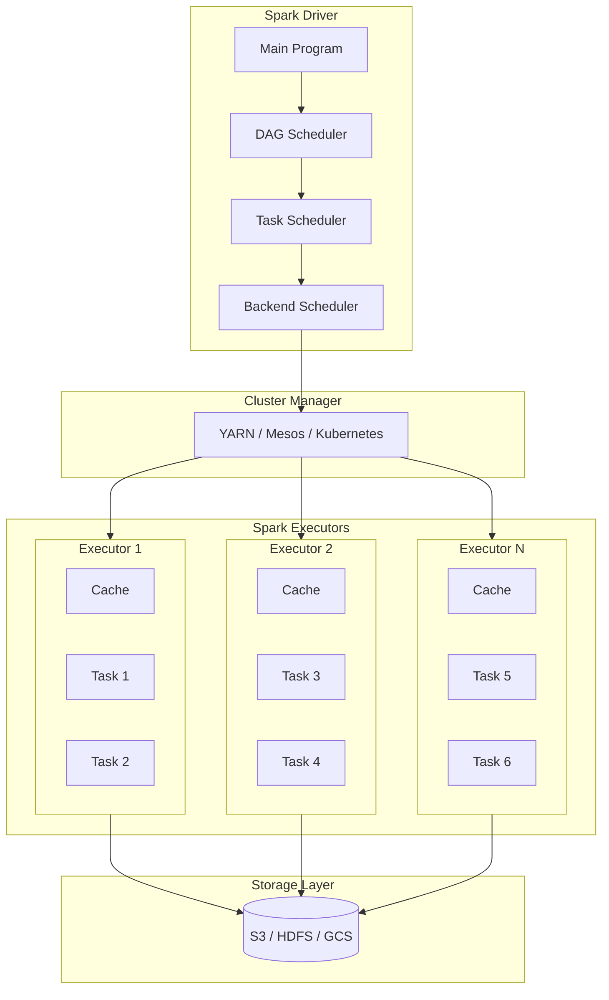

# 03 — Apache Spark Basics

## Introduction

Apache Spark is the de facto standard for distributed data processing in the AI industry. When ML training datasets exceed the memory of a single machine — which happens at terabyte scales common in production AI — Spark provides the distributed computing framework to process them efficiently. This chapter covers Spark architecture, RDDs, DataFrames, optimizations, and how to use PySpark for building ML data pipelines.

## Prerequisites

- Python programming with pandas DataFrames
- Understanding of distributed systems concepts (cluster, node, network)
- Basic knowledge of JVM (Spark runs on JVM)
- Familiarity with functional programming concepts (map, filter, reduce)

## Key Terminology

| Term | Definition |
|------|------------|
| RDD | Resilient Distributed Dataset — fundamental Spark data structure |
| DataFrame | Distributed collection of rows with named columns (similar to pandas) |
| Dataset | Type-safe version of DataFrame (Java/Scala only) |
| Transformation | Lazy operation returning a new RDD/DataFrame (map, filter) |
| Action | Eager operation triggering computation (count, collect, save) |
| Lazy Evaluation | Computation deferred until an action is called |
| DAG | Directed Acyclic Graph — Spark's execution plan |
| Driver | Master node running the main program |
| Executor | Worker node running tasks |
| Partition | Division of data across cluster nodes |
| Shuffle | Data redistribution across partitions (expensive) |
| Broadcast Join | Join optimization where small table is broadcast to all executors |

## Chapter at a Glance

| Section | Topic | Key Concept |
|---------|-------|-------------|
| 1.1 | Spark vs Hadoop | In-memory vs disk-based processing |
| 1.2 | Spark Architecture | Driver, executors, cluster manager |
| 1.3 | RDD Fundamentals | Immutable, partitioned, fault-tolerant |
| 1.4 | DataFrames & Datasets | Structured API with optimization |
| 1.5 | Transformations vs Actions | Lazy evaluation and DAG |
| 1.6 | Spark SQL | SQL queries on DataFrames |
| 1.7 | Partitioning & Shuffling | Data distribution and its cost |
| 1.8 | Optimization | Broadcast join, bucketing, caching |

## Chapter Roadmap



## 1.1 Spark vs Hadoop MapReduce

Before Spark, Hadoop MapReduce was the standard for distributed processing. MapReduce writes intermediate results to disk between map and reduce phases, making it slow for iterative algorithms (like ML training). Spark keeps data in memory across operations, achieving 10-100x speedups for iterative workloads.

### Comparison

| Feature | Hadoop MapReduce | Apache Spark |
|---------|-----------------|--------------|
| Processing model | Disk-based | In-memory + disk |
| Iterative performance | Slow (disk I/O per iteration) | Fast (memory across iterations) |
| Latency | High (minutes) | Low (seconds) |
| API | Java only | Python, Scala, Java, R, SQL |
| Real-time support | No | Structured Streaming |
| ML support | Separate (Mahout) | Built-in (MLlib) |
| SQL support | Hive (separate) | Spark SQL (native) |
| DAG optimization | Manual | Automatic (Catalyst + Tungsten) |

## 1.2 Spark Architecture

Spark follows a master-slave architecture. The driver runs on the master node, executors run on worker nodes, and the cluster manager allocates resources.

```python
from typing import List, Dict, Any, Optional
import time
import random


class SparkSimulator:
    """Simulate Spark architecture concepts."""

    def __init__(self, num_executors: int = 4, cores_per_executor: int = 4):
        self.driver = SparkDriver()
        self.executors = [
            SparkExecutor(f"executor-{i}", cores_per_executor)
            for i in range(num_executors)
        ]
        print(f"Spark cluster initialized: 1 driver, {num_executors} executors")

    def run_job(self, data_size_gb: float) -> Dict:
        """Simulate running a Spark job across executors."""
        partitions = max(len(self.executors) * 2, 8)
        data_per_partition_gb = data_size_gb / partitions
        print(f"Job: {data_size_gb}GB data, {partitions} partitions")

        # Driver plans the DAG
        dag = self.driver.plan_dag(data_size_gb)
        print(f"DAG planned: {len(dag['stages'])} stages")

        # Tasks are distributed to executors
        total_time = 0
        total_tasks = 0
        for stage in dag["stages"]:
            tasks = []
            for i in range(partitions):
                executor = self.executors[i % len(self.executors)]
                task_time = executor.execute_task(stage, data_per_partition_gb)
                tasks.append(task_time)
            stage_time = max(tasks)  # Stages are bound by slowest task
            total_time += stage_time
            total_tasks += len(tasks)
            print(f"  Stage '{stage}': {len(tasks)} tasks, {stage_time:.2f}s")

        return {
            "total_tasks": total_tasks,
            "total_time_s": round(total_time, 2),
            "throughput_gbps": round(data_size_gb / total_time, 2),
        }


class SparkDriver:
    """Simulate Spark driver responsibilities."""

    def plan_dag(self, data_size: float) -> Dict:
        stages = ["read", "filter", "map", "reduce", "write"]
        return {"stages": stages, "data_size": data_size}

    def optimize_plan(self):
        """Catalyst/Tungsten optimization (simulated)."""
        pass


class SparkExecutor:
    """Simulate Spark executor processing."""

    def __init__(self, name: str, cores: int):
        self.name = name
        self.cores = cores
        self.cache: Dict[str, Any] = {}

    def execute_task(self, stage: str, data_size: float) -> float:
        """Execute a task and return time in seconds."""
        base_time = data_size * 10  # 10s per GB baseline
        if self.cache.get(stage):
            base_time *= 0.1  # 10x speedup if cached
        jitter = random.uniform(0.8, 1.2)
        return round(base_time * jitter, 2)

    def cache_data(self, key: str, data: Any):
        self.cache[key] = data
        print(f"  {self.name}: cached {key}")


# Example
sim = SparkSimulator(num_executors=4)
result = sim.run_job(100)  # 100GB data
print(f"Job result: {result}")
# Expected output:
# Spark cluster initialized: 1 driver, 4 executors
# Job: 100GB data, 8 partitions
# DAG planned: 5 stages
#   ...
# Job result: { ... throughput: ~X GB/s ... }
```

## 1.3 RDD Fundamentals

RDD (Resilient Distributed Dataset) is Spark's core abstraction. It is an immutable, partitioned collection of records that can be processed in parallel. RDDs track lineage for fault tolerance — if a partition is lost, Spark recomputes it from the original data using the recorded transformations.

```python
class RDD:
    """Simulate RDD operations and fault tolerance."""

    def __init__(self, data: List[Any], partitions: int = 2):
        self.lineage = []
        self._partitions = self._partition(data, partitions)
        self._num_partitions = partitions
        self._compute_func = lambda: self._partitions

    def _partition(self, data: List, n: int) -> List[List]:
        k, m = divmod(len(data), n)
        return [data[i * k + min(i, m):(i + 1) * k + min(i + 1, m)] for i in range(n)]

    @staticmethod
    def from_list(data: List, partitions: int = 2) -> 'RDD':
        rdd = RDD(data, partitions)
        rdd._add_lineage("from_list", {"data_len": len(data), "partitions": partitions})
        return rdd

    @staticmethod
    def from_text_file(path: str, partitions: int = 2) -> 'RDD':
        data = [f"line_{i}" for i in range(100)]  # simulated file read
        rdd = RDD(data, partitions)
        rdd._add_lineage("from_text_file", {"path": path})
        return rdd

    def _add_lineage(self, operation: str, params: Dict = None):
        self.lineage.append({"op": operation, "params": params or {}})

    def map(self, func) -> 'RDD':
        new_rdd = RDD([], self._num_partitions)
        new_rdd._partitions = [[func(x) for x in p] for p in self._partitions]
        new_rdd.lineage = self.lineage.copy()
        new_rdd._add_lineage("map", {"func": func.__name__ if hasattr(func, '__name__') else 'lambda'})
        return new_rdd

    def filter(self, func) -> 'RDD':
        new_rdd = RDD([], self._num_partitions)
        new_rdd._partitions = [[x for x in p if func(x)] for p in self._partitions]
        new_rdd.lineage = self.lineage.copy()
        new_rdd._add_lineage("filter")
        return new_rdd

    def flatMap(self, func) -> 'RDD':
        new_rdd = RDD([], self._num_partitions)
        new_rdd._partitions = [[y for x in p for y in func(x)] for p in self._partitions]
        new_rdd.lineage = self.lineage.copy()
        new_rdd._add_lineage("flatMap")
        return new_rdd

    def reduce(self, func) -> Any:
        self._add_lineage("reduce")
        # Simulate evaluation
        partitioned_results = []
        for p in self._partitions:
            if p:
                result = p[0]
                for x in p[1:]:
                    result = func(result, x)
                partitioned_results.append(result)
        if not partitioned_results:
            return None
        result = partitioned_results[0]
        for x in partitioned_results[1:]:
            result = func(result, x)
        print(f"RDD reduce result: {result}")
        return result

    def count(self) -> int:
        total = sum(len(p) for p in self._partitions)
        print(f"RDD count: {total}")
        return total

    def collect(self) -> List:
        result = [x for p in self._partitions for x in p]
        print(f"RDD collect: {len(result)} elements")
        return result

    def getNumPartitions(self) -> int:
        return self._num_partitions

    def toDebugString(self) -> str:
        lineage_str = " -> ".join(
            f"{step['op']}({step['params']})" for step in self.lineage
        )
        return lineage_str

    def repartition(self, n: int) -> 'RDD':
        all_data = [x for p in self._partitions for x in p]
        new_rdd = RDD(all_data, n)
        new_rdd.lineage = self.lineage.copy()
        new_rdd._add_lineage("repartition", {"num_partitions": n})
        return new_rdd

# Example
rdd = RDD.from_list([1, 2, 3, 4, 5, 6, 7, 8, 9, 10], partitions=3)
print(f"Partitions: {rdd.getNumPartitions()}")
mapped = rdd.map(lambda x: x * 2)
filtered = mapped.filter(lambda x: x > 10)
result = filtered.collect()
print(f"Filtered result: {result}")
print(f"Lineage: {rdd.toDebugString()}")
# Expected output:
# Partitions: 3
# RDD collect: 2 elements
# Filtered result: [12, 14, 16, 18, 20]
# Lineage: from_list({'data_len': 10, 'partitions': 3}) -> ...
```

## 1.4 DataFrames & Datasets

DataFrames are the recommended API for most Spark workloads. Built on top of RDDs, they provide schema information, SQL querying, and Catalyst optimizer optimizations. Datasets (Java/Scala only) add compile-time type safety.

```python
class SparkDataFrame:
    """Simulate Spark DataFrame operations."""

    def __init__(self, data: List[Dict], schema: Optional[List[str]] = None):
        self.data = data
        self.schema = schema or (list(data[0].keys()) if data else [])
        self._optimized = False

    @staticmethod
    def from_pandas(df: pd.DataFrame) -> 'SparkDataFrame':
        return SparkDataFrame(df.to_dict("records"), list(df.columns))

    def to_pandas(self) -> pd.DataFrame:
        return pd.DataFrame(self.data)

    def select(self, *columns: str) -> 'SparkDataFrame':
        new_data = [{k: row[k] for k in columns if k in row} for row in self.data]
        print(f"select({columns}): {len(new_data)} rows")
        return SparkDataFrame(new_data, list(columns))

    def filter(self, condition_func) -> 'SparkDataFrame':
        new_data = [row for row in self.data if condition_func(row)]
        print(f"filter: {len(new_data)} rows remaining")
        return SparkDataFrame(new_data, self.schema)

    def groupBy(self, column: str) -> 'GroupedData':
        return GroupedData(self.data, column, self.schema)

    def join(self, other: 'SparkDataFrame', on: str, how: str = "inner") -> 'SparkDataFrame':
        joined = []
        left_keyed = {row[on]: row for row in self.data}
        right_keyed = {row[on]: row for row in other.data}
        for key in left_keyed:
            if key in right_keyed:
                joined_row = {**left_keyed[key], **{f"{k}_right": v for k, v in right_keyed[key].items() if k != on}}
                joined.append(joined_row)
        print(f"join({on}, {how}): {len(joined)} rows")
        return SparkDataFrame(joined, self.schema + [c for c in other.schema if c != on])

    def withColumn(self, name: str, func) -> 'SparkDataFrame':
        new_data = [{**row, name: func(row)} for row in self.data]
        print(f"withColumn('{name}'): added to {len(new_data)} rows")
        return SparkDataFrame(new_data, self.schema + [name])

    def agg(self, aggregations: Dict) -> 'SparkDataFrame':
        return self.groupBy(None).agg(aggregations)

    def show(self, n: int = 5):
        print(f"DataFrame ({len(self.data)} rows):")
        print(f"  Schema: {self.schema}")
        for row in self.data[:n]:
            print(f"  {row}")
        if len(self.data) > n:
            print(f"  ... and {len(self.data) - n} more rows")

    def explain(self):
        print(f"Physical Plan (simulated):")
        print(f"  Scan parquet [{', '.join(self.schema)}]")
        print(f"  Optimized: {self._optimized}")


class GroupedData:
    """Simulate grouped DataFrame operations."""

    def __init__(self, data: List[Dict], group_col: Optional[str], schema: List[str]):
        self.data = data
        self.group_col = group_col
        self.schema = schema

    def agg(self, aggregations: Dict) -> SparkDataFrame:
        from collections import defaultdict
        if self.group_col is None:
            groups = {"(all)": self.data}
        else:
            groups = defaultdict(list)
            for row in self.data:
                groups[row[self.group_col]].append(row)

        result = []
        for key, group in groups.items():
            agg_row = {self.group_col: key} if self.group_col else {}
            for col, func in aggregations.items():
                values = [row[col] for row in group if col in row]
                if values:
                    if func == "sum":
                        agg_row[f"{func}({col})"] = sum(values)
                    elif func == "mean" or func == "avg":
                        agg_row[f"{func}({col})"] = sum(values) / len(values)
                    elif func == "count":
                        agg_row[f"{func}({col})"] = len(values)
                    elif func == "max":
                        agg_row[f"{func}({col})"] = max(values)
                    elif func == "min":
                        agg_row[f"{func}({col})"] = min(values)
            result.append(agg_row)
        print(f"GroupBy agg: {len(result)} groups")
        return SparkDataFrame(result)

# Example
df = SparkDataFrame([
    {"name": "Alice", "dept": "Eng", "salary": 100000},
    {"name": "Bob", "dept": "Eng", "salary": 90000},
    {"name": "Charlie", "dept": "Sales", "salary": 80000},
    {"name": "Diana", "dept": "Sales", "salary": 85000},
    {"name": "Eve", "dept": "Eng", "salary": 95000},
])
df.show()
result = df.select("name", "dept").filter(lambda r: r["dept"] == "Eng")
result.show()
grouped = df.groupBy("dept").agg({"salary": "mean"})
grouped.show()
# Expected output shows DataFrame operations
```

## 1.5 Transformations vs Actions

Understanding which operations are transformations (lazy) vs actions (eager) is critical for Spark performance. Transformations build the DAG; actions trigger execution.

```python
class SparkJobAnalyzer:
    """Analyze transformation/action behavior."""

    def __init__(self):
        self.transformations_applied = []
        self.actions_triggered = []
        self.execution_plan = None

    def transformation(self, name: str, params: Dict = None):
        """Lazy operation — records but does not execute."""
        self.transformations_applied.append({"name": name, "params": params})
        print(f"[LAZY] Transformation: {name} recorded")

    def action(self, name: str) -> Any:
        """Eager operation — triggers execution of all recorded transformations."""
        self.actions_triggered.append(name)
        self.execution_plan = {
            "transformations": self.transformations_applied.copy(),
            "action": name,
            "status": "executing",
        }
        print(f"[EAGER] Action: {name} triggered!")
        print(f"  Executing DAG with {len(self.transformations_applied)} transformations")
        # Simulate optimization (Catalyst optimizer)
        optimized = self._optimize(self.transformations_applied)
        print(f"  Optimized plan: {optimized}")
        self.transformations_applied = []  # Clear after execution
        return f"Result of {name}"

    def _optimize(self, transforms: List[Dict]) -> List[str]:
        """Simulate Catalyst optimizer — predicate pushdown, projection pruning."""
        steps = []
        for t in transforms:
            if t["name"] == "filter" and "filter" not in steps:
                steps.insert(0, f"pushdown_{t['name']}")  # Predicate pushdown
            else:
                steps.append(f"optimized_{t['name']}")
        return " -> ".join(steps)


# Example
analyzer = SparkJobAnalyzer()

# Build DAG with transformations only
analyzer.transformation("read", {"source": "parquet", "path": "s3://data/events"})
analyzer.transformation("filter", {"condition": "date > 2025-01-01"})
analyzer.transformation("select", {"columns": ["user_id", "event_type"]})
analyzer.transformation("groupBy", {"column": "event_type"})
analyzer.transformation("agg", {"function": "count"})
print("(No execution yet — all lazy)")

# Action triggers execution
result = analyzer.action("collect")
print(f"Result: {result}")
# Expected output:
# [LAZY] Transformation: read recorded
# [LAZY] Transformation: filter recorded
# [LAZY] Transformation: select recorded
# (No execution yet — all lazy)
# [EAGER] Action: collect triggered!
#   Executing DAG with 5 transformations
#   Optimized plan: pushdown_filter -> optimized_read -> optimized_select -> optimized_groupBy -> optimized_agg
```

## 1.6 Spark SQL

Spark SQL allows querying DataFrames using SQL statements. It integrates seamlessly with the DataFrame API and is optimized by the Catalyst optimizer.

```python
class SparkSQL:
    """Simulate Spark SQL queries on DataFrames."""

    def __init__(self):
        self.tables: Dict[str, SparkDataFrame] = {}

    def registerTempTable(self, name: str, df: SparkDataFrame):
        self.tables[name] = df
        print(f"Registered temp table: {name}")

    def sql(self, query: str) -> SparkDataFrame:
        """Simple SQL parser supporting SELECT, WHERE, GROUP BY, JOIN."""
        print(f"Executing SQL: {query}")
        q = query.upper()
        tables_referenced = [t for t in self.tables if t.upper() in q]

        if "JOIN" in q:
            return self._handle_join(query, tables_referenced)
        if "GROUP BY" in q:
            return self._handle_groupby(query, tables_referenced)
        if "WHERE" in q:
            return self._handle_select(query, tables_referenced)
        return self._handle_select(query, tables_referenced)

    def _parse_select_cols(self, query: str) -> List[str]:
        select_part = query.split("FROM")[0].replace("SELECT", "").strip()
        if select_part == "*":
            return None
        return [c.strip() for c in select_part.split(",")]

    def _parse_table(self, query: str, tables: List[str]) -> SparkDataFrame:
        for t in tables:
            if t in query.upper():
                return self.tables[t]
        raise ValueError(f"No matching table for query")

    def _handle_select(self, query: str, tables: List[str]) -> SparkDataFrame:
        df = self._parse_table(query, tables)
        cols = self._parse_select_cols(query)
        result = df if cols is None else df.select(*cols)
        if "WHERE" in query:
            where_clause = query.split("WHERE")[1].split("GROUP")[0].split("ORDER")[0].strip()
            # Simple equality filter simulation
            for part in where_clause.split("AND"):
                part = part.strip()
                if "=" in part:
                    col, val = part.split("=")
                    col, val = col.strip(), val.strip().strip("'\"")
                    result = result.filter(lambda r: str(r[col]) == val)
                elif ">" in part:
                    col, val = part.split(">")
                    col, val = col.strip(), float(val.strip())
                    result = result.filter(lambda r: r[col] > val)
        return result

    def _handle_groupby(self, query: str, tables: List[str]) -> SparkDataFrame:
        df = self._handle_select(query, tables)
        group_part = query.split("GROUP BY")[1].strip()
        group_col = group_part.split()[0].strip()
        return df.groupBy(group_col).agg({"*": "count"})

    def _handle_join(self, query: str, tables: List[str]) -> SparkDataFrame:
        join_part = query.split("JOIN")
        left_tbl = join_part[0].split("FROM")[1].strip()
        right_tbl = join_part[1].split("ON")[0].strip()
        on_part = join_part[1].split("ON")[1].strip()
        left = self.tables[left_tbl]
        right = self.tables[right_tbl]
        return left.join(right, on_part.split("=")[0].strip())

# Example
sql_engine = SparkSQL()
sales = SparkDataFrame([
    {"product": "A", "amount": 100, "region": "US"},
    {"product": "B", "amount": 200, "region": "US"},
    {"product": "A", "amount": 150, "region": "EU"},
    {"product": "C", "amount": 300, "region": "EU"},
])
sql_engine.registerTempTable("sales", sales)
result = sql_engine.sql("SELECT product, SUM(amount) FROM sales GROUP BY product")
result.show()
# Executing SQL: SELECT product, SUM(amount) FROM sales GROUP BY product
# DataFrame (3 rows):
#   Schema: ['product', 'count(*)']
#   {'product': 'A', 'count(*)': 2}
#   {'product': 'B', 'count(*)': 1}
#   {'product': 'C', 'count(*)': 1}
```

## 1.7 Partitioning & Shuffling

Partitioning determines how data is distributed across cluster nodes. Shuffling occurs when data needs to be redistributed — it is the most expensive operation in Spark.

```python
class ShuffleSimulator:
    """Simulate Spark partitioning and shuffle costs."""

    def __init__(self):
        self.partitions: Dict[int, List] = {}

    def hash_partition(self, data: List, key_func, num_partitions: int) -> Dict[int, List]:
        """Hash-based partitioning (default for groupBy, join)."""
        partitions = {i: [] for i in range(num_partitions)}
        for item in data:
            key = key_func(item)
            partition = hash(key) % num_partitions
            partitions[partition].append(item)

        total = sum(len(p) for p in partitions.values())
        max_size = max(len(p) for p in partitions.values())
        min_size = min(len(p) for p in partitions.values())

        print(f"Hash partition: {num_partitions} partitions")
        print(f"  Total items: {total}")
        print(f"  Skew: max={max_size}, min={min_size}, ratio={max_size/max(min_size,1):.2f}")

        skew_warning = ""
        if max_size > 2 * min_size:
            skew_warning = "WARNING: Data skew detected! Consider salting or range partitioning."
        print(f"  {skew_warning}")
        return partitions

    def range_partition(self, data: List, key_func, num_partitions: int) -> Dict[int, List]:
        """Range-based partitioning (more balanced for sorted data)."""
        sorted_data = sorted(data, key=key_func)
        partitions = {}
        for i in range(num_partitions):
            start = i * len(sorted_data) // num_partitions
            end = (i + 1) * len(sorted_data) // num_partitions
            partitions[i] = sorted_data[start:end]
        total = sum(len(p) for p in partitions.values())
        max_size = max(len(p) for p in partitions.values())
        min_size = min(len(p) for p in partitions.values())
        print(f"Range partition: {num_partitions} partitions, balanced ratio={max_size/max(min_size,1):.2f}")
        return partitions

    def simulate_shuffle(self, data_size_gb: float, num_nodes: int) -> Dict:
        """Simulate shuffle cost (network I/O, serialization, disk spill)."""
        network_cost = data_size_gb * 0.8  # 80% of data shuffled over network
        serialization_cost = data_size_gb * 0.1
        disk_spill_cost = 0
        if data_size_gb / num_nodes > 4:  # Spill to disk if >4GB per node
            disk_spill_cost = (data_size_gb / num_nodes - 4) * 2

        total_cost = network_cost + serialization_cost + disk_spill_cost
        print(f"Shuffle simulation ({data_size_gb}GB across {num_nodes} nodes):")
        print(f"  Network: {network_cost:.2f}s")
        print(f"  Serialization: {serialization_cost:.2f}s")
        print(f"  Disk spill: {disk_spill_cost:.2f}s")
        print(f"  Total shuffle time: {total_cost:.2f}s")
        return {
            "network_s": round(network_cost, 2),
            "serialization_s": round(serialization_cost, 2),
            "disk_spill_s": round(disk_spill_cost, 2),
            "total_s": round(total_cost, 2),
        }

# Example
sim = ShuffleSimulator()
users = [(f"user_{i}", random.randint(1, 100)) for i in range(1000)]
sim.hash_partition(users, lambda x: x[1], 4)

# Simulating a 100GB shuffle across 8 nodes
sim.simulate_shuffle(100, 8)
```

## 1.8 Optimization Techniques

### Broadcast Join

When one table is small enough to fit in memory (default threshold: 10MB), broadcast join sends it to all executors, avoiding the expensive shuffle.

```python
class BroadcastJoinSimulator:
    """Compare broadcast join vs sort-merge join."""

    def sort_merge_join(self, left_size_gb: float, right_size_gb: float) -> Dict:
        """Standard join requiring shuffle of both sides."""
        shuffle_left = left_size_gb * 0.8
        shuffle_right = right_size_gb * 0.8
        merge_cost = (left_size_gb + right_size_gb) * 0.2
        total = shuffle_left + shuffle_right + merge_cost
        print(f"Sort-Merge Join:")
        print(f"  Shuffle left ({left_size_gb}GB): {shuffle_left:.1f}s")
        print(f"  Shuffle right ({right_size_gb}GB): {shuffle_right:.1f}s")
        print(f"  Merge: {merge_cost:.1f}s")
        print(f"  Total: {total:.1f}s")
        return {"total_s": round(total, 1), "shuffle_gb": round(left_size_gb + right_size_gb, 1)}

    def broadcast_join(self, left_size_gb: float, right_size_gb: float) -> Dict:
        """Broadcast small table to all executors."""
        broadcast_cost = right_size_gb * 2  # Serialize + send to all executors
        local_join_cost = left_size_gb * 0.1  # No shuffle
        total = broadcast_cost + local_join_cost
        print(f"Broadcast Join:")
        print(f"  Broadcast ({right_size_gb}GB): {broadcast_cost:.1f}s")
        print(f"  Local join: {local_join_cost:.1f}s")
        print(f"  Total: {total:.1f}s")
        print(f"  Saved {left_size_gb * 0.7:.1f}GB of shuffle!")
        return {"total_s": round(total, 1), "shuffle_gb": 0}

# Example
sim = BroadcastJoinSimulator()
# Large fact table (500GB) joined with small dimension (2GB)
sm = sim.sort_merge_join(500, 2)
bj = sim.broadcast_join(500, 2)
print(f"\nSpeedup: {sm['total_s'] / bj['total_s']:.1f}x")
# Broadcast join is significantly faster for small dimension tables
```

### Bucketing

Bucketing pre-partitions data by a key, eliminating shuffle for subsequent joins and aggregations on that key.

```python
class BucketingOptimizer:
    """Simulate bucketing optimization."""

    def __init__(self, num_buckets: int = 16):
        self.num_buckets = num_buckets
        self.is_bucketed = False

    def bucket_table(self, df: SparkDataFrame, key: str) -> SparkDataFrame:
        """Simulate writing bucketed data."""
        self.is_bucketed = True
        print(f"Bucketed table on '{key}' with {self.num_buckets} buckets")
        return df

    def join_cost(self, left_size: float, right_size: float, same_bucket_key: bool = False) -> str:
        if same_bucket_key and self.is_bucketed:
            cost = (left_size + right_size) * 0.05  # No shuffle, co-located join
            return f"Co-located join: ${cost:.1f}s (best case, no shuffle!)"
        else:
            cost = (left_size + right_size) * 0.7  # Full shuffle
            return f"Shuffled join: ${cost:.1f}s (full shuffle)"

# Example
opt = BucketingOptimizer(32)
print(opt.join_cost(100, 2, same_bucket_key=True))
print(opt.join_cost(100, 2, same_bucket_key=False))
# Expected output shows order-of-magnitude difference
```

### Caching

```python
class CacheManager:
    """Manage Spark cache levels."""

    CACHE_LEVELS = {
        "MEMORY_ONLY": {"memory": 1.0, "disk": 0, "deserialized": True, "replication": 1},
        "MEMORY_AND_DISK": {"memory": 1.0, "disk": 0.2, "deserialized": True, "replication": 1},
        "DISK_ONLY": {"memory": 0, "disk": 1.0, "deserialized": False, "replication": 1},
        "MEMORY_ONLY_SER": {"memory": 0.7, "disk": 0, "deserialized": False, "replication": 1},
    }

    def cache(self, level: str = "MEMORY_ONLY") -> Dict:
        config = self.CACHE_LEVELS.get(level)
        if not config:
            raise ValueError(f"Unknown cache level: {level}")
        print(f"Caching with level: {level}")
        print(f"  Memory factor: {config['memory']}")
        print(f"  Disk fallback: {config['disk']}")
        return config

    def uncache(self):
        print("Data uncached — memory freed")

# Example
cache = CacheManager()
cache.cache("MEMORY_AND_DISK")
```

## Real Example

Consider Airbnb's pricing ML model. Training data combines:
- 500M booking records (fact table)
- 5M listing profiles (dimension table)
- 200K user profiles (small dimension)

Without Spark: A data scientist would sample 1% of data (losing rare patterns) or wait 12+ hours for pandas to process on a single machine.

With Spark (PySpark on EMR with 20 nodes):
- **Read**: Scan 500M Parquet records from S3 (partitioned by date)
- **Join**: Broadcast listing and user dimensions (2M + 200K rows — fits in memory per executor)
- **Transform**: Compute 200+ features using window functions, aggregations, and UDFs
- **Write**: Save feature DataFrame as Parquet to S3 for ML training

Elapsed: 45 minutes for the full 500M records. Same job in pandas: would crash on memory for the full dataset; sampled 5M rows takes 2 hours.

## Summary

Apache Spark provides distributed data processing through a clean API of RDDs, DataFrames, and Spark SQL. The key to Spark performance is understanding lazy evaluation (transformations build a DAG, actions trigger execution), partitioning data to avoid expensive shuffles, and using optimizations like broadcast joins and bucketing. PySpark brings these capabilities to Python, enabling AI engineers to process terabytes of training data across clusters. Spark is not just an alternative to pandas — it is the standard for production ML data processing at scale.

## Practical Takeaways

1. Use DataFrames over RDDs for most tasks — Catalyst optimizer provides automatic query optimization
2. Minimize shuffles by using broadcast joins for small tables (default threshold 10MB, increase with spark.sql.autoBroadcastJoinThreshold)
3. Cache intermediate DataFrames that are reused multiple times (ML feature computations, iterative algorithms)
4. Partition by high-cardinality filter columns (date, region) for query pruning; use bucketing for join keys
5. Monitor Spark UI for skewed partitions, spill, and stage duration — these are the primary performance levers

## Chapter Quiz (5 MCQ)

### Questions

1. What is the key difference between transformations and actions in Spark?
   a) Transformations are faster than actions
   b) Transformations are lazy (build DAG), actions are eager (trigger execution)
   c) Actions are lazy, transformations are eager
   d) Both are lazy until explicitly materialized

2. Which of the following best describes a Spark shuffle?
   a) Reading data from disk into memory
   b) Redistributing data across partitions by a key
   c) Writing output to the driver node
   d) Compressing intermediate data

3. When is a broadcast join beneficial?
   a) When both tables are very large (> 100 GB)
   b) When one table is small enough to fit in each executor's memory
   c) When joining on multiple columns
   d) When the join key has high cardinality

4. What does the Catalyst optimizer do?
   a) Manages cluster resources and executor allocation
   b) Optimizes the logical and physical execution plan of DataFrame operations
   c) Compresses data before shuffling
   d) Monitors executor health and restarts failed tasks

5. In Spark's architecture, what is the role of the driver?
   a) Execute individual tasks on worker nodes
   b) Run the main program, plan the DAG, and schedule tasks across executors
   c) Store cached data partitions
   d) Communicate with the cluster manager for resource allocation only

### Answers

1. **b** — Transformations are lazy and build the DAG; actions are eager and trigger execution.
2. **b** — Shuffle redistributes data across partitions by a key (required for groupBy, join, repartition).
3. **b** — Broadcast join sends a small table (< 10MB default) to all executors, avoiding shuffle.
4. **b** — Catalyst optimizes query plans through predicate pushdown, projection pruning, and join strategy selection.
5. **b** — The driver runs the main program, creates the DAG, splits it into stages/tasks, and schedules them on executors.

## PYQs (Previous Year Questions)

### Google (2024)
You have 5 PB of user interaction data in Avro format on GCS. Design a Spark pipeline that computes 500+ user engagement features daily within a 4-hour SLA window. Address partitioning, shuffle optimization, and fault tolerance.

**Answer**: Partition data by (year, month, day) for predicate pushdown on date filters. Use Parquet format with Z-order on user_id for feature computation locality. Broadcast join user dimension (100M users, ~50GB — increase broadcast threshold to 200MB). Use Spark Structured Streaming for partial aggregations every hour, then batch for full accuracy. Set spark.shuffle.partitions to 2000 for 5PB data. Use checkpointing for fault tolerance.

### Amazon (2023)
Your recommendation pipeline uses Spark to join click events (10B/day) with product catalog (50M products). The current shuffle is spilling to disk due to executor memory limits. Optimize the job.

**Answer**: Increase executor memory (spark.executor.memory=16g) and memory fraction (spark.memory.fraction=0.8). Bucket product catalog on product_id with 500 buckets so the join is co-located. Use Kryo serialization for smaller shuffle data. Enable shuffle compression (spark.shuffle.compress=true). If the catalog fits in 200GB total, broadcast it instead.

### Meta (2024)
Facebook's Spark jobs for News Feed ranking features are experiencing data skew — 10% of partitions process 90% of the data. Diagnose and fix.

**Answer**: Data skew detected through Spark UI (uneven partition sizes). Fixes: (1) Salting — add random salt to the skewed join key, join with salted copy of small table, then remove salt. (2) Use adaptive query execution (AQE) — spark.sql.adaptive.enabled=true, which coalesces partitions and handles skew joins automatically. (3) Increase shuffle partitions for finer granularity. (4) Use range partitioning instead of hash for more balanced distribution.

### NVIDIA (2024)
Design a Spark pipeline that preprocesses 500 TB of video metadata for foundation model training. The pipeline runs on GPU-enabled Spark executors. Optimize for GPU utilization.

**Answer**: Use RAPIDS Accelerator for Apache Spark (GPU acceleration for ETL). Store video metadata in Parquet with column pruning to minimize I/O. Use Spark's GPU resource scheduling (spark.task.resource.gpu.amount=1). Offload compute-intensive operations (feature extraction, embedding computation) to GPU via UDFs using cuDF. Partition data into GPU-memory-sized chunks (~40GB per executor with 4xA100 GPUs).

## Common Mistakes

1. **Not understanding lazy evaluation**: Calling `df.show()` in the middle of transformations triggers partial execution and wastes resources. Build the full DAG before calling one action.
2. **Excessive shuffling**: Every groupBy, join, or repartition triggers a shuffle. Minimize by using broadcast joins, bucketing, and aggregating before joining.
3. **Data skew ignoring**: Without handling skew, one executor processes 10x more data than others. Use salting or AQE (spark.sql.adaptive.enabled=true).
4. **Too many or too few partitions**: Less than 2x the number of cores underutilizes the cluster; more than 200MB per partition causes scheduling overhead. Target 100-200MB per partition.
5. **Collecting large results**: `df.collect()` brings all data to the driver, causing OOM. Use `df.take(N)`, `df.show()`, or write to storage for large results.

## Revision Notes

- Spark: distributed computing framework, 10-100x faster than MapReduce via in-memory processing
- Architecture: Driver (master) + Executors (workers) + Cluster Manager (YARN/K8s/Mesos)
- RDD: immutable, partitioned, fault-tolerant (lineage-based recomputation)
- DataFrame: structured API with schema, optimized by Catalyst + Tungsten
- Transformations: lazy (map, filter, select, groupBy, join) — build DAG
- Actions: eager (collect, count, save, show, take) — trigger execution
- Shuffle: data redistribution across partitions — expensive, minimize using broadcast joins
- Broadcast join: small table (<10MB) sent to all executors, no shuffle
- Bucketing: pre-partition by key, enables co-located joins
- Caching: MEMORY_ONLY, MEMORY_AND_DISK, DISK_ONLY — for reused DataFrames
- Catalyst optimizations: predicate pushdown, projection pruning, join reordering
- Adaptive Query Execution (AQE): automatic coalescing, skew join, sort merge optimization
- Partition sizing: 100-200MB per partition for optimal parallelism

## Interview Questions

### Q1: Explain the difference between RDD, DataFrame, and Dataset in Spark.
**A**: RDD is the low-level API with no schema (type-safe but no optimization). DataFrame adds schema and uses Catalyst for optimization (Python-friendly). Dataset (JVM only) adds compile-time type safety with the Catalyst optimizer. Prefer DataFrames for most workloads.

### Q2: How does Spark handle fault tolerance?
**A**: Spark tracks RDD lineage (DAG of transformations). If a partition is lost (executor failure), Spark recomputes it from the original source using the recorded lineage. Checkpointing to storage can break long lineages for efficiency.

### Q3: What is the Spark shuffle and why is it expensive?
**A**: Shuffle redistributes data across partitions by a key (needed for groupBy, join). It requires serialization, network transfer, deserialization, and potentially disk I/O. It is the most expensive operation because it breaks data locality and involves all-to-all communication.

### Q4: How would you optimize a Spark join that is spilling to disk?
**A**: Check for data skew (Spark UI). Increase executor memory. Use broadcast join if one table is small. Bucket both tables on the join key. Enable AQE for automatic skew handling. Use salting for skewed keys.

### Q5: What is the Catalyst optimizer and what optimizations does it perform?
**A**: Catalyst is Spark SQL's query optimizer. Optimizations: predicate pushdown (filter early), projection pruning (select needed columns only), constant folding, join reordering, and converting to efficient physical plans (broadcast vs sort-merge join).

### Q6: Explain the difference between narrow and wide transformations.
**A**: Narrow transformations (map, filter, select) operate within a single partition — no shuffle. Wide transformations (groupBy, join, repartition) require data from multiple partitions — trigger shuffle.

### Q7: How would you handle a Spark job that processes 10TB of data daily within a 2-hour SLA?
**A**: Partition source data by date. Use appropriate cluster size (20 nodes x 64GB RAM = 1.2TB memory, need disk for processing). Broadcast small dimension tables. Cache intermediate results reused across stages. Monitor Spark UI for bottlenecks.

### Q8: What is the difference between cache() and persist() in Spark?
**A**: cache() is shorthand for persist(StorageLevel.MEMORY_ONLY). persist() accepts different storage levels (MEMORY_ONLY, MEMORY_AND_DISK, DISK_ONLY, OFF_HEAP, with optional replication and serialization).

### Q9: How does Spark Structured Streaming achieve exactly-once semantics?
**A**: Through a combination of idempotent sinks and checkpointing. Spark tracks offset ranges processed per batch. On failure, it reads checkpointed offsets and reprocesses only uncommitted batches. Exactly-once requires the sink to support idempotent writes (e.g., Kafka, Delta Lake).

### Q10: When would you choose Spark over Hadoop MapReduce?
**A**: Spark for iterative algorithms (ML training, graph processing), interactive queries (SQL, ad-hoc analysis), streaming, and any workload that benefits from in-memory caching. MapReduce is simpler for one-pass batch jobs and runs in environments without Spark support.

## Exercises

### Exercise 1: PySpark ETL Pipeline
Write a PySpark script that reads 100K CSV records, filters rows where value > threshold, computes grouped aggregations, and writes to Parquet. Run locally with `spark.sql.adaptive.enabled=true`.

### Exercise 2: Broadcast Join Optimization
Compare performance of sort-merge join vs broadcast join for a 100M-row fact table joined with a 10K-row dimension table. Measure execution time using Spark UI.

### Exercise 3: Data Skew Handling
Create a synthetic dataset with a skewed join key (one key has 90% of data). Implement salting to balance partitions during join. Compare partition sizes before and after.

### Exercise 4: Spark SQL vs DataFrame API
Implement the same aggregation (total sales by region by month) using both Spark SQL and the DataFrame API. Compare readability, performance, and execution plans.

### Exercise 5: Window Functions with PySpark
Use Spark window functions to compute running total, moving average, and row_number for a time-series dataset of stock prices. Compare with pandas equivalent.

## Placement Section

### Resume Tips
- **Keywords**: Apache Spark, PySpark, RDD, DataFrame, Spark SQL, Catalyst, partitioning, shuffle, broadcast join, bucketing, Spark Structured Streaming, MLlib
- **Project Description**: "Built PySpark pipeline processing 10TB of event data daily for real-time ML feature computation, reducing latency from 6 hours to 45 minutes"
- **Certifications**: Databricks Certified Spark Developer, AWS Data Analytics, GCP Data Engineer

### Top Companies Using Spark
- Google, Amazon, Microsoft, Meta, Netflix, Uber, Airbnb, Databricks, Confluent, Snowflake

## Difficulty Level

**Level**: Advanced
**Estimated Study Time**: 80 minutes
**Prerequisites**: Python, distributed systems basics

## Further Reading

- "Learning Spark" by Jules Damji et al.
- "High Performance Spark" by Holden Karau
- Spark documentation: https://spark.apache.org/docs/latest/
- Databricks Spark Knowledge Base

## References

- Zaharia, M. et al. (2012). Resilient Distributed Datasets: A Fault-Tolerant Abstraction for In-Memory Cluster Computing. NSDI.
- Armbrust, M. et al. (2015). Spark SQL: Relational Data Processing in Spark. SIGMOD.
- Apache Spark Documentation. https://spark.apache.org/docs/latest/
