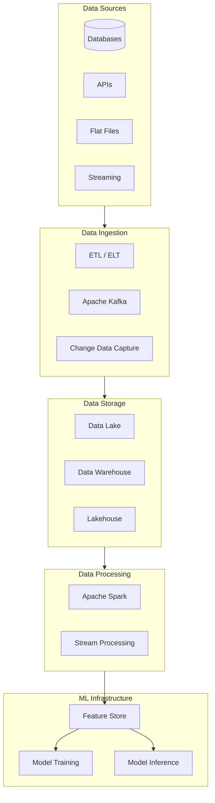

# 25 — Data Engineering for AI Engineers

## Module Overview

Data engineering is the foundation upon which all AI/ML systems are built. Without reliable pipelines, clean datasets, scalable storage, and efficient feature computation, even the most sophisticated models will fail in production. This module covers the complete data engineering stack that every AI engineer must master — from ETL pipelines and data warehouses to streaming systems, Apache Spark, and feature stores. You will learn to design, build, and maintain data infrastructure that powers machine learning at scale.

## Sub-Chapters

| # | Chapter | What You'll Learn | Why It Matters for AI |
|---|---------|-------------------|----------------------|
| 01 | [ETL & Data Pipelines](01-etl-pipelines.md) | ETL vs ELT, data extraction (APIs, databases, files), transformation (cleaning, validation, normalization), loading (batch, streaming), pipeline monitoring | Models are only as good as their training data. ETL pipelines determine data quality, freshness, and reliability — directly impacting model accuracy and trustworthiness |
| 02 | [Data Lakehouse & Warehouse](02-data-lakehouse-warehouse.md) | Data lake vs warehouse vs lakehouse, star schema, snowflake schema, fact/dimension tables, data cataloging, data versioning (Delta Lake, Iceberg), partitioning strategies | AI systems need both raw data (for exploration/training) and structured data (for features/analytics). Lakehouse architecture eliminates silos and enables ML on unified data |
| 03 | [Apache Spark Basics](03-apache-spark-basics.md) | Spark architecture (driver, executors, RDDs), DataFrames, transformations vs actions, Spark SQL, partitioning, optimization (caching, broadcasting), PySpark for ML pipelines | Training data for LLMs and deep learning models often exceeds single-machine memory. Spark provides distributed processing for terabyte-scale datasets that power modern AI |
| 04 | [Streaming & Real-Time Data](04-streaming-real-time.md) | Batch vs streaming, Kafka topics/partitions/consumers, stream processing (windowing, watermarks), exactly-once semantics, streaming feature computation, change data capture | Real-time AI (fraud detection, recommendations, monitoring) requires streaming infrastructure. Kafka and stream processing enable sub-second data freshness for ML models |
| 05 | [Feature Stores](05-feature-stores.md) | Feature store concepts, offline vs online features, Feast feature store, point-in-time joins, feature serving, feature validation, feature reusability across teams | Feature engineering is 80% of ML work. Feature stores prevent duplication, ensure training-serving consistency, and enable production feature pipelines that scale |

## Learning Path

1. **Foundation (Chapter 01–02)**: Start with ETL pipelines and data lakehouse architecture. These are the fundamental building blocks. Understand how data moves from source systems to storage, and how different storage architectures serve different ML needs.

2. **Scale (Chapter 03)**: Once you understand data fundamentals, learn Apache Spark for distributed processing. Most production AI systems process data at scales that require Spark or similar frameworks.

3. **Real-Time (Chapter 04)**: After mastering batch processing, learn streaming. Modern AI applications increasingly demand real-time data — from fraud detection to live recommendations.

4. **ML Integration (Chapter 05)**: Finally, understand feature stores — the bridge between data engineering and ML. This chapter shows how all previous concepts unify to serve ML models in production.

5. **Each chapter**: Read theory -> study the Mermaid diagrams -> run the Python code -> review interview questions -> attempt MCQs -> solve PYQs -> review common mistakes -> memorize revision notes.

## Prerequisites

- [Python Programming](../01-python-programming/index.md) — comfortable with Python, pandas, and basic data manipulation
- [SQL & Databases](../02-sql-and-databases/index.md) — understanding of SQL queries, joins, and relational database concepts
- [Machine Learning](../08-machine-learning/index.md) — familiarity with ML workflows, training data, and feature engineering

## Tools You Will Use

| Tool | Purpose | Chapter |
|------|---------|---------|
| pandas | Data transformation and cleaning | 01 |
| Apache Spark (PySpark) | Distributed data processing | 03 |
| Apache Kafka | Event streaming and message brokering | 04 |
| Feast | Feature store for ML | 05 |
| Delta Lake / Iceberg | Data lakehouse storage format | 02 |
| PostgreSQL / BigQuery | Data warehouse (examples) | 02 |

## Module Learning Objectives

| LO | Description |
|----|-------------|
| LO01 | Design and implement ETL/ELT pipelines for ML training data |
| LO02 | Choose appropriate storage architecture (lake, warehouse, lakehouse) for AI use cases |
| LO03 | Process large-scale datasets with Apache Spark and PySpark |
| LO04 | Build real-time streaming pipelines with Kafka for low-latency ML inference |
| LO05 | Implement and manage feature stores for consistent training and serving |

## How This Module Fits in the Curriculum

| Previous Module | This Module | Next Module |
|-----------------|-------------|-------------|
| [24 — Statistics & Mathematics](../24-statistics-mathematics/index.md) | 25 — Data Engineering | Capstone Projects |

## Key Concepts Map

## Industry Relevance

Data engineering roles are among the highest-demand positions in AI. Every major company — Google, Meta, Amazon, Microsoft, NVIDIA, OpenAI — needs data engineers to build and maintain the infrastructure that powers their ML systems. According to industry surveys, data engineering accounts for 60–80% of the effort in production ML systems. Mastering these concepts directly translates to interview success and on-the-job effectiveness.

## Time Commitment

| Chapter | Read | Code | Practice | Total |
|---------|------|------|----------|-------|
| 01 — ETL Pipelines | 25 min | 20 min | 15 min | 60 min |
| 02 — Lakehouse & Warehouse | 30 min | 15 min | 15 min | 60 min |
| 03 — Apache Spark | 35 min | 30 min | 15 min | 80 min |
| 04 — Streaming & Real-Time | 30 min | 25 min | 15 min | 70 min |
| 05 — Feature Stores | 25 min | 20 min | 15 min | 60 min |

## Additional Resources

- "Designing Data-Intensive Applications" by Martin Kleppmann
- "The Data Warehouse Toolkit" by Ralph Kimball
- "Streaming Systems" by Akidau, Chernyak, Lax
- Apache Spark official documentation
- Apache Kafka documentation
- Feast feature store documentation

> **Start**: [01 — ETL & Data Pipelines ->](01-etl-pipelines.md)
