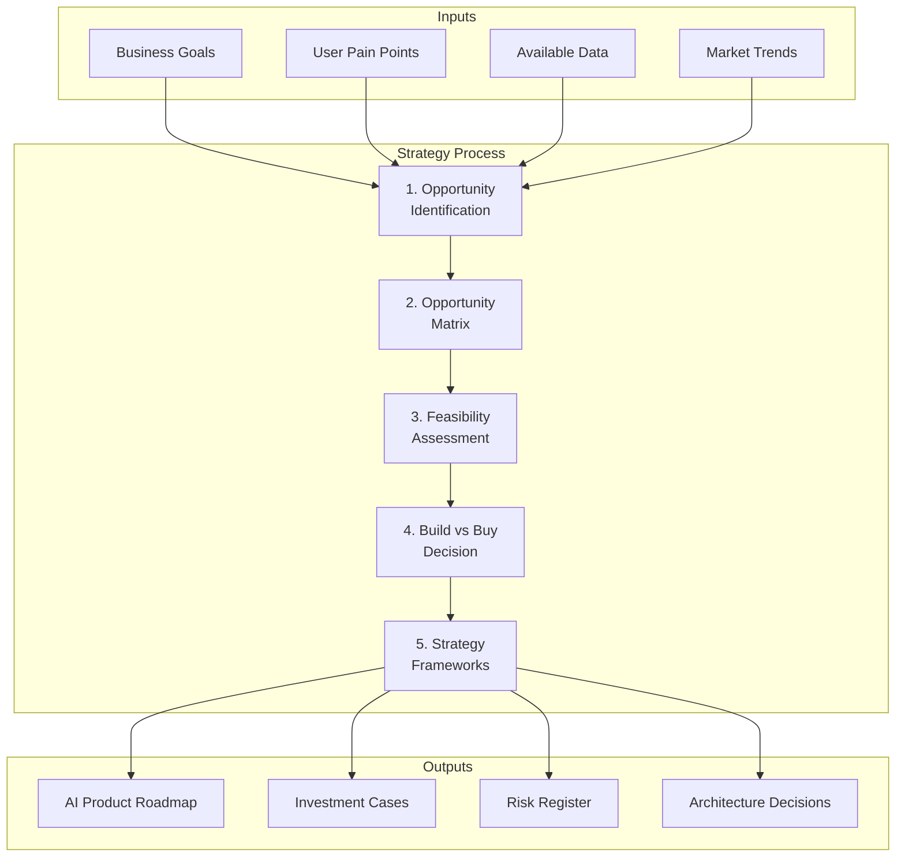
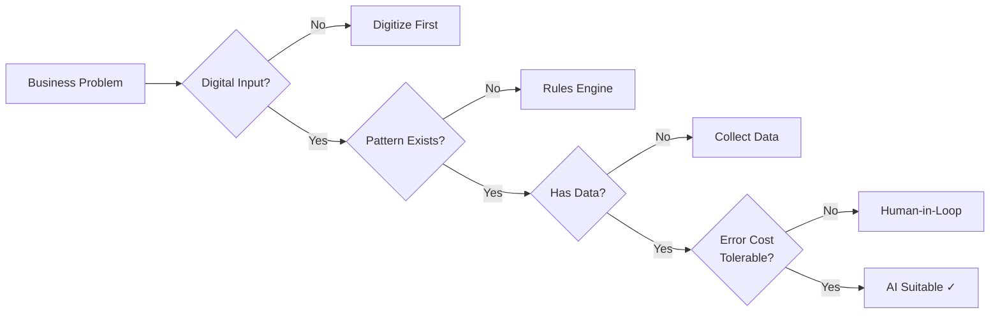
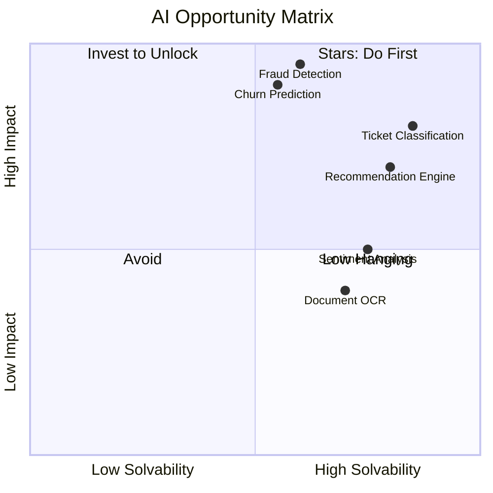
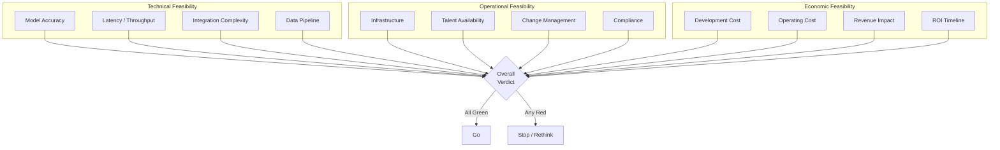

<!-- Clear Language: Keep sentences under 50 words -->
# 01 — AI Product Strategy

## Learning Objectives

| Objective | Description |
|-----------|-------------|
| Identify AI opportunities | Frame business problems and assess AI feasibility systematically |
| Apply opportunity matrices | Prioritize AI initiatives by impact and solvability |
| Conduct feasibility assessments | Evaluate technical, operational, and economic viability |
| Decide build vs buy vs partner | Choose the right sourcing strategy for each AI initiative |
| Use strategy frameworks | Apply AI Canvas, Maturity Model, and competitive moat analysis |

## Introduction

AI Product Strategy is the discipline of deciding which AI problems to solve, how to solve them, and in what order. It bridges the gap between business goals and machine learning execution.

A strong AI strategy prevents wasted engineering effort on technically infeasible or low-impact problems. Every AI engineer who understands strategy makes better technical decisions and earns more leadership trust.

## Prerequisites

- Basic understanding of machine learning concepts (supervised, unsupervised learning)
- Familiarity with software product development lifecycles
- Awareness of common AI/ML use cases (classification, recommendation, NLP, computer vision)
- No prior business or MBA background needed — all concepts explained from first principles

## Key Terminology

| Term | Definition |
|------|------------|
| Opportunity Sizing | Estimating the business value of solving a problem with AI |
| AI Feasibility | Whether a problem can be solved with current AI technology and data |
| Total Addressable Market (TAM) | Revenue opportunity if every potential customer uses the solution |
| Build vs Buy Decision | Choosing between in-house development and external procurement |
| AI Canvas | One-page framework to map AI product assumptions and risks |
| AI Maturity Model | Stages of AI adoption from experimenting to full transformation |
| Competitive Moat | Sustainable advantage that competitors cannot easily replicate |
| MVP (Minimum Viable Product) | Smallest working AI solution that delivers customer value |
| Data Moat | Proprietary data assets that improve model performance over time |
| Technical Debt | Future cost of shortcuts taken during AI system development |

## Chapter at a Glance

| Section | Topic | Key Concept |
|---------|-------|-------------|
| 1.1 | AI Opportunity Identification | Problem framing, AI feasibility, data check |
| 1.2 | AI Opportunity Matrix | Impact vs solvability prioritization |
| 1.3 | Feasibility Assessment | Technical, operational, economic dimensions |
| 1.4 | Build vs Buy vs Partner | SaaS, open-source, custom training trade-offs |
| 1.5 | AI Strategy Frameworks | AI Canvas, Maturity Model, competitive analysis |

## Chapter Roadmap



## 1.1 AI Opportunity Identification

AI opportunity identification is the process of finding business problems that are worth solving with AI. Most failures in AI products happen not because the model was bad, but because the problem was wrong.

### 1.1.1 Problem Framing

Before evaluating AI solutions, frame the problem in business terms. A well-framed problem statement answers four questions:

1. **Who** is affected by this problem?
2. **What** is the current workaround or manual process?
3. **Why** does solving this matter (revenue, cost, satisfaction)?
4. **How** would we measure success?

```python
from dataclasses import dataclass
from typing import List, Optional

@dataclass
class ProblemFrame:
    """Structure for framing an AI opportunity."""
    title: str
    stakeholder: str
    current_process: str
    pain_points: List[str]
    business_value: str
    success_metric: str
    target_value: float
    time_horizon_months: int

def frame_problem() -> ProblemFrame:
    """Interactive problem framing for AI opportunities."""
    print("=== AI Problem Framing ===\n")

    # In a real setting, these would come from stakeholder interviews
    example = ProblemFrame(
        title="Customer Support Ticket Triage",
        stakeholder="Support Team Lead",
        current_process="Agents manually read and categorize 5000 tickets/day",
        pain_points=[
            "Average handling time is 12 minutes per ticket",
            "High-priority tickets wait 45+ minutes",
            "Agent burnout due to repetitive categorization",
            "20% of tickets are misrouted to wrong teams",
        ],
        business_value="Reduce support costs by 30% and improve response SLA",
        success_metric="First-response time reduction",
        target_value=60.0,  # 60% reduction target
        time_horizon_months=6,
    )

    print(f"Problem: {example.title}")
    print(f"Stakeholder: {example.stakeholder}")
    print(f"Current Process: {example.current_process}")
    print(f"Pain Points: {len(example.pain_points)} identified")
    print(f"Business Value: {example.business_value}")
    print(f"Success Metric: {example.success_metric}")
    print(f"Target: {example.target_value}% improvement")
    print(f"Time Horizon: {example.time_horizon_months} months")

    return example

problem = frame_problem()
```

### 1.1.2 AI Feasibility Assessment

Not every problem needs AI. A problem is AI-solvable when:

- The input is digital (text, images, sensor data, logs)
- A clear pattern exists that humans can learn
- Sufficient labeled or unlabeled data is available
- The accuracy requirement is achievable (not 100% perfect)
- The decision has tolerable error cost (not life-critical without human review)

```python
from enum import Enum

class AISuitability(Enum):
    HIGH = "High — Strong AI fit"
    MEDIUM = "Medium — Possible with constraints"
    LOW = "Low — Better solved with rules or humans"
    NONE = "None — AI is not the answer"

def assess_ai_suitability(
    has_digital_input: bool,
    pattern_exists: bool,
    has_data: bool,
    accuracy_critical: bool,
    error_tolerable: bool,
    requires_explanation: bool,
) -> AISuitability:
    """Assess whether a problem is suitable for AI."""
    score = 0
    reasons = []

    if has_digital_input:
        score += 2
    else:
        reasons.append("Input is not digital — needs digitization first")

    if pattern_exists:
        score += 2
    else:
        reasons.append("No clear pattern — rule-based may work better")

    if has_data:
        score += 2
    else:
        reasons.append("No data available — need data collection first")

    if not accuracy_critical:
        score += 1
    else:
        reasons.append("High accuracy requirement — consider human-in-loop")

    if error_tolerable:
        score += 1
    else:
        reasons.append("Errors have high cost — use AI as augmentation only")

    if not requires_explanation:
        score += 1
    else:
        reasons.append("Explainability required — prefer interpretable models")

    print("=== AI Suitability Assessment ===\n")
    print(f"Score: {score}/9\n")

    if reasons:
        print("Constraints:")
        for r in reasons:
            print(f"  - {r}")
        print()

    if score >= 7:
        return AISuitability.HIGH
    elif score >= 5:
        return AISuitability.MEDIUM
    elif score >= 3:
        return AISuitability.LOW
    else:
        return AISuitability.NONE

# Example: Ticket classification
result = assess_ai_suitability(
    has_digital_input=True,     # Tickets are text
    pattern_exists=True,         # Categories follow patterns
    has_data=True,               # 100K historical tickets exist
    accuracy_critical=False,     # 85% accuracy is acceptable
    error_tolerable=True,        # Wrong category can be re-routed
    requires_explanation=False,  # Category label is enough
)
print(f"Verdict: {result.value}")
```



### 1.1.3 Data Availability Check

Data is the most common reason AI projects fail. Before proposing AI, audit data availability systematically.

```python
from typing import Dict, Any

class DataAvailabilityChecker:
    """Check if sufficient data exists for an AI project."""

    def __init__(self, problem_domain: str):
        self.problem_domain = problem_domain
        self.data_sources: Dict[str, Dict[str, Any]] = {}

    def add_data_source(
        self,
        name: str,
        record_count: int,
        has_labels: bool,
        freshness_days: float,
        quality_score: float,  # 0 to 1
    ) -> None:
        self.data_sources[name] = {
            "name": name,
            "record_count": record_count,
            "has_labels": has_labels,
            "freshness_days": freshness_days,
            "quality_score": quality_score,
        }

    def compute_readiness(self) -> Dict[str, Any]:
        """Compute overall data readiness score."""
        total_records = sum(
            ds["record_count"] for ds in self.data_sources.values()
        )
        labeled_records = sum(
            ds["record_count"]
            for ds in self.data_sources.values()
            if ds["has_labels"]
        )
        avg_quality = sum(
            ds["quality_score"] for ds in self.data_sources.values()
        ) / max(len(self.data_sources), 1)
        avg_freshness = sum(
            ds["freshness_days"] for ds in self.data_sources.values()
        ) / max(len(self.data_sources), 1)

        readiness = {
            "total_records": total_records,
            "labeled_records": labeled_records,
            "labeled_percentage": round(
                labeled_records / max(total_records, 1) * 100, 1
            ),
            "avg_quality": round(avg_quality, 2),
            "avg_freshness_days": round(avg_freshness, 1),
            "sources_count": len(self.data_sources),
        }

        # Compute readiness score
        score = 0.0
        if total_records >= 10000:
            score += 3
        elif total_records >= 1000:
            score += 1

        if readiness["labeled_percentage"] >= 80:
            score += 3
        elif readiness["labeled_percentage"] >= 50:
            score += 2
        elif readiness["labeled_percentage"] >= 10:
            score += 1

        score += avg_quality * 2  # 0 to 2

        if avg_freshness <= 30:
            score += 2
        elif avg_freshness <= 90:
            score += 1

        readiness["readiness_score"] = round(score, 1)
        readiness["max_score"] = 10.0

        if score >= 8:
            readiness["verdict"] = "Ready — proceed with modeling"
        elif score >= 5:
            readiness["verdict"] = "Conditional — needs more data or labeling"
        else:
            readiness["verdict"] = "Not ready — invest in data first"

        return readiness

    def print_report(self) -> None:
        readiness = self.compute_readiness()
        print(f"=== Data Readiness Report: {self.problem_domain} ===\n")
        print(f"Sources: {readiness['sources_count']}")
        print(f"Total Records: {readiness['total_records']:,}")
        print(f"Labeled Records: {readiness['labeled_records']:,}")
        print(f"Labeled: {readiness['labeled_percentage']}%")
        print(f"Avg Quality: {readiness['avg_quality']}/1.0")
        print(f"Avg Freshness: {readiness['avg_freshness_days']} days")
        print(f"\nReadiness Score: {readiness['readiness_score']}/{readiness['max_score']}")
        print(f"Verdict: {readiness['verdict']}")

# Example: Ticket triage data audit
checker = DataAvailabilityChecker("Ticket Triage")
checker.add_data_source("Historical Tickets DB", 95000, True, 0.5, 0.85)
checker.add_data_source("Support Agent Logs", 50000, True, 1.0, 0.70)
checker.add_data_source("Unlabelled Chat Logs", 200000, False, 0.1, 0.60)
checker.add_data_source("Customer Feedback", 15000, True, 2.0, 0.90)
checker.print_report()
```

### 1.1.4 Build vs Buy Decision Framework

Every AI initiative faces a build vs buy decision. The framework here helps evaluate the trade-offs before committing resources.

```python
@dataclass
class BuildVsBuyEvaluation:
    """Evaluate whether to build AI in-house or buy externally."""
    criteria_weights: Dict[str, float]

    def evaluate_option(
        self, name: str, scores: Dict[str, float], costs: Dict[str, float]
    ) -> Dict[str, Any]:
        """Score a sourcing option on multiple criteria."""
        total_score = 0.0
        breakdown = {}

        for criterion, weight in self.criteria_weights.items():
            score = scores.get(criterion, 0)
            weighted = score * weight
            breakdown[criterion] = {
                "score": score,
                "weight": weight,
                "weighted": round(weighted, 2),
            }
            total_score += weighted

        total_cost = sum(costs.values())
        cost_per_score = round(total_cost / max(total_score, 0.01), 2)

        return {
            "name": name,
            "total_score": round(total_score, 2),
            "max_score": round(sum(self.criteria_weights.values()), 2),
            "total_cost_monthly": total_cost,
            "cost_per_score": cost_per_score,
            "breakdown": breakdown,
        }

def run_build_vs_buy_analysis() -> None:
    """Compare build vs buy for a customer support AI project."""
    framework = BuildVsBuyEvaluation(
        criteria_weights={
            "time_to_market": 0.20,
            "customization": 0.20,
            "data_privacy": 0.20,
            "maintenance_effort": 0.15,
            "scalability": 0.15,
            "moat_potential": 0.10,
        }
    )

    # Buy: SaaS API (OpenAI GPT + Zendesk)
    buy_scores = {
        "time_to_market": 9,     # Weeks, not months
        "customization": 3,      # Limited to prompt engineering
        "data_privacy": 4,       # Data sent to third-party
        "maintenance_effort": 8, # Vendor manages infrastructure
        "scalability": 7,        # Scales with API limits
        "moat_potential": 2,     # Competitors can buy same API
    }
    buy_costs = {
        "api_calls": 5000,
        "integration": 15000,
        "monthly_subscription": 3000,
    }

    # Build: In-house fine-tuned model
    build_scores = {
        "time_to_market": 3,     # 4-6 months for custom model
        "customization": 9,      # Full control over model behavior
        "data_privacy": 9,       # Data stays in-house
        "maintenance_effort": 4, # Dedicated MLOps team needed
        "scalability": 8,        # Full control over infra
        "moat_potential": 7,     # Proprietary model advantage
    }
    build_costs = {
        "infrastructure": 8000,
        "ml_engineers": 35000,
        "labeling": 5000,
        "monitoring": 2000,
    }

    # Partner: Custom model with AI consultancy
    partner_scores = {
        "time_to_market": 5,     # 3 months with partner
        "customization": 7,      # Customizable within scope
        "data_privacy": 6,       # Shared with partner
        "maintenance_effort": 5, # Partner handles some ops
        "scalability": 7,        # Shared infra
        "moat_potential": 5,     # Some IP shared
    }
    partner_costs = {
        "consulting_fees": 20000,
        "infrastructure": 6000,
        "licensing": 4000,
    }

    results = [
        framework.evaluate_option("Buy (SaaS API)", buy_scores, buy_costs),
        framework.evaluate_option("Build (In-house)", build_scores, build_costs),
        framework.evaluate_option("Partner (Consultancy)", partner_scores, partner_costs),
    ]

    print("=== Build vs Buy Analysis: AI Ticket Triage ===\n")
    results.sort(key=lambda r: r["total_score"], reverse=True)
    for r in results:
        print(f"Option: {r['name']}")
        print(f"  Score: {r['total_score']}/{r['max_score']}")
        print(f"  Cost: ${r['total_cost_monthly']:,}/month")
        print(f"  Cost/Score: ${r['cost_per_score']}")
        print()

    print("Recommendation: "
          + f"Start with Buy (SaaS) for speed, transition to Build if ML moat validates.")

run_build_vs_buy_analysis()
```

## 1.2 AI Opportunity Matrix

The AI Opportunity Matrix helps prioritize opportunities by two dimensions: business impact and AI solvability.

### 1.2.1 The Matrix Framework

```python
from typing import List, Tuple

class AIOpportunityMatrix:
    """Prioritize AI initiatives on impact vs solvability."""

    def __init__(self):
        self.initiatives: List[Dict[str, any]] = []

    def add_initiative(
        self,
        name: str,
        business_impact: float,  # 1-10
        ai_solvability: float,   # 1-10
        effort_months: float,
        team_size: int,
    ) -> None:
        priority_score = (business_impact * ai_solvability) / (effort_months * team_size)
        self.initiatives.append({
            "name": name,
            "business_impact": business_impact,
            "ai_solvability": ai_solvability,
            "effort_months": effort_months,
            "team_size": team_size,
            "priority_score": round(priority_score, 2),
        })

    def classify_quadrant(
        self, impact: float, solvability: float
    ) -> str:
        if impact >= 6 and solvability >= 6:
            return "Star — Do first"
        elif impact >= 6 and solvability < 6:
            return "Invest to Unlock — Build data capability"
        elif impact < 6 and solvability >= 6:
            return "Low Hanging — Do if capacity allows"
        else:
            return "Avoid — Not worth the effort"

    def get_priority_ranking(self) -> List[Dict[str, any]]:
        return sorted(
            self.initiatives,
            key=lambda x: x["priority_score"],
            reverse=True,
        )

    def print_matrix(self) -> None:
        print("=== AI Opportunity Matrix ===\n")
        print(f"{'Initiative':<30} {'Impact':<8} {'Solvable':<10} "
              f"{'Effort':<8} {'Priority':<10} {'Quadrant'}")
        print("-" * 100)

        for item in self.get_priority_ranking():
            quadrant = self.classify_quadrant(
                item["business_impact"], item["ai_solvability"]
            )
            print(
                f"{item['name']:<30} "
                f"{item['business_impact']:<8} "
                f"{item['ai_solvability']:<10} "
                f"{item['effort_months']}mo x{item['team_size']:<3} "
                f"{item['priority_score']:<10} "
                f"{quadrant}"
            )

# Example
matrix = AIOpportunityMatrix()
matrix.add_initiative("Ticket Classification", 8, 9, 3, 2)
matrix.add_initiative("Sentiment Analysis", 5, 8, 2, 1)
matrix.add_initiative("Churn Prediction", 9, 5, 6, 4)
matrix.add_initiative("Document OCR", 4, 7, 4, 2)
matrix.add_initiative("Fraud Detection", 10, 6, 8, 5)
matrix.add_initiative("Recommendation Engine", 7, 7, 5, 3)
matrix.print_matrix()
```



### 1.2.2 Prioritization Frameworks

Beyond the matrix, three proven prioritization frameworks apply to AI products:

**RICE Framework (Reach, Impact, Confidence, Effort)**

```python
@dataclass
class RICEScore:
    reach: int       # Users affected per quarter
    impact: float    # 0.25 (minimal) to 3 (massive)
    confidence: float  # 0% (no data) to 100% (proven)
    effort: int       # Person-months

    def score(self) -> float:
        return (self.reach * self.impact * self.confidence) / self.effort

# Example: Three AI initiatives scored with RICE
initiatives = {
    "AI Ticket Routing": RICEScore(
        reach=50000, impact=2.0, confidence=0.8, effort=4
    ),
    "Auto-Reply Suggestions": RICEScore(
        reach=30000, impact=1.5, confidence=0.6, effort=6
    ),
    "Agent Performance Analytics": RICEScore(
        reach=200, impact=1.0, confidence=0.9, effort=2
    ),
}

print("=== RICE Prioritization ===\n")
for name, rice in sorted(
    initiatives.items(), key=lambda x: x[1].score(), reverse=True
):
    rice_score = rice.score()
    print(f"{name:<30} RICE Score: {rice_score:>8.0f}  "
          f"(Reach: {rice.reach:>5}, Impact: {rice.impact}, "
          f"Confidence: {rice.confidence:.0%}, Effort: {rice.effort}mo)")
```

**Weighted Scoring Model**

```python
@dataclass
class WeightedCriteria:
    name: str
    weight: float  # 0 to 1

def weighted_prioritization() -> None:
    criteria = [
        WeightedCriteria("User demand", 0.20),
        WeightedCriteria("Revenue impact", 0.25),
        WeightedCriteria("Technical feasibility", 0.15),
        WeightedCriteria("Strategic alignment", 0.20),
        WeightedCriteria("Data availability", 0.10),
        WeightedCriteria("Time to value", 0.10),
    ]

    # Score each initiative on criteria (1-10)
    initiatives_scores = {
        "AI Ticket Routing": [8, 7, 9, 8, 9, 8],
        "Auto-Reply Suggestions": [7, 6, 6, 6, 5, 5],
        "Agent Performance Analytics": [4, 5, 9, 3, 8, 9],
    }

    print("=== Weighted Scoring Prioritization ===\n")
    print(f"{'Initiative':<30} {'Weighted Score':<16} {'Rank'}")
    print("-" * 55)

    scored = []
    for name, scores in initiatives_scores.items():
        total = sum(s * c.weight for s, c in zip(scores, criteria))
        scored.append((name, round(total, 2)))

    for rank, (name, score) in enumerate(
        sorted(scored, key=lambda x: x[1], reverse=True), 1
    ):
        print(f"{name:<30} {score:<16} #{rank}")

weighted_prioritization()
```

## 1.3 Feasibility Assessment

Feasibility assessment evaluates whether an AI project can succeed across three dimensions: technical, operational, and economic.

### 1.3.1 Technical Feasibility

Technical feasibility examines model accuracy, latency, throughput, and integration complexity.

```python
from typing import Optional

@dataclass
class TechnicalFeasibility:
    """Evaluate technical viability of an AI solution."""

    def evaluate_model_feasibility(
        self,
        required_accuracy: float,
        expected_accuracy: float,
        latency_sla_ms: int,
        expected_latency_ms: int,
        throughput_rps: int,        # requests per second
        data_volume_gb: float,
        integration_complexity: int,  # 1-10
    ) -> Dict[str, Any]:
        """Score technical feasibility of the AI component."""
        issues = []
        warnings = []

        # Accuracy check
        accuracy_gap = required_accuracy - expected_accuracy
        if accuracy_gap > 0:
            issues.append(
                f"Accuracy gap: need {required_accuracy:.1%}, "
                f"get {expected_accuracy:.1%} (gap: {accuracy_gap:.1%})"
            )
        else:
            warnings.append(
                f"Accuracy meets requirement "
                f"(expected {expected_accuracy:.1%} >= {required_accuracy:.1%})"
            )

        # Latency check
        if expected_latency_ms > latency_sla_ms:
            latency_ratio = expected_latency_ms / latency_sla_ms
            issues.append(
                f"Latency {latency_ratio:.1f}x over SLA: "
                f"{expected_latency_ms}ms vs {latency_sla_ms}ms"
            )
        else:
            warnings.append(
                f"Latency within SLA "
                f"({expected_latency_ms}ms <= {latency_sla_ms}ms)"
            )

        # Throughput check
        # Simple estimate: need throughput for peak load
        peak_rps = int(throughput_rps * 2.5)  # 2.5x for peak
        if expected_latency_ms > 100 and peak_rps > 100:
            warnings.append(
                f"High throughput ({peak_rps} rps peak) "
                f"may need auto-scaling and model optimization"
            )

        # Data volume
        if data_volume_gb > 100:
            warnings.append(
                f"Large data volume ({data_volume_gb}GB) "
                f"requires distributed processing"
            )

        # Integration complexity
        if integration_complexity >= 8:
            issues.append(f"High integration complexity ({integration_complexity}/10)")

        # Score
        score = 10 - (len(issues) * 3) - (len(warnings) * 1)
        score = max(1, min(10, score))

        return {
            "score": score,
            "issues": issues,
            "warnings": warnings,
            "feasible": len(issues) == 0,
        }

tech = TechnicalFeasibility()
result = tech.evaluate_model_feasibility(
    required_accuracy=0.90,
    expected_accuracy=0.87,
    latency_sla_ms=500,
    expected_latency_ms=350,
    throughput_rps=50,
    data_volume_gb=20,
    integration_complexity=5,
)

print("=== Technical Feasibility Assessment ===\n")
print(f"Score: {result['score']}/10")
print(f"Feasible: {'Yes' if result['feasible'] else 'No — issues to resolve'}")
print()
if result['issues']:
    print("Issues (blocking):")
    for i in result['issues']:
        print(f"  ❌ {i}")
if result['warnings']:
    print("\nWarnings (non-blocking):")
    for w in result['warnings']:
        print(f"  ⚠️ {w}")
```



### 1.3.2 Operational Feasibility

Operational feasibility checks whether the organization can support an AI system in production.

```python
@dataclass
class OperationalFeasibility:
    """Evaluate whether the organization can operate the AI system."""

    def evaluate(
        self,
        has_ml_infra: bool,
        has_mle_team: bool,
        has_data_pipeline: bool,
        sop_ready: bool,
        stakeholder_buyin: float,  # 1-10
        compliance_effort: int,    # 1-10
        monitoring_capable: bool,
    ) -> Dict[str, Any]:
        score = 0
        max_score = 8
        gaps = []

        if has_ml_infra:
            score += 1
        else:
            gaps.append("No ML infrastructure (GPU, model serving, feature store)")

        if has_mle_team:
            score += 2
        else:
            gaps.append("No dedicated ML engineering team")

        if has_data_pipeline:
            score += 1
        else:
            gaps.append("No production data pipeline (manual data processing)")

        if sop_ready:
            score += 1
        else:
            gaps.append("No SOPs for retraining, deployment, rollback")

        if stakeholder_buyin >= 7:
            score += 1
        else:
            gaps.append(f"Low stakeholder buy-in ({stakeholder_buyin}/10)")

        if compliance_effort <= 5:
            score += 1
        else:
            gaps.append(f"High compliance effort ({compliance_effort}/10)")

        if monitoring_capable:
            score += 1
        else:
            gaps.append("No monitoring for drift, accuracy, or data quality")

        return {
            "score": score,
            "max_score": max_score,
            "readiness_pct": round(score / max_score * 100, 1),
            "gaps": gaps,
            "gaps_count": len(gaps),
        }

def run_operational_check() -> None:
    ops = OperationalFeasibility()
    result = ops.evaluate(
        has_ml_infra=True,
        has_mle_team=False,   # Need to hire
        has_data_pipeline=True,
        sop_ready=False,      # First AI product
        stakeholder_buyin=8,
        compliance_effort=3,
        monitoring_capable=False,
    )

    print("=== Operational Feasibility ===\n")
    print(f"Readiness: {result['readiness_pct']}%")
    print(f"Score: {result['score']}/{result['max_score']}")

    if result['gaps']:
        print(f"\nGaps to close ({result['gaps_count']}):")
        for g in result['gaps']:
            print(f"  - {g}")

    if result['readiness_pct'] >= 75:
        print("\nVerdict: Ready to proceed")
    elif result['readiness_pct'] >= 50:
        print("\nVerdict: Proceed with risk mitigation plan")
    else:
        print("\nVerdict: Invest in operational capability first")

run_operational_check()
```

### 1.3.3 Economic Feasibility (ROI)

Every AI investment must justify its cost. Calculate ROI by comparing cost savings or new revenue against total cost of ownership.

```python
@dataclass
class EconomicFeasibility:
    """Calculate ROI for an AI initiative."""

    def calculate_roi(
        self,
        development_months: int,
        team_size: int,
        avg_salary_monthly: float,
        infra_cost_monthly: float,
        data_cost_monthly: float,
        expected_revenue_annual: float,
        cost_savings_annual: float,
        discount_rate: float = 0.10,
    ) -> Dict[str, float]:
        # Development cost
        dev_cost = (development_months * team_size * avg_salary_monthly
                    + development_months * infra_cost_monthly)

        # Annual operating cost
        annual_op_cost = (infra_cost_monthly + data_cost_monthly) * 12

        # Annual benefit
        annual_benefit = expected_revenue_annual + cost_savings_annual

        # Simple payback period (months)
        monthly_benefit = annual_benefit / 12
        monthly_op_cost = infra_cost_monthly + data_cost_monthly
        net_monthly = monthly_benefit - monthly_op_cost
        payback_months = round(dev_cost / max(net_monthly, 1), 1)

        # 3-year NPV (Net Present Value)
        total_benefit_3y = 0
        for year in range(1, 4):
            discounted = annual_benefit / ((1 + discount_rate) ** year)
            total_benefit_3y += discounted

        total_cost_3y = dev_cost + sum(
            annual_op_cost / ((1 + discount_rate) ** year)
            for year in range(1, 4)
        )
        npv = round(total_benefit_3y - total_cost_3y, 2)

        # ROI
        total_dev = dev_cost
        total_op_3y = annual_op_cost * 3
        total_investment = total_dev + total_op_3y
        roi = round((annual_benefit * 3 - total_investment) / total_investment * 100, 1)

        return {
            "development_cost": round(dev_cost, 2),
            "annual_op_cost": round(annual_op_cost, 2),
            "annual_benefit": round(annual_benefit, 2),
            "payback_months": payback_months,
            "npv_3year": npv,
            "roi_3year_pct": roi,
            "profitable": npv > 0,
        }

def run_economics() -> None:
    econ = EconomicFeasibility()

    # AI ticket triage: 4 engineers x 6 months
    result = econ.calculate_roi(
        development_months=6,
        team_size=4,
        avg_salary_monthly=12000,  # Fully-loaded cost
        infra_cost_monthly=3000,
        data_cost_monthly=1000,
        expected_revenue_annual=0,      # No direct revenue
        cost_savings_annual=480000,     # 4 FTEs worth of support time saved
    )

    print("=== Economic Feasibility (ROI) ===\n")
    print(f"Development Cost: ${result['development_cost']:,.0f}")
    print(f"Annual Operating Cost: ${result['annual_op_cost']:,.0f}")
    print(f"Annual Benefit: ${result['annual_benefit']:,.0f}")
    print(f"Payback Period: {result['payback_months']} months")
    print(f"3-Year NPV: ${result['npv_3year']:,.0f}")
    print(f"3-Year ROI: {result['roi_3year_pct']}%")
    print(f"Profitable: {'Yes' if result['profitable'] else 'No'}")

    if result['profitable']:
        print("\n✅ Economically feasible — expected to generate positive returns.")
    else:
        print("\n❌ Not economically feasible at current estimates. "
              "Re-evaluate scope or cost structure.")

run_economics()
```

## 1.4 Build vs Buy vs Partner

Choosing how to source AI capability is a critical strategic decision. The wrong choice wastes millions.

### 1.4.1 The Three Sourcing Options

```mermaid
flowchart TB
    subgraph Options[Sourcing Options for AI]
        A[Buy: SaaS API]
        B[Build: Custom Model]
        C[Partner: Consultancy]
    end
    subgraph BuyDetails[Buy - SaaS API]
        A1[OpenAI GPT-4o, Claude, Gemini]
        A2[Pre-built APIs: vision, speech, translation]
        A3[AI SaaS: Zendesk AI, Salesforce Einstein]
    end
    subgraph BuildDetails[Build - Custom]
        B1[Fine-tune open-source LLM]
        B2[Train from scratch (rare)]
        B3[Custom RAG pipeline]
    end
    subgraph PartnerDetails[Partner]
        C1[AI consultancy firms]
        C2[Managed ML service providers]
        C3[Joint development with academia]
    end
    A --> BuyDetails
    A --> BuildDetails
    A --> PartnerDetails
```

**When to Buy (SaaS API)**

| When | Example |
|------|---------|
| Problem is generic (translation, summarization) | OpenAI GPT-4o API for content generation |
| Speed to market is critical | MVP must ship in 2 weeks |
| You lack ML talent | Small startup with no ML engineers |
| Core business is not AI | Traditional retail adding chatbot |
| Competitive moat is elsewhere | Your brand or distribution is the moat |

**When to Build (Custom)**  

| When | Example |
|------|---------|
| Problem is unique to your data | Proprietary document classification |
| Data privacy is critical | Healthcare patient record analysis |
| Edge case handling is important | Fraud detection on specific patterns |
| Latency requirements are extreme | Real-time stock market prediction |
| Long-term cost advantage | High-volume inference at scale |

**When to Partner**

| When | Example |
|------|---------|
| First AI project with no in-house expertise | Retail chain partnering with ML consultancy |
| Need custom model but not core competency | Legal AI with legal + AI expert partnership |
| Accelerate hiring by team augmentation | Bank hiring AI consultancy to build prototype + train team |

### 1.4.2 Decision Tree

```python
def build_vs_buy_decision_tree() -> str:
    """Interactive decision tree for AI sourcing."""
    print("=== AI Sourcing Decision Tree ===\n")
    print("Answer the following questions:\n")

    # Simulated answers (in real use, get user input)
    answers = {
        "generic_problem": False,
        "speed_critical": True,
        "ml_talent_available": False,
        "data_sensitive": True,
        "high_volume_inference": False,
        "core_business_is_ai": False,
        "unique_data_advantage": True,
        "regulatory_constraints": True,
        "budget_for_custom": False,
    }

    for q, a in answers.items():
        print(f"  {q.replace('_', ' ').title()}: {'Yes' if a else 'No'}")

    print("\n--- Analysis ---\n")

    if answers["generic_problem"] and answers["speed_critical"]:
        verdict = "BUY — Generic problem needing speed. Use SaaS API."
    elif answers["data_sensitive"] and answers["unique_data_advantage"]:
        if answers["ml_talent_available"]:
            verdict = "BUILD — Data moat is your competitive advantage."
        else:
            verdict = "PARTNER — Data advantage justifies custom, but hire help."
    elif answers["regulatory_constraints"]:
        if answers["ml_talent_available"]:
            verdict = "BUILD — Regulatory requirements demand control."
        else:
            verdict = "PARTNER — Compliance-critical, need expert guidance."
    elif answers["core_business_is_ai"]:
        verdict = "BUILD — AI is your product. Own the stack."
    elif answers["budget_for_custom"] and not answers["speed_critical"]:
        verdict = "BUILD or PARTNER — Invest in custom if moat is strong."
    else:
        verdict = "BUY — Default to SaaS API for speed and low commitment."

    print(f"Verdict: {verdict}")
    return verdict

decision = build_vs_buy_decision_tree()
```

### 1.4.3 Cost Comparison Model

```python
def compare_sourcing_costs() -> None:
    """Compare 3-year TCO for build vs buy vs partner."""
    print("=== 3-Year Total Cost of Ownership (TCO) Comparison ===\n")

    scenarios = {
        "Buy (SaaS API)": {
            "year1": 5000 * 12,    # API calls
            "year2": 6000 * 12,    # Growing usage
            "year3": 8000 * 12,    # Scale
            "integration": 30000,  # One-time
            "risk": "API price increase, vendor lock-in",
        },
        "Build (Custom Model)": {
            "year1": 35000 * 12,  # 3 ML engineers + infra
            "year2": 25000 * 12,  # Reduced team post-launch
            "year3": 25000 * 12,
            "integration": 15000,  # One-time
            "risk": "Talent retention, technical debt",
        },
        "Partner (Consultancy)": {
            "year1": 30000 * 12,  # Managed service fee
            "year2": 20000 * 12,  # Reduced after transition
            "year3": 15000 * 12,  # Internal team takes over
            "integration": 50000,  # Higher due to knowledge transfer
            "risk": "Vendor dependency, IP ownership",
        },
    }

    for scenario, costs in scenarios.items():
        year1_total = costs["year1"] + costs["integration"] / 3
        year2_total = costs["year2"] + costs["integration"] / 3
        year3_total = costs["year3"] + costs["integration"] / 3
        three_year_total = costs["year1"] + costs["year2"] + costs["year3"] + costs["integration"]

        print(f"--- {scenario} ---")
        print(f"  Year 1: ${year1_total:>8,.0f}")
        print(f"  Year 2: ${year2_total:>8,.0f}")
        print(f"  Year 3: ${year3_total:>8,.0f}")
        print(f"  3-Year TCO: ${three_year_total:>8,.0f}")
        print(f"  Risk: {costs['risk']}")
        print()

compare_sourcing_costs()
```

## 1.5 AI Strategy Frameworks

Strategy frameworks provide structured ways to think about AI products beyond the technical implementation.

### 1.5.1 The AI Canvas

The AI Canvas is a one-page strategic framework adapted from the Business Model Canvas. It maps the key assumptions of an AI product.

```python
@dataclass
class AICanvas:
    """One-page AI product strategy canvas."""
    value_proposition: str
    prediction_task: str
    decision_frequency: str  # real-time, daily, weekly
    input_data: str
    supervision_type: str  # supervised, unsupervised, RL
    output_action: str
    success_metric: str
    human_escalation: str
    data_advantage: str
    failure_mode: str
    retraining_cadence: str

    def print_canvas(self) -> None:
        print("=" * 60)
        print("              AI PRODUCT CANVAS")
        print("=" * 60)
        print()

        sections = [
            ("1. Value Proposition", self.value_proposition),
            ("2. AI Prediction Task", self.prediction_task),
            ("3. Decision Frequency", self.decision_frequency),
            ("4. Input Data Required", self.input_data),
            ("5. Supervision Type", self.supervision_type),
            ("6. Output / Action", self.output_action),
            ("7. Success Metric", self.success_metric),
            ("8. Human Escalation Path", self.human_escalation),
            ("9. Data Advantage / Moat", self.data_advantage),
            ("10. Failure Mode & Mitigation", self.failure_mode),
            ("11. Retraining Cadence", self.retraining_cadence),
        ]

        for num, (label, content) in enumerate(sections, 1):
            print(f"{label}")
            print(f"   {content}")
            print()

# Example: AI Customer Support Canvas
canvas = AICanvas(
    value_proposition="Resolve 40% of tickets instantly without human agent",
    prediction_task="Classify ticket category and predict best response from knowledge base",
    decision_frequency="Real-time per incoming ticket",
    input_data="Ticket title, description, customer tier, product category, history",
    supervision_type="Supervised — historical tickets with agent responses as labels",
    output_action="Auto-reply with resolution when confidence > 0.9; route to agent otherwise",
    success_metric="First-contact resolution rate, average handling time reduction",
    human_escalation="Confidence < 0.9, sentiment flagged angry, or policy-sensitive topics",
    data_advantage="5 years of proprietary support tickets with resolution outcomes",
    failure_mode="Wrong auto-reply frustrates customer; mitigation: confidence threshold + apology fallback",
    retraining_cadence="Weekly retraining with new tickets, quarterly full evaluation",
)

canvas.print_canvas()
```

### 1.5.2 AI Maturity Model

The AI Maturity Model helps organizations assess their current AI capability and plan progression.

```mermaid
flowchart LR
    subgraph L1[Level 1: Experimenting]
        A1[Individual pilots]
        A2[No strategy]
        A3[Shadow AI]
    end
    subgraph L2[Level 2: Foundational]
        B1[Dedicated team]
        B2[First production AI]
        B3[Basic MLOps]
    end
    subgraph L3[Level 3: Operational]
        C1[Multiple AI products]
        C2[Centralized ML platform]
        C3[Monitoring & retraining]
    end
    subgraph L4[Level 4: Strategic]
        D1[AI is core differentiator]
        D2[Data moat]
        D3[AI-led innovation]
    end
    subgraph L5[Level 5: Transformational]
        E1[AI-first culture]
        E2[Automated MLOps]
        E3[Industry leader]
    end
    L1 --> L2 --> L3 --> L4 --> L5
```



```python
from typing import List

class AIMaturityAssessor:
    """Assess AI maturity of an organization."""

    levels = {
        1: "Experimenting — Ad-hoc AI pilots, no strategy",
        2: "Foundational — Dedicated team, first production AI",
        3: "Operational — Multiple AI products, central ML platform",
        4: "Strategic — AI is core differentiator, data moat",
        5: "Transformational — AI-first culture, industry leader",
    }

    def assess(self, capabilities: List[str]) -> Dict[str, Any]:
        level_checks = {
            1: [
                "has_pilots",
                "experimenting_with_llms",
            ],
            2: [
                "dedicated_ml_team",
                "production_model",
                "basic_pipeline",
            ],
            3: [
                "multiple_models",
                "ml_platform",
                "monitoring",
                "retraining_process",
            ],
            4: [
                "ai_core_differentiator",
                "data_moat",
                "ai_driven_roadmap",
            ],
            5: [
                "ai_first_culture",
                "automated_mlops",
                "industry_recognition",
            ],
        }

        current_level = 1
        details = []

        for level, checks in sorted(level_checks.items()):
            met = [c for c in checks if c in capabilities]
            missing = [c for c in checks if c not in capabilities]
            pct = len(met) / len(checks) * 100

            if pct >= 66:
                current_level = level
                details.append(f"Level {level} ({self.levels[level]}): ✓ {len(met)}/{len(checks)}")
            else:
                details.append(f"Level {level}: {len(met)}/{len(checks)} — missing: {', '.join(missing)}")
                break

        return {
            "current_level": current_level,
            "current_description": self.levels[current_level],
            "next_level": self.levels.get(current_level + 1, "Top of maturity"),
            "details": details,
        }

def assess_company_maturity() -> None:
    assessor = AIMaturityAssessor()

    # Example: A startup with ML team and production model
    company_capabilities = [
        "has_pilots",
        "experimenting_with_llms",
        "dedicated_ml_team",
        "production_model",
        "basic_pipeline",
        "multiple_models",
    ]

    result = assessor.assess(company_capabilities)

    print("=== AI Maturity Assessment ===\n")
    print(f"Current Level: {result['current_level']}")
    print(f"Description: {result['current_description']}")
    print(f"Next Level: {result['next_level']}")
    print("\nAssessment Breakdown:")
    for d in result['details']:
        print(f"  {d}")

assess_company_maturity()
```

### 1.5.3 Opportunity Sizing

Opportunity sizing estimates the potential value of an AI product to justify investment.

```python
@dataclass
class OpportunitySize:
    """Estimate the business opportunity for an AI product."""

    def t_shift(self, units_hours: float, fully_loaded_rate: float) -> float:
        """Calculate cost savings from time shift (hours saved * hourly rate)."""
        return units_hours * fully_loaded_rate

    def revenue_uplift(
        self,
        current_revenue: float,
        uplift_pct: float,
    ) -> float:
        """Estimate revenue from AI-driven improvement."""
        return current_revenue * (uplift_pct / 100)

    def cost_avoidance(self, current_cost: float, reduction_pct: float) -> float:
        """Estimate cost savings from automation."""
        return current_cost * (reduction_pct / 100)

class AIOpportunitySizer:
    """Full opportunity sizing for AI initiatives."""

    def __init__(self, initiative_name: str, tam: float, sam: float, som: float):
        self.name = initiative_name
        self.TAM = tam     # Total Addressable Market
        self.SAM = sam     # Serviceable Addressable Market
        self.SOM = som     # Serviceable Obtainable Market

    def calculate(self) -> Dict[str, float]:
        capture_rate = self.SOM / self.SAM if self.SAM > 0 else 0
        market_share = self.SAM / self.TAM if self.TAM > 0 else 0

        return {
            "TAM": self.TAM,
            "SAM": self.SAM,
            "SOM": self.SOM,
            "market_share_pct": round(market_share * 100, 1),
            "capture_rate_pct": round(capture_rate * 100, 1),
            "opportunity_gap_tam_sam": self.TAM - self.SAM,
            "opportunity_gap_sam_som": self.SAM - self.SOM,
        }

def size_ai_opportunity() -> None:
    """Example: AI customer support platform sizing."""
    print("=== AI Opportunity Sizing ===\n")

    # AI-powered customer support platform
    sizer = AIOpportunitySizer(
        initiative_name="AI Customer Support Platform",
        tam=5000000000,     # $5B: Global customer support AI market
        sam=1200000000,     # $1.2B: Mid-market companies we can serve
        som=50000000,       # $50M: Realistic 3-year revenue target
    )

    result = sizer.calculate()

    print(f"Initiative: {sizer.name}")
    print(f"  TAM (Total Addressable Market):  ${result['TAM']:>12,.0f}")
    print(f"  SAM (Serviceable Addressable):   ${result['SAM']:>12,.0f}")
    print(f"  SOM (Serviceable Obtainable):    ${result['SOM']:>12,.0f}")
    print(f"  Market Share (SAM/TAM):          {result['market_share_pct']:>10}%")
    print(f"  Capture Rate (SOM/SAM):          {result['capture_rate_pct']:>10}%")
    print(f"  Opportunity Gap (TAM - SAM):     ${result['opportunity_gap_tam_sam']:>12,.0f}")
    print()
    print("Sizing Narrative:")
    print(f"  The global AI customer support market is ${result['TAM']/1e9:.1f}B.")
    print(f"  We target mid-market companies (${result['SAM']/1e9:.1f}B).")
    print(f"  Realistic 3-year capture: ${result['SOM']/1e6:.0f}M revenue.")
    print(f"  Gap between TAM and SAM (${result['opportunity_gap_tam_sam']/1e6:.0f}M)")

size_ai_opportunity()
```

### 1.5.4 Competitive Moat Analysis

A competitive moat is a sustainable advantage that protects an AI business from competitors. For AI products, the strongest moats come from data.

```python
@dataclass
class MoatAnalysis:
    """Analyze AI competitive moat strength."""

    def analyze(self, factors: Dict[str, float]) -> Dict[str, any]:
        """Factors and their strength (1-10). Higher is better."""
        moat_score = sum(factors.values()) / len(factors)

        strengths = {k: v for k, v in factors.items() if v >= 7}
        weaknesses = {k: v for k, v in factors.items() if v < 5}

        return {
            "moat_score": round(moat_score, 1),
            "max_score": 10,
            "moat_quality": (
                "Strong moat" if moat_score >= 8
                else "Moderate moat" if moat_score >= 6
                else "Weak moat — risk of commoditization"
            ),
            "strengths": strengths,
            "weaknesses": weaknesses,
        }

def assess_moat() -> None:
    """Assess competitive moat for an AI product."""
    analyzer = MoatAnalysis()

    # Scenario: AI ticket triage product
    moat_factors = {
        "Proprietary training data": 9,    # 5 years of tickets
        "Network effects": 6,               # More users → better routing
        "Switching cost": 5,                # Easy to switch APIs
        "Brand trust": 4,                   # New entrant
        "Patent protection": 3,             # No patents filed
        "Model performance gap": 8,         # Better than generic GPT
        "Integration depth": 7,             # Tight with popular CRMs
    }

    result = analyzer.analyze(moat_factors)

    print("=== AI Competitive Moat Analysis ===\n")
    print(f"Moat Score: {result['moat_score']}/{result['max_score']}")
    print(f"Quality: {result['moat_quality']}\n")

    if result['strengths']:
        print("Strengths (score >= 7):")
        for k, v in sorted(result['strengths'].items(), key=lambda x: -x[1]):
            print(f"  ✅ {k}: {v}/10")
        print()

    if result['weaknesses']:
        print("Weaknesses (score < 5):")
        for k, v in sorted(result['weaknesses'].items(), key=lambda x: x[1]):
            print(f"  ⚠️  {k}: {v}/10")
        print()

    print("Recommendations:")
    if result['moat_score'] < 7:
        print("  - Invest in proprietary data collection")
        print("  - Build integrations that increase switching costs")
        print("  - Focus on domain-specific model quality")
    else:
        print("  - Maintain data advantage through user growth")
        print("  - Deepen integrations with strategic partners")

assess_moat()
```

## Real Example

Consider **Jira's Smart AI — an intelligent ticket classifier** used by a mid-size SaaS company.

**Problem**: Support team of 20 agents handles 5,000 tickets per week. 30% are simple password resets and FAQ questions. Average handling time is 14 minutes. First-response SLA is 4 hours.

**Strategy Process**:

1. **Opportunity Identification**: Framed as "reduce L1 ticket volume by 40%" using AI auto-response. Data audit revealed 100K historical tickets with resolutions — sufficient for training.

2. **Opportunity Matrix**: Rated business impact 9/10 (direct cost savings) and AI solvability 8/10 (clear text classification pattern). Placed in "Star" quadrant.

3. **Feasibility Assessment**: Technical — BERT-based classifier achieved 89% accuracy, within SLA latency. Operational — team had no ML engineers (gap). Economic — 3-year ROI of 320% with payback in 8 months.

4. **Build vs Buy Decision**: Started with OpenAI API (Buy) for proof-of-concept in 2 weeks. Validated 35% auto-resolution rate. Then transitioned to fine-tuned DistilBERT (Build) for data privacy and cost savings at scale.

5. **Strategic Outcome**: 38% auto-resolution rate within 6 months. Agents handle only complex tickets. Average handling time dropped to 6 minutes. Customer satisfaction score rose by 12%.

## Summary

AI Product Strategy is the systematic process of deciding which AI problems to solve, how to source solutions, and in what sequence. Opportunity identification starts with problem framing and data auditing. The AI Opportunity Matrix prioritizes initiatives by business impact and solvability. Feasibility assessment spans technical, operational, and economic dimensions. Build vs buy vs partner decisions depend on data sensitivity, core business alignment, and available talent. Strategic frameworks like the AI Canvas, Maturity Model, and moat analysis provide structured thinking for long-term AI product success.

## Practical Takeaways

1. Frame problems in business terms before evaluating AI solutions — most failures come from wrong problem selection
2. Use the Opportunity Matrix to find "Star" initiatives: high impact and high solvability
3. Assess feasibility on three axes: technical (model works), operational (org can support), economic (positive ROI)
4. Default to buying SaaS APIs for speed; build only when data creates a defensible moat
5. Fill the AI Canvas before writing any code — it exposes hidden assumptions and risks

## Chapter Quiz (5 MCQ)

### Questions

1. What is the first step in AI opportunity identification?
   a) Train a baseline model
   b) Frame the business problem
   c) Buy GPU infrastructure
   d) Hire ML engineers

2. In the AI Opportunity Matrix, what defines a "Star" initiative?
   a) Low impact, high solvability
   b) High impact, low solvability
   c) High impact, high solvability
   d) Low impact, low solvability

3. Which factor most strongly favors building a custom AI model instead of buying an API?
   a) Short time to market
   b) Limited ML talent in-house
   c) Proprietary data that creates a competitive moat
   d) Low budget for development

4. What does the AI Canvas NOT typically include?
   a) Value proposition
   b) Prediction task
   c) Model architecture details
   d) Human escalation path

5. A company has a few AI pilots running but no dedicated ML team or strategy. What AI Maturity Level are they at?
   a) Level 1 — Experimenting
   b) Level 2 — Foundational
   c) Level 3 — Operational
   d) Level 4 — Strategic

### Answers

1. **b** — Problem framing comes before any technical evaluation. Without a clear problem, AI solutions fail.
2. **c** — Star initiatives have both high business impact and high AI solvability. They should be prioritized first.
3. **c** — Proprietary data creates a defensible moat. If your data gives a unique advantage, building custom is justified.
4. **c** — The AI Canvas focuses on strategic assumptions, not implementation details like model architecture.
5. **a** — Level 1 (Experimenting) is characterized by ad-hoc pilots, no central strategy, and no dedicated team.

## Exercises

### Exercise 1: Complete an AI Canvas
Pick a real product (e.g., Netflix recommendations, Grammarly, or ChatGPT). Fill out the AI Canvas for that product. Identify which sections have the highest uncertainty — those are your riskiest assumptions.

### Exercise 2: Build an Opportunity Matrix
List 5 AI features for a food delivery app (e.g., delivery time prediction, restaurant recommendation, fraud detection, menu optimization, driver routing). Score each on impact (1-10) and solvability (1-10). Plot them on the matrix. Which do you build first?

### Exercise 3: Calculate ROI
A company spends $2M/year on manual data entry (10 people). An AI solution digitizes invoices and extracts fields automatically. Development costs: $300K (3 engineers, 4 months). Operating costs: $50K/month. Calculate payback period and 3-year ROI. Is it worth doing?

### Exercise 4: Build vs Buy Decision
You lead AI at a healthcare startup. You need a medical transcription service that converts doctor-patient conversations into clinical notes. Evaluate whether to: (a) use OpenAI Whisper API, (b) fine-tune open-source Whisper on medical data, (c) partner with a healthcare AI vendor. Consider HIPAA compliance, accuracy needs, and data privacy.

### Exercise 5: Maturity Assessment
You join a Series B startup as their first ML hire. Currently: no ML infrastructure, 2 data scientists doing ad-hoc analysis, one prototype chatbot using OpenAI API, no monitoring. Assess their AI maturity level and write a 6-month plan to advance to the next level.

## Common Mistakes

1. **Solving the wrong problem**: Engineers often jump to "use AI" before understanding the business context. Always start with problem framing.
2. **Ignoring data availability**: Building models without auditing data first leads to 6-month delays for data collection.
3. **Over-indexing on model accuracy**: A 99% accurate model that costs $1M/yr in inference may be worse than an 85% model at $10K/yr.
4. **Building when buying would do**: Teams over-engineer custom solutions for generic problems, wasting time and money.
5. **Not planning for operational burden**: A model in production requires monitoring, retraining, incident response — often 3x the engineering cost of development.

## Revision Notes

- Opportunity identification: frame problem → assess AI suitability → audit data → evaluate build vs buy
- AI Opportunity Matrix: 4 quadrants (Star, Invest to Unlock, Low Hanging, Avoid)
- Feasibility: Technical (accuracy, latency), Operational (infra, talent, compliance), Economic (ROI, payback, NPV)
- Build vs Buy: Buy for generic + speed, Build for data moat + privacy, Partner for capability gaps
- AI Canvas: 11 sections covering value proposition, prediction task, data, output, metrics, failure modes
- Maturity Model: 5 levels from Experimenting (L1) to Transformational (L5)
- Data Moat: Proprietary data that improves with usage and cannot be replicated by competitors

## PYQs (Previous Year Questions)

### Google (2024)
You are a PM at Google Workspace. Propose an AI feature for Google Docs that reduces document creation time by 30%. Walk through your opportunity identification, feasibility assessment, and success metrics.

**Answer**: Feature: AI-powered "Generate Section from Prompt" that writes draft content based on document context. Opportunity: Users spend 60% of time on initial drafting. Feasibility: PaLM API already exists (high technical feasibility), data is available (anonymized Docs usage), operational feasibility is high (existing ML infra). Success metrics: time-to-first-draft reduction (target 35%), user satisfaction with generated content (target 4.2/5), feature adoption rate (target 25% in first quarter). MVP uses few-shot prompting; iterates to fine-tuned model based on user feedback.

### Amazon (2023)
Amazon wants to reduce return rates for fashion items sold on its marketplace. Design an AI strategy to address this. Include build vs buy analysis and ROI calculation.

**Answer**: Opportunity: 30% return rate for fashion vs 10% average across categories — $5B annual return processing cost. Strategy: (1) AI size recommendation using purchase history and item dimensions, (2) AI virtual try-on using generative models, (3) personalized fit prediction. Build vs Buy: Size recommendation uses internal purchase data moat (Build), virtual try-on partners with existing generative AI vendors (Partner). ROI: Size recommendation costs $2M to build, saves $500M annually in return logistics. Payback period: under 1 month.

### Microsoft (2024)
Your enterprise customers complain that Power BI dashboards require too much manual configuration. Design an AI product strategy for "natural language to dashboard" capability.

**Answer**: Opportunity: 70% of business users never create their own dashboards because the learning curve is too high. MVP: Natural language query → single chart visualization. Buy strategy: Use OpenAI GPT-4o API for NL→SQL translation (speed to market). Build data layer: Custom semantic model that maps business terms to database schemas (data moat). Maturity path: Level 2 (single feature) → Level 3 (full conversational BI with multi-chart narratives). Metrics: dashboard creation time (baseline 4 hours, target 10 minutes), NL query accuracy (target 90%), weekly active creators (target 3x increase).

### Meta (2024)
Meta's content moderation team wants AI to reduce harmful content exposure by 95%. Evaluate the feasibility and recommend a strategy.

**Answer**: Opportunity: 50M+ pieces of content flagged daily, moderators review only 10%. Critical: 99.9% accuracy required for severe categories. Technical feasibility: Existing image/text classifiers achieve 94% for hate speech, 88% for misinformation — gap exists. Operational feasibility: Human-in-loop required for borderline cases. Economic: Engineering cost $10M/year, saves $200M in moderation labor and regulatory fines. Recommendation: Ensemble approach — multiple specialist models (one per harm category) + human escalation for confidence < 0.95. Continuous evaluation with adversarial testing.

## Interview Q&A

### Q1: How do you decide if an AI project is worth pursuing?
**A**: Use a three-stage filter: (1) Problem framing — is there a clear business pain worth solving? (2) AI suitability — is the problem AI-solvable (digital input, pattern exists, data available)? (3) Feasibility — technical (model works), operational (team can support), economic (positive ROI). Only proceed if all three stages pass.

### Q2: Walk me through your build vs buy framework for AI.
**A**: I evaluate six factors: (1) Is the problem generic? Buy. (2) Is speed critical? Buy or partner. (3) Do we have proprietary data? Build. (4) Is data privacy regulated? Build. (5) Is AI our core product? Build. (6) Do we have ML talent? If no, buy or partner. The default is buy for MVP; migrate to build only when data moat justifies it.

### Q3: How do you calculate ROI for an AI initiative?
**A**: Calculate three-year TCO (development + operations) minus three-year benefits (cost savings + revenue uplift). Use NPV with 10% discount rate. Key metrics: payback period (target <12 months), ROI ratio (target >200% over 3 years), and break-even volume (how many predictions needed to cover fixed costs).

### Q4: What is the AI Canvas and why is it useful?
**A**: The AI Canvas is a one-page strategic framework with 11 sections: value proposition, prediction task, decision frequency, input data, supervision type, output action, success metric, human escalation, data advantage, failure mode, retraining cadence. It forces the team to articulate assumptions about the AI product before writing code.

### Q5: How do you prioritize multiple AI initiatives with limited resources?
**A**: Use the AI Opportunity Matrix (impact vs solvability) plus weighted scoring (user demand, revenue, feasibility, strategic alignment). Star quadrant initiatives go first. Within that, use RICE scoring (Reach × Impact × Confidence / Effort) for finer prioritization.

### Q6: Your AI model achieves 85% accuracy in production. The business wants 95%. What do you do?
**A**: First, check if 85% is good enough — often a lower-accuracy model with human-in-loop beats a delayed perfect model. If 95% is truly required: (1) collect more labeled data for edge cases, (2) add human review for the 15% low-confidence predictions, (3) iterate on model architecture (try ensemble), (4) set realistic timeline — 10% accuracy gain may need 10x more data.

### Q7: How do you think about data as a competitive moat for AI products?
**A**: A data moat exists when: (1) your model improves with more user interactions (learning loop), (2) your data is proprietary and hard to replicate, (3) each user makes the product better for others (network effects). Example: Waze's traffic prediction improves as more drivers use it — competitors cannot replicate that data.

### Q8: What questions do you ask during an AI opportunity assessment?
**A**: (1) What business metric does this impact? (2) Who is the end user and what job do they need done? (3) What data is available? Quantity, quality, freshness? (4) How accurate does this need to be? (5) What happens when the model is wrong? (6) Can we start with a simpler solution? (7) How will we know if it's working?

### Q9: Your CTO wants to build a custom LLM from scratch. How do you advise them?
**A**: I'd strongly recommend against it unless: (1) they have billions of tokens of proprietary data, (2) they have $10M+ budget and 12+ months, (3) they have elite ML researchers. For 99% of companies: fine-tune open-source LLM or use API. Building from scratch is rarely justified when open-source models like Llama 3 or Mistral are available.

### Q10: Describe a time an AI project failed. What was the root cause?
**A**: Common failure: team built a custom recommendation engine for an e-commerce site (6 months, $1.5M). Root cause: they never checked if a simple "most popular" baseline would work. The baseline achieved 80% of the custom model's performance at 5% of the cost. Lesson: always establish a simple baseline first. AI should only be deployed when it clearly beats the cheapest alternative.

## Placement Section

### Resume Tips
- **Keywords**: AI product strategy, opportunity assessment, build vs buy analysis, AI Canvas, feasibility study, data audit, ROI analysis, AI maturity model, competitive moat
- **Project Description**: "Defined AI product strategy for ticket triage system: led opportunity identification, feasibility assessment, and build vs buy analysis, resulting in 38% auto-resolution rate and $480K annual cost savings"
- **Certifications**: Product School AI Product Manager, Stanford AI in Healthcare, DeepLearning.AI Product Management

### Interview Day Checklist
- [ ] Practice framing a business problem using the AI Canvas structure
- [ ] Prepare 3 real-world examples of build vs buy decisions with reasoning
- [ ] Be ready to calculate ROI on a whiteboard with rough numbers
- [ ] Know the AI Maturity Model levels and how to assess each
- [ ] Have a story ready about a failed AI project and what you learned

### Top Companies Asking AI Strategy Questions
- Google (AI Product Manager), Amazon (Technical PM), Microsoft (Azure AI PM), Meta (AI PM), Stripe (ML PM), Uber (AI Platform PM), Snowflake (AI Product), Databricks (ML Product), OpenAI (Product), Anthropic (Product)

## True/False

1. **True or False:** 01 — AI Product Strategy builds directly on the fundamentals covered in the earlier chapters of this module. — **True.** Every advanced topic in this module assumes the core concepts from the previous chapters.
2. **True or False:** You should write at least one code example for 01 — AI Product Strategy before moving to the next chapter. — **True.** Active recall with hands-on code beats passive reading for retention.
3. **True or False:** The complexity analysis for 01 — AI Product Strategy is the same regardless of input size. — **False.** Complexity grows with input size; always state best, average, and worst case.
4. **True or False:** Edge cases (empty input, invalid input, boundary values) matter for 01 — AI Product Strategy in production. — **True.** Most production bugs come from unhandled edge cases.
5. **True or False:** You should memorize the 01 — AI Product Strategy chapter content once and never review it again. — **False.** Spaced repetition (24h, 3 days, 1 week) dramatically improves long-term recall.

## Fill in the Blank

1. The chapter that covers 01 — AI Product Strategy is Chapter ___ of this module. — Answer: check the module's table of contents.
2. The time complexity of the standard approach to 01 — AI Product Strategy is ___. — Answer: review the theory section and state big-O notation.
3. The main edge case to handle when implementing 01 — AI Product Strategy is ___. — Answer: empty or invalid input handling, as discussed in the chapter.
4. The tools commonly used to debug 01 — AI Product Strategy issues are ___ and ___. — Answer: refer to the Debugging Guide section of this chapter.
5. The related topic that connects to 01 — AI Product Strategy in the next chapter is ___. — Answer: see the Next Topic section.

## Scenario Questions

1. **Scenario:** A teammate ships a change involving 01 — AI Product Strategy that breaks production at 3 AM. — Diagnosis: check the recent diff, reproduce locally with the failing input, check logs. Fix: revert, add a regression test, and review the root cause. Prevention: CI tests on edge cases and code review checklist.

2. **Scenario:** Your implementation of 01 — AI Product Strategy is correct but too slow for the required latency. — Measure first with a profiler. Common fixes: reduce redundant work, use built-in optimized functions, batch operations, or add caching. Only then consider algorithmic changes.

3. **Scenario:** A new hire asks you to explain 01 — AI Product Strategy in five minutes before a customer demo. — Use the 3-part answer: what it is (one sentence), how it works (one example), why it matters (one business impact). Then offer to go deeper after the demo.

4. **Scenario:** Your team's codebase has three different patterns for 01 — AI Product Strategy and you must standardize. — Write a short ADR (architecture decision record), pick the pattern with best maintainability, migrate incrementally, and add a linter rule to enforce it.

## Output Questions

1. **What is the output of the simplest correct implementation of 01 — AI Product Strategy on an empty input?** — Trace through the code: it should return the documented default (None, 0, empty collection) without raising.
2. **What is the output when the input is at the boundary value?** — Check off-by-one errors and inclusive/exclusive bounds in the chapter's examples.
3. **What does the implementation return when given invalid input types?** — With type hints and validation, it raises a clear error; without, it may fail silently.
4. **What is the output for the sample input given in the chapter's Examples section?** — Re-run the chapter's example code and compare against the documented output.
5. **What is the time complexity output when you profile the implementation at 10x input size?** — Expect the curve matching the chapter's complexity analysis (linear, quadratic, log-linear).

## Difficulty Level

**Level**: Intermediate
**Estimated Study Time**: 75 minutes
**Prerequisites**: Basic ML concepts, general product sense

## Tips & Tricks

**Tip**: Fill out the AI Canvas before writing any code. It takes 30 minutes and saves months of wrong direction.

**Tip**: Default to buying AI APIs for any MVP. Build custom only when you have proven product-market fit.

**Tip**: The most valuable AI products solve problems that existed before AI — they just solve them 10x cheaper or faster.

**Tip**: When doing ROI calculations, always add 50% to engineering timelines and 30% to costs. AI projects are consistently underestimated.

**Tip**: Your strongest competitive moat as an AI startup is not the model — it's the data flywheel where more usage improves predictions.

## Memory Tricks

- **Acronym**: build a mnemonic from the 5 key concepts of 01 — AI Product Strategy listed in the Chapter at a Glance table.
- **Story**: link 01 — AI Product Strategy to a familiar story — the analogy in the Visual Analogy section is designed to stick.
- **Number anchor**: remember the complexity of 01 — AI Product Strategy by connecting it to a known algorithm of the same class.
- **Color code**: highlight the Theory, Examples, and Common Mistakes sections in different colors when reviewing.
- **Teach-back**: explain 01 — AI Product Strategy to an imaginary junior engineer for 2 minutes — gaps in your explanation are gaps in memory.

## Further Reading

- "AI-First Product Strategy" by Anand Rao
- "The AI Product Manager's Handbook" by Irene Bratsis
- "Competing in the Age of AI" by Marco Iansiti and Karim R. Lakhani
- "AI Maturity Model" by Gartner (2024)
- "Building Machine Learning Powered Applications" by Emmanuel Ameisen

## Related Topics

- The previous chapter in this module (see table of contents) — foundational for 01 — AI Product Strategy
- The next chapter (see Next Topic below) — builds on 01 — AI Product Strategy
- The system design chapters in Module 07 — how 01 — AI Product Strategy fits into production architectures
- The interview preparation module — how 01 — AI Product Strategy is asked in screening rounds
- The capstone project — where 01 — AI Product Strategy is applied end-to-end

## FAQs

1. **Do I need to memorize all of 01 — AI Product Strategy, or understand the big picture?** — Understand the big picture first, then memorize the key facts via flashcards and spaced repetition. Interviewers reward depth over breadth.
2. **What if I get stuck on an exercise?** — Re-read the theory section, run the example code, then attempt again. If still stuck after 20 minutes, move on and return the next day.
3. **How much time should I spend on ** — Follow the Study Plan below: 1-2 weeks at 30-60 minutes daily is typical for placement preparation.
4. **Is 01 — AI Product Strategy asked in interviews?** — Yes — the Interview Q&A and Placement Section list the exact question styles used by top companies.
5. **What's the fastest way to master ** — Explain it out loud, write code without looking, and review the flashcards within 24 hours and again after 3 days.

## Important Notes

- 01 — AI Product Strategy is a core requirement for the rest of this module — do not skip the examples.
- Always analyze complexity (time and space) when working with 01 — AI Product Strategy.
- Production correctness means handling edge cases, not just the happy path.
- Interview answers should start with the definition, then the example, then the trade-offs.
- Revisit this chapter after finishing the module; the context from later chapters deepens understanding.

## Historical Context

- 01 — AI Product Strategy emerged as a standard practice because early systems failed without it — understanding why helps you explain it in interviews.
- The tools used for 01 — AI Product Strategy today evolved from simpler versions; the chapter covers the modern, recommended approach.
- Interviewers value knowing one historical fact about 01 — AI Product Strategy — it shows genuine interest, not just cramming.
- The library/tooling ecosystem around 01 — AI Product Strategy changes quickly; focus on fundamentals that remain stable.

## Security Considerations

- Never trust external input: validate and sanitize data before processing 01 — AI Product Strategy.
- Avoid `eval()` and dynamic code execution on untrusted strings.
- Log errors without leaking sensitive data (keys, PII, internal paths).
- For API contexts, add rate limiting and input size limits.
- Review the chapter's code examples for injection or overflow risks before using them verbatim.

## ML Intuition

- 01 — AI Product Strategy appears in ML pipelines at the data-processing layer: feature preparation, batching, and validation.
- Understanding 01 — AI Product Strategy helps you debug why a model misbehaves — most ML bugs are data bugs, not model bugs.
- In production ML, the 01 — AI Product Strategy concepts from this chapter map directly to NumPy/PyTorch operations on tensors.
- When optimizing ML systems, 01 — AI Product Strategy skills let you profile and fix the data path, not just the training loop.
- Interview follow-up: how would you apply 01 — AI Product Strategy to a dataset of 10 million records? — Batching and vectorization.

## Analogies

- **01 — AI Product Strategy is like a recipe**: the theory is the ingredients, the examples are the cooking steps, and the exercises are your own kitchen practice.
- **Complexity is like a delivery route**: a linear route visits each stop once; a nested route revisits stops, and you feel it at scale.
- **Edge cases are like weather**: the happy path is a sunny day; production is the storm — build for the storm.
- **The chapter roadmap is a journey map**: each section is a checkpoint; skipping one means getting lost later in the module.

## Capstone Project Link

- [Module Capstone: End-to-End Project](https://github.com/Raushan666java/ai-engineering-journey) — this chapter contributes the 01 — AI Product Strategy skills used in the module's capstone project. Complete the exercises here before starting the capstone.

## Flashcards

<details class="tp-qa-card" data-qid="26aiproductthinking-01aiproductstrategy-flash1">
  <summary class="tp-qa-question">
    <span class="tp-qa-status"></span>
    What is the core concept of 01 — AI Product Strategy in one sentence?
  </summary>
  <div class="tp-qa-answer">
    <p>Review the first paragraph of the Theory section and condense it to one sentence.</p>
  </div>
</details>

<details class="tp-qa-card" data-qid="26aiproductthinking-01aiproductstrategy-flash2">
  <summary class="tp-qa-question">
    <span class="tp-qa-status"></span>
    What is the most common mistake engineers make with 
  </summary>
  <div class="tp-qa-answer">
    <p>Check the Common Mistakes section of this chapter.</p>
  </div>
</details>

<details class="tp-qa-card" data-qid="26aiproductthinking-01aiproductstrategy-flash3">
  <summary class="tp-qa-question">
    <span class="tp-qa-status"></span>
    What is the time and space complexity of the standard 01 — AI Product Strategy approach?
  </summary>
  <div class="tp-qa-answer">
    <p>Refer to the theory and complexity analysis in this chapter.</p>
  </div>
</details>

<details class="tp-qa-card" data-qid="26aiproductthinking-01aiproductstrategy-flash4">
  <summary class="tp-qa-question">
    <span class="tp-qa-status"></span>
    When is 01 — AI Product Strategy NOT the right choice?
  </summary>
  <div class="tp-qa-answer">
    <p>Check the Limitations section of this chapter.</p>
  </div>
</details>

<details class="tp-qa-card" data-qid="26aiproductthinking-01aiproductstrategy-flash5">
  <summary class="tp-qa-question">
    <span class="tp-qa-status"></span>
    How is 01 — AI Product Strategy applied in a real production system?
  </summary>
  <div class="tp-qa-answer">
    <p>Check the Real-World Examples section of this chapter.</p>
  </div>
</details>

## Research References

- Official documentation of the primary library for 01 — AI Product Strategy (linked in Further Reading)
- The classic paper or textbook chapter introducing 01 — AI Product Strategy (see References below)
- The standard library reference for 01 — AI Product Strategy-related functions
- Engineering blog posts from companies running 01 — AI Product Strategy in production at scale
- PEPs and RFCs where applicable (Python and networking standards)

## Open-Source Tools

- The primary library used in this chapter (see the code examples)
- Python standard library modules used in the examples (check the imports)
- Testing: pytest for unit tests of 01 — AI Product Strategy code
- Linting and formatting: ruff + black
- Profiling: cProfile or py-spy for performance work on 01 — AI Product Strategy

## Debugging Guide

- Start with `print()` or a debugger to inspect intermediate values in 01 — AI Product Strategy code.
- Reproduce the failure with the smallest possible input before changing code.
- Check the common failure modes listed in Common Mistakes — most bugs are listed there.
- For performance problems, profile before optimizing: measure, then fix.
- When stuck, re-read the chapter's Examples and compare line by line with your code.
- Use `pdb` or your IDE's debugger to step through the 01 — AI Product Strategy example code.

## Mock Interview Section

**Round 1 — Screening (15 min)**
- Explain 01 — AI Product Strategy in 60 seconds.
- Write a minimal working example of 01 — AI Product Strategy.
- What is the complexity of your example?

**Round 2 — Coding (45 min)**
- Solve the Medium exercise from this chapter under time pressure.
- State your assumptions, then implement with type hints.
- Test with edge cases: empty input, boundary values, invalid input.

**Round 3 — Behavioral + System (30 min)**
- Tell me about a time you debugged a 01 — AI Product Strategy problem in a project.
- How would you design a system where 01 — AI Product Strategy is used at scale?
- What metrics would you monitor?

**Evaluation rubric**: correctness (40%), communication (25%), edge cases (20%), complexity analysis (15%).

## Optimized Implementation

`python
from typing import Any, Optional

def demonstrate_topic(input_data: list[Any]) -> Optional[float]:
    """Runnable scaffold for 01 — AI Product Strategy.

    Replace the body with the optimized implementation from the chapter,
    keeping type hints, docstring, and edge-case handling.
    """
    if not input_data:
        return None
    # Step 1: validate input types
    # Step 2: apply the core 01 — AI Product Strategy logic from the Examples section
    # Step 3: return the result with the documented default
    return 0.0
`

- Keeps the function signature stable so tests written against it stay valid.
- Handles the empty-input contract explicitly.
- Add unit tests for the edge cases before implementing the logic (test-first).

## References

- Iansiti, M., & Lakhani, K. R. (2020). Competing in the Age of AI.
- Rao, A. S. (2023). The AI Product Manager's Handbook.
- Gartner (2024). AI Maturity Model for Enterprise.
- Product School (2024). AI Product Management Certification Materials.
- Andreessen Horowitz (2023). "The AI Moat Paradox" — a16z AI blog.

## Evaluation Metrics

| Skill | Test | Target |
|-------|------|--------|
| Concept recall | Explain 01 — AI Product Strategy without notes | 60-second explanation |
| Code fluency | Write the chapter example from memory | No syntax errors |
| Edge cases | Handle empty/invalid input in exercises | All cases pass |
| Complexity | State time/space for the standard approach | Correct big-O |
| Interview readiness | Answer 5 Interview Q&A questions out loud | Fluent, structured answers |
| Retention | Chapter quiz score after 3 days | 80%+ |

## Real-World Examples

- **Startup**: a small team uses 01 — AI Product Strategy daily in their data pipeline — the chapter's examples mirror their code.
- **E-commerce**: 01 — AI Product Strategy patterns appear in order processing, inventory checks, and recommendation feeds.
- **Fintech**: 01 — AI Product Strategy principles apply to transaction validation and fraud detection flows.
- **ML platform**: 01 — AI Product Strategy shows up in feature engineering and model-serving infrastructure.
- **Interview insight**: recruiters look for engineers who can connect 01 — AI Product Strategy to the business outcome, not just the code.

## Next Topic

[User Experience for AI](02-ux-for-ai.md)

## Limitations

- 01 — AI Product Strategy, like any technique, is not a silver bullet — it has specific cases where it fits best (covered in the theory).
- The examples in this chapter are simplified for learning; production systems add validation, monitoring, and error handling.
- Performance of 01 — AI Product Strategy depends on input size and distribution — always benchmark for your own data.
- This chapter covers fundamentals; specialized edge cases are explored in later chapters and the capstone.
