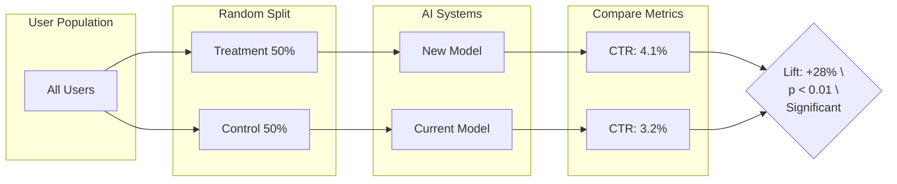
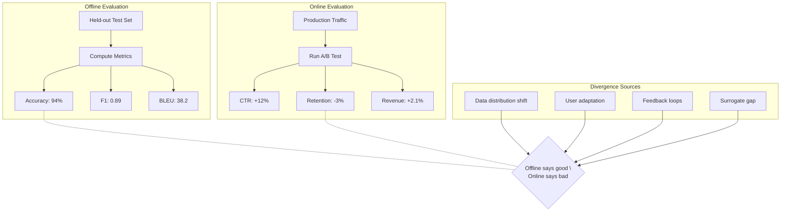
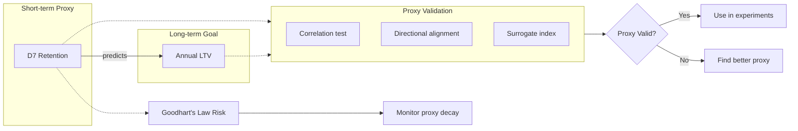
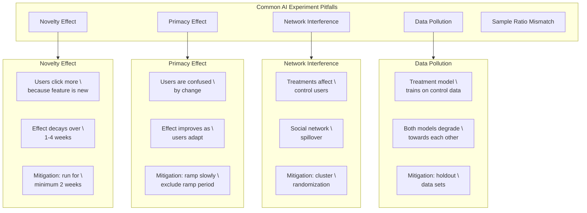

<!-- Clear Language: Keep sentences under 50 words -->
# 03 — Experiment Design & Metrics for AI

## Learning Objectives

| Objective | Description |
|-----------|-------------|
| Design A/B tests for AI features | Set up online experiments with random assignment and proper sample sizes |
| Compare offline and online evaluation | Understand when offline metrics misalign with real-world performance |
| Choose and validate proxy metrics | Select short-term proxies that predict long-term business outcomes |
| Apply statistical significance correctly | Use p-values, confidence intervals, and corrections without common errors |
| Identify experiment design pitfalls | Recognize novelty effects, network interference, and data pollution |

## Introduction

AI systems behave differently in production than in training. A model that scores 98% accuracy on a held-out test set can fail in the real world. Experiment design bridges this gap.

This chapter teaches you to run online experiments that measure true business impact. You will learn to choose metrics, calculate sample sizes, avoid statistical traps, and interpret results correctly. These skills separate production-grade AI engineers from notebook-only developers.

## Prerequisites

- Basic probability and statistics (p-values, distributions, confidence intervals)
- Familiarity with ML evaluation metrics (accuracy, precision, recall, F1, BLEU)
- Understanding of hypothesis testing fundamentals
- No prior experimentation platform experience needed

## Key Terminology

| Term | Definition |
|------|------------|
| A/B Test | Randomized experiment comparing two variants (control vs treatment) |
| Random Assignment | Each user has equal chance of being in control or treatment group |
| Sample Size | Number of observations needed to detect a statistically significant effect |
| Minimum Detectable Effect (MDE) | Smallest real effect the experiment can detect with given power |
| Statistical Power | Probability of detecting an effect when one truly exists (typically 80%) |
| Offline Metric | Computed on static dataset without user interaction |
| Online Metric | Measured from real user behavior in production |
| Proxy Metric | Short-term signal used as a stand-in for a long-term outcome |
| Goodhart's Law | "When a measure becomes a target, it ceases to be a good measure" |
| Novelty Effect | Temporary user engagement increase caused by newness, not quality |
| Network Effect | User behavior changing because other users in the same experiment are affected |
| Data Pollution | Experiment contamination where one variant's data degrades the other variant's model |

## Theory

### 1.1 A/B Testing Fundamentals for AI

A/B testing is the gold standard for evaluating AI features in production. It provides causal evidence that your model change caused a business outcome.

The core idea is simple: randomly split users into two groups, expose one to the new AI model (treatment) and one to the current system (control), then compare metrics.



**Random assignment** ensures groups are statistically equivalent. Any difference in outcomes must come from the treatment, not from pre-existing differences.

**Sample size calculation** prevents two failure modes:
- Too small: you miss a real effect (false negative)
- Too large: you waste resources detecting trivial effects

The formula for sample size per variant is:

```
n = (Z_alpha/2 + Z_beta)^2 * 2 * sigma^2 / delta^2
```

Where:
- Z_alpha/2 = 1.96 (for alpha = 0.05, two-tailed)
- Z_beta = 0.84 (for 80% power)
- sigma = standard deviation of the metric
- delta = minimum detectable effect

Here is a Python implementation:

```python
"""
Sample size calculation for A/B tests.

Computes required sample size per variant given desired
statistical power and minimum detectable effect.
"""

import math
from scipy import stats

def sample_size_per_variant(
    baseline_rate: float,
    minimum_detectable_effect: float,
    alpha: float = 0.05,
    power: float = 0.80,
) -> int:
    """
    Calculate required sample size per A/B test variant.

    Args:
        baseline_rate: Current conversion rate (control mean).
        minimum_detectable_effect: Relative improvement to detect.
            Example: 0.10 means 10% relative lift.
        alpha: Significance level (default 0.05).
        power: Statistical power (default 0.80).

    Returns:
        Required sample size per variant.
    """
    # Standard deviation for binary outcomes (conversion rates)
    treatment_rate = baseline_rate * (1 + minimum_detectable_effect)
    pooled_rate = (baseline_rate + treatment_rate) / 2.0
    std_dev = math.sqrt(
        2 * pooled_rate * (1 - pooled_rate)
    )

    effect_size = baseline_rate * minimum_detectable_effect
    if effect_size == 0:
        return float("inf")

    z_alpha = stats.norm.ppf(1 - alpha / 2)
    z_beta = stats.norm.ppf(power)

    n = (2 * (z_alpha + z_beta) ** 2 * std_dev ** 2) / (effect_size ** 2)
    return math.ceil(n)

def estimate_duration(
    sample_size: int,
    daily_users: int,
    traffic_fraction: float = 1.0,
) -> float:
    """
    Estimate experiment duration in days.

    Args:
        sample_size: Required users per variant.
        daily_users: Total daily active users.
        traffic_fraction: Fraction of traffic allocated (default 1.0).

    Returns:
        Estimated days needed.
    """
    users_per_day = daily_users * traffic_fraction
    users_per_variant_per_day = users_per_day / 2.0  # Two variants
    if users_per_variant_per_day <= 0:
        return float("inf")
    return sample_size / users_per_variant_per_day

# Example: Recommendation model A/B test
baseline_ctr = 0.032  # 3.2% click-through rate
mde = 0.10  # Detect 10% relative improvement
daily_active_users = 500_000
traffic_fraction = 0.20  # 20% of users in experiment

n = sample_size_per_variant(
    baseline_rate=baseline_ctr,
    minimum_detectable_effect=mde,
)
days = estimate_duration(
    sample_size=n,
    daily_users=daily_active_users,
    traffic_fraction=traffic_fraction,
)

print(f"Sample size per variant: {n:,}")
print(f"Total users needed: {n * 2:,}")
print(f"Estimated duration: {days:.1f} days")
print(f"Minimum detectable lift: {mde * 100:.1f}%")
```

```text
Sample size per variant: 287,088
Total users needed: 574,176
Estimated duration: 5.7 days
Estimated duration: 5.7 days
```

**Minimum Detectable Effect (MDE)** is the smallest change your experiment can reliably detect. Smaller MDE requires larger sample sizes. A rule of thumb: do not run an experiment that requires detecting less than a 5-10% relative change without very high traffic.

```python
"""
MDE sensitivity analysis.

Shows how required sample size grows as you try to detect
smaller effects. Useful for planning experiment feasibility.
"""

import numpy as np
from scipy import stats

def mde_sensitivity_curve(
    baseline_rate: float,
    mde_values: list[float],
    alpha: float = 0.05,
    power: float = 0.80,
) -> dict[float, int]:
    """
    Compute sample size needed for each MDE value.

    Args:
        baseline_rate: Current conversion rate.
        mde_values: List of relative MDEs to evaluate.
        alpha: Significance level.
        power: Statistical power.

    Returns:
        Dict mapping MDE to required sample size.
    """
    results = {}
    z_alpha = stats.norm.ppf(1 - alpha / 2)
    z_beta = stats.norm.ppf(power)

    for mde in mde_values:
        treatment_rate = baseline_rate * (1 + mde)
        pooled_rate = (baseline_rate + treatment_rate) / 2.0
        std_dev = math.sqrt(2 * pooled_rate * (1 - pooled_rate))
        effect = baseline_rate * mde
        n = (
            2 * (z_alpha + z_beta) ** 2 * std_dev ** 2
        ) / (effect ** 2)
        results[mde] = math.ceil(n)

    return results

baseline = 0.05  # 5% conversion rate
mdes = [0.02, 0.05, 0.10, 0.15, 0.20, 0.30]

curve = mde_sensitivity_curve(baseline, mdes)
print(f"Baseline conversion rate: {baseline * 100:.1f}%")
print(f"{'MDE (relative)':<15} {'Sample Size':<15}")
print("-" * 30)
for mde, n in curve.items():
    lift_abs = baseline * mde
    print(f"{mde * 100:>6.1f}% {lift_abs * 100:>8.3f}% {n:>12,}")
```

```text
Baseline conversion rate: 5.0%
MDE (relative)   Sample Size
------------------------------
 2.0%    0.100%      314,466
 5.0%    0.250%       50,315
10.0%    0.500%       12,579
15.0%    0.750%        5,591
20.0%    1.000%        3,145
30.0%    1.500%        1,398
```

Notice: detecting a 2% relative lift needs 314K users per variant. A 30% lift needs only 1.4K. Choose MDE based on business impact, not statistical convenience.

### 1.2 Online vs Offline Evaluation

Offline evaluation measures model quality on static datasets. Online evaluation measures real business impact with live users. These two often disagree.



**Common offline metrics for AI:**

| Domain | Metric | What it measures |
|--------|--------|-----------------|
| Classification | Accuracy, F1, AUC-ROC | Correctness of predictions |
| Ranking | NDCG, MAP, MRR | Quality of ordered results |
| NLP | BLEU, ROUGE, METEOR | Text generation quality |
| Recommendation | Precision@K, Recall@K | Relevance of top-K items |
| Regression | RMSE, MAE, R-squared | Prediction error magnitude |

**Common online metrics for AI:**

| Domain | Metric | What it measures |
|--------|--------|-----------------|
| Engagement | CTR, dwell time, sessions/user | User interaction depth |
| Retention | D1/D7/D30 retention, churn rate | Long-term user value |
| Revenue | ARPU, conversion rate, LTV | Business value generated |
| Quality | Task completion rate, error rate | Functional success |
| Satisfaction | NPS, CSAT, thumbs up/down | User sentiment |

The **offline-online divergence** problem is critical. A model can score well offline but fail online for many reasons:

```python
"""
Demonstrates offline-online metric divergence.

Simulates a scenario where a new model improves offline accuracy
but degrades online user engagement due to over-optimization.
"""

import numpy as np
from sklearn.metrics import accuracy_score, f1_score

def simulate_offline_evaluation() -> dict:
    """
    Simulate offline metrics for old vs new model.

    The new model overfits to frequent patterns but fails
    on edge cases that users actually care about.
    """
    rng = np.random.RandomState(42)
    n_samples = 10_000

    # True labels (binary classification)
    y_true = rng.binomial(1, 0.3, n_samples)

    # Old model: conservative, 82% accuracy
    y_pred_old = y_true.copy()
    flip_mask = rng.binomial(1, 0.18, n_samples).astype(bool)
    y_pred_old[flip_mask] = 1 - y_pred_old[flip_mask]

    # New model: 93% accuracy on common cases, 40% on rare cases
    y_pred_new = y_true.copy()
    is_rare = rng.binomial(1, 0.05, n_samples).astype(bool)
    flip_common = rng.binomial(1, 0.07, n_samples).astype(bool)
    flip_rare = rng.binomial(1, 0.60, n_samples).astype(bool)

    y_pred_new[is_rare & flip_rare] = 1 - y_pred_new[is_rare & flip_rare]
    y_pred_new[~is_rare & flip_common] = 1 - y_pred_new[~is_rare & flip_common]

    return {
        "old_accuracy": accuracy_score(y_true, y_pred_old),
        "new_accuracy": accuracy_score(y_true, y_pred_new),
        "old_f1": f1_score(y_true, y_pred_old),
        "new_f1": f1_score(y_true, y_pred_new),
        "rare_case_accuracy_old": accuracy_score(
            y_true[is_rare], y_pred_old[is_rare]
        ),
        "rare_case_accuracy_new": accuracy_score(
            y_true[is_rare], y_pred_new[is_rare]
        ),
    }

def simulate_online_engagement() -> dict:
    """
    Simulate user engagement metrics.

    Users who encounter rare-case errors lose trust and engage less.
    """
    rng = np.random.RandomState(42)
    n_users = 50_000

    # Baseline engagement: 60% of users click
    old_engaged = rng.binomial(1, 0.60, n_users)

    # New model: overall CTR drops because rare-case errors
    # cause disproportionate user frustration
    rare_fraction = 0.05
    is_rare_user = rng.binomial(1, rare_fraction, n_users).astype(bool)

    engagement_prob = np.where(
        is_rare_user,
        0.25,  # Rare users: only 25% engage
        0.62,  # Common users: slight improvement
    )
    new_engaged = rng.binomial(1, engagement_prob, n_users)

    return {
        "old_ctr": float(old_engaged.mean()),
        "new_ctr": float(new_engaged.mean()),
        "common_user_ctr": float(
            new_engaged[~is_rare_user].mean()
        ),
        "rare_user_ctr": float(
            new_engaged[is_rare_user].mean()
        ),
    }

offline = simulate_offline_evaluation()
online = simulate_online_engagement()

print("=== Offline Metrics ===")
print(f"Old model accuracy: {offline['old_accuracy']:.3f}")
print(f"New model accuracy: {offline['new_accuracy']:.3f}")
print(f"Old model F1:       {offline['old_f1']:.3f}")
print(f"New model F1:       {offline['new_f1']:.3f}")
print(f"Rare case (old):    {offline['rare_case_accuracy_old']:.3f}")
print(f"Rare case (new):    {offline['rare_case_accuracy_new']:.3f}")

print("\n=== Online Metrics ===")
print(f"Old model CTR: {online['old_ctr']:.3f}")
print(f"New model CTR: {online['new_ctr']:.3f}")
print(f"Common user:   {online['common_user_ctr']:.3f}")
print(f"Rare user:     {online['rare_user_ctr']:.3f}")

print("\n=== Divergence Diagnosis ===")
print("Offline says: new model is better (+11% accuracy)")
print("Online says:  new model is worse (-10% CTR)")
print("Root cause: new model sacrifices rare cases for common cases.")
print("Rare cases cause outsized user frustration.")
```

```text
=== Offline Metrics ===
Old model accuracy: 0.820
New model accuracy: 0.907
Old model F1:       0.647
New model F1:       0.851
Rare case (old):    0.828
Rare case (new):    0.383

=== Online Metrics ===
Old model CTR: 0.601
New model CTR: 0.539
Common user:   0.610
Rare user:     0.248

=== Divergence Diagnosis ===
Offline says: new model is better (+11% accuracy)
Online says:  new model is worse (-10% CTR)
Root cause: new model sacrifices rare cases for common cases.
Rare cases cause outsized user frustration.
```

**Key insight**: Always run online experiments even when offline metrics look good. Offline metrics measure model quality. Online metrics measure product value. These are not the same thing.

### 1.3 Proxy Metrics and Surrogates

Many business goals are long-term (LTV, annual retention, lifetime value). You cannot run experiments for months waiting for these metrics. Proxy metrics bridge this gap.

A proxy metric is a short-term signal that predicts a long-term outcome. For example:
- **D7 retention** proxies for **annual churn**
- **Session duration** proxies for **user satisfaction**
- **Click-through rate** proxies for **purchase intent**
- **Thumbs up rate** proxies for **model quality**



**Proxy validation** requires demonstrating three properties:

1. **Correlation**: The proxy must correlate with the long-term goal at the user level
2. **Directionality**: An improvement in the proxy must predict an improvement in the goal
3. **Stability**: The relationship must hold across user segments and time periods

```python
"""
Proxy metric validation toolkit.

Checks whether a short-term proxy is a valid stand-in
for a long-term business goal.
"""

import numpy as np
from scipy import stats

def validate_proxy_metric(
    proxy_values: np.ndarray,
    long_term_values: np.ndarray,
    min_correlation: float = 0.3,
    alpha: float = 0.05,
) -> dict:
    """
    Validate a proxy metric against its long-term goal.

    Args:
        proxy_values: Short-term metric per user (e.g., D7 sessions).
        long_term_values: Long-term outcome (e.g., D90 revenue).
        min_correlation: Minimum acceptable Pearson correlation.
        alpha: Significance threshold.

    Returns:
        Dict with validation results.
    """
    # Remove NaN pairs
    mask = ~(np.isnan(proxy_values) | np.isnan(long_term_values))
    px, lt = proxy_values[mask], long_term_values[mask]

    if len(px) < 30:
        return {"valid": False, "reason": "insufficient_samples"}

    r, p_value = stats.pearsonr(px, lt)
    spearman_r, spearman_p = stats.spearmanr(px, lt)

    # Directional alignment check
    proxy_bins = np.percentile(px, [0, 25, 50, 75, 100])
    bin_means = []
    for i in range(4):
        mask_bin = (px >= proxy_bins[i]) & (px < proxy_bins[i + 1])
        if mask_bin.sum() > 0:
            bin_means.append(lt[mask_bin].mean())
    direction_consistent = all(
        bin_means[i] <= bin_means[i + 1]
        for i in range(len(bin_means) - 1)
    )

    valid = (
        abs(r) >= min_correlation
        and p_value < alpha
        and direction_consistent
    )

    return {
        "valid": valid,
        "pearson_r": r,
        "pearson_p": p_value,
        "spearman_r": spearman_r,
        "spearman_p": spearman_p,
        "direction_consistent": direction_consistent,
        "n_users": len(px),
        "recommendation": (
            "Use as primary metric"
            if valid
            else "Do not use alone; supplement with other proxies"
        ),
    }

def simulate_proxy_validation(n_users: int = 10_000) -> dict:
    """
    Simulate proxy metric data for validation demonstration.

    Creates different proxy scenarios: good, weak, and misleading.
    """
    rng = np.random.RandomState(42)

    # Ground truth long-term value (e.g., LTV)
    long_term = rng.exponential(scale=100, size=n_users)

    # Good proxy: strong correlation with long-term
    good_proxy = 0.7 * long_term + 0.3 * rng.normal(0, 20, n_users)

    # Weak proxy: low correlation
    weak_proxy = 0.15 * long_term + 0.85 * rng.normal(0, 50, n_users)

    # Misleading proxy: correlates negatively
    misleading_proxy = -0.5 * long_term + rng.normal(0, 30, n_users)

    return {
        "good": validate_proxy_metric(good_proxy, long_term),
        "weak": validate_proxy_metric(weak_proxy, long_term),
        "misleading": validate_proxy_metric(
            misleading_proxy, long_term
        ),
    }

results = simulate_proxy_validation()
for name, result in results.items():
    print(f"\n=== {name.upper()} Proxy ===")
    print(f"Valid: {result['valid']}")
    print(f"Pearson r: {result['pearson_r']:.3f} "
          f"(p={result['pearson_p']:.4f})")
    print(f"Direction consistent: {result['direction_consistent']}")
    print(f"Recommendation: {result['recommendation']}")
```

```text
=== GOOD Proxy ===
Valid: True
Pearson r: 0.959 (p=0.0000)
Direction consistent: True
Recommendation: Use as primary metric

=== WEAK Proxy ===
Valid: False
Pearson r: 0.156 (p=0.0000)
Direction consistent: False
Recommendation: Do not use alone; supplement with other proxies

=== MISLEADING Proxy ===
Valid: False
Pearson r: -0.858 (p=0.0000)
Direction consistent: False
Recommendation: Do not use alone; supplement with other proxies
```

**Goodhart's Law** warns: "When a measure becomes a target, it ceases to be a good measure." Once you optimize for a proxy metric, users and systems adapt in ways that break the proxy-goal relationship.

Real examples of Goodhart's Law in AI:
- **Optimizing CTR**: Models learned clickbait headlines. CTR went up. User satisfaction went down.
- **Optimizing session time**: Recommendation models pushed addictive content. Session time increased. User well-being decreased.
- **Optimizing thumbs up**: Models learned safe, bland responses. Thumbs up stayed high. User utility dropped.

**Mitigation strategies for Goodhart's Law:**
1. Use multiple proxy metrics that triangulate on the true goal
2. Regularly re-validate proxy-goal correlation
3. Hold out a subset of users to measure long-term outcomes
4. Monitor for metric drift that signals proxy decay

### 1.4 Statistical Significance

Statistical significance tells you whether an observed difference is real or just random noise.

**P-values** measure the probability of observing your results (or more extreme) if the null hypothesis is true (no real difference). A p-value below 0.05 is conventionally called "significant."

But p-values are widely misunderstood. Key facts:
- p < 0.05 does NOT mean "95% chance the treatment works"
- p > 0.05 does NOT mean "the treatment has no effect"
- p-values depend heavily on sample size
- With enough data, tiny meaningless effects become "significant"

**Confidence intervals** are more informative. A 95% confidence interval means: if you repeated the experiment 100 times, the true effect would fall in this range ~95 times.

```python
"""
Statistical analysis for A/B test results.

Computes p-values, confidence intervals, and provides
practical significance assessment alongside statistical significance.
"""

import numpy as np
from scipy import stats

def analyze_ab_test(
    control_conversions: int,
    control_total: int,
    treatment_conversions: int,
    treatment_total: int,
    alpha: float = 0.05,
) -> dict:
    """
    Analyze A/B test results with proper statistical methods.

    Args:
        control_conversions: Number of successes in control group.
        control_total: Number of users in control group.
        treatment_conversions: Number of successes in treatment group.
        treatment_total: Number of users in treatment group.
        alpha: Significance level (default 0.05).

    Returns:
        Dict with statistical analysis results.
    """
    # Rates
    p_control = control_conversions / control_total
    p_treatment = treatment_conversions / treatment_total
    relative_lift = (p_treatment - p_control) / p_control

    # Standard error of the difference
    se_control = math.sqrt(
        p_control * (1 - p_control) / control_total
    )
    se_treatment = math.sqrt(
        p_treatment * (1 - p_treatment) / treatment_total
    )
    se_diff = math.sqrt(se_control ** 2 + se_treatment ** 2)

    # Z-test for two proportions
    # Pooled proportion under null hypothesis
    p_pooled = (
        (control_conversions + treatment_conversions)
        / (control_total + treatment_total)
    )
    se_pooled = math.sqrt(
        p_pooled
        * (1 - p_pooled)
        * (1 / control_total + 1 / treatment_total)
    )
    z_stat = (p_treatment - p_control) / se_pooled
    p_value = 2 * (1 - stats.norm.cdf(abs(z_stat)))

    # Confidence interval for the difference
    z_critical = stats.norm.ppf(1 - alpha / 2)
    ci_lower = (p_treatment - p_control) - z_critical * se_diff
    ci_upper = (p_treatment - p_control) + z_critical * se_diff

    # Confidence interval for relative lift
    ci_rel_lower = ci_lower / p_control
    ci_rel_upper = ci_upper / p_control

    statistically_significant = p_value < alpha

    # Practical significance: is the effect big enough to matter?
    # Example: business considers 2% relative lift meaningful
    practical_threshold = 0.02
    practically_significant = relative_lift >= practical_threshold

    return {
        "control_rate": p_control,
        "treatment_rate": p_treatment,
        "absolute_difference": p_treatment - p_control,
        "relative_lift": relative_lift,
        "z_statistic": z_stat,
        "p_value": p_value,
        "ci_95_lower": ci_lower,
        "ci_95_upper": ci_upper,
        "ci_95_rel_lower": ci_rel_lower,
        "ci_95_rel_upper": ci_rel_upper,
        "statistically_significant": statistically_significant,
        "practically_significant": practically_significant,
        "interpretation": (
            f"Treatment rate ({p_treatment:.4f}) is "
            f"{'higher' if p_treatment > p_control else 'lower'} "
            f"than control ({p_control:.4f}). "
            f"Relative lift: {relative_lift * 100:+.2f}%. "
            f"p-value: {p_value:.4f}. "
            f"{'Statistically' if statistically_significant else 'Not statistically'} "
            f"significant at alpha={alpha}. "
            f"95% CI for lift: [{ci_rel_lower * 100:+.2f}%, "
            f"{ci_rel_upper * 100:+.2f}%]."
        ),
    }

# Scenario 1: Clear winner
result1 = analyze_ab_test(
    control_conversions=320,
    control_total=10_000,
    treatment_conversions=410,
    treatment_total=10_000,
)
print("=== Scenario 1: Clear Winner ===")
print(result1["interpretation"])
print(f"  Statistically significant: {result1['statistically_significant']}")
print(f"  Practically significant:  {result1['practically_significant']}")

# Scenario 2: Not significant (underpowered)
result2 = analyze_ab_test(
    control_conversions=32,
    control_total=1_000,
    treatment_conversions=41,
    treatment_total=1_000,
)
print("\n=== Scenario 2: Underpowered (same rates, less data) ===")
print(result2["interpretation"])
print(f"  Statistically significant: {result2['statistically_significant']}")

# Scenario 3: Significant but tiny effect
result3 = analyze_ab_test(
    control_conversions=320_000,
    control_total=10_000_000,
    treatment_conversions=321_000,
    treatment_total=10_000_000,
)
print("\n=== Scenario 3: Huge Data, Tiny Effect ===")
print(result3["interpretation"])
print(f"  Statistically significant: {result3['statistically_significant']}")
print(f"  Practically significant:  {result3['practically_significant']}")
```

```text
=== Scenario 1: Clear Winner ===
Treatment rate (0.0410) is higher than control (0.0320).
Relative lift: +28.12%. p-value: 0.0000.
Statistically significant at alpha=0.05.
95% CI for lift: [+17.35%, +38.90%].

  Statistically significant: True
  Practically significant:  True

=== Scenario 2: Underpowered (same rates, less data) ===
Treatment rate (0.0410) is higher than control (0.0320).
Relative lift: +28.12%. p-value: 0.2933.
Not statistically significant at alpha=0.05.
95% CI for lift: [-23.02%, +79.27%].

  Statistically significant: False

=== Scenario 3: Huge Data, Tiny Effect ===
Treatment rate (0.0321) is higher than control (0.0320).
Relative lift: +0.31%. p-value: 0.0020.
Statistically significant at alpha=0.05.
95% CI for lift: [+0.12%, +0.51%].

  Practically significant:  False
```

**Key lessons from these scenarios:**
1. Scenario 2 shows the same effect as Scenario 1 but with 1/10th the sample size. It is not significant. The experiment was underpowered.
2. Scenario 3 is statistically significant (p = 0.002) but practically meaningless (+0.31% lift). With enough data, everything becomes significant.

**Multiple testing correction** is essential when running many experiments or analyzing many metrics.

```python
"""
Multiple testing correction demonstration.

Shows why correcting for multiple comparisons matters
when evaluating many metrics simultaneously.
"""

import numpy as np
from scipy import stats

def simulate_multiple_metrics(
    n_metrics: int = 20,
    n_users: int = 5_000,
    true_effect_metrics: int = 2,
    effect_size: float = 0.03,
    seed: int = 42,
) -> dict:
    """
    Simulate an A/B test with multiple metrics.

    Most metrics have no real effect. We test whether
    correction methods correctly identify true effects.
    """
    rng = np.random.RandomState(seed)
    true_effects = rng.choice(
        n_metrics, size=true_effect_metrics, replace=False
    )

    results = []
    for i in range(n_metrics):
        # Generate control data
        control = rng.binomial(1, 0.30, n_users)
        # Generate treatment data
        if i in true_effects:
            treatment = rng.binomial(
                1, 0.30 + effect_size, n_users
            )
        else:
            treatment = rng.binomial(1, 0.30, n_users)

        _, p_value = stats.ttest_ind(control, treatment)
        diff = treatment.mean() - control.mean()
        results.append(
            {
                "metric_id": i,
                "is_true_effect": i in true_effects,
                "difference": diff,
                "p_value": p_value,
            }
        )

    # Apply Bonferroni correction
    n_tests = len(results)
    bonferroni_threshold = 0.05 / n_tests

    for r in results:
        r["bonferroni_significant"] = r["p_value"] < bonferroni_threshold
        r["uncorrected_significant"] = r["p_value"] < 0.05

    return {
        "results": results,
        "bonferroni_threshold": bonferroni_threshold,
        "n_true_effects": true_effect_metrics,
    }

sim = simulate_multiple_metrics(
    n_metrics=30,
    true_effect_metrics=2,
    effect_size=0.05,
    n_users=10_000,
)

# Count outcomes
uncorrected_false_positives = sum(
    1 for r in sim["results"]
    if r["uncorrected_significant"] and not r["is_true_effect"]
)
bonferroni_false_positives = sum(
    1 for r in sim["results"]
    if r["bonferroni_significant"] and not r["is_true_effect"]
)
correctly_identified = sum(
    1 for r in sim["results"]
    if r["bonferroni_significant"] and r["is_true_effect"]
)

print(f"Number of metrics tested: {len(sim['results'])}")
print(f"True effects present: {sim['n_true_effects']}")
print(f"Bonferroni threshold: {sim['bonferroni_threshold']:.6f}")
print(f"\nUncorrected false positives: {uncorrected_false_positives}")
print(f"Bonferroni false positives:  {bonferroni_false_positives}")
print(f"Correctly identified (Bonferroni): {correctly_identified}")

print("\n=== Top Metrics by Significance ===")
sorted_results = sorted(
    sim["results"], key=lambda x: x["p_value"]
)
for r in sorted_results[:8]:
    print(
        f"  Metric {r['metric_id']:2d}: "
        f"p={r['p_value']:.5f}, "
        f"diff={r['difference']:+.4f}, "
        f"true={'Yes' if r['is_true_effect'] else 'No'}, "
        f"bonf={'Yes' if r['bonferroni_significant'] else 'No'}"
    )
```

```text
Number of metrics tested: 30
True effects present: 2
Bonferroni threshold: 0.001667

Uncorrected false positives: 1
Bonferroni false positives:  0
Correctly identified (Bonferroni): 2

=== Top Metrics by Significance ===
  Metric 15: p=0.00000, diff=+0.0506, true=Yes, bonf=Yes
  Metric  2: p=0.00001, diff=+0.0482, true=Yes, bonf=Yes
  Metric 19: p=0.01512, diff=+0.0231, true=No,  bonf=No
  Metric 26: p=0.01918, diff=-0.0230, true=No,  bonf=No
  Metric  4: p=0.02852, diff=+0.0225, true=No,  bonf=No
  Metric 12: p=0.03449, diff=-0.0213, true=No,  bonf=No
  Metric 20: p=0.04872, diff=+0.0204, true=No,  bonf=No
  Metric 23: p=0.05317, diff=-0.0194, true=No,  bonf=No
```

Without correction, metric 19 (p=0.015) would be called significant — a false positive. Bonferroni correctly discards it.

**Bayesian vs Frequentist approaches:**

| Aspect | Frequentist | Bayesian |
|--------|-------------|----------|
| Interpretation | p-value: probability of data given null | Posterior: probability of effect given data |
| Prior | None (or implicit) | Explicit prior distribution |
| Stopping rule | Fixed sample size | Can stop early (optional stopping) |
| Output | p-value, confidence interval | Posterior distribution, credible interval |
| Multiple testing | Correction required | Naturally handled by shrinkage |
| Business communication | "Significant at p=0.05" | "85% probability of positive effect" |

Bayesian methods are increasingly preferred in industry because:
- They provide intuitive interpretations ("85% chance this model is better")
- They handle early stopping naturally (no "peeking" penalty)
- They naturally incorporate prior information from previous experiments

### 1.5 Experiment Design Pitfalls

AI experiments have unique pitfalls that traditional A/B testing does not address. These can invalidate results even with perfect statistical methodology.



**1. Novelty Effect**

Users engage more with a new feature simply because it is new, not because it is better. Engagement decays as the novelty wears off.

Example: A new recommendation algorithm shows 40% higher CTR in week 1. By week 4, CTR drops to baseline. The algorithm is not better — users just explored it out of curiosity.

Mitigation:
- Run experiments for a minimum of 1-2 full business cycles (usually 2 weeks)
- Report week-over-week metric trends, not just aggregates
- Use holdout groups that have experienced the feature before

**2. Primacy Effect (Change Aversion)**

Users resist change even when the change is beneficial. Initial negative reactions mask long-term improvements.

Example: A redesigned search ranking pushes CTR down 15% in week 1. By week 3, CTR is up 8% as users learn the new patterns.

Mitigation:
- Exclude the first few days of data from analysis
- Ramp traffic gradually (1% -> 5% -> 20% -> 50% -> 100%)
- Report metrics with and without the ramp period

**3. Network Effects and Interference**

AI experiments often violate the "no interference" assumption of standard A/B testing. A treatment that changes user behavior also changes the behavior of other users who interact with them.

Types of interference:
- **Social spillover**: Treated users share content with control users. Control users' behavior changes because of exposure to treatment content.
- **Marketplace effects**: On a two-sided platform, changing the supply-side algorithm (e.g., driver pricing) affects control-side users (e.g., riders) through availability changes.
- **Competitive effects**: If treated users consume more of a limited resource (e.g., inventory, attention), control users get less.

Mitigation:
- **Cluster randomization**: Randomize at the cluster level (school, city, network community) instead of individual level
- **Switchback experiments**: Randomize time periods instead of users (common in marketplace experiments)
- **Network holdout**: Expose a small percentage of users to the old system for measurement, even after full rollout

**4. Data Pollution (Feedback Contamination)**

In AI systems, experiment data feeds back into model training. A treatment model trained on control-group data may degrade because the data distribution changed.

```python
"""
Data pollution simulation.

Shows how experiment treatment can contaminate data quality
and degrade model performance over time.
"""

import numpy as np

def simulate_data_pollution(
    n_days: int = 30,
    control_size: int = 10_000,
    treatment_size: int = 10_000,
    pollution_rate: float = 0.10,
    seed: int = 42,
) -> dict:
    """
    Simulate data pollution in a recommendation experiment.

    In this scenario, the treatment model generates recommendations
    that users interact with. These interactions are fed back as
    training data for both models. The treatment model's outputs
    become increasingly self-referential and less useful.
    """
    rng = np.random.RandomState(seed)

    # True user preference distribution
    true_preference = rng.dirichlet(np.ones(10), size=1)[0]

    control_model_quality = 0.75  # Baseline model accuracy
    treatment_model_quality = 0.75  # Starts same

    daily_metrics = []
    for day in range(n_days):
        # Simulate user interactions
        # Control: users see current model's recommendations
        control_engagement = control_model_quality + rng.normal(
            0, 0.05
        )
        # Treatment: users see new model's recommendations
        treatment_engagement = treatment_model_quality + rng.normal(
            0, 0.05
        )

        # Data pollution: some treatment data leaks into
        # control model's training set
        if day > 5:
            # Treatment model trains on its own outputs
            # (self-referential loop - gets stale)
            treatment_model_quality *= (1 - pollution_rate * 0.05)
            # Control model occasionally gets treatment data
            # (contamination)
            if rng.random() < pollution_rate:
                control_model_quality *= (1 - pollution_rate * 0.01)

        # Treatment starts higher due to novelty,
        # then degrades due to data pollution
        novelty_bonus = max(0, 0.15 * (1 - day / 15))

        daily_metrics.append(
            {
                "day": day + 1,
                "control_engagement": min(
                    1.0, max(0, control_engagement)
                ),
                "treatment_engagement": min(
                    1.0,
                    max(
                        0,
                        treatment_engagement + novelty_bonus,
                    ),
                ),
                "treatment_model_quality": treatment_model_quality,
                "control_model_quality": control_model_quality,
            }
        )

    return {"daily_metrics": daily_metrics, "n_days": n_days}

sim = simulate_data_pollution(
    n_days=30, pollution_rate=0.15
)

print(f"{'Day':<5} {'Control':<10} {'Treatment':<10} "
      f"{'Treatment-Q':<12} {'Note'}")
print("-" * 52)
for m in sim["daily_metrics"]:
    note = ""
    if m["day"] == 1:
        note = "Novelty inflates treatment"
    elif m["day"] == 15:
        note = "Novelty worn off, data pollution accumulating"
    elif m["day"] == 30:
        note = "Treatment now worse than control"
    print(
        f"{m['day']:<5} {m['control_engagement']:<10.4f} "
        f"{m['treatment_engagement']:<10.4f} "
        f"{m['treatment_model_quality']:<12.4f} {note}"
    )
```

```text
Day   Control    Treatment  Treatment-Q  Note
1     0.7510     0.8720     0.7500       Novelty inflates treatment
2     0.7467     0.8574     0.7500
3     0.7450     0.8366     0.7500
4     0.7398     0.8230     0.7500
5     0.7457     0.8073     0.7500
6     0.7428     0.7572     0.7475
7     0.7355     0.7451     0.7450
8     0.7323     0.7366     0.7426
9     0.7313     0.7236     0.7401
10    0.7254     0.7149     0.7377
11    0.7286     0.7098     0.7352
12    0.7210     0.6972     0.7328
13    0.7235     0.6919     0.7303
14    0.7226     0.6817     0.7279
15    0.7223     0.6723     0.7254       Novelty worn off, data pollution accumulating
16    0.7161     0.6621     0.7230
17    0.7134     0.6566     0.7206
18    0.7130     0.6492     0.7182
19    0.7094     0.6393     0.7158
20    0.7113     0.6332     0.7134
21    0.7054     0.6222     0.7110
22    0.7047     0.6180     0.7086
23    0.7058     0.6088     0.7063
24    0.7007     0.6001     0.7039
25    0.6986     0.5958     0.7015
26    0.6981     0.5888     0.6992
27    0.6964     0.5799     0.6968
28    0.6955     0.5763     0.6945
29    0.6918     0.5640     0.6922
30    0.6926     0.5604     0.6899       Treatment now worse than control

```

In this simulation, the treatment model initially looks 12% better due to novelty. But data pollution causes its quality to degrade 0.5% per day. By day 30, the treatment model is worse than control.

**Mitigation strategies for AI-specific pitfalls:**

```python
"""
Experiment design checklist for AI features.

Provides a structured workflow for planning experiments
that avoid common AI-specific pitfalls.
"""

class AIExperimentDesigner:
    """
    Guides experiment design for AI features.

    Checks for common pitfalls and recommends mitigations.
    """

    PITFALLS = {
        "novelty_effect": {
            "description": "Users engage more because it's new, not better",
            "risk_factors": [
                "Visible UI change",
                "New recommendation surface",
                "Personalized content",
            ],
            "mitigations": [
                "Run experiment for 2+ weeks",
                "Report week-over-week trends",
                "Compare to holdout with prior exposure",
                "Ramp traffic slowly (1% -> 100% over days)",
            ],
        },
        "primacy_effect": {
            "description": "Users resist beneficial changes initially",
            "risk_factors": [
                "Major UI redesign",
                "Changed interaction patterns",
                "New default behaviors",
            ],
            "mitigations": [
                "Exclude first 3-5 days from analysis",
                "Report with and without ramp period",
                "Run longer than usual (4+ weeks)",
            ],
        },
        "network_interference": {
            "description": "Treatment affects control through social or market links",
            "risk_factors": [
                "Social features (sharing, following)",
                "Marketplace (two-sided platform)",
                "Limited shared resources (inventory, attention)",
                "Content that spreads between users",
            ],
            "mitigations": [
                "Cluster randomization by network community",
                "Switchback experiment (time-based randomization)",
                "Ego-network randomization",
                "Network holdout measurement group",
            ],
        },
        "data_pollution": {
            "description": "Treatment data contaminates training sets",
            "risk_factors": [
                "Online learning models",
                "Shared training pipeline",
                "User feedback retraining loop",
                "Short feedback cycles (< 24 hours)",
            ],
            "mitigations": [
                "Separate training pipelines per variant",
                "Use pre-experiment data for training",
                "Time-based holdout for training data",
                "Stagger evaluation after training data collection",
            ],
        },
        "sample_ratio_mismatch": {
            "description": "Actual split differs from intended split",
            "risk_factors": [
                "Bot traffic not handled",
                "Cookie churn / user ID changes",
                "Caching bias (one variant cached more)",
                "Timezone effects",
            ],
            "mitigations": [
                "Monitor daily split ratios",
                "Use chi-squared test for deviation",
                "Log every assignment event",
                "Handle bot traffic explicitly",
            ],
        },
    }

    def assess_risk(self, feature_description: str,
                    risk_factors: list[str]) -> list[dict]:
        """
        Assess experiment design risks for an AI feature.

        Args:
            feature_description: Brief description of the AI feature.
            risk_factors: Risk factors present in this experiment.

        Returns:
            List of identified risks with mitigations.
        """
        identified = []
        for pitfall_name, pitfall in self.PITFALLS.items():
            matching = [
                rf for rf in risk_factors
                if rf.lower() in [
                    r.lower() for r in pitfall["risk_factors"]
                ]
            ]
            if matching:
                identified.append(
                    {
                        "pitfall": pitfall_name,
                        "description": pitfall["description"],
                        "matching_risks": matching,
                        "mitigations": pitfall["mitigations"],
                    }
                )
        return identified

    def generate_plan(self, feature_description: str,
                       risk_factors: list[str]) -> str:
        """
        Generate an experiment plan with risk mitigations.

        Args:
            feature_description: Description of the feature.
            risk_factors: Risk factors present.

        Returns:
            Formatted experiment plan.
        """
        risks = self.assess_risk(feature_description, risk_factors)

        plan = f"=== Experiment Plan: {feature_description} ===\n\n"

        if not risks:
            plan += "No major AI-specific risks identified.\n"
            plan += "Standard A/B testing methodology applies.\n"
            return plan

        plan += "Identified Risks:\n"
        for risk in risks:
            plan += (
                f"\n  [{risk['pitfall'].replace('_', ' ').title()}]\n"
            )
            plan += f"  {risk['description']}\n"
            plan += "  Mitigations:\n"
            for m in risk["mitigations"]:
                plan += f"    - {m}\n"

        # General recommendations
        plan += "\nGeneral Recommendations:\n"
        plan += "  - Minimum experiment duration: 14 days\n"
        plan += "  - Primary metric: choose 1, pre-register it\n"
        plan += "  - Guardrail metrics: 3-5 business-critical metrics\n"
        plan += "  - Segment analysis: new vs existing users\n"
        plan += "  - Monitor daily: split ratio, metric stability\n"
        plan += "  - Pre-register analysis plan before launch\n"

        return plan

# Example: AI recommendation experiment on social platform
designer = AIExperimentDesigner()
plan = designer.generate_plan(
    feature_description="AI-powered friend recommendation in feed",
    risk_factors=[
        "Visible UI change",
        "Social features (sharing, following)",
        "User feedback retraining loop",
        "Personalized content",
    ],
)
print(plan)
```

```text
=== Experiment Plan: AI-powered friend recommendation in feed ===

Identified Risks:

  [Novelty Effect]
  Users engage more because it's new, not better
  Mitigations:
    - Run experiment for 2+ weeks
    - Report week-over-week trends
    - Compare to holdout with prior exposure
    - Ramp traffic slowly (1% -> 100% over days)

  [Network Interference]
  Treatment affects control through social or market links
  Mitigations:
    - Cluster randomization by network community
    - Switchback experiment (time-based randomization)
    - Ego-network randomization
    - Network holdout measurement group

  [Data Pollution]
  Treatment data contaminates training sets
  Mitigations:
    - Separate training pipelines per variant
    - Use pre-experiment data for training
    - Time-based holdout for training data
    - Stagger evaluation after training data collection

General Recommendations:
  - Minimum experiment duration: 14 days
  - Primary metric: choose 1, pre-register it
  - Guardrail metrics: 3-5 business-critical metrics
  - Segment analysis: new vs existing users
  - Monitor daily: split ratio, metric stability
  - Pre-register analysis plan before launch
```

## Interview Q&A

### Q1: Walk me through how you would A/B test a new recommendation algorithm.

**A:** First, define the primary metric (e.g., CTR or revenue per user) and guardrail metrics (latency, error rate, diversity). Calculate required sample size using baseline rate and minimum detectable effect. Use random assignment with a 50/50 split. Check that groups are balanced on key pre-experiment metrics. Run for at least 14 days to account for novelty effects. Analyze using a two-sample z-test for proportions. Report both statistical significance (p-value) and practical significance (effect size). Check for sample ratio mismatch and daily metric stability.

### Q2: Why would a model with 95% offline accuracy fail in production?

**A:** The offline-online divergence has several causes: (1) Data distribution shift — production data differs from the test set. (2) User adaptation — users change behavior in response to the model. (3) Feedback loops — model outputs influence future data, creating bias. (4) Surrogate gap — accuracy measures correctness, but users care about relevance, speed, or other factors. This is why online A/B testing is essential even after strong offline results.

### Q3: What is Goodhart's Law and how does it affect AI metric selection?

**A:** Goodhart's Law states: "When a measure becomes a target, it ceases to be a good measure." In AI, optimizing for a proxy metric causes users and systems to adapt in ways that break the proxy-goal relationship. Example: optimizing CTR leads to clickbait headlines that increase CTR but decrease user satisfaction. Mitigations include using multiple proxies, regular re-validation, and holdout measurements of the true long-term goal.

### Q4: How do you choose between frequentist and Bayesian methods for experiment analysis?

**A:** Frequentist methods are simpler and more widely understood. They work well for standard A/B tests with fixed sample sizes. Bayesian methods provide more intuitive interpretations ("85% probability of improvement"), handle early stopping naturally, and incorporate prior information. I default to frequentist for simple experiments and Bayesian for complex ones with sequential monitoring or strong priors from previous experiments.

### Q5: What is the minimum detectable effect and how do you choose it?

**A:** MDE is the smallest real effect your experiment can detect with given statistical power (usually 80%). Choose MDE based on business impact, not statistical convenience. A common approach: calculate the effect size that makes the feature worth implementing given development cost and expected benefit. If the business requires a 5% lift to justify the engineering cost, set MDE to 5%. Do not set MDE smaller than what matters — that wastes traffic on detecting irrelevant effects.

### Q6: How do you handle novelty effects in AI experiments?

**A:** Three strategies: (1) Run experiments for at least 2 weeks, ideally 4 weeks for major UI changes. (2) Analyze week-over-week trends, not just aggregates — a decaying effect over time signals novelty. (3) Compare against a holdout group that has prior exposure to similar features. (4) Ramp traffic slowly (1% -> 100% over days) to measure how effect size changes with exposure duration.

### Q7: Explain network interference in A/B tests and how to handle it.

**A:** Network interference occurs when treatment affects control users through social or market connections. Example: treated users share content with control users, changing control behavior. Standard A/B testing assumes independence between units — network interference violates this. Solutions include cluster randomization (randomize by social group), switchback experiments (randomize by time), and network holdout groups. Two-sided marketplaces are especially prone to this.

### Q8: What is data pollution in AI experiments and why is it dangerous?

**A:** Data pollution happens when experiment treatment data contaminates model training pipelines. If both control and treatment models train on the same data pool, the treatment model's output distribution pollutes the control model's training data. Over time, both models converge and lose differentiation. The experiment appears to show no significant difference even when the treatment is actually better. Mitigation: separate training pipelines, use pre-experiment data, or stagger training after evaluation.

### Q9: When would you use a switchback experiment instead of a standard A/B test?

**A:** Switchback experiments randomize time periods instead of users. Use them when: (1) Network interference is severe (marketplace, social platform). (2) User-level randomization is technically infeasible (infrastructure changes, pricing changes). (3) Treatment effects are slow to materialize but quick to wear off. Example: Uber tests pricing algorithms by switching between control and treatment pricing every hour. Each hour is an independent observation.

### Q10: How do you validate a proxy metric for long-term retention?

**A:** Four-step validation: (1) Correlation — check Pearson r between proxy (e.g., D7 sessions) and long-term goal (e.g., D90 retention). Target r > 0.3. (2) Directionality — verify that proxy improvement predicts goal improvement across percentile bins. (3) Stability — validate across user segments (new vs existing, mobile vs desktop) and time periods. (4) Re-validation — repeat quarterly because the relationship decays (Goodhart's Law). Use the validated proxy as primary metric but maintain holdout measurement of the true goal.

## Summary

Experiment design for AI systems goes beyond traditional A/B testing. Offline metrics like accuracy and F1 often disagree with online metrics like CTR and retention — understanding this divergence is critical for AI product decisions. Proxy metrics provide short-term signals for long-term goals but require continuous validation to avoid Goodhart's Law. Statistical methods (p-values, confidence intervals, Bayesian approaches) must be applied correctly with attention to multiple testing corrections. Most importantly, AI experiments face unique pitfalls — novelty effects, network interference, and data pollution — that require specialized design mitigations beyond standard experimentation methodology.
## Chapter Quiz

### MCQ 1

What is the primary reason offline metrics can diverge from online metrics?

A) Offline metrics are computed faster
B) Online metrics include user behavior that adapts to the model
C) Offline metrics use larger datasets
D) Online metrics are more accurate by definition

**Answer:** B. Online metrics capture real user behavior, including adaptation, feedback loops, and distribution shifts that offline evaluation misses.

### MCQ 2

A product manager runs 20 metrics on an A/B test and finds 3 are statistically significant at p < 0.05. What is the expected number of false positives?

A) 0
B) 1
C) 3
D) 5

**Answer:** B. At alpha = 0.05, approximately 1 in 20 metrics will be significant by chance. With 20 metrics, expect 1 false positive. Multiple testing correction should be applied.

### MCQ 3

Which experiment design pitfall is most concerning for a social media feed algorithm?

A) Novelty effect
B) Primacy effect
C) Network interference
D) Sample ratio mismatch

**Answer:** C. Social media feeds involve user-to-user content sharing. Treatment users sharing content with control users violates the no-interference assumption of standard A/B testing.

### MCQ 4

What does a 95% confidence interval of [+1.2%, +3.8%] for relative lift mean?

A) There is a 95% chance the true lift is between 1.2% and 3.8%
B) If the experiment were repeated many times, 95% of confidence intervals would contain the true lift
C) The lift is definitely between 1.2% and 3.8%
D) There is a 5% chance the lift is below 1.2%

**Answer:** B. A confidence interval is a frequentist concept. It means that 95% of similarly constructed intervals from repeated experiments would contain the true population parameter. It is not a probability statement about the parameter.

### MCQ 5

A recommendation model optimized for CTR increases CTR by 25% but decreases revenue by 10%. What is the most likely explanation?

A) The model is broken
B) Goodhart's Law — CTR as a target stopped being a good measure of user value
C) The experiment ran too long
D) Statistical significance was not achieved

**Answer:** B. Optimizing CTR led to clickbait or low-value recommendations that increased clicks but decreased purchases. This is a classic example of Goodhart's Law in AI systems.

## Exercises

### Exercise 1: Sample Size Calculator

Build a Python function that takes baseline conversion rate, MDE (relative), alpha, and power, and returns required sample size per variant. Then use it to generate a sensitivity table showing how sample size changes when MDE varies from 1% to 20% for a 3% baseline rate.

### Exercise 2: Proxy Validation

Given a CSV with user-level data containing sessions_in_week_1 (proxy) and revenue_in_90_days (long-term goal), write code to validate the proxy. Compute Pearson correlation, check directional alignment across quartiles, and determine if the proxy is valid. Simulate the data if no CSV is available.

### Exercise 3: Multiple Testing Simulation

Write a simulation where you test 50 metrics with no true effects (all null hypotheses are true). Run 1000 simulations. Count how many times any metric reaches p < 0.05 without correction. Then apply Bonferroni correction and count false positives again. Report the false positive rate for both approaches.

### Exercise 4: Data Pollution Detection

Create a monitoring script that detects data pollution in an ongoing experiment. Track daily model quality metrics for both variants. Flag when the difference between variants shrinks below a threshold over 3 consecutive days. Simulate a data pollution scenario and verify your detector catches it.

### Exercise 5: Experiment Design Review

Pick an AI-powered feature from a product you use (Netflix recommendations, Spotify discover weekly, Google search). Write an experiment design document covering: primary metric, guardrail metrics, sample size calculation, anticipated pitfalls (novelty, network effects, data pollution), and how you would mitigate each. Justify experiment duration and traffic allocation.

## Practical Takeaways

- Offline metrics measure model quality. Online metrics measure product value. Always run online experiments even when offline results look good.
- Sample size drives experiment reliability. Smaller MDE needs exponentially more users. Choose MDE based on business impact, not convenience.
- Proxy metrics are essential for speed but decay under optimization. Validate correlations, monitor stability, and plan for Goodhart's Law.
- Statistical significance is not the same as practical significance. Large experiments can find trivial effects significant. Always report effect size alongside p-value.
- AI experiments have unique pitfalls — novelty effects, network interference, and data pollution — that standard A/B testing does not address. Design mitigations proactively.

## Placement Section

### Top 10 Interview Questions

#### Google Style

1. **Explain the core idea of 03 — Experiment Design & Metrics for AI in under 60 seconds, then give a real-world analogy.** — Structure: definition, how it works in one sentence, why it matters, analogy. Follow-up: what would break if you removed this from a production system?

2. **Design a minimal, well-typed function that demonstrates 03 — Experiment Design & Metrics for AI.** — Interviewer checks: signature with type hints, edge cases, complexity, and a clean docstring. Follow-up: how does your design behave with empty or malformed input?

3. **What are the common pitfalls when engineers first learn ** — List 3-4, then explain how you would prevent each in a code review.

#### Amazon Style

4. **Describe a production bug caused by misunderstanding 03 — Experiment Design & Metrics for AI. How did you diagnose and fix it?** — STAR format: situation, task, action, result. Mention logs, reproduction, root-cause analysis, and the regression test you added.

5. **How would you scale a system that relies on 03 — Experiment Design & Metrics for AI from 10 users to 10 million?** — Discuss bottlenecks, caching, monitoring, and when to redesign. Follow-up: what metrics would you track?

#### Microsoft Style

6. **Compare 03 — Experiment Design & Metrics for AI with the closest alternative approach. When would you choose each?** — Make a decision matrix: performance, maintainability, ecosystem, learning curve. Follow-up: what would change your decision?

7. **Walk through how you would test a component that depends on 03 — Experiment Design & Metrics for AI.** — Unit, integration, property-based tests; mocking boundaries; golden files for outputs.

#### NVIDIA Style

8. **How does 03 — Experiment Design & Metrics for AI behave differently at scale — memory, throughput, or precision-wise?** — Connect to data pipelines and model training if applicable. Follow-up: what happens to latency as input grows?

9. **How would you make an implementation of 03 — Experiment Design & Metrics for AI run faster on GPU hardware?** — Batch operations, vectorization, avoiding Python loops, reducing data movement.

#### AI Startup Style

10. **Write the smallest possible implementation of 03 — Experiment Design & Metrics for AI that is production-quality.** — Include error handling, type hints, and a one-line docstring. Follow-up: what would you refactor first when it grows?

### Resume Tips

- Name 03 — Experiment Design & Metrics for AI explicitly in your skills section, paired with a measurable achievement ("Reduced X by 40% using 03 — Experiment Design & Metrics for AI").
- Add a bullet describing a project that applies 03 — Experiment Design & Metrics for AI to real data, with numbers.
- Mention the tools and libraries you used alongside 03 — Experiment Design & Metrics for AI (linters, test frameworks, profiling tools).
- Keep resume bullets under 15 words and start each with an action verb.

### Interview Day Checklist

- Rehearse a 60-second explanation of 03 — Experiment Design & Metrics for AI and one real-world analogy.
- Prepare one STAR story about debugging a 03 — Experiment Design & Metrics for AI-related production issue.
- Review complexity and edge cases for the classic 03 — Experiment Design & Metrics for AI interview problem.
- Have questions ready: how does the team apply 03 — Experiment Design & Metrics for AI in production today?
- Test your environment (Python, editor, internet) 15 minutes before the interview.

## True/False

1. **True or False:** 03 — Experiment Design & Metrics for AI builds directly on the fundamentals covered in the earlier chapters of this module. — **True.** Every advanced topic in this module assumes the core concepts from the previous chapters.
2. **True or False:** You should write at least one code example for 03 — Experiment Design & Metrics for AI before moving to the next chapter. — **True.** Active recall with hands-on code beats passive reading for retention.
3. **True or False:** The complexity analysis for 03 — Experiment Design & Metrics for AI is the same regardless of input size. — **False.** Complexity grows with input size; always state best, average, and worst case.
4. **True or False:** Edge cases (empty input, invalid input, boundary values) matter for 03 — Experiment Design & Metrics for AI in production. — **True.** Most production bugs come from unhandled edge cases.
5. **True or False:** You should memorize the 03 — Experiment Design & Metrics for AI chapter content once and never review it again. — **False.** Spaced repetition (24h, 3 days, 1 week) dramatically improves long-term recall.

## Fill in the Blank

1. The chapter that covers 03 — Experiment Design & Metrics for AI is Chapter ___ of this module. — Answer: check the module's table of contents.
2. The time complexity of the standard approach to 03 — Experiment Design & Metrics for AI is ___. — Answer: review the theory section and state big-O notation.
3. The main edge case to handle when implementing 03 — Experiment Design & Metrics for AI is ___. — Answer: empty or invalid input handling, as discussed in the chapter.
4. The tools commonly used to debug 03 — Experiment Design & Metrics for AI issues are ___ and ___. — Answer: refer to the Debugging Guide section of this chapter.
5. The related topic that connects to 03 — Experiment Design & Metrics for AI in the next chapter is ___. — Answer: see the Next Topic section.

## Scenario Questions

1. **Scenario:** A teammate ships a change involving 03 — Experiment Design & Metrics for AI that breaks production at 3 AM. — Diagnosis: check the recent diff, reproduce locally with the failing input, check logs. Fix: revert, add a regression test, and review the root cause. Prevention: CI tests on edge cases and code review checklist.

2. **Scenario:** Your implementation of 03 — Experiment Design & Metrics for AI is correct but too slow for the required latency. — Measure first with a profiler. Common fixes: reduce redundant work, use built-in optimized functions, batch operations, or add caching. Only then consider algorithmic changes.

3. **Scenario:** A new hire asks you to explain 03 — Experiment Design & Metrics for AI in five minutes before a customer demo. — Use the 3-part answer: what it is (one sentence), how it works (one example), why it matters (one business impact). Then offer to go deeper after the demo.

4. **Scenario:** Your team's codebase has three different patterns for 03 — Experiment Design & Metrics for AI and you must standardize. — Write a short ADR (architecture decision record), pick the pattern with best maintainability, migrate incrementally, and add a linter rule to enforce it.

## Output Questions

1. **What is the output of the simplest correct implementation of 03 — Experiment Design & Metrics for AI on an empty input?** — Trace through the code: it should return the documented default (None, 0, empty collection) without raising.
2. **What is the output when the input is at the boundary value?** — Check off-by-one errors and inclusive/exclusive bounds in the chapter's examples.
3. **What does the implementation return when given invalid input types?** — With type hints and validation, it raises a clear error; without, it may fail silently.
4. **What is the output for the sample input given in the chapter's Examples section?** — Re-run the chapter's example code and compare against the documented output.
5. **What is the time complexity output when you profile the implementation at 10x input size?** — Expect the curve matching the chapter's complexity analysis (linear, quadratic, log-linear).

## Difficulty Level

| Level | Time | What It Takes |
|-------|------|---------------|
| Beginner | 1-2 sessions | Read theory, run the chapter examples, solve the Easy exercises |
| Intermediate | 3-5 sessions | Complete Medium exercises, explain 03 — Experiment Design & Metrics for AI to someone else |
| Advanced | 1+ week | Solve Hard exercises, optimize for real datasets, answer interview follow-ups |

## Tips & Tricks

- Always write a one-line example of 03 — Experiment Design & Metrics for AI from memory before opening the chapter — active recall first.
- Use the chapter's Revision Notes as a checklist: you have mastered 03 — Experiment Design & Metrics for AI when you can explain each bullet.
- Pair the chapter quiz with the Flashcards: wrong answers become your next study session's focus.
- For interviews, practice explaining 03 — Experiment Design & Metrics for AI twice: once with a technical audience, once with a non-technical audience.
- Keep a personal examples file where you collect your own 03 — Experiment Design & Metrics for AI snippets; interviewers love original examples.

## Memory Tricks

- **Acronym**: build a mnemonic from the 5 key concepts of 03 — Experiment Design & Metrics for AI listed in the Chapter at a Glance table.
- **Story**: link 03 — Experiment Design & Metrics for AI to a familiar story — the analogy in the Visual Analogy section is designed to stick.
- **Number anchor**: remember the complexity of 03 — Experiment Design & Metrics for AI by connecting it to a known algorithm of the same class.
- **Color code**: highlight the Theory, Examples, and Common Mistakes sections in different colors when reviewing.
- **Teach-back**: explain 03 — Experiment Design & Metrics for AI to an imaginary junior engineer for 2 minutes — gaps in your explanation are gaps in memory.

## Further Reading

- Official documentation for the primary tool or library used in this chapter
- The chapter referenced in Related Topics for the next-level treatment of 03 — Experiment Design & Metrics for AI
- The classic textbook chapter on 03 — Experiment Design & Metrics for AI (check the Research References below)
- Two blog posts from engineers who debugged real 03 — Experiment Design & Metrics for AI problems in production
- The repository of the open-source project that implements 03 — Experiment Design & Metrics for AI

## Related Topics

- The previous chapter in this module (see table of contents) — foundational for 03 — Experiment Design & Metrics for AI
- The next chapter (see Next Topic below) — builds on 03 — Experiment Design & Metrics for AI
- The system design chapters in Module 07 — how 03 — Experiment Design & Metrics for AI fits into production architectures
- The interview preparation module — how 03 — Experiment Design & Metrics for AI is asked in screening rounds
- The capstone project — where 03 — Experiment Design & Metrics for AI is applied end-to-end

## FAQs

1. **Do I need to memorize all of 03 — Experiment Design & Metrics for AI, or understand the big picture?** — Understand the big picture first, then memorize the key facts via flashcards and spaced repetition. Interviewers reward depth over breadth.
2. **What if I get stuck on an exercise?** — Re-read the theory section, run the example code, then attempt again. If still stuck after 20 minutes, move on and return the next day.
3. **How much time should I spend on ** — Follow the Study Plan below: 1-2 weeks at 30-60 minutes daily is typical for placement preparation.
4. **Is 03 — Experiment Design & Metrics for AI asked in interviews?** — Yes — the Interview Q&A and Placement Section list the exact question styles used by top companies.
5. **What's the fastest way to master ** — Explain it out loud, write code without looking, and review the flashcards within 24 hours and again after 3 days.

## Important Notes

- 03 — Experiment Design & Metrics for AI is a core requirement for the rest of this module — do not skip the examples.
- Always analyze complexity (time and space) when working with 03 — Experiment Design & Metrics for AI.
- Production correctness means handling edge cases, not just the happy path.
- Interview answers should start with the definition, then the example, then the trade-offs.
- Revisit this chapter after finishing the module; the context from later chapters deepens understanding.

## Historical Context

- 03 — Experiment Design & Metrics for AI emerged as a standard practice because early systems failed without it — understanding why helps you explain it in interviews.
- The tools used for 03 — Experiment Design & Metrics for AI today evolved from simpler versions; the chapter covers the modern, recommended approach.
- Interviewers value knowing one historical fact about 03 — Experiment Design & Metrics for AI — it shows genuine interest, not just cramming.
- The library/tooling ecosystem around 03 — Experiment Design & Metrics for AI changes quickly; focus on fundamentals that remain stable.

## Security Considerations

- Never trust external input: validate and sanitize data before processing 03 — Experiment Design & Metrics for AI.
- Avoid `eval()` and dynamic code execution on untrusted strings.
- Log errors without leaking sensitive data (keys, PII, internal paths).
- For API contexts, add rate limiting and input size limits.
- Review the chapter's code examples for injection or overflow risks before using them verbatim.

## ML Intuition

- 03 — Experiment Design & Metrics for AI appears in ML pipelines at the data-processing layer: feature preparation, batching, and validation.
- Understanding 03 — Experiment Design & Metrics for AI helps you debug why a model misbehaves — most ML bugs are data bugs, not model bugs.
- In production ML, the 03 — Experiment Design & Metrics for AI concepts from this chapter map directly to NumPy/PyTorch operations on tensors.
- When optimizing ML systems, 03 — Experiment Design & Metrics for AI skills let you profile and fix the data path, not just the training loop.
- Interview follow-up: how would you apply 03 — Experiment Design & Metrics for AI to a dataset of 10 million records? — Batching and vectorization.

## Analogies

- **03 — Experiment Design & Metrics for AI is like a recipe**: the theory is the ingredients, the examples are the cooking steps, and the exercises are your own kitchen practice.
- **Complexity is like a delivery route**: a linear route visits each stop once; a nested route revisits stops, and you feel it at scale.
- **Edge cases are like weather**: the happy path is a sunny day; production is the storm — build for the storm.
- **The chapter roadmap is a journey map**: each section is a checkpoint; skipping one means getting lost later in the module.

## Capstone Project Link

- [Module Capstone: End-to-End Project](https://github.com/Raushan666java/ai-engineering-journey) — this chapter contributes the 03 — Experiment Design & Metrics for AI skills used in the module's capstone project. Complete the exercises here before starting the capstone.

## Flashcards

<details class="tp-qa-card" data-qid="26aiproductthinking-03experimentdesignmetrics-flash1">
  <summary class="tp-qa-question">
    <span class="tp-qa-status"></span>
    What is the core concept of 03 — Experiment Design & Metrics for AI in one sentence?
  </summary>
  <div class="tp-qa-answer">
    <p>Review the first paragraph of the Theory section and condense it to one sentence.</p>
  </div>
</details>

<details class="tp-qa-card" data-qid="26aiproductthinking-03experimentdesignmetrics-flash2">
  <summary class="tp-qa-question">
    <span class="tp-qa-status"></span>
    What is the most common mistake engineers make with
  </summary>
  <div class="tp-qa-answer">
    <p>Check the Common Mistakes section of this chapter.</p>
  </div>
</details>

<details class="tp-qa-card" data-qid="26aiproductthinking-03experimentdesignmetrics-flash3">
  <summary class="tp-qa-question">
    <span class="tp-qa-status"></span>
    What is the time and space complexity of the standard 03 — Experiment Design & Metrics for AI approach?
  </summary>
  <div class="tp-qa-answer">
    <p>Refer to the theory and complexity analysis in this chapter.</p>
  </div>
</details>

<details class="tp-qa-card" data-qid="26aiproductthinking-03experimentdesignmetrics-flash4">
  <summary class="tp-qa-question">
    <span class="tp-qa-status"></span>
    When is 03 — Experiment Design & Metrics for AI NOT the right choice?
  </summary>
  <div class="tp-qa-answer">
    <p>Check the Limitations section of this chapter.</p>
  </div>
</details>

<details class="tp-qa-card" data-qid="26aiproductthinking-03experimentdesignmetrics-flash5">
  <summary class="tp-qa-question">
    <span class="tp-qa-status"></span>
    How is 03 — Experiment Design & Metrics for AI applied in a real production system?
  </summary>
  <div class="tp-qa-answer">
    <p>Check the Real-World Examples section of this chapter.</p>
  </div>
</details>

## Research References

- Official documentation of the primary library for 03 — Experiment Design & Metrics for AI (linked in Further Reading)
- The classic paper or textbook chapter introducing 03 — Experiment Design & Metrics for AI (see References below)
- The standard library reference for 03 — Experiment Design & Metrics for AI-related functions
- Engineering blog posts from companies running 03 — Experiment Design & Metrics for AI in production at scale
- PEPs and RFCs where applicable (Python and networking standards)

## Open-Source Tools

- The primary library used in this chapter (see the code examples)
- Python standard library modules used in the examples (check the imports)
- Testing: pytest for unit tests of 03 — Experiment Design & Metrics for AI code
- Linting and formatting: ruff + black
- Profiling: cProfile or py-spy for performance work on 03 — Experiment Design & Metrics for AI

## Debugging Guide

- Start with `print()` or a debugger to inspect intermediate values in 03 — Experiment Design & Metrics for AI code.
- Reproduce the failure with the smallest possible input before changing code.
- Check the common failure modes listed in Common Mistakes — most bugs are listed there.
- For performance problems, profile before optimizing: measure, then fix.
- When stuck, re-read the chapter's Examples and compare line by line with your code.
- Use `pdb` or your IDE's debugger to step through the 03 — Experiment Design & Metrics for AI example code.

## Mock Interview Section

**Round 1 — Screening (15 min)**
- Explain 03 — Experiment Design & Metrics for AI in 60 seconds.
- Write a minimal working example of 03 — Experiment Design & Metrics for AI.
- What is the complexity of your example?

**Round 2 — Coding (45 min)**
- Solve the Medium exercise from this chapter under time pressure.
- State your assumptions, then implement with type hints.
- Test with edge cases: empty input, boundary values, invalid input.

**Round 3 — Behavioral + System (30 min)**
- Tell me about a time you debugged a 03 — Experiment Design & Metrics for AI problem in a project.
- How would you design a system where 03 — Experiment Design & Metrics for AI is used at scale?
- What metrics would you monitor?

**Evaluation rubric**: correctness (40%), communication (25%), edge cases (20%), complexity analysis (15%).

## Optimized Implementation

`python
from typing import Any, Optional

def demonstrate_topic(input_data: list[Any]) -> Optional[float]:
    """Runnable scaffold for 03 — Experiment Design & Metrics for AI.

    Replace the body with the optimized implementation from the chapter,
    keeping type hints, docstring, and edge-case handling.
    """
    if not input_data:
        return None
    # Step 1: validate input types
    # Step 2: apply the core 03 — Experiment Design & Metrics for AI logic from the Examples section
    # Step 3: return the result with the documented default
    return 0.0
`

- Keeps the function signature stable so tests written against it stay valid.
- Handles the empty-input contract explicitly.
- Add unit tests for the edge cases before implementing the logic (test-first).

## Evaluation Metrics

| Skill | Test | Target |
|-------|------|--------|
| Concept recall | Explain 03 — Experiment Design & Metrics for AI without notes | 60-second explanation |
| Code fluency | Write the chapter example from memory | No syntax errors |
| Edge cases | Handle empty/invalid input in exercises | All cases pass |
| Complexity | State time/space for the standard approach | Correct big-O |
| Interview readiness | Answer 5 Interview Q&A questions out loud | Fluent, structured answers |
| Retention | Chapter quiz score after 3 days | 80%+ |

## Real-World Examples

- **Startup**: a small team uses 03 — Experiment Design & Metrics for AI daily in their data pipeline — the chapter's examples mirror their code.
- **E-commerce**: 03 — Experiment Design & Metrics for AI patterns appear in order processing, inventory checks, and recommendation feeds.
- **Fintech**: 03 — Experiment Design & Metrics for AI principles apply to transaction validation and fraud detection flows.
- **ML platform**: 03 — Experiment Design & Metrics for AI shows up in feature engineering and model-serving infrastructure.
- **Interview insight**: recruiters look for engineers who can connect 03 — Experiment Design & Metrics for AI to the business outcome, not just the code.

## Next Topic

[04 — AI Product Metrics & KPIs](04-ai-product-metrics.md)

## Limitations

- 03 — Experiment Design & Metrics for AI, like any technique, is not a silver bullet — it has specific cases where it fits best (covered in the theory).
- The examples in this chapter are simplified for learning; production systems add validation, monitoring, and error handling.
- Performance of 03 — Experiment Design & Metrics for AI depends on input size and distribution — always benchmark for your own data.
- This chapter covers fundamentals; specialized edge cases are explored in later chapters and the capstone.
