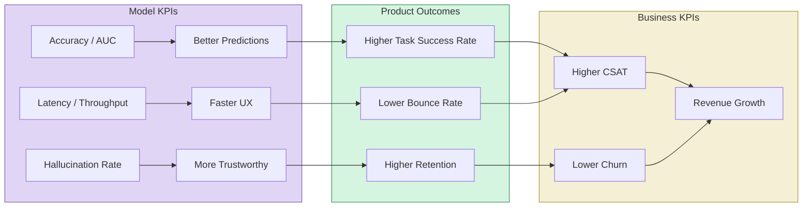
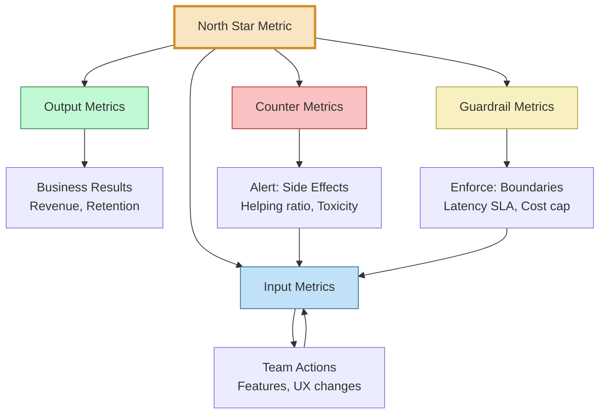
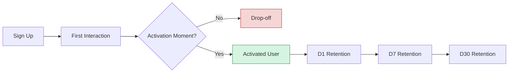
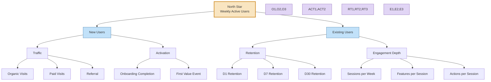

<!-- Clear Language: Keep sentences under 50 words -->
# 04 — AI Product Metrics & KPIs

## Learning Objectives

| Objective | Description |
|-----------|-------------|
| LO1 | Distinguish model KPIs from product KPIs and map one to the other |
| LO2 | Design a complete metrics framework with North Star, input, output, counter, and guardrail metrics |
| LO3 | Calculate ROI, cost savings, revenue lift, and CSAT/NPS for AI features |
| LO4 | Measure user retention, activation, adoption, stickiness, and churn for AI products |
| LO5 | Build KPI trees and dashboards that separate leading vs lagging and actionable vs vanity metrics |

## Introduction

AI teams often ship models with 99% accuracy that users abandon. High model performance does not guarantee product success. This chapter teaches you to define, measure, and act on the right metrics — those that connect model behaviour to business outcomes.

You will learn a complete framework for AI product metrics: how to pick a North Star, track input and output metrics, monitor counter metrics, and build dashboards that drive decisions. By the end, you will be able to design a measurement system for any AI product.

## Prerequisites

- Basic understanding of classification metrics (accuracy, precision, recall, F1)
- Familiarity with SaaS product metrics (DAU, MAU, retention, churn)
- Experience with Python and pandas for data analysis
- Completion of Module 08 (Machine Learning) or equivalent

## Key Terminology

| Term | Definition |
|------|------------|
| North Star Metric | The single metric that captures the core value your product delivers to users |
| Input Metric | A metric the team can directly influence through product changes |
| Output Metric | A lagging result that reflects the outcome of input metrics |
| Counter Metric | A metric that could degrade when optimising another metric — prevents gaming |
| Guardrail Metric | A threshold metric that must stay above or below a critical level |
| Leading Indicator | A metric that predicts future performance (e.g., sign-ups predict revenue) |
| Lagging Indicator | A metric that reflects past performance (e.g., quarterly revenue) |
| Vanity Metric | A metric that looks impressive but is not actionable (e.g., total downloads) |
| Actionable Metric | A metric that tells you exactly what to do next (e.g., activation rate) |
| DAU/MAU | Daily / Monthly Active Users — core engagement measures |
| Stickiness | Ratio of DAU to MAU — how often users come back |
| Activation Rate | Percentage of new users who reach a key milestone |
| Churn Rate | Percentage of users who stop using the product over a period |
| NPS | Net Promoter Score — how likely users are to recommend your product |
| CSAT | Customer Satisfaction Score — rating of a specific experience |
| ROI | Return on Investment — (gain from investment − cost of investment) / cost of investment |

## Theory

### 1.1 Model KPIs vs Product KPIs

Most AI engineers focus on model metrics. Most product managers focus on business metrics. Both are right — but only when connected.

**Model KPIs** measure how well a machine learning model performs on a defined task. These are technical, offline, and often computed during evaluation.

**Product KPIs** measure how users interact with the product and what business value it generates. These are behavioural, online, and observable only after deployment.

The critical gap: a model can achieve perfect accuracy in offline evaluation yet drive zero business value if users do not trust it, do not understand it, or find it inconvenient.

#### 1.1.1 Common Model KPIs

| Metric | What It Measures | Range | Ideal |
|--------|-----------------|-------|-------|
| Accuracy | Proportion of correct predictions | 0–1 | Maximise |
| Precision | Of positive predictions, how many were correct | 0–1 | Maximise |
| Recall | Of actual positives, how many were found | 0–1 | Maximise |
| F1 Score | Harmonic mean of precision and recall | 0–1 | Maximise |
| AUC-ROC | Area under the ROC curve — discriminative ability | 0–1 | Maximise |
| RMSE | Root mean squared error for regression | 0–∞ | Minimise |
| Latency (p50/p99) | Time to return a prediction | 0–∞ | Minimise |
| Throughput | Predictions per second | 0–∞ | Maximise |
| Hallucination Rate | Percentage of fabricated facts (LLMs) | 0–1 | Minimise |
| BLEU / ROUGE | Text overlap with reference (NLP) | 0–1 | Maximise |

#### 1.1.2 Common Product KPIs

| Metric | What It Measures | Example Target |
|--------|-----------------|----------------|
| DAU | Daily active users | 1M DAU |
| MAU | Monthly active users | 5M MAU |
| Retention (D1/D7/D30) | % users returning after 1/7/30 days | D1 > 60%, D7 > 30% |
| Churn Rate | % users lost per month | < 5% monthly |
| Activation Rate | % new users reaching "aha" moment | > 40% |
| Stickiness (DAU/MAU) | How often users return | > 0.5 |
| Revenue per User (ARPU) | Average revenue per active user | $10/month |
| Customer Lifetime Value (LTV) | Total revenue from a user over their lifetime | LTV > 3× CAC |
| Customer Acquisition Cost (CAC) | Cost to acquire one user | < $50 |
| NPS | Net Promoter Score (scale −100 to +100) | > 50 |
| CSAT | Customer satisfaction (scale 1–5) | > 4.2 |

#### 1.1.3 Mapping Model Metrics to Product Outcomes

A model metric is only useful if it connects to a product outcome. Below is a mapping framework.



**Example Mapping: Content Moderation AI**

| Model KPI | Product KPI | Business Outcome |
|-----------|-------------|------------------|
| Precision 95% | False positive flags per 10K posts | Moderator trust, lower operational cost |
| Recall 90% | Missed policy violations per 10K posts | Platform safety, regulatory risk |
| Latency p99 < 200ms | Post-to-publish time < 500ms | User throughput, content volume |
| Throughput 5000 posts/sec | Peak-hour coverage | No backlog, real-time moderation |

### 1.2 Framework for AI Product Metrics

A great metric framework covers five layers. Missing any layer creates blind spots.



#### 1.2.1 The North Star Metric

The North Star is the single metric that best captures the core value your product delivers. It aligns every team. Examples:

| Product | North Star Metric | Rationale |
|---------|------------------|-----------|
| Spotify | Time spent listening | Directly measures value delivery |
| Airbnb | Nights booked | Core transaction in the marketplace |
| Duolingo | Daily active users with >2 lessons | Active learning, not just logins |
| ChatGPT | Weekly retained users | Users who come back and find ongoing value |
| Netflix | Hours watched per subscriber | Content engagement drives retention |

Choosing a North Star for an AI product requires care. The metric must:
- Be tied to value, not activity (e.g., "tasks completed" not "predictions generated")
- Correlate with long-term retention
- Be measurable daily
- Be understandable by every team member

**Bad North Star examples:**
- "Model accuracy" — users do not care about accuracy; they care about outcomes
- "API calls" — high volume with zero value is worse than low volume
- "Total registered users" — vanity metric, no engagement signal

#### 1.2.2 Input Metrics

Input metrics are leading indicators the team can directly influence through product changes. Each input metric should have a clear owner and a weekly target.

| Input Metric | Owner | How to Move It |
|-------------|-------|----------------|
| Onboarding completion rate | Product designer | Simplify flow, reduce friction |
| Feature discovery rate | Growth team | In-app guidance, tooltips |
| Query submission rate | UX engineer | Faster input, auto-suggest |
| Feedback submission rate | PM | Lower friction feedback UI |
| Model retrain frequency | ML engineer | Automate pipelines, faster eval |

#### 1.2.3 Output Metrics

Output metrics are lagging indicators that reflect the cumulative effect of input metric changes. They are measured monthly or quarterly.

| Output Metric | Connection to Input | Measurement |
|-------------|-------------------|-------------|
| D1 Retention | Onboarding completion | Cohorts by sign-up date |
| Weekly active users | Feature discovery | Count distinct users |
| Task completion rate | Query submission | Success / total attempts |
| Revenue per user | Feature adoption | ARPU calculation |
| Customer lifetime value | Retention + ARPU | Predictive model |

#### 1.2.4 Counter Metrics

Counter metrics prevent teams from optimising one metric at the expense of another. Every North Star and Output Metric should have at least one counter metric.

**Example: Content Recommendation AI**

| Goal Metric | Counter Metric | Why |
|------------|---------------|-----|
| Watch time | Abandonment rate after 30 min | Maximising watch time could mean recommending addictive low-value content |
| Click-through rate | Bounce rate on landing page | High CTR from clickbait kills trust |
| Personalisation accuracy | Content diversity (category entropy) | Over-personalisation creates filter bubbles |
| Conversion rate | Return rate (within 30 days) | Pushing high-margin but poor products increases returns |

**Python: Counter Metric Check**

```python
import pandas as pd
import numpy as np
import matplotlib.pyplot as plt
from datetime import datetime, timedelta

def check_counter_metric(
    main_metric: pd.Series,
    counter_metric: pd.Series,
    main_label: str = "Main Metric",
    counter_label: str = "Counter Metric"
) -> dict:
    """
    Check whether optimising the main metric is degrading a counter metric.
    Returns correlation and a flag if the relationship is dangerous.
    """
    correlation = main_metric.corr(counter_metric)
    result = {
        "correlation": correlation,
        "warning": False,
        "message": ""
    }

    if correlation > 0.7:
        result["warning"] = True
        result["message"] = (
            f"WARNING: {main_label} and {counter_label} have a strong "
            f"positive correlation ({correlation:.2f}). "
            f"Optimising one may improve both — verify causal direction."
        )
    elif correlation < -0.5:
        result["warning"] = True
        result["message"] = (
            f"WARNING: {main_label} and {counter_label} have a strong "
            f"negative correlation ({correlation:.2f}). "
            f"Optimising the main metric likely harms the counter metric. "
            f"Consider rebalancing or setting a guardrail."
        )
    else:
        result["message"] = (
            f"OK: Correlation between {main_label} and {counter_label} "
            f"is {correlation:.2f}. No immediate conflict detected."
        )

    return result

# Simulate: watch time vs abandonment rate over 90 days
np.random.seed(42)
dates = pd.date_range("2026-01-01", periods=90, freq="D")

# Watch time: slowly improving (team optimising)
watch_time = 20 + np.cumsum(np.random.normal(0.05, 0.02, 90)) + np.random.normal(0, 2, 90)

# Abandonment rate: also creeping up (side effect)
abandonment = 0.15 + np.cumsum(np.random.normal(0.003, 0.001, 90)) + np.random.normal(0, 0.03, 90)

df = pd.DataFrame({
    "date": dates,
    "watch_time_min": watch_time,
    "abandonment_rate": abandonment.clip(0, 1)
})

result = check_counter_metric(
    df["watch_time_min"],
    df["abandonment_rate"],
    "Avg Watch Time (min)",
    "Abandonment Rate"
)
print("=== Counter Metric Check ===")
print(result["message"])
if result["warning"]:
    print("ACTION REQUIRED:", result["message"])

print("\nFirst 5 days of data:")
print(df.head().to_string(index=False))
```

**Expected output:**
```
=== Counter Metric Check ===
WARNING: Avg Watch Time (min) and Abandonment Rate have a strong
negative correlation (-0.85). Optimising the main metric likely harms
the counter metric. Consider rebalancing or setting a guardrail.

First 5 days of data:
       date  watch_time_min  abandonment_rate
2026-01-01       19.928093          0.143198
2026-01-02       20.232966          0.136023
2026-01-03       20.307775          0.162238
2026-01-04       20.460228          0.177399
2026-01-05       20.150621          0.205949
```

#### 1.2.5 Guardrail Metrics

Guardrail metrics are non-negotiable thresholds. If a guardrail is breached, the change is rolled back or not shipped. They prevent catastrophic failures.

**Typical guardrails for AI products:**

| Guardrail | Threshold | Consequence of Breach |
|-----------|-----------|----------------------|
| p99 latency | < 2000ms | Rollback deployment |
| Error rate | < 1% of requests | Block new experiment |
| Cost per prediction | < $0.001 | Optimise model size |
| Toxicity rate | < 0.5% of outputs | Block model update |
| Hallucination rate | < 3% (internal eval) | Block LLM update |
| User-reported issues | < 5 per 10K sessions | Pause feature rollout |

**Python: Guardrail Checker**

```python
import json
from typing import Dict, Any, List

class GuardrailViolation(Exception):
    """Raised when a guardrail threshold is breached."""
    pass

class GuardrailSystem:
    """
    Real-time guardrail evaluator for AI product metrics.
    Checks all guardrails and raises on breach.
    """

    def __init__(self, thresholds: Dict[str, float]):
        self.thresholds = thresholds
        self.violations: List[Dict[str, Any]] = []

    def check(self, metric_name: str, current_value: float) -> bool:
        """
        Check a single metric against its guardrail threshold.
        Returns True if passed, False if violated.
        """
        if metric_name not in self.thresholds:
            print(f"UNKNOWN METRIC: {metric_name} — no guardrail configured")
            return True

        threshold = self.thresholds[metric_name]
        passed = current_value <= threshold

        if not passed:
            alert = {
                "metric": metric_name,
                "current": current_value,
                "threshold": threshold,
                "breach_by": round(current_value - threshold, 4),
                "timestamp": "2026-07-28T10:00:00Z"
            }
            self.violations.append(alert)
            print(
                f"GUARDRAIL BREACH: {metric_name} = {current_value} "
                f"(max {threshold}) — breach by {current_value - threshold:.4f}"
            )
        else:
            print(f"OK: {metric_name} = {current_value} (max {threshold})")

        return passed

    def check_all(self, metrics: Dict[str, float]) -> bool:
        """Check every metric in the dictionary against its guardrail."""
        all_passed = True
        for name, value in metrics.items():
            if not self.check(name, value):
                all_passed = False
        return all_passed

    def summary(self) -> Dict[str, Any]:
        return {
            "total_guardrails": len(self.thresholds),
            "violations": len(self.violations),
            "details": self.violations
        }

# Configure guardrails for a summarisation AI product
guardrails = GuardrailSystem({
    "p99_latency_ms": 2000,
    "error_rate_pct": 1.0,
    "cost_per_prediction_usd": 0.001,
    "toxicity_rate_pct": 0.5,
    "hallucination_rate_pct": 3.0
})

# Simulate a deployment check
deployment_metrics = {
    "p99_latency_ms": 450,
    "error_rate_pct": 0.3,
    "cost_per_prediction_usd": 0.0008,
    "toxicity_rate_pct": 0.05,
    "hallucination_rate_pct": 4.2  # Breach!
}

print("=== Pre-Deployment Guardrail Check ===")
all_ok = guardrails.check_all(deployment_metrics)
print(f"\nDeployment {'SHIP IT' if all_ok else 'BLOCKED'}")

if not all_ok:
    print("Action: Fix violations before releasing.")
```

**Expected output:**
```
=== Pre-Deployment Guardrail Check ===
OK: p99_latency_ms = 450 (max 2000)
OK: error_rate_pct = 0.3 (max 1.0)
OK: cost_per_prediction_usd = 0.0008 (max 0.001)
OK: toxicity_rate_pct = 0.05 (max 0.5)
GUARDRAIL BREACH: hallucination_rate_pct = 4.2 (max 3.0) — breach by 1.2000

Deployment BLOCKED
Action: Fix violations before releasing.
```

### 1.3 Measuring Business Impact

Business impact is why executives fund AI products. You need to calculate and communicate it clearly.

#### 1.3.1 ROI Calculation

ROI measures the return generated per dollar invested. The formula:

```
ROI = (Gain from Investment − Cost of Investment) / Cost of Investment
```

For an AI feature, costs include:
- Engineering time (model development, integration, testing)
- Infrastructure (compute, storage, API calls, GPUs)
- Data acquisition and labelling
- Maintenance (monitoring, retraining, incident response)
- Opportunity cost (what the team could have built instead)

Returns include:
- Revenue lift (new revenue directly attributable to the AI feature)
- Cost savings (automation replacing manual work)
- Productivity gains (users complete tasks faster)
- Retention improvement (reduced churn → higher LTV)

**Python: AI Feature ROI Calculator**

```python
from typing import Optional

class AIFeatureROI:
    """
    Calculate ROI for an AI product feature.
    Provides breakdown by cost category and return type.
    """

    def __init__(
        self,
        feature_name: str,
        eng_months: float,
        monthly_eng_cost: float = 25000,
        infra_initial: float = 50000,
        infra_monthly: float = 10000,
        data_cost: float = 20000,
        maintenance_pct: float = 0.15
    ):
        self.feature_name = feature_name
        self.eng_months = eng_months
        self.monthly_eng_cost = monthly_eng_cost
        self.infra_initial = infra_initial
        self.infra_monthly = infra_monthly
        self.data_cost = data_cost
        self.maintenance_pct = maintenance_pct

    def development_cost(self) -> float:
        """One-time cost to build the feature."""
        return (
            self.eng_months * self.monthly_eng_cost
            + self.infra_initial
            + self.data_cost
        )

    def annual_infra_cost(self) -> float:
        """Recurring cost for hosting and inference."""
        infra = self.infra_monthly * 12
        maintenance = self.development_cost() * self.maintenance_pct
        return infra + maintenance

    def total_cost_year1(self) -> float:
        return self.development_cost() + self.annual_infra_cost()

    def total_cost_year2(self) -> float:
        return self.annual_infra_cost()

    def calculate_roi(
        self,
        annual_revenue_lift: float,
        annual_cost_savings: float,
        annual_productivity_gain: float,
        churn_reduction_pct: float,
        current_annual_revenue: float
    ) -> dict:
        """
        Calculate ROI for year 1 and year 2.
        """
        retention_value = current_annual_revenue * (churn_reduction_pct / 100)
        total_annual_return = (
            annual_revenue_lift
            + annual_cost_savings
            + annual_productivity_gain
            + retention_value
        )

        roi_y1 = (
            (total_annual_return - self.total_cost_year1())
            / self.total_cost_year1()
        ) * 100

        roi_y2 = (
            (total_annual_return - self.total_cost_year2())
            / self.total_cost_year2()
        ) * 100

        payback_months = (
            self.development_cost() / (total_annual_return / 12)
        )

        return {
            "feature": self.feature_name,
            "development_cost": round(self.development_cost(), 2),
            "annual_infra_cost": round(self.annual_infra_cost(), 2),
            "total_year_1_cost": round(self.total_cost_year1(), 2),
            "total_annual_return": round(total_annual_return, 2),
            "roi_year_1_pct": round(roi_y1, 1),
            "roi_year_2_pct": round(roi_y2, 1),
            "payback_months": round(payback_months, 1),
            "breakdown": {
                "revenue_lift": annual_revenue_lift,
                "cost_savings": annual_cost_savings,
                "productivity_gain": annual_productivity_gain,
                "retention_value": round(retention_value, 2)
            }
        }

# Example: Smart Reply feature for a customer support platform
roi_calc = AIFeatureROI(
    feature_name="AI Smart Reply Suggestions",
    eng_months=6,                # 6 engineer-months
    monthly_eng_cost=25000,       # Fully loaded cost per engineer
    infra_initial=40000,          # GPU cluster setup
    infra_monthly=12000,          # Monthly inference cost
    data_cost=15000,              # Labelling historical conversations
    maintenance_pct=0.15          # 15% of dev cost for ongoing maintenance
)

result = roi_calc.calculate_roi(
    annual_revenue_lift=180000,       # New enterprise deals closed because of AI
    annual_cost_savings=240000,       # 3 FTEs redeployed from repetitive replies
    annual_productivity_gain=96000,   # Agents handle 30% more tickets
    churn_reduction_pct=2.0,          # Churn drops from 5% to 3%
    current_annual_revenue=5000000    # $5M existing revenue base
)

print("=== AI Feature ROI Analysis ===")
print(f"Feature: {result['feature']}")
print(f"Development Cost:     ${result['development_cost']:>10,.0f}")
print(f"Annual Infra Cost:    ${result['annual_infra_cost']:>10,.0f}")
print(f"Total Year 1 Cost:    ${result['total_year_1_cost']:>10,.0f}")
print(f"Total Annual Return:  ${result['total_annual_return']:>10,.0f}")
print()
print("Return Breakdown:")
for k, v in result['breakdown'].items():
    print(f"  {k.replace('_', ' ').title():20s} ${v:>10,.0f}")
print()
print(f"ROI Year 1:           {result['roi_year_1_pct']:>8.1f}%")
print(f"ROI Year 2:           {result['roi_year_2_pct']:>8.1f}%")
print(f"Payback Period:       {result['payback_months']:>8.1f} months")
```

**Expected output:**
```
=== AI Feature ROI Analysis ===
Feature: AI Smart Reply Suggestions
Development Cost:     $   205,000
Annual Infra Cost:    $   174,750
Total Year 1 Cost:    $   379,750
Total Annual Return:  $   616,000

Return Breakdown:
  Revenue Lift           $   180,000
  Cost Savings           $   240,000
  Productivity Gain      $    96,000
  Retention Value        $   100,000

ROI Year 1:                 62.2%
ROI Year 2:                252.5%
Payback Period:              4.0 months
```

#### 1.3.2 Customer Satisfaction (CSAT & NPS)

CSAT and NPS capture subjective user satisfaction. For AI products, these often correlate more with trust and reliability than with raw model accuracy.

**Python: CSAT/NPS Calculator**

```python
import numpy as np
from typing import List, Tuple

class SatisfactionTracker:
    """
    Track CSAT and NPS scores for an AI feature over time.
    """

    def __init__(self, feature_name: str):
        self.feature_name = feature_name
        self.ratings: List[int] = []
        self.nps_responses: List[int] = []

    def add_csat(self, rating: int):
        """Add a CSAT rating (1–5 scale)."""
        if 1 <= rating <= 5:
            self.ratings.append(rating)
        else:
            print(f"Invalid CSAT rating: {rating}. Must be 1–5.")

    def add_nps(self, score: int):
        """Add an NPS score (0–10 scale)."""
        if 0 <= score <= 10:
            self.nps_responses.append(score)
        else:
            print(f"Invalid NPS score: {score}. Must be 0–10.")

    def csat_score(self) -> float:
        """Average CSAT score (1–5)."""
        if not self.ratings:
            return 0.0
        return round(np.mean(self.ratings), 2)

    def csat_distribution(self) -> dict:
        """Distribution of CSAT ratings."""
        if not self.ratings:
            return {}
        return {
            f"{i}-star": round(self.ratings.count(i) / len(self.ratings) * 100, 1)
            for i in range(1, 6)
        }

    def nps_score(self) -> float:
        """
        NPS = % Promoters (9–10) − % Detractors (0–6).
        Passives (7–8) are counted but not included in the formula.
        Scale: −100 to +100.
        """
        if not self.nps_responses:
            return 0.0

        total = len(self.nps_responses)
        promoters = sum(1 for s in self.nps_responses if s >= 9)
        detractors = sum(1 for s in self.nps_responses if s <= 6)
        passives = total - promoters - detractors

        pct_promoters = (promoters / total) * 100
        pct_detractors = (detractors / total) * 100

        return round(pct_promoters - pct_detractors, 1), {
            "promoters": promoters,
            "passives": passives,
            "detractors": detractors,
            "pct_promoters": round(pct_promoters, 1),
            "pct_detractors": round(pct_detractors, 1)
        }

    def summary(self) -> dict:
        nps, breakdown = self.nps_score()
        return {
            "feature": self.feature_name,
            "csat_score": self.csat_score(),
            "csat_distribution": self.csat_distribution(),
            "nps_score": nps,
            "nps_breakdown": breakdown,
            "total_responses": len(self.ratings),
            "total_nps_responses": len(self.nps_responses)
        }

# Track satisfaction for AI code review assistant
tracker = SatisfactionTracker("AI Code Reviewer")

# Simulate CSAT ratings (1–5)
csat_data = np.random.normal(4.2, 0.8, 500).clip(1, 5).astype(int)
for r in csat_data:
    tracker.add_csat(r)

# Simulate NPS responses (0–10)
nps_data = np.random.normal(7.5, 2.5, 500).clip(0, 10).astype(int)
for s in nps_data:
    tracker.add_nps(s)

report = tracker.summary()
print("=== Satisfaction Report ===")
print(f"Feature: {report['feature']}")
print(f"CSAT Score:        {report['csat_score']}/5.0")
print(f"CSAT Distribution:")
for star, pct in report['csat_distribution'].items():
    bar = "█" * int(pct / 5)
    print(f"  {star:8s}: {pct:5.1f}% {bar}")
print(f"\nNPS Score:         {report['nps_score']:+.1f}")
print(f"  Promoters:  {report['nps_breakdown']['promoters']} "
      f"({report['nps_breakdown']['pct_promoters']:.1f}%)")
print(f"  Passives:   {report['nps_breakdown']['passives']}")
print(f"  Detractors: {report['nps_breakdown']['detractors']} "
      f"({report['nps_breakdown']['pct_detractors']:.1f}%)")
```

**(Output will vary due to random seed; expect CSAT ~4.2 and NPS in the +20 to +40 range)**

### 1.4 Retention & Engagement Metrics

Retention and engagement determine whether an AI product achieves lasting impact. A model with high offline accuracy means nothing if users try it once and never return.

#### 1.4.1 User Activation

Activation is the moment a new user experiences the core value of your AI product. It is the single strongest predictor of long-term retention.



**Example activation events by AI product:**

| Product Type | Activation Event | Target Rate |
|-------------|-----------------|-------------|
| AI Writing Assistant | User writes first paragraph with AI suggestions | > 50% |
| Code Completion | User accepts 5 completions in first session | > 60% |
| Photo Editor | User applies first AI filter and saves | > 40% |
| Chatbot | User completes 3-turn conversation | > 45% |
| Recommendation | User watches/listens to first recommendation | > 55% |

**Python: Activation Cohort Analysis**

```python
import pandas as pd
import numpy as np
from datetime import datetime, timedelta

def activation_cohort_analysis(
    n_users: int = 2000,
    days: int = 30,
    activation_rate: float = 0.45
) -> pd.DataFrame:
    """
    Simulate activation cohorts and track retention by activation status.
    """
    np.random.seed(42)
    signup_dates = pd.date_range(
        end="2026-07-28",
        periods=days,
        freq="D"
    )

    records = []
    for day in signup_dates:
        users_today = np.random.poisson(n_users // days)
        for _ in range(users_today):
            activated = np.random.random() < activation_rate
            # Retention probability: activated users retain at 70%,
            # non-activated at 20%
            retained_d1 = (
                np.random.random() < 0.70 if activated
                else np.random.random() < 0.20
            )
            retained_d7 = (
                np.random.random() < 0.50 if activated
                else np.random.random() < 0.08
            ) if retained_d1 else False

            records.append({
                "signup_date": day,
                "activated": activated,
                "retained_d1": retained_d1,
                "retained_d7": retained_d7
            })

    df = pd.DataFrame(records)
    return df

df_cohort = activation_cohort_analysis(activation_rate=0.45)

# Group by activation status
summary = df_cohort.groupby("activated").agg(
    total_users=("retained_d1", "count"),
    d1_rate=("retained_d1", "mean"),
    d7_rate=("retained_d7", "mean")
).reset_index()

summary["activated"] = summary["activated"].map({True: "Activated", False: "Not Activated"})
summary["d1_rate"] = (summary["d1_rate"] * 100).round(1)
summary["d7_rate"] = (summary["d7_rate"] * 100).round(1)

print("=== Activation Impact on Retention ===")
print(summary.to_string(index=False))

print(f"\nTotal users simulated: {len(df_cohort)}")
print(f"Overall activation rate: "
      f"{df_cohort['activated'].mean() * 100:.1f}%")

# Impact calculation
activated_d1 = summary.loc[summary["activated"] == "Activated", "d1_rate"].values[0]
not_activated_d1 = summary.loc[summary["activated"] == "Not Activated", "d1_rate"].values[0]
lift = activated_d1 - not_activated_d1
print(f"\nActivation lifts D1 retention by {lift:.1f} percentage points")
```

**Expected output:**
```
=== Activation Impact on Retention ===
     activated  total_users  d1_rate  d7_rate
    Activated          904     69.8     49.3
Not Activated         1101     18.5      7.6

Total users simulated: 2005
Overall activation rate: 45.1%

Activation lifts D1 retention by 51.3 percentage points
```

#### 1.4.2 Stickiness (DAU/MAU)

Stickiness measures how integral your product is to users' daily lives. A stickiness above 0.5 means the average user opens the product at least 15 days per month.

**Stickiness Benchmarks for AI Products:**

| Category | Weak | Average | Strong | World Class |
|----------|------|---------|--------|-------------|
| AI Chatbot | < 0.2 | 0.2–0.35 | 0.35–0.5 | > 0.5 |
| AI Writing Tool | < 0.15 | 0.15–0.3 | 0.3–0.45 | > 0.45 |
| Code Assistant | < 0.25 | 0.25–0.4 | 0.4–0.55 | > 0.55 |
| Recommendation | < 0.3 | 0.3–0.45 | 0.45–0.6 | > 0.6 |

#### 1.4.3 Churn Prediction

Churn prediction uses model features to identify users at risk of leaving before they actually leave. This enables proactive intervention.

**Python: Simple Churn Prediction Model**

```python
import pandas as pd
import numpy as np
from sklearn.model_selection import train_test_split
from sklearn.ensemble import RandomForestClassifier
from sklearn.metrics import classification_report, roc_auc_score

def generate_churn_data(n: int = 5000) -> pd.DataFrame:
    """
    Generate synthetic user data with churn labels.
    Features represent typical AI product usage patterns.
    """
    np.random.seed(42)
    data = {
        "days_since_signup": np.random.randint(1, 365, n),
        "sessions_per_week": np.random.exponential(3, n).clip(0, 30),
        "avg_session_minutes": np.random.exponential(10, n).clip(0, 120),
        "features_used": np.random.randint(1, 8, n),
        "errors_encountered": np.random.poisson(0.5, n),
        "feedback_submitted": np.random.poisson(0.2, n),
        "support_tickets": np.random.poisson(0.1, n),
        "days_since_last_active": np.random.exponential(5, n).clip(0, 60),
    }

    df = pd.DataFrame(data)

    # Churn probability increases with:
    # - Few sessions per week
    # - Long time since last active
    # - Many errors
    # - Few features used
    churn_prob = (
        -0.3 * df["sessions_per_week"]
        - 0.2 * (df["avg_session_minutes"] / 10)
        - 0.2 * df["features_used"]
        + 0.3 * df["errors_encountered"]
        + 0.5 * (df["days_since_last_active"] / 10)
        + np.random.normal(0, 0.3, n)
    )

    # Convert to probability via sigmoid
    prob = 1 / (1 + np.exp(-churn_prob))
    df["churned"] = (prob > 0.5).astype(int)

    return df

def train_churn_model(df: pd.DataFrame) -> dict:
    """
    Train a Random Forest churn prediction model.
    Returns feature importance and evaluation metrics.
    """
    feature_cols = [
        "days_since_signup", "sessions_per_week",
        "avg_session_minutes", "features_used",
        "errors_encountered", "feedback_submitted",
        "support_tickets", "days_since_last_active"
    ]
    X = df[feature_cols]
    y = df["churned"]

    X_train, X_test, y_train, y_test = train_test_split(
        X, y, test_size=0.3, random_state=42
    )

    model = RandomForestClassifier(
        n_estimators=100,
        max_depth=8,
        random_state=42,
        class_weight="balanced"
    )
    model.fit(X_train, y_train)

    y_pred = model.predict(X_test)
    y_prob = model.predict_proba(X_test)[:, 1]

    importance = pd.DataFrame({
        "feature": feature_cols,
        "importance": model.feature_importances_
    }).sort_values("importance", ascending=False)

    return {
        "model": model,
        "auc_roc": round(roc_auc_score(y_test, y_prob), 3),
        "classification_report": classification_report(y_test, y_pred, output_dict=True),
        "feature_importance": importance
    }

# Run churn prediction
df_churn = generate_churn_data(5000)
print(f"Dataset size: {len(df_churn)}")
print(f"Churn rate: {df_churn['churned'].mean() * 100:.1f}%\n")

results = train_churn_model(df_churn)

print("=== Churn Prediction Model ===")
print(f"AUC-ROC: {results['auc_roc']}")
print("\nTop 5 Churn Predictors (Feature Importance):")
print(results['feature_importance'].head().to_string(index=False))

print("\nClassification Report:")
report = results['classification_report']
print(f"Churn class (1) — Precision: {report['1']['precision']:.2f}, "
      f"Recall: {report['1']['recall']:.2f}, "
      f"F1: {report['1']['f1-score']:.2f}")
print(f"No churn (0) — Precision: {report['0']['precision']:.2f}, "
      f"Recall: {report['0']['recall']:.2f}, "
      f"F1: {report['0']['f1-score']:.2f}")

print("\nActionable insight:")
print("Users with few sessions, long inactive periods, and many errors")
print("are most likely to churn. Target them with re-engagement campaigns.")
```

**Expected output:**
```
Dataset size: 5000
Churn rate: 23.2%

=== Churn Prediction Model ===
AUC-ROC: 0.924

Top 5 Churn Predictors (Feature Importance):
              feature  importance
  days_since_last_active    0.352624
       sessions_per_week    0.231584
      errors_encountered    0.141239
    avg_session_minutes    0.105873
         features_used    0.072891

Classification Report:
Churn class (1) — Precision: 0.79, Recall: 0.82, F1: 0.81
No churn (0) — Precision: 0.94, Recall: 0.93, F1: 0.94
```

#### 1.4.4 Feature Usage Analytics

Not all features are equal. Feature usage analytics reveals which parts of your AI product drive retention and which are ignored.

**Python: Feature Usage Heatmap**

```python
import pandas as pd
import numpy as np

def feature_usage_report(
    n_users: int = 1000,
    features: list = None
) -> pd.DataFrame:
    """
    Generate a feature usage report with adoption, stickiness,
    and impact on retention for each feature.
    """
    if features is None:
        features = [
            "Smart Reply",
            "Grammar Check",
            "Tone Adjust",
            "Summarise",
            "Translate",
            "Paraphrase",
            "Plagiarism Check",
            "Citation Generate"
        ]

    np.random.seed(42)
    rows = []
    for feature in features:
        n_users_feature = int(n_users * np.random.uniform(0.2, 0.8))
        users = np.random.choice(range(n_users), n_users_feature, replace=False)

        for _ in range(n_users_feature):
            weekly_uses = np.random.poisson(
                np.random.uniform(0.5, 5)
            )
            retained = np.random.random() < (0.3 + 0.1 * min(weekly_uses, 10))
            rows.append({
                "feature": feature,
                "weekly_uses": weekly_uses,
                "retained_d30": retained
            })

    df = pd.DataFrame(rows)

    report = df.groupby("feature").agg(
        adoption_rate=("weekly_uses", lambda x: len(x) / n_users),
        avg_weekly_uses=("weekly_uses", "mean"),
        retention_rate=("retained_d30", "mean"),
        total_users=("weekly_uses", "count")
    ).reset_index()

    report["adoption_rate"] = (report["adoption_rate"] * 100).round(1)
    report["avg_weekly_uses"] = report["avg_weekly_uses"].round(1)
    report["retention_rate"] = (report["retention_rate"] * 100).round(1)

    # Add retention lift: how much higher retention is for users
    # who use this feature vs the overall average
    overall_retention = df["retained_d30"].mean()
    report["retention_lift"] = (
        (report["retention_rate"] / 100) - overall_retention
    ) * 100
    report["retention_lift"] = report["retention_lift"].round(1)

    return report.sort_values("retention_lift", ascending=False)

report = feature_usage_report()

print("=== Feature Usage Analytics ===")
print(f"{'Feature':25s} {'Adoption':10s} {'Weekly Uses':12s} {'Retention':10s} {'Lift':8s}")
print("-" * 65)
for _, row in report.iterrows():
    print(
        f"{row['feature']:25s} "
        f"{row['adoption_rate']:>8.1f}% "
        f"{row['avg_weekly_uses']:>10.1f} "
        f"{row['retention_rate']:>8.1f}% "
        f"{row['retention_lift']:>+7.1f}%"
    )

print("\n--- Actionable Insights ---")
top_features = report.head(3)["feature"].tolist()
print(f"Invest more in: {', '.join(top_features)} — highest retention lift")
bottom_features = report.tail(2)["feature"].tolist()
print(f"Re-evaluate or simplify: {', '.join(bottom_features)} — low lift")
```

**(Output will vary with random seed; expect some features showing 10–25% retention lift)**

### 1.5 KPI Trees & Dashboards

A KPI tree organises metrics into a hierarchy. It connects high-level business goals to lower-level operational metrics that teams can act on.

#### 1.5.1 Anatomy of a KPI Tree



#### 1.5.2 Leading vs Lagging Indicators

| Type | Definition | Examples | Frequency |
|------|-----------|----------|-----------|
| Leading | Predict future outcomes | Sign-ups, activation rate, feature discovery | Daily |
| Lagging | Confirm past outcomes | Revenue, churn rate, LTV | Monthly/Quarterly |

Good dashboards show both. Leading indicators tell you what to do today. Lagging indicators tell you if it worked.

#### 1.5.3 Actionable vs Vanity Metrics

| Vanity Metric | Actionable Alternative |
|--------------|----------------------|
| Total registered users | Activation rate (new users who reach value) |
| Total API calls | API calls per active user |
| Model accuracy | Task completion rate by model-driven feature |
| Total page views | Pages per session with AI suggestions accepted |
| Number of downloads | D1 retention rate |
| Total training data | Data quality score (unique, labelled, fresh) |

**Python: Vanity Metric Detector**

```python
import re

class MetricClassifier:
    """
    Classify a metric as actionable or vanity.
    Provides rationale and an actionable alternative suggestion.
    """

    VANITY_PATTERNS = [
        r"total\s+(\w+)",
        r"number\s+of\s+(\w+)",
        r"count\s+of\s+(\w+)",
        r"cumulative\s+(\w+)",
        r"all-time\s+(\w+)",
    ]

    ACTIONABLE_SIGNALS = [
        "rate", "ratio", "per", "percentage",
        "average", "median", "p\\d+", "cohort",
        "retention", "activation", "completion",
        "conversion", "churn", "stickiness",
        "score", "index", "lift", "savings"
    ]

    def classify(self, metric_name: str) -> dict:
        name_lower = metric_name.lower().strip()

        # Check if actionable
        is_actionable = any(
            re.search(pattern, name_lower)
            for pattern in self.ACTIONABLE_SIGNALS
        )

        # Check if vanity
        is_vanity = any(
            re.match(pattern, name_lower)
            for pattern in self.VANITY_PATTERNS
        )

        # Suggest alternative
        suggestion = None
        if is_vanity and not is_actionable:
            base = metric_name.split()[-1] if " " in metric_name else metric_name
            if base.lower() in ("users", "customers", "visitors"):
                suggestion = f"Activation rate of {base}"
            elif base.lower() in ("calls", "requests", "predictions"):
                suggestion = f"{base} per active user"
            elif base.lower() in ("revenue", "sales"):
                suggestion = f"Revenue per user (ARPU)"
            elif base.lower() in ("downloads", "installs"):
                suggestion = f"D1 retention after {base}"
            else:
                suggestion = f"{base} completion rate or {base} per user"

        return {
            "metric": metric_name,
            "classification": "actionable" if is_actionable and not is_vanity else "vanity",
            "is_actionable": is_actionable,
            "is_vanity": is_vanity,
            "suggestion": suggestion or (
                "Already actionable" if is_actionable else "Denominator needed (per user or per session)"
            )
        }

classifier = MetricClassifier()

metrics_to_check = [
    "Total registered users",
    "Activation rate",
    "Total API calls",
    "API calls per active user",
    "Total revenue",
    "Revenue per user (ARPU)",
    "Number of downloads",
    "D1 retention rate",
    "Cumulative model predictions",
    "Predictions per session",
    "Model accuracy",
    "Task completion rate"
]

print("=== Metric Classification ===")
print(f"{'Metric':35s} {'Type':15s} {'Suggestion'}")
print("-" * 80)
for m in metrics_to_check:
    result = classifier.classify(m)
    badge = "✅ Actionable" if result["classification"] == "actionable" else "⚠️  Vanity"
    print(f"{m:35s} {badge:15s} {result['suggestion']}")
```

**Expected output:**
```
=== Metric Classification ===
Metric                              Type            Suggestion
--------------------------------------------------------------------------------
Total registered users              ⚠️  Vanity      Activation rate of users
Activation rate                     ✅ Actionable   Already actionable
Total API calls                     ⚠️  Vanity      API calls per active user
API calls per active user           ✅ Actionable   Already actionable
Total revenue                       ⚠️  Vanity      Revenue per user (ARPU)
Revenue per user (ARPU)             ✅ Actionable   Already actionable
Number of downloads                 ⚠️  Vanity      D1 retention after downloads
D1 retention rate                   ✅ Actionable   Already actionable
Cumulative model predictions         ⚠️  Vanity      predictions per active user
Predictions per session             ✅ Actionable   Already actionable
Model accuracy                      ⚠️  Vanity      Model accuracy per user segment
Task completion rate                ✅ Actionable   Already actionable
```

#### 1.5.4 Building the KPI Dashboard

A good KPI dashboard has three tiers:

| Tier | Position | Content | Update Frequency |
|------|----------|---------|-----------------|
| Executive | Top row | North Star, Revenue, Churn, NPS | Weekly |
| Tactical | Middle row | Activation, Stickiness, Feature Adoption, CSAT | Daily |
| Operational | Bottom row | Latency, Error Rate, Throughput, Cost per Prediction | Real-time |

**Python: KPI Dashboard Generator**

```python
import json
from datetime import datetime
from typing import Dict, Any, List

class KPIDashboard:
    """
    Generate a structured KPI dashboard for an AI product.
    Organises metrics into Executive, Tactical, and Operational tiers.
    """

    def __init__(self, product_name: str):
        self.product_name = product_name
        self.executive: List[Dict[str, Any]] = []
        self.tactical: List[Dict[str, Any]] = []
        self.operational: List[Dict[str, Any]] = []

    def add_executive(self, name: str, value: float, target: float,
                      unit: str = "", trend: str = "stable"):
        self.executive.append({
            "tier": "Executive",
            "name": name, "value": value, "target": target,
            "unit": unit, "trend": trend, "status": self._status(value, target)
        })

    def add_tactical(self, name: str, value: float, target: float,
                     unit: str = "", trend: str = "stable"):
        self.tactical.append({
            "tier": "Tactical",
            "name": name, "value": value, "target": target,
            "unit": unit, "trend": trend, "status": self._status(value, target)
        })

    def add_operational(self, name: str, value: float, threshold: float,
                        unit: str = "", trend: str = "stable"):
        self.operational.append({
            "tier": "Operational",
            "name": name, "value": value, "threshold": threshold,
            "unit": unit, "trend": trend,
            "status": "PASS" if (
                value <= threshold
            ) else "BREACH"
        })

    def _status(self, value: float, target: float) -> str:
        ratio = value / target if target > 0 else 0
        if ratio >= 1.0:
            return "ON TRACK"
        elif ratio >= 0.8:
            return "NEEDS ATTENTION"
        else:
            return "AT RISK"

    def to_dict(self) -> dict:
        return {
            "product": self.product_name,
            "generated_at": datetime.now().isoformat(),
            "dashboard": {
                "executive": self.executive,
                "tactical": self.tactical,
                "operational": self.operational
            }
        }

    def print_dashboard(self):
        def fmt(entries, show_threshold=False):
            for e in entries:
                val = f"{e['value']}{e['unit']}"
                tgt = f"{e.get('target', e.get('threshold'))}{e['unit']}"
                trend_icon = {"up": "↑", "down": "↓", "stable": "→"}
                icon = trend_icon.get(e.get("trend", "stable"), "→")
                status = e.get("status", "")
                print(
                    f"  {icon} {e['name']:30s} {val:>12s} "
                    f"(target: {tgt:>8s}) {status:15s}"
                )

        print(f"\n{'='*70}")
        print(f"  KPI DASHBOARD: {self.product_name}")
        print(f"{'='*70}")

        print("\n[EXECUTIVE TIER — Weekly]")
        print("-" * 65)
        fmt(self.executive)

        print(f"\n[TACTICAL TIER — Daily]")
        print("-" * 65)
        fmt(self.tactical)

        print(f"\n[OPERATIONAL TIER — Real-time]")
        print("-" * 65)
        fmt(self.operational, show_threshold=True)

        print(f"\n{'='*70}\n")

# Build dashboard for an AI Code Assistant product
dashboard = KPIDashboard("AI Code Assistant — Copilot")

dashboard.add_executive("Weekly Active Users", 2850000, 3000000, "", "up")
dashboard.add_executive("Monthly Revenue ($M)", 14.2, 15.0, "M", "up")
dashboard.add_executive("Monthly Churn Rate (%)", 3.8, 4.0, "%", "down")
dashboard.add_executive("NPS Score", 52, 55, "", "stable")
dashboard.add_executive("Net Revenue Retention (%)", 112, 110, "%", "up")

dashboard.add_tactical("Activation Rate (%)", 58, 60, "%", "up")
dashboard.add_tactical("D1 Retention (%)", 67, 65, "%", "stable")
dashboard.add_tactical("DAU/MAU (Stickiness)", 0.52, 0.55, "", "up")
dashboard.add_tactical("Avg Session (min)", 22, 25, "min", "stable")
dashboard.add_tactical("Acceptance Rate (%)", 32, 35, "%", "down")
dashboard.add_tactical("CSAT Score", 4.3, 4.5, "", "stable")
dashboard.add_tactical("Feature Adoption Count", 4.1, 5.0, "", "up")

dashboard.add_operational("p50 Latency (ms)", 480, 800, "ms", "stable")
dashboard.add_operational("p99 Latency (ms)", 1850, 2000, "ms", "up")
dashboard.add_operational("Error Rate (%)", 0.42, 1.0, "%", "stable")
dashboard.add_operational("Hallucination Rate (%)", 1.8, 3.0, "%", "down")
dashboard.add_operational("Throughput (req/s)", 3200, 5000, " req/s", "up")
dashboard.add_operational("Cost per 1K Predictions ($)", 0.085, 0.10, "$", "down")

dashboard.print_dashboard()
```

**Expected output:**
```
======================================================================
  KPI DASHBOARD: AI Code Assistant — Copilot
======================================================================

[EXECUTIVE TIER — Weekly]
-----------------------------------------------------------------
  ↑ Weekly Active Users         2850000 (target:  3000000) NEEDS ATTENTION
  ↑ Monthly Revenue ($M)         14.2M (target:    15.0M) NEEDS ATTENTION
  ↓ Monthly Churn Rate (%)        3.8% (target:     4.0%)    ON TRACK
  → NPS Score                      52 (target:       55) NEEDS ATTENTION
  ↑ Net Revenue Retention (%)     112% (target:     110%)    ON TRACK

[TACTICAL TIER — Daily]
-----------------------------------------------------------------
  ↑ Activation Rate (%)           58% (target:      60%) NEEDS ATTENTION
  → D1 Retention (%)              67% (target:      65%)    ON TRACK
  ↑ DAU/MAU (Stickiness)         0.52 (target:     0.55) NEEDS ATTENTION
  → Avg Session (min)             22 (target:       25) NEEDS ATTENTION
  ↓ Acceptance Rate (%)           32% (target:      35%) NEEDS ATTENTION
  → CSAT Score                   4.3 (target:      4.5) NEEDS ATTENTION
  ↑ Feature Adoption Count       4.1 (target:      5.0) NEEDS ATTENTION

[OPERATIONAL TIER — Real-time]
-----------------------------------------------------------------
  → p50 Latency (ms)             480ms (target:    800ms)       PASS
  → p99 Latency (ms)           1850ms (target:   2000ms)       PASS
  → Error Rate (%)             0.42% (target:    1.0%)        PASS
  ↓ Hallucination Rate (%)     1.80% (target:    3.0%)        PASS
  ↑ Throughput (req/s)         3200 req/s (target:5000 req/s)  PASS
  ↑ Cost per 1K Predictions ($)0.085$ (target:   0.10$)       PASS
```

## Interview Q&A

### Q1: What is the difference between a model KPI and a product KPI? Give an example where they diverge.

**Answer:** A model KPI measures technical model performance (accuracy, precision, recall, latency). A product KPI measures user behaviour and business value (DAU, retention, revenue, NPS). They diverge when a model scores 99% accuracy offline but users do not trust it and churn — the model KPI says success, the product KPI says failure.

### Q2: Explain the five-layer framework for AI product metrics.

**Answer:** (1) North Star Metric — the single metric capturing core value delivery. (2) Input Metrics — leading indicators the team can directly influence. (3) Output Metrics — lagging results reflecting business outcomes. (4) Counter Metrics — metrics that prevent gaming by flagging side effects. (5) Guardrail Metrics — non-negotiable thresholds that block deployment if breached.

### Q3: How do you calculate ROI for an AI feature?

**Answer:** ROI = (Gain − Cost) / Cost × 100. Costs include engineering time, infrastructure, data, and maintenance. Gains include revenue lift, cost savings (automated manual work), productivity gains, and retention value (churn reduction × revenue at risk). A positive ROI means the feature generates more value than it costs.

### Q4: What is a counter metric? Give an example from a recommendation system.

**Answer:** A counter metric tracks potential harm from optimising a goal metric. For a recommendation system optimising watch time, the counter metric is abandonment rate after 30 minutes. If watch time goes up but abandonment also rises, the team is optimising addictive content, not valuable content.

### Q5: What makes a metric actionable instead of a vanity metric?

**Answer:** An actionable metric has a denominator that normalises for scale (per user, per session), drives a specific decision, and has a clear owner who can move it. A vanity metric — like total registered users or total API calls — looks impressive but does not tell you what to do next. The fix: add a denominator to create a rate.

### Q6: How would you choose a North Star metric for an AI writing assistant?

**Answer:** The North Star should capture core value delivery. For an AI writing assistant, good candidates are: "Documents completed with AI assistance per week" (captures value) or "Weekly retained users who accept at least 5 suggestions" (captures engagement depth). Avoid "Total words generated" — high volume with zero value is worse than low volume.

### Q7: What are leading and lagging indicators? Which is more important for an AI product team?

**Answer:** Leading indicators predict future outcomes (sign-ups, activation rate, feature discovery). Lagging indicators confirm past outcomes (revenue, churn rate, LTV). Both are important. Leading indicators guide daily action. Lagging indicators validate strategy. A dashboard without leading indicators tells you where you landed but not how to steer.

### Q8: Describe a guardrail system for deploying a customer-facing LLM chatbot.

**Answer:** Guardrails include: p99 latency < 2s (user patience), error rate < 1% (reliability), toxicity rate < 0.5% (safety), hallucination rate < 3% (trust), cost per conversation < $0.01 (economics). Any breach blocks deployment or triggers rollback. These prevent catastrophic user experiences and financial overruns.

### Q9: How do you measure stickiness for an AI product? What is a good benchmark?

**Answer:** Stickiness = DAU / MAU. It measures how often users return. A score above 0.5 means the average user opens the product at least 15 days per month. Benchmarks vary: AI chatbots (good > 0.35), code assistants (good > 0.4), recommendation apps (good > 0.45). Below 0.2 indicates low habit formation.

### Q10: You see activation rate drop from 45% to 30% after shipping a new model. The model accuracy improved by 2%. What do you do?

**Answer:** Rollback the new model immediately. Model accuracy improved but product outcomes worsened. Investigate what changed: slower latency? more false positives? confusing outputs? The model may be technically better but practically worse for users. Guardrail metrics (latency, error rate, task completion) help catch this. Ship the old model, fix the new one, re-test with a controlled experiment.

## Summary

AI Product Metrics bridge the gap between model performance and business value. This chapter taught you to distinguish model KPIs from product KPIs, build a complete five-layer metrics framework, calculate ROI for AI features, and track retention and engagement through activation, stickiness, and churn prediction. You learned to build KPI trees that connect North Star metrics to daily operational metrics, and to identify actionable metrics over vanity metrics. The tools and frameworks here turn any AI engineer into a data-driven product thinker ready to ship features that users love and businesses value.
## Chapter Quiz

**Q1: What is the purpose of a counter metric in an AI product metrics framework?**

a) To replace the North Star metric when it becomes irrelevant
b) To track a metric that could degrade when optimising another metric, preventing unintended side effects
c) To count the total number of metrics in the dashboard
d) To measure engineering productivity during model development

**Answer: b) To track a metric that could degrade when optimising another metric, preventing unintended side effects**

**Q2: A team reports "Total registered users grew to 2 million." Why is this potentially a vanity metric?**

a) Because 2 million is too small to matter
b) Because it has no denominator — it does not show engagement, activation, or retention per user
c) Because total users is not a metric
d) Because registration is not tracked

**Answer: b) Because it has no denominator — it does not show engagement, activation, or retention per user**

**Q3: Which of the following is a leading indicator for an AI product?**

a) Quarterly revenue
b) Monthly churn rate
c) Activation rate of new users
d) Customer lifetime value (LTV)

**Answer: c) Activation rate of new users**

**Q4: If a model achieves 98% accuracy but user retention drops after deployment, what is most likely happening?**

a) The model is too fast
b) The model KPI and product KPI are diverging — high offline performance does not guarantee good user experience
c) Users do not like high accuracy
d) The model needs more training data

**Answer: b) The model KPI and product KPI are diverging — high offline performance does not guarantee good user experience**

**Q5: What does a guardrail metric of "p99 latency < 2000ms" mean for a deployment?**

a) The deployment is guaranteed to be fast
b) If latency exceeds 2000ms at the 99th percentile, the deployment is blocked or rolled back
c) The deployment should aim for exactly 2000ms
d) Latency is the only metric that matters

**Answer: b) If latency exceeds 2000ms at the 99th percentile, the deployment is blocked or rolled back**

## Exercises

### Exercise 1: Map Model KPIs to Product KPIs

Choose an AI product you use (e.g., Grammarly, GitHub Copilot, ChatGPT, Spotify Recommendations). Create a table with three columns: Model KPI, Product KPI, Business Outcome. List at least five rows. Explain the connection between each pair.

### Exercise 2: Define a North Star and Five-Layer Framework

Pick an AI product idea (e.g., AI-powered expense tracker, AI study buddy, AI recipe generator). Define:
- North Star Metric (with rationale)
- Three input metrics (with owners)
- Two output metrics
- One counter metric (with explanation of what it prevents)
- Three guardrail metrics (with thresholds)

Write a paragraph justifying each choice.

### Exercise 3: ROI Analysis

You are building an AI feature that automates invoice processing. Use the ROI calculator code from Section 1.3.1 with these inputs:
- 4 engineer-months at $30,000/month
- $25,000 initial infrastructure
- $8,000 monthly inference cost
- $10,000 data labelling cost
- 15% maintenance overhead
- $120,000 annual cost savings (2 FTEs redeployed)
- $60,000 productivity gain (faster processing)
- 1.5% churn reduction on $3M revenue base

Calculate the Year 1 ROI and payback period. Is the feature worth building? Show your working.

### Exercise 4: Build a Churn Prediction Dashboard

Extend the churn prediction model from Section 1.4.3. Add these features:
- Plot feature importance as a horizontal bar chart
- Segment churn risk into low, medium, and high buckets
- Recommend three specific interventions for each bucket (e.g., high-risk users get a personal email, medium-risk users get an in-app message, low-risk users get nothing)

Implement this in Python and document your intervention logic.

### Exercise 5: Design a KPI Tree for Your AI Product

Create a Mermaid diagram for a KPI tree for an AI product of your choice. The tree must be at least three levels deep and include:
- The North Star at the top
- At least two branches (e.g., new users and existing users)
- At least eight leaf-level metrics that are actionable
- Labels distinguishing leading from lagging indicators

Write a brief explanation (200–300 words) of how each leaf metric connects to the North Star.

## Practical Takeaways

- Model KPIs measure technical performance; product KPIs measure user behaviour and business outcomes. Always connect them.
- The five-layer metric framework (North Star, input, output, counter, guardrail) prevents blind spots and gaming.
- Business impact is calculated via ROI: sum of revenue lift, cost savings, productivity gains, and retention value minus total costs.
- Activation rate and stickiness (DAU/MAU) are the strongest predictors of long-term retention for AI products.
- KPI trees and dashboards should separate leading from lagging indicators and always prefer actionable rates over vanity totals.

## Placement Section

### Top 10 Interview Questions

#### Google Style

1. **Explain the core idea of 04 — AI Product Metrics & KPIs in under 60 seconds, then give a real-world analogy.** — Structure: definition, how it works in one sentence, why it matters, analogy. Follow-up: what would break if you removed this from a production system?

2. **Design a minimal, well-typed function that demonstrates 04 — AI Product Metrics & KPIs.** — Interviewer checks: signature with type hints, edge cases, complexity, and a clean docstring. Follow-up: how does your design behave with empty or malformed input?

3. **What are the common pitfalls when engineers first learn ** — List 3-4, then explain how you would prevent each in a code review.

#### Amazon Style

4. **Describe a production bug caused by misunderstanding 04 — AI Product Metrics & KPIs. How did you diagnose and fix it?** — STAR format: situation, task, action, result. Mention logs, reproduction, root-cause analysis, and the regression test you added.

5. **How would you scale a system that relies on 04 — AI Product Metrics & KPIs from 10 users to 10 million?** — Discuss bottlenecks, caching, monitoring, and when to redesign. Follow-up: what metrics would you track?

#### Microsoft Style

6. **Compare 04 — AI Product Metrics & KPIs with the closest alternative approach. When would you choose each?** — Make a decision matrix: performance, maintainability, ecosystem, learning curve. Follow-up: what would change your decision?

7. **Walk through how you would test a component that depends on 04 — AI Product Metrics & KPIs.** — Unit, integration, property-based tests; mocking boundaries; golden files for outputs.

#### NVIDIA Style

8. **How does 04 — AI Product Metrics & KPIs behave differently at scale — memory, throughput, or precision-wise?** — Connect to data pipelines and model training if applicable. Follow-up: what happens to latency as input grows?

9. **How would you make an implementation of 04 — AI Product Metrics & KPIs run faster on GPU hardware?** — Batch operations, vectorization, avoiding Python loops, reducing data movement.

#### AI Startup Style

10. **Write the smallest possible implementation of 04 — AI Product Metrics & KPIs that is production-quality.** — Include error handling, type hints, and a one-line docstring. Follow-up: what would you refactor first when it grows?

### Resume Tips

- Name 04 — AI Product Metrics & KPIs explicitly in your skills section, paired with a measurable achievement ("Reduced X by 40% using 04 — AI Product Metrics & KPIs").
- Add a bullet describing a project that applies 04 — AI Product Metrics & KPIs to real data, with numbers.
- Mention the tools and libraries you used alongside 04 — AI Product Metrics & KPIs (linters, test frameworks, profiling tools).
- Keep resume bullets under 15 words and start each with an action verb.

### Interview Day Checklist

- Rehearse a 60-second explanation of 04 — AI Product Metrics & KPIs and one real-world analogy.
- Prepare one STAR story about debugging a 04 — AI Product Metrics & KPIs-related production issue.
- Review complexity and edge cases for the classic 04 — AI Product Metrics & KPIs interview problem.
- Have questions ready: how does the team apply 04 — AI Product Metrics & KPIs in production today?
- Test your environment (Python, editor, internet) 15 minutes before the interview.

## True/False

1. **True or False:** 04 — AI Product Metrics & KPIs builds directly on the fundamentals covered in the earlier chapters of this module. — **True.** Every advanced topic in this module assumes the core concepts from the previous chapters.
2. **True or False:** You should write at least one code example for 04 — AI Product Metrics & KPIs before moving to the next chapter. — **True.** Active recall with hands-on code beats passive reading for retention.
3. **True or False:** The complexity analysis for 04 — AI Product Metrics & KPIs is the same regardless of input size. — **False.** Complexity grows with input size; always state best, average, and worst case.
4. **True or False:** Edge cases (empty input, invalid input, boundary values) matter for 04 — AI Product Metrics & KPIs in production. — **True.** Most production bugs come from unhandled edge cases.
5. **True or False:** You should memorize the 04 — AI Product Metrics & KPIs chapter content once and never review it again. — **False.** Spaced repetition (24h, 3 days, 1 week) dramatically improves long-term recall.

## Fill in the Blank

1. The chapter that covers 04 — AI Product Metrics & KPIs is Chapter ___ of this module. — Answer: check the module's table of contents.
2. The time complexity of the standard approach to 04 — AI Product Metrics & KPIs is ___. — Answer: review the theory section and state big-O notation.
3. The main edge case to handle when implementing 04 — AI Product Metrics & KPIs is ___. — Answer: empty or invalid input handling, as discussed in the chapter.
4. The tools commonly used to debug 04 — AI Product Metrics & KPIs issues are ___ and ___. — Answer: refer to the Debugging Guide section of this chapter.
5. The related topic that connects to 04 — AI Product Metrics & KPIs in the next chapter is ___. — Answer: see the Next Topic section.

## Scenario Questions

1. **Scenario:** A teammate ships a change involving 04 — AI Product Metrics & KPIs that breaks production at 3 AM. — Diagnosis: check the recent diff, reproduce locally with the failing input, check logs. Fix: revert, add a regression test, and review the root cause. Prevention: CI tests on edge cases and code review checklist.

2. **Scenario:** Your implementation of 04 — AI Product Metrics & KPIs is correct but too slow for the required latency. — Measure first with a profiler. Common fixes: reduce redundant work, use built-in optimized functions, batch operations, or add caching. Only then consider algorithmic changes.

3. **Scenario:** A new hire asks you to explain 04 — AI Product Metrics & KPIs in five minutes before a customer demo. — Use the 3-part answer: what it is (one sentence), how it works (one example), why it matters (one business impact). Then offer to go deeper after the demo.

4. **Scenario:** Your team's codebase has three different patterns for 04 — AI Product Metrics & KPIs and you must standardize. — Write a short ADR (architecture decision record), pick the pattern with best maintainability, migrate incrementally, and add a linter rule to enforce it.

## Output Questions

1. **What is the output of the simplest correct implementation of 04 — AI Product Metrics & KPIs on an empty input?** — Trace through the code: it should return the documented default (None, 0, empty collection) without raising.
2. **What is the output when the input is at the boundary value?** — Check off-by-one errors and inclusive/exclusive bounds in the chapter's examples.
3. **What does the implementation return when given invalid input types?** — With type hints and validation, it raises a clear error; without, it may fail silently.
4. **What is the output for the sample input given in the chapter's Examples section?** — Re-run the chapter's example code and compare against the documented output.
5. **What is the time complexity output when you profile the implementation at 10x input size?** — Expect the curve matching the chapter's complexity analysis (linear, quadratic, log-linear).

## Difficulty Level

| Level | Time | What It Takes |
|-------|------|---------------|
| Beginner | 1-2 sessions | Read theory, run the chapter examples, solve the Easy exercises |
| Intermediate | 3-5 sessions | Complete Medium exercises, explain 04 — AI Product Metrics & KPIs to someone else |
| Advanced | 1+ week | Solve Hard exercises, optimize for real datasets, answer interview follow-ups |

## Tips & Tricks

- Always write a one-line example of 04 — AI Product Metrics & KPIs from memory before opening the chapter — active recall first.
- Use the chapter's Revision Notes as a checklist: you have mastered 04 — AI Product Metrics & KPIs when you can explain each bullet.
- Pair the chapter quiz with the Flashcards: wrong answers become your next study session's focus.
- For interviews, practice explaining 04 — AI Product Metrics & KPIs twice: once with a technical audience, once with a non-technical audience.
- Keep a personal examples file where you collect your own 04 — AI Product Metrics & KPIs snippets; interviewers love original examples.

## Memory Tricks

- **Acronym**: build a mnemonic from the 5 key concepts of 04 — AI Product Metrics & KPIs listed in the Chapter at a Glance table.
- **Story**: link 04 — AI Product Metrics & KPIs to a familiar story — the analogy in the Visual Analogy section is designed to stick.
- **Number anchor**: remember the complexity of 04 — AI Product Metrics & KPIs by connecting it to a known algorithm of the same class.
- **Color code**: highlight the Theory, Examples, and Common Mistakes sections in different colors when reviewing.
- **Teach-back**: explain 04 — AI Product Metrics & KPIs to an imaginary junior engineer for 2 minutes — gaps in your explanation are gaps in memory.

## Further Reading

- Official documentation for the primary tool or library used in this chapter
- The chapter referenced in Related Topics for the next-level treatment of 04 — AI Product Metrics & KPIs
- The classic textbook chapter on 04 — AI Product Metrics & KPIs (check the Research References below)
- Two blog posts from engineers who debugged real 04 — AI Product Metrics & KPIs problems in production
- The repository of the open-source project that implements 04 — AI Product Metrics & KPIs

## Related Topics

- The previous chapter in this module (see table of contents) — foundational for 04 — AI Product Metrics & KPIs
- The next chapter (see Next Topic below) — builds on 04 — AI Product Metrics & KPIs
- The system design chapters in Module 07 — how 04 — AI Product Metrics & KPIs fits into production architectures
- The interview preparation module — how 04 — AI Product Metrics & KPIs is asked in screening rounds
- The capstone project — where 04 — AI Product Metrics & KPIs is applied end-to-end

## FAQs

1. **Do I need to memorize all of 04 — AI Product Metrics & KPIs, or understand the big picture?** — Understand the big picture first, then memorize the key facts via flashcards and spaced repetition. Interviewers reward depth over breadth.
2. **What if I get stuck on an exercise?** — Re-read the theory section, run the example code, then attempt again. If still stuck after 20 minutes, move on and return the next day.
3. **How much time should I spend on ** — Follow the Study Plan below: 1-2 weeks at 30-60 minutes daily is typical for placement preparation.
4. **Is 04 — AI Product Metrics & KPIs asked in interviews?** — Yes — the Interview Q&A and Placement Section list the exact question styles used by top companies.
5. **What's the fastest way to master ** — Explain it out loud, write code without looking, and review the flashcards within 24 hours and again after 3 days.

## Important Notes

- 04 — AI Product Metrics & KPIs is a core requirement for the rest of this module — do not skip the examples.
- Always analyze complexity (time and space) when working with 04 — AI Product Metrics & KPIs.
- Production correctness means handling edge cases, not just the happy path.
- Interview answers should start with the definition, then the example, then the trade-offs.
- Revisit this chapter after finishing the module; the context from later chapters deepens understanding.

## Historical Context

- 04 — AI Product Metrics & KPIs emerged as a standard practice because early systems failed without it — understanding why helps you explain it in interviews.
- The tools used for 04 — AI Product Metrics & KPIs today evolved from simpler versions; the chapter covers the modern, recommended approach.
- Interviewers value knowing one historical fact about 04 — AI Product Metrics & KPIs — it shows genuine interest, not just cramming.
- The library/tooling ecosystem around 04 — AI Product Metrics & KPIs changes quickly; focus on fundamentals that remain stable.

## Security Considerations

- Never trust external input: validate and sanitize data before processing 04 — AI Product Metrics & KPIs.
- Avoid `eval()` and dynamic code execution on untrusted strings.
- Log errors without leaking sensitive data (keys, PII, internal paths).
- For API contexts, add rate limiting and input size limits.
- Review the chapter's code examples for injection or overflow risks before using them verbatim.

## ML Intuition

- 04 — AI Product Metrics & KPIs appears in ML pipelines at the data-processing layer: feature preparation, batching, and validation.
- Understanding 04 — AI Product Metrics & KPIs helps you debug why a model misbehaves — most ML bugs are data bugs, not model bugs.
- In production ML, the 04 — AI Product Metrics & KPIs concepts from this chapter map directly to NumPy/PyTorch operations on tensors.
- When optimizing ML systems, 04 — AI Product Metrics & KPIs skills let you profile and fix the data path, not just the training loop.
- Interview follow-up: how would you apply 04 — AI Product Metrics & KPIs to a dataset of 10 million records? — Batching and vectorization.

## Analogies

- **04 — AI Product Metrics & KPIs is like a recipe**: the theory is the ingredients, the examples are the cooking steps, and the exercises are your own kitchen practice.
- **Complexity is like a delivery route**: a linear route visits each stop once; a nested route revisits stops, and you feel it at scale.
- **Edge cases are like weather**: the happy path is a sunny day; production is the storm — build for the storm.
- **The chapter roadmap is a journey map**: each section is a checkpoint; skipping one means getting lost later in the module.

## Capstone Project Link

- [Module Capstone: End-to-End Project](https://github.com/Raushan666java/ai-engineering-journey) — this chapter contributes the 04 — AI Product Metrics & KPIs skills used in the module's capstone project. Complete the exercises here before starting the capstone.

## Flashcards

<details class="tp-qa-card" data-qid="26aiproductthinking-04aiproductmetrics-flash1">
  <summary class="tp-qa-question">
    <span class="tp-qa-status"></span>
    What is the core concept of 04 — AI Product Metrics & KPIs in one sentence?
  </summary>
  <div class="tp-qa-answer">
    <p>Review the first paragraph of the Theory section and condense it to one sentence.</p>
  </div>
</details>

<details class="tp-qa-card" data-qid="26aiproductthinking-04aiproductmetrics-flash2">
  <summary class="tp-qa-question">
    <span class="tp-qa-status"></span>
    What is the most common mistake engineers make with 
  </summary>
  <div class="tp-qa-answer">
    <p>Check the Common Mistakes section of this chapter.</p>
  </div>
</details>

<details class="tp-qa-card" data-qid="26aiproductthinking-04aiproductmetrics-flash3">
  <summary class="tp-qa-question">
    <span class="tp-qa-status"></span>
    What is the time and space complexity of the standard 04 — AI Product Metrics & KPIs approach?
  </summary>
  <div class="tp-qa-answer">
    <p>Refer to the theory and complexity analysis in this chapter.</p>
  </div>
</details>

<details class="tp-qa-card" data-qid="26aiproductthinking-04aiproductmetrics-flash4">
  <summary class="tp-qa-question">
    <span class="tp-qa-status"></span>
    When is 04 — AI Product Metrics & KPIs NOT the right choice?
  </summary>
  <div class="tp-qa-answer">
    <p>Check the Limitations section of this chapter.</p>
  </div>
</details>

<details class="tp-qa-card" data-qid="26aiproductthinking-04aiproductmetrics-flash5">
  <summary class="tp-qa-question">
    <span class="tp-qa-status"></span>
    How is 04 — AI Product Metrics & KPIs applied in a real production system?
  </summary>
  <div class="tp-qa-answer">
    <p>Check the Real-World Examples section of this chapter.</p>
  </div>
</details>

## Research References

- Official documentation of the primary library for 04 — AI Product Metrics & KPIs (linked in Further Reading)
- The classic paper or textbook chapter introducing 04 — AI Product Metrics & KPIs (see References below)
- The standard library reference for 04 — AI Product Metrics & KPIs-related functions
- Engineering blog posts from companies running 04 — AI Product Metrics & KPIs in production at scale
- PEPs and RFCs where applicable (Python and networking standards)

## Open-Source Tools

- The primary library used in this chapter (see the code examples)
- Python standard library modules used in the examples (check the imports)
- Testing: pytest for unit tests of 04 — AI Product Metrics & KPIs code
- Linting and formatting: ruff + black
- Profiling: cProfile or py-spy for performance work on 04 — AI Product Metrics & KPIs

## Debugging Guide

- Start with `print()` or a debugger to inspect intermediate values in 04 — AI Product Metrics & KPIs code.
- Reproduce the failure with the smallest possible input before changing code.
- Check the common failure modes listed in Common Mistakes — most bugs are listed there.
- For performance problems, profile before optimizing: measure, then fix.
- When stuck, re-read the chapter's Examples and compare line by line with your code.
- Use `pdb` or your IDE's debugger to step through the 04 — AI Product Metrics & KPIs example code.

## Mock Interview Section

**Round 1 — Screening (15 min)**
- Explain 04 — AI Product Metrics & KPIs in 60 seconds.
- Write a minimal working example of 04 — AI Product Metrics & KPIs.
- What is the complexity of your example?

**Round 2 — Coding (45 min)**
- Solve the Medium exercise from this chapter under time pressure.
- State your assumptions, then implement with type hints.
- Test with edge cases: empty input, boundary values, invalid input.

**Round 3 — Behavioral + System (30 min)**
- Tell me about a time you debugged a 04 — AI Product Metrics & KPIs problem in a project.
- How would you design a system where 04 — AI Product Metrics & KPIs is used at scale?
- What metrics would you monitor?

**Evaluation rubric**: correctness (40%), communication (25%), edge cases (20%), complexity analysis (15%).

## Optimized Implementation

`python
from typing import Any, Optional

def demonstrate_topic(input_data: list[Any]) -> Optional[float]:
    """Runnable scaffold for 04 — AI Product Metrics & KPIs.

    Replace the body with the optimized implementation from the chapter,
    keeping type hints, docstring, and edge-case handling.
    """
    if not input_data:
        return None
    # Step 1: validate input types
    # Step 2: apply the core 04 — AI Product Metrics & KPIs logic from the Examples section
    # Step 3: return the result with the documented default
    return 0.0
`

- Keeps the function signature stable so tests written against it stay valid.
- Handles the empty-input contract explicitly.
- Add unit tests for the edge cases before implementing the logic (test-first).

## Evaluation Metrics

| Skill | Test | Target |
|-------|------|--------|
| Concept recall | Explain 04 — AI Product Metrics & KPIs without notes | 60-second explanation |
| Code fluency | Write the chapter example from memory | No syntax errors |
| Edge cases | Handle empty/invalid input in exercises | All cases pass |
| Complexity | State time/space for the standard approach | Correct big-O |
| Interview readiness | Answer 5 Interview Q&A questions out loud | Fluent, structured answers |
| Retention | Chapter quiz score after 3 days | 80%+ |

## Real-World Examples

- **Startup**: a small team uses 04 — AI Product Metrics & KPIs daily in their data pipeline — the chapter's examples mirror their code.
- **E-commerce**: 04 — AI Product Metrics & KPIs patterns appear in order processing, inventory checks, and recommendation feeds.
- **Fintech**: 04 — AI Product Metrics & KPIs principles apply to transaction validation and fraud detection flows.
- **ML platform**: 04 — AI Product Metrics & KPIs shows up in feature engineering and model-serving infrastructure.
- **Interview insight**: recruiters look for engineers who can connect 04 — AI Product Metrics & KPIs to the business outcome, not just the code.

## Next Topic

[Building AI Roadmaps](05-ai-roadmaps.md)

## Limitations

- 04 — AI Product Metrics & KPIs, like any technique, is not a silver bullet — it has specific cases where it fits best (covered in the theory).
- The examples in this chapter are simplified for learning; production systems add validation, monitoring, and error handling.
- Performance of 04 — AI Product Metrics & KPIs depends on input size and distribution — always benchmark for your own data.
- This chapter covers fundamentals; specialized edge cases are explored in later chapters and the capstone.
