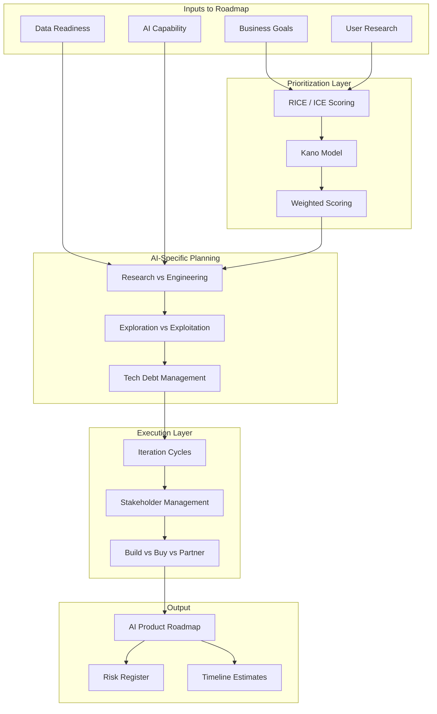
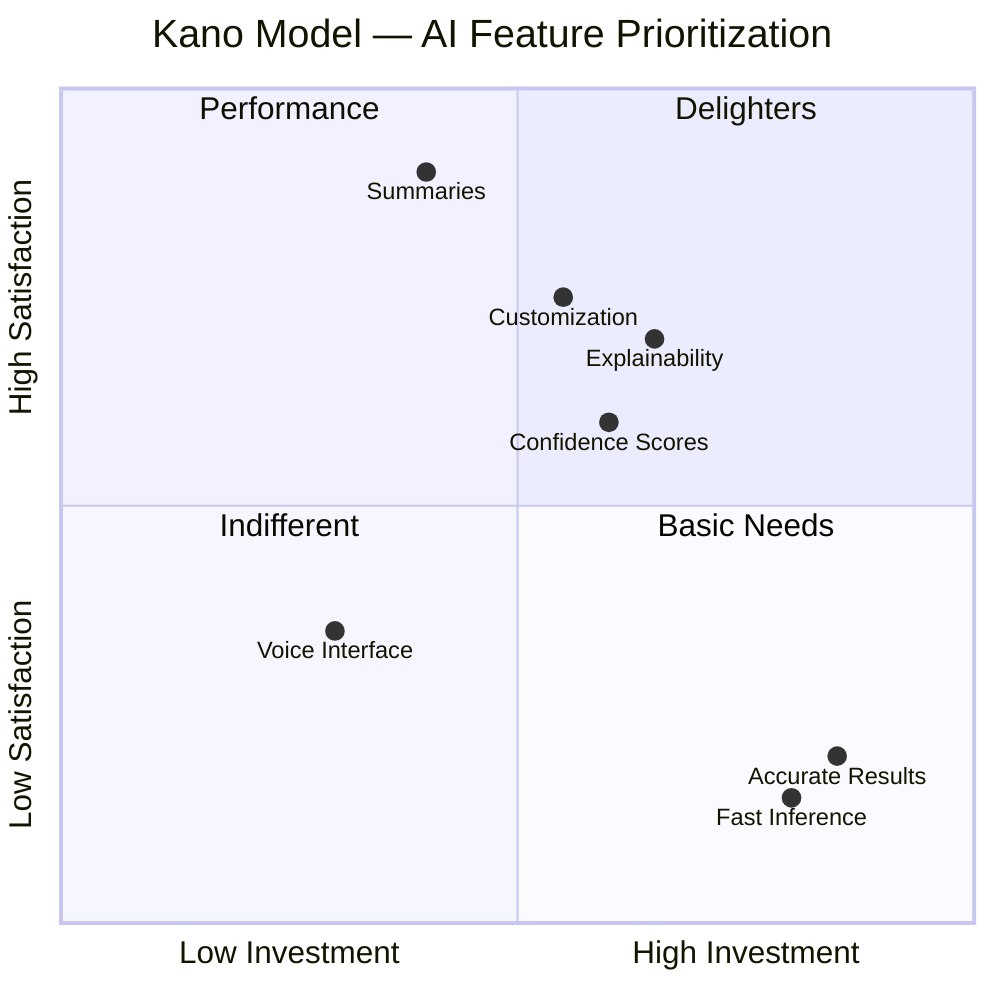
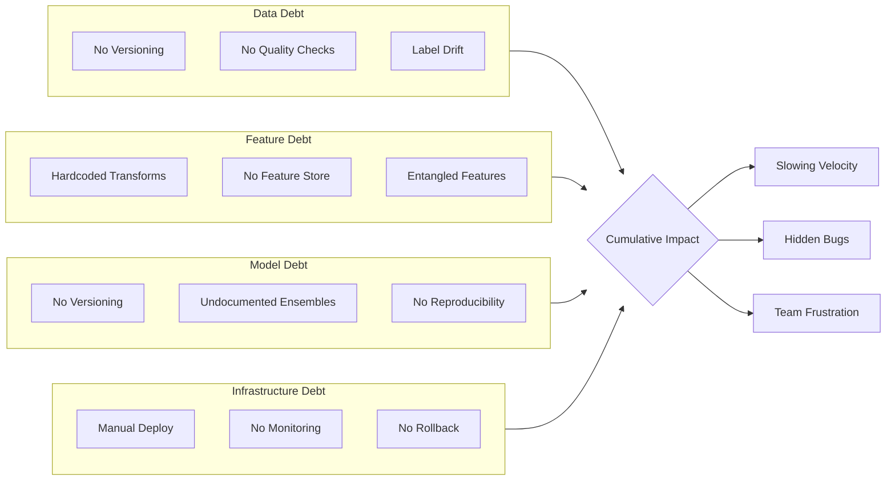
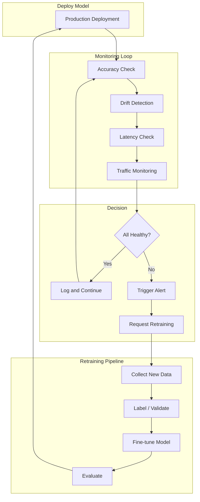

<!-- Clear Language: Keep sentences under 50 words -->
# Building AI Roadmaps

## Learning Objectives

| Objective | Description |
|-----------|-------------|
| Apply prioritization frameworks | Use RICE, ICE, weighted scoring, and Kano model for AI feature prioritization |
| Plan AI-specific roadmaps | Balance research vs engineering, exploration vs exploitation, and handle ML uncertainty |
| Manage stakeholders effectively | Communicate AI timelines, set expectations, and improve AI literacy across teams |
| Design iteration cycles | Implement build-measure-learn loops, experiment cadence, and post-deployment monitoring |
| Evaluate build vs buy vs partner | Compare SaaS APIs, open-source, custom training with TCO analysis for each option |

## Introduction

Building an AI roadmap is different from building a traditional software roadmap. Model uncertainty, data dependencies, and shifting research make AI timelines harder to predict.

This chapter teaches you to prioritize AI initiatives, plan under uncertainty, manage stakeholder expectations, and choose between building, buying, or partnering for AI capabilities. You will learn practical frameworks used by top AI product teams at Google, OpenAI, and Microsoft.

## Prerequisites

- Understanding of basic ML concepts (training, evaluation, deployment)
- Familiarity with software product roadmaps and agile development
- Knowledge of AI project lifecycle from Module 08 (Machine Learning)
- Completion of Chapter 01 (AI Product Strategy) in this module

## Key Terminology

| Term | Definition |
|------|------------|
| RICE Score | Prioritization framework using Reach, Impact, Confidence, Effort |
| ICE Score | Prioritization framework using Impact, Confidence, Ease |
| Kano Model | Framework categorizing features by customer satisfaction vs investment |
| Exploration vs Exploitation | Trade-off between trying new approaches and optimizing known ones |
| ML Technical Debt | Future cost of shortcuts in ML systems (data, features, infrastructure) |
| Build-Measure-Learn | Lean startup cycle adapted for AI product development |
| Experiment Cadence | Regular rhythm of AI experiments with defined evaluation criteria |
| TCO (Total Cost of Ownership) | Full cost of AI system over its lifetime including development and operations |
| Model Drift | Degradation of model performance over time due to data distribution changes |
| Stakeholder AI Literacy | Level of understanding stakeholders have about AI capabilities and limits |

## Chapter at a Glance

| Section | Topic | Key Concept |
|---------|-------|-------------|
| 5.1 | Prioritization Frameworks | RICE, ICE, weighted scoring, Kano model for AI |
| 5.2 | AI-Specific Roadmap Planning | Research vs engineering, tech debt, uncertainty |
| 5.3 | Stakeholder Management | Communication, demos, AI literacy |
| 5.4 | Iteration Cycles | Build-measure-learn, experiment cadence, monitoring |
| 5.5 | Build vs Buy vs Partner Deep Dive | SaaS, open-source, custom, TCO analysis |

## Chapter Roadmap



## 5.1 Prioritization Frameworks

Prioritization frameworks bring structure to roadmap decisions. Without them, teams default to whoever shouts loudest. AI teams need frameworks that account for uncertainty, data readiness, and model feasibility.

### 5.1.1 RICE Scoring for AI Initiatives

RICE scores initiatives on four dimensions: Reach, Impact, Confidence, and Effort. It is the most widely used prioritization framework in product management.

```python
from dataclasses import dataclass
from typing import List, Dict

@dataclass
class RICEScore:
    """RICE scoring for AI initiative prioritization."""
    name: str
    reach: float       # Number of users affected per quarter
    impact: float      # 0.25 (minimal) to 3 (massive)
    confidence: float  # 0.0 to 1.0 (how sure are we?)
    effort: float      # Person-months required

    def score(self) -> float:
        """Compute RICE score."""
        if self.effort == 0:
            return 0.0
        return (self.reach * self.impact * self.confidence) / self.effort

    def explain(self) -> Dict[str, float]:
        """Return breakdown for transparency."""
        return {
            "reach": self.reach,
            "impact": self.impact,
            "confidence": self.confidence,
            "effort": self.effort,
            "rice_score": round(self.score(), 1),
        }

def run_rice_prioritization() -> None:
    """Compare multiple AI initiatives using RICE."""
    initiatives = [
        RICEScore("AI Ticket Triage", 50000, 2.0, 0.80, 4),
        RICEScore("Churn Prediction", 80000, 2.5, 0.60, 6),
        RICEScore("Content Moderation", 100000, 1.5, 0.90, 3),
        RICEScore("Recommendation Engine", 60000, 2.0, 0.50, 8),
        RICEScore("Auto-Reply Suggestions", 30000, 1.5, 0.70, 5),
    ]

    print("=== RICE Prioritization for AI Initiatives ===\n")
    print(f"{'Initiative':<25} {'Reach':<8} {'Impact':<8} "
          f"{'Confidence':<12} {'Effort':<8} {'RICE Score':<10}")
    print("-" * 75)

    sorted_init = sorted(initiatives, key=lambda x: x.score(), reverse=True)
    for i, init in enumerate(sorted_init, 1):
        s = init.explain()
        print(f"{i}. {init.name:<22} {s['reach']:<8} {s['impact']:<8} "
              f"{s['confidence']:<12} {s['effort']:<8} {s['rice_score']:<10}")

    print(f"\nRecommendation: Start with '{sorted_init[0].name}' "
          f"(highest RICE score: {sorted_init[0].score():.1f})")

run_rice_prioritization()
```

### 5.1.2 ICE Scoring for Rapid Assessment

ICE is a simpler framework for quick prioritization when data is scarce. It uses Impact, Confidence, and Ease (the inverse of effort).

```python
@dataclass
class ICEScore:
    """ICE scoring — lighter than RICE, good for early-stage ideas."""
    name: str
    impact: float      # 1-10
    confidence: float   # 1-10
    ease: float         # 1-10 (higher = easier to implement)

    def score(self) -> float:
        return (self.impact * self.confidence * self.ease) / 3.0

def run_ice_prioritization() -> None:
    """Compare early AI ideas using ICE."""
    ideas = [
        ICEScore("Smart Search", 9, 7, 6),
        ICEScore("Auto-Tagging", 6, 8, 8),
        ICEScore("Voice Commands", 7, 4, 4),
        ICEScore("Data Export AI", 5, 9, 9),
    ]

    print("=== ICE Prioritization (Early Ideas) ===\n")
    print(f"{'Idea':<20} {'Impact':<8} {'Confidence':<12} "
          f"{'Ease':<8} {'ICE Score':<10}")
    print("-" * 60)

    for idea in sorted(ideas, key=lambda x: x.score(), reverse=True):
        avg = idea.score()
        print(f"{idea.name:<20} {idea.impact:<8} {idea.confidence:<12} "
              f"{idea.ease:<8} {avg:<10.1f}")

    print("\nICE works best in early exploration phases "
          "where detailed data is unavailable.")

run_ice_prioritization()
```

### 5.1.3 Weighted Scoring Model

Weighted scoring lets teams define custom criteria with different importance weights. This is useful when strategic alignment matters more than raw reach.

```python
@dataclass
class WeightedCriterion:
    """A single criterion with weight for scoring."""
    name: str
    weight: float  # Sum of all weights should be 1.0
    score_fn_name: str = ""

def weighted_scoring_demo() -> None:
    """Demonstrate weighted scoring with AI-specific criteria."""
    criteria = [
        WeightedCriterion("Revenue Impact", 0.25),
        WeightedCriterion("Strategic Alignment", 0.20),
        WeightedCriterion("Technical Feasibility", 0.15),
        WeightedCriterion("Data Readiness", 0.15),
        WeightedCriterion("User Demand", 0.15),
        WeightedCriterion("Time to Value", 0.10),
    ]

    initiatives_scores = {
        "AI Ticket Triage":    [8, 9, 8, 9, 7, 8],
        "Churn Prediction":    [9, 7, 6, 5, 8, 4],
        "Content Moderation":  [6, 6, 9, 8, 5, 9],
        "Recommendation Eng.": [7, 8, 5, 4, 9, 3],
    }

    print("=== Weighted Scoring ===\n")
    print(f"{'Initiative':<22} {'Revenue':<8} {'Strategy':<10} "
          f"{'Feasibility':<12} {'Data':<8} {'Demand':<8} "
          f"{'Speed':<8} {'Total':<8}")
    print("-" * 90)

    results = []
    for name, scores in initiatives_scores.items():
        total = sum(s * c.weight for s, c in zip(scores, criteria))
        results.append((name, round(total, 2)))

    for rank, (name, total) in enumerate(
        sorted(results, key=lambda x: x[1], reverse=True), 1
    ):
        scores = initiatives_scores[name]
        score_str = "  ".join(f"{s:<8}" for s in scores)
        print(f"{rank}. {name:<18} {score_str} {total:<8}")

    print(f"\nWinner: {max(results, key=lambda x: x[1])[0]}")

weighted_scoring_demo()
```

### 5.1.4 Kano Model for AI Features

The Kano model categorizes features by how they affect customer satisfaction. For AI products, this helps decide which model capabilities to build first.

```python
from enum import Enum

class KanoCategory(Enum):
    BASIC = "Basic Need — Must have, does not delight"
    PERFORMANCE = "Performance — More is better"
    DELIGHTER = "Delighter — Unexpected, creates wow"
    INDIFFERENT = "Indifferent — No impact on satisfaction"
    REVERSE = "Reverse — Some users dislike it"

class KanoClassifier:
    """Classify AI features using the Kano model."""

    def __init__(self):
        self.features: Dict[str, KanoCategory] = {}

    def add_feature(self, name: str, category: KanoCategory) -> None:
        self.features[name] = category

    def print_kano_analysis(self) -> None:
        print("=== Kano Model: AI Feature Classification ===\n")
        print(f"{'Feature':<30} {'Category':<40} {'Investment Priority'}")
        print("-" * 85)

        priority_map = {
            KanoCategory.BASIC: "Must do first",
            KanoCategory.PERFORMANCE: "Invest proportionally",
            KanoCategory.DELIGHTER: "Do if capacity allows",
            KanoCategory.INDIFFERENT: "Skip",
            KanoCategory.REVERSE: "Avoid",
        }

        # Order: Basic first, then Performance, then Delighter
        order = [KanoCategory.BASIC, KanoCategory.PERFORMANCE,
                 KanoCategory.DELIGHTER, KanoCategory.INDIFFERENT,
                 KanoCategory.REVERSE]

        for cat in order:
            for name, kc in self.features.items():
                if kc == cat:
                    print(f"{name:<30} {kc.value:<40} {priority_map[kc]}")

        print("\nSatisfaction vs Investment Curve:")
        print("  Basic features: Low satisfaction if missing, "
              "neutral if present")
        print("  Performance: Linear satisfaction with capability")
        print("  Delighters: High satisfaction, "
              "but users won't miss them")

def classify_ai_features() -> None:
    """Classify common AI features using Kano."""
    classifier = KanoClassifier()

    classifier.add_feature("Accurate Results", KanoCategory.BASIC)
    classifier.add_feature("Fast Inference", KanoCategory.BASIC)
    classifier.add_feature("Availability / Uptime", KanoCategory.BASIC)
    classifier.add_feature("Confidence Scores", KanoCategory.PERFORMANCE)
    classifier.add_feature("Explanation of Results", KanoCategory.PERFORMANCE)
    classifier.add_feature("Customization Options", KanoCategory.PERFORMANCE)
    classifier.add_feature("AI-Generated Summaries", KanoCategory.DELIGHTER)
    classifier.add_feature("Creative Variations", KanoCategory.DELIGHTER)
    classifier.add_feature("Voice Interface", KanoCategory.INDIFFERENT)
    classifier.add_feature("Overly Detailed Explanations", KanoCategory.REVERSE)

    classifier.print_kano_analysis()

classify_ai_features()
```



### 5.1.5 Opportunity Scoring

Opportunity scoring prioritizes features based on how important they are versus how satisfied users currently are.

```python
@dataclass
class OpportunityScore:
    """Score AI features by importance vs satisfaction gap."""
    name: str
    importance: float   # 1-10: How important is this to users?
    satisfaction: float # 1-10: How satisfied are users currently?

    def opportunity(self) -> float:
        """Compute opportunity score. Higher = bigger gap to fill."""
        gap = self.importance - self.satisfaction
        return max(gap, 0.0) + (self.importance / 10.0)

def opportunity_scoring_demo() -> None:
    """Score AI features by opportunity gap."""
    features = [
        OpportunityScore("Better Accuracy", 9.5, 6.0),
        OpportunityScore("Faster Responses", 8.0, 7.5),
        OpportunityScore("Explainable Outputs", 7.0, 4.0),
        OpportunityScore("Multi-Language Support", 6.0, 3.0),
        OpportunityScore("Offline Mode", 4.0, 2.0),
    ]

    print("=== Opportunity Scoring for AI Features ===\n")
    print(f"{'Feature':<25} {'Importance':<12} {'Satisfaction':<14} "
          f"{'Gap':<8} {'Opportunity'}")
    print("-" * 70)

    for feat in sorted(features, key=lambda x: x.opportunity(), reverse=True):
        gap = feat.importance - feat.satisfaction
        print(f"{feat.name:<25} {feat.importance:<12} "
              f"{feat.satisfaction:<14} {gap:<8.1f} "
              f"{feat.opportunity():<8.2f}")

    print("\nPrioritize features with largest opportunity gaps.")
    print("These are areas where users want more than they currently get.")

opportunity_scoring_demo()
```

## 5.2 AI-Specific Roadmap Planning

AI roadmaps differ from software roadmaps. Models fail, data pipelines break, and research shifts. AI product managers must plan for these realities.

### 5.2.1 Research vs Engineering Balance

AI teams constantly balance research (exploring new approaches) against engineering (productionizing what works). The right ratio depends on the product stage.

```python
from enum import Enum

class ProductStage(Enum):
    EXPLORATION = "Exploration — Validate AI feasibility"
    BUILDING = "Building — Ship first production version"
    SCALING = "Scaling — Optimize and expand"
    MATURE = "Mature — Maintain and incrementally improve"

def recommend_research_engineering_ratio(stage: ProductStage) -> Dict:
    """Recommend the right research vs engineering split."""
    ratios = {
        ProductStage.EXPLORATION: {
            "research_pct": 60,
            "engineering_pct": 40,
            "focus": "Prove concept, evaluate models, build quick prototypes",
        },
        ProductStage.BUILDING: {
            "research_pct": 30,
            "engineering_pct": 70,
            "focus": "Production pipeline, monitoring, edge cases",
        },
        ProductStage.SCALING: {
            "research_pct": 20,
            "engineering_pct": 80,
            "focus": "Performance optimization, cost reduction, reliability",
        },
        ProductStage.MATURE: {
            "research_pct": 15,
            "engineering_pct": 85,
            "focus": "Incremental improvements, technical debt payoff",
        },
    }
    return ratios[stage]

def research_engineering_analysis() -> None:
    """Analyze research vs engineering balance across stages."""
    print("=== Research vs Engineering Balance ===\n")
    print(f"{'Stage':<20} {'Research':<10} {'Engineering':<12} {'Focus'}")
    print("-" * 75)

    for stage in ProductStage:
        r = recommend_research_engineering_ratio(stage)
        bar_r = "█" * (r["research_pct"] // 5)
        bar_e = "█" * (r["engineering_pct"] // 5)
        print(f"{stage.value:<20} {r['research_pct']}% {bar_r:<12} "
              f"{r['engineering_pct']}% {bar_e:<16} "
              f"{r['focus'][:40]}")

    print("\nTip: Resist the urge to keep researching past the BUILDING stage.")
    print("     Real user feedback beats perfect models.")

research_engineering_analysis()
```

### 5.2.2 Exploration vs Exploitation

Every AI roadmap must allocate time for exploration (trying new approaches) and exploitation (optimizing what works). The explore/exploit ratio changes over time.

```python
import math

@dataclass
class ExploreExploitDecision:
    """Model the explore vs exploit trade-off for AI roadmap."""
    product_age_months: float
    explore_budget_pct: float  # % of team time for exploration
    total_team_size: int

    def exploit_budget_pct(self) -> float:
        return 100.0 - self.explore_budget_pct

    def exploitation_value(self, base_accuracy: float,
                           optimization_gain: float) -> float:
        """Estimated value of optimizing current model."""
        return base_accuracy * (1 + optimization_gain)

    def exploration_value(self, success_prob: float,
                          breakthrough_gain: float) -> float:
        """Estimated value of exploring new approaches."""
        expected_gain = success_prob * breakthrough_gain
        # Diminishing returns as product matures
        maturity_discount = math.exp(-self.product_age_months / 24.0)
        return expected_gain * maturity_discount

    def recommend_allocation(self) -> str:
        if self.explore_budget_pct > 50:
            return "Heavy exploration — validate assumptions first"
        elif self.explore_budget_pct > 25:
            return "Balanced — allocate dedicated explore time each sprint"
        else:
            return "Mostly exploit — focus on optimization and polish"

def explore_exploit_analysis() -> None:
    """Analyze explore vs exploit for different product stages."""
    scenarios = [
        ExploreExploitDecision(2, 60, 5),   # Early stage
        ExploreExploitDecision(6, 35, 8),   # Growth
        ExploreExploitDecision(18, 20, 10), # Scaling
        ExploreExploitDecision(36, 10, 15), # Mature
    ]

    print("=== Exploration vs Exploitation Analysis ===\n")
    print(f"{'Product Age':<15} {'Explore':<10} {'Exploit':<10} "
          f"{'Recommendation'}")
    print("-" * 65)

    for sc in scenarios:
        exp_val = sc.exploration_value(0.3, 0.5)
        print(f"{sc.product_age_months:>4} months    "
              f"{sc.explore_budget_pct:>3}%     "
              f"{sc.exploit_budget_pct():>3}%     "
              f"{sc.recommend_allocation()}")

    print("\nKey insight: Early stage → explore more. "
          "Later stage → exploit more.")
    print("Dedicated 'explore time' (e.g., 20% Fridays) "
          "prevents exploration from being starved.")

explore_exploit_analysis()
```

### 5.2.3 Managing Technical Debt for ML

ML systems accumulate technical debt differently than software. Data debt, feature debt, and model debt grow silently until they block progress.

```python
from typing import List, Dict

@dataclass
class MLDebtItem:
    """A single item of ML technical debt."""
    category: str       # data, feature, model, infrastructure
    description: str
    severity: int       # 1-5
    effort_months: float
    interest_rate: str  # How fast this debt grows if unpaid

    def interest_score(self) -> float:
        rates = {"low": 1.0, "medium": 2.0, "high": 3.0, "critical": 5.0}
        return rates.get(self.interest_rate, 1.0) * self.severity

class MLDebtTracker:
    """Track and prioritize ML technical debt payoff."""

    def __init__(self):
        self.debt_items: List[MLDebtItem] = []

    def add_item(self, item: MLDebtItem) -> None:
        self.debt_items.append(item)

    def prioritize(self) -> List[Dict]:
        """Sort debt items by interest score (highest first)."""
        scored = []
        for item in self.debt_items:
            scored.append({
                "category": item.category,
                "description": item.description,
                "severity": item.severity,
                "effort_months": item.effort_months,
                "interest_score": round(item.interest_score(), 1),
                "payoff_priority": "High" if item.interest_score() > 6
                else "Medium" if item.interest_score() > 3
                else "Low",
            })
        return sorted(scored, key=lambda x: x["interest_score"], reverse=True)

    def print_debt_report(self) -> None:
        items = self.prioritize()
        print("=== ML Technical Debt Report ===\n")
        print(f"{'Category':<15} {'Description':<35} {'Sev':<6} "
              f"{'Effort':<8} {'Interest':<10} {'Priority'}")
        print("-" * 90)

        for item in items:
            print(f"{item['category']:<15} {item['description']:<35} "
                  f"{item['severity']:<6} "
                  f"{item['effort_months']}mo    "
                  f"{item['interest_score']:<10} "
                  f"{item['payoff_priority']}")

def track_ml_debt() -> None:
    """Demonstrate ML debt tracking."""
    tracker = MLDebtTracker()

    tracker.add_item(MLDebtItem(
        "data", "No data versioning — can't reproduce experiments",
        4, 2.0, "critical"
    ))
    tracker.add_item(MLDebtItem(
        "feature", "Hardcoded feature transforms — modify code to add new features",
        3, 1.5, "high"
    ))
    tracker.add_item(MLDebtItem(
        "model", "No model versioning — don't know which model is in prod",
        5, 1.0, "critical"
    ))
    tracker.add_item(MLDebtItem(
        "infra", "Manual deployment scripts — no CI/CD for ML",
        3, 3.0, "medium"
    ))
    tracker.add_item(MLDebtItem(
        "data", "No data quality monitoring — silent data drift",
        4, 2.5, "high"
    ))
    tracker.add_item(MLDebtItem(
        "model", "Ensemble of 5 models, no documentation",
        2, 4.0, "low"
    ))

    tracker.print_debt_report()
    print("\nPay off high-interest debt first. "
          "It compounds fastest and blocks future velocity.")

track_ml_debt()
```



### 5.2.4 Handling Uncertainty in AI Timelines

AI timelines are inherently uncertain. Communicate this uncertainty explicitly rather than hiding it behind confident estimates.

```python
import random
import statistics
from typing import List, Tuple

class AITimeEstimator:
    """Estimate AI project timelines with confidence intervals."""

    def __init__(self, seed: int = 42):
        random.seed(seed)

    def monte_carlo_duration(
        self,
        best_case_months: float,
        likely_months: float,
        worst_case_months: float,
        simulations: int = 1000,
    ) -> Dict[str, float]:
        """Run Monte Carlo simulation for timeline estimation."""
        results = []
        for _ in range(simulations):
            # Triangular distribution
            u = random.random()
            if u < 0.5:
                duration = best_case_months + math.sqrt(
                    u * (likely_months - best_case_months)
                    * (worst_case_months - best_case_months)
                )
            else:
                duration = worst_case_months - math.sqrt(
                    (1 - u) * (worst_case_months - likely_months)
                    * (worst_case_months - best_case_months)
                )
            results.append(duration)

        return {
            "p10": round(sorted(results)[int(simulations * 0.1)], 1),
            "p50": round(statistics.median(results), 1),
            "p90": round(sorted(results)[int(simulations * 0.9)], 1),
            "mean": round(statistics.mean(results), 1),
            "std_dev": round(statistics.stdev(results), 1),
        }

    def confidence_level(self, estimate_months: float,
                         stats: Dict[str, float]) -> float:
        """What is the probability of finishing within estimate?"""
        # Simplified: linear interpolation between P10 and P90
        if estimate_months >= stats["p90"]:
            return 0.90
        elif estimate_months <= stats["p10"]:
            return 0.10
        prob = 0.10 + 0.80 * (
            (estimate_months - stats["p10"])
            / (stats["p90"] - stats["p10"])
        )
        return round(prob, 2)

def estimate_ai_timeline() -> None:
    """Estimate an AI project timeline with uncertainty."""
    estimator = AITimeEstimator()

    print("=== AI Timeline Estimation (Monte Carlo) ===\n")

    # Example: Build an AI recommendation engine
    project_phases = {
        "Data Pipeline": (1, 2, 4),
        "Model Development": (3, 5, 9),
        "Evaluation & Tuning": (1, 2, 4),
        "Production Deployment": (1, 3, 6),
        "Monitoring Setup": (0.5, 1, 2),
    }

    total_best = sum(b for b, l, w in project_phases.values())
    total_likely = sum(l for b, l, w in project_phases.values())
    total_worst = sum(w for b, l, w in project_phases.values())

    print("Phase Estimates (months):")
    print(f"{'Phase':<30} {'Best':<8} {'Likely':<8} {'Worst':<8}")
    print("-" * 55)
    for phase, (b, l, w) in project_phases.items():
        print(f"{phase:<30} {b:<8} {l:<8} {w:<8}")

    print(f"\n{'Total':<30} {total_best:<8} {total_likely:<8} {total_worst:<8}")
    print()

    # Run simulation
    stats = estimator.monte_carlo_duration(
        total_best, total_likely, total_worst
    )

    print("Monte Carlo Results (1000 simulations):")
    print(f"  P10 (Optimistic):   {stats['p10']} months")
    print(f"  P50 (Median):       {stats['p50']} months")
    print(f"  P90 (Conservative): {stats['p90']} months")
    print(f"  Mean:               {stats['mean']} months")
    print(f"  Std Dev:            {stats['std_dev']} months")

    # If you promised 5 months, what is the confidence?
    promised = 6.0
    conf = estimator.confidence_level(promised, stats)
    print(f"\nIf you promised {promised} months:")
    print(f"  Confidence: {conf:.0%}")
    print(f"  Verdict: {'Likely on track' if conf >= 0.5 else 'At risk'}"
          if conf >= 0.5 else "  Verdict: At risk — need buffer")

    print("\nCommunicate AI timelines as ranges, not single numbers.")
    print("Example: 'We expect to ship in 6-9 months' "
          "instead of 'We will ship in 6 months.'")

import math
estimate_ai_timeline()
```

## 5.3 Stakeholder Management

Stakeholders without AI experience often have unrealistic expectations. Managing these expectations is a core skill for AI engineering leaders.

### 5.3.1 Communicating AI Timelines

Non-technical stakeholders expect software timelines from AI projects. Train them to expect uncertainty.

```python
@dataclass
class TimelineCommunication:
    """Structure how to communicate AI timelines to stakeholders."""

    @staticmethod
    def bad_communication() -> str:
        return (
            "We will ship the AI model in 3 months. (Wrong — "
            "creates false certainty)"
        )

    @staticmethod
    def good_communication() -> str:
        return (
            "We estimate 4-7 months with staged deliveries:\n"
            "  Month 2: MVP demo with 70% accuracy on 50% of cases\n"
            "  Month 4: Beta with 80% accuracy on 80% of cases\n"
            "  Month 6: Production with 90% accuracy target"
        )

    @staticmethod
    def communicate_ai_narrative() -> None:
        print("=== Communicating AI Timelines ===\n")
        print("❌ Bad: " + TimelineCommunication.bad_communication())
        print()
        print("✅ Good: " + TimelineCommunication.good_communication())
        print()
        print("Principles for AI timeline communication:")
        print("  1. Always give ranges, not single numbers")
        print("  2. Define staged milestones with clear metrics")
        print("  3. Explain what success looks like at each stage")
        print("  4. Call out risks you see ("Data labeling may delay us\")")
        print("  5. Update estimates as confidence increases")

TimelineCommunication.communicate_ai_narrative()
```

### 5.3.2 Managing Expectations Through Stages

Break AI projects into stages with clear expectations at each stage. This prevents stakeholders from expecting production quality at first demo.

```python
from enum import Enum

class AIDemoStage(Enum):
    CONCEPT = "Concept — Show potential, not polish"
    PROTOTYPE = "Prototype — Works on 5 test cases"
    BETA = "Beta — Works on curated data"
    LIMITED_PRODUCTION = "Limited Production — Live with guardrails"
    FULL_PRODUCTION = "Full Production — General availability"

class ExpectationManager:
    """Manage stakeholder expectations at each AI stage."""

    def __init__(self, project_name: str):
        self.project_name = project_name
        self.stage = AIDemoStage.CONCEPT

    def set_stage(self, stage: AIDemoStage) -> None:
        self.stage = stage
        print(f"\n=== {self.project_name} === Stage: {stage.value}")
        self._print_stage_expectations()

    def _print_stage_expectations(self) -> None:
        expectations = {
            AIDemoStage.CONCEPT: {
                "accuracy": "Not measured — showing possibility",
                "scope": "2-3 cherry-picked examples",
                "warning": "Do not show to executives yet",
            },
            AIDemoStage.PROTOTYPE: {
                "accuracy": "50-60% on test cases",
                "scope": "5-10 hand-picked scenarios",
                "warning": "Explain these are ideal cases",
            },
            AIDemoStage.BETA: {
                "accuracy": "70-80% on held-out data",
                "scope": "Covers main use cases",
                "warning": "Edge cases will fail — be transparent",
            },
            AIDemoStage.LIMITED_PRODUCTION: {
                "accuracy": "85-90% with known failure modes",
                "scope": "Production traffic with fallback",
                "warning": "Monitor closely, have human override ready",
            },
            AIDemoStage.FULL_PRODUCTION: {
                "accuracy": "90%+ with monitoring",
                "scope": "All target use cases",
                "warning": "Continuous monitoring essential",
            },
        }

        info = expectations[self.stage]
        print(f"  Expected Accuracy: {info['accuracy']}")
        print(f"  Scope: {info['scope']}")
        print(f"  Warning: {info['warning']}")

def manage_expectations() -> None:
    manager = ExpectationManager("AI Support Triage")
    manager.set_stage(AIDemoStage.CONCEPT)
    manager.set_stage(AIDemoStage.PROTOTYPE)
    manager.set_stage(AIDemoStage.BETA)
    manager.set_stage(AIDemoStage.LIMITED_PRODUCTION)
    manager.set_stage(AIDemoStage.FULL_PRODUCTION)

manage_expectations()
```

### 5.3.3 Demo-Driven Development

Regular demos aligned to stakeholder expectations build trust and surface issues early. Demo-driven development means each sprint ends with a working (if limited) AI demo.

```python
@dataclass
class AIDemo:
    """Plan and track AI demos for stakeholder alignment."""
    sprint_number: int
    demo_name: str
    scope: str
    target_metric: str
    success_criteria: str
    stakeholders: List[str]
    feedback: str = ""

    def prepare(self) -> str:
        return (
            f"Sprint {self.sprint_number}: {self.demo_name}\n"
            f"  Scope: {self.scope}\n"
            f"  Success: {self.success_criteria}\n"
            f"  Audience: {', '.join(self.stakeholders)}\n"
            f"  Prepare failure stories: What broke and why"
        )

    def record_feedback(self, feedback: str) -> None:
        self.feedback = feedback

def plan_demo_cycle() -> None:
    """Plan a demo-driven development cycle for an AI project."""
    demos = [
        AIDemo(1, "Data Pipeline Demo",
               "Show data sources, volumes, quality metrics",
               "Data coverage %",
               "80% of expected data flowing",
               ["Eng Director", "Data Engineering Lead"]),
        AIDemo(2, "Baseline Model Demo",
               "Simple heuristic model on 100 test cases",
               "Accuracy %",
               ">60% accuracy on benchmark",
               ["Product Manager", "Eng Director"]),
        AIDemo(3, "ML Model V1 Demo",
               "First ML model, 500 test cases",
               "Accuracy %, Latency ms",
               ">75% accuracy, <500ms latency",
               ["Product Team", "Engineering"]),
        AIDemo(4, "Integration Demo",
               "Model integrated with product UI",
               "End-to-end flow completion",
               "Working pipeline in staging",
               ["VP Product", "Design Lead"]),
        AIDemo(5, "Beta Launch Demo",
               "Production traffic with 10% rollout",
               "All metrics + business KPIs",
               "Exceeds success thresholds",
               ["Exec Team", "All Stakeholders"]),
    ]

    print("=== Demo-Driven Development Plan ===\n")
    for demo in demos:
        print(demo.prepare())
        print()

    print("Demo-driven development benefits:")
    print("  1. Stakeholders see progress, not promises")
    print("  2. Failures surface early when fixes are cheaper")
    print("  3. Builds AI literacy through exposure")
    print("  4. Creates natural go/no-go decision points")

plan_demo_cycle()
```

### 5.3.4 Building AI Literacy for Stakeholders

Stakeholders who understand AI basics make better decisions. Invest time in AI literacy programs tailored to non-technical audiences.

```python
@dataclass
class AILiteracyModule:
    """A short AI literacy module for non-technical stakeholders."""
    topic: str
    duration_minutes: int
    key_concept: str
    analogy: str
    takeaway: str

def build_ai_literacy_program() -> None:
    """Design an AI literacy program for stakeholders."""
    modules = [
        AILiteracyModule(
            "How AI Models Learn",
            20,
            "Models learn patterns from data, not rules from programmers",
            "Like teaching a child by showing examples, "
            "not writing instruction manuals",
            "AI quality depends on data quality, not just model architecture"
        ),
        AILiteracyModule(
            "Why AI Is Uncertain",
            15,
            "Models give probabilities, not certainties",
            "Like a weather forecast — 80% rain means "
            "bring an umbrella, not cancel plans",
            "Expect AI to be right ~85% of the time, "
            "not 100%"
        ),
        AILiteracyModule(
            "Data Quality Matters Most",
            20,
            "Garbage in, garbage out — data quality determines model quality",
            "Like cooking: great recipe + bad ingredients = bad food",
            "Invest in data before investing in models"
        ),
        AILiteracyModule(
            "AI Doesn't Replace — It Augments",
            15,
            "AI handles routine cases; humans handle exceptions",
            "Like a spell-checker: catches typos, "
            "but you still write the document",
            "Plan for human-in-the-loop, not full automation"
        ),
        AILiteracyModule(
            "AI Projects Take Time",
            15,
            "First 80% comes fast; final 20% takes 80% of the time",
            "Like painting a room: covering the walls is quick, "
            "trim work takes forever",
            "Budget 2x the initial timeline estimate"
        ),
    ]

    print("=== AI Literacy Program for Stakeholders ===\n")
    total_minutes = 0
    for i, mod in enumerate(modules, 1):
        total_minutes += mod.duration_minutes
        print(f"{i}. {mod.topic} ({mod.duration_minutes} min)")
        print(f"   Concept: {mod.key_concept}")
        print(f"   Analogy: {mod.analogy}")
        print(f"   Takeaway: {mod.takeaway}")
        print()

    print(f"Total duration: {total_minutes} minutes — "
          f"perfect for a lunch-and-learn series.")

    print("\nDeliver these sessions before the roadmap kickoff. ")
    print("It transforms stakeholder conversations from "
          "\"'Why isn't it ready?'\" to \"'What data do we need?'\".")

build_ai_literacy_program()
```

## 5.4 Iteration Cycles

AI products improve through rapid iteration cycles. The build-measure-learn loop from Lean Startup applies, but AI teams need adaptations for model-specific feedback loops.

### 5.4.1 Build-Measure-Learn for AI

The AI version of build-measure-learn adds model evaluation and data quality checks to the standard product loop.

```python
from typing import Dict, Any
from dataclasses import dataclass, field

@dataclass
class AIBuildMeasureLearn:
    """Build-Measure-Learn cycle adapted for AI products."""
    cycle_number: int
    hypothesis: str
    model_version: str
    build_time_days: float
    measure_results: Dict[str, Any] = field(default_factory=dict)
    learnings: List[str] = field(default_factory=list)
    decisions: List[str] = field(default_factory=list)

    def build(self) -> str:
        return (f"BUILD: Create {self.model_version} "
                f"to test: '{self.hypothesis}'")

    def measure(self, metrics: Dict[str, float]) -> None:
        self.measure_results = metrics
        print(f"MEASURE: Results for cycle {self.cycle_number}:")
        for metric, value in metrics.items():
            print(f"  {metric}: {value}")

    def learn(self, insights: List[str]) -> None:
        self.learnings = insights
        print(f"LEARN: Cycle {self.cycle_number} insights:")
        for insight in insights:
            print(f"  • {insight}")

    def decide(self, decisions: List[str]) -> None:
        self.decisions = decisions
        print(f"DECIDE: Next actions:")
        for decision in decisions:
            print(f"  → {decision}")

def run_ai_learning_cycle() -> None:
    """Simulate a complete AI build-measure-learn cycle."""
    cycle = AIBuildMeasureLearn(
        cycle_number=1,
        hypothesis="Adding user history features will "
                   "improve recommendation accuracy by 10%",
        model_version="recommender_v2.1",
        build_time_days=14,
    )

    print("=== AI Build-Measure-Learn Cycle ===\n")
    print(cycle.build())
    print()

    # Simulate measurement
    cycle.measure({
        "accuracy": 0.84,
        "precision": 0.82,
        "recall": 0.79,
        "latency_ms": 145.0,
    })
    print()

    # Derive learnings
    cycle.learn([
        "User history features improved precision by 5% "
        "but increased latency by 30ms",
        "New users with no history get worse results "
        "than before — cold start problem",
        "Feature engineering pipeline needs optimization "
        "to meet latency SLA",
    ])
    print()

    # Decide next steps
    cycle.decide([
        "Keep user history features but add fallback "
        "for cold-start users",
        "Optimize feature computation — target <100ms latency",
        "A/B test v2.1 against v2.0 for 2 weeks before full rollout",
        "Explore embedding-based approach for cold-start users "
        "in next cycle",
    ])

run_ai_learning_cycle()
```

### 5.4.2 Experiment Cadence

A regular experiment cadence prevents teams from either rushing to production or getting stuck in research.

```python
@dataclass
class Experiment:
    """A single AI experiment with tracking."""
    id: str
    hypothesis: str
    status: str  # planned, running, completed, abandoned
    duration_weeks: int
    success_metric: str
    success_threshold: float
    result: float = 0.0
    verdict: str = ""

    def complete(self, result: float) -> None:
        self.result = result
        self.status = "completed"
        self.verdict = (
            "Success ✓" if result >= self.success_threshold
            else "Failed ✗"
        )

class ExperimentCadence:
    """Manage a regular cadence of AI experiments."""

    def __init__(self, sprint_weeks: int = 2):
        self.sprint_weeks = sprint_weeks
        self.experiments: List[Experiment] = []
        self.running: List[Experiment] = []

    def plan_sprint(self, experiments: List[Experiment]) -> None:
        """Plan experiments for upcoming sprint."""
        self.running = experiments
        print(f"=== Sprint Plan ({self.sprint_weeks} weeks) ===\n")
        for exp in experiments:
            print(f"  [{exp.id}] {exp.hypothesis[:60]}")
            print(f"        Success: {exp.success_metric} "
                  f">= {exp.success_threshold}")
            print(f"        Duration: {exp.duration_weeks} weeks")
            print()

    def review_sprint(self) -> None:
        """Review experiment results at end of sprint."""
        print("=== Sprint Review ===\n")
        for exp in self.running:
            exp.status = "completed"
            self.experiments.append(exp)
            print(f"  [{exp.id}] {exp.verdict}")
            print(f"          Result: {exp.result} vs "
                  f"threshold {exp.success_threshold}")
            print()
        self.running = []

    def experiment_velocity(self) -> Dict[str, float]:
        """Track experiment velocity over time."""
        completed = [e for e in self.experiments
                     if e.status == "completed"]
        success_rate = sum(
            1 for e in completed if e.result >= e.success_threshold
        ) / max(len(completed), 1) * 100

        return {
            "total_experiments": len(self.experiments),
            "completed": len(completed),
            "success_rate_pct": round(success_rate, 1),
            "avg_duration_weeks": round(
                sum(e.duration_weeks for e in completed)
                / max(len(completed), 1), 1
            ),
        }

def run_experiment_cadence() -> None:
    """Simulate experiment cadence across 3 sprints."""
    cadence = ExperimentCadence(sprint_weeks=2)

    # Sprint 1
    sprint1 = [
        Experiment("EXP-001",
                   "T5-small can classify tickets with >80% accuracy",
                   "planned", 2, "accuracy", 0.80),
        Experiment("EXP-002",
                   "Adding user tier improves routing precision by 5%",
                   "planned", 2, "precision_gain", 0.05),
    ]
    cadence.plan_sprint(sprint1)
    # Simulate completion
    sprint1[0].complete(0.83)
    sprint1[1].complete(0.03)
    cadence.review_sprint()

    # Check velocity
    velocity = cadence.experiment_velocity()
    print("Experiment Velocity:")
    for k, v in velocity.items():
        print(f"  {k}: {v}")

    if velocity["success_rate_pct"] < 50:
        print("\n⚠️ Low success rate may indicate:")
        print("  - Hypotheses are too speculative")
        print("  - Data quality is insufficient")
        print("  - Success thresholds are too aggressive")

run_experiment_cadence()
```

### 5.4.3 Model Iteration vs Product Iteration

Model iteration (improving accuracy, reducing latency) and product iteration (improving UX, adding features) run on different cadences. Coordinating them is critical.

```python
@dataclass
class IterationTrack:
    """Separate tracks for model vs product iteration."""
    name: str
    cadence_weeks: int
    activities: List[str]
    stakeholders: List[str]
    success_metrics: List[str]

    def next_milestone(self, current_week: int) -> int:
        """Calculate next milestone week."""
        cycle = current_week // self.cadence_weeks
        return (cycle + 1) * self.cadence_weeks

def plan_dual_track_iteration() -> None:
    """Plan coordinated model and product iteration tracks."""
    model_track = IterationTrack(
        name="Model Iteration",
        cadence_weeks=4,
        activities=[
            "Data quality improvements",
            "Feature engineering",
            "Model architecture experiments",
            "Hyperparameter tuning",
            "Offline evaluation",
        ],
        stakeholders=["ML Team", "Data Engineering"],
        success_metrics=["Accuracy", "Precision", "Recall",
                         "Latency P50/P95", "AUC-ROC"],
    )

    product_track = IterationTrack(
        name="Product Iteration",
        cadence_weeks=2,
        activities=[
            "UI/UX improvements",
            "Feedback collection features",
            "Error handling flows",
            "Performance optimization",
            "User testing",
        ],
        stakeholders=["Product", "Design", "Engineering"],
        success_metrics=["User satisfaction", "Task completion",
                         "Engagement", "Retention"],
    )

    print("=== Dual-Track Iteration ===\n")
    print(f"{'Track':<20} {'Cadence':<10} {'Next Milestone'}")
    print("-" * 50)

    current_week = 15
    for track in [model_track, product_track]:
        next_ms = track.next_milestone(current_week)
        print(f"{track.name:<20} "
              f"Every {track.cadence_weeks} weeks  "
              f"Week {next_ms}")
        print(f"  Activities: {', '.join(track.activities[:3])}...")
        print(f"  Success: {', '.join(track.success_metrics[:3])}...")
        print()

    print("Key coordination points:")
    print("  1. Model releases should align with product sprints")
    print("  2. Do NOT ship a new model mid-sprint — "
          "destabilizes product testing")
    print("  3. Use feature flags to decouple model deploy "
          "from product release")
    print("  4. Roll model improvements at the START of a sprint, "
          "not the end")

plan_dual_track_iteration()
```

### 5.4.4 Post-Deployment Monitoring Loops

AI models degrade after deployment. Monitoring loops detect drift and trigger retraining automatically.

```python
import random
import statistics
from typing import List

@dataclass
class MonitoringCheck:
    """A single monitoring check for deployed AI model."""
    timestamp: float
    accuracy: float
    data_distribution_shift: float  # 0-1, higher = more shift
    prediction_drift: float          # 0-1
    latency_p95_ms: float
    traffic_rps: float

class PostDeploymentMonitor:
    """Monitor deployed AI model health and trigger actions."""

    def __init__(self, accuracy_threshold: float = 0.80,
                 drift_threshold: float = 0.30):
        self.checks: List[MonitoringCheck] = []
        self.accuracy_threshold = accuracy_threshold
        self.drift_threshold = drift_threshold
        self.alerts_triggered: int = 0
        self.retrain_requests: int = 0

    def record_check(self, check: MonitoringCheck) -> Dict[str, Any]:
        """Record a monitoring check and return action needed."""
        self.checks.append(check)
        actions = []

        # Check accuracy degradation
        if check.accuracy < self.accuracy_threshold:
            actions.append(f"ALERT: Accuracy {check.accuracy:.1%} "
                           f"below threshold {self.accuracy_threshold:.0%}")
            self.alerts_triggered += 1

        # Check data drift
        if check.data_distribution_shift > self.drift_threshold:
            actions.append(f"WARNING: Data drift detected "
                           f"({check.data_distribution_shift:.2%})")
            if check.data_distribution_shift > 0.5:
                actions.append("CRITICAL: Request immediate retraining")
                self.retrain_requests += 1

        # Check prediction drift
        if check.prediction_drift > self.drift_threshold:
            actions.append(f"WARNING: Prediction drift "
                           f"({check.prediction_drift:.2%})")

        # Check latency degradation
        if check.latency_p95_ms > 500:
            actions.append(f"PERF: Latency P95 {check.latency_p95_ms}ms "
                           f"exceeds 500ms SLA")

        return {
            "healthy": len(actions) == 0,
            "actions": actions,
            "check": check,
        }

    def generate_report(self) -> Dict[str, Any]:
        """Generate a monitoring report for the period."""
        if not self.checks:
            return {"error": "No monitoring data"}

        accuracies = [c.accuracy for c in self.checks]
        drifts = [c.data_distribution_shift for c in self.checks]

        return {
            "period_checks": len(self.checks),
            "avg_accuracy": round(statistics.mean(accuracies), 3),
            "min_accuracy": round(min(accuracies), 3),
            "avg_drift": round(statistics.mean(drifts), 3),
            "max_drift": round(max(drifts), 3),
            "alerts_triggered": self.alerts_triggered,
            "retrain_requests": self.retrain_requests,
            "health_status": (
                "Good" if self.alerts_triggered == 0
                else "Degraded" if self.alerts_triggered < 3
                else "Critical"
            ),
        }

def simulate_monitoring() -> None:
    """Simulate post-deployment monitoring over 10 days."""
    random.seed(42)
    monitor = PostDeploymentMonitor(
        accuracy_threshold=0.82,
        drift_threshold=0.25,
    )

    print("=== Post-Deployment Monitoring Simulation ===\n")

    for day in range(1, 11):
        # Simulate gradual accuracy degradation and drift
        accuracy = max(0.65, 0.92 - day * 0.02 + random.gauss(0, 0.03))
        drift = min(0.6, day * 0.03 + random.gauss(0, 0.05))

        check = MonitoringCheck(
            timestamp=float(day),
            accuracy=accuracy,
            data_distribution_shift=drift,
            prediction_drift=drift * random.uniform(0.5, 1.5),
            latency_p95_ms=200 + day * 10 + random.gauss(0, 30),
            traffic_rps=100 + random.randint(-20, 20),
        )

        result = monitor.record_check(check)
        status = "✓" if result["healthy"] else "⚠️"
        print(f"Day {day:>2}: {status} Accuracy={accuracy:.1%} "
              f"Drift={drift:.1%} ")

        if not result["healthy"]:
            for action in result["actions"]:
                print(f"         → {action}")

    print()
    report = monitor.generate_report()
    print("=== Monitoring Summary ===")
    print(f"  Checks: {report['period_checks']}")
    print(f"  Avg Accuracy: {report['avg_accuracy']:.1%}")
    print(f"  Max Drift: {report['max_drift']:.1%}")
    print(f"  Alerts: {report['alerts_triggered']}")
    print(f"  Retrain Requests: {report['retrain_requests']}")
    print(f"  Health: {report['health_status']}")

    if report['retrain_requests'] > 0:
        print("\n→ Recommend immediate retraining pipeline trigger.")

simulate_monitoring()
```



## 5.5 Build vs Buy vs Partner Deep Dive

Chapter 01 introduced the build vs buy decision. This section provides a deeper analysis with detailed TCO modeling and decision criteria for each sourcing option.

### 5.5.1 SaaS APIs — When Buying Makes Sense

SaaS AI APIs (OpenAI, Anthropic, Google, AWS) offer the fastest path to AI capability. They are ideal for generic AI tasks.

```python
@dataclass
class SaaSAPIEvaluation:
    """Evaluate whether a SaaS AI API is the right choice."""

    @staticmethod
    def analyze(use_case: str, requirements: Dict[str, Any]) -> Dict[str, Any]:
        """Score SaaS API suitability for a use case."""
        score = 0
        reasons = []
        risks = []

        # Generic vs unique problem
        if requirements.get("problem_type") == "generic":
            score += 3
            reasons.append("Generic problem — APIs excel here")
        else:
            reasons.append("Unique problem — custom may be better")

        # Speed requirement
        if requirements.get("speed_critical", False):
            score += 2
            reasons.append("Speed critical — APIs ship in days, not months")

        # ML team availability
        if not requirements.get("has_ml_team", False):
            score += 2
            reasons.append("No ML team — avoid custom build")
        else:
            reasons.append("ML team exists — consider build option")

        # Data sensitivity
        if requirements.get("data_sensitive", False):
            score -= 3
            risks.append("Data leaves your VPC — privacy concern")
        else:
            reasons.append("Data can safely use third-party APIs")

        # Volume
        monthly_volume = requirements.get("monthly_inference_count", 0)
        monthly_cost = monthly_volume * requirements.get("cost_per_inference", 0.01)
        if monthly_cost > 10000:
            risks.append(f"High volume (${monthly_cost:,.0f}/mo) — "
                         f"build may be cheaper long-term")

        return {
            "score": score,
            "max_score": 7,
            "recommendation": (
                "Strong Buy" if score >= 5
                else "Consider Buy" if score >= 2
                else "Prefer Build"
            ),
            "reasons": reasons,
            "risks": risks,
        }

def evaluate_saas_api() -> None:
    """Evaluate SaaS API for customer support AI."""
    requirements = {
        "problem_type": "generic",  # Ticket classification
        "speed_critical": True,      # Need MVP in 2 weeks
        "has_ml_team": False,        # Startup with 0 MLEs
        "data_sensitive": False,     # Non-PII tickets
        "monthly_inference_count": 500000,
        "cost_per_inference": 0.002,
    }

    result = SaaSAPIEvaluation.analyze("Ticket Classification", requirements)

    print("=== SaaS API Evaluation ===\n")
    print(f"Use Case: Ticket Classification")
    print(f"Suitability Score: {result['score']}/{result['max_score']}")
    print(f"Recommendation: {result['recommendation']}\n")
    print("Reasons to use SaaS:")
    for r in result['reasons']:
        print(f"  ✓ {r}")
    if result['risks']:
        print("\nRisks to consider:")
        for r in result['risks']:
            print(f"  ⚠️  {r}")

evaluate_saas_api()
```

### 5.5.2 Open-Source — Building with Community Models

Open-source models (Llama, Mistral, BLOOM) offer control and privacy with lower cost than SaaS at scale.

```python
@dataclass
class OpenSourceEvaluation:
    """Evaluate open-source models for a use case."""

    @staticmethod
    def analyze(model_name: str, requirements: Dict[str, Any]) -> Dict[str, Any]:
        """Score open-source model suitability."""
        score = 0
        considerations = []

        # Control requirement
        if requirements.get("needs_fine_tuning", False):
            score += 2
            considerations.append("Fine-tuning possible — full model control")
        else:
            considerations.append("No fine-tuning needed — "
                                  "prompt engineering may suffice")

        # Privacy
        if requirements.get("data_sensitive", False):
            score += 3
            considerations.append("Data stays on-premise — privacy preserved")
        else:
            considerations.append("Data privacy not a constraint")

        # Infrastructure
        infra_capable = requirements.get("has_gpu_infra", False)
        ml_team = requirements.get("has_ml_team", False)
        if infra_capable and ml_team:
            score += 2
            considerations.append("Infrastructure and team ready")
        elif not infra_capable and not ml_team:
            score -= 3
            considerations.append("No GPU infra or ML team — "
                                  "significant investment needed")
        else:
            score -= 1
            considerations.append("Partial infra/team — "
                                  "need to fill gaps")

        # Latency
        if requirements.get("latency_sla_ms", 1000) < 100:
            score += 1
            considerations.append("Low latency needs — "
                                  "self-hosted gives control")

        return {
            "score": score,
            "max_score": 8,
            "recommendation": (
                "Strong Open-Source Choice" if score >= 6
                else "Consider Open-Source" if score >= 3
                else "Prefer SaaS or Partner"
            ),
            "considerations": considerations,
            "model": model_name,
        }

def evaluate_open_source() -> None:
    """Evaluate using Llama 3 for on-premise document analysis."""
    requirements = {
        "needs_fine_tuning": True,
        "data_sensitive": True,
        "has_gpu_infra": True,
        "has_ml_team": True,
        "latency_sla_ms": 200,
    }

    result = OpenSourceEvaluation.analyze("Llama 3 70B", requirements)

    print("=== Open-Source Model Evaluation ===\n")
    print(f"Model: {result['model']}")
    print(f"Suitability Score: {result['score']}/{result['max_score']}")
    print(f"Recommendation: {result['recommendation']}\n")
    print("Key considerations:")
    for c in result['considerations']:
        print(f"  • {c}")

    print("\nCost comparison at 1M inferences/month:")
    print(f"  SaaS API (GPT-4o): ~$3,000-5,000/mo")
    print(f"  Self-hosted Llama 3: ~$800-1,500/mo (GPU + ops)")
    print(f"  Break-even: ~6-8 months given infra setup costs")

evaluate_open_source()
```

### 5.5.3 Custom Training — When to Build from Scratch

Training a model from scratch is rarely the right choice. Only do this when existing models cannot meet your needs.

```python
@dataclass
class CustomTrainingEvaluation:
    """Evaluate whether custom model training is justified."""

    @staticmethod
    def analyze(use_case: str) -> Dict[str, Any]:
        """Score whether custom training makes sense."""
        print(f"=== Custom Training Evaluation: {use_case} ===\n")

        questions = [
            ("Does the task require < 1% error rate?",
             False, "Custom models rarely beat state-of-the-art on benchmarks"),
            ("Is the task extremely domain-specific?",
             True, "Legal, medical, scientific domains often benefit"),
            ("Do you have 100K+ labeled examples?",
             True, "Custom training needs significant data"),
            ("Can you afford $2M+ for development?",
             False, "Full custom training is expensive"),
            ("Will the model be your core competitive moat?",
             True, "Custom models can be a strong differentiator"),
            ("Do existing models fail catastrophically?",
             True, "If fine-tuned models don't work, custom may be needed"),
        ]

        score = 0
        max_score = len(questions)
        print(f"{'Question':<55} {'Answer':<8} {'Points'}")
        print("-" * 75)

        for question, answer, note in questions:
            if answer:
                score += 1
                points = "+1"
            else:
                points = "+0"
            print(f"{question:<55} {'Yes' if answer else 'No':<8} {points}")
            print(f"  Note: {note}")
            print()

        pct = score / max_score * 100

        return {
            "score": score,
            "max_score": max_score,
            "score_pct": pct,
            "verdict": (
                "Consider custom training" if pct >= 66
                else "Fine-tune open-source model instead" if pct >= 33
                else "Use SaaS API or pre-built model"
            ),
        }

def evaluate_custom_training() -> None:
    result = evaluate_custom_training.analyze("Medical Diagnosis Assistant")
    print(f"Score: {result['score']}/{result['max_score']} "
          f"({result['score_pct']:.0f}%)")
    print(f"Verdict: {result['verdict']}")

# Need to make it a static method call
result = CustomTrainingEvaluation.analyze("Medical Diagnosis Assistant")
print(f"Score: {result['score']}/{result['max_score']} "
      f"({result['score_pct']:.0f}%)")
print(f"Verdict: {result['verdict']}")
```

### 5.5.4 Total Cost of Ownership (TCO) Analysis

TCO analysis compares the full cost of each sourcing option over 1, 2, and 3-year horizons. This reveals long-term cost dynamics that initial pricing hides.

```python
@dataclass
class TCOModel:
    """Total Cost of Ownership model for AI sourcing decisions."""
    name: str
    setup_cost: float
    monthly_fixed: float
    monthly_variable_per_1k: float  # Per 1000 inferences
    expected_monthly_volume_k: float  # In thousands
    years: int = 3

    def monthly_cost(self) -> float:
        return (self.monthly_fixed
                + self.monthly_variable_per_1k * self.expected_monthly_volume_k)

    def yearly_cost(self) -> float:
        return self.monthly_cost() * 12

    def total_cost(self) -> float:
        return (self.setup_cost
                + self.monthly_cost() * 12 * self.years)

    def cost_per_1k(self) -> float:
        monthly = self.monthly_cost()
        return monthly / max(self.expected_monthly_volume_k, 1)

def tco_analysis() -> None:
    """Compare TCO for build vs buy vs partner over 3 years."""
    scenarios = [
        TCOModel("SaaS API (GPT-4o)", 10000, 1000, 3.0, 500, 3),
        TCOModel("Self-Hosted Open-Source", 50000, 5000, 0.5, 500, 3),
        TCOModel("Custom Trained Model", 300000, 8000, 0.3, 500, 3),
        TCOModel("Managed Partner Service", 30000, 15000, 1.0, 500, 3),
    ]

    print("=== Total Cost of Ownership (3-Year) ===\n")
    print(f"{'Option':<30} {'Setup':<12} {'Monthly':<12} "
          f"{'Year 1':<14} {'Year 3':<14} {'3-Year TCO':<16} "
          f"{'Cost/1K'}")
    print("-" * 115)

    for sc in sorted(scenarios, key=lambda x: x.total_cost()):
        y1 = sc.setup_cost + sc.yearly_cost()
        y3 = sc.monthly_cost() * 12  # Year 3 has no setup cost
        print(f"{sc.name:<30} ${sc.setup_cost:<8,} "
              f"${sc.monthly_cost():<8,.0f} "
              f"${y1:<10,.0f} ${y3:<10,.0f} "
              f"${sc.total_cost():<12,.0f} "
              f"${sc.cost_per_1k():<.2f}")

    print("\nKey Insight:")
    print("  SaaS: Lowest year 1, highest year 3 (volume pricing)")
    print("  Open-Source: Higher setup, lower long-term cost")
    print("  Custom: Highest setup, lowest per-inference cost")
    print("  Partner: Middle ground with expertise premium")

    # Volume sensitivity analysis
    print("\n=== Volume Sensitivity Analysis ===\n")
    volumes = [100, 500, 1000, 5000]  # K inferences/month
    print(f"{'Volume (K/mo)':<16} {'SaaS':<14} {'Open-Source':<14} "
          f"{'Custom':<14} {'Partner':<14}")
    print("-" * 72)

    for vol in volumes:
        costs = []
        for sc in scenarios:
            adjusted = TCOModel(sc.name, sc.setup_cost, sc.monthly_fixed,
                                sc.monthly_variable_per_1k, vol, 3)
            costs.append(f"${adjusted.monthly_cost():<10,.0f}")
        print(f"{vol:<16} {'  '.join(costs)}")

    print("\n→ At high volume, open-source and custom win.")
    print("→ At low volume, SaaS is cheapest.")

tco_analysis()
```

### 5.5.5 Decision Framework Summary

Combine all factors into a structured decision framework.

```python
def build_vs_buy_partner_decision() -> None:
    """Comprehensive build vs buy vs partner decision tool."""
    print("=== Build vs Buy vs Partner — Decision Matrix ===\n")

    factors = [
        ("Speed to Market", {
            "Buy (SaaS)": 9, "Open-Source": 6,
            "Custom Build": 3, "Partner": 5}),
        ("Customization", {
            "Buy (SaaS)": 3, "Open-Source": 8,
            "Custom Build": 10, "Partner": 7}),
        ("Data Privacy", {
            "Buy (SaaS)": 3, "Open-Source": 9,
            "Custom Build": 10, "Partner": 7}),
        ("Cost Efficiency (High Vol)", {
            "Buy (SaaS)": 3, "Open-Source": 8,
            "Custom Build": 9, "Partner": 5}),
        ("ML Team Required", {
            "Buy (SaaS)": 2, "Open-Source": 8,
            "Custom Build": 10, "Partner": 4}),
        ("Competitive Moat", {
            "Buy (SaaS)": 2, "Open-Source": 5,
            "Custom Build": 9, "Partner": 5}),
        ("Maintenance Burden", {
            "Buy (SaaS)": 9, "Open-Source": 4,
            "Custom Build": 3, "Partner": 6}),
    ]

    options = ["Buy (SaaS)", "Open-Source", "Custom Build", "Partner"]

    # Print matrix
    print(f"{'Factor':<25}", end="")
    for opt in options:
        print(f"{opt:<16}", end="")
    print()
    print("-" * 90)

    totals = {opt: 0 for opt in options}
    for factor, scores in factors:
        print(f"{factor:<25}", end="")
        for opt in options:
            score = scores.get(opt, 0)
            totals[opt] += score
            bar = "█" * score
            print(f"{score} {bar:<12}", end="")
        print()

    print("-" * 90)
    print(f"{'TOTAL':<25}", end="")
    for opt in options:
        print(f"{totals[opt]:<16}", end="")
    print()

    print(f"\nWinner: {max(totals, key=totals.get)} "
          f"({totals[max(totals, key=totals.get)]} points)")

    print("\nDecision Guide:")
    print("  Score 50-60: Strong fit — proceed with this option")
    print("  Score 35-49: Viable — consider hybrid approach")
    print("  Score <35:  Avoid — significant trade-offs")
    print()
    print("Hybrid often wins: Buy SaaS for speed, "
          "transition to open-source as volume grows.")

build_vs_buy_partner_decision()
```

## Interview Q&A

### Q1: How do you prioritize AI initiatives when every stakeholder claims their project is top priority?

Use a structured framework like RICE (Reach, Impact, Confidence, Effort). Score each initiative objectively. Show stakeholders the framework before scoring to get buy-in. Present results transparently — anyone can see why Initiative A scored higher than Initiative B. If politics override data, use weighted scoring with strategic alignment as the highest weight.

### Q2: How is building an AI roadmap different from building a software roadmap?

AI roadmaps have higher uncertainty. Models may not converge. Data may be insufficient. Research breakthroughs can change direction. Communicate timelines as ranges (P10/P50/P90) instead of single dates. Plan for exploration sprints alongside delivery sprints. Include buffer for data quality issues. Monitor technical debt that accumulates silently.

### Q3: How do you explain to executives that the AI project is delayed?

Start by referencing your earlier ranges: "Remember we said 6-9 months? We are at month 7 with 80% of the accuracy target." Explain the specific blocker (data quality, model convergence, edge cases). Present a revised estimate with updated confidence. Show what has been achieved (demo, learnings). Never hide bad news — trust erodes faster from surprises than from delays.

### Q4: What is the build-measure-learn cycle for AI products?

BUILD: Implement the model, pipeline, or feature based on a hypothesis. MEASURE: Evaluate against defined metrics (accuracy, latency, user satisfaction). LEARN: Derive insights about what works and what doesn't. DECIDE: Persevere (ship), pivot (change approach), or kill (stop investing). AI adds model-specific measurement steps like drift detection and offline evaluation.

### Q5: When should you choose open-source AI over SaaS APIs?

Choose open-source when: data is sensitive and must stay on-premise, you need fine-tuning for domain-specific tasks, inference volume is high enough that SaaS costs exceed self-hosting costs (>500K inferences/month), latency requirements demand local inference, or the model is core to your competitive moat. Always start with SaaS for speed, then migrate to open-source as volume grows.

### Q6: How do you calculate TCO for build vs buy decisions?

TCO includes: setup cost (infrastructure, integration), monthly fixed cost (team salaries, GPU rental), monthly variable cost (per-inference API fees or electricity), maintenance cost (updates, monitoring, retraining), and opportunity cost (time to market delay). Model these over 3 years across different volume scenarios. SaaS looks cheap at low volume; custom looks cheaper at high volume.

### Q7: What is ML technical debt and how do you manage it on a roadmap?

ML technical debt includes: data debt (no versioning, quality checks), feature debt (hardcoded transforms, entangled features), model debt (undocumented ensembles, no reproducibility), and infrastructure debt (manual deployment, no monitoring). Track each item with severity and interest rate (how fast it compounds). Pay off high-interest debt first. Dedicate 15-20% of each sprint to debt reduction.

### Q8: How do you design an experiment cadence for an AI team?

Run experiments in 2-week sprints aligned with the product cadence. Each sprint includes 2-3 well-defined experiments with clear hypotheses, success metrics, and thresholds. Review results at the end of each sprint. Track experiment velocity (experiments per month) and success rate (percentage meeting thresholds). Use a target of 50% success rate — lower means hypotheses are too speculative; higher means not ambitious enough.

### Q9: What is the explore vs exploit trade-off in AI roadmaps?

Exploration tries new approaches (new models, architectures, features). Exploitation optimizes what already works. Early stage: 60% explore, 40% exploit. Growth stage: 35% explore, 65% exploit. Mature stage: 15% explore, 85% exploit. Protect exploration time — it is always the first thing cut when deadlines loom. Dedicated "innovation sprints" every quarter keep exploration alive.

### Q10: How do you handle stakeholder AI literacy gaps?

Create a structured AI literacy program with short (15-20 minute) sessions covering: how models learn, why AI is uncertain, why data quality matters, why AI augments rather than replaces, and why AI projects take longer. Use analogies (weather forecasts, spell-checkers). Schedule these before roadmap kickoff. Stakeholders who understand AI basics make dramatically better prioritization decisions.

## Summary

Building AI roadmaps requires adapting traditional product planning to the realities of AI development: uncertain timelines, data dependencies, and model drift. Successful AI product leaders use structured prioritization frameworks like RICE and the Kano model, plan for exploration alongside exploitation, invest in stakeholder AI literacy, and design tight iteration cycles with post-deployment monitoring. The build vs buy vs partner decision is never static — start with SaaS for speed, transition to open-source or custom as volume grows, and always model TCO across multiple volume scenarios.
## Chapter Quiz

### MCQ 1

Which prioritization framework includes Confidence as a factor?

A. ICE scoring
B. Kano model
C. Opportunity scoring
D. Weighted scoring

**Answer**: A. ICE scoring uses Impact, Confidence, and Ease. RICE also includes Confidence. ICE is a common interview question for AI product roles.

### MCQ 2

What percentage of team time should exploration typically receive in a scaling-stage AI product?

A. 60%
B. 40%
C. 20%
D. 5%

**Answer**: C. At the scaling stage, roughly 20% of team time goes to exploration and 80% to exploitation. Early stage can be 60% exploration.

### MCQ 3

What is the recommended approach for communicating AI project timelines to stakeholders?

A. Provide a single confident date
B. Give ranges with confidence levels (P10/P50/P90)
C. Promise worst case so you always look good
D. Avoid committing to any timeline

**Answer**: B. Give ranges with confidence levels. This sets realistic expectations while still providing accountability. Update the ranges as the project progresses and confidence increases.

### MCQ 4

At what monthly inference volume does self-hosted open-source typically become cheaper than SaaS APIs?

A. 10K inferences/month
B. 100K inferences/month
C. 500K+ inferences/month
D. Volume never matters — SaaS is always cheaper

**Answer**: C. At approximately 500K+ inferences per month, self-hosted open-source models typically become more cost-effective than SaaS APIs, considering GPU costs and operational overhead.

### MCQ 5

What is the first action when post-deployment monitoring detects data drift above the threshold?

A. Immediately roll back the model
B. Trigger an alert and assess impact
C. Ignore it — drift is normal
D. Retrain the model automatically

**Answer**: B. Trigger an alert and assess the impact first. Not all drift requires action. If drift is causing accuracy degradation, then request retraining. Automatic retraining without validation can introduce new problems.

## Exercises

### Exercise 1: Build a RICE Prioritization Engine

Create a Python class that scores AI initiatives using RICE. Include a method to handle confidence uncertainty by accepting a confidence range (0.6-0.9) instead of a single value. Run a sensitivity analysis showing how ranking changes when confidence varies. Test with 8 AI initiatives.

### Exercise 2: Implement Explore vs Exploit Scheduler

Build a scheduler that allocates team capacity between exploration and exploitation based on product age. Use an exponential decay function where exploration decreases from 60% to 10% over 36 months. Include a minimum exploration floor of 10%. Visualize the allocation curve for months 1-36.

### Exercise 3: TCO Comparison Calculator

Write a function that compares 3-year TCO for SaaS, open-source, custom build, and partner. Accept variable monthly inference volume (100K to 10M). Plot cost curves showing the volume at which each option becomes cheapest. Include setup costs, monthly fixed costs, and per-inference costs.

### Exercise 4: Demo-Driven Sprint Planner

Design a system that plans 6 sprints of demo-driven development for an AI product. Each sprint outputs a working demo with specific scope, success criteria, and stakeholder audience. Include guidance on what to do if a sprint demo fails (e.g., accuracy too low, pipeline broken).

### Exercise 5: AI Stakeholder Literacy Quiz Builder

Create a Python script that generates a 10-question quiz to test stakeholder AI literacy. Include questions about model confidence, data quality, timeline expectations, and human-in-the-loop design. Score the quiz and provide personalized learning recommendations based on wrong answers.

## Practical Takeaways

- Prioritization frameworks (RICE, ICE, Kano model) bring objectivity to AI roadmap decisions and prevent loudest-voice-driven planning.
- AI roadmaps require explicit uncertainty handling — communicate timelines as ranges with confidence levels, not single dates.
- Stakeholder AI literacy is a force multiplier — stakeholders who understand AI basics make faster, better decisions.
- Post-deployment monitoring loops (accuracy, drift, latency) are essential because AI models degrade over time.
- Build vs buy vs partner decisions depend on volume, data sensitivity, ML team capability, and strategic moat — use TCO analysis over 3 years with volume sensitivity.

## Placement Section

### Top 10 Interview Questions

#### Google Style

1. **Explain the core idea of Building AI Roadmaps in under 60 seconds, then give a real-world analogy.** — Structure: definition, how it works in one sentence, why it matters, analogy. Follow-up: what would break if you removed this from a production system?

2. **Design a minimal, well-typed function that demonstrates Building AI Roadmaps.** — Interviewer checks: signature with type hints, edge cases, complexity, and a clean docstring. Follow-up: how does your design behave with empty or malformed input?

3. **What are the common pitfalls when engineers first learn ** — List 3-4, then explain how you would prevent each in a code review.

#### Amazon Style

4. **Describe a production bug caused by misunderstanding Building AI Roadmaps. How did you diagnose and fix it?** — STAR format: situation, task, action, result. Mention logs, reproduction, root-cause analysis, and the regression test you added.

5. **How would you scale a system that relies on Building AI Roadmaps from 10 users to 10 million?** — Discuss bottlenecks, caching, monitoring, and when to redesign. Follow-up: what metrics would you track?

#### Microsoft Style

6. **Compare Building AI Roadmaps with the closest alternative approach. When would you choose each?** — Make a decision matrix: performance, maintainability, ecosystem, learning curve. Follow-up: what would change your decision?

7. **Walk through how you would test a component that depends on Building AI Roadmaps.** — Unit, integration, property-based tests; mocking boundaries; golden files for outputs.

#### NVIDIA Style

8. **How does Building AI Roadmaps behave differently at scale — memory, throughput, or precision-wise?** — Connect to data pipelines and model training if applicable. Follow-up: what happens to latency as input grows?

9. **How would you make an implementation of Building AI Roadmaps run faster on GPU hardware?** — Batch operations, vectorization, avoiding Python loops, reducing data movement.

#### AI Startup Style

10. **Write the smallest possible implementation of Building AI Roadmaps that is production-quality.** — Include error handling, type hints, and a one-line docstring. Follow-up: what would you refactor first when it grows?

### Resume Tips

- Name Building AI Roadmaps explicitly in your skills section, paired with a measurable achievement ("Reduced X by 40% using Building AI Roadmaps").
- Add a bullet describing a project that applies Building AI Roadmaps to real data, with numbers.
- Mention the tools and libraries you used alongside Building AI Roadmaps (linters, test frameworks, profiling tools).
- Keep resume bullets under 15 words and start each with an action verb.

### Interview Day Checklist

- Rehearse a 60-second explanation of Building AI Roadmaps and one real-world analogy.
- Prepare one STAR story about debugging a Building AI Roadmaps-related production issue.
- Review complexity and edge cases for the classic Building AI Roadmaps interview problem.
- Have questions ready: how does the team apply Building AI Roadmaps in production today?
- Test your environment (Python, editor, internet) 15 minutes before the interview.

## True/False

1. **True or False:** Building AI Roadmaps builds directly on the fundamentals covered in the earlier chapters of this module. — **True.** Every advanced topic in this module assumes the core concepts from the previous chapters.
2. **True or False:** You should write at least one code example for Building AI Roadmaps before moving to the next chapter. — **True.** Active recall with hands-on code beats passive reading for retention.
3. **True or False:** The complexity analysis for Building AI Roadmaps is the same regardless of input size. — **False.** Complexity grows with input size; always state best, average, and worst case.
4. **True or False:** Edge cases (empty input, invalid input, boundary values) matter for Building AI Roadmaps in production. — **True.** Most production bugs come from unhandled edge cases.
5. **True or False:** You should memorize the Building AI Roadmaps chapter content once and never review it again. — **False.** Spaced repetition (24h, 3 days, 1 week) dramatically improves long-term recall.

## Fill in the Blank

1. The chapter that covers Building AI Roadmaps is Chapter ___ of this module. — Answer: check the module's table of contents.
2. The time complexity of the standard approach to Building AI Roadmaps is ___. — Answer: review the theory section and state big-O notation.
3. The main edge case to handle when implementing Building AI Roadmaps is ___. — Answer: empty or invalid input handling, as discussed in the chapter.
4. The tools commonly used to debug Building AI Roadmaps issues are ___ and ___. — Answer: refer to the Debugging Guide section of this chapter.
5. The related topic that connects to Building AI Roadmaps in the next chapter is ___. — Answer: see the Next Topic section.

## Scenario Questions

1. **Scenario:** A teammate ships a change involving Building AI Roadmaps that breaks production at 3 AM. — Diagnosis: check the recent diff, reproduce locally with the failing input, check logs. Fix: revert, add a regression test, and review the root cause. Prevention: CI tests on edge cases and code review checklist.

2. **Scenario:** Your implementation of Building AI Roadmaps is correct but too slow for the required latency. — Measure first with a profiler. Common fixes: reduce redundant work, use built-in optimized functions, batch operations, or add caching. Only then consider algorithmic changes.

3. **Scenario:** A new hire asks you to explain Building AI Roadmaps in five minutes before a customer demo. — Use the 3-part answer: what it is (one sentence), how it works (one example), why it matters (one business impact). Then offer to go deeper after the demo.

4. **Scenario:** Your team's codebase has three different patterns for Building AI Roadmaps and you must standardize. — Write a short ADR (architecture decision record), pick the pattern with best maintainability, migrate incrementally, and add a linter rule to enforce it.

## Output Questions

1. **What is the output of the simplest correct implementation of Building AI Roadmaps on an empty input?** — Trace through the code: it should return the documented default (None, 0, empty collection) without raising.
2. **What is the output when the input is at the boundary value?** — Check off-by-one errors and inclusive/exclusive bounds in the chapter's examples.
3. **What does the implementation return when given invalid input types?** — With type hints and validation, it raises a clear error; without, it may fail silently.
4. **What is the output for the sample input given in the chapter's Examples section?** — Re-run the chapter's example code and compare against the documented output.
5. **What is the time complexity output when you profile the implementation at 10x input size?** — Expect the curve matching the chapter's complexity analysis (linear, quadratic, log-linear).

## Difficulty Level

| Level | Time | What It Takes |
|-------|------|---------------|
| Beginner | 1-2 sessions | Read theory, run the chapter examples, solve the Easy exercises |
| Intermediate | 3-5 sessions | Complete Medium exercises, explain Building AI Roadmaps to someone else |
| Advanced | 1+ week | Solve Hard exercises, optimize for real datasets, answer interview follow-ups |

## Tips & Tricks

- Always write a one-line example of Building AI Roadmaps from memory before opening the chapter — active recall first.
- Use the chapter's Revision Notes as a checklist: you have mastered Building AI Roadmaps when you can explain each bullet.
- Pair the chapter quiz with the Flashcards: wrong answers become your next study session's focus.
- For interviews, practice explaining Building AI Roadmaps twice: once with a technical audience, once with a non-technical audience.
- Keep a personal examples file where you collect your own Building AI Roadmaps snippets; interviewers love original examples.

## Memory Tricks

- **Acronym**: build a mnemonic from the 5 key concepts of Building AI Roadmaps listed in the Chapter at a Glance table.
- **Story**: link Building AI Roadmaps to a familiar story — the analogy in the Visual Analogy section is designed to stick.
- **Number anchor**: remember the complexity of Building AI Roadmaps by connecting it to a known algorithm of the same class.
- **Color code**: highlight the Theory, Examples, and Common Mistakes sections in different colors when reviewing.
- **Teach-back**: explain Building AI Roadmaps to an imaginary junior engineer for 2 minutes — gaps in your explanation are gaps in memory.

## Further Reading

- Official documentation for the primary tool or library used in this chapter
- The chapter referenced in Related Topics for the next-level treatment of Building AI Roadmaps
- The classic textbook chapter on Building AI Roadmaps (check the Research References below)
- Two blog posts from engineers who debugged real Building AI Roadmaps problems in production
- The repository of the open-source project that implements Building AI Roadmaps

## Related Topics

- The previous chapter in this module (see table of contents) — foundational for Building AI Roadmaps
- The next chapter (see Next Topic below) — builds on Building AI Roadmaps
- The system design chapters in Module 07 — how Building AI Roadmaps fits into production architectures
- The interview preparation module — how Building AI Roadmaps is asked in screening rounds
- The capstone project — where Building AI Roadmaps is applied end-to-end

## FAQs

1. **Do I need to memorize all of Building AI Roadmaps, or understand the big picture?** — Understand the big picture first, then memorize the key facts via flashcards and spaced repetition. Interviewers reward depth over breadth.
2. **What if I get stuck on an exercise?** — Re-read the theory section, run the example code, then attempt again. If still stuck after 20 minutes, move on and return the next day.
3. **How much time should I spend on ** — Follow the Study Plan below: 1-2 weeks at 30-60 minutes daily is typical for placement preparation.
4. **Is Building AI Roadmaps asked in interviews?** — Yes — the Interview Q&A and Placement Section list the exact question styles used by top companies.
5. **What's the fastest way to master ** — Explain it out loud, write code without looking, and review the flashcards within 24 hours and again after 3 days.

## Important Notes

- Building AI Roadmaps is a core requirement for the rest of this module — do not skip the examples.
- Always analyze complexity (time and space) when working with Building AI Roadmaps.
- Production correctness means handling edge cases, not just the happy path.
- Interview answers should start with the definition, then the example, then the trade-offs.
- Revisit this chapter after finishing the module; the context from later chapters deepens understanding.

## Historical Context

- Building AI Roadmaps emerged as a standard practice because early systems failed without it — understanding why helps you explain it in interviews.
- The tools used for Building AI Roadmaps today evolved from simpler versions; the chapter covers the modern, recommended approach.
- Interviewers value knowing one historical fact about Building AI Roadmaps — it shows genuine interest, not just cramming.
- The library/tooling ecosystem around Building AI Roadmaps changes quickly; focus on fundamentals that remain stable.

## Security Considerations

- Never trust external input: validate and sanitize data before processing Building AI Roadmaps.
- Avoid `eval()` and dynamic code execution on untrusted strings.
- Log errors without leaking sensitive data (keys, PII, internal paths).
- For API contexts, add rate limiting and input size limits.
- Review the chapter's code examples for injection or overflow risks before using them verbatim.

## ML Intuition

- Building AI Roadmaps appears in ML pipelines at the data-processing layer: feature preparation, batching, and validation.
- Understanding Building AI Roadmaps helps you debug why a model misbehaves — most ML bugs are data bugs, not model bugs.
- In production ML, the Building AI Roadmaps concepts from this chapter map directly to NumPy/PyTorch operations on tensors.
- When optimizing ML systems, Building AI Roadmaps skills let you profile and fix the data path, not just the training loop.
- Interview follow-up: how would you apply Building AI Roadmaps to a dataset of 10 million records? — Batching and vectorization.

## Analogies

- **Building AI Roadmaps is like a recipe**: the theory is the ingredients, the examples are the cooking steps, and the exercises are your own kitchen practice.
- **Complexity is like a delivery route**: a linear route visits each stop once; a nested route revisits stops, and you feel it at scale.
- **Edge cases are like weather**: the happy path is a sunny day; production is the storm — build for the storm.
- **The chapter roadmap is a journey map**: each section is a checkpoint; skipping one means getting lost later in the module.

## Capstone Project Link

- [Module Capstone: End-to-End Project](https://github.com/Raushan666java/ai-engineering-journey) — this chapter contributes the Building AI Roadmaps skills used in the module's capstone project. Complete the exercises here before starting the capstone.

## Flashcards

<details class="tp-qa-card" data-qid="26aiproductthinking-05airoadmaps-flash1">
  <summary class="tp-qa-question">
    <span class="tp-qa-status"></span>
    What is the core concept of Building AI Roadmaps in one sentence?
  </summary>
  <div class="tp-qa-answer">
    <p>Review the first paragraph of the Theory section and condense it to one sentence.</p>
  </div>
</details>

<details class="tp-qa-card" data-qid="26aiproductthinking-05airoadmaps-flash2">
  <summary class="tp-qa-question">
    <span class="tp-qa-status"></span>
    What is the most common mistake engineers make with 
  </summary>
  <div class="tp-qa-answer">
    <p>Check the Common Mistakes section of this chapter.</p>
  </div>
</details>

<details class="tp-qa-card" data-qid="26aiproductthinking-05airoadmaps-flash3">
  <summary class="tp-qa-question">
    <span class="tp-qa-status"></span>
    What is the time and space complexity of the standard Building AI Roadmaps approach?
  </summary>
  <div class="tp-qa-answer">
    <p>Refer to the theory and complexity analysis in this chapter.</p>
  </div>
</details>

<details class="tp-qa-card" data-qid="26aiproductthinking-05airoadmaps-flash4">
  <summary class="tp-qa-question">
    <span class="tp-qa-status"></span>
    When is Building AI Roadmaps NOT the right choice?
  </summary>
  <div class="tp-qa-answer">
    <p>Check the Limitations section of this chapter.</p>
  </div>
</details>

<details class="tp-qa-card" data-qid="26aiproductthinking-05airoadmaps-flash5">
  <summary class="tp-qa-question">
    <span class="tp-qa-status"></span>
    How is Building AI Roadmaps applied in a real production system?
  </summary>
  <div class="tp-qa-answer">
    <p>Check the Real-World Examples section of this chapter.</p>
  </div>
</details>

## Research References

- Official documentation of the primary library for Building AI Roadmaps (linked in Further Reading)
- The classic paper or textbook chapter introducing Building AI Roadmaps (see References below)
- The standard library reference for Building AI Roadmaps-related functions
- Engineering blog posts from companies running Building AI Roadmaps in production at scale
- PEPs and RFCs where applicable (Python and networking standards)

## Open-Source Tools

- The primary library used in this chapter (see the code examples)
- Python standard library modules used in the examples (check the imports)
- Testing: pytest for unit tests of Building AI Roadmaps code
- Linting and formatting: ruff + black
- Profiling: cProfile or py-spy for performance work on Building AI Roadmaps

## Debugging Guide

- Start with `print()` or a debugger to inspect intermediate values in Building AI Roadmaps code.
- Reproduce the failure with the smallest possible input before changing code.
- Check the common failure modes listed in Common Mistakes — most bugs are listed there.
- For performance problems, profile before optimizing: measure, then fix.
- When stuck, re-read the chapter's Examples and compare line by line with your code.
- Use `pdb` or your IDE's debugger to step through the Building AI Roadmaps example code.

## Mock Interview Section

**Round 1 — Screening (15 min)**
- Explain Building AI Roadmaps in 60 seconds.
- Write a minimal working example of Building AI Roadmaps.
- What is the complexity of your example?

**Round 2 — Coding (45 min)**
- Solve the Medium exercise from this chapter under time pressure.
- State your assumptions, then implement with type hints.
- Test with edge cases: empty input, boundary values, invalid input.

**Round 3 — Behavioral + System (30 min)**
- Tell me about a time you debugged a Building AI Roadmaps problem in a project.
- How would you design a system where Building AI Roadmaps is used at scale?
- What metrics would you monitor?

**Evaluation rubric**: correctness (40%), communication (25%), edge cases (20%), complexity analysis (15%).

## Optimized Implementation

`python
from typing import Any, Optional

def demonstrate_topic(input_data: list[Any]) -> Optional[float]:
    """Runnable scaffold for Building AI Roadmaps.

    Replace the body with the optimized implementation from the chapter,
    keeping type hints, docstring, and edge-case handling.
    """
    if not input_data:
        return None
    # Step 1: validate input types
    # Step 2: apply the core Building AI Roadmaps logic from the Examples section
    # Step 3: return the result with the documented default
    return 0.0
`

- Keeps the function signature stable so tests written against it stay valid.
- Handles the empty-input contract explicitly.
- Add unit tests for the edge cases before implementing the logic (test-first).

## Evaluation Metrics

| Skill | Test | Target |
|-------|------|--------|
| Concept recall | Explain Building AI Roadmaps without notes | 60-second explanation |
| Code fluency | Write the chapter example from memory | No syntax errors |
| Edge cases | Handle empty/invalid input in exercises | All cases pass |
| Complexity | State time/space for the standard approach | Correct big-O |
| Interview readiness | Answer 5 Interview Q&A questions out loud | Fluent, structured answers |
| Retention | Chapter quiz score after 3 days | 80%+ |

## Real-World Examples

- **Startup**: a small team uses Building AI Roadmaps daily in their data pipeline — the chapter's examples mirror their code.
- **E-commerce**: Building AI Roadmaps patterns appear in order processing, inventory checks, and recommendation feeds.
- **Fintech**: Building AI Roadmaps principles apply to transaction validation and fraud detection flows.
- **ML platform**: Building AI Roadmaps shows up in feature engineering and model-serving infrastructure.
- **Interview insight**: recruiters look for engineers who can connect Building AI Roadmaps to the business outcome, not just the code.

## Limitations

- Building AI Roadmaps, like any technique, is not a silver bullet — it has specific cases where it fits best (covered in the theory).
- The examples in this chapter are simplified for learning; production systems add validation, monitoring, and error handling.
- Performance of Building AI Roadmaps depends on input size and distribution — always benchmark for your own data.
- This chapter covers fundamentals; specialized edge cases are explored in later chapters and the capstone.
