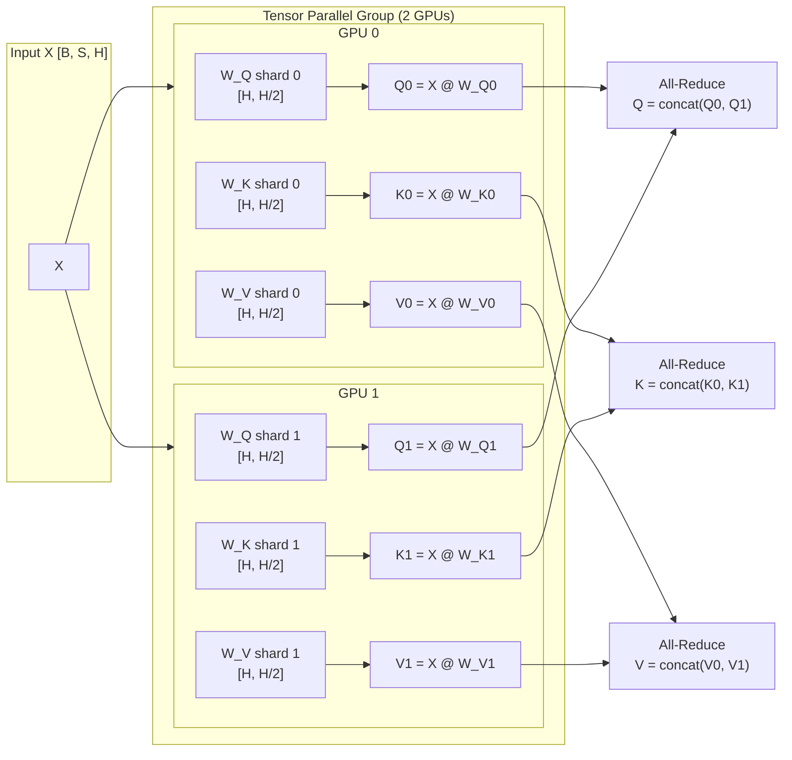
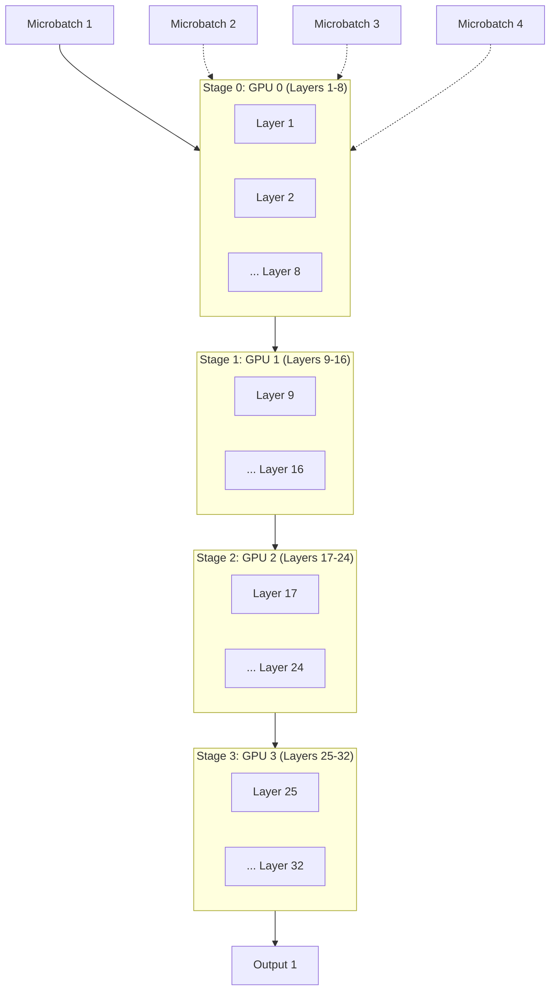
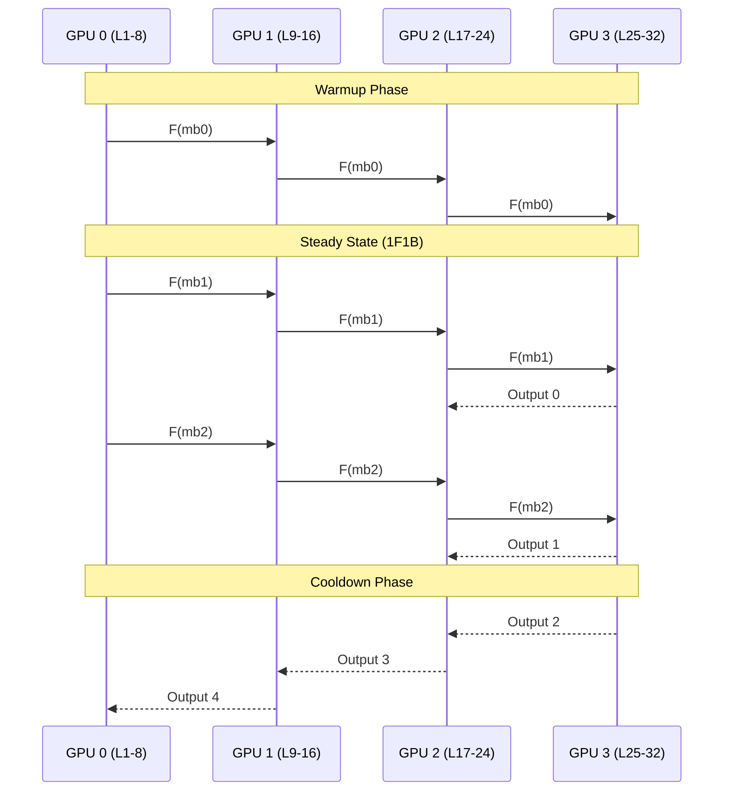
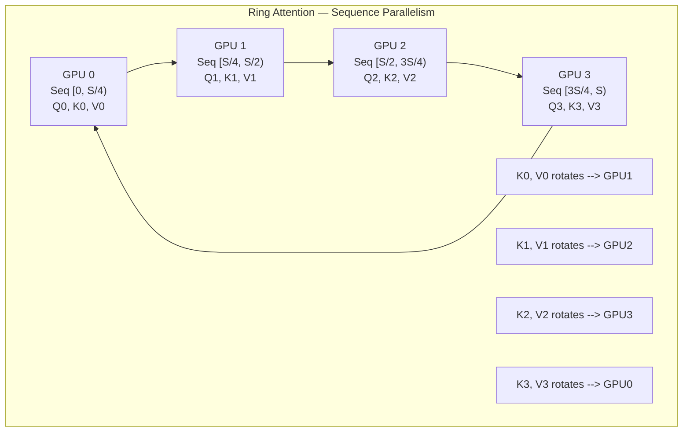
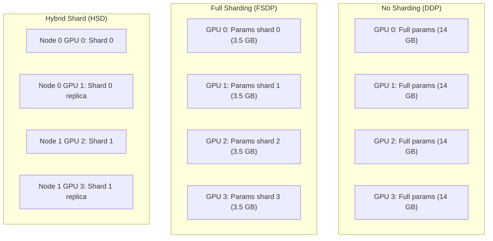
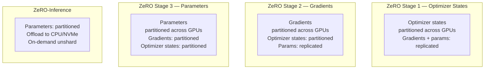
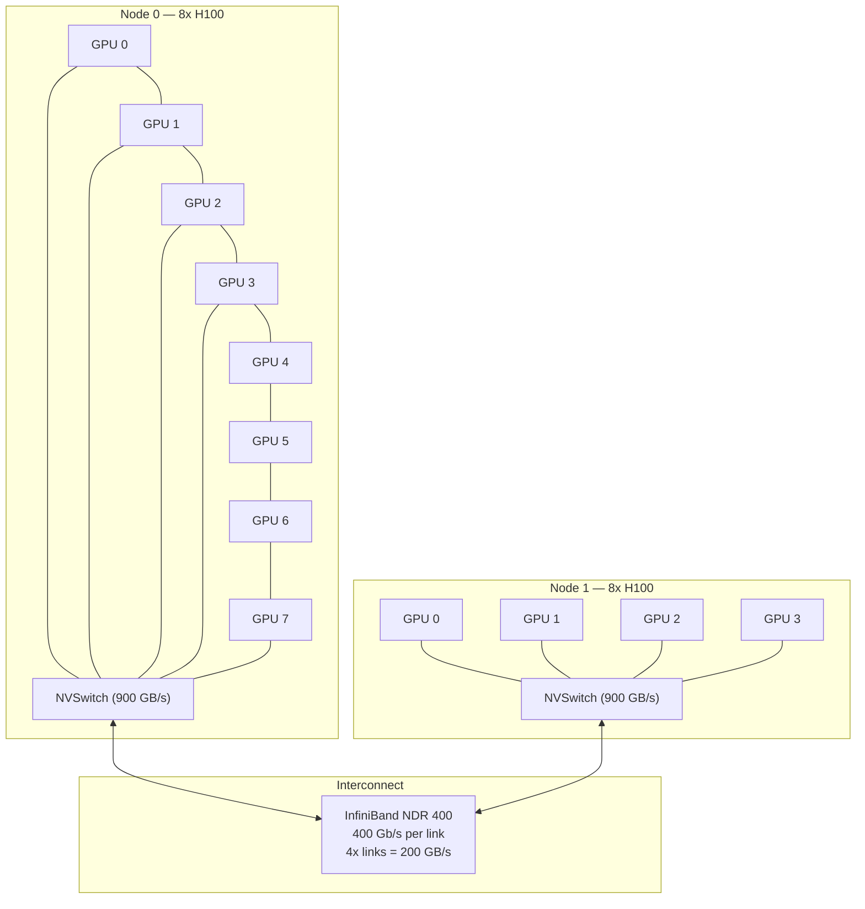

<!-- Clear Language: Keep sentences under 50 words -->
# Distributed Inference

## Learning Objectives

| Objective | Description |
|-----------|-------------|
| LO1 | Explain tensor parallelism and how Megatron-LM splits attention heads and FFN layers across GPUs |
| LO2 | Implement pipeline parallelism with GPipe, microbatching, and interleaved scheduling |
| LO3 | Apply sequence parallelism using Ring Attention for long-context inference |
| LO4 | Configure FSDP sharding strategies (HSD, full shard) for distributed inference |
| LO5 | Deploy models with DeepSpeed ZeRO-Inference and offloading to CPU/NVMe |
| LO6 | Design multi-node inference clusters with NCCL and optimal network topology |

## Chapter at a Glance

| Section | Topic | Key Concept |
|---------|-------|-------------|
| 1.0 | Tensor Parallelism | Megatron-LM style TP: column/row parallelism, all-reduce, ffn sharding |
| 2.0 | Pipeline Parallelism | GPipe, interleaved 1F1B scheduling, microbatch bubble overhead |
| 3.0 | Sequence Parallelism | Ring Attention, context parallelism, sequence-dimension sharding |
| 4.0 | FSDP | Fully sharded data parallel, unshard/re-shard, hybrid sharding |
| 5.0 | DeepSpeed ZeRO | ZeRO stages 1/2/3, ZeRO-Inference, CPU/NVMe offloading |
| 6.0 | Multi-Node Inference | NCCL, RDM, network topology, all-to-all communication |

## Introduction

Modern LLMs are too large for a single GPU. Llama 3 405B requires 810 GB in FP16. No single GPU has that much memory. Distributed inference splits the model across many GPUs, letting them work together.

Distributed inference differs from distributed training. Inference has no backward pass, no gradient sync, and no optimizer states. The goal is low latency and high throughput, not convergence.

Six parallelism strategies exist: tensor, pipeline, sequence, FSDP, DeepSpeed ZeRO, and multi-node. Each strategy handles the model and data differently. Production systems combine multiple strategies.

## Prerequisites

- Module 09 (Deep Learning) — transformer architecture, attention mechanism, multi-head attention
- Module 27, Chapter 01 — GPU architecture, memory hierarchy, NVLink, PCIe
- Module 27, Chapter 04 — inference serving, batching, KV cache
- Understanding of collective communication — all-reduce, all-gather, reduce-scatter
- Basic distributed computing concepts — rank, world size, communication primitives

## Key Terminology

| Term | Definition |
|------|------------|
| Tensor Parallelism (TP) | Splitting individual weight tensors across GPUs within a node |
| Pipeline Parallelism (PP) | Splitting model layers across GPUs, each GPU handles sequential stages |
| Sequence Parallelism (SP) | Sharding the sequence dimension across GPUs for long-context attention |
| FSDP | Fully Sharded Data Parallel — shards parameters, gradients, optimizer states |
| ZeRO | ZeRO Redundancy Optimizer — eliminates memory redundancy across GPUs |
| All-Reduce | Collective that sums tensors across all ranks and broadcasts the result |
| Reduce-Scatter | Collective that sums tensors and scatters chunks to each rank |
| All-Gather | Collective that gathers full tensor from all ranks to every rank |
| Microbatch | A small slice of a batch, used in pipeline parallelism |
| Bubble Overhead | Idle time in pipeline parallelism due to sequential stage dependencies |
| Ring Attention | Distributed attention that shards the sequence across GPUs |
| NCCL | NVIDIA Collective Communication Library — GPU-to-GPU comm primitives |
| NVLink | NVIDIA high-bandwidth GPU interconnect (900 GB/s H100) |
| RDM | Remote Direct Memory access — direct GPU memory access over network |
| 1F1B | One-Forward-One-Backward scheduling for pipeline parallelism |

## Theory

### 1.0 Tensor Parallelism

Tensor parallelism splits each layer's weight tensors across GPUs. All GPUs in a TP group hold different parts of the same layer. They work together on each forward pass.

Megatron-LM pioneered the tensor parallelism approach used by most frameworks. The key idea is to split the matrix multiplications that dominate transformer computation.

#### 1.1 Megatron-LM Column Parallelism

In the attention layer, the Q, K, V projections are independent matrix multiplies. Each can be split along the column dimension.

Given input X of shape [B, S, H] and weight W_Q of shape [H, 3H], column parallelism splits W_Q into W_Q0 and W_Q1, each of shape [H, 3H/2]. GPU 0 computes X @ W_Q0. GPU 1 computes X @ W_Q1.



```python
import torch
import torch.nn as nn
import torch.distributed as dist
from typing import Tuple, Optional

class ColumnParallelLinear(nn.Module):
    """
    Megatron-LM style column-parallel linear layer.
    Splits weight along the output dimension (columns).
    Each GPU holds a slice of the output features.
    """
    def __init__(
        self,
        in_features: int,
        out_features: int,
        world_size: int = 1,
        rank: int = 0,
        bias: bool = True,
    ):
        super().__init__()
        self.world_size = world_size
        self.rank = rank
        self.out_features_per_rank = out_features // world_size

        # Each GPU holds only its shard of the weight
        self.weight = nn.Parameter(
            torch.randn(self.out_features_per_rank, in_features)
        )
        if bias:
            self.bias = nn.Parameter(
                torch.randn(self.out_features_per_rank)
            )
        else:
            self.bias = None

    def forward(self, x: torch.Tensor) -> torch.Tensor:
        """
        Forward: local matmul, then all-gather to combine outputs.
        shape: x[B, S, H] -> local[B, S, H/world_size] -> combined[B, S, H]
        """
        # Local computation on shard
        local_output = torch.matmul(x, self.weight.t())
        if self.bias is not None:
            local_output = local_output + self.bias

        # All-gather: combine outputs from all GPUs
        outputs = [torch.zeros_like(local_output) for _ in range(self.world_size)]
        dist.all_gather(outputs, local_output)
        return torch.cat(outputs, dim=-1)

class RowParallelLinear(nn.Module):
    """
    Megatron-LM style row-parallel linear layer.
    Splits weight along the input dimension (rows).
    Each GPU holds a slice of the input features.
    Output requires all-reduce across GPUs.
    """
    def __init__(
        self,
        in_features: int,
        out_features: int,
        world_size: int = 1,
        rank: int = 0,
        bias: bool = True,
    ):
        super().__init__()
        self.world_size = world_size
        self.rank = rank
        self.in_features_per_rank = in_features // world_size

        self.weight = nn.Parameter(
            torch.randn(out_features, self.in_features_per_rank)
        )
        if bias:
            self.bias = nn.Parameter(torch.randn(out_features))
        else:
            self.bias = None

    def forward(self, x: torch.Tensor) -> torch.Tensor:
        """
        Forward: local matmul on input shard, then all-reduce.
        x[B, S, H/world_size] -> local[B, S, H] -> all-reduce[B, S, H]
        """
        local_output = torch.matmul(x, self.weight.t())
        if self.bias is not None:
            local_output = local_output + self.bias

        # All-reduce: sum partial results across GPUs
        dist.all_reduce(local_output)
        return local_output
```

#### 1.2 FFN Layer Sharding

The feed-forward network (FFN) in a transformer has two linear layers with a GeLU activation. Megatron-LM splits the first FFN layer with column parallelism and the second with row parallelism.

```python
class TensorParallelFFN(nn.Module):
    """
    Megatron-LM tensor-parallel feed-forward network.
    First linear: column parallel (split output dims).
    Activation: GeLU applied locally on each GPU.
    Second linear: row parallel (split input dims, all-reduce output).
    """
    def __init__(
        self,
        hidden_size: int,
        intermediate_size: int,
        world_size: int = 1,
        rank: int = 0,
    ):
        super().__init__()
        self.rank = rank
        self.world_size = world_size

        # Column parallel: splits intermediate dimension
        self.gate_proj = ColumnParallelLinear(
            hidden_size, intermediate_size, world_size, rank
        )
        self.up_proj = ColumnParallelLinear(
            hidden_size, intermediate_size, world_size, rank
        )
        # Row parallel: splits input (intermediate) dimension
        self.down_proj = RowParallelLinear(
            intermediate_size, hidden_size, world_size, rank
        )

    def forward(self, x: torch.Tensor) -> torch.Tensor:
        """
        FFN = down_proj(GeLU(gate_proj(x)) * up_proj(x))
        Each projection is distributed across GPUs.
        """
        gate = self.gate_proj(x)
        up = self.up_proj(x)
        # SiLU activation (common in Llama architectures)
        hidden = torch.nn.functional.silu(gate) * up
        return self.down_proj(hidden)

class TensorParallelAttention(nn.Module):
    """
    Multi-head attention with tensor parallelism.
    QKV projections: column parallel (split heads across GPUs).
    Output projection: row parallel (all-reduce partial outputs).
    Each GPU holds num_heads / world_size heads.
    """
    def __init__(
        self,
        hidden_size: int,
        num_heads: int,
        world_size: int = 1,
        rank: int = 0,
    ):
        super().__init__()
        self.rank = rank
        self.world_size = world_size
        self.num_heads = num_heads
        self.head_dim = hidden_size // num_heads
        self.num_heads_per_rank = num_heads // world_size

        # Column parallel QKV projection
        self.qkv_proj = ColumnParallelLinear(
            hidden_size, 3 * hidden_size, world_size, rank
        )
        # Row parallel output projection
        self.output_proj = RowParallelLinear(
            hidden_size, hidden_size, world_size, rank
        )

    def forward(
        self,
        x: torch.Tensor,
        attention_mask: Optional[torch.Tensor] = None,
    ) -> torch.Tensor:
        B, S, H = x.shape

        # Compute Q, K, V on local GPU shard
        qkv = self.qkv_proj(x)  # [B, S, 3 * H]
        qkv = qkv.reshape(B, S, 3, self.num_heads_per_rank, self.head_dim)
        q, k, v = qkv.unbind(dim=2)  # Each: [B, S, H_per_rank, D]

        # Local attention on sharded heads
        scale = self.head_dim ** -0.5
        attn_weights = torch.matmul(q, k.transpose(-2, -1)) * scale
        if attention_mask is not None:
            attn_weights = attn_weights + attention_mask
        attn_weights = torch.nn.functional.softmax(attn_weights, dim=-1)
        attn_output = torch.matmul(attn_weights, v)  # [B, S, H_per_rank, D]

        # Reshape and project output (row parallel with all-reduce)
        attn_output = attn_output.reshape(B, S, -1)
        return self.output_proj(attn_output)

# Communication cost model for tensor parallelism
def tp_communication_cost(
    hidden_size: int,
    sequence_length: int,
    batch_size: int,
    world_size: int,
    bandwidth: float = 900.0,  # NVLink bandwidth in GB/s
) -> float:
    """
    Estimate all-reduce communication time per transformer layer.
    Each all-reduce transfers 2 * (B * S * H) bytes (send + receive).
    """
    bytes_per_element = 2  # FP16
    # All-reduce on output projection: each rank sends/receives full output
    message_size = batch_size * sequence_length * hidden_size * bytes_per_element
    # All-reduce bandwidth = bandwidth * (world_size - 1) / world_size
    effective_bw = bandwidth * (world_size - 1) / world_size
    # Time in microseconds
    time_us = (2 * message_size / effective_bw) * 1e6
    return time_us

# Example: Llama 3 70B, sequence length 4096, batch 1, 8 GPUs
latency = tp_communication_cost(
    hidden_size=8192,
    sequence_length=4096,
    batch_size=1,
    world_size=8,
    bandwidth=900.0,  # NVLink H100
)
print(f"TP all-reduce latency per layer: {latency:.1f} us")
print(f"80 layers total: {latency * 80 / 1000:.1f} ms")
```

### 2.0 Pipeline Parallelism

Pipeline parallelism splits the model's layers into stages. Each GPU holds a contiguous block of layers. The input passes through stages sequentially.

Simple pipelining leaves most GPUs idle — the pipeline bubble. GPipe and interleaved 1F1B scheduling reduce this bubble.

#### 2.1 GPipe — Naive Pipeline

GPipe divides the batch into microbatches. Each microbatch flows through the pipeline. After all microbatches complete, gradients accumulate (for training) or outputs combine (for inference).



**Bubble overhead calculation:**

With P pipeline stages and M microbatches, the bubble fraction is:

```
Bubble fraction = (P - 1) / (M + P - 1)
```

For P=4 stages and M=8 microbatches:
- Bubble fraction = 3 / (8 + 3) = 3/11 = 27.3%
- GPU utilization = 72.7%

```python
def gpipe_bubble_overhead(
    num_stages: int,
    num_microbatches: int,
) -> dict:
    """
    Calculate GPipe pipeline bubble overhead.
    The bubble is idle time when GPUs wait for the pipeline to fill/drain.

    Formula:
    bubble_fraction = (P - 1) / (M + P - 1)

    where P = num_stages, M = num_microbatches
    """
    bubble_fraction = (num_stages - 1) / (num_microbatches + num_stages - 1)
    gpu_utilization = 1.0 - bubble_fraction

    return {
        "num_stages": num_stages,
        "num_microbatches": num_microbatches,
        "bubble_fraction": bubble_fraction * 100,
        "gpu_utilization": gpu_utilization * 100,
        "ideal_speedup": num_stages * gpu_utilization,
    }

# Analyze bubble overhead for different configurations
configs = [
    (4, 8),    # 4 stages, 8 microbatches
    (4, 32),   # 4 stages, 32 microbatches
    (8, 16),   # 8 stages, 16 microbatches
    (8, 64),   # 8 stages, 64 microbatches
    (16, 32),  # 16 stages, 32 microbatches
]

print(f"{'Stages':<10} {'Microbatches':<15} {'Bubble %':<12} {'Utilization %':<15} {'Effective Speedup':<18}")
print("="*70)
for stages, mbs in configs:
    result = gpipe_bubble_overhead(stages, mbs)
    print(f"{stages:<10} {mbs:<15} {result['bubble_fraction']:<12.1f} "
          f"{result['gpu_utilization']:<15.1f} {result['ideal_speedup']:<18.2f}")

# Key insight: more microbatches reduces bubble overhead
# But more stages increases it — the warmup/cooldown phases dominate
```

#### 2.2 Interleaved 1F1B Scheduling

Interleaved 1F1B (One-Forward-One-Backward) scheduling reduces the bubble by overlapping computation. Each GPU alternates between forward and backward passes.

For inference (no backward pass), 1F1B still helps by overlapping communication with computation.



```python
class PipelineInferenceEngine:
    """
    Simulate pipeline parallelism for inference.
    Each GPU holds a contiguous block of layers.
    Microbatches flow through stages sequentially.
    """
    def __init__(self, num_stages: int, num_layers_per_stage: int):
        self.num_stages = num_stages
        self.num_layers_per_stage = num_layers_per_stage
        self.total_layers = num_stages * num_layers_per_stage

    def simulate_inference(
        self,
        num_microbatches: int,
        layer_time_us: float = 100.0,  # Time per layer in microseconds
    ) -> dict:
        """
        Simulate pipeline-parallel inference timing.
        Returns latency and throughput metrics.
        """
        stage_time = self.num_layers_per_stage * layer_time_us

        # Warmup: first microbatch flows through all stages
        warmup_time = self.num_stages * stage_time

        # Steady state: remaining microbatches flow with overlap
        steady_time = (num_microbatches - 1) * stage_time

        # Cooldown: last microbatch drains through stages
        cooldown_time = (self.num_stages - 1) * stage_time

        total_time = warmup_time + steady_time + cooldown_time

        # Ideal time (no pipeline): all layers on one GPU
        ideal_time = num_microbatches * self.total_layers * layer_time_us

        # Bubble: idle GPU time
        bubble_per_stage = (
            (self.num_stages - 1) * stage_time  # warmup wait
            + (self.num_stages - 1) * stage_time  # cooldown wait
        )
        total_bubble = bubble_per_stage * self.num_stages

        return {
            "warmup_us": warmup_time,
            "steady_state_us": steady_time,
            "cooldown_us": cooldown_time,
            "total_us": total_time,
            "ideal_us": ideal_time,
            "bubble_us": total_bubble,
            "throughput": num_microbatches / total_time * 1e6,  # microbatches/sec
            "efficiency": ideal_time / total_time * 100,
        }

    def interleaved_schedule(
        self,
        num_microbatches: int,
        layer_time_us: float = 100.0,
    ) -> dict:
        """
        Interleaved 1F1B scheduling for inference.
        Each GPU gets multiple layer chunks for better load balancing.
        Interleaving factor = how many chunks per GPU.
        """
        interleave_factor = 2
        chunk_time = (
            self.num_layers_per_stage // interleave_factor * layer_time_us
        )

        # In interleaved mode, warmup is shorter because chunks are smaller
        warmup = self.num_stages * chunk_time
        steady = (num_microbatches - 1) * chunk_time
        cooldown = (self.num_stages - 1) * chunk_time
        total = warmup + steady + cooldown

        ideal = num_microbatches * self.total_layers * layer_time_us

        return {
            "type": "interleaved",
            "interleave_factor": interleave_factor,
            "total_us": total,
            "ideal_us": ideal,
            "efficiency": ideal / total * 100,
            "throughput": num_microbatches / total * 1e6,
        }

# Compare GPipe vs interleaved
engine = PipelineInferenceEngine(num_stages=8, num_layers_per_stage=4)

print("Pipeline Parallelism Comparison (8 stages, 32 microbatches)")
print("="*60)

gpipe_result = engine.simulate_inference(num_microbatches=32)
print(f"\nGPipe:")
print(f"  Total time:  {gpipe_result['total_us']:.0f} us")
print(f"  Efficiency:  {gpipe_result['efficiency']:.1f}%")
print(f"  Throughput:  {gpipe_result['throughput']:.0f} microbatches/sec")

interleaved_result = engine.interleaved_schedule(num_microbatches=32)
print(f"\nInterleaved 1F1B:")
print(f"  Total time:  {interleaved_result['total_us']:.0f} us")
print(f"  Efficiency:  {interleaved_result['efficiency']:.1f}%")
print(f"  Throughput:  {interleaved_result['throughput']:.0f} microbatches/sec")

# Key insight: interleaved scheduling reduces bubble by
# making each stage's work chunk smaller, filling the pipeline faster
```

### 3.0 Sequence Parallelism

Sequence parallelism shards the sequence dimension across GPUs. This is critical for long-context inference (128K+ tokens).

Standard attention computes O = softmax(Q @ K^T / sqrt(d)) @ V. The Q@K^T matrix has shape [S, S]. For S=128K, this is 128K^2 = 16B entries — too large for one GPU's memory.

#### 3.1 Ring Attention

Ring Attention distributes the sequence across GPUs in a ring. Each GPU holds a contiguous block of the sequence. GPUs rotate their K and V blocks around the ring.



```python
class RingAttentionBlock:
    """
    Simulate ring attention for long-context inference.
    Each GPU holds a contiguous block of the sequence.
    K/V blocks rotate around the ring for full attention.
    """
    def __init__(
        self,
        rank: int,
        world_size: int,
        hidden_size: int,
        num_heads: int,
    ):
        self.rank = rank
        self.world_size = world_size
        self.hidden_size = hidden_size
        self.num_heads = num_heads
        self.head_dim = hidden_size // num_heads

    def ring_attention_forward(
        self,
        q_local: torch.Tensor,
        k_local: torch.Tensor,
        v_local: torch.Tensor,
        num_ring_steps: Optional[int] = None,
    ) -> torch.Tensor:
        """
        Ring attention forward pass.
        Each step: receive KV from predecessor, send KV to successor.
        Accumulate attention scores across all sequence blocks.

        Args:
            q_local: [B, S_local, H] — local query block
            k_local: [B, S_local, H] — local key block
            v_local: [B, S_local, H] — local value block
            num_ring_steps: number of rotation steps (default: world_size)

        Returns:
            output: [B, S_local, H] — attention output for local block
        """
        if num_ring_steps is None:
            num_ring_steps = self.world_size

        B, S_local, H = q_local.shape
        scale = self.head_dim ** -0.5

        # Reshape for multi-head attention
        q = q_local.reshape(B, S_local, self.num_heads, self.head_dim)
        k = k_local.reshape(B, S_local, self.num_heads, self.head_dim)
        v = v_local.reshape(B, S_local, self.num_heads, self.head_dim)

        # Initialize output and softmax statistics
        output_local = torch.zeros_like(q)
        attn_sum = torch.zeros(B, self.num_heads, S_local, 1)
        max_score = torch.full(
            (B, self.num_heads, S_local, 1), float('-inf')
        )

        # Current KV block — starts with local
        k_curr = k
        v_curr = v

        for step in range(num_ring_steps):
            # Compute local attention scores for current KV block
            # Q from this GPU, K/V from current block
            attn = torch.matmul(q, k_curr.transpose(-2, -1)) * scale
            # attn shape: [B, num_heads, S_local, S_local]

            # Safe softmax with online rescaling (stabilized)
            block_max = attn.max(dim=-1, keepdim=True).values
            max_score = torch.maximum(max_score, block_max)

            exp_attn = torch.exp(attn - max_score)
            attn_sum = attn_sum + exp_attn.sum(dim=-1, keepdim=True)

            # Weighted sum of values
            exp_weights = torch.exp(attn - block_max)
            weighted = torch.matmul(exp_weights, v_curr)
            output_local = output_local + weighted

            # Rotate KV: send to next rank, receive from previous
            if step < num_ring_steps - 1:
                # In a real system: P2P send/recv of KV blocks
                # k_curr = recv(from_prev)
                # v_curr = recv(from_prev)
                # send(k_curr, to_next)
                # send(v_curr, to_next)
                pass  # Communication happens here

        # Normalize output by accumulated softmax sum
        output_local = output_local / attn_sum

        return output_local.reshape(B, S_local, H)

    def communication_cost(
        self,
        sequence_length: int,
        batch_size: int,
        bandwidth: float = 900.0,  # NVLink GB/s
    ) -> dict:
        """
        Calculate ring attention communication cost per step.
        Each step: send (K, V) of size S_local * H * 2 bytes each.
        """
        bytes_per_element = 2  # FP16
        S_local = sequence_length // self.world_size
        kv_size = batch_size * S_local * self.hidden_size * bytes_per_element

        # Each ring step sends K and V
        transfer_per_step = 2 * kv_size
        total_transfer = transfer_per_step * (self.world_size - 1)

        time_per_step_us = (transfer_per_step / bandwidth) * 1e6
        total_time_us = (total_transfer / bandwidth) * 1e6

        return {
            "kv_per_step_mb": transfer_per_step / 1e6,
            "total_transfer_mb": total_transfer / 1e6,
            "time_per_step_us": time_per_step_us,
            "total_time_us": total_time_us,
            "ring_steps": self.world_size,
        }

# Example: Llama 3 70B, 128K sequence, 8 GPUs
seq_parallel = RingAttentionBlock(
    rank=0, world_size=8,
    hidden_size=8192, num_heads=64,
)

cost = seq_parallel.communication_cost(
    sequence_length=131072,
    batch_size=1,
    bandwidth=900.0,
)
print("Ring Attention Communication Cost (128K sequence, 8 GPUs)")
print(f"  KV transfer per step: {cost['kv_per_step_mb']:.1f} MB")
print(f"  Total transfer:       {cost['total_transfer_mb']:.1f} MB")
print(f"  Time per step:        {cost['time_per_step_us']:.1f} us")
print(f"  Total time:           {cost['total_time_us']:.1f} us")

# Without sequence parallelism: O(S^2) attention memory
# With sequence parallelism: O(S^2 / world_size) memory per GPU
memory_without_sp = (131072 ** 2) * 2  # FP16 attention scores in bytes
memory_with_sp = memory_without_sp / 8
print(f"\n  Attention memory (no SP): {memory_without_sp / 1e9:.1f} GB")
print(f"  Attention memory (with SP): {memory_with_sp / 1e9:.1f} GB")
```

#### 3.2 Context Parallelism

Context parallelism is an alternative approach. It shards the sequence across GPUs but uses all-gather for Q and reduce-scatter for the attention output. This is the approach used by frameworks like DeepSpeed-Ulysses.

```python
class ContextParallelAttention:
    """
    Context parallelism via all-gather / reduce-scatter.
    Q is all-gathered so each GPU sees all query tokens.
    K, V remain local. Output is reduce-scattered back.
    """
    def __init__(
        self,
        rank: int,
        world_size: int,
        hidden_size: int,
        num_heads: int,
    ):
        self.rank = rank
        self.world_size = world_size
        self.hidden_size = hidden_size
        self.num_heads = num_heads
        self.head_dim = hidden_size // num_heads

    def forward(
        self,
        q_local: torch.Tensor,
        k_local: torch.Tensor,
        v_local: torch.Tensor,
    ) -> torch.Tensor:
        """
        Context-parallel attention.

        Step 1: All-gather Q across all GPUs.
                 Now each GPU has full Q [B, S, H].
        Step 2: Compute local attention with local K, V.
        Step 3: Reduce-scatter output back to each GPU.

        This doubles the communication vs ring attention
        but allows simpler load balancing.
        """
        B, S_local, H = q_local.shape
        S = S_local * self.world_size
        scale = self.head_dim ** -0.5

        # Step 1: All-gather Q (each GPU gets full sequence Q)
        q_full_shape = (B, S, H)
        q_full = torch.zeros(q_full_shape)
        # dist.all_gather(q_full, q_local)  # Actual call
        # Simulated: just reshape
        q_full = q_local  # placeholder for illustration

        # Step 2: Local attention with local K, V
        q = q_full.reshape(B, S, self.num_heads, self.head_dim)
        k = k_local.reshape(B, S_local, self.num_heads, self.head_dim)
        v = v_local.reshape(B, S_local, self.num_heads, self.head_dim)

        # Local attention scores
        attn = torch.matmul(q, k.transpose(-2, -1)) * scale
        attn = torch.nn.functional.softmax(attn, dim=-1)
        local_output = torch.matmul(attn, v)  # [B, S, H_per_rank, D]

        # Step 3: Reduce-scatter output
        # dist.reduce_scatter(output_local, local_output)
        return local_output.reshape(B, S, -1)
```

### 4.0 FSDP (Fully Sharded Data Parallel)

FSDP shards model parameters, gradients, and optimizer states across GPUs. During forward pass, FSDP unshards the parameters for the current layer. After the layer, it reshards them.

For inference, FSDP only shards parameters (no gradients or optimizer states). This reduces memory per GPU from O(model) to O(model / world_size).

#### 4.1 FSDP Sharding Strategies



```python
import math
from enum import Enum
from typing import List, Optional

class ShardingStrategy(Enum):
    """FSDP sharding strategies."""
    NO_SHARD = "no_shard"       # DDP — full params on each GPU
    FULL_SHARD = "full_shard"   # FSDP — params sharded across all GPUs
    HYBRID_SHARD = "hybrid"     # HSD — shard across nodes, replicate within

class FSDPConfig:
    """
    Configuration for FSDP distributed inference.
    Controls how model parameters are sharded across GPUs.
    """
    def __init__(
        self,
        model_size_bytes: int,
        num_gpus: int,
        num_nodes: int = 1,
        strategy: ShardingStrategy = ShardingStrategy.FULL_SHARD,
    ):
        self.model_size = model_size_bytes
        self.num_gpus = num_gpus
        self.num_nodes = num_nodes
        self.strategy = strategy

    def per_gpu_memory(self) -> dict:
        """
        Calculate memory usage per GPU for each sharding strategy.
        Returns memory for parameters and overhead.
        """
        gpus_per_node = self.num_gpus // self.num_nodes

        if self.strategy == ShardingStrategy.NO_SHARD:
            param_memory = self.model_size
        elif self.strategy == ShardingStrategy.FULL_SHARD:
            param_memory = self.model_size / self.num_gpus
        elif self.strategy == ShardingStrategy.HYBRID_SHARD:
            # Shard across nodes, replicate within node
            param_memory = self.model_size / self.num_nodes
        else:
            param_memory = self.model_size

        # Unshard overhead: peak memory during forward pass
        # FSDP unshards one layer at a time
        # Peak = sharded_params + one unsharded layer
        total_layers = 80  # Llama 3 70B
        layer_size = self.model_size / total_layers
        peak_memory = param_memory + layer_size

        return {
            "strategy": self.strategy.value,
            "param_memory_gb": param_memory / 1e9,
            "layer_size_gb": layer_size / 1e9,
            "peak_memory_gb": peak_memory / 1e9,
            "savings_vs_ddp": (1 - param_memory / self.model_size) * 100,
        }

    def unshard_overhead(self) -> dict:
        """
        Calculate communication overhead of unshard/re-shard.
        Each layer requires an all-gather (unshard) and
        a reduce-scatter (reshard) during forward pass.
        """
        params_per_layer = self.model_size / 80  # 80 layers
        bytes_per_element = 2  # FP16

        if self.strategy == ShardingStrategy.FULL_SHARD:
            # Each GPU holds 1/world_size of params
            shard_per_layer = params_per_layer / self.num_gpus
            # All-gather: gather full layer from all GPUs
            transfer_per_layer = params_per_layer * (self.num_gpus - 1) / self.num_gpus
        elif self.strategy == ShardingStrategy.HYBRID_SHARD:
            gpus_per_node = self.num_gpus // self.num_nodes
            shard_per_layer = params_per_layer / self.num_nodes
            transfer_per_layer = params_per_layer * (self.num_nodes - 1) / self.num_nodes
        else:
            transfer_per_layer = 0  # No sharding

        total_transfer = transfer_per_layer * 80  # All layers

        return {
            "transfer_per_layer_mb": transfer_per_layer / 1e6,
            "total_transfer_gb": total_transfer / 1e9,
        }

# Compare FSDP strategies for Llama 3 70B on 8 GPUs
model_bytes = 70 * 1e9 * 2  # 70B params * 2 bytes (FP16)

print("FSDP Memory Analysis — Llama 3 70B")
print("="*65)

for strategy in ShardingStrategy:
    config = FSDPConfig(
        model_size_bytes=model_bytes,
        num_gpus=8,
        num_nodes=2,
        strategy=strategy,
    )
    mem = config.per_gpu_memory()
    overhead = config.unshard_overhead()
    print(f"\n{strategy.value.upper()}:")
    print(f"  Param memory/GPU:  {mem['param_memory_gb']:.2f} GB")
    print(f"  Peak memory/GPU:   {mem['peak_memory_gb']:.2f} GB")
    print(f"  Savings vs DDP:    {mem['savings_vs_ddp']:.1f}%")
    print(f"  Transfer/layer:    {overhead['transfer_per_layer_mb']:.1f} MB")

class FSDPWrappedLayer(nn.Module):
    """
    Simulate an FSDP-wrapped transformer layer.
    Shows the unshard → forward → reshard pattern.
    """
    def __init__(
        self,
        layer: nn.Module,
        rank: int,
        world_size: int,
    ):
        super().__init__()
        self.layer = layer
        self.rank = rank
        self.world_size = world_size
        self.sharded_params = {}  # Local shard of parameters

    def unshard(self):
        """
        All-gather full parameters from all GPUs.
        Before forward: reconstruct full layer weights.
        """
        for name, param in self.layer.named_parameters():
            # All-gather: combine shards from all GPUs
            full_param = torch.zeros_like(param)
            # dist.all_gather_into_tensor(full_param, param)
            # In real FSDP: this populates the full parameter
            param.data = full_param
        print(f"  [Rank {self.rank}] Unsharded layer — full params ready")

    def reshard(self):
        """
        Freeze and discard full parameters, keep only local shard.
        After forward: reclaim memory by dropping full params.
        """
        for name, param in self.layer.named_parameters():
            # Keep only the local shard
            # param.data = self.sharded_params[name]
            pass
        import torch.cuda
        torch.cuda.empty_cache()
        print(f"  [Rank {self.rank}] Resharded — memory freed")

    def forward(self, x: torch.Tensor) -> torch.Tensor:
        """
        FSDP forward pass: unshard → compute → reshard.
        """
        # Step 1: Unshard parameters (all-gather)
        self.unshard()

        # Step 2: Forward through the layer
        output = self.layer(x)

        # Step 3: Reshard (free full parameters)
        self.reshard()

        return output
```

### 5.0 DeepSpeed ZeRO

DeepSpeed ZeRO (Zero Redundancy Optimizer) removes memory redundancy across GPUs. ZeRO has three stages, each eliminating more redundancy.

For inference, ZeRO-Inference applies stage 3 partitioning to parameters. It can also offload parameters to CPU or NVMe when GPU memory is insufficient.

#### 5.1 ZeRO Stages



```python
class ZeROConfig:
    """
    DeepSpeed ZeRO memory analysis for inference.
    Calculates memory per GPU for each ZeRO stage.
    """
    def __init__(
        self,
        num_params: int = 70e9,       # 70B model
        bytes_per_param: int = 2,     # FP16
        num_gpus: int = 8,
        optimizer_states_per_param: int = 0,  # No optimizer for inference
    ):
        self.num_params = num_params
        self.bytes_per_param = bytes_per_param
        self.num_gpus = num_gpus

    def memory_per_gpu(self, stage: int) -> dict:
        """
        Calculate memory per GPU for a given ZeRO stage.

        Stage 1: Optimizer states partitioned (N/A for inference).
                 Parameters and gradients replicated.
        Stage 2: Gradients partitioned.
                 Parameters replicated (N/A for inference).
        Stage 3: Parameters partitioned.
                 This is the main inference stage.
        """
        param_bytes = self.num_params * self.bytes_per_param
        grad_bytes = self.num_params * self.bytes_per_param  # Same size as params
        opt_bytes = 0  # No optimizer states for inference

        if stage == 0:
            # DDP: full params + grads + opt on each GPU
            total = param_bytes + grad_bytes + opt_bytes
        elif stage == 1:
            # ZeRO-1: optimizer states partitioned
            total = param_bytes + grad_bytes + (opt_bytes / self.num_gpus)
        elif stage == 2:
            # ZeRO-2: gradients partitioned, optimizer partitioned
            total = param_bytes + (grad_bytes / self.num_gpus) + (opt_bytes / self.num_gpus)
        elif stage == 3:
            # ZeRO-3: parameters, gradients, optimizer all partitioned
            total = (param_bytes + grad_bytes + opt_bytes) / self.num_gpus
        else:
            raise ValueError(f"Unknown ZeRO stage: {stage}")

        return {
            "stage": stage,
            "params_gb": param_bytes / 1e9,
            "grads_gb": grad_bytes / 1e9,
            "optimizer_gb": opt_bytes / 1e9,
            "total_per_gpu_gb": total / 1e9,
            "memory_reduction": (1 - total / param_bytes) * 100 if param_bytes > 0 else 0,
        }

# Compare ZeRO stages
model = ZeROConfig(num_params=70e9, bytes_per_param=2, num_gpus=8)
print("DeepSpeed ZeRO — Memory per GPU (Llama 3 70B, FP16)")
print("="*65)
for stage in [0, 1, 2, 3]:
    mem = model.memory_per_gpu(stage)
    print(f"ZeRO-{stage}:  {mem['total_per_gpu_gb']:>8.1f} GB/GPU  "
          f"(reduction: {mem['memory_reduction']:.1f}%)")
```

#### 5.2 ZeRO-Inference

ZeRO-Inference extends ZeRO-3 for inference workloads. It partitions model parameters across GPUs and offloads unused parameters to CPU or NVMe.

```python
class ZeROInferenceEngine:
    """
    Simulate ZeRO-Inference: parameter offloading to CPU/NVMe.
    During inference, only active layers are on GPU.
    Inactive layers stay on CPU or NVMe storage.
    """
    def __init__(
        self,
        model_size_gb: float,
        gpu_memory_gb: float = 80.0,   # H100
        cpu_memory_gb: float = 256.0,   # Host RAM
        nvme_speed_gbps: float = 7.0,   # PCIe 4.0 NVMe
        cpu_speed_gbps: float = 50.0,   # CPU-GPU bandwidth
    ):
        self.model_size = model_size_gb * 1e9
        self.gpu_mem = gpu_memory_gb * 1e9
        self.cpu_mem = cpu_memory_gb * 1e9
        self.nvme_speed = nvme_speed_gbps * 1e9  # bytes/sec
        self.cpu_speed = cpu_speed_gbps * 1e9

    def can_fit_on_gpu(self) -> bool:
        """Check if the full model fits on a single GPU."""
        return self.model_size <= self.gpu_mem

    def offload_strategy(self, num_layers: int = 80) -> dict:
        """
        Determine the optimal offloading strategy.
        Returns latency, memory savings, and recommendations.
        """
        layer_size = self.model_size / num_layers
        layers_on_gpu = int(self.gpu_mem / layer_size)
        layers_offloaded = num_layers - layers_on_gpu

        # Latency per layer
        gpu_compute_us = 100.0  # 100 us per layer compute
        cpu_transfer_us = (layer_size / self.cpu_speed) * 1e6
        nvme_transfer_us = (layer_size / self.nvme_speed) * 1e6

        strategies = {}

        # Strategy 1: All on GPU (if fits)
        if self.can_fit_on_gpu():
            strategies["full_gpu"] = {
                "description": "Full model on GPU",
                "latency_per_layer_us": gpu_compute_us,
                "peak_memory_gb": self.model_size / 1e9,
                "feasible": True,
            }

        # Strategy 2: ZeRO-Inference with CPU offload
        strategies["cpu_offload"] = {
            "description": f"CPU offload: {layers_on_gpu} GPU + {layers_offloaded} CPU",
            "latency_per_layer_us": gpu_compute_us + cpu_transfer_us,
            "peak_memory_gb": self.gpu_mem / 1e9,
            "offload_transfer_us": cpu_transfer_us,
            "feasible": layers_on_gpu >= 1,
        }

        # Strategy 3: ZeRO-Inference with NVMe offload
        strategies["nvme_offload"] = {
            "description": f"NVMe offload: {layers_on_gpu} GPU + {layers_offloaded} NVMe",
            "latency_per_layer_us": gpu_compute_us + nvme_transfer_us * 2,
            "peak_memory_gb": self.gpu_mem / 1e9,
            "offload_transfer_us": nvme_transfer_us,
            "feasible": layers_on_gpu >= 1,
        }

        # Strategy 4: Hybrid — prefetch next layer while computing
        prefetch_hide = min(nvme_transfer_us, gpu_compute_us)
        strategies["prefetch"] = {
            "description": "Prefetch overlapping: compute + NVMe transfer",
            "latency_per_layer_us": max(gpu_compute_us, nvme_transfer_us),
            "peak_memory_gb": (layers_on_gpu + 1) * layer_size / 1e9,
            "offload_transfer_us": nvme_transfer_us,
            "feasible": layers_on_gpu >= 1,
        }

        return strategies

    def recommend(self) -> str:
        """Recommend the best strategy."""
        strategies = self.offload_strategy()
        feasible = {k: v for k, v in strategies.items() if v.get("feasible", False)}

        if not feasible:
            return "Model too large for available memory — add more GPUs"

        best = min(feasible.items(), key=lambda x: x[1]["latency_per_layer_us"])
        return (
            f"Recommended: {best[0]} — {best[1]['description']}\n"
            f"  Latency per layer: {best[1]['latency_per_layer_us']:.1f} us\n"
            f"  Peak GPU memory: {best[1]['peak_memory_gb']:.1f} GB"
        )

# Analyze ZeRO-Inference options for Llama 3 405B on H100
print("\nZeRO-Inference Offloading Strategy — Llama 3 405B")
print("="*65)

engine = ZeROInferenceEngine(
    model_size_gb=405 * 2,  # 405B params * 2 bytes = 810 GB
    gpu_memory_gb=80,       # H100
    cpu_memory_gb=512,      # Host RAM
)

print(f"Model size: {810:.0f} GB (FP16)")
print(f"GPU memory: 80 GB")
print(f"Requires:   {810/80:.1f} GPUs without offload\n")

strategies = engine.offload_strategy()
for name, info in strategies.items():
    if info.get("feasible"):
        print(f"{name.upper()}:")
        print(f"  {info['description']}")
        print(f"  Latency/layer: {info['latency_per_layer_us']:.0f} us")
        print(f"  Peak GPU:      {info['peak_memory_gb']:.0f} GB")
        if "offload_transfer_us" in info:
            print(f"  Transfer time: {info['offload_transfer_us']:.0f} us")
        print()

print(engine.recommend())
```

#### 5.3 ZeRO-Inference Implementation Sketch

```python
class ZeROInferenceLayer:
    """
    A single transformer layer with ZeRO-Inference support.
    Parameters are partitioned across GPUs and can be offloaded.
    """
    def __init__(
        self,
        layer_id: int,
        hidden_size: int,
        num_heads: int,
        rank: int,
        world_size: int,
        offload_to_cpu: bool = False,
    ):
        self.layer_id = layer_id
        self.rank = rank
        self.world_size = world_size
        self.offload_to_cpu = offload_to_cpu

        # Each GPU holds 1/world_size of the parameters
        self.hidden_per_rank = hidden_size // world_size

        # Local parameter shards
        self.q_weight = nn.Parameter(
            torch.randn(self.hidden_per_rank, hidden_size)
        )
        self.k_weight = nn.Parameter(
            torch.randn(self.hidden_per_rank, hidden_size)
        )
        self.v_weight = nn.Parameter(
            torch.randn(self.hidden_per_rank, hidden_size)
        )
        self.o_weight = nn.Parameter(
            torch.randn(hidden_size, self.hidden_per_rank)
        )

        # CPU copy for offloading
        self.cpu_copy = None
        if offload_to_cpu:
            self._offload_to_cpu()

    def _offload_to_cpu(self):
        """Move parameter shards to CPU, keep only on demand."""
        import copy
        self.cpu_copy = {
            "q": copy.deepcopy(self.q_weight.data).cpu(),
            "k": copy.deepcopy(self.k_weight.data).cpu(),
            "v": copy.deepcopy(self.v_weight.data).cpu(),
            "o": copy.deepcopy(self.o_weight.data).cpu(),
        }
        # Free GPU memory for these parameters
        self.q_weight.data = torch.empty(0)
        self.k_weight.data = torch.empty(0)
        self.v_weight.data = torch.empty(0)
        self.o_weight.data = torch.empty(0)
        print(f"Layer {self.layer_id}: offloaded to CPU "
              f"(~{self.hidden_per_rank * 4 * 2 / 1e6:.1f} MB)")

    def _load_to_gpu(self):
        """Load parameters from CPU back to GPU."""
        if self.cpu_copy is not None:
            self.q_weight.data = self.cpu_copy["q"].cuda()
            self.k_weight.data = self.cpu_copy["k"].cuda()
            self.v_weight.data = self.cpu_copy["v"].cuda()
            self.o_weight.data = self.cpu_copy["o"].cuda()

    def forward(self, x: torch.Tensor) -> torch.Tensor:
        """Forward pass with optional on-demand loading."""
        self._load_to_gpu()

        # Local computation (tensor parallel)
        q = torch.matmul(x, self.q_weight.t())
        k = torch.matmul(x, self.k_weight.t())
        v = torch.matmul(x, self.v_weight.t())

        # All-gather for full Q, K, V
        # (simplified — real implementation uses fused kernels)
        output = torch.matmul(q, v.transpose(-2, -1))

        if self.offload_to_cpu:
            self._offload_to_cpu()

        return output
```

### 6.0 Multi-Node Inference

When a model exceeds a single node's GPUs, inference must span multiple nodes. Multi-node inference introduces network communication between nodes, which is slower than NVLink within a node.

#### 6.1 NCCL and Network Topology

NCCL (NVIDIA Collective Communication Library) is the standard for GPU communication. It optimizes collectives for the hardware topology.



**Bandwidth hierarchy:**
- Within GPU: ~2-4 TB/s (HBM3/HBM3e)
- Within node (NVLink): ~900 GB/s (H100)
- Across nodes (InfiniBand): ~200 GB/s (NDR 400 x 4)
- Across nodes (Ethernet): ~25-100 GB/s

```python
class MultiNodeTopology:
    """
    Model multi-node GPU topology and communication costs.
    Calculates bandwidth between any two GPUs in the cluster.
    """
    def __init__(
        self,
        gpus_per_node: int = 8,
        num_nodes: int = 4,
        nvlink_bw: float = 900.0,     # GB/s
        ib_bw: float = 200.0,          # GB/s (4x NDR 400)
        pcie_bw: float = 128.0,        # GB/s (PCIe 5.0 x16)
    ):
        self.gpus_per_node = gpus_per_node
        self.num_nodes = num_nodes
        self.total_gpus = gpus_per_node * num_nodes
        self.nvlink_bw = nvlink_bw
        self.ib_bw = ib_bw
        self.pcie_bw = pcie_bw

    def bandwidth_between(self, gpu_a: int, gpu_b: int) -> float:
        """
        Get bandwidth (GB/s) between two GPUs.
        Based on their node and GPU topology.
        """
        node_a = gpu_a // self.gpus_per_node
        node_b = gpu_b // self.gpus_per_node

        if node_a == node_b:
            # Same node: NVLink or PCIe
            # Simplified: assumes NVSwitch connects all GPUs
            return self.nvlink_bw
        else:
            # Different nodes: InfiniBand
            return self.ib_bw

    def all_reduce_cost(
        self,
        message_size_bytes: int,
        tensor_parallel_size: int = 8,
    ) -> dict:
        """
        Calculate all-reduce cost for multi-node tensor parallelism.
        TP groups may span nodes, requiring cross-node all-reduce.

        Ring all-reduce cost = 2 * (N-1) * message_size / bandwidth
        where N = number of GPUs in TP group.
        """
        # TP group: the GPUs involved in tensor parallelism
        tp_group_cost = 0
        bw_bottleneck = float('inf')

        for i in range(tensor_parallel_size):
            for j in range(i + 1, tensor_parallel_size):
                bw = self.bandwidth_between(i, j)
                bw_bottleneck = min(bw_bottleneck, bw)

        # Ring all-reduce: 2 * (N-1) transfers of size message/N
        ring_steps = 2 * (tensor_parallel_size - 1)
        transfer_size = message_size_bytes / tensor_parallel_size
        cost_seconds = ring_steps * transfer_size / (bw_bottleneck * 1e9)

        return {
            "message_size_mb": message_size_bytes / 1e6,
            "tp_size": tensor_parallel_size,
            "bottleneck_bw_gbs": bw_bottleneck,
            "ring_steps": ring_steps,
            "cost_seconds": cost_seconds,
            "cost_milliseconds": cost_seconds * 1000,
        }

    def print_topology(self):
        """Print cluster bandwidth matrix."""
        print("Multi-Node Bandwidth Matrix (GB/s)")
        print(f"{'GPU':<8}", end="")
        for j in range(self.total_gpus):
            print(f"GPU{j:<5}", end="")
        print()

        for i in range(self.total_gpus):
            print(f"GPU{i:<5}", end="")
            for j in range(self.total_gpus):
                bw = self.bandwidth_between(i, j)
                if i == j:
                    print(f"{'---':<8}", end="")
                else:
                    print(f"{bw:<8.0f}", end="")
            print()

# Multi-node topology for 4 nodes x 8 GPUs = 32 GPUs
topo = MultiNodeTopology(gpus_per_node=8, num_nodes=4)
topo.print_topology()

# All-reduce cost for LLM inference
# Tensor parallelism across 16 GPUs (2 nodes)
print("\nMulti-Node All-Reduce Cost")
print("="*55)

for tp_size in [8, 16, 32]:
    cost = topo.all_reduce_cost(
        message_size_bytes=4096 * 8192 * 2,  # S=4096, H=8192, FP16
        tensor_parallel_size=tp_size,
    )
    print(f"TP-{tp_size:<3}: {cost['cost_milliseconds']:.2f} ms "
          f"(bottleneck: {cost['bottleneck_bw_gbs']} GB/s)")
```

#### 6.2 All-to-All Communication

When tensor parallelism spans nodes, the TP communication group includes GPUs from multiple nodes. All-reduce across nodes is slower than within a node.

```python
class MultiNodeCollectives:
    """
    Simulate multi-node collective communication for distributed inference.
    Shows how NCCL handles cross-node all-reduce and all-gather.
    """
    def __init__(
        self,
        num_nodes: int = 2,
        gpus_per_node: int = 8,
        intra_node_bw: float = 900.0,   # NVLink GB/s
        inter_node_bw: float = 200.0,   # InfiniBand GB/s
    ):
        self.num_nodes = num_nodes
        self.gpus_per_node = gpus_per_node
        self.total_gpus = num_nodes * gpus_per_node
        self.intra_bw = intra_node_bw
        self.inter_bw = inter_node_bw

    def hierarchical_all_reduce(
        self,
        tensor: torch.Tensor,
        tp_group: List[int],
    ) -> float:
        """
        Simulate hierarchical all-reduce for multi-node TP.
        Strategy:
        1. Within each node: NVLink all-reduce (fast)
        2. Across nodes: InfiniBand all-reduce (slow)
        3. Within each node: broadcast result

        Returns estimated time in microseconds.
        """
        size_bytes = tensor.numel() * tensor.element_size()
        bytes_per_element = tensor.element_size()

        # Group GPUs by node
        node_groups = {}
        for rank in tp_group:
            node_id = rank // self.gpus_per_node
            if node_id not in node_groups:
                node_groups[node_id] = []
            node_groups[node_id].append(rank)

        # Step 1: Intra-node all-reduce
        # Ring: 2 * (N-1) / N * message_size / BW
        intra_size = len(node_groups[0])
        intra_transfer = 2 * (intra_size - 1) / intra_size * size_bytes
        intra_time = intra_transfer / (self.intra_bw * 1e9)

        # Step 2: Inter-node all-reduce (node representatives)
        inter_nodes = len(node_groups)
        reduced_size = size_bytes / intra_size  # After intra-node reduce
        inter_transfer = 2 * (inter_nodes - 1) / inter_nodes * reduced_size
        inter_time = inter_transfer / (self.inter_bw * 1e9)

        # Step 3: Intra-node broadcast
        broadcast_time = (intra_size - 1) / intra_size * reduced_size / (self.intra_bw * 1e9)

        total_time = (intra_time + inter_time + broadcast_time) * 1e6  # Convert to us

        return {
            "size_bytes": size_bytes,
            "intra_node_time_us": intra_time * 1e6,
            "inter_node_time_us": inter_time * 1e6,
            "broadcast_time_us": broadcast_time * 1e6,
            "total_time_us": total_time,
            "naive_all_reduce_us": 2 * (self.total_gpus - 1) / self.total_gpus * size_bytes / (self.inter_bw * 1e9) * 1e6,
        }

    def nccl_algorithm_selection(
        self,
        message_size: int,
    ) -> str:
        """
        Simulate NCCL's algorithm selection logic.
        NCCL chooses between:
        - Ring: good for large messages, scales with N GPUs
        - Tree: good for small messages, O(log N) steps
        - NVLink/NVSwitch: direct P2P when available
        """
        bytes_per_element = 2
        num_elements = message_size // bytes_per_element

        # Heuristic thresholds (simplified)
        if message_size < 128 * 1024:  # < 128KB
            return "Tree — small message, log(N) steps"
        elif self.num_nodes == 1:
            return "Ring — single node, optimal NVLink utilization"
        elif message_size < 10 * 1024 * 1024:  # < 10MB
            return "Tree — moderate size, minimize cross-node hops"
        else:
            return "Ring (hierarchical) — large message, intra-node ring + inter-node ring"

# Compare hierarchical vs naive all-reduce
nccl = MultiNodeCollectives(num_nodes=2, gpus_per_node=8)

# Llama 3 70B attention output: [B=1, S=4096, H=8192] in FP16
message = torch.randn(1, 4096, 8192, dtype=torch.float16)
tp_group = list(range(16))  # 16 GPUs across 2 nodes

result = nccl.hierarchical_all_reduce(message, tp_group)
print("\nMulti-Node All-Reduce Comparison (16 GPUs, 2 nodes)")
print("="*55)
print(f"Message size:       {result['size_bytes'] / 1e6:.1f} MB")
print(f"Intra-node time:    {result['intra_node_time_us']:.1f} us")
print(f"Inter-node time:    {result['inter_node_time_us']:.1f} us")
print(f"Broadcast time:     {result['broadcast_time_us']:.1f} us")
print(f"Hierarchical total: {result['total_time_us']:.1f} us")
print(f"Naive cross-node:   {result['naive_all_reduce_us']:.1f} us")
print(f"Speedup:            {result['naive_all_reduce_us'] / result['total_time_us']:.1f}x")

# Algorithm selection for different message sizes
print("\nNCCL Algorithm Selection:")
for size_name, size_bytes in [
    ("1 KB", 1024),
    ("1 MB", 1024 * 1024),
    ("64 MB", 64 * 1024 * 1024),
]:
    algo = nccl.nccl_algorithm_selection(size_bytes)
    print(f"  {size_name:<8} -> {algo}")
```

#### 6.3 RDMA and Network Considerations

RDMA (Remote Direct Memory Access) lets GPUs read/write memory on remote GPUs without CPU involvement. This is critical for low-latency multi-node inference.

```python
class RDMAConfig:
    """
    RDMA configuration for multi-node GPU communication.
    Analyzes latency and bandwidth trade-offs.
    """
    def __init__(
        self,
        interconnect_type: str = "infiniBand",
        link_speed_gbps: float = 400.0,  # NDR 400
        num_links: int = 4,
        mtu_bytes: int = 4096,
    ):
        self.interconnect = interconnect_type
        self.link_speed = link_speed_gbps * 1e9 / 8  # Convert to bytes/s
        self.num_links = num_links
        self.total_bw = self.link_speed * num_links
        self.mtu = mtu_bytes

    def rdma_read_latency(self, message_size: int) -> dict:
        """
        Calculate RDMA read latency for a given message.
        RDMA reads bypass CPU and go direct GPU-to-GPU.

        Latency = (message_size / bandwidth) + 2 * RTT
        where RTT includes PCIe + NIC + switch latency.
        """
        base_rtt_us = 2.0  # 2 us base RTT for InfiniBand within a rack

        bw_time_us = (message_size / self.total_bw) * 1e6
        total_latency = bw_time_us + base_rtt_us

        # Pipelining benefit: RDMA can pipeline small messages
        num_segments = max(1, message_size // (self.mtu * 512))
        pipeline_latency = (
            (message_size / self.total_bw) * 1e6
            + base_rtt_us
            + (num_segments - 1) * (self.mtu / self.link_speed) * 1e6
        )

        return {
            "message_size_mb": message_size / 1e6,
            "bandwidth_time_us": bw_time_us,
            "base_rtt_us": base_rtt_us,
            "total_latency_us": total_latency,
            "pipeline_latency_us": pipeline_latency,
        }

    def bandwidth_utilization(
        self,
        message_size: int,
        num_gpus: int,
    ) -> dict:
        """
        Calculate effective bandwidth for collective operations.
        Larger messages achieve higher utilization of the link.
        """
        # Bandwidth utilization factor (0 to 1)
        # Small messages: dominated by latency, low utilization
        # Large messages: approach full bandwidth
        bw_latency_product = self.total_bw * 1e-6  # GB/us
        utilization = 1 - (2 * self.mtu / max(message_size, self.mtu))

        effective_bw = self.total_bw * utilization

        # Per-GPU bandwidth in collective operations
        if num_gpus > 1:
            per_gpu_bw = effective_bw / num_gpus
        else:
            per_gpu_bw = effective_bw

        return {
            "link_bw_gbs": self.total_bw / 1e9,
            "message_size_mb": message_size / 1e6,
            "utilization": utilization * 100,
            "effective_bw_gbs": effective_bw / 1e9,
            "per_gpu_bw_gbs": per_gpu_bw / 1e9,
        }

# RDMA analysis
rdma = RDMAConfig(interconnect_type="infiniBand", link_speed_gbps=400, num_links=4)

print("\nRDMA Latency Analysis (4x NDR 400 InfiniBand)")
print("="*55)
for size_name, size_bytes in [
    ("1 KB   ", 1024),
    ("1 MB   ", 1024 * 1024),
    ("64 MB  ", 64 * 1024 * 1024),
    ("256 MB ", 256 * 1024 * 1024),
]:
    lat = rdma.rdma_read_latency(size_bytes)
    util = rdma.bandwidth_utilization(size_bytes, num_gpus=16)
    print(f"{size_name}: {lat['total_latency_us']:>8.1f} us total, "
          f"{lat['bandwidth_time_us']:>6.1f} us BW, "
          f"{util['utilization']:>5.1f}% util")

# Key insight: multi-node inference is bandwidth-bound
# For Llama 3 405B, TP-32 across 4 nodes, each token requires
# all-reduce of ~64 MB per layer -> ~200 us per layer -> 16 ms per token
# This is the floor latency for distributed inference
```

## Interview Q&A

**Q1: What is the difference between tensor parallelism and pipeline parallelism?**

Tensor parallelism splits individual weight matrices across GPUs. Each GPU holds part of every layer. GPUs communicate every forward step via all-reduce. Pipeline parallelism splits model layers into stages. Each GPU holds full layers but only a subset of total layers. GPUs communicate at stage boundaries. TP gives lower latency but requires high-bandwidth intra-node interconnects. PP works better across nodes with lower bandwidth.

**Q2: How does Megatron-LM implement tensor parallelism for transformers?**

Megatron-LM uses column parallelism for QKV projections (split output dimension) and row parallelism for the output projection (split input dimension, all-reduce output). For FFN, the first linear layer uses column parallelism and the second uses row parallelism. The GeLU activation is applied locally without communication. This minimizes communication to one all-reduce per transformer sub-layer.

**Q3: What is the pipeline bubble and how does interleaved 1F1B scheduling reduce it?**

The pipeline bubble is idle GPU time during pipeline warmup and cooldown. With P stages and M microbatches, the bubble fraction is (P-1)/(M+P-1). Interleaved 1F1B scheduling assigns multiple layer chunks to each GPU. This makes each chunk smaller, reducing the time to fill and drain the pipeline. The bubble shrinks because the pipeline fills and drains faster with smaller chunks.

**Q4: Explain how Ring Attention enables long-context inference beyond a single GPU's memory.**

Ring Attention shards the sequence dimension across GPUs. Each GPU holds a contiguous block of the sequence. GPUs form a ring and rotate K/V blocks. At each step, every GPU attends its Q block against the current K/V block. After N steps (N = world size), each GPU has computed full attention over the entire sequence. Memory per GPU is O(S^2 / N) instead of O(S^2).

**Q5: What is the difference between FSDP and tensor parallelism for inference?**

FSDP shards parameters across GPUs and unshards them on demand per layer. It adds all-gather communication before each layer and a free/reshard after. FSDP works well across nodes because communication is per-layer. Tensor parallelism shards each weight matrix and communicates every forward computation step. TP requires more total bandwidth (every matmul needs all-reduce) but has lower latency per step.

**Q6: How does ZeRO-Inference differ from ZeRO-3 training?**

ZeRO-Inference only shards parameters — no gradients or optimizer states are needed. It can offload parameters to CPU or NVMe since forward-only computation allows prefetching. ZeRO-3 shards parameters, gradients, and optimizer states. ZeRO-Inference can overlap offload transfers with computation (prefetch next layer while computing current layer). This hides offload latency.

**Q7: What NCCL algorithms are used for multi-node all-reduce?**

NCCL selects algorithms based on message size and topology. Ring all-reduce works well for large messages across any topology. Tree all-reduce works better for small messages with O(log N) steps. For multi-node, NCCL uses hierarchical all-reduce: intra-node ring over NVLink, then inter-node ring over InfiniBand, then intra-node broadcast. This minimizes cross-node bandwidth usage.

**Q8: What happens when tensor parallelism spans multiple nodes?**

TP across nodes uses the slow inter-node interconnect for all-reduce. Each transformer layer requires 4 all-reduce operations (Q, K, V, O projections). With InfiniBand at 200 GB/s vs NVLink at 900 GB/s, cross-node TP is 4.5x slower. The solution is to limit TP to one node and use pipeline or sequence parallelism across nodes. This minimizes cross-node communication.

**Q9: How do you choose between different parallelism strategies for a given model and cluster?**

The choice depends on model size, GPU memory, and interconnect bandwidth. TP fits within one node (8 GPUs) where NVLink is available. PP works across nodes when bandwidth is limited. SP is essential for long sequences (>32K tokens). FSDP/ZeRO works when model fits in aggregate GPU memory but not on one GPU. In practice, combine 2-3 strategies: TP within node + PP across nodes + SP for long context.

**Q10: What is the communication-to-computation ratio in distributed inference and why does it matter?**

The communication-to-computation ratio is the ratio of data transferred to computation performed. For TP, each token requires all-reduce of ~64 MB per layer while computation is ~100 us. A high ratio means the system is communication-bound. Ratio matters because it determines scaling efficiency. If communication dominates, adding more GPUs gives diminishing returns. The ideal strategy keeps communication under 30% of total time.

## Summary

Distributed inference is the practice of running large language models across multiple GPUs and nodes. Six key strategies exist: tensor parallelism splits weight matrices across GPUs within a node; pipeline parallelism splits layers into stages across nodes; sequence parallelism shards the sequence dimension for long contexts; FSDP and ZeRO shard parameters across all available devices; and multi-node inference extends these strategies across a cluster. Production deployments typically combine two or three strategies. The choice depends on model size, sequence length, GPU count, and interconnect bandwidth. Understanding the communication-to-computation ratio for each strategy is the key to building efficient distributed inference systems.
## Chapter Quiz

**Q1: What is the bubble fraction for a pipeline with 8 stages and 32 microbatches?**

A) 12.8%
B) 18.0%
C) 21.1%
D) 25.0%

**Answer: B) 18.0%**
Explanation: Bubble fraction = (P-1)/(M+P-1) = 7/(32+7) = 7/39 = 17.95%.

---

**Q2: Which parallelism strategy shards the sequence dimension across GPUs?**

A) Tensor parallelism
B) Pipeline parallelism
C) Sequence parallelism
D) Data parallelism

**Answer: C) Sequence parallelism**
Explanation: Sequence parallelism (Ring Attention, context parallelism) shards the sequence (S) dimension across GPUs.

---

**Q3: In Megatron-LM's tensor parallelism, what collective operation is used for the row-parallel linear layer?**

A) All-gather
B) Reduce-scatter
C) All-reduce
D) Broadcast

**Answer: C) All-reduce**
Explanation: Row-parallel linear requires all-reduce to sum partial results from each GPU's shard.

---

**Q4: What is the main advantage of ZeRO-Inference over standard ZeRO-3 for inference workloads?**

A) It partitions gradients
B) It supports CPU/NVMe offloading with compute overlap
C) It uses FP32 precision
D) It requires no communication

**Answer: B) It supports CPU/NVMe offloading with compute overlap**
Explanation: ZeRO-Inference can prefetch the next layer's parameters while computing the current layer, hiding offload latency.

---

**Q5: What is the bandwidth hierarchy (fastest to slowest) in a multi-node GPU cluster?**

A) NVLink > InfiniBand > PCIe > HBM
B) HBM > NVLink > InfiniBand > PCIe
C) PCIe > HBM > NVLink > InfiniBand
D) InfiniBand > NVLink > HBM > PCIe

**Answer: B) HBM > NVLink > InfiniBand > PCIe**
Explanation: HBM3 offers 2-4 TB/s, NVLink 900 GB/s, InfiniBand 200 GB/s, PCIe 128 GB/s.

## Exercises

**Exercise 1: Tensor Parallelism Communication Model**

Write a Python function that calculates the total communication time for a tensor-parallel transformer forward pass. Given hidden_size=8192, sequence_length=4096, batch_size=1, num_layers=80, and world_size=8, estimate the all-reduce time using NVLink (900 GB/s). Each layer requires 4 all-reduce operations. Calculate total inference latency from communication alone.

**Exercise 2: Pipeline Stage Assignment**

Given a 96-layer transformer model and 8 GPUs, propose two stage assignments: one for pipeline parallelism and one for hybrid TP+PP. Calculate the bubble overhead for each configuration with 16 microbatches. Explain which configuration gives higher throughput.

**Exercise 3: Ring Attention Memory Analysis**

Implement a function that calculates peak memory for standard attention and Ring Attention. Parameters: sequence_length=131072, hidden_size=8192, num_heads=64, world_size=8. Show the memory savings from Ring Attention for attention scores and the KV cache.

**Exercise 4: FSDP vs TP Trade-off**

For a 70B parameter model on 8 H100 GPUs (80 GB each), compare FSDP (full shard) vs tensor parallelism (TP=8). Calculate: per-GPU parameter memory, peak memory during forward, and communication volume per layer. Which strategy allows longer sequences and why?

**Exercise 5: Multi-Node Inference Design**

Design a distributed inference deployment for Llama 3 405B across 4 nodes (8x H100 per node). Choose the parallelism strategy (TP, PP, SP) placement. Calculate the communication volume per token and the expected latency. Assume NVLink 900 GB/s intra-node and InfiniBand 200 GB/s inter-node.

## Practical Takeaways

1. Distributed inference uses tensor, pipeline, sequence, and sharded parallelism to fit large models across GPUs. The right mix depends on model size and hardware topology.

2. Tensor parallelism delivers lowest latency but requires high-bandwidth intra-node interconnects (NVLink). Megatron-LM's column/row split pattern minimizes communication.

3. Pipeline parallelism sacrifices some latency (bubble overhead) for better cross-node scaling. Interleaved 1F1B scheduling reduces the bubble.

4. Sequence parallelism (Ring Attention) is essential for long-context inference. It reduces per-GPU memory from O(S^2) to O(S^2 / world_size).

5. ZeRO-Inference and FSDP reduce memory by sharding parameters across GPUs. Offloading to CPU/NVMe enables inference of models larger than aggregate GPU memory.

## Placement Section

### Top 10 Interview Questions

#### Google Style

1. **Explain the core idea of Distributed Inference in under 60 seconds, then give a real-world analogy.** — Structure: definition, how it works in one sentence, why it matters, analogy. Follow-up: what would break if you removed this from a production system?

2. **Design a minimal, well-typed function that demonstrates Distributed Inference.** — Interviewer checks: signature with type hints, edge cases, complexity, and a clean docstring. Follow-up: how does your design behave with empty or malformed input?

3. **What are the common pitfalls when engineers first learn ** — List 3-4, then explain how you would prevent each in a code review.

#### Amazon Style

4. **Describe a production bug caused by misunderstanding Distributed Inference. How did you diagnose and fix it?** — STAR format: situation, task, action, result. Mention logs, reproduction, root-cause analysis, and the regression test you added.

5. **How would you scale a system that relies on Distributed Inference from 10 users to 10 million?** — Discuss bottlenecks, caching, monitoring, and when to redesign. Follow-up: what metrics would you track?

#### Microsoft Style

6. **Compare Distributed Inference with the closest alternative approach. When would you choose each?** — Make a decision matrix: performance, maintainability, ecosystem, learning curve. Follow-up: what would change your decision?

7. **Walk through how you would test a component that depends on Distributed Inference.** — Unit, integration, property-based tests; mocking boundaries; golden files for outputs.

#### NVIDIA Style

8. **How does Distributed Inference behave differently at scale — memory, throughput, or precision-wise?** — Connect to data pipelines and model training if applicable. Follow-up: what happens to latency as input grows?

9. **How would you make an implementation of Distributed Inference run faster on GPU hardware?** — Batch operations, vectorization, avoiding Python loops, reducing data movement.

#### AI Startup Style

10. **Write the smallest possible implementation of Distributed Inference that is production-quality.** — Include error handling, type hints, and a one-line docstring. Follow-up: what would you refactor first when it grows?

### Resume Tips

- Name Distributed Inference explicitly in your skills section, paired with a measurable achievement ("Reduced X by 40% using Distributed Inference").
- Add a bullet describing a project that applies Distributed Inference to real data, with numbers.
- Mention the tools and libraries you used alongside Distributed Inference (linters, test frameworks, profiling tools).
- Keep resume bullets under 15 words and start each with an action verb.

### Interview Day Checklist

- Rehearse a 60-second explanation of Distributed Inference and one real-world analogy.
- Prepare one STAR story about debugging a Distributed Inference-related production issue.
- Review complexity and edge cases for the classic Distributed Inference interview problem.
- Have questions ready: how does the team apply Distributed Inference in production today?
- Test your environment (Python, editor, internet) 15 minutes before the interview.

## True/False

1. **True or False:** Distributed Inference builds directly on the fundamentals covered in the earlier chapters of this module. — **True.** Every advanced topic in this module assumes the core concepts from the previous chapters.
2. **True or False:** You should write at least one code example for Distributed Inference before moving to the next chapter. — **True.** Active recall with hands-on code beats passive reading for retention.
3. **True or False:** The complexity analysis for Distributed Inference is the same regardless of input size. — **False.** Complexity grows with input size; always state best, average, and worst case.
4. **True or False:** Edge cases (empty input, invalid input, boundary values) matter for Distributed Inference in production. — **True.** Most production bugs come from unhandled edge cases.
5. **True or False:** You should memorize the Distributed Inference chapter content once and never review it again. — **False.** Spaced repetition (24h, 3 days, 1 week) dramatically improves long-term recall.

## Fill in the Blank

1. The chapter that covers Distributed Inference is Chapter ___ of this module. — Answer: check the module's table of contents.
2. The time complexity of the standard approach to Distributed Inference is ___. — Answer: review the theory section and state big-O notation.
3. The main edge case to handle when implementing Distributed Inference is ___. — Answer: empty or invalid input handling, as discussed in the chapter.
4. The tools commonly used to debug Distributed Inference issues are ___ and ___. — Answer: refer to the Debugging Guide section of this chapter.
5. The related topic that connects to Distributed Inference in the next chapter is ___. — Answer: see the Next Topic section.

## Scenario Questions

1. **Scenario:** A teammate ships a change involving Distributed Inference that breaks production at 3 AM. — Diagnosis: check the recent diff, reproduce locally with the failing input, check logs. Fix: revert, add a regression test, and review the root cause. Prevention: CI tests on edge cases and code review checklist.

2. **Scenario:** Your implementation of Distributed Inference is correct but too slow for the required latency. — Measure first with a profiler. Common fixes: reduce redundant work, use built-in optimized functions, batch operations, or add caching. Only then consider algorithmic changes.

3. **Scenario:** A new hire asks you to explain Distributed Inference in five minutes before a customer demo. — Use the 3-part answer: what it is (one sentence), how it works (one example), why it matters (one business impact). Then offer to go deeper after the demo.

4. **Scenario:** Your team's codebase has three different patterns for Distributed Inference and you must standardize. — Write a short ADR (architecture decision record), pick the pattern with best maintainability, migrate incrementally, and add a linter rule to enforce it.

## Output Questions

1. **What is the output of the simplest correct implementation of Distributed Inference on an empty input?** — Trace through the code: it should return the documented default (None, 0, empty collection) without raising.
2. **What is the output when the input is at the boundary value?** — Check off-by-one errors and inclusive/exclusive bounds in the chapter's examples.
3. **What does the implementation return when given invalid input types?** — With type hints and validation, it raises a clear error; without, it may fail silently.
4. **What is the output for the sample input given in the chapter's Examples section?** — Re-run the chapter's example code and compare against the documented output.
5. **What is the time complexity output when you profile the implementation at 10x input size?** — Expect the curve matching the chapter's complexity analysis (linear, quadratic, log-linear).

## Difficulty Level

| Level | Time | What It Takes |
|-------|------|---------------|
| Beginner | 1-2 sessions | Read theory, run the chapter examples, solve the Easy exercises |
| Intermediate | 3-5 sessions | Complete Medium exercises, explain Distributed Inference to someone else |
| Advanced | 1+ week | Solve Hard exercises, optimize for real datasets, answer interview follow-ups |

## Tips & Tricks

- Always write a one-line example of Distributed Inference from memory before opening the chapter — active recall first.
- Use the chapter's Revision Notes as a checklist: you have mastered Distributed Inference when you can explain each bullet.
- Pair the chapter quiz with the Flashcards: wrong answers become your next study session's focus.
- For interviews, practice explaining Distributed Inference twice: once with a technical audience, once with a non-technical audience.
- Keep a personal examples file where you collect your own Distributed Inference snippets; interviewers love original examples.

## Memory Tricks

- **Acronym**: build a mnemonic from the 5 key concepts of Distributed Inference listed in the Chapter at a Glance table.
- **Story**: link Distributed Inference to a familiar story — the analogy in the Visual Analogy section is designed to stick.
- **Number anchor**: remember the complexity of Distributed Inference by connecting it to a known algorithm of the same class.
- **Color code**: highlight the Theory, Examples, and Common Mistakes sections in different colors when reviewing.
- **Teach-back**: explain Distributed Inference to an imaginary junior engineer for 2 minutes — gaps in your explanation are gaps in memory.

## Further Reading

- Official documentation for the primary tool or library used in this chapter
- The chapter referenced in Related Topics for the next-level treatment of Distributed Inference
- The classic textbook chapter on Distributed Inference (check the Research References below)
- Two blog posts from engineers who debugged real Distributed Inference problems in production
- The repository of the open-source project that implements Distributed Inference

## Related Topics

- The previous chapter in this module (see table of contents) — foundational for Distributed Inference
- The next chapter (see Next Topic below) — builds on Distributed Inference
- The system design chapters in Module 07 — how Distributed Inference fits into production architectures
- The interview preparation module — how Distributed Inference is asked in screening rounds
- The capstone project — where Distributed Inference is applied end-to-end

## FAQs

1. **Do I need to memorize all of Distributed Inference, or understand the big picture?** — Understand the big picture first, then memorize the key facts via flashcards and spaced repetition. Interviewers reward depth over breadth.
2. **What if I get stuck on an exercise?** — Re-read the theory section, run the example code, then attempt again. If still stuck after 20 minutes, move on and return the next day.
3. **How much time should I spend on ** — Follow the Study Plan below: 1-2 weeks at 30-60 minutes daily is typical for placement preparation.
4. **Is Distributed Inference asked in interviews?** — Yes — the Interview Q&A and Placement Section list the exact question styles used by top companies.
5. **What's the fastest way to master ** — Explain it out loud, write code without looking, and review the flashcards within 24 hours and again after 3 days.

## Important Notes

- Distributed Inference is a core requirement for the rest of this module — do not skip the examples.
- Always analyze complexity (time and space) when working with Distributed Inference.
- Production correctness means handling edge cases, not just the happy path.
- Interview answers should start with the definition, then the example, then the trade-offs.
- Revisit this chapter after finishing the module; the context from later chapters deepens understanding.

## Historical Context

- Distributed Inference emerged as a standard practice because early systems failed without it — understanding why helps you explain it in interviews.
- The tools used for Distributed Inference today evolved from simpler versions; the chapter covers the modern, recommended approach.
- Interviewers value knowing one historical fact about Distributed Inference — it shows genuine interest, not just cramming.
- The library/tooling ecosystem around Distributed Inference changes quickly; focus on fundamentals that remain stable.

## Security Considerations

- Never trust external input: validate and sanitize data before processing Distributed Inference.
- Avoid `eval()` and dynamic code execution on untrusted strings.
- Log errors without leaking sensitive data (keys, PII, internal paths).
- For API contexts, add rate limiting and input size limits.
- Review the chapter's code examples for injection or overflow risks before using them verbatim.

## ML Intuition

- Distributed Inference appears in ML pipelines at the data-processing layer: feature preparation, batching, and validation.
- Understanding Distributed Inference helps you debug why a model misbehaves — most ML bugs are data bugs, not model bugs.
- In production ML, the Distributed Inference concepts from this chapter map directly to NumPy/PyTorch operations on tensors.
- When optimizing ML systems, Distributed Inference skills let you profile and fix the data path, not just the training loop.
- Interview follow-up: how would you apply Distributed Inference to a dataset of 10 million records? — Batching and vectorization.

## Analogies

- **Distributed Inference is like a recipe**: the theory is the ingredients, the examples are the cooking steps, and the exercises are your own kitchen practice.
- **Complexity is like a delivery route**: a linear route visits each stop once; a nested route revisits stops, and you feel it at scale.
- **Edge cases are like weather**: the happy path is a sunny day; production is the storm — build for the storm.
- **The chapter roadmap is a journey map**: each section is a checkpoint; skipping one means getting lost later in the module.

## Capstone Project Link

- [Module Capstone: End-to-End Project](https://github.com/Raushan666java/ai-engineering-journey) — this chapter contributes the Distributed Inference skills used in the module's capstone project. Complete the exercises here before starting the capstone.

## Flashcards

<details class="tp-qa-card" data-qid="27aiinfrastructure-05distributedinference-flash1">
  <summary class="tp-qa-question">
    <span class="tp-qa-status"></span>
    What is the core concept of Distributed Inference in one sentence?
  </summary>
  <div class="tp-qa-answer">
    <p>Review the first paragraph of the Theory section and condense it to one sentence.</p>
  </div>
</details>

<details class="tp-qa-card" data-qid="27aiinfrastructure-05distributedinference-flash2">
  <summary class="tp-qa-question">
    <span class="tp-qa-status"></span>
    What is the most common mistake engineers make with 
  </summary>
  <div class="tp-qa-answer">
    <p>Check the Common Mistakes section of this chapter.</p>
  </div>
</details>

<details class="tp-qa-card" data-qid="27aiinfrastructure-05distributedinference-flash3">
  <summary class="tp-qa-question">
    <span class="tp-qa-status"></span>
    What is the time and space complexity of the standard Distributed Inference approach?
  </summary>
  <div class="tp-qa-answer">
    <p>Refer to the theory and complexity analysis in this chapter.</p>
  </div>
</details>

<details class="tp-qa-card" data-qid="27aiinfrastructure-05distributedinference-flash4">
  <summary class="tp-qa-question">
    <span class="tp-qa-status"></span>
    When is Distributed Inference NOT the right choice?
  </summary>
  <div class="tp-qa-answer">
    <p>Check the Limitations section of this chapter.</p>
  </div>
</details>

<details class="tp-qa-card" data-qid="27aiinfrastructure-05distributedinference-flash5">
  <summary class="tp-qa-question">
    <span class="tp-qa-status"></span>
    How is Distributed Inference applied in a real production system?
  </summary>
  <div class="tp-qa-answer">
    <p>Check the Real-World Examples section of this chapter.</p>
  </div>
</details>

## Research References

- Official documentation of the primary library for Distributed Inference (linked in Further Reading)
- The classic paper or textbook chapter introducing Distributed Inference (see References below)
- The standard library reference for Distributed Inference-related functions
- Engineering blog posts from companies running Distributed Inference in production at scale
- PEPs and RFCs where applicable (Python and networking standards)

## Open-Source Tools

- The primary library used in this chapter (see the code examples)
- Python standard library modules used in the examples (check the imports)
- Testing: pytest for unit tests of Distributed Inference code
- Linting and formatting: ruff + black
- Profiling: cProfile or py-spy for performance work on Distributed Inference

## Debugging Guide

- Start with `print()` or a debugger to inspect intermediate values in Distributed Inference code.
- Reproduce the failure with the smallest possible input before changing code.
- Check the common failure modes listed in Common Mistakes — most bugs are listed there.
- For performance problems, profile before optimizing: measure, then fix.
- When stuck, re-read the chapter's Examples and compare line by line with your code.
- Use `pdb` or your IDE's debugger to step through the Distributed Inference example code.

## Mock Interview Section

**Round 1 — Screening (15 min)**
- Explain Distributed Inference in 60 seconds.
- Write a minimal working example of Distributed Inference.
- What is the complexity of your example?

**Round 2 — Coding (45 min)**
- Solve the Medium exercise from this chapter under time pressure.
- State your assumptions, then implement with type hints.
- Test with edge cases: empty input, boundary values, invalid input.

**Round 3 — Behavioral + System (30 min)**
- Tell me about a time you debugged a Distributed Inference problem in a project.
- How would you design a system where Distributed Inference is used at scale?
- What metrics would you monitor?

**Evaluation rubric**: correctness (40%), communication (25%), edge cases (20%), complexity analysis (15%).

## Optimized Implementation

`python
from typing import Any, Optional

def demonstrate_topic(input_data: list[Any]) -> Optional[float]:
    """Runnable scaffold for Distributed Inference.

    Replace the body with the optimized implementation from the chapter,
    keeping type hints, docstring, and edge-case handling.
    """
    if not input_data:
        return None
    # Step 1: validate input types
    # Step 2: apply the core Distributed Inference logic from the Examples section
    # Step 3: return the result with the documented default
    return 0.0
`

- Keeps the function signature stable so tests written against it stay valid.
- Handles the empty-input contract explicitly.
- Add unit tests for the edge cases before implementing the logic (test-first).

## Evaluation Metrics

| Skill | Test | Target |
|-------|------|--------|
| Concept recall | Explain Distributed Inference without notes | 60-second explanation |
| Code fluency | Write the chapter example from memory | No syntax errors |
| Edge cases | Handle empty/invalid input in exercises | All cases pass |
| Complexity | State time/space for the standard approach | Correct big-O |
| Interview readiness | Answer 5 Interview Q&A questions out loud | Fluent, structured answers |
| Retention | Chapter quiz score after 3 days | 80%+ |

## Real-World Examples

- **Startup**: a small team uses Distributed Inference daily in their data pipeline — the chapter's examples mirror their code.
- **E-commerce**: Distributed Inference patterns appear in order processing, inventory checks, and recommendation feeds.
- **Fintech**: Distributed Inference principles apply to transaction validation and fraud detection flows.
- **ML platform**: Distributed Inference shows up in feature engineering and model-serving infrastructure.
- **Interview insight**: recruiters look for engineers who can connect Distributed Inference to the business outcome, not just the code.

## Next Topic

[Model Pruning](06-model-pruning.md)

## Limitations

- Distributed Inference, like any technique, is not a silver bullet — it has specific cases where it fits best (covered in the theory).
- The examples in this chapter are simplified for learning; production systems add validation, monitoring, and error handling.
- Performance of Distributed Inference depends on input size and distribution — always benchmark for your own data.
- This chapter covers fundamentals; specialized edge cases are explored in later chapters and the capstone.
