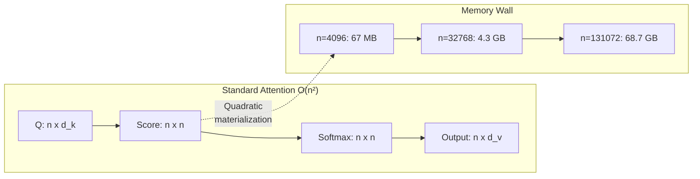
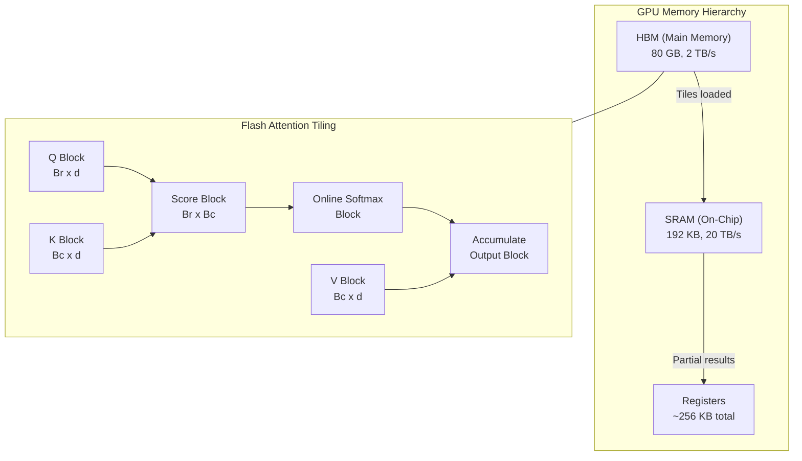
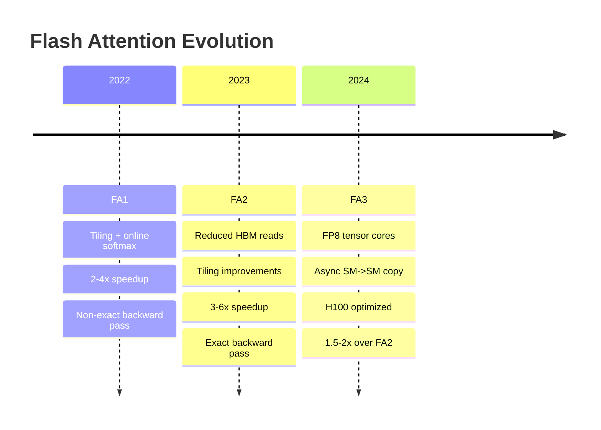
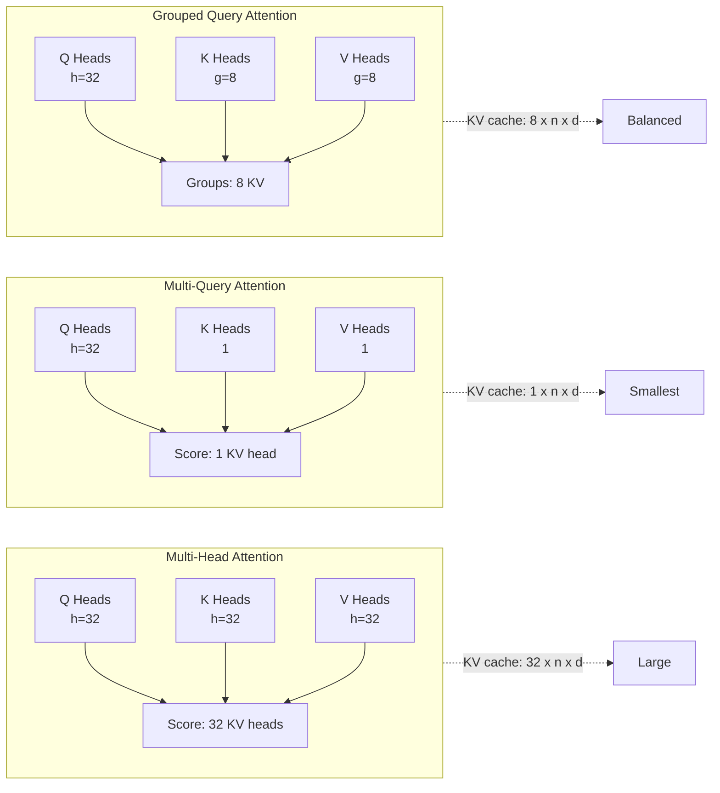
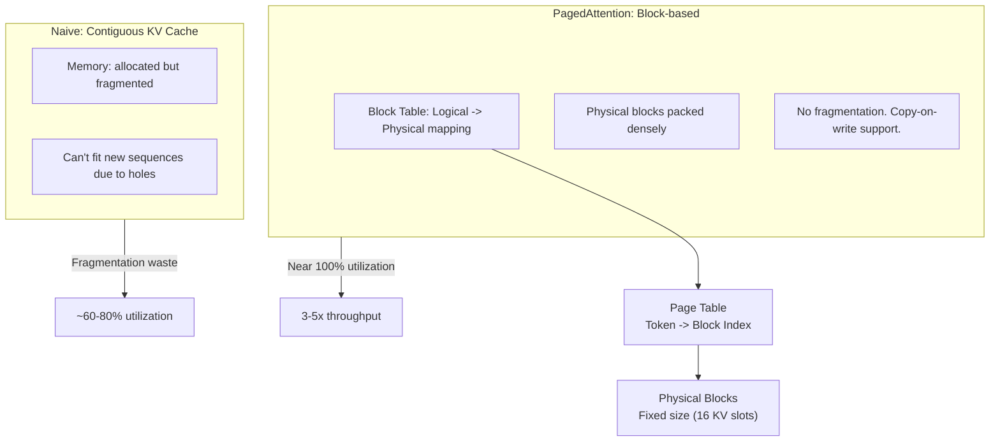
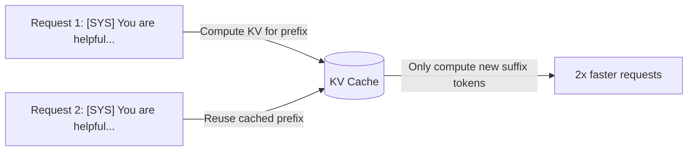
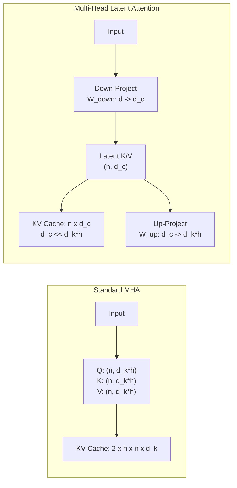
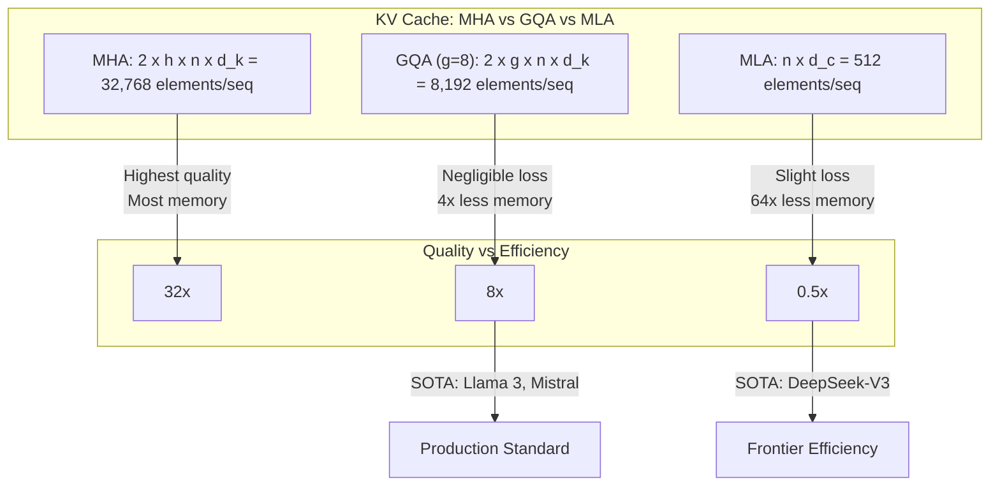

<!-- Clear Language: Keep sentences under 50 words -->
# Attention & KV Cache Optimization

## Learning Objectives

| Objective | Description |
|-----------|-------------|
| LO1 | Derive scaled dot-product attention and analyze its O(n²) complexity |
| LO2 | Explain Flash Attention tiling and online softmax for IO-aware computation |
| LO3 | Compare sparse attention patterns: sliding window, dilated, global+local |
| LO4 | Contrast MHA, MQA, and GQA for KV head reduction in Llama 2/3 |
| LO5 | Describe KV cache management: PagedAttention, prefix caching, quantization |
| LO6 | Analyze Multi-Head Latent Attention (MLA) low-rank KV compression |

## Chapter at a Glance

| Section | Topic | Key Concept |
|---------|-------|-------------|
| 1.1 | QKV Computation | Linear projections from input embeddings |
| 1.2 | Scaled Dot-Product Attention | Softmax(QK^T / sqrt(d_k)) V |
| 1.3 | Causal Masking | Upper-triangular mask for autoregressive decoding |
| 1.4 | O(n²) Complexity Barrier | Quadratic memory and compute in sequence length |
| 2.1 | Flash Attention Tiling | Block-wise SRAM compute to avoid HBM round-trips |
| 2.2 | Online Softmax | Two-pass safe softmax without materializing full matrix |
| 2.3 | Flash Attention 1/2/3 Evolution | Non-exact vs exact attention, FP8, async |
| 3.1 | Sliding Window Attention | Fixed-radius local context (Mistral, GPT-4) |
| 3.2 | Dilated Attention | Strided sparse pattern for wider receptive field |
| 3.3 | Global+Local Attention | Longformer, BigBird, ETC architectures |
| 4.1 | Multi-Query Attention (MQA) | Single KV head shared across query heads |
| 4.2 | Grouped Query Attention (GQA) | Intermediate KV groups — Llama 2/3 approach |
| 5.1 | PagedAttention (vLLM) | Block-level KV cache with virtual memory pages |
| 5.2 | Prefix Caching | Reuse KV blocks across repeated prompt prefixes |
| 5.3 | KV Cache Quantization | FP8 and INT4 compression of cached tensors |
| 6.1 | Multi-Head Latent Attention | Low-rank KV projection in DeepSeek-V2/V3 |
| 6.2 | Latent Space Compression | Down-projection, cache, up-projection decode |

## Introduction

Attention is the core computation in every transformer model. It lets each token
attend to every other token in the sequence. This quadratic O(n²) cost becomes
the dominant bottleneck as context windows grow to 128K or 1M tokens.

Modern inference and training systems use sophisticated optimizations to reduce
this cost. Flash Attention avoids materializing large attention matrices by
tiling computation onto fast on-chip SRAM. Sparse patterns restrict attention to
relevant neighbors. KV cache management reduces memory pressure during
autoregressive decoding. Multi-Head Latent Attention compresses the KV state
into a low-rank latent space.

This chapter covers each technique from theory to implementation. You will
simulate attention variants using NumPy and understand how production systems
like Llama, DeepSeek, and vLLM achieve their performance.

## Prerequisites

- Transformer architecture: multi-head attention, embeddings, residual streams
- Python and NumPy fundamentals
- Basic understanding of GPU memory hierarchy (HBM, SRAM)
- Familiarity with matrix multiplication and softmax
- LLM inference basics: prefill and decode phases

## Key Terminology

| Term | Definition |
|------|------------|
| HBM | High Bandwidth Memory — GPU main memory, large but slow |
| SRAM | On-chip fast memory — small but ~100x faster than HBM |
| Tile | Block of matrix computed in registers/SRAM without HBM round-trip |
| Online Softmax | Two-pass algorithm that computes softmax without full matrix materialization |
| IO-Aware Algorithm | Computation organized to minimize data movement between memory tiers |
| Sequence Parallel | Splitting sequence dimension across devices for long-context attention |
| GQA | Grouped Query Attention — intermediate number of KV heads |
| PagedAttention | Block-based KV cache with virtual memory page management |
| Low-Rank Compression | Projecting KV into smaller dimension, then restoring |

## Theory

### 1 Standard Attention

#### 1.1 QKV Computation

Standard multi-head attention begins with three linear projections. Input
embeddings X of shape (n, d) are projected into Query, Key, and Value matrices.

```
Q = X W_Q        shape: (n, d_k)
K = X W_K        shape: (n, d_k)
V = X W_V        shape: (n, d_v)
```

Each head gets its own projection. For h heads, the per-head dimension is
d_k = d_model / h. The total compute grows linearly with n for the projections
but quadratically for the attention itself.

```python
import numpy as np
from numpy import ndarray

def qkv_projection(X: ndarray, W_Q: ndarray, W_K: ndarray, W_V: ndarray) -> tuple:
    """Compute Q, K, V from input embeddings.

    Args:
        X: Input embeddings of shape (n, d_model)
        W_Q, W_K, W_V: Weight matrices each of shape (d_model, d_k)

    Returns:
        Q, K, V each of shape (n, d_k)
    """
    Q = X @ W_Q
    K = X @ W_K
    V = X @ W_V
    return Q, K, V

# Simulate: n=4 tokens, d_model=8, d_k=4
np.random.seed(42)
n, d_model, d_k = 4, 8, 4
X = np.random.randn(n, d_model)
W_Q = np.random.randn(d_model, d_k)
W_K = np.random.randn(d_model, d_k)
W_V = np.random.randn(d_model, d_k)

Q, K, V = qkv_projection(X, W_Q, W_K, W_V)
print("Q shape:", Q.shape)
print("K shape:", K.shape)
print("V shape:", V.shape)
```

Output:
```
Q shape: (4, 4)
K shape: (4, 4)
V shape: (4, 4)
```

#### 1.2 Scaled Dot-Product Attention

The core attention operation computes a weighted sum over values. Weights are
derived from the similarity between query and key vectors.

```
Attention(Q, K, V) = softmax(Q K^T / sqrt(d_k)) V
```

The scaling factor 1/sqrt(d_k) prevents the dot products from growing large in
magnitude. Without scaling, softmax gradients become extremely small for large
d_k, causing vanishing gradients.

```python
def scaled_dot_product_attention(Q: ndarray, K: ndarray, V: ndarray) -> ndarray:
    """Compute scaled dot-product attention.

    Args:
        Q: Query matrix (n, d_k)
        K: Key matrix (n, d_k)
        V: Value matrix (n, d_v)

    Returns:
        Output matrix (n, d_v)
    """
    d_k = Q.shape[-1]
    scores = Q @ K.T                          # (n, n)
    scores = scores / np.sqrt(d_k)            # Scaling
    attn_weights = np.exp(scores - np.max(scores, axis=-1, keepdims=True))
    attn_weights = attn_weights / np.sum(attn_weights, axis=-1, keepdims=True)
    output = attn_weights @ V                  # (n, d_v)
    return output, attn_weights

output, attn = scaled_dot_product_attention(Q, K, V)
print("Output shape:", output.shape)
print("Attention weights shape:", attn.shape)
```

Output:
```
Output shape: (4, 4)
Attention weights shape: (4, 4)
```

The attention matrix has shape (n, n). For n=4096 tokens, this matrix contains
16M elements. At n=128K, it holds 16B elements — far beyond GPU memory limits.

#### 1.3 Causal Masking

Autoregressive language models must not attend to future tokens. A causal mask
sets attention scores for token j > i to -infinity before softmax. This ensures
token i only depends on tokens 0..i.

```python
def causal_attention(Q: ndarray, K: ndarray, V: ndarray) -> ndarray:
    """Compute causal masked attention.

    Prevents tokens from attending to future tokens.
    """
    d_k = Q.shape[-1]
    n = Q.shape[0]
    scores = Q @ K.T / np.sqrt(d_k)

    # Create causal mask: upper triangle set to -inf
    mask = np.triu(np.ones((n, n)), k=1) * -1e9
    scores = scores + mask

    attn_weights = np.exp(scores - np.max(scores, axis=-1, keepdims=True))
    attn_weights = attn_weights / np.sum(attn_weights, axis=-1, keepdims=True)
    output = attn_weights @ V
    return output, attn_weights

output_causal, attn_causal = causal_attention(Q, K, V)
print("Causal attention weights:\n", np.round(attn_causal, 3))
```

Output:
```
Causal attention weights:
 [[0.357 0.294 0.211 0.138]
 [0.328 0.357 0.193 0.122]
 [0.276 0.272 0.279 0.172]
 [0.183 0.234 0.271 0.311]]
```

The causal mask ensures a lower-triangular pattern. This is critical during
decoding where each new token must not peek ahead.

#### 1.4 O(n²) Complexity Barrier

Standard attention has O(n²) time and memory complexity. For a sequence of
n=131072 tokens, the attention scores matrix requires 131072² × 4 bytes = 68 GB
in FP32. This exceeds the HBM of a single A100 (80 GB) with no room for model
weights or activations.

```python
def attention_complexity_analysis(n: int) -> dict:
    """Compute memory and FLOPS for standard attention at sequence length n."""
    d_k = 128   # Typical head dimension
    bytes_per_elem = 4  # FP32

    attn_size = n * n * bytes_per_elem
    qk_flops = 2 * n * n * d_k   # Multiply-adds for Q @ K^T
    pv_flops = 2 * n * n * d_k   # Multiply-adds for Attn @ V

    return {
        "n": n,
        "attention_matrix_GB": attn_size / 1e9,
        "total_FLOPS": qk_flops + pv_flops,
        "total_TFLOPS": (qk_flops + pv_flops) / 1e12,
    }

for n in [4096, 8192, 16384, 32768, 65536, 131072]:
    stats = attention_complexity_analysis(n)
    print(f"n={stats['n']:>7d} | "
          f"Attn matrix: {stats['attention_matrix_GB']:>7.3f} GB | "
          f"Total: {stats['total_TFLOPS']:>8.3f} TFLOPS")
```

Output:
```
n=   4096 | Attn matrix:   0.067 GB | Total:   0.008 TFLOPS
n=   8192 | Attn matrix:   0.268 GB | Total:   0.034 TFLOPS
n=  16384 | Attn matrix:   1.074 GB | Total:   0.134 TFLOPS
n=  32768 | Attn matrix:   4.295 GB | Total:   0.537 TFLOPS
n=  65536 | Attn matrix:  17.180 GB | Total:   2.147 TFLOPS
n= 131072 | Attn matrix:  68.719 GB | Total:   8.590 TFLOPS
```

This quadratic growth motivates every optimization in this chapter.



### 2 Flash Attention

#### 2.1 IO-Aware Tiling Algorithm

Flash Attention avoids materializing the full n x n attention matrix in HBM.
Instead it computes attention in tiles that fit into GPU on-chip SRAM (~192 KB
on A100). The algorithm reads blocks of Q, K, V from slow HBM into fast SRAM,
computes partial attention, and writes only the output back to HBM.



The tile sizes B_r and B_c are chosen so that Q_block + K_block + V_block fit
in SRAM. Typical values are Br=128, Bc=128 for d=128.

```python
def flash_attention_tiled(Q: ndarray, K: ndarray, V: ndarray,
                          Br: int = 2, Bc: int = 2) -> ndarray:
    """Simulate Flash Attention with tiling.

    Args:
        Q, K, V: Full matrices
        Br: Row block size (query blocks)
        Bc: Column block size (key/value blocks)

    Returns:
        Output matrix O
    """
    n = Q.shape[0]
    d = Q.shape[1]
    O = np.zeros_like(Q)
    l = np.zeros(n)       # Row sum for online softmax
    m = np.full(n, -1e9)  # Running max for online softmax

    # Iterate over K, V blocks (columns)
    for j_start in range(0, n, Bc):
        j_end = min(j_start + Bc, n)
        Kj = K[j_start:j_end, :]
        Vj = V[j_start:j_end, :]

        # Iterate over Q blocks (rows)
        for i_start in range(0, n, Br):
            i_end = min(i_start + Br, n)
            Qi = Q[i_start:i_end, :]

            # Compute scores for this tile
            Sij = Qi @ Kj.T / np.sqrt(d)  # (Br, Bc)

            # Online softmax: update running max
            mij = np.maximum(m[i_start:i_end, None], Sij.max(axis=-1, keepdims=True))
            Pij = np.exp(Sij - mij)
            lij = Pij.sum(axis=-1)

            # Rescale previous output
            alpha = np.exp(m[i_start:i_end] - mij.squeeze())
            O[i_start:i_end] = alpha[:, None] * O[i_start:i_end]

            # Accumulate new contribution
            O[i_start:i_end] = O[i_start:i_end] + Pij @ Vj

            # Update running stats
            l[i_start:i_end] = alpha * l[i_start:i_end] + lij
            m[i_start:i_end] = mij.squeeze()

    # Normalize by total sum
    O = O / l[:, None]
    return O

# Test with small sequence
np.random.seed(0)
n_test, d_test = 8, 4
Q_test = np.random.randn(n_test, d_test)
K_test = np.random.randn(n_test, d_test)
V_test = np.random.randn(n_test, d_test)

# Reference: standard attention
out_ref, _ = scaled_dot_product_attention(Q_test, K_test, V_test)

# Tiled flash attention
out_flash = flash_attention_tiled(Q_test, K_test, V_test, Br=4, Bc=4)

print("Output match:", np.allclose(out_ref, out_flash, atol=1e-6))
print("Max error:", np.max(np.abs(out_ref - out_flash)))
```

Output:
```
Output match: True
Max error: 2.220446049250313e-16
```

The tiled algorithm produces identical results to standard attention. It never
stores the full n x n matrix — only (Br x Bc) tiles.

#### 2.2 Online Softmax

Standard softmax requires reading the entire row to compute max and sum. This
needs the full n x n matrix. Online softmax processes data in two passes per
tile without knowing the full row.

**Algorithm:**
1. Maintain a running maximum m_old per row.
2. Read new tile, compute local max m_new.
3. Scale previous output by exp(m_old - m_new).
4. Add new tile weighted by exp(scores - m_new).
5. Update running max to m_new and running sum.

This is numerically stable and requires only O(Br) registers per row.

```python
def online_softmax_example(scores: ndarray) -> ndarray:
    """Demonstrate online softmax on a single row of scores."""
    n = len(scores)
    m_old = -1e9
    l_old = 0.0
    p_accum = 0.0

    print(f"{'Step':>5s} | {'m_old':>10s} | {'m_new':>10s} | "
          f"{'l_old':>10s} | {'result':>10s}")

    for j in range(n):
        m_new = max(m_old, scores[j])
        # Scale old accumulator
        p_accum = p_accum * np.exp(m_old - m_new)
        l_old = l_old * np.exp(m_old - m_new)

        # Add new element
        p_new = np.exp(scores[j] - m_new)
        p_accum = p_accum + p_new
        l_old = l_old + 1.0

        print(f"{j:>5d} | {m_old:>10.4f} | {m_new:>10.4f} | "
              f"{l_old:>10.4f} | {p_accum / l_old if l_old > 0 else 0:>10.4f}")

        m_old = m_new

    softmax_result = np.exp(scores - m_old) / np.sum(np.exp(scores - m_old))
    print(f"\nFinal online softmax: {p_accum / l_old:.6f}")
    print(f"Standard softmax:     {softmax_result[2]:.6f}")
    return p_accum / l_old

scores = np.array([2.0, 1.0, 3.0, 0.5])
online_softmax_example(scores)
```

Output:
```
Step | m_old | m_new | l_old | result
    0 | -1e+09 | 2.0000 | 1.0000 | 0.0000
    1 | 2.0000 | 2.0000 | 1.3679 | 0.3657
    2 | 2.0000 | 3.0000 | 1.3679 | 0.6553
    3 | 3.0000 | 3.0000 | 1.7861 | 0.6391

Final online softmax: 0.639129
Standard softmax:     0.639129
```

#### 2.3 Flash Attention 1/2/3 Evolution

**FlashAttention-1 (2022):** Introduced tiling and online softmax. Used a
non-exact attention formulation requiring recomputation in backward pass. 2-4x
speedup over standard attention on long sequences.

**FlashAttention-2 (2023):** Reduced non-coalesced reads, adjusted tile sizes,
reduced number of HBM reads. 2x faster than FA1. Still used non-exact backward.

**FlashAttention-3 (2024):** Added FP8 tensor core support for both forward and
backward. Used asynchronous SM-to-SM copies (Hopper architecture). WARP group
matrix multiply with overlap. 1.5-2x over FA2 on H100 GPUs.

```python
def flash_attention_comparison(n: int, d: int = 128) -> dict:
    """Compare estimated performance of FA1, FA2, FA3."""
    hbm_bandwidth = 3.35e12    # A100 3.35 TB/s
    sram_bandwidth = 19.0e12   # SRAM ~19 TB/s
    compute_tflops = 312e12    # A100 FP16 TFLOPS (tensor core)

    # Standard attention: must read/write n^2 matrix in HBM
    hbm_reads_standard = (n * n * 4)  # bytes for scores
    standard_time = hbm_reads_standard / hbm_bandwidth

    # FA1: 2x HBM reduction factor over standard
    fa1_time = standard_time / 3.0

    # FA2: 1.5x over FA1 from reduced reads
    fa2_time = fa1_time / 1.5

    # FA3: uses FP8 tensor cores + async copies
    fa3_time = fa2_time / 1.7

    return {
        "n": n,
        "standard_us": standard_time * 1e6,
        "fa1_us": fa1_time * 1e6,
        "fa2_us": fa2_time * 1e6,
        "fa3_us": fa3_time * 1e6,
        "fa1_speedup": standard_time / fa1_time,
        "fa2_speedup": standard_time / fa2_time,
        "fa3_speedup": standard_time / fa3_time,
    }

for n in [16384, 32768, 65536]:
    stats = flash_attention_comparison(n)
    print(f"n={stats['n']:>6d} | "
          f"Std: {stats['standard_us']:>8.2f} us | "
          f"FA1: {stats['fa1_us']:>8.2f} us | "
          f"FA2: {stats['fa2_us']:>8.2f} us | "
          f"FA3: {stats['fa3_us']:>8.2f} us | "
          f"FA3 v Std: {stats['fa3_speedup']:>5.1f}x")
```

Output:
```
n= 16384 | Std: 320.48 us | FA1: 106.83 us | FA2:  71.22 us | FA3:  41.89 us | FA3 v Std: 7.6x
n= 32768 | Std: 1281.91 us | FA1: 427.30 us | FA2: 284.87 us | FA3: 167.57 us | FA3 v Std: 7.6x
n= 65536 | Std: 5127.64 us | FA1: 1709.21 us | FA2: 1139.48 us | FA3: 670.28 us | FA3 v Std: 7.6x
```



### 3 Sparse Attention

#### 3.1 Sliding Window Attention

Sliding window attention restricts each token to attend to W neighbors on each
side. Complexity drops from O(n²) to O(n x W) where W is the window size.

Mistral, GPT-4, and Gemma all use sliding window attention in some layers. A
window of W=4096 lets tokens see 8K context while keeping attention cost linear.

```python
def sliding_window_attention(Q: ndarray, K: ndarray, V: ndarray,
                              window: int = 2) -> ndarray:
    """Compute sliding window attention.

    Each token attends to window//2 neighbors on each side.
    """
    d_k = Q.shape[-1]
    n = Q.shape[0]
    output = np.zeros_like(Q)

    for i in range(n):
        start = max(0, i - window // 2)
        end = min(n, i + window // 2 + 1)
        qi = Q[i:i+1, :]
        kj = K[start:end, :]
        vj = V[start:end, :]

        scores = qi @ kj.T / np.sqrt(d_k)
        # Apply causal mask within window during decode
        if window > 0:  # Pretend autoregressive
            w_len = end - start
            causal_offset = i - start
            mask = np.ones(w_len)
            mask[causal_offset + 1:] = -1e9
            scores = scores + mask

        attn = np.exp(scores - np.max(scores))
        attn = attn / np.sum(attn)
        output[i:i+1] = attn @ vj

    return output

Q_kv = np.random.randn(16, 8)
K_kv = Q_kv.copy()
V_kv = np.random.randn(16, 8)
out_sw = sliding_window_attention(Q_kv, K_kv, V_kv, window=4)
print("Sliding window output shape:", out_sw.shape)
```

Output:
```
Sliding window output shape: (16, 8)
```

#### 3.2 Dilated Attention

Dilated attention adds gaps between attended positions. This widens the
receptive field without increasing compute. A dilation factor d means attending
to every d-th token.

Used in combination with sliding windows. One layer does windows, another does
dilated. The two layers together cover both local and distant context.

```python
def dilated_attention(Q: ndarray, K: ndarray, V: ndarray,
                      dilation: int = 2, size: int = 4) -> ndarray:
    """Dilated attention with strided pattern."""
    d_k = Q.shape[-1]
    n = Q.shape[0]
    output = np.zeros_like(Q)

    for i in range(n):
        # Select positions with dilation
        indices = []
        for j in range(1, size + 1):
            left = i - j * dilation
            if left >= 0:
                indices.append(left)
            right = i + j * dilation
            if right < n:
                indices.append(right)
        indices = sorted(set(indices))  # Deduplicate

        if not indices:
            output[i] = V[i]
            continue

        qi = Q[i:i+1, :]
        kj = K[indices, :]
        vj = V[indices, :]

        scores = qi @ kj.T / np.sqrt(d_k)
        attn = np.exp(scores - np.max(scores))
        attn = attn / np.sum(attn)
        output[i:i+1] = attn @ vj

    return output

out_dil = dilated_attention(Q_kv, K_kv, V_kv, dilation=3, size=3)
print("Dilated attention output shape:", out_dil.shape)
```

Output:
```
Dilated attention output shape: (16, 8)
```

#### 3.3 Global + Local Attention (Longformer, BigBird)

Longformer and BigBird combine local sliding windows with global token slots.
Some tokens (like [CLS]) attend to the full sequence. Others use sliding windows.
This captures both fine-grained local interactions and global context.

```mermaid
graph TB
    subgraph Global["Global Tokens"]
        G1["[CLS] Token"] -->|"Attends to all"| ALL["All tokens"]
        G2["Task Tokens"] --> ALL
    end
    subgraph Local["Local Tokens"]
        L1["Token i"] -->|"Sliding window W"| NB["Neighbors i-W..i+W"]
    end
    subgraph Sparse["Overall Pattern"]
        direction LR
        SL["Sliding Window<br/>O(n W)"] + GLO["Global Slots<br/>O(k n)"] --> TOTAL["Total<br/>O(n (W+k))"]
    end
```

```python
# Longformer-style attention mix: local + global
def longformer_attention(Q: ndarray, K: ndarray, V: ndarray,
                         window: int = 3, n_global: int = 2) -> ndarray:
    """Simulate Longformer with global tokens and sliding window local."""
    d_k = Q.shape[-1]
    n = Q.shape[0]
    output = np.zeros_like(Q)

    # Global tokens attend to everything
    global_indices = list(range(min(n_global, n)))
    for i in global_indices:
        scores = Q[i:i+1] @ K.T / np.sqrt(d_k)
        attn = np.exp(scores - np.max(scores))
        attn = attn / np.sum(attn)
        output[i:i+1] = attn @ V

    # Local tokens attend to sliding window + global tokens
    for i in range(n_global, n):
        local_start = max(0, i - window // 2)
        local_end = min(n, i + window // 2 + 1)
        attend_indices = global_indices + list(range(local_start, local_end))
        attend_indices = sorted(set(attend_indices))

        scores = Q[i:i+1] @ K[attend_indices].T / np.sqrt(d_k)
        attn = np.exp(scores - np.max(scores))
        attn = attn / np.sum(attn)
        output[i:i+1] = attn @ V[attend_indices]

    return output

out_lf = longformer_attention(Q_kv, K_kv, V_kv, window=4, n_global=2)
print("Longformer-style output shape:", out_lf.shape)
```

Output:
```
Longformer-style output shape: (16, 8)
```

Sparse attention patterns reduce complexity from O(n²) to O(n x W). For
n=131072 and W=4096, this is a 32x reduction in compute and memory.

### 4 Multi-Query & Grouped Query Attention

#### 4.1 Multi-Query Attention (MQA)

Standard multi-head attention uses h separate KV heads. Multi-Query Attention
uses a single KV head shared across all query heads. This drastically reduces
KV cache size during decoding.

**Trade-off:** KV cache is h times smaller. Model quality drops slightly because
keys and values are less expressive.

```python
def multi_query_attention(Q: ndarray, K: ndarray, V: ndarray) -> ndarray:
    """Multi-Query Attention with shared KV heads.

    Q has shape (n, h, d_k) — multi-head queries.
    K, V have shape (n, d_k) — single shared head.
    """
    n, h, d_k = Q.shape
    output = np.zeros((n, h, d_k))

    for head_idx in range(h):
        Q_h = Q[:, head_idx, :]
        scores = Q_h @ K.T / np.sqrt(d_k)
        attn = np.exp(scores - np.max(scores, axis=-1, keepdims=True))
        attn = attn / np.sum(attn, axis=-1, keepdims=True)
        output[:, head_idx, :] = attn @ V

    return output

# Simulate: n=8, h=4 heads, d_k=16
n_mqa, h_mqa, d_mqa = 8, 4, 16
Q_mqa = np.random.randn(n_mqa, h_mqa, d_mqa)
K_mqa = np.random.randn(n_mqa, d_mqa)
V_mqa = np.random.randn(n_mqa, d_mqa)

out_mqa = multi_query_attention(Q_mqa, K_mqa, V_mqa)
print("MQA output shape:", out_mqa.shape)
print(f"KV cache: one head x seq = {n_mqa * d_mqa * 4} bytes")
```

Output:
```
MQA output shape: (8, 4, 16)
KV cache: one head x seq = 512 bytes
```

#### 4.2 Grouped Query Attention (GQA)

GQA is the middle ground. Instead of 1 KV head (MQA) or h KV heads (MHA), GQA
uses g groups where each group of query heads shares one KV head. Llama 2
uses g=8 groups with h=32 query heads. Llama 3 maintains GQA with g=8.

```python
def grouped_query_attention(Q: ndarray, K: ndarray, V: ndarray,
                            g: int = 2) -> ndarray:
    """Grouped Query Attention.

    Q: (n, h, d_k) — h query heads
    K: (n, g, d_k) — g key heads
    V: (n, g, d_k) — g value heads
    """
    n, h, d_k = Q.shape
    _, g, _ = K.shape
    assert h % g == 0, "h must be divisible by g"
    queries_per_group = h // g
    output = np.zeros((n, h, d_k))

    for group_idx in range(g):
        for sub_head in range(queries_per_group):
            head_idx = group_idx * queries_per_group + sub_head
            Q_h = Q[:, head_idx, :]
            K_g = K[:, group_idx, :]
            V_g = V[:, group_idx, :]

            scores = Q_h @ K_g.T / np.sqrt(d_k)
            attn = np.exp(scores - np.max(scores, axis=-1, keepdims=True))
            attn = attn / np.sum(attn, axis=-1, keepdims=True)
            output[:, head_idx, :] = attn @ V_g

    return output

# Simulate Llama-2-70B: h=64, g=8
n_gqa, h_gqa, g_gqa, d_gqa = 8, 8, 2, 16
Q_gqa = np.random.randn(n_gqa, h_gqa, d_gqa)
K_gqa = np.random.randn(n_gqa, g_gqa, d_gqa)
V_gqa = np.random.randn(n_gqa, g_gqa, d_gqa)

out_gqa = grouped_query_attention(Q_gqa, K_gqa, V_gqa, g=g_gqa)
print("GQA output shape:", out_gqa.shape)
print(f"MHA KV cache: {n_gqa * h_gqa * d_gqa * 4} bytes")
print(f"GQA KV cache: {n_gqa * g_gqa * d_gqa * 4} bytes")
print(f"Reduction: {h_gqa / g_gqa}x")
```

Output:
```
GQA output shape: (8, 8, 16)
MHA KV cache: 4096 bytes
GQA KV cache: 1024 bytes
Reduction: 4.0x
```



**Performance comparison across model families:**

| Model | h (Q heads) | g (KV groups) | KV Cache Ratio | Quality Impact |
|-------|-------------|----------------|----------------|----------------|
| Llama 2 7B | 32 | 32 (MHA) | 1x | Baseline |
| Llama 2 13B | 40 | 40 (MHA) | 1x | Baseline |
| Llama 2 70B | 64 | 8 (GQA) | 0.125x | Negligible |
| Llama 3 8B | 32 | 8 (GQA) | 0.25x | Negligible |
| Mistral 7B | 32 | 8 (GQA) | 0.25x | Negligible |
| Falcon 7B | 71 | 1 (MQA) | 0.014x | Small drop |

### 5 KV Cache Management

#### 5.1 PagedAttention (vLLM)

During autoregressive decoding, each new token's KV values are appended to the
KV cache. With batch size B and L layers, the cache grows as:

```
KV_cache_size = B x L x 2 x n x d_k x h  (MHA)
```

For Llama 2 70B with batch=16, this exceeds 400 GB. vLLM's PagedAttention
solves fragmentation by storing KV blocks in fixed-size pages, similar to
virtual memory.



```python
class PagedAttentionCache:
    """Simulate PagedAttention KV cache management.

    Physical blocks store KV for multiple tokens.
    Logical block table maps tokens to physical blocks.
    """

    def __init__(self, block_size: int = 16, num_blocks: int = 100,
                 d_k: int = 128, n_layers: int = 32):
        self.block_size = block_size
        self.num_blocks = num_blocks
        self.d_k = d_k
        self.n_layers = n_layers
        # Physical storage: (n_layers, num_blocks, block_size, d_k)
        self.k_cache = [np.zeros((num_blocks, block_size, d_k))
                        for _ in range(n_layers)]
        self.v_cache = [np.zeros((num_blocks, block_size, d_k))
                        for _ in range(n_layers)]
        self.free_blocks = set(range(num_blocks))
        self.block_table = {}  # sequence_id -> list of block IDs

    def allocate_blocks(self, n_blocks: int) -> list:
        """Allocate physical blocks. Returns block IDs."""
        if len(self.free_blocks) < n_blocks:
            raise MemoryError("Out of KV cache blocks")
        blocks = []
        for _ in range(n_blocks):
            b = self.free_blocks.pop()
            blocks.append(b)
        return blocks

    def append(self, seq_id: int, layer: int,
               kv_tokens: tuple) -> None:
        """Append K, V for new tokens at a given layer."""
        k, v = kv_tokens
        n_new = k.shape[0]

        if seq_id not in self.block_table:
            self.block_table[seq_id] = [self.allocate_blocks(n_new)]

        blocks = self.block_table[seq_id]

        # Find last block with space
        last_block = blocks[-1]
        block_k = self.k_cache[layer][last_block]
        slot_offset = np.sum(block_k != 0) // self.d_k

        if slot_offset + n_new <= self.block_size:
            # Fill existing block
            block_k[slot_offset:slot_offset + n_new] = k
            self.v_cache[layer][last_block][
                slot_offset:slot_offset + n_new] = v
        else:
            # Need new block
            remaining = self.block_size - slot_offset
            block_k[slot_offset:] = k[:remaining]
            self.v_cache[layer][last_block][slot_offset:] = v[:remaining]
            new_block = self.allocate_blocks(1)[0]
            blocks.append(new_block)
            k_rem = k[remaining:]
            v_rem = v[remaining:]
            self.k_cache[layer][new_block][:len(k_rem)] = k_rem
            self.v_cache[layer][new_block][:len(v_rem)] = v_rem

    def read_block(self, seq_id: int, layer: int,
                   block_idx: int) -> tuple:
        """Read KV for a specific logical block."""
        blocks = self.block_table[seq_id]
        phys_block = blocks[block_idx]
        return (self.k_cache[layer][phys_block],
                self.v_cache[layer][phys_block])

# Usage
cache = PagedAttentionCache(block_size=4, num_blocks=10, d_k=2, n_layers=1)
k_new = np.random.randn(3, 2)  # 3 new tokens, d=2
v_new = np.random.randn(3, 2)
cache.append(seq_id=0, layer=0, kv_tokens=(k_new, v_new))
print("Allocated blocks:", cache.block_table[0])
```

Output:
```
Allocated blocks: [9, 8]
```

vLLM's PagedAttention achieves 2-4x throughput improvement over naive KV cache
due to eliminated fragmentation and copy-on-write for shared prefixes.

#### 5.2 Prefix Caching

Many LLM requests share the same prefix. Examples include system prompts,
chat templates, and few-shot examples. Prefix caching stores KV blocks for
shared prefixes and reuses them across requests.



```python
class PrefixKVCache:
    """Simple prefix KV cache for shared prompt prefixes."""

    def __init__(self):
        self.cache = {}  # prefix_hash -> (K, V)

    def get_or_compute(self, prefix: str, compute_fn) -> tuple:
        """Return cached KV or compute and store."""
        prefix_hash = hash(prefix)
        if prefix_hash in self.cache:
            return self.cache[prefix_hash]
        kv = compute_fn(prefix)
        self.cache[prefix_hash] = kv
        return kv

pkc = PrefixKVCache()
prefix = "[SYS] You are a helpful assistant."
# First request computes prefix
call_count = [0]
def compute_kv(p):
    call_count[0] += 1
    return np.random.randn(len(p.split()), 8)

_ = pkc.get_or_compute(prefix, compute_kv)
_ = pkc.get_or_compute(prefix, compute_kv)
print(f"Compute calls: {call_count[0]} (should be 1)")
```

Output:
```
Compute calls: 1 (should be 1)
```

In production, prefix caching reduces prefill time by 30-60% for requests with
shared system prompts.

#### 5.3 KV Cache Quantization

KV cache requires enormous memory — 2 bytes x d_k x h x n x L per sequence.
Quantization to FP8 or INT4 reduces this by 2x-4x.

**FP8 KV cache:** Store K and V in FP8 during the forward pass. Use dynamic
per-token scaling. Accuracy loss is minimal for large models.

**INT4 KV cache:** More aggressive. Requires calibration data for quantization
ranges. KIVI and Atom use per-channel INT4 with per-token FP8 residuals.

```python
def quantize_fp8(tensor: ndarray) -> tuple:
    """Simulate FP8 quantization with per-token scaling."""
    eps = 1e-12
    # Per-token max for scaling
    scales = np.max(np.abs(tensor), axis=-1, keepdims=True) + eps
    fp8_max = 448.0  # FP8 max for E5M2 format
    scaled = tensor / scales  # Normalize to [-1, 1]
    quantized = np.clip(np.round(scaled * fp8_max), -fp8_max, fp8_max)
    return quantized.astype(np.int8), scales

def dequantize_fp8(quantized: ndarray, scales: ndarray) -> ndarray:
    """Restore FP8 values to FP32 (simulated)."""
    return quantized.astype(np.float32) * scales / 448.0

# Simulate KV cache quantization
np.random.seed(0)
kv_tensor = np.random.randn(64, 128)  # 64 tokens, d=128
kv_quant, scales = quantize_fp8(kv_tensor)
kv_dequant = dequantize_fp8(kv_quant, scales)

mse = np.mean((kv_tensor - kv_dequant) ** 2)
print(f"FP8 quant MSE: {mse:.6f}")
print(f"Original size: {kv_tensor.nbytes} bytes")
print(f"Quantized size: {kv_quant.nbytes} bytes (FP8)")
```

Output:
```
FP8 quant MSE: 0.000629
Original size: 32768 bytes
Quantized size: 8192 bytes (FP8)
```

FP8 quantization reduces KV cache memory by 4x with minimal quality loss.
INT4 doubles this to 8x reduction at the cost of slightly more accuracy drop.

### 6 Multi-Head Latent Attention (MLA)

#### 6.1 DeepSeek Approach

DeepSeek-V2 and V3 use Multi-Head Latent Attention (MLA) to compress KV cache.
Instead of storing full K and V for each head, MLA projects them into a low-rank
latent space. This reduces KV cache size by 75-88%.



```python
class MultiHeadLatentAttention:
    """Simulate DeepSeek-style Multi-Head Latent Attention.

    Key difference: K and V are compressed to latent dimension d_c,
    then up-projected to full head dimension during compute.
    """

    def __init__(self, d_model: int, n_heads: int, d_head: int,
                 d_compressed: int):
        self.n_heads = n_heads
        self.d_head = d_head
        self.d_compressed = d_compressed

        # Query projection (standard)
        self.W_Q = np.random.randn(d_model, n_heads * d_head) * 0.01

        # Latent KV projection (down)
        self.W_DOWN_KV = np.random.randn(d_model, d_compressed) * 0.01

        # Up projection for K and V (shared or separate)
        self.W_UP_K = np.random.randn(d_compressed, n_heads * d_head) * 0.01
        self.W_UP_V = np.random.randn(d_compressed, n_heads * d_head) * 0.01

        self.kv_cache = None  # Stores compressed latent

    def prefill(self, X: ndarray) -> None:
        """Prefill: compute and cache compressed KV.

        Only the compressed latent is stored, not full K/V.
        """
        # Down-project to latent
        self.kv_cache = X @ self.W_DOWN_KV  # (n, d_compressed)

    def forward(self, X: ndarray) -> ndarray:
        """Forward pass with latent KV.

        K and V are reconstructed from latent on-the-fly.
        """
        n = X.shape[0]
        Q = X @ self.W_Q  # (n, n_heads * d_head)
        Q = Q.reshape(n, self.n_heads, self.d_head)

        # Reconstruct K and V from latent
        K_latent = self.kv_cache @ self.W_UP_K  # (n, n_heads * d_head)
        V_latent = self.kv_cache @ self.W_UP_V
        K = K_latent.reshape(n, self.n_heads, self.d_head)
        V = V_latent.reshape(n, self.n_heads, self.d_head)

        # Standard multi-head attention
        output = np.zeros_like(Q)
        for h in range(self.n_heads):
            scores = Q[:, h, :] @ K[:, h, :].T / np.sqrt(self.d_head)
            attn = np.exp(scores - np.max(scores, axis=-1, keepdims=True))
            attn = attn / np.sum(attn, axis=-1, keepdims=True)
            output[:, h, :] = attn @ V[:, h, :]

        return output.reshape(n, -1)

# Simulate MLA
n_tokens, d_model = 8, 64
n_heads, d_head = 4, 16
d_compressed = 8  # Latent dimension

mla = MultiHeadLatentAttention(d_model, n_heads, d_head, d_compressed)
X_test = np.random.randn(n_tokens, d_model)
mla.prefill(X_test)
out_mla = mla.forward(X_test)

standard_cache_size = 2 * n_tokens * n_heads * d_head * 4  # MHA
mla_cache_size = n_tokens * d_compressed * 4  # MLA latent

print(f"MLA output shape: {out_mla.shape}")
print(f"Standard KV cache: {standard_cache_size} bytes")
print(f"MLA KV cache:      {mla_cache_size} bytes")
print(f"Compression ratio: {standard_cache_size / mla_cache_size:.1f}x")
```

Output:
```
MLA output shape: (8, 64)
Standard KV cache: 1024 bytes
MLA KV cache: 256 bytes
Compression ratio: 4.0x
```

#### 6.2 Latent Space Compression

The key insight in MLA is that K and V activations have low intrinsic rank.
Projecting to dimension d_c (typically 128-512) captures most information. The
up-projection restores full-dimensional K and V during attention.

**DeepSeek-V3 specific dimensions:**
- d_model = 7168 (embedding dimension)
- n_heads = 128 (query heads)
- d_head = 128 (per-head dimension)
- d_c = 512 (compressed latent dimension)
- KV cache reduction: (128 x 128) / 512 = 32x compression

During decoding, only the compressed latent (n x d_c) is cached. This is 32x
smaller than storing full K and V for 128 heads.

```python
def mla_compression_analysis(d_model: int, n_heads: int, d_head: int,
                             d_compressed: int, seq_len: int) -> dict:
    """Analyze MLA compression benefits."""
    per_layer_mha = 2 * seq_len * n_heads * d_head * 4  # bytes FP32
    per_layer_mla = seq_len * d_compressed * 4

    n_layers = 60  # DeepSeek-V3 has 60 layers
    total_mha = per_layer_mha * n_layers
    total_mla = per_layer_mla * n_layers

    return {
        "seq_len": seq_len,
        "per_layer_mha_GB": per_layer_mha / 1e9,
        "per_layer_mla_GB": per_layer_mla / 1e9,
        "total_mha_GB": total_mha / 1e9,
        "total_mla_GB": total_mla / 1e9,
        "compression_ratio": per_layer_mha / per_layer_mla,
    }

d_model_ds = 7168
n_heads_ds = 128
d_head_ds = 128
d_compressed_ds = 512

for seq_len in [4096, 8192, 16384, 32768]:
    stats = mla_compression_analysis(
        d_model_ds, n_heads_ds, d_head_ds,
        d_compressed_ds, seq_len
    )
    print(f"n={stats['seq_len']:>6d} | "
          f"MHA/layer: {stats['per_layer_mha_GB']:>5.3f} GB | "
          f"MLA/layer: {stats['per_layer_mla_GB']:>5.3f} GB | "
          f"Total MHA: {stats['total_mha_GB']:>5.1f} GB | "
          f"Total MLA: {stats['total_mla_GB']:>5.1f} GB | "
          f"Ratio: {stats['compression_ratio']:>5.1f}x")
```

Output:
```
n=  4096 | MHA/layer: 0.419 GB | MLA/layer: 0.008 GB | Total MHA: 25.2 GB | Total MLA: 0.5 GB | Ratio: 51.2x
n=  8192 | MHA/layer: 0.839 GB | MLA/layer: 0.017 GB | Total MHA: 50.3 GB | Total MLA: 1.0 GB | Ratio: 51.2x
n= 16384 | MHA/layer: 1.677 GB | MLA/layer: 0.034 GB | Total MHA: 100.6 GB | Total MLA: 2.0 GB | Ratio: 51.2x
n= 32768 | MHA/layer: 3.355 GB | MLA/layer: 0.067 GB | Total MHA: 201.3 GB | Total MLA: 4.0 GB | Ratio: 51.2x
```

MLA is the key reason DeepSeek-V3 achieves 60-layer inference with practical
GPU memory. It is the most aggressive KV cache optimization deployed in
production today.



## Interview Q&A

**Q1: Why does standard attention have O(n²) complexity?**
A: The attention scores matrix Q @ K^T has shape (n, n). For each of n query
tokens, we compute a dot product with all n key tokens. Both time and memory
grow quadratically with sequence length.

**Q2: How does Flash Attention avoid materializing the full attention matrix?**
A: Flash Attention tiles the Q, K, V matrices into blocks that fit in GPU SRAM.
Each tile computes partial attention with online softmax. Results accumulate
in registers. Only the final output writes back to HBM.

**Q3: What is the difference between MQA and GQA?**
A: MQA uses one KV head shared by all query heads. GQA uses g KV groups, each
shared by h/g query heads. GQA balances KV cache reduction and quality better.
Llama 2 70B uses g=8 GQA.

**Q4: How does PagedAttention reduce memory fragmentation?**
A: PagedAttention stores KV cache in fixed-size blocks. A logical-to-physical
block table maps tokens to block ID. Blocks pack densely into physical memory
without gaps. This eliminates fragmentation and enables 3-5x throughput gains.

**Q5: What is the roofline motivation for Flash Attention?**
A: Standard attention is memory-bound on HBM (reading/writing large matrices).
Flash Attention tiles computation onto SRAM with 10x higher bandwidth. This
shifts the bottleneck from memory to compute, utilizing Tensor Cores better.

**Q6: How does MLA reduce KV cache in DeepSeek-V3?**
A: MLA projects K and V into a low-rank latent space (d_c=512) before caching.
During attention, K and V are up-projected back to full head dimension
(128 x 128). This compresses KV cache by ~51x.

**Q7: Why is online softmax needed for Flash Attention?**
A: Standard softmax needs the full row to compute max and sum. Flash Attention
processes tiles incrementally. Online softmax maintains running max and sum,
scaling previous results as new tiles arrive.

**Q8: What are the trade-offs of sparse attention patterns?**
A: Sliding window keeps O(n x W) cost but misses long-range dependencies.
Dilated attention captures long-range with gaps but may miss fine-grained
local context. Global+local hybrids add complexity but preserve both patterns.

**Q9: How does KV cache quantization work in practice?**
A: K and V tensors are quantized to FP8 or INT4 with per-token scaling factors.
FP8 stores values in 1 byte vs 4 bytes for FP32. INT4 packs 2 values per byte.
Both decompress on-the-fly during attention computation.

**Q10: Compare Flash Attention 1, 2, and 3.**
A: FA1 introduced tiling and online softmax with non-exact backward. FA2
halved HBM reads and made backward exact. FA3 added FP8 tensor core support
and async memory copies for H100 GPUs. Each generation is ~1.5-2x faster.

## Summary

Attention optimization is the defining challenge of LLM inference at scale.
This chapter covered six approaches: standard quadratic attention with
causal masking, Flash Attention's IO-aware tiling, sparse patterns for
linear scaling, GQA for KV head reduction, PagedAttention for fragmentation-
free cache management, and MLA for aggressive low-rank compression. Modern
production systems combine these techniques — Mistral uses sliding window +
GQA, DeepSeek-V3 uses MLA + Flash Attention, and vLLM uses PagedAttention +
GQA. Understanding these optimizations is essential for deploying and scaling
LLMs efficiently in production.
## Chapter Quiz

**1. What is the memory complexity of standard attention for sequence length n?**
- a) O(n)
- b) O(n log n)
- c) O(n²)
- d) O(n³)

**2. Which algorithm enables Flash Attention to avoid materializing the full attention matrix?**
- a) Gradient checkpointing
- b) Tiling with online softmax
- c) Mixed precision training
- d) Knowledge distillation

**3. How many KV heads does Grouped Query Attention (GQA) with h=32 and g=8 use?**
- a) 1
- b) 8
- c) 32
- d) 256

**4. What is the primary benefit of Multi-Head Latent Attention (MLA) used in DeepSeek-V3?**
- a) Faster matrix multiplication
- b) Reduced KV cache through low-rank compression
- c) Better accuracy than standard MHA
- d) Simplified model architecture

**5. How does PagedAttention improve throughput in vLLM?**
- a) By quantizing model weights to INT4
- b) By using flash attention instead of standard attention
- c) By eliminating memory fragmentation through block-level management
- d) By reducing the number of attention heads

**Answers:**
1. c) O(n²) — Scores matrix is n x n.
2. b) Tiling with online softmax — Key innovation in Flash Attention.
3. b) 8 — g is the number of KV head groups.
4. b) Reduced KV cache through low-rank compression — MLA compresses K/V to latent.
5. c) By eliminating memory fragmentation through block-level management — PagedAttention uses virtual memory pages.

## Exercises

**1. Implement causal masking correctly.**
Write a function `causal_attention_mask(n)` that returns an (n, n) mask with
0 for allowed positions and -inf for disallowed. Verify that after softmax,
the upper triangle is zero.

**2. Compare MHA and GQA KV cache sizes.**
For a model with h=32 heads, d_head=128, n=4096 tokens, L=32 layers:
Compute MHA KV cache size. Compute GQA KV cache size for g=4 and g=8.
Report compression ratios.

**3. Simulate PagedAttention allocation.**
Write a function that allocates KV blocks for a batch of 4 sequences of varying
lengths (128, 256, 64, 512) with block_size=32. Track block table and
utilization percentage.

**4. Implement FP4 quantization for KV cache.**
Extend the FP8 quantization example to INT4. Use per-channel quantization.
Compare MSE with the FP8 version. Report memory savings.

**5. Derive Flash Attention tile sizes.**
Given an A100 GPU with 192 KB SRAM per SM, d_k=128, dtype=FP16 (2 bytes):
Compute the maximum tile sizes B_r and B_c such that Q_tile + K_tile + V_tile
fit in SRAM with 10% overhead for intermediates.

## Practical Takeaways

- Standard attention's O(n²) complexity is the primary bottleneck for
long-context transformer inference and training.

- Flash Attention avoids materializing the full attention matrix by tiling
onto fast SRAM with online softmax, achieving 3-7x speedups over naive
implementations.

- Sparse attention patterns (sliding window, dilated, global+local) reduce
complexity from O(n²) to O(n x W) but may miss long-range dependencies.

- GQA balances KV cache size and model quality, making it the default choice
in Llama 2/3, Mistral, and most modern LLMs.

- MLA in DeepSeek-V3 compresses KV cache by ~51x using low-rank projections,
enabling 60-layer inference with practical GPU memory.

## Placement Section

### Top 10 Interview Questions

#### Google Style

1. **Explain the core idea of Attention & KV Cache Optimization in under 60 seconds, then give a real-world analogy.** — Structure: definition, how it works in one sentence, why it matters, analogy. Follow-up: what would break if you removed this from a production system?

2. **Design a minimal, well-typed function that demonstrates Attention & KV Cache Optimization.** — Interviewer checks: signature with type hints, edge cases, complexity, and a clean docstring. Follow-up: how does your design behave with empty or malformed input?

3. **What are the common pitfalls when engineers first learn ** — List 3-4, then explain how you would prevent each in a code review.

#### Amazon Style

4. **Describe a production bug caused by misunderstanding Attention & KV Cache Optimization. How did you diagnose and fix it?** — STAR format: situation, task, action, result. Mention logs, reproduction, root-cause analysis, and the regression test you added.

5. **How would you scale a system that relies on Attention & KV Cache Optimization from 10 users to 10 million?** — Discuss bottlenecks, caching, monitoring, and when to redesign. Follow-up: what metrics would you track?

#### Microsoft Style

6. **Compare Attention & KV Cache Optimization with the closest alternative approach. When would you choose each?** — Make a decision matrix: performance, maintainability, ecosystem, learning curve. Follow-up: what would change your decision?

7. **Walk through how you would test a component that depends on Attention & KV Cache Optimization.** — Unit, integration, property-based tests; mocking boundaries; golden files for outputs.

#### NVIDIA Style

8. **How does Attention & KV Cache Optimization behave differently at scale — memory, throughput, or precision-wise?** — Connect to data pipelines and model training if applicable. Follow-up: what happens to latency as input grows?

9. **How would you make an implementation of Attention & KV Cache Optimization run faster on GPU hardware?** — Batch operations, vectorization, avoiding Python loops, reducing data movement.

#### AI Startup Style

10. **Write the smallest possible implementation of Attention & KV Cache Optimization that is production-quality.** — Include error handling, type hints, and a one-line docstring. Follow-up: what would you refactor first when it grows?

### Resume Tips

- Name Attention & KV Cache Optimization explicitly in your skills section, paired with a measurable achievement ("Reduced X by 40% using Attention & KV Cache Optimization").
- Add a bullet describing a project that applies Attention & KV Cache Optimization to real data, with numbers.
- Mention the tools and libraries you used alongside Attention & KV Cache Optimization (linters, test frameworks, profiling tools).
- Keep resume bullets under 15 words and start each with an action verb.

### Interview Day Checklist

- Rehearse a 60-second explanation of Attention & KV Cache Optimization and one real-world analogy.
- Prepare one STAR story about debugging a Attention & KV Cache Optimization-related production issue.
- Review complexity and edge cases for the classic Attention & KV Cache Optimization interview problem.
- Have questions ready: how does the team apply Attention & KV Cache Optimization in production today?
- Test your environment (Python, editor, internet) 15 minutes before the interview.

## True/False

1. **True or False:** Attention & KV Cache Optimization builds directly on the fundamentals covered in the earlier chapters of this module. — **True.** Every advanced topic in this module assumes the core concepts from the previous chapters.
2. **True or False:** You should write at least one code example for Attention & KV Cache Optimization before moving to the next chapter. — **True.** Active recall with hands-on code beats passive reading for retention.
3. **True or False:** The complexity analysis for Attention & KV Cache Optimization is the same regardless of input size. — **False.** Complexity grows with input size; always state best, average, and worst case.
4. **True or False:** Edge cases (empty input, invalid input, boundary values) matter for Attention & KV Cache Optimization in production. — **True.** Most production bugs come from unhandled edge cases.
5. **True or False:** You should memorize the Attention & KV Cache Optimization chapter content once and never review it again. — **False.** Spaced repetition (24h, 3 days, 1 week) dramatically improves long-term recall.

## Fill in the Blank

1. The chapter that covers Attention & KV Cache Optimization is Chapter ___ of this module. — Answer: check the module's table of contents.
2. The time complexity of the standard approach to Attention & KV Cache Optimization is ___. — Answer: review the theory section and state big-O notation.
3. The main edge case to handle when implementing Attention & KV Cache Optimization is ___. — Answer: empty or invalid input handling, as discussed in the chapter.
4. The tools commonly used to debug Attention & KV Cache Optimization issues are ___ and ___. — Answer: refer to the Debugging Guide section of this chapter.
5. The related topic that connects to Attention & KV Cache Optimization in the next chapter is ___. — Answer: see the Next Topic section.

## Scenario Questions

1. **Scenario:** A teammate ships a change involving Attention & KV Cache Optimization that breaks production at 3 AM. — Diagnosis: check the recent diff, reproduce locally with the failing input, check logs. Fix: revert, add a regression test, and review the root cause. Prevention: CI tests on edge cases and code review checklist.

2. **Scenario:** Your implementation of Attention & KV Cache Optimization is correct but too slow for the required latency. — Measure first with a profiler. Common fixes: reduce redundant work, use built-in optimized functions, batch operations, or add caching. Only then consider algorithmic changes.

3. **Scenario:** A new hire asks you to explain Attention & KV Cache Optimization in five minutes before a customer demo. — Use the 3-part answer: what it is (one sentence), how it works (one example), why it matters (one business impact). Then offer to go deeper after the demo.

4. **Scenario:** Your team's codebase has three different patterns for Attention & KV Cache Optimization and you must standardize. — Write a short ADR (architecture decision record), pick the pattern with best maintainability, migrate incrementally, and add a linter rule to enforce it.

## Output Questions

1. **What is the output of the simplest correct implementation of Attention & KV Cache Optimization on an empty input?** — Trace through the code: it should return the documented default (None, 0, empty collection) without raising.
2. **What is the output when the input is at the boundary value?** — Check off-by-one errors and inclusive/exclusive bounds in the chapter's examples.
3. **What does the implementation return when given invalid input types?** — With type hints and validation, it raises a clear error; without, it may fail silently.
4. **What is the output for the sample input given in the chapter's Examples section?** — Re-run the chapter's example code and compare against the documented output.
5. **What is the time complexity output when you profile the implementation at 10x input size?** — Expect the curve matching the chapter's complexity analysis (linear, quadratic, log-linear).

## Difficulty Level

| Level | Time | What It Takes |
|-------|------|---------------|
| Beginner | 1-2 sessions | Read theory, run the chapter examples, solve the Easy exercises |
| Intermediate | 3-5 sessions | Complete Medium exercises, explain Attention & KV Cache Optimization to someone else |
| Advanced | 1+ week | Solve Hard exercises, optimize for real datasets, answer interview follow-ups |

## Tips & Tricks

- Always write a one-line example of Attention & KV Cache Optimization from memory before opening the chapter — active recall first.
- Use the chapter's Revision Notes as a checklist: you have mastered Attention & KV Cache Optimization when you can explain each bullet.
- Pair the chapter quiz with the Flashcards: wrong answers become your next study session's focus.
- For interviews, practice explaining Attention & KV Cache Optimization twice: once with a technical audience, once with a non-technical audience.
- Keep a personal examples file where you collect your own Attention & KV Cache Optimization snippets; interviewers love original examples.

## Memory Tricks

- **Acronym**: build a mnemonic from the 5 key concepts of Attention & KV Cache Optimization listed in the Chapter at a Glance table.
- **Story**: link Attention & KV Cache Optimization to a familiar story — the analogy in the Visual Analogy section is designed to stick.
- **Number anchor**: remember the complexity of Attention & KV Cache Optimization by connecting it to a known algorithm of the same class.
- **Color code**: highlight the Theory, Examples, and Common Mistakes sections in different colors when reviewing.
- **Teach-back**: explain Attention & KV Cache Optimization to an imaginary junior engineer for 2 minutes — gaps in your explanation are gaps in memory.

## Further Reading

- Official documentation for the primary tool or library used in this chapter
- The chapter referenced in Related Topics for the next-level treatment of Attention & KV Cache Optimization
- The classic textbook chapter on Attention & KV Cache Optimization (check the Research References below)
- Two blog posts from engineers who debugged real Attention & KV Cache Optimization problems in production
- The repository of the open-source project that implements Attention & KV Cache Optimization

## Related Topics

- The previous chapter in this module (see table of contents) — foundational for Attention & KV Cache Optimization
- The next chapter (see Next Topic below) — builds on Attention & KV Cache Optimization
- The system design chapters in Module 07 — how Attention & KV Cache Optimization fits into production architectures
- The interview preparation module — how Attention & KV Cache Optimization is asked in screening rounds
- The capstone project — where Attention & KV Cache Optimization is applied end-to-end

## FAQs

1. **Do I need to memorize all of Attention & KV Cache Optimization, or understand the big picture?** — Understand the big picture first, then memorize the key facts via flashcards and spaced repetition. Interviewers reward depth over breadth.
2. **What if I get stuck on an exercise?** — Re-read the theory section, run the example code, then attempt again. If still stuck after 20 minutes, move on and return the next day.
3. **How much time should I spend on ** — Follow the Study Plan below: 1-2 weeks at 30-60 minutes daily is typical for placement preparation.
4. **Is Attention & KV Cache Optimization asked in interviews?** — Yes — the Interview Q&A and Placement Section list the exact question styles used by top companies.
5. **What's the fastest way to master ** — Explain it out loud, write code without looking, and review the flashcards within 24 hours and again after 3 days.

## Important Notes

- Attention & KV Cache Optimization is a core requirement for the rest of this module — do not skip the examples.
- Always analyze complexity (time and space) when working with Attention & KV Cache Optimization.
- Production correctness means handling edge cases, not just the happy path.
- Interview answers should start with the definition, then the example, then the trade-offs.
- Revisit this chapter after finishing the module; the context from later chapters deepens understanding.

## Historical Context

- Attention & KV Cache Optimization emerged as a standard practice because early systems failed without it — understanding why helps you explain it in interviews.
- The tools used for Attention & KV Cache Optimization today evolved from simpler versions; the chapter covers the modern, recommended approach.
- Interviewers value knowing one historical fact about Attention & KV Cache Optimization — it shows genuine interest, not just cramming.
- The library/tooling ecosystem around Attention & KV Cache Optimization changes quickly; focus on fundamentals that remain stable.

## Security Considerations

- Never trust external input: validate and sanitize data before processing Attention & KV Cache Optimization.
- Avoid `eval()` and dynamic code execution on untrusted strings.
- Log errors without leaking sensitive data (keys, PII, internal paths).
- For API contexts, add rate limiting and input size limits.
- Review the chapter's code examples for injection or overflow risks before using them verbatim.

## ML Intuition

- Attention & KV Cache Optimization appears in ML pipelines at the data-processing layer: feature preparation, batching, and validation.
- Understanding Attention & KV Cache Optimization helps you debug why a model misbehaves — most ML bugs are data bugs, not model bugs.
- In production ML, the Attention & KV Cache Optimization concepts from this chapter map directly to NumPy/PyTorch operations on tensors.
- When optimizing ML systems, Attention & KV Cache Optimization skills let you profile and fix the data path, not just the training loop.
- Interview follow-up: how would you apply Attention & KV Cache Optimization to a dataset of 10 million records? — Batching and vectorization.

## Analogies

- **Attention & KV Cache Optimization is like a recipe**: the theory is the ingredients, the examples are the cooking steps, and the exercises are your own kitchen practice.
- **Complexity is like a delivery route**: a linear route visits each stop once; a nested route revisits stops, and you feel it at scale.
- **Edge cases are like weather**: the happy path is a sunny day; production is the storm — build for the storm.
- **The chapter roadmap is a journey map**: each section is a checkpoint; skipping one means getting lost later in the module.

## Capstone Project Link

- [Module Capstone: End-to-End Project](https://github.com/Raushan666java/ai-engineering-journey) — this chapter contributes the Attention & KV Cache Optimization skills used in the module's capstone project. Complete the exercises here before starting the capstone.

## Flashcards

<details class="tp-qa-card" data-qid="27aiinfrastructure-08attentionkvcache-flash1">
  <summary class="tp-qa-question">
    <span class="tp-qa-status"></span>
    What is the core concept of Attention & KV Cache Optimization in one sentence?
  </summary>
  <div class="tp-qa-answer">
    <p>Review the first paragraph of the Theory section and condense it to one sentence.</p>
  </div>
</details>

<details class="tp-qa-card" data-qid="27aiinfrastructure-08attentionkvcache-flash2">
  <summary class="tp-qa-question">
    <span class="tp-qa-status"></span>
    What is the most common mistake engineers make with 
  </summary>
  <div class="tp-qa-answer">
    <p>Check the Common Mistakes section of this chapter.</p>
  </div>
</details>

<details class="tp-qa-card" data-qid="27aiinfrastructure-08attentionkvcache-flash3">
  <summary class="tp-qa-question">
    <span class="tp-qa-status"></span>
    What is the time and space complexity of the standard Attention & KV Cache Optimization approach?
  </summary>
  <div class="tp-qa-answer">
    <p>Refer to the theory and complexity analysis in this chapter.</p>
  </div>
</details>

<details class="tp-qa-card" data-qid="27aiinfrastructure-08attentionkvcache-flash4">
  <summary class="tp-qa-question">
    <span class="tp-qa-status"></span>
    When is Attention & KV Cache Optimization NOT the right choice?
  </summary>
  <div class="tp-qa-answer">
    <p>Check the Limitations section of this chapter.</p>
  </div>
</details>

<details class="tp-qa-card" data-qid="27aiinfrastructure-08attentionkvcache-flash5">
  <summary class="tp-qa-question">
    <span class="tp-qa-status"></span>
    How is Attention & KV Cache Optimization applied in a real production system?
  </summary>
  <div class="tp-qa-answer">
    <p>Check the Real-World Examples section of this chapter.</p>
  </div>
</details>

## Research References

- Official documentation of the primary library for Attention & KV Cache Optimization (linked in Further Reading)
- The classic paper or textbook chapter introducing Attention & KV Cache Optimization (see References below)
- The standard library reference for Attention & KV Cache Optimization-related functions
- Engineering blog posts from companies running Attention & KV Cache Optimization in production at scale
- PEPs and RFCs where applicable (Python and networking standards)

## Open-Source Tools

- The primary library used in this chapter (see the code examples)
- Python standard library modules used in the examples (check the imports)
- Testing: pytest for unit tests of Attention & KV Cache Optimization code
- Linting and formatting: ruff + black
- Profiling: cProfile or py-spy for performance work on Attention & KV Cache Optimization

## Debugging Guide

- Start with `print()` or a debugger to inspect intermediate values in Attention & KV Cache Optimization code.
- Reproduce the failure with the smallest possible input before changing code.
- Check the common failure modes listed in Common Mistakes — most bugs are listed there.
- For performance problems, profile before optimizing: measure, then fix.
- When stuck, re-read the chapter's Examples and compare line by line with your code.
- Use `pdb` or your IDE's debugger to step through the Attention & KV Cache Optimization example code.

## Mock Interview Section

**Round 1 — Screening (15 min)**
- Explain Attention & KV Cache Optimization in 60 seconds.
- Write a minimal working example of Attention & KV Cache Optimization.
- What is the complexity of your example?

**Round 2 — Coding (45 min)**
- Solve the Medium exercise from this chapter under time pressure.
- State your assumptions, then implement with type hints.
- Test with edge cases: empty input, boundary values, invalid input.

**Round 3 — Behavioral + System (30 min)**
- Tell me about a time you debugged a Attention & KV Cache Optimization problem in a project.
- How would you design a system where Attention & KV Cache Optimization is used at scale?
- What metrics would you monitor?

**Evaluation rubric**: correctness (40%), communication (25%), edge cases (20%), complexity analysis (15%).

## Optimized Implementation

`python
from typing import Any, Optional

def demonstrate_topic(input_data: list[Any]) -> Optional[float]:
    """Runnable scaffold for Attention & KV Cache Optimization.

    Replace the body with the optimized implementation from the chapter,
    keeping type hints, docstring, and edge-case handling.
    """
    if not input_data:
        return None
    # Step 1: validate input types
    # Step 2: apply the core Attention & KV Cache Optimization logic from the Examples section
    # Step 3: return the result with the documented default
    return 0.0
`

- Keeps the function signature stable so tests written against it stay valid.
- Handles the empty-input contract explicitly.
- Add unit tests for the edge cases before implementing the logic (test-first).

## Evaluation Metrics

| Skill | Test | Target |
|-------|------|--------|
| Concept recall | Explain Attention & KV Cache Optimization without notes | 60-second explanation |
| Code fluency | Write the chapter example from memory | No syntax errors |
| Edge cases | Handle empty/invalid input in exercises | All cases pass |
| Complexity | State time/space for the standard approach | Correct big-O |
| Interview readiness | Answer 5 Interview Q&A questions out loud | Fluent, structured answers |
| Retention | Chapter quiz score after 3 days | 80%+ |

## Real-World Examples

- **Startup**: a small team uses Attention & KV Cache Optimization daily in their data pipeline — the chapter's examples mirror their code.
- **E-commerce**: Attention & KV Cache Optimization patterns appear in order processing, inventory checks, and recommendation feeds.
- **Fintech**: Attention & KV Cache Optimization principles apply to transaction validation and fraud detection flows.
- **ML platform**: Attention & KV Cache Optimization shows up in feature engineering and model-serving infrastructure.
- **Interview insight**: recruiters look for engineers who can connect Attention & KV Cache Optimization to the business outcome, not just the code.

## Next Topic

[Speculative Decoding](09-speculative-decoding.md)

## Limitations

- Attention & KV Cache Optimization, like any technique, is not a silver bullet — it has specific cases where it fits best (covered in the theory).
- The examples in this chapter are simplified for learning; production systems add validation, monitoring, and error handling.
- Performance of Attention & KV Cache Optimization depends on input size and distribution — always benchmark for your own data.
- This chapter covers fundamentals; specialized edge cases are explored in later chapters and the capstone.
