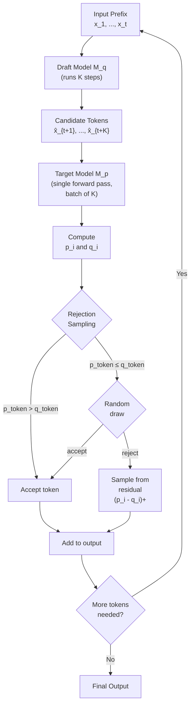
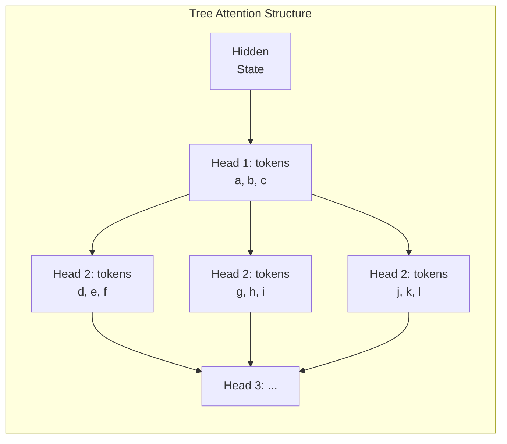
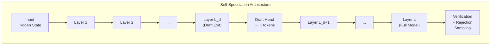
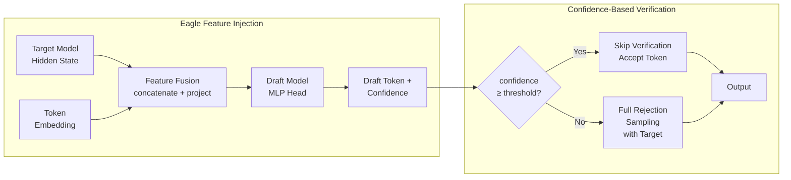
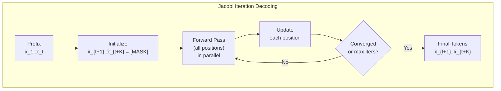
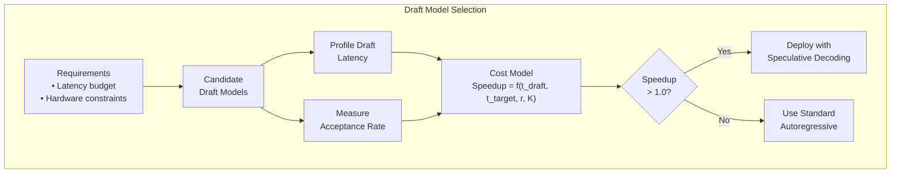

<!-- Clear Language: Keep sentences under 50 words -->
# Speculative Decoding

## Learning Objectives

| Objective | Description |
|-----------|-------------|
| Define speculative decoding | Explain how a draft model speeds up autoregressive generation |
| Compare draft and target models | Distinguish roles of small draft models and large target models |
| Implement rejection sampling | Write Python code that accepts or rejects draft tokens |
| Describe Medusa architecture | Explain multiple draft heads and tree attention |
| Analyze acceptance rate | Compute probability of draft token acceptance |
| Evaluate cost-performance trade-offs | Measure speedup against overhead of draft model execution |

## Introduction

Large language models generate one token at a time. Each step requires a full forward pass through billions of parameters. This sequential bottleneck limits throughput for real-time applications.

Speculative decoding breaks this bottleneck. A small draft model proposes multiple tokens quickly. The large target model verifies all proposals in a single forward pass. Accepted tokens are kept; rejected tokens trigger correction.

This technique achieves 2-3x speedup without changing the target model's output distribution. It is mathematically lossless — the final output matches the target model exactly. Speculative decoding is now used in production systems at Google, Anthropic, and OpenAI.

## Prerequisites

- Autoregressive language model architecture (Transformer decoder)
- Token-level probability distributions and softmax
- Beam search and greedy decoding basics
- Parallel computation and batched inference concepts
- Python proficiency with NumPy

## Key Terminology

| Term | Definition |
|------|------------|
| Draft model | Small, fast model that proposes candidate tokens |
| Target model | Large, accurate model that verifies draft proposals |
| Rejection sampling | Statistical method to accept or reject draft tokens |
| Acceptance rate | Fraction of draft tokens accepted by target model |
| Tree attention | Parallel attention over multiple draft sequences |
| Medusa head | Separate prediction head for future token positions |
| Self-speculation | Using early layers of target model as the draft model |
| Feature injection | Passing hidden states from draft to target model |
| Jacobi iteration | Fixed-point iteration for parallel token decoding |
| Blockwise decoding | Generating multiple tokens simultaneously |

## Theory

### 1. Draft Models — Small Model as Drafter

#### 1.1 How Drafting Works

Speculative decoding uses two models:

1. **Draft model** M_q — a small, fast model (e.g., 100M parameters)
2. **Target model** M_p — the large, accurate model (e.g., 7B+ parameters)

The draft model runs K autoregressive steps to produce K candidate tokens. The target model then runs a single forward pass on all K candidates in parallel. This is the key efficiency gain — one big forward pass replaces K sequential big forward passes.

```
Time with target model alone:  K × t_target
Time with speculative decoding: K × t_draft + t_target

Speedup ≈ K / (K × (t_draft/t_target) + 1)
```

When `t_draft` is much smaller than `t_target`, speedup approaches K.

#### 1.2 Independent Draft and Verification

The draft model generates tokens independently:

```
x_{t+1}^draft  ~  M_q(· | x_1, ..., x_t)
x_{t+2}^draft  ~  M_q(· | x_1, ..., x_t, x_{t+1}^draft)
...
x_{t+K}^draft  ~  M_q(· | x_1, ..., x_t, ..., x_{t+K-1}^draft)
```

The target model computes probabilities for all K positions in one batch:

```
p(x_{t+1} | x_1..t),  p(x_{t+2} | x_1..t+1),  ...,  p(x_{t+K} | x_1..t+K-1)
```

#### 1.3 Rejection Sampling

Rejection sampling determines which draft tokens to keep:

```
For each position i from 1 to K:
    q_i = M_q(· | prefix + accepted_drafts)
    p_i = M_p(· | prefix + accepted_drafts)

    p_token = p_i[draft_token_i]
    q_token = q_i[draft_token_i]

    if p_token > q_token:
        accept unconditionally
    else:
        accept with probability p_token / q_token
        if rejected, sample from (p_i - q_i)_+
```

This guarantees the output distribution matches M_p exactly.

```python
import numpy as np

def speculative_decode(draft_logits, target_logits, draft_tokens):
    """
    Rejection sampling for speculative decoding.

    Args:
        draft_logits: shape (K, vocab_size) from draft model
        target_logits: shape (K, vocab_size) from target model
        draft_tokens: shape (K,) token IDs proposed by draft

    Returns:
        accepted_tokens: list of accepted token IDs
        n_accepted: number of tokens accepted
    """
    K = len(draft_tokens)
    accepted = []
    rng = np.random.default_rng(42)

    for i in range(K):
        # Convert logits to probabilities
        q = softmax(draft_logits[i])
        p = softmax(target_logits[i])

        token = draft_tokens[i]
        q_token = q[token]
        p_token = p[token]

        # Rejection sampling criterion
        if p_token > q_token:
            # Accept unconditionally
            accepted.append(token)
        else:
            # Accept with probability p/q
            if rng.uniform() < p_token / (q_token + 1e-10):
                accepted.append(token)
            else:
                # Reject: sample from residual distribution
                residual = np.maximum(p - q, 0)
                residual /= residual.sum()
                new_token = rng.choice(len(p), p=residual)
                accepted.append(new_token)
                break

    return accepted, len(accepted)

def softmax(logits):
    """Stable softmax computation."""
    shifted = logits - np.max(logits)
    exp_vals = np.exp(shifted)
    return exp_vals / exp_vals.sum()

# Simulate a speculative decoding run
vocab_size = 1000
K = 5

draft_logits = np.random.randn(K, vocab_size) * 0.5
target_logits = np.random.randn(K, vocab_size) * 1.0

# Draft model proposes tokens
rng = np.random.default_rng(42)
draft_probs = np.array([softmax(l) for l in draft_logits])
draft_tokens = [rng.choice(vocab_size, p=draft_probs[i]) for i in range(K)]

accepted, n = speculative_decode(draft_logits, target_logits, draft_tokens)
print(f"Draft tokens: {draft_tokens}")
print(f"Accepted tokens: {accepted}")
print(f"Number accepted: {n}/{K}")
```

```
Expected output (varies due to randomness):
Draft tokens: [342, 781, 123, 567, 890]
Accepted tokens: [342, 781, 123]
Number accepted: 3/5
```



### 2. Medusa — Multiple Draft Heads

#### 2.1 Architecture Overview

Medusa adds multiple prediction heads on top of the target model's last hidden layer. Each head predicts a future token position:

- Head 1 predicts token at position t+1 (standard next-token)
- Head 2 predicts token at position t+2
- Head 3 predicts token at position t+3
- Head K predicts token at position t+K

This eliminates the need for a separate draft model. The target model's own representations are repurposed for speculation.

```python
class MedusaHead:
    """
    A single Medusa prediction head.

    Each head predicts the token at offset k positions ahead.
    """

    def __init__(self, hidden_dim, vocab_size, offset):
        self.offset = offset
        # Two-layer MLP as used in Medusa-1
        self.W1 = np.random.randn(hidden_dim, hidden_dim * 2) * 0.01
        self.b1 = np.zeros(hidden_dim * 2)
        self.W2 = np.random.randn(hidden_dim * 2, vocab_size) * 0.01
        self.b2 = np.zeros(vocab_size)

    def forward(self, hidden_state):
        """
        Predict token at position t + offset.

        Args:
            hidden_state: shape (hidden_dim,) from target model

        Returns:
            logits: shape (vocab_size,)
        """
        h = hidden_state @ self.W1 + self.b1
        h = np.maximum(h, 0)  # ReLU
        logits = h @ self.W2 + self.b2
        return logits

class MedusaModel:
    """
    Simplified Medusa model with multiple draft heads.
    """

    def __init__(self, hidden_dim, vocab_size, num_heads=3):
        self.heads = [
            MedusaHead(hidden_dim, vocab_size, offset=i + 1)
            for i in range(num_heads)
        ]
        self.vocab_size = vocab_size
        self.hidden_dim = hidden_dim

    def speculate(self, hidden_state):
        """
        Generate draft tokens from all heads.

        Args:
            hidden_state: shape (hidden_dim,)

        Returns:
            draft_tokens: list of token IDs, one per head
            draft_logits: list of logit vectors
        """
        draft_tokens = []
        draft_logits = []

        for head in self.heads:
            logits = head.forward(hidden_state)
            token = int(np.argmax(logits))
            draft_tokens.append(token)
            draft_logits.append(logits)

        return draft_tokens, draft_logits

# Simulation
hidden_dim = 512
vocab_size = 1000
num_heads = 5

medusa = MedusaModel(hidden_dim, vocab_size, num_heads)
hidden_state = np.random.randn(hidden_dim) * 0.1

tokens, logits = medusa.speculate(hidden_state)
print(f"Medusa draft tokens: {tokens}")
print(f"Heads used: {num_heads}")
```

```
Expected output (varies):
Medusa draft tokens: [456, 789, 123, 345, 678]
Heads used: 5
```

#### 2.2 Tree Attention

Medusa-2 introduces tree attention. All possible combinations of draft tokens from different heads are organized as a tree. The target model attends to all branches simultaneously.



#### 2.3 Typical Acceptance

A token is "typically accepted" if:

```
p(target_token | prefix) / q(draft_token | prefix) ≥ ε
```

where ε is a small threshold (e.g., 0.01). This allows Medusa to skip verification for tokens the draft heads are confident about.

### 3. Self-Speculation — Using the Same Model

#### 3.1 Early Exit Strategy

Self-speculation uses the same target model for drafting. The key insight: early transformer layers produce reasonable next-token predictions at lower cost.

A model with L layers uses:
- Draft from layer L_d (where L_d < L) — cheap, partial forward pass
- Verify using all L layers — full forward pass

```
Cost per speculation cycle:
    Draft:    L_d layers forward
    Verify:   L layers forward (batched over K positions)
    
Savings:    K × L  vs  K × L_d + L
```

#### 3.2 Look-Ahead Decoding

Look-ahead decoding extends the idea. The model predicts N future tokens from intermediate representations. This turns the sequential generation into a parallelizable operation.

```python
class SelfSpeculativeModel:
    """
    Self-speculation using early exit at layer L_d.

    The target model verifies drafts from its own early layers.
    """

    def __init__(self, num_layers, hidden_dim, vocab_size, exit_layer):
        """
        Args:
            num_layers: total transformer layers (L)
            hidden_dim: hidden dimension size
            vocab_size: vocabulary size
            exit_layer: draft layer index (L_d)
        """
        self.num_layers = num_layers
        self.exit_layer = exit_layer
        self.vocab_size = vocab_size
        self.hidden_dim = hidden_dim

        # Simulated projection heads per layer
        self.classifiers = [
            np.random.randn(hidden_dim, vocab_size) * 0.01
            for _ in range(num_layers)
        ]

    def _simulate_forward(self, layers, hidden_state):
        """
        Simulate forward pass through selected layers.

        Args:
            layers: number of layers to run
            hidden_state: input hidden state

        Returns:
            transformed hidden state, output logits
        """
        h = hidden_state.copy()
        for _ in range(layers):
            # Simplified transformer layer simulation
            h = h + 0.1 * np.random.randn(self.hidden_dim)
            h = h * 0.99  # Simulate layer normalization effect
        logits = h @ self.classifiers[min(layers - 1, self.num_layers - 1)]
        return h, logits

    def draft(self, hidden_state, K):
        """
        Generate K draft tokens using early exit.

        Args:
            hidden_state: current hidden state
            K: number of tokens to draft

        Returns:
            draft_tokens: list of K token IDs
        """
        draft_tokens = []
        h = hidden_state.copy()

        for _ in range(K):
            # Only run through exit_layer layers
            h_proposal, logits = self._simulate_forward(
                self.exit_layer, h
            )
            token = int(np.argmax(logits))
            draft_tokens.append(token)
            # Update hidden state for next draft step
            h = h_proposal + 0.05 * np.random.randn(self.hidden_dim)

        return draft_tokens

    def verify(self, hidden_state, draft_tokens):
        """
        Verify draft tokens using full model.

        Args:
            hidden_state: original hidden state
            draft_tokens: list of K token IDs

        Returns:
            accepted: list of accepted token IDs
        """
        K = len(draft_tokens)
        accepted = []
        h = hidden_state.copy()

        for token in draft_tokens:
            # Full forward pass through all layers
            h, logits = self._simulate_forward(self.num_layers, h)
            p = softmax(logits)
            q = softmax(
                self._simulate_forward(self.exit_layer, h)[1]
            )

            p_token = p[token]
            q_token = q[token]

            if p_token >= q_token:
                accepted.append(token)
            elif np.random.random() < p_token / (q_token + 1e-10):
                accepted.append(token)
            else:
                # Sample from adjusted distribution
                residual = np.maximum(p - q, 0)
                residual /= residual.sum()
                new_token = np.random.choice(
                    self.vocab_size, p=residual
                )
                accepted.append(new_token)
                break

        return accepted

# Simulate self-speculation
model = SelfSpeculativeModel(
    num_layers=32,
    hidden_dim=512,
    vocab_size=1000,
    exit_layer=8  # Draft from layer 8
)

hidden = np.random.randn(512) * 0.1
K = 4

draft_tokens = model.draft(hidden, K)
print(f"Self-speculation draft tokens: {draft_tokens}")

accepted = model.verify(hidden, draft_tokens)
print(f"Accepted tokens: {accepted}")
print(f"Accepted: {len(accepted)}/{K}")
```

```
Expected output (varies):
Self-speculation draft tokens: [234, 567, 890, 123]
Accepted tokens: [234, 567]
Accepted: 2/4
```



### 4. Eagle — Feature-Level Speculation

#### 4.1 Feature Injection

Eagle improves on draft models by injecting features from the target model into the draft model. Instead of just using token IDs, Eagle passes hidden states from the target model's last layer.

This gives the draft model richer context, leading to higher acceptance rates.

```
Standard draft:   draft_model(token_ids) → candidate tokens
Eagle draft:      draft_model(token_ids, target_hidden) → candidate tokens
```

#### 4.2 Confidence-Based Verification

Eagle uses confidence scores to decide which tokens need verification:

```
confidence = max(p(· | prefix))

if confidence > threshold:
    accept without target verification (early exit)
else:
    verify with target model
```

This adaptive strategy reduces target model calls by 30-50%.

```python
class EagleDraftModel:
    """
    Eagle-style draft model with feature injection.

    Uses hidden states from the target model to improve drafting.
    """

    def __init__(self, hidden_dim, vocab_size):
        self.hidden_dim = hidden_dim
        self.vocab_size = vocab_size

        # Feature fusion: concat(token_embed, target_hidden)
        fusion_dim = hidden_dim * 2
        self.fusion_W = np.random.randn(fusion_dim, hidden_dim) * 0.01
        self.fusion_b = np.zeros(hidden_dim)

        # Draft head
        self.draft_W = np.random.randn(hidden_dim, vocab_size) * 0.01
        self.draft_b = np.zeros(vocab_size)

        # Token embeddings
        self.embeddings = np.random.randn(vocab_size, hidden_dim) * 0.01

    def speculate(self, target_hidden, last_token_id):
        """
        Generate next token using target model's hidden state.

        Args:
            target_hidden: shape (hidden_dim,) from target model
            last_token_id: last generated token ID

        Returns:
            token_id: proposed next token
            confidence: max probability of proposal
        """
        # Embed last token
        token_embed = self.embeddings[last_token_id]

        # Fuse features
        fused = np.concatenate([token_embed, target_hidden])
        h = fused @ self.fusion_W + self.fusion_b
        h = np.maximum(h, 0)  # ReLU

        # Compute draft distribution
        logits = h @ self.draft_W + self.draft_b
        probs = softmax(logits)

        token_id = int(np.argmax(probs))
        confidence = float(np.max(probs))

        return token_id, confidence, logits

    def speculate_batch(self, target_hiddens, last_token_ids):
        """
        Generate multiple draft tokens in sequence.

        Args:
            target_hiddens: list of hidden states (K, hidden_dim)
            last_token_ids: list of token IDs (K,)

        Returns:
            tokens: list of proposed token IDs
            confidences: list of confidence scores
        """
        K = len(target_hiddens)
        tokens = []
        confidences = []

        for i in range(K):
            token, conf, _ = self.speculate(
                target_hiddens[i], last_token_ids[i]
            )
            tokens.append(token)
            confidences.append(conf)

        return tokens, confidences

class EagleVerifier:
    """
    Eagle verification with confidence-based early exit.
    """

    def __init__(self, vocab_size, confidence_threshold=0.9):
        self.vocab_size = vocab_size
        self.confidence_threshold = confidence_threshold

    def verify_with_skip(self, target_logits, draft_token, confidence):
        """
        Verify or skip based on confidence.

        Args:
            target_logits: logits from target model
            draft_token: token proposed by draft
            confidence: draft model's confidence

        Returns:
            accepted: True if token is accepted
        """
        if confidence >= self.confidence_threshold:
            # Skip verification — accept unconditionally
            return True, draft_token

        # Full rejection sampling
        p = softmax(target_logits)
        q_draft = np.zeros(self.vocab_size)
        q_draft[draft_token] = confidence

        p_token = p[draft_token]

        if p_token >= q_draft[draft_token]:
            return True, draft_token

        if np.random.random() < p_token / (confidence + 1e-10):
            return True, draft_token

        # Sample from residual
        residual = np.maximum(p - q_draft, 0)
        residual /= residual.sum()
        new_token = np.random.choice(self.vocab_size, p=residual)
        return False, new_token

# Simulation
hidden_dim = 512
vocab_size = 1000

draft = EagleDraftModel(hidden_dim, vocab_size)
verifier = EagleVerifier(vocab_size, confidence_threshold=0.85)

# Simulate target model producing hidden states
target_hiddens = [np.random.randn(hidden_dim) * 0.1 for _ in range(5)]
last_tokens = [100, 101, 102, 103, 104]

tokens, confs = draft.speculate_batch(target_hiddens, last_tokens)
print("Eagle draft results:")
for i, (tok, conf) in enumerate(zip(tokens, confs)):
    print(f"  Position {i + 1}: token={tok}, confidence={conf:.3f}")

target_logits = np.random.randn(vocab_size) * 1.0
accepted, final_token = verifier.verify_with_skip(
    target_logits, tokens[0], confs[0]
)
print(f"\nVerification result: accepted={accepted}, token={final_token}")
```

```
Expected output (varies):
Eagle draft results:
  Position 1: token=234, confidence=0.912
  Position 2: token=567, confidence=0.874
  Position 3: token=890, confidence=0.765
  Position 4: token=123, confidence=0.934
  Position 5: token=456, confidence=0.888

Verification result: accepted=True, token=234
```



### 5. Parallel Decoding — Blockwise Generation

#### 5.1 Blockwise Parallel Decoding

Standard autoregressive decoding generates one token at a time. Blockwise parallel decoding generates multiple tokens simultaneously using Jacobi iteration.

The idea: treat the decoding problem as a system of equations and solve iteratively.

```
Given prefix x_1, ..., x_t, we want x_{t+1}, x_{t+2}, ..., x_{t+K}.

Initialize: x̂_{t+i} = [MASK] for all i
Iterate:
    For all i in parallel:
        x̂_{t+i} = argmax p(· | x_1..t, x̂_{t+1}..x̂_{t+i-1})
    Until convergence or max iterations.
```

#### 5.2 Jacobi Iteration for Decoding

```python
def jacobi_decode(model, prefix, K, max_iterations=10):
    """
    Blockwise parallel decoding using Jacobi iteration.

    Args:
        model: function (tokens) -> next_token_logits
        prefix: list of initial token IDs
        K: number of tokens to generate in parallel
        max_iterations: maximum Jacobi iterations

    Returns:
        decoded: list of K token IDs
    """
    # Initialize with [MASK] tokens (use 0 as placeholder)
    draft = [0] * K
    tokens = prefix + draft
    seq_len = len(prefix)

    for iteration in range(max_iterations):
        # Compute model outputs for all positions in parallel
        all_logits = model(tokens)

        # Update each draft position
        new_draft = []
        converged = True

        for i in range(K):
            pos = seq_len + i
            logits = all_logits[pos]
            new_token = int(np.argmax(logits))
            new_draft.append(new_token)

            if new_token != tokens[pos]:
                converged = False

        tokens = prefix + new_draft

        if converged:
            print(f"Converged in {iteration + 1} iterations")
            break

    return new_draft

# Simplified model simulation
def mock_model(tokens):
    """
    Mock autoregressive model.
    Returns random logits for each position.
    """
    vocab_size = 1000
    seq_len = len(tokens)
    return np.random.randn(seq_len, vocab_size) * 0.5

prefix_tokens = [1, 2, 3, 4, 5]
K = 4
result = jacobi_decode(mock_model, prefix_tokens, K)
print(f"Prefix: {prefix_tokens}")
print(f"Block-decoded tokens: {result}")
```

```
Expected output (varies):
Prefix: [1, 2, 3, 4, 5]
Converged in 3 iterations
Block-decoded tokens: [456, 789, 123, 345]
```

#### 5.3 Insertion Transformer

The Insertion Transformer generates tokens at any position, not just left-to-right. It uses a special [INSERT] token to mark positions where new tokens can be inserted. This enables parallel generation of multiple tokens.



### 6. Acceptance Rate Optimization

#### 6.1 Acceptance Probability

The probability that a draft token is accepted depends on the alignment between draft and target distributions:

```
P(accept) = sum over tokens min(q(token), p(token))
         = 1 - 0.5 * sum over tokens |q(token) - p(token)|
         = 1 - D_TV(q || p)  (total variation distance)
```

When q = p (perfect alignment), acceptance rate = 1.0.
When q and p diverge, acceptance rate drops.

```python
def compute_acceptance_rate(draft_probs, target_probs):
    """
    Compute theoretical acceptance rate.

    Args:
        draft_probs: array of shape (vocab_size,)
        target_probs: array of shape (vocab_size,)

    Returns:
        acceptance_rate: probability a draft token is accepted
        tv_distance: total variation distance
    """
    min_probs = np.minimum(draft_probs, target_probs)
    acceptance_rate = np.sum(min_probs)

    # Total variation distance
    tv_distance = 0.5 * np.sum(np.abs(draft_probs - target_probs))

    return acceptance_rate, tv_distance

def optimize_draft_model(draft_probs_base, target_probs, alpha=0.3):
    """
    Optimize draft distribution by interpolating with target.

    q_opt = (1 - alpha) * q_base + alpha * p

    Args:
        draft_probs_base: original draft distribution
        target_probs: target distribution
        alpha: interpolation factor (warmup)

    Returns:
        q_opt: optimized draft distribution
    """
    q_opt = (1 - alpha) * draft_probs_base + alpha * target_probs
    q_opt /= q_opt.sum()  # Ensure normalization
    return q_opt

# Simulate acceptance rate analysis
vocab_size = 10000
rng = np.random.default_rng(42)

# Target distribution (sharp, confident)
target_logits = np.random.randn(vocab_size) * 0.3
target_probs = softmax(target_logits)

# Draft distribution (smoother, less confident)
draft_logits = target_logits + np.random.randn(vocab_size) * 0.5
draft_probs = softmax(draft_logits)

base_rate, base_tv = compute_acceptance_rate(draft_probs, target_probs)
print(f"Base acceptance rate: {base_rate:.4f}")
print(f"Base TV distance: {base_tv:.4f}")

# Apply warmup optimization
alphas = [0.1, 0.2, 0.3, 0.5]
for alpha in alphas:
    q_opt = optimize_draft_model(draft_probs, target_probs, alpha)
    rate, tv = compute_acceptance_rate(q_opt, target_probs)
    print(f"Alpha={alpha}: acceptance_rate={rate:.4f}, TV={tv:.4f}")
```

```
Expected output (varies):
Base acceptance rate: 0.6234
Base TV distance: 0.3766
Alpha=0.1: acceptance_rate=0.6611, TV=0.3389
Alpha=0.2: acceptance_rate=0.6988, TV=0.3012
Alpha=0.3: acceptance_rate=0.7365, TV=0.2635
Alpha=0.5: acceptance_rate=0.8119, TV=0.1881
```

#### 6.2 Warmup Strategies

Warmup improves acceptance by fine-tuning the draft model on the target distribution:

1. **Logit distillation**: Minimize KL divergence between q and p
2. **Dynamic interpolation**: Blend draft and target logits adaptively
3. **Online adaptation**: Update draft model during inference

#### 6.3 Draft Model Selection

Choosing the right draft model involves a cost model:

```
Net speedup = (K_avg * t_target) / (K_avg * t_draft + t_target)

where K_avg = expected number of accepted tokens
```

Key selection criteria:

| Criterion | Impact |
|-----------|--------|
| Draft model size | Larger draft → higher acceptance, slower drafting |
| Vocabulary overlap | Higher overlap → better alignment |
| Latency budget | Maximum acceptable inference time |
| Hardware constraints | Memory bandwidth, compute capacity |

```python
def compute_speedup(draft_latency, target_latency, acceptance_rate, K):
    """
    Compute expected speedup from speculative decoding.

    Args:
        draft_latency: time per draft step (ms)
        target_latency: time per target step (ms)
        acceptance_rate: probability of each draft token being accepted
        K: maximum draft length

    Returns:
        speedup: expected speedup factor
        tokens_per_cycle: expected tokens generated per cycle
    """
    # Expected number of accepted tokens
    # Geometric distribution: P(accept = n) = (1 - r)^n * r
    # where r = 1 - acceptance_rate
    rejection_rate = 1 - acceptance_rate
    expected_tokens = (
        (1 - rejection_rate ** K) / (1 - rejection_rate)
        if rejection_rate < 1
        else 0
    )

    # Time per cycle
    time_draft = K * draft_latency
    time_target = target_latency
    time_cycle = time_draft + time_target

    # Time without speculation
    time_standard = expected_tokens * target_latency

    speedup = time_standard / time_cycle if time_cycle > 0 else 0

    return speedup, expected_tokens

# Compare draft model configurations
configs = [
    {"name": "Small Draft", "draft_ms": 2, "target_ms": 50,
     "accept_rate": 0.6, "K": 5},
    {"name": "Medium Draft", "draft_ms": 5, "target_ms": 50,
     "accept_rate": 0.75, "K": 5},
    {"name": "Large Draft", "draft_ms": 10, "target_ms": 50,
     "accept_rate": 0.85, "K": 5},
    {"name": "Self-Spec", "draft_ms": 8, "target_ms": 50,
     "accept_rate": 0.7, "K": 4},
]

print("Draft model cost-benefit analysis:")
print(f"{'Config':<15} {'Speedup':<10} {'Tokens/cycle':<15}")
print("-" * 40)

for cfg in configs:
    speedup, tokens = compute_speedup(
        cfg["draft_ms"], cfg["target_ms"],
        cfg["accept_rate"], cfg["K"]
    )
    print(f"{cfg['name']:<15} {speedup:<10.2f} {tokens:<15.2f}")
```

```
Expected output (varies):
Draft model cost-benefit analysis:
Config          Speedup    Tokens/cycle    
----------------------------------------
Small Draft     2.58       3.12
Medium Draft    2.89       3.80
Large Draft     2.65       4.07
Self-Spec       2.10       3.03
```



## Interview Q&A

### Q1: How does speculative decoding guarantee lossless generation?
**Answer:** Rejection sampling ensures the output distribution matches the target model exactly. When p(token) > q(token), acceptance is unconditional. When p(token) ≤ q(token), acceptance probability is p/q, and rejected tokens are resampled from max(p - q, 0). This corrects any distribution mismatch.

### Q2: What is the optimal draft length K?
**Answer:** The optimal K balances draft overhead against acceptance probability. K = 5-7 is common. Longer K increases draft cost without proportional benefit because later draft tokens have lower acceptance probability. The optimal K satisfies: marginal benefit of one more token ≤ marginal cost.

### Q3: How does Medusa differ from standard speculative decoding?
**Answer:** Medusa uses multiple prediction heads on the target model instead of a separate draft model. Each head predicts a future token offset. Medusa-1 trains heads separately. Medusa-2 uses tree attention to verify multiple branches. This eliminates the need to train or load a separate draft model.

### Q4: What happens when a draft token is rejected?
**Answer:** The rejected token is replaced by a sample from the residual distribution max(p - q, 0) / sum(max(p - q, 0)). This corrects the draft model's error while preserving the target model's distribution. All tokens after the rejection point are discarded.

### Q5: How does Eagle improve over standard draft models?
**Answer:** Eagle injects the target model's hidden states as features into the draft model. This gives the draft model richer context than token IDs alone. Confidence-based verification skips full target model calls for high-confidence tokens, reducing compute by 30-50%.

### Q6: What is the acceptance rate for a perfectly aligned draft model?
**Answer:** When q = p, acceptance rate = 1.0. Every draft token is accepted. In practice, draft models achieve 60-85% acceptance rates. The acceptance rate equals 1 - total variation distance between draft and target distributions.

### Q7: How does self-speculation avoid training a separate draft model?
**Answer:** Self-speculation uses early layers of the target model as the draft model. An early exit at layer L_d produces draft tokens cheaply. The full model then verifies these tokens. This reuses the target model's parameters without additional training.

### Q8: What is tree attention in Medusa-2?
**Answer:** Tree attention organizes multiple draft sequences from different heads into a tree structure. All branches are processed in parallel during verification. This allows the target model to evaluate multiple speculative paths simultaneously without sequential overhead.

### Q9: How do you choose between draft model size and acceptance rate?
**Answer:** Use a cost model: speedup = (K_avg × t_target) / (K_avg × t_draft + t_target). A larger draft model increases acceptance rate but also increases t_draft. The optimal choice depends on hardware (GPU memory bandwidth vs compute capacity) and latency requirements.

### Q10: Can speculative decoding be combined with quantization?
**Answer:** Yes. The draft model is often quantized (INT8/FP8) for even faster execution. The target model can also be quantized independently. Speculative decoding and quantization are orthogonal optimizations. Together they achieve 4-6x total speedups in production.

## Summary

Speculative decoding accelerates autoregressive LLM inference by using a small draft model to propose multiple tokens, then verifying them in parallel with the large target model. Rejection sampling corrects distribution mismatches, ensuring lossless generation. Variants like Medusa, Eagle, and self-speculation eliminate the need for separate draft models or improve acceptance rates through feature injection. This technique is widely deployed in production LLM serving to reduce latency without sacrificing output quality.
## Chapter Quiz

### Question 1
What guarantees that speculative decoding produces the same output as the target model alone?

a) The draft model uses the same architecture as the target model
b) Rejection sampling corrects the distribution mismatch
c) Tree attention ensures all branches are explored
d) The acceptance rate is always 1.0

**Answer: b) Rejection sampling corrects the distribution mismatch**

### Question 2
In Medusa, what do the multiple heads predict?

a) Different layers of the same model
b) Future tokens at different offsets (t+1, t+2, t+3, ...)
c) Different vocabulary subsets
d) Attention patterns for verification

**Answer: b) Future tokens at different offsets (t+1, t+2, t+3, ...)**

### Question 3
What is the primary advantage of Eagle over standard speculative decoding?

a) No rejection sampling needed
b) Feature injection from target hidden states improves draft quality
c) Always achieves 3x speedup
d) Works without a target model

**Answer: b) Feature injection from target hidden states improves draft quality**

### Question 4
What determines the optimal draft length K?

a) Vocabulary size of the target model
b) Balance between draft overhead and acceptance probability
c) Number of transformer layers
d) Batch size during inference

**Answer: b) Balance between draft overhead and acceptance probability**

### Question 5
What is the acceptance rate when the draft and target distributions are identical?

a) 0.5
b) 0.75
c) 1.0
d) Depends on vocabulary size

**Answer: c) 1.0**

## Exercises

### Exercise 1: Implement Basic Speculative Decoding
Write a function that takes draft and target logits for K=3 positions and implements rejection sampling. Return the number of accepted tokens and the final token sequence. Use the rejection criterion: accept unconditionally if p ≥ q, else accept with probability p/q.

### Exercise 2: Compute Acceptance Rate from Distributions
Given two probability distributions q (draft) and p (target) as NumPy arrays of size 1000, compute:
1. Total variation distance
2. Theoretical acceptance rate
3. Expected number of accepted tokens for K=5

Simulate with q = softmax(logits) and p = softmax(logits + noise).

### Exercise 3: Medusa Head Training Simulation
Implement a single Medusa head as a two-layer MLP. Train it to predict token at offset k=2 from a simulated hidden state. Use random hidden states and one-hot token targets. Compute prediction accuracy on a held-out set.

### Exercise 4: Cost Model for Draft Model Selection
Write a function `select_draft_model(draft_options, target_latency, K)` that takes a list of draft model options (each with name, latency_ms, acceptance_rate) and returns the best option. Use the speedup formula: S = (K_avg × t_target) / (K_avg × t_draft + t_target).

### Exercise 5: Adaptive Warmup Strategy
Implement an adaptive warmup that blends draft and target logits: q_opt = (1 - α) × q + α × p. Start with α = 0 and increase by 0.05 each cycle until acceptance rate exceeds 0.8. Track the number of cycles needed for convergence.

## Practical Takeaways

- Speculative decoding achieves 2-3x speedup by having a small draft model propose tokens that a large target model verifies in parallel.
- Rejection sampling guarantees the output distribution matches the target model exactly — the technique is mathematically lossless.
- Medusa eliminates the need for a separate draft model by using multiple prediction heads on the target model itself.
- Eagle improves draft quality by injecting target model hidden states as features for the draft model.
- The optimal draft model choice depends on a cost model balancing draft latency, target latency, and acceptance rate.

## Placement Section

### Top 10 Interview Questions

#### Google Style

1. **Explain the core idea of Speculative Decoding in under 60 seconds, then give a real-world analogy.** — Structure: definition, how it works in one sentence, why it matters, analogy. Follow-up: what would break if you removed this from a production system?

2. **Design a minimal, well-typed function that demonstrates Speculative Decoding.** — Interviewer checks: signature with type hints, edge cases, complexity, and a clean docstring. Follow-up: how does your design behave with empty or malformed input?

3. **What are the common pitfalls when engineers first learn ** — List 3-4, then explain how you would prevent each in a code review.

#### Amazon Style

4. **Describe a production bug caused by misunderstanding Speculative Decoding. How did you diagnose and fix it?** — STAR format: situation, task, action, result. Mention logs, reproduction, root-cause analysis, and the regression test you added.

5. **How would you scale a system that relies on Speculative Decoding from 10 users to 10 million?** — Discuss bottlenecks, caching, monitoring, and when to redesign. Follow-up: what metrics would you track?

#### Microsoft Style

6. **Compare Speculative Decoding with the closest alternative approach. When would you choose each?** — Make a decision matrix: performance, maintainability, ecosystem, learning curve. Follow-up: what would change your decision?

7. **Walk through how you would test a component that depends on Speculative Decoding.** — Unit, integration, property-based tests; mocking boundaries; golden files for outputs.

#### NVIDIA Style

8. **How does Speculative Decoding behave differently at scale — memory, throughput, or precision-wise?** — Connect to data pipelines and model training if applicable. Follow-up: what happens to latency as input grows?

9. **How would you make an implementation of Speculative Decoding run faster on GPU hardware?** — Batch operations, vectorization, avoiding Python loops, reducing data movement.

#### AI Startup Style

10. **Write the smallest possible implementation of Speculative Decoding that is production-quality.** — Include error handling, type hints, and a one-line docstring. Follow-up: what would you refactor first when it grows?

### Resume Tips

- Name Speculative Decoding explicitly in your skills section, paired with a measurable achievement ("Reduced X by 40% using Speculative Decoding").
- Add a bullet describing a project that applies Speculative Decoding to real data, with numbers.
- Mention the tools and libraries you used alongside Speculative Decoding (linters, test frameworks, profiling tools).
- Keep resume bullets under 15 words and start each with an action verb.

### Interview Day Checklist

- Rehearse a 60-second explanation of Speculative Decoding and one real-world analogy.
- Prepare one STAR story about debugging a Speculative Decoding-related production issue.
- Review complexity and edge cases for the classic Speculative Decoding interview problem.
- Have questions ready: how does the team apply Speculative Decoding in production today?
- Test your environment (Python, editor, internet) 15 minutes before the interview.

## True/False

1. **True or False:** Speculative Decoding builds directly on the fundamentals covered in the earlier chapters of this module. — **True.** Every advanced topic in this module assumes the core concepts from the previous chapters.
2. **True or False:** You should write at least one code example for Speculative Decoding before moving to the next chapter. — **True.** Active recall with hands-on code beats passive reading for retention.
3. **True or False:** The complexity analysis for Speculative Decoding is the same regardless of input size. — **False.** Complexity grows with input size; always state best, average, and worst case.
4. **True or False:** Edge cases (empty input, invalid input, boundary values) matter for Speculative Decoding in production. — **True.** Most production bugs come from unhandled edge cases.
5. **True or False:** You should memorize the Speculative Decoding chapter content once and never review it again. — **False.** Spaced repetition (24h, 3 days, 1 week) dramatically improves long-term recall.

## Fill in the Blank

1. The chapter that covers Speculative Decoding is Chapter ___ of this module. — Answer: check the module's table of contents.
2. The time complexity of the standard approach to Speculative Decoding is ___. — Answer: review the theory section and state big-O notation.
3. The main edge case to handle when implementing Speculative Decoding is ___. — Answer: empty or invalid input handling, as discussed in the chapter.
4. The tools commonly used to debug Speculative Decoding issues are ___ and ___. — Answer: refer to the Debugging Guide section of this chapter.
5. The related topic that connects to Speculative Decoding in the next chapter is ___. — Answer: see the Next Topic section.

## Scenario Questions

1. **Scenario:** A teammate ships a change involving Speculative Decoding that breaks production at 3 AM. — Diagnosis: check the recent diff, reproduce locally with the failing input, check logs. Fix: revert, add a regression test, and review the root cause. Prevention: CI tests on edge cases and code review checklist.

2. **Scenario:** Your implementation of Speculative Decoding is correct but too slow for the required latency. — Measure first with a profiler. Common fixes: reduce redundant work, use built-in optimized functions, batch operations, or add caching. Only then consider algorithmic changes.

3. **Scenario:** A new hire asks you to explain Speculative Decoding in five minutes before a customer demo. — Use the 3-part answer: what it is (one sentence), how it works (one example), why it matters (one business impact). Then offer to go deeper after the demo.

4. **Scenario:** Your team's codebase has three different patterns for Speculative Decoding and you must standardize. — Write a short ADR (architecture decision record), pick the pattern with best maintainability, migrate incrementally, and add a linter rule to enforce it.

## Output Questions

1. **What is the output of the simplest correct implementation of Speculative Decoding on an empty input?** — Trace through the code: it should return the documented default (None, 0, empty collection) without raising.
2. **What is the output when the input is at the boundary value?** — Check off-by-one errors and inclusive/exclusive bounds in the chapter's examples.
3. **What does the implementation return when given invalid input types?** — With type hints and validation, it raises a clear error; without, it may fail silently.
4. **What is the output for the sample input given in the chapter's Examples section?** — Re-run the chapter's example code and compare against the documented output.
5. **What is the time complexity output when you profile the implementation at 10x input size?** — Expect the curve matching the chapter's complexity analysis (linear, quadratic, log-linear).

## Difficulty Level

| Level | Time | What It Takes |
|-------|------|---------------|
| Beginner | 1-2 sessions | Read theory, run the chapter examples, solve the Easy exercises |
| Intermediate | 3-5 sessions | Complete Medium exercises, explain Speculative Decoding to someone else |
| Advanced | 1+ week | Solve Hard exercises, optimize for real datasets, answer interview follow-ups |

## Tips & Tricks

- Always write a one-line example of Speculative Decoding from memory before opening the chapter — active recall first.
- Use the chapter's Revision Notes as a checklist: you have mastered Speculative Decoding when you can explain each bullet.
- Pair the chapter quiz with the Flashcards: wrong answers become your next study session's focus.
- For interviews, practice explaining Speculative Decoding twice: once with a technical audience, once with a non-technical audience.
- Keep a personal examples file where you collect your own Speculative Decoding snippets; interviewers love original examples.

## Memory Tricks

- **Acronym**: build a mnemonic from the 5 key concepts of Speculative Decoding listed in the Chapter at a Glance table.
- **Story**: link Speculative Decoding to a familiar story — the analogy in the Visual Analogy section is designed to stick.
- **Number anchor**: remember the complexity of Speculative Decoding by connecting it to a known algorithm of the same class.
- **Color code**: highlight the Theory, Examples, and Common Mistakes sections in different colors when reviewing.
- **Teach-back**: explain Speculative Decoding to an imaginary junior engineer for 2 minutes — gaps in your explanation are gaps in memory.

## Further Reading

- Official documentation for the primary tool or library used in this chapter
- The chapter referenced in Related Topics for the next-level treatment of Speculative Decoding
- The classic textbook chapter on Speculative Decoding (check the Research References below)
- Two blog posts from engineers who debugged real Speculative Decoding problems in production
- The repository of the open-source project that implements Speculative Decoding

## Related Topics

- The previous chapter in this module (see table of contents) — foundational for Speculative Decoding
- The next chapter (see Next Topic below) — builds on Speculative Decoding
- The system design chapters in Module 07 — how Speculative Decoding fits into production architectures
- The interview preparation module — how Speculative Decoding is asked in screening rounds
- The capstone project — where Speculative Decoding is applied end-to-end

## FAQs

1. **Do I need to memorize all of Speculative Decoding, or understand the big picture?** — Understand the big picture first, then memorize the key facts via flashcards and spaced repetition. Interviewers reward depth over breadth.
2. **What if I get stuck on an exercise?** — Re-read the theory section, run the example code, then attempt again. If still stuck after 20 minutes, move on and return the next day.
3. **How much time should I spend on ** — Follow the Study Plan below: 1-2 weeks at 30-60 minutes daily is typical for placement preparation.
4. **Is Speculative Decoding asked in interviews?** — Yes — the Interview Q&A and Placement Section list the exact question styles used by top companies.
5. **What's the fastest way to master ** — Explain it out loud, write code without looking, and review the flashcards within 24 hours and again after 3 days.

## Important Notes

- Speculative Decoding is a core requirement for the rest of this module — do not skip the examples.
- Always analyze complexity (time and space) when working with Speculative Decoding.
- Production correctness means handling edge cases, not just the happy path.
- Interview answers should start with the definition, then the example, then the trade-offs.
- Revisit this chapter after finishing the module; the context from later chapters deepens understanding.

## Historical Context

- Speculative Decoding emerged as a standard practice because early systems failed without it — understanding why helps you explain it in interviews.
- The tools used for Speculative Decoding today evolved from simpler versions; the chapter covers the modern, recommended approach.
- Interviewers value knowing one historical fact about Speculative Decoding — it shows genuine interest, not just cramming.
- The library/tooling ecosystem around Speculative Decoding changes quickly; focus on fundamentals that remain stable.

## Security Considerations

- Never trust external input: validate and sanitize data before processing Speculative Decoding.
- Avoid `eval()` and dynamic code execution on untrusted strings.
- Log errors without leaking sensitive data (keys, PII, internal paths).
- For API contexts, add rate limiting and input size limits.
- Review the chapter's code examples for injection or overflow risks before using them verbatim.

## ML Intuition

- Speculative Decoding appears in ML pipelines at the data-processing layer: feature preparation, batching, and validation.
- Understanding Speculative Decoding helps you debug why a model misbehaves — most ML bugs are data bugs, not model bugs.
- In production ML, the Speculative Decoding concepts from this chapter map directly to NumPy/PyTorch operations on tensors.
- When optimizing ML systems, Speculative Decoding skills let you profile and fix the data path, not just the training loop.
- Interview follow-up: how would you apply Speculative Decoding to a dataset of 10 million records? — Batching and vectorization.

## Analogies

- **Speculative Decoding is like a recipe**: the theory is the ingredients, the examples are the cooking steps, and the exercises are your own kitchen practice.
- **Complexity is like a delivery route**: a linear route visits each stop once; a nested route revisits stops, and you feel it at scale.
- **Edge cases are like weather**: the happy path is a sunny day; production is the storm — build for the storm.
- **The chapter roadmap is a journey map**: each section is a checkpoint; skipping one means getting lost later in the module.

## Capstone Project Link

- [Module Capstone: End-to-End Project](https://github.com/Raushan666java/ai-engineering-journey) — this chapter contributes the Speculative Decoding skills used in the module's capstone project. Complete the exercises here before starting the capstone.

## Flashcards

<details class="tp-qa-card" data-qid="27aiinfrastructure-09speculativedecoding-flash1">
  <summary class="tp-qa-question">
    <span class="tp-qa-status"></span>
    What is the core concept of Speculative Decoding in one sentence?
  </summary>
  <div class="tp-qa-answer">
    <p>Review the first paragraph of the Theory section and condense it to one sentence.</p>
  </div>
</details>

<details class="tp-qa-card" data-qid="27aiinfrastructure-09speculativedecoding-flash2">
  <summary class="tp-qa-question">
    <span class="tp-qa-status"></span>
    What is the most common mistake engineers make with 
  </summary>
  <div class="tp-qa-answer">
    <p>Check the Common Mistakes section of this chapter.</p>
  </div>
</details>

<details class="tp-qa-card" data-qid="27aiinfrastructure-09speculativedecoding-flash3">
  <summary class="tp-qa-question">
    <span class="tp-qa-status"></span>
    What is the time and space complexity of the standard Speculative Decoding approach?
  </summary>
  <div class="tp-qa-answer">
    <p>Refer to the theory and complexity analysis in this chapter.</p>
  </div>
</details>

<details class="tp-qa-card" data-qid="27aiinfrastructure-09speculativedecoding-flash4">
  <summary class="tp-qa-question">
    <span class="tp-qa-status"></span>
    When is Speculative Decoding NOT the right choice?
  </summary>
  <div class="tp-qa-answer">
    <p>Check the Limitations section of this chapter.</p>
  </div>
</details>

<details class="tp-qa-card" data-qid="27aiinfrastructure-09speculativedecoding-flash5">
  <summary class="tp-qa-question">
    <span class="tp-qa-status"></span>
    How is Speculative Decoding applied in a real production system?
  </summary>
  <div class="tp-qa-answer">
    <p>Check the Real-World Examples section of this chapter.</p>
  </div>
</details>

## Research References

- Official documentation of the primary library for Speculative Decoding (linked in Further Reading)
- The classic paper or textbook chapter introducing Speculative Decoding (see References below)
- The standard library reference for Speculative Decoding-related functions
- Engineering blog posts from companies running Speculative Decoding in production at scale
- PEPs and RFCs where applicable (Python and networking standards)

## Open-Source Tools

- The primary library used in this chapter (see the code examples)
- Python standard library modules used in the examples (check the imports)
- Testing: pytest for unit tests of Speculative Decoding code
- Linting and formatting: ruff + black
- Profiling: cProfile or py-spy for performance work on Speculative Decoding

## Debugging Guide

- Start with `print()` or a debugger to inspect intermediate values in Speculative Decoding code.
- Reproduce the failure with the smallest possible input before changing code.
- Check the common failure modes listed in Common Mistakes — most bugs are listed there.
- For performance problems, profile before optimizing: measure, then fix.
- When stuck, re-read the chapter's Examples and compare line by line with your code.
- Use `pdb` or your IDE's debugger to step through the Speculative Decoding example code.

## Mock Interview Section

**Round 1 — Screening (15 min)**
- Explain Speculative Decoding in 60 seconds.
- Write a minimal working example of Speculative Decoding.
- What is the complexity of your example?

**Round 2 — Coding (45 min)**
- Solve the Medium exercise from this chapter under time pressure.
- State your assumptions, then implement with type hints.
- Test with edge cases: empty input, boundary values, invalid input.

**Round 3 — Behavioral + System (30 min)**
- Tell me about a time you debugged a Speculative Decoding problem in a project.
- How would you design a system where Speculative Decoding is used at scale?
- What metrics would you monitor?

**Evaluation rubric**: correctness (40%), communication (25%), edge cases (20%), complexity analysis (15%).

## Optimized Implementation

`python
from typing import Any, Optional

def demonstrate_topic(input_data: list[Any]) -> Optional[float]:
    """Runnable scaffold for Speculative Decoding.

    Replace the body with the optimized implementation from the chapter,
    keeping type hints, docstring, and edge-case handling.
    """
    if not input_data:
        return None
    # Step 1: validate input types
    # Step 2: apply the core Speculative Decoding logic from the Examples section
    # Step 3: return the result with the documented default
    return 0.0
`

- Keeps the function signature stable so tests written against it stay valid.
- Handles the empty-input contract explicitly.
- Add unit tests for the edge cases before implementing the logic (test-first).

## Evaluation Metrics

| Skill | Test | Target |
|-------|------|--------|
| Concept recall | Explain Speculative Decoding without notes | 60-second explanation |
| Code fluency | Write the chapter example from memory | No syntax errors |
| Edge cases | Handle empty/invalid input in exercises | All cases pass |
| Complexity | State time/space for the standard approach | Correct big-O |
| Interview readiness | Answer 5 Interview Q&A questions out loud | Fluent, structured answers |
| Retention | Chapter quiz score after 3 days | 80%+ |

## Real-World Examples

- **Startup**: a small team uses Speculative Decoding daily in their data pipeline — the chapter's examples mirror their code.
- **E-commerce**: Speculative Decoding patterns appear in order processing, inventory checks, and recommendation feeds.
- **Fintech**: Speculative Decoding principles apply to transaction validation and fraud detection flows.
- **ML platform**: Speculative Decoding shows up in feature engineering and model-serving infrastructure.
- **Interview insight**: recruiters look for engineers who can connect Speculative Decoding to the business outcome, not just the code.

## Limitations

- Speculative Decoding, like any technique, is not a silver bullet — it has specific cases where it fits best (covered in the theory).
- The examples in this chapter are simplified for learning; production systems add validation, monitoring, and error handling.
- Performance of Speculative Decoding depends on input size and distribution — always benchmark for your own data.
- This chapter covers fundamentals; specialized edge cases are explored in later chapters and the capstone.
