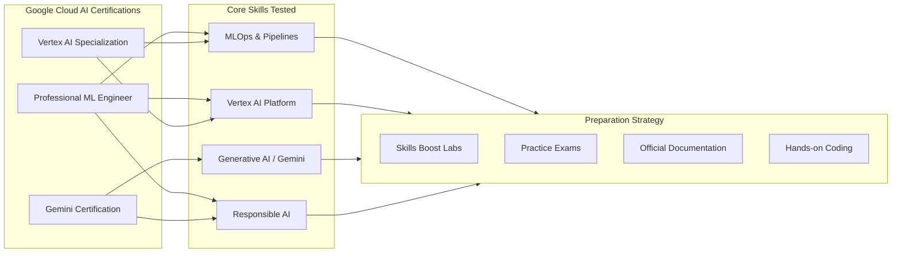
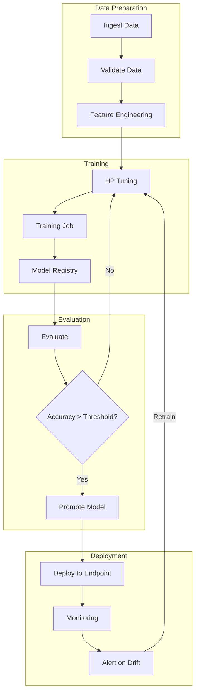
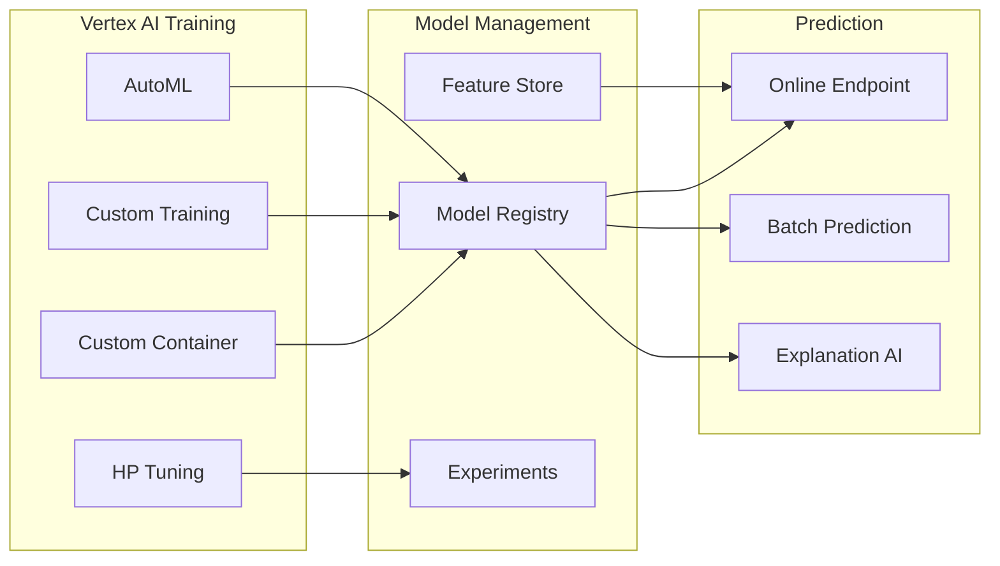
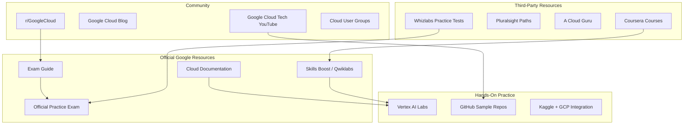
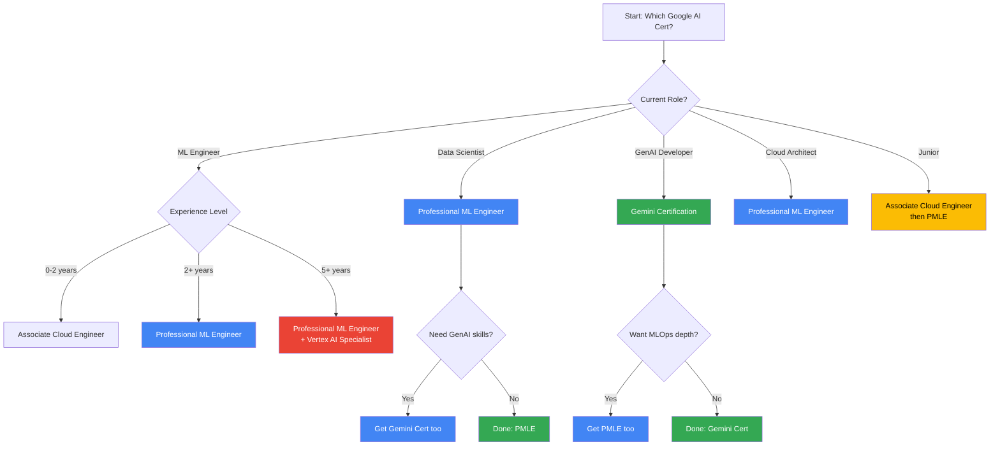

<!-- Clear Language: Keep sentences under 50 words -->
# Google Cloud AI Certifications

## Learning Objectives

| LO | Description |
|----|-------------|
| LO1 | Understand the Professional ML Engineer exam domains, format, and study approach |
| LO2 | Master Vertex AI specialization including model garden, training, prediction, feature store, and experiments |
| LO3 | Explain Gemini certification track covering API, multimodal capabilities, agents, and grounding |
| LO4 | Develop a complete study strategy using Google Cloud Skills Boost, labs, practice exams, and documentation |
| LO5 | Compare Google Cloud AI certifications with AWS and Azure equivalents for role-based planning |

## Introduction

Google Cloud Platform (GCP) offers a focused set of AI certifications that validate your ability to build, deploy, and manage ML solutions at scale. Unlike AWS and Azure which have multiple AI-related certs, GCP's flagship is the **Professional ML Engineer** certification. In 2024–2025, Google expanded its portfolio with specialized credentials for Vertex AI and Gemini.

This chapter covers all three certification tracks, exam strategies, and hands-on preparation. You will learn what each certification tests, how to prepare, and which one matches your career goals. Python code examples using the Vertex AI SDK give you real exam-relevant practice.

Google Cloud AI certifications are among the most respected in the industry because they demand practical MLOps knowledge, not just theoretical ML. The exams test your ability to build end-to-end ML pipelines on Vertex AI, manage models in production, and apply responsible AI practices.

## Prerequisites

- At least 6 months of hands-on experience with Google Cloud Console and gcloud CLI
- Working knowledge of Python and common ML frameworks (TensorFlow, PyTorch, scikit-learn)
- Understanding of ML concepts: training, evaluation, hyperparameter tuning, feature engineering
- Familiarity with MLOps principles: CI/CD for ML, model versioning, monitoring, and governance
- Basic understanding of Docker and containerization
- **Recommended preparation**: Complete Module 06 (Docker/Kubernetes/Cloud) and Module 16 (MLOps)

## Key Terminology

| Term | Definition |
|------|------------|
| **Vertex AI** | Google's unified ML platform for building, deploying, and managing ML models at scale |
| **Model Garden** | A curated repository of foundation models, including Gemini, Llama, Claude, and open-source models |
| **Feature Store** | A centralized repository for storing, serving, and sharing ML features across teams |
| **Vertex AI Experiments** | A managed service for tracking ML experiments, metrics, parameters, and artifacts |
| **Vertex AI Pipelines** | A serverless ML pipeline orchestration service based on Kubeflow Pipelines (KFP) |
| **Model Registry** | A central repository for managing model versions, metadata, and deployment targets |
| **Endpoint** | A managed prediction service that hosts models for online inference with autoscaling |
| **Batch Prediction** | Offline prediction for large datasets without requiring a deployed endpoint |
| **Hyperparameter Tuning (HP Tuning)** | Automated optimization of model hyperparameters using Vizier |
| **Explanation AI** | Tools for understanding model predictions through feature attributions and interpretability |
| **Vertex AI Agent Builder** | A platform for building generative AI agents with grounding, tool use, and retrieval-augmented generation |
| **Gemini API** | Google's multimodal LLM API supporting text, image, video, audio, and code |
| **Grounding** | Connecting LLM outputs to verifiable sources (Google Search, enterprise data, third-party data) |
| **Google Cloud Skills Boost** | The official hands-on lab platform with Qwiklabs credits and learning paths |
| **Recertification** | Google requires recertification every 2 years for Professional certifications |

## Chapter at a Glance

| Section | Topic | Key Concept |
|---------|-------|-------------|
| 5.1 | Professional ML Engineer | Six exam domains, Vertex AI mastery, MLOps focus |
| 5.2 | Vertex AI Specialization | Model Garden, training, prediction, Feature Store, Experiments |
| 5.3 | Gemini Certification | Gemini API, multimodal, agents, grounding, safety |
| 5.4 | Study Strategy | Skills Boost, labs, practice exams, documentation workflow |
| 5.5 | Certification Path | Role-based cert selection, recertification, cloud comparison |

## Chapter Roadmap



## Theory

### 5.1 Professional ML Engineer Certification

The **Google Cloud Professional ML Engineer** certification (exam code: `P-MLE-01`) is the flagship AI certification on GCP. It validates your ability to design, build, and productionize ML models to solve business problems using Google Cloud technologies.

#### Exam Domains (Weightage)

The exam is divided into six domains with the following approximate weight distribution:

| Domain | Weight | Key Topics |
|--------|--------|------------|
| 1. ML Problem Framing | 10% | Business requirements → ML problem, success metrics, data availability assessment |
| 2. Data Preparation | 20% | Data ingestion, exploration, cleaning, transformation, feature engineering |
| 3. Model Development | 20% | Training, hyperparameter tuning, architecture selection, transfer learning |
| 4. Model Validation | 10% | Evaluation metrics, bias detection, explanation AI, A/B testing |
| 5. Model Deployment | 20% | Vertex AI Endpoints, batch prediction, model registry, CI/CD pipelines |
| 6. MLOps & Monitoring | 20% | Model monitoring, drift detection, retraining, governance, automation |

#### Exam Format

- **Duration**: 2 hours
- **Questions**: 50–60 multiple-choice and multiple-select
- **Cost**: $200 (plus applicable taxes)
- **Delivery**: Online proctored or in-person testing center
- **Language**: English and Japanese
- **Validity**: 2 years (recertification required)

#### What the Exam Tests

The Professional ML Engineer exam is **practical** and **scenario-based**. You will need to:

1. **Choose the right GCP services** for a given ML use case
2. **Design ML pipelines** using Vertex AI Pipelines and Kubeflow
3. **Select appropriate training infrastructure** (CPU, GPU, TPU) based on workload
4. **Implement MLOps practices** including CI/CD, model monitoring, and automated retraining
5. **Apply responsible AI principles** including fairness, explainability, and privacy

#### Python Example: Vertex AI Training Pipeline

```python
from google.cloud import aiplatform
from google.cloud.aiplatform import hyperparameter_tuning as hp_tuning

# Initialize Vertex AI
aiplatform.init(
    project="my-ml-project",
    location="us-central1",
    staging_bucket="gs://my-staging-bucket"
)

# Define a custom training job
job = aiplatform.CustomTrainingJob(
    display_name="insurance-claim-classifier",
    script_path="trainer/train.py",
    container_uri="us-docker.pkg.dev/vertex-ai/training/tf-cpu.2-15:latest",
    requirements=["pandas", "scikit-learn", "google-cloud-storage"],
    model_serving_container_image_uri="us-docker.pkg.dev/vertex-ai/prediction/tf-cpu.2-15:latest",
)

# Define hyperparameter tuning parameters
hp_params = [
    hp_tuning.IntegerParameter("learning_rate", min=1e-4, max=1e-1, scale="log"),
    hp_tuning.IntegerParameter("batch_size", min=16, max=128, scale="linear"),
    hp_tuning.CategoricalParameter("optimizer", ["adam", "sgd"]),
]

# Launch hyperparameter tuning job
hp_job = job.run(
    replica_count=1,
    machine_type="n1-standard-4",
    service_account="vertex-ai-sa@my-ml-project.iam.gserviceaccount.com",
    args=["--epochs=10", "--model_dir=gs://my-ml-models/insurance/"],
    # HP tuning specific args
    hyperparameter_tuning_hp_parameters=hp_params,
    hyperparameter_tuning_max_trials=30,
    hyperparameter_tuning_parallel_trials=3,
)

print(f"HP tuning job submitted: {hp_job.resource_name}")
```

**Exam relevance**: This code pattern appears in domain 3 (Model Development) and domain 5 (Model Deployment). You must know how to launch custom training jobs with HP tuning, choose appropriate machine types, and configure container images.

#### MLOps Pipeline on Vertex AI

```python
from kfp import dsl
from kfp import compiler
from google.cloud import aiplatform

@dsl.component(packages_to_install=["pandas", "scikit-learn"])
def evaluate_model(
    model_artifact: dsl.Output[dsl.Model],
    metrics: dsl.Output[dsl.Metrics],
) -> None:
    """Evaluate model and record metrics."""
    import pickle
    import json
    from sklearn.metrics import accuracy_score, f1_score

    # Load model and test data from component inputs
    with open(model_artifact.path, "rb") as f:
        model = pickle.load(f)

    # Simulated evaluation (in real pipeline, load test data from GCS)
    y_true = [0, 1, 0, 1, 1]
    y_pred = [0, 1, 1, 1, 0]

    acc = accuracy_score(y_true, y_pred)
    f1 = f1_score(y_true, y_pred)

    # Log metrics
    metrics.log_metric("accuracy", acc)
    metrics.log_metric("f1_score", f1)

    print(f"Accuracy: {acc:.4f}, F1: {f1:.4f}")

@dsl.pipeline(name="ml-pipeline")
def ml_pipeline(
    project: str = "my-ml-project",
    location: str = "us-central1",
    dataset_path: str = "gs://my-bucket/data/claims.csv",
):
    # 1. Data validation component
    validate_task = dsl.ContainerOp(
        name="validate-data",
        image="gcr.io/my-project/data-validator:latest",
        arguments=["--source", dataset_path],
    )

    # 2. Training component
    train_task = dsl.ContainerOp(
        name="train-model",
        image="gcr.io/my-project/trainer:latest",
        arguments=[
            "--data", dataset_path,
            "--model-dir", "gs://my-bucket/models/",
        ],
    )

    # 3. Evaluation component
    eval_task = evaluate_model(
        model_artifact=train_task.outputs["model"],
    )

    # 4. Conditional promotion
    with dsl.Condition(eval_task.outputs["metrics"] > 0.8):
        dsl.ContainerOp(
            name="deploy-model",
            image="gcr.io/my-project/deployer:latest",
            arguments=[
                "--model-uri", train_task.outputs["model"],
            ],
        )

# Compile and run the pipeline
compiler.Compiler().compile(ml_pipeline, "ml_pipeline.yaml")
aiplatform.PipelineJob(
    display_name="ml-pipeline-run",
    template_path="ml_pipeline.yaml",
    pipeline_root="gs://my-pipeline-root/",
    parameter_values={
        "project": "my-ml-project",
        "dataset_path": "gs://my-bucket/data/claims.csv",
    },
).run()
```

**Exam relevance**: Domain 6 (MLOps & Monitoring) heavily tests pipeline construction. You need to understand Kubeflow Pipelines DSL, component definitions, and conditional execution.



---

### 5.2 Vertex AI Specialization

While the Professional ML Engineer covers the breadth of GCP AI, the **Vertex AI Specialization** (launched 2024) dives deep into Google's unified ML platform. This credential validates expert-level knowledge of Vertex AI components.

#### Key Components Tested

##### 5.2.1 Model Garden

Model Garden is a curated repository of over 150 foundation models and pre-trained models. The exam tests:

- **Model discovery**: Finding the right model for your use case from Google's first-party models (Gemini, PaLM, Imagen), open-source models (Llama, Falcon, Mistral), and partner models (Claude, Jurassic-2)
- **Model deployment**: Deploying foundation models with one click to Vertex AI Endpoints
- **Fine-tuning**: Using supervised fine-tuning (SFT) and reinforcement learning from human feedback (RLHF) on Vertex AI
- **Model access**: Managing API quotas, rate limits, and service account permissions

```python
# Deploy a foundation model from Model Garden
from google.cloud import aiplatform

aiplatform.init(project="my-project", location="us-central1")

# Deploy Gemini 1.5 Pro from Model Garden
model = aiplatform.Model.upload(
    display_name="gemini-1.5-pro",
    serving_container_image_uri="us-docker.pkg.dev/vertex-ai/prediction/tf-cpu.2-15:latest",
    artifact_uri=None,  # Managed by Google
    parent_model="publishers/google/models/gemini-1.5-pro",
)

endpoint = model.deploy(
    machine_type="n1-standard-4",
    min_replica_count=1,
    max_replica_count=5,
    traffic_split={"0": 100},
)

print(f"Endpoint deployed: {endpoint.resource_name}")
```

##### 5.2.2 Training Infrastructure

Vertex AI offers multiple training options tested on the exam:

| Training Type | Use Case | Infrastructure |
|---------------|----------|----------------|
| AutoML | Tabular, image, text, video — no coding required | Managed compute |
| Custom Training | Custom model architectures | CPU/GPU/TPU clusters |
| Custom Container | Full control over environment | Docker + Vertex AI |
| Hyperparameter Tuning | Optimization using Vertex AI Vizier | Parallel trials |
| Distributed Training | Large models across multiple devices | Multi-worker GPU/TPU |

```python
# Choosing the right training method
from enum import Enum

class TrainingStrategy(Enum):
    AUTOML = "automl"
    CUSTOM = "custom"
    CUSTOM_CONTAINER = "custom_container"
    DISTRIBUTED = "distributed"

def select_training_strategy(
    model_type: str,
    dataset_size: int,
    custom_code: bool,
    requires_distributed: bool,
) -> TrainingStrategy:
    """Select the optimal Vertex AI training strategy."""
    if requires_distributed and custom_code:
        return TrainingStrategy.DISTRIBUTED
    if custom_code and dataset_size > 100_000:
        return TrainingStrategy.CUSTOM
    if custom_code and dataset_size <= 100_000:
        return TrainingStrategy.CUSTOM_CONTAINER
    return TrainingStrategy.AUTOML

# Usage
strategy = select_training_strategy(
    model_type="classification",
    dataset_size=50000,
    custom_code=False,
    requires_distributed=False,
)
print(f"Recommended strategy: {strategy.value}")
```

##### 5.2.3 Vertex AI Feature Store

Feature Store is a concept heavily tested in domains 1 and 2 of the exam.

```python
from google.cloud import aiplatform

aiplatform.init(project="my-project", location="us-central1")

# Create a Feature Store
fs = aiplatform.Featurestore.create(
    display_name="insurance_features",
    online_store_fixed_node_count=1,
)

# Create an entity type
entity_type = fs.create_entity_type(
    entity_id_type="string",
    description="Customer entity with insurance features",
)

# Create features
entity_type.create_feature(
    feature_id="age",
    value_type="INT64",
    description="Customer age",
)
entity_type.create_feature(
    feature_id="annual_premium",
    value_type="DOUBLE",
    description="Annual premium amount",
)

# Ingest feature values
fs.ingest_from_gcs(
    feature_time="2024-06-01T00:00:00Z",
    entity_type=entity_type,
    gcs_source_uris=["gs://my-bucket/features/customer_features.csv"],
)

# Online serving for real-time predictions
result = entity_type.read_feature_values(
    entity_ids=["CUST001", "CUST002"],
    feature_selector=["age", "annual_premium"],
)
print(f"Served features: {result}")
```

##### 5.2.4 Vertex AI Experiments

Tracking experiments is critical for reproducibility. The exam tests experiment management.

```python
from google.cloud import aiplatform

aiplatform.init(project="my-project", location="us-central1")

# Start an experiment run
experiment = aiplatform.Experiment.create(
    display_name="claim-classifier-optimization"
)

# Log parameters and metrics
with aiplatform.start_run("run-v1") as my_run:
    # Log hyperparameters
    aiplatform.log_params({
        "learning_rate": 0.001,
        "batch_size": 32,
        "optimizer": "adam",
    })

    # Training happens here (simulated)
    accuracy = 0.89
    f1_score = 0.87

    # Log metrics
    aiplatform.log_metrics({
        "accuracy": accuracy,
        "f1_score": f1_score,
        "latency_ms": 45,
    })

    # Log model artifact
    aiplatform.log_model(
        model_display_name="claim-classifier-v1",
        serving_container_image_uri="us-docker.pkg.dev/vertex-ai/prediction/tf-cpu.2-15:latest",
    )

print(f"Experiment run complete. View at Vertex AI Experiments UI.")
```

##### 5.2.5 Prediction (Online and Batch)

Deployment and prediction patterns are core exam topics.

```python
from google.cloud import aiplatform

aiplatform.init(project="my-project", location="us-central1")

# Online prediction via deployed endpoint
def predict_online(model_id: str, instances: list) -> list:
    """Send online prediction request to a Vertex AI Endpoint."""
    endpoint = aiplatform.Endpoint(model_id)
    predictions = endpoint.predict(instances=instances)
    return predictions

# Batch prediction for large datasets
def predict_batch(
    model_name: str,
    source_uri: str = "gs://my-batch-input/data.jsonl",
    destination_uri: str = "gs://my-batch-output/predictions/",
) -> None:
    """Submit a batch prediction job."""
    model = aiplatform.Model(model_name)
    batch_job = model.batch_predict(
        job_display_name="batch-claims-2024-06",
        gcs_source=source_uri,
        gcs_destination_prefix=destination_uri,
        machine_type="n1-standard-4",
        min_replica_count=1,
        max_replica_count=10,
    )
    batch_job.wait()
    print(f"Batch prediction complete. Results at {destination_uri}")

# Example usage
predictions = predict_online(
    model_id="projects/my-project/locations/us-central1/endpoints/12345",
    instances=[{"age": 35, "annual_premium": 12000}],
)
print(f"Prediction: {predictions}")
```



---

### 5.3 Gemini Certification

Google launched the **Gemini Certification** track in 2024 to address the growing demand for generative AI skills. This certification focuses on building applications using the Gemini API and Vertex AI Agent Builder.

#### 5.3.1 Gemini API Capabilities

The Gemini API is a multimodal LLM API that accepts text, images, video, audio, and code.

```python
import google.generativeai as genai
from google.generativeai import types

# Configure the Gemini API
genai.configure(api_key="YOUR_API_KEY")

# List available models
for model in genai.list_models():
    print(f"{model.name}: {model.display_name}")

# Text generation
model = genai.GenerativeModel("gemini-1.5-pro")
response = model.generate_content(
    "Explain how attention mechanisms work in transformer models."
)
print(response.text)

# Multimodal: analyze an image
import PIL.Image

image = PIL.Image.open("model_architecture.png")
response = model.generate_content(
    [
        "Describe this model architecture diagram in detail. "
        "Identify each component and explain how data flows through it.",
        image,
    ]
)
print(response.text)

# Multimodal: video analysis
video_file = genai.upload_file(path="training_loop.mp4")
response = model.generate_content(
    [
        video_file,
        "Analyze this training process video. "
        "Identify potential issues in the loss curves shown.",
    ]
)
print(response.text)
```

**Exam relevance**: You must understand Gemini model variants (Nano, Pro, Ultra, Flash), context window sizes (up to 2M tokens for 1.5 Pro), rate limits, and pricing tiers.

#### 5.3.2 Grounding

Grounding connects LLM outputs to verifiable sources. The exam tests grounding techniques.

```python
# Grounding with Google Search
model = genai.GenerativeModel(
    "gemini-1.5-pro",
    tools="google_search_retrieval",  # Enable grounding
)

response = model.generate_content(
    "What is the latest MLOps best practice for model monitoring in 2025?"
)
print(response.text)

# Check grounding sources
for citation in response.citations:
    print(f"Source: {citation.source_uri}")
    print(f"Title: {citation.title}")

# Grounding with enterprise data (Vertex AI Search)
from google.cloud import aiplatform
from google.cloud.aiplatform import generative_ai

# Create a grounded generation with enterprise data store
model = generative_ai.GroundedGenerativeModel(
    model_name="gemini-1.5-pro",
    data_store_path="projects/my-project/locations/global/collections/default_collection/dataStores/enterprise-knowledge-base",
)

response = model.generate_content(
    "Summarize our company's model governance policy for deploying LLMs in production."
)
print(response.text)
```

#### 5.3.3 Vertex AI Agent Builder

Agent Builder enables no-code and low-code agent creation. The exam covers agent architecture.

```python
from google.cloud import aiplatform
from google.cloud.aiplatform import agents

# Define an agent with tools
def search_flights(departure: str, arrival: str, date: str) -> str:
    """Search for available flights."""
    # In production, call an actual flight API
    return f"Flights from {departure} to {arrival} on {date}: $450 (direct, 3h)"

def book_hotel(location: str, check_in: str, check_out: str) -> str:
    """Book a hotel room."""
    return f"Booked hotel in {location} from {check_in} to {check_out}"

# Create agent configuration
travel_agent = agents.Agent(
    display_name="travel-planner",
    instructions="You are a travel planning assistant. "
    "Help users find flights, book hotels, and plan itineraries. "
    "Use the provided tools for searches and bookings.",
    tools=[search_flights, book_hotel],
    model="gemini-1.5-pro",
    grounding_source=agents.GroundingSource(
        type=agents.GroundingSourceType.VERTEX_AI_SEARCH,
        data_store="projects/my-project/locations/global/collections/default_collection/dataStores/travel-knowledge-base",
    ),
)

# Deploy the agent
agent_endpoint = travel_agent.deploy()
print(f"Agent deployed: {agent_endpoint.resource_name}")

# Chat with the agent
session = agent_endpoint.create_session()
response = session.send_message(
    "Plan a trip to London from New York next week. "
    "Find flights and suggest hotels near Central London."
)
print(f"Agent response: {response.text}")
```

#### 5.3.4 Safety and Responsible AI

The exam tests Google's AI safety approach across four dimensions:

| Dimension | Description | Exam Focus |
|-----------|-------------|------------|
| Safety Filters | Content filtering for hate, harassment, dangerous content | Configuring safety settings |
| Grounding | Connecting outputs to sources | Setting up grounding sources |
| Citation | Attributing sources in outputs | Enabling citation metadata |
| Explainability | Explaining model behavior | Using Explanation AI |

```python
# Configuring safety settings
from google.generativeai.types import HarmCategory, HarmBlockThreshold

model = genai.GenerativeModel(
    "gemini-1.5-pro",
    safety_settings={
        HarmCategory.HARM_CATEGORY_HATE_SPEECH: HarmBlockThreshold.BLOCK_ONLY_HIGH,
        HarmCategory.HARM_CATEGORY_HARASSMENT: HarmBlockThreshold.BLOCK_MEDIUM_AND_ABOVE,
        HarmCategory.HARM_CATEGORY_DANGEROUS_CONTENT: HarmBlockThreshold.BLOCK_MEDIUM_AND_ABOVE,
    },
)

# Enable citation metadata
response = model.generate_content(
    "Explain the transformer architecture.",
    generation_config=genai.types.GenerationConfig(
        citation_metadata=True,
    ),
)

if response.citation_metadata:
    for citation in response.citation_metadata.citations:
        print(f"Cited: {citation.source} (relevance: {citation.relevance_score})")
```

---

### 5.4 Study Strategy

A structured study strategy is essential for Google Cloud AI certifications. The following plan is based on successful candidate experiences and official Google recommendations.

#### Phase 1: Foundation (Weeks 1-3)

| Week | Focus | Resources | Hours |
|------|-------|-----------|-------|
| 1 | GCP AI services overview | Cloud Skills Boost: "ML on GCP" learning path | 5-7 |
| 2 | Vertex AI hands-on | Skills Boost: "Vertex AI" quest | 5-7 |
| 3 | Python ML on GCP | Official docs + custom training labs | 5-7 |

#### Phase 2: Deep Dive (Weeks 4-6)

| Week | Focus | Resources | Hours |
|------|-------|-----------|-------|
| 4 | MLOps on Vertex AI | Vertex AI Pipelines labs, CI/CD | 7-10 |
| 5 | Model deployment & monitoring | Endpoints, monitoring, Explainable AI | 7-10 |
| 6 | Responsible AI & security | AI Principles, fairness, differential privacy | 5-7 |

#### Phase 3: Exam Preparation (Weeks 7-8)

| Week | Focus | Resources | Hours |
|------|-------|-----------|-------|
| 7 | Practice exams | Official practice exam, third-party mocks | 10-12 |
| 8 | Weak areas & final review | Documentation deep-dive, review incorrect answers | 8-10 |

#### Recommended Resources

```python
# Study tracker script — track your progress
import json
from datetime import datetime, timedelta

class ExamStudyTracker:
    """Track your Google Cloud AI certification study progress."""

    def __init__(self, exam_date: str):
        self.exam_date = datetime.strptime(exam_date, "%Y-%m-%d")
        self.topics = {}
        self.lab_hours = 0
        self.practice_exam_scores = []

    def add_topic(
        self,
        topic: str,
        hours_studied: float,
        confidence: int,  # 1-10
        labs_completed: int = 0,
    ) -> dict:
        """Add a study session for a topic."""
        entry = {
            "date": datetime.now().isoformat(),
            "hours": hours_studied,
            "confidence": confidence,
            "labs": labs_completed,
        }
        if topic not in self.topics:
            self.topics[topic] = []
        self.topics[topic].append(entry)
        self.lab_hours += hours_studied
        return entry

    def add_practice_exam(self, score: float, topics_missed: list[str]):
        """Record a practice exam result."""
        self.practice_exam_scores.append({
            "date": datetime.now().isoformat(),
            "score": score,
            "topics_missed": topics_missed,
        })

    def readiness_score(self) -> float:
        """Calculate exam readiness as a percentage."""
        if not self.topics:
            return 0.0

        topic_scores = []
        for topic, entries in self.topics.items():
            avg_confidence = sum(e["confidence"] for e in entries) / len(entries)
            topic_scores.append(avg_confidence)

        avg_confidence = sum(topic_scores) / len(topic_scores)
        min_lab_hours = 40  # Minimum recommended lab hours
        lab_factor = min(1.0, self.lab_hours / min_lab_hours)

        if self.practice_exam_scores:
            latest_scores = self.practice_exam_scores[-3:]
            avg_exam = sum(s["score"] for s in latest_scores) / len(latest_scores)
            exam_factor = avg_exam / 100.0
        else:
            exam_factor = 0.0

        # Weighted readiness: 40% confidence, 30% labs, 30% practice exams
        readiness = (avg_confidence / 10 * 0.4) + (lab_factor * 0.3) + (exam_factor * 0.3)
        return round(readiness * 100, 1)

    def days_until_exam(self) -> int:
        return (self.exam_date - datetime.now()).days

    def study_plan_status(self) -> str:
        """Generate a summary of study progress."""
        readiness = self.readiness_score()
        days_left = self.days_until_exam()

        if readiness >= 80 and days_left <= 7:
            return "Ready for exam! Focus on weak areas and rest."
        elif readiness >= 60:
            return f"On track. {days_left} days left. Increase lab hours and practice exams."
        elif readiness >= 40:
            return f"Need more work. Focus on hands-on labs ({days_left} days left)."
        else:
            return "Just starting. Follow the 8-week study plan."

# Usage
tracker = ExamStudyTracker(exam_date="2025-03-15")
tracker.add_topic("Vertex AI Pipelines", hours_studied=4, confidence=7, labs_completed=3)
tracker.add_topic("Model Garden & Deployment", hours_studied=3, confidence=8, labs_completed=2)
tracker.add_practice_exam(score=72.0, topics_missed=["MLOps monitoring", "Feature Store"])

print(f"Readiness: {tracker.readiness_score()}%")
print(f"Status: {tracker.study_plan_status()}")
```

#### Key Resources



---

### 5.5 Certification Path

Choosing the right certification depends on your role, experience level, and career goals.

#### Which Certification for Which Role

| Role | Recommended Certification | Alternative | Key Focus Areas |
|------|--------------------------|-------------|-----------------|
| ML Engineer | Professional ML Engineer | Vertex AI Specialist | End-to-end ML pipelines, MLOps |
| Data Scientist | Professional ML Engineer | — | Model development, evaluation, feature engineering |
| AI/ML Architect | Professional ML Engineer + Gemini Cert | — | System design, agent architecture, multimodal |
| Generative AI Developer | Gemini Certification | — | Gemini API, agents, grounding, RAG |
| MLOps Engineer | Professional ML Engineer | Vertex AI Specialist | Pipelines, CI/CD, monitoring, infrastructure |
| Cloud Architect | Professional ML Engineer | — | Infrastructure planning, cost optimization |
| Junior ML Engineer | Associate Cloud Engineer → PMLE | — | Begin with Associate then pursue PMLE |

#### Comparison with AWS and Azure

| Dimension | Google Cloud (PMLE) | AWS (MLS-C01) | Azure (AI-102 + DP-100) |
|-----------|---------------------|---------------|-------------------------|
| **Cost** | $200 | $300 | $165 each, $330 total |
| **Duration** | 2 hours | 3 hours | 2 hours each |
| **Questions** | 50-60 | 65 | 40-60 each |
| **Validity** | 2 years | 3 years | 1 year (renewable) |
| **Focus** | MLOps, Vertex AI | SageMaker, Bedrock | Azure AI, OpenAI Service |
| **Hands-on weight** | High (scenario-based) | High (SageMaker) | Medium |
| **Generative AI** | Vertex AI Agent Builder | Bedrock agents | Azure AI Studio, Copilot |
| **Prerequisite certs** | None (but experience needed) | None | None |
| **Difficulty** | Hard | Hard | Medium-Hard |
| **Recertification** | Required every 2 years | Required every 3 years | Required annually (free) |

#### Recertification Requirements

Google requires recertification for Professional certifications every 2 years. The recertification process:

- **Recertification exam**: Same format as the full exam (50-60 questions, 2 hours)
- **Cost**: $100 (half the full exam price)
- **Window**: 60 days before to 60 days after your certification expiry
- **Grace period**: 60 days after expiry to recertify without losing your credential
- **Study materials**: New exam guide is published when recertification becomes available

#### Decision Flowchart



---

## Interview Q&A

### Q1: What are the six domains of the Google Cloud Professional ML Engineer exam?

**Answer:** The six domains are: (1) ML Problem Framing (10%) — translating business problems to ML problems and defining success metrics; (2) Data Preparation (20%) — data ingestion, exploration, cleaning, transformation, and feature engineering; (3) Model Development (20%) — training, hyperparameter tuning, architecture selection, and transfer learning; (4) Model Validation (10%) — evaluation metrics, bias detection, and Explainable AI; (5) Model Deployment (20%) — Vertex AI Endpoints, batch prediction, model registry, and CI/CD; (6) MLOps and Monitoring (20%) — model monitoring, drift detection, retraining, governance, and automation.

### Q2: How do you choose between Vertex AI AutoML and custom training for a project?

**Answer:** Use AutoML when: the dataset is well-structured, you need quick baseline results, you lack ML expertise, or the problem fits standard modalities (tabular, image, text, video). Use custom training when: you need a custom architecture, you have domain-specific requirements, you need distributed training across GPUs/TPUs, or you need full control over the training process (loss functions, custom layers, advanced augmentation). For large-scale production systems, start with AutoML as a baseline, then move to custom training for optimization.

### Q3: Explain the difference between online prediction and batch prediction on Vertex AI.

**Answer:** Online prediction uses a deployed endpoint to serve real-time predictions with low latency (typically <100ms). It supports autoscaling from 0 to N replicas and is ideal for interactive applications like web APIs. Batch prediction processes large datasets (e.g., millions of rows) without deploying an endpoint. It runs as a job, reads input from GCS, writes results to GCS, and costs less per prediction. Online prediction is for real-time inference; batch prediction is for offline processing of large datasets where latency is not critical.

### Q4: What is Vertex AI Feature Store and when should you use it?

**Answer:** Vertex AI Feature Store is a managed repository for storing, organizing, and serving ML features. Use it when: multiple models share the same features (e.g., customer features used by both a churn model and a recommendation model), features need to be served consistently for training and inference, you need point-in-time correct feature values to avoid data leakage, or you need both online (low-latency) and offline (batch) feature serving. It eliminates feature duplication and ensures training-serving skew is minimized by using the same feature values in both phases.

### Q5: How does Vertex AI Pipelines differ from Kubeflow Pipelines, and which one should you use?

**Answer:** Vertex AI Pipelines is a managed version of Kubeflow Pipelines (KFP) integrated into GCP. The key differences: (1) Vertex AI Pipelines is serverless — you do not manage the KFP deployment; Kubeflow Pipelines requires managing a KFP cluster. (2) Vertex AI Pipelines integrates natively with GCP services (Vertex AI, Cloud Storage, BigQuery) without custom components. (3) Vertex AI Pipelines supports both KFP DSL and TensorFlow Extended (TFX) DSL. Use Vertex AI Pipelines for GCP-native ML workflows; use Kubeflow Pipelines for multi-cloud or on-premises deployments where you need full control.

### Q6: What is grounding in the context of Gemini API, and why is it important?

**Answer:** Grounding connects LLM outputs to verifiable sources. Instead of relying solely on the model's parametric knowledge (which can be outdated or hallucinated), grounding attaches citations to verifiable data sources. Google supports two grounding methods: (1) Google Search grounding — the model retrieves and cites web search results; (2) Vertex AI Search grounding — the model retrieves from enterprise data stores (internal documents, knowledge bases). Grounding is important because it reduces hallucinations, provides attribution, enables fact-checking, and is required for many enterprise use cases (compliance, legal, regulated industries).

### Q7: How would you set up a CI/CD pipeline for ML models on Google Cloud?

**Answer:** A CI/CD pipeline for ML on GCP uses: (1) **Source control**: Cloud Source Repositories or GitHub with Cloud Build triggers on commits. (2) **CI (Cloud Build)**: Run unit tests, data validation (TensorFlow Data Validation), and model training on Vertex AI. (3) **CD (Cloud Deploy)**: Promote the model through staging → canary → production environments using Vertex AI Model Registry and endpoints. (4) **Monitoring**: After deployment, use Vertex AI Model Monitoring for drift detection. If drift exceeds thresholds, trigger automatic retraining via a Cloud Functions or Cloud Run handler. Key tools: Cloud Build, Artifact Registry, Vertex AI Pipelines, Cloud Deploy.

```yaml
# cloudbuild.yaml — ML CI/CD pipeline
steps:
  # Step 1: Run unit tests
  - name: python:3.10
    entrypoint: python
    args: ["-m", "pytest", "tests/"]

  # Step 2: Data validation
  - name: gcr.io/google.com/cloudsdktool/cloud-sdk
    entrypoint: python
    args: ["scripts/validate_data.py", "--source", "gs://${_BUCKET}/data/"]

  # Step 3: Train model on Vertex AI
  - name: gcr.io/google.com/cloudsdktool/cloud-sdk
    entrypoint: python
    args: ["scripts/launch_training.py"]

  # Step 4: Deploy to staging
  - name: gcr.io/google.com/cloudsdktool/cloud-sdk
    entrypoint: python
    args: ["scripts/deploy_staging.py"]

  # Step 5: Run evaluation tests on staging
  - name: python:3.10
    entrypoint: python
    args: ["scripts/evaluate_staging.py"]

  # Step 6: Promote to production
  - name: gcr.io/google.com/cloudsdktool/cloud-sdk
    entrypoint: python
    args: ["scripts/deploy_production.py"]

options:
  machineType: E2_HIGHCPU_8
timeout: 3600s
```

### Q8: What is the difference between Gemini 1.5 Pro, Gemini 1.5 Flash, and Gemini 1.5 Nano?

**Answer:** The Gemini 1.5 model family offers different trade-offs: **Gemini 1.5 Pro** is the flagship model optimized for complex reasoning, multimodal tasks, and long-context (up to 2 million tokens). It is best for research, analysis, and applications requiring deep understanding. **Gemini 1.5 Flash** is optimized for speed and cost — it is distilled from Pro and processes tokens faster and cheaper. It is ideal for high-throughput production applications, chat, and summarization. **Gemini 1.5 Nano** is the smallest model designed for on-device deployment (Android, mobile). It is optimized for low-latency, privacy-sensitive, and offline use cases. All three share the same multimodal architecture but differ in parameter count, speed, cost, and capability.

### Q9: How does Google Cloud's approach to responsible AI differ from AWS and Azure?

**Answer:** Google's responsible AI approach is built on seven AI Principles (published 2018) that guide all AI development: be socially beneficial, avoid creating or reinforcing unfair bias, be built and tested for safety, be accountable to people, incorporate privacy design principles, uphold high standards of scientific excellence, and be made available for uses that align with these principles. On the technical side, Google provides: (1) **Explainable AI** — feature attributions for both tabular and image models; (2) **Model Monitoring** — skew and drift detection with automatic alerts; (3) **Safety filters** — content filtering across Gemini API with configurable thresholds; (4) **Model Card Toolkit** — automated model documentation generation. AWS provides SageMaker Clarify for bias detection and Amazon Bedrock Guardrails for content filtering. Azure provides Azure AI Content Safety and Responsible AI dashboards. Google's approach is more principle-driven with stricter safety defaults; AWS and Azure focus more on configurable guardrails that give the developer control.

### Q10: You need to recommend a certification path for a team building generative AI products on Google Cloud. What do you recommend?

**Answer:** For a team building generative AI products, I recommend a dual-certification strategy: (1) The **ML engineer** on the team should pursue **Professional ML Engineer** — this validates MLOps expertise for deploying and maintaining production systems, which is critical for GenAI applications that need monitoring, grounding, and safety guardrails. (2) The **AI application developer** should pursue **Gemini Certification** — this covers the Gemini API, multimodal capabilities, agent building, grounding techniques, and safety configuration. A third team member could pursue **Vertex AI Specialization** for deep infrastructure knowledge. For most teams, starting with Professional ML Engineer (for the platform expert) and Gemini Certification (for the application developer) provides comprehensive coverage. The Gemini Certification is newer and directly aligned with the current generative AI market demand.

---

## Chapter Quiz (5 MCQ)

### Q1: Which Vertex AI service is used for real-time, low-latency model predictions?

A) Vertex AI Batch Prediction
B) Vertex AI Endpoints
C) Vertex AI Feature Store
D) Vertex AI Experiments

**Answer:** B) Vertex AI Endpoints — deployed endpoints provide real-time prediction with autoscaling and traffic splitting. Batch prediction (A) is for offline processing. Feature Store (C) stores and serves features. Experiments (D) track ML experiments.

---

### Q2: What does "grounding" mean in the context of the Gemini API?

A) Connecting the model to a grounding wire for safety
B) Anchoring LLM outputs to verifiable data sources
C) Setting the base temperature of the model
D) Installing the model on a physical server

**Answer:** B) Grounding connects LLM outputs to verifiable sources (Google Search or enterprise data stores) to reduce hallucinations, provide citations, and enable fact-checking.

---

### Q3: What is the validity period of Google Cloud Professional ML Engineer certification?

A) 1 year
B) 2 years
C) 3 years
D) No expiration

**Answer:** B) 2 years. Recertification is required every 2 years. AWS MLS-C01 is valid for 3 years. Azure certifications require annual renewal (free).

---

### Q4: Which Google Cloud AI certification should a junior ML Engineer (0-2 years experience) pursue first?

A) Professional ML Engineer
B) Vertex AI Specialization
C) Gemini Certification
D) Associate Cloud Engineer

**Answer:** D) Associate Cloud Engineer — this foundational certification validates basic GCP knowledge and is recommended before pursuing the advanced Professional ML Engineer certification, which requires 3+ years of experience.

---

### Q5: What is the primary advantage of using Vertex AI Pipelines over running ad-hoc training scripts?

A) Lower compute costs
B) Reproducible, automated, and monitored ML workflows with component reuse
C) Faster model training
D) No code required

**Answer:** B) Vertex AI Pipelines provides reproducibility, automation, monitoring, and component reuse. Ad-hoc scripts lack these MLOps capabilities, making it harder to track experiments, debug failures, and collaborate.

---

## Exercises

### Exercise 1: Vertex AI Training Pipeline

Create a Python script that:
1. Initializes Vertex AI with a project and location
2. Launches a custom training job with hyperparameter tuning
3. Logs experiment parameters and metrics
4. Deploys the best model to an endpoint

Use the `google-cloud-aiplatform` library. Expected output: a deployed endpoint that can serve predictions.

### Exercise 2: Gemini Multimodal Application

Build a Python application that:
1. Uses the Gemini API to analyze an image (supply any image URL)
2. Generates a detailed description using Gemini 1.5 Pro
3. Configures safety settings to block harmful content
4. Enables citation metadata and prints sources

Use the `google-generativeai` library. Expected output: a description with cited sources.

### Exercise 3: Study Plan Generator

Write a Python script that:
1. Takes your target exam date and weekly available study hours as input
2. Generates a week-by-week study plan covering all exam domains
3. Estimates readiness percentage based on topics studied and practice exam scores
4. Outputs a HTML or markdown study plan

Use the `datetime` and `json` libraries. Expected output: a personalized 8-week study schedule.

### Exercise 4: Model Monitoring Alert

Create a Python function that:
1. Simulates online prediction requests to a Vertex AI Endpoint using the Python SDK (mock the endpoint)
2. Monitors prediction responses for data drift using TensorFlow Data Validation (TFDV)
3. Logs drift metrics to Cloud Logging
4. Triggers a retraining request when drift exceeds 5%

Use the `google-cloud-aiplatform` and `tensorflow-data-validation` libraries. Expected output: drift metrics and a retraining trigger.

### Exercise 5: MLOps Pipeline Design

Design (write as a markdown file or Python module) an end-to-end MLOps pipeline on Google Cloud that includes:
- Data ingestion from BigQuery
- Feature engineering with Vertex AI Feature Store
- Model training with HP tuning
- Model evaluation with Explanation AI
- Canary deployment with traffic splitting
- Production monitoring with drift detection
- Automatic retraining on drift

Include a Mermaid diagram of the pipeline architecture and Python pseudocode for key components.

---

## Summary

Google Cloud offers three AI certification tracks with a strong MLOps and practical, scenario-based emphasis. The Professional ML Engineer (P-MLE-01) is the flagship certification: $200, 2 hours, 50-60 questions, valid 2 years, with Data Preparation, Model Development, Model Deployment, and MLOps and Monitoring each weighted at 20%, and it tests real Vertex AI skills like custom training with hyperparameter tuning, Kubeflow-based pipelines, endpoints, and drift monitoring. The Vertex AI Specialization (launched 2024) goes deeper into the platform: Model Garden with 150+ foundation models, Feature Store, Experiments, training infrastructure choices (AutoML vs custom vs custom container vs distributed), and online versus batch prediction. The Gemini Certification covers the multimodal Gemini API (context windows up to 2M tokens for 1.5 Pro), grounding via Google Search or enterprise data stores, Vertex AI Agent Builder, and safety configuration across hate, harassment, and dangerous content. Preparation follows an 8-week plan combining Cloud Skills Boost (Qwiklabs) hands-on labs, at least 40 lab hours, practice exams, and official documentation. Recertification is required every 2 years at a reduced $100 price, juniors should start with the Associate Cloud Engineer path, and a dual PMLE plus Gemini combination covers most team needs for generative AI products.

## Practical Takeaways

- The **Professional ML Engineer** exam has six domains with heavy emphasis on data preparation (20%), model development (20%), deployment (20%), and MLOps (20%)
- **Vertex AI Specialization** dives deep into Model Garden, Feature Store, Experiments, and prediction infrastructure
- **Gemini Certification** covers multimodal LLM applications, agent building with Vertex AI Agent Builder, grounding, and safety
- Google Cloud certifications require recertification every 2 years (Professional level) with a reduced-price exam ($100)
- Use **Google Cloud Skills Boost** (Qwiklabs) for hands-on practice — it provides temporary GCP environments with pre-configured resources
- **Vertex AI Pipelines** (based on Kubeflow Pipelines) is essential for production MLOps — understand component definitions, conditional execution, and pipeline compilation
- **Model Garden** provides one-click deployment of 150+ foundation models including Gemini, Llama, Claude, and open-source models
- **Grounding** is Google's differentiator for generative AI — connecting LLM outputs to Google Search or enterprise data stores
- Python SDK code (Vertex AI and Gemini) is heavily tested in the form of scenario-based questions
- Dual certification (PMLE + Gemini) provides the most comprehensive coverage for teams building GenAI products on Google Cloud

## Common Mistakes

1. **Confusing Vertex AI Endpoints with Cloud Run**: Endpoints are ML-specific with autoscaling for predictions; Cloud Run is for general-purpose containers. Use Endpoints for model serving.
2. **Overlooking Feature Store in MLOps design**: Many candidates ignore Feature Store when designing pipelines. Google tests this heavily — always include feature serving in your architecture.
3. **Assuming AutoML is always the answer**: AutoML is for baselines and standard problems. Custom training is needed for novel architectures, custom losses, and distributed training.
4. **Not studying the MLOps domain enough**: Domain 6 (MLOps & Monitoring) and Domain 2 (Data Preparation) combine for 40% of the exam. These are the most under-prepared areas.
5. **Skipping the official exam guide**: Google publishes a detailed exam guide with sample questions. Always start here before third-party resources.
6. **Ignoring the Associate Cloud Engineer path**: Junior engineers who attempt PMLE without foundational GCP knowledge often fail. Take the Associate exam first.
7. **Forgetting about service account permissions**: Many practice exam questions test IAM and service account configuration for Vertex AI. Study googleapis.com resource names and required roles.
8. **Not practicing with the actual SDK**: The exam scenarios reflect real SDK behavior. Run actual Vertex AI Python code, not just read documentation.

## Revision Notes

- **Exam code**: P-MLE-01 (Professional ML Engineer)
- **Cost**: $200; recertification $100
- **Duration**: 2 hours, 50-60 questions
- **Validity**: 2 years; recertify via exam
- **Six domains**: Problem Framing (10%), Data Prep (20%), Model Dev (20%), Validation (10%), Deployment (20%), MLOps (20%)
- **Vertex AI**: Unified ML platform — Training, Prediction, Feature Store, Experiments, Pipelines
- **Model Garden**: 150+ foundation models — Gemini, Llama, Claude, Mistral, Falcon
- **Gemini models**: 1.5 Pro (complex reasoning), 1.5 Flash (speed/cost optimized), 1.5 Nano (on-device)
- **Grounding**: Google Search or Vertex AI Search — reduces hallucinations, enables citations
- **Safety**: HarmCategory thresholds — BLOCK_ONLY_HIGH, BLOCK_MEDIUM_AND_ABOVE, BLOCK_LOW_AND_ABOVE
- **CI/CD for ML**: Cloud Build → Vertex AI Pipelines → Model Registry → Endpoint → Monitoring → Retraining
- **Skills Boost**: qwiklabs.com — learning paths, quests, hands-on labs with GCP credits
- **Recertification**: Required every 2 years, $100, 60-day window before/after expiry

## Placement Section

### Top 10 Interview Questions

#### Google Style

1. **Explain the core idea of Google Cloud AI Certifications in under 60 seconds, then give a real-world analogy.** — Structure: definition, how it works in one sentence, why it matters, analogy. Follow-up: what would break if you removed this from a production system?

2. **Design a minimal, well-typed function that demonstrates Google Cloud AI Certifications.** — Interviewer checks: signature with type hints, edge cases, complexity, and a clean docstring. Follow-up: how does your design behave with empty or malformed input?

3. **What are the common pitfalls when engineers first learn ** — List 3-4, then explain how you would prevent each in a code review.

#### Amazon Style

4. **Describe a production bug caused by misunderstanding Google Cloud AI Certifications. How did you diagnose and fix it?** — STAR format: situation, task, action, result. Mention logs, reproduction, root-cause analysis, and the regression test you added.

5. **How would you scale a system that relies on Google Cloud AI Certifications from 10 users to 10 million?** — Discuss bottlenecks, caching, monitoring, and when to redesign. Follow-up: what metrics would you track?

#### Microsoft Style

6. **Compare Google Cloud AI Certifications with the closest alternative approach. When would you choose each?** — Make a decision matrix: performance, maintainability, ecosystem, learning curve. Follow-up: what would change your decision?

7. **Walk through how you would test a component that depends on Google Cloud AI Certifications.** — Unit, integration, property-based tests; mocking boundaries; golden files for outputs.

#### NVIDIA Style

8. **How does Google Cloud AI Certifications behave differently at scale — memory, throughput, or precision-wise?** — Connect to data pipelines and model training if applicable. Follow-up: what happens to latency as input grows?

9. **How would you make an implementation of Google Cloud AI Certifications run faster on GPU hardware?** — Batch operations, vectorization, avoiding Python loops, reducing data movement.

#### AI Startup Style

10. **Write the smallest possible implementation of Google Cloud AI Certifications that is production-quality.** — Include error handling, type hints, and a one-line docstring. Follow-up: what would you refactor first when it grows?

### Resume Tips

- Name Google Cloud AI Certifications explicitly in your skills section, paired with a measurable achievement ("Reduced X by 40% using Google Cloud AI Certifications").
- Add a bullet describing a project that applies Google Cloud AI Certifications to real data, with numbers.
- Mention the tools and libraries you used alongside Google Cloud AI Certifications (linters, test frameworks, profiling tools).
- Keep resume bullets under 15 words and start each with an action verb.

### Interview Day Checklist

- Rehearse a 60-second explanation of Google Cloud AI Certifications and one real-world analogy.
- Prepare one STAR story about debugging a Google Cloud AI Certifications-related production issue.
- Review complexity and edge cases for the classic Google Cloud AI Certifications interview problem.
- Have questions ready: how does the team apply Google Cloud AI Certifications in production today?
- Test your environment (Python, editor, internet) 15 minutes before the interview.

## True/False

1. **True or False:** Google Cloud AI Certifications builds directly on the fundamentals covered in the earlier chapters of this module. — **True.** Every advanced topic in this module assumes the core concepts from the previous chapters.
2. **True or False:** You should write at least one code example for Google Cloud AI Certifications before moving to the next chapter. — **True.** Active recall with hands-on code beats passive reading for retention.
3. **True or False:** The complexity analysis for Google Cloud AI Certifications is the same regardless of input size. — **False.** Complexity grows with input size; always state best, average, and worst case.
4. **True or False:** Edge cases (empty input, invalid input, boundary values) matter for Google Cloud AI Certifications in production. — **True.** Most production bugs come from unhandled edge cases.
5. **True or False:** You should memorize the Google Cloud AI Certifications chapter content once and never review it again. — **False.** Spaced repetition (24h, 3 days, 1 week) dramatically improves long-term recall.

## Fill in the Blank

1. The chapter that covers Google Cloud AI Certifications is Chapter ___ of this module. — Answer: check the module's table of contents.
2. The time complexity of the standard approach to Google Cloud AI Certifications is ___. — Answer: review the theory section and state big-O notation.
3. The main edge case to handle when implementing Google Cloud AI Certifications is ___. — Answer: empty or invalid input handling, as discussed in the chapter.
4. The tools commonly used to debug Google Cloud AI Certifications issues are ___ and ___. — Answer: refer to the Debugging Guide section of this chapter.
5. The related topic that connects to Google Cloud AI Certifications in the next chapter is ___. — Answer: see the Next Topic section.

## Scenario Questions

1. **Scenario:** A teammate ships a change involving Google Cloud AI Certifications that breaks production at 3 AM. — Diagnosis: check the recent diff, reproduce locally with the failing input, check logs. Fix: revert, add a regression test, and review the root cause. Prevention: CI tests on edge cases and code review checklist.

2. **Scenario:** Your implementation of Google Cloud AI Certifications is correct but too slow for the required latency. — Measure first with a profiler. Common fixes: reduce redundant work, use built-in optimized functions, batch operations, or add caching. Only then consider algorithmic changes.

3. **Scenario:** A new hire asks you to explain Google Cloud AI Certifications in five minutes before a customer demo. — Use the 3-part answer: what it is (one sentence), how it works (one example), why it matters (one business impact). Then offer to go deeper after the demo.

4. **Scenario:** Your team's codebase has three different patterns for Google Cloud AI Certifications and you must standardize. — Write a short ADR (architecture decision record), pick the pattern with best maintainability, migrate incrementally, and add a linter rule to enforce it.

## Output Questions

1. **What is the output of the simplest correct implementation of Google Cloud AI Certifications on an empty input?** — Trace through the code: it should return the documented default (None, 0, empty collection) without raising.
2. **What is the output when the input is at the boundary value?** — Check off-by-one errors and inclusive/exclusive bounds in the chapter's examples.
3. **What does the implementation return when given invalid input types?** — With type hints and validation, it raises a clear error; without, it may fail silently.
4. **What is the output for the sample input given in the chapter's Examples section?** — Re-run the chapter's example code and compare against the documented output.
5. **What is the time complexity output when you profile the implementation at 10x input size?** — Expect the curve matching the chapter's complexity analysis (linear, quadratic, log-linear).

## Difficulty Level

| Level | Time | What It Takes |
|-------|------|---------------|
| Beginner | 1-2 sessions | Read theory, run the chapter examples, solve the Easy exercises |
| Intermediate | 3-5 sessions | Complete Medium exercises, explain Google Cloud AI Certifications to someone else |
| Advanced | 1+ week | Solve Hard exercises, optimize for real datasets, answer interview follow-ups |

## Tips & Tricks

- Always write a one-line example of Google Cloud AI Certifications from memory before opening the chapter — active recall first.
- Use the chapter's Revision Notes as a checklist: you have mastered Google Cloud AI Certifications when you can explain each bullet.
- Pair the chapter quiz with the Flashcards: wrong answers become your next study session's focus.
- For interviews, practice explaining Google Cloud AI Certifications twice: once with a technical audience, once with a non-technical audience.
- Keep a personal examples file where you collect your own Google Cloud AI Certifications snippets; interviewers love original examples.

## Memory Tricks

- **Acronym**: build a mnemonic from the 5 key concepts of Google Cloud AI Certifications listed in the Chapter at a Glance table.
- **Story**: link Google Cloud AI Certifications to a familiar story — the analogy in the Visual Analogy section is designed to stick.
- **Number anchor**: remember the complexity of Google Cloud AI Certifications by connecting it to a known algorithm of the same class.
- **Color code**: highlight the Theory, Examples, and Common Mistakes sections in different colors when reviewing.
- **Teach-back**: explain Google Cloud AI Certifications to an imaginary junior engineer for 2 minutes — gaps in your explanation are gaps in memory.

## Further Reading

- Official documentation for the primary tool or library used in this chapter
- The chapter referenced in Related Topics for the next-level treatment of Google Cloud AI Certifications
- The classic textbook chapter on Google Cloud AI Certifications (check the Research References below)
- Two blog posts from engineers who debugged real Google Cloud AI Certifications problems in production
- The repository of the open-source project that implements Google Cloud AI Certifications

## Related Topics

- The previous chapter in this module (see table of contents) — foundational for Google Cloud AI Certifications
- The next chapter (see Next Topic below) — builds on Google Cloud AI Certifications
- The system design chapters in Module 07 — how Google Cloud AI Certifications fits into production architectures
- The interview preparation module — how Google Cloud AI Certifications is asked in screening rounds
- The capstone project — where Google Cloud AI Certifications is applied end-to-end

## FAQs

1. **Do I need to memorize all of Google Cloud AI Certifications, or understand the big picture?** — Understand the big picture first, then memorize the key facts via flashcards and spaced repetition. Interviewers reward depth over breadth.
2. **What if I get stuck on an exercise?** — Re-read the theory section, run the example code, then attempt again. If still stuck after 20 minutes, move on and return the next day.
3. **How much time should I spend on ** — Follow the Study Plan below: 1-2 weeks at 30-60 minutes daily is typical for placement preparation.
4. **Is Google Cloud AI Certifications asked in interviews?** — Yes — the Interview Q&A and Placement Section list the exact question styles used by top companies.
5. **What's the fastest way to master ** — Explain it out loud, write code without looking, and review the flashcards within 24 hours and again after 3 days.

## Important Notes

- Google Cloud AI Certifications is a core requirement for the rest of this module — do not skip the examples.
- Always analyze complexity (time and space) when working with Google Cloud AI Certifications.
- Production correctness means handling edge cases, not just the happy path.
- Interview answers should start with the definition, then the example, then the trade-offs.
- Revisit this chapter after finishing the module; the context from later chapters deepens understanding.

## Historical Context

- Google Cloud AI Certifications emerged as a standard practice because early systems failed without it — understanding why helps you explain it in interviews.
- The tools used for Google Cloud AI Certifications today evolved from simpler versions; the chapter covers the modern, recommended approach.
- Interviewers value knowing one historical fact about Google Cloud AI Certifications — it shows genuine interest, not just cramming.
- The library/tooling ecosystem around Google Cloud AI Certifications changes quickly; focus on fundamentals that remain stable.

## Security Considerations

- Never trust external input: validate and sanitize data before processing Google Cloud AI Certifications.
- Avoid `eval()` and dynamic code execution on untrusted strings.
- Log errors without leaking sensitive data (keys, PII, internal paths).
- For API contexts, add rate limiting and input size limits.
- Review the chapter's code examples for injection or overflow risks before using them verbatim.

## ML Intuition

- Google Cloud AI Certifications appears in ML pipelines at the data-processing layer: feature preparation, batching, and validation.
- Understanding Google Cloud AI Certifications helps you debug why a model misbehaves — most ML bugs are data bugs, not model bugs.
- In production ML, the Google Cloud AI Certifications concepts from this chapter map directly to NumPy/PyTorch operations on tensors.
- When optimizing ML systems, Google Cloud AI Certifications skills let you profile and fix the data path, not just the training loop.
- Interview follow-up: how would you apply Google Cloud AI Certifications to a dataset of 10 million records? — Batching and vectorization.

## Analogies

- **Google Cloud AI Certifications is like a recipe**: the theory is the ingredients, the examples are the cooking steps, and the exercises are your own kitchen practice.
- **Complexity is like a delivery route**: a linear route visits each stop once; a nested route revisits stops, and you feel it at scale.
- **Edge cases are like weather**: the happy path is a sunny day; production is the storm — build for the storm.
- **The chapter roadmap is a journey map**: each section is a checkpoint; skipping one means getting lost later in the module.

## Capstone Project Link

- [Module Capstone: End-to-End Project](https://github.com/Raushan666java/ai-engineering-journey) — this chapter contributes the Google Cloud AI Certifications skills used in the module's capstone project. Complete the exercises here before starting the capstone.

## Flashcards

<details class="tp-qa-card" data-qid="28certifications-03googlecloudai-flash1">
  <summary class="tp-qa-question">
    <span class="tp-qa-status"></span>
    What is the core concept of Google Cloud AI Certifications in one sentence?
  </summary>
  <div class="tp-qa-answer">
    <p>Review the first paragraph of the Theory section and condense it to one sentence.</p>
  </div>
</details>

<details class="tp-qa-card" data-qid="28certifications-03googlecloudai-flash2">
  <summary class="tp-qa-question">
    <span class="tp-qa-status"></span>
    What is the most common mistake engineers make with 
  </summary>
  <div class="tp-qa-answer">
    <p>Check the Common Mistakes section of this chapter.</p>
  </div>
</details>

<details class="tp-qa-card" data-qid="28certifications-03googlecloudai-flash3">
  <summary class="tp-qa-question">
    <span class="tp-qa-status"></span>
    What is the time and space complexity of the standard Google Cloud AI Certifications approach?
  </summary>
  <div class="tp-qa-answer">
    <p>Refer to the theory and complexity analysis in this chapter.</p>
  </div>
</details>

<details class="tp-qa-card" data-qid="28certifications-03googlecloudai-flash4">
  <summary class="tp-qa-question">
    <span class="tp-qa-status"></span>
    When is Google Cloud AI Certifications NOT the right choice?
  </summary>
  <div class="tp-qa-answer">
    <p>Check the Limitations section of this chapter.</p>
  </div>
</details>

<details class="tp-qa-card" data-qid="28certifications-03googlecloudai-flash5">
  <summary class="tp-qa-question">
    <span class="tp-qa-status"></span>
    How is Google Cloud AI Certifications applied in a real production system?
  </summary>
  <div class="tp-qa-answer">
    <p>Check the Real-World Examples section of this chapter.</p>
  </div>
</details>

## Research References

- Official documentation of the primary library for Google Cloud AI Certifications (linked in Further Reading)
- The classic paper or textbook chapter introducing Google Cloud AI Certifications (see References below)
- The standard library reference for Google Cloud AI Certifications-related functions
- Engineering blog posts from companies running Google Cloud AI Certifications in production at scale
- PEPs and RFCs where applicable (Python and networking standards)

## Open-Source Tools

- The primary library used in this chapter (see the code examples)
- Python standard library modules used in the examples (check the imports)
- Testing: pytest for unit tests of Google Cloud AI Certifications code
- Linting and formatting: ruff + black
- Profiling: cProfile or py-spy for performance work on Google Cloud AI Certifications

## Debugging Guide

- Start with `print()` or a debugger to inspect intermediate values in Google Cloud AI Certifications code.
- Reproduce the failure with the smallest possible input before changing code.
- Check the common failure modes listed in Common Mistakes — most bugs are listed there.
- For performance problems, profile before optimizing: measure, then fix.
- When stuck, re-read the chapter's Examples and compare line by line with your code.
- Use `pdb` or your IDE's debugger to step through the Google Cloud AI Certifications example code.

## Mock Interview Section

**Round 1 — Screening (15 min)**
- Explain Google Cloud AI Certifications in 60 seconds.
- Write a minimal working example of Google Cloud AI Certifications.
- What is the complexity of your example?

**Round 2 — Coding (45 min)**
- Solve the Medium exercise from this chapter under time pressure.
- State your assumptions, then implement with type hints.
- Test with edge cases: empty input, boundary values, invalid input.

**Round 3 — Behavioral + System (30 min)**
- Tell me about a time you debugged a Google Cloud AI Certifications problem in a project.
- How would you design a system where Google Cloud AI Certifications is used at scale?
- What metrics would you monitor?

**Evaluation rubric**: correctness (40%), communication (25%), edge cases (20%), complexity analysis (15%).

## Optimized Implementation

`python
from typing import Any, Optional

def demonstrate_topic(input_data: list[Any]) -> Optional[float]:
    """Runnable scaffold for Google Cloud AI Certifications.

    Replace the body with the optimized implementation from the chapter,
    keeping type hints, docstring, and edge-case handling.
    """
    if not input_data:
        return None
    # Step 1: validate input types
    # Step 2: apply the core Google Cloud AI Certifications logic from the Examples section
    # Step 3: return the result with the documented default
    return 0.0
`

- Keeps the function signature stable so tests written against it stay valid.
- Handles the empty-input contract explicitly.
- Add unit tests for the edge cases before implementing the logic (test-first).

## Evaluation Metrics

| Skill | Test | Target |
|-------|------|--------|
| Concept recall | Explain Google Cloud AI Certifications without notes | 60-second explanation |
| Code fluency | Write the chapter example from memory | No syntax errors |
| Edge cases | Handle empty/invalid input in exercises | All cases pass |
| Complexity | State time/space for the standard approach | Correct big-O |
| Interview readiness | Answer 5 Interview Q&A questions out loud | Fluent, structured answers |
| Retention | Chapter quiz score after 3 days | 80%+ |

## Real-World Examples

- **Startup**: a small team uses Google Cloud AI Certifications daily in their data pipeline — the chapter's examples mirror their code.
- **E-commerce**: Google Cloud AI Certifications patterns appear in order processing, inventory checks, and recommendation feeds.
- **Fintech**: Google Cloud AI Certifications principles apply to transaction validation and fraud detection flows.
- **ML platform**: Google Cloud AI Certifications shows up in feature engineering and model-serving infrastructure.
- **Interview insight**: recruiters look for engineers who can connect Google Cloud AI Certifications to the business outcome, not just the code.

## Limitations

- Google Cloud AI Certifications, like any technique, is not a silver bullet — it has specific cases where it fits best (covered in the theory).
- The examples in this chapter are simplified for learning; production systems add validation, monitoring, and error handling.
- Performance of Google Cloud AI Certifications depends on input size and distribution — always benchmark for your own data.
- This chapter covers fundamentals; specialized edge cases are explored in later chapters and the capstone.
