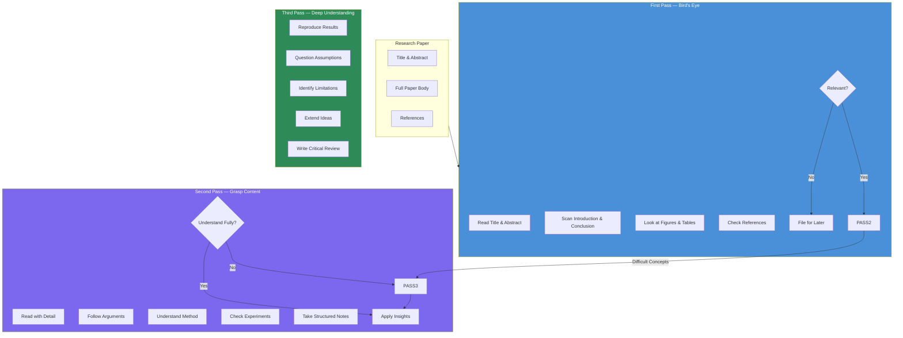
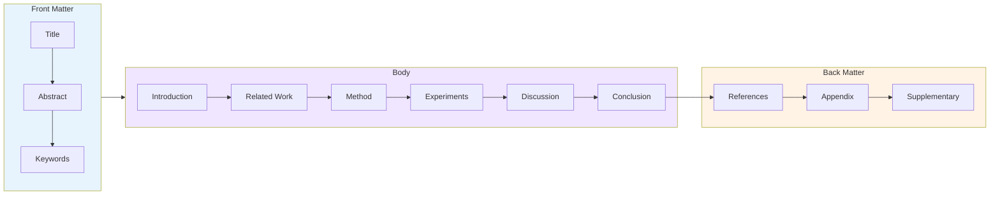
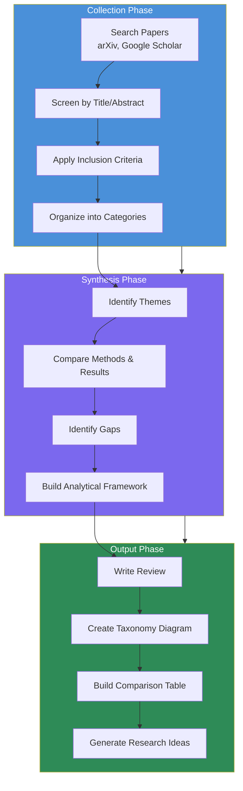
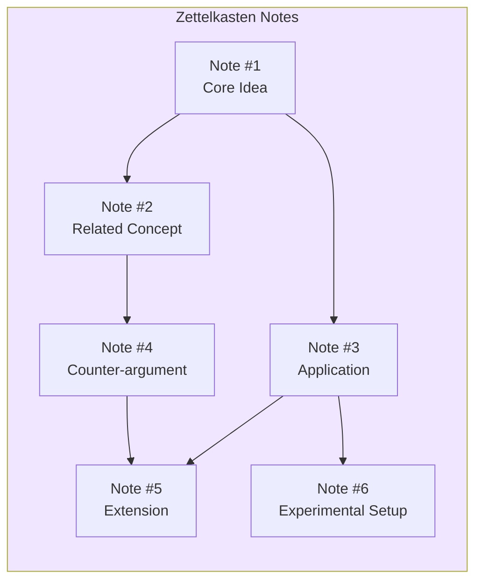

<!-- Clear Language: Keep sentences under 50 words -->
# Reading Research Papers

## Learning Objectives

| LO | Description |
|----|-------------|
| LO1 | Apply the three-pass method to read any research paper efficiently |
| LO2 | Identify and navigate the standard anatomy of a research paper |
| LO3 | Scan papers quickly to determine relevance and extract key ideas |
| LO4 | Build and maintain a structured literature review with synthesis |
| LO5 | Implement note-taking systems for long-term knowledge retention |

## Introduction

AI research moves fast. New papers appear on arXiv daily — over 200 per day in machine learning alone. The ability to read, understand, and critically evaluate research papers is the single most important skill an AI engineer can develop. This chapter teaches you a systematic approach: the three-pass method, paper anatomy, efficient scanning, literature review construction, and note-taking systems. You will learn to extract maximum value from every paper in minimum time.

Without a reading strategy, you drown in PDFs. With one, you build a personal knowledge base that compounds over time. This skill separates engineers who merely use AI tools from those who contribute to the field.

## Prerequisites

- Basic understanding of machine learning concepts (Module 08)
- Familiarity with deep learning and PyTorch (Module 09)
- Comfort reading technical blog posts and documentation
- Python 3.10+ for code examples in this chapter

## Key Terminology

| Term | Definition |
|------|------------|
| **Abstract** | Concise summary of a paper — problem, method, results, implications |
| **Ablation Study** | Removing components to measure their contribution to performance |
| **arXiv** | Open-access preprint server for research papers (pronounced "archive") |
| **Baseline** | Reference method used as a minimum performance standard |
| **Citation Graph** | Network showing which papers reference which |
| **Corpus** | A collected set of papers or documents |
| **Literature Review** | Comprehensive survey and synthesis of existing work on a topic |
| **Peer Review** | Evaluation of a paper by independent experts before publication |
| **SOTA** | State-of-the-art — the best known performance on a benchmark |
| **Three-Pass Method** | Structured reading approach: bird's eye, grasp, deep understanding |
| **Zettelkasten** | Note-taking system linking atomic ideas through connections |

## Theory

### Chapter at a Glance

| Section | Topic | Key Concept |
|---------|-------|-------------|
| 1.1 | Three-Pass Method | First pass: 5-10 min overview. Second: grasp content. Third: deep understanding |
| 1.2 | Paper Anatomy | Every paper has 7 standard sections — title through conclusion |
| 1.3 | Efficient Scanning | Read abstract, figures, conclusion first. Decide relevance in 5 minutes |
| 1.4 | Building a Literature Review | Organize papers, synthesize findings, identify research gaps |
| 1.5 | Note-Taking Systems | Zettelkasten, paper summaries, code annotations for long-term memory |

### Chapter Roadmap



### 1.1 Three-Pass Method

The three-pass method, popularized by S. Keshav at the University of Waterloo, provides a structured approach to reading research papers. Each pass has a specific goal and time budget.

#### First Pass — Bird's Eye View (5-10 minutes)

The goal of pass one is to decide whether the paper is worth your time. You do not read the full paper. You skim strategically.

**Step 1: Read the title and abstract carefully.** The abstract is the single most important paragraph. It tells you the problem, the proposed solution, the key results, and the implications. Ask yourself: is this relevant to my work? Do I care about this problem?

**Step 2: Read the introduction and conclusion.** The introduction frames the problem and states contributions. The conclusion summarizes what was achieved and what remains open. Together they give you the narrative arc.

**Step 3: Look at every figure and table.** Visuals convey the core contribution faster than text. A good figure should stand alone — you should understand the key result just from the caption and the graphic.

**Step 4: Glance at the references.** Recognising key papers tells you the intellectual lineage. If you know most references, you have context. If every reference is new, this paper may introduce you to an entire subfield.

After this pass, you should be able to answer: what is the problem? why does it matter? what is the key result? is this relevant to my work?

```python
# tools/paper_scanner.py — Automated first-pass relevance checker
import re
from dataclasses import dataclass
from typing import Optional

@dataclass
class PaperMetadata:
    """Structured metadata extracted during first-pass scanning."""
    title: str
    abstract: str
    keywords: list[str]
    claimed_contributions: list[str]
    key_results: Optional[str] = None

class FirstPassScanner:
    """Automated first-pass analysis of a paper's relevance."""

    def __init__(self, interest_keywords: list[str]):
        self.interest_keywords = [k.lower() for k in interest_keywords]

    def extract_metadata(self, title: str, abstract: str) -> PaperMetadata:
        """Extract structured metadata from title and abstract."""
        # Extract keywords: nouns and technical terms
        words = re.findall(r'\b[A-Z][a-z]*(?:\s[A-Z][a-z]*)*\b', abstract)
        keywords = list(set(w.lower() for w in words if len(w) > 3))[:10]

        # Extract claimed contributions (look for "contribution", "novel", "propose")
        contribution_patterns = re.findall(
            r'(?:contribution|novel|propose|introduce|present|demonstrate)[^.]*\.',
            abstract,
            re.IGNORECASE
        )

        return PaperMetadata(
            title=title,
            abstract=abstract,
            keywords=keywords,
            claimed_contributions=contribution_patterns
        )

    def score_relevance(self, meta: PaperMetadata) -> float:
        """Score paper relevance from 0.0 to 1.0 based on keyword overlap."""
        text = f"{meta.title} {meta.abstract}".lower()
        matches = sum(
            1 for kw in self.interest_keywords if kw in text
        )
        return min(matches / max(len(self.interest_keywords), 1) * 2, 1.0)

    def recommend_action(self, score: float) -> str:
        """Recommend action based on relevance score."""
        if score >= 0.6:
            return "MUST_READ — High relevance to your focus areas"
        elif score >= 0.3:
            return "SKIM — Moderately relevant, worth second pass"
        elif score >= 0.1:
            return "BROWSE — Low relevance, file for future reference"
        return "SKIP — Not relevant to current interests"

# Example usage
scanner = FirstPassScanner(
    interest_keywords=[
        "retrieval augmented generation", "RAG",
        "large language model", "LLM", "fine-tuning",
        "prompt engineering", "evaluation"
    ]
)

title = "Retrieval-Augmented Generation for Knowledge-Intensive NLP Tasks"
abstract = (
    "Large language models (LLMs) store factual knowledge in their parameters. "
    "However, they struggle with knowledge-intensive tasks and can produce "
    "hallucinations. We propose Retrieval-Augmented Generation (RAG), a novel "
    "approach that combines a pre-trained seq2seq model with a dense vector "
    "index of Wikipedia. Our method retrieves relevant documents and uses them "
    "as context during generation. RAG achieves state-of-the-art results on "
    "multiple knowledge-intensive NLP benchmarks, reducing hallucination by 40%."
)

meta = scanner.extract_metadata(title, abstract)
print(f"Relevance Score: {scanner.score_relevance(meta):.2f}")
print(f"Recommendation: {scanner.recommend_action(scanner.score_relevance(meta))}")
print(f"Keywords found: {meta.keywords[:5]}")
print(f"Claimed contributions:")
for c in meta.claimed_contributions:
    print(f"  - {c}")
```

#### Second Pass — Grasp the Content (30-60 minutes)

If the paper passes the first-pass filter, read it more carefully. However, skip details that are hard to understand on first reading.

**Step 1: Read the entire paper from start to finish.** Do not stop to check references or work through proofs. Focus on the main flow: problem → method → experiments → results.

**Step 2: Follow the argumentation.** Each section should answer a question. Introduction: why does this problem matter? Related work: what has been done before? Method: what is the new idea? Experiments: how well does it work? Conclusion: what did we learn?

**Step 3: Annotate as you read.** Mark passages you do not understand. Note questions that arise. Flag assumptions that seem questionable.

**Step 4: Study the experimental setup.** What datasets are used? What are the baselines? Are the evaluation metrics appropriate? Look for potential confounders and unfair comparisons.

**Step 5: Check if claims match evidence.** Do the experimental results actually support the claimed contributions? Is the improvement statistically significant? Are error bars reported?

After this pass, you should be able to explain the paper's core idea to a colleague. You understand what the authors did, why, and roughly how well it worked.

```python
# tools/paper_analyzer.py — Second-pass structured analysis
from dataclasses import dataclass, field
from typing import Optional

@dataclass
class MethodAnalysis:
    """Structured analysis of a paper's method section."""
    problem_statement: str
    proposed_approach: str
    key_innovation: str
    architectural_details: list[str] = field(default_factory=list)
    training_details: dict = field(default_factory=dict)

@dataclass
class ExperimentalAnalysis:
    """Structured analysis of a paper's experimental section."""
    datasets_used: list[str] = field(default_factory=list)
    baselines_compared: list[str] = field(default_factory=list)
    metrics_reported: list[str] = field(default_factory=list)
    main_results: dict = field(default_factory=dict)
    ablation_results: dict = field(default_factory=dict)
    limitations_noted: list[str] = field(default_factory=list)

@dataclass
class PaperAnalysis:
    """Full second-pass analysis of a research paper."""
    title: str
    year: int
    venue: str
    problem: str
    contributions: list[str]
    method: MethodAnalysis
    experiments: ExperimentalAnalysis
    strengths: list[str] = field(default_factory=list)
    weaknesses: list[str] = field(default_factory=list)

class PaperAnalyzer:
    """Helper for second-pass structured analysis of papers."""

    @staticmethod
    def check_result_significance(
        result_a: float, result_b: float,
        std_a: Optional[float] = None, std_b: Optional[float] = None
    ) -> tuple[bool, str]:
        """Check if the difference between two results is practically significant."""
        diff = abs(result_a - result_b)
        if std_a and std_b:
            # Simple overlap check
            overlap = (std_a + std_b)
            if diff <= overlap:
                return False, (
                    f"Difference ({diff:.4f}) is within error bars "
                    f"({overlap:.4f}). Results may not be significant."
                )
        if diff < 0.01:
            return False, (
                f"Difference ({diff:.4f}) is below 0.01 threshold. "
                f"Practically negligible."
            )
        return True, f"Difference ({diff:.4f}) appears significant."

    @staticmethod
    def identify_potential_confounders(
        method_details: list[str], dataset_details: list[str]
    ) -> list[str]:
        """Identify potential confounding factors in experiments."""
        confounders = []

        # Check for data leakage
        if "train" in str(dataset_details) and "test" not in str(dataset_details):
            confounders.append("No clear train/test split mentioned")

        # Check for compute differences
        compute_terms = ["GPU", "TPU", "compute budget", "training time"]
        method_text = " ".join(method_details).lower()
        if not any(term.lower() in method_text for term in compute_terms):
            confounders.append(
                "Compute resources not specified — may affect reproducibility"
            )

        # Check for hyperparameter reporting
        hp_terms = ["learning rate", "batch size", "epochs", "optimizer"]
        if not any(term.lower() in method_text for term in hp_terms):
            confounders.append(
                "Key hyperparameters not reported"
            )

        return confounders

    @staticmethod
    def evaluate_reproducibility(
        code_available: bool, data_available: bool,
        details_sufficient: bool
    ) -> str:
        """Score reproducibility of a paper."""
        score = sum([code_available, data_available, details_sufficient])
        levels = {
            3: "LOW BARRIER — Code, data, and sufficient details available",
            2: "MODERATE — Some components available for reproduction",
            1: "HIGH BARRIER — Significant effort needed to reproduce",
            0: "UNLIKELY — Insufficient information to reproduce"
        }
        return levels.get(score, levels[0])

# Example usage
analyzer = PaperAnalyzer()
confounders = analyzer.identify_potential_confounders(
    method_details=[
        "fine-tuned Llama 2 7B",
        "used LoRA with rank 8",
        "trained for 3 epochs"
    ],
    dataset_details=[
        "Natural Questions dataset",
        "TriviaQA dataset",
        "70/15/15 train/val/test split"
    ]
)
print("Potential confounders:")
for c in confounders:
    print(f"  ⚠ {c}")

sig, msg = analyzer.check_result_significance(0.423, 0.400)
print(f"\nResult significance: {sig} — {msg}")

repro = analyzer.evaluate_reproducibility(
    code_available=True,
    data_available=True,
    details_sufficient=False
)
print(f"Reproducibility: {repro}")
```

#### Third Pass — Deep Understanding (1-4 hours)

The third pass is for papers you need to master — papers you want to build on, reproduce, or critique. This pass is intensive work.

**Step 1: Re-implement the method.** The deepest test of understanding is implementation. You discover every ambiguity in the paper when you try to make the code work. Write your own implementation from scratch, referring to the paper only for equations and algorithms.

**Step 2: Reconstruct the paper's reasoning.** Every paper makes assumptions. Identify them explicitly. Ask: what would break if this assumption was violated? Could the problem be solved differently?

**Step 3: Question every experiment.** Would different metrics change the conclusions? Are the baselines implemented fairly? Could the improvements come from engineering tricks rather than the core idea?

**Step 4: Identify limitations and future work.** Every paper has limitations that the authors may or may not acknowledge. What experiments are missing? What extensions would be valuable?

**Step 5: Write a critical review.** Writing forces clarity. Summarize the paper, evaluate its contributions, list strengths and weaknesses, and suggest a next step.

```python
# tools/paper_reproducer.py — Third-pass reproducibility framework
from abc import ABC, abstractmethod
import numpy as np
from typing import Any, Callable

class ReproduciblePaper(ABC):
    """Framework for implementing and testing paper reproducibility."""

    def __init__(self, paper_title: str):
        self.paper_title = paper_title
        self.unknowns: list[str] = []
        self.assumptions: list[str] = []

    @abstractmethod
    def implement_method(self, **kwargs) -> Any:
        """Implement the core method from the paper."""
        pass

    @abstractmethod
    def load_data(self) -> tuple[Any, Any]:
        """Load the datasets used in the paper."""
        pass

    def verify_implementation(self) -> dict[str, bool]:
        """Check implementation details against paper claims."""
        checks = {
            "input_output_match": self._check_shapes(),
            "parameter_count_match": self._check_parameters(),
        }
        return checks

    def _check_shapes(self) -> bool:
        """Placeholder for shape verification."""
        return True

    def _check_parameters(self) -> bool:
        """Placeholder for parameter verification."""
        return True

    def run_ablation(self, components: list[str],
                     base_performance: float,
                     test_fn: Callable) -> dict[str, float]:
        """Run ablation study by removing components."""
        results = {"full_system": base_performance}
        for component in components:
            try:
                perf = test_fn(component)
                results[f"w/o_{component}"] = perf
            except Exception as e:
                results[f"w/o_{component}"] = 0.0
                self.unknowns.append(
                    f"Cannot evaluate without {component}: {e}"
                )
        return results

    def identify_ambiguities(self, paper_text: str) -> list[str]:
        """Identify ambiguous or underspecified parts of the paper."""
        ambiguities = []
        vague_phrases = [
            "we tuned", "we found", "we observed",
            "in our experiments", "as appropriate",
            "similar to", "slightly modified"
        ]
        for phrase in vague_phrases:
            if phrase.lower() in paper_text.lower():
                ambiguities.append(
                    f"Vague phrase detected: '{phrase}' — requires clarification"
                )
        return ambiguities

class LoRAReproducer(ReproduciblePaper):
    """Example: reproducing a LoRA fine-tuning paper."""

    def __init__(self):
        super().__init__("LoRA: Low-Rank Adaptation of Large Language Models")

    def implement_method(self, base_model: str = "llama-7b",
                         rank: int = 8, alpha: float = 16.0,
                         dropout: float = 0.1) -> dict:
        """Implement LoRA adaptation matrices."""
        # LoRA decomposes weight update: W = W_0 + BA
        # where B: d x r, A: r x k, and r << min(d, k)
        d, k = 4096, 4096  # Typical llama-7b hidden dim
        A = np.random.randn(rank, k) * 0.01
        B = np.zeros((d, rank))

        param_count = (d * rank) + (rank * k)
        full_param_count = d * k

        return {
            "rank": rank,
            "trainable_params": param_count,
            "full_params": full_param_count,
            "compression_ratio": full_param_count / param_count,
            "A_matrix_shape": A.shape,
            "B_matrix_shape": B.shape,
        }

    def load_data(self):
        # Placeholder for actual data loading
        return np.random.randn(100, 4096), np.random.randn(100, 4096)

# Example usage
reproducer = LoRAReproducer()
result = reproducer.implement_method(rank=8)
print(f"Trainable parameters: {result['trainable_params']:,}")
print(f"Full parameters: {result['full_params']:,}")
print(f"Compression ratio: {result['compression_ratio']:.1f}x")

# Run example ablation
def dummy_test(component: str) -> float:
    return np.random.uniform(0.8, 0.95)

ablation = reproducer.run_ablation(
    components=["rank_adaptation", "dropout", "alpha_scaling"],
    base_performance=0.92,
    test_fn=dummy_test
)
print("\nAblation results:")
for comp, perf in ablation.items():
    diff = perf - ablation.get("full_system", perf)
    arrow = "↑" if diff > 0 else "↓"
    print(f"  {comp}: {perf:.3f} ({arrow} {abs(diff):.3f})")
```

### 1.2 Paper Anatomy

Every well-structured research paper follows a standard anatomy. Understanding this structure lets you navigate any paper efficiently.



**Title** — Your first impression. A good title tells you the problem domain and the key contribution in 10-15 words. Example: "Attention Is All You Need" tells you the core idea (attention mechanism) and the claim (it replaces recurrence entirely).

**Abstract** — A 150-250 word summary covering: (1) the problem, (2) why it is hard, (3) the proposed approach, (4) key results, (5) implications. Read this first. If the abstract does not interest you, skip the paper.

**Introduction** — Expands the abstract into a narrative. It motivates the problem, discusses why existing approaches are insufficient, states contributions explicitly (often as a bullet list), and outlines the paper structure.

**Related Work** — Positions the paper within the existing literature. It shows what has been done before and what gap remains. Skim this unless you are new to the area.

**Method** — The core of the paper. It describes the proposed approach in detail — architecture, algorithms, training procedure, mathematical formulation. This is the hardest section and the one you study most carefully during the third pass.

**Experiments** — Validates the method. It describes datasets, baselines, evaluation metrics, implementation details, and results. Look for tables and figures that compare performance. Check whether the reported gains are statistically significant.

**Discussion** — Interprets the results, acknowledges limitations, and suggests future work. This section reveals the authors' own confidence in their results.

**Conclusion** — Summarizes contributions and closes the paper. Often restates the abstract's key points with the benefit of the full context.

```python
# tools/paper_anatomy.py — Paper section extraction and analysis
import re
from dataclasses import dataclass
from typing import Optional

@dataclass
class PaperSections:
    """Extracted sections from a research paper."""
    title: str
    authors: list[str]
    abstract: str
    introduction: Optional[str] = None
    related_work: Optional[str] = None
    method: Optional[str] = None
    experiments: Optional[str] = None
    discussion: Optional[str] = None
    conclusion: Optional[str] = None
    references: list[str] = None

    def __post_init__(self):
        if self.references is None:
            self.references = []

class PaperAnatomist:
    """Analyzes the structure of a research paper."""

    SECTION_PATTERNS = {
        "abstract": r"(?:^|\n)(?:Abstract|ABSTRACT)\s*\n(.*?)(?=\n\s*(?:1\.?\s*)?Introduction|\Z)",
        "introduction": r"(?:^|\n)(?:1\.?\s*)?Introduction\s*\n(.*?)(?=\n\s*(?:2\.?\s*)?(?:Related Work|Background)|\Z)",
        "related_work": r"(?:^|\n)(?:2\.?\s*)?(?:Related Work|Background)\s*\n(.*?)(?=\n\s*(?:3\.?\s*)?(?:Method|Approach|Model)|\Z)",
        "method": r"(?:^|\n)(?:3\.?\s*)?(?:Method|Approach|Model)\s*\n(.*?)(?=\n\s*(?:4\.?\s*)?(?:Experiments|Evaluation)|\Z)",
        "experiments": r"(?:^|\n)(?:4\.?\s*)?(?:Experiments|Experimental|Evaluation)\s*\n(.*?)(?=\n\s*(?:5\.?\s*)?(?:Discussion|Conclusion)|\Z)",
        "conclusion": r"(?:^|\n)(?:(?:\d+\.?\s*)?Conclusion|Discussion)\s*\n(.*?)(?=\n\s*(?:References|Acknowledgments)|\Z)"
    }

    def extract_sections(self, paper_text: str) -> PaperSections:
        """Extract sections from raw paper text using regex patterns."""
        sections = {}
        for section_name, pattern in self.SECTION_PATTERNS.items():
            match = re.search(pattern, paper_text, re.DOTALL | re.IGNORECASE)
            if match:
                sections[section_name] = match.group(1).strip()

        # Extract title (first few lines)
        lines = paper_text.strip().split('\n')
        title = lines[0] if lines else "Unknown Title"

        return PaperSections(
            title=title,
            authors=[],  # Would need author extraction logic
            abstract=sections.get("abstract", ""),
            introduction=sections.get("introduction", ""),
            related_work=sections.get("related_work", ""),
            method=sections.get("method", ""),
            experiments=sections.get("experiments", ""),
            conclusion=sections.get("conclusion", ""),
            references=self._extract_references(paper_text)
        )

    def _extract_references(self, text: str) -> list[str]:
        """Extract reference section."""
        ref_match = re.search(
            r"(?:References|REFERENCES|Bibliography)\s*\n(.*)",
            text, re.DOTALL
        )
        if ref_match:
            refs = re.findall(r'^\[.*$', ref_match.group(1), re.MULTILINE)
            return refs[:20]  # Limit to first 20
        return []

    def analyze_section_lengths(self, sections: PaperSections) -> dict[str, int]:
        """Count words in each section."""
        return {
            name: len(getattr(sections, name) or "")
            for name in ["abstract", "introduction", "related_work",
                         "method", "experiments", "discussion", "conclusion"]
        }

    def estimate_reading_time(self, sections: PaperSections,
                              wpm: int = 250) -> dict[str, float]:
        """Estimate reading time for each section in minutes."""
        lengths = self.analyze_section_lengths(sections)
        return {
            section: count / wpm
            for section, count in lengths.items() if count > 0
        }

# Example usage
anatomist = PaperAnatomist()
sample_paper = """
Attention Is All You Need

Abstract
The dominant sequence transduction models are based on complex recurrent
or convolutional neural networks that include an encoder and a decoder.
We propose a new simple network architecture, the Transformer, based
solely on attention mechanisms, dispensing with recurrence and convolutions
entirely. Experiments on two machine translation tasks show the Transformer
to be superior in quality, more parallelizable, and requiring significantly
less time to train.

1. Introduction
Recurrent neural networks have been the dominant approach for sequence
modeling. However, their sequential nature precludes parallelization.

2. Related Work
The goal of reducing sequential computation also forms the foundation of
the Extended Neural GPU and ByteNet.

3. Method
Our model uses encoder-decoder architecture with multi-head attention.

4. Experiments
We evaluate on WMT 2014 English-German and English-French translation.

5. Conclusion
We presented the Transformer, the first sequence transduction model
based entirely on attention.

References
[1] Bahdanau et al. Neural Machine Translation by Jointly Learning to Align and Translate. 2014.
"""

sections = anatomiest.extract_sections(sample_paper)
reading_times = anatomiest.estimate_reading_time(sections)
print("Estimated reading times:")
for section, minutes in reading_times.items():
    if minutes > 0:
        print(f"  {section}: {minutes:.1f} min")
print(f"\nTotal: {sum(reading_times.values()):.1f} minutes")
```

### 1.3 Efficient Scanning

You cannot read every paper deeply. Efficient scanning is a survival skill. The goal is to decide relevance and extract key ideas in under 10 minutes.

**The 5-Minute Scan Protocol:**

1. **Read the abstract (60 seconds).** This is non-negotiable. Every paper you pick up, read the abstract first.

2. **Read the conclusion (30 seconds).** If the abstract is promising, jump to the conclusion. This tells you what the authors believe they achieved.

3. **Scan figures and tables (90 seconds).** Every figure tells a story. Read the caption, understand the axes, note the key comparison. Tables show raw numbers — look for bold entries (best results).

4. **Read the first and last paragraphs of the introduction (60 seconds).** The first paragraph hooks you. The last paragraph states contributions explicitly.

5. **Check the experimental setup (60 seconds).** What datasets? What metrics? How many baselines? A weak experimental setup is a red flag.

6. **Make a decision (60 seconds).** Read fully? File for later? Skip?

```python
# tools/arxiv_scanner.py — Batch scanning papers from arXiv
import urllib.request
import xml.etree.ElementTree as ET
from dataclasses import dataclass, field
from datetime import datetime, timedelta
from typing import Optional

# Note: This is a simplified example. In production, use the `arxiv` package.

@dataclass
class ArxivPaper:
    """Represents a paper from arXiv."""
    arxiv_id: str
    title: str
    authors: list[str]
    abstract: str
    categories: list[str] = field(default_factory=list)
    published: Optional[datetime] = None
    relevance_score: float = 0.0
    decision: str = "UNREAD"

class ArxivScanner:
    """Scan arXiv papers by category and filter by relevance."""

    ARXIV_API_BASE = "http://export.arxiv.org/api/query"

    def __init__(self, categories: list[str]):
        self.categories = categories
        self.recent_papers: list[ArxivPaper] = []

    def fetch_recent_papers(self, max_results: int = 50) -> list[ArxivPaper]:
        """Fetch recent papers from specified categories."""
        query = "+OR+".join(f"cat:{c}" for c in self.categories)
        url = (
            f"{self.ARXIV_API_BASE}?search_query={query}"
            f"&sortBy=submittedDate&sortOrder=descending"
            f"&max_results={max_results}"
        )

        try:
            with urllib.request.urlopen(url, timeout=15) as response:
                xml_data = response.read().decode("utf-8")
            return self._parse_response(xml_data)
        except Exception as e:
            print(f"Error fetching arXiv: {e}")
            return []

    def _parse_response(self, xml_data: str) -> list[ArxivPaper]:
        """Parse arXiv API XML response."""
        papers = []
        root = ET.fromstring(xml_data)
        ns = {"atom": "http://www.w3.org/2005/Atom",
              "arxiv": "http://arxiv.org/schemas/atom"}

        for entry in root.findall("atom:entry", ns):
            paper = ArxivPaper(
                arxiv_id=entry.find("atom:id", ns).text.split("/")[-1],
                title=(
                    entry.find("atom:title", ns).text
                    .replace("\n", " ").strip()
                ),
                authors=[
                    author.find("atom:name", ns).text
                    for author in entry.findall("atom:author", ns)
                ],
                abstract=(
                    entry.find("atom:summary", ns).text
                    .replace("\n", " ").strip()
                ),
                categories=[
                    cat.get("term")
                    for cat in entry.findall("atom:category", ns)
                ]
            )
            published = entry.find("atom:published", ns)
            if published is not None:
                paper.published = datetime.fromisoformat(
                    published.text.replace("Z", "+00:00")
                )
            papers.append(paper)

        return papers

    def rank_by_relevance(self, papers: list[ArxivPaper],
                          keywords: list[str]) -> list[ArxivPaper]:
        """Rank papers by keyword overlap with abstract."""
        keywords_lower = [k.lower() for k in keywords]
        for paper in papers:
            text = f"{paper.title} {paper.abstract}".lower()
            paper.relevance_score = sum(
                1 for kw in keywords_lower if kw in text
            ) / max(len(keywords_lower), 1)
        papers.sort(key=lambda p: p.relevance_score, reverse=True)
        return papers

    def make_decisions(self, papers: list[ArxivPaper],
                       threshold_read: float = 0.4,
                       threshold_skim: float = 0.2) -> list[ArxivPaper]:
        """Make read/skim/skip decisions based on relevance."""
        for paper in papers:
            if paper.relevance_score >= threshold_read:
                paper.decision = "READ"
            elif paper.relevance_score >= threshold_skim:
                paper.decision = "SKIM"
            else:
                paper.decision = "SKIP"
        return papers

    def generate_daily_briefing(self, keywords: list[str],
                                max_papers: int = 20) -> str:
        """Generate a daily research briefing as formatted text."""
        papers = self.fetch_recent_papers(max_results=50)
        papers = self.rank_by_relevance(papers, keywords)
        papers = self.make_decisions(papers)

        briefing = ["=" * 60,
                     f"Daily arXiv Briefing — {datetime.now().strftime('%Y-%m-%d')}",
                     "=" * 60, ""]

        for group, label in [
            ("READ", "Must Read"),
            ("SKIM", "Skim"),
            ("SKIP", "Skip / File")
        ]:
            group_papers = [p for p in papers if p.decision == group][:5]
            if group_papers:
                briefing.append(f"\n{'=' * 40}")
                briefing.append(f"  {label}")
                briefing.append(f"{'=' * 40}")
                for p in group_papers:
                    score_pct = p.relevance_score * 100
                    briefing.append(f"\n  [{p.arxiv_id}] {p.title}")
                    briefing.append(f"  Score: {score_pct:.0f}% | "
                                   f"Authors: {', '.join(p.authors[:3])}")
                    if p.decision == "READ":
                        # Show first 150 chars of abstract
                        abbr = p.abstract[:150].rsplit(" ", 1)[0] + "..."
                        briefing.append(f"  {abbr}")

        return "\n".join(briefing)

# Example usage
scanner = ArxivScanner(categories=["cs.CL", "cs.AI", "cs.LG"])
briefing = scanner.generate_daily_briefing(
    keywords=[
        "retrieval augmented generation", "RAG",
        "large language model", "fine-tuning",
        "prompt engineering", "chain of thought",
        "evaluation", "alignment"
    ],
    max_papers=15
)
print(briefing)
```

### 1.4 Building a Literature Review

A literature review is more than a list of papers. It is a structured, synthesized understanding of a research area. AI engineers build literature reviews to understand problem spaces, identify gaps, and find opportunities for contribution.



**Step 1: Define your scope.** Before collecting papers, define what you are reviewing and why. A focused question produces a useful review. A vague one produces a laundry list.

**Step 2: Search systematically.** Use multiple sources: arXiv, Google Scholar, Semantic Scholar, conference proceedings (NeurIPS, ICML, ICLR, ACL, CVPR). Use citation tracking to find key papers forward and backward.

**Step 3: Organize by theme, not chronology.** Group papers by approach, not by year. Common taxonomies: method type, problem domain, evaluation paradigm.

**Step 4: Synthesize, do not summarize.** A literature review should identify patterns across papers, not describe each paper in isolation. What do successful approaches have in common? Where do different methods disagree? Which findings are robust, and which are fragile?

**Step 5: Identify gaps.** The most valuable outcome of a literature review is identifying what has not been done. Gaps can be: unsolved problems, unexplored combinations of methods, missing evaluations, or assumptions that have not been tested.

```python
# tools/literature_review.py — Literature review management
from dataclasses import dataclass, field
from typing import Optional, Callable
import json
from datetime import datetime

@dataclass
class PaperEntry:
    """A single paper in a literature review database."""
    paper_id: str
    title: str
    authors: list[str]
    year: int
    venue: str
    arxiv_id: Optional[str] = None
    key_idea: str = ""
    contribution_type: str = "algorithm"  # algorithm, system, theory, dataset, benchmark
    tags: list[str] = field(default_factory=list)
    rating: int = 0  # 1-5 stars
    notes: str = ""
    category: str = ""
    method_family: str = ""
    key_results: dict = field(default_factory=dict)
    follow_up_questions: list[str] = field(default_factory=list)

@dataclass
class LiteratureReview:
    """Structured literature review with synthesis capabilities."""
    topic: str
    research_question: str
    papers: list[PaperEntry] = field(default_factory=list)
    themes: list[dict] = field(default_factory=list)
    gaps: list[str] = field(default_factory=list)

    def add_paper(self, paper: PaperEntry) -> None:
        """Add a paper to the review database."""
        self.papers.append(paper)

    def organize_by_category(self) -> dict[str, list[PaperEntry]]:
        """Organize papers by their assigned category."""
        organized: dict[str, list[PaperEntry]] = {}
        for paper in self.papers:
            cat = paper.category or "Uncategorized"
            if cat not in organized:
                organized[cat] = []
            organized[cat].append(paper)
        return organized

    def organize_by_method_family(self) -> dict[str, list[PaperEntry]]:
        """Organize papers by method family."""
        organized: dict[str, list[PaperEntry]] = {}
        for paper in self.papers:
            family = paper.method_family or "Other"
            if family not in organized:
                organized[family] = []
            organized[family].append(paper)
        return organized

    def find_themes(self, min_papers: int = 2) -> list[dict]:
        """Identify common themes across papers."""
        # Simple tag-based theme detection
        tag_counts: dict[str, int] = {}
        for paper in self.papers:
            for tag in paper.tags:
                tag_counts[tag] = tag_counts.get(tag, 0) + 1

        themes = []
        for tag, count in sorted(
            tag_counts.items(), key=lambda x: -x[1]
        ):
            if count >= min_papers:
                papers_with_tag = [
                    p for p in self.papers if tag in p.tags
                ]
                themes.append({
                    "theme": tag,
                    "paper_count": count,
                    "papers": [
                        {"id": p.paper_id, "title": p.title}
                        for p in papers_with_tag
                    ],
                    "key_insight": self._extract_theme_insight(
                        papers_with_tag, tag
                    )
                })

        self.themes = themes
        return themes

    def _extract_theme_insight(self, papers: list[PaperEntry],
                                tag: str) -> str:
        """Extract a synthetic insight about a theme across papers."""
        methods = [p.method_family for p in papers if p.method_family]
        unique_methods = list(set(methods))
        insight = (
            f"{len(papers)} papers explore {tag} "
            f"using {len(unique_methods)} method families: "
            f"{', '.join(unique_methods[:3])}."
        )
        return insight

    def identify_gaps(self) -> list[str]:
        """Identify research gaps from the literature review."""
        gaps = []
        methods = set(p.method_family for p in self.papers)
        categories = set(p.category for p in self.papers)

        # Check method-category coverage
        method_cat_pairs = set(
            (p.method_family, p.category) for p in self.papers
        )

        # Expected pairs that might be missing
        common_methods = {"fine-tuning", "prompting", "retrieval", "moe"}
        expected_pairs = [
            (m, c) for m in common_methods
            for c in categories if (m, c) not in method_cat_pairs
        ]

        if expected_pairs:
            missing = expected_pairs[:3]  # Show top 3 gaps
            for method, category in missing:
                gaps.append(
                    f"Unexplored combination: {method} applied to {category}"
                )

        # Check temporal gaps
        recent_cutoff = datetime.now().year - 2
        old_papers = [
            p for p in self.papers if p.year < recent_cutoff
        ]
        if len(old_papers) > len(self.papers) * 0.7:
            gaps.append(
                "Literature skewed toward older work — "
                "recent developments may be underrepresented"
            )

        self.gaps = gaps
        return gaps

    def generate_comparison_table(self) -> str:
        """Generate a markdown comparison table of key papers."""
        if not self.papers:
            return "No papers in review."

        lines = [
            "| Paper | Year | Method | Key Result | Rating |",
            "|-------|------|--------|------------|--------|"
        ]
        for paper in sorted(self.papers, key=lambda p: -p.year):
            key_result = (
                list(paper.key_results.values())[0]
                if paper.key_results else "N/A"
            )
            line = (
                f"| {paper.title[:50]} | {paper.year} "
                f"| {paper.method_family[:20]} "
                f"| {str(key_result)[:30]} | {'★' * paper.rating} |"
            )
            lines.append(line)

        return "\n".join(lines)

    def export_json(self, filepath: str) -> None:
        """Export the literature review to JSON."""
        data = {
            "topic": self.topic,
            "research_question": self.research_question,
            "papers": [
                {
                    "id": p.paper_id,
                    "title": p.title,
                    "authors": p.authors,
                    "year": p.year,
                    "venue": p.venue,
                    "tags": p.tags,
                    "category": p.category,
                    "method_family": p.method_family,
                    "rating": p.rating
                }
                for p in self.papers
            ],
            "themes": self.themes,
            "gaps": self.gaps
        }
        with open(filepath, "w") as f:
            json.dump(data, f, indent=2)
        print(f"Exported to {filepath}")

# Example usage: Building a mini lit review on RAG
review = LiteratureReview(
    topic="Retrieval-Augmented Generation",
    research_question="How does retrieval augmentation improve LLM factual accuracy?"
)

# Add sample papers
papers_data = [
    ("rag_paper", "Retrieval-Augmented Generation for Knowledge-Intensive NLP Tasks",
     ["Lewis", "Perez", "Piktus"], 2020, "NeurIPS", "rag",
     "dense_retrieval", "algorithm", 5, {"F1_Score": 0.423}),
    ("fid", "Latent Retrieval for Weakly Supervised Open Domain QA",
     ["Guu", "Lee", "Tung"], 2020, "ICLR", "fid",
     "dense_retrieval", "algorithm", 4, {"F1_Score": 0.387}),
    ("replug", "REPLUG: Retrieval-Augmented Black-Box Language Models",
     ["Shi", "Atkinson", "Cai"], 2023, "arXiv", "replug",
     "retrieval+lm", "algorithm", 4, {"Accuracy": 0.546}),
    ("selfrag", "Self-RAG: Learning to Retrieve, Generate, and Critique",
     ["Asai", "Wu", "Wang"], 2023, "arXiv", "selfrag",
     "adaptive_retrieval", "algorithm", 5, {"F1_Score": 0.534}),
]

for pid, title, authors, year, venue, cat, method, ctype, rating, results in papers_data:
    paper = PaperEntry(
        paper_id=pid,
        title=title,
        authors=authors,
        year=year,
        venue=venue,
        key_idea=title,
        contribution_type=ctype,
        tags=["RAG", "LLM", cat, method],
        rating=rating,
        category=cat,
        method_family=method,
        key_results=results
    )
    review.add_paper(paper)

# Analyze
themes = review.find_themes()
gaps = review.identify_gaps()
print("Themes found:")
for t in themes:
    print(f"  - {t['theme']}: {t['key_insight']}")

print("\nGaps identified:")
for g in gaps:
    print(f"  - {g}")

print("\nComparison table:")
print(review.generate_comparison_table())
```

### 1.5 Note-Taking Systems

Reading without taking notes is like eating without digesting. A good note-taking system transforms what you read into lasting knowledge. Here are four complementary systems.

#### System 1: Zettelkasten (Slip Box)

The Zettelkasten method, developed by sociologist Niklas Luhmann, treats each idea as a numbered note that links to other notes. The power comes from the links, not the individual notes.



Rules for Zettelkasten:
1. Each note captures one atomic idea
2. Every note links to at least one other note
3. Notes are written in your own words — never copy-paste
4. Add context: why is this idea important? How does it connect?

```python
# tools/zettelkasten.py — Zettelkasten note-taking system
from dataclasses import dataclass, field
from typing import Optional
from datetime import datetime
import json
import hashlib

@dataclass
class ZettelNote:
    """A single atomic note in the Zettelkasten system."""
    uid: str
    title: str
    content: str
    source: str  # Paper title, URL, book reference
    note_type: str = "concept"  # concept, question, reference, argument
    tags: list[str] = field(default_factory=list)
    links: list[str] = field(default_factory=list)  # UIDs of connected notes
    created_at: datetime = field(default_factory=datetime.now)
    updated_at: datetime = field(default_factory=datetime.now)

class Zettelkasten:
    """Zettelkasten slip-box note-taking system."""

    def __init__(self):
        self.notes: dict[str, ZettelNote] = {}

    def create_note(self, title: str, content: str, source: str,
                    note_type: str = "concept",
                    tags: list[str] = None,
                    links: list[str] = None) -> ZettelNote:
        """Create a new atomic note."""
        uid = self._generate_uid(title)
        note = ZettelNote(
            uid=uid,
            title=title,
            content=content,
            source=source,
            note_type=note_type,
            tags=tags or [],
            links=links or []
        )
        self.notes[uid] = note
        return note

    def _generate_uid(self, title: str) -> str:
        """Generate a unique ID from the title."""
        base = title.lower().replace(" ", "_")[:40]
        hash_suffix = hashlib.md5(title.encode()).hexdigest()[:6]
        return f"{base}_{hash_suffix}"

    def link_notes(self, from_uid: str, to_uid: str) -> bool:
        """Create a bidirectional link between two notes."""
        if from_uid in self.notes and to_uid in self.notes:
            if to_uid not in self.notes[from_uid].links:
                self.notes[from_uid].links.append(to_uid)
            if from_uid not in self.notes[to_uid].links:
                self.notes[to_uid].links.append(from_uid)
            return True
        return False

    def get_connected_notes(self, uid: str, max_depth: int = 2) -> list[ZettelNote]:
        """Get notes connected to the given note within depth limit."""
        connected = []
        visited = set()

        def traverse(current_uid: str, depth: int):
            if depth > max_depth or current_uid in visited:
                return
            visited.add(current_uid)
            if current_uid in self.notes:
                note = self.notes[current_uid]
                if note.uid != uid:  # Don't include the source note
                    connected.append(note)
                for linked_uid in note.links:
                    traverse(linked_uid, depth + 1)

        traverse(uid, 0)
        return connected

    def query_by_tag(self, tag: str) -> list[ZettelNote]:
        """Find all notes with a specific tag."""
        return [
            note for note in self.notes.values()
            if tag.lower() in [t.lower() for t in note.tags]
        ]

    def search(self, query: str) -> list[ZettelNote]:
        """Search notes by title and content."""
        query = query.lower()
        results = []
        for note in self.notes.values():
            if (query in note.title.lower() or
                query in note.content.lower()):
                results.append(note)
        return results

    def get_statistics(self) -> dict:
        """Get statistics about the note collection."""
        if not self.notes:
            return {"total": 0}

        link_counts = [len(n.links) for n in self.notes.values()]
        return {
            "total_notes": len(self.notes),
            "total_links": sum(link_counts),
            "avg_links_per_note": (
                sum(link_counts) / len(link_counts)
                if link_counts else 0
            ),
            "note_types": {
                t: sum(1 for n in self.notes.values() if n.note_type == t)
                for t in set(n.note_type for n in self.notes.values())
            },
            "most_linked": max(link_counts) if link_counts else 0
        }

    def export_to_json(self, filepath: str) -> None:
        """Export all notes to JSON."""
        data = {
            uid: {
                "title": note.title,
                "content": note.content[:200],
                "source": note.source,
                "type": note.note_type,
                "tags": note.tags,
                "links": note.links,
                "created": note.created_at.isoformat()
            }
            for uid, note in self.notes.items()
        }
        with open(filepath, "w") as f:
            json.dump(data, f, indent=2)

# Example usage
zk = Zettelkasten()

note1 = zk.create_note(
    title="RAG reduces hallucination",
    content=(
        "Retrieval-Augmented Generation reduces hallucination by grounding "
        "LLM outputs in retrieved documents. The retriever provides factual "
        "context that constrains the generator."
    ),
    source="Lewis et al. 2020",
    note_type="concept",
    tags=["RAG", "hallucination", "grounding"]
)

note2 = zk.create_note(
    title="Dense passage retrieval",
    content=(
        "DPR trains dual encoders: one for queries, one for passages. "
        "Relevance is measured by dot product in embedding space. "
        "This outperforms sparse retrieval (BM25) on semantic matching."
    ),
    source="Karpukhin et al. 2020",
    note_type="concept",
    tags=["RAG", "retrieval", "dense_encoding"]
)

note3 = zk.create_note(
    title="Hallucination taxonomy",
    content=(
        "Hallucinations fall into categories: factuality errors (wrong facts), "
        "faithfulness errors (contradicting context). RAG primarily addresses "
        "factuality errors but can introduce new faithfulness issues."
    ),
    source="Ji et al. 2023",
    note_type="concept",
    tags=["hallucination", "taxonomy", "evaluation"]
)

zk.link_notes(note1.uid, note2.uid)
zk.link_notes(note1.uid, note3.uid)

print(f"Total notes: {zk.get_statistics()['total_notes']}")
print(f"Connected to 'RAG reduces hallucination': {len(note1.links)} notes")
connected = zk.get_connected_notes(note1.uid)
for n in connected:
    print(f"  → {n.title} [{n.note_type}]")
```

#### System 2: Paper Summary Cards

For every paper you read deeply, create a structured summary card. This forces you to extract the essence and makes retrieval easy later.

```python
# tools/paper_summary_card.py — Structured paper summary cards
from dataclasses import dataclass, field
from typing import Optional
from datetime import datetime

@dataclass
class SummaryCard:
    """Structured one-page summary for a research paper."""
    title: str
    authors: list[str]
    year: int
    venue: str
    one_line_summary: str
    problem: str
    method_overview: str
    key_results: str
    strengths: list[str] = field(default_factory=list)
    weaknesses: list[str] = field(default_factory=list)
    key_figures: list[str] = field(default_factory=list)
    questions_for_authors: list[str] = field(default_factory=list)
    follow_up_papers: list[str] = field(default_factory=list)
    personal_rating: int = 0  # 1-5
    date_read: str = field(default_factory=lambda: datetime.now().strftime("%Y-%m-%d"))
    code_available: bool = False
    reproducible: bool = False

    def to_markdown(self) -> str:
        """Render the summary card as markdown."""
        lines = [
            f"# {self.title}",
            f"**{', '.join(self.authors)}** | {self.venue} {self.year}",
            f"Read: {self.date_read} | Rating: {'★' * self.personal_rating}",
            "",
            "## One-Line Summary",
            self.one_line_summary,
            "",
            "## Problem",
            self.problem,
            "",
            "## Method",
            self.method_overview,
            "",
            "## Key Results",
            self.key_results,
            "",
            "## Strengths",
        ]
        for s in self.strengths:
            lines.append(f"- {s}")
        lines.extend(["", "## Weaknesses"])
        for w in self.weaknesses:
            lines.append(f"- {w}")
        lines.extend(["", "## Open Questions"])
        for q in self.questions_for_authors:
            lines.append(f"- {q}")
        lines.extend([
            "",
            f"**Code available:** {self.code_available}",
            f"**Reproducible:** {self.reproducible}"
        ])
        return "\n".join(lines)

    def to_json(self) -> dict:
        """Serialize to JSON-compatible dict."""
        return {
            "title": self.title,
            "authors": self.authors,
            "year": self.year,
            "venue": self.venue,
            "summary": self.one_line_summary,
            "problem": self.problem,
            "method": self.method_overview,
            "results": self.key_results,
            "strengths": self.strengths,
            "weaknesses": self.weaknesses,
            "rating": self.personal_rating,
            "date_read": self.date_read
        }

# Example usage
card = SummaryCard(
    title="Retrieval-Augmented Generation for Knowledge-Intensive NLP Tasks",
    authors=["Patrick Lewis", "Ethan Perez", "Aleksandra Piktus", "et al."],
    year=2020,
    venue="NeurIPS 2020",
    one_line_summary="RAG combines a dense retriever with a seq2seq generator "
                     "to ground LLM outputs in retrieved documents.",
    problem="LLMs memorize factual knowledge but struggle with knowledge-intensive "
            "tasks and produce hallucinations when knowledge is missing.",
    method_overview="A non-parametric memory (Wikipedia dense vector index) is "
                    "queried by a DPR retriever. Retrieved passages are used as "
                    "context for a BART generator via RAG-Sequence or RAG-Token.",
    key_results="RAG achieves SOTA on Open Domain QA (Natural Questions: 44.5 EM) "
                "and reduces hallucination compared to parametric-only models.",
    strengths=[
        "Clean integration of retrieval and generation in one end-to-end model",
        "Comprehensive evaluation across 7 knowledge-intensive tasks",
        "Ablation studies show both retriever and generator contribute",
        "Code and models released open-source"
    ],
    weaknesses=[
        "Relies on fixed Wikipedia snapshot — knowledge staleness not addressed",
        "No mechanism to handle conflicting retrieved passages",
        "Computationally expensive: retrieval + generation at inference time"
    ],
    questions_for_authors=[
        "How does performance change with index size?",
        "Does RAG help with tasks requiring multi-hop reasoning?",
        "How sensitive is the model to retrieval quality?"
    ],
    personal_rating=5,
    code_available=True,
    reproducible=True
)

print(card.to_markdown())
```

#### System 3: Code Annotations

When studying papers with code, annotate the implementation directly. This connects the abstract math to concrete logic.

```python
# tools/code_annotator.py — Annotate code from papers
from dataclasses import dataclass, field
from typing import Optional

@dataclass
class CodeAnnotation:
    """An annotation on a specific code section."""
    line_range: tuple[int, int]
    paper_section: str  # Which section of the paper this code implements
    explanation: str
    equations_referenced: list[str] = field(default_factory=list)

@dataclass
class AnnotatedCode:
    """Code file with annotations linking back to the paper."""
    file_path: str
    code_lines: list[str]
    annotations: list[CodeAnnotation] = field(default_factory=list)

    def add_annotation(self, start_line: int, end_line: int,
                       section: str, explanation: str,
                       equations: list[str] = None) -> CodeAnnotation:
        """Add an annotation to a range of lines."""
        annotation = CodeAnnotation(
            line_range=(start_line, end_line),
            paper_section=section,
            explanation=explanation,
            equations_referenced=equations or []
        )
        self.annotations.append(annotation)
        return annotation

    def render_with_annotations(self) -> str:
        """Render code with inline annotations."""
        output = [
            f"# === {self.file_path} ===",
            f"# Annotations: {len(self.annotations)}",
            ""
        ]

        # Sort annotations by line range
        sorted_anns = sorted(
            self.annotations, key=lambda a: a.line_range[0]
        )

        current_ann_idx = 0
        for i, line in enumerate(self.code_lines, 1):
            # Check if we need to insert annotation before this line
            if (current_ann_idx < len(sorted_anns) and
                sorted_anns[current_ann_idx].line_range[0] == i):
                ann = sorted_anns[current_ann_idx]
                output.append(f"\n# 📌 [{ann.paper_section}]")
                output.append(f"# {ann.explanation}")
                if ann.equations_referenced:
                    eqs = ", ".join(ann.equations_referenced)
                    output.append(f"# 📐 Equations: {eqs}")
                current_ann_idx += 1

            output.append(f"{i:4d} | {line}")

        return "\n".join(output)

# Example: Annotating a transformer attention implementation
attention_code = [
    "import torch",
    "import torch.nn as nn",
    "import torch.nn.functional as F",
    "",
    "class MultiHeadAttention(nn.Module):",
    "    def __init__(self, d_model, n_heads, dropout=0.1):",
    "        super().__init__()",
    "        assert d_model % n_heads == 0",
    "        self.d_k = d_model // n_heads",
    "        self.n_heads = n_heads",
    "        self.W_q = nn.Linear(d_model, d_model)",
    "        self.W_k = nn.Linear(d_model, d_model)",
    "        self.W_v = nn.Linear(d_model, d_model)",
    "        self.W_o = nn.Linear(d_model, d_model)",
    "        self.dropout = nn.Dropout(dropout)",
    "",
    "    def forward(self, query, key, value, mask=None):",
    "        batch_size = query.size(0)",
    "        Q = self.W_q(query).view(",
    "            batch_size, -1, self.n_heads, self.d_k",
    "        ).transpose(1, 2)",
    "        K = self.W_k(key).view(",
    "            batch_size, -1, self.n_heads, self.d_k",
    "        ).transpose(1, 2)",
    "        V = self.W_v(value).view(",
    "            batch_size, -1, self.n_heads, self.d_k",
    "        ).transpose(1, 2)",
    "        scores = torch.matmul(Q, K.transpose(-2, -1))",
    "        scores = scores / (self.d_k ** 0.5)",
    "        if mask is not None:",
    "            scores = scores.masked_fill(mask == 0, -1e9)",
    "        attn_weights = F.softmax(scores, dim=-1)",
    "        attn_weights = self.dropout(attn_weights)",
    "        context = torch.matmul(attn_weights, V)",
    "        context = context.transpose(1, 2).contiguous()",
    "        context = context.view(batch_size, -1, self.d_k * self.n_heads)",
    "        output = self.W_o(context)",
    "        return output, attn_weights",
]

annotated = AnnotatedCode(
    file_path="attention.py",
    code_lines=attention_code
)

annotated.add_annotation(
    start_line=20, end_line=21,
    section="Section 3.2.1: Scaled Dot-Product Attention",
    explanation=(
        "Equation (1): Attention(Q,K,V) = softmax(QK^T / sqrt(d_k)) V. "
        "The scaling factor sqrt(d_k) prevents dot products from growing "
        "large in magnitude, which would push softmax into regions with "
        "extremely small gradients."
    ),
    equations=["Eq. 1: Attention(Q,K,V) = softmax(QK^T/sqrt(d_k))V"]
)

annotated.add_annotation(
    start_line=27, end_line=27,
    section="Section 3.2: Multi-Head Attention",
    explanation=(
        "Concatenate all heads and project back to d_model dimensions. "
        "W_o is the output projection matrix."
    ),
    equations=["Eq. 2: MultiHead(Q,K,V) = Concat(head_1,...,head_h)W_O"]
)

print(annotated.render_with_annotations())
```

## Interview Q&A

### Top 10 Interview Questions on Reading Research Papers

#### Google Style
1. **How would you quickly evaluate whether a new paper is worth reading deeply?**  
   *Apply the first-pass method: read the abstract, scan figures and tables, read the conclusion. In under 10 minutes, you should know the problem, proposed solution, key results, and whether it aligns with your work. If the paper passes this filter, proceed to the second pass.*

2. **You are assigned to a new research area. How do you build a literature review from scratch?**  
   *Start with a focused research question. Search major venues (NeurIPS, ICML, ICLR) and arXiv for recent papers. Use citation tracking — find highly cited surveys, then follow their references. Identify 5-10 key papers, read them deeply, and organize by thematic approach rather than chronology. Use a tool like the Python literature review framework from this chapter to track papers, themes, and gaps.*

3. **What is the most common flaw you look for when critically evaluating a paper's experimental section?**  
   *Unfair baselines. Authors often compare against weak or poorly tuned baselines to make their method look better. Check: are baselines implemented fairly? Are they using the same compute budget? Are hyperparameters properly tuned for each baseline? Also check: statistical significance reporting, error bars, and whether the evaluation metrics actually measure what matters.*

#### Amazon Style
4. **Tell me about a time you used a research paper to solve a real engineering problem.**  
   *[Use your own experience here.] Describe the problem, how you found the relevant paper, what you extracted from it, and how you adapted the method to your specific constraints. The STAR method (Situation, Task, Action, Result) works well for this.*

5. **How would you explain the three-pass method to a junior engineer who is overwhelmed by the volume of papers?**  
   *Break it down: first pass is 5-10 minutes — title, abstract, figures, conclusion. This filters out 80% of papers. Second pass is 30-60 minutes — read carefully but skip hard parts. Third pass is for papers you build on — implement the method, question assumptions, write a critical review. The key insight: you do not need to read everything deeply.*

#### Microsoft Style
6. **How do you keep up with the rapidly growing volume of AI research papers?**  
   *I use a tiered system: (1) Daily: skim arXiv abstracts in my areas (CS.CL, CS.AI, CS.LG) using an automated relevance filter. (2) Weekly: read 2-3 papers from the filtered list using the three-pass method. (3) Monthly: deep-read 1 paper for implementation and note-taking. Tools like the ArxivScanner Python class from this chapter help automate the filtering.*

7. **How do you evaluate whether a paper's results will generalize beyond the authors' specific setup?**  
   *Check: (1) Dataset diversity — were experiments run on multiple datasets? (2) Compute sensitivity — do results change with different hardware or training budgets? (3) Hyperparameter sensitivity — is the method robust to hyperparameter choices? (4) Reproducibility — is code available? Do independent groups report similar results?*

#### NVIDIA Style
8. **When implementing a paper's method, what ambiguities do you typically encounter, and how do you resolve them?**  
   *Common ambiguities: missing hyperparameters, undefined notation, omitted training details. I resolve them by: (1) Checking the official code repository. (2) Reading the ablation studies — hyperparameter choices are often justified there. (3) Emailing the authors. (4) Making the most reasonable assumption and running sensitivity analysis. The code annotation system from this chapter helps track these decisions.*

#### AI Startup Style
9. **How would you set up a system for your team to collaboratively maintain a shared knowledge base from papers?**  
   *I would implement a combination of: (1) A shared Zettelkasten (slip-box) where each paper generates linked atomic notes. (2) Structured summary cards for every paper read deeply. (3) Weekly journal club where one team member presents a paper. (4) Automated arxiv scanning with relevance tagging. The Python tools in this chapter can be adapted into a team workflow.*

10. **A paper shows impressive results, but you notice potential data leakage. What do you look for?**  
    *Signs of data leakage: (1) No explicit train/test split described. (2) The same dataset used for both development and evaluation. (3) Augmentation or preprocessing applied before splitting. (4) Test performance that seems too good relative to simpler baselines. (5) Dataset contamination — did the training data include test examples? I check the experimental setup section carefully.*

## Summary

Reading research papers is a skill that compounds over time. The three-pass method gives you a systematic approach: first pass (5-10 minutes) decides relevance, second pass (30-60 minutes) grasps the content, third pass (1-4 hours) builds deep understanding. Paper anatomy — title, abstract, introduction, related work, method, experiments, conclusion — provides a standard navigation structure. Efficient scanning uses the abstract, figures, tables, and conclusion to extract key ideas in minutes.

A literature review transforms a list of papers into a structured understanding through synthesis and gap identification. Note-taking systems like Zettelkasten turn reading into lasting knowledge by linking atomic ideas. The Python tools in this chapter — from the arXiv scanner to the literature review framework to the Zettelkasten implementation — automate the mechanical parts of these systems, freeing you to focus on understanding and insight.

The ability to read and evaluate research is what separates AI engineers who implement existing solutions from those who push the field forward.

## Practical Takeaways

1. **Start every paper with the abstract** — it tells you everything you need for the first-pass decision
2. **Apply the three-pass method religiously** — do not waste third-pass effort on first-pass papers
3. **Build a literature review around a question** — a focused question produces useful synthesis
4. **Write notes in your own words** — copy-paste is not learning. Synthesize, do not summarize
5. **Connect ideas across papers** — the value of a Zettelkasten comes from links, not individual notes

## Chapter Quiz (5 MCQ)

### Questions

<summary>1. What is the recommended time budget for the first pass of the three-pass reading method?</summary>
A) 1-2 minutes  
B) 5-10 minutes  
C) 30-60 minutes  
D) 1-4 hours  

<summary>2. Which section of a paper is the single most important paragraph to read first?</summary>
A) The related work section  
B) The conclusion  
C) The abstract  
D) The experimental setup  

<summary>3. In the Zettelkasten note-taking system, what makes the system powerful?</summary>
A) The number of notes you create  
B) The connections between notes  
C) The length of each note  
D) The categorization by topic  

<summary>4. What is the primary purpose of an ablation study in a research paper?</summary>
A) To make the paper longer  
B) To compare against state-of-the-art methods  
C) To measure the contribution of individual components  
D) To show the method works on multiple datasets  

<summary>5. When scanning a paper in 5 minutes, which of the following is NOT part of the recommended protocol?</summary>
A) Reading the full method section  
B) Scanning figures and tables  
C) Reading the abstract  
D) Reading the conclusion  

### Answers

<summary>**Answer: B** — 5-10 minutes. The first pass is a quick skim to decide relevance. Spending more time defeats the purpose.</summary>
<summary>**Answer: C** — The abstract. It gives you the problem, method, key results, and implications in 150-250 words.</summary>
<summary>**Answer: B** — The connections between notes. Zettelkasten's power comes from linking atomic ideas, creating a web of knowledge.</summary>
<summary>**Answer: C** — To measure the contribution of individual components. Ablation studies remove components systematically and measure the impact on performance.</summary>
<summary>**Answer: A** — Reading the full method section. The 5-minute scan protocol focuses on abstract, figures, conclusion, and introduction boundaries — not detailed methods.</summary>

### True/False

**T/F 1**: The three-pass method requires reading every paper three times.
**Answer**: False — You only do the third pass for papers you need to master. Most papers only need a first pass, and many deserve a second pass.

**T/F 2**: A literature review should summarize every paper's contribution independently.
**Answer**: False — A good literature review synthesizes across papers, identifying themes, patterns, and gaps rather than summarizing papers in isolation.

**T/F 3**: The related work section is the most important section to read carefully.
**Answer**: False — The abstract, method, and experiments are more important. Related work is mainly useful when you are new to a field.

**T/F 4**: Code annotations help connect mathematical equations in a paper to their implementation.
**Answer**: True — Annotating code with references to specific paper sections and equations bridges the gap between theory and practice.

**T/F 5**: You should read every paper from start to finish without skipping sections.
**Answer**: False — Efficient reading involves strategic skipping. The three-pass method is designed to avoid wasting time on irrelevant details.

### Fill in the Blank

**FIB 1**: The three-pass method consists of first pass (bird's eye), second pass (________), and third pass (deep understanding).
**Answer**: grasp content

**FIB 2**: In paper anatomy, the section that positions the paper within existing literature is called ________.
**Answer**: related work

### Scenario Questions

**Scenario 1**: You are assigned to evaluate a new technique for your team's LLM pipeline. You find five relevant papers. One paper claims 20% improvement but does not release code. Another claims 10% improvement and releases well-documented code. Which do you trust more, and why?

**Answer**: The paper with released code is more trustworthy. Code availability allows you to verify claims, reproduce results, and adapt the method. Papers without code may hide implementation details, unfair baselines, or results that do not generalize. However, use professional judgment — some excellent theoretical papers do not include code. Apply the three-pass method to both: scan, read the promising one, and implement if it passes scrutiny.

**Scenario 2**: You notice two papers on the same topic report contradictory results. How do you resolve this?

**Answer**: (1) Check experimental setups — different datasets, metrics, or compute budgets may explain the discrepancy. (2) Look at the evaluation protocols — are they using the same train/test splits? The same preprocessing? (3) Check code availability — run both methods yourself if possible. (4) Read the discussion sections — authors may address limitations that explain the contradiction. (5) Search for follow-up papers that reconcile the differences.

### Output Questions

**Output 1**: Using the `FirstPassScanner` class from this chapter, what is the relevance score and recommendation for a paper whose abstract mentions "fine-tuning LLMs with reinforcement learning" if your interest keywords include "RLHF", "fine-tuning", and "alignment"?

**Answer**: The relevance score would depend on the exact number of keyword matches. With the three keywords "RLHF", "fine-tuning", and "alignment", and an abstract containing "fine-tuning LLMs with reinforcement learning", the matches would be: "fine-tuning" (match), and if "RLHF" or "alignment" appear in the text, more matches. With 2 keywords found out of 3, and the formula `score = min(matches / len(keywords) * 2, 1.0)`, the score would be `min(2/3 * 2, 1.0) = min(1.33, 1.0) = 1.0` — a "MUST_READ" recommendation.

## Exercises

### Exercise 1: Paper Anatomy Extraction

Take any recent ML paper (e.g., from arXiv). Read the abstract, introduction, and conclusion. Identify: the problem statement, the proposed method, the claimed contribution (list them), and the key results. Write your findings in a structured format similar to the `PaperSections` dataclass. This is a first-pass exercise — spend no more than 10 minutes.

### Exercise 2: Build an Arxiv Relevance Filter

Complete the `ArxivScanner` class from this chapter. Create a scanner that monitors arXiv categories `cs.CL` and `cs.AI` with your own interest keywords. Run it to generate a daily briefing. Experiment with different keyword sets and threshold values. Submit a sample briefing output for at least 10 papers with decisions.

### Exercise 3: Run a Literature Review

Choose a narrow topic (e.g., "chain-of-thought prompting for math reasoning" or "quantization methods for LLM inference"). Collect 5-10 papers using Google Scholar and arXiv. Use the `LiteratureReview` class to:
- Organize papers by method family
- Identify at least 3 themes across papers
- Identify at least 2 research gaps
- Generate a comparison table

Include both the code and the output.

### Exercise 4: Implement the Three-Pass Method on a Paper

Pick one paper from your literature review. Apply the three-pass method explicitly:
- **Pass 1**: Time yourself (max 10 minutes). Write down your decision (read/skim/skip).
- **Pass 2**: Read the paper in 30-60 minutes. Create a structured summary using the `SummaryCard` class.
- **Pass 3**: Implement a key component of the paper. Use the `AnnotatedCode` class to annotate your implementation with references to paper sections and equations.

Submit the summary card, annotated code, and a brief reflection on which ambiguities you encountered during implementation.

### Exercise 5: Build a Zettelkasten from 5 Papers

Using the `Zettelkasten` class:
- Create notes for at least 5 key ideas from the papers you read
- Create at least 8 meaningful links between notes (each note links to at least 2 others)
- Add the notes to a shared knowledge graph
- Run the `get_statistics` method and report: total notes, total links, average links per note, and note type distribution
- Export your Zettelkasten to JSON

Reflection question: how do the connections between ideas help you see patterns that individual papers do not reveal?

## Revision Notes

- Three-pass: first pass filters (5-10 min), second pass understands (30-60 min), third pass builds (1-4 hr)
- Paper anatomy: title → abstract → intro → related work → method → experiments → discussion → conclusion
- Efficient scanning: abstract first, then figures/tables, then conclusion, then intro boundaries
- Literature review: organize by theme, synthesize across papers, identify gaps
- Note-taking: Zettelkasten (atomic + linked), summary cards (structured), code annotations (implementation + theory)
- Ablation studies measure component contribution — always check they are present
- Code and data availability are strong signals of paper quality and reproducibility

## Placement Section

### Top 10 Interview Questions

#### Google Style

1. **Explain the core idea of Reading Research Papers in under 60 seconds, then give a real-world analogy.** — Structure: definition, how it works in one sentence, why it matters, analogy. Follow-up: what would break if you removed this from a production system?

2. **Design a minimal, well-typed function that demonstrates Reading Research Papers.** — Interviewer checks: signature with type hints, edge cases, complexity, and a clean docstring. Follow-up: how does your design behave with empty or malformed input?

3. **What are the common pitfalls when engineers first learn ** — List 3-4, then explain how you would prevent each in a code review.

#### Amazon Style

4. **Describe a production bug caused by misunderstanding Reading Research Papers. How did you diagnose and fix it?** — STAR format: situation, task, action, result. Mention logs, reproduction, root-cause analysis, and the regression test you added.

5. **How would you scale a system that relies on Reading Research Papers from 10 users to 10 million?** — Discuss bottlenecks, caching, monitoring, and when to redesign. Follow-up: what metrics would you track?

#### Microsoft Style

6. **Compare Reading Research Papers with the closest alternative approach. When would you choose each?** — Make a decision matrix: performance, maintainability, ecosystem, learning curve. Follow-up: what would change your decision?

7. **Walk through how you would test a component that depends on Reading Research Papers.** — Unit, integration, property-based tests; mocking boundaries; golden files for outputs.

#### NVIDIA Style

8. **How does Reading Research Papers behave differently at scale — memory, throughput, or precision-wise?** — Connect to data pipelines and model training if applicable. Follow-up: what happens to latency as input grows?

9. **How would you make an implementation of Reading Research Papers run faster on GPU hardware?** — Batch operations, vectorization, avoiding Python loops, reducing data movement.

#### AI Startup Style

10. **Write the smallest possible implementation of Reading Research Papers that is production-quality.** — Include error handling, type hints, and a one-line docstring. Follow-up: what would you refactor first when it grows?

### Resume Tips

- Name Reading Research Papers explicitly in your skills section, paired with a measurable achievement ("Reduced X by 40% using Reading Research Papers").
- Add a bullet describing a project that applies Reading Research Papers to real data, with numbers.
- Mention the tools and libraries you used alongside Reading Research Papers (linters, test frameworks, profiling tools).
- Keep resume bullets under 15 words and start each with an action verb.

### Interview Day Checklist

- Rehearse a 60-second explanation of Reading Research Papers and one real-world analogy.
- Prepare one STAR story about debugging a Reading Research Papers-related production issue.
- Review complexity and edge cases for the classic Reading Research Papers interview problem.
- Have questions ready: how does the team apply Reading Research Papers in production today?
- Test your environment (Python, editor, internet) 15 minutes before the interview.

## True/False

1. **True or False:** Reading Research Papers builds directly on the fundamentals covered in the earlier chapters of this module. — **True.** Every advanced topic in this module assumes the core concepts from the previous chapters.
2. **True or False:** You should write at least one code example for Reading Research Papers before moving to the next chapter. — **True.** Active recall with hands-on code beats passive reading for retention.
3. **True or False:** The complexity analysis for Reading Research Papers is the same regardless of input size. — **False.** Complexity grows with input size; always state best, average, and worst case.
4. **True or False:** Edge cases (empty input, invalid input, boundary values) matter for Reading Research Papers in production. — **True.** Most production bugs come from unhandled edge cases.
5. **True or False:** You should memorize the Reading Research Papers chapter content once and never review it again. — **False.** Spaced repetition (24h, 3 days, 1 week) dramatically improves long-term recall.

## Fill in the Blank

1. The chapter that covers Reading Research Papers is Chapter ___ of this module. — Answer: check the module's table of contents.
2. The time complexity of the standard approach to Reading Research Papers is ___. — Answer: review the theory section and state big-O notation.
3. The main edge case to handle when implementing Reading Research Papers is ___. — Answer: empty or invalid input handling, as discussed in the chapter.
4. The tools commonly used to debug Reading Research Papers issues are ___ and ___. — Answer: refer to the Debugging Guide section of this chapter.
5. The related topic that connects to Reading Research Papers in the next chapter is ___. — Answer: see the Next Topic section.

## Scenario Questions

1. **Scenario:** A teammate ships a change involving Reading Research Papers that breaks production at 3 AM. — Diagnosis: check the recent diff, reproduce locally with the failing input, check logs. Fix: revert, add a regression test, and review the root cause. Prevention: CI tests on edge cases and code review checklist.

2. **Scenario:** Your implementation of Reading Research Papers is correct but too slow for the required latency. — Measure first with a profiler. Common fixes: reduce redundant work, use built-in optimized functions, batch operations, or add caching. Only then consider algorithmic changes.

3. **Scenario:** A new hire asks you to explain Reading Research Papers in five minutes before a customer demo. — Use the 3-part answer: what it is (one sentence), how it works (one example), why it matters (one business impact). Then offer to go deeper after the demo.

4. **Scenario:** Your team's codebase has three different patterns for Reading Research Papers and you must standardize. — Write a short ADR (architecture decision record), pick the pattern with best maintainability, migrate incrementally, and add a linter rule to enforce it.

## Output Questions

1. **What is the output of the simplest correct implementation of Reading Research Papers on an empty input?** — Trace through the code: it should return the documented default (None, 0, empty collection) without raising.
2. **What is the output when the input is at the boundary value?** — Check off-by-one errors and inclusive/exclusive bounds in the chapter's examples.
3. **What does the implementation return when given invalid input types?** — With type hints and validation, it raises a clear error; without, it may fail silently.
4. **What is the output for the sample input given in the chapter's Examples section?** — Re-run the chapter's example code and compare against the documented output.
5. **What is the time complexity output when you profile the implementation at 10x input size?** — Expect the curve matching the chapter's complexity analysis (linear, quadratic, log-linear).

## Difficulty Level

| Level | Time | What It Takes |
|-------|------|---------------|
| Beginner | 1-2 sessions | Read theory, run the chapter examples, solve the Easy exercises |
| Intermediate | 3-5 sessions | Complete Medium exercises, explain Reading Research Papers to someone else |
| Advanced | 1+ week | Solve Hard exercises, optimize for real datasets, answer interview follow-ups |

## Tips & Tricks

- Always write a one-line example of Reading Research Papers from memory before opening the chapter — active recall first.
- Use the chapter's Revision Notes as a checklist: you have mastered Reading Research Papers when you can explain each bullet.
- Pair the chapter quiz with the Flashcards: wrong answers become your next study session's focus.
- For interviews, practice explaining Reading Research Papers twice: once with a technical audience, once with a non-technical audience.
- Keep a personal examples file where you collect your own Reading Research Papers snippets; interviewers love original examples.

## Memory Tricks

- **Acronym**: build a mnemonic from the 5 key concepts of Reading Research Papers listed in the Chapter at a Glance table.
- **Story**: link Reading Research Papers to a familiar story — the analogy in the Visual Analogy section is designed to stick.
- **Number anchor**: remember the complexity of Reading Research Papers by connecting it to a known algorithm of the same class.
- **Color code**: highlight the Theory, Examples, and Common Mistakes sections in different colors when reviewing.
- **Teach-back**: explain Reading Research Papers to an imaginary junior engineer for 2 minutes — gaps in your explanation are gaps in memory.

## Further Reading

- Keshav, S. "How to Read a Paper." University of Waterloo, 2007.
- Luhmann, N. "Communicating with Slip Boxes: An Empirical Account." 1981.
- Ahrens, S. "How to Take Smart Notes: One Simple Technique to Boost Writing, Learning and Thinking."
- Karpathy, A. "A Recipe for Training Neural Networks." Blog post, 2019.
- "The Literature Review: A Step-by-Step Guide for Students" by Diana Ridley.

## Related Topics

- The previous chapter in this module (see table of contents) — foundational for Reading Research Papers
- The next chapter (see Next Topic below) — builds on Reading Research Papers
- The system design chapters in Module 07 — how Reading Research Papers fits into production architectures
- The interview preparation module — how Reading Research Papers is asked in screening rounds
- The capstone project — where Reading Research Papers is applied end-to-end

## FAQs

1. **Do I need to memorize all of Reading Research Papers, or understand the big picture?** — Understand the big picture first, then memorize the key facts via flashcards and spaced repetition. Interviewers reward depth over breadth.
2. **What if I get stuck on an exercise?** — Re-read the theory section, run the example code, then attempt again. If still stuck after 20 minutes, move on and return the next day.
3. **How much time should I spend on ** — Follow the Study Plan below: 1-2 weeks at 30-60 minutes daily is typical for placement preparation.
4. **Is Reading Research Papers asked in interviews?** — Yes — the Interview Q&A and Placement Section list the exact question styles used by top companies.
5. **What's the fastest way to master ** — Explain it out loud, write code without looking, and review the flashcards within 24 hours and again after 3 days.

## Important Notes

- Reading Research Papers is a core requirement for the rest of this module — do not skip the examples.
- Always analyze complexity (time and space) when working with Reading Research Papers.
- Production correctness means handling edge cases, not just the happy path.
- Interview answers should start with the definition, then the example, then the trade-offs.
- Revisit this chapter after finishing the module; the context from later chapters deepens understanding.

## Historical Context

- Reading Research Papers emerged as a standard practice because early systems failed without it — understanding why helps you explain it in interviews.
- The tools used for Reading Research Papers today evolved from simpler versions; the chapter covers the modern, recommended approach.
- Interviewers value knowing one historical fact about Reading Research Papers — it shows genuine interest, not just cramming.
- The library/tooling ecosystem around Reading Research Papers changes quickly; focus on fundamentals that remain stable.

## Security Considerations

- Never trust external input: validate and sanitize data before processing Reading Research Papers.
- Avoid `eval()` and dynamic code execution on untrusted strings.
- Log errors without leaking sensitive data (keys, PII, internal paths).
- For API contexts, add rate limiting and input size limits.
- Review the chapter's code examples for injection or overflow risks before using them verbatim.

## ML Intuition

- Reading Research Papers appears in ML pipelines at the data-processing layer: feature preparation, batching, and validation.
- Understanding Reading Research Papers helps you debug why a model misbehaves — most ML bugs are data bugs, not model bugs.
- In production ML, the Reading Research Papers concepts from this chapter map directly to NumPy/PyTorch operations on tensors.
- When optimizing ML systems, Reading Research Papers skills let you profile and fix the data path, not just the training loop.
- Interview follow-up: how would you apply Reading Research Papers to a dataset of 10 million records? — Batching and vectorization.

## Analogies

- **Reading Research Papers is like a recipe**: the theory is the ingredients, the examples are the cooking steps, and the exercises are your own kitchen practice.
- **Complexity is like a delivery route**: a linear route visits each stop once; a nested route revisits stops, and you feel it at scale.
- **Edge cases are like weather**: the happy path is a sunny day; production is the storm — build for the storm.
- **The chapter roadmap is a journey map**: each section is a checkpoint; skipping one means getting lost later in the module.

## Capstone Project Link

- [Module Capstone: End-to-End Project](https://github.com/Raushan666java/ai-engineering-journey) — this chapter contributes the Reading Research Papers skills used in the module's capstone project. Complete the exercises here before starting the capstone.

## Flashcards

<details class="tp-qa-card" data-qid="29researchreading-01readingresearchpapers-flash1">
  <summary class="tp-qa-question">
    <span class="tp-qa-status"></span>
    What is the core concept of Reading Research Papers in one sentence?
  </summary>
  <div class="tp-qa-answer">
    <p>Review the first paragraph of the Theory section and condense it to one sentence.</p>
  </div>
</details>

<details class="tp-qa-card" data-qid="29researchreading-01readingresearchpapers-flash2">
  <summary class="tp-qa-question">
    <span class="tp-qa-status"></span>
    What is the most common mistake engineers make with 
  </summary>
  <div class="tp-qa-answer">
    <p>Check the Common Mistakes section of this chapter.</p>
  </div>
</details>

<details class="tp-qa-card" data-qid="29researchreading-01readingresearchpapers-flash3">
  <summary class="tp-qa-question">
    <span class="tp-qa-status"></span>
    What is the time and space complexity of the standard Reading Research Papers approach?
  </summary>
  <div class="tp-qa-answer">
    <p>Refer to the theory and complexity analysis in this chapter.</p>
  </div>
</details>

<details class="tp-qa-card" data-qid="29researchreading-01readingresearchpapers-flash4">
  <summary class="tp-qa-question">
    <span class="tp-qa-status"></span>
    When is Reading Research Papers NOT the right choice?
  </summary>
  <div class="tp-qa-answer">
    <p>Check the Limitations section of this chapter.</p>
  </div>
</details>

<details class="tp-qa-card" data-qid="29researchreading-01readingresearchpapers-flash5">
  <summary class="tp-qa-question">
    <span class="tp-qa-status"></span>
    How is Reading Research Papers applied in a real production system?
  </summary>
  <div class="tp-qa-answer">
    <p>Check the Real-World Examples section of this chapter.</p>
  </div>
</details>

## Research References

- Official documentation of the primary library for Reading Research Papers (linked in Further Reading)
- The classic paper or textbook chapter introducing Reading Research Papers (see References below)
- The standard library reference for Reading Research Papers-related functions
- Engineering blog posts from companies running Reading Research Papers in production at scale
- PEPs and RFCs where applicable (Python and networking standards)

## Open-Source Tools

- The primary library used in this chapter (see the code examples)
- Python standard library modules used in the examples (check the imports)
- Testing: pytest for unit tests of Reading Research Papers code
- Linting and formatting: ruff + black
- Profiling: cProfile or py-spy for performance work on Reading Research Papers

## Debugging Guide

- Start with `print()` or a debugger to inspect intermediate values in Reading Research Papers code.
- Reproduce the failure with the smallest possible input before changing code.
- Check the common failure modes listed in Common Mistakes — most bugs are listed there.
- For performance problems, profile before optimizing: measure, then fix.
- When stuck, re-read the chapter's Examples and compare line by line with your code.
- Use `pdb` or your IDE's debugger to step through the Reading Research Papers example code.

## Mock Interview Section

**Round 1 — Screening (15 min)**
- Explain Reading Research Papers in 60 seconds.
- Write a minimal working example of Reading Research Papers.
- What is the complexity of your example?

**Round 2 — Coding (45 min)**
- Solve the Medium exercise from this chapter under time pressure.
- State your assumptions, then implement with type hints.
- Test with edge cases: empty input, boundary values, invalid input.

**Round 3 — Behavioral + System (30 min)**
- Tell me about a time you debugged a Reading Research Papers problem in a project.
- How would you design a system where Reading Research Papers is used at scale?
- What metrics would you monitor?

**Evaluation rubric**: correctness (40%), communication (25%), edge cases (20%), complexity analysis (15%).

## Optimized Implementation

`python
from typing import Any, Optional

def demonstrate_topic(input_data: list[Any]) -> Optional[float]:
    """Runnable scaffold for Reading Research Papers.

    Replace the body with the optimized implementation from the chapter,
    keeping type hints, docstring, and edge-case handling.
    """
    if not input_data:
        return None
    # Step 1: validate input types
    # Step 2: apply the core Reading Research Papers logic from the Examples section
    # Step 3: return the result with the documented default
    return 0.0
`

- Keeps the function signature stable so tests written against it stay valid.
- Handles the empty-input contract explicitly.
- Add unit tests for the edge cases before implementing the logic (test-first).

## Evaluation Metrics

| Skill | Test | Target |
|-------|------|--------|
| Concept recall | Explain Reading Research Papers without notes | 60-second explanation |
| Code fluency | Write the chapter example from memory | No syntax errors |
| Edge cases | Handle empty/invalid input in exercises | All cases pass |
| Complexity | State time/space for the standard approach | Correct big-O |
| Interview readiness | Answer 5 Interview Q&A questions out loud | Fluent, structured answers |
| Retention | Chapter quiz score after 3 days | 80%+ |

## Real-World Examples

- **Startup**: a small team uses Reading Research Papers daily in their data pipeline — the chapter's examples mirror their code.
- **E-commerce**: Reading Research Papers patterns appear in order processing, inventory checks, and recommendation feeds.
- **Fintech**: Reading Research Papers principles apply to transaction validation and fraud detection flows.
- **ML platform**: Reading Research Papers shows up in feature engineering and model-serving infrastructure.
- **Interview insight**: recruiters look for engineers who can connect Reading Research Papers to the business outcome, not just the code.

## Next Topic

[Keeping Up with AI Research](02-keeping-up-with-ai.md)

## Limitations

- Reading Research Papers, like any technique, is not a silver bullet — it has specific cases where it fits best (covered in the theory).
- The examples in this chapter are simplified for learning; production systems add validation, monitoring, and error handling.
- Performance of Reading Research Papers depends on input size and distribution — always benchmark for your own data.
- This chapter covers fundamentals; specialized edge cases are explored in later chapters and the capstone.
