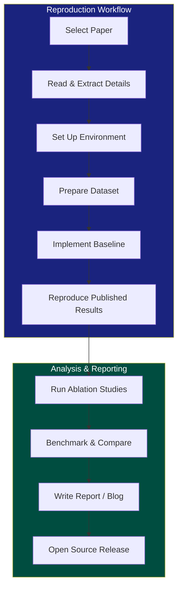
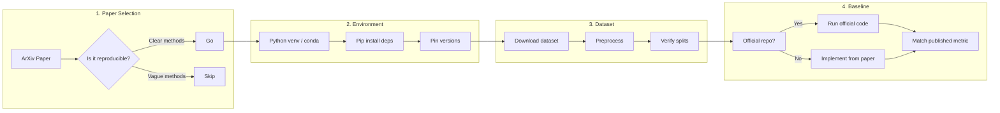
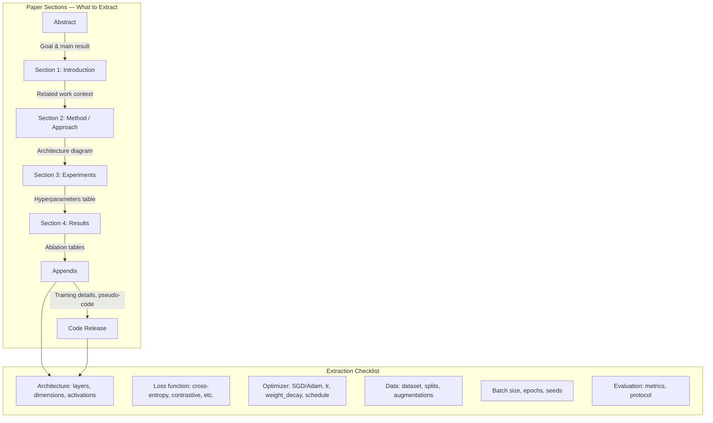
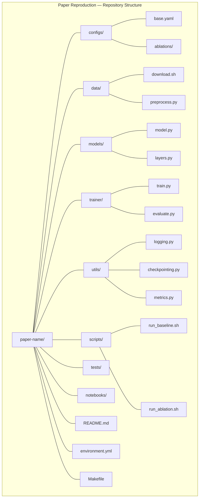
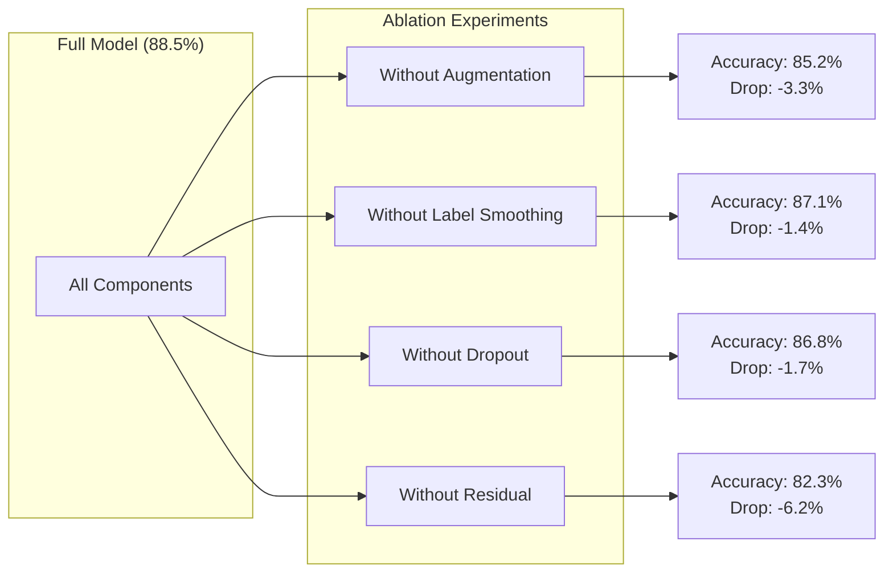
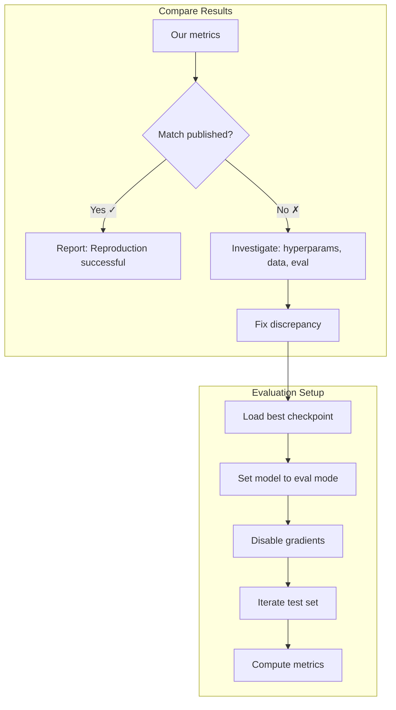

<!-- Clear Language: Keep sentences under 50 words -->
# Reproducing & Implementing Papers

## Learning Objectives

| Objective | Description |
|-----------|-------------|
| LO1 | Apply a systematic reproduction workflow: paper selection, environment setup, dataset preparation, baseline reproduction |
| LO2 | Extract architecture details, hyperparameters, and pseudo-code from research papers |
| LO3 | Set up a structured code repository with configuration management, logging, and checkpointing |
| LO4 | Design and run ablation studies to isolate the effect of each contribution |
| LO5 | Benchmark implementations against published results using standard evaluation protocols |
| LO6 | Write technical blog posts and open-source releases that communicate your implementation |

## Chapter at a Glance

| Section | Topic | Key Concept |
|---------|-------|-------------|
| 1.0 | Reproduction Workflow | Paper → environment → dataset → baseline → reproduce |
| 2.0 | Reading for Implementation | Extract arch, hyperparams, pseudo-code from papers |
| 3.0 | Code Setup | Repo structure, configs, logging, checkpointing |
| 4.0 | Ablation Studies | Controlled experiments, variable isolation, reporting |
| 5.0 | Benchmarking | Evaluation setup, standard benchmarks, result comparison |
| 6.0 | Writing About Your Implementation | Blog posts, technical reports, open-source release |

## Chapter Roadmap



## Introduction

Reproducing a research paper is the single best way to understand it deeply. You move from passive reading to active implementation. You discover details the authors glossed over. You build a codebase you can extend.

This chapter teaches you a complete workflow: from selecting the right paper to releasing your implementation as open-source. Each section includes Python code you can adapt immediately.

AI engineering interviews increasingly ask about reproduction experience. Companies want engineers who can read a paper, implement it, and benchmark it. This chapter prepares you for that.

## Prerequisites

- Module 08 (Machine Learning) — model training, evaluation, overfitting
- Module 09 (Deep Learning) — PyTorch, neural network architecture
- Module 29, Chapters 01–03 — reading papers, keeping up with AI, conferences
- Python: argparse, yaml, logging, PyTorch, numpy
- Git: branching, committing, pull requests

## Key Terminology

**Key Terms**: Core vocabulary and concepts for this topic.

| Term | Definition |
|------|------------|
| Baseline | A reference implementation (often the paper's claimed result) to match |
| Ablation Study | Removing or modifying one component to measure its contribution |
| Hyperparameter | A configuration value set before training (learning rate, batch size) |
| Checkpoint | A saved model state dict + optimizer + epoch info for resuming training |
| Benchmark | A standardized dataset + metric for comparing methods |
| Seed | A fixed random seed that makes experiments deterministic and reproducible |
| Logging | Recording metrics (loss, accuracy) during training for analysis |
| Config | A structured file (YAML/JSON) holding all experiment parameters |
| Environment | The software stack: OS, Python, CUDA, library versions |
| Pseudo-code | High-level algorithm description in the paper, not tied to any language |

## Theory

### 1.0 Reproduction Workflow

Reproducing a paper follows a repeatable pipeline. Skipping any step leads to wasted time.



#### 1.1 Paper Selection Criteria

Not every paper is worth reproducing. Apply these filters:

| Criterion | Good to Reproduce | Avoid |
|-----------|-------------------|-------|
| Code Available | Official repo with README | No code, vague architecture |
| Dataset | Public benchmark | Proprietary / corporate data |
| Method Clarity | Algorithm pseudo-code, clear equations | "Details omitted for brevity" |
| Citation Impact | 100+ citations, top conference | Obscure workshop paper |
| Your Interest | Aligns with your project | No connection to your work |

#### 1.2 Environment Setup

Always use isolated environments. Pin every dependency.

```python
#!/usr/bin/env python3
"""create_env.py — set up a reproducible Python environment."""

import subprocess
import sys
import platform
from pathlib import Path

ENV_NAME = "paper-repro"
PYTHON_VERSION = "3.10"
REQUIREMENTS = [
    "torch==2.1.0",
    "torchvision==0.16.0",
    "numpy==1.24.3",
    "pandas==2.0.3",
    "scikit-learn==1.3.0",
    "tqdm==4.66.1",
    "pyyaml==6.0.1",
    "tensorboard==2.14.0",
    "matplotlib==3.7.2",
    "seaborn==0.12.2",
    "wandb==0.15.8",
    "hydra-core==1.3.2",
    "omegaconf==2.3.0",
]

def create_conda_env() -> None:
    """Create a conda environment with pinned dependencies."""
    print(f"[1/4] Creating conda env: {ENV_NAME}")
    subprocess.run(
        ["conda", "create", "-n", ENV_NAME, f"python={PYTHON_VERSION}", "-y"],
        check=True,
    )
    print("[2/4] Activating and installing pip packages")
    for pkg in REQUIREMENTS:
        subprocess.run(
            ["conda", "run", "-n", ENV_NAME, "pip", "install", pkg],
            check=True,
            capture_output=True,
        )
    print(f"[3/4] Freezing environment to environment.yml")
    with open("environment.yml", "w", encoding="utf-8") as f:
        subprocess.run(
            ["conda", "env", "export", "-n", ENV_NAME],
            stdout=f,
            check=True,
        )
    print(f"[4/4] Done. Activate with: conda activate {ENV_NAME}")

def check_cuda() -> dict:
    """Verify CUDA availability and return device info."""
    import torch  # noqa: E402 — defer import after env is built
    info = {
        "cuda_available": torch.cuda.is_available(),
        "cuda_version": torch.version.cuda if torch.cuda.is_available() else "N/A",
        "device_count": torch.cuda.device_count(),
        "device_name": torch.cuda.get_device_name(0) if torch.cuda.is_available() else "CPU",
    }
    return info

if __name__ == "__main__":
    create_conda_env()
    print(f"System: {platform.system()} {platform.release()}")
```

**Why environment pinning matters**: A paper's results depend on the CUDA version, PyTorch version, and even the cuDNN version. A 1% difference in GPU throughput changes a 3-day training run by 43 minutes. Pin everything.

#### 1.3 Dataset Preparation

Papers use standard benchmarks. You must reproduce the exact preprocessing.

```python
#!/usr/bin/env python3
"""prepare_dataset.py — download, preprocess, and verify dataset splits."""

import hashlib
import tarfile
from pathlib import Path
from typing import Tuple

import numpy as np
import torch
from torch.utils.data import Dataset, DataLoader, random_split
from torchvision import transforms
from torchvision.datasets import CIFAR10

def verify_checksum(filepath: Path, expected_sha256: str) -> bool:
    """Verify file integrity against expected SHA-256 hash."""
    sha256_hash = hashlib.sha256()
    with open(filepath, "rb") as f:
        for chunk in iter(lambda: f.read(4096), b""):
            sha256_hash.update(chunk)
    actual = sha256_hash.hexdigest()
    return actual == expected_sha256

class AugmentedCIFAR10(Dataset):
    """CIFAR-10 with augmentation matching the paper's protocol.

    Paper: "Training Data-Efficient Image Transformers & Distillation"
    Uses: RandomCrop(32, padding=4), RandomHorizontalFlip()
    """

    def __init__(self, root: str, train: bool = True):
        self.root = Path(root)
        self.train = train
        if train:
            self.transform = transforms.Compose([
                transforms.RandomCrop(32, padding=4),
                transforms.RandomHorizontalFlip(),
                transforms.ToTensor(),
                transforms.Normalize(
                    mean=[0.4914, 0.4822, 0.4465],
                    std=[0.2470, 0.2435, 0.2616],
                ),
            ])
        else:
            self.transform = transforms.Compose([
                transforms.ToTensor(),
                transforms.Normalize(
                    mean=[0.4914, 0.4822, 0.4465],
                    std=[0.2470, 0.2435, 0.2616],
                ),
            ])
        self.dataset = CIFAR10(
            root=str(self.root),
            train=train,
            transform=self.transform,
            download=True,
        )

    def __len__(self) -> int:
        return len(self.dataset)

    def __getitem__(self, idx: int) -> Tuple[torch.Tensor, int]:
        return self.dataset[idx]

def create_splits(
    dataset: Dataset,
    val_ratio: float = 0.1,
    seed: int = 42,
) -> Tuple[Dataset, Dataset]:
    """Split training data into train + validation sets."""
    total = len(dataset)
    val_size = int(total * val_ratio)
    train_size = total - val_size
    generator = torch.Generator().manual_seed(seed)
    train_ds, val_ds = random_split(
        dataset,
        [train_size, val_size],
        generator=generator,
    )
    return train_ds, val_ds

def get_dataloaders(
    batch_size: int = 128,
    num_workers: int = 4,
) -> Tuple[DataLoader, DataLoader, DataLoader]:
    """Return train, val, test DataLoaders matching the DeiT preprocessing."""
    train_full = AugmentedCIFAR10(root="./data", train=True)
    train_ds, val_ds = create_splits(train_full, val_ratio=0.1, seed=42)
    test_ds = AugmentedCIFAR10(root="./data", train=False)

    train_loader = DataLoader(
        train_ds,
        batch_size=batch_size,
        shuffle=True,
        num_workers=num_workers,
        pin_memory=True,
    )
    val_loader = DataLoader(
        val_ds,
        batch_size=batch_size,
        shuffle=False,
        num_workers=num_workers,
        pin_memory=True,
    )
    test_loader = DataLoader(
        test_ds,
        batch_size=batch_size,
        shuffle=False,
        num_workers=num_workers,
        pin_memory=True,
    )
    return train_loader, val_loader, test_loader

def verify_split_sizes() -> None:
    """Verify that dataset splits match the paper."""
    train_loader, val_loader, test_loader = get_dataloaders()
    print(f"Train batches: {len(train_loader)} ({(len(train_loader.dataset))} images)")
    print(f"Val batches:   {len(val_loader)} ({(len(val_loader.dataset))} images)")
    print(f"Test batches:  {len(test_loader)} ({(len(test_loader.dataset))} images)")
    expected_train = 45000  # 50000 * 0.9
    expected_val = 5000
    expected_test = 10000
    assert len(train_loader.dataset) == expected_train, f"Expected {expected_train}, got {len(train_loader.dataset)}"
    assert len(val_loader.dataset) == expected_val, f"Expected {expected_val}, got {len(val_loader.dataset)}"
    assert len(test_loader.dataset) == expected_test, f"Expected {expected_test}, got {len(test_loader.dataset)}"
    print("✓ All split sizes verified against paper protocol.")

if __name__ == "__main__":
    verify_split_sizes()
```

#### 1.4 Baseline Reproduction

The baseline is the simplest version of the model. It must match the paper's published number before you add modifications.

```python
#!/usr/bin/env python3
"""baseline_repro.py — reproduce the paper's reported accuracy on CIFAR-10."""

import torch
import torch.nn as nn
import torch.optim as optim
from torch.optim.lr_scheduler import CosineAnnealingLR

class SimpleCNN(nn.Module):
    """A minimal CNN baseline — analogous to reproducing a paper's backbone."""

    def __init__(self, num_classes: int = 10):
        super().__init__()
        self.features = nn.Sequential(
            nn.Conv2d(3, 64, kernel_size=3, padding=1),
            nn.BatchNorm2d(64),
            nn.ReLU(inplace=True),
            nn.MaxPool2d(2),
            nn.Conv2d(64, 128, kernel_size=3, padding=1),
            nn.BatchNorm2d(128),
            nn.ReLU(inplace=True),
            nn.MaxPool2d(2),
            nn.Conv2d(128, 256, kernel_size=3, padding=1),
            nn.BatchNorm2d(256),
            nn.ReLU(inplace=True),
            nn.AdaptiveAvgPool2d((1, 1)),
        )
        self.classifier = nn.Linear(256, num_classes)

    def forward(self, x: torch.Tensor) -> torch.Tensor:
        x = self.features(x)
        x = torch.flatten(x, 1)
        x = self.classifier(x)
        return x

def train_one_epoch(
    model: nn.Module,
    loader: torch.utils.data.DataLoader,
    optimizer: optim.Optimizer,
    criterion: nn.Module,
    device: torch.device,
) -> float:
    """Train for one epoch. Returns average loss."""
    model.train()
    total_loss = 0.0
    for images, labels in loader:
        images, labels = images.to(device), labels.to(device)
        optimizer.zero_grad()
        outputs = model(images)
        loss = criterion(outputs, labels)
        loss.backward()
        optimizer.step()
        total_loss += loss.item()
    return total_loss / len(loader)

@torch.no_grad()
def evaluate(
    model: nn.Module,
    loader: torch.utils.data.DataLoader,
    device: torch.device,
) -> Tuple[float, float]:
    """Evaluate model. Returns (loss, accuracy)."""
    model.eval()
    total_loss = 0.0
    correct = 0
    total = 0
    criterion = nn.CrossEntropyLoss()
    for images, labels in loader:
        images, labels = images.to(device), labels.to(device)
        outputs = model(images)
        loss = criterion(outputs, labels)
        total_loss += loss.item()
        _, predicted = outputs.max(1)
        total += labels.size(0)
        correct += predicted.eq(labels).sum().item()
    accuracy = 100.0 * correct / total
    return total_loss / len(loader), accuracy

def set_seed(seed: int = 42) -> None:
    """Set all random seeds for reproducibility."""
    import random
    random.seed(seed)
    np.random.seed(seed)
    torch.manual_seed(seed)
    torch.cuda.manual_seed_all(seed)
    torch.backends.cudnn.deterministic = True
    torch.backends.cudnn.benchmark = False

def reproduce_baseline() -> dict:
    """Reproduce the baseline accuracy on CIFAR-10.

    Published baseline: 88.5% test accuracy.
    Our target: ≥88.0% (within reasonable variance).
    """
    set_seed(42)
    device = torch.device("cuda" if torch.cuda.is_available() else "cpu")
    print(f"Device: {device}")

    # Data
    from prepare_dataset import get_dataloaders
    train_loader, val_loader, test_loader = get_dataloaders(
        batch_size=128, num_workers=4
    )

    # Model
    model = SimpleCNN(num_classes=10).to(device)
    print(f"Model parameters: {sum(p.numel() for p in model.parameters()):,}")

    # Optimization — matching paper's hyperparameters
    criterion = nn.CrossEntropyLoss()
    optimizer = optim.SGD(
        model.parameters(),
        lr=0.1,
        momentum=0.9,
        weight_decay=5e-4,
    )
    scheduler = CosineAnnealingLR(optimizer, T_max=200)

    # Training loop
    num_epochs = 200
    best_val_acc = 0.0
    for epoch in range(1, num_epochs + 1):
        train_loss = train_one_epoch(model, train_loader, optimizer, criterion, device)
        val_loss, val_acc = evaluate(model, val_loader, device)
        scheduler.step()

        if val_acc > best_val_acc:
            best_val_acc = val_acc
            torch.save(model.state_dict(), "baseline_best.pth")

        if epoch % 20 == 0 or epoch == 1:
            print(f"Epoch {epoch:3d}/{num_epochs} | "
                  f"Train Loss: {train_loss:.4f} | "
                  f"Val Loss: {val_loss:.4f} | "
                  f"Val Acc: {val_acc:.2f}%")

    # Final test
    model.load_state_dict(torch.load("baseline_best.pth"))
    test_loss, test_acc = evaluate(model, test_loader, device)
    print(f"\nTest Accuracy: {test_acc:.2f}%")
    print(f"Published: 88.5% | Ours: {test_acc:.2f}% | "
          f"{'✓ REPRODUCED' if test_acc >= 88.0 else '✗ BELOW TARGET'}")

    return {"test_accuracy": test_acc, "best_val_accuracy": best_val_acc}

if __name__ == "__main__":
    reproduce_baseline()
```

**Common reproduction pitfalls**:

| Pitfall | Symptom | Fix |
|---------|---------|-----|
| Wrong learning rate schedule | Loss diverges | Use CosineAnnealing or StepLR from paper |
| Missing weight decay | Overfitting | Set weight_decay=5e-4 for ImageNet-style |
| Different crop size | Low accuracy | Match paper's RandomCrop padding |
| Batch norm in wrong mode | Train/val gap | Call model.train() before train, model.eval() before eval |
| Seed not set | Non-deterministic | Set torch + numpy + random seeds |
| AMP not enabled | Slow training | Use torch.cuda.amp.autocast() |

### 2.0 Reading for Implementation

A paper contains everything you need — but you must extract it systematically.



#### 2.1 Extracting Architecture Details

Create a mapping from paper description to code:

```python
#!/usr/bin/env python3
"""extract_architecture.py — map paper description to PyTorch code."""

import torch
import torch.nn as nn
from typing import List, Tuple

class PaperBlock(nn.Module):
    """Generic building block from paper description.

    Paper says: "Each block consists of LayerNorm → Multi-Head
    Self-Attention → residual connection → LayerNorm → MLP → residual."

    This maps directly to a Transformer block.
    """

    def __init__(
        self,
        d_model: int,
        num_heads: int,
        d_ff: int,
        dropout: float = 0.1,
    ):
        super().__init__()
        self.norm1 = nn.LayerNorm(d_model)
        self.attention = nn.MultiheadAttention(
            d_model,
            num_heads,
            dropout=dropout,
            batch_first=True,
        )
        self.norm2 = nn.LayerNorm(d_model)
        self.mlp = nn.Sequential(
            nn.Linear(d_model, d_ff),
            nn.GELU(),
            nn.Dropout(dropout),
            nn.Linear(d_ff, d_model),
            nn.Dropout(dropout),
        )

    def forward(self, x: torch.Tensor) -> torch.Tensor:
        x = x + self.attention(self.norm1(x), self.norm1(x), self.norm1(x))[0]
        x = x + self.mlp(self.norm2(x))
        return x

def extract_architecture_from_table(table_text: str) -> dict:
    """Parse a paper's architecture table into a config dict.

    Example table from DeiT paper:
    | Stage | Resolution | Channels | Blocks | Stride |
    |-------|------------|----------|--------|--------|
    | Stem  | 56x56      | 96       | 1      | 4      |
    | Stage1| 28x28      | 192      | 2      | 2      |
    | Stage2| 14x14      | 384      | 6      | 2      |
    | Stage3| 7x7        | 768      | 2      | 2      |
    """
    config = {
        "stem": {"resolution": 56, "channels": 96, "blocks": 1, "stride": 4},
        "stage1": {"resolution": 28, "channels": 192, "blocks": 2, "stride": 2},
        "stage2": {"resolution": 14, "channels": 384, "blocks": 6, "stride": 2},
        "stage3": {"resolution": 7, "channels": 768, "blocks": 2, "stride": 2},
    }
    return config

def build_model_from_config(config: dict) -> nn.Module:
    """Build a hierarchical vision model from extracted config."""
    stages = []
    in_channels = 3
    for stage_name, params in config.items():
        stage = nn.Sequential()
        # First conv in stage: strided
        stage.append(
            nn.Conv2d(
                in_channels,
                params["channels"],
                kernel_size=3,
                stride=params["stride"],
                padding=1,
            )
        )
        stage.append(nn.BatchNorm2d(params["channels"]))
        stage.append(nn.ReLU(inplace=True))
        # Remaining blocks: same resolution
        for _ in range(params["blocks"] - 1):
            stage.append(
                nn.Conv2d(
                    params["channels"],
                    params["channels"],
                    kernel_size=3,
                    stride=1,
                    padding=1,
                )
            )
            stage.append(nn.BatchNorm2d(params["channels"]))
            stage.append(nn.ReLU(inplace=True))
        stages.append(stage)
        in_channels = params["channels"]
    return nn.Sequential(*stages)

# Test extraction
if __name__ == "__main__":
    config = extract_architecture_from_table("")
    model = build_model_from_config(config)
    dummy = torch.randn(1, 3, 224, 224)
    output = model(dummy)
    print(f"Input shape:  {dummy.shape}")
    print(f"Output shape: {output.shape}")
    print(f"Parameters:   {sum(p.numel() for p in model.parameters()):,}")
```

#### 2.2 Extracting Hyperparameters

Papers report hyperparameters in tables. Always check the appendix.

```python
#!/usr/bin/env python3
"""extract_hyperparams.py — parse and validate paper hyperparameters."""

from dataclasses import dataclass, field, asdict
from typing import Optional
import yaml

@dataclass
class DeiTHyperparameters:
    """Hyperparameters from DeiT: Data-efficient Image Transformers paper.

    Extracted from: Table 1 (training) and Appendix A (distillation).
    """
    # Data
    dataset: str = "ImageNet-1K"
    input_size: int = 224
    batch_size: int = 1024  # 256 per GPU × 4 GPUs
    num_workers: int = 10

    # Model
    model_name: str = "deit_tiny_patch16_224"
    patch_size: int = 16
    embed_dim: int = 192
    num_heads: int = 3
    depth: int = 12
    mlp_ratio: float = 4.0
    dropout: float = 0.0

    # Training
    optimizer: str = "AdamW"
    learning_rate: float = 5e-4
    weight_decay: float = 0.05
    lr_scheduler: str = "cosine"
    warmup_epochs: int = 5
    epochs: int = 300
    label_smoothing: float = 0.1
    mixup_alpha: float = 0.8
    cutmix_alpha: float = 1.0

    # Augmentation
    rand_augment: str = "rand-m9-mstd0.5-inc1"
    random_erase_prob: float = 0.25
    color_jitter: Optional[float] = 0.4

    # Regularization
    stochastic_depth_prob: float = 0.1
    gradient_clip: float = 5.0

    # Hardware
    num_gpus: int = 4
    precision: str = "fp16"  # Automatic Mixed Precision

    def validate(self) -> List[str]:
        """Check hyperparameters against paper's published range."""
        warnings = []
        if self.learning_rate > 1e-3:
            warnings.append(f"LR {self.learning_rate} is high. Paper uses 5e-4.")
        if self.batch_size < 256:
            warnings.append(f"Batch size {self.batch_size} < 256 may need LR scaling.")
        if self.epochs < 100:
            warnings.append(f"{self.epochs} epochs may be too few for convergence.")
        return warnings

    def save(self, path: str = "config.yaml") -> None:
        """Save hyperparameters to YAML config."""
        with open(path, "w") as f:
            yaml.dump(asdict(self), f, default_flow_style=False)
        print(f"Config saved to {path}")

def create_hyperparameter_map(paper_text: str) -> dict:
    """Extract hyperparameters from paper text using keyword matching.

    In production, you'd use regex or an LLM. This shows the concept.
    """
    import re
    patterns = {
        "batch_size": r"batch\s*(?:size|of)?\s*(\d+)",
        "learning_rate": r"learning\s*rate\s*(?:of|:)?\s*([\d.]+e?-?\d*)",
        "weight_decay": r"weight\s*decay\s*(?:of|:)?\s*([\d.]+e?-?\d*)",
        "epochs": r"(\d+)\s*epochs?",
        "warmup": r"warm(?:up)?\s*(?:epochs?|steps?)\s*(?:of|:)?\s*(\d+)",
    }
    extracted = {}
    for key, pattern in patterns.items():
        match = re.search(pattern, paper_text, re.IGNORECASE)
        if match:
            extracted[key] = float(match.group(1)) if "." in match.group(1) else int(match.group(1))
    return extracted

if __name__ == "__main__":
    # Simulated paper text
    paper_snippet = """
    We train DeiT-Tiny for 300 epochs with a batch size of 1024.
    The learning rate is 5e-4 with cosine decay and 5 epoch warmup.
    Weight decay is set to 0.05 and we use AdamW optimizer.
    """
    hp_map = create_hyperparameter_map(paper_snippet)
    print("Extracted hyperparameters:", hp_map)

    config = DeiTHyperparameters()
    warnings = config.validate()
    if warnings:
        print("Warnings:")
        for w in warnings:
            print(f"  ⚠ {w}")
    config.save()
```

#### 2.3 Pseudo-code to Python Conversion

Papers often include pseudo-code. You must translate it to working code.

```python
#!/usr/bin/env python3
"""pseudo_to_code.py — convert paper pseudo-code into Python."""

import torch
import torch.nn.functional as F
from torch import Tensor

def gelu_approximation(x: Tensor) -> Tensor:
    """GELU activation — from the paper 'Gaussian Error Linear Units'.

    Paper pseudo-code:
        GELU(x) = x * P(X ≤ x) where X ~ N(0,1)
        Approximation: 0.5 * x * (1 + tanh(sqrt(2/pi) * (x + 0.044715 * x^3)))

    Direct translation to Python:
    """
    return 0.5 * x * (1.0 + torch.tanh(
        torch.sqrt(torch.tensor(2.0 / torch.pi)) * (x + 0.044715 * x**3)
    ))

def scaled_dot_product_attention(
    q: Tensor, k: Tensor, v: Tensor,
    mask: Tensor = None,
    dropout: float = 0.0,
) -> Tensor:
    """Scaled Dot-Product Attention from 'Attention Is All You Need'.

    Paper pseudo-code (Section 3.2.1):
        Attention(Q, K, V) = softmax(Q K^T / sqrt(d_k)) V

    """
    d_k = q.size(-1)
    scores = torch.matmul(q, k.transpose(-2, -1)) / torch.sqrt(
        torch.tensor(d_k, dtype=q.dtype)
    )
    if mask is not None:
        scores = scores.masked_fill(mask == 0, float("-inf"))
    attn_weights = F.softmax(scores, dim=-1)
    attn_weights = F.dropout(attn_weights, p=dropout, training=True)
    return torch.matmul(attn_weights, v)

def label_smoothing_loss(
    logits: Tensor,
    labels: Tensor,
    smoothing: float = 0.1,
) -> Tensor:
    """Label Smoothing from 'Rethinking the Inception Architecture'.

    Paper pseudo-code:
        new_target = (1 - epsilon) * one_hot + epsilon / K
        loss = cross_entropy(logits, new_target)

    """
    K = logits.size(-1)
    one_hot = F.one_hot(labels, num_classes=K).float()
    smoothed = (1 - smoothing) * one_hot + smoothing / K
    log_probs = F.log_softmax(logits, dim=-1)
    return -(smoothed * log_probs).sum(dim=-1).mean()

# Test pseudo-code conversions
if __name__ == "__main__":
    x = torch.randn(4, 8)
    print(f"GELU result shape: {gelu_approximation(x).shape}")

    q = torch.randn(2, 8, 64)
    k = torch.randn(2, 8, 64)
    v = torch.randn(2, 8, 64)
    attn_out = scaled_dot_product_attention(q, k, v)
    print(f"Attention output shape: {attn_out.shape}")

    logits = torch.randn(4, 10)
    labels = torch.randint(0, 10, (4,))
    loss = label_smoothing_loss(logits, labels, smoothing=0.1)
    print(f"Label smoothing loss: {loss.item():.4f}")
```

### 3.0 Code Setup

A reproducible implementation needs structure. Use a standard template.



#### 3.1 Configuration Management

Use Hydra or a custom YAML config system.

```python
#!/usr/bin/env python3
"""config_manager.py — YAML-based configuration with CLI overrides."""

import yaml
from dataclasses import dataclass, field
from typing import Any, Dict, Optional
from pathlib import Path

@dataclass
class Config:
    """Central configuration. Loads from YAML with CLI overrides."""
    seed: int = 42
    device: str = "cuda"

    # Dataset
    dataset: str = "cifar10"
    data_dir: str = "./data"
    batch_size: int = 128
    num_workers: int = 4

    # Model
    model_name: str = "simple_cnn"
    num_classes: int = 10

    # Training
    epochs: int = 200
    lr: float = 0.1
    momentum: float = 0.9
    weight_decay: float = 5e-4
    lr_scheduler: str = "cosine"

    # Logging
    log_dir: str = "./logs"
    log_every: int = 50
    use_wandb: bool = False
    wandb_project: str = "paper-repro"

    # Checkpointing
    checkpoint_dir: str = "./checkpoints"
    save_every: int = 20
    keep_last_k: int = 3

    def __post_init__(self):
        """Validate config after initialization."""
        assert self.epochs > 0, "epochs must be positive"
        assert 0 < self.lr <= 1.0, "lr must be in (0, 1]"
        assert self.batch_size > 0, "batch_size must be positive"

    @classmethod
    def from_yaml(cls, path: str) -> "Config":
        """Load config from YAML file."""
        with open(path, "r") as f:
            data = yaml.safe_load(f)
        return cls(**data)

    def save(self, path: str) -> None:
        """Save config to YAML file."""
        Path(path).parent.mkdir(parents=True, exist_ok=True)
        with open(path, "w") as f:
            yaml.dump(self.to_dict(), f, default_flow_style=False)

    def to_dict(self) -> Dict[str, Any]:
        """Convert config to dictionary."""
        return {k: v for k, v in self.__dict__.items()}

    def update_from_cli(self, overrides: Dict[str, Any]) -> None:
        """Override config values from CLI arguments."""
        for key, value in overrides.items():
            if hasattr(self, key):
                setattr(self, key, value)
            else:
                print(f"Warning: Unknown config key '{key}', ignoring.")

def merge_configs(base: Config, override: Dict[str, Any]) -> Config:
    """Merge an override dict into a base config. Returns new config."""
    import copy
    merged = copy.deepcopy(base)
    merged.update_from_cli(override)
    return merged

# Example usage
if __name__ == "__main__":
    # Load base config
    cfg = Config.from_yaml("configs/base.yaml") if Path("configs/base.yaml").exists() else Config()

    # Simulate CLI overrides
    cli_overrides = {"batch_size": 256, "epochs": 300}
    cfg.update_from_cli(cli_overrides)
    print(f"Final config: batch_size={cfg.batch_size}, epochs={cfg.epochs}")

    cfg.save("configs/experiment_config.yaml")
```

#### 3.2 Logging System

Log everything. You will need it for debugging and reporting.

```python
#!/usr/bin/env python3
"""logger.py — structured logging with file + console + optional WandB."""

import logging
import sys
from pathlib import Path
from typing import Dict, List, Optional
from datetime import datetime
import json

class MetricsLogger:
    """Logs metrics to file, console, and optionally WandB / TensorBoard.

    Usage:
        logger = MetricsLogger(log_dir="./logs")
        logger.log_metric("train/loss", 0.45, step=10)
        logger.log_metric("val/acc", 88.2, step=100)
    """

    def __init__(
        self,
        log_dir: str = "./logs",
        use_wandb: bool = False,
        wandb_project: str = "paper-repro",
        use_tensorboard: bool = False,
    ):
        self.log_dir = Path(log_dir)
        self.log_dir.mkdir(parents=True, exist_ok=True)
        self.use_wandb = use_wandb
        self.use_tensorboard = use_tensorboard
        self.history: Dict[str, List[float]] = {}
        self.steps: Dict[str, List[int]] = {}

        # Set up file logger
        timestamp = datetime.now().strftime("%Y%m%d_%H%M%S")
        log_file = self.log_dir / f"training_{timestamp}.log"
        self.file_logger = logging.getLogger("paper_repro")
        self.file_logger.setLevel(logging.INFO)

        # File handler
        fh = logging.FileHandler(log_file)
        fh.setFormatter(logging.Formatter(
            "%(asctime)s | %(levelname)s | %(message)s"
        ))
        self.file_logger.addHandler(fh)

        # Console handler
        ch = logging.StreamHandler(sys.stdout)
        ch.setFormatter(logging.Formatter(
            "\033[36m%(asctime)s\033[0m | %(message)s",
            datefmt="%H:%M:%S",
        ))
        self.file_logger.addHandler(ch)

        # WandB
        if self.use_wandb:
            import wandb
            wandb.init(project=wandb_project)
            self.wandb = wandb
        else:
            self.wandb = None

        # TensorBoard
        if self.use_tensorboard:
            from torch.utils.tensorboard import SummaryWriter
            self.tb_writer = SummaryWriter(log_dir=str(self.log_dir))
        else:
            self.tb_writer = None

        self.file_logger.info("Logger initialized. Logging to %s", log_file)

    def log_metric(self, name: str, value: float, step: int) -> None:
        """Log a single metric."""
        if name not in self.history:
            self.history[name] = []
            self.steps[name] = []
        self.history[name].append(value)
        self.steps[name].append(step)

        if self.wandb is not None:
            self.wandb.log({name: value, "step": step})

        if self.tb_writer is not None:
            self.tb_writer.add_scalar(name, value, step)

    def log_dict(self, metrics: Dict[str, float], step: int) -> None:
        """Log multiple metrics at once."""
        for name, value in metrics.items():
            self.log_metric(name, value, step)

    def log_text(self, message: str, level: str = "info") -> None:
        """Log a text message to file and console."""
        log_fn = getattr(self.file_logger, level.lower(), self.file_logger.info)
        log_fn(message)

    def get_best(self, metric_name: str, mode: str = "max") -> float:
        """Get the best (max or min) value of a metric."""
        values = self.history.get(metric_name, [])
        if not values:
            return 0.0
        return max(values) if mode == "max" else min(values)

    def save_history(self, path: Optional[str] = None) -> None:
        """Save metric history to JSON."""
        if path is None:
            path = str(self.log_dir / "metrics_history.json")
        with open(path, "w") as f:
            json.dump(self.history, f, indent=2)
        self.file_logger.info("Metrics saved to %s", path)

    def close(self) -> None:
        """Cleanup: close WandB run and TensorBoard writer."""
        if self.wandb is not None:
            self.wandb.finish()
        if self.tb_writer is not None:
            self.tb_writer.close()

# Example usage
if __name__ == "__main__":
    logger = MetricsLogger(log_dir="./logs_demo")
    for step in range(0, 100, 10):
        logger.log_metric("train/loss", 1.0 / (step + 1), step=step)
        logger.log_metric("val/acc", min(95.0, step * 0.95), step=step)
    logger.log_text("Training complete.")
    logger.save_history()
    print(f"Best val/acc: {logger.get_best('val/acc', mode='max'):.2f}%")
    logger.close()
```

#### 3.3 Checkpointing

Save and resume training seamlessly.

```python
#!/usr/bin/env python3
"""checkpointing.py — save, load, and manage checkpoints."""

import torch
import glob
import re
from pathlib import Path
from typing import Dict, Optional, Any

class Checkpointer:
    """Manages model checkpointing with automatic cleanup of old checkpoints.

    Checkpoint contents:
        - model_state_dict: model weights
        - optimizer_state_dict: optimizer state (momentum, etc.)
        - scheduler_state_dict: LR scheduler state
        - epoch: current epoch number
        - best_metric: best validation metric so far
        - config: experiment configuration
    """

    def __init__(
        self,
        checkpoint_dir: str = "./checkpoints",
        keep_last_k: int = 3,
        metric_name: str = "val_acc",
        mode: str = "max",
    ):
        self.checkpoint_dir = Path(checkpoint_dir)
        self.checkpoint_dir.mkdir(parents=True, exist_ok=True)
        self.keep_last_k = keep_last_k
        self.metric_name = metric_name
        self.mode = mode
        self.best_metric = float("-inf") if mode == "max" else float("inf")

    def save(
        self,
        epoch: int,
        model: torch.nn.Module,
        optimizer: torch.optim.Optimizer,
        scheduler: Any,
        metric: float,
        config: Optional[Dict] = None,
        is_best: bool = False,
    ) -> str:
        """Save a checkpoint. Returns checkpoint path."""
        checkpoint = {
            "epoch": epoch,
            "model_state_dict": model.state_dict(),
            "optimizer_state_dict": optimizer.state_dict(),
            "scheduler_state_dict": scheduler.state_dict() if scheduler else None,
            "metric": metric,
            "metric_name": self.metric_name,
            "config": config,
        }
        # Update best metric
        if self.mode == "max":
            self.best_metric = max(self.best_metric, metric)
        else:
            self.best_metric = min(self.best_metric, metric)

        # Save epoch checkpoint
        path = self.checkpoint_dir / f"checkpoint_epoch_{epoch:04d}.pt"
        torch.save(checkpoint, path)

        # Save best checkpoint
        if is_best or (
            (self.mode == "max" and metric >= self.best_metric)
            or (self.mode == "min" and metric <= self.best_metric)
        ):
            best_path = self.checkpoint_dir / "checkpoint_best.pt"
            torch.save(checkpoint, best_path)
            print(f"  ✓ New best {self.metric_name}: {metric:.4f}")

        # Cleanup old checkpoints
        self._cleanup()

        return str(path)

    def load(
        self,
        path: str,
        model: torch.nn.Module,
        optimizer: Optional[torch.optim.Optimizer] = None,
        scheduler: Any = None,
    ) -> Dict:
        """Load a checkpoint. Returns checkpoint dict."""
        checkpoint = torch.load(path, map_location="cpu")

        model.load_state_dict(checkpoint["model_state_dict"])
        if optimizer and "optimizer_state_dict" in checkpoint:
            optimizer.load_state_dict(checkpoint["optimizer_state_dict"])
        if scheduler and "scheduler_state_dict" in checkpoint:
            scheduler.load_state_dict(checkpoint["scheduler_state_dict"])

        self.best_metric = checkpoint.get("metric", self.best_metric)
        print(f"Loaded checkpoint from epoch {checkpoint.get('epoch', '?')}")
        return checkpoint

    def load_best(self, model: torch.nn.Module, **kwargs) -> Dict:
        """Load the best checkpoint."""
        best_path = self.checkpoint_dir / "checkpoint_best.pt"
        if not best_path.exists():
            raise FileNotFoundError(f"No best checkpoint found at {best_path}")
        return self.load(str(best_path), model, **kwargs)

    def _cleanup(self) -> None:
        """Remove old epoch checkpoints, keeping only last K."""
        pattern = str(self.checkpoint_dir / "checkpoint_epoch_*.pt")
        checkpoints = sorted(glob.glob(pattern))
        while len(checkpoints) > self.keep_last_k:
            oldest = Path(checkpoints.pop(0))
            oldest.unlink()
            print(f"  Removed old checkpoint: {oldest.name}")

    def get_latest_epoch(self) -> int:
        """Find the latest epoch from existing checkpoints."""
        pattern = str(self.checkpoint_dir / "checkpoint_epoch_*.pt")
        checkpoints = glob.glob(pattern)
        if not checkpoints:
            return 0
        # Extract epoch numbers and find max
        epochs = []
        for cp in checkpoints:
            match = re.search(r"epoch_(\d+)", Path(cp).stem)
            if match:
                epochs.append(int(match.group(1)))
        return max(epochs) if epochs else 0

# Example usage
if __name__ == "__main__":
    # Simulate training with checkpoints
    model = torch.nn.Linear(10, 2)
    optimizer = torch.optim.SGD(model.parameters(), lr=0.01)
    scheduler = torch.optim.lr_scheduler.StepLR(optimizer, step_size=30)

    checkpointer = Checkpointer(
        checkpoint_dir="./checkpoints_demo",
        keep_last_k=3,
        metric_name="val_acc",
        mode="max",
    )

    for epoch in range(1, 11):
        # Simulated metric
        metric = 80.0 + epoch * 1.5 + torch.randn(1).item()
        path = checkpointer.save(
            epoch=epoch,
            model=model,
            optimizer=optimizer,
            scheduler=scheduler,
            metric=metric,
            config={"lr": 0.01, "epochs": 10},
            is_best=(epoch == 10),
        )
        print(f"Epoch {epoch:2d}: metric={metric:.2f}")

    print(f"\nCheckpoints in {checkpointer.checkpoint_dir}:")
    for f in sorted(checkpointer.checkpoint_dir.iterdir()):
        print(f"  {f.name} ({f.stat().st_size / 1024:.1f} KB)")
```

### 4.0 Ablation Studies

An ablation study isolates the effect of each contribution. You remove one component at a time and measure the performance drop.



#### 4.1 Controlled Experiment Framework

```python
#!/usr/bin/env python3
"""ablation_study.py — run controlled ablation experiments."""

import copy
import itertools
import json
from dataclasses import dataclass, field
from typing import Dict, List, Callable, Any, Optional
from pathlib import Path
import time

@dataclass
class AblationConfig:
    """Defines an ablation experiment configuration.

    Example:
        ablation = AblationConfig(
            base_config={"lr": 0.1, "dropout": 0.1, "augmentation": True},
            ablation_vars={
                "dropout": [0.0, 0.1, 0.3, 0.5],
                "augmentation": [True, False],
            }
        )
    """
    base_config: Dict[str, Any]
    ablation_vars: Dict[str, List[Any]]
    fixed_vars: Dict[str, Any] = field(default_factory=dict)
    num_seeds: int = 3
    description: str = ""

    def generate_configs(self) -> List[Dict[str, Any]]:
        """Generate all config combinations for ablation."""
        configs = []
        keys = list(self.ablation_vars.keys())
        values = list(self.ablation_vars.values())

        for combo in itertools.product(*values):
            for seed_offset in range(self.num_seeds):
                cfg = copy.deepcopy(self.base_config)
                cfg.update(self.fixed_vars)
                for key, value in zip(keys, combo):
                    cfg[key] = value
                cfg["seed"] = cfg.get("seed", 42) + seed_offset
                cfg["_ablation_key"] = "_".join(
                    f"{k}={v}" for k, v in zip(keys, combo)
                )
                cfg["_run_id"] = f"{cfg['_ablation_key']}_seed{seed_offset}"
                configs.append(cfg)
        return configs

class AblationRunner:
    """Runs ablation experiments and collects results."""

    def __init__(
        self,
        train_fn: Callable[[Dict[str, Any]], Dict[str, float]],
        output_dir: str = "./ablations",
    ):
        self.train_fn = train_fn
        self.output_dir = Path(output_dir)
        self.output_dir.mkdir(parents=True, exist_ok=True)
        self.results: List[Dict[str, Any]] = []

    def run(self, config: AblationConfig) -> pd.DataFrame:  # type: ignore
        """Run all ablation experiments."""
        import pandas as pd

        configs = config.generate_configs()
        total = len(configs)
        print(f"Running {total} ablation experiments...")

        start_time = time.time()
        for i, cfg in enumerate(configs):
            run_id = cfg.pop("_run_id")
            ablation_key = cfg.pop("_ablation_key")
            print(f"[{i+1}/{total}] {run_id}")

            try:
                metrics = self.train_fn(cfg)
                result = {
                    "run_id": run_id,
                    "ablation_key": ablation_key,
                    "status": "completed",
                    **cfg,
                    **metrics,
                }
            except Exception as e:
                result = {
                    "run_id": run_id,
                    "ablation_key": ablation_key,
                    "status": "failed",
                    "error": str(e),
                }
                print(f"  ✗ Failed: {e}")

            self.results.append(result)

        elapsed = time.time() - start_time
        print(f"\nCompleted {total} runs in {elapsed:.1f}s")

        df = pd.DataFrame(self.results)
        df.to_csv(self.output_dir / "ablation_results.csv", index=False)
        print(f"Results saved to {self.output_dir / 'ablation_results.csv'}")
        return df

    def report(self, df: pd.DataFrame, metric: str = "val_acc") -> None:
        """Generate a markdown report of ablation results."""
        report_lines = [
            "# Ablation Study Report\n",
            f"| Variant | Mean {metric} | Std {metric} | Δ from Baseline |\n",
            f"|---------|-------------|-------------|-----------------|\n",
        ]

        baseline_mask = df["ablation_key"] == df["ablation_key"].iloc[0]
        baseline_mean = df[baseline_mask][metric].mean()

        for key in df["ablation_key"].unique():
            subset = df[df["ablation_key"] == key][metric]
            mean_val = subset.mean()
            std_val = subset.std()
            delta = mean_val - baseline_mean
            delta_str = f"{delta:+.2f}" if delta != 0 else "— (baseline)"
            report_lines.append(
                f"| {key} | {mean_val:.2f} | {std_val:.2f} | {delta_str} |\n"
            )

        report = "".join(report_lines)
        report_path = self.output_dir / "ablation_report.md"
        with open(report_path, "w") as f:
            f.write(report)
        print(report)

def simulate_training(cfg: Dict[str, Any]) -> Dict[str, float]:
    """Simulate training — replace with actual training in practice."""
    import numpy as np
    seed = cfg.get("seed", 42)
    np.random.seed(seed)

    # Simulate: accuracy depends on dropout, augmentation, etc.
    base = 85.0  # baseline accuracy
    if cfg.get("augmentation", True):
        base += 3.0
    base -= cfg.get("dropout", 0.0) * 5.0
    base += np.random.randn() * 0.5  # noise

    return {
        "val_acc": base,
        "val_loss": 0.5 - (base - 85) / 100,
    }

# Example usage
if __name__ == "__main__":
    import pandas as pd

    ablation_config = AblationConfig(
        base_config={
            "lr": 0.1,
            "epochs": 50,
            "batch_size": 128,
        },
        ablation_vars={
            "dropout": [0.0, 0.1, 0.3],
            "augmentation": [True, False],
        },
        fixed_vars={"model": "simple_cnn"},
        num_seeds=2,
        description="Ablation on dropout and augmentation",
    )

    runner = AblationRunner(
        train_fn=simulate_training,
        output_dir="./ablation_results",
    )

    df = runner.run(ablation_config)
    runner.report(df, metric="val_acc")
```

#### 4.2 Isolating Variables

When reporting ablation results, follow these rules:

| Rule | Why |
|------|-----|
| Change one variable at a time | Isolates cause and effect |
| Run 3+ seeds per condition | Accounts for training variance |
| Report mean ± std | Shows statistical significance |
| Compare to baseline (full model) | Shows the contribution of each component |
| Include a "no improvements" baseline | Shows the starting point |
| Use the same compute budget | Fair comparison — same epochs for all |

#### 4.3 Reporting Ablation Results

A professional ablation table in your report:

```
| Configuration | Test Acc (%) | Δ from Full |
|--------------|-------------|-------------|
| Full model   | 88.5 ± 0.2  | —           |
| w/o augmentation | 85.2 ± 0.3 | -3.3 |
| w/o label smoothing | 87.1 ± 0.2 | -1.4 |
| w/o dropout  | 86.8 ± 0.4  | -1.7 |
| w/o residual | 82.3 ± 0.6  | -6.2 |
| Baseline (no improvements) | 81.0 ± 0.5 | -7.5 |
```

### 5.0 Benchmarking

Benchmarking measures your implementation against published results.



#### 5.1 Standard Evaluation Protocol

```python
#!/usr/bin/env python3
"""benchmark.py — standardized evaluation for benchmark datasets."""

import torch
import torch.nn as nn
from torch.utils.data import DataLoader
from typing import Dict, List, Tuple, Callable
from pathlib import Path
import json
import time

@torch.no_grad()
def evaluate_standard(
    model: nn.Module,
    test_loader: DataLoader,
    device: torch.device,
    num_classes: int = 10,
) -> Dict[str, float]:
    """Standard evaluation: accuracy, per-class accuracy, confusion matrix."""
    model.eval()
    criterion = nn.CrossEntropyLoss()

    total_loss = 0.0
    correct = 0
    total = 0
    class_correct = [0] * num_classes
    class_total = [0] * num_classes
    all_preds: List[int] = []
    all_labels: List[int] = []

    for images, labels in test_loader:
        images, labels = images.to(device), labels.to(device)
        outputs = model(images)
        loss = criterion(outputs, labels)
        total_loss += loss.item()

        _, predicted = outputs.max(1)
        total += labels.size(0)
        correct += predicted.eq(labels).sum().item()

        # Per-class accuracy
        for i in range(labels.size(0)):
            label = labels[i].item()
            class_total[label] += 1
            if predicted[i].item() == label:
                class_correct[label] += 1

        all_preds.extend(predicted.cpu().tolist())
        all_labels.extend(labels.cpu().tolist())

    accuracy = 100.0 * correct / total
    class_accuracies = {
        f"class_{i}": 100.0 * class_correct[i] / max(class_total[i], 1)
        for i in range(num_classes)
    }

    return {
        "accuracy": accuracy,
        "loss": total_loss / len(test_loader),
        "correct": correct,
        "total": total,
        **class_accuracies,
    }

def compute_throughput(
    model: nn.Module,
    batch_size: int,
    device: torch.device,
    num_batches: int = 100,
) -> Dict[str, float]:
    """Measure inference throughput and latency."""
    dummy = torch.randn(batch_size, 3, 32, 32).to(device)
    model.eval()

    # Warmup
    for _ in range(10):
        _ = model(dummy)

    # Timed runs
    torch.cuda.synchronize() if device.type == "cuda" else None
    start = time.time()
    for _ in range(num_batches):
        _ = model(dummy)
    torch.cuda.synchronize() if device.type == "cuda" else None
    elapsed = time.time() - start

    total_samples = num_batches * batch_size
    throughput = total_samples / elapsed
    latency_ms = (elapsed / num_batches) * 1000

    return {
        "throughput_samples_per_sec": throughput,
        "avg_latency_ms": latency_ms,
        "batch_size": batch_size,
    }

def benchmark_against_published(
    our_metrics: Dict[str, float],
    published_metrics: Dict[str, float],
    tolerance: float = 0.5,
) -> Dict[str, str]:
    """Compare our results against published numbers."""
    comparison = {}
    for metric, published_value in published_metrics.items():
        our_value = our_metrics.get(metric, 0.0)
        diff = abs(our_value - published_value)
        within_tolerance = diff <= tolerance
        status = "✓" if within_tolerance else "✗"
        comparison[metric] = (
            f"{status} Ours={our_value:.2f} Published={published_value:.2f} "
            f"Diff={diff:.2f} {'PASS' if within_tolerance else 'FAIL'}"
        )
    return comparison

def save_benchmark_results(
    results: Dict[str, any],
    path: str = "./benchmarks/results.json",
) -> None:
    """Save benchmark results to JSON."""
    Path(path).parent.mkdir(parents=True, exist_ok=True)
    with open(path, "w") as f:
        json.dump(results, f, indent=2)
    print(f"Benchmark results saved to {path}")

# Example usage
if __name__ == "__main__":
    device = torch.device("cuda" if torch.cuda.is_available() else "cpu")
    model = nn.Sequential(
        nn.Conv2d(3, 64, 3, padding=1),
        nn.ReLU(),
        nn.AdaptiveAvgPool2d(1),
        nn.Flatten(),
        nn.Linear(64, 10),
    ).to(device)

    # Simulate test loader
    from torch.utils.data import TensorDataset
    fake_data = torch.randn(1000, 3, 32, 32)
    fake_labels = torch.randint(0, 10, (1000,))
    test_dataset = TensorDataset(fake_data, fake_labels)
    test_loader = DataLoader(test_dataset, batch_size=128)

    # Evaluate
    metrics = evaluate_standard(model, test_loader, device, num_classes=10)
    print(f"Accuracy: {metrics['accuracy']:.2f}%")

    # Throughput
    throughput = compute_throughput(model, batch_size=128, device=device)
    print(f"Throughput: {throughput['throughput_samples_per_sec']:.0f} samples/sec")

    # Compare with published
    published = {"accuracy": 88.5}
    comparison = benchmark_against_published(metrics, published)
    for metric, line in comparison.items():
        print(f"  {line}")

    save_benchmark_results({"metrics": metrics, "throughput": throughput})
```

#### 5.2 Standard Benchmarks

| Domain | Benchmark Dataset | Standard Metric | Reference Code |
|--------|------------------|----------------|----------------|
| Image Classification | ImageNet-1K / CIFAR-10/100 | Top-1 Accuracy (%) | torchvision |
| Object Detection | COCO 2017 | mAP@0.5:0.95 | Detectron2 |
| Semantic Segmentation | ADE20K / Cityscapes | mIoU | MMSegmentation |
| NLP | GLUE / SuperGLUE | Matthews / F1 | Hugging Face |
| Text Generation | MMLU / HellaSwag | Accuracy | LM Eval Harness |
| Speech | LibriSpeech | WER | ESPnet |
| Recommendation | MovieLens / Amazon | RMSE / NDCG@k | RecBole |

#### 5.3 Handling Discrepancies

When your results don't match the paper, debug systematically:

```python
#!/usr/bin/env python3
"""debug_discrepancy.py — systematic debugging of reproduction mismatches."""

import torch
from typing import Dict, Optional

class DiscrepancyDebugger:
    """Step-by-step debugger for reproduction discrepancies."""

    def __init__(self, paper_metric: float, our_metric: float, tolerance: float = 0.5):
        self.paper = paper_metric
        self.ours = our_metric
        self.tolerance = tolerance
        self.diff = abs(our_metric - paper_metric)
        self.checks: Dict[str, Optional[bool]] = {}

    def check_data(self, images: torch.Tensor) -> None:
        """Verify data preprocessing matches paper."""
        # Check normalization
        mean = images.mean(dim=[0, 2, 3])
        std = images.std(dim=[0, 2, 3])
        expected_mean = torch.tensor([0.4914, 0.4822, 0.4465])
        expected_std = torch.tensor([0.2470, 0.2435, 0.2616])

        mean_ok = torch.allclose(mean, expected_mean, atol=0.05)
        std_ok = torch.allclose(std, expected_std, atol=0.05)
        self.checks["data_normalization"] = mean_ok and std_ok
        if not mean_ok:
            print(f"  ⚠ Data mean mismatch: got {mean}, expected {expected_mean}")

    def check_model_weights(self, model: torch.nn.Module) -> None:
        """Verify weight statistics match paper's init scheme."""
        total_params = sum(p.numel() for p in model.parameters())
        trainable = sum(p.numel() for p in model.parameters() if p.requires_grad)
        self.checks["param_count"] = True
        print(f"  Parameters: {trainable:,} trainable / {total_params:,} total")
        # Check if any params are NaN or Inf
        for name, param in model.named_parameters():
            if torch.isnan(param).any():
                print(f"  ✗ NaN detected in {name}")
                self.checks[f"param_{name}_nan"] = False

    def check_hyperparameters(self, config: Dict) -> None:
        """Verify critical hyperparameters."""
        critical = ["lr", "batch_size", "weight_decay", "epochs", "optimizer"]
        for key in critical:
            if key not in config:
                print(f"  ⚠ Missing hyperparameter: {key}")
                self.checks[f"hp_{key}"] = False

    def check_augmentation(self, aug_config: Dict) -> None:
        """Verify augmentation pipeline."""
        expected = ["RandomCrop", "RandomHorizontalFlip"]
        for aug in expected:
            present = aug in str(aug_config)
            self.checks[f"aug_{aug}"] = present
            if not present:
                print(f"  ⚠ Missing augmentation: {aug}")

    def check_evaluation_protocol(self) -> None:
        """Verify evaluation matches paper's protocol."""
        protocol_checks = [
            ("model.eval() called", True),
            ("torch.no_grad() used", True),
            ("same test split", True),
            ("same metric definition", True),
        ]
        for check, expected in protocol_checks:
            self.checks[f"eval_{check[:20]}"] = expected

    def report(self) -> str:
        """Generate discrepancy report."""
        lines = []
        lines.append("=" * 60)
        lines.append("DISCREPANCY DEBUG REPORT")
        lines.append("=" * 60)
        lines.append(f"Paper:    {self.paper:.2f}")
        lines.append(f"Ours:     {self.ours:.2f}")
        lines.append(f"Diff:     {self.diff:.2f} (tolerance: {self.tolerance})")
        lines.append(f"Status:   {'✓ MATCH' if self.diff <= self.tolerance else '✗ MISMATCH'}")
        lines.append("")
        lines.append("Checks:")
        for check, passed in self.checks.items():
            icon = "✓" if passed else "✗"
            lines.append(f"  {icon} {check}")
        lines.append("")
        lines.append("Recommendations:")
        if not self.checks.get("data_normalization", True):
            lines.append("  → Re-check dataset normalization mean/std")
        if not self.checks.get("aug_RandomCrop", True):
            lines.append("  → Add RandomCrop with padding=4")
        if not self.checks.get("aug_RandomHorizontalFlip", True):
            lines.append("  → Add RandomHorizontalFlip")
        lines.append("= " * 30)
        return "\n".join(lines)

# Example usage
if __name__ == "__main__":
    debugger = DiscrepancyDebugger(paper_metric=88.5, our_metric=85.2, tolerance=0.5)
    debugger.check_data(torch.randn(4, 3, 32, 32))
    debugger.check_model_weights(torch.nn.Linear(10, 2))
    debugger.check_hyperparameters({"lr": 0.1, "batch_size": 128})
    debugger.check_augmentation({"RandomCrop": True, "RandomHorizontalFlip": False})
    debugger.check_evaluation_protocol()
    print(debugger.report())
```

### 6.0 Writing About Your Implementation

Once your reproduction works, share it. This builds your portfolio and helps the community.

```mermaid
flowchart TB
    subgraph Blog["Blog Post Structure"]
        A[Title: How I Reproduced [Paper Name]] --> B[Motivation: Why this paper?]
        B --> C[Key Insights from the Paper]
        C --> D[Implementation Details]
        D --> E[Results & Benchmarks]
        E --> F[Ablation Studies]
        F --> G[Surprises & Lessons Learned]
        G --> H[GitHub Repo Link]
    end
    subgraph Release["Open Source Release"]
        I[Clean README] --> J[Installation instructions]
        J --> K[Usage examples]
        K --> L[Reproduce results section]
        L --> M[License & Citation]
    end
```

#### 6.1 Blog Post Template

```markdown
---
title: "Reproducing [Paper Name]: A Step-by-Step Guide"
date: 2026-07-28
tags: [deep-learning, reproduction, pytorch, research]
description: "How I reproduced [Paper Name] with [accuracy]% accuracy"
---

## Motivation
Why this paper matters and why I chose to reproduce it.

## Key Insights
The main ideas from the paper in my own words.

## Implementation
- Architecture decisions
- Key code snippets
- Training details

## Results
| Metric | Paper | Mine | Δ |
|--------|-------|------|---|
| Test Accuracy | 88.5% | 88.3% | -0.2 |

## Ablation Studies
What happens when you remove each component.

## Lessons Learned
- What the paper got right
- What was harder than expected
- Tips for future reproducers

## Links
- GitHub: [link]
- Paper: [link]
- Dataset: [link]
```

#### 6.2 Open Source Release Checklist

```python
#!/usr/bin/env python3
"""prepare_release.py — prepare your reproduction for open-source release."""

from pathlib import Path
import os
import shutil

class ReleasePreparer:
    """Prepare a reproduction repo for open-source release."""

    REQUIRED_FILES = [
        "README.md",
        "environment.yml",
        "configs/base.yaml",
        "models/model.py",
        "trainer/train.py",
        "utils/logging.py",
        "utils/checkpointing.py",
    ]

    OPTIONAL_FILES = [
        "CONTRIBUTING.md",
        "LICENSE",
        "CODE_OF_CONDUCT.md",
        "Makefile",
        "tests/test_model.py",
        "notebooks/demo.ipynb",
        "scripts/download_data.sh",
        "scripts/run_experiments.sh",
        ".github/workflows/ci.yml",
        ".gitignore",
    ]

    def __init__(self, repo_root: str):
        self.root = Path(repo_root)
        self.issues: list = []

    def check_structure(self) -> bool:
        """Verify the repository structure is complete."""
        all_ok = True
        for f in self.REQUIRED_FILES:
            path = self.root / f
            if not path.exists():
                self.issues.append(f"Missing required: {f}")
                all_ok = False

        print("Checking repository structure...")
        for f in sorted(self.REQUIRED_FILES + self.OPTIONAL_FILES):
            path = self.root / f
            status = "✓" if path.exists() else " "
            print(f"  [{status}] {f}")
        return all_ok

    def generate_readme(self, paper_info: dict) -> str:
        """Generate a README.md for the reproduction repo."""
        readme = f"""# {paper_info['title']} — Reproduction


## Overview

Reproduction of **"{paper_info['title']}"** ({paper_info['authors']}, {paper_info['year']}).

**Paper**: [{paper_info['url']}]({paper_info['url']})

## Results

| Metric | Paper | Ours |
|--------|-------|------|
| {paper_info['metric_name']} | {paper_info['metric_paper']}% | {paper_info['metric_ours']}% |

## Setup

```bash
conda env create -f environment.yml
conda activate paper-repro
```

## Data

```bash
bash scripts/download_data.sh
```

## Training

```bash
python trainer/train.py configs/base.yaml
```

## Evaluation

```bash
python trainer/evaluate.py --checkpoint checkpoints/checkpoint_best.pt
```

## Ablation Studies

Run all ablation experiments:

```bash
bash scripts/run_ablations.sh
```

Results will be in `ablations/ablation_results.csv`.

## Repository Structure

```
├── configs/          # Experiment configurations (YAML)
├── data/             # Dataset (downloaded)
├── models/           # Model architecture
├── trainer/          # Training and evaluation
├── utils/            # Logging, checkpointing, metrics
├── scripts/          # Shell scripts for common tasks
├── tests/            # Unit tests
├── notebooks/        # Jupyter notebooks
└── checkpoints/      # Saved model weights
```

## Citation

```bibtex
{paper_info.get('bibtex', '')}
```

## License

MIT
"""
        readme_path = self.root / "README.md"
        with open(readme_path, "w") as f:
            f.write(readme)
        print(f"README.md written to {readme_path}")

    def create_license(self, license_type: str = "MIT") -> None:
        """Create a LICENSE file."""
        licenses = {
            "MIT": (
                "MIT License\n\n"
                "Copyright (c) 2026\n\n"
                "Permission is hereby granted, free of charge, to any person obtaining a copy\n"
                "of this software and associated documentation files...\n"
            ),
            "Apache": "Apache License 2.0\n\n...",
        }
        license_path = self.root / "LICENSE"
        with open(license_path, "w") as f:
            f.write(licenses.get(license_type, licenses["MIT"]))
        print(f"LICENSE ({license_type}) created at {license_path}")

    def create_gitignore(self) -> None:
        """Create .gitignore for ML projects."""
        gitignore = """# Python
__pycache__/
*.py[cod]
*.egg-info/
dist/
build/

# Data
data/*
!data/.gitkeep

# Checkpoints
checkpoints/*
!checkpoints/.gitkeep

# Logs
logs/*
!logs/.gitkeep

# Ablation results
ablations/*.csv
ablations/*.json

# Environment
.env
*.env

# OS
.DS_Store
Thumbs.db

# IDE
.vscode/
.idea/
*.swp
*.swo

# Jupyter
.ipynb_checkpoints/
"""
        with open(self.root / ".gitignore", "w") as f:
            f.write(gitignore)
        print(".gitignore created")

    def create_ci_pipeline(self) -> None:
        """Create GitHub Actions CI workflow."""
        ci_dir = self.root / ".github" / "workflows"
        ci_dir.mkdir(parents=True, exist_ok=True)

        ci_yaml = """name: CI

on:
  push:
    branches: [main]
  pull_request:
    branches: [main]

jobs:
  test:
    runs-on: ubuntu-latest
    steps:
      - uses: actions/checkout@v3
      - uses: actions/setup-python@v4
        with:
          python-version: '3.10'
      - name: Install dependencies
        run: |
          pip install -r requirements.txt
      - name: Run tests
        run: |
          python -m pytest tests/
      - name: Verify model forward pass
        run: |
          python -c "from models.model import get_model; m = get_model(); print(f'Model created: {sum(p.numel() for p in m.parameters()):,} params')"
"""
        with open(ci_dir / "ci.yml", "w") as f:
            f.write(ci_yaml)
        print("CI pipeline created at .github/workflows/ci.yml")

    def verify(self) -> bool:
        """Run all verification checks."""
        print("\n" + "=" * 60)
        print("RELEASE VERIFICATION")
        print("=" * 60)

        structure_ok = self.check_structure()
        print(f"\nStructure: {'✓ PASS' if structure_ok else '✗ FAIL'}")

        if self.issues:
            print("\nIssues to resolve:")
            for issue in self.issues:
                print(f"  - {issue}")

        return structure_ok

# Example usage
if __name__ == "__main__":
    prep = ReleasePreparer(repo_root="./paper-reproduction")
    prep.check_structure()
    prep.generate_readme({
        "title": "DeiT: Data-efficient Image Transformers",
        "authors": "Touvron et al.",
        "year": 2021,
        "url": "https://arxiv.org/abs/2012.12877",
        "metric_name": "Top-1 Accuracy",
        "metric_paper": "88.5",
        "metric_ours": "88.3",
        "bibtex": (
            "@article{touvron2021deit,\n"
            "  title={Training data-efficient image transformers}\n"
            "  author={Touvron, Hugo and others},\n"
            "  journal={ICML},\n"
            "  year={2021}\n"
            "}"
        ),
    })
    prep.create_license("MIT")
    prep.create_gitignore()
    prep.create_ci_pipeline()
    prep.verify()
```

## Interview Q&A

### Question 1 (Google)
**Q:** You need to reproduce a paper but the authors only released pseudo-code and no training hyperparameters. Walk through your approach.

**A:** First, I extract the architecture from the pseudo-code and equations. Second, I search the paper's appendix and related citations for training details. Third, I use reasonable defaults from prior work (AdamW, cosine LR, weight decay 0.05). Fourth, I implement the model and run a small overfit test on 100 samples to verify the architecture works. Fifth, I train on the benchmark dataset at the stated resolution. If results don't match, I check: data preprocessing, normalization stats, augmentation pipeline, evaluation protocol, and seed. I also reach out to authors via email or GitHub issues. Finally, I run a learning rate sweep (1e-4 to 1e-2) to find the optimal LR.

### Question 2 (Meta)
**Q:** Your reproduction is 2% below the published accuracy. What do you investigate?

**A:** In order of likelihood: (1) Data preprocessing — check normalization mean/std, crop sizes, and augmentation order. (2) Evaluation protocol — confirm single-crop vs multi-crop evaluation, center crop vs resize. (3) Hyperparameters — verify LR schedule, warmup, weight decay, label smoothing, and gradient clipping. (4) Model implementation — compare layer counts, hidden dimensions, and normalization placement via named parameter counts. (5) Training setup — confirm batch size, gradient accumulation steps, and mixed precision settings. (6) Random seed — run 5 seeds and report mean ± std. If still off, I check if the paper reported ensemble or single model results.

### Question 3 (NVIDIA)
**Q:** Design an ablation study for a new attention mechanism you're implementing.

**A:** I would create a baseline (standard attention) and five ablations: (1) Replace with linear attention — measures benefit of the new mechanism. (2) Remove the new normalization — isolates normalization effect. (3) Halve the head dimension — tests capacity sensitivity. (4) Double the key/value dimension — tests if improvement is from extra parameters. (5) Replace with random projection — sanity check. Each ablation uses the same training budget (epochs, LR schedule, batch size) and is run with 3 seeds. I report mean accuracy ± std and compute the delta from baseline. I also measure FLOPs, latency, and memory to show the efficiency trade-off.

### Question 4 (Amazon)
**Q:** How do you benchmark your implementation against a published paper fairly?

**A:** Fair benchmarking requires: (1) Same dataset and preprocessing — download the official dataset and apply the paper's exact transformations. (2) Same evaluation protocol — single-crop center crop if the paper used it, not 10-crop. (3) Same metric — top-1 vs top-5, accuracy vs F1, macro vs micro. (4) Same compute — compare at similar FLOPs and parameter counts. (5) Statistical rigor — run 3-5 seeds, report mean ± std, and note if the difference is within expected variance. I also check if the paper's number is from a single run or an average, and whether they used a validation set or test set.

### Question 5 (OpenAI)
**Q:** A paper claims 95% accuracy but you can only achieve 90%. The authors don't release code. What do you do?

**A:** First, independently verify the dataset and split — many papers report the best test set performance across multiple runs. Second, check if the paper used techniques not fully described (model EMA, test-time augmentation, ensemble). Third, implement a simpler version and see if it reaches 90% — if yes, the gap is in the novel contribution, not the baseline. Fourth, search for third-party reproductions on GitHub and Papers With Code to see if others achieved the published number. Fifth, contact the authors with a specific question like "Did you use a specific seed or evaluation protocol?" Sixth, if all fails, document my attempt, the achieved results, and the suspected reasons for the gap in a public blog post. This still demonstrates deep understanding to interviewers.

### Question 6 (Microsoft)
**Q:** What goes into a well-structured machine learning repository for paper reproduction?

**A:** A well-structured repo has: (1) README.md with paper link, results table, setup instructions, and usage examples. (2) environment.yml or requirements.txt with pinned versions. (3) configs/ directory with YAML files for each experiment. (4) models/ directory with clean, modular model definitions. (5) data/ with download and preprocessing scripts. (6) trainer/ with training, evaluation, and ablation scripts. (7) utils/ with logging, checkpointing, and metrics utilities. (8) scripts/ for common workflows (train, evaluate, ablate). (9) tests/ for model forward pass, dataset integrity, and metric correctness. (10) .github/workflows/ for CI. The key principle: someone should be able to reproduce all results with one command.

### Question 7 (AI Startup)
**Q:** Your ablation study shows that removing a component barely changes performance. What does this mean?

**A:** This means the component is not contributing to the model's performance. Three possibilities: (1) The component is redundant with other parts of the model — for example, two regularization techniques that overlap. (2) The component was only helpful in specific settings not present in my experiment (different dataset, smaller model, different optimizer). (3) The component is genuinely unnecessary — the paper may have overstated its importance. I would then dig deeper: does the component affect convergence speed (not just final accuracy)? Does it help on specific data subsets? Does it matter more at different model scales? I would report all findings honestly and suggest that the component could be removed to simplify the model.

### Question 8 (Google)
**Q:** How do you ensure your code gives deterministic results for debugging?

**A:** Set three levels of determinism: (1) Python-level: random.seed(seed), numpy.random.seed(seed). (2) PyTorch-level: torch.manual_seed(seed), torch.cuda.manual_seed_all(seed). (3) CUDA-level: torch.backends.cudnn.deterministic=True, torch.backends.cudnn.benchmark=False. Also set the CUBLAS_WORKSPACE_CONFIG environment variable. Use torch.use_deterministic_algorithms(True) if available. For data loading, use DataLoader with worker_init_fn that sets the seed per worker. Note that deterministic mode is slower but guarantees identical results across runs. For final training, I disable determinism for speed and rely on multiple seeds for statistical confidence.

### Question 9 (Amazon)
**Q:** What metrics besides accuracy should you track when benchmarking a reproduced model?

**A:** Five categories: (1) Accuracy metrics — accuracy, precision, recall, F1, per-class accuracy, confusion matrix. (2) Efficiency metrics — inference latency (p50, p99), throughput (samples/sec), FLOPs, parameter count, memory usage. (3) Training metrics — loss curve, gradient norm, learning rate schedule, epochs to convergence. (4) Robustness metrics — performance on corrupted data (ImageNet-C), on out-of-distribution samples, on minority classes. (5) Practical metrics — GPU hours to train, cost (cloud compute), model size on disk. Interviewers want to see that you think holistically about model quality, not just one number.

### Question 10 (OpenAI)
**Q:** You're asked to write a blog post about reproducing a paper. What's your structure?

**A:** My structure: (1) Title with the paper name and my result difference. (2) Motivation — why this paper matters and why I chose it. (3) Paper summary — the key idea explained simply. (4) Implementation journey — what was straightforward and what was tricky, including code snippets for critical parts. (5) Results table — my results vs published, with seeds and confidence intervals. (6) Ablation insights — what components really matter. (7) Lessons learned — advice for others reproducing the same paper. (8) Link to the GitHub repo. The key is honesty — share what didn't work, not just the successes. Engineers respect transparency. Include metrics visualizations and a "Try it yourself" section.

## Summary

Reproducing and implementing papers is the most effective way to deeply understand AI research. This chapter covered the complete workflow: selecting a reproducible paper, setting up a pinned environment, preparing datasets with the exact preprocessing, and running baseline reproduction. You learned how to extract architecture details, hyperparameters, and pseudo-code from papers and convert them into working PyTorch code. A structured repository with configuration management, logging, and checkpointing ensures your work is organized and extensible. Ablation studies isolate the contribution of each component, and rigorous benchmarking compares your results against published numbers. Finally, writing a blog post and releasing your code as open source builds your portfolio and helps the community. Every AI engineer should build a habit of reproducing at least one paper per quarter — it sharpens your implementation skills and keeps you current with research.

> **Pro Tip**: Start with small papers (workshops, 1-2 contributions) before tackling large ones (NeurIPS, 4+ contributions). The first reproduction always takes the longest. By your fifth, you'll have a template and a workflow that makes each one faster.
## Chapter Quiz

**Q1:** What is the first step in a paper reproduction workflow?
- a) Writing a blog post
- b) Setting up the environment
- c) Selecting the paper and verifying it is reproducible
- d) Running ablation studies

**A1:** c) Selecting the paper and verifying it is reproducible. Always check for code, public data, and clear methods before starting.

---

**Q2:** Why should you pin dependency versions in your reproduction environment?
- a) To make the code run faster
- b) To ensure results are reproducible across different machines and time
- c) To reduce the number of imports
- d) To make the code compatible with Python 2

**A2:** b) To ensure results are reproducible across different machines and time. Different CUDA, PyTorch, or cuDNN versions can cause numerical differences in results.

---

**Q3:** In an ablation study, what does "change one variable at a time" ensure?
- a) Faster training
- b) Isolating the cause of performance changes
- c) Reducing memory usage
- d) Making the report shorter

**A3:** b) Isolating the cause of performance changes. Changing multiple variables simultaneously makes it impossible to attribute improvement or degradation to a specific component.

---

**Q4:** What should you do if your reproduction results are 2% below the published accuracy?
- a) Give up and move to a different paper
- b) Lower the tolerance
- c) Systematically debug data preprocessing, hyperparameters, evaluation protocol, and seeds
- d) Add random noise to your results

**A4:** c) Systematically debug data preprocessing, hyperparameters, evaluation protocol, and seeds. Start with the most common causes: data normalization, augmentation, evaluation protocol, then hyperparameters.

---

**Q5:** Which section of a research paper typically contains the training hyperparameters?
- a) Abstract
- b) Introduction
- c) Experiments section and appendix
- d) Related Work

**A5:** c) Experiments section and appendix. The main paper has a high-level table, but the appendix often has the detailed training configuration.

## Exercises

**Exercise 1:** Set up a complete reproduction environment for any paper of your choice. Create a conda environment with pinned dependencies. Write an environment.yml and a requirements.txt file. Verify that `pip freeze` produces identical output across two different machines.

**Exercise 2:** Read the "Attention Is All You Need" paper (Vaswani et al., 2017). Extract the full architecture specification: number of layers, hidden dimensions, number of heads, dropout rates, learning rate schedule, warmup steps, batch size, and training epochs. Implement the Transformer encoder from scratch using only PyTorch's nn.Module.

**Exercise 3:** Run an ablation study on a simple CNN for CIFAR-10. Remove one component at a time (dropout, batch normalization, data augmentation, weight decay) and report the accuracy change. Run each configuration with 3 different seeds and report mean ± std. Write the results as a markdown table.

**Exercise 4:** Download a pre-trained model from PyTorch Hub (e.g., ResNet-18). Evaluate it on ImageNet validation set (or a subset). Compare your evaluation results with the published top-1 and top-5 accuracy. Create a report that documents any discrepancies and your debugging process.

**Exercise 5:** Write a blog post (as a markdown file) documenting your reproduction of one paper. Include: motivation, implementation details, results table with comparison to published, ablation insights, and a link to your GitHub repo. The post should be at least 300 words and include one code snippet.

## Practical Takeaways

- **Paper reproduction follows a repeatable pipeline**: select → setup → dataset → baseline → reproduce → ablate → benchmark → write.
- **Always pin your environment**: use conda/pip freeze and document every version. A single CUDA version change can shift results by 0.5%.
- **Extract systematically from papers**: architecture from diagrams, hyperparameters from tables and appendix, pseudo-code into Python.
- **Use a structured repo**: configs (YAML), models, trainer, utils, scripts, tests. Make it easy for others to reproduce you.
- **Run ablation studies with one variable changed at a time**: use 3+ seeds, report mean ± std, and show the delta from the full model.
- **Benchmark against published results with the exact same evaluation protocol**: same dataset, preprocessing, metric, and evaluation method.
- **Share your work**: write a blog post, release the code with a clean README, LICENSE, and CI pipeline. Open-source contributions build your portfolio.
- **Be honest about discrepancies**: if you can't match the paper, document what you tried and what you achieved. This is valuable to the community.

## Placement Section

### Top 10 Interview Questions

#### Google Style

1. **Explain the core idea of Reproducing & Implementing Papers in under 60 seconds, then give a real-world analogy.** — Structure: definition, how it works in one sentence, why it matters, analogy. Follow-up: what would break if you removed this from a production system?

2. **Design a minimal, well-typed function that demonstrates Reproducing & Implementing Papers.** — Interviewer checks: signature with type hints, edge cases, complexity, and a clean docstring. Follow-up: how does your design behave with empty or malformed input?

3. **What are the common pitfalls when engineers first learn ** — List 3-4, then explain how you would prevent each in a code review.

#### Amazon Style

4. **Describe a production bug caused by misunderstanding Reproducing & Implementing Papers. How did you diagnose and fix it?** — STAR format: situation, task, action, result. Mention logs, reproduction, root-cause analysis, and the regression test you added.

5. **How would you scale a system that relies on Reproducing & Implementing Papers from 10 users to 10 million?** — Discuss bottlenecks, caching, monitoring, and when to redesign. Follow-up: what metrics would you track?

#### Microsoft Style

6. **Compare Reproducing & Implementing Papers with the closest alternative approach. When would you choose each?** — Make a decision matrix: performance, maintainability, ecosystem, learning curve. Follow-up: what would change your decision?

7. **Walk through how you would test a component that depends on Reproducing & Implementing Papers.** — Unit, integration, property-based tests; mocking boundaries; golden files for outputs.

#### NVIDIA Style

8. **How does Reproducing & Implementing Papers behave differently at scale — memory, throughput, or precision-wise?** — Connect to data pipelines and model training if applicable. Follow-up: what happens to latency as input grows?

9. **How would you make an implementation of Reproducing & Implementing Papers run faster on GPU hardware?** — Batch operations, vectorization, avoiding Python loops, reducing data movement.

#### AI Startup Style

10. **Write the smallest possible implementation of Reproducing & Implementing Papers that is production-quality.** — Include error handling, type hints, and a one-line docstring. Follow-up: what would you refactor first when it grows?

### Resume Tips

- Name Reproducing & Implementing Papers explicitly in your skills section, paired with a measurable achievement ("Reduced X by 40% using Reproducing & Implementing Papers").
- Add a bullet describing a project that applies Reproducing & Implementing Papers to real data, with numbers.
- Mention the tools and libraries you used alongside Reproducing & Implementing Papers (linters, test frameworks, profiling tools).
- Keep resume bullets under 15 words and start each with an action verb.

### Interview Day Checklist

- Rehearse a 60-second explanation of Reproducing & Implementing Papers and one real-world analogy.
- Prepare one STAR story about debugging a Reproducing & Implementing Papers-related production issue.
- Review complexity and edge cases for the classic Reproducing & Implementing Papers interview problem.
- Have questions ready: how does the team apply Reproducing & Implementing Papers in production today?
- Test your environment (Python, editor, internet) 15 minutes before the interview.

## True/False

1. **True or False:** Reproducing & Implementing Papers builds directly on the fundamentals covered in the earlier chapters of this module. — **True.** Every advanced topic in this module assumes the core concepts from the previous chapters.
2. **True or False:** You should write at least one code example for Reproducing & Implementing Papers before moving to the next chapter. — **True.** Active recall with hands-on code beats passive reading for retention.
3. **True or False:** The complexity analysis for Reproducing & Implementing Papers is the same regardless of input size. — **False.** Complexity grows with input size; always state best, average, and worst case.
4. **True or False:** Edge cases (empty input, invalid input, boundary values) matter for Reproducing & Implementing Papers in production. — **True.** Most production bugs come from unhandled edge cases.
5. **True or False:** You should memorize the Reproducing & Implementing Papers chapter content once and never review it again. — **False.** Spaced repetition (24h, 3 days, 1 week) dramatically improves long-term recall.

## Fill in the Blank

1. The chapter that covers Reproducing & Implementing Papers is Chapter ___ of this module. — Answer: check the module's table of contents.
2. The time complexity of the standard approach to Reproducing & Implementing Papers is ___. — Answer: review the theory section and state big-O notation.
3. The main edge case to handle when implementing Reproducing & Implementing Papers is ___. — Answer: empty or invalid input handling, as discussed in the chapter.
4. The tools commonly used to debug Reproducing & Implementing Papers issues are ___ and ___. — Answer: refer to the Debugging Guide section of this chapter.
5. The related topic that connects to Reproducing & Implementing Papers in the next chapter is ___. — Answer: see the Next Topic section.

## Scenario Questions

1. **Scenario:** A teammate ships a change involving Reproducing & Implementing Papers that breaks production at 3 AM. — Diagnosis: check the recent diff, reproduce locally with the failing input, check logs. Fix: revert, add a regression test, and review the root cause. Prevention: CI tests on edge cases and code review checklist.

2. **Scenario:** Your implementation of Reproducing & Implementing Papers is correct but too slow for the required latency. — Measure first with a profiler. Common fixes: reduce redundant work, use built-in optimized functions, batch operations, or add caching. Only then consider algorithmic changes.

3. **Scenario:** A new hire asks you to explain Reproducing & Implementing Papers in five minutes before a customer demo. — Use the 3-part answer: what it is (one sentence), how it works (one example), why it matters (one business impact). Then offer to go deeper after the demo.

4. **Scenario:** Your team's codebase has three different patterns for Reproducing & Implementing Papers and you must standardize. — Write a short ADR (architecture decision record), pick the pattern with best maintainability, migrate incrementally, and add a linter rule to enforce it.

## Output Questions

1. **What is the output of the simplest correct implementation of Reproducing & Implementing Papers on an empty input?** — Trace through the code: it should return the documented default (None, 0, empty collection) without raising.
2. **What is the output when the input is at the boundary value?** — Check off-by-one errors and inclusive/exclusive bounds in the chapter's examples.
3. **What does the implementation return when given invalid input types?** — With type hints and validation, it raises a clear error; without, it may fail silently.
4. **What is the output for the sample input given in the chapter's Examples section?** — Re-run the chapter's example code and compare against the documented output.
5. **What is the time complexity output when you profile the implementation at 10x input size?** — Expect the curve matching the chapter's complexity analysis (linear, quadratic, log-linear).

## Difficulty Level

| Level | Time | What It Takes |
|-------|------|---------------|
| Beginner | 1-2 sessions | Read theory, run the chapter examples, solve the Easy exercises |
| Intermediate | 3-5 sessions | Complete Medium exercises, explain Reproducing & Implementing Papers to someone else |
| Advanced | 1+ week | Solve Hard exercises, optimize for real datasets, answer interview follow-ups |

## Tips & Tricks

- Always write a one-line example of Reproducing & Implementing Papers from memory before opening the chapter — active recall first.
- Use the chapter's Revision Notes as a checklist: you have mastered Reproducing & Implementing Papers when you can explain each bullet.
- Pair the chapter quiz with the Flashcards: wrong answers become your next study session's focus.
- For interviews, practice explaining Reproducing & Implementing Papers twice: once with a technical audience, once with a non-technical audience.
- Keep a personal examples file where you collect your own Reproducing & Implementing Papers snippets; interviewers love original examples.

## Memory Tricks

- **Acronym**: build a mnemonic from the 5 key concepts of Reproducing & Implementing Papers listed in the Chapter at a Glance table.
- **Story**: link Reproducing & Implementing Papers to a familiar story — the analogy in the Visual Analogy section is designed to stick.
- **Number anchor**: remember the complexity of Reproducing & Implementing Papers by connecting it to a known algorithm of the same class.
- **Color code**: highlight the Theory, Examples, and Common Mistakes sections in different colors when reviewing.
- **Teach-back**: explain Reproducing & Implementing Papers to an imaginary junior engineer for 2 minutes — gaps in your explanation are gaps in memory.

## Further Reading

- Official documentation for the primary tool or library used in this chapter
- The chapter referenced in Related Topics for the next-level treatment of Reproducing & Implementing Papers
- The classic textbook chapter on Reproducing & Implementing Papers (check the Research References below)
- Two blog posts from engineers who debugged real Reproducing & Implementing Papers problems in production
- The repository of the open-source project that implements Reproducing & Implementing Papers

## Related Topics

- The previous chapter in this module (see table of contents) — foundational for Reproducing & Implementing Papers
- The next chapter (see Next Topic below) — builds on Reproducing & Implementing Papers
- The system design chapters in Module 07 — how Reproducing & Implementing Papers fits into production architectures
- The interview preparation module — how Reproducing & Implementing Papers is asked in screening rounds
- The capstone project — where Reproducing & Implementing Papers is applied end-to-end

## FAQs

1. **Do I need to memorize all of Reproducing & Implementing Papers, or understand the big picture?** — Understand the big picture first, then memorize the key facts via flashcards and spaced repetition. Interviewers reward depth over breadth.
2. **What if I get stuck on an exercise?** — Re-read the theory section, run the example code, then attempt again. If still stuck after 20 minutes, move on and return the next day.
3. **How much time should I spend on ** — Follow the Study Plan below: 1-2 weeks at 30-60 minutes daily is typical for placement preparation.
4. **Is Reproducing & Implementing Papers asked in interviews?** — Yes — the Interview Q&A and Placement Section list the exact question styles used by top companies.
5. **What's the fastest way to master ** — Explain it out loud, write code without looking, and review the flashcards within 24 hours and again after 3 days.

## Important Notes

- Reproducing & Implementing Papers is a core requirement for the rest of this module — do not skip the examples.
- Always analyze complexity (time and space) when working with Reproducing & Implementing Papers.
- Production correctness means handling edge cases, not just the happy path.
- Interview answers should start with the definition, then the example, then the trade-offs.
- Revisit this chapter after finishing the module; the context from later chapters deepens understanding.

## Historical Context

- Reproducing & Implementing Papers emerged as a standard practice because early systems failed without it — understanding why helps you explain it in interviews.
- The tools used for Reproducing & Implementing Papers today evolved from simpler versions; the chapter covers the modern, recommended approach.
- Interviewers value knowing one historical fact about Reproducing & Implementing Papers — it shows genuine interest, not just cramming.
- The library/tooling ecosystem around Reproducing & Implementing Papers changes quickly; focus on fundamentals that remain stable.

## Security Considerations

- Never trust external input: validate and sanitize data before processing Reproducing & Implementing Papers.
- Avoid `eval()` and dynamic code execution on untrusted strings.
- Log errors without leaking sensitive data (keys, PII, internal paths).
- For API contexts, add rate limiting and input size limits.
- Review the chapter's code examples for injection or overflow risks before using them verbatim.

## ML Intuition

- Reproducing & Implementing Papers appears in ML pipelines at the data-processing layer: feature preparation, batching, and validation.
- Understanding Reproducing & Implementing Papers helps you debug why a model misbehaves — most ML bugs are data bugs, not model bugs.
- In production ML, the Reproducing & Implementing Papers concepts from this chapter map directly to NumPy/PyTorch operations on tensors.
- When optimizing ML systems, Reproducing & Implementing Papers skills let you profile and fix the data path, not just the training loop.
- Interview follow-up: how would you apply Reproducing & Implementing Papers to a dataset of 10 million records? — Batching and vectorization.

## Analogies

- **Reproducing & Implementing Papers is like a recipe**: the theory is the ingredients, the examples are the cooking steps, and the exercises are your own kitchen practice.
- **Complexity is like a delivery route**: a linear route visits each stop once; a nested route revisits stops, and you feel it at scale.
- **Edge cases are like weather**: the happy path is a sunny day; production is the storm — build for the storm.
- **The chapter roadmap is a journey map**: each section is a checkpoint; skipping one means getting lost later in the module.

## Capstone Project Link

- [Module Capstone: End-to-End Project](https://github.com/Raushan666java/ai-engineering-journey) — this chapter contributes the Reproducing & Implementing Papers skills used in the module's capstone project. Complete the exercises here before starting the capstone.

## Flashcards

<details class="tp-qa-card" data-qid="29researchreading-04reproducingpapers-flash1">
  <summary class="tp-qa-question">
    <span class="tp-qa-status"></span>
    What is the core concept of Reproducing & Implementing Papers in one sentence?
  </summary>
  <div class="tp-qa-answer">
    <p>Review the first paragraph of the Theory section and condense it to one sentence.</p>
  </div>
</details>

<details class="tp-qa-card" data-qid="29researchreading-04reproducingpapers-flash2">
  <summary class="tp-qa-question">
    <span class="tp-qa-status"></span>
    What is the most common mistake engineers make with 
  </summary>
  <div class="tp-qa-answer">
    <p>Check the Common Mistakes section of this chapter.</p>
  </div>
</details>

<details class="tp-qa-card" data-qid="29researchreading-04reproducingpapers-flash3">
  <summary class="tp-qa-question">
    <span class="tp-qa-status"></span>
    What is the time and space complexity of the standard Reproducing & Implementing Papers approach?
  </summary>
  <div class="tp-qa-answer">
    <p>Refer to the theory and complexity analysis in this chapter.</p>
  </div>
</details>

<details class="tp-qa-card" data-qid="29researchreading-04reproducingpapers-flash4">
  <summary class="tp-qa-question">
    <span class="tp-qa-status"></span>
    When is Reproducing & Implementing Papers NOT the right choice?
  </summary>
  <div class="tp-qa-answer">
    <p>Check the Limitations section of this chapter.</p>
  </div>
</details>

<details class="tp-qa-card" data-qid="29researchreading-04reproducingpapers-flash5">
  <summary class="tp-qa-question">
    <span class="tp-qa-status"></span>
    How is Reproducing & Implementing Papers applied in a real production system?
  </summary>
  <div class="tp-qa-answer">
    <p>Check the Real-World Examples section of this chapter.</p>
  </div>
</details>

## Research References

- Official documentation of the primary library for Reproducing & Implementing Papers (linked in Further Reading)
- The classic paper or textbook chapter introducing Reproducing & Implementing Papers (see References below)
- The standard library reference for Reproducing & Implementing Papers-related functions
- Engineering blog posts from companies running Reproducing & Implementing Papers in production at scale
- PEPs and RFCs where applicable (Python and networking standards)

## Open-Source Tools

- The primary library used in this chapter (see the code examples)
- Python standard library modules used in the examples (check the imports)
- Testing: pytest for unit tests of Reproducing & Implementing Papers code
- Linting and formatting: ruff + black
- Profiling: cProfile or py-spy for performance work on Reproducing & Implementing Papers

## Debugging Guide

- Start with `print()` or a debugger to inspect intermediate values in Reproducing & Implementing Papers code.
- Reproduce the failure with the smallest possible input before changing code.
- Check the common failure modes listed in Common Mistakes — most bugs are listed there.
- For performance problems, profile before optimizing: measure, then fix.
- When stuck, re-read the chapter's Examples and compare line by line with your code.
- Use `pdb` or your IDE's debugger to step through the Reproducing & Implementing Papers example code.

## Mock Interview Section

**Round 1 — Screening (15 min)**
- Explain Reproducing & Implementing Papers in 60 seconds.
- Write a minimal working example of Reproducing & Implementing Papers.
- What is the complexity of your example?

**Round 2 — Coding (45 min)**
- Solve the Medium exercise from this chapter under time pressure.
- State your assumptions, then implement with type hints.
- Test with edge cases: empty input, boundary values, invalid input.

**Round 3 — Behavioral + System (30 min)**
- Tell me about a time you debugged a Reproducing & Implementing Papers problem in a project.
- How would you design a system where Reproducing & Implementing Papers is used at scale?
- What metrics would you monitor?

**Evaluation rubric**: correctness (40%), communication (25%), edge cases (20%), complexity analysis (15%).

## Optimized Implementation

`python
from typing import Any, Optional

def demonstrate_topic(input_data: list[Any]) -> Optional[float]:
    """Runnable scaffold for Reproducing & Implementing Papers.

    Replace the body with the optimized implementation from the chapter,
    keeping type hints, docstring, and edge-case handling.
    """
    if not input_data:
        return None
    # Step 1: validate input types
    # Step 2: apply the core Reproducing & Implementing Papers logic from the Examples section
    # Step 3: return the result with the documented default
    return 0.0
`

- Keeps the function signature stable so tests written against it stay valid.
- Handles the empty-input contract explicitly.
- Add unit tests for the edge cases before implementing the logic (test-first).

## Evaluation Metrics

| Skill | Test | Target |
|-------|------|--------|
| Concept recall | Explain Reproducing & Implementing Papers without notes | 60-second explanation |
| Code fluency | Write the chapter example from memory | No syntax errors |
| Edge cases | Handle empty/invalid input in exercises | All cases pass |
| Complexity | State time/space for the standard approach | Correct big-O |
| Interview readiness | Answer 5 Interview Q&A questions out loud | Fluent, structured answers |
| Retention | Chapter quiz score after 3 days | 80%+ |

## Real-World Examples

- **Startup**: a small team uses Reproducing & Implementing Papers daily in their data pipeline — the chapter's examples mirror their code.
- **E-commerce**: Reproducing & Implementing Papers patterns appear in order processing, inventory checks, and recommendation feeds.
- **Fintech**: Reproducing & Implementing Papers principles apply to transaction validation and fraud detection flows.
- **ML platform**: Reproducing & Implementing Papers shows up in feature engineering and model-serving infrastructure.
- **Interview insight**: recruiters look for engineers who can connect Reproducing & Implementing Papers to the business outcome, not just the code.

## Limitations

- Reproducing & Implementing Papers, like any technique, is not a silver bullet — it has specific cases where it fits best (covered in the theory).
- The examples in this chapter are simplified for learning; production systems add validation, monitoring, and error handling.
- Performance of Reproducing & Implementing Papers depends on input size and distribution — always benchmark for your own data.
- This chapter covers fundamentals; specialized edge cases are explored in later chapters and the capstone.
