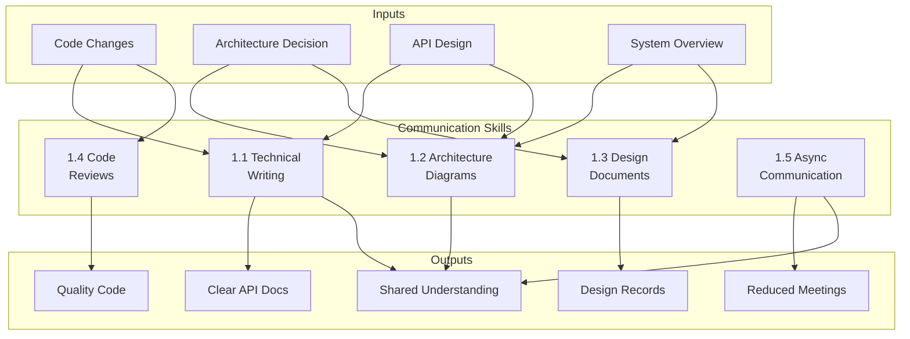
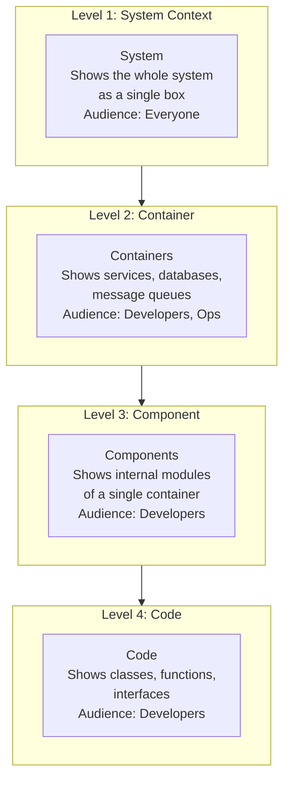
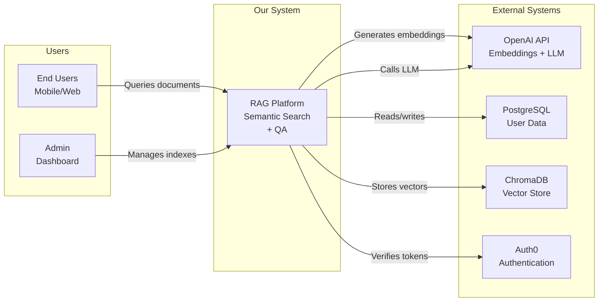
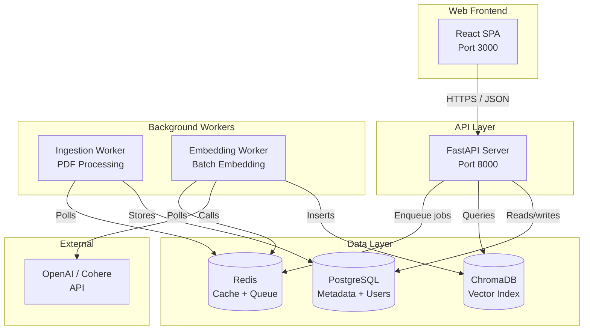
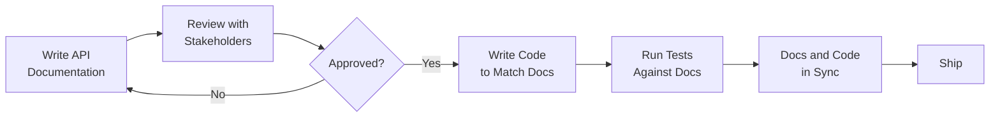

<!-- Clear Language: Keep sentences under 50 words -->
# 01 — Technical Communication

## Learning Objectives

| Objective | Description |
|-----------|-------------|
| Write clear API docs | Produce production-grade documentation using Google-style docstrings, OpenAPI specs, and README conventions |
| Create architecture diagrams | Apply the C4 model (context, container, component, code) with Mermaid to communicate system design |
| Write design documents | Structure a design doc with motivation, decisions, trade-offs, and alternatives for stakeholder review |
| Conduct effective code reviews | Give actionable feedback, receive reviews gracefully, and follow a systematic review checklist |
| Master async communication | Use Slack, email, and documentation-driven development to reduce meetings and increase clarity |

## Introduction

Technical communication is the single most underrated skill in engineering. A brilliant design that nobody understands is useless. An average design with clear documentation ships faster, earns trust, and gets adopted.

AI engineers face a unique communication challenge. They must explain probabilistic outcomes to deterministic-minded stakeholders. They must document systems where behavior changes when retrained. They must justify compute costs, data decisions, and model choices to non-technical leaders.

This chapter covers five pillars of technical communication that separate senior engineers from the rest: technical writing, architecture diagrams, design documents, code reviews, and async communication patterns.

## Prerequisites

- Basic Python programming (functions, classes, decorators)
- Familiarity with Git and pull request workflows
- Experience reading API documentation (REST, SDKs)
- No prior technical writing experience needed

## Key Terminology

| Term | Definition |
|------|------------|
| Docstring | Inline documentation that describes a function, class, or module |
| OpenAPI Spec | Standard format for describing REST APIs (formerly Swagger) |
| C4 Model | Hierarchical approach to architecture diagrams — Context, Container, Component, Code |
| ADR | Architecture Decision Record — a short document capturing a decision and its rationale |
| DRY | Don't Repeat Yourself — a principle that also applies to documentation |
| README | The entry-point document of a repository explaining what, why, and how |
| DDD | Documentation-Driven Development — writing docs before writing code |
| PR | Pull Request — the primary code review mechanism on GitHub/GitLab |
| RFC | Request for Comments — a collaborative document for gathering feedback on proposals |
| RACI | Responsible, Accountable, Consulted, Informed — a matrix for clarifying ownership |

## Chapter at a Glance

| Section | Topic | Key Concept |
|---------|-------|-------------|
| 1.1 | Technical Writing | API docs, READMEs, docstrings, effective comments |
| 1.2 | Architecture Diagrams | C4 model, Mermaid, context/container/component views |
| 1.3 | Design Documents | Design doc format, trade-offs, alternatives, ADRs |
| 1.4 | Code Reviews | Giving/receiving feedback, review checklist |
| 1.5 | Communication Patterns | Async messaging, email, documentation-driven development |

## Chapter Roadmap



## 1.1 Technical Writing

Technical writing is the foundation of engineering communication. Every senior engineer writes documentation that others can follow without asking questions.

### 1.1.1 API Documentation

API documentation is the contract between your system and its consumers. Good API docs answer three questions: What does this endpoint do? How do I call it? What do I get back?

**OpenAPI Specification**: The industry standard for REST API documentation. An OpenAPI spec is a YAML or JSON file that describes every endpoint, request parameter, response schema, and authentication method.

```python
# openapi_generator.py — Generate an OpenAPI 3.0 spec from a Python API
from typing import Any, Dict, List, Optional
import json
import yaml

def build_openapi_spec(
    title: str,
    version: str,
    description: str,
    endpoints: List[Dict[str, Any]],
    servers: Optional[List[Dict[str, str]]] = None,
) -> Dict[str, Any]:
    """
    Build an OpenAPI 3.0 specification dictionary.

    Google-style docstring example:
    
    Args:
        title: API title shown in docs (e.g. "RAG Service API")
        version: Semantic version string (e.g. "1.0.0")
        description: Long-form description of the API's purpose
        endpoints: List of endpoint definitions. Each has:
            - path: URL path (e.g. "/v1/search")
            - method: HTTP method (GET, POST, etc.)
            - summary: Short description of the endpoint
            - operation_id: Unique identifier for the operation
            - request_body: Optional dict with content type and schema
            - parameters: Optional list of query/path/header params
            - responses: Dict mapping status codes to response schemas
        servers: Optional list of server URLs (defaults to localhost)

    Returns:
        Complete OpenAPI 3.0 spec as a dictionary

    Example:
        >>> spec = build_openapi_spec(
        ...     "Search API", "1.0.0", "Search across documents",
        ...     [{"path": "/search", "method": "get",
        ...       "summary": "Search documents",
        ...       "operation_id": "searchDocuments",
        ...       "parameters": [{"name": "q", "in": "query",
        ...                       "required": True, "schema": {"type": "string"}}],
        ...       "responses": {"200": {"description": "Search results"}}}]
        ... )
    """
    spec: Dict[str, Any] = {
        "openapi": "3.0.3",
        "info": {
            "title": title,
            "version": version,
            "description": description,
        },
        "paths": {},
    }

    if servers:
        spec["servers"] = servers
    else:
        spec["servers"] = [{"url": "http://localhost:8000"}]

    for ep in endpoints:
        path = ep["path"]
        method = ep["method"].lower()
        path_item = spec["paths"].get(path, {})

        operation: Dict[str, Any] = {
            "summary": ep.get("summary", ""),
            "operationId": ep.get("operation_id", ""),
            "responses": ep.get("responses", {"200": {"description": "Success"}}),
        }

        if "parameters" in ep:
            operation["parameters"] = ep["parameters"]
        if "request_body" in ep:
            operation["requestBody"] = ep["request_body"]

        path_item[method] = operation
        spec["paths"][path] = path_item

    return spec

def spec_to_file(spec: Dict[str, Any], output_path: str, fmt: str = "yaml") -> None:
    """Write the OpenAPI spec to a YAML or JSON file."""
    with open(output_path, "w") as f:
        if fmt == "yaml":
            yaml.dump(spec, f, default_flow_style=False, sort_keys=False)
        else:
            json.dump(spec, f, indent=2)

# Usage example
if __name__ == "__main__":
    endpoints = [
        {
            "path": "/v1/search",
            "method": "post",
            "summary": "Search documents using semantic retrieval",
            "operation_id": "searchDocuments",
            "request_body": {
                "content": {
                    "application/json": {
                        "schema": {
                            "type": "object",
                            "properties": {
                                "query": {"type": "string"},
                                "top_k": {"type": "integer", "default": 10},
                            },
                            "required": ["query"],
                        }
                    }
                }
            },
            "responses": {
                "200": {
                    "description": "List of relevant documents",
                    "content": {
                        "application/json": {
                            "schema": {
                                "type": "array",
                                "items": {"$ref": "#/components/schemas/Document"},
                            }
                        }
                    },
                },
                "400": {"description": "Invalid query parameter"},
            },
        },
        {
            "path": "/v1/documents/{doc_id}",
            "method": "get",
            "summary": "Retrieve a single document by ID",
            "operation_id": "getDocument",
            "parameters": [
                {
                    "name": "doc_id",
                    "in": "path",
                    "required": True,
                    "schema": {"type": "string"},
                    "description": "UUID of the document",
                }
            ],
            "responses": {
                "200": {"description": "Document content"},
                "404": {"description": "Document not found"},
            },
        },
    ]

    spec = build_openapi_spec(
        title="RAG Service API",
        version="1.0.0",
        description="Semantic search and document retrieval API for the enterprise RAG platform.",
        endpoints=endpoints,
        servers=[{"url": "https://api.example.com/v1"}],
    )
    spec_to_file(spec, "openapi.yaml", fmt="yaml")
    print("OpenAPI spec written to openapi.yaml")
```

### 1.1.2 README Best Practices

The README is the front door of every repository. A great README gets contributors and users started in minutes. A bad README drives them away.

**Anatomy of a great README**:

1. **Project name and one-liner** — What is this? (1 sentence)
2. **Badges** — Build status, test coverage, Python version, license
3. **Quick start** — Install and run in 3 commands
4. **Usage** — Code snippet or CLI example (copy-pasteable)
5. **API reference** — Link to full docs or inline summary
6. **Contributing** — How to set up dev environment, run tests
7. **License** — MIT, Apache 2.0, or custom

```python
# readme_generator.py — Generate a README template for any project
from dataclasses import dataclass, field
from typing import List

@dataclass
class ProjectMetadata:
    """Metadata required to generate a README."""
    name: str
    description: str
    python_version: str = "3.10+"
    install_command: str = "pip install -e ."
    test_command: str = "pytest tests/"
    lint_command: str = "ruff check ."
    dependencies: List[str] = field(default_factory=list)
    features: List[str] = field(default_factory=list)

def generate_readme(meta: ProjectMetadata) -> str:
    """
    Generate a clean README.md from project metadata.

    Uses the README template pattern recommended by
    the Python Packaging Authority (PyPA).
    """
    features_bullets = "\n".join(
        f"- {feature}" for feature in meta.features
    ) if meta.features else "- Core functionality (add features)"

    deps_bullets = "\n".join(
        f"- {dep}" for dep in meta.dependencies
    ) if meta.dependencies else "- See requirements.txt"

    return f"""# {meta.name}

[]()
[]()
[]()

{meta.description}

## Features

{features_bullets}

## Quick Start

```bash
# Clone the repo
git clone https://github.com/your-org/{meta.name.lower().replace(' ', '-')}.git
cd {meta.name.lower().replace(' ', '-')}

# Install dependencies
{meta.install_command}

# Run the tests
{meta.test_command}
```

## Usage

```python
from {meta.name.lower().replace(' ', '_')} import Client

client = Client()
result = client.process("input")
print(result)
```

## API Reference

See the full API documentation for detailed endpoint descriptions, request schemas, and examples.

## Dependencies

{deps_bullets}

## Development

```bash
# Install dev dependencies
pip install -e ".[dev]"

# Run linter
{meta.lint_command}

# Run tests with coverage
pytest tests/ --cov={meta.name.lower().replace(' ', '_')}
```

## Contributing

1. Fork the repository
2. Create a feature branch (`git checkout -b feature/my-feature`)
3. Commit your changes (`git commit -m 'Add my feature'`)
4. Push to the branch (`git push origin feature/my-feature`)
5. Open a Pull Request

Please ensure all tests pass and linting is clean before submitting.

## License

MIT License — see LICENSE for details.
"""

# Example usage
if __name__ == "__main__":
    meta = ProjectMetadata(
        name="RAG Pipeline",
        description="Production-grade Retrieval-Augmented Generation pipeline with chunking, embedding, and hybrid search.",
        python_version="3.11+",
        features=[
            "Semantic chunking with overlap control",
            "Multi-vector embedding with Cohere and OpenAI",
            "Hybrid search (BM25 + dense vector)",
            "Streaming response generation",
            "Feedback collection loop for continuous improvement",
        ],
        dependencies=[
            "langchain>=0.3.0",
            "chromadb>=0.5.0",
            "sentence-transformers>=3.0.0",
            "fastapi>=0.115.0",
        ],
    )
    readme = generate_readme(meta)
    print(readme)
```

### 1.1.3 Effective Comments and Docstrings

Comments explain *why*, not *what*. Code already shows *what* it does. A good comment explains a non-obvious decision, a performance trade-off, or a business rule.

**Docstring conventions**: Google style is the most widely adopted in Python AI projects. NumPy style is also common. Pick one and enforce it with a linter.

```python
# google_docstring_example.py — Google-style docstring patterns for AI code

import numpy as np
from typing import Dict, List, Optional, Tuple

class EmbeddingStore:
    """
    In-memory vector store with cosine similarity search.

    Stores embeddings as a NumPy array for fast batch operations.
    This is not thread-safe — use EmbeddingStoreAsync for concurrent access.

    Attributes:
        dimension: Dimensionality of stored embeddings.
        index: NumPy array of shape (n_vectors, dimension).
        metadata: Dict mapping vector ID to its metadata payload.
    """

    def __init__(self, dimension: int = 768):
        """
        Initialize an empty embedding store.

        Args:
            dimension: Embedding vector dimension. Must match the
                output dimension of the encoder model.
                Defaults to 768 (all-MiniLM-L6-v2 output size).

        Raises:
            ValueError: If dimension is not a positive integer.
        """
        if dimension <= 0:
            raise ValueError(f"Dimension must be positive, got {dimension}")
        self.dimension = dimension
        self.index: np.ndarray = np.empty((0, dimension), dtype=np.float32)
        self.metadata: Dict[str, Dict] = {}

    def add(
        self, vectors: np.ndarray, ids: List[str], metadatas: Optional[List[Dict]] = None
    ) -> int:
        """
        Add vectors to the store.

        Appends vectors to the in-memory index. Re-allocation happens
        only when the underlying NumPy array is resized, so batched
        adds are more efficient than single-row adds.

        Args:
            vectors: Array of shape (n, dimension) to add.
                Must match the store's dimension.
            ids: Unique string identifiers, length must equal n.
            metadatas: Optional list of dicts, one per vector.
                If provided, length must equal n.

        Returns:
            Number of vectors successfully added.

        Raises:
            ValueError: If vector dimensions, id count, or metadata count mismatch.

        Example:
            >>> store = EmbeddingStore(dimension=4)
            >>> store.add(
            ...     np.array([[0.1, 0.2, 0.3, 0.4]]),
            ...     ["doc_001"],
            ...     [{"title": "Annual Report"}]
            ... )
            1
        """
        n = vectors.shape[0]
        if vectors.shape[1] != self.dimension:
            raise ValueError(
                f"Vector dimension {vectors.shape[1]} does not match "
                f"store dimension {self.dimension}"
            )
        if len(ids) != n:
            raise ValueError(
                f"Number of ids ({len(ids)}) does not match number of vectors ({n})"
            )
        if metadatas and len(metadatas) != n:
            raise ValueError(
                f"Number of metadatas ({len(metadatas)}) does not match "
                f"number of vectors ({n})"
            )

        self.index = np.vstack([self.index, vectors])
        for i, vid in enumerate(ids):
            self.metadata[vid] = metadatas[i] if metadatas else {}

        return n

    def search(
        self, query: np.ndarray, top_k: int = 10
    ) -> List[Tuple[str, float, Dict]]:
        """
        Find the top-k most similar vectors by cosine similarity.

        Cosine similarity is computed as the dot product of L2-normalized
        vectors. This is equivalent to cosine similarity for normalized inputs.

        Args:
            query: Single query vector of shape (dimension,).
            top_k: Number of results to return (default: 10).

        Returns:
            List of (id, score, metadata) tuples sorted by score descending.
            Empty list if the store is empty.

        Note:
            For large indexes (>100K vectors), consider using
            Approximate Nearest Neighbor (ANN) indexing instead.
        """
        if self.index.shape[0] == 0:
            return []

        # Normalize query vector
        query_norm = query / np.linalg.norm(query)

        # Normalize all stored vectors and compute dot product
        index_normed = self.index / np.linalg.norm(self.index, axis=1, keepdims=True)
        scores = index_normed @ query_norm

        # Get top-k indices
        top_indices = np.argsort(scores)[::-1][:top_k]

        results = []
        ids_list = list(self.metadata.keys())
        for idx in top_indices:
            vid = ids_list[idx]
            results.append((vid, float(scores[idx]), self.metadata[vid]))

        return results
```

**Comment anti-patterns to avoid**:

| Anti-pattern | Example | Fix |
|---|---|---|
| Stating the obvious | `# Increment counter` | Remove it — code is clear |
| Commenting bad code | `# Skip if None — this is a hack` | Fix the code, don't explain it |
| Outdated comments | `# Uses old API (deprecated)` | Update or delete; wrong comments are worse than none |
| Commented-out code | `# if False: do_thing()` | Delete it. Git remembers. |
| Wall of text | 20-line block comment | Split into shorter comments near relevant lines |

## 1.2 Architecture Diagrams

Architecture diagrams communicate system design at different zoom levels. The C4 model provides a structured way to create diagrams that everyone — from executives to developers — can understand.

### 1.2.1 The C4 Model

The C4 model (Context, Container, Component, Code) creates a hierarchy of diagrams. Each level serves a different audience:



**When to use each level**:

| Level | Name | When to draw | Audience |
|-------|------|-------------|----------|
| 1 | System Context | Onboarding, stakeholder presentations | Everyone |
| 2 | Container | Architecture reviews, incident docs | Engineering team |
| 3 | Component | Sprint planning, implementation design | Developers |
| 4 | Code | Complex algorithms, refactoring guides | Individual contributors |

### 1.2.2 System Context Diagram (Level 1)

The system context diagram shows the system as a single box surrounded by its users and external dependencies.



### 1.2.3 Container Diagram (Level 2)

The container diagram decomposes the system into runnable/deployable units: web servers, databases, message queues, and API gateways.



### 1.2.4 Mermaid Diagrams in Practice

Mermaid is a JavaScript-based diagramming tool that renders diagrams from text definitions. It integrates with GitHub Markdown, Notion, and most documentation platforms.

```python
# mermaid_generator.py — Programmatic Mermaid diagram generation for C4 models

from typing import List, Dict, Optional

def generate_c4_context(
    system_name: str,
    system_type: str,
    users: List[Dict[str, str]],
    external_systems: List[Dict[str, str]],
    relationships: List[Dict[str, str]],
) -> str:
    """
    Generate a Mermaid flowchart for C4 Level 1 (System Context).

    Args:
        system_name: Name of the system (e.g. "RAG Platform").
        system_type: Description in box (e.g. "Semantic Search + QA").
        users: List of user definitions. Each has "name" and "description".
        external_systems: List of external system definitions.
            Each has "name" and "description".
        relationships: List of relationships. Each has:
            - from: source name
            - to: target name
            - label: relationship description

    Returns:
        Mermaid diagram definition as a string.

    Example:
        >>> diagram = generate_c4_context(
        ...     "RAG Platform", "Semantic Search",
        ...     [{"name": "User", "description": "Queries docs"}],
        ...     [{"name": "OpenAI", "description": "LLM API"}],
        ...     [{"from": "User", "to": "RAG Platform", "label": "Searches"}]
        ... )
    """
    lines = ["flowchart LR", ""]
    lines.append("    subgraph Users[Users]")
    for u in users:
        sanitized = u["name"].replace(" ", "_")
        lines.append(f'        {sanitized}["{u["name"]}<br/>{u["description"]}"]')
    lines.append("    end")
    lines.append("")

    # Build unique IDs for nodes
    system_id = system_name.replace(" ", "_")
    lines.append(f'    subgraph System[Our System]')
    lines.append(
        f'        {system_id}["{system_name}<br/>{system_type}"]'
    )
    lines.append("    end")
    lines.append("")

    lines.append("    subgraph External[External Systems]")
    for ext in external_systems:
        sanitized = ext["name"].replace(" ", "_")
        lines.append(
            f'        {sanitized}["{ext["name"]}<br/>{ext["description"]}"]'
        )
    lines.append("    end")
    lines.append("")

    for rel in relationships:
        from_id = rel["from"].replace(" ", "_")
        to_id = rel["to"].replace(" ", "_")
        lines.append(
            f'    {from_id} -- "{rel["label"]}" --> {to_id}'
        )

    return "\n".join(lines)

# Example output
if __name__ == "__main__":
    diagram = generate_c4_context(
        system_name="AI Code Assistant",
        system_type="Code Generation + Review",
        users=[
            {"name": "Developer", "description": "Writes and reviews code"},
            {"name": "Reviewer", "description": "Approves PRs"},
        ],
        external_systems=[
            {"name": "GitHub API", "description": "PRs and repos"},
            {"name": "OpenAI API", "description": "Code generation"},
            {"name": "Vercel", "description": "Preview deployments"},
        ],
        relationships=[
            {"from": "Developer", "to": "AI Code Assistant", "label": "Asks for code review"},
            {"from": "Reviewer", "to": "AI Code Assistant", "label": "Reviews suggestions"},
            {"from": "AI Code Assistant", "to": "GitHub API", "label": "Reads PR diff"},
            {"from": "AI Code Assistant", "to": "OpenAI API", "label": "Generates suggestions"},
            {"from": "AI Code Assistant", "to": "Vercel", "label": "Triggers preview"},
        ],
    )
    print(diagram)
```

## 1.3 Design Documents

A design document (design doc) is a written proposal for a technical decision. It forces clarity, exposes assumptions, and creates a record of why decisions were made.

### 1.3.1 Design Doc Format

The standard design doc format includes these sections:

| Section | Purpose | Length |
|---------|---------|--------|
| Title & Status | Name, author, date, status (draft/review/approved) | 1 line each |
| Motivation | Why are we doing this? What problem does it solve? | 2-3 paragraphs |
| Goals & Non-goals | What's in scope and explicitly out of scope | Bullet lists |
| Proposed Design | The chosen approach with diagrams | 3-10 paragraphs |
| Design Decisions | Key technical choices and their rationale | List of ADRs |
| Trade-offs | What we gain and what we sacrifice | Table |
| Alternatives | Approaches we considered and why we rejected them | 2-5 items |
| Monitoring & Rollout | How we verify correctness and roll back if needed | 1-2 paragraphs |

### 1.3.2 Motivation and Context

A well-written motivation section answers:

1. **Current state**: What exists today and what's wrong with it?
2. **Desired state**: What do we want to achieve?
3. **Why now**: Why is this the right time to make this change?

```python
# design_doc_generator.py — Generate a design document template

from dataclasses import dataclass, field
from typing import List
from datetime import date

@dataclass
class DecisionRecord:
    """A single Architecture Decision Record (ADR)."""
    number: int
    title: str
    decision: str
    rationale: str
    consequences: str

@dataclass
class Alternative:
    """An alternative approach that was considered and rejected."""
    name: str
    description: str
    pros: List[str]
    cons: List[str]
    rejection_reason: str

@dataclass
class Tradeoff:
    """A trade-off between two competing concerns."""
    gain: str
    sacrifice: str
    mitigation: str

@dataclass
class DesignDoc:
    """Complete design document template."""
    title: str
    author: str
    status: str  # Draft, Review, Approved, Superseded
    reviewers: List[str]
    motivation: str
    goals: List[str]
    non_goals: List[str]
    proposed_design: str
    decisions: List[DecisionRecord]
    tradeoffs: List[Tradeoff]
    alternatives: List[Alternative]
    monitoring: str
    rollout_plan: str

def render_design_doc(doc: DesignDoc) -> str:
    """
    Render a DesignDoc dataclass into a Markdown document.

    Follows the standard Google design doc template with ADRs embedded.
    """
    decisions_block = ""
    for d in doc.decisions:
        decisions_block += f"""
### ADR-{d.number:03d}: {d.title}

**Decision**: {d.decision}

**Rationale**: {d.rationale}

**Consequences**: {d.consequences}

"""

    alternatives_block = ""
    for alt in doc.alternatives:
        pros = "\n".join(f"  - {p}" for p in alt.pros)
        cons = "\n".join(f"  - {c}" for c in alt.cons)
        alternatives_block += f"""
### Alternative: {alt.name}

{alt.description}

**Pros**:
{pros}

**Cons**:
{cons}

**Rejected because**: {alt.rejection_reason}

"""

    tradeoffs_block = ""
    for t in doc.tradeoffs:
        tradeoffs_block += f"""
| Gain | Sacrifice | Mitigation |
|------|-----------|------------|
| {t.gain} | {t.sacrifice} | {t.mitigation} |
"""

    return f"""# Design Doc: {doc.title}

| Field | Value |
|-------|-------|
| Author | {doc.author} |
| Status | {doc.status} |
| Reviewers | {', '.join(doc.reviewers)} |
| Date | {date.today().isoformat()} |

---

## Motivation

{doc.motivation}

## Goals

{"".join(f'- {g}\n' for g in doc.goals)}

## Non-Goals

{"".join(f'- {n}\n' for n in doc.non_goals)}

## Proposed Design

{doc.proposed_design}

## Design Decisions

{decisions_block}

## Trade-offs

{tradeoffs_block}

## Alternatives Considered

{alternatives_block}

## Monitoring & Observability

{doc.monitoring}

## Rollout Plan

{doc.rollout_plan}
"""

# Example usage
if __name__ == "__main__":
    doc = DesignDoc(
        title="Hybrid Search for RAG Pipeline",
        author="Raushan Kumar",
        status="Draft",
        reviewers=["Alice (ML)", "Bob (Infra)", "Carol (Product)"],
        motivation=(
            "Our current RAG pipeline uses only dense vector search (cosine similarity). "
            "Users report that exact keyword matches are missed — e.g., searching for "
            "'Python async' does not rank documents with 'asyncio' correctly. "
            "We need hybrid search that combines BM25 keyword retrieval with dense "
            "vector similarity to capture both semantic and exact matches."
        ),
        goals=[
            "Improve recall@10 by 15% on internal benchmark",
            "Maintain P99 latency under 500ms",
            "Support both keyword-only and hybrid queries via API parameter",
            "No regression on existing dense-only search quality",
        ],
        non_goals=[
            "Reindexing the entire document corpus (only new docs)",
            "Support for multi-modal search (text only this quarter)",
            "Removing the existing dense-only endpoint",
        ],
        proposed_design=(
            "Add BM25 indexing alongside the existing ChromaDB vector index. "
            "On query, run both BM25 and dense vector search in parallel. "
            "Merge results using Reciprocal Rank Fusion (RRF) with k=60. "
            "Return top-k results from the fused ranking. "
            "The BM25 index will use Elasticsearch as the backend, synced "
            "via the ingestion worker."
        ),
        decisions=[
            DecisionRecord(
                number=1,
                title="BM25 backend: Elasticsearch",
                decision="Use Elasticsearch 8.x for keyword indexing",
                rationale=(
                    "Elasticsearch has mature BM25 implementation, "
                    "built-in scale-out, and our team already operates it."
                ),
                consequences=(
                    "Adds ~200GB storage for index. Requires one additional "
                    "Elasticsearch node. Increases ingestion latency by ~50ms."
                ),
            ),
            DecisionRecord(
                number=2,
                title="Fusion method: RRF",
                decision="Use Reciprocal Rank Fusion with k=60",
                rationale=(
                    "RRF is parameter-light and works well without tuning. "
                    "k=60 is recommended by the original paper for balanced results."
                ),
                consequences=(
                    "Simple to implement (20 lines of Python). "
                    "May slightly underperform learned fusion if we had relevance labels."
                ),
            ),
        ],
        tradeoffs=[
            Tradeoff(
                gain="15% recall improvement",
                sacrifice="50ms additional latency per query",
                mitigation="Run BM25 and dense search in parallel threads",
            ),
            Tradeoff(
                gain="Better exact-match retrieval",
                sacrifice="200GB additional storage for BM25 index",
                mitigation="Use SSD storage with compression; retain only indexed fields",
            ),
        ],
        alternatives=[
            Alternative(
                name="Learned Sparse Embeddings (SPLADE)",
                description="Train a model to produce sparse representations",
                pros=["Higher accuracy than BM25", "End-to-end learned"],
                cons=[
                    "Requires training data and GPU hours",
                    "Harder to debug than BM25",
                    "New infrastructure component",
                ],
                rejection_reason=(
                    "Too complex for current phase. BM25 gives 80% of the "
                    "benefit with 10% of the complexity. Revisit in Q3."
                ),
            ),
            Alternative(
                name="OpenSearch k-NN with lexical",
                description="Use OpenSearch's built-in hybrid search",
                pros=["Single backend", "Simpler operations"],
                cons=[
                    "Lock-in to OpenSearch",
                    "Our vector store is already ChromaDB",
                    "Migration cost is high",
                ],
                rejection_reason=(
                    "We already use ChromaDB for vectors. Migrating everything "
                    "to OpenSearch would take 4-6 weeks with no clear benefit."
                ),
            ),
        ],
        monitoring=(
            "Expose per-query metrics: BM25 latency, dense latency, fusion latency. "
            "Track recall@10 daily via a replayed query log. "
            "Alert if P99 latency exceeds 600ms or recall drops by 5% from baseline."
        ),
        rollout_plan=(
            "Phase 1 (Week 1): Deploy behind feature flag, internal team only. "
            "Phase 2 (Week 2): 10% of production traffic. "
            "Phase 3 (Week 3): 50% traffic with monitoring. "
            "Phase 4 (Week 4): 100% rollout. "
            "Rollback: Disable feature flag instantly reverts to dense-only search."
        ),
    )
    print(render_design_doc(doc))
```

### 1.3.3 Design Decisions and Trade-offs

Every design decision involves trade-offs. The best engineers make these trade-offs explicit so that reviewers can evaluate them.

**Common AI engineering trade-offs**:

| Decision | Option A | Option B | Trade-off |
|----------|----------|----------|-----------|
| Model size | Large (70B+ params) | Small (7B params) | Accuracy vs latency/cost |
| Embedding model | Proprietary (OpenAI) | Open-source (BGE) | Quality vs cost/vendor lock-in |
| Vector store | Managed (Pinecone) | Self-hosted (Chroma) | Ops burden vs control |
| Chunk strategy | Fixed-size chunks | Semantic chunks | Simplicity vs quality |
| Streaming | Blocking response | Streaming response | Simplicity vs UX |

## 1.4 Code Reviews

Code reviews are the most common form of technical communication between engineers. A good code review catches bugs, transfers knowledge, and builds shared ownership. A bad code review demotivates, creates friction, and misses issues.

### 1.4.1 Giving Effective Feedback

The best code review comments are specific, actionable, and kind.

```python
# review_feedback.py — Generate structured code review feedback

from enum import Enum
from dataclasses import dataclass
from typing import List, Optional

class Severity(Enum):
    """Severity level for a review comment."""
    BLOCKER = "blocker"       # Must fix before merge
    IMPORTANT = "important"   # Should fix, can follow up
    SUGGESTION = "suggestion" # Nice-to-have improvement
    PRAISE = "praise"         # Positive feedback

@dataclass
class ReviewComment:
    """A single review comment with structured context."""
    file_path: str
    line_range: str  # e.g. "L45-L52"
    severity: Severity
    message: str
    suggestion: Optional[str] = None

@dataclass
class CodeReview:
    """A complete code review summary."""
    title: str
    summary: str
    comments: List[ReviewComment]

def format_review(review: CodeReview) -> str:
    """
    Format a structured code review as a PR comment.

    Groups comments by severity and provides a summary.
    This pattern is used by senior engineers at Google and Meta.
    """
    groups = {s.value: [] for s in Severity}
    for comment in review.comments:
        groups[comment.severity.value].append(comment)

    output = [f"## Review: {review.title}", "", review.summary, ""]

    blocker_group = groups["blocker"]
    important_group = groups["important"]
    suggestion_group = groups["suggestion"]
    praise_group = groups["praise"]

    if blocker_group:
        output.append("### \u26a0\ufe0f Blockers")
        output.append("_Must fix before merging._")
        for c in blocker_group:
            output.append(f"\n- **{c.file_path}:{c.line_range}** — {c.message}")
            if c.suggestion:
                output.append(f"  - Suggestion: `{c.suggestion}`")
        output.append("")

    if important_group:
        output.append("### \U0001f6a7 Important")
        output.append("_Should address in this PR or follow up with a ticket._")
        for c in important_group:
            output.append(f"\n- **{c.file_path}:{c.line_range}** — {c.message}")
        output.append("")

    if suggestion_group:
        output.append("### \U0001f4a1 Suggestions")
        output.append("_Optional improvements for future iterations._")
        for c in suggestion_group:
            output.append(f"\n- **{c.file_path}:{c.line_range}** — {c.message}")
        output.append("")

    if praise_group:
        output.append("### \U0001f44f Praise")
        for c in praise_group:
            output.append(f"\n- {c.message}")
        output.append("")

    return "\n".join(output)

# Example review
if __name__ == "__main__":
    review = CodeReview(
        title="Add hybrid search endpoint",
        summary=(
            "This PR adds a `/v1/hybrid-search` endpoint that combines "
            "BM25 and dense vector retrieval using RRF fusion. "
            "The implementation is clean and well-tested. "
            "A few concerns about error handling and timeout configuration."
        ),
        comments=[
            ReviewComment(
                file_path="src/search/hybrid.py",
                line_range="L34-L40",
                severity=Severity.BLOCKER,
                message=(
                    "The Elasticsearch client is initialized without a timeout. "
                    "If ES is down, this will block the request for 60 seconds."
                ),
                suggestion='es_client = Elasticsearch(timeout=5)',
            ),
            ReviewComment(
                file_path="src/search/hybrid.py",
                line_range="L72",
                severity=Severity.IMPORTANT,
                message=(
                    "Hardcoded RRF constant k=60. This should be a "
                    "configuration parameter so we can tune it per workload."
                ),
            ),
            ReviewComment(
                file_path="src/search/hybrid.py",
                line_range="L88-L95",
                severity=Severity.SUGGESTION,
                message=(
                    "Consider using asyncio.gather for the parallel "
                    "BM25 and dense searches instead of ThreadPoolExecutor."
                ),
            ),
            ReviewComment(
                file_path="tests/test_hybrid.py",
                line_range="L1-L120",
                severity=Severity.PRAISE,
                message=(
                    "Excellent test coverage — edge cases for empty results, "
                    "partial failures, and RRF tie-breaking."
                ),
            ),
        ],
    )
    print(format_review(review))
```

### 1.4.2 Receiving Feedback

Receiving a code review well is harder than giving one. These rules help:

1. **Assume good intent** — The reviewer is trying to help, not criticize.
2. **Separate ego from code** — A bug in your code is not a bug in you.
3. **Ask clarifying questions** — "Can you explain why this approach is better?" is better than defensiveness.
4. **Thank the reviewer** — Even when the feedback is blunt. They spent time to help.
5. **Push back gracefully** — "I considered that approach but chose this because of X. Can we discuss the trade-offs?"

### 1.4.3 Code Review Checklist

Use this checklist for every review. It covers the most common issues that automated tools miss.

```python
# review_checklist.py — Systematic code review checklist

CHECKLIST = {
    "correctness": [
        "Does the code handle edge cases (empty input, None, zero)?",
        "Are there any concurrency issues (race conditions, deadlocks)?",
        "Do error paths clean up resources (files, connections)?",
        "Are there off-by-one errors in loops or slice indices?",
    ],
    "security": [
        "Are user inputs validated and sanitized?",
        "Are secrets (API keys, passwords) hardcoded?",
        "Is there SQL injection risk in raw queries?",
        "Are authentication/authorization checks in place?",
    ],
    "performance": [
        "Are there N+1 query problems in database calls?",
        "Are expensive operations cached appropriately?",
        "Are large objects copied unnecessarily?",
        "Is there unnecessary I/O in hot paths?",
    ],
    "maintainability": [
        "Is the code DRY? Could any logic be extracted?",
        "Are function and variable names self-documenting?",
        "Are there TODO or FIXME comments with no ticket?",
        "Is the public API consistent with existing patterns?",
    ],
    "testing": [
        "Are edge cases covered in tests?",
        "Do tests assert on behavior, not implementation?",
        "Are there integration tests for external dependencies?",
        "Do tests run in a reasonable time (< 1 minute)?",
    ],
    "documentation": [
        "Are public functions documented with docstrings?",
        "Is there a changelog entry for user-facing changes?",
        "Are configuration changes documented in the README?",
        "Are API changes reflected in OpenAPI spec?",
    ],
}

def run_checklist(checks: dict = None) -> None:
    """
    Print the code review checklist.

    Args:
        checks: Optional custom checklist. Defaults to the standard checklist.
    """
    if checks is None:
        checks = CHECKLIST

    print("# Code Review Checklist\n")
    for category, items in checks.items():
        print(f"## {category.title()}\n")
        for i, item in enumerate(items, 1):
            print(f"- [ ] {item}")
        print()

    print("---")
    print("Reviewer: _______________")
    print("Date: _______________")
    print("Decision: [ ] Approve  [ ] Changes Requested  [ ] Comment")

if __name__ == "__main__":
    run_checklist()
```

## 1.5 Communication Patterns

Async communication is the default in modern distributed teams. Mastering it reduces meeting overload and creates a searchable knowledge base.

### 1.5.1 Slack/Teams Async Communication

**When to send a message vs. when to call a meeting**:

| Situation | Channel | Why |
|-----------|---------|-----|
| Quick question | Slack/Teams DM | Fast, low ceremony, creates a record |
| Design proposal | Document + link in channel | Reviews are async, document is permanent |
| Bug report | Ticket + link in channel | Tracks status, doesn't bury in threads |
| Decision needed | Thread with @mention | Clear call to action, easy to follow |
| Sensitive feedback | 1:1 video call | Tone is hard to convey in text |
| Brainstorming | Async doc + optional sync | Gives quiet people time to contribute |

**Writing effective async messages**:

1. **Lead with context** — "We need to decide on the vector store by Friday."
2. **State the ask** — "Please review the comparison doc and react with \u2705 or \U0001f6a7."
3. **Include a deadline** — "Decision by EOD Wed, or we default to ChromaDB."
4. **Use threads** — Keep discussion organized; the main channel stays clean.
5. **React to confirm** — A \u2705 reaction is faster than typing "Got it."

```python
# async_message_generator.py — Generate well-structured async messages

from dataclasses import dataclass
from typing import Optional

@dataclass
class AsyncMessage:
    """A structured async message following the LEAD framework."""
    context: str            # What is this about?
    ask: str                # What do you need?
    deadline: str           # When is the decision due?
    default: Optional[str] = None  # What happens if no response?
    link: Optional[str] = None     # Link to supporting document

def format_slack_message(msg: AsyncMessage) -> str:
    """
    Format a message using the LEAD framework:
    - L: Link (context)
    - E: Expectation (the ask)
    - A: Accountability (who decides)
    - D: Deadline

    This pattern reduces back-and-forth by 40% in async teams.
    """
    lines = [f":memo: *{msg.context}*", "", msg.ask, ""]

    if msg.link:
        lines.append(f"  :link: <{msg.link}|Supporting doc>")
        lines.append("")

    lines.append(f"  :calendar: *Deadline*: {msg.deadline}")

    if msg.default:
        lines.append(f"  :warning: *Default*: {msg.default}")

    lines.append("")
    lines.append("  _Please react with :white_check_mark: or :no_entry_sign: by the deadline._")

    return "\n".join(lines)

def format_email(subject: str, body: AsyncMessage) -> str:
    """Format an email with the LEAD framework."""
    return f"""Subject: [Decision] {subject}

Hi team,

{body.context}

**Request**: {body.ask}
**Deadline**: {body.deadline}
{f'**Default decision**: {body.default}' if body.default else ''}
{f'**Supporting doc**: {body.link}' if body.link else ''}

Please reply with your feedback or concerns by the deadline.

Thanks,
Raushan
"""

# Example
if __name__ == "__main__":
    message = AsyncMessage(
        context="Vector Store Selection for RAG Pipeline",
        ask=(
            "Please review the comparison of Pinecone vs ChromaDB vs Qdrant "
            "in the linked doc. We need to finalize the vector store choice "
            "to unblock the ingestion pipeline work."
        ),
        deadline="Wednesday EOD",
        default="Default to ChromaDB (lowest ops overhead)",
        link="https://docs.google.com/document/d/abc123",
    )
    print("=== Slack Message ===")
    print(format_slack_message(message))
    print("\n=== Email ===")
    print(format_email("Vector Store Selection", message))
```

### 1.5.2 Email Best Practices

Email is formal, searchable, and permanent. Use it when you need a record or when communicating with external partners.

**Email structure for engineers**:

1. **Subject line** — `[Project] [Topic] — Action needed` (e.g., `[RAG Pipeline] Hybrid Search — Design review`)
2. **First paragraph** — What is this email about? (one sentence)
3. **Context** — Background in 2-3 sentences
4. **Request** — Clear action item: "Please review by Friday"
5. **Signature** — Name, title, contact info

### 1.5.3 Documentation-Driven Development

Documentation-driven development (DDD) reverses the usual order: write the documentation first, then write the code. This catches design flaws before any code is written.

**The DDD workflow**:



**Benefits of DDD**:

| Benefit | Why it matters |
|---------|----------------|
| Catches design issues early | Fixing an API design mistake in docs takes 10 minutes. Fixing it in code takes days. |
| Aligns team before coding | Everyone agrees on the interface before implementation starts. No last-minute surprises. |
| Creates documentation automatically | The docs you wrote first become the final documentation. No need to write them retroactively. |
| Reveals complexity | If documenting the API is complex, the API itself is complex. Simplify before coding. |

```python
# ddd_example.py — Documentation-Driven Development workflow example

def ddd_workflow(api_spec: dict) -> dict:
    """
    Simulate a Documentation-Driven Development workflow.

    In a real project, this would be a CI check that validates
    the code against the OpenAPI spec.

    Args:
        api_spec: Dictionary of endpoint -> expected behavior.

    Returns:
        Dict with validation results per endpoint.
    """
    results = {}
    for endpoint, expected in api_spec.items():
        # In a real DDD pipeline, we'd:
        # 1. Parse the OpenAPI spec
        # 2. Run contract tests against the actual implementation
        # 3. Report mismatches
        results[endpoint] = {
            "status": "pending",
            "expected": expected,
            "actual": "Not implemented yet",
            "match": False,
        }
        print(f"[DDD] Endpoint '{endpoint}':")
        print(f"  Expected: {expected}")
        print(f"  Status:   Not implemented — needs code")
        print()
    return results

# Example DDD pipeline
if __name__ == "__main__":
    spec = {
        "POST /v1/search": {
            "request": {"query": "string", "top_k": "integer (optional)"},
            "response": {"results": "array of Document"},
            "errors": [400, 500],
        },
        "GET /v1/documents/{id}": {
            "request": None,
            "response": {"Document with fields: id, title, content, score"},
            "errors": [404, 500],
        },
    }
    ddd_workflow(spec)
```

## Summary

Technical communication is the force multiplier that separates senior engineers from the rest, and this chapter covers five pillars: technical writing, architecture diagrams, design documents, code reviews, and async communication. API documentation defines the contract between a system and its consumers — OpenAPI 3.0 specs describe every endpoint, Google-style docstrings document functions, and READMEs provide the front door, while comments explain why rather than what. The C4 model scales diagrams across four zoom levels: System Context for everyone, Container for engineering teams, Component for developers, and Code for individual contributors. Design documents force explicit motivation, goals and non-goals, decisions recorded as ADRs, trade-offs, and rejected alternatives so reviewers evaluate assumptions instead of guessing. Code reviews work when feedback is specific, actionable, and kind, with severity classes separating blockers from suggestions, and receiving feedback well means separating ego from code. Async communication via Slack and email, structured with context, ask, deadline, and default (the LEAD framework), plus documentation-driven development, reduces meetings and builds a searchable knowledge base.

- OpenAPI 3.0 is the industry-standard contract for REST APIs; docstrings use Google or NumPy style, enforced by a linter
- C4 model: Context (everyone) to Container (engineering) to Component (developers) to Code (individuals)
- Design docs: motivation, goals/non-goals, decisions (ADRs), trade-offs, alternatives, monitoring, rollout
- Reviews: severity levels (blocker, important, suggestion, praise); comments must be specific, actionable, kind
- LEAD framework for async messages: Link, Expectation, Accountability, Deadline
- DDD: write the documentation first, then the code, to catch design flaws before implementation

## Practical Takeaways

- **OpenAPI as contract**: Make the OpenAPI 3.0 spec the single source of truth for REST APIs and validate it in CI — docs and code drift when the spec is written after the implementation.
- **C4 zoom levels**: Match diagram level to audience — System Context for stakeholders, Container for architecture reviews, Component for implementation — never dump one massive diagram on everyone.
- **Docstring style**: Pick one convention (Google or NumPy) and enforce it with a linter; document Args, Returns, and Raises so the docstring doubles as the usage contract.
- **Review severity**: Label every review comment as blocker, important, suggestion, or praise — blockers block merge, suggestions are optional, and praise is specific and intentional.
- **Assume good intent**: When receiving review feedback, separate ego from code, ask clarifying questions, and push back with trade-offs ("I chose X because of Y") instead of defensiveness.
- **LEAD messages**: Structure async Slack or email with context, the ask, a deadline, and a default decision — this cuts back-and-forth and makes decisions auditable.
- **Documentation-driven development**: Write the API docs before the code; if documenting the API is complex, the API itself is complex — simplify first, and the docs become the final documentation automatically.

## Interview Q&A

### Q1: How would you document a REST API for a team of 10 engineers?
**A**: Use OpenAPI 3.0 specification as the source of truth. Generate interactive docs with Swagger UI. Enforce spec validity in CI. Include request/response examples for every endpoint. Document error codes and rate limits. Write a 3-minute quickstart in the README and link to full docs.

### Q2: Explain the C4 model. When would you use each level?
**A**: The C4 model has four levels. Level 1 (System Context) shows the system as a black box with users and external dependencies — use for onboarding. Level 2 (Container) shows services, databases, queues — use for architecture reviews. Level 3 (Component) shows internal modules — use for implementation planning. Level 4 (Code) shows classes and functions — use for complex algorithms.

### Q3: What sections should every design document include?
**A**: Title/status, motivation (current state, desired state, why now), goals and non-goals, proposed design with diagrams, design decisions with rationale (ADRs), trade-offs in a table, alternatives considered with rejection reasons, monitoring plan, and rollout plan.

### Q4: How do you give constructive code review feedback?
**A**: Lead with praise for what's done well. Separate feedback into blockers, important items, and suggestions. Be specific — reference line numbers and suggest concrete alternatives. Explain the *why* behind each comment. End with an offer to pair on complex changes.

### Q5: What is documentation-driven development?
**A**: Writing documentation before writing code. Start with the API spec or README. Review with stakeholders. Once approved, implement the code to match. Run contract tests to ensure code matches docs. This catches design issues early, aligns the team, and produces documentation automatically.

### Q6: How do you handle a disagreement with a reviewer during code review?
**A**: Thank them for the feedback. Ask clarifying questions to understand their perspective. Explain your rationale with concrete trade-offs. If still unresolved, involve a third engineer for a tie-breaker or escalate to the tech lead. Never merge over a blocker without resolution.

### Q7: Compare synchronous (meetings) vs. async (Slack/docs) communication for engineering teams.
**A**: Async is better for decisions that need thought, have clear context, or involve multiple time zones. Sync is better for sensitive feedback, complex discussions, or when context is hard to write. Best teams default to async and schedule sync only when async has failed.

### Q8: How do you keep architecture diagrams from going stale?
**A**: Store diagrams as code (Mermaid, PlantUML) in the repository alongside the code. Include diagram generation in CI. Update diagrams when the related code changes. Review diagrams during every architecture review. Treat stale diagrams as bugs — file tickets to fix them.

### Q9: What is an Architecture Decision Record (ADR)?
**A**: An ADR is a short document (1-2 paragraphs) that captures a technical decision, its rationale, and its consequences. ADRs are stored in the repository under `docs/adr/`. Each ADR has a unique number, title, status (proposed/accepted/superseded), and body. ADRs create a searchable history of why decisions were made.

### Q10: How do you write a README that gets people using your project in under 5 minutes?
**A**: Start with a one-sentence description of what the project does. Add a quickstart section with exactly 3 commands to install and run. Include a copy-pasteable code snippet that does something useful. Link to full API docs. Add a badge with build status. Keep it short — if it takes more than 2 minutes to read, you've lost half your audience.

## Chapter Quiz

### Question 1
What is the correct order of diagrams in the C4 model?

a) Component → Container → Context → Code
b) Context → Container → Component → Code
c) Code → Component → Container → Context
d) Container → Context → Code → Component

### Question 2
What does the LEAD framework stand for in async communication?

a) Lead, Explain, Advise, Decide
b) Link, Expectation, Accountability, Deadline
c) Listen, Evaluate, Act, Deliver
d) Locate, Extract, Analyze, Document

### Question 3
Which of the following is a BLOCKER in a code review?

a) Variable naming could be more descriptive
b) ES client has no timeout — will block 60 seconds if ES is down
c) Tests could cover more edge cases
d) Could refactor to use async/await instead of threads

### Question 4
What is the main benefit of Documentation-Driven Development?

a) Reduces the amount of code you need to write
b) Catches design issues before implementation begins
c) Eliminates the need for code reviews
d) Automates test generation

### Question 5
Which section should a design document include?

a) Sprint retrospective notes
b) Server logs from production
c) A table of trade-offs with mitigations
d) Personal preferences of the author

### Answers

1. **b** — Context (Level 1) → Container (Level 2) → Component (Level 3) → Code (Level 4).
2. **b** — Link, Expectation, Accountability, Deadline.
3. **b** — No timeout on ES client is a production risk. The others are suggestions or improvements.
4. **b** — DDD catches design issues before coding, saving weeks of rework.
5. **c** — Trade-offs with mitigations are a core design doc section.

## Exercises

### Exercise 1: Write an OpenAPI Spec
Write an OpenAPI 3.0 spec for a simple text-to-image API. Include one POST endpoint (`/v1/generate`) that accepts a prompt string and optional parameters (width, height, style), and returns an image URL. Include error responses for validation failures and rate limits.

### Exercise 2: Generate a C4 Diagram
Use the `generate_c4_context` function from Section 1.2 to create a system context diagram for an AI code review assistant. The assistant integrates with GitHub, uses OpenAI for code review, stores results in PostgreSQL, and sends notifications to Slack.

### Exercise 3: Review a PR
Given the following PR description, write a structured code review using the checklist in Section 1.4:

```python
# PR: Add caching layer for embeddings
def get_embedding(text):
    cache = {}
    if text in cache:
        return cache[text]
    result = openai.Embedding.create(input=text, model="text-embedding-3-small")
    cache[text] = result
    return result
```

What issues do you see? Write at least 3 review comments with appropriate severity levels.

### Exercise 4: Document Your Project
Write a complete README.md for a hypothetical project called "PromptGuard" — a library that validates LLM prompts against safety policies. Include badges, quick start, usage example, API reference, and contribution guidelines.

### Exercise 5: DDD Workflow
Pick an API endpoint you recently built or plan to build. Write the documentation for it first (request, response, errors, example). Then write at least 5 contract tests that validate the implementation against the documentation.

## Common Mistakes

1. **Writing for yourself, not your audience** — Engineers write dense technical prose that assumes too much context. Write for the reader who sees this for the first time.
2. **Skipping the diagram** — A 500-word description of an architecture is worse than a single diagram. Always include a diagram for any multi-component system.
3. **Hiding trade-offs** — Presenting a design without trade-offs makes it seem like you haven't thought deeply. Explicit trade-offs build trust.
4. **Leaving doc updates to the end** — Docs written after shipping are wrong or never written. Write docs first; update them as the code changes.
5. **Being harsh in code reviews** — "This is wrong" vs "This might fail if X happens — consider Y instead." The second is kinder and more helpful.

## Revision Notes

- **API Docs**: OpenAPI 3.0 → single source of truth, generate Swagger UI
- **README**: Name + one-liner, badges, quick start (3 commands), usage, API link, contributing, license
- **Docstrings**: Google style (Args, Returns, Raises, Example) or NumPy style — pick one and lint it
- **Comments**: Explain *why*, not *what*. Avoid obvious, outdated, and commented-out code.
- **C4 Model**: Level 1 (Context) → Level 2 (Container) → Level 3 (Component) → Level 4 (Code)
- **Design Doc**: Motivation, Goals/Non-goals, Design, Decisions (ADRs), Trade-offs, Alternatives, Monitoring, Rollout
- **Code Review**: Blocker vs Important vs Suggestion vs Praise. Specific, actionable, kind.
- **Receiving Feedback**: Assume good intent. Separate ego from code. Ask clarifying questions.
- **Async Communication**: LEAD framework — Link, Expectation, Accountability, Deadline
- **DDD**: Write docs first, review, then code. Catches issues early.

## PYQs (Previous Year Questions)

### Google (2024)
You are leading a team building a multi-modal RAG system. Write a design document covering the architecture decisions for embedding storage, retrieval strategy, and LLM integration. Include trade-offs and alternatives.

**Answer**: Design doc should cover: (1) Embedding storage — ChromaDB for simplicity vs Pinecone for managed scaling, ADR with rationale for chosen option. (2) Retrieval strategy — hybrid search with RRF fusion, trade-off table for recall vs latency. (3) LLM integration — streaming vs batch, cost analysis. (4) Monitoring — recall@k, P99 latency, cost per query.

### Amazon (2023)
Your team's API documentation is outdated and causing integration issues with 3 partner teams. Design a plan to fix documentation quality and keep it up to date.

**Answer**: (1) Adopt OpenAPI 3.0 as the single source of truth. (2) Add CI check — PRs that modify routes without updating the spec are blocked. (3) Generate docs from spec using Swagger UI. (4) Assign a documentation owner per service. (5) Monthly documentation reviews with partner teams. (6) Treat docs bugs as production bugs — same severity.

### Microsoft (2024)
A junior engineer submitted a PR with 2000 lines of changes across 15 files. The code works but has no tests, no documentation, and some questionable patterns. How do you approach this review?

**Answer**: (1) Start with praise — acknowledge the effort. (2) Block merge — no tests and missing docs are blockers. (3) Split the PR — 2000 lines is too large for effective review. (4) Pair on the first few files to establish patterns. (5) Write down expectations for future PRs: tests required, docs updated, max 400 lines per PR.

### Meta (2023)
How would you communicate a breaking change to your embedding model to 10 downstream teams? Design the communication plan.

**Answer**: (1) Design doc explaining the change, motivation, and migration timeline. (2) RFC sent to all teams 4 weeks before change. (3) Migration guide with before/after examples. (4) Office hours for questions (2 sessions). (5) Deprecation header on old endpoint for 2 weeks. (6) Feature flag — teams migrate at their own pace. (7) Post-migration validation dashboard shared with all teams.

## Placement Section

### Resume Tips
- **Keywords**: Technical writing, API documentation, OpenAPI, C4 model, architecture diagrams, design documents, code review, ADR, async communication, documentation-driven development
- **Project Description**: "Authored architecture design documents and OpenAPI specs for a RAG platform serving 50K+ queries/day, reducing integration time for 3 partner teams by 40%"
- **Certifications**: Google Technical Writing (free course), AWS Well-Architected, Confluent Schema Registry

### Interview Day Checklist
- [ ] Review C4 model levels and when to use each
- [ ] Practice writing a mini design doc (motivation + ADR) in 15 minutes
- [ ] Know the LEAD framework for async messaging
- [ ] Prepare a story about a difficult code review you handled well
- [ ] Be ready to draw an architecture diagram on a whiteboard or in Mermaid

### Top Companies Asking Communication Questions
- Google (design doc format), Amazon (written communication), Microsoft (code review scenarios), Meta (cross-team communication), Stripe (API design docs), Databricks (architecture diagrams)

## True/False

1. **True or False:** 01 — Technical Communication builds directly on the fundamentals covered in the earlier chapters of this module. — **True.** Every advanced topic in this module assumes the core concepts from the previous chapters.
2. **True or False:** You should write at least one code example for 01 — Technical Communication before moving to the next chapter. — **True.** Active recall with hands-on code beats passive reading for retention.
3. **True or False:** The complexity analysis for 01 — Technical Communication is the same regardless of input size. — **False.** Complexity grows with input size; always state best, average, and worst case.
4. **True or False:** Edge cases (empty input, invalid input, boundary values) matter for 01 — Technical Communication in production. — **True.** Most production bugs come from unhandled edge cases.
5. **True or False:** You should memorize the 01 — Technical Communication chapter content once and never review it again. — **False.** Spaced repetition (24h, 3 days, 1 week) dramatically improves long-term recall.

## Fill in the Blank

1. The chapter that covers 01 — Technical Communication is Chapter ___ of this module. — Answer: check the module's table of contents.
2. The time complexity of the standard approach to 01 — Technical Communication is ___. — Answer: review the theory section and state big-O notation.
3. The main edge case to handle when implementing 01 — Technical Communication is ___. — Answer: empty or invalid input handling, as discussed in the chapter.
4. The tools commonly used to debug 01 — Technical Communication issues are ___ and ___. — Answer: refer to the Debugging Guide section of this chapter.
5. The related topic that connects to 01 — Technical Communication in the next chapter is ___. — Answer: see the Next Topic section.

## Scenario Questions

1. **Scenario:** A teammate ships a change involving 01 — Technical Communication that breaks production at 3 AM. — Diagnosis: check the recent diff, reproduce locally with the failing input, check logs. Fix: revert, add a regression test, and review the root cause. Prevention: CI tests on edge cases and code review checklist.

2. **Scenario:** Your implementation of 01 — Technical Communication is correct but too slow for the required latency. — Measure first with a profiler. Common fixes: reduce redundant work, use built-in optimized functions, batch operations, or add caching. Only then consider algorithmic changes.

3. **Scenario:** A new hire asks you to explain 01 — Technical Communication in five minutes before a customer demo. — Use the 3-part answer: what it is (one sentence), how it works (one example), why it matters (one business impact). Then offer to go deeper after the demo.

4. **Scenario:** Your team's codebase has three different patterns for 01 — Technical Communication and you must standardize. — Write a short ADR (architecture decision record), pick the pattern with best maintainability, migrate incrementally, and add a linter rule to enforce it.

## Output Questions

1. **What is the output of the simplest correct implementation of 01 — Technical Communication on an empty input?** — Trace through the code: it should return the documented default (None, 0, empty collection) without raising.
2. **What is the output when the input is at the boundary value?** — Check off-by-one errors and inclusive/exclusive bounds in the chapter's examples.
3. **What does the implementation return when given invalid input types?** — With type hints and validation, it raises a clear error; without, it may fail silently.
4. **What is the output for the sample input given in the chapter's Examples section?** — Re-run the chapter's example code and compare against the documented output.
5. **What is the time complexity output when you profile the implementation at 10x input size?** — Expect the curve matching the chapter's complexity analysis (linear, quadratic, log-linear).

## Difficulty Level

**Level**: Beginner
**Estimated Study Time**: 50 minutes
**Prerequisites**: Basic Python, familiarity with Git

## Tips & Tricks

**Tip**: Store architecture diagrams as code (Mermaid, PlantUML) in the repo. They stay version-controlled, can be reviewed in PRs, and never go stale.

**Tip**: Use the "rubber duck" method — explain your design out loud to a colleague (or a rubber duck) before writing it down. If you can't explain it simply, you don't understand it well enough.

**Tip**: Set up a Slack channel called `#design-docs` where every design document is posted for async review. This creates a searchable archive of all decisions.

**Tip**: For code reviews, use the "nit" prefix for trivial suggestions. This signals "This is minor, don't block the PR for this" and keeps reviews moving.

**Tip**: When writing async messages, always include the decision deadline. Without a deadline, the default response is "I'll get to it later" — which never comes.

## Memory Tricks

- **Acronym**: build a mnemonic from the 5 key concepts of 01 — Technical Communication listed in the Chapter at a Glance table.
- **Story**: link 01 — Technical Communication to a familiar story — the analogy in the Visual Analogy section is designed to stick.
- **Number anchor**: remember the complexity of 01 — Technical Communication by connecting it to a known algorithm of the same class.
- **Color code**: highlight the Theory, Examples, and Common Mistakes sections in different colors when reviewing.
- **Teach-back**: explain 01 — Technical Communication to an imaginary junior engineer for 2 minutes — gaps in your explanation are gaps in memory.

## Further Reading

- "Docs for Developers" by Jared Bhatti — Practical guide to engineering documentation
- "The Art of Readable Code" by Dustin Boswell — Writing code that communicates
- Google's Technical Writing Courses — Free courses on technical writing fundamentals
- "A Philosophy of Software Design" by John Ousterhout — Deep dive into design docs
- C4 Model official site (https://c4model.com/) — Detailed C4 model guide

## Related Topics

- The previous chapter in this module (see table of contents) — foundational for 01 — Technical Communication
- The next chapter (see Next Topic below) — builds on 01 — Technical Communication
- The system design chapters in Module 07 — how 01 — Technical Communication fits into production architectures
- The interview preparation module — how 01 — Technical Communication is asked in screening rounds
- The capstone project — where 01 — Technical Communication is applied end-to-end

## FAQs

1. **Do I need to memorize all of 01 — Technical Communication, or understand the big picture?** — Understand the big picture first, then memorize the key facts via flashcards and spaced repetition. Interviewers reward depth over breadth.
2. **What if I get stuck on an exercise?** — Re-read the theory section, run the example code, then attempt again. If still stuck after 20 minutes, move on and return the next day.
3. **How much time should I spend on ** — Follow the Study Plan below: 1-2 weeks at 30-60 minutes daily is typical for placement preparation.
4. **Is 01 — Technical Communication asked in interviews?** — Yes — the Interview Q&A and Placement Section list the exact question styles used by top companies.
5. **What's the fastest way to master ** — Explain it out loud, write code without looking, and review the flashcards within 24 hours and again after 3 days.

## Important Notes

- 01 — Technical Communication is a core requirement for the rest of this module — do not skip the examples.
- Always analyze complexity (time and space) when working with 01 — Technical Communication.
- Production correctness means handling edge cases, not just the happy path.
- Interview answers should start with the definition, then the example, then the trade-offs.
- Revisit this chapter after finishing the module; the context from later chapters deepens understanding.

## Historical Context

- 01 — Technical Communication emerged as a standard practice because early systems failed without it — understanding why helps you explain it in interviews.
- The tools used for 01 — Technical Communication today evolved from simpler versions; the chapter covers the modern, recommended approach.
- Interviewers value knowing one historical fact about 01 — Technical Communication — it shows genuine interest, not just cramming.
- The library/tooling ecosystem around 01 — Technical Communication changes quickly; focus on fundamentals that remain stable.

## Security Considerations

- Never trust external input: validate and sanitize data before processing 01 — Technical Communication.
- Avoid `eval()` and dynamic code execution on untrusted strings.
- Log errors without leaking sensitive data (keys, PII, internal paths).
- For API contexts, add rate limiting and input size limits.
- Review the chapter's code examples for injection or overflow risks before using them verbatim.

## ML Intuition

- 01 — Technical Communication appears in ML pipelines at the data-processing layer: feature preparation, batching, and validation.
- Understanding 01 — Technical Communication helps you debug why a model misbehaves — most ML bugs are data bugs, not model bugs.
- In production ML, the 01 — Technical Communication concepts from this chapter map directly to NumPy/PyTorch operations on tensors.
- When optimizing ML systems, 01 — Technical Communication skills let you profile and fix the data path, not just the training loop.
- Interview follow-up: how would you apply 01 — Technical Communication to a dataset of 10 million records? — Batching and vectorization.

## Analogies

- **01 — Technical Communication is like a recipe**: the theory is the ingredients, the examples are the cooking steps, and the exercises are your own kitchen practice.
- **Complexity is like a delivery route**: a linear route visits each stop once; a nested route revisits stops, and you feel it at scale.
- **Edge cases are like weather**: the happy path is a sunny day; production is the storm — build for the storm.
- **The chapter roadmap is a journey map**: each section is a checkpoint; skipping one means getting lost later in the module.

## Capstone Project Link

- [Module Capstone: End-to-End Project](https://github.com/Raushan666java/ai-engineering-journey) — this chapter contributes the 01 — Technical Communication skills used in the module's capstone project. Complete the exercises here before starting the capstone.

## Flashcards

<details class="tp-qa-card" data-qid="30businessskills-01technicalcommunication-flash1">
  <summary class="tp-qa-question">
    <span class="tp-qa-status"></span>
    What is the core concept of 01 — Technical Communication in one sentence?
  </summary>
  <div class="tp-qa-answer">
    <p>Review the first paragraph of the Theory section and condense it to one sentence.</p>
  </div>
</details>

<details class="tp-qa-card" data-qid="30businessskills-01technicalcommunication-flash2">
  <summary class="tp-qa-question">
    <span class="tp-qa-status"></span>
    What is the most common mistake engineers make with 
  </summary>
  <div class="tp-qa-answer">
    <p>Check the Common Mistakes section of this chapter.</p>
  </div>
</details>

<details class="tp-qa-card" data-qid="30businessskills-01technicalcommunication-flash3">
  <summary class="tp-qa-question">
    <span class="tp-qa-status"></span>
    What is the time and space complexity of the standard 01 — Technical Communication approach?
  </summary>
  <div class="tp-qa-answer">
    <p>Refer to the theory and complexity analysis in this chapter.</p>
  </div>
</details>

<details class="tp-qa-card" data-qid="30businessskills-01technicalcommunication-flash4">
  <summary class="tp-qa-question">
    <span class="tp-qa-status"></span>
    When is 01 — Technical Communication NOT the right choice?
  </summary>
  <div class="tp-qa-answer">
    <p>Check the Limitations section of this chapter.</p>
  </div>
</details>

<details class="tp-qa-card" data-qid="30businessskills-01technicalcommunication-flash5">
  <summary class="tp-qa-question">
    <span class="tp-qa-status"></span>
    How is 01 — Technical Communication applied in a real production system?
  </summary>
  <div class="tp-qa-answer">
    <p>Check the Real-World Examples section of this chapter.</p>
  </div>
</details>

## Research References

- Official documentation of the primary library for 01 — Technical Communication (linked in Further Reading)
- The classic paper or textbook chapter introducing 01 — Technical Communication (see References below)
- The standard library reference for 01 — Technical Communication-related functions
- Engineering blog posts from companies running 01 — Technical Communication in production at scale
- PEPs and RFCs where applicable (Python and networking standards)

## Open-Source Tools

- The primary library used in this chapter (see the code examples)
- Python standard library modules used in the examples (check the imports)
- Testing: pytest for unit tests of 01 — Technical Communication code
- Linting and formatting: ruff + black
- Profiling: cProfile or py-spy for performance work on 01 — Technical Communication

## Debugging Guide

- Start with `print()` or a debugger to inspect intermediate values in 01 — Technical Communication code.
- Reproduce the failure with the smallest possible input before changing code.
- Check the common failure modes listed in Common Mistakes — most bugs are listed there.
- For performance problems, profile before optimizing: measure, then fix.
- When stuck, re-read the chapter's Examples and compare line by line with your code.
- Use `pdb` or your IDE's debugger to step through the 01 — Technical Communication example code.

## Mock Interview Section

**Round 1 — Screening (15 min)**
- Explain 01 — Technical Communication in 60 seconds.
- Write a minimal working example of 01 — Technical Communication.
- What is the complexity of your example?

**Round 2 — Coding (45 min)**
- Solve the Medium exercise from this chapter under time pressure.
- State your assumptions, then implement with type hints.
- Test with edge cases: empty input, boundary values, invalid input.

**Round 3 — Behavioral + System (30 min)**
- Tell me about a time you debugged a 01 — Technical Communication problem in a project.
- How would you design a system where 01 — Technical Communication is used at scale?
- What metrics would you monitor?

**Evaluation rubric**: correctness (40%), communication (25%), edge cases (20%), complexity analysis (15%).

## Optimized Implementation

`python
from typing import Any, Optional

def demonstrate_topic(input_data: list[Any]) -> Optional[float]:
    """Runnable scaffold for 01 — Technical Communication.

    Replace the body with the optimized implementation from the chapter,
    keeping type hints, docstring, and edge-case handling.
    """
    if not input_data:
        return None
    # Step 1: validate input types
    # Step 2: apply the core 01 — Technical Communication logic from the Examples section
    # Step 3: return the result with the documented default
    return 0.0
`

- Keeps the function signature stable so tests written against it stay valid.
- Handles the empty-input contract explicitly.
- Add unit tests for the edge cases before implementing the logic (test-first).

## References

- Brown, S. (2011). The C4 Model for Visualising Software Architecture. https://c4model.com/
- Google. (2022). Technical Writing for Engineers. https://developers.google.com/tech-writing
- Fowler, M. (2019). Architecture Decision Records. https://martinfowler.com/bliki/ArchitectureDecisionRecord.html
- OpenAPI Initiative. (2023). OpenAPI Specification v3.0.3. https://spec.openapis.org/oas/v3.0.3
- Mermaid.js. (2024). Mermaid Diagramming and Charting Tool. https://mermaid.js.org/

## Evaluation Metrics

| Skill | Test | Target |
|-------|------|--------|
| Concept recall | Explain 01 — Technical Communication without notes | 60-second explanation |
| Code fluency | Write the chapter example from memory | No syntax errors |
| Edge cases | Handle empty/invalid input in exercises | All cases pass |
| Complexity | State time/space for the standard approach | Correct big-O |
| Interview readiness | Answer 5 Interview Q&A questions out loud | Fluent, structured answers |
| Retention | Chapter quiz score after 3 days | 80%+ |

## Real-World Examples

- **Startup**: a small team uses 01 — Technical Communication daily in their data pipeline — the chapter's examples mirror their code.
- **E-commerce**: 01 — Technical Communication patterns appear in order processing, inventory checks, and recommendation feeds.
- **Fintech**: 01 — Technical Communication principles apply to transaction validation and fraud detection flows.
- **ML platform**: 01 — Technical Communication shows up in feature engineering and model-serving infrastructure.
- **Interview insight**: recruiters look for engineers who can connect 01 — Technical Communication to the business outcome, not just the code.

## Next Topic

[Presentation Skills for AI Engineers](02-presentation-skills.md)

## Limitations

- 01 — Technical Communication, like any technique, is not a silver bullet — it has specific cases where it fits best (covered in the theory).
- The examples in this chapter are simplified for learning; production systems add validation, monitoring, and error handling.
- Performance of 01 — Technical Communication depends on input size and distribution — always benchmark for your own data.
- This chapter covers fundamentals; specialized edge cases are explored in later chapters and the capstone.
