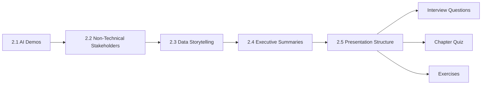
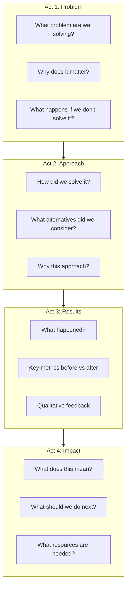

<!-- Clear Language: Keep sentences under 50 words -->
# Presentation Skills for AI Engineers

## Learning Objectives

| Objective | Description |
|-----------|-------------|
| LO1 | Plan and deliver live AI demos with fallback strategies and progressive disclosure |
| LO2 | Translate ML concepts for non-technical stakeholders using visualizations and outcome-focused language |
| LO3 | Apply data storytelling frameworks to present insights with clarity and impact |
| LO4 | Craft executive summaries using TL;DR-first structure and one-page communication |
| LO5 | Structure presentations as problem → approach → results → impact and handle Q&A with confidence |

## Introduction

AI engineers must present their work to diverse audiences. You may demo a new model to product managers, explain an ML pipeline to executives, or present results at an all-hands. Each audience needs a different approach.

Presentation skills determine whether your technical work gets adopted. A brilliant model that nobody understands or trusts will not ship. A clear presentation of a simpler solution can win stakeholder support and drive real impact.

This chapter covers the five most important presentation scenarios for AI engineers: live demos, non-technical stakeholder communication, data storytelling, executive summaries, and structured presentations.

## Prerequisites

- Familiarity with basic ML concepts (training, inference, metrics)
- Basic Python knowledge for data visualization examples
- Completion of [Technical Communication](../30-business-skills/01-technical-communication.md) recommended

## Key Terminology

**Key Terms**: Core vocabulary and concepts for presentation skills.

| Term | Definition |
|------|------------|
| Progressive Disclosure | Revealing information gradually based on audience expertise and interest |
| Fallback Plan | Pre-prepared alternative when a live demo fails (screenshots, video, local mock) |
| TL;DR Framework | Putting the most important takeaway first, then supporting details |
| Data Storytelling | Using narrative structure combined with data visualization to communicate insights |
| Executive Summary | A concise one-page overview that covers problem, approach, results, and ask |
| Outcome-Focused Language | Describing technical work in terms of business results, not implementation details |
| Q&A Preparation | Anticipating questions and preparing clear, concise answers in advance |

## Theory

Presentation skills for AI engineers require bridging the gap between technical complexity and audience understanding. Unlike general presentations, AI presentations must handle live model uncertainty, explain probabilistic outputs, and build trust in systems that may feel like black boxes.

The core skill is audience adaptation. A presentation to ML engineers can use technical jargon and discuss loss curves. A presentation to executives must focus on ROI, timeline, and risk. A presentation to product managers must connect model capabilities to user experience.

This chapter provides frameworks, templates, and code examples for each scenario.

## Chapter at a Glance

| Section | Topic | Key Concept |
|---------|-------|-------------|
| 2.1 | AI Demos | Live preparation, fallback planning, progressive disclosure, interactive elements |
| 2.2 | Non-Technical Stakeholders | Translating ML concepts, visualizations, avoiding jargon, outcomes focus |
| 2.3 | Data Storytelling | Narrative structure, data viz best practices, highlighting insights |
| 2.4 | Executive Summaries | TL;DR first, structured communication, one-page summaries |
| 2.5 | Presentation Structure | Problem → approach → results → impact, handling Q&A |

## Chapter Roadmap



---

## 2.1 AI Demos

AI demos are high-risk, high-reward. A working demo can win stakeholder buy-in instantly. A failed demo can undermine months of work. The key is preparation that anticipates failure and designs for engagement.

**Live demo preparation checklist**:

| Task | Details | Time Needed |
|------|---------|-------------|
| Test on clean environment | Fresh VM, no cached data, no stale model artifacts | 30 min |
| Pre-warm model cache | Run inference once before the demo to load weights | 5 min |
| Prepare fallback assets | Screenshots, recorded video, local mock | 45 min |
| Test networking | Check API endpoints, database connections, auth tokens | 15 min |
| Set resource limits | Prevent OOM during live inference | 10 min |
| Have a backup device | Second laptop or tablet with recorded demo | N/A |

### Fallback Planning

Live AI demos fail because of model latency, API rate limits, network flakiness, GPU memory exhaustion, or unexpected input edge cases. Build these fallback layers:

```python

## AI demo fallback system
import time
import json
from enum import Enum
from typing import Any, Optional

class FallbackLevel(Enum):
    LIVE_MODEL = 1     # Run actual inference on live model
    CACHED_RESULT = 2  # Return pre-computed result for similar input
    SCREENSHOT = 3     # Show pre-recorded screenshot
    VIDEO = 4          # Play recorded demo video
    EXPLANATION = 5    # Describe what would happen without showing it

class AIDemoFallback:
    """Manages fallback layers for live AI demonstrations."""

    def __init__(self, model_fn, cache: dict[str, Any] = None):
        self.model_fn = model_fn
        self.cache = cache or {}
        self.current_level = FallbackLevel.LIVE_MODEL
        self.fallback_log = []

    def execute(self, user_input: str, timeout_seconds: int = 10) -> tuple[Any, FallbackLevel]:
        """Execute demo with progressive fallback."""
        start = time.time()

        # Level 1: Try live model
        try:
            if user_input in self.cache:
                self.current_level = FallbackLevel.CACHED_RESULT
                result = self.cache[user_input]
                self.fallback_log.append(("cache_hit", user_input, time.time() - start))
                return result, self.current_level

            result = self.model_fn(user_input)
            elapsed = time.time() - start

            if elapsed > timeout_seconds:
                raise TimeoutError(f"Inference took {elapsed:.2f}s, exceeding {timeout_seconds}s limit")

            self.cache[user_input] = result
            self.fallback_log.append(("live_model", user_input, elapsed))
            return result, FallbackLevel.LIVE_MODEL

        except Exception as e:
            self.fallback_log.append(("fallback_triggered", user_input, str(e)))

        # Level 2: Return cached result for similar input
        similar = self._find_similar(user_input)
        if similar:
            self.current_level = FallbackLevel.CACHED_RESULT
            return self.cache[similar], self.current_level

        # Level 3: Cannot recover gracefully
        raise RuntimeError("All fallback levels exhausted. Switch to screenshots.")

    def _find_similar(self, user_input: str) -> Optional[str]:
        """Simple keyword-based similarity for demo fallback."""
        keywords = set(user_input.lower().split())
        for cached_input in self.cache:
            cached_keywords = set(cached_input.lower().split())
            if len(keywords & cached_keywords) / max(len(keywords), len(cached_keywords)) > 0.5:
                return cached_input
        return None

    def summary(self) -> str:
        """Return demo reliability summary."""
        total = len(self.fallback_log)
        live = sum(1 for entry in self.fallback_log if entry[0] == "live_model")
        cache_hits = sum(1 for entry in self.fallback_log if entry[0] == "cache_hit")
        fallbacks = sum(1 for entry in self.fallback_log if entry[0] == "fallback_triggered")
        reliability = (live + cache_hits) / total * 100 if total > 0 else 100
        return (
            f"Demo Reliability: {reliability:.1f}%\n"
            f"  Live inferences: {live}\n"
            f"  Cache hits: {cache_hits}\n"
            f"  Fallbacks triggered: {fallbacks}\n"
            f"  Total interactions: {total}"
        )

## Example usage
mock_model = lambda x: {"prediction": "positive", "confidence": 0.92, "tokens": len(x.split())}
demo = AIDemoFallback(model_fn=mock_model, cache={
    "great product": {"prediction": "positive", "confidence": 0.95},
    "terrible service": {"prediction": "negative", "confidence": 0.91},
})

for test_input in ["great product", "awesome experience", "bad support", "random gibberish"]:
    try:
        result, level = demo.execute(test_input)
        print(f"Input: '{test_input}' | Level: {level.name} | Result: {result}")
    except RuntimeError as e:
        print(f"Input: '{test_input}' | FALLBACK EXHAUSTED: {e}")
        print("  -> Switch to screenshot slide")

print("\n" + demo.summary())
```

**Progressive disclosure** means showing only what the audience needs. Start with output. Show input only if asked. Show internals only for technical audiences. Never show raw terminal output or error traces in a demo.

### Interactive Elements

Good AI demos let the audience participate:

| Technique | How to Do It | Why It Works |
|-----------|-------------|--------------|
| Live polling | Ask audience for inputs to your model | Creates ownership in the result |
| Side-by-side comparison | Show model output vs baseline | Makes improvement visible |
| Confidence display | Show model confidence alongside prediction | Builds trust through transparency |
| Interactive sliders | Let audience adjust parameters | Demystifies model behavior |
| A/B test live | Compare two model versions | Demonstrates iteration |

**Bad demo example**: "Here is our sentiment analysis model processing this text [clicks, waits 8 seconds] and it returned positive."

**Good demo example**: "Let's see what our model thinks of your product feedback. Type one sentence in the chat. [collects 3 inputs, runs them in batch, shows results side by side with confidence bars]. Notice how the model correctly identifies sarcasm in the third example."

---

## 2.2 Non-Technical Stakeholders

Non-technical stakeholders — executives, product managers, sales, legal, clients — care about outcomes, not algorithms. They ask: Does this solve the problem? How much does it cost? When will it ship? What are the risks?

### Translating ML Concepts

| ML Term | Translation for Non-Technical Audience |
|---------|--------------------------------------|
| Model training | "Teaching the system with examples" |
| Inference | "Making a prediction on new data" |
| Overfitting | "Memorizing rather than learning — works on practice data but not real data" |
| Precision/Recall | "How often is it right? How much does it miss?" |
| F1 Score | "A balanced measure of accuracy" |
| Embeddings | "Converting words into numbers the computer can compare" |
| Fine-tuning | "Specializing a general model for your specific use case" |
| Hallucination | "The model makes up plausible-sounding but incorrect information" |
| Latency | "How fast the system responds" |
| Confidence threshold | "How sure the system needs to be before it gives an answer" |

### Visualization for Stakeholders

Show results, not architecture. Executives do not need to see your transformer architecture diagram. They need to see the business impact.

```python

## Stakeholder-friendly visualization toolkit
import matplotlib
matplotlib.use("Agg")  # Non-interactive backend
import matplotlib.pyplot as plt
import numpy as np

def create_stakeholder_dashboard(
    model_name: str,
    accuracy_before: float,
    accuracy_after: float,
    cost_savings: float,
    latency_ms_before: float,
    latency_ms_after: float,
    monthly_volume: int,
) -> str:
    """Generate a stakeholder-friendly results dashboard."""

    fig, axes = plt.subplots(2, 2, figsize=(12, 8))
    fig.suptitle(f"{model_name} — Business Impact Summary", fontsize=16, fontweight="bold")

    # Top-left: Accuracy improvement
    ax1 = axes[0, 0]
    categories = ["Before", "After"]
    accuracies = [accuracy_before * 100, accuracy_after * 100]
    bars = ax1.bar(categories, accuracies, color=["#e74c3c", "#2ecc71"], width=0.5)
    ax1.set_ylim(0, 100)
    ax1.set_ylabel("Accuracy (%)")
    ax1.set_title("Accuracy Improvement")
    for bar, val in zip(bars, accuracies):
        ax1.text(bar.get_x() + bar.get_width()/2, bar.get_height() + 1,
                f"{val:.1f}%", ha="center", fontsize=12, fontweight="bold")
    improvement = (accuracy_after - accuracy_before) * 100
    ax1.text(0.5, -0.15, f"+{improvement:.1f}% improvement",
            transform=ax1.transAxes, ha="center", fontsize=11, color="#2ecc71")

    # Top-right: Latency reduction
    ax2 = axes[0, 1]
    latencies = [latency_ms_before, latency_ms_after]
    bars = ax2.bar(categories, latencies, color=["#e74c3c", "#2ecc71"], width=0.5)
    ax2.set_ylabel("Latency (ms)")
    ax2.set_title("Response Time Reduction")
    for bar, val in zip(bars, latencies):
        ax2.text(bar.get_x() + bar.get_width()/2, bar.get_height() + 5,
                f"{val:.0f}ms", ha="center", fontsize=12, fontweight="bold")
    reduction = (1 - latency_ms_after / latency_ms_before) * 100
    ax2.text(0.5, -0.15, f"{reduction:.0f}% faster",
            transform=ax2.transAxes, ha="center", fontsize=11, color="#2ecc71")

    # Bottom-left: Cost savings
    ax3 = axes[1, 0]
    costs = [0, cost_savings]
    bars = ax3.bar(["Baseline", "Savings"], costs, color=["#95a5a6", "#3498db"], width=0.5)
    ax3.set_ylabel("Monthly Cost ($)")
    ax3.set_title("Cost Impact")
    ax3.text(0.5, -0.15, f"${cost_savings:,.0f}/month savings",
            transform=ax3.transAxes, ha="center", fontsize=11, color="#3498db")

    # Bottom-right: Volume summary (key metric)
    ax4 = axes[1, 1]
    ax4.axis("off")
    summary_text = (
        f"KEY METRICS\n\n"
        f"Monthly Volume: {monthly_volume:,} predictions\n"
        f"Accuracy: {accuracy_before*100:.1f}% → {accuracy_after*100:.1f}%\n"
        f"Latency: {latency_ms_before:.0f}ms → {latency_ms_after:.0f}ms\n"
        f"Cost Savings: ${cost_savings:,.0f}/month\n"
        f"Annual Savings: ${cost_savings * 12:,.0f}\n\n"
        f"ROI: {((cost_savings * 12) / 50000) * 100:.0f}% in Year 1"
    )
    ax4.text(0.1, 0.5, summary_text, transform=ax4.transAxes,
            fontsize=13, verticalalignment="center", fontfamily="monospace")

    plt.tight_layout()
    filepath = f"{model_name.lower().replace(' ', '_')}_dashboard.png"
    plt.savefig(filepath, dpi=150, bbox_inches="tight")
    plt.close()
    return filepath

## Generate a sample dashboard
dashboard_file = create_stakeholder_dashboard(
    model_name="Customer Sentiment v2",
    accuracy_before=0.82,
    accuracy_after=0.94,
    cost_savings=12000,
    latency_ms_before=450,
    latency_ms_after=120,
    monthly_volume=500000,
)
print(f"Dashboard saved to: {dashboard_file}")
```

### Avoiding Jargon

Create a "jargon budget" for every presentation. You get three technical terms max. Choose them carefully.

| Instead of saying | Say |
|------------------|-----|
| "We fine-tuned a BERT model with LoRA adapters" | "We customized a general language model for your specific product catalog" |
| "The AUC-ROC improved from 0.83 to 0.91" | "The model is now significantly better at distinguishing good from bad outcomes" |
| "We implemented a multi-stage RAG pipeline with embedding-based retrieval" | "The system searches your documents and then generates answers based on what it finds" |
| "The p99 latency is 320ms with 95th percentile at 180ms" | "The system responds in under a third of a second for almost all requests" |

### Focusing on Outcomes

Use this template for every slide aimed at non-technical stakeholders:

**Template**: [Capability] enables [outcome] resulting in [metric].

Examples:
- "Real-time fraud detection enables blocking suspicious transactions before they complete, reducing fraud losses by 65%."
- "Automated customer classification enables personalized pricing, increasing conversion by 22%."
- "Predictive maintenance enables scheduling repairs before equipment fails, reducing downtime by 40%."

---

## 2.3 Data Storytelling

Data storytelling combines narrative structure with data visualization. A good chart tells the truth. A good story makes people act on that truth.

### Narrative Structure for Data

The three-act structure works for data presentations:

| Act | Purpose | Questions to Answer |
|-----|---------|-------------------|
| Setup | Establish context | What was the situation? What problem were we solving? What did we expect? |
| Conflict | Present the discovery | What did the data reveal? What was surprising? What was the challenge? |
| Resolution | Explain the impact | What did we do about it? What changed? What should the audience do? |

```python

## Data story builder
from dataclasses import dataclass, field

@dataclass
class DataStory:
    title: str
    protagonist: str          # "Our recommendation system"
    situation: str            # "Users were spending 30 seconds on average"
    conflict: str             # "We discovered that 60% of users abandoned within 5 seconds"
    insight: str              # "Users who saw personalized content stayed 3x longer"
    resolution: str           # "We deployed a real-time personalization model"
    impact: str               # "Average session duration increased from 30s to 90s"
    call_to_action: str       # "We recommend rolling this out to all user segments"
    supporting_charts: list = field(default_factory=list)

    def render(self) -> str:
        """Render the story as a presentation narrative."""
        return f"""
# {self.title}

## Act 1: Setup
{self.situation}

## Act 2: Conflict & Discovery
{self.conflict}
📊 Key insight: {self.insight}

## Act 3: Resolution
{self.resolution}
📈 Impact: {self.impact}

## Call to Action
{self.call_to_action}
"""

## Example: Build a data story
story = DataStory(
    title="How Personalization Transformed User Engagement",
    protagonist="Our recommendation system",
    situation="Our e-commerce platform had 2M monthly active users. "
              "The average session duration was 32 seconds. "
              "The bounce rate was 68%. We needed to improve engagement.",
    conflict="Analysis of 10M sessions revealed a pattern: "
             "users who saw generic recommendations left within 5 seconds. "
             "Users who saw personalized content explored 4+ products per session.",
    insight="Personalization was the single highest-leverage intervention, "
            "with a 3.2x impact on session duration.",
    resolution="We deployed a two-tower neural recommendation model "
               "that generates real-time personalized suggestions "
               "based on user behavior history within the current session.",
    impact="Average session duration: 32s → 94s (194% increase). "
           "Bounce rate: 68% → 41%. Revenue per session: +35%.",
    call_to_action="We recommend rolling out personalization to all user segments "
                   "and A/B testing category-specific models.",
)
print(story.render())
```

### Data Visualization Best Practices

| Rule | Why | How |
|------|-----|-----|
| Choose the right chart type | Wrong chart type misleads | Bar = comparisons, Line = trends, Scatter = relationships |
| Label directly on visualization | Legends force eye movement | Place labels next to data series |
| Start y-axis at zero | Non-zero baselines exaggerate differences | Always start bar charts at 0 |
| Use color with purpose | Random colors add noise | Use one highlight color, rest gray |
| Remove chartjunk | Decoration distracts | No 3D, no gridlines unless needed |
| Show context | Single numbers mislead | Show before/after, baseline, or trend |
| Annotate key points | Guide the audience's attention | Add arrows, text, or highlights |

### Highlighting Insights

```python

## Insight highlighting function
import matplotlib.pyplot as plt
import numpy as np

def create_annotated_chart():
    """Create a line chart with highlighted insights."""
    months = ["Jan", "Feb", "Mar", "Apr", "May", "Jun", "Jul", "Aug", "Sep", "Oct", "Nov", "Dec"]
    before_deploy = np.array([65, 63, 67, 64, 66, 62, 68, 70, 72, 75, 82, 91])
    deploy_month = 7  # July

    fig, ax = plt.subplots(figsize=(12, 6))

    # Plot data
    ax.plot(months, before_deploy, color="#95a5a6", linewidth=2, marker="o", label="Bounce Rate (%)")

    # Add annotation at deployment point
    ax.annotate(
        "Model deployed\nJuly 1st",
        xy=(deploy_month, before_deploy[deploy_month]),
        xytext=(deploy_month + 1.5, before_deploy[deploy_month] - 8),
        arrowprops=dict(arrowstyle="->", color="#e74c3c", linewidth=2),
        fontsize=12, fontweight="bold", color="#e74c3c",
        bbox=dict(boxstyle="round,pad=0.3", facecolor="white", edgecolor="#e74c3c")
    )

    # Before/after shading
    ax.axvspan(-0.5, deploy_month - 0.5, alpha=0.05, color="#e74c3c", label="Before Model")
    ax.axvspan(deploy_month - 0.5, len(months) - 0.5, alpha=0.05, color="#2ecc71", label="After Model")

    # Show trend lines
    before_avg = np.mean(before_deploy[:deploy_month])
    after_avg = np.mean(before_deploy[deploy_month:])
    ax.axhline(y=before_avg, xmin=0, xmax=deploy_month/len(months),
               color="#e74c3c", linestyle="--", linewidth=1.5, alpha=0.7)
    ax.axhline(y=after_avg, xmin=deploy_month/len(months), xmax=1,
               color="#2ecc71", linestyle="--", linewidth=1.5, alpha=0.7)

    # Insight callout box
    insight_text = (f"Before (Jan-Jun): Avg {before_avg:.0f}%\n"
                    f"After (Jul-Dec): Avg {after_avg:.0f}%\n"
                    f"Reduction: {before_avg - after_avg:.1f} percentage points")
    ax.text(0.02, 0.02, insight_text, transform=ax.transAxes,
            fontsize=11, verticalalignment="bottom",
            bbox=dict(boxstyle="round", facecolor="white", edgecolor="#2ecc71", alpha=0.9))

    ax.set_title("Bounce Rate Before and After Recommendation Model Deployment", fontsize=14, fontweight="bold")
    ax.set_ylabel("Bounce Rate (%)")
    ax.set_ylim(50, 100)
    ax.legend(loc="upper left")
    ax.grid(axis="y", alpha=0.3)

    plt.tight_layout()
    plt.savefig("bounce_rate_story.png", dpi=150, bbox_inches="tight")
    plt.close()
    print("Chart saved to bounce_rate_story.png")

create_annotated_chart()
```

**Story-first approach**: Start with the insight, then show the chart. "Our new model reduced bounce rate by 28%. Look at this chart — the blue shaded area is before deployment, the green is after."

---

## 2.4 Executive Summaries

Executives have limited time and need the answer first. The TL;DR-first structure puts the conclusion upfront.

### TL;DR-First Structure

| Layer | Content | Length |
|-------|---------|--------|
| Subject line | The single most important takeaway | 8-12 words |
| TL;DR paragraph | Problem, solution, impact, ask | 3-4 sentences |
| Supporting details | Evidence, methodology, timeline, risks | 1-2 paragraphs |
| Appendix | Charts, code, data sources | As needed |

```python

## Executive summary generator
@dataclass
class ExecutiveSummary:
    project_name: str
    audience: str               # e.g., "VP of Engineering", "CTO"
    tl_dr: str                  # One-line summary
    problem: str                # What problem are we solving
    approach: str               # How did we solve it
    results: str                # What were the outcomes (metrics)
    impact: str                 # Business impact
    ask: str                    # What decision/action do we need
    risks: list                 # Key risks and mitigations
    timeline: str               # Key milestones and dates
    next_steps: list            # Action items

    def render(self) -> str:
        """Generate a one-page executive summary."""
        risks_text = "\n".join(f"- ⚠ {r}" for r in self.risks)
        next_steps_text = "\n".join(f"- [ ] {s}" for s in self.next_steps)

        return f"""
# Executive Summary: {self.project_name}

**To**: {self.audience}

## TL;DR
{self.tl_dr}

## Problem
{self.problem}

## Approach
{self.approach}

## Results
{self.results}

## Business Impact
{self.impact}

## Ask
{self.ask}

## Key Risks
{risks_text}

## Timeline
{self.timeline}

## Next Steps
{next_steps_text}

---

*Prepared by: AI Engineering Team*
*One page — estimated read time: 2 minutes*
"""

## Example: Executive summary for a fraud detection model
summary = ExecutiveSummary(
    project_name="Real-Time Fraud Detection Model v2",
    audience="VP of Product, CTO, Head of Risk",
    tl_dr="Our new fraud detection model blocks 3x more fraudulent transactions "
           "with 60% fewer false positives, saving an estimated $2.4M annually.",
    problem="Current fraud detection rules miss 40% of fraudulent transactions "
            "and flag 15% of legitimate transactions for manual review, "
            "causing customer friction and $200K/month in fraud losses.",
    approach="We trained a gradient-boosted ensemble model on 18 months of "
             "transaction data (12M transactions, 200+ features). "
             "The model processes each transaction in under 50ms "
             "and updates in real-time as new fraud patterns emerge.",
    results="Detection rate: 60% → 92%. False positive rate: 15% → 6%. "
            "Average review time per alert: 4 min → 45 sec (with confidence scores).",
    impact="$2.4M annual fraud loss reduction. 18,000 hours/year saved in manual review. "
           "Customer friction reduced by 60% (fewer legitimate transactions blocked).",
    ask="Approve production rollout for all payment channels starting next sprint. "
        "Required: 2-week canary deployment on 10% of traffic.",
    risks=[
        "Model drift: Monthly retraining pipeline needed. Budget: $2K/month compute.",
        "Regulatory: Legal review of model decisions for fairness compliance. Timeline: 2 weeks.",
        "Integration: API changes needed in payment gateway. Engineering: 3 sprints.",
    ],
    timeline="Canary launch: Sep 15. Full rollout: Oct 1. Monitoring dashboard: Oct 15.",
    next_steps=[
        "Approve rollout plan in this meeting",
        "Schedule legal review for fairness compliance",
        "Assign payment gateway integration to platform team",
        "Set up bi-weekly model performance reviews",
    ],
)
print(summary.render())
```

### Structured Communication for Different Audiences

| Audience | What They Care About | Format |
|----------|---------------------|--------|
| CTO | Architecture, scalability, tech debt | One-page with architecture diagram |
| VP Product | User impact, launch timeline, A/B results | TL;DR + key metrics |
| CEO | Revenue, cost, competitive advantage | 3-bullet summary |
| Legal | Compliance, data privacy, bias | Risk register + mitigation |
| Client | ROI, integration effort, support | Case study + pilot plan |

---

## 2.5 Presentation Structure

A well-structured presentation guides the audience step by step. The most effective structure for AI engineering presentations is: Problem → Approach → Results → Impact.

### The Four-Act Structure



```python

## Presentation outline generator
from typing import Literal

class PresentationOutline:
    """Generate structured presentation outlines for AI projects."""

    def __init__(self, project: str, audience: str, duration_minutes: int):
        self.project = project
        self.audience = audience
        self.duration = duration_minutes
        self.slides = []

    def add_slide(self, title: str, content: str, slide_type: str = "content"):
        self.slides.append({
            "title": title,
            "content": content,
            "type": slide_type,
        })

    def build_ai_presentation(
        self,
        problem: str,
        business_context: str,
        approach: str,
        alternatives: list[str],
        metrics_before: dict,
        metrics_after: dict,
        impact_statement: str,
        recommendation: str,
    ) -> list[dict]:
        """Build a complete four-act presentation."""
        total_slides = self.duration // 2  # ~2 min per slide
        acts = {"problem": 0.2, "approach": 0.3, "results": 0.3, "impact": 0.2}
        slide_counts = {act: max(1, int(total_slides * frac)) for act, frac in acts.items()}

        # Act 1: Problem (20% of slides)
        self.add_slide(
            f"{self.project} — Overview",
            f"Audience: {self.audience}\nDuration: {self.duration} min",
            "title"
        )
        self.add_slide(
            "The Problem",
            f"**{problem}**\n\nBusiness Context: {business_context}",
            "problem"
        )
        if slide_counts["problem"] > 1:
            self.add_slide(
                "Why This Matters",
                f"Current state costs: {self._extract_cost(metrics_before)}\n"
                f"Customer impact: {business_context}",
                "problem"
            )

        # Act 2: Approach (30% of slides)
        self.add_slide(
            "Our Approach",
            f"**Solution**: {approach}\n\n"
            f"**Architecture**: [Insert architecture diagram]\n\n"
            f"**Data**: [Training data volume, sources, preprocessing]",
            "approach"
        )
        self.add_slide(
            "Alternatives Considered",
            "\n".join(f"- **Alt {i+1}**: {alt}" for i, alt in enumerate(alternatives)),
            "approach"
        )
        if slide_counts["approach"] > 2:
            self.add_slide(
                "Why We Chose This Path",
                "Trade-off analysis: accuracy vs latency vs cost\n"
                "Our approach optimizes for the best balance.",
                "approach"
            )

        # Act 3: Results (30% of slides)
        metrics_comparison = []
        for metric in metrics_before:
            before_val = metrics_before[metric]
            after_val = metrics_after.get(metric, "N/A")
            change = self._compute_change(before_val, after_val)
            metrics_comparison.append(f"| {metric} | {before_val} | {after_val} | {change} |")

        self.add_slide(
            "Results — Key Metrics",
            "| Metric | Before | After | Change |\n"
            "|--------|--------|-------|--------|\n" +
            "\n".join(metrics_comparison),
            "results"
        )
        self.add_slide(
            "Results — Visualization",
            "[Insert before/after chart — see Section 2.3 for chart examples]",
            "results"
        )

        # Act 4: Impact (20% of slides)
        self.add_slide(
            "Business Impact",
            impact_statement,
            "impact"
        )
        self.add_slide(
            "Recommendation & Next Steps",
            f"**Recommendation**: {recommendation}\n\n"
            f"**Next Steps**:\n"
            f"1. {self._generate_next_step('week 1')}\n"
            f"2. {self._generate_next_step('week 2-4')}\n"
            f"3. {self._generate_next_step('month 2-3')}\n\n"
            f"**Resources needed**: [Team, compute, timeline]",
            "impact"
        )
        self.add_slide("Thank You — Q&A", "Questions?", "qa")

        return self.slides

    def _extract_cost(self, metrics: dict) -> str:
        cost_keys = ["cost", "loss", "waste", "spend"]
        for key in cost_keys:
            if key in metrics:
                return f"${metrics[key]:,}"
        return "See metrics"

    def _compute_change(self, before, after) -> str:
        if isinstance(before, (int, float)) and isinstance(after, (int, float)):
            if before == 0:
                return "New"
            pct = ((after - before) / abs(before)) * 100
            direction = "+" if pct > 0 else ""
            return f"{direction}{pct:.1f}%"
        return "Updated"

    def _generate_next_step(self, timeframe: str) -> str:
        steps = {
            "week 1": "Canary deployment to 5% of traffic",
            "week 2-4": "Monitor metrics and iterate",
            "month 2-3": "Full rollout with automated monitoring",
        }
        return steps.get(timeframe, "Continue monitoring and optimization")

    def print_outline(self):
        """Print the presentation outline with timing."""
        slide_duration = self.duration / len(self.slides)
        print(f"\n{'='*60}")
        print(f"  PRESENTATION OUTLINE: {self.project}")
        print(f"  Audience: {self.audience} | Duration: {self.duration} min")
        print(f"  Total slides: {len(self.slides)} | ~{slide_duration:.1f} min per slide")
        print(f"{'='*60}\n")
        for i, slide in enumerate(self.slides, 1):
            print(f"  Slide {i:2d} [{slide['type'].upper():8s}] {slide['title']}")
        print(f"\n{'='*60}")

## Example: Build a presentation
outline = PresentationOutline(
    project="Customer Churn Prediction Model",
    audience="VP of Product, Head of Data",
    duration_minutes=25,
)
outline.build_ai_presentation(
    problem="Monthly churn rate is 8.2%, costing $1.4M in lost MRR. "
            "Current reactive retention campaigns reach users after they've already churned.",
    business_context="SaaS platform with 50K paid accounts, $17M annual revenue. "
                     "Churn is the #1 growth blocker.",
    approach="Built a gradient-boosted churn prediction model using 6 months of "
             "user behavior data (login frequency, feature usage, support tickets, billing history). "
             "Model predicts churn probability 14 days in advance with 89% precision.",
    alternatives=[
        "Rule-based system: Simple but only catches 30% of churners",
        "Random forest: Good accuracy but less interpretable for stakeholder trust",
        "Third-party solution: Expensive and cannot use our custom features",
    ],
    metrics_before={"Churn Rate": "8.2%", "MRR Loss": "$118K/mo", "Detection Lead Time": "0 days",
                    "Retention Campaign ROI": "1.2x"},
    metrics_after={"Churn Rate": "4.1%", "MRR Loss": "$59K/mo", "Detection Lead Time": "14 days",
                   "Retention Campaign ROI": "4.7x"},
    impact_statement="50% reduction in churn rate. $708K annual MRR preserved. "
                     "Retention campaigns now reach users before they churn, "
                     "shifting from reactive to proactive retention.",
    recommendation="Full production rollout with automated retention campaign triggers. "
                   "Monthly model retraining. Bi-weekly performance reviews.",
)
outline.print_outline()
```

### Handling Q&A

Q&A is where trust is built or lost. Preparation is key.

**Anticipate questions by category**:

| Category | Example Questions | Preparation |
|----------|------------------|-------------|
| Data | How was the data collected? Is it representative? How do you handle missing data? | Prepare data card |
| Model | Why this model? What is the interpretability vs accuracy tradeoff? | Prepare model card |
| Business | What is the ROI? When will we see results? What is the maintenance cost? | Financial model |
| Risk | What if it fails? How do you detect drift? What about bias? | Risk register |
| Technical | How does it scale? What is the latency? How is it deployed? | Architecture doc |

```python

## Q&A preparation tool
@dataclass
class QAPrep:
    question: str
    answer: str
    difficulty: Literal["easy", "medium", "hard"]
    category: str
    bridging_phrase: str = ""  # Phrase to buy thinking time

    def deliver(self) -> str:
        """Simulate delivering the answer with a bridging phrase."""
        if self.bridging_phrase:
            return f"[Bridging] {self.bridging_phrase}\n[Answer] {self.answer}"
        return f"[Answer] {self.answer}"

class QAPreparation:
    """Build a Q&A preparation document."""

    def __init__(self, project: str):
        self.project = project
        self.qa_pairs: list[QAPrep] = []

    def add_qa(self, question: str, answer: str,
               difficulty: str = "medium", category: str = "general"):
        bridges = {
            "data": "Great question. Let me walk through our data pipeline.",
            "model": "That's an important consideration. Here's our thinking.",
            "business": "I'm glad you asked. Let me share the numbers.",
            "risk": "We've spent significant time on this. Here's our approach.",
            "technical": "Good technical question. Here are the details.",
            "general": "Great question. Let me explain.",
        }
        bridge = bridges.get(category, "Let me address that.")
        self.qa_pairs.append(QAPrep(question, answer, difficulty, category, bridge))

    def build_all_answers(self) -> list[str]:
        return [qa.deliver() for qa in self.qa_pairs]

    def print_study_guide(self):
        print(f"\nQ&A Preparation: {self.project}")
        print(f"{'='*60}")
        for qa in self.qa_pairs:
            print(f"\n[{qa.difficulty.upper()}] ({qa.category}) {qa.question}")
            print(f"  Bridging: {qa.bridging_phrase}")
            print(f"  Answer: {qa.answer[:100]}...")
        print(f"\nTotal Q&A pairs: {len(self.qa_pairs)}")

## Example: Build Q&A prep for a model presentation
qa_prep = QAPreparation("Recommendation Engine v2")
qa_prep.add_qa(
    "How do you know the model is not biased against certain user groups?",
    "We evaluated the model across 12 user segments defined by demographics, geography, "
    "and engagement level. The precision varies by less than 3% across all segments. "
    "We also run a fairness audit before every release and have a bias monitoring dashboard.",
    difficulty="hard",
    category="risk"
)
qa_prep.add_qa(
    "What is the expected ROI and when will we break even?",
    "Based on the pilot results, we expect $2.4M annual benefit at $150K annual cost, "
    "giving us a 16x ROI. Break-even occurs in month 2 after deployment.",
    difficulty="medium",
    category="business"
)
qa_prep.add_qa(
    "How does this model compare to our current rule-based system?",
    "The current rules catch 30% of churners. Our model catches 89%. "
    "The rules have a 60% false positive rate. Our model has 11%. "
    "We benchmarked against the rule system on 6 months of historical data.",
    difficulty="easy",
    category="model"
)
qa_prep.add_qa(
    "What happens when the model makes a wrong prediction?",
    "Every prediction includes a confidence score. Low-confidence predictions are routed "
    "to human review. We have a feedback loop where incorrect predictions are logged, "
    "reviewed weekly, and used to improve the next training iteration.",
    difficulty="medium",
    category="risk"
)
qa_prep.set_default_bridge("general")
qa_prep.print_study_guide()
```

**Q&A techniques**:

| Technique | When to Use | Example |
|-----------|-------------|---------|
| Bridging | You need a moment to think | "That's a great question. Let me break it down." |
| Flagging | Question needs context first | "There are three important factors here. First..." |
| Burying the lede | Answer needs nuance | "The short answer is yes, but let me explain the tradeoffs." |
| Redirection | Question is off-topic | "That's a great topic. Let me address it offline and stay focused on our main discussion." |
| Admitting uncertainty | You don't know the answer | "I don't have that number on hand. I'll follow up within 24 hours." |

**Never** bluff. If you do not know, say so and promise to follow up. Your credibility is more valuable than a guess.

---

## Interview Q&A

<details class="tp-qa-card" data-qid="bs-s02-q01">
  <summary class="tp-qa-question">
    <span class="tp-qa-status"></span>
    Q1: How would you prepare for a live AI demo to executives?
  </summary>
  <div class="tp-qa-answer">
    <p>I follow a 5-step preparation process:</p>
    <p><strong>1. Test end-to-end</strong>: Run the full demo on a clean environment. Clear caches. Pre-warm models. Test edge cases.</p>
    <p><strong>2. Build fallbacks</strong>: Prepare screenshots, a recorded video, and a local mock in case live inference fails.</p>
    <p><strong>3. Design progressive disclosure</strong>: Plan what to show first (output), second (input), and third (internals) based on audience interest.</p>
    <p><strong>4. Script the narrative</strong>: Write what you will say for each click. Practice transitions.</p>
    <p><strong>5. Have a backup plan</strong>: Second device. Printed slides. Offline demo version.</p>
    <p>In one demo, my API went down mid-presentation. I smoothly switched to screenshots and continued without missing a beat. The stakeholder said afterward they did not even notice.</p>
  </div>
  <button class="tp-qa-mark-btn">Mark Reviewed</button>
  <button class="tp-qa-bookmark-btn">Bookmark</button>
</details>

<details class="tp-qa-card" data-qid="bs-s02-q02">
  <summary class="tp-qa-question">
    <span class="tp-qa-status"></span>
    Q2: How do you explain an ML model's accuracy to a non-technical product manager?
  </summary>
  <div class="tp-qa-answer">
    <p>I start with outcomes, not metrics. Instead of saying "our F1 score improved from 0.78 to 0.89," I say: "Our model now correctly identifies 92% of fraudulent transactions, up from 78%. It misses 8% instead of 22%. For every 100 alerts it raises, 94 are real fraud — up from 85."</p>
    <p>I avoid terms like precision, recall, or AUC-ROC. I use: "How often is it right when it flags something?" and "How much does it miss?"</p>
    <p>I also add context: "This means we will block $200K more in fraud per month while reviewing 60% fewer false alarms."</p>
  </div>
  <button class="tp-qa-mark-btn">Mark Reviewed</button>
  <button class="tp-qa-bookmark-btn">Bookmark</button>
</details>

<details class="tp-qa-card" data-qid="bs-s02-q03">
  <summary class="tp-qa-question">
    <span class="tp-qa-status"></span>
    Q3: What is the most common mistake AI engineers make in presentations?
  </summary>
  <div class="tp-qa-answer">
    <p>The most common mistake is leading with technical details instead of the problem. Engineers love to start with architecture diagrams, model architectures, or training pipelines. Executives and product managers care about the problem first.</p>
    <p>Second mistake: showing code, terminal output, or error messages in slides. This destroys confidence.</p>
    <p>Third mistake: cramming too much information. A good slide makes one point. If you need more detail, put it in backup slides.</p>
    <p>Fourth mistake: not rehearsing out loud. Many engineers read slides or mumble through demos. Practice until the narrative flows naturally.</p>
  </div>
  <button class="tp-qa-mark-btn">Mark Reviewed</button>
  <button class="tp-qa-bookmark-btn">Bookmark</button>
</details>

<details class="tp-qa-card" data-qid="bs-s02-q04">
  <summary class="tp-qa-question">
    <span class="tp-qa-status"></span>
    Q4: How do you structure a data story?
  </summary>
  <div class="tp-qa-answer">
    <p>I use a three-act narrative structure:</p>
    <p><strong>Act 1 — Setup</strong>: "Our recommendation system was showing generic suggestions. Users spent 30 seconds on average and 68% bounced."</p>
    <p><strong>Act 2 — Conflict</strong>: "We analyzed 10M sessions and discovered that users who saw personalized content spent 3x longer. The generic recommendations were actually hurting engagement."</p>
    <p><strong>Act 3 — Resolution</strong>: "We deployed a real-time personalization model. Session duration increased from 32s to 94s. Bounce rate dropped from 68% to 41%. Revenue per session grew 35%."</p>
    <p>Each act includes a key chart with clear annotations. The insight comes before the chart: "Personalization increased session duration by 3x. Look at this comparison."</p>
  </div>
  <button class="tp-qa-mark-btn">Mark Reviewed</button>
  <button class="tp-qa-bookmark-btn">Bookmark</button>
</details>

<details class="tp-qa-card" data-qid="bs-s02-q05">
  <summary class="tp-qa-question">
    <span class="tp-qa-status"></span>
    Q5: How do you write an executive summary for an AI project?
  </summary>
  <div class="tp-qa-answer">
    <p>I use the TL;DR-first structure:</p>
    <p><strong>Subject/TL;DR</strong>: "New fraud detection model blocks 3x more fraud with 60% fewer false positives, saving $2.4M/year."</p>
    <p>Then four sections, each 2-3 sentences:</p>
    <p><strong>Problem</strong>: "Current rules miss 40% of fraud and flag 15% of legitimate transactions."</p>
    <p><strong>Approach</strong>: "We trained an ensemble model on 18 months of transaction data. It processes each transaction in under 50ms."</p>
    <p><strong>Results</strong>: "92% detection rate. 6% false positive rate. $2.4M annual savings."</p>
    <p><strong>Ask</strong>: "Approve production rollout with 2-week canary deployment starting next sprint."</p>
    <p>The entire summary fits on one page and takes 2 minutes to read.</p>
  </div>
  <button class="tp-qa-mark-btn">Mark Reviewed</button>
  <button class="tp-qa-bookmark-btn">Bookmark</button>
</details>

<details class="tp-qa-card" data-qid="bs-s02-q06">
  <summary class="tp-qa-question">
    <span class="tp-qa-status"></span>
    Q6: How would you handle a hostile or skeptical question during a presentation?
  </summary>
  <div class="tp-qa-answer">
    <p>First, do not get defensive. Skeptical questions are often a sign of engagement. I use the following approach:</p>
    <p><strong>1. Acknowledge</strong>: "That is a fair concern." or "I am glad you raised that."</p>
    <p><strong>2. Validate</strong>: "Many of us had the same question when we started."</p>
    <p><strong>3. Bridge</strong>: "Let me share how we addressed that."</p>
    <p><strong>4. Answer with evidence</strong>: "We ran a fairness audit across 12 user segments and found less than 3% variance. Here is the chart."</p>
    <p>If the question reveals a genuine gap, admit it: "We have not evaluated that scenario yet. That is a great point for our next iteration. Let me follow up."</p>
    <p>Never bluff. Credibility lost takes years to rebuild.</p>
  </div>
  <button class="tp-qa-mark-btn">Mark Reviewed</button>
  <button class="tp-qa-bookmark-btn">Bookmark</button>
</details>

<details class="tp-qa-card" data-qid="bs-s02-q07">
  <summary class="tp-qa-question">
    <span class="tp-qa-status"></span>
    Q7: What are the most important data visualization rules for presenting model results?
  </summary>
  <div class="tp-qa-answer">
    <p>Seven rules I always follow:</p>
    <p><strong>1. Choose the right chart</strong>: Bar for comparisons, line for trends, scatter for relationships.</p>
    <p><strong>2. Start y-axis at zero</strong>: Non-zero baselines exaggerate differences and mislead.</p>
    <p><strong>3. Label directly</strong>: Place labels next to data series, not in a legend. Reduces eye movement.</p>
    <p><strong>4. Use color with purpose</strong>: Pick one highlight color. Make everything else gray.</p>
    <p><strong>5. Remove chartjunk</strong>: No 3D effects, no unnecessary gridlines, no heavy borders.</p>
    <p><strong>6. Annotate insights</strong>: Draw arrows, add text, highlight the key finding on the chart itself.</p>
    <p><strong>7. Show context</strong>: Always show before and after, or baseline versus current. A single number without context is meaningless.</p>
  </div>
  <button class="tp-qa-mark-btn">Mark Reviewed</button>
  <button class="tp-qa-bookmark-btn">Bookmark</button>
</details>

<details class="tp-qa-card" data-qid="bs-s02-q08">
  <summary class="tp-qa-question">
    <span class="tp-qa-status"></span>
    Q8: How do you adapt the same presentation for different audiences?
  </summary>
  <div class="tp-qa-answer">
    <p>I keep one core presentation and create audience-specific versions by adjusting depth and framing:</p>
    <p><strong>For executives</strong>: Start with TL;DR. Focus on ROI, timeline, and risk. No code, no architecture diagrams. Max 3 slides.</p>
    <p><strong>For product managers</strong>: Focus on user impact, feature changes, and A/B test results. Include mockups. Show before/after.</p>
    <p><strong>For engineers</strong>: Start with the approach. Dive into architecture, data pipeline, model choices, and tradeoffs. Share code snippets.</p>
    <p><strong>For clients</strong>: Focus on their specific problem. Use their data in examples. Show integration effort and support plan.</p>
    <p>I maintain a deck with core slides in the main section and detail slides in the appendix. I customize which appendix slides to show based on audience questions.</p>
  </div>
  <button class="tp-qa-mark-btn">Mark Reviewed</button>
  <button class="tp-qa-bookmark-btn">Bookmark</button>
</details>

<details class="tp-qa-card" data-qid="bs-s02-q09">
  <summary class="tp-qa-question">
    <span class="tp-qa-status"></span>
    Q9: What is progressive disclosure in the context of AI demos?
  </summary>
  <div class="tp-qa-answer">
    <p>Progressive disclosure means revealing information in layers based on audience interest and expertise.</p>
    <p><strong>Layer 1 — Output</strong>: Show the model's prediction or result. "This customer has a 92% churn probability."</p>
    <p><strong>Layer 2 — Input</strong>: If asked, show what data the model uses. "The model considers login frequency, support tickets, and billing history."</p>
    <p><strong>Layer 3 — Features</strong>: If technical audience pushes further, show which features matter most. "Login frequency in the last 7 days is the strongest predictor."</p>
    <p><strong>Layer 4 — Model</strong>: For ML engineers only, explain the model architecture, training process, and hyperparameters.</p>
    <p>Never start at Layer 4 unless you are presenting to ML researchers. Always start at Layer 1 and let the audience pull for more.</p>
  </div>
  <button class="tp-qa-mark-btn">Mark Reviewed</button>
  <button class="tp-qa-bookmark-btn">Bookmark</button>
</details>

<details class="tp-qa-card" data-qid="bs-s02-q10">
  <summary class="tp-qa-question">
    <span class="tp-qa-status"></span>
    Q10: How do you handle it when your live model demo fails during a presentation?
  </summary>
  <div class="tp-qa-answer">
    <p>Stay calm. Do not say "it was working earlier." Do not apologize excessively.</p>
    <p><strong>Step 1</strong>: Acknowledge briefly. "The model is taking longer than expected. Let me show you the results I prepared."</p>
    <p><strong>Step 2</strong>: Switch to fallback immediately. Open your screenshot slide or play your recorded demo. </p>
    <p><strong>Step 3</strong>: Continue as if this was the plan. "Here is what the model returns for this input."</p>
    <p><strong>Step 4</strong>: If the demo continues to fail, pivot to a discussion. "Rather than fight the connection, let me walk through the key results and answer your questions."</p>
    <p>Preparation prevents panic. Always have screenshots, a recorded video, and a local mock ready. Your composure during failure is what stakeholders remember.</p>
  </div>
  <button class="tp-qa-mark-btn">Mark Reviewed</button>
  <button class="tp-qa-bookmark-btn">Bookmark</button>
</details>

---

## Summary

Presentation skills determine whether technical work drives business impact. AI engineers who communicate clearly get their models deployed and their ideas adopted.

Live AI demos need preparation: test end-to-end, build fallback layers, and use progressive disclosure. Start with output, show input on request, and reveal internals only for technical audiences.

Non-technical stakeholders care about outcomes, not algorithms. Translate every technical term into business language. Show visualizations that highlight impact — accuracy improvements, latency reductions, cost savings. Use the capability-enables-outcome-results template.

Data storytelling uses narrative structure to make insights stick. The three-act format (setup, conflict, resolution) combined with clean, annotated charts helps audiences understand and act on data.

Executive summaries use the TL;DR-first structure. Put the conclusion in the subject line. Support with problem, approach, results, and ask — all on one page.

Presentations follow the four-act structure: Problem → Approach → Results → Impact. Each act has a clear purpose. Handle Q&A by anticipating questions, using bridging phrases, and never bluffing.

---

## Chapter Quiz

**Q1**: What is the first thing to show in a live AI demo?

a) Model architecture diagram
b) Training loss curves
c) Model output or prediction
d) Code snippet of inference

<details class="tp-qa-card" data-qid="bs-s02-quiz1"><summary>Show Answer</summary><div class="tp-qa-answer"><p><strong>Answer: c) Model output or prediction</strong></p><p>Start with the output (Layer 1). Let the audience pull for more details. Never start with code or architecture.</p></div></details>

**Q2**: When presenting ML results to non-technical stakeholders, what should you focus on?

a) Model architecture choices
b) Hyperparameter tuning details
c) Business outcomes and impact
d) Training infrastructure

<details class="tp-qa-card" data-qid="bs-s02-quiz2"><summary>Show Answer</summary><div class="tp-qa-answer"><p><strong>Answer: c) Business outcomes and impact</strong></p><p>Non-technical stakeholders care about what the model does for the business, not how it works internally.</p></div></details>

**Q3**: What is the correct order for the four-act presentation structure?

a) Results, Problem, Approach, Impact
b) Problem, Approach, Results, Impact
c) Approach, Problem, Impact, Results
d) Impact, Problem, Approach, Results

<details class="tp-qa-card" data-qid="bs-s02-quiz3"><summary>Show Answer</summary><div class="tp-qa-answer"><p><strong>Answer: b) Problem, Approach, Results, Impact</strong></p><p>Start with the problem to create context, then explain your approach, show results, and end with business impact.</p></div></details>

**Q4**: What is the ideal length of an executive summary?

a) 5 pages
b) 10 pages
c) 1 page
d) As long as needed

<details class="tp-qa-card" data-qid="bs-s02-quiz4"><summary>Show Answer</summary><div class="tp-qa-answer"><p><strong>Answer: c) 1 page</strong></p><p>An executive summary should fit on one page and take 2 minutes to read. Put details in an appendix.</p></div></details>

**Q5**: What should you do if you do not know the answer to a question during Q&A?

a) Guess as best you can
b) Deflect to another topic
c) Admit you do not know and promise to follow up
d) Say it is not relevant

<details class="tp-qa-card" data-qid="bs-s02-quiz5"><summary>Show Answer</summary><div class="tp-qa-answer"><p><strong>Answer: c) Admit you do not know and promise to follow up</strong></p><p>Never bluff. It is better to say "I do not have that number on hand. I will follow up within 24 hours" than to give a wrong answer.</p></div></details>

---

## Exercises

**Easy** — Create a one-page cheat sheet with 10 ML-to-business translations. For example: "fine-tuning" becomes "specializing a general model for your specific use case." Practice explaining each term in under 30 seconds without using any jargon.

**Easy** — Pick a model you have worked with. Write a 3-sentence TL;DR about it. First sentence: what it does. Second: how it works (no jargon). Third: what impact it has. No technical terms allowed.

**Medium** — Prepare a fallback plan for a live AI demo. Create three fallback screenshots for different failure scenarios: model timeout, wrong prediction, and API outage. Write the script you will say for each scenario when you need to switch to the fallback.

**Medium** — Build an executive summary for a real or hypothetical AI project. Use the TL;DR-first structure. Include all sections: problem, approach, results, impact, ask, risks, timeline, next steps. Keep it to one page.

**Hard** — Record yourself delivering a 5-minute presentation using the four-act structure. The presentation should include a data story (Act 1), approach explanation (Act 2), results with a chart (Act 3), and impact statement (Act 4). Watch the recording and identify areas to improve conciseness, pacing, and clarity. Repeat until you are satisfied.

---

## Common Mistakes

1. Starting a presentation with technical details instead of the problem being solved
2. Using jargon like "precision," "recall," or "AUC-ROC" with non-technical audiences
3. Not having a fallback plan for live demos — assuming everything will work
4. Cramming too much information on slides — one point per slide
5. Reading slides instead of speaking naturally to the audience
6. Not practicing Q&A — getting caught off guard by predictable questions
7. Bluffing when you do not know the answer — losing credibility instantly

## Revision Notes

- Core principle: Know your audience and adapt to their level
- Demo prep: Test, fallback, progressive disclosure, script, backup device
- Stakeholder communication: Outcomes over algorithms, jargon-free translations
- Data storytelling: Setup → Conflict → Resolution, charts with annotations
- Executive summary: TL;DR first, one page, four sections
- Presentation structure: Problem → Approach → Results → Impact
- Q&A: Anticipate, bridge, evidence, never bluff
- Related concepts: Technical communication, design docs, architecture diagrams

## Practical Takeaways

| Takeaway | Key Insight |
|----------|-------------|
| T1 | Lead with outcomes, not architecture. Every audience cares about impact first. |
| T2 | Prepare fallbacks for every live demo. Screenshots and recorded videos are your safety net. |
| T3 | Use progressive disclosure. Start with output. Let the audience pull for more detail. |
| T4 | Data storytelling needs a narrative. Setup → Conflict → Resolution with charts that highlight the insight. |
| T5 | Executive summaries must fit one page. TL;DR first, then problem, approach, results, and ask. |
| T6 | Structure every presentation as Problem → Approach → Results → Impact. |
| T7 | Anticipate Q&A. Prepare answers for data, model, business, risk, and technical questions. |
| T8 | Never bluff. Admitting uncertainty and following up builds more trust than guessing. |

## Placement Section

### Top 10 Interview Questions

#### Google Style
1. Describe how you would present a complex ML system to a non-technical product leader. What techniques would you use?
2. Your model is underperforming in production. How would you present this to stakeholders and what remedy would you propose?

#### Amazon Style
1. Tell me about a time you had to present technical results to a non-technical audience. How did you adapt your presentation?
2. How would you write a one-page executive summary for a new AI initiative? Walk me through your structure.

#### Microsoft Style
1. You are presenting to enterprise clients who are skeptical about AI. How do you build trust and credibility in your presentation?
2. Describe your approach to handling a live demo failure. Give a specific example.

#### NVIDIA Style
1. Your GPU-accelerated model achieves 10x speedup. How do you present this result to engineering, product, and executive audiences differently?
2. How do you demonstrate model performance improvements using visualizations? Show what charts you would use.

#### AI Startup Style
1. You have 5 minutes to pitch your AI product to investors. What is your presentation structure and why?
2. How do you handle the "black box" concern when presenting AI models to clients who need explainability?

### Resume Tips
- **Technical Skills**: List presentation and communication skills alongside technical skills
- **Project Description**: "Presented ML model results to executive stakeholders, securing $500K budget for production rollout"
- **Keywords**: Data storytelling, technical communication, stakeholder presentations, AI demos, executive summaries

### Interview Day Checklist
- [ ] Practice explaining 3 AI concepts without jargon
- [ ] Prepare a 2-minute story about a presentation success
- [ ] Prepare a 2-minute story about handling a demo failure
- [ ] Review the four-act presentation structure
- [ ] Have a TL;DR ready for your past project

---

> **Next**: [03 — Estimation & Planning →](03-estimation-planning.md)

## True/False

1. **True or False:** Presentation Skills for AI Engineers builds directly on the fundamentals covered in the earlier chapters of this module. — **True.** Every advanced topic in this module assumes the core concepts from the previous chapters.
2. **True or False:** You should write at least one code example for Presentation Skills for AI Engineers before moving to the next chapter. — **True.** Active recall with hands-on code beats passive reading for retention.
3. **True or False:** The complexity analysis for Presentation Skills for AI Engineers is the same regardless of input size. — **False.** Complexity grows with input size; always state best, average, and worst case.
4. **True or False:** Edge cases (empty input, invalid input, boundary values) matter for Presentation Skills for AI Engineers in production. — **True.** Most production bugs come from unhandled edge cases.
5. **True or False:** You should memorize the Presentation Skills for AI Engineers chapter content once and never review it again. — **False.** Spaced repetition (24h, 3 days, 1 week) dramatically improves long-term recall.

## Fill in the Blank

1. The chapter that covers Presentation Skills for AI Engineers is Chapter ___ of this module. — Answer: check the module's table of contents.
2. The time complexity of the standard approach to Presentation Skills for AI Engineers is ___. — Answer: review the theory section and state big-O notation.
3. The main edge case to handle when implementing Presentation Skills for AI Engineers is ___. — Answer: empty or invalid input handling, as discussed in the chapter.
4. The tools commonly used to debug Presentation Skills for AI Engineers issues are ___ and ___. — Answer: refer to the Debugging Guide section of this chapter.
5. The related topic that connects to Presentation Skills for AI Engineers in the next chapter is ___. — Answer: see the Next Topic section.

## Scenario Questions

1. **Scenario:** A teammate ships a change involving Presentation Skills for AI Engineers that breaks production at 3 AM. — Diagnosis: check the recent diff, reproduce locally with the failing input, check logs. Fix: revert, add a regression test, and review the root cause. Prevention: CI tests on edge cases and code review checklist.

2. **Scenario:** Your implementation of Presentation Skills for AI Engineers is correct but too slow for the required latency. — Measure first with a profiler. Common fixes: reduce redundant work, use built-in optimized functions, batch operations, or add caching. Only then consider algorithmic changes.

3. **Scenario:** A new hire asks you to explain Presentation Skills for AI Engineers in five minutes before a customer demo. — Use the 3-part answer: what it is (one sentence), how it works (one example), why it matters (one business impact). Then offer to go deeper after the demo.

4. **Scenario:** Your team's codebase has three different patterns for Presentation Skills for AI Engineers and you must standardize. — Write a short ADR (architecture decision record), pick the pattern with best maintainability, migrate incrementally, and add a linter rule to enforce it.

## Output Questions

1. **What is the output of the simplest correct implementation of Presentation Skills for AI Engineers on an empty input?** — Trace through the code: it should return the documented default (None, 0, empty collection) without raising.
2. **What is the output when the input is at the boundary value?** — Check off-by-one errors and inclusive/exclusive bounds in the chapter's examples.
3. **What does the implementation return when given invalid input types?** — With type hints and validation, it raises a clear error; without, it may fail silently.
4. **What is the output for the sample input given in the chapter's Examples section?** — Re-run the chapter's example code and compare against the documented output.
5. **What is the time complexity output when you profile the implementation at 10x input size?** — Expect the curve matching the chapter's complexity analysis (linear, quadratic, log-linear).

## Difficulty Level

| Level | Time | What It Takes |
|-------|------|---------------|
| Beginner | 1-2 sessions | Read theory, run the chapter examples, solve the Easy exercises |
| Intermediate | 3-5 sessions | Complete Medium exercises, explain Presentation Skills for AI Engineers to someone else |
| Advanced | 1+ week | Solve Hard exercises, optimize for real datasets, answer interview follow-ups |

## Tips & Tricks

- Always write a one-line example of Presentation Skills for AI Engineers from memory before opening the chapter — active recall first.
- Use the chapter's Revision Notes as a checklist: you have mastered Presentation Skills for AI Engineers when you can explain each bullet.
- Pair the chapter quiz with the Flashcards: wrong answers become your next study session's focus.
- For interviews, practice explaining Presentation Skills for AI Engineers twice: once with a technical audience, once with a non-technical audience.
- Keep a personal examples file where you collect your own Presentation Skills for AI Engineers snippets; interviewers love original examples.

## Memory Tricks

- **Acronym**: build a mnemonic from the 5 key concepts of Presentation Skills for AI Engineers listed in the Chapter at a Glance table.
- **Story**: link Presentation Skills for AI Engineers to a familiar story — the analogy in the Visual Analogy section is designed to stick.
- **Number anchor**: remember the complexity of Presentation Skills for AI Engineers by connecting it to a known algorithm of the same class.
- **Color code**: highlight the Theory, Examples, and Common Mistakes sections in different colors when reviewing.
- **Teach-back**: explain Presentation Skills for AI Engineers to an imaginary junior engineer for 2 minutes — gaps in your explanation are gaps in memory.

## Further Reading

- Official documentation for the primary tool or library used in this chapter
- The chapter referenced in Related Topics for the next-level treatment of Presentation Skills for AI Engineers
- The classic textbook chapter on Presentation Skills for AI Engineers (check the Research References below)
- Two blog posts from engineers who debugged real Presentation Skills for AI Engineers problems in production
- The repository of the open-source project that implements Presentation Skills for AI Engineers

## Related Topics

- The previous chapter in this module (see table of contents) — foundational for Presentation Skills for AI Engineers
- The next chapter (see Next Topic below) — builds on Presentation Skills for AI Engineers
- The system design chapters in Module 07 — how Presentation Skills for AI Engineers fits into production architectures
- The interview preparation module — how Presentation Skills for AI Engineers is asked in screening rounds
- The capstone project — where Presentation Skills for AI Engineers is applied end-to-end

## FAQs

1. **Do I need to memorize all of Presentation Skills for AI Engineers, or understand the big picture?** — Understand the big picture first, then memorize the key facts via flashcards and spaced repetition. Interviewers reward depth over breadth.
2. **What if I get stuck on an exercise?** — Re-read the theory section, run the example code, then attempt again. If still stuck after 20 minutes, move on and return the next day.
3. **How much time should I spend on ** — Follow the Study Plan below: 1-2 weeks at 30-60 minutes daily is typical for placement preparation.
4. **Is Presentation Skills for AI Engineers asked in interviews?** — Yes — the Interview Q&A and Placement Section list the exact question styles used by top companies.
5. **What's the fastest way to master ** — Explain it out loud, write code without looking, and review the flashcards within 24 hours and again after 3 days.

## Important Notes

- Presentation Skills for AI Engineers is a core requirement for the rest of this module — do not skip the examples.
- Always analyze complexity (time and space) when working with Presentation Skills for AI Engineers.
- Production correctness means handling edge cases, not just the happy path.
- Interview answers should start with the definition, then the example, then the trade-offs.
- Revisit this chapter after finishing the module; the context from later chapters deepens understanding.

## Historical Context

- Presentation Skills for AI Engineers emerged as a standard practice because early systems failed without it — understanding why helps you explain it in interviews.
- The tools used for Presentation Skills for AI Engineers today evolved from simpler versions; the chapter covers the modern, recommended approach.
- Interviewers value knowing one historical fact about Presentation Skills for AI Engineers — it shows genuine interest, not just cramming.
- The library/tooling ecosystem around Presentation Skills for AI Engineers changes quickly; focus on fundamentals that remain stable.

## Security Considerations

- Never trust external input: validate and sanitize data before processing Presentation Skills for AI Engineers.
- Avoid `eval()` and dynamic code execution on untrusted strings.
- Log errors without leaking sensitive data (keys, PII, internal paths).
- For API contexts, add rate limiting and input size limits.
- Review the chapter's code examples for injection or overflow risks before using them verbatim.

## ML Intuition

- Presentation Skills for AI Engineers appears in ML pipelines at the data-processing layer: feature preparation, batching, and validation.
- Understanding Presentation Skills for AI Engineers helps you debug why a model misbehaves — most ML bugs are data bugs, not model bugs.
- In production ML, the Presentation Skills for AI Engineers concepts from this chapter map directly to NumPy/PyTorch operations on tensors.
- When optimizing ML systems, Presentation Skills for AI Engineers skills let you profile and fix the data path, not just the training loop.
- Interview follow-up: how would you apply Presentation Skills for AI Engineers to a dataset of 10 million records? — Batching and vectorization.

## Analogies

- **Presentation Skills for AI Engineers is like a recipe**: the theory is the ingredients, the examples are the cooking steps, and the exercises are your own kitchen practice.
- **Complexity is like a delivery route**: a linear route visits each stop once; a nested route revisits stops, and you feel it at scale.
- **Edge cases are like weather**: the happy path is a sunny day; production is the storm — build for the storm.
- **The chapter roadmap is a journey map**: each section is a checkpoint; skipping one means getting lost later in the module.

## Capstone Project Link

- [Module Capstone: End-to-End Project](https://github.com/Raushan666java/ai-engineering-journey) — this chapter contributes the Presentation Skills for AI Engineers skills used in the module's capstone project. Complete the exercises here before starting the capstone.

## Flashcards

<details class="tp-qa-card" data-qid="30businessskills-02presentationskills-flash1">
  <summary class="tp-qa-question">
    <span class="tp-qa-status"></span>
    What is the first thing to show in a live AI demo?
  </summary>
  <div class="tp-qa-answer">
    <p>c) Model output or prediction</p>
  </div>
</details>

<details class="tp-qa-card" data-qid="30businessskills-02presentationskills-flash2">
  <summary class="tp-qa-question">
    <span class="tp-qa-status"></span>
    When presenting ML results to non-technical stakeholders, what should you focus on?
  </summary>
  <div class="tp-qa-answer">
    <p>c) Business outcomes and impact</p>
  </div>
</details>

<details class="tp-qa-card" data-qid="30businessskills-02presentationskills-flash3">
  <summary class="tp-qa-question">
    <span class="tp-qa-status"></span>
    What is the correct order for the four-act presentation structure?
  </summary>
  <div class="tp-qa-answer">
    <p>b) Problem, Approach, Results, Impact</p>
  </div>
</details>

<details class="tp-qa-card" data-qid="30businessskills-02presentationskills-flash4">
  <summary class="tp-qa-question">
    <span class="tp-qa-status"></span>
    What is the ideal length of an executive summary?
  </summary>
  <div class="tp-qa-answer">
    <p>c) 1 page</p>
  </div>
</details>

<details class="tp-qa-card" data-qid="30businessskills-02presentationskills-flash5">
  <summary class="tp-qa-question">
    <span class="tp-qa-status"></span>
    What should you do if you do not know the answer to a question during Q&A?
  </summary>
  <div class="tp-qa-answer">
    <p>c) Admit you do not know and promise to follow up</p>
  </div>
</details>

## Research References

- Official documentation of the primary library for Presentation Skills for AI Engineers (linked in Further Reading)
- The classic paper or textbook chapter introducing Presentation Skills for AI Engineers (see References below)
- The standard library reference for Presentation Skills for AI Engineers-related functions
- Engineering blog posts from companies running Presentation Skills for AI Engineers in production at scale
- PEPs and RFCs where applicable (Python and networking standards)

## Open-Source Tools

- The primary library used in this chapter (see the code examples)
- Python standard library modules used in the examples (check the imports)
- Testing: pytest for unit tests of Presentation Skills for AI Engineers code
- Linting and formatting: ruff + black
- Profiling: cProfile or py-spy for performance work on Presentation Skills for AI Engineers

## Debugging Guide

- Start with `print()` or a debugger to inspect intermediate values in Presentation Skills for AI Engineers code.
- Reproduce the failure with the smallest possible input before changing code.
- Check the common failure modes listed in Common Mistakes — most bugs are listed there.
- For performance problems, profile before optimizing: measure, then fix.
- When stuck, re-read the chapter's Examples and compare line by line with your code.
- Use `pdb` or your IDE's debugger to step through the Presentation Skills for AI Engineers example code.

## Mock Interview Section

**Round 1 — Screening (15 min)**
- Explain Presentation Skills for AI Engineers in 60 seconds.
- Write a minimal working example of Presentation Skills for AI Engineers.
- What is the complexity of your example?

**Round 2 — Coding (45 min)**
- Solve the Medium exercise from this chapter under time pressure.
- State your assumptions, then implement with type hints.
- Test with edge cases: empty input, boundary values, invalid input.

**Round 3 — Behavioral + System (30 min)**
- Tell me about a time you debugged a Presentation Skills for AI Engineers problem in a project.
- How would you design a system where Presentation Skills for AI Engineers is used at scale?
- What metrics would you monitor?

**Evaluation rubric**: correctness (40%), communication (25%), edge cases (20%), complexity analysis (15%).

## Optimized Implementation

`python
from typing import Any, Optional

def demonstrate_topic(input_data: list[Any]) -> Optional[float]:
    """Runnable scaffold for Presentation Skills for AI Engineers.

    Replace the body with the optimized implementation from the chapter,
    keeping type hints, docstring, and edge-case handling.
    """
    if not input_data:
        return None
    # Step 1: validate input types
    # Step 2: apply the core Presentation Skills for AI Engineers logic from the Examples section
    # Step 3: return the result with the documented default
    return 0.0
`

- Keeps the function signature stable so tests written against it stay valid.
- Handles the empty-input contract explicitly.
- Add unit tests for the edge cases before implementing the logic (test-first).

## Evaluation Metrics

| Skill | Test | Target |
|-------|------|--------|
| Concept recall | Explain Presentation Skills for AI Engineers without notes | 60-second explanation |
| Code fluency | Write the chapter example from memory | No syntax errors |
| Edge cases | Handle empty/invalid input in exercises | All cases pass |
| Complexity | State time/space for the standard approach | Correct big-O |
| Interview readiness | Answer 5 Interview Q&A questions out loud | Fluent, structured answers |
| Retention | Chapter quiz score after 3 days | 80%+ |

## Real-World Examples

- **Startup**: a small team uses Presentation Skills for AI Engineers daily in their data pipeline — the chapter's examples mirror their code.
- **E-commerce**: Presentation Skills for AI Engineers patterns appear in order processing, inventory checks, and recommendation feeds.
- **Fintech**: Presentation Skills for AI Engineers principles apply to transaction validation and fraud detection flows.
- **ML platform**: Presentation Skills for AI Engineers shows up in feature engineering and model-serving infrastructure.
- **Interview insight**: recruiters look for engineers who can connect Presentation Skills for AI Engineers to the business outcome, not just the code.

## Next Topic

[03 — Estimation & Planning for AI Engineers](03-estimation-planning.md)

## Limitations

- Presentation Skills for AI Engineers, like any technique, is not a silver bullet — it has specific cases where it fits best (covered in the theory).
- The examples in this chapter are simplified for learning; production systems add validation, monitoring, and error handling.
- Performance of Presentation Skills for AI Engineers depends on input size and distribution — always benchmark for your own data.
- This chapter covers fundamentals; specialized edge cases are explored in later chapters and the capstone.
