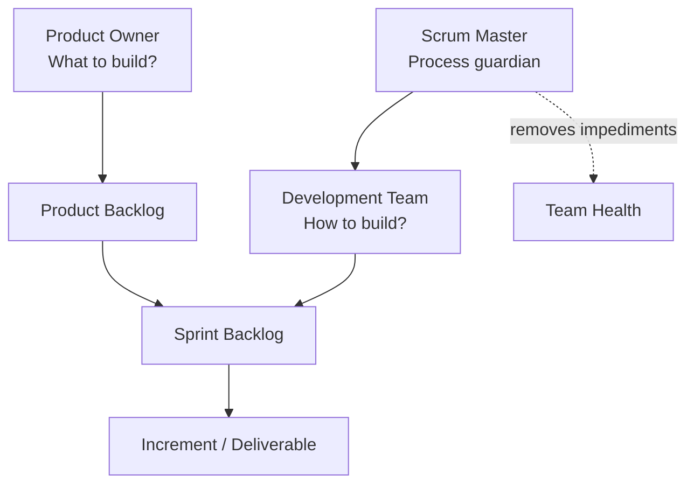
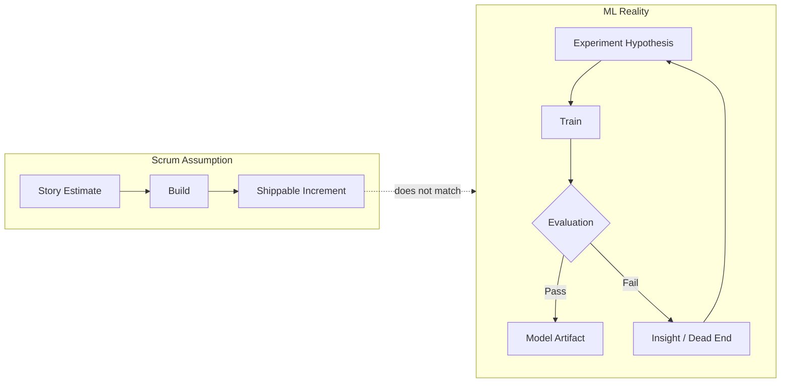
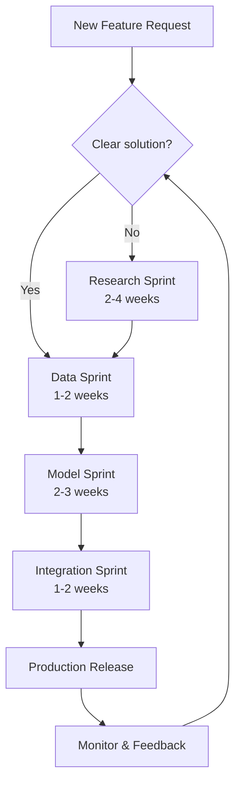
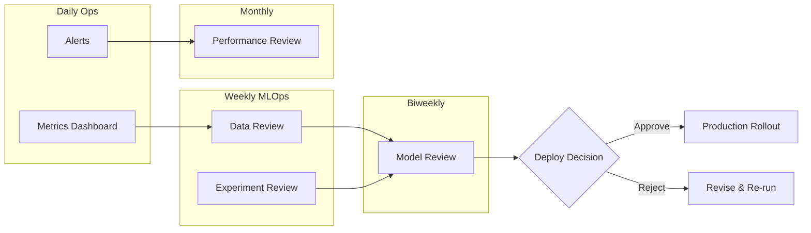

<!-- Clear Language: Keep sentences under 50 words -->
# Agile & Scrum for AI Teams

## Learning Objectives

| LO | Description |
|----|-------------|
| LO1 | Explain traditional Scrum roles, ceremonies, and artifacts |
| LO2 | Identify friction points between ML workflows and standard Scrum |
| LO3 | Design adapted sprint types for AI: research, data, model, integration |
| LO4 | Implement MLOps-specific ceremonies for model and experiment review |
| LO5 | Conduct AI-focused retrospectives that capture experiment failures and infrastructure wins |

## Introduction

AI engineering teams face a unique challenge. They must deliver production systems while exploring unknown solution spaces. Standard Scrum assumes deterministic work — estimate a story, build it, ship it. ML work is probabilistic. A model may train for three days and fail. A data pipeline may reveal dirty records after weeks of cleaning.

This chapter bridges Scrum with ML reality. You will learn traditional Scrum fundamentals first. Then we add layers for experimentation, reproducibility, non-deterministic progress, and MLOps. By the end, you will know how to run sprints that respect both engineering discipline and research uncertainty.

## Prerequisites

- Basic understanding of software development workflows
- Familiarity with team collaboration concepts
- Prior exposure to ML training pipelines (helpful but not required)

## Key Terminology

**Sprint**: A time-boxed iteration (typically 1–4 weeks) during which a team completes a set of work.

**Product Backlog**: A prioritized list of features, experiments, bugs, and technical work maintained by the Product Owner.

**Velocity**: The amount of work a team completes in a sprint, measured in story points.

**ML Experiment**: A tracked run of a model training process with specific hyperparameters, data splits, and code versions.

**Reproducibility**: The ability to recreate an experiment result using the same code, data, and configuration.

**Sprint Ceremony**: A recurring meeting in Scrum (standup, planning, review, retrospective).

## Chapter at a Glance

| Section | Topic | Key Concept |
|---------|-------|-------------|
| 1.1 | Traditional Scrum Foundations | Roles, ceremonies, artifacts |
| 1.2 | ML Workflow vs Scrum Friction | Experimentation vs deterministic delivery |
| 1.3 | Adapted Sprints for AI | Research, data, model, integration sprints |
| 1.4 | MLOps Ceremonies | Model review, data review, experiment review |
| 1.5 | Retrospectives for AI Teams | Learning from experiment failures |

## Chapter Roadmap


## 1.1 Traditional Scrum Foundations

### 1.1.1 The Three Scrum Roles

**Product Owner (PO)** owns the backlog. The PO prioritises work based on business value and stakeholder input. The PO decides what the team builds next. The PO does not dictate how the team builds it.

**Scrum Master (SM)** coaches the team on Scrum practices. The SM removes impediments. The SM ensures ceremonies happen on time and stay focused. The SM protects the team from external distractions.

**Development Team** builds the product. The team is self-organising and cross-functional. No one — not even the SM — tells the team how to do their work. The team owns estimation and delivery.



### 1.1.2 The Five Scrum Ceremonies

**Sprint Planning** opens each sprint. The team selects backlog items they can deliver. They define a sprint goal. Typical duration: two hours for a two-week sprint.

**Daily Standup** is a 15-minute sync. Each member answers three questions:
1. What did I do yesterday?
2. What will I do today?
3. What blockers do I have?

**Sprint Review** closes the sprint. The team demonstrates completed work to stakeholders. Feedback is collected. The backlog is updated.

**Sprint Retrospective** follows the review. The team inspects their process. They identify one improvement to try next sprint.

**Backlog Refinement** (not always listed as a ceremony but essential) is a recurring session where the team estimates and clarifies backlog items.

### 1.1.3 Scrum Artifacts

**Product Backlog**: A living document of all desired work. Items are ordered by priority. Top items are ready for sprint planning.

**Sprint Backlog**: The set of items selected for the current sprint plus the plan to deliver them. Updated daily.

**Increment**: The sum of all completed backlog items at the end of a sprint. Must meet the team's Definition of Done.

### 1.1.4 Scrum Tracking Tools

Most teams use Jira, Linear, or a physical board. Below is a Python class that simulates a basic Scrum board.

```python
"""
scrum_board.py — Lightweight Scrum tracking for AI teams.
Tracks sprint backlog, velocity, and burn-down.
"""

import json
from datetime import datetime, timedelta
from typing import Optional

class Story:
    """A single backlog item with estimation and status."""

    def __init__(self, title: str, points: int, priority: int = 0):
        self.title = title
        self.points = points
        self.priority = priority
        self.status = "backlog"  # backlog | in-progress | done
        self.assigned_to: Optional[str] = None
        self.created_at = datetime.utcnow()
        self.completed_at: Optional[datetime] = None

    def start(self, developer: str) -> None:
        """Move story to in-progress."""
        self.status = "in-progress"
        self.assigned_to = developer

    def complete(self) -> None:
        """Mark story as done."""
        self.status = "done"
        self.completed_at = datetime.utcnow()

    def to_dict(self) -> dict:
        return {
            "title": self.title,
            "points": self.points,
            "status": self.status,
            "assigned_to": self.assigned_to,
        }

class Sprint:
    """A time-boxed iteration with backlog and goal."""

    def __init__(self, goal: str, start_date: datetime, duration_days: int = 14):
        self.goal = goal
        self.start_date = start_date
        self.end_date = start_date + timedelta(days=duration_days)
        self.backlog: list[Story] = []
        self.completed: list[Story] = []

    def add_story(self, story: Story) -> None:
        """Add story to sprint backlog."""
        self.backlog.append(story)

    def total_points(self) -> int:
        """Sum of all story points in backlog."""
        return sum(s.points for s in self.backlog)

    def completed_points(self) -> int:
        """Sum of completed story points."""
        return sum(s.points for s in self.completed)

    def burn_down(self, day: int) -> int:
        """Remaining points on a given sprint day (0-indexed)."""
        done = sum(
            s.points for s in self.backlog if s.status == "done"
        )
        in_progress = sum(
            s.points for s in self.backlog if s.status == "in-progress"
        )
        remaining = self.total_points() - done
        # In-progress items count as half-done for burndown
        return remaining - (in_progress // 2)

    def complete_story(self, story_title: str) -> bool:
        """Find and mark a story complete."""
        for s in self.backlog:
            if s.title == story_title and s.status != "done":
                s.complete()
                self.completed.append(s)
                self.backlog.remove(s)
                return True
        return False

class ScrumBoard:
    """Manages multiple sprints and velocity tracking."""

    def __init__(self, team_name: str):
        self.team_name = team_name
        self.sprints: list[Sprint] = []
        self.product_backlog: list[Story] = []

    def add_to_product_backlog(self, story: Story) -> None:
        """Add item to product backlog, sorted by priority."""
        self.product_backlog.append(story)
        self.product_backlog.sort(key=lambda s: s.priority, reverse=True)

    def start_sprint(self, goal: str, duration_days: int = 14) -> Sprint:
        """Pull top items from product backlog into a new sprint."""
        sprint = Sprint(goal, datetime.utcnow(), duration_days)
        while len(sprint.backlog) < 5 and self.product_backlog:
            sprint.add_story(self.product_backlog.pop(0))
        self.sprints.append(sprint)
        return sprint

    def velocity(self, last_n: int = 3) -> float:
        """Average completed points over last N sprints."""
        recent = self.sprints[-last_n:]
        if not recent:
            return 0.0
        return sum(s.completed_points() for s in recent) / len(recent)

    def to_json(self) -> str:
        """Export board state for reporting."""
        data = {
            "team": self.team_name,
            "sprints": [
                {
                    "goal": s.goal,
                    "total_points": s.total_points(),
                    "completed_points": s.completed_points(),
                }
                for s in self.sprints
            ],
            "velocity": self.velocity(),
        }
        return json.dumps(data, indent=2)

# === Demonstration ===
if __name__ == "__main__":
    board = ScrumBoard("AI Platform Team")

    board.add_to_product_backlog(Story("Data pipeline v2", 8, priority=3))
    board.add_to_product_backlog(Story("Model A/B framework", 13, priority=5))
    board.add_to_product_backlog(Story("Logging infra", 5, priority=2))
    board.add_to_product_backlog(Story("Prompt template UI", 8, priority=4))
    board.add_to_product_backlog(Story("CI/CD for models", 13, priority=5))
    board.add_to_product_backlog(Story("Monitoring dashboard", 8, priority=3))

    sprint1 = board.start_sprint("Establish ML platform foundations")
    sprint1.backlog[0].start("Alice")
    sprint1.backlog[1].start("Bob")
    sprint1.backlog[0].complete()
    sprint1.backlog[1].complete()

    print(f"Sprint goal: {sprint1.goal}")
    print(f"Completed: {sprint1.completed_points()} / {sprint1.total_points()} points")
    print(f"Burndown (day 0): {sprint1.burn_down(0)} remaining")
    print(f"Team velocity: {board.velocity(last_n=1)} pts/sprint")
    print(board.to_json())
```

## 1.2 ML Workflow vs Scrum Friction

### 1.2.1 The Experimentation Phase

In traditional Scrum, the team picks a story, builds it, and ships it. In ML, the team often does not know if a solution exists. A typical ML workflow looks like this:

1. **Data understanding** — explore, visualise, profile
2. **Data preparation** — clean, transform, feature engineer
3. **Model experimentation** — try 20+ architectures and hyperparameter combinations
4. **Evaluation** — measure accuracy, latency, fairness, robustness
5. **Deployment** — package, serve, monitor
6. **Iteration** — go back based on production feedback

Steps 3 and 4 are inherently open-ended. You cannot estimate "train a model that achieves 95% accuracy" with certainty.

### 1.2.2 Reproducibility Challenges

ML experiments are difficult to reproduce. The same code can yield different results due to:

- Random seeds
- Data shuffling order
- GPU hardware differences
- Library version drift
- Non-deterministic operations in CUDA

Scrum assumes work can be verified. If a story is "done", it should behave the same way every time. ML does not satisfy this assumption.

### 1.2.3 Non-Deterministic Progress

A team may sprint for two weeks and end with a failed experiment. That failure still has value — it eliminated a dead end — but it does not ship user-facing value. Standard Scrum treats zero shipped features as a failed sprint. AI teams must redefine "done".



### 1.2.4 Velocity Metrics for ML

Standard velocity measures completed story points. For AI teams, we need a richer set of metrics.

```python
"""
ml_velocity.py — Track ML-specific sprint metrics beyond story points.
"""

class MLExperiment:
    """Represents a single experiment run in a sprint."""

    def __init__(self, name: str, hypothesis: str):
        self.name = name
        self.hypothesis = hypothesis
        self.metrics: dict[str, float] = {}
        self.success: bool | None = None
        self.artifacts: list[str] = []
        self.insight: str = ""

    def record_metric(self, name: str, value: float) -> None:
        self.metrics[name] = value

    def mark_success(self, insight: str = "") -> None:
        self.success = True
        self.insight = insight

    def mark_failure(self, insight: str = "") -> None:
        self.success = False
        self.insight = insight

class MLSprintMetrics:
    """Aggregate metrics for an AI team sprint."""

    def __init__(self, sprint_name: str):
        self.sprint_name = sprint_name
        self.experiments: list[MLExperiment] = []
        self.data_pipelines_completed = 0
        self.models_promoted_to_staging = 0
        self.infra_tasks_completed = 0

    def add_experiment(self, exp: MLExperiment) -> None:
        self.experiments.append(exp)

    def experiment_success_rate(self) -> float:
        """Percentage of experiments that met success criteria."""
        if not self.experiments:
            return 0.0
        successes = sum(1 for e in self.experiments if e.success)
        return successes / len(self.experiments)

    def actionable_insights(self) -> list[str]:
        """Return insights from all experiments regardless of outcome."""
        return [e.insight for e in self.experiments if e.insight]

    def summary(self) -> str:
        lines = [
            f"Sprint: {self.sprint_name}",
            f"Experiments run: {len(self.experiments)}",
            f"Success rate: {self.experiment_success_rate():.0%}",
            f"Models promoted: {self.models_promoted_to_staging}",
            f"Data pipelines: {self.data_pipelines_completed}",
            f"Infra tasks: {self.infra_tasks_completed}",
            f"Key insights:",
        ]
        for ins in self.actionable_insights()[:5]:
            lines.append(f"  - {ins}")
        return "\n".join(lines)

# === Demonstration ===
if __name__ == "__main__":
    sprint = MLSprintMetrics("Sprint 7 — Feature Store Build")

    exp1 = MLExperiment("XGBoost v3", "Increased depth captures feature interactions")
    exp1.record_metric("val_accuracy", 0.912)
    exp1.record_metric("train_time_min", 45)
    exp1.mark_success("Depth 8 outperforms depth 6 by 1.2%, no overfitting")

    exp2 = MLExperiment("Transformer baseline", "Small transformer beats XGBoost on text features")
    exp2.record_metric("val_accuracy", 0.874)
    exp2.record_metric("train_time_min", 180)
    exp2.mark_failure("Transformer underperforms XGBoost on this tabular dataset")

    sprint.add_experiment(exp1)
    sprint.add_experiment(exp2)
    sprint.data_pipelines_completed = 2
    sprint.models_promoted_to_staging = 1

    print(sprint.summary())
```

## 1.3 Adapting Sprints for AI

Traditional one-size-fits-all sprints break for AI. Instead, AI teams use four sprint types. Each has a different goal, cadence, and definition of done.

### 1.3.1 Research Sprint (2–4 weeks)

**Goal**: Explore feasibility. Validate or invalidate a hypothesis.

**Activities**:
- Literature review
- Baseline implementation
- Small-scale experiments on a subset of data
- Feasibility report

**Definition of Done**: A documented decision. Go / no-go on the approach. Not a shipped model.

**Story Types**:
- "Run ablation study on embedding dimension"
- "Compare 3 pre-trained backbones on 10% data"
- "Literature survey on online learning for recommendation"

### 1.3.2 Data Sprint (1–2 weeks)

**Goal**: Prepare a reliable, well-documented dataset.

**Activities**:
- Data source discovery and access
- Profiling and quality checks
- Annotation or labeling
- Schema definition
- Versioning with DVC or LakeFS

**Definition of Done**: A versioned dataset with a data card, passing quality checks.

**Story Types**:
- "Profile 10 GB of clickstream logs for missing values"
- "Define annotation guidelines for sentiment labels"
- "Build data quality dashboard with Great Expectations"

### 1.3.3 Model Sprint (2–3 weeks)

**Goal**: Train, evaluate, and select a production-ready model.

**Activities**:
- Hyperparameter sweeps (Optuna, Ray Tune)
- Cross-validation
- Fairness and bias auditing
- Model compression (quantization, pruning)
- Experiment tracking with MLflow / Weights & Biases

**Definition of Done**: A champion model candidate with documented metrics and a model card. The model is reproducible.

**Story Types**:
- "Run 50 trials of Optuna for XGBoost"
- "Evaluate top-3 architectures on held-out test set"
- "Quantise model from FP32 to FP16, measure accuracy impact"

### 1.3.4 Integration Sprint (1–2 weeks)

**Goal**: Deploy the model into production infrastructure.

**Activities**:
- Build serving API (FastAPI, BentoML, Triton)
- Write integration tests
- Set up monitoring and alerting
- Create rollout plan (canary, blue/green)
- Document runbook

**Definition of Done**: Model serving in staging with automated CI/CD pipeline. Monitoring dashboards operational.



### 1.3.5 Sprint Scheduler for AI Teams

The Python below schedules sprint cycles across a quarter.

```python
"""
sprint_scheduler.py — Plan a quarter of AI sprints with mixed types.
"""

from dataclasses import dataclass
from datetime import datetime, timedelta

@dataclass
class SprintConfig:
    sprint_type: str  # research | data | model | integration
    weeks: int
    goal_template: str

QUARTER_PATTERNS: dict[str, list[SprintConfig]] = {
    "new_project": [
        SprintConfig("research", 3, "Explore approaches for {feature}"),
        SprintConfig("data", 2, "Build and validate {dataset} dataset"),
        SprintConfig("model", 3, "Train and evaluate {model} baseline"),
        SprintConfig("integration", 2, "Deploy {model} to staging"),
    ],
    "model_improvement": [
        SprintConfig("research", 2, "Research {technique} for {model}"),
        SprintConfig("model", 2, "Implement {technique} and measure lift"),
        SprintConfig("integration", 1, "Roll out improved {model}"),
    ],
    "data_maintenance": [
        SprintConfig("data", 1, "Audit {dataset} quality and refresh"),
        SprintConfig("model", 1, "Retrain {model} on fresh data"),
        SprintConfig("integration", 1, "Validate and deploy retrained model"),
    ],
}

class QuarterPlan:
    """Generate a 12-week sprint plan for an AI team."""

    def __init__(self, feature: str, model: str, dataset: str):
        self.feature = feature
        self.model = model
        self.dataset = dataset
        self.sprints: list[dict] = []

    def add_pattern(self, pattern_name: str) -> None:
        """Append a sprint pattern to the quarter plan."""
        pattern = QUARTER_PATTERNS.get(pattern_name)
        if not pattern:
            raise ValueError(f"Unknown pattern: {pattern_name}")

        for config in pattern:
            goal = config.goal_template.format(
                feature=self.feature,
                model=self.model,
                dataset=self.dataset,
            )
            self.sprints.append({
                "type": config.sprint_type,
                "weeks": config.weeks,
                "goal": goal,
            })

    def total_weeks(self) -> int:
        return sum(s["weeks"] for s in self.sprints)

    def print_plan(self) -> None:
        print(f"Quarter Plan: {self.feature.upper()}")
        print(f"{'Type':<15} {'Weeks':<7} Goal")
        print("-" * 80)
        for i, s in enumerate(self.sprints, 1):
            print(f"{s['type']:<15} {s['weeks']:<7} Sprint {i}: {s['goal']}")
        print(f"\nTotal duration: {self.total_weeks()} weeks")
        print(f"Utilisation: {self.total_weeks() / 12:.0%} of quarter")

# === Demonstration ===
if __name__ == "__main__":
    plan = QuarterPlan(
        feature="smart-recommendation-engine",
        model="two-tower-retrieval",
        dataset="user-interaction-2026",
    )
    plan.add_pattern("new_project")
    plan.print_plan()
```

## 1.4 MLOps Ceremonies

Standard Scrum ceremonies are not enough for AI. MLOps adds four ceremonies that mirror engineering reviews but focus on data, models, experiments, and production performance.

### 1.4.1 Model Review (Bi-weekly or post-training)

**Purpose**: Gatekeep which models move toward production.

**Attendees**: ML engineer (presenter), tech lead, QA engineer, product manager.

**Checklist**:
- [ ] Model card complete (dataset, metrics, intended use, limitations)
- [ ] Evaluation against predefined success criteria
- [ ] Bias and fairness audit passed
- [ ] Reproducibility verified (seed, data hash, code commit)
- [ ] Latency and memory benchmarks measured
- [ ] Champion vs challenger comparison documented

**Decision**: Approve, reject with reasons, or approve conditional on changes.

### 1.4.2 Data Review (Weekly)

**Purpose**: Ensure data quality and detect drift before it harms models.

**Attendees**: Data engineer, ML engineer, domain expert.

**Checklist**:
- [ ] New data sources documented and profiled
- [ ] Data quality dashboards green (completeness, consistency, timeliness)
- [ ] PII / sensitive data identified and masked
- [ ] Data version tags updated
- [ ] Feature store schema changes approved

**Decision**: Data is healthy, needs remediation, or requires a data sprint.

### 1.4.3 Experiment Review (Weekly)

**Purpose**: Share learnings across the team. Avoid duplicated dead ends.

**Attendees**: All ML engineers, research scientists.

**Format**: Each engineer presents 1–2 experiments from the past week:
- Hypothesis
- Setup (data, model, hyperparameters)
- Results (metrics, charts)
- Key insight or next step

**Artifact**: Experiment log updated in a shared tracker (spreadsheet, MLflow, or Notion).

```python
"""
experiment_review.py — Track and present experiment reviews.
"""

from datetime import datetime

class ExperimentLog:
    """Central log of all experiments for review ceremonies."""

    def __init__(self):
        self.entries: list[dict] = []

    def log(
        self,
        engineer: str,
        hypothesis: str,
        result: str,
        insight: str,
        next_step: str,
    ) -> int:
        entry_id = len(self.entries) + 1
        self.entries.append({
            "id": entry_id,
            "engineer": engineer,
            "hypothesis": hypothesis,
            "result": result,
            "insight": insight,
            "next_step": next_step,
            "timestamp": datetime.utcnow().isoformat(),
        })
        return entry_id

    def get_recent(self, n: int = 10) -> list[dict]:
        return self.entries[-n:]

    def summary_for_review(self) -> str:
        lines = ["# Experiment Review Summary\n"]
        for e in self.get_recent(10):
            lines.extend([
                f"## Experiment {e['id']} by {e['engineer']}",
                f"- **Hypothesis**: {e['hypothesis']}",
                f"- **Result**: {e['result']}",
                f"- **Insight**: {e['insight']}",
                f"- **Next**: {e['next_step']}",
                "",
            ])
        return "\n".join(lines)

    def success_rate(self) -> float:
        """Fraction of experiments with positive result."""
        if not self.entries:
            return 0.0
        positive = sum(
            1 for e in self.entries
            if e["result"].lower().startswith(("pass", "improve"))
        )
        return positive / len(self.entries)

# === Demonstration ===
log = ExperimentLog()
log.log("Alice", "Deeper ResNet improves image recall",
        "Pass — recall +3.2%", "Depth helps, but diminishing returns after 50 layers",
        "Test with attention mechanism next sprint")
log.log("Bob", "Quantisation preserves accuracy on float32 models",
        "Fail — 2.1% accuracy drop on edge cases",
        "Need calibration dataset for quantisation",
        "Collect 500 edge-case samples for calibration")
log.log("Charlie", "Feature store reduces training pipeline time",
        "Pass — pipeline down from 4h to 45min",
        "Feature caching is the biggest win",
        "Migrate all training pipelines to feature store")

print(f"Experiment success rate: {log.success_rate():.0%}")
print(log.summary_for_review())
```

### 1.4.4 Performance Review (Monthly)

**Purpose**: Monitor production model health.

**Attendees**: ML engineer on call, SRE, product manager.

**Metrics Reviewed**:
- Prediction latency (p50, p95, p99)
- Throughput (requests per second)
- Data drift (distribution shift in input features)
- Concept drift (accuracy degradation over time)
- Cost per prediction (compute, API calls)
- Alert frequency and response time

**Output**: Performance report with recommendations. Decision to retrain, rollback, or escalate.



## 1.5 Retrospectives for AI Teams

Retrospectives are the most important ceremony for AI teams. They transform failed experiments into organisational learning.

### 1.5.1 The AI Retro Structure

A standard retrospective uses "Start / Stop / Continue". AI teams add two more columns: "Experiments" and "Infrastructure".

| Column | Description | Example |
|--------|-------------|---------|
| What Went Well | Wins, shipped features, found insights | "Discovered that feature store cuts training time by 80%" |
| What Went Wrong | Failures, blockers, miscommunications | "Underestimated data labelling time by 3x" |
| Experiment Failures | Hypotheses that did not pan out (valuable!) | "Transformer underperformed XGBoost on tabular data" |
| Infrastructure Improvements | Tooling, CI/CD, compute, monitoring | "Need to add GPU quota monitoring to avoid OOM crashes" |

### 1.5.2 Retrospective Facilitator Guide

1. **Set the stage** (5 min): Review sprint goal. Reiterate that experiments are learning, not failure.
2. **Gather data** (15 min): Each team member writes cards for each column. Use sticky notes or a digital tool (Miro, Retrium).
3. **Cluster and vote** (10 min): Group related cards. Vote on the top 3 items to discuss.
4. **Root cause analysis** (20 min): For each voted item, ask "Why?" five times to reach the true root cause.
5. **Action items** (10 min): Define 1–2 concrete actions with owners. Add to the next sprint backlog.
6. **Close** (5 min): Thank the team. Follow up on action items mid-sprint.

### 1.5.3 Automating Retro Data Collection

Use the Python script below to generate a retrospective report from sprint data.

```python
"""
retro_generator.py — Build AI team retrospective reports from sprint log data.
"""

from dataclasses import dataclass, field

@dataclass
class RetroCard:
    category: str  # went_well | went_wrong | experiment_failure | infra
    description: str
    owner: str = ""

@dataclass
class AIRetrospective:
    sprint_name: str
    sprint_goal: str
    cards: list[RetroCard] = field(default_factory=list)

    def add_card(self, category: str, description: str, owner: str = "") -> None:
        self.cards.append(RetroCard(category, description, owner))

    def group_by_category(self) -> dict[str, list[RetroCard]]:
        groups: dict[str, list[RetroCard]] = {}
        for card in self.cards:
            groups.setdefault(card.category, []).append(card)
        return groups

    def report(self) -> str:
        groups = self.group_by_category()
        categories = {
            "went_well": "✅ What Went Well",
            "went_wrong": "❌ What Went Wrong",
            "experiment_failure": "🔬 Experiment Failures (Learning)",
            "infra": "🛠 Infrastructure Improvements",
        }

        lines = [
            f"# Retrospective: {self.sprint_name}",
            f"**Sprint Goal**: {self.sprint_goal}",
            "",
        ]

        for key, heading in categories.items():
            cards = groups.get(key, [])
            lines.append(f"## {heading}")
            if not cards:
                lines.append("_(nothing recorded)_")
            else:
                for i, card in enumerate(cards, 1):
                    owner = f" — {card.owner}" if card.owner else ""
                    lines.append(f"{i}. {card.description}{owner}")
            lines.append("")

        lines.append("## Action Items")
        lines.append("| Action | Owner | Due |")
        lines.append("|--------|-------|-----|")
        lines.append("| | | |")

        return "\n".join(lines)

# === Demonstration ===
if __name__ == "__main__":
    retro = AIRetrospective(
        sprint_name="Sprint 8 — Recommendation Engine v2",
        sprint_goal="Improve recall@10 by 5% while staying under 50ms latency",
    )

    retro.add_card("went_well", "Two-tower model achieved 4.8% recall lift", "Alice")
    retro.add_card("went_well", "Feature store cut training pipeline from 4h to 45min", "Bob")
    retro.add_card("went_wrong", "Data labelling vendor delivered 3 days late", "Charlie")
    retro.add_card("went_wrong", "GPU OOM errors blocked training for 2 days", "Alice")
    retro.add_card("experiment_failure", "Cross-attention fusion layer added 30ms latency with only 0.5% lift — not viable", "Alice")
    retro.add_card("experiment_failure", "Knowledge distillation from teacher model degraded tail-category accuracy by 7%", "Bob")
    retro.add_card("infra", "Add GPU memory monitoring and auto-notify on OOM", "Charlie")
    retro.add_card("infra", "Standardise experiment tracking across all team members using MLflow", "Alice")

    print(retro.report())
```

### 1.5.4 Retrospective Anti-Patterns

| Anti-Pattern | Why It Fails | Fix |
|---|---|---|
| Blaming individuals | Destroys psychological safety | Focus on system, not people |
| Too many action items | None get done | Pick 1–2 items max per retro |
| Same issues every sprint | Retro has become theatre | Do root cause analysis. Escalate systemic blockers |
| Skipping retros when sprint fails | Most important time to retrospect | Insist on retros after failure |
| Only engineers attend | Missing product and data perspectives | Invite PO, data engineers, sometimes stakeholders |

## Interview Q&A

### Easy

1. **What are the three Scrum roles and their responsibilities?**
   - Product Owner (owns backlog, prioritises), Scrum Master (coaches process, removes blockers), Development Team (self-organising, builds increment).

2. **What is a sprint retrospective?**
   - A ceremony at the end of each sprint where the team inspects their process and identifies one improvement.

3. **Why is reproducibility harder in ML than in traditional software?**
   - ML depends on random seeds, data shuffling, GPU variance, library versions, and non-deterministic operations.

### Medium

4. **How would you adapt sprint planning for a research sprint?**
   - Replace story points with hypothesis statements. Define success as a decision (go/no-go), not shipped code. Time-box exploration to 2–4 weeks.

5. **What metrics should an AI team track instead of (or in addition to) story point velocity?**
   - Experiment success rate, actionable insights generated, data quality score, models promoted to staging, infra tasks completed.

6. **Describe the difference between a model review and a standard code review.**
   - Model review checks model card, fairness audit, reproducibility, latency benchmarks, and champion/challenger comparison. Code review checks style, correctness, and tests.

### Hard

7. **Your team has run three consecutive sprints with no model shipped. Stakeholders are frustrated. What do you do?**
   - First, audit whether the sprints were correctly typed (research vs integration). Second, present experiment insights as value — eliminated approaches save future time. Third, use a research sprint to explore a higher-potential approach. Fourth, negotiate a minimum-viable-model scope for the next integration sprint.

8. **Design a sprint structure for a team that must both maintain a production model and research a novel architecture.**
   - Use a two-track model: a maintenance track (1–2 people, integration sprints) and an innovation track (rest of team, mixed research/model sprints). The tracks sync weekly. Every quarter, rotate team members between tracks to prevent bus factor.

## Chapter Quiz (5 MCQ)

1. **Which Scrum role owns the product backlog?**
   - A) Scrum Master
   - B) Development Team
   - C) Product Owner
   - D) Tech Lead
   - **C**

2. **What is the primary goal of a research sprint?**
   - A) Ship a production model
   - B) Validate or invalidate a hypothesis
   - C) Build a data pipeline
   - D) Write integration tests
   - **B**

3. **Which ceremony gatekeeps whether a model moves toward production?**
   - A) Daily standup
   - B) Experiment review
   - C) Model review
   - D) Sprint retrospective
   - **C**

4. **Why is non-deterministic progress a challenge for standard Scrum?**
   - A) Stories are too large to estimate
   - B) ML experiments can fail and still produce value
   - C) Data scientists do not attend standups
   - D) Sprint planning takes too long
   - **B**

5. **What is the recommended maximum number of action items from an AI retrospective?**
   - A) 5
   - B) 10
   - C) 1–2
   - D) Unlimited
   - **C**

## Summary

Agile and Scrum provide a solid foundation for AI teams, but they require significant adaptation. Standard Scrum assumes deterministic, estimable work that produces a shippable increment every sprint. ML workflows violate this assumption at every stage — experimentation is open-ended, results are non-deterministic, and failed experiments still produce valuable learning.

This chapter presented a complete framework for running Scrum on AI teams. You learned the traditional Scrum roles, ceremonies, and artifacts. You then saw how ML workflow friction demands new sprint types: research sprints for exploration, data sprints for data preparation, model sprints for training and evaluation, and integration sprints for deployment. You learned four MLOps ceremonies that gatekeep quality at each stage. Finally, you learned how to run retrospectives that capture experiment failures as organisational learning.

The code examples give you working tools for sprint tracking, velocity calculation, experiment logging, and retrospective generation. Use them as a starting point for your own team's workflow.

> **Next**: Your AI engineering placement journey continues. Apply these patterns in your first AI team. Run your first sprint retrospective — even if the sprint was just you learning.
## Practical Takeaways

- Traditional Scrum assumes deterministic work. ML is probabilistic. Adapt, do not force-fit.
- Use four sprint types: research, data, model, integration. Each has a different definition of done.
- MLOps ceremonies (model review, data review, experiment review, performance review) gatekeep quality.
- Retrospectives for AI teams must treat experiment failures as valuable learning, not blame.
- Track ML-specific metrics: experiment success rate, actionable insights, models promoted, data quality.
- Automate velocity tracking, experiment logging, and retro report generation with Python scripts.

## Exercises

1. **Sprint Type Classifier**: Given a list of 10 ML tasks, classify each into research, data, model, or integration sprint.
2. **Velocity Calculator**: Use the `MLSprintMetrics` class to load 6 sprints and calculate average experiment success rate and model promotion rate.
3. **Retro Prompt**: Write a retrospective script for a sprint where the team's best experiment failed. Include prompts to extract learning without blame.
4. **Sprint Plan**: Design a 12-week sprint plan for building a real-time fraud detection system. Use the `QuarterPlan` class. Justify your sprint ordering.
5. **Metric Dashboard**: Extend the `ScrumBoard` class to include per-developer velocity and model promotion tracking.

## Placement Section

### Top 10 Interview Questions

#### Google Style

1. **Explain the core idea of Agile & Scrum for AI Teams in under 60 seconds, then give a real-world analogy.** — Structure: definition, how it works in one sentence, why it matters, analogy. Follow-up: what would break if you removed this from a production system?

2. **Design a minimal, well-typed function that demonstrates Agile & Scrum for AI Teams.** — Interviewer checks: signature with type hints, edge cases, complexity, and a clean docstring. Follow-up: how does your design behave with empty or malformed input?

3. **What are the common pitfalls when engineers first learn ** — List 3-4, then explain how you would prevent each in a code review.

#### Amazon Style

4. **Describe a production bug caused by misunderstanding Agile & Scrum for AI Teams. How did you diagnose and fix it?** — STAR format: situation, task, action, result. Mention logs, reproduction, root-cause analysis, and the regression test you added.

5. **How would you scale a system that relies on Agile & Scrum for AI Teams from 10 users to 10 million?** — Discuss bottlenecks, caching, monitoring, and when to redesign. Follow-up: what metrics would you track?

#### Microsoft Style

6. **Compare Agile & Scrum for AI Teams with the closest alternative approach. When would you choose each?** — Make a decision matrix: performance, maintainability, ecosystem, learning curve. Follow-up: what would change your decision?

7. **Walk through how you would test a component that depends on Agile & Scrum for AI Teams.** — Unit, integration, property-based tests; mocking boundaries; golden files for outputs.

#### NVIDIA Style

8. **How does Agile & Scrum for AI Teams behave differently at scale — memory, throughput, or precision-wise?** — Connect to data pipelines and model training if applicable. Follow-up: what happens to latency as input grows?

9. **How would you make an implementation of Agile & Scrum for AI Teams run faster on GPU hardware?** — Batch operations, vectorization, avoiding Python loops, reducing data movement.

#### AI Startup Style

10. **Write the smallest possible implementation of Agile & Scrum for AI Teams that is production-quality.** — Include error handling, type hints, and a one-line docstring. Follow-up: what would you refactor first when it grows?

### Resume Tips

- Name Agile & Scrum for AI Teams explicitly in your skills section, paired with a measurable achievement ("Reduced X by 40% using Agile & Scrum for AI Teams").
- Add a bullet describing a project that applies Agile & Scrum for AI Teams to real data, with numbers.
- Mention the tools and libraries you used alongside Agile & Scrum for AI Teams (linters, test frameworks, profiling tools).
- Keep resume bullets under 15 words and start each with an action verb.

### Interview Day Checklist

- Rehearse a 60-second explanation of Agile & Scrum for AI Teams and one real-world analogy.
- Prepare one STAR story about debugging a Agile & Scrum for AI Teams-related production issue.
- Review complexity and edge cases for the classic Agile & Scrum for AI Teams interview problem.
- Have questions ready: how does the team apply Agile & Scrum for AI Teams in production today?
- Test your environment (Python, editor, internet) 15 minutes before the interview.

## True/False

1. **True or False:** Agile & Scrum for AI Teams builds directly on the fundamentals covered in the earlier chapters of this module. — **True.** Every advanced topic in this module assumes the core concepts from the previous chapters.
2. **True or False:** You should write at least one code example for Agile & Scrum for AI Teams before moving to the next chapter. — **True.** Active recall with hands-on code beats passive reading for retention.
3. **True or False:** The complexity analysis for Agile & Scrum for AI Teams is the same regardless of input size. — **False.** Complexity grows with input size; always state best, average, and worst case.
4. **True or False:** Edge cases (empty input, invalid input, boundary values) matter for Agile & Scrum for AI Teams in production. — **True.** Most production bugs come from unhandled edge cases.
5. **True or False:** You should memorize the Agile & Scrum for AI Teams chapter content once and never review it again. — **False.** Spaced repetition (24h, 3 days, 1 week) dramatically improves long-term recall.

## Fill in the Blank

1. The chapter that covers Agile & Scrum for AI Teams is Chapter ___ of this module. — Answer: check the module's table of contents.
2. The time complexity of the standard approach to Agile & Scrum for AI Teams is ___. — Answer: review the theory section and state big-O notation.
3. The main edge case to handle when implementing Agile & Scrum for AI Teams is ___. — Answer: empty or invalid input handling, as discussed in the chapter.
4. The tools commonly used to debug Agile & Scrum for AI Teams issues are ___ and ___. — Answer: refer to the Debugging Guide section of this chapter.
5. The related topic that connects to Agile & Scrum for AI Teams in the next chapter is ___. — Answer: see the Next Topic section.

## Scenario Questions

1. **Scenario:** A teammate ships a change involving Agile & Scrum for AI Teams that breaks production at 3 AM. — Diagnosis: check the recent diff, reproduce locally with the failing input, check logs. Fix: revert, add a regression test, and review the root cause. Prevention: CI tests on edge cases and code review checklist.

2. **Scenario:** Your implementation of Agile & Scrum for AI Teams is correct but too slow for the required latency. — Measure first with a profiler. Common fixes: reduce redundant work, use built-in optimized functions, batch operations, or add caching. Only then consider algorithmic changes.

3. **Scenario:** A new hire asks you to explain Agile & Scrum for AI Teams in five minutes before a customer demo. — Use the 3-part answer: what it is (one sentence), how it works (one example), why it matters (one business impact). Then offer to go deeper after the demo.

4. **Scenario:** Your team's codebase has three different patterns for Agile & Scrum for AI Teams and you must standardize. — Write a short ADR (architecture decision record), pick the pattern with best maintainability, migrate incrementally, and add a linter rule to enforce it.

## Output Questions

1. **What is the output of the simplest correct implementation of Agile & Scrum for AI Teams on an empty input?** — Trace through the code: it should return the documented default (None, 0, empty collection) without raising.
2. **What is the output when the input is at the boundary value?** — Check off-by-one errors and inclusive/exclusive bounds in the chapter's examples.
3. **What does the implementation return when given invalid input types?** — With type hints and validation, it raises a clear error; without, it may fail silently.
4. **What is the output for the sample input given in the chapter's Examples section?** — Re-run the chapter's example code and compare against the documented output.
5. **What is the time complexity output when you profile the implementation at 10x input size?** — Expect the curve matching the chapter's complexity analysis (linear, quadratic, log-linear).

## Difficulty Level

| Level | Time | What It Takes |
|-------|------|---------------|
| Beginner | 1-2 sessions | Read theory, run the chapter examples, solve the Easy exercises |
| Intermediate | 3-5 sessions | Complete Medium exercises, explain Agile & Scrum for AI Teams to someone else |
| Advanced | 1+ week | Solve Hard exercises, optimize for real datasets, answer interview follow-ups |

## Tips & Tricks

- Always write a one-line example of Agile & Scrum for AI Teams from memory before opening the chapter — active recall first.
- Use the chapter's Revision Notes as a checklist: you have mastered Agile & Scrum for AI Teams when you can explain each bullet.
- Pair the chapter quiz with the Flashcards: wrong answers become your next study session's focus.
- For interviews, practice explaining Agile & Scrum for AI Teams twice: once with a technical audience, once with a non-technical audience.
- Keep a personal examples file where you collect your own Agile & Scrum for AI Teams snippets; interviewers love original examples.

## Memory Tricks

- **Acronym**: build a mnemonic from the 5 key concepts of Agile & Scrum for AI Teams listed in the Chapter at a Glance table.
- **Story**: link Agile & Scrum for AI Teams to a familiar story — the analogy in the Visual Analogy section is designed to stick.
- **Number anchor**: remember the complexity of Agile & Scrum for AI Teams by connecting it to a known algorithm of the same class.
- **Color code**: highlight the Theory, Examples, and Common Mistakes sections in different colors when reviewing.
- **Teach-back**: explain Agile & Scrum for AI Teams to an imaginary junior engineer for 2 minutes — gaps in your explanation are gaps in memory.

## Further Reading

- Official documentation for the primary tool or library used in this chapter
- The chapter referenced in Related Topics for the next-level treatment of Agile & Scrum for AI Teams
- The classic textbook chapter on Agile & Scrum for AI Teams (check the Research References below)
- Two blog posts from engineers who debugged real Agile & Scrum for AI Teams problems in production
- The repository of the open-source project that implements Agile & Scrum for AI Teams

## Related Topics

- The previous chapter in this module (see table of contents) — foundational for Agile & Scrum for AI Teams
- The next chapter (see Next Topic below) — builds on Agile & Scrum for AI Teams
- The system design chapters in Module 07 — how Agile & Scrum for AI Teams fits into production architectures
- The interview preparation module — how Agile & Scrum for AI Teams is asked in screening rounds
- The capstone project — where Agile & Scrum for AI Teams is applied end-to-end

## FAQs

1. **Do I need to memorize all of Agile & Scrum for AI Teams, or understand the big picture?** — Understand the big picture first, then memorize the key facts via flashcards and spaced repetition. Interviewers reward depth over breadth.
2. **What if I get stuck on an exercise?** — Re-read the theory section, run the example code, then attempt again. If still stuck after 20 minutes, move on and return the next day.
3. **How much time should I spend on ** — Follow the Study Plan below: 1-2 weeks at 30-60 minutes daily is typical for placement preparation.
4. **Is Agile & Scrum for AI Teams asked in interviews?** — Yes — the Interview Q&A and Placement Section list the exact question styles used by top companies.
5. **What's the fastest way to master ** — Explain it out loud, write code without looking, and review the flashcards within 24 hours and again after 3 days.

## Important Notes

- Agile & Scrum for AI Teams is a core requirement for the rest of this module — do not skip the examples.
- Always analyze complexity (time and space) when working with Agile & Scrum for AI Teams.
- Production correctness means handling edge cases, not just the happy path.
- Interview answers should start with the definition, then the example, then the trade-offs.
- Revisit this chapter after finishing the module; the context from later chapters deepens understanding.

## Historical Context

- Agile & Scrum for AI Teams emerged as a standard practice because early systems failed without it — understanding why helps you explain it in interviews.
- The tools used for Agile & Scrum for AI Teams today evolved from simpler versions; the chapter covers the modern, recommended approach.
- Interviewers value knowing one historical fact about Agile & Scrum for AI Teams — it shows genuine interest, not just cramming.
- The library/tooling ecosystem around Agile & Scrum for AI Teams changes quickly; focus on fundamentals that remain stable.

## Security Considerations

- Never trust external input: validate and sanitize data before processing Agile & Scrum for AI Teams.
- Avoid `eval()` and dynamic code execution on untrusted strings.
- Log errors without leaking sensitive data (keys, PII, internal paths).
- For API contexts, add rate limiting and input size limits.
- Review the chapter's code examples for injection or overflow risks before using them verbatim.

## ML Intuition

- Agile & Scrum for AI Teams appears in ML pipelines at the data-processing layer: feature preparation, batching, and validation.
- Understanding Agile & Scrum for AI Teams helps you debug why a model misbehaves — most ML bugs are data bugs, not model bugs.
- In production ML, the Agile & Scrum for AI Teams concepts from this chapter map directly to NumPy/PyTorch operations on tensors.
- When optimizing ML systems, Agile & Scrum for AI Teams skills let you profile and fix the data path, not just the training loop.
- Interview follow-up: how would you apply Agile & Scrum for AI Teams to a dataset of 10 million records? — Batching and vectorization.

## Analogies

- **Agile & Scrum for AI Teams is like a recipe**: the theory is the ingredients, the examples are the cooking steps, and the exercises are your own kitchen practice.
- **Complexity is like a delivery route**: a linear route visits each stop once; a nested route revisits stops, and you feel it at scale.
- **Edge cases are like weather**: the happy path is a sunny day; production is the storm — build for the storm.
- **The chapter roadmap is a journey map**: each section is a checkpoint; skipping one means getting lost later in the module.

## Capstone Project Link

- [Module Capstone: End-to-End Project](https://github.com/Raushan666java/ai-engineering-journey) — this chapter contributes the Agile & Scrum for AI Teams skills used in the module's capstone project. Complete the exercises here before starting the capstone.

## Flashcards

<details class="tp-qa-card" data-qid="30businessskills-04agilescrumforai-flash1">
  <summary class="tp-qa-question">
    <span class="tp-qa-status"></span>
    What is the core concept of Agile & Scrum for AI Teams in one sentence?
  </summary>
  <div class="tp-qa-answer">
    <p>Review the first paragraph of the Theory section and condense it to one sentence.</p>
  </div>
</details>

<details class="tp-qa-card" data-qid="30businessskills-04agilescrumforai-flash2">
  <summary class="tp-qa-question">
    <span class="tp-qa-status"></span>
    What is the most common mistake engineers make with 
  </summary>
  <div class="tp-qa-answer">
    <p>Check the Common Mistakes section of this chapter.</p>
  </div>
</details>

<details class="tp-qa-card" data-qid="30businessskills-04agilescrumforai-flash3">
  <summary class="tp-qa-question">
    <span class="tp-qa-status"></span>
    What is the time and space complexity of the standard Agile & Scrum for AI Teams approach?
  </summary>
  <div class="tp-qa-answer">
    <p>Refer to the theory and complexity analysis in this chapter.</p>
  </div>
</details>

<details class="tp-qa-card" data-qid="30businessskills-04agilescrumforai-flash4">
  <summary class="tp-qa-question">
    <span class="tp-qa-status"></span>
    When is Agile & Scrum for AI Teams NOT the right choice?
  </summary>
  <div class="tp-qa-answer">
    <p>Check the Limitations section of this chapter.</p>
  </div>
</details>

<details class="tp-qa-card" data-qid="30businessskills-04agilescrumforai-flash5">
  <summary class="tp-qa-question">
    <span class="tp-qa-status"></span>
    How is Agile & Scrum for AI Teams applied in a real production system?
  </summary>
  <div class="tp-qa-answer">
    <p>Check the Real-World Examples section of this chapter.</p>
  </div>
</details>

## Research References

- Official documentation of the primary library for Agile & Scrum for AI Teams (linked in Further Reading)
- The classic paper or textbook chapter introducing Agile & Scrum for AI Teams (see References below)
- The standard library reference for Agile & Scrum for AI Teams-related functions
- Engineering blog posts from companies running Agile & Scrum for AI Teams in production at scale
- PEPs and RFCs where applicable (Python and networking standards)

## Open-Source Tools

- The primary library used in this chapter (see the code examples)
- Python standard library modules used in the examples (check the imports)
- Testing: pytest for unit tests of Agile & Scrum for AI Teams code
- Linting and formatting: ruff + black
- Profiling: cProfile or py-spy for performance work on Agile & Scrum for AI Teams

## Debugging Guide

- Start with `print()` or a debugger to inspect intermediate values in Agile & Scrum for AI Teams code.
- Reproduce the failure with the smallest possible input before changing code.
- Check the common failure modes listed in Common Mistakes — most bugs are listed there.
- For performance problems, profile before optimizing: measure, then fix.
- When stuck, re-read the chapter's Examples and compare line by line with your code.
- Use `pdb` or your IDE's debugger to step through the Agile & Scrum for AI Teams example code.

## Mock Interview Section

**Round 1 — Screening (15 min)**
- Explain Agile & Scrum for AI Teams in 60 seconds.
- Write a minimal working example of Agile & Scrum for AI Teams.
- What is the complexity of your example?

**Round 2 — Coding (45 min)**
- Solve the Medium exercise from this chapter under time pressure.
- State your assumptions, then implement with type hints.
- Test with edge cases: empty input, boundary values, invalid input.

**Round 3 — Behavioral + System (30 min)**
- Tell me about a time you debugged a Agile & Scrum for AI Teams problem in a project.
- How would you design a system where Agile & Scrum for AI Teams is used at scale?
- What metrics would you monitor?

**Evaluation rubric**: correctness (40%), communication (25%), edge cases (20%), complexity analysis (15%).

## Optimized Implementation

`python
from typing import Any, Optional

def demonstrate_topic(input_data: list[Any]) -> Optional[float]:
    """Runnable scaffold for Agile & Scrum for AI Teams.

    Replace the body with the optimized implementation from the chapter,
    keeping type hints, docstring, and edge-case handling.
    """
    if not input_data:
        return None
    # Step 1: validate input types
    # Step 2: apply the core Agile & Scrum for AI Teams logic from the Examples section
    # Step 3: return the result with the documented default
    return 0.0
`

- Keeps the function signature stable so tests written against it stay valid.
- Handles the empty-input contract explicitly.
- Add unit tests for the edge cases before implementing the logic (test-first).

## Evaluation Metrics

| Skill | Test | Target |
|-------|------|--------|
| Concept recall | Explain Agile & Scrum for AI Teams without notes | 60-second explanation |
| Code fluency | Write the chapter example from memory | No syntax errors |
| Edge cases | Handle empty/invalid input in exercises | All cases pass |
| Complexity | State time/space for the standard approach | Correct big-O |
| Interview readiness | Answer 5 Interview Q&A questions out loud | Fluent, structured answers |
| Retention | Chapter quiz score after 3 days | 80%+ |

## Real-World Examples

- **Startup**: a small team uses Agile & Scrum for AI Teams daily in their data pipeline — the chapter's examples mirror their code.
- **E-commerce**: Agile & Scrum for AI Teams patterns appear in order processing, inventory checks, and recommendation feeds.
- **Fintech**: Agile & Scrum for AI Teams principles apply to transaction validation and fraud detection flows.
- **ML platform**: Agile & Scrum for AI Teams shows up in feature engineering and model-serving infrastructure.
- **Interview insight**: recruiters look for engineers who can connect Agile & Scrum for AI Teams to the business outcome, not just the code.

## Limitations

- Agile & Scrum for AI Teams, like any technique, is not a silver bullet — it has specific cases where it fits best (covered in the theory).
- The examples in this chapter are simplified for learning; production systems add validation, monitoring, and error handling.
- Performance of Agile & Scrum for AI Teams depends on input size and distribution — always benchmark for your own data.
- This chapter covers fundamentals; specialized edge cases are explored in later chapters and the capstone.
