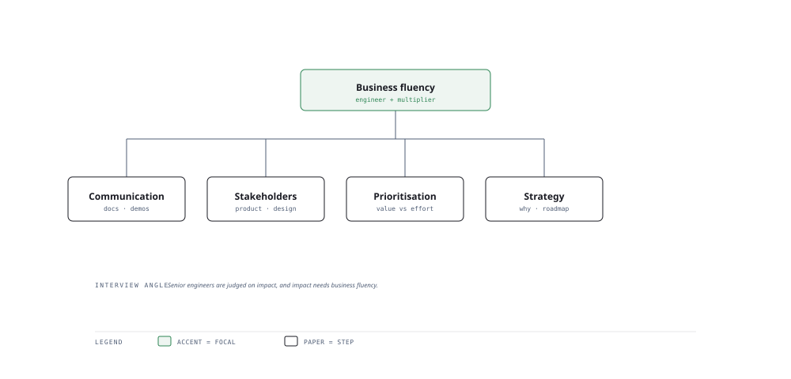

# Visual Notes — Communication and Strategy Tree

> One diagram, the full picture. This page is meant to be glanced at before reading the chapters, and again before interviews.

# What the diagram shows

1. **Communicate** — Explain technical trade-offs in plain language to anyone.
1. **Manage** — Align stakeholders and sequence priorities with them.
1. **Strategise** — Estimate, plan and prioritise so the team ships what matters.

# Why this matters for placement

- Communication and estimation are the soft skills most often probed in senior and behavioural rounds.
- Clear explainers of hard concepts make you the person interviewers recommend.

# Quick revision

- Explain with an analogy, then the precise model, then the trade-off.
- Estimate with ranges and justify the assumptions you made.
- Prioritise by impact × effort; say "no" to low-leverage work politely.
- Agile/scrum: own a sprint, forecast, and report honestly.
- Tailor communication to the audience — engineer vs PM vs exec.

# Related chapters

- [Technical communication](01-technical-communication.md)
- [Presentation skills](02-presentation-skills.md)
- [Estimation planning](03-estimation-planning.md)
- [Agile scrum for AI](04-agile-scrum-for-ai.md)

---

**One-line answer for interviews:** *"Clear communication, stakeholder management, prioritisation and strategy grow from one trunk."*
