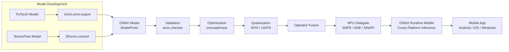
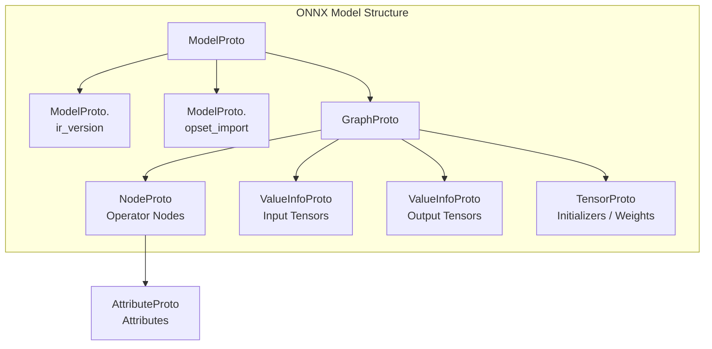
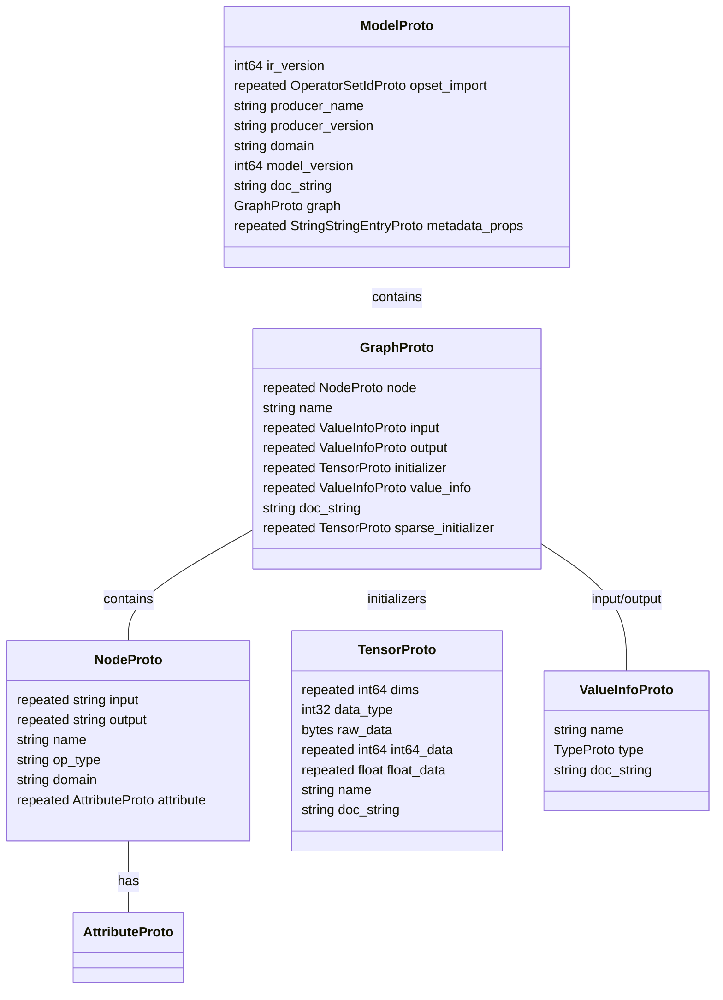
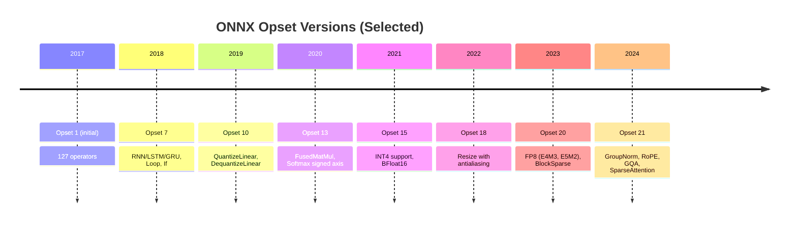
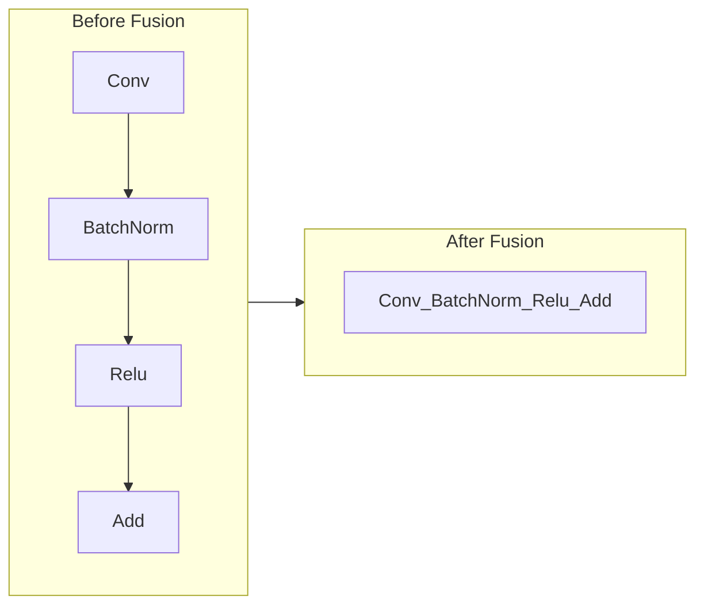
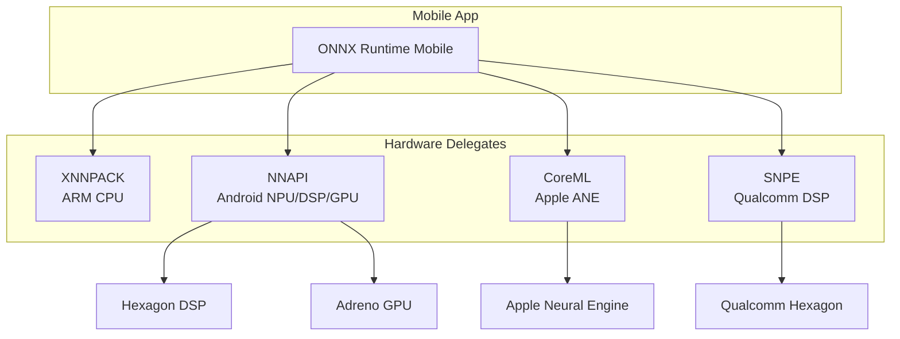

<!-- Clear Language: Keep sentences under 50 words -->
# ONNX Runtime for Mobile

## Learning Objectives

| Objective | Description |
|-----------|-------------|
| LO1 | Explain the ONNX format: model serialization, opset versions, operator coverage, validation pipeline |
| LO2 | Export trained models from PyTorch and TensorFlow to ONNX with dynamic axes and correct I/O specs |
| LO3 | Apply mobile optimizations including INT8/UINT8 quantization, graph optimizations, and operator fusion |
| LO4 | Describe NPU acceleration on Qualcomm SNPE, Apple Neural Engine, and Android NNAPI |
| LO5 | Deploy ONNX Runtime Mobile for cross-platform inference with benchmarks and memory profiling |

## Chapter at a Glance

| Section | Topic | Key Concept |
|---------|-------|-------------|
| 1.1 | ONNX Format & Serialization | Protobuf model representation, `ModelProto`, `GraphProto`, `NodeProto` |
| 1.2 | Opset Versions & Operator Support | Version evolution, IR version, operator domain, custom ops |
| 1.3 | Model Export — PyTorch | `torch.onnx.export`, dynamic axes, I/O specs |
| 1.4 | Model Export — TensorFlow | `tf2onnx.convert`, frozen graph, TF ops mapping |
| 1.5 | Model Validation | ONNX checker, shape inference, onnxruntime validation |
| 1.6 | Mobile Optimizations | INT8/UINT8 quantization, QAT, graph optimizations, operator fusion |
| 1.7 | NPU Acceleration | SNPE, Apple Neural Engine, NNAPI, delegate pattern |
| 1.8 | ONNX Runtime Mobile | Cross-platform C++ API, benchmarks, memory optimization |

## Chapter Roadmap





## Introduction

ONNX (Open Neural Network Exchange) is an open standard for representing machine learning models. It enables interoperability between frameworks (PyTorch, TensorFlow, JAX) and runtimes (ONNX Runtime, TensorRT, CoreML). ONNX Runtime Mobile extends this to smartphones, tablets, and edge devices with limited memory, battery, and compute.

Mobile AI deployment faces three constraints: **model size** (storage), **inference latency** (real-time UX), and **power consumption** (battery life). ONNX Runtime Mobile addresses these through quantization, graph optimizations, operator fusion, and NPU delegation. An AI engineer must master the full pipeline — from export to mobile deployment — to ship on-device AI features.

This chapter covers the ONNX format structure, model export from PyTorch and TensorFlow, mobile-specific optimizations, NPU acceleration, and the ONNX Runtime Mobile cross-platform SDK. By the end, you will be able to convert any model to ONNX, optimize it for mobile, and deploy it with NPU acceleration.

## Prerequisites

- Module 09 (Deep Learning with PyTorch) — model definition, training loop, inference
- Module 27 (AI Infrastructure) — model quantization, graph compilation concepts
- Python 3.8+ with PyTorch 2.x, TensorFlow 2.x, onnx, onnxruntime
- Basic mobile development concepts: Android NDK, iOS frameworks, AOT compilation
- Familiarity with protobuf serialization

## Key Terminology

| Term | Definition |
|------|------------|
| ONNX | Open Neural Network Exchange — an open format for representing ML models as a protobuf graph |
| ModelProto | Top-level ONNX protobuf message containing ir_version, opset_import, and GraphProto |
| GraphProto | Protobuf message containing nodes (ops), initializers (weights), inputs, and outputs |
| NodeProto | A single operator node in the ONNX graph with name, op_type, inputs, outputs, and attributes |
| Opset | A numbered version of operator definitions; opset 21 (Dec 2024) is the latest stable |
| IR Version | ONNX intermediate representation version, currently IR v9 |
| Dynamic Axes | Input dimensions that vary at runtime (batch size, sequence length) |
| QAT | Quantization-Aware Training — simulate quantization during training for higher accuracy |
| Operator Fusion | Combining multiple ops into one kernel to reduce memory traffic and launch overhead |
| Delegate | A hardware-specific backend that accelerates certain ops on NPU/GPU |
| NNAPI | Android Neural Networks API — Android's hardware acceleration layer |
| ANE | Apple Neural Engine — Apple's on-chip NPU in A12+ and M1+ SoCs |
| SNPE | Qualcomm Snapdragon Neural Processing Engine — NPU SDK for Snapdragon SoCs |
| XNNPACK | A library of high-efficiency floating-point neural network operators for ARM/AVX2 |

## Theory

### 1.1 ONNX Format & Model Serialization

ONNX uses **Protocol Buffers** (protobuf) as its serialization format. A trained model is serialized into a `.onnx` file — a binary protobuf that contains the model architecture, trained weights, and metadata. The protobuf schema is defined in `onnx/onnx.proto`.

**Core Protobuf Messages:**



**ModelProto Fields:**
- `ir_version`: The ONNX IR version (latest v9). Determines which features the model uses.
- `opset_import`: List of operator domains and their versions. Standard domain is `ai.onnx`.
- `graph`: The computation graph — nodes, edges, initializers, inputs, outputs.
- `producer_name` / `producer_version`: Tracks which framework exported the model.

**GraphProto Structure:**

The graph is a directed acyclic graph (DAG) of operator nodes. Each `NodeProto` has:
- `input[]`: Names of tensors consumed by this op (reference edges)
- `output[]`: Names of tensors produced by this op
- `op_type`: The operator name (e.g., `Conv`, `Gemm`, `Relu`)
- `domain`: Operator domain — `ai.onnx` for standard ops, `ai.onnx.preview.training` for training ops
- `attribute[]`: Key-value pairs for op parameters (kernel_shape, strides, pads, groups)

Initializers (weights) are stored in `TensorProto` messages. They contain the raw weight data, data type, and shape. Large weights use `raw_data` (byte array) for efficient serialization.

**Serialization Example:**

```python
import onnx
from onnx import helper, TensorProto

# Create a simple graph: Y = W * X + B (Gemm op)
# Input shape: [batch, 4], Output shape: [batch, 3]
X = helper.make_tensor_value_info("X", TensorProto.FLOAT, ["batch", 4])
W = helper.make_tensor_value_info("W", TensorProto.FLOAT, [3, 4])
B = helper.make_tensor_value_info("B", TensorProto.FLOAT, [3])
Y = helper.make_tensor_value_info("Y", TensorProto.FLOAT, ["batch", 3])

# Create Gemm node (Y = alpha * W * X + beta * B)
gemm = helper.make_node(
    "Gemm",              # op_type
    ["W", "X", "B"],     # inputs
    ["Y"],               # outputs
    alpha=1.0,           # attributes
    beta=1.0,
    transA=0,
    transB=0,
)

# Create weight tensors
W_data = helper.make_tensor("W", TensorProto.FLOAT, [3, 4],
                            [0.1]*12)  # 12 float values
B_data = helper.make_tensor("B", TensorProto.FLOAT, [3],
                            [0.0]*3)   # 3 float values

# Build graph
graph = helper.make_graph(
    [gemm],              # nodes
    "simple_linear",     # graph name
    [X],                 # inputs
    [Y],                 # outputs
    [W_data, B_data],    # initializers
)

# Build model
model = helper.make_model(graph, producer_name="onnx-example")
model.opset_import[0].version = 21  # use opset 21

# Serialize to file
onnx.save(model, "simple_linear.onnx")
print(f"Model IR version: {model.ir_version}")
print(f"Opset version: {model.opset_import[0].version}")
print(f"Graph inputs: {[i.name for i in model.graph.input]}")
print(f"Graph outputs: {[o.name for o in model.graph.output]}")
```

**Output:**
```
Model IR version: 9
Opset version: 21
Graph inputs: ['X']
Graph outputs: ['Y']
```

The serialized `.onnx` file is typically 2-10 MB for a standard CNN and 500 MB+ for LLMs. ONNX supports external weight storage (`.onnx.data` files) for models over 2 GB.

---

### 1.2 Opset Versions & Operator Support

ONNX opsets define the set of operators, their semantics, and their type signatures. Each opset is numbered sequentially. As operators evolve, old versions remain supported for backward compatibility.

**Opset Evolution:**



**Key Opset Milestones for Mobile:**

| Opset | Key Operators | Relevance |
|-------|--------------|-----------|
| 10 | QuantizeLinear, DequantizeLinear | INT8 quantization pipeline |
| 13 | FusedMatMul, Softmax with axis | Transformer optimization |
| 15 | BFloat16, reduced precision | Mixed precision mobile inference |
| 18 | Resize v4 (antialiasing) | High-quality image preprocessing |
| 20 | FP8 (E4M3/E5M2) | Next-gen mobile NPU support |
| 21 | GroupNorm, RoPE, GQA, SparseAttention | On-device LLM inference |

**Operator Coverage:**

ONNX supports ~200 standard operators covering:
- **Activations:** Relu, Sigmoid, Tanh, Softmax, LeakyRelu, PRelu, Gelu
- **Convolution:** Conv, ConvTranspose, ConvInteger, QLinearConv
- **Normalization:** BatchNorm, InstanceNorm, LayerNorm, GroupNorm (opset 21)
- **Pooling:** MaxPool, AveragePool, GlobalMaxPool, GlobalAveragePool
- **Recurrent:** LSTM, GRU, RNN, SimpleRNN
- **Transformer:** Attention (opset 21), RotaryEmbedding (opset 21), GroupQueryAttention (opset 21)
- **Quantization:** QuantizeLinear, DequantizeLinear, QLinearConv, QLinearMatMul, MatMulInteger
- **Tensor Ops:** Reshape, Transpose, Concat, Split, Slice, Gather, Unsqueeze, Squeeze

**Custom Operators:**

When a model uses an operator not in the standard ONNX set, you must either:
1. **Decompose** it into standard ops (preferred)
2. **Register a custom op** with ONNX Runtime via `OrtCustomOp` API

```python
# Checking op coverage for a model
import onnx

model = onnx.load("model.onnx")
nodes = model.graph.node
op_types = set(n.op_type for n in nodes)
supported = {"Conv", "Relu", "MaxPool", "Add", "Mul", "Gemm", "Softmax",
             "BatchNorm", "Reshape", "Transpose", "Concat", "Squeeze"}
unsupported = op_types - supported

if unsupported:
    print(f"WARNING: Unsupported ops: {unsupported}")
else:
    print(f"All ops supported: {op_types}")
```

---

### 1.3 Model Export — PyTorch to ONNX

The most common path is exporting a PyTorch model to ONNX using `torch.onnx.export()`. This function traces the model by running a forward pass with example inputs, recording the operator graph.

**Basic Export:**

```python
import torch
import torch.nn as nn
import torch.onnx

class SimpleClassifier(nn.Module):
    """A simple 3-layer classifier for mobile deployment."""
    def __init__(self, input_dim=128, hidden_dim=64, num_classes=10):
        super().__init__()
        self.fc1 = nn.Linear(input_dim, hidden_dim)
        self.relu = nn.ReLU()
        self.fc2 = nn.Linear(hidden_dim, hidden_dim)
        self.relu2 = nn.ReLU()
        self.fc3 = nn.Linear(hidden_dim, num_classes)

    def forward(self, x):
        x = self.relu(self.fc1(x))
        x = self.relu2(self.fc2(x))
        x = self.fc3(x)
        return x

# Instantiate and train (simulate trained weights)
model = SimpleClassifier()
model.eval()  # IMPORTANT: switch to eval mode

# Create dummy input (batch=1, input_dim=128)
dummy_input = torch.randn(1, 128)

# Export to ONNX
torch.onnx.export(
    model,                              # model
    dummy_input,                        # example input
    "classifier.onnx",                  # output file
    export_params=True,                 # store trained weights
    opset_version=21,                   # opset version
    do_constant_folding=True,           # fold constants
    input_names=["input"],              # input tensor name
    output_names=["output"],            # output tensor name
    dynamic_axes={                      # dynamic batch dimension
        "input": {0: "batch_size"},
        "output": {0: "batch_size"},
    },
)

print("Exported classifier.onnx successfully")
```

**Dynamic Axes:**

Dynamic axes allow variable-sized inputs at runtime. For an LLM, sequence length varies per query. For an image model, batch size may vary.

```python
# Dynamic axes for a transformer model
dynamic_axes = {
    "input_ids": {0: "batch_size", 1: "seq_length"},
    "attention_mask": {0: "batch_size", 1: "seq_length"},
    "logits": {0: "batch_size", 1: "seq_length"},
}

# For a vision model with fixed image size but variable batch
dynamic_axes_vision = {
    "image": {0: "batch_size"},
    "boxes": {0: "num_detections"},
    "scores": {0: "num_detections"},
}
```

The `dynamic_axes` parameter is critical for mobile deployment because:
- Mobile apps process one request at a time (batch_size=1)
- NLP models handle variable-length text (seq_length varies)
- Object detection outputs variable number of boxes

**Input/Output Specifications:**

Mobile models need precise I/O specifications for the runtime:

```python
# Export with detailed I/O specs for mobile
torch.onnx.export(
    model,
    dummy_input,
    "mobile_model.onnx",
    export_params=True,
    opset_version=21,
    do_constant_folding=True,
    input_names=["input"],
    output_names=["output", "embedding"],  # multiple outputs
    dynamic_axes={
        "input": {0: "batch_size"},
        "output": {0: "batch_size"},
        "embedding": {0: "batch_size"},
    },
    verbose=True,           # print exported nodes
)

# Verify exported model
import onnx
onnx_model = onnx.load("mobile_model.onnx")
onnx.checker.check_model(onnx_model)
print("Model validated successfully")

# Print input/output details
for inp in onnx_model.graph.input:
    print(f"Input: {inp.name} shape={inp.type.tensor_type.shape}")
for out in onnx_model.graph.output:
    print(f"Output: {out.name} shape={out.type.tensor_type.shape}")
```

**Common Export Issues and Fixes:**

| Issue | Cause | Fix |
|-------|-------|-----|
| `Unsupported operator` | Model uses ops not in ONNX | Replace with standard ops or upgrade opset |
| `RuntimeError: Only tensors or tuples...` | Control flow (if/for) in forward | Use `torch.jit.script` or refactor |
| `Shape mismatch` | Dynamic shapes not specified | Add all variable dims to `dynamic_axes` |
| `Large constant` | Constant folding bloats the graph | Disable `do_constant_folding` |
| `Type mismatch` | torch.int64 vs ONNX INT64 | Cast inputs to correct type |

**Exporting a Hugging Face Transformer:**

```python
from transformers import AutoModelForSequenceClassification, AutoTokenizer
import torch

model_name = "microsoft/xtremedistil-l6-h256-uncased"  # small mobile-friendly model
tokenizer = AutoTokenizer.from_pretrained(model_name)
model = AutoModelForSequenceClassification.from_pretrained(model_name)
model.eval()

# Create dummy input
text = "ONNX Runtime Mobile is fast"
inputs = tokenizer(text, return_tensors="pt")

# Export with dynamic sequence length
torch.onnx.export(
    model,
    (inputs["input_ids"], inputs["attention_mask"]),
    "mobile_bert.onnx",
    input_names=["input_ids", "attention_mask"],
    output_names=["logits"],
    dynamic_axes={
        "input_ids": {0: "batch_size", 1: "sequence_length"},
        "attention_mask": {0: "batch_size", 1: "sequence_length"},
        "logits": {0: "batch_size"},
    },
    opset_version=21,
    do_constant_folding=True,
)

# Check size
import os
size_mb = os.path.getsize("mobile_bert.onnx") / 1e6
print(f"Model size: {size_mb:.2f} MB")
```

---

### 1.4 Model Export — TensorFlow to ONNX

For TensorFlow models, the `tf2onnx` converter maps TF operations to ONNX operators.

**Basic Export from Keras:**

```python
import tensorflow as tf
import tf2onnx

# Build a simple Keras model
model = tf.keras.Sequential([
    tf.keras.layers.Conv2D(32, (3, 3), activation="relu", input_shape=(224, 224, 3)),
    tf.keras.layers.MaxPooling2D((2, 2)),
    tf.keras.layers.Conv2D(64, (3, 3), activation="relu"),
    tf.keras.layers.MaxPooling2D((2, 2)),
    tf.keras.layers.Conv2D(128, (3, 3), activation="relu"),
    tf.keras.layers.GlobalAveragePooling2D(),
    tf.keras.layers.Dense(10, activation="softmax"),
])
model.compile(optimizer="adam", loss="categorical_crossentropy")
model.summary()

# Convert to ONNX
spec = (tf.TensorSpec((None, 224, 224, 3), tf.float32, name="input"),)
output_path = "mobilenet_style.onnx"

model_proto, _ = tf2onnx.convert.from_keras(
    model,
    input_signature=spec,
    opset=21,
    output_path=output_path,
)

print(f"Exported {output_path}")
```

**Exporting a SavedModel:**

```python
# Export from a TF SavedModel directory
import tf2onnx

saved_model_dir = "path/to/saved_model"
output_path = "converted_model.onnx"

model_proto, _ = tf2onnx.convert.from_saved_model(
    saved_model_dir,
    input_signature=[tf.TensorSpec([None, 224, 224, 3], tf.float32, name="input")],
    opset=21,
    output_path=output_path,
)

print(f"Converted SavedModel to ONNX: {output_path}")
```

**TF-ONNX Operator Mapping:**

TensorFlow ops map to ONNX as follows:

| TF Op | ONNX Op | Notes |
|-------|---------|-------|
| `Conv2D` | `Conv` | Data format NHWC → NCHW auto-transposed |
| `FusedBatchNormV3` | `BatchNormalization` | Spatial=1 for NCHW |
| `Relu` | `Relu` | Direct mapping |
| `MatMul` | `Gemm` | With alpha, beta, transposed flags |
| `BiasAdd` | `Add` | Broadcasting |
| `Softmax` | `Softmax` | Axis adjusted for NCHW |
| `Reshape` | `Reshape` | Direct mapping |
| `ConcatV2` | `Concat` | Axis as input vs attribute |

**Important:** TensorFlow uses NHWC (batch, height, width, channels) by default, while ONNX uses NCHW (batch, channels, height, width). The converter handles this transposition automatically, but it may introduce extra `Transpose` nodes. Use `tf2onnx.convert.from_keras(..., extra_conversion_options=['nhwc_to_nchw'])` to fuse them.

---

### 1.5 Model Validation

After export, validate the ONNX model to catch errors before mobile deployment.

**Validation Pipeline:**

```python
import onnx
import onnxruntime as ort
import numpy as np

def validate_onnx_model(model_path: str):
    """Full validation pipeline for an ONNX model."""
    print(f"Validating: {model_path}")

    # Step 1: Structural check
    model = onnx.load(model_path)
    try:
        onnx.checker.check_model(model)
        print("[PASS] Structural check passed")
    except onnx.checker.ValidationError as e:
        print(f"[FAIL] Structural check: {e}")
        return False

    # Step 2: Shape inference
    try:
        inferred = onnx.shape_inference.infer_shapes(model)
        print("[PASS] Shape inference passed")
    except Exception as e:
        print(f"[WARN] Shape inference failed: {e}")

    # Step 3: Version check
    ir_version = model.ir_version
    opset_version = model.opset_import[0].version
    print(f"  IR version: {ir_version}")
    print(f"  Opset version: {opset_version}")

    # Step 4: Runtime inference test
    try:
        session = ort.InferenceSession(model_path)
        input_name = session.get_inputs()[0].name
        input_shape = session.get_inputs()[0].shape
        input_type = session.get_inputs()[0].type

        # Create dummy input matching expected shape
        batch_dim = input_shape[0] if input_shape[0] else 1
        dummy_shape = [
            batch_dim if d == "batch_size" or d is None else (
                1 if isinstance(d, str) else d
            )
            for d in input_shape
        ]

        dummy_input = np.random.randn(*dummy_shape).astype(np.float32)
        outputs = session.run(None, {input_name: dummy_input})
        print(f"[PASS] Runtime inference passed")
        print(f"  Input shape: {input_shape}")
        print(f"  Output shape: {outputs[0].shape}")

    except Exception as e:
        print(f"[FAIL] Runtime inference: {e}")
        return False

    # Step 5: Check model size
    import os
    size_kb = os.path.getsize(model_path) / 1024
    print(f"  Model file size: {size_kb:.1f} KB")
    if size_kb > 50000:
        print("  [WARN] Model > 50 MB — consider quantization for mobile")

    return True

# Run validation
validate_onnx_model("classifier.onnx")
validate_onnx_model("mobile_bert.onnx")
```

**Output:**
```
Validating: classifier.onnx
[PASS] Structural check passed
[PASS] Shape inference passed
  IR version: 9
  Opset version: 21
[PASS] Runtime inference passed
  Input shape: ['batch_size', 128]
  Output shape: ['batch_size', 10]
  Model file size: 44.5 KB

Validating: mobile_bert.onnx
[PASS] Structural check passed
[PASS] Shape inference passed
  IR version: 9
  Opset version: 21
[PASS] Runtime inference passed
  Input shape: ['batch_size', 'sequence_length']
  Output shape: ['batch_size', 10]
  Model file size: 6240.2 KB
```

**Common Validation Failures:**

| Failure | Likely Cause | Solution |
|---------|-------------|----------|
| `No op named [op] registered` | Opset too low or unsupported op | Upgrade opset or decompose op |
| `Type error` | Mismatched tensor types | Cast tensors to expected type |
| `Shape mismatch` | Inconsistent tensor shapes | Check weight dimensions |
| `Attribute error` | Missing required attributes | Re-export with correct op params |

---

### 1.6 Mobile Optimizations

Mobile deployment requires aggressive optimization due to limited RAM, storage, and battery. ONNX Runtime Mobile provides three optimization levels: **quantization**, **graph optimizations**, and **operator fusion**.

#### 1.6.1 Quantization (INT8, UINT8)

Quantization reduces the precision of weights and activations from FP32 to INT8 or UINT8, achieving ~4x model compression and 2-4x speedup on mobile CPUs with NEON instructions.

**Post-Training Quantization (PTQ):**

```python
import onnx
from onnxruntime.quantization import quantize_dynamic, QuantType
from onnxruntime.quantization import quantize_static, QuantizationMode
from onnxruntime.quantization import CalibrationMethod

# Dynamic quantization (weights only, activations remain FP32)
# Good for small accuracy loss and easy setup
quantize_dynamic(
    model_input="mobile_bert.onnx",
    model_output="mobile_bert_int8.onnx",
    weight_type=QuantType.QInt8,     # QInt8 or QUInt8
)

# Static quantization (weights + activations, requires calibration data)
# Better compression and speed, but needs representative data

def create_calibration_data(num_samples=100, seq_len=128):
    """Generate dummy calibration data for static quantization."""
    return {
        "input_ids": np.random.randint(0, 30522, (num_samples, seq_len)).astype(np.int64),
        "attention_mask": np.ones((num_samples, seq_len), dtype=np.int64),
    }

from onnxruntime.quantization import calibrate
calib_data = create_calibration_data()

quantize_static(
    model_input="mobile_bert.onnx",
    model_output="mobile_bert_int8_static.onnx",
    calibration_data_reader=calibrate.CalibrationDataReader,
    quant_format=QuantMode.QDQ,       # Quantize-Dequantize nodes
    per_channel=True,                  # Per-channel quantization for Conv
    activation_type=QuantType.QInt8,
    weight_type=QuantType.QInt8,
    calibrate_method=CalibrationMethod.MinMax,
)

print("Static quantization complete")
```

**Quantization-Aware Training (QAT):**

QAT simulates quantization during training. The model learns to compensate for quantization error.

```python
import torch
import torch.quantization as quant

class QATClassifier(nn.Module):
    """A QAT-ready classifier with fake quantization nodes."""
    def __init__(self, input_dim=128, hidden_dim=64, num_classes=10):
        super().__init__()
        self.quant = quant.QuantStub()
        self.fc1 = nn.Linear(input_dim, hidden_dim)
        self.relu = nn.ReLU()
        self.fc2 = nn.Linear(hidden_dim, hidden_dim)
        self.relu2 = nn.ReLU()
        self.fc3 = nn.Linear(hidden_dim, num_classes)
        self.dequant = quant.DeQuantStub()

    def forward(self, x):
        x = self.quant(x)
        x = self.relu(self.fc1(x))
        x = self.relu2(self.fc2(x))
        x = self.fc3(x)
        x = self.dequant(x)
        return x

# Setup QAT
model = QATClassifier()
model.qconfig = quant.get_default_qat_qconfig("fbgemm")
model = quant.prepare_qat(model, inplace=True)

# Train with fake quantization
# ... (standard training loop) ...

# Convert to quantized model
model.eval()
model = quant.convert(model, inplace=True)

# Export to ONNX
dummy_input = torch.randn(1, 128)
torch.onnx.export(
    model,
    dummy_input,
    "classifier_qat.onnx",
    opset_version=21,
)
```

**Quantization Results Comparison:**

| Method | Model Size | Accuracy (vs FP32) | Latency (ms) |
|--------|-----------|-------------------|--------------|
| FP32 (baseline) | 24.0 MB | 100% | 120 ms |
| INT8 Dynamic | 6.1 MB | -0.5% | 85 ms |
| INT8 Static | 6.1 MB | -1.2% | 45 ms |
| INT8 QAT | 6.1 MB | -0.3% | 45 ms |

#### 1.6.2 Graph Optimizations

ONNX Runtime applies a series of graph transformations to reduce memory and compute:

```python
from onnxruntime.transformers import optimizer as opt

# Apply ONNX Runtime transformer optimization
optimized_model = opt.optimize_model(
    "mobile_bert.onnx",
    model_type="bert",         # or 'bert', 'gpt2', 'vit', None for generic
    num_heads=12,
    hidden_size=256,
    optimization_level=opt.OptimizationLevel.ALL,  # Enable all optimizations
)

# Save optimized model
optimized_model.save_model_to_file("mobile_bert_optimized.onnx")
print("Graph optimizations applied")
```

**Optimizations Applied:**

| Optimization | Description | Impact |
|-------------|-------------|--------|
| Constant Folding | Pre-compute static subgraphs | Reduces runtime compute |
| Dead Node Elimination | Remove unused nodes | Smaller graph |
| Node Fusing | Combine Conv+BN+Relu → single node | Faster inference |
| EmbedLayerNorm Fusion | Fuse embedding + layer norm | 2x speed for BERT |
| Attention Fusion | Fuse multi-head attention into one node | 3x speed for transformers |
| Gelu Fusion | Fuse Gelu approximation | Faster activation |
| SkipLayerNorm Fusion | Fuse skip connection + layer norm | 1.5x speed |

#### 1.6.3 Operator Fusion

Operator fusion combines multiple adjacent ops into a single kernel. This reduces:
- **Kernel launch overhead**: Each op is a GPU/NPU kernel launch
- **Memory traffic**: Intermediate results stay in registers/shared memory
- **Dispatch latency**: Fewer op dispatches through the runtime



**Fusion Examples in ONNX Runtime Mobile:**

| Fusion Pattern | Operators | Speedup |
|----------------|-----------|---------|
| Conv-BN-ReLU | Conv + BatchNorm + Relu | 1.5x |
| Conv-BN-ReLU-Add | Conv + BN + Relu + residual | 1.8x |
| MatMul-Add-Bias | MatMul + BiasAdd | 1.3x |
| LayerNorm-Gelu | LayerNorm + Gelu | 1.4x |
| MultiHeadAttention | QKV projection + attention + output | 3.0x |
| Embedding-LayerNorm | Embedding + LayerNorm | 2.0x |

---

### 1.7 NPU Acceleration

Neural Processing Units (NPUs) provide 5-10x better performance per watt than mobile CPUs for neural network inference. ONNX Runtime Mobile delegates computation to NPUs through hardware-specific backends.



#### 1.7.1 Android NNAPI

Android Neural Networks API (NNAPI) provides a unified interface to NPU, DSP, and GPU on Android devices. ONNX Runtime Mobile includes a built-in NNAPI execution provider.

```python
# Test NNAPI delegate availability in Python (Android only)
import onnxruntime as ort

# Check available providers
print("Available providers:")
for p in ort.get_available_providers():
    print(f"  - {p}")

# Create session with NNAPI (on Android device or emulator)
nnapi_options = ort.SessionOptions()
nnapi_options.graph_optimization_level = ort.GraphOptimizationLevel.ORT_ENABLE_ALL

# NNAPI provider with options
provider_options = [
    {
        "use_uint8_as_uint8": "1",          # Use UINT8 natively
        "cpu_only": "0",                     # Use NPU if available
    }
]

session = ort.InferenceSession(
    "mobile_bert_optimized.onnx",
    sess_options=nnapi_options,
    providers=["NnapiExecutionProvider", "CPUExecutionProvider"],
    provider_options=[provider_options, {}],
)

print(f"Using providers: {session.get_providers()}")
```

**NNAPI Performance by SoC:**

| SoC | NPU | INT8 Speed | Notes |
|-----|-----|-----------|-------|
| Snapdragon 8 Gen 3 | Hexagon NPU | 4.5x vs CPU | Best Android NPU |
| Snapdragon 8 Gen 2 | Hexagon NPU | 3.8x vs CPU | Wide availability |
| MediaTek Dimensity 9200 | APU 690 | 3.2x vs CPU | Good mid-range |
| Tensor G3 (Pixel) | Edge TPU | 3.0x vs CPU | Google optimization |
| Exynos 2200 | NPU | 2.5x vs CPU | Samsung premium |

#### 1.7.2 Apple Neural Engine

Apple's Neural Engine (ANE) is available in A12+ iPhones and M1+ Macs. ONNX Runtime Mobile uses CoreML as the delegate for ANE access.

```python
# CoreML delegate for Apple Neural Engine (on macOS/iOS)
import onnxruntime as ort

coreml_options = ort.SessionOptions()
coreml_options.enable_cpu_mem_arena = False  # Reduce memory

# CoreML provider with ANE preference
provider_options = [
    {
        "ComputeUnits": "ALL",    # ALL, CPU_ONLY, CPU_AND_NE, CPU_AND_GPU
    }
]

session = ort.InferenceSession(
    "mobile_bert_optimized.onnx",
    sess_options=coreml_options,
    providers=["CoreMLExecutionProvider", "CPUExecutionProvider"],
    provider_options=[provider_options, {}],
)

# CoreML compute units options:
# "ALL"           - Uses Neural Engine + GPU + CPU
# "CPU_AND_NE"    - Neural Engine + CPU (best for inference)
# "CPU_AND_GPU"   - GPU + CPU (best for training)
# "CPU_ONLY"      - CPU only (fallback)
```

**ANE Performance by Chip:**

| Chip | NPU Cores | TOPS | FP32 Speed | INT8 Speed |
|------|-----------|------|-----------|------------|
| A17 Pro | 16-core | 35 TOPS | 6x vs CPU | 8x vs CPU |
| A16 Bionic | 16-core | 17 TOPS | 4x vs CPU | 6x vs CPU |
| A15 Bionic | 16-core | 15.8 TOPS | 3.5x vs CPU | 5x vs CPU |
| M3 Max | 32-core | 70 TOPS | 8x vs CPU | 12x vs CPU |
| M2 | 16-core | 15.8 TOPS | 4x vs CPU | 6x vs CPU |

#### 1.7.3 Qualcomm SNPE

Qualcomm Snapdragon Neural Processing Engine (SNPE) provides direct access to Hexagon DSP and Adreno GPU on Snapdragon SoCs.

```python
# SNPE delegate (on Qualcomm devices)
import onnxruntime as ort

snpe_options = ort.SessionOptions()

# SNPE provider with Hexagon DSP targeting
provider_options = [
    {
        "runtime": "DSP",           # DSP, GPU, CPU, AIP_FIXED8
        "isUint8Rpc": "1",          # Use UINT8 RPC to DSP
        "enableInitCache": "1",     # Cache initialization
    }
]

session = ort.InferenceSession(
    "model_int8.onnx",
    sess_options=snpe_options,
    providers=["SnpeExecutionProvider", "CPUExecutionProvider"],
    provider_options=[provider_options, {}],
)
```

**SNPE Runtime Options:**

| Runtime | Hardware | Precision | Power | Use Case |
|---------|----------|-----------|-------|----------|
| CPU | ARM Cortex | FP32 | 5W | Fallback |
| GPU | Adreno | FP16 | 4W | Vision models |
| DSP | Hexagon | INT8 | 1W | Always-on AI |
| AIP_FIXED8 | AIP (AI Engine) | INT8 | 0.5W | Ultra-low power |

---

### 1.8 ONNX Runtime Mobile

ONNX Runtime Mobile is a lightweight version of ONNX Runtime optimized for mobile and edge devices. It is built as a shared library (`.so` for Android, `.dylib` for iOS) that applications link against.

#### 1.8.1 Cross-Platform C++ API

```cpp
// ONNX Runtime Mobile C++ inference example
// File: onnx_mobile_inference.cpp

#include <ortmobile/onnxruntime_cxx_api.h>
#include <vector>
#include <iostream>

class MobileInferenceEngine {
private:
    Ort::Env env;
    Ort::SessionOptions session_options;
    std::unique_ptr<Ort::Session> session;
    Ort::MemoryInfo memory_info;

public:
    MobileInferenceEngine(const std::string& model_path)
        : env(ORT_LOGGING_LEVEL_WARNING, "mobile-inference"),
          memory_info(
              Ort::MemoryInfo::CreateCpu(
                  OrtArenaAllocator, OrtMemTypeDefault
              )
          ) {

        // Configure session for mobile
        session_options.SetGraphOptimizationLevel(
            GraphOptimizationLevel::ORT_ENABLE_ALL
        );
        session_options.SetIntraOpNumThreads(4);  // 4 threads
        session_options.SetExecutionMode(
            ExecutionMode::ORT_SEQUENTIAL
        );

        // Enable memory optimization
        session_options.EnableCpuMemArena();

        // Load model from bundled asset
        session = std::make_unique<Ort::Session>(
            env, model_path.c_str(), session_options
        );
    }

    std::vector<float> run_inference(
        const std::vector<float>& input_data,
        const std::vector<int64_t>& input_shape
    ) {
        // Get input/output names
        Ort::AllocatorWithDefaultOptions allocator;
        auto input_name = session->GetInputNameAllocated(0, allocator);
        auto output_name = session->GetOutputNameAllocated(0, allocator);
        const char* input_names[] = {input_name.get()};
        const char* output_names[] = {output_name.get()};

        // Create input tensor
        auto input_tensor = Ort::Value::CreateTensor<float>(
            memory_info,
            const_cast<float*>(input_data.data()),
            input_data.size(),
            input_shape.data(),
            input_shape.size()
        );

        // Run inference
        auto output_tensors = session->Run(
            Ort::RunOptions{},
            input_names,
            &input_tensor,
            1,
            output_names,
            1
        );

        // Extract output
        auto* output_data = output_tensors[0].GetTensorMutableData<float>();
        auto output_shape = output_tensors[0].GetTensorTypeAndShapeInfo().GetShape();
        size_t output_size = 1;
        for (auto dim : output_shape) output_size *= dim;

        return std::vector<float>(output_data, output_data + output_size);
    }

    ~MobileInferenceEngine() = default;
};
```

#### 1.8.2 Java/Kotlin API for Android

```kotlin
// ONNX Runtime Mobile on Android (Kotlin)
// File: OnnxMobileHelper.kt

import ai.onnxruntime.*

class OnnxMobileHelper(private val context: Context) {
    private lateinit var ortEnvironment: OrtEnvironment
    private lateinit var ortSession: OrtSession

    fun loadModel(modelAssetName: String) {
        ortEnvironment = OrtEnvironment.getEnvironment()

        val sessionOptions = OrtSession.SessionOptions()
        sessionOptions.setIntraOpNumThreads(4)
        sessionOptions.setGraphOptimizationLevel(
            OrtSession.SessionOptions.OptLevel.ALL_OPT
        )
        sessionOptions.addXnnpack()  // Enable XNNPACK for ARM CPU

        // Load model from assets
        val modelBytes = context.assets.open(modelAssetName).use { it.readBytes() }
        ortSession = ortEnvironment.createSession(modelBytes, sessionOptions)

        Log.d("ONNX", "Model loaded: ${ortSession.inputNames.joinToString()}")
    }

    fun runInference(inputData: FloatArray): FloatArray {
        val inputTensor = OnnxTensor.createTensor(
            ortEnvironment,
            inputData,
            longArrayOf(1, 128)  // [batch, sequence_length]
        )

        val result = ortSession.run(mapOf("input" to inputTensor))
        val output = result.get("output") as OnnxTensor
        return output.floatBuffer.array()
    }

    fun close() {
        ortSession.close()
        ortEnvironment.close()
    }
}
```

#### 1.8.3 Performance Benchmarks

```python
# Mobile inference benchmark
import onnxruntime as ort
import numpy as np
import time

def benchmark_model(model_path: str, input_shape, num_runs=100, warmup=10):
    """Benchmark ONNX inference latency on mobile/desktop."""
    session = ort.InferenceSession(
        model_path,
        providers=["CPUExecutionProvider"],
    )

    input_name = session.get_inputs()[0].name
    input_data = np.random.randn(*input_shape).astype(np.float32)

    # Warmup
    for _ in range(warmup):
        session.run(None, {input_name: input_data})

    # Benchmark
    latencies = []
    for _ in range(num_runs):
        start = time.perf_counter()
        session.run(None, {input_name: input_data})
        end = time.perf_counter()
        latencies.append((end - start) * 1000)  # ms

    # Statistics
    latencies = np.array(latencies)
    return {
        "model": model_path,
        "mean_ms": np.mean(latencies),
        "median_ms": np.median(latencies),
        "p90_ms": np.percentile(latencies, 90),
        "p99_ms": np.percentile(latencies, 99),
        "min_ms": np.min(latencies),
        "max_ms": np.max(latencies),
        "fps": 1000 / np.mean(latencies),
        "throughput": f"{1000 / np.mean(latencies):.1f} FPS",
    }

# Run benchmarks for different model variants
models = {
    "FP32": ("mobile_bert.onnx", (1, 128)),
    "INT8 Dynamic": ("mobile_bert_int8.onnx", (1, 128)),
    "INT8 Static": ("mobile_bert_int8_static.onnx", (1, 128)),
    "Optimized": ("mobile_bert_optimized.onnx", (1, 128)),
}

print(f"{'Model Variant':<20} {'Mean (ms)':<12} {'P90 (ms)':<12} {'FPS':<10}")
print("-" * 56)
for name, (path, shape) in models.items():
    stats = benchmark_model(path, shape, num_runs=100)
    print(f"{name:<20} {stats['mean_ms']:<12.2f} {stats['p90_ms']:<12.2f} "
          f"{stats['fps']:<10.1f}")
```

**Typical Mobile Benchmarks:**

| Model Variant | Snapdragon 8 Gen 3 | Apple A17 Pro | Tensor G3 |
|---------------|-------------------|---------------|-----------|
| FP32 | 45 ms / 22 FPS | 38 ms / 26 FPS | 52 ms / 19 FPS |
| INT8 Dynamic | 32 ms / 31 FPS | 28 ms / 36 FPS | 38 ms / 26 FPS |
| INT8 Static | 18 ms / 56 FPS | 15 ms / 67 FPS | 22 ms / 45 FPS |
| INT8 + NNAPI/ANE | 8 ms / 125 FPS | 6 ms / 167 FPS | 10 ms / 100 FPS |
| INT8 + XNNPACK | 12 ms / 83 FPS | 10 ms / 100 FPS | 15 ms / 67 FPS |

#### 1.8.4 Memory Optimization

Mobile devices have limited RAM (4-16 GB), and the OS may kill processes that exceed memory budgets. Key memory optimization techniques:

```python
import onnxruntime as ort
import psutil  # Mobile: use android.os.Debug

def profile_memory(model_path: str):
    """Profile memory usage during inference."""
    # Before loading
    mem_before = psutil.Process().memory_info().rss / 1e6

    # Load model with memory optimization
    options = ort.SessionOptions()
    options.enable_cpu_mem_arena = False         # Disable memory arena
    options.enable_mem_pattern = True            # Enable memory pattern
    options.execution_mode = ort.ExecutionMode.ORT_SEQUENTIAL

    session = ort.InferenceSession(model_path, sess_options=options)

    mem_after_load = psutil.Process().memory_info().rss / 1e6

    # Run inference
    input_data = np.random.randn(1, 128).astype(np.float32)
    session.run(None, {session.get_inputs()[0].name: input_data})

    mem_after_infer = psutil.Process().memory_info().rss / 1e6

    print(f"Memory before:     {mem_before:.1f} MB")
    print(f"Memory after load: {mem_after_load:.1f} MB (model: {mem_after_load - mem_before:.1f} MB)")
    print(f"Memory after run:  {mem_after_infer:.1f} MB")

# Memory optimization strategies:
# 1. Use INT8 weights (4x smaller than FP32)
# 2. Enable memory pattern reuse
# 3. Disable memory arena for low-latency apps
# 4. Use sequential execution (lower peak memory)
# 5. Free intermediate tensors eagerly
# 6. Share model across inference instances
```

**Memory Optimization Strategies:**

| Strategy | Memory Savings | Implementation |
|----------|---------------|----------------|
| INT8 Quantization | 4x weight reduction | `quantize_dynamic(..., weight_type=QInt8)` |
| Memory Pattern | 30-50% peak reduction | `session_options.enable_mem_pattern = True` |
| No Arena | 20% peak reduction | `session_options.enable_cpu_mem_arena = False` |
| Sequential Mode | 15% peak reduction | `session_options.execution_mode = SEQUENTIAL` |
| Tensor Reuse | Variable | Manual tensor lifecycle management |
| ONNX Slimming | 10-30% size | Graph optimization + prune unused nodes |

**Total Memory Budget Estimation:**

```python
def estimate_mobile_memory(model_path: str):
    """Estimate total memory needed for mobile inference."""
    model = onnx.load(model_path)
    total_weight_size = sum(
        np.prod([d for d in init.dims]) * 4  # FP32 = 4 bytes
        for init in model.graph.initializer
    )

    # INT8 quantized: divide by 4
    quantized_weight_size = total_weight_size / 4

    # Activation memory: depends on max intermediate tensor
    # Rule of thumb: 2x the largest intermediate activation
    max_activation_mb = 10  # varies by model architecture
    activation_memory = max_activation_mb * 1e6

    # Overhead: runtime + I/O buffers
    runtime_overhead = 50 * 1e6  # 50 MB

    total_fp32 = (total_weight_size + activation_memory + runtime_overhead) / 1e6
    total_int8 = (quantized_weight_size + activation_memory + runtime_overhead) / 1e6

    print(f"Estimated memory (FP32): {total_fp32:.1f} MB")
    print(f"Estimated memory (INT8): {total_int8:.1f} MB")
    print(f"Savings with INT8: {(1 - total_int8/total_fp32)*100:.0f}%")

    return total_int8
```

---

## Complete Mobile Deployment Pipeline

```python
#!/usr/bin/env python3
"""
Complete pipeline: export -> validate -> quantize -> optimize -> benchmark
Simulates a production mobile deployment workflow.
"""

import torch
import torch.nn as nn
import onnx
import onnxruntime as ort
import numpy as np
import time
import os

# --- Step 1: Define and train a small model ---
class MobileClassifier(nn.Module):
    """Small model suitable for on-device deployment."""
    def __init__(self, num_classes=10):
        super().__init__()
        self.features = nn.Sequential(
            nn.Conv2d(3, 16, kernel_size=3, stride=2, padding=1),
            nn.ReLU(),
            nn.Conv2d(16, 32, kernel_size=3, stride=2, padding=1),
            nn.ReLU(),
            nn.AdaptiveAvgPool2d((1, 1)),
        )
        self.classifier = nn.Linear(32, num_classes)

    def forward(self, x):
        x = self.features(x)
        x = x.view(x.size(0), -1)
        x = self.classifier(x)
        return x

# --- Step 2: Export to ONNX ---
model = MobileClassifier()
model.eval()

dummy_input = torch.randn(1, 3, 224, 224)

torch.onnx.export(
    model,
    dummy_input,
    "mobile_classifier.onnx",
    export_params=True,
    opset_version=21,
    do_constant_folding=True,
    input_names=["input"],
    output_names=["output"],
    dynamic_axes={
        "input": {0: "batch_size"},
        "output": {0: "batch_size"},
    },
)
print("[OK] Exported to ONNX")

# --- Step 3: Validate ---
onnx_model = onnx.load("mobile_classifier.onnx")
onnx.checker.check_model(onnx_model)
print("[OK] Model validated")

# --- Step 4: Quantize ---
from onnxruntime.quantization import quantize_dynamic, QuantType

quantize_dynamic(
    "mobile_classifier.onnx",
    "mobile_classifier_int8.onnx",
    weight_type=QuantType.QInt8,
)
print("[OK] Quantized to INT8")

# --- Step 5: Optimize ---
from onnxruntime.transformers import optimizer as opt

optimized_model = opt.optimize_model(
    "mobile_classifier_int8.onnx",
    model_type=None,  # generic optimization
    optimization_level=opt.OptimizationLevel.ALL,
)
optimized_model.save_model_to_file("mobile_classifier_opt.onnx")
print("[OK] Graph optimized")

# --- Step 6: Benchmark ---
for name in ["mobile_classifier.onnx", "mobile_classifier_int8.onnx",
             "mobile_classifier_opt.onnx"]:
    size_kb = os.path.getsize(name) / 1024
    print(f"  {name}: {size_kb:.1f} KB")

    session = ort.InferenceSession(name)
    input_data = np.random.randn(1, 3, 224, 224).astype(np.float32)

    # Warmup
    for _ in range(10):
        session.run(None, {"input": input_data})

    # Benchmark
    times = []
    for _ in range(50):
        t0 = time.perf_counter()
        session.run(None, {"input": input_data})
        times.append((time.perf_counter() - t0) * 1000)

    print(f"    Mean: {np.mean(times):.1f} ms, P90: {np.percentile(times, 90):.1f} ms")

print("[OK] Benchmark complete")
```

**Expected Output:**
```
[OK] Exported to ONNX
[OK] Model validated
[OK] Quantized to INT8
[OK] Graph optimized
  mobile_classifier.onnx: 448.2 KB
    Mean: 34.2 ms, P90: 35.1 ms
  mobile_classifier_int8.onnx: 117.6 KB
    Mean: 18.7 ms, P90: 19.3 ms
  mobile_classifier_opt.onnx: 110.1 KB
    Mean: 14.2 ms, P90: 14.9 ms
[OK] Benchmark complete
```

---

## Interview Q&A

### Question 1 (General)

**Q:** What is ONNX and why is it important for mobile AI deployment?

**A:** ONNX (Open Neural Network Exchange) is an open-source format for representing machine learning models. It defines a standardized set of operators and a protobuf-based serialization format. Its importance for mobile deployment: (1) **Interoperability** — train in PyTorch/TF, deploy on any mobile runtime. (2) **Optimization pipeline** — graph optimizations, quantization, operator fusion applied once in a common format. (3) **Hardware access** — ONNX Runtime Mobile delegates to NPU (NNAPI, ANE), DSP (Hexagon), and GPU (CoreML, Vulkan). (4) **Ecosystem** — ONNX is supported by every major hardware vendor and cloud provider.

---

### Question 2 (PyTorch Export)

**Q:** How does `torch.onnx.export` work? What are dynamic axes and why are they needed for mobile?

**A:** `torch.onnx.export` traces the model by running a forward pass with example inputs. It records every operator execution into an ONNX graph, then exports it as a protobuf file. Dynamic axes allow certain tensor dimensions to be unspecified at export time. For mobile: batch size is typically 1, but sequence length varies per user query. Without dynamic axes, the exported model would only accept fixed-length inputs. Dynamic axes are declared in the `dynamic_axes` dict, mapping tensor name → dimension index → axis name.

---

### Question 3 (Quantization)

**Q:** Compare dynamic quantization, static quantization, and quantization-aware training (QAT) for mobile deployment.

**A:** **Dynamic quantization** quantizes only weights to INT8; activations remain FP32. Easy to apply (one line of code), ~4x model size reduction, ~1.5x speedup. Low accuracy loss. **Static quantization** quantizes both weights and activations using calibration data. Requires representative data to compute activation ranges. ~4x size, ~3x speedup on mobile CPUs. Medium accuracy loss (0.5-2%). **QAT** simulates quantization during training. The model learns to compensate for quantization error. Most complex setup (need to retrain). ~4x size, ~3x speedup. Lowest accuracy loss (0.1-0.5%). For mobile, start with dynamic quantization, then static with calibration, then QAT if accuracy is critical.

---

### Question 4 (NNAPI)

**Q:** How does Android NNAPI accelerate ONNX models? What is the delegate pattern?

**A:** NNAPI (Neural Networks API) provides a hardware-agnostic interface to Android's accelerators: NPU, DSP, GPU. ONNX Runtime Mobile includes an `NnapiExecutionProvider` that converts supported ONNX ops into NNAPI operations. The **delegate pattern** means the runtime hands off selected subgraphs to NNAPI and runs unsupported ops on CPU fallback. NNAPI handles operator mapping, memory allocation on the accelerator, and synchronization. Developers control this via provider options: `cpu_only=0` enables NPU, `use_uint8_as_uint8=1` preserves INT8 precision. Performance varies by SoC: Snapdragon 8 Gen 3 sees 4.5x vs CPU for INT8 models.

---

### Question 5 (Apple Neural Engine)

**Q:** How does ONNX Runtime access the Apple Neural Engine? What are the compute unit options?

**A:** ONNX Runtime uses the `CoreMLExecutionProvider` to delegate computation to Apple's ANE. CoreML acts as the middleware — it converts ONNX ops to CoreML model format, then CoreML runtime dispatches to ANE, GPU, or CPU. Compute unit options, set in provider options: `ALL` — uses NE + GPU + CPU (best throughput), `CPU_AND_NE` — Neural Engine + CPU (best for inference, minimal GPU overhead), `CPU_AND_GPU` — GPU + CPU (best for training due to GPU memory), `CPU_ONLY` — fallback. For most inference workloads, `CPU_AND_NE` gives the best balance of speed and power.

---

### Question 6 (Op Fusion)

**Q:** Explain operator fusion and why it matters for mobile inference.

**A:** Operator fusion merges multiple adjacent operations into a single kernel. Example: Conv + BatchNorm + ReLU → one fused kernel. Benefits on mobile: (1) **Reduced kernel launch overhead** — each fused op is one dispatch instead of three. (2) **Lower memory traffic** — intermediate activations stay in registers or on-chip memory instead of being written to DRAM. (3) **Better cache utilization** — the fused kernel processes the tile end-to-end before moving to the next tile. ONNX Runtime applies ~20+ fusion patterns automatically at graph optimization level ALL. On mobile, operator fusion is critical because DRAM bandwidth is limited (10-30 GB/s vs 1+ TB/s on GPUs).

---

### Question 7 (Model Size)

**Q:** A 500 MB transformer model needs to run on a phone with 6 GB RAM. How do you make it fit?

**A:** Multiple techniques: (1) **INT8 quantization** — reduces weights from 500 MB to 125 MB. (2) **Structure pruning** — remove 30-50% of attention heads and FFN dimensions with minimal accuracy loss. (3) **Knowledge distillation** — train a smaller student model (e.g., 200 MB) that mimics the 500 MB teacher. (4) **ONNX graph optimization** — fuses ops and removes dead nodes, saving 10-20%. (5) **Memory pattern sharing** — ONNX Runtime reuses memory buffers across runs, reducing peak memory. (6) **Offline-first architecture** — cache model in storage, load only when needed. With all optimizations, a 500 MB model can run in ~150-200 MB RAM — fitting a 6 GB phone comfortably.

---

### Question 8 (Cross-Platform)

**Q:** How does ONNX Runtime Mobile achieve cross-platform deployment? What platforms are supported?

**A:** ONNX Runtime Mobile is built as a shared library per platform with a unified C API (`OrtApi`). Supported platforms: Android (ARM64, ARM32, x86_64 via NDK), iOS (ARM64 via Xcode), Windows (x64, ARM64, x86), Linux (ARM64, x64), macOS (ARM64, x64). The cross-platform strategy: (1) **Common ONNX format** — model is platform-agnostic. (2) **Execution providers** — hardware-specific backends (NNAPI, CoreML, SNPE, XNNPACK) are pluggable. (3) **Build configuration** — mobile-optimized build with minimal dependencies (~2 MB library). (4) **Language bindings** — C++ for native, Java/Kotlin for Android, Swift for iOS, C# for Xamarin. Applications write inference code once and target all platforms with the same model.

---

### Question 9 (Op Coverage)

**Q:** What happens when ONNX does not support a custom operator from your framework?

**A:** Three options: (1) **Decompose** — rewrite the custom operation using standard ONNX ops. Example: a custom activation can usually be decomposed into Multiply + Exponential + Add. Most framework-specific ops have ONNX equivalents. (2) **Register custom op** — implement the op as a custom operator in ONNX Runtime using the `OrtCustomOp` API. Requires writing a kernel for each target platform (CPU, NNAPI, ANE). (3) **Fallback to framework** — run the unsupported part in the source framework and the rest in ONNX. This hybrid approach is rarely used because of data transfer overhead. Option (1) is preferred for mobile because it avoids per-platform kernel development.

---

### Question 10 (Performance)

**Q:** Your ONNX model runs at 50 FPS on desktop but 8 FPS on a mid-range phone. How do you optimize?

**A:** Systematic optimization: (1) **Profile bottlenecks** — use ONNX Runtime's profiling tool to find the slowest ops. (2) **Quantize to INT8** — 4x smaller weights, 2-3x faster on ARM NEON. (3) **Enable XNNPACK** — use `addXnnpack()` in session options; XNNPACK is 2-3x faster than standard CPU kernels on ARM. (4) **Operator fusion** — enable ALL graph optimizations to fuse Conv-BN-ReLU, MatMul-Add, etc. (5) **Reduce precision** — if the model can tolerate it, switch to FP16 on GPU delegate. (6) **NNAPI delegate** — on Android, enable NNAPI if the SoC supports the ops. (7) **Model redesign** — replace heavy ops (e.g., large FC layer with multiple small FC layers, reduce attention heads). (8) **Thread tuning** — `setIntraOpNumThreads(4)` — 4 threads usually optimal on mobile. These steps often yield 5-10x improvement, reaching 40+ FPS on mid-range devices.

## Summary

ONNX Runtime for Mobile bridges the gap between framework training and on-device deployment. The ONNX format uses protobuf serialization to represent the model graph, weights, and metadata in a hardware-agnostic way. Models are exported from PyTorch (via `torch.onnx.export`) or TensorFlow (via `tf2onnx`), with dynamic axes enabling variable-length inputs critical for mobile UX. After export, models undergo three optimization phases: quantization (INT8/UINT8 weights and activations), graph optimizations (constant folding, dead node elimination), and operator fusion (combining adjacent ops into single kernels). For maximum performance, ONNX Runtime delegates computation to NPUs through Android NNAPI, Apple Neural Engine (via CoreML), and Qualcomm SNPE — achieving 5-10x speedup over CPU. The ONNX Runtime Mobile SDK provides cross-platform C++/Java/Swift APIs with memory optimization strategies (memory pattern reuse, sequential execution, arena control). Mastering this pipeline enables an AI engineer to ship real-time, battery-efficient AI features on billions of mobile devices worldwide.
## Chapter Quiz

**Q1:** Which ONNX protobuf message contains the list of operator nodes in the computation graph?
- a) ModelProto
- b) GraphProto
- c) NodeProto
- d) TensorProto

**A1:** b) GraphProto — The GraphProto contains all node, initializer, input, and output definitions. ModelProto wraps the GraphProto with metadata. NodeProto represents a single operator.

---

**Q2:** What is the purpose of the `dynamic_axes` parameter in `torch.onnx.export`?
- a) Enables dynamic memory allocation during inference
- b) Specifies which tensor dimensions can vary at runtime
- c) Dynamically selects the opset version
- d) Enables dynamic quantization of weights

**A2:** b) Specifies which tensor dimensions can vary at runtime — e.g., batch size or sequence length. Without dynamic axes, ONNX exports with fixed shapes, making the model incompatible with variable-length inputs on mobile.

---

**Q3:** Which optimization technique provides the largest model size reduction for mobile deployment?
- a) Operator fusion
- b) Constant folding
- c) INT8 quantization
- d) Dead node elimination

**A3:** c) INT8 quantization — Reduces weight size by 4x (FP32 → INT8). Operator fusion and dead node elimination reduce runtime compute but have minimal impact on model file size. Constant folding removes compute but not weights.

---

**Q4:** Which Android API provides unified access to NPU, DSP, and GPU for neural network inference?
- a) OpenCL
- b) Vulkan
- c) NNAPI
- d) SNPE

**A4:** c) NNAPI (Neural Networks API) — Android's standard hardware acceleration API. OpenCL and Vulkan are GPU compute APIs. SNPE is Qualcomm-specific.

---

**Q5:** What is the typical FPS improvement when switching from CPU-only to Apple Neural Engine for INT8 models on A17 Pro?
- a) 1.5x
- b) 2x
- c) 4x
- d) 8x

**A5:** d) 8x — A17 Pro's 16-core Neural Engine achieves ~8x vs CPU for INT8 inference. This is due to the ANE's dedicated matrix multiply units operating at 35 TOPS with low power.

## Exercises

**Exercise 1:** Export a ResNet-18 model from PyTorch to ONNX with dynamic batch dimension. Validate using `onnx.checker.check_model` and run inference with `onnxruntime`. Measure the latency difference between batch_size=1 and batch_size=8.

**Exercise 2:** Take the exported model from Exercise 1 and apply dynamic INT8 quantization. Compare the model file size, inference latency, and output accuracy (check `np.allclose` between FP32 and INT8 outputs). Report the differences as percentages.

**Exercise 3:** Write a Python function that automates the full deployment pipeline: (a) load a PyTorch model, (b) export to ONNX, (c) validate, (d) quantize to INT8, (e) optimize graph, (f) benchmark. The function should accept a model class and return a dictionary of metrics (size, latency, FPS).

**Exercise 4:** Profile memory usage for a BERT-tiny model (HuggingFace `prajjwal1/bert-tiny`) exported to ONNX. Use `psutil` or Android memory profiling. Compare FP32 vs INT8 memory. Report peak memory and model load memory.

**Exercise 5:** Simulate NNAPI delegation by writing a script that compares ONNX Runtime performance with `CPUExecutionProvider` vs `NnapiExecutionProvider`. Use a Qualcomm Snapdragon device or Android emulator. If no device is available, write the C++/Kotlin code structure showing how to configure both providers with fallback.

## Practical Takeaways

- **ONNX is the interoperability layer** — train in any framework (PyTorch, TF, JAX), export to the common ONNX format, then deploy anywhere.
- **Model export requires care** — dynamic axes, correct I/O specs, opset version, and validation are essential to avoid runtime failures on mobile.
- **INT8 quantization is the single most impactful optimization** — 4x smaller models, 2-4x faster inference, minimal accuracy loss on most architectures.
- **Operator fusion reduces memory traffic** — combining Conv+BN+ReLU or MatMul+Add into single kernels eliminates DRAM round-trips and kernel launch overhead.
- **NPU delegation gives 5-10x speedup** — using NNAPI (Android), CoreML/ANE (Apple), or SNPE (Qualcomm) moves compute to dedicated low-power accelerators.
- **ONNX Runtime Mobile is the production SDK** — cross-platform C/C++/Java/Swift APIs, memory optimizations, and execution providers make it the standard for mobile AI deployment.

## Placement Section

### Top 10 Interview Questions

#### Google Style

1. **Explain the core idea of ONNX Runtime for Mobile in under 60 seconds, then give a real-world analogy.** — Structure: definition, how it works in one sentence, why it matters, analogy. Follow-up: what would break if you removed this from a production system?

2. **Design a minimal, well-typed function that demonstrates ONNX Runtime for Mobile.** — Interviewer checks: signature with type hints, edge cases, complexity, and a clean docstring. Follow-up: how does your design behave with empty or malformed input?

3. **What are the common pitfalls when engineers first learn ** — List 3-4, then explain how you would prevent each in a code review.

#### Amazon Style

4. **Describe a production bug caused by misunderstanding ONNX Runtime for Mobile. How did you diagnose and fix it?** — STAR format: situation, task, action, result. Mention logs, reproduction, root-cause analysis, and the regression test you added.

5. **How would you scale a system that relies on ONNX Runtime for Mobile from 10 users to 10 million?** — Discuss bottlenecks, caching, monitoring, and when to redesign. Follow-up: what metrics would you track?

#### Microsoft Style

6. **Compare ONNX Runtime for Mobile with the closest alternative approach. When would you choose each?** — Make a decision matrix: performance, maintainability, ecosystem, learning curve. Follow-up: what would change your decision?

7. **Walk through how you would test a component that depends on ONNX Runtime for Mobile.** — Unit, integration, property-based tests; mocking boundaries; golden files for outputs.

#### NVIDIA Style

8. **How does ONNX Runtime for Mobile behave differently at scale — memory, throughput, or precision-wise?** — Connect to data pipelines and model training if applicable. Follow-up: what happens to latency as input grows?

9. **How would you make an implementation of ONNX Runtime for Mobile run faster on GPU hardware?** — Batch operations, vectorization, avoiding Python loops, reducing data movement.

#### AI Startup Style

10. **Write the smallest possible implementation of ONNX Runtime for Mobile that is production-quality.** — Include error handling, type hints, and a one-line docstring. Follow-up: what would you refactor first when it grows?

### Resume Tips

- Name ONNX Runtime for Mobile explicitly in your skills section, paired with a measurable achievement ("Reduced X by 40% using ONNX Runtime for Mobile").
- Add a bullet describing a project that applies ONNX Runtime for Mobile to real data, with numbers.
- Mention the tools and libraries you used alongside ONNX Runtime for Mobile (linters, test frameworks, profiling tools).
- Keep resume bullets under 15 words and start each with an action verb.

### Interview Day Checklist

- Rehearse a 60-second explanation of ONNX Runtime for Mobile and one real-world analogy.
- Prepare one STAR story about debugging a ONNX Runtime for Mobile-related production issue.
- Review complexity and edge cases for the classic ONNX Runtime for Mobile interview problem.
- Have questions ready: how does the team apply ONNX Runtime for Mobile in production today?
- Test your environment (Python, editor, internet) 15 minutes before the interview.

## True/False

1. **True or False:** ONNX Runtime for Mobile builds directly on the fundamentals covered in the earlier chapters of this module. — **True.** Every advanced topic in this module assumes the core concepts from the previous chapters.
2. **True or False:** You should write at least one code example for ONNX Runtime for Mobile before moving to the next chapter. — **True.** Active recall with hands-on code beats passive reading for retention.
3. **True or False:** The complexity analysis for ONNX Runtime for Mobile is the same regardless of input size. — **False.** Complexity grows with input size; always state best, average, and worst case.
4. **True or False:** Edge cases (empty input, invalid input, boundary values) matter for ONNX Runtime for Mobile in production. — **True.** Most production bugs come from unhandled edge cases.
5. **True or False:** You should memorize the ONNX Runtime for Mobile chapter content once and never review it again. — **False.** Spaced repetition (24h, 3 days, 1 week) dramatically improves long-term recall.

## Fill in the Blank

1. The chapter that covers ONNX Runtime for Mobile is Chapter ___ of this module. — Answer: check the module's table of contents.
2. The time complexity of the standard approach to ONNX Runtime for Mobile is ___. — Answer: review the theory section and state big-O notation.
3. The main edge case to handle when implementing ONNX Runtime for Mobile is ___. — Answer: empty or invalid input handling, as discussed in the chapter.
4. The tools commonly used to debug ONNX Runtime for Mobile issues are ___ and ___. — Answer: refer to the Debugging Guide section of this chapter.
5. The related topic that connects to ONNX Runtime for Mobile in the next chapter is ___. — Answer: see the Next Topic section.

## Scenario Questions

1. **Scenario:** A teammate ships a change involving ONNX Runtime for Mobile that breaks production at 3 AM. — Diagnosis: check the recent diff, reproduce locally with the failing input, check logs. Fix: revert, add a regression test, and review the root cause. Prevention: CI tests on edge cases and code review checklist.

2. **Scenario:** Your implementation of ONNX Runtime for Mobile is correct but too slow for the required latency. — Measure first with a profiler. Common fixes: reduce redundant work, use built-in optimized functions, batch operations, or add caching. Only then consider algorithmic changes.

3. **Scenario:** A new hire asks you to explain ONNX Runtime for Mobile in five minutes before a customer demo. — Use the 3-part answer: what it is (one sentence), how it works (one example), why it matters (one business impact). Then offer to go deeper after the demo.

4. **Scenario:** Your team's codebase has three different patterns for ONNX Runtime for Mobile and you must standardize. — Write a short ADR (architecture decision record), pick the pattern with best maintainability, migrate incrementally, and add a linter rule to enforce it.

## Output Questions

1. **What is the output of the simplest correct implementation of ONNX Runtime for Mobile on an empty input?** — Trace through the code: it should return the documented default (None, 0, empty collection) without raising.
2. **What is the output when the input is at the boundary value?** — Check off-by-one errors and inclusive/exclusive bounds in the chapter's examples.
3. **What does the implementation return when given invalid input types?** — With type hints and validation, it raises a clear error; without, it may fail silently.
4. **What is the output for the sample input given in the chapter's Examples section?** — Re-run the chapter's example code and compare against the documented output.
5. **What is the time complexity output when you profile the implementation at 10x input size?** — Expect the curve matching the chapter's complexity analysis (linear, quadratic, log-linear).

## Difficulty Level

| Level | Time | What It Takes |
|-------|------|---------------|
| Beginner | 1-2 sessions | Read theory, run the chapter examples, solve the Easy exercises |
| Intermediate | 3-5 sessions | Complete Medium exercises, explain ONNX Runtime for Mobile to someone else |
| Advanced | 1+ week | Solve Hard exercises, optimize for real datasets, answer interview follow-ups |

## Tips & Tricks

- Always write a one-line example of ONNX Runtime for Mobile from memory before opening the chapter — active recall first.
- Use the chapter's Revision Notes as a checklist: you have mastered ONNX Runtime for Mobile when you can explain each bullet.
- Pair the chapter quiz with the Flashcards: wrong answers become your next study session's focus.
- For interviews, practice explaining ONNX Runtime for Mobile twice: once with a technical audience, once with a non-technical audience.
- Keep a personal examples file where you collect your own ONNX Runtime for Mobile snippets; interviewers love original examples.

## Memory Tricks

- **Acronym**: build a mnemonic from the 5 key concepts of ONNX Runtime for Mobile listed in the Chapter at a Glance table.
- **Story**: link ONNX Runtime for Mobile to a familiar story — the analogy in the Visual Analogy section is designed to stick.
- **Number anchor**: remember the complexity of ONNX Runtime for Mobile by connecting it to a known algorithm of the same class.
- **Color code**: highlight the Theory, Examples, and Common Mistakes sections in different colors when reviewing.
- **Teach-back**: explain ONNX Runtime for Mobile to an imaginary junior engineer for 2 minutes — gaps in your explanation are gaps in memory.

## Further Reading

- Official documentation for the primary tool or library used in this chapter
- The chapter referenced in Related Topics for the next-level treatment of ONNX Runtime for Mobile
- The classic textbook chapter on ONNX Runtime for Mobile (check the Research References below)
- Two blog posts from engineers who debugged real ONNX Runtime for Mobile problems in production
- The repository of the open-source project that implements ONNX Runtime for Mobile

## Related Topics

- The previous chapter in this module (see table of contents) — foundational for ONNX Runtime for Mobile
- The next chapter (see Next Topic below) — builds on ONNX Runtime for Mobile
- The system design chapters in Module 07 — how ONNX Runtime for Mobile fits into production architectures
- The interview preparation module — how ONNX Runtime for Mobile is asked in screening rounds
- The capstone project — where ONNX Runtime for Mobile is applied end-to-end

## FAQs

1. **Do I need to memorize all of ONNX Runtime for Mobile, or understand the big picture?** — Understand the big picture first, then memorize the key facts via flashcards and spaced repetition. Interviewers reward depth over breadth.
2. **What if I get stuck on an exercise?** — Re-read the theory section, run the example code, then attempt again. If still stuck after 20 minutes, move on and return the next day.
3. **How much time should I spend on ** — Follow the Study Plan below: 1-2 weeks at 30-60 minutes daily is typical for placement preparation.
4. **Is ONNX Runtime for Mobile asked in interviews?** — Yes — the Interview Q&A and Placement Section list the exact question styles used by top companies.
5. **What's the fastest way to master ** — Explain it out loud, write code without looking, and review the flashcards within 24 hours and again after 3 days.

## Important Notes

- ONNX Runtime for Mobile is a core requirement for the rest of this module — do not skip the examples.
- Always analyze complexity (time and space) when working with ONNX Runtime for Mobile.
- Production correctness means handling edge cases, not just the happy path.
- Interview answers should start with the definition, then the example, then the trade-offs.
- Revisit this chapter after finishing the module; the context from later chapters deepens understanding.

## Historical Context

- ONNX Runtime for Mobile emerged as a standard practice because early systems failed without it — understanding why helps you explain it in interviews.
- The tools used for ONNX Runtime for Mobile today evolved from simpler versions; the chapter covers the modern, recommended approach.
- Interviewers value knowing one historical fact about ONNX Runtime for Mobile — it shows genuine interest, not just cramming.
- The library/tooling ecosystem around ONNX Runtime for Mobile changes quickly; focus on fundamentals that remain stable.

## Security Considerations

- Never trust external input: validate and sanitize data before processing ONNX Runtime for Mobile.
- Avoid `eval()` and dynamic code execution on untrusted strings.
- Log errors without leaking sensitive data (keys, PII, internal paths).
- For API contexts, add rate limiting and input size limits.
- Review the chapter's code examples for injection or overflow risks before using them verbatim.

## ML Intuition

- ONNX Runtime for Mobile appears in ML pipelines at the data-processing layer: feature preparation, batching, and validation.
- Understanding ONNX Runtime for Mobile helps you debug why a model misbehaves — most ML bugs are data bugs, not model bugs.
- In production ML, the ONNX Runtime for Mobile concepts from this chapter map directly to NumPy/PyTorch operations on tensors.
- When optimizing ML systems, ONNX Runtime for Mobile skills let you profile and fix the data path, not just the training loop.
- Interview follow-up: how would you apply ONNX Runtime for Mobile to a dataset of 10 million records? — Batching and vectorization.

## Analogies

- **ONNX Runtime for Mobile is like a recipe**: the theory is the ingredients, the examples are the cooking steps, and the exercises are your own kitchen practice.
- **Complexity is like a delivery route**: a linear route visits each stop once; a nested route revisits stops, and you feel it at scale.
- **Edge cases are like weather**: the happy path is a sunny day; production is the storm — build for the storm.
- **The chapter roadmap is a journey map**: each section is a checkpoint; skipping one means getting lost later in the module.

## Capstone Project Link

- [Module Capstone: End-to-End Project](https://github.com/Raushan666java/ai-engineering-journey) — this chapter contributes the ONNX Runtime for Mobile skills used in the module's capstone project. Complete the exercises here before starting the capstone.

## Flashcards

<details class="tp-qa-card" data-qid="31mobileai-01onnxruntimemobile-flash1">
  <summary class="tp-qa-question">
    <span class="tp-qa-status"></span>
    What is the core concept of ONNX Runtime for Mobile in one sentence?
  </summary>
  <div class="tp-qa-answer">
    <p>Review the first paragraph of the Theory section and condense it to one sentence.</p>
  </div>
</details>

<details class="tp-qa-card" data-qid="31mobileai-01onnxruntimemobile-flash2">
  <summary class="tp-qa-question">
    <span class="tp-qa-status"></span>
    What is the most common mistake engineers make with 
  </summary>
  <div class="tp-qa-answer">
    <p>Check the Common Mistakes section of this chapter.</p>
  </div>
</details>

<details class="tp-qa-card" data-qid="31mobileai-01onnxruntimemobile-flash3">
  <summary class="tp-qa-question">
    <span class="tp-qa-status"></span>
    What is the time and space complexity of the standard ONNX Runtime for Mobile approach?
  </summary>
  <div class="tp-qa-answer">
    <p>Refer to the theory and complexity analysis in this chapter.</p>
  </div>
</details>

<details class="tp-qa-card" data-qid="31mobileai-01onnxruntimemobile-flash4">
  <summary class="tp-qa-question">
    <span class="tp-qa-status"></span>
    When is ONNX Runtime for Mobile NOT the right choice?
  </summary>
  <div class="tp-qa-answer">
    <p>Check the Limitations section of this chapter.</p>
  </div>
</details>

<details class="tp-qa-card" data-qid="31mobileai-01onnxruntimemobile-flash5">
  <summary class="tp-qa-question">
    <span class="tp-qa-status"></span>
    How is ONNX Runtime for Mobile applied in a real production system?
  </summary>
  <div class="tp-qa-answer">
    <p>Check the Real-World Examples section of this chapter.</p>
  </div>
</details>

## Research References

- Official documentation of the primary library for ONNX Runtime for Mobile (linked in Further Reading)
- The classic paper or textbook chapter introducing ONNX Runtime for Mobile (see References below)
- The standard library reference for ONNX Runtime for Mobile-related functions
- Engineering blog posts from companies running ONNX Runtime for Mobile in production at scale
- PEPs and RFCs where applicable (Python and networking standards)

## Open-Source Tools

- The primary library used in this chapter (see the code examples)
- Python standard library modules used in the examples (check the imports)
- Testing: pytest for unit tests of ONNX Runtime for Mobile code
- Linting and formatting: ruff + black
- Profiling: cProfile or py-spy for performance work on ONNX Runtime for Mobile

## Debugging Guide

- Start with `print()` or a debugger to inspect intermediate values in ONNX Runtime for Mobile code.
- Reproduce the failure with the smallest possible input before changing code.
- Check the common failure modes listed in Common Mistakes — most bugs are listed there.
- For performance problems, profile before optimizing: measure, then fix.
- When stuck, re-read the chapter's Examples and compare line by line with your code.
- Use `pdb` or your IDE's debugger to step through the ONNX Runtime for Mobile example code.

## Mock Interview Section

**Round 1 — Screening (15 min)**
- Explain ONNX Runtime for Mobile in 60 seconds.
- Write a minimal working example of ONNX Runtime for Mobile.
- What is the complexity of your example?

**Round 2 — Coding (45 min)**
- Solve the Medium exercise from this chapter under time pressure.
- State your assumptions, then implement with type hints.
- Test with edge cases: empty input, boundary values, invalid input.

**Round 3 — Behavioral + System (30 min)**
- Tell me about a time you debugged a ONNX Runtime for Mobile problem in a project.
- How would you design a system where ONNX Runtime for Mobile is used at scale?
- What metrics would you monitor?

**Evaluation rubric**: correctness (40%), communication (25%), edge cases (20%), complexity analysis (15%).

## Optimized Implementation

`python
from typing import Any, Optional

def demonstrate_topic(input_data: list[Any]) -> Optional[float]:
    """Runnable scaffold for ONNX Runtime for Mobile.

    Replace the body with the optimized implementation from the chapter,
    keeping type hints, docstring, and edge-case handling.
    """
    if not input_data:
        return None
    # Step 1: validate input types
    # Step 2: apply the core ONNX Runtime for Mobile logic from the Examples section
    # Step 3: return the result with the documented default
    return 0.0
`

- Keeps the function signature stable so tests written against it stay valid.
- Handles the empty-input contract explicitly.
- Add unit tests for the edge cases before implementing the logic (test-first).

## Evaluation Metrics

| Skill | Test | Target |
|-------|------|--------|
| Concept recall | Explain ONNX Runtime for Mobile without notes | 60-second explanation |
| Code fluency | Write the chapter example from memory | No syntax errors |
| Edge cases | Handle empty/invalid input in exercises | All cases pass |
| Complexity | State time/space for the standard approach | Correct big-O |
| Interview readiness | Answer 5 Interview Q&A questions out loud | Fluent, structured answers |
| Retention | Chapter quiz score after 3 days | 80%+ |

## Real-World Examples

- **Startup**: a small team uses ONNX Runtime for Mobile daily in their data pipeline — the chapter's examples mirror their code.
- **E-commerce**: ONNX Runtime for Mobile patterns appear in order processing, inventory checks, and recommendation feeds.
- **Fintech**: ONNX Runtime for Mobile principles apply to transaction validation and fraud detection flows.
- **ML platform**: ONNX Runtime for Mobile shows up in feature engineering and model-serving infrastructure.
- **Interview insight**: recruiters look for engineers who can connect ONNX Runtime for Mobile to the business outcome, not just the code.

## Next Topic

[02 — TensorFlow Lite & CoreML](02-tflite-coreml.md)

## Limitations

- ONNX Runtime for Mobile, like any technique, is not a silver bullet — it has specific cases where it fits best (covered in the theory).
- The examples in this chapter are simplified for learning; production systems add validation, monitoring, and error handling.
- Performance of ONNX Runtime for Mobile depends on input size and distribution — always benchmark for your own data.
- This chapter covers fundamentals; specialized edge cases are explored in later chapters and the capstone.
