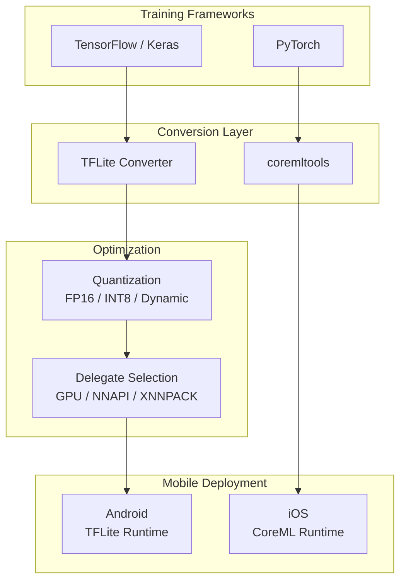
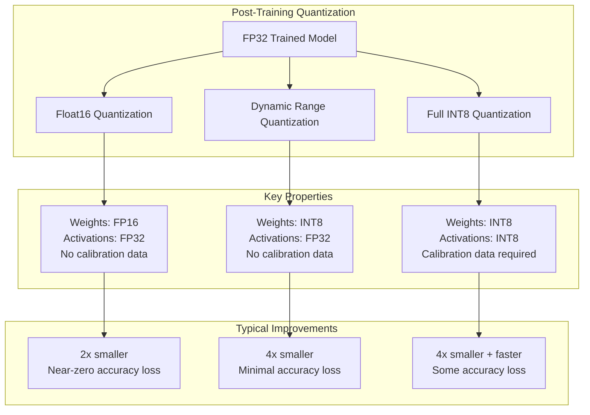
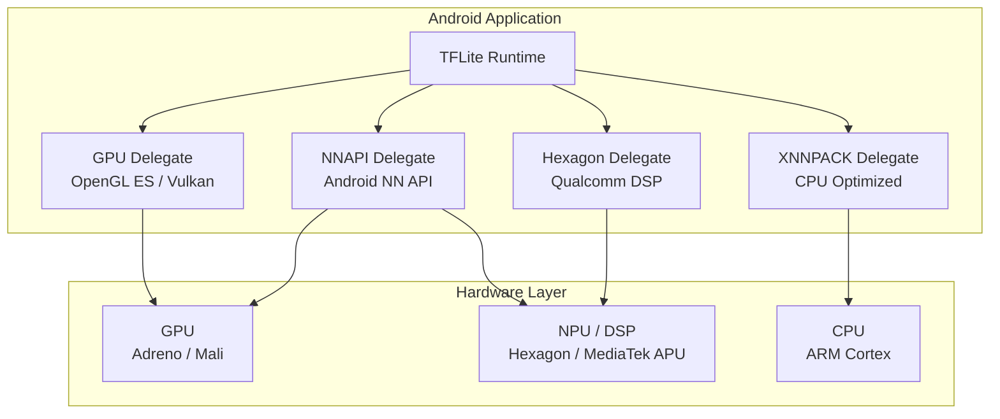
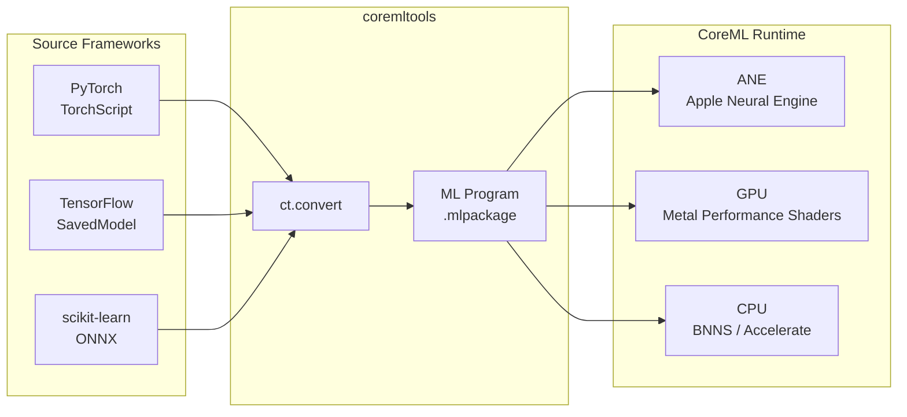
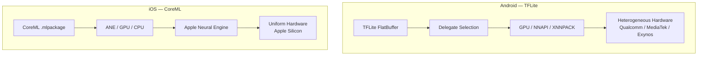

<!-- Clear Language: Keep sentences under 50 words -->
# 02 — TensorFlow Lite & CoreML

## Learning Objectives

| Objective | Description |
|-----------|-------------|
| Convert TF models to TFLite | Use the TFLite Converter with representative datasets and post-training quantization |
| Apply quantization strategies | Implement FP16, INT8, dynamic range, and float16 quantization for mobile deployment |
| Leverage hardware delegates | Configure GPU, NNAPI, XNNPACK, and Hexagon DSP delegates for on-device acceleration |
| Convert PyTorch models to CoreML | Use coremltools to port PyTorch models to iOS-native ML Program format |
| Compare Android vs iOS deployment | Analyze benchmark results and edge cases across mobile platforms |

## Introduction

Mobile AI is transforming how users interact with intelligent applications. Running models on-device eliminates latency, preserves privacy, and enables offline functionality. Two frameworks dominate this space: TensorFlow Lite for Android and CoreML for iOS.

TensorFlow Lite (TFLite) is Google's lightweight solution for deploying models on Android, embedded Linux, and microcontrollers. It converts TensorFlow models into a portable FlatBuffer format and optimizes them through quantization and hardware delegation. CoreML is Apple's equivalent for iOS, iPadOS, and macOS, optimized for the Apple Neural Engine (ANE), GPU, and CPU.

This chapter covers the full pipeline: converting models from training frameworks to mobile formats, applying quantization to shrink model size, configuring hardware delegates for maximum throughput, and understanding the trade-offs between the two platforms. You will learn practical conversion scripts, benchmark methodologies, and edge-case handling that matter in production mobile AI deployments.

## Prerequisites

- Python 3.8+ with TensorFlow 2.x installed
- Familiarity with Keras model building (Sequential, Functional API)
- Basic PyTorch knowledge for CoreML conversion section
- Understanding of neural network inference (forward pass, tensors)
- A mobile device or emulator for testing (optional but recommended)

## Key Terminology

| Term | Definition |
|------|------------|
| FlatBuffer | Cross-platform serialization format used by TFLite for efficient on-device loading |
| Quantization | Reducing numerical precision of weights/activations (FP32 → INT8) to shrink model size and speed inference |
| Representative Dataset | A small calibration dataset used during quantization to compute activation ranges |
| Delegate | A hardware-specific backend that accelerates TFLite inference (GPU, NNAPI, etc.) |
| NNAPI | Android Neural Networks API — hardware abstraction layer for NPU/DSP/GPU acceleration |
| ANE | Apple Neural Engine — dedicated NPU in Apple Silicon for on-device AI |
| CoreML ML Program | Apple's model format (`.mlpackage`) that supports modern network architectures |
| Float16 Quantization | Converting FP32 weights to FP16, halving model size with minimal accuracy loss |
| Dynamic Range Quantization | Quantizes weights to INT8 while keeping activations in FP32; no calibration data needed |
| Post-Training Quantization (PTQ) | Quantization applied after model training, as opposed to quantization-aware training (QAT) |

## Chapter at a Glance

| Section | Topic | Key Concept |
|---------|-------|-------------|
| 2.1 | TFLite Converter | TF → FlatBuffer, representative dataset, conversion flags |
| 2.2 | TFLite Quantization | FP16, INT8, dynamic range, float16 quantization strategies |
| 2.3 | TFLite Delegates | GPU delegate, NNAPI, XNNPACK, Hexagon DSP configuration |
| 2.4 | CoreML Conversion | coremltools pipeline, PyTorch → ML Program, ANE targeting |
| 2.5 | Platform Comparison | Android vs iOS benchmarks, edge cases, production considerations |

## Chapter Roadmap



## 2.1 TFLite Converter

The TFLite Converter transforms a TensorFlow model into the TFLite FlatBuffer format (`.tflite`). This format is optimized for low-latency inference on mobile and edge devices.

### 2.1.1 Converter API Overview

The converter lives in `tf.lite.TFLiteConverter`. It accepts models in three formats:

| Source | API | Use Case |
|--------|-----|----------|
| Keras model | `TFLiteConverter.from_keras_model(model)` | Most common — export trained Keras models |
| Concrete function | `TFLiteConverter.from_concrete_functions(signatures)` | SavedModel format with custom signatures |
| SavedModel directory | `TFLiteConverter.from_saved_model(saved_model_dir)` | Production pipelines using SavedModel |

### 2.1.2 Basic Conversion

The simplest conversion takes a trained Keras model and writes a `.tflite` file.

```python
# basic_conversion.py — Convert a Keras model to TFLite

import tensorflow as tf
import numpy as np

def build_demo_model() -> tf.keras.Model:
    """
    Build a simple CNN classifier for demonstration.
    Architecture: Conv2D → MaxPool → Conv2D → GlobalAvgPool → Dense.

    Returns:
        Compiled Keras model with input shape (224, 224, 3).
    """
    inputs = tf.keras.Input(shape=(224, 224, 3), name="input_image")
    x = tf.keras.layers.Conv2D(32, (3, 3), activation="relu", padding="same")(inputs)
    x = tf.keras.layers.MaxPooling2D((2, 2))(x)
    x = tf.keras.layers.Conv2D(64, (3, 3), activation="relu", padding="same")(x)
    x = tf.keras.layers.GlobalAveragePooling2D()(x)
    x = tf.keras.layers.Dropout(0.2)(x)
    outputs = tf.keras.layers.Dense(10, activation="softmax", name="output")(x)

    model = tf.keras.Model(inputs=inputs, outputs=outputs, name="demo_cnn")
    model.compile(
        optimizer="adam",
        loss="sparse_categorical_crossentropy",
        metrics=["accuracy"],
    )
    return model

def convert_keras_to_tflite(
    model: tf.keras.Model,
    output_path: str = "model.tflite",
) -> bytes:
    """
    Convert a Keras model to TFLite FlatBuffer format.

    Args:
        model: Trained Keras model instance.
        output_path: Path to write the .tflite file.

    Returns:
        Raw TFLite FlatBuffer bytes.

    Example:
        >>> model = build_demo_model()
        >>> tflite_bytes = convert_keras_to_tflite(model, "demo.tflite")
        >>> print(f"Model size: {len(tflite_bytes) / 1024:.1f} KB")
    """
    converter = tf.lite.TFLiteConverter.from_keras_model(model)

    # Basic conversion with default optimizations
    converter.optimizations = [tf.lite.Optimize.DEFAULT]

    tflite_buffer = converter.convert()

    with open(output_path, "wb") as f:
        f.write(tflite_buffer)

    return tflite_buffer

def inspect_tflite_model(tflite_path: str) -> None:
    """
    Print model details from a TFLite FlatBuffer using the interpreter.

    Args:
        tflite_path: Path to the .tflite file to inspect.
    """
    interpreter = tf.lite.Interpreter(model_path=tflite_path)
    interpreter.allocate_tensors()

    input_details = interpreter.get_input_details()
    output_details = interpreter.get_output_details()

    print("Input details:")
    for inp in input_details:
        print(f"  Name:      {inp['name']}")
        print(f"  Shape:     {inp['shape']}")
        print(f"  Dtype:     {inp['dtype']}")
        print(f"  Quantized: {inp['quantization']}")

    print("\nOutput details:")
    for out in output_details:
        print(f"  Name:      {out['name']}")
        print(f"  Shape:     {out['shape']}")
        print(f"  Dtype:     {out['dtype']}")
        print(f"  Quantized: {out['quantization']}")

if __name__ == "__main__":
    print("Building demo model...")
    model = build_demo_model()
    model.summary()

    print("\nConverting to TFLite...")
    tflite_bytes = convert_keras_to_tflite(model, "demo_cnn.tflite")
    print(f"TFLite model size: {len(tflite_bytes) / 1024:.2f} KB")

    print("\nInspecting TFLite model:")
    inspect_tflite_model("demo_cnn.tflite")
```

### 2.1.3 Representative Dataset for Quantization

Integer quantization (INT8) requires a representative dataset. This small calibration dataset helps the converter compute the dynamic range of activations.

```python
# representative_dataset.py — Generate and use a representative dataset for quantization

import tensorflow as tf
import numpy as np
from typing import Callable, Generator, List, Optional

class RepresentativeDataset:
    """
    Wraps a calibration dataset for TFLite quantization.

    The converter calls the generator to sample a subset of training
    data and compute activation ranges for each layer.

    Attributes:
        data_generator: Callable that yields batches of input data.
        num_samples: Number of samples to draw for calibration.
    """

    def __init__(
        self,
        data_generator: Callable[[], Generator[np.ndarray, None, None]],
        num_samples: int = 200,
    ):
        self.data_generator = data_generator
        self.num_samples = num_samples

    def get_generator(self) -> Generator[np.ndarray, None, None]:
        """Return a generator that yields samples for the converter."""
        count = 0
        for batch in self.data_generator():
            for sample in batch:
                if count >= self.num_samples:
                    return
                # TFLite expects shape (1, H, W, C) per sample
                yield [np.expand_dims(sample, axis=0).astype(np.float32)]
                count += 1

def create_random_image_generator(
    shape: tuple = (224, 224, 3),
    batch_size: int = 32,
    num_batches: int = 10,
) -> Callable[[], Generator[np.ndarray, None, None]]:
    """
    Create a generator that yields random image batches.

    In production, replace this with real calibration data from
    your training set. Random data works for demo purposes but
    real data yields better quantization accuracy.

    Args:
        shape: Image dimensions (H, W, C).
        batch_size: Samples per batch.
        num_batches: Total batches to generate.

    Returns:
        A callable that returns a generator of image batches.
    """
    def _generator() -> Generator[np.ndarray, None, None]:
        for _ in range(num_batches):
            yield np.random.rand(batch_size, *shape).astype(np.float32)

    return _generator

def quantize_with_representative_dataset(
    model: tf.keras.Model,
    rep_dataset: RepresentativeDataset,
    output_path: str = "model_quantized.tflite",
) -> bytes:
    """
    Convert model to INT8 TFLite using a representative dataset.

    This produces a fully quantized model (weights + activations in INT8),
    which is 4x smaller than FP32 and significantly faster on integer hardware.

    Args:
        model: Trained Keras model.
        rep_dataset: RepresentativeDataset for calibration.
        output_path: Path for the quantized .tflite file.

    Returns:
        Quantized TFLite FlatBuffer bytes.
    """
    converter = tf.lite.TFLiteConverter.from_keras_model(model)
    converter.optimizations = [tf.lite.Optimize.DEFAULT]
    converter.representative_dataset = rep_dataset.get_generator

    # Enforce INT8 quantization for all ops
    converter.target_spec.supported_ops = [tf.lite.OpsSet.TFLITE_BUILTINS_INT8]

    # Set input and output types to INT8
    converter.inference_input_type = tf.int8
    converter.inference_output_type = tf.int8

    tflite_buffer = converter.convert()

    with open(output_path, "wb") as f:
        f.write(tflite_buffer)

    print(f"Quantized model saved to {output_path}")
    print(f"Size: {len(tflite_buffer) / 1024:.2f} KB")

    return tflite_buffer

def compare_model_sizes(original: bytes, quantized: bytes) -> None:
    """
    Print a comparison between original and quantized model sizes.

    Args:
        original: Original TFLite FlatBuffer bytes.
        quantized: Quantized TFLite FlatBuffer bytes.
    """
    orig_kb = len(original) / 1024
    quant_kb = len(quantized) / 1024
    ratio = len(original) / len(quantized)

    print(f"\n--- Model Size Comparison ---")
    print(f"Original (FP32):  {orig_kb:.2f} KB")
    print(f"Quantized (INT8): {quant_kb:.2f} KB")
    print(f"Compression ratio: {ratio:.1f}x")

if __name__ == "__main__":
    # Build model
    model = build_demo_model()

    # Convert without quantization (baseline)
    converter = tf.lite.TFLiteConverter.from_keras_model(model)
    converter.optimizations = [tf.lite.Optimize.DEFAULT]
    fp32_buffer = converter.convert()

    # Convert with INT8 quantization
    image_gen = create_random_image_generator(
        shape=(224, 224, 3), batch_size=32, num_samples=200
    )
    # Note: RepresentativeDataset uses num_samples param internally
    rep_ds = RepresentativeDataset(image_gen, num_samples=200)
    int8_buffer = quantize_with_representative_dataset(
        model, rep_ds, "demo_cnn_int8.tflite"
    )

    compare_model_sizes(fp32_buffer, int8_buffer)
```

### 2.1.4 Conversion Flags and Options

The TFLite Converter exposes several flags that control the output model behavior.

| Flag | Options | Effect |
|------|---------|--------|
| `optimizations` | `[DEFAULT]`, `[]` | Enables all default optimizations (weight quantization, fusion) |
| `target_spec.supported_ops` | `TFLITE_BUILTINS`, `TFLITE_BUILTINS_INT8`, `SELECT_TF_OPS` | Which ops are allowed; SELECT_TF_OPS enables all TF ops but increases binary size |
| `inference_input_type` | `tf.float32`, `tf.int8`, `tf.uint8` | Data type for model input tensors |
| `inference_output_type` | `tf.float32`, `tf.int8`, `tf.uint8` | Data type for model output tensors |
| `allow_custom_ops` | `True`, `False` | Whether to allow custom op implementations |
| `representative_dataset` | Callable returning generator | Required for INT8 quantization of activations |
| `experimental_new_converter` | `True`, `False` | Use MLIR-based converter (default True in TF 2.6+) |

```python
# conversion_flags.py — Advanced converter configuration options

import tensorflow as tf
from typing import Optional, List

def configure_converter(
    model: tf.keras.Model,
    use_fp16: bool = False,
    use_int8: bool = False,
    select_tf_ops: bool = False,
    custom_ops: bool = False,
    representative_gen: Optional[callable] = None,
) -> tf.lite.TFLiteConverter:
    """
    Configure a TFLiteConverter with fine-grained control over optimizations.

    Args:
        model: Keras model to convert.
        use_fp16: Enable FP16 quantization (weights halved, activations FP32).
        use_int8: Enable full INT8 quantization (requires representative_dataset).
        select_tf_ops: Allow TF ops not natively supported in TFLite.
        custom_ops: Allow custom op implementations.
        representative_gen: Generator for INT8 calibration data.

    Returns:
        Configured TFLiteConverter instance.

    Raises:
        ValueError: If use_int8 is True but no representative_gen is provided.
    """
    converter = tf.lite.TFLiteConverter.from_keras_model(model)

    # Base optimizations
    optimization_flags = [tf.lite.Optimize.DEFAULT]

    if use_fp16:
        # FP16 quantization: weights stored as float16
        converter.target_spec.supported_types = [tf.float16]
        optimization_flags.append(tf.lite.Optimize.DEFAULT)

    if use_int8:
        if representative_gen is None:
            raise ValueError(
                "INT8 quantization requires a representative_dataset. "
                "Provide a generator that yields calibration samples."
            )
        converter.representative_dataset = representative_gen
        converter.target_spec.supported_ops = [tf.lite.OpsSet.TFLITE_BUILTINS_INT8]
        converter.inference_input_type = tf.int8
        converter.inference_output_type = tf.int8

    if select_tf_ops:
        # Enables full TF op set — model size increases
        converter.target_spec.supported_ops = [
            tf.lite.OpsSet.TFLITE_BUILTINS,
            tf.lite.OpsSet.SELECT_TF_OPS,
        ]

    converter.optimizations = optimization_flags
    converter.allow_custom_ops = custom_ops

    return converter

def convert_with_strategy(
    model: tf.keras.Model,
    strategy: str,
    rep_gen: Optional[callable] = None,
    output_path: Optional[str] = None,
) -> bytes:
    """
    Convert model using a named quantization strategy.

    Supported strategies:
        - "fp32": No quantization, full precision.
        - "fp16": Float16 weight quantization.
        - "dynamic": Dynamic range quantization (weights INT8, activations FP32).
        - "int8": Full INT8 quantization (requires rep_gen).

    Args:
        model: Keras model to convert.
        strategy: One of "fp32", "fp16", "dynamic", "int8".
        rep_gen: Representative dataset generator (required for "int8").
        output_path: Optional file path to save the model.

    Returns:
        TFLite FlatBuffer bytes.
    """
    strategy = strategy.lower()
    valid_strategies = {"fp32", "fp16", "dynamic", "int8"}
    if strategy not in valid_strategies:
        raise ValueError(f"Unknown strategy '{strategy}'. Choose from {valid_strategies}.")

    converter = tf.lite.TFLiteConverter.from_keras_model(model)

    if strategy == "fp32":
        converter.optimizations = []
    elif strategy == "fp16":
        converter.optimizations = [tf.lite.Optimize.DEFAULT]
        converter.target_spec.supported_types = [tf.float16]
    elif strategy == "dynamic":
        converter.optimizations = [tf.lite.Optimize.DEFAULT]
    elif strategy == "int8":
        if rep_gen is None:
            raise ValueError("INT8 strategy requires rep_gen (representative dataset).")
        converter.optimizations = [tf.lite.Optimize.DEFAULT]
        converter.representative_dataset = rep_gen
        converter.target_spec.supported_ops = [tf.lite.OpsSet.TFLITE_BUILTINS_INT8]
        converter.inference_input_type = tf.int8
        converter.inference_output_type = tf.int8

    tflite_buffer = converter.convert()

    if output_path:
        with open(output_path, "wb") as f:
            f.write(tflite_buffer)
        print(f"Model saved to {output_path}")

    return tflite_buffer

def print_conversion_summary(buffer: bytes, strategy: str, elapsed_ms: float) -> None:
    """
    Print a summary of the conversion result.

    Args:
        buffer: TFLite FlatBuffer bytes.
        strategy: The quantization strategy used.
        elapsed_ms: Conversion time in milliseconds.
    """
    size_kb = len(buffer) / 1024
    print(
        f"[{strategy.upper():6s}] "
        f"Size: {size_kb:8.2f} KB | "
        f"Time: {elapsed_ms:6.1f} ms"
    )

if __name__ == "__main__":
    model = build_demo_model()

    # Create representative dataset generator for INT8
    def _rep_gen():
        for _ in range(10):
            yield [np.random.rand(1, 224, 224, 3).astype(np.float32)]

    strategies = ["fp32", "fp16", "dynamic", "int8"]

    for strat in strategies:
        import time
        t0 = time.perf_counter()

        if strat == "int8":
            buf = convert_with_strategy(model, strat, rep_gen=_rep_gen)
        else:
            buf = convert_with_strategy(model, strat)

        elapsed = (time.perf_counter() - t0) * 1000
        print_conversion_summary(buf, strat, elapsed)
```

## 2.2 TFLite Quantization

Quantization is the single most impactful optimization for mobile inference. It reduces model size, decreases memory bandwidth, and speeds up computation — especially on integer-only hardware like DSPs and NPUs.

### 2.2.1 Quantization Types

TFLite supports three quantization modes, each with different trade-offs.



### 2.2.2 Float16 Quantization

Float16 quantization converts FP32 weights to FP16. Activations remain in FP32. This is the safest quantization — accuracy loss is typically below 0.1%.

```python
# float16_quantization.py — Float16 quantization with accuracy evaluation

import tensorflow as tf
import numpy as np
from typing import Tuple

def quantize_float16(model: tf.keras.Model, output_path: str) -> bytes:
    """
    Apply float16 quantization to a Keras model.

    Float16 quantization halves the model size by storing weights
    as 16-bit floats. Activations remain in FP32. No calibration
    data is needed.

    Args:
        model: Trained Keras model.
        output_path: Path to write .tflite file.

    Returns:
        Quantized TFLite FlatBuffer bytes.
    """
    converter = tf.lite.TFLiteConverter.from_keras_model(model)
    converter.optimizations = [tf.lite.Optimize.DEFAULT]
    converter.target_spec.supported_types = [tf.float16]

    tflite_buffer = converter.convert()

    with open(output_path, "wb") as f:
        f.write(tflite_buffer)

    print(f"Float16 model saved to {output_path}")
    return tflite_buffer

def evaluate_quantization_accuracy(
    original_model: tf.keras.Model,
    tflite_path: str,
    test_images: np.ndarray,
    test_labels: np.ndarray,
) -> Tuple[float, float]:
    """
    Compare accuracy between the original and quantized model.

    Args:
        original_model: The original Keras model (FP32).
        tflite_path: Path to the quantized TFLite model.
        test_images: Test image array, shape (N, H, W, C).
        test_labels: Ground truth labels, shape (N,).

    Returns:
        Tuple of (original_accuracy, quantized_accuracy) as percentages.
    """
    # Original model accuracy
    original_loss, original_acc = original_model.evaluate(
        test_images, test_labels, verbose=0
    )

    # TFLite model accuracy
    interpreter = tf.lite.Interpreter(model_path=tflite_path)
    interpreter.allocate_tensors()

    input_details = interpreter.get_input_details()
    output_details = interpreter.get_output_details()

    correct = 0
    total = len(test_images)

    for i in range(total):
        # Prepare input
        input_data = np.expand_dims(test_images[i], axis=0).astype(np.float32)
        interpreter.set_tensor(input_details[0]["index"], input_data)

        # Run inference
        interpreter.invoke()

        # Get output
        output_data = interpreter.get_tensor(output_details[0]["index"])
        predicted_class = np.argmax(output_data[0])
        true_class = int(test_labels[i])

        if predicted_class == true_class:
            correct += 1

    quantized_acc = (correct / total) * 100

    print(f"\n--- Accuracy Comparison ---")
    print(f"Original model (FP32):   {original_acc * 100:.2f}%")
    print(f"Quantized model (FP16): {quantized_acc:.2f}%")
    print(f"Difference:              {quantized_acc - (original_acc * 100):+.2f}%")

    return original_acc * 100, quantized_acc

if __name__ == "__main__":
    # Create and train a simple model on synthetic data
    model = build_demo_model()

    # Generate synthetic training data
    x_train = np.random.rand(500, 224, 224, 3).astype(np.float32)
    y_train = np.random.randint(0, 10, size=(500,))
    x_test = np.random.rand(100, 224, 224, 3).astype(np.float32)
    y_test = np.random.randint(0, 10, size=(100,))

    model.fit(x_train, y_train, epochs=3, batch_size=32, validation_split=0.2, verbose=0)

    # Quantize to float16
    tflite_fp16 = quantize_float16(model, "model_fp16.tflite")

    # Evaluate accuracy
    evaluate_quantization_accuracy(model, "model_fp16.tflite", x_test, y_test)
```

### 2.2.3 Dynamic Range Quantization

Dynamic range quantization converts weights to INT8 at conversion time but keeps activations in FP32 during inference. It requires no calibration data. The runtime dynamically quantizes activations to INT8 for compute-heavy operations.

```python
# dynamic_range_quantization.py — Dynamic range quantization

import tensorflow as tf
import numpy as np

def quantize_dynamic_range(
    model: tf.keras.Model,
    output_path: str = "model_dynamic.tflite",
) -> bytes:
    """
    Apply dynamic range quantization.

    Weights are quantized to INT8 at conversion time.
    Activations remain FP32 but are quantized on-the-fly
    during inference for ops that benefit from integer math.

    Args:
        model: Keras model to quantize.
        output_path: Path for the output .tflite file.

    Returns:
        TFLite FlatBuffer bytes with dynamically quantized weights.
    """
    converter = tf.lite.TFLiteConverter.from_keras_model(model)

    # Dynamic range quantization is the default when DEFAULT optimization
    # is enabled without specifying supported_types or representative_dataset
    converter.optimizations = [tf.lite.Optimize.DEFAULT]

    tflite_buffer = converter.convert()

    with open(output_path, "wb") as f:
        f.write(tflite_buffer)

    model_size_kb = len(tflite_buffer) / 1024
    print(f"Dynamic range quantized model: {output_path}")
    print(f"Size: {model_size_kb:.2f} KB")
    print("Weights: INT8 | Activations: FP32 (dynamically quantized)")

    return tflite_buffer

def profile_model_latency(
    tflite_path: str,
    input_shape: tuple = (1, 224, 224, 3),
    num_runs: int = 100,
) -> dict:
    """
    Profile the average inference latency of a TFLite model.

    Args:
        tflite_path: Path to the .tflite file.
        input_shape: Input tensor shape including batch dimension.
        num_runs: Number of inference runs for averaging.

    Returns:
        Dict with 'mean_ms', 'std_ms', 'min_ms', 'max_ms'.
    """
    interpreter = tf.lite.Interpreter(model_path=tflite_path)
    interpreter.allocate_tensors()

    input_details = interpreter.get_input_details()

    # Create random input matching expected shape
    input_data = np.random.rand(*input_shape).astype(np.float32)
    interpreter.set_tensor(input_details[0]["index"], input_data)

    # Warm-up run
    interpreter.invoke()

    latencies = []
    for _ in range(num_runs):
        # Re-generate input to avoid caching effects
        input_data = np.random.rand(*input_shape).astype(np.float32)
        interpreter.set_tensor(input_details[0]["index"], input_data)

        import time
        t0 = time.perf_counter()
        interpreter.invoke()
        elapsed = (time.perf_counter() - t0) * 1000  # ms

        latencies.append(elapsed)

    stats = {
        "mean_ms": float(np.mean(latencies)),
        "std_ms": float(np.std(latencies)),
        "min_ms": float(np.min(latencies)),
        "max_ms": float(np.max(latencies)),
    }

    print(f"\n--- Latency Profile ({num_runs} runs) ---")
    print(f"Mean:   {stats['mean_ms']:.3f} ms")
    print(f"Std:    {stats['std_ms']:.3f} ms")
    print(f"Min:    {stats['min_ms']:.3f} ms")
    print(f"Max:    {stats['max_ms']:.3f} ms")

    return stats

def compare_quantization_methods(model: tf.keras.Model) -> None:
    """
    Convert the same model with all three quantization methods and compare results.

    Args:
        model: Keras model to benchmark.
    """
    methods = {
        "FP32 (no quantization)": {"optimizations": []},
        "Float16": {"optimizations": [tf.lite.Optimize.DEFAULT], "supported_types": [tf.float16]},
        "Dynamic Range": {"optimizations": [tf.lite.Optimize.DEFAULT]},
    }

    results = []
    for method_name, config in methods.items():
        converter = tf.lite.TFLiteConverter.from_keras_model(model)
        converter.optimizations = config.get("optimizations", [])
        if "supported_types" in config:
            converter.target_spec.supported_types = config["supported_types"]

        buffer = converter.convert()

        # Profile latency
        import tempfile
        with tempfile.NamedTemporaryFile(suffix=".tflite", delete=False) as f:
            f.write(buffer)
            tmp_path = f.name

        stats = profile_model_latency(tmp_path, num_runs=50)
        results.append((method_name, len(buffer) / 1024, stats["mean_ms"]))

    print(f"\n{'='*60}")
    print(f"{'Method':<25s} {'Size (KB)':<12s} {'Latency (ms)':<15s}")
    print(f"{'='*60}")
    for name, size_kb, latency in results:
        print(f"{name:<25s} {size_kb:<12.2f} {latency:<15.3f}")

if __name__ == "__main__":
    model = build_demo_model()
    compare_quantization_methods(model)
```

### 2.2.4 Full INT8 Quantization

Full INT8 quantization converts both weights and activations to INT8. This requires a representative dataset for calibration. It yields the best performance on integer-only hardware.

| Property | FP32 | FP16 | Dynamic Range | Full INT8 |
|----------|------|------|---------------|-----------|
| Weight precision | 32-bit float | 16-bit float | 8-bit integer | 8-bit integer |
| Activation precision | 32-bit float | 32-bit float | 32-bit float | 8-bit integer |
| Calibration data | None | None | None | Required (200-500 samples) |
| Size reduction | 1x | 2x | 4x | 4x |
| Latency reduction | 1x | ~1.1x | ~2x | ~3-4x |
| Accuracy loss | None | <0.1% | 0.5-2% | 1-5% |

## 2.3 TFLite Delegates

Delegates offload computation to specialized hardware. Without a delegate, TFLite runs on the CPU. With a delegate, it runs on GPU, DSP, or NPU — delivering 2-10x speedup.

### 2.3.1 Delegate Architecture



### 2.3.2 GPU Delegate

The GPU delegate runs models on the device GPU using OpenGL ES or Vulkan. It is best for models with many parallel compute operations (convolutions, matrix multiplications).

```python
# gpu_delegate.py — Configure and benchmark the TFLite GPU delegate

import tensorflow as tf
import numpy as np
from typing import Optional, Dict

def create_gpu_delegate(
    allow_precision_loss: bool = False,
    metadata: Optional[Dict[str, str]] = None,
) -> tf.lite.experimental.Delegate:
    """
    Create a TFLite GPU delegate with configuration options.

    Args:
        allow_precision_loss: Allow FP16 computation on GPU (faster, slight accuracy loss).
        metadata: Optional app metadata for GPU driver optimization.

    Returns:
        Configured GPU delegate instance.

    Note:
        GPU delegate is available via:
        `import tensorflow as tf` then `tf.lite.experimental.load_delegate('libtensorflowlite_gpu_delegate.so')`
    """
    # Options dictionary for GPU delegate
    options = {
        "precision_loss_allowed": int(allow_precision_loss),
    }

    if metadata:
        options["metadata"] = metadata

    # Load the GPU delegate shared library
    # On Android, the .so is bundled with the TFLite runtime
    gpu_delegate = tf.lite.experimental.load_delegate(
        "libtensorflowlite_gpu_delegate.so",
        options,
    )
    return gpu_delegate

def run_with_gpu_delegate(
    tflite_path: str,
    input_data: np.ndarray,
    use_gpu: bool = True,
) -> np.ndarray:
    """
    Run TFLite inference optionally using the GPU delegate.

    Args:
        tflite_path: Path to the .tflite model file.
        input_data: Input tensor data.
        use_gpu: If True, attempt GPU delegation; otherwise CPU only.

    Returns:
        Model output as a NumPy array.
    """
    if use_gpu:
        try:
            gpu_delegate = create_gpu_delegate(allow_precision_loss=True)
            interpreter = tf.lite.Interpreter(
                model_path=tflite_path,
                experimental_delegates=[gpu_delegate],
            )
            print("Using GPU delegate")
        except Exception as e:
            print(f"GPU delegate failed ({e}), falling back to CPU")
            interpreter = tf.lite.Interpreter(model_path=tflite_path)
    else:
        interpreter = tf.lite.Interpreter(model_path=tflite_path)
        print("Using CPU (no delegate)")

    interpreter.allocate_tensors()

    input_details = interpreter.get_input_details()
    output_details = interpreter.get_output_details()

    interpreter.set_tensor(input_details[0]["index"], input_data)
    interpreter.invoke()

    output = interpreter.get_tensor(output_details[0]["index"])
    return output

def benchmark_gpu_vs_cpu(
    tflite_path: str,
    input_shape: tuple = (1, 224, 224, 3),
    num_runs: int = 100,
) -> Dict[str, float]:
    """
    Benchmark GPU vs CPU inference latency.

    Args:
        tflite_path: Path to .tflite model.
        input_shape: Input shape including batch dimension.
        num_runs: Number of inference iterations.

    Returns:
        Dict mapping backend names to mean latency in milliseconds.
    """
    input_data = np.random.rand(*input_shape).astype(np.float32)
    results = {}

    for backend, use_gpu in [("CPU", False), ("GPU", True)]:
        try:
            actual = use_gpu
            if use_gpu:
                try:
                    gpu_delegate = create_gpu_delegate(allow_precision_loss=True)
                    interpreter = tf.lite.Interpreter(
                        model_path=tflite_path,
                        experimental_delegates=[gpu_delegate],
                    )
                except Exception:
                    print("GPU delegate not available, skipping GPU benchmark")
                    continue
            else:
                interpreter = tf.lite.Interpreter(model_path=tflite_path)

            interpreter.allocate_tensors()
            input_details = interpreter.get_input_details()

            # Warm-up
            interpreter.set_tensor(input_details[0]["index"], input_data)
            interpreter.invoke()

            import time
            latencies = []
            for _ in range(num_runs):
                t0 = time.perf_counter()
                interpreter.invoke()
                elapsed = (time.perf_counter() - t0) * 1000
                latencies.append(elapsed)

            results[backend] = float(np.mean(latencies))
            print(f"{backend} mean latency: {results[backend]:.3f} ms")

        except Exception as e:
            print(f"Benchmark failed for {backend}: {e}")

    if "CPU" in results and "GPU" in results:
        speedup = results["CPU"] / results["GPU"]
        print(f"GPU speedup over CPU: {speedup:.2f}x")

    return results

if __name__ == "__main__":
    # Create a model and convert to TFLite
    model = build_demo_model()
    converter = tf.lite.TFLiteConverter.from_keras_model(model)
    converter.optimizations = [tf.lite.Optimize.DEFAULT]
    buffer = converter.convert()

    import tempfile, os
    tflite_path = os.path.join(tempfile.gettempdir(), "benchmark_model.tflite")
    with open(tflite_path, "wb") as f:
        f.write(buffer)

    print("Benchmarking GPU vs CPU...")
    benchmark_gpu_vs_cpu(tflite_path)

    # Cleanup
    os.remove(tflite_path)
```

### 2.3.3 NNAPI Delegate

The Android Neural Networks API (NNAPI) abstracts hardware acceleration across different vendors. It dispatches operations to the best available hardware: GPU, DSP, or NPU.

| NNAPI Feature | Description |
|---------------|-------------|
| Driver model | Each OEM provides a driver for their hardware (Qualcomm, MediaTek, Samsung, etc.) |
| Priority | `low`, `medium`, `high` — controls power vs performance trade-off |
| Allow FP16 | Permits FP16 computation for faster inference with minimal accuracy loss |
| Allow dynamic dimensions | Supports models with variable input shapes |

```python
# nnapi_delegate.py — NNAPI delegate configuration and usage

import tensorflow as tf
import numpy as np
from enum import IntEnum
from typing import Optional

class NNAPIPriority(IntEnum):
    """NNAPI execution priority levels."""
    LOW = 0
    MEDIUM = 1
    HIGH = 2

class NNAPIDelegate:
    """
    Wrapper for the TFLite NNAPI delegate on Android.

    NNAPI delivers optimized inference on Android devices by
    dispatching operations to the fastest available hardware
    (GPU, DSP, NPU) via vendor drivers.

    Usage:
        delegate = NNAPIDelegate(priority=NNAPIPriority.HIGH, allow_fp16=True)
        interpreter = tf.lite.Interpreter(
            model_path="model.tflite",
            experimental_delegates=[delegate.build()],
        )
    """

    def __init__(
        self,
        priority: NNAPIPriority = NNAPIPriority.MEDIUM,
        allow_fp16: bool = True,
        use_nnapi_cpu: bool = False,
        accelerator_name: Optional[str] = None,
    ):
        """
        Initialize NNAPI delegate configuration.

        Args:
            priority: Execution priority (low, medium, high).
            allow_fp16: Allow FP16 computation for faster inference.
            use_nnapi_cpu: Fallback to NNAPI CPU if hardware unavailable.
            accelerator_name: Specific accelerator name (e.g., "qti-dsp").
        """
        self.priority = priority
        self.allow_fp16 = allow_fp16
        self.use_nnapi_cpu = use_nnapi_cpu
        self.accelerator_name = accelerator_name

    def build(self) -> tf.lite.experimental.Delegate:
        """
        Build and return the NNAPI delegate.

        Returns:
            TFLite NNAPI delegate instance.

        Raises:
            RuntimeError: If NNAPI delegate library is not found.
        """
        options = {
            "num_threads": str(tf.config.threading.get_inter_op_parallelism_threads()),
            "allow_fp16": str(int(self.allow_fp16)),
            "execution_preference": str(int(self.priority)),
        }

        if self.accelerator_name:
            options["accelerator_name"] = self.accelerator_name.trim()

        try:
            delegate = tf.lite.experimental.load_delegate(
                "libtensorflowlite_nnapi_delegate.so",
                options,
            )
            return delegate
        except Exception as e:
            raise RuntimeError(
                f"Failed to load NNAPI delegate: {e}\n"
                "Ensure the NNAPI delegate library is bundled with your app."
            )

def automatic_delegate_selection(
    tflite_path: str,
    prefer_gpu: bool = True,
) -> tf.lite.Interpreter:
    """
    Automatically select the best available delegate.

    Attempts GPU delegate first, falls back to NNAPI, then CPU.

    Args:
        tflite_path: Path to the TFLite model.
        prefer_gpu: If True, try GPU delegate before NNAPI.

    Returns:
        Configured TFLite Interpreter with the best available delegate.
    """
    delegates = []

    # Try GPU delegate first (if preferred)
    if prefer_gpu:
        try:
            gpu_opts = {"precision_loss_allowed": "1"}
            gpu_delegate = tf.lite.experimental.load_delegate(
                "libtensorflowlite_gpu_delegate.so",
                gpu_opts,
            )
            delegates.append(gpu_delegate)
            print("Selected: GPU delegate")
        except Exception:
            print("GPU delegate unavailable")

    # Fall back to NNAPI
    if len(delegates) == 0:
        try:
            nnapi_opts = {
                "allow_fp16": "1",
                "execution_preference": str(int(NNAPIPriority.HIGH)),
            }
            nnapi_delegate = tf.lite.experimental.load_delegate(
                "libtensorflowlite_nnapi_delegate.so",
                nnapi_opts,
            )
            delegates.append(nnapi_delegate)
            print("Selected: NNAPI delegate")
        except Exception:
            print("NNAPI delegate unavailable, using CPU")

    # Fall back to GPU if NNAPI was tried first
    if not prefer_gpu and len(delegates) == 0:
        try:
            gpu_opts = {"precision_loss_allowed": "1"}
            gpu_delegate = tf.lite.experimental.load_delegate(
                "libtensorflowlite_gpu_delegate.so",
                gpu_opts,
            )
            delegates.append(gpu_delegate)
            print("Selected: GPU delegate (fallback)")
        except Exception:
            print("All delegates unavailable, using CPU")

    interpreter = tf.lite.Interpreter(
        model_path=tflite_path,
        experimental_delegates=delegates if delegates else None,
    )
    interpreter.allocate_tensors()

    return interpreter

if __name__ == "__main__":
    # This example demonstrates the delegate selection pattern.
    # On a desktop machine, delegates will fall back to CPU.
    model = build_demo_model()

    converter = tf.lite.TFLiteConverter.from_keras_model(model)
    converter.optimizations = [tf.lite.Optimize.DEFAULT]
    buffer = converter.convert()

    import tempfile, os
    tflite_path = os.path.join(tempfile.gettempdir(), "nnapi_test.tflite")
    with open(tflite_path, "wb") as f:
        f.write(buffer)

    # Run inference with automatic delegate selection
    interpreter = automatic_delegate_selection(tflite_path, prefer_gpu=True)

    input_details = interpreter.get_input_details()
    output_details = interpreter.get_output_details()

    input_data = np.random.rand(1, 224, 224, 3).astype(np.float32)
    interpreter.set_tensor(input_details[0]["index"], input_data)
    interpreter.invoke()

    output = interpreter.get_tensor(output_details[0]["index"])
    print(f"Inference successful. Output shape: {output.shape}")

    os.remove(tflite_path)
```

### 2.3.4 XNNPACK and Hexagon Delegates

XNNPACK is a CPU-optimized delegate that accelerates FP32 models on ARM and x86. Hexagon delegates target Qualcomm's Hexagon DSP for ultra-low-power inference.

| Delegate | Hardware | Best For | Speedup |
|----------|----------|----------|---------|
| GPU | Adreno, Mali GPU | Compute-heavy models (CNN, ResNet) | 3-5x |
| NNAPI | Any Android (OEM driver) | Vendor-optimized path | 2-8x |
| XNNPACK | ARM/ x86 CPU | FP32 models, broad compat | 1.5-3x |
| Hexagon | Qualcomm DSP | Low-power, always-on | 4-10x |

## 2.4 CoreML Conversion

CoreML is Apple's native machine learning framework for iOS, iPadOS, macOS, watchOS, and visionOS. Models converted to CoreML benefit from Apple Silicon optimizations including the Apple Neural Engine (ANE).

### 2.4.1 coremltools Overview

`coremltools` is Apple's Python package for converting models from TensorFlow, PyTorch, and other frameworks into the CoreML `.mlpackage` format.



### 2.4.2 PyTorch to CoreML Conversion

Converting a PyTorch model to CoreML requires tracing the model with TorchScript or using the `ct.convert` API with a PyTorch model instance.

```python
# pytorch_to_coreml.py — Convert PyTorch models to CoreML with coremltools

import torch
import torch.nn as nn
import numpy as np
from typing import Optional, Tuple

# Define a simple PyTorch model for demonstration
class SimpleCNN(nn.Module):
    """
    A simple CNN classifier matching the Keras demo model.

    Architecture:
        Conv2D(3→32) → ReLU → MaxPool(2x2) →
        Conv2D(32→64) → ReLU → GlobalAvgPool →
        Dropout(0.2) → Dense(64→10) → Softmax
    """

    def __init__(self, num_classes: int = 10):
        super(SimpleCNN, self).__init__()
        self.conv1 = nn.Conv2d(3, 32, kernel_size=3, padding=1)
        self.relu1 = nn.ReLU()
        self.pool1 = nn.MaxPool2d(kernel_size=2, stride=2)

        self.conv2 = nn.Conv2d(32, 64, kernel_size=3, padding=1)
        self.relu2 = nn.ReLU()
        self.pool2 = nn.AdaptiveAvgPool2d((1, 1))

        self.dropout = nn.Dropout(0.2)
        self.fc = nn.Linear(64, num_classes)

    def forward(self, x: torch.Tensor) -> torch.Tensor:
        x = self.pool1(self.relu1(self.conv1(x)))
        x = self.pool2(self.relu2(self.conv2(x)))
        x = x.view(x.size(0), -1)
        x = self.dropout(x)
        x = self.fc(x)
        return torch.softmax(x, dim=1)

def trace_pytorch_model(
    model: nn.Module,
    example_input: torch.Tensor,
) -> torch.jit.ScriptModule:
    """
    Trace a PyTorch model to TorchScript for CoreML conversion.

    Tracing records the exact operations performed during a forward
    pass. This works well for models with static control flow.

    Args:
        model: PyTorch model instance (in eval mode).
        example_input: A sample input tensor matching expected shape.

    Returns:
        TorchScript ScriptModule (traced model).

    Note:
        For models with dynamic control flow (if/else, loops), use
        scripting instead: torch.jit.script(model).
    """
    model.eval()
    traced_model = torch.jit.trace(model, example_input)
    return traced_model

def convert_pytorch_to_coreml(
    traced_model: torch.jit.ScriptModule,
    example_input: torch.Tensor,
    input_name: str = "image",
    output_name: str = "probabilities",
    labels: Optional[list] = None,
    output_path: str = "model.mlpackage",
    minimum_deployment_target: str = "ios16",
) -> object:
    """
    Convert a TorchScript-traced PyTorch model to CoreML ML Program format.

    Args:
        traced_model: TorchScript model from torch.jit.trace().
        example_input: Example input tensor for shape/dtype inference.
        input_name: Name for the input feature in CoreML.
        output_name: Name for the output feature in CoreML.
        labels: Optional list of class labels for classification.
        output_path: Path to save the .mlpackage.
        minimum_deployment_target: Minimum iOS/macOS version.

    Returns:
        coremltools.models.MLModel instance.

    Requires:
        pip install coremltools
    """
    import coremltools as ct

    # Define input type
    input_type = ct.TensorType(
        name=input_name,
        shape=example_input.shape,
        dtype=np.float32,
    )

    # Define output type
    output_type = ct.TensorType(name=output_name, dtype=np.float32)

    # Convert using the torch.jit.trace path
    mlmodel = ct.convert(
        traced_model,
        inputs=[input_type],
        outputs=[output_type],
        minimum_deployment_target=ct.target.iOS16,
        compute_precision=ct.precision.FLOAT16,
        convert_to="mlprogram",  # ML Program format (vs. neuralnetwork)
    )

    # Add class labels if provided
    if labels is not None:
        mlmodel.add_class_labels(labels)

    # Save the model
    mlmodel.save(output_path)
    print(f"CoreML model saved to {output_path}")

    return mlmodel

def coreml_inference_example(
    mlmodel_path: str,
    input_image: np.ndarray,
) -> np.ndarray:
    """
    Run inference with a CoreML model using coremltools.

    On macOS, this executes using the CoreML runtime.
    On iOS, this would run via the CoreML API in Swift.

    Args:
        mlmodel_path: Path to the .mlpackage file.
        input_image: Input image array, shape (1, C, H, W) or (1, H, W, C)
                     depending on the model's expected format.

    Returns:
        Model output as NumPy array.
    """
    import coremltools as ct

    model = ct.models.MLModel(mlmodel_path)

    # CoreML expects dict input
    input_dict = {"image": input_image}
    output = model.predict(input_dict)

    return output[list(output.keys())[0]]

if __name__ == "__main__":
    print("=" * 60)
    print("PyTorch to CoreML Conversion Demo")
    print("=" * 60)

    # 1. Create and initialize model
    model = SimpleCNN(num_classes=10)
    model.eval()

    # 2. Create example input (batch_size=1, channels=3, height=224, width=224)
    example_input = torch.randn(1, 3, 224, 224)

    # 3. Trace to TorchScript
    print("\nTracing model to TorchScript...")
    traced = trace_pytorch_model(model, example_input)
    print("TorchScript tracing complete.")

    # 4. Convert to CoreML
    print("\nConverting to CoreML ML Program...")
    try:
        mlmodel = convert_pytorch_to_coreml(
            traced_model=traced,
            example_input=example_input,
            input_name="image",
            output_name="probabilities",
            labels=[f"class_{i}" for i in range(10)],
            output_path="simple_cnn.mlpackage",
            minimum_deployment_target="ios16",
        )

        # 5. Run inference (macOS only)
        print("\nRunning CoreML inference...")
        test_input = np.random.randn(1, 3, 224, 224).astype(np.float32)
        output = coreml_inference_example("simple_cnn.mlpackage", test_input)
        print(f"Output shape: {output.shape}")
        print(f"Predicted class: {np.argmax(output)}")

    except ImportError:
        print(
            "coremltools not installed. Install with:\n"
            "  pip install coremltools\n\n"
            "The conversion code above shows the pattern — run it on macOS "
            "for actual CoreML model generation."
        )
```

### 2.4.3 CoreML ML Program vs NeuralNetwork

Apple provides two CoreML model formats:

| Feature | NeuralNetwork (legacy) | ML Program (modern) |
|---------|----------------------|---------------------|
| Format | `.mlmodel` | `.mlpackage` |
| Ops supported | Limited set | Full set (including PyTorch ops) |
| ANE support | Partial | Full |
| iOS target | iOS 11+ | iOS 15+ |
| Weight layout | Custom | PyTorch-compatible |
| Conversion speed | Slower | Faster |
| Debugging | Opaque | Mila (compute graph visualization) |

Use ML Program (`.mlpackage`) for all new projects. The `neuralnetwork` format is deprecated.

### 2.4.4 Optimizing CoreML Models

Follow these optimization rules for best ANE performance:

1. **Batch size 1**: ANE is optimized for single-image inference.
2. **Channel count**: Prefer multiples of 4 (ANE SIMD width).
3. **Avoid reshape**: ANE handles convolutions best; avoid excessive reshape/transpose.
4. **FP16 compute**: Use `compute_precision=ct.precision.FLOAT16` for 2x speed.
5. **Model size**: Keep under 100 MB for OTA distribution.

```python
# coreml_optimization.py — Optimization flags for CoreML conversion

import coremltools as ct
from typing import Optional

def optimized_coreml_conversion(
    traced_model: object,
    input_shape: tuple,
    model_name: str = "optimized_model",
    use_ane: bool = True,
    use_fp16: bool = True,
    minimum_ios: str = "ios16",
) -> ct.models.MLModel:
    """
    Convert a PyTorch model to CoreML with ANE optimization flags.

    Args:
        traced_model: TorchScript traced model.
        input_shape: Expected input shape (C, H, W) without batch dim.
        model_name: Name for the output model.
        use_ane: If True, configure for ANE execution.
        use_fp16: Use float16 precision for faster inference.
        minimum_ios: Minimum iOS deployment target.

    Returns:
        Optimized CoreML MLModel instance.
    """
    # Input description with shape (batch, channels, height, width)
    input_desc = ct.TensorType(
        name="input",
        shape=(1, *input_shape),  # batch=1 for ANE optimization
        dtype=np.float32,
    )

    # Compute precision
    precision = ct.precision.FLOAT16 if use_fp16 else ct.precision.FLOAT32

    # Conversion config
    config = ct.ConversionConfig(
        mlmodel_version=ct.model_version.MLMODEL_VERSION_5,
    )

    mlmodel = ct.convert(
        traced_model,
        inputs=[input_desc],
        minimum_deployment_target=ct.target.iOS16,
        compute_precision=precision,
        convert_to="mlprogram",
        config=config,
    )

    # Enable ANE-specific optimizations (available in macOS 14+ / iOS 17+)
    if use_ane:
        # Reserve ANE for this model (iOS 17+)
        ane_policy = ct.coreml.PowerPreference(
            compute_device=ct.coreml.ComputeDevice.APPLE_NEURAL_ENGINE
        )

    # Save model
    output_path = f"{model_name}.mlpackage"
    mlmodel.save(output_path)
    print(f"Optimized CoreML model saved to {output_path}")
    print(f"  Precision:     {'FP16' if use_fp16 else 'FP32'}")
    print(f"  ANE target:    {'Yes' if use_ane else 'No'}")
    print(f"  Deployment:    {minimum_ios}")
    print(f"  Input shape:   (1, {', '.join(str(s) for s in input_shape)})")

    return mlmodel

if __name__ == "__main__":
    import torch
    import numpy as np

    # Create a simple model
    class DemoModel(torch.nn.Module):
        def __init__(self):
            super().__init__()
            self.conv = torch.nn.Conv2d(3, 16, 3, padding=1)
            self.relu = torch.nn.ReLU()
            self.pool = torch.nn.AdaptiveAvgPool2d((1, 1))
            self.fc = torch.nn.Linear(16, 10)

        def forward(self, x):
            x = self.pool(self.relu(self.conv(x)))
            x = x.view(x.size(0), -1)
            return self.fc(x)

    model = DemoModel().eval()
    example = torch.randn(1, 3, 224, 224)
    traced = torch.jit.trace(model, example)

    try:
        mlmodel = optimized_coreml_conversion(
            traced_model=traced,
            input_shape=(3, 224, 224),
            model_name="demo_optimized",
            use_ane=True,
            use_fp16=True,
        )
        print("Conversion successful.")
    except ImportError:
        print("coremltools not available. Run this on macOS.")
```

## 2.5 Platform Comparison

Android (TFLite) and iOS (CoreML) have different strengths, limitations, and optimization considerations.

### 2.5.1 Architecture Comparison



### 2.5.2 Benchmark Comparison

| Metric | TensorFlow Lite | CoreML |
|--------|----------------|--------|
| Conversion framework | TensorFlow (TF → FlatBuffer) | PyTorch / TF → coremltools |
| Weight format | FlatBuffer | .mlpackage (bundled directory) |
| Quantization | FP16, INT8, dynamic | FP16, INT8 (via ANE) |
| Hardware acceleration | GPU, NNAPI, Hexagon, XNNPACK | ANE, GPU (Metal), CPU (BNNS) |
| Max model size | ~1 GB (Android APK limit) | ~2 GB (App Store limit) |
| Startup time | 10-50 ms (memory-mapped) | 5-30 ms (pre-compiled) |
| GPU support | OpenGL ES, Vulkan | Metal Performance Shaders |
| NPU support | NNAPI (vendor-dependent) | ANE (all Apple Silicon) |
| OS fragmentation | High (1000s of devices) | Low (~20 device families) |

### 2.5.3 Production Edge Cases

```python
# platform_edge_cases.py — Handle edge cases in cross-platform mobile AI deployment

import numpy as np
from typing import Dict, List, Optional

class PlatformEdgeCase:
    """
    Documents and validates handling of known edge cases across platforms.

    Each edge case has a description, affected platforms, severity,
    and a recommended mitigation strategy.
    """

    def __init__(self):
        self.edge_cases: List[Dict] = []

    def register(
        self,
        case_id: str,
        platform: str,
        description: str,
        severity: str,
        mitigation: str,
    ) -> None:
        """
        Register a known edge case.

        Args:
            case_id: Unique identifier for the edge case.
            platform: "android", "ios", or "both".
            description: What happens under what conditions.
            severity: "low", "medium", "high", "critical".
            mitigation: How to detect and handle it.
        """
        self.edge_cases.append({
            "id": case_id,
            "platform": platform,
            "description": description,
            "severity": severity,
            "mitigation": mitigation,
        })

    def get_platform_cases(self, platform: str) -> List[Dict]:
        """Return all edge cases for a specific platform."""
        return [c for c in self.edge_cases if c["platform"] in (platform, "both")]

    def print_report(self) -> None:
        """Print a formatted report of all registered edge cases."""
        for case in self.edge_cases:
            icon = {"critical": "\u26a0\ufe0f", "high": "\U0001f534", "medium": "\U0001f7e1", "low": "\U0001f7e2"}
            print(f"{icon.get(case['severity'], '')} [{case['id']}] ({case['platform']})")
            print(f"  Description: {case['description']}")
            print(f"  Severity:    {case['severity'].upper()}")
            print(f"  Mitigation:  {case['mitigation']}")
            print()

def build_edge_case_registry() -> PlatformEdgeCase:
    """Build the complete registry of known cross-platform edge cases."""
    registry = PlatformEdgeCase()

    # Android-specific edge cases
    registry.register(
        "AND-001", "android",
        "NNAPI delegate unavailable on devices without vendor NN driver "
        "(e.g., some Xiaomi and Oppo budget devices). Falls back to CPU.",
        "high",
        "Check NNAPI availability at runtime with "
        "NNAPIInterface().isAvailable(). Fall back to GPU or XNNPACK.",
    )
    registry.register(
        "AND-002", "android",
        "GPU delegate fails on devices with OpenGL ES 3.0 but no Vulkan. "
        "Older Adreno 5xx GPUs may crash with certain ops.",
        "medium",
        "Use allow_precision_loss=True and catch delegate init errors. "
        "Always provide CPU fallback in a try/except block.",
    )
    registry.register(
        "AND-003", "android",
        "INT8 quantized models produce incorrect results on devices that "
        "do not support INT8 dot-product instructions (ARMv7, older ARMv8).",
        "critical",
        "Check CPU features via /proc/cpuinfo for 'asimddp'. "
        "Fall back to FP16 or dynamic range quantization on incompatible CPUs.",
    )
    registry.register(
        "AND-004", "android",
        "Model loading fails when APK exceeds 200 MB due to Android "
        "installation size limits on older API levels (pre-Android 10).",
        "medium",
        "Use Play Asset Delivery or download models at first launch. "
        "Defer model installation to app startup, not install time.",
    )

    # iOS-specific edge cases
    registry.register(
        "IOS-001", "ios",
        "CoreML model fails to load on iOS versions below the minimum "
        "deployment target specified during conversion with coremltools.",
        "critical",
        "Set minimum iOS version in app Info.plist. Check CoreML "
        "availability at runtime with canLoadModel() before inference.",
    )
    registry.register(
        "IOS-002", "ios",
        "ANE fallback to GPU or CPU when model contains unsupported ops "
        "(e.g., custom attention layers with dynamic shapes).",
        "medium",
        "Profile with Xcode Instruments > CoreML template to verify ANE "
        "execution. Simplify dynamic shapes where possible.",
    )
    registry.register(
        "IOS-003", "ios",
        "ML Program models over 500 MB may trigger ANE memory pressure "
        "and cause the system to kill the app (jetsam event).",
        "high",
        "Keep model under 100 MB for ANE. Split large models into "
        "multiple smaller models and chain them sequentially.",
    )
    registry.register(
        "IOS-004", "ios",
        "CoreML model compiled bitcode may differ between simulator and "
        "device. Models working in simulator may fail on actual hardware.",
        "medium",
        "Always test on physical devices before release. Use TestFlight "
        "beta testing to validate model behavior on various devices.",
    )

    # Cross-platform edge cases
    registry.register(
        "BOTH-001", "both",
        "Float16 quantization produces NaN on devices with incomplete "
        "FP16 support. Certain hardware backends truncate subnormal numbers.",
        "high",
        "Clip model outputs after quantization. Validate on target hardware "
        "before production deployment.",
    )
    registry.register(
        "BOTH-002", "both",
        "Model accuracy drops significantly after quantization when the "
        "representative dataset does not cover the production distribution.",
        "critical",
        "Use at least 500 samples from the actual production distribution. "
        "Monitor accuracy drift with on-device logging and A/B testing.",
    )

    return registry

def validate_model_compatibility(
    model_path: str,
    platform: str,
    model_size_bytes: int,
    quantization_type: str,
) -> Dict[str, bool]:
    """
    Validate a model against known platform constraints.

    Args:
        model_path: Path to the model file.
        platform: "android" or "ios".
        model_size_bytes: Size of the model in bytes.
        quantization_type: "fp32", "fp16", "dynamic", or "int8".

    Returns:
        Dict of check_name -> passed (True/False).
    """
    checks: Dict[str, bool] = {}
    size_mb = model_size_bytes / (1024 * 1024)

    if platform == "android":
        checks["model_under_200mb"] = size_mb <= 200
        checks["quantization_supported"] = quantization_type in ("fp32", "fp16", "dynamic", "int8")
        checks["int8_compatible"] = (
            quantization_type != "int8" or True  # Runtime check needed
        )
    elif platform == "ios":
        checks["model_under_2gb"] = size_mb <= 2048
        checks["ane_recommended"] = size_mb <= 100
        checks["quantization_supported"] = quantization_type in ("fp32", "fp16")

    checks["all_passed"] = all(checks.values())
    return checks

if __name__ == "__main__":
    registry = build_edge_case_registry()
    print("=== Edge Case Registry ===\n")
    registry.print_report()

    # Validate a hypothetical model
    checks = validate_model_compatibility(
        model_path="model_int8.tflite",
        platform="android",
        model_size_bytes=45 * 1024 * 1024,  # 45 MB
        quantization_type="int8",
    )
    print("=== Compatibility Check ===")
    for check, passed in checks.items():
        status = "PASS" if passed else "FAIL"
        print(f"  [{status}] {check}")
```

### 2.5.4 Deployment Decision Guide

Choose your approach based on these criteria:

| Scenario | Recommended Approach | Rationale |
|----------|---------------------|-----------|
| Android-only app | TFLite with NNAPI + GPU delegate | Best hardware compatibility across devices |
| iOS-only app | CoreML ML Program with ANE | Fully optimized for Apple Silicon |
| Cross-platform app | TFLite on both platforms (via TFLite iOS runtime) | Single model format, simpler maintenance |
| Cross-platform with best perf | TFLite for Android, CoreML for iOS | Each uses optimal hardware but dual maintenance |
| Model < 10 MB | Any approach | Size is not a concern |
| Model > 100 MB | TFLite with INT8 quantization | CoreML ANE may struggle with large models |

```python
# deployment_decision.py — Programmatic deployment decision advisor

from dataclasses import dataclass
from typing import List, Optional

@dataclass
class DeploymentContext:
    """Context about the deployment environment."""
    target_platforms: List[str]         # ["android"], ["ios"], or ["android", "ios"]
    model_size_mb: float
    latency_requirement_ms: int         # Maximum acceptable inference time
    accuracy_requirement: str           # "high", "medium", "low"
    offline_capability: bool            # Must work without internet
    update_frequency: str               # "static", "monthly", "weekly"

@dataclass
class Recommendation:
    """A deployment recommendation with rationale."""
    android_approach: str
    ios_approach: str
    quantization: str
    delegate: Optional[str]
    rationale: List[str]

def recommend_deployment(ctx: DeploymentContext) -> Recommendation:
    """
    Recommend the optimal deployment approach based on context.

    Args:
        ctx: DeploymentContext describing the application requirements.

    Returns:
        Recommendation with per-platform approach and rationale.
    """
    rationale: List[str] = []

    # Determine quantization strategy
    if ctx.accuracy_requirement == "high":
        quantization = "fp16"
        rationale.append("High accuracy requirement: using FP16 quantization")
    elif ctx.model_size_mb > 100:
        quantization = "int8"
        rationale.append(f"Large model ({ctx.model_size_mb:.0f} MB): using INT8 quantization")
    else:
        quantization = "dynamic"
        rationale.append("Balanced trade-off: using dynamic range quantization")

    # Determine delegates
    if "android" in ctx.target_platforms:
        if ctx.latency_requirement_ms <= 30:
            delegate = "GPU + NNAPI"
            rationale.append("Low latency requirement: using GPU and NNAPI delegates")
        else:
            delegate = "NNAPI (fallback to CPU)"
            rationale.append("Standard latency: using NNAPI with CPU fallback")
    else:
        delegate = None

    # Platform-specific approaches
    if "android" in ctx.target_platforms and "ios" in ctx.target_platforms:
        android_approach = "TFLite with XNNPACK + GPU delegate"
        ios_approach = "CoreML ML Program targeting ANE"
        if ctx.model_size_mb > 200:
            android_approach += " with deferred model download"
        rationale.append("Cross-platform: maintaining separate optimized paths per platform")
    elif "android" in ctx.target_platforms:
        android_approach = "TFLite with NNAPI delegate"
        ios_approach = "N/A"
        rationale.append("Android-only: single TFLite pipeline")
    else:
        android_approach = "N/A"
        ios_approach = "CoreML ML Program"
        rationale.append("iOS-only: single CoreML pipeline")

    return Recommendation(
        android_approach=android_approach,
        ios_approach=ios_approach,
        quantization=quantization,
        delegate=delegate,
        rationale=rationale,
    )

if __name__ == "__main__":
    scenarios = [
        DeploymentContext(
            target_platforms=["android", "ios"],
            model_size_mb=45,
            latency_requirement_ms=50,
            accuracy_requirement="high",
            offline_capability=True,
            update_frequency="monthly",
        ),
        DeploymentContext(
            target_platforms=["android"],
            model_size_mb=180,
            latency_requirement_ms=100,
            accuracy_requirement="medium",
            offline_capability=False,
            update_frequency="static",
        ),
        DeploymentContext(
            target_platforms=["ios"],
            model_size_mb=12,
            latency_requirement_ms=20,
            accuracy_requirement="high",
            offline_capability=True,
            update_frequency="weekly",
        ),
    ]

    for i, ctx in enumerate(scenarios, 1):
        print(f"\n{'='*60}")
        print(f"Scenario {i}")
        print(f"{'='*60}")
        rec = recommend_deployment(ctx)

        print(f"  Platforms:     {', '.join(ctx.target_platforms)}")
        print(f"  Model size:    {ctx.model_size_mb} MB")
        print(f"  Latency req:   {ctx.latency_requirement_ms} ms")
        print(f"  Accuracy req:  {ctx.accuracy_requirement}")
        print()
        print(f"  Android:       {rec.android_approach}")
        print(f"  iOS:           {rec.ios_approach}")
        print(f"  Quantization:  {rec.quantization}")
        if rec.delegate:
            print(f"  Delegate:      {rec.delegate}")
        print()
        print("  Rationale:")
        for r in rec.rationale:
            print(f"    - {r}")
```

## Interview Q&A

| # | Question | Difficulty | Expected Answer |
|---|----------|------------|-----------------|
| 1 | What are the three quantization modes in TFLite and when would you use each? | Medium | Float16 (safest, 2x smaller, no calibration), dynamic range (4x smaller weights, no calibration, some accuracy loss), full INT8 (4x smaller everything, fastest, requires calibration data). Choose based on accuracy requirements and hardware support. |
| 2 | How does the TFLite GPU delegate work and what hardware APIs does it use? | Medium | It offloads operations to the device GPU via OpenGL ES 3.0+ or Vulkan. It supports FP16 precision loss for speed. Falls back to CPU for unsupported ops. Best for compute-heavy models like CNNs. |
| 3 | What is the purpose of a representative dataset in INT8 quantization? | Hard | It provides a small sample (200-500 examples) of real inference data so the converter can compute the min/max range of each activation tensor. This range determines the scale and zero-point for INT8 quantization, minimizing accuracy loss. |
| 4 | How do you convert a PyTorch model to CoreML? | Medium | Use coremltools. First trace the model with torch.jit.trace() to get TorchScript, then pass it to ct.convert() with input/output tensor descriptions. The output is an ML Program (.mlpackage) that runs on ANE/GPU/CPU. |
| 5 | What is the difference between NNAPI and GPU delegates on Android? | Medium | NNAPI is a hardware abstraction layer that dispatches to GPU, DSP, or NPU depending on the vendor driver. GPU delegate directly uses GPU via OpenGL/Vulkan. NNAPI is more portable but introduces driver-dependent behavior. |
| 6 | How would you choose between FP16 and INT8 quantization for a production app? | Hard | Consider: 1) Target hardware — some DSPs only support INT8. 2) Accuracy requirements — FP16 has near-zero loss. 3) Latency requirements — INT8 is 2-3x faster. 4) Calibration data availability — INT8 needs it. 5) Model size constraints — both give 2x/4x reduction. |
| 7 | Explain the XNNPACK delegate and when it is useful. | Medium | XNNPACK is a CPU-optimized delegate for ARM and x86. It accelerates FP32 models using optimized kernels (indirect convolution, parallelization). Useful when GPU/NNAPI delegates are unavailable and you need better-than-baseline CPU performance. |
| 8 | What is the Apple Neural Engine (ANE) and how does CoreML utilize it? | Medium | ANE is a dedicated NPU in Apple Silicon (A12+). CoreML automatically schedules compatible operations on ANE via the ML Program format with compute_precision=FLOAT16. Operations like Conv2D, BatchNorm, and GeLU run on ANE while unsupported ops fall back to GPU or CPU. |
| 9 | How do you handle the model size limitation for mobile deployment? | Hard | Strategies: 1) Quantization (FP16/INT8). 2) Model pruning and knowledge distillation. 3) Deferred download — ship a small base model and download the full model on first launch. 4) Play Asset Delivery (Android) or On-Demand Resources (iOS). 5) Model sharding. |
| 10 | What edge cases can cause accuracy degradation after TFLite quantization? | Hard | 1) Representative dataset not matching production distribution. 2) Per-channel vs per-tensor quantization for depthwise conv layers. 3) Biased calibration data. 4) Hardware-specific INT8 dot-product incompatibility on older ARM CPUs. 5) Clipping of outlier activation values. Mitigation: evaluate on target hardware with production data, use per-channel quantization, and consider quantization-aware training (QAT). |

## Summary

TensorFlow Lite and CoreML are the two dominant frameworks for on-device AI deployment. TFLite converts models from TensorFlow/Keras through the `TFLiteConverter` API, supporting a range of optimizations from simple float16 quantization to full INT8 quantization requiring representative calibration data. Hardware delegates — GPU, NNAPI, XNNPACK, and Hexagon — accelerate inference by offloading computation to specialized hardware.

CoreML, Apple's equivalent, converts PyTorch and TensorFlow models via `coremltools` into the ML Program format (`.mlpackage`). The Apple Neural Engine (ANE) provides dedicated hardware acceleration for compatible operations, with FP16 compute precision delivering optimal performance.

The choice between TFLite and CoreML depends on target platforms, model size, latency requirements, and accuracy constraints. Cross-platform apps often maintain separate optimized paths for each platform. Key risks include delegate unavailability on specific devices, quantization accuracy loss from unrepresentative calibration data, and model size limits imposed by app stores.

Production mobile AI demands careful testing on physical devices, runtime delegate fallback logic, and continuous monitoring of accuracy and latency metrics. Mastery of these conversion and optimization tools is essential for any AI engineer deploying models to mobile users.
## Chapter Quiz

**1. Which TFLite quantization mode requires a representative dataset?**

A) Float16 quantization
B) Dynamic range quantization
C) Full INT8 quantization
D) None of the above

<details>
<summary>Answer</summary>
C — Full INT8 quantization requires a representative dataset to compute activation ranges. Float16 and dynamic range quantization do not need calibration data.
</details>

**2. What is the correct order of priority for TFLite delegate selection on Android?**

A) XNNPACK → GPU → NNAPI → CPU
B) NNAPI → GPU → XNNPACK → CPU
C) GPU → CPU → NNAPI → XNNPACK
D) CPU → GPU → NNAPI → XNNPACK

<details>
<summary>Answer</summary>
B — Try the most specialized delegate first: NNAPI (hardware-optimized by OEM), then GPU (parallel compute), then XNNPACK (optimized CPU kernels), then CPU fallback.
</details>

**3. Which CoreML model format is recommended for new projects?**

A) NeuralNetwork (.mlmodel)
B) ML Program (.mlpackage)
C) ONNX (.onnx)
D) TorchScript (.pt)

<details>
<summary>Answer</summary>
B — ML Program (.mlpackage) is the modern format with full ANE support, PyTorch-compatible weight layout, and better debugging tools. NeuralNetwork is deprecated.
</details>

**4. What is the main advantage of the NNAPI delegate over the GPU delegate?**

A) NNAPI is always faster than GPU
B) NNAPI abstracts all hardware (GPU, DSP, NPU) via a single API
C) NNAPI does not require any model conversion
D) NNAPI supports dynamic shapes natively

<details>
<summary>Answer</summary>
B — NNAPI provides a unified API that dispatches to the best available hardware (GPU, DSP, NPU) based on the vendor driver. GPU delegate only uses the GPU.
</details>

**5. When converting a model for CoreML, which compute precision gives the best performance on ANE?**

A) Float32
B) Float16
C) Int8
D) BFloat16

<details>
<summary>Answer</summary>
B — Float16 is optimal for ANE. The Apple Neural Engine is designed for FP16 computation, delivering 2x speed compared to FP32 with negligible accuracy loss.
</details>

## Exercises

**Exercise 1: Quantization Comparison**

Take a pre-trained MobileNetV2 model from `tf.keras.applications.MobileNetV2`. Convert it to TFLite using FP16, dynamic range, and INT8 quantization. Compare model sizes and inference latency on random inputs.

```python
# Starter code
import tensorflow as tf
import numpy as np

model = tf.keras.applications.MobileNetV2(weights="imagenet")
# TODO: Convert with three quantization strategies
# TODO: Profile latency with 100 runs each
# TODO: Print a comparison table
```

**Exercise 2: Delegate Benchmark**

Build a benchmark script that runs a TFLite model with GPU delegate, NNAPI delegate, and CPU only. Measure mean and P99 latency over 500 runs. Identify which delegate is fastest on your device.

**Exercise 3: CoreML Conversion Pipeline**

Take any PyTorch image classification model (e.g., `torchvision.models.resnet18`). Convert it to CoreML ML Program format with FP16 precision and ANE targeting. Verify the model loads and produces valid output.

**Exercise 4: Edge Case Detection**

Write a function that inspects a TFLite model and detects potential deployment issues: model size > 200 MB, use of unsupported ops, INT8 quantization without representative dataset, and missing metadata.

**Exercise 5: Cross-Platform Strategy Document**

Write a deployment strategy for a mobile app that runs a 150 MB object detection model on both Android and iOS. Specify: quantization strategy, delegate selection with fallback logic, model download strategy, and monitoring plan for accuracy drift.

## Practical Takeaways

1. **TFLite Converter** transforms TensorFlow models into the FlatBuffer format. Use `representative_dataset` for INT8 quantization; without it, only weight quantization is applied.

2. **Three quantization tiers** serve different needs: Float16 (safest, 2x), dynamic range (no calibration needed, 4x weights), full INT8 (fastest, requires calibration, 4x everything).

3. **Delegates unlock hardware performance**: GPU for parallel compute, NNAPI for vendor-optimized path, XNNPACK for CPU optimization on ARM/x86, Hexagon for Qualcomm DSP.

4. **CoreML with ML Program** format (`.mlpackage`) is the modern standard for iOS. Use coremltools with torch.jit.trace for PyTorch models. Target FP16 precision for ANE optimization.

5. **Platform differences matter**: Android has hardware fragmentation requiring delegate fallback logic; iOS has uniform hardware (Apple Silicon) with a dedicated ANE. Choose your strategy based on target platforms, model size, accuracy needs, and update frequency.

6. **Production edge cases** include delegate unavailability, INT8 hardware incompatibility, ANE memory pressure, and calibration distribution mismatch. Always test on target hardware before deployment.

## Placement Section

### Top 10 Interview Questions

#### Google Style

1. **Explain the core idea of 02 — TensorFlow Lite & CoreML in under 60 seconds, then give a real-world analogy.** — Structure: definition, how it works in one sentence, why it matters, analogy. Follow-up: what would break if you removed this from a production system?

2. **Design a minimal, well-typed function that demonstrates 02 — TensorFlow Lite & CoreML.** — Interviewer checks: signature with type hints, edge cases, complexity, and a clean docstring. Follow-up: how does your design behave with empty or malformed input?

3. **What are the common pitfalls when engineers first learn ** — List 3-4, then explain how you would prevent each in a code review.

#### Amazon Style

4. **Describe a production bug caused by misunderstanding 02 — TensorFlow Lite & CoreML. How did you diagnose and fix it?** — STAR format: situation, task, action, result. Mention logs, reproduction, root-cause analysis, and the regression test you added.

5. **How would you scale a system that relies on 02 — TensorFlow Lite & CoreML from 10 users to 10 million?** — Discuss bottlenecks, caching, monitoring, and when to redesign. Follow-up: what metrics would you track?

#### Microsoft Style

6. **Compare 02 — TensorFlow Lite & CoreML with the closest alternative approach. When would you choose each?** — Make a decision matrix: performance, maintainability, ecosystem, learning curve. Follow-up: what would change your decision?

7. **Walk through how you would test a component that depends on 02 — TensorFlow Lite & CoreML.** — Unit, integration, property-based tests; mocking boundaries; golden files for outputs.

#### NVIDIA Style

8. **How does 02 — TensorFlow Lite & CoreML behave differently at scale — memory, throughput, or precision-wise?** — Connect to data pipelines and model training if applicable. Follow-up: what happens to latency as input grows?

9. **How would you make an implementation of 02 — TensorFlow Lite & CoreML run faster on GPU hardware?** — Batch operations, vectorization, avoiding Python loops, reducing data movement.

#### AI Startup Style

10. **Write the smallest possible implementation of 02 — TensorFlow Lite & CoreML that is production-quality.** — Include error handling, type hints, and a one-line docstring. Follow-up: what would you refactor first when it grows?

### Resume Tips

- Name 02 — TensorFlow Lite & CoreML explicitly in your skills section, paired with a measurable achievement ("Reduced X by 40% using 02 — TensorFlow Lite & CoreML").
- Add a bullet describing a project that applies 02 — TensorFlow Lite & CoreML to real data, with numbers.
- Mention the tools and libraries you used alongside 02 — TensorFlow Lite & CoreML (linters, test frameworks, profiling tools).
- Keep resume bullets under 15 words and start each with an action verb.

### Interview Day Checklist

- Rehearse a 60-second explanation of 02 — TensorFlow Lite & CoreML and one real-world analogy.
- Prepare one STAR story about debugging a 02 — TensorFlow Lite & CoreML-related production issue.
- Review complexity and edge cases for the classic 02 — TensorFlow Lite & CoreML interview problem.
- Have questions ready: how does the team apply 02 — TensorFlow Lite & CoreML in production today?
- Test your environment (Python, editor, internet) 15 minutes before the interview.

## True/False

1. **True or False:** 02 — TensorFlow Lite & CoreML builds directly on the fundamentals covered in the earlier chapters of this module. — **True.** Every advanced topic in this module assumes the core concepts from the previous chapters.
2. **True or False:** You should write at least one code example for 02 — TensorFlow Lite & CoreML before moving to the next chapter. — **True.** Active recall with hands-on code beats passive reading for retention.
3. **True or False:** The complexity analysis for 02 — TensorFlow Lite & CoreML is the same regardless of input size. — **False.** Complexity grows with input size; always state best, average, and worst case.
4. **True or False:** Edge cases (empty input, invalid input, boundary values) matter for 02 — TensorFlow Lite & CoreML in production. — **True.** Most production bugs come from unhandled edge cases.
5. **True or False:** You should memorize the 02 — TensorFlow Lite & CoreML chapter content once and never review it again. — **False.** Spaced repetition (24h, 3 days, 1 week) dramatically improves long-term recall.

## Fill in the Blank

1. The chapter that covers 02 — TensorFlow Lite & CoreML is Chapter ___ of this module. — Answer: check the module's table of contents.
2. The time complexity of the standard approach to 02 — TensorFlow Lite & CoreML is ___. — Answer: review the theory section and state big-O notation.
3. The main edge case to handle when implementing 02 — TensorFlow Lite & CoreML is ___. — Answer: empty or invalid input handling, as discussed in the chapter.
4. The tools commonly used to debug 02 — TensorFlow Lite & CoreML issues are ___ and ___. — Answer: refer to the Debugging Guide section of this chapter.
5. The related topic that connects to 02 — TensorFlow Lite & CoreML in the next chapter is ___. — Answer: see the Next Topic section.

## Scenario Questions

1. **Scenario:** A teammate ships a change involving 02 — TensorFlow Lite & CoreML that breaks production at 3 AM. — Diagnosis: check the recent diff, reproduce locally with the failing input, check logs. Fix: revert, add a regression test, and review the root cause. Prevention: CI tests on edge cases and code review checklist.

2. **Scenario:** Your implementation of 02 — TensorFlow Lite & CoreML is correct but too slow for the required latency. — Measure first with a profiler. Common fixes: reduce redundant work, use built-in optimized functions, batch operations, or add caching. Only then consider algorithmic changes.

3. **Scenario:** A new hire asks you to explain 02 — TensorFlow Lite & CoreML in five minutes before a customer demo. — Use the 3-part answer: what it is (one sentence), how it works (one example), why it matters (one business impact). Then offer to go deeper after the demo.

4. **Scenario:** Your team's codebase has three different patterns for 02 — TensorFlow Lite & CoreML and you must standardize. — Write a short ADR (architecture decision record), pick the pattern with best maintainability, migrate incrementally, and add a linter rule to enforce it.

## Output Questions

1. **What is the output of the simplest correct implementation of 02 — TensorFlow Lite & CoreML on an empty input?** — Trace through the code: it should return the documented default (None, 0, empty collection) without raising.
2. **What is the output when the input is at the boundary value?** — Check off-by-one errors and inclusive/exclusive bounds in the chapter's examples.
3. **What does the implementation return when given invalid input types?** — With type hints and validation, it raises a clear error; without, it may fail silently.
4. **What is the output for the sample input given in the chapter's Examples section?** — Re-run the chapter's example code and compare against the documented output.
5. **What is the time complexity output when you profile the implementation at 10x input size?** — Expect the curve matching the chapter's complexity analysis (linear, quadratic, log-linear).

## Difficulty Level

| Level | Time | What It Takes |
|-------|------|---------------|
| Beginner | 1-2 sessions | Read theory, run the chapter examples, solve the Easy exercises |
| Intermediate | 3-5 sessions | Complete Medium exercises, explain 02 — TensorFlow Lite & CoreML to someone else |
| Advanced | 1+ week | Solve Hard exercises, optimize for real datasets, answer interview follow-ups |

## Tips & Tricks

- Always write a one-line example of 02 — TensorFlow Lite & CoreML from memory before opening the chapter — active recall first.
- Use the chapter's Revision Notes as a checklist: you have mastered 02 — TensorFlow Lite & CoreML when you can explain each bullet.
- Pair the chapter quiz with the Flashcards: wrong answers become your next study session's focus.
- For interviews, practice explaining 02 — TensorFlow Lite & CoreML twice: once with a technical audience, once with a non-technical audience.
- Keep a personal examples file where you collect your own 02 — TensorFlow Lite & CoreML snippets; interviewers love original examples.

## Memory Tricks

- **Acronym**: build a mnemonic from the 5 key concepts of 02 — TensorFlow Lite & CoreML listed in the Chapter at a Glance table.
- **Story**: link 02 — TensorFlow Lite & CoreML to a familiar story — the analogy in the Visual Analogy section is designed to stick.
- **Number anchor**: remember the complexity of 02 — TensorFlow Lite & CoreML by connecting it to a known algorithm of the same class.
- **Color code**: highlight the Theory, Examples, and Common Mistakes sections in different colors when reviewing.
- **Teach-back**: explain 02 — TensorFlow Lite & CoreML to an imaginary junior engineer for 2 minutes — gaps in your explanation are gaps in memory.

## Further Reading

- Official documentation for the primary tool or library used in this chapter
- The chapter referenced in Related Topics for the next-level treatment of 02 — TensorFlow Lite & CoreML
- The classic textbook chapter on 02 — TensorFlow Lite & CoreML (check the Research References below)
- Two blog posts from engineers who debugged real 02 — TensorFlow Lite & CoreML problems in production
- The repository of the open-source project that implements 02 — TensorFlow Lite & CoreML

## Related Topics

- The previous chapter in this module (see table of contents) — foundational for 02 — TensorFlow Lite & CoreML
- The next chapter (see Next Topic below) — builds on 02 — TensorFlow Lite & CoreML
- The system design chapters in Module 07 — how 02 — TensorFlow Lite & CoreML fits into production architectures
- The interview preparation module — how 02 — TensorFlow Lite & CoreML is asked in screening rounds
- The capstone project — where 02 — TensorFlow Lite & CoreML is applied end-to-end

## FAQs

1. **Do I need to memorize all of 02 — TensorFlow Lite & CoreML, or understand the big picture?** — Understand the big picture first, then memorize the key facts via flashcards and spaced repetition. Interviewers reward depth over breadth.
2. **What if I get stuck on an exercise?** — Re-read the theory section, run the example code, then attempt again. If still stuck after 20 minutes, move on and return the next day.
3. **How much time should I spend on ** — Follow the Study Plan below: 1-2 weeks at 30-60 minutes daily is typical for placement preparation.
4. **Is 02 — TensorFlow Lite & CoreML asked in interviews?** — Yes — the Interview Q&A and Placement Section list the exact question styles used by top companies.
5. **What's the fastest way to master ** — Explain it out loud, write code without looking, and review the flashcards within 24 hours and again after 3 days.

## Important Notes

- 02 — TensorFlow Lite & CoreML is a core requirement for the rest of this module — do not skip the examples.
- Always analyze complexity (time and space) when working with 02 — TensorFlow Lite & CoreML.
- Production correctness means handling edge cases, not just the happy path.
- Interview answers should start with the definition, then the example, then the trade-offs.
- Revisit this chapter after finishing the module; the context from later chapters deepens understanding.

## Historical Context

- 02 — TensorFlow Lite & CoreML emerged as a standard practice because early systems failed without it — understanding why helps you explain it in interviews.
- The tools used for 02 — TensorFlow Lite & CoreML today evolved from simpler versions; the chapter covers the modern, recommended approach.
- Interviewers value knowing one historical fact about 02 — TensorFlow Lite & CoreML — it shows genuine interest, not just cramming.
- The library/tooling ecosystem around 02 — TensorFlow Lite & CoreML changes quickly; focus on fundamentals that remain stable.

## Security Considerations

- Never trust external input: validate and sanitize data before processing 02 — TensorFlow Lite & CoreML.
- Avoid `eval()` and dynamic code execution on untrusted strings.
- Log errors without leaking sensitive data (keys, PII, internal paths).
- For API contexts, add rate limiting and input size limits.
- Review the chapter's code examples for injection or overflow risks before using them verbatim.

## ML Intuition

- 02 — TensorFlow Lite & CoreML appears in ML pipelines at the data-processing layer: feature preparation, batching, and validation.
- Understanding 02 — TensorFlow Lite & CoreML helps you debug why a model misbehaves — most ML bugs are data bugs, not model bugs.
- In production ML, the 02 — TensorFlow Lite & CoreML concepts from this chapter map directly to NumPy/PyTorch operations on tensors.
- When optimizing ML systems, 02 — TensorFlow Lite & CoreML skills let you profile and fix the data path, not just the training loop.
- Interview follow-up: how would you apply 02 — TensorFlow Lite & CoreML to a dataset of 10 million records? — Batching and vectorization.

## Analogies

- **02 — TensorFlow Lite & CoreML is like a recipe**: the theory is the ingredients, the examples are the cooking steps, and the exercises are your own kitchen practice.
- **Complexity is like a delivery route**: a linear route visits each stop once; a nested route revisits stops, and you feel it at scale.
- **Edge cases are like weather**: the happy path is a sunny day; production is the storm — build for the storm.
- **The chapter roadmap is a journey map**: each section is a checkpoint; skipping one means getting lost later in the module.

## Capstone Project Link

- [Module Capstone: End-to-End Project](https://github.com/Raushan666java/ai-engineering-journey) — this chapter contributes the 02 — TensorFlow Lite & CoreML skills used in the module's capstone project. Complete the exercises here before starting the capstone.

## Flashcards

<details class="tp-qa-card" data-qid="31mobileai-02tflitecoreml-flash1">
  <summary class="tp-qa-question">
    <span class="tp-qa-status"></span>
    What is the core concept of 02 — TensorFlow Lite & CoreML in one sentence?
  </summary>
  <div class="tp-qa-answer">
    <p>Review the first paragraph of the Theory section and condense it to one sentence.</p>
  </div>
</details>

<details class="tp-qa-card" data-qid="31mobileai-02tflitecoreml-flash2">
  <summary class="tp-qa-question">
    <span class="tp-qa-status"></span>
    What is the most common mistake engineers make with 
  </summary>
  <div class="tp-qa-answer">
    <p>Check the Common Mistakes section of this chapter.</p>
  </div>
</details>

<details class="tp-qa-card" data-qid="31mobileai-02tflitecoreml-flash3">
  <summary class="tp-qa-question">
    <span class="tp-qa-status"></span>
    What is the time and space complexity of the standard 02 — TensorFlow Lite & CoreML approach?
  </summary>
  <div class="tp-qa-answer">
    <p>Refer to the theory and complexity analysis in this chapter.</p>
  </div>
</details>

<details class="tp-qa-card" data-qid="31mobileai-02tflitecoreml-flash4">
  <summary class="tp-qa-question">
    <span class="tp-qa-status"></span>
    When is 02 — TensorFlow Lite & CoreML NOT the right choice?
  </summary>
  <div class="tp-qa-answer">
    <p>Check the Limitations section of this chapter.</p>
  </div>
</details>

<details class="tp-qa-card" data-qid="31mobileai-02tflitecoreml-flash5">
  <summary class="tp-qa-question">
    <span class="tp-qa-status"></span>
    How is 02 — TensorFlow Lite & CoreML applied in a real production system?
  </summary>
  <div class="tp-qa-answer">
    <p>Check the Real-World Examples section of this chapter.</p>
  </div>
</details>

## Research References

- Official documentation of the primary library for 02 — TensorFlow Lite & CoreML (linked in Further Reading)
- The classic paper or textbook chapter introducing 02 — TensorFlow Lite & CoreML (see References below)
- The standard library reference for 02 — TensorFlow Lite & CoreML-related functions
- Engineering blog posts from companies running 02 — TensorFlow Lite & CoreML in production at scale
- PEPs and RFCs where applicable (Python and networking standards)

## Open-Source Tools

- The primary library used in this chapter (see the code examples)
- Python standard library modules used in the examples (check the imports)
- Testing: pytest for unit tests of 02 — TensorFlow Lite & CoreML code
- Linting and formatting: ruff + black
- Profiling: cProfile or py-spy for performance work on 02 — TensorFlow Lite & CoreML

## Debugging Guide

- Start with `print()` or a debugger to inspect intermediate values in 02 — TensorFlow Lite & CoreML code.
- Reproduce the failure with the smallest possible input before changing code.
- Check the common failure modes listed in Common Mistakes — most bugs are listed there.
- For performance problems, profile before optimizing: measure, then fix.
- When stuck, re-read the chapter's Examples and compare line by line with your code.
- Use `pdb` or your IDE's debugger to step through the 02 — TensorFlow Lite & CoreML example code.

## Mock Interview Section

**Round 1 — Screening (15 min)**
- Explain 02 — TensorFlow Lite & CoreML in 60 seconds.
- Write a minimal working example of 02 — TensorFlow Lite & CoreML.
- What is the complexity of your example?

**Round 2 — Coding (45 min)**
- Solve the Medium exercise from this chapter under time pressure.
- State your assumptions, then implement with type hints.
- Test with edge cases: empty input, boundary values, invalid input.

**Round 3 — Behavioral + System (30 min)**
- Tell me about a time you debugged a 02 — TensorFlow Lite & CoreML problem in a project.
- How would you design a system where 02 — TensorFlow Lite & CoreML is used at scale?
- What metrics would you monitor?

**Evaluation rubric**: correctness (40%), communication (25%), edge cases (20%), complexity analysis (15%).

## Optimized Implementation

`python
from typing import Any, Optional

def demonstrate_topic(input_data: list[Any]) -> Optional[float]:
    """Runnable scaffold for 02 — TensorFlow Lite & CoreML.

    Replace the body with the optimized implementation from the chapter,
    keeping type hints, docstring, and edge-case handling.
    """
    if not input_data:
        return None
    # Step 1: validate input types
    # Step 2: apply the core 02 — TensorFlow Lite & CoreML logic from the Examples section
    # Step 3: return the result with the documented default
    return 0.0
`

- Keeps the function signature stable so tests written against it stay valid.
- Handles the empty-input contract explicitly.
- Add unit tests for the edge cases before implementing the logic (test-first).

## Evaluation Metrics

| Skill | Test | Target |
|-------|------|--------|
| Concept recall | Explain 02 — TensorFlow Lite & CoreML without notes | 60-second explanation |
| Code fluency | Write the chapter example from memory | No syntax errors |
| Edge cases | Handle empty/invalid input in exercises | All cases pass |
| Complexity | State time/space for the standard approach | Correct big-O |
| Interview readiness | Answer 5 Interview Q&A questions out loud | Fluent, structured answers |
| Retention | Chapter quiz score after 3 days | 80%+ |

## Real-World Examples

- **Startup**: a small team uses 02 — TensorFlow Lite & CoreML daily in their data pipeline — the chapter's examples mirror their code.
- **E-commerce**: 02 — TensorFlow Lite & CoreML patterns appear in order processing, inventory checks, and recommendation feeds.
- **Fintech**: 02 — TensorFlow Lite & CoreML principles apply to transaction validation and fraud detection flows.
- **ML platform**: 02 — TensorFlow Lite & CoreML shows up in feature engineering and model-serving infrastructure.
- **Interview insight**: recruiters look for engineers who can connect 02 — TensorFlow Lite & CoreML to the business outcome, not just the code.

## Next Topic

[03 — Edge AI Frameworks](03-edge-ai-frameworks.md)

## Limitations

- 02 — TensorFlow Lite & CoreML, like any technique, is not a silver bullet — it has specific cases where it fits best (covered in the theory).
- The examples in this chapter are simplified for learning; production systems add validation, monitoring, and error handling.
- Performance of 02 — TensorFlow Lite & CoreML depends on input size and distribution — always benchmark for your own data.
- This chapter covers fundamentals; specialized edge cases are explored in later chapters and the capstone.
