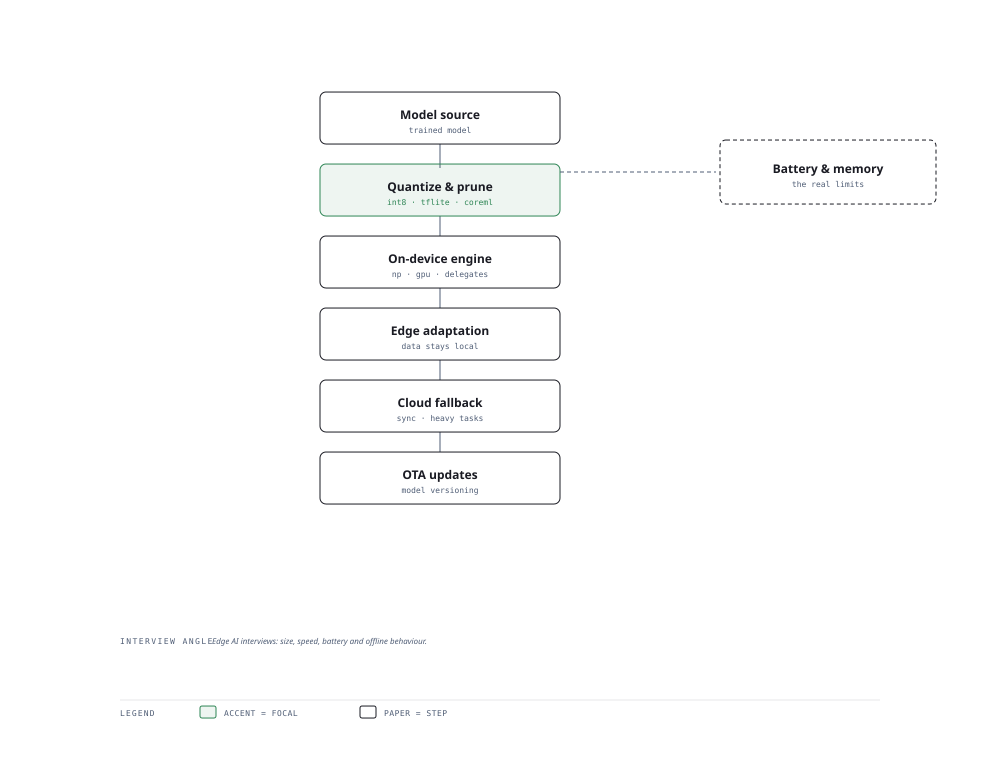

# Visual Notes — AI on Constrained Devices

> One diagram, the full picture. This page is meant to be glanced at before reading the chapters, and again before interviews.

# What the diagram shows

1. **Optimise** — Quantisation (ONNX, TFLite, CoreML) shrinks models to fit device memory and power.
1. **Run** — On-device inference keeps privacy and cuts latency on the phone/edge.
1. **Fallback** — Cloud handles the heavy, rare, or latency-tolerant cases; edge handles the steady state.

# Why this matters for placement

- On-device AI is a fast-growing niche; edge-vs-cloud split is a favourite architecture question.
- Naming trade-offs (privacy vs memory vs latency) marks real mobile-AI depth.

# Quick revision

- Quantisation (INT8) cuts size/latency at a small accuracy cost — the #1 edge trick.
- ONNX Runtime is the portability layer; TFLite/CoreML bake to the platform.
- Split the work: steady-state on device, hard cases over the network.
- Watch inference latency, model load time, and on-device memory.
- Offline capability is the UX win: no network, still intelligent.

# Related chapters

- [ONNX Runtime mobile](01-onnx-runtime-mobile.md)
- [TFLite CoreML](02-tflite-coreml.md)
- [Edge AI frameworks](03-edge-ai-frameworks.md)
- [Edge deployment patterns](04-edge-deployment-patterns.md)

---

**One-line answer for interviews:** *"Quantize → on-device inference → edge adaptation → cloud fallback on constrained devices."*
