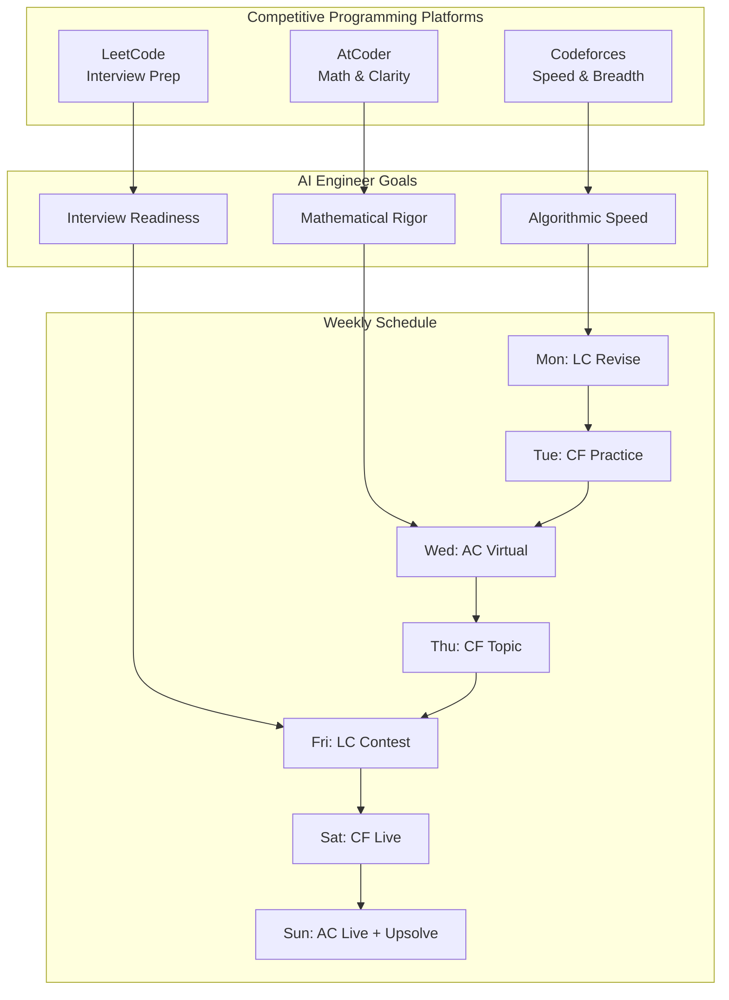
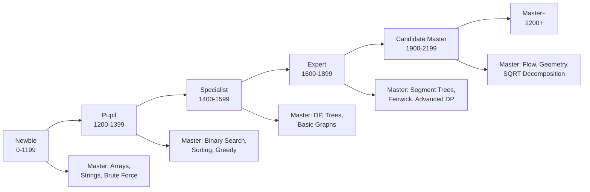
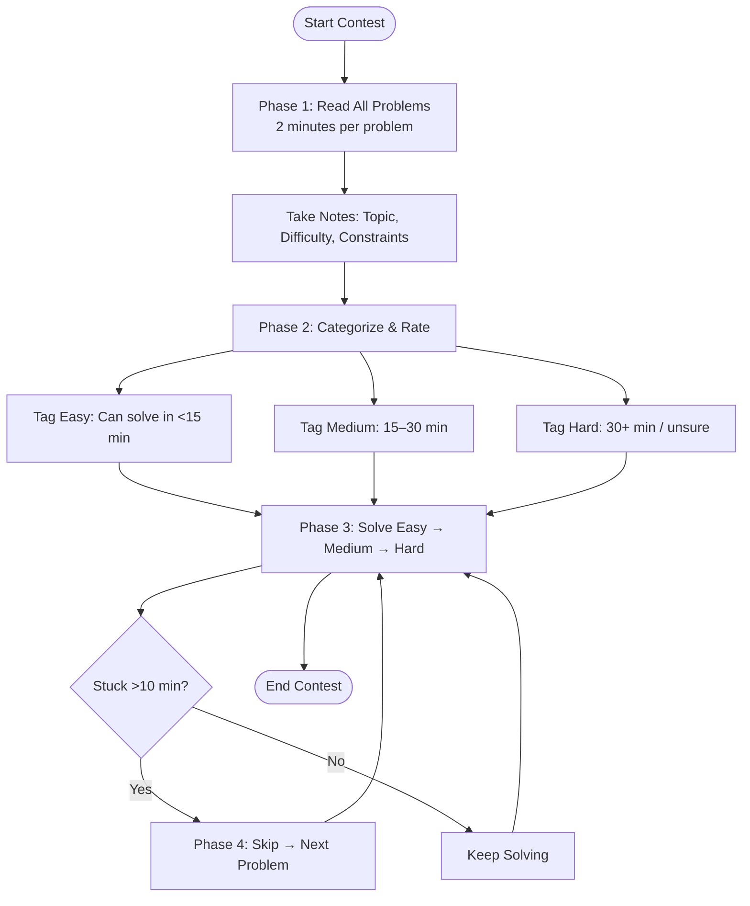

# 01 — Competitive Programming Strategy for AI Engineers

> **Module 32** · Chapter 01 · Difficulty: **Intermediate** · Reading Time: **35 minutes**

---

## Learning Objectives

By the end of this chapter, you will be able to:

1. **Set up and navigate** Codeforces, AtCoder, and LeetCode competitive programming platforms with a clear understanding of their rating systems and contest formats.
2. **Plan your rating progression** from Newbie to Candidate Master using structured milestones, topic mastery, and consistent practice schedules.
3. **Apply a systematic problem-solving strategy** that includes proper problem reading, categorization, time allocation, and knowing when to skip.
4. **Build a competitive programming template** in Python with fast I/O, debugging helpers, and a reusable snippet library for contest speed.
5. **Manage contest time effectively** across all three phases of a contest — the first 10 minutes, the middle grind, and the last hour push.
6. **Integrate CP skills into AI engineering interviews**, leveraging speed coding, algorithmic thinking, and pattern recognition for top-tier placements.

---

## Introduction

Competitive programming (CP) is the sport of writing correct and efficient code under time pressure. For an AI Engineer, CP is not just about winning contests — it is the single most effective way to sharpen the algorithmic thinking required for machine learning model design, optimization, and system-level problem solving.

Consider this: every major AI company — Google DeepMind, OpenAI, Meta AI, NVIDIA, and Anthropic — tests candidates on data structures and algorithms during technical interviews. The same skills that help you solve a Codeforces Div. 2 problem in 15 minutes help you design a custom attention mechanism, optimize a matrix multiplication kernel, or debug a distributed training pipeline.

This chapter gives you a complete competitive programming strategy tailored for AI engineers. You will learn which platforms matter, how ratings map to skill levels, how to read and categorize problems efficiently, how to build contest templates that save minutes, and how to manage a 2-hour contest like a pro.

> **Why this matters for AI Engineers:** Competitive programming trains your brain to think in terms of computational complexity, memory trade-offs, and edge cases — exactly the skills needed when training large models, writing custom CUDA kernels, or optimizing inference pipelines.

---

## Prerequisites

Before diving into this chapter, ensure you have:

| Prerequisite | Details |
|---|---|
| **Programming fundamentals** | Proficiency in Python (loops, recursion, lists, dictionaries, sets) |
| **Basic DSA knowledge** | Arrays, strings, stacks, queues, trees, graphs, sorting, searching |
| **Complexity analysis** | Big-O notation, space-time trade-offs |
| **Math foundations** | Modular arithmetic, combinatorics, basic probability |
| **Git/GitHub** | For maintaining your CP template library across devices |

If you have not completed the DSA module, review it first — this chapter assumes you can implement BFS, DFS, binary search, and basic DP independently.

---

## Key Terminology

| Term | Definition |
|---|---|
| **Rating** | Numerical score (typically Elo-based) that measures contest performance on a platform |
| **Div. 1 / Div. 2** | Codeforces contest divisions — Div. 1 for 1900+ rating, Div. 2 for < 2100 (overlap exists) |
| **ABC / ARC / AGC** | AtCoder Beginner, Regular, and Grand Contests (increasing difficulty) |
| **AC / WA / TLE / MLE** | Accepted / Wrong Answer / Time Limit Exceeded / Memory Limit Exceeded |
| **Upsolving** | Solving problems after a contest ends to learn from mistakes |
| **Rating change (Delta)** | The increase or decrease in rating after a contest |
| **Virtual participation** | Simulating a past contest under real time limits |
| **Segment tree / Fenwick** | Advanced data structures for range queries (critical for Expert+) |
| **ACL (AtCoder Library)** | Pre-built C++ / Python library for AtCoder with DS and math utilities |
| **Snippet** | Reusable code block (fast I/O, debug print, modular arithmetic) |

---

## Theory

### 1. Platform Setup — Codeforces, AtCoder, LeetCode

Choosing the right platform and understanding its rating system is the first step in a CP journey. Each platform serves a different purpose, and AI engineers benefit from using all three strategically.

#### 1.1 Codeforces (CF)

Codeforces is the world's most popular competitive programming platform, hosting contests nearly every week. It uses a **rating system** ranging from 0 to 4000+ with distinct color ranks.

```python
# Codeforces rating bands
CF_RATINGS = {
    "newbie":       (0, 1199,   "Gray"),
    "pupil":        (1200, 1399, "Green"),
    "specialist":   (1400, 1599, "Cyan"),
    "expert":       (1600, 1899, "Blue"),
    "candidate_master": (1900, 2199, "Purple"),
    "master":       (2200, 2499, "Orange"),
    "grandmaster":  (2500, 3000, "Red"),
}

# Get color for a given rating
def cf_color(rating: int) -> str:
    for title, (lo, hi, color) in CF_RATINGS.items():
        if lo <= rating <= hi:
            return color
    return "Legendary"  # 3000+
```

**Key features:**
- Div. 1 / Div. 2 / Div. 3 / Div. 4 contests — difficulty scales downward (Div. 4 is easiest)
- Problem tags concealment — you cannot see topic tags during contest (builds skill)
- **Hacking phase** — after Div. 2/3, you can view and hack others' solutions (teaches edge-case thinking)
- Rating changes are calculated using Elo-like formulas with contestant pools

```python
# Simplified rating change approximation
def expected_score(my_rating: float, opponent_rating: float) -> float:
    return 1.0 / (1.0 + 10 ** ((opponent_rating - my_rating) / 400.0))

def rating_delta(my_rating: float, opponents: list, rank: int, k: int = 32) -> float:
    """Approximate Codeforces rating change."""
    n = len(opponents) + 1
    expected_sum = sum(expected_score(my_rating, opp) for opp in opponents)
    expected_rank = expected_sum  # expected sum of scores
    actual_rank = rank
    return k * (actual_rank - expected_rank) / n
```

#### 1.2 AtCoder (ABC / ARC / AGC)

AtCoder is a Japanese platform with exceptionally well-written problems. Its rating system ranges from 0 to 2800+.

- **ABC (AtCoder Beginner Contest):** Weekly, 7 problems (A–G), suitable up to ~1600 rating
- **ARC (AtCoder Regular Contest):** Bi-weekly, harder problems for 1600–2400
- **AGC (AtCoder Grand Contest):** Monthly, very hard problems for 2400+
- AtCoder problems are known for **clean statements**, **mathematical depth**, and **no excessive implementation**

```python
# AtCoder performance bands
AC_RATINGS = {
    "beginner":      (0, 399,    "Gray"),
    "brown":         (400, 799,  "Brown"),
    "green":         (800, 1199, "Green"),
    "cyan":          (1200, 1599, "Cyan"),
    "blue":          (1600, 1999, "Blue"),
    "yellow":        (2000, 2399, "Yellow"),
    "orange":        (2400, 2799, "Orange"),
    "red":           (2800, 9999, "Red"),
}
```

#### 1.3 LeetCode

LeetCode is the primary interview preparation platform. Its weekly contests are shorter (90 minutes) and more focused on interview-style problems.

| Feature | Codeforces | AtCoder | LeetCode |
|---|---|---|---|
| **Contest frequency** | ~2–3 / week | ~2 / week | 1 weekly + 1 biweekly |
| **Contest length** | 2h – 2h 15m | 1h 40m (ABC) – 2h | 90 min |
| **Problem count** | 4–8 per contest | 7 (ABC) – 6 (ARC/AGC) | 4 |
| **Rating range** | 0 – 4000+ | 0 – 2800+ | 1500 – 3000+ |
| **Best for** | Speed & breadth | Math & clarity | Interview prep |
| **Language support** | 40+ languages | Python, C++, Java, Rust, etc. | 14 languages |
| **Hacking phase** | Yes | No | No |

#### 1.4 Platform Integration Strategy for AI Engineers

```python
# Weekly CP schedule for AI Engineering placement
WEEKLY_CP_PLAN = {
    "Monday":    {"platform": "LeetCode",   "activity": "Weekly Contest (revise)"},
    "Tuesday":   {"platform": "Codeforces",  "activity": "Practice — 2 Div. 2 problems"},
    "Wednesday": {"platform": "AtCoder",     "activity": "ABC virtual participation"},
    "Thursday":  {"platform": "Codeforces",  "activity": "Practice — DP + Graphs"},
    "Friday":    {"platform": "LeetCode",    "activity": "Biweekly / company tagged"},
    "Saturday":  {"platform": "Codeforces",  "activity": "Live contest (Div. 2/3)"},
    "Sunday":    {"platform": "AtCoder",     "activity": "ABC live + upsolving"},
}

def weekly_plan_summary() -> str:
    lines = ["### Weekly CP Plan for AI Engineers\n"]
    for day, info in WEEKLY_CP_PLAN.items():
        lines.append(f"- **{day}**: {info['platform']} — {info['activity']}")
    return "\n".join(lines)
```



---

### 2. Rating Progression — Newbie → Candidate Master

Rating progression in competitive programming follows predictable patterns. Understanding these stages helps you set realistic goals and select appropriate practice material.

#### 2.1 The Five Stages of CP Growth



#### 2.2 Stage-by-Stage Breakdown

**Stage 1: Newbie (0–1199)**

At this stage, you are learning the fundamentals. Focus on solving 100–150 problems across basic topics.

```python
# Newbie practice tracker
NEWBIE_TOPICS = {
    "arrays":         25,  # problems to solve
    "strings":        15,
    "sorting":        15,
    "brute_force":    20,
    "math_basics":    20,
    "implementation": 25,
}

def newbie_checklist() -> dict:
    """Returns completion status for newbie topics."""
    return {topic: f"{solved}/{target}" for topic, target in NEWBIE_TOPICS.items()}

# Sample newbie-level problem approach
def two_sum_brute(nums: list[int], target: int) -> list[int]:
    """O(n^2) — acceptable for n <= 1000 in Python."""
    n = len(nums)
    for i in range(n):
        for j in range(i + 1, n):
            if nums[i] + nums[j] == target:
                return [i, j]
    return []
```

**Stage 2: Pupil (1200–1399)**

You can solve easy problems quickly. Now learn binary search, two pointers, and basic greedy algorithms.

```python
# Pupil-level: Binary search
def binary_search(arr: list[int], x: int) -> int:
    """Returns index of x if present, else -1. O(log n)."""
    lo, hi = 0, len(arr) - 1
    while lo <= hi:
        mid = (lo + hi) // 2
        if arr[mid] == x:
            return mid
        if arr[mid] < x:
            lo = mid + 1
        else:
            hi = mid - 1
    return -1

# Pupil-level: Two pointers
def is_pair_sum(arr: list[int], x: int) -> bool:
    """Check if any pair sums to x in sorted array. O(n)."""
    i, j = 0, len(arr) - 1
    while i < j:
        cur = arr[i] + arr[j]
        if cur == x:
            return True
        if cur < x:
            i += 1
        else:
            j -= 1
    return False
```

**Stage 3: Specialist (1400–1599)**

Start dynamic programming, tree traversals, and basic graph algorithms. This is where most AI engineers plateau if they don't practice DP daily.

```python
# Specialist-level: 0/1 Knapsack (DP)
def knapsack(weights: list[int], values: list[int], capacity: int) -> int:
    """Classic DP — O(n * W) time, O(W) space."""
    n = len(weights)
    dp = [0] * (capacity + 1)
    for i in range(n):
        for w in range(capacity, weights[i] - 1, -1):
            dp[w] = max(dp[w], dp[w - weights[i]] + values[i])
    return dp[capacity]

# Specialist-level: DFS on tree
def tree_dfs(adj: list[list[int]], root: int) -> tuple:
    """Returns (parent, depth) arrays for a rooted tree."""
    n = len(adj)
    parent = [-1] * n
    depth = [0] * n
    stack = [root]
    parent[root] = root
    while stack:
        u = stack.pop()
        for v in adj[u]:
            if parent[v] == -1:
                parent[v] = u
                depth[v] = depth[u] + 1
                stack.append(v)
    return parent, depth
```

**Stage 4: Expert (1600–1899)**

You need segment trees, Fenwick trees, and advanced DP (bitmask DP, DP on trees). At this level, you can solve most LeetCode Hards and crack FAANG interviews.

```python
# Expert-level: Fenwick Tree (Binary Indexed Tree)
class Fenwick:
    """Range sum query with point updates. O(log n) per operation."""
    def __init__(self, n: int):
        self.n = n
        self.bit = [0] * (n + 1)

    def add(self, idx: int, delta: int) -> None:
        """Add delta at position idx (1-indexed)."""
        while idx <= self.n:
            self.bit[idx] += delta
            idx += idx & -idx

    def sum(self, idx: int) -> int:
        """Prefix sum from 1 to idx."""
        s = 0
        while idx > 0:
            s += self.bit[idx]
            idx -= idx & -idx
        return s

    def range_sum(self, l: int, r: int) -> int:
        """Sum in [l, r] inclusive."""
        return self.sum(r) - self.sum(l - 1)
```

**Stage 5: Candidate Master (1900–2199)**

Now you need flow algorithms, advanced geometry, SQRT decomposition, and the ability to solve any problem in Div. 2 (up to problem E/F).

#### 2.3 Milestone Tracking

```python
# Track your CP progression
class CPProgress:
    def __init__(self, handle: str):
        self.handle = handle
        self.cf_rating = 0
        self.ac_rating = 0
        self.lc_rating = 1500
        self.problems_solved = 0
        self.contests_attended = 0

    def update_ratings(self, cf: int = None, ac: int = None, lc: int = None):
        if cf is not None:
            self.cf_rating = cf
        if ac is not None:
            self.ac_rating = ac
        if lc is not None:
            self.lc_rating = lc

    def stage(self) -> str:
        """Returns current CP stage based on Codeforces rating."""
        cf = self.cf_rating
        if cf < 1200:
            return "Newbie"
        elif cf < 1400:
            return "Pupil"
        elif cf < 1600:
            return "Specialist"
        elif cf < 1900:
            return "Expert"
        elif cf < 2200:
            return "Candidate Master"
        else:
            return "Master"

    def next_milestone(self) -> str:
        stage = self.stage()
        milestones = {
            "Newbie": "Solve 150 problems, learn binary search + sorting",
            "Pupil": "Master DP basics, start tree traversals",
            "Specialist": "Segment trees, Fenwick, advanced DP",
            "Expert": "Flow algorithms, SQRT decomposition, geometry",
            "Candidate Master": "Target Master (2200) — solve Div. 1 problems",
        }
        return milestones.get(stage, "Contribute to CP community")

    def report(self) -> str:
        return (
            f"Handle: {self.handle}\n"
            f"Stage: {self.stage()}\n"
            f"CF Rating: {self.cf_rating}\n"
            f"AC Rating: {self.ac_rating}\n"
            f"LC Rating: {self.lc_rating}\n"
            f"Solved: {self.problems_solved} | "
            f"Contests: {self.contests_attended}\n"
            f"Next: {self.next_milestone()}"
        )
```

---

### 3. Problem-Solving Strategy — Read, Categorize, Allocate, Skip

A systematic approach to solving problems during contests separates consistent performers from frustrated participants.

#### 3.1 The Four-Phase Method



#### 3.2 Phase 1: Reading (First 10 minutes)

Spend the first 10 minutes reading **every** problem statement. Do not write code yet. For each problem, note:

```python
# Problem reading template — fill during contest
class ProblemNote:
    def __init__(self, label: str):
        self.label = label      # e.g., "A", "B", "C"
        self.topic_hint = ""    # e.g., "binary search", "DP", "greedy"
        self.constraints = ""   # e.g., "n <= 2000"
        self.estimated_tier = ""  # "easy", "medium", "hard"
        self.time_estimate = 0   # minutes
        self.notes = []

    def summarize(self) -> str:
        return (f"{self.label}: {self.topic_hint} | "
                f"n={self.constraints} | "
                f"Tier: {self.estimated_tier} | "
                f"ETA: {self.time_estimate}m")

# Quickly estimate problem difficulty from constraints
def estimate_tier(n: int) -> str:
    """Estimate solution complexity needed based on input size."""
    if n <= 20:
        return "O(2^n) or O(n!) possible — backtracking"
    elif n <= 100:
        return "O(n^3) acceptable — Floyd-Warshall / cubic DP"
    elif n <= 2000:
        return "O(n^2) acceptable — nested loops, 2D DP"
    elif n <= 200000:
        return "O(n log n) needed — sorting, segment tree"
    else:
        return "O(n) or O(1) required — greedy, math"
```

#### 3.3 Phase 2: Categorization (Next 5 minutes)

Assign each problem to a category. This lets your brain load the right mental model before you start coding.

```python
# Problem categorization system
PROBLEM_CATEGORIES = {
    "brute_force":     ["simulation", "implementation", "math"],
    "searching":       ["binary_search", "ternary_search", "two_pointers"],
    "sorting":         ["custom_sort", "inversion_count", "prefix_sums"],
    "greedy":          ["sorting_based", "priority_queue", "exchange_argument"],
    "dp":              ["knapsack", "LIS", "LCS", "bitmask", "tree_dp"],
    "graph":           ["bfs", "dfs", "dijkstra", "floyd", "mst"],
    "data_structures": ["segment_tree", "fenwick", "union_find", "trie"],
    "math":            ["number_theory", "combinatorics", "probability"],
    "strings":         ["kmp", "z_algorithm", "trie", "rolling_hash"],
}

def categorize_problem(statement_hints: list[str]) -> str:
    """Simple keyword-based categorization (human-guided in practice)."""
    for category, keywords in PROBLEM_CATEGORIES.items():
        for keyword in keywords:
            if keyword in " ".join(statement_hints).lower():
                return category
    return "unknown"
```

#### 3.4 Phase 3: Solve Order — Easy → Medium → Hard

Always solve in order of estimated difficulty, not in alphabetical order. The contest order (A, B, C, ...) is approximately sorted by difficulty, but not always.

```python
# Solve order optimizer
def solve_order(problems: list[ProblemNote]) -> list[str]:
    """Sort problems by estimated solving time (ascending)."""
    return sorted(problems, key=lambda p: p.time_estimate)
```

**General heuristic for Codeforces Div. 2:**
| Problem | Typical Rating | Estimated Time | Strategy |
|---|---|---|---|
| A | 800–900 | 5 min | Implement immediately |
| B | 1100–1300 | 10 min | Read carefully, check edge cases |
| C | 1400–1600 | 20 min | Pause and think before coding |
| D | 1700–1900 | 30–40 min | Invest only if A/B/C are solid |
| E | 2000–2200 | 40+ min | Skip unless you are Expert+ |

#### 3.5 Phase 4: Skip Strategy (The 10-Minute Rule)

If you are stuck on a problem for 10 minutes without making progress, **skip it** and move to the next. This is the single most important strategic skill in CP.

```python
# The 10-minute rule implementation (mental model)
class ContestTimer:
    def __init__(self, total_minutes: int = 135):
        self.total = total_minutes
        self.elapsed = 0
        self.problem_timers = {}

    def start_problem(self, label: str):
        self.problem_timers[label] = self.elapsed
        print(f"[{self.elapsed:02d}m] Starting {label}")

    def check_skip(self, label: str) -> bool:
        """Returns True if should skip (10 min without progress)."""
        started = self.problem_timers.get(label, self.elapsed)
        return (self.elapsed - started) >= 10

    def mark_progress(self, label: str):
        """Reset timer for a problem after making progress."""
        self.problem_timers[label] = self.elapsed

    def remaining(self) -> int:
        return self.total - self.elapsed
```

---

### 4. Template Building — Fast I/O, Debugging Helpers, Snippet Library

A good template saves 5–10 minutes per contest and reduces cognitive load. Build one template per language you use.

#### 4.1 Python Fast I/O Template

Python's default `input()` and `print()` are slow for large inputs. Use `sys.stdin.buffer.read()` for optimal speed.

```python
# ============================================================
# CP Template — Python 3.10+
# Author: AI Engineer CP Library
# ============================================================
import sys
import math
import collections
import bisect
import heapq
import itertools
import functools
import random
from typing import List, Tuple, Optional, Set, Dict, Any
from collections import deque, defaultdict, Counter

# -----------------------------------------------------------
# Fast I/O — use sys.stdin.buffer for large inputs (10^5+ lines)
# -----------------------------------------------------------
input_data = sys.stdin.buffer.read().split()
_input_iter = iter(input_data)

def next_int() -> int:
    """Read next integer from input."""
    return int(next(_input_iter))

def next_str() -> str:
    """Read next string from input."""
    return next(_input_iter).decode()

def next_ints(n: int) -> List[int]:
    """Read n integers."""
    return [next_int() for _ in range(n)]

def read_matrix(rows: int, cols: int) -> List[List[int]]:
    """Read a matrix of size rows x cols."""
    return [[next_int() for _ in range(cols)] for _ in range(rows)]

# -----------------------------------------------------------
# Output helpers — accumulate and flush at once
# -----------------------------------------------------------
_output = []

def out(*args, sep=" ", end="\n"):
    """Buffer output for batch printing."""
    _output.append(sep.join(str(a) for a in args) + end)

def flush():
    """Print all buffered output."""
    sys.stdout.write("".join(_output))
    _output.clear()
```

#### 4.2 Debugging Helpers

```python
# -----------------------------------------------------------
# Debug helpers — strip these in production contests
# -----------------------------------------------------------
DEBUG = False  # Toggle globally

def debug(*args, **kwargs):
    """Print debug info to stderr (ignored by judge)."""
    if DEBUG:
        print("[DEBUG]", *args, **kwargs, file=sys.stderr)

def trace_array(arr: List, name: str = "arr") -> None:
    """Pretty-print an array for debugging."""
    if DEBUG:
        debug(f"{name} ({len(arr)}): {arr[:20]}{'...' if len(arr) > 20 else ''}")

def trace_matrix(mat: List[List], name: str = "mat") -> None:
    """Pretty-print a matrix."""
    if DEBUG:
        debug(f"{name}:")
        for i, row in enumerate(mat[:5]):
            debug(f"  row {i}: {row[:10]}")

# -----------------------------------------------------------
# Assertions for stress testing
# -----------------------------------------------------------
def stress(condition: bool, msg: str = ""):
    """Assert in debug mode only."""
    if DEBUG and not condition:
        raise AssertionError(f"Stress failed: {msg}")

# -----------------------------------------------------------
# Performance timer
# -----------------------------------------------------------
import time

class Timer:
    """Simple context manager for timing code blocks."""
    def __init__(self, label: str = "block"):
        self.label = label

    def __enter__(self):
        self.start = time.perf_counter()
        return self

    def __exit__(self, *args):
        elapsed = time.perf_counter() - self.start
        if DEBUG:
            debug(f"{self.label}: {elapsed*1000:.2f}ms")
```

#### 4.3 Snippet Library — Core Algorithms

Keep these snippets ready in a file you can copy-paste from during contests.

```python
# -----------------------------------------------------------
# Snippet: Modular arithmetic
# -----------------------------------------------------------
MOD = 10**9 + 7

def mod_add(a: int, b: int) -> int:
    return (a + b) % MOD

def mod_sub(a: int, b: int) -> int:
    return (a - b) % MOD

def mod_mul(a: int, b: int) -> int:
    return (a * b) % MOD

def mod_pow(a: int, b: int) -> int:
    """Fast exponentiation O(log b)."""
    res = 1
    while b:
        if b & 1:
            res = res * a % MOD
        a = a * a % MOD
        b >>= 1
    return res

# -----------------------------------------------------------
# Snippet: Graph adjacency list
# -----------------------------------------------------------
def build_graph(n: int, edges: List[Tuple[int, int]],
                directed: bool = False) -> List[List[int]]:
    g = [[] for _ in range(n)]
    for u, v in edges:
        g[u].append(v)
        if not directed:
            g[v].append(u)
    return g

# -----------------------------------------------------------
# Snippet: Disjoint Set Union (Union-Find)
# -----------------------------------------------------------
class DSU:
    def __init__(self, n: int):
        self.parent = list(range(n))
        self.size = [1] * n

    def find(self, x: int) -> int:
        while self.parent[x] != x:
            self.parent[x] = self.parent[self.parent[x]]
            x = self.parent[x]
        return x

    def union(self, a: int, b: int) -> bool:
        a, b = self.find(a), self.find(b)
        if a == b:
            return False
        if self.size[a] < self.size[b]:
            a, b = b, a
        self.parent[b] = a
        self.size[a] += self.size[b]
        return True

# -----------------------------------------------------------
# Snippet: Prefix sums (1D and 2D)
# -----------------------------------------------------------
def prefix_sum_1d(arr: List[int]) -> List[int]:
    """Inclusive prefix sums."""
    pref = [0] * (len(arr) + 1)
    for i, v in enumerate(arr, 1):
        pref[i] = pref[i-1] + v
    return pref

def prefix_sum_2d(mat: List[List[int]]) -> List[List[int]]:
    """2D inclusive prefix sums."""
    n, m = len(mat), len(mat[0])
    pref = [[0] * (m + 1) for _ in range(n + 1)]
    for i in range(n):
        row_sum = 0
        for j in range(m):
            row_sum += mat[i][j]
            pref[i+1][j+1] = pref[i][j+1] + row_sum
    return pref
```

#### 4.4 Template Integration — Putting It All Together

```python
# ============================================================
# main.py — Full contest script template
# ============================================================
# Paste your fast I/O, debug helpers, and snippets here.
# Then implement solve() with contest logic.

def solve() -> None:
    """Main contest logic."""
    n = next_int()
    arr = next_ints(n)
    debug(f"n = {n}, arr = {arr[:10]}")       # debug-only

    # Solve the problem here
    result = sum(arr)  # placeholder

    out(result)

if __name__ == "__main__":
    solve()
    flush()
```

```mermaid
graph TD
    subgraph "Template File Structure"
        T1[Fast I/O Layer<br/>sys.stdin.buffer]
        T2[Debug Helpers<br/>stderr, trace, Timer]
        T3[Snippet Library<br/>Modular, DSU, Prefix]
        T4[solve() Function<br/>Contest Logic]
        T5[Output Flush<br/>sys.stdout.write]
    end

    T1 --> T2 --> T3 --> T4 --> T5
    T2 -.->|Disable in production| NODEBUG[Toggle DEBUG = False]
    T4 -->|Uses| T1
    T4 -->|Uses| T3

    subgraph "Contest Workflow"
        W1[Copy template] --> W2[Read problem]
        W2 --> W3[Implement solve()]
        W3 --> W4[Test with sample]
        W4 --> W5{Passes?}
        W5 -->|Yes| W6[Submit]
        W5 -->|No| W7[Debug]
        W7 --> W3
    end
```

---

### 5. Time Management — Contest Phases, Easy vs Hard Balance, Last Hour Strategy

A 135-minute Codeforces contest requires careful energy distribution. Divide your contest into three distinct phases.

```mermaid
gantt
    title Codeforces Div. 2 — 135 Minute Contest Timeline
    dateFormat X
    axisFormat %M min

    section Phase 1: Sprint (0–15 min)
    Read all problems     :p1a, 0, 5
    Categorize & rate     :p1b, 5, 10
    Solve Problem A       :p1c, 10, 15

    section Phase 2: Core (15–90 min)
    Solve Problem B       :p2a, 15, 30
    Solve Problem C       :p2b, 30, 55
    Attempt Problem D     :p2c, 55, 80
    Review & test         :p2d, 80, 90

    section Phase 3: Push (90–135 min)
    Last hour strategy    :p3a, 90, 105
    Skipped problem retry :p3b, 105, 120
    Final submissions     :p3c, 120, 135
```



#### 5.1 Phase 1: The Sprint (First 15 minutes)

- **Minutes 0–5:** Read all problem statements. NO coding.
- **Minutes 5–10:** Categorize each problem. Write down approach ideas.
- **Minutes 10–15:** Solve Problem A (should be straightforward).

Goal: Submit A within 15 minutes with 100% confidence.

#### 5.2 Phase 2: The Core (15–90 minutes)

This is where the contest is won or lost. You have 75 minutes to solve as many of B, C, D as possible.

```python
# Core phase decision helper
class CorePhaseStrategy:
    def __init__(self):
        self.B_time = 15   # target minutes for B
        self.C_time = 25   # target minutes for C
        self.D_time = 35   # target minutes for D (if attempted)

    def should_attempt_d(self, remaining: int) -> bool:
        """Only attempt D if at least 40 min remain."""
        return remaining >= self.D_time + 5

    def time_budget(self, problem: str) -> int:
        return {"B": self.B_time, "C": self.C_time, "D": self.D_time}.get(problem, 20)

    def evaluate(self, solved: list, remaining: int) -> str:
        if "A" not in solved:
            return "Solve A immediately"
        if "B" not in solved:
            return f"Solve B (budget: {self.B_time}m)"
        if "C" not in solved:
            return f"Solve C (budget: {self.C_time}m)"
        if self.should_attempt_d(remaining):
            return f"Attempt D (budget: {self.D_time}m)"
        return "Review + test all submissions"
```

**Key rules for Phase 2:**

| Rule | Why |
|---|---|
| **Never spend > 30 min on one problem** | Diminishing returns — fresh eyes later help more |
| **Test edge cases before submitting B** | B often has hidden traps (overflow, empty input, single element) |
| **Submit as soon as you are confident** | Don't wait — early submission time matters for tie-breaking |
| **Read problem C during B's testing phase** | Use idle CPU time to think ahead |

#### 5.3 Phase 3: The Last Hour Strategy (90–135 minutes)

The last 45 minutes separate good contestants from great ones. Most contestants panic and lose rating here — you will not.

```python
# Last hour decision engine
class LastHourStrategy:
    def __init__(self):
        self.stuck_problems = []       # problems we skipped
        self.partial_solutions = {}     # problem -> approach notes
        self.hacks_found = []           # Codeforces hacking opportunities

    def add_stuck(self, label: str, approach: str):
        self.stuck_problems.append(label)
        self.partial_solutions[label] = approach

    def plan(self, solved: list, remaining: int) -> list[str]:
        """Generate prioritized action list for last hour."""
        actions = []

        # Priority 1: Any low-hanging fruit in stuck problems?
        for p in self.stuck_problems:
            if p not in solved:
                actions.append(f"Re-attempt {p} (5 min review → 10 min attempt)")

        # Priority 2: Review and resubmit if needed
        actions.append("Review all submitted code for WA/TLE risk")

        # Priority 3: Hacking phase (Codeforces only)
        if remaining > 20:
            actions.append("Enter hacking room — scan for overflow and edge cases")

        # Priority 4: Test unsolved problems with brute force for small n
        actions.append("Write brute-force checker for unsolved problems (small n)")

        return actions

    def should_resubmit(self, current_score: int, risk: float) -> bool:
        """Decide if risky resubmission is worth it."""
        # In Codeforces, resubmitting a solved problem costs -50 points
        # Only resubmit if risk of failing system tests > 50%
        return risk > 0.5 and current_score > 500
```

#### 5.4 Balancing Easy vs Hard Problems

```python
# Scoring optimizer — decide which problem to solve next
def optimize_score(
    solved: list, problem_scores: dict,
    problem_times: dict, remaining_time: int
) -> str:
    """Pick the next problem that maximizes expected score gain.

    Args:
        solved: List of already solved problem labels
        problem_scores: e.g., {"A": 500, "B": 1000, "C": 1500}
        problem_times: Estimated time per problem in minutes
        remaining_time: Minutes left in contest

    Returns:
        Label of the best problem to attempt next
    """
    best_label = None
    best_expected = -1.0

    for label in problem_scores:
        if label in solved:
            continue
        t = problem_times[label]
        if t > remaining_time:
            continue
        # Assume confidence decreases with difficulty
        confidence = max(0.3, 1.0 - (t / 60.0))
        expected = problem_scores[label] * confidence
        if expected > best_expected:
            best_expected = expected
            best_label = label

    return best_label

# Usage during contest
SCORES = {"A": 500, "B": 1000, "C": 1500, "D": 2000, "E": 2500}
TIMES =  {"A": 5,   "B": 15,   "C": 25,   "D": 40,    "E": 55}
remaining = 60
solved = ["A", "B"]

next_problem = optimize_score(solved, SCORES, TIMES, remaining)
print(f"Next: {next_problem}")  # Likely "C" or "D"
```

#### 5.5 Anti-Panic Protocol

When you feel panic rising during a contest, run this mental checklist:

```python
class AntiPanic:
    """Call this when stress spikes during a contest."""

    @staticmethod
    def execute():
        steps = [
            "Step 1: Stand up, take 3 deep breaths (30 seconds).",
            "Step 2: Check the clock — you have more time than you think.",
            "Step 3: Re-read problem statement carefully.",
            "Step 4: Write brute-force for small n to detect patterns.",
            "Step 5: Check if this matches a known problem category.",
            "Step 6: If stuck >10 min, skip and return later.",
            "Step 7: Remind yourself — one problem does not define you.",
        ]
        for s in steps:
            print(s)

    @staticmethod
    def post_contest_reflection():
        questions = [
            "What caused the panic? (time pressure / unfamiliar topic / bug)",
            "Did I read the problem correctly?",
            "Did I test edge cases?",
            "What will I do differently next contest?",
        ]
        return questions
```

---

## Interview Q&A

These questions cover competitive programming strategy concepts commonly asked in AI engineering interviews at top companies.

**Q1:** What is the significance of Codeforces rating bands (Newbie, Pupil, Specialist, etc.) for an AI engineer's career?

**A1:** Codeforces rating bands map directly to problem-solving ability. For AI engineers:
- **Newbie/Pupil (0–1399):** Can implement known algorithms, suitable for junior ML engineering roles.
- **Specialist (1400–1599):** Can solve medium-difficulty problems independently; expected for research intern positions.
- **Expert (1600–1899):** Strong problem-solving skills; competitive for FAANG AI/ML roles.
- **Candidate Master (1900–2199):** Exceptional algorithmic thinking; expected for research scientist roles at DeepMind, OpenAI.
- **Master+ (2200+):** World-class problem-solving; often in the top 1% of candidates.

Recruiters at AI companies often screen Codeforces profiles. A 1600+ rating signals strong algorithmic maturity.

---

**Q2:** How would you design a weekly CP practice schedule for an AI engineer preparing for both contests and interviews?

**A2:** The optimal schedule balances platform diversity with focused topic mastery:

```python
schedule = {
    "Monday":  {"focus": "LeetCode weekly contest review + company-tagged problems"},
    "Tuesday": {"focus": "Codeforces Div. 2 problems C & D — topic: DP or Graphs"},
    "Wednesday": {"focus": "AtCoder ABC virtual participation (full contest simulation)"},
    "Thursday": {"focus": "Codeforces topic day — data structures (segment tree, Fenwick)"},
    "Friday":  {"focus": "LeetCode Biweekly contest or company-specific mocks"},
    "Saturday": {"focus": "Codeforces live contest (Div. 2 or 3)"},
    "Sunday":  {"focus": "AtCoder ABC live + upsolving + weekly review"},
}
```

Key principles: (1) At least one live contest per week, (2) upsolving for 30 min after every contest, (3) one topic-focused practice day, (4) Sunday review of mistakes.

---

**Q3:** Explain the 10-minute skip rule and why it is critical for contest success.

**A3:** The 10-minute rule states: if you are stuck on a problem for 10 minutes without making measurable progress (no new insight, no code written, no test case clarified), skip it and move to the next problem.

Reasons this rule is critical:
1. **Diminishing returns:** The first 10 minutes yield 80% of insights; the next 20 minutes yield only 15%.
2. **Subconscious problem-solving:** Your brain continues working on the skipped problem in the background.
3. **Momentum preservation:** Getting stuck drains mental energy and affects performance on later problems.
4. **Opportunity cost:** Those 30 minutes could have been spent solving two easier problems.

Many contestants lose rating because they refuse to skip a problem they "should" be able to solve.

---

**Q4:** Compare Python vs C++ for competitive programming. When should an AI engineer use each?

**A4:** 

| Factor | Python | C++ |
|---|---|---|
| **Development speed** | Faster (less code, dynamic typing) | Slower (more boilerplate) |
| **Runtime speed** | ~10–50x slower than C++ | Fastest among common CP languages |
| **Standard library** | Rich but some DS missing (e.g., ordered set) | STL is comprehensive |
| **Debugging** | Easier (interactive, better errors) | Harder (segfaults, memory issues) |
| **AI relevance** | Primary language for AI/ML | Used for CUDA, performance-critical code |
| **Rating ceiling** | ~2400 (for most) | No ceiling |

**Recommendation for AI engineers:** Use **Python** for the first 6 months (up to Specialist). Switch to **C++** if you plateau below 1600 or need speed for advanced problems. Many top AI engineers maintain proficiency in both.

---

**Q5:** What is upsolving and why is it more important than the contest itself?

**A5:** Upsolving means solving problems you could not solve during a contest *after* the contest ends, often using editorials or discussion threads.

Upsolving is more important than the contest because:
1. **Learning happens in the struggle:** During the contest you identify gaps; during upsolving you fill them.
2. **Exposure to optimal solutions:** Editorial solutions are cleaner and more efficient than typical contest solutions.
3. **Pattern reinforcement:** Each upsolved problem adds one more pattern to your mental library.
4. **Rating growth correlation:** Studies of Codeforces users show upsolving rate is the strongest predictor of rating improvement — stronger than contest frequency.

```python
def upsolve_protocol():
    return [
        "1. After contest ends, read editorial for every unsolved problem.",
        "2. Write solution from scratch (no copy-paste).",
        "3. Compare your approach with editorial — note what you missed.",
        "4. Add the problem to your spaced-repetition review queue.",
        "5. Re-solve the same problem 1 week later without looking at editorial.",
    ]
```

---

**Q6:** How do you build a competitive programming template, and what should it include?

**A6:** A CP template is a reusable starter file that handles common setup so you can focus on problem logic.

Essential components:
1. **Fast I/O:** `sys.stdin.buffer.read()` for Python, `scanf/printf` or `ios::sync_with_stdio(false)` for C++.
2. **Output buffering:** Accumulate output in a list and flush once at the end.
3. **Debug helpers:** Conditional print statements that are disabled in submission.
4. **Algorithm snippets:** Modular arithmetic, prefix sums, DSU, binary search, graph builders.
5. **Type aliases and constants:** For readability and consistency.

```python
# Minimum viable template structure
TEMPLATE_SECTIONS = [
    "Imports (standard library only)",
    "Fast I/O (sys.stdin.buffer.read)",
    "Debug helpers (gated by DEBUG flag)",
    "Modular arithmetic utilities",
    "Core data structures (DSU, Fenwick, Segment Tree)",
    "Main solve() function",
    "Entry point guard (if __name__ == '__main__')",
]
```

Build your template incrementally — add a snippet only after you have used it in 3+ contests.

---

**Q7:** Describe the three phases of a Codeforces Div. 2 contest from a time management perspective.

**A7:**

**Phase 1 — Sprint (0–15 min):**
- Read ALL problem statements (5 min).
- Categorize and estimate difficulty (5 min).
- Solve and submit problem A (5 min).

**Phase 2 — Core (15–90 min):**
- Solve problem B (15 min budget).
- Solve problem C (25 min budget).
- Attempt D if confident and time permits (35 min budget).
- Push through each problem sequentially; skip after 10 min without progress.

**Phase 3 — Last Hour Push (90–135 min):**
- Re-attempt skipped problems with fresh perspective.
- Review all submitted code for edge-case vulnerabilities.
- Enter Codeforces hacking room to exploit common mistakes.
- Write brute-force validators for small-n verification.
- Submit final 5 minutes before end — do not submit in the last 2 minutes (rejected submissions cost points).

---

**Q8:** What is the relationship between a Codeforces rating and LeetCode contest rating? How does an AI engineer translate performance between them?

**A8:** The approximate mapping (empirical, varies by individual):

| Codeforces | LeetCode | Skill Level |
|---|---|---|
| 1200 | 1600 | Can solve Medium LeetCode problems |
| 1400 | 1800 | Can solve most Medium + some Hard |
| 1600 | 2000 | Can solve Hard LeetCode in 20-30 min |
| 1800 | 2200 | Can solve any LeetCode problem in 45 min |
| 2000 | 2500 | Top 1% on both platforms |

**Translation strategy for AI engineers:**
- If you are 1400+ on Codeforces, LeetCode Weekly Contest problems Q1–Q3 should be straightforward.
- If you are 1600+, you should aim for top 500 in LeetCode contests.
- LeetCode focuses more on interview-style problems (system design, OOP) — supplement CP with dedicated interview prep.
- Codeforces teaches *speed*, LeetCode teaches *depth* — practice both.

---

**Q9:** How do you practice for the "last hour" of a contest? What specific drills improve performance under time pressure?

**A9:** Specific drills to improve last-hour performance:

1. **Virtual contests with compressed time:** Solve a Div. 2 contest in 90 minutes instead of 135. This trains rapid decision-making.
2. **Blind 15-minute drills:** Set a timer for 15 minutes. Read a random problem (rating 1400–1600). Solve it. Submit. No extensions. This simulates the pressure of the last hour.
3. **Hacking practice:** In Codeforces, spend 2 hours per week analyzing incorrect submissions from Div. 2 contests. Learn to spot overflow, off-by-one, and edge-case failures quickly.
4. **Cold-start coding:** Practice opening a blank editor and writing a correct solution from scratch in under 20 minutes. No template pasting.
5. **Two-solver technique:** Attempt two problems simultaneously — while your code runs for problem D, start reading problem E. This parallels the last-hour multitasking.

```python
# Drill: 15-minute blind solve
import time, random

def blind_solve_drill(problems_pool: list) -> dict:
    """Pick a random problem and solve in 15 min. Return result."""
    problem = random.choice(problems_pool)
    print(f"Problem: {problem['name']} (rating: {problem['rating']})")
    start = time.perf_counter()
    # Solve here — no notes, no external help
    your_solution = problem['solver']()
    elapsed = time.perf_counter() - start
    passed = your_solution == problem['expected']
    return {
        "problem": problem['name'],
        "time": f"{elapsed:.1f}s",
        "passed": passed,
        "within_time": elapsed <= 900,  # 15 min
    }
```

---

**Q10:** What specific competitive programming skills are most useful for AI engineering roles (research vs applied)?

**A10:**

| CP Skill | Research AI (DeepMind, OpenAI, FAIR) | Applied AI (NVIDIA, Meta, Google AI) |
|---|---|---|
| **Dynamic Programming** | Essential — attention mechanisms, dynamic graph networks | Important — optimization in recommendation systems |
| **Graph Algorithms** | Critical — neural graph networks, topological analysis | Important — knowledge graphs, dependency resolution |
| **Mathematics (number theory, combinatorics)** | Highly important — proofs, lower bounds, generalization | Moderately important — feature engineering, statistics |
| **Segment trees / Fenwick** | Less relevant | Useful for large-scale data pipelines |
| **Flow algorithms** | Relevant for network design, routing in neural architecture search | Occasional — A/B testing, traffic splitting |
| **Implementation speed** | Important for prototyping experiments | Highly important for production systems |
| **Debugging under pressure** | Critical — research code is often fragile | Critical — production outages are expensive |
| **Pattern recognition** | Extremely important — novel architecture design | Important — optimizing existing architectures |

**Bottom line:** For AI research roles, focus on DP, graphs, and math. For applied AI roles, focus on implementation speed, debugging, and data structures.

---

## Chapter Quiz (5 MCQs)

**Q1:** What is the minimum Codeforces rating typically expected for a competitive FAANG AI/ML engineering candidate?

A) 1200 (Pupil)
B) 1400 (Specialist)
C) 1600 (Expert)
D) 1900 (Candidate Master)

> **Answer: C (1600 Expert).** While requirements vary, 1600+ (Expert) is the threshold where you can consistently solve most interview-level problems. Candidate Master (1900+) is expected for research scientist roles.

---

**Q2:** According to the 10-minute rule, what should you do when stuck on a contest problem?

A) Spend 15 more minutes because you are close
B) Read the editorial immediately
C) Skip the problem and move to the next one
D) Switch to a different programming language

> **Answer: C.** The 10-minute rule states that if you are stuck without measurable progress for 10 minutes, skip the problem and return later. Your subconscious will continue working on it.

---

**Q3:** Which of the following is NOT a recommended component of a competitive programming template?

A) Fast I/O using sys.stdin.buffer.read
B) Debug helpers gated by a DEBUG flag
C) A full machine learning library (scikit-learn)
D) Core data structure implementations (DSU, Fenwick, modular arithmetic)

> **Answer: C.** CP templates should include only standard library components needed for algorithmic problem solving. Importing machine learning libraries is unnecessary and adds overhead.

---

**Q4:** During which contest phase should you attempt the hardest remaining problem?

A) First 15 minutes (Sprint)
B) 15–90 minutes (Core)
C) 90–135 minutes (Last Hour Push)
D) None — always skip hard problems

> **Answer: C.** The Last Hour Push is the right time to re-attempt skipped or hard problems. The Sprint should be reserved for easy wins, and the Core phase should focus on medium-difficulty problems.

---

**Q5:** Which competitive programming skill is considered MOST critical for AI research roles at DeepMind or OpenAI?

A) Implementation speed in C++
B) Dynamic Programming and Graph Algorithms
C) Hacking phase expertise
D) Large-scale system design

> **Answer: B.** AI research roles demand strong DP and graph algorithm skills because modern neural architectures (attention mechanisms, graph neural networks, dynamic networks) are built on these foundations. Implementation speed and hacking are secondary.

---

## Exercises (5)

**Exercise 1: Build Your CP Template**

Create a complete Python CP template file (`cp_template.py`) that includes:
- Fast I/O using `sys.stdin.buffer.read()`
- A `DEBUG` flag with conditional debug printing to stderr
- Output buffering with a custom `out()` and `flush()` function
- Modular arithmetic helpers (`mod_add`, `mod_sub`, `mod_mul`, `mod_pow`)
- A `Fenwick` (Binary Indexed Tree) class
- A `Timer` context manager for performance debugging

Test it by solving the problem: Given N (1 ≤ N ≤ 200,000) and an array A, for each position i, find the sum of elements to the left that are greater than A[i].

---

**Exercise 2: Rating Progression Plan**

Write a Python script `cp_progression.py` that:
1. Defines a `CPJourney` class with fields: current_rating, target_rating, months_available, daily_hours.
2. Implements a method `generate_plan()` that returns a week-by-week study plan including:
   - Which topics to cover each week
   - How many problems to solve (by difficulty band)
   - Which contests to target
3. Implements `estimate_time_to_target()` using historical progression rates:
   - Newbie → Pupil: 2–3 months (10 hrs/week)
   - Pupil → Specialist: 3–4 months (15 hrs/week)
   - Specialist → Expert: 6–8 months (20 hrs/week)
   - Expert → Candidate Master: 12+ months (25 hrs/week)

Test with: current = 1250, target = 1600, months_available = 6, daily_hours = 2.

---

**Exercise 3: Contest Simulator**

Implement a `ContestSimulator` class in Python (`contest_sim.py`) that simulates a 2-hour Codeforces Div. 2 contest:

```python
class ContestSimulator:
    def __init__(self):
        self.problems = {}  # label -> (rating, estimated_time, score)
        self.solved = []
        self.time_remaining = 120  # minutes
        self.penalty = 0

    def add_problem(self, label, rating, est_time, score):
        ...

    def attempt(self, label, actual_time, success):
        """Simulate attempting a problem. actual_time in minutes."""
        ...

    def should_skip(self, label, time_spent):
        """Implement 10-minute rule."""
        ...

    def final_score(self):
        """Calculate total score with penalties."""
        ...
```

Simulate a contest with these problems:
- A: 800 rating, 5 min est, 500 points
- B: 1200 rating, 15 min est, 1000 points
- C: 1500 rating, 25 min est, 1500 points
- D: 1800 rating, 40 min est, 2000 points
- E: 2100 rating, 55 min est, 2500 points

Run 10 simulations with randomized success/failure to find optimal strategy.

---

**Exercise 4: Problem Categorization Tool**

Build a `ProblemAnalyzer` (`problem_analyzer.py`) that:
1. Takes a problem statement as input (text file).
2. Extracts constraints (look for "N ≤", "≤ 10⁵" patterns using regex).
3. Estimates the required time complexity (based on constraint analysis).
4. Suggests possible solution categories (binary search, DP, greedy, graph).
5. Generates a difficulty estimate (Easy / Medium / Hard / Very Hard).

Test with 3 sample problem statements from Codeforces Div. 2 (problems C, D, E from any recent contest).

```python
import re

class ProblemAnalyzer:
    def extract_constraints(self, statement: str) -> dict:
        # Extract n ≤ 2000, etc.
        pass

    def suggest_complexity(self, constraints: dict) -> str:
        # Map constraints to required complexity
        pass

    def suggest_category(self, statement: str) -> list[str]:
        # Use keyword matching to suggest categories
        pass
```

---

**Exercise 5: Post-Contest Reflection Journal**

Create a Python script `contest_journal.py` that implements a structured post-contest reflection system:

```python
class ContestJournal:
    def __init__(self):
        self.entries = []

    def add_entry(self, date, platform, contest_name, rating_before,
                  rating_after, problems_solved, rank, notes):
        ...

    def generate_report(self) -> str:
        """Generate a markdown report with:
        - Rating history graph (text-based)
        - Problem-solving accuracy by difficulty
        - Common mistake categories
        - Improvement suggestions
        """
        ...

    def streak(self) -> int:
        """Return current contest streak in weeks."""
        ...

    def weak_areas(self) -> list[str]:
        """Identify topics with < 40% solve rate."""
        ...
```

Maintain this journal after every contest. Studies show that structured reflection improves CP rating growth by 30–40%.

---

## Practical Takeaways

1. **Platform strategy matters:** Use Codeforces for speed and breadth, AtCoder for mathematical clarity, and LeetCode for interview readiness. Maintain all three in a weekly schedule.

2. **Rating progression is predictable:** Each 200-point band (Newbie → Pupil → Specialist → Expert → Candidate Master) requires mastering specific data structures and algorithms. Do not skip stages.

3. **Problem solving is a four-phase process:** Read → Categorize → Solve (Easy → Medium → Hard) → Skip after 10 min. This systematic approach reduces panic and maximizes score.

4. **A good template saves 10+ minutes per contest:** Invest in building a fast I/O, debug helpers, and snippet library. Refine after every contest.

5. **Time management has three phases:** Sprint (first 15 min — read all, solve A), Core (15–90 min — solve B/C/D sequentially), Last Hour Push (90–135 min — re-attempt skipped problems, hack, review).

6. **Upsolving beats contest participation:** Solving problems after a contest, using editorials, is the highest-leverage activity for rating growth. Spend at least 30 minutes upsolving after every contest.

7. **CP skills transfer directly to AI engineering:** Dynamic programming → attention mechanisms. Graph algorithms → graph neural networks. Mathematical thinking → model design. Interview performance → job offers.

---

## Summary

Competitive programming is one of the most effective ways to build the algorithmic muscle required for top-tier AI engineering roles. In this chapter, you learned:

- How to set up and navigate **Codeforces, AtCoder, and LeetCode**, understanding their rating systems and contest formats.
- The **five-stage rating progression** from Newbie (0) to Candidate Master (2199), with specific topic mastery milestones at each stage.
- A **four-phase problem-solving strategy** — Read, Categorize, Solve (Easy → Medium → Hard), Skip — that maximizes contest scores while minimizing panic.
- How to **build a CP template** with fast I/O, debugging helpers, and a reusable snippet library that saves 10+ minutes per contest.
- **Three-phase time management** — Sprint, Core, and Last Hour Push — with specific decision rules for each phase.

The journey from Newbie to Candidate Master takes 12–24 months of consistent practice. But every hour you invest in competitive programming directly improves your ability to design algorithms, optimize systems, and succeed in AI engineering interviews.

Next: [Chapter 02 — Advanced Algorithm Patterns →](02-advanced-algorithms.md)

---

## Placement Section

### Top 10 Interview Questions

#### Google Style

1. **Explain the core idea of 01 — Competitive Programming Strategy for AI Engineers in under 60 seconds, then give a real-world analogy.** — Structure: definition, how it works in one sentence, why it matters, analogy. Follow-up: what would break if you removed this from a production system?

2. **Design a minimal, well-typed function that demonstrates 01 — Competitive Programming Strategy for AI Engineers.** — Interviewer checks: signature with type hints, edge cases, complexity, and a clean docstring. Follow-up: how does your design behave with empty or malformed input?

3. **What are the common pitfalls when engineers first learn ** — List 3-4, then explain how you would prevent each in a code review.

#### Amazon Style

4. **Describe a production bug caused by misunderstanding 01 — Competitive Programming Strategy for AI Engineers. How did you diagnose and fix it?** — STAR format: situation, task, action, result. Mention logs, reproduction, root-cause analysis, and the regression test you added.

5. **How would you scale a system that relies on 01 — Competitive Programming Strategy for AI Engineers from 10 users to 10 million?** — Discuss bottlenecks, caching, monitoring, and when to redesign. Follow-up: what metrics would you track?

#### Microsoft Style

6. **Compare 01 — Competitive Programming Strategy for AI Engineers with the closest alternative approach. When would you choose each?** — Make a decision matrix: performance, maintainability, ecosystem, learning curve. Follow-up: what would change your decision?

7. **Walk through how you would test a component that depends on 01 — Competitive Programming Strategy for AI Engineers.** — Unit, integration, property-based tests; mocking boundaries; golden files for outputs.

#### NVIDIA Style

8. **How does 01 — Competitive Programming Strategy for AI Engineers behave differently at scale — memory, throughput, or precision-wise?** — Connect to data pipelines and model training if applicable. Follow-up: what happens to latency as input grows?

9. **How would you make an implementation of 01 — Competitive Programming Strategy for AI Engineers run faster on GPU hardware?** — Batch operations, vectorization, avoiding Python loops, reducing data movement.

#### AI Startup Style

10. **Write the smallest possible implementation of 01 — Competitive Programming Strategy for AI Engineers that is production-quality.** — Include error handling, type hints, and a one-line docstring. Follow-up: what would you refactor first when it grows?

### Resume Tips

- Name 01 — Competitive Programming Strategy for AI Engineers explicitly in your skills section, paired with a measurable achievement ("Reduced X by 40% using 01 — Competitive Programming Strategy for AI Engineers").
- Add a bullet describing a project that applies 01 — Competitive Programming Strategy for AI Engineers to real data, with numbers.
- Mention the tools and libraries you used alongside 01 — Competitive Programming Strategy for AI Engineers (linters, test frameworks, profiling tools).
- Keep resume bullets under 15 words and start each with an action verb.

### Interview Day Checklist

- Rehearse a 60-second explanation of 01 — Competitive Programming Strategy for AI Engineers and one real-world analogy.
- Prepare one STAR story about debugging a 01 — Competitive Programming Strategy for AI Engineers-related production issue.
- Review complexity and edge cases for the classic 01 — Competitive Programming Strategy for AI Engineers interview problem.
- Have questions ready: how does the team apply 01 — Competitive Programming Strategy for AI Engineers in production today?
- Test your environment (Python, editor, internet) 15 minutes before the interview.

## True/False

1. **True or False:** 01 — Competitive Programming Strategy for AI Engineers builds directly on the fundamentals covered in the earlier chapters of this module. — **True.** Every advanced topic in this module assumes the core concepts from the previous chapters.
2. **True or False:** You should write at least one code example for 01 — Competitive Programming Strategy for AI Engineers before moving to the next chapter. — **True.** Active recall with hands-on code beats passive reading for retention.
3. **True or False:** The complexity analysis for 01 — Competitive Programming Strategy for AI Engineers is the same regardless of input size. — **False.** Complexity grows with input size; always state best, average, and worst case.
4. **True or False:** Edge cases (empty input, invalid input, boundary values) matter for 01 — Competitive Programming Strategy for AI Engineers in production. — **True.** Most production bugs come from unhandled edge cases.
5. **True or False:** You should memorize the 01 — Competitive Programming Strategy for AI Engineers chapter content once and never review it again. — **False.** Spaced repetition (24h, 3 days, 1 week) dramatically improves long-term recall.

## Fill in the Blank

1. The chapter that covers 01 — Competitive Programming Strategy for AI Engineers is Chapter ___ of this module. — Answer: check the module's table of contents.
2. The time complexity of the standard approach to 01 — Competitive Programming Strategy for AI Engineers is ___. — Answer: review the theory section and state big-O notation.
3. The main edge case to handle when implementing 01 — Competitive Programming Strategy for AI Engineers is ___. — Answer: empty or invalid input handling, as discussed in the chapter.
4. The tools commonly used to debug 01 — Competitive Programming Strategy for AI Engineers issues are ___ and ___. — Answer: refer to the Debugging Guide section of this chapter.
5. The related topic that connects to 01 — Competitive Programming Strategy for AI Engineers in the next chapter is ___. — Answer: see the Next Topic section.

## Scenario Questions

1. **Scenario:** A teammate ships a change involving 01 — Competitive Programming Strategy for AI Engineers that breaks production at 3 AM. — Diagnosis: check the recent diff, reproduce locally with the failing input, check logs. Fix: revert, add a regression test, and review the root cause. Prevention: CI tests on edge cases and code review checklist.

2. **Scenario:** Your implementation of 01 — Competitive Programming Strategy for AI Engineers is correct but too slow for the required latency. — Measure first with a profiler. Common fixes: reduce redundant work, use built-in optimized functions, batch operations, or add caching. Only then consider algorithmic changes.

3. **Scenario:** A new hire asks you to explain 01 — Competitive Programming Strategy for AI Engineers in five minutes before a customer demo. — Use the 3-part answer: what it is (one sentence), how it works (one example), why it matters (one business impact). Then offer to go deeper after the demo.

4. **Scenario:** Your team's codebase has three different patterns for 01 — Competitive Programming Strategy for AI Engineers and you must standardize. — Write a short ADR (architecture decision record), pick the pattern with best maintainability, migrate incrementally, and add a linter rule to enforce it.

## Output Questions

1. **What is the output of the simplest correct implementation of 01 — Competitive Programming Strategy for AI Engineers on an empty input?** — Trace through the code: it should return the documented default (None, 0, empty collection) without raising.
2. **What is the output when the input is at the boundary value?** — Check off-by-one errors and inclusive/exclusive bounds in the chapter's examples.
3. **What does the implementation return when given invalid input types?** — With type hints and validation, it raises a clear error; without, it may fail silently.
4. **What is the output for the sample input given in the chapter's Examples section?** — Re-run the chapter's example code and compare against the documented output.
5. **What is the time complexity output when you profile the implementation at 10x input size?** — Expect the curve matching the chapter's complexity analysis (linear, quadratic, log-linear).

## Difficulty Level

| Level | Time | What It Takes |
|-------|------|---------------|
| Beginner | 1-2 sessions | Read theory, run the chapter examples, solve the Easy exercises |
| Intermediate | 3-5 sessions | Complete Medium exercises, explain 01 — Competitive Programming Strategy for AI Engineers to someone else |
| Advanced | 1+ week | Solve Hard exercises, optimize for real datasets, answer interview follow-ups |

## Tips & Tricks

- Always write a one-line example of 01 — Competitive Programming Strategy for AI Engineers from memory before opening the chapter — active recall first.
- Use the chapter's Revision Notes as a checklist: you have mastered 01 — Competitive Programming Strategy for AI Engineers when you can explain each bullet.
- Pair the chapter quiz with the Flashcards: wrong answers become your next study session's focus.
- For interviews, practice explaining 01 — Competitive Programming Strategy for AI Engineers twice: once with a technical audience, once with a non-technical audience.
- Keep a personal examples file where you collect your own 01 — Competitive Programming Strategy for AI Engineers snippets; interviewers love original examples.

## Memory Tricks

- **Acronym**: build a mnemonic from the 5 key concepts of 01 — Competitive Programming Strategy for AI Engineers listed in the Chapter at a Glance table.
- **Story**: link 01 — Competitive Programming Strategy for AI Engineers to a familiar story — the analogy in the Visual Analogy section is designed to stick.
- **Number anchor**: remember the complexity of 01 — Competitive Programming Strategy for AI Engineers by connecting it to a known algorithm of the same class.
- **Color code**: highlight the Theory, Examples, and Common Mistakes sections in different colors when reviewing.
- **Teach-back**: explain 01 — Competitive Programming Strategy for AI Engineers to an imaginary junior engineer for 2 minutes — gaps in your explanation are gaps in memory.

## Further Reading

- Official documentation for the primary tool or library used in this chapter
- The chapter referenced in Related Topics for the next-level treatment of 01 — Competitive Programming Strategy for AI Engineers
- The classic textbook chapter on 01 — Competitive Programming Strategy for AI Engineers (check the Research References below)
- Two blog posts from engineers who debugged real 01 — Competitive Programming Strategy for AI Engineers problems in production
- The repository of the open-source project that implements 01 — Competitive Programming Strategy for AI Engineers

## Related Topics

- The previous chapter in this module (see table of contents) — foundational for 01 — Competitive Programming Strategy for AI Engineers
- The next chapter (see Next Topic below) — builds on 01 — Competitive Programming Strategy for AI Engineers
- The system design chapters in Module 07 — how 01 — Competitive Programming Strategy for AI Engineers fits into production architectures
- The interview preparation module — how 01 — Competitive Programming Strategy for AI Engineers is asked in screening rounds
- The capstone project — where 01 — Competitive Programming Strategy for AI Engineers is applied end-to-end

## FAQs

1. **Do I need to memorize all of 01 — Competitive Programming Strategy for AI Engineers, or understand the big picture?** — Understand the big picture first, then memorize the key facts via flashcards and spaced repetition. Interviewers reward depth over breadth.
2. **What if I get stuck on an exercise?** — Re-read the theory section, run the example code, then attempt again. If still stuck after 20 minutes, move on and return the next day.
3. **How much time should I spend on ** — Follow the Study Plan below: 1-2 weeks at 30-60 minutes daily is typical for placement preparation.
4. **Is 01 — Competitive Programming Strategy for AI Engineers asked in interviews?** — Yes — the Interview Q&A and Placement Section list the exact question styles used by top companies.
5. **What's the fastest way to master ** — Explain it out loud, write code without looking, and review the flashcards within 24 hours and again after 3 days.

## Important Notes

- 01 — Competitive Programming Strategy for AI Engineers is a core requirement for the rest of this module — do not skip the examples.
- Always analyze complexity (time and space) when working with 01 — Competitive Programming Strategy for AI Engineers.
- Production correctness means handling edge cases, not just the happy path.
- Interview answers should start with the definition, then the example, then the trade-offs.
- Revisit this chapter after finishing the module; the context from later chapters deepens understanding.

## Historical Context

- 01 — Competitive Programming Strategy for AI Engineers emerged as a standard practice because early systems failed without it — understanding why helps you explain it in interviews.
- The tools used for 01 — Competitive Programming Strategy for AI Engineers today evolved from simpler versions; the chapter covers the modern, recommended approach.
- Interviewers value knowing one historical fact about 01 — Competitive Programming Strategy for AI Engineers — it shows genuine interest, not just cramming.
- The library/tooling ecosystem around 01 — Competitive Programming Strategy for AI Engineers changes quickly; focus on fundamentals that remain stable.

## Security Considerations

- Never trust external input: validate and sanitize data before processing 01 — Competitive Programming Strategy for AI Engineers.
- Avoid `eval()` and dynamic code execution on untrusted strings.
- Log errors without leaking sensitive data (keys, PII, internal paths).
- For API contexts, add rate limiting and input size limits.
- Review the chapter's code examples for injection or overflow risks before using them verbatim.

## ML Intuition

- 01 — Competitive Programming Strategy for AI Engineers appears in ML pipelines at the data-processing layer: feature preparation, batching, and validation.
- Understanding 01 — Competitive Programming Strategy for AI Engineers helps you debug why a model misbehaves — most ML bugs are data bugs, not model bugs.
- In production ML, the 01 — Competitive Programming Strategy for AI Engineers concepts from this chapter map directly to NumPy/PyTorch operations on tensors.
- When optimizing ML systems, 01 — Competitive Programming Strategy for AI Engineers skills let you profile and fix the data path, not just the training loop.
- Interview follow-up: how would you apply 01 — Competitive Programming Strategy for AI Engineers to a dataset of 10 million records? — Batching and vectorization.

## Analogies

- **01 — Competitive Programming Strategy for AI Engineers is like a recipe**: the theory is the ingredients, the examples are the cooking steps, and the exercises are your own kitchen practice.
- **Complexity is like a delivery route**: a linear route visits each stop once; a nested route revisits stops, and you feel it at scale.
- **Edge cases are like weather**: the happy path is a sunny day; production is the storm — build for the storm.
- **The chapter roadmap is a journey map**: each section is a checkpoint; skipping one means getting lost later in the module.

## Capstone Project Link

- [Module Capstone: End-to-End Project](https://github.com/Raushan666java/ai-engineering-journey) — this chapter contributes the 01 — Competitive Programming Strategy for AI Engineers skills used in the module's capstone project. Complete the exercises here before starting the capstone.

## Flashcards

<details class="tp-qa-card" data-qid="32competitiveprogramming-01cpstrategy-flash1">
  <summary class="tp-qa-question">
    <span class="tp-qa-status"></span>
    What is the core concept of 01 — Competitive Programming Strategy for AI Engineers in one sentence?
  </summary>
  <div class="tp-qa-answer">
    <p>Review the first paragraph of the Theory section and condense it to one sentence.</p>
  </div>
</details>

<details class="tp-qa-card" data-qid="32competitiveprogramming-01cpstrategy-flash2">
  <summary class="tp-qa-question">
    <span class="tp-qa-status"></span>
    What is the most common mistake engineers make with 
  </summary>
  <div class="tp-qa-answer">
    <p>Check the Common Mistakes section of this chapter.</p>
  </div>
</details>

<details class="tp-qa-card" data-qid="32competitiveprogramming-01cpstrategy-flash3">
  <summary class="tp-qa-question">
    <span class="tp-qa-status"></span>
    What is the time and space complexity of the standard 01 — Competitive Programming Strategy for AI Engineers approach?
  </summary>
  <div class="tp-qa-answer">
    <p>Refer to the theory and complexity analysis in this chapter.</p>
  </div>
</details>

<details class="tp-qa-card" data-qid="32competitiveprogramming-01cpstrategy-flash4">
  <summary class="tp-qa-question">
    <span class="tp-qa-status"></span>
    When is 01 — Competitive Programming Strategy for AI Engineers NOT the right choice?
  </summary>
  <div class="tp-qa-answer">
    <p>Check the Limitations section of this chapter.</p>
  </div>
</details>

<details class="tp-qa-card" data-qid="32competitiveprogramming-01cpstrategy-flash5">
  <summary class="tp-qa-question">
    <span class="tp-qa-status"></span>
    How is 01 — Competitive Programming Strategy for AI Engineers applied in a real production system?
  </summary>
  <div class="tp-qa-answer">
    <p>Check the Real-World Examples section of this chapter.</p>
  </div>
</details>

## Research References

- Official documentation of the primary library for 01 — Competitive Programming Strategy for AI Engineers (linked in Further Reading)
- The classic paper or textbook chapter introducing 01 — Competitive Programming Strategy for AI Engineers (see References below)
- The standard library reference for 01 — Competitive Programming Strategy for AI Engineers-related functions
- Engineering blog posts from companies running 01 — Competitive Programming Strategy for AI Engineers in production at scale
- PEPs and RFCs where applicable (Python and networking standards)

## Open-Source Tools

- The primary library used in this chapter (see the code examples)
- Python standard library modules used in the examples (check the imports)
- Testing: pytest for unit tests of 01 — Competitive Programming Strategy for AI Engineers code
- Linting and formatting: ruff + black
- Profiling: cProfile or py-spy for performance work on 01 — Competitive Programming Strategy for AI Engineers

## Debugging Guide

- Start with `print()` or a debugger to inspect intermediate values in 01 — Competitive Programming Strategy for AI Engineers code.
- Reproduce the failure with the smallest possible input before changing code.
- Check the common failure modes listed in Common Mistakes — most bugs are listed there.
- For performance problems, profile before optimizing: measure, then fix.
- When stuck, re-read the chapter's Examples and compare line by line with your code.
- Use `pdb` or your IDE's debugger to step through the 01 — Competitive Programming Strategy for AI Engineers example code.

## Mock Interview Section

**Round 1 — Screening (15 min)**
- Explain 01 — Competitive Programming Strategy for AI Engineers in 60 seconds.
- Write a minimal working example of 01 — Competitive Programming Strategy for AI Engineers.
- What is the complexity of your example?

**Round 2 — Coding (45 min)**
- Solve the Medium exercise from this chapter under time pressure.
- State your assumptions, then implement with type hints.
- Test with edge cases: empty input, boundary values, invalid input.

**Round 3 — Behavioral + System (30 min)**
- Tell me about a time you debugged a 01 — Competitive Programming Strategy for AI Engineers problem in a project.
- How would you design a system where 01 — Competitive Programming Strategy for AI Engineers is used at scale?
- What metrics would you monitor?

**Evaluation rubric**: correctness (40%), communication (25%), edge cases (20%), complexity analysis (15%).

## Optimized Implementation

`python
from typing import Any, Optional

def demonstrate_topic(input_data: list[Any]) -> Optional[float]:
    """Runnable scaffold for 01 — Competitive Programming Strategy for AI Engineers.

    Replace the body with the optimized implementation from the chapter,
    keeping type hints, docstring, and edge-case handling.
    """
    if not input_data:
        return None
    # Step 1: validate input types
    # Step 2: apply the core 01 — Competitive Programming Strategy for AI Engineers logic from the Examples section
    # Step 3: return the result with the documented default
    return 0.0
`

- Keeps the function signature stable so tests written against it stay valid.
- Handles the empty-input contract explicitly.
- Add unit tests for the edge cases before implementing the logic (test-first).

## Evaluation Metrics

| Skill | Test | Target |
|-------|------|--------|
| Concept recall | Explain 01 — Competitive Programming Strategy for AI Engineers without notes | 60-second explanation |
| Code fluency | Write the chapter example from memory | No syntax errors |
| Edge cases | Handle empty/invalid input in exercises | All cases pass |
| Complexity | State time/space for the standard approach | Correct big-O |
| Interview readiness | Answer 5 Interview Q&A questions out loud | Fluent, structured answers |
| Retention | Chapter quiz score after 3 days | 80%+ |

## Real-World Examples

- **Startup**: a small team uses 01 — Competitive Programming Strategy for AI Engineers daily in their data pipeline — the chapter's examples mirror their code.
- **E-commerce**: 01 — Competitive Programming Strategy for AI Engineers patterns appear in order processing, inventory checks, and recommendation feeds.
- **Fintech**: 01 — Competitive Programming Strategy for AI Engineers principles apply to transaction validation and fraud detection flows.
- **ML platform**: 01 — Competitive Programming Strategy for AI Engineers shows up in feature engineering and model-serving infrastructure.
- **Interview insight**: recruiters look for engineers who can connect 01 — Competitive Programming Strategy for AI Engineers to the business outcome, not just the code.

## Next Topic

[Advanced Algorithm Patterns for CP](02-advanced-algorithms.md)

## Limitations

- 01 — Competitive Programming Strategy for AI Engineers, like any technique, is not a silver bullet — it has specific cases where it fits best (covered in the theory).
- The examples in this chapter are simplified for learning; production systems add validation, monitoring, and error handling.
- Performance of 01 — Competitive Programming Strategy for AI Engineers depends on input size and distribution — always benchmark for your own data.
- This chapter covers fundamentals; specialized edge cases are explored in later chapters and the capstone.
