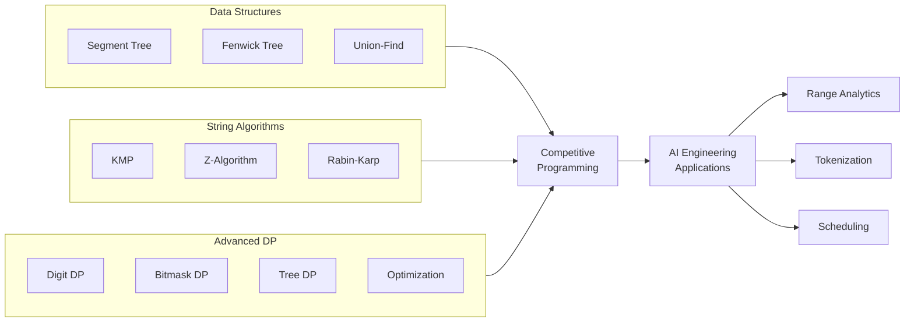
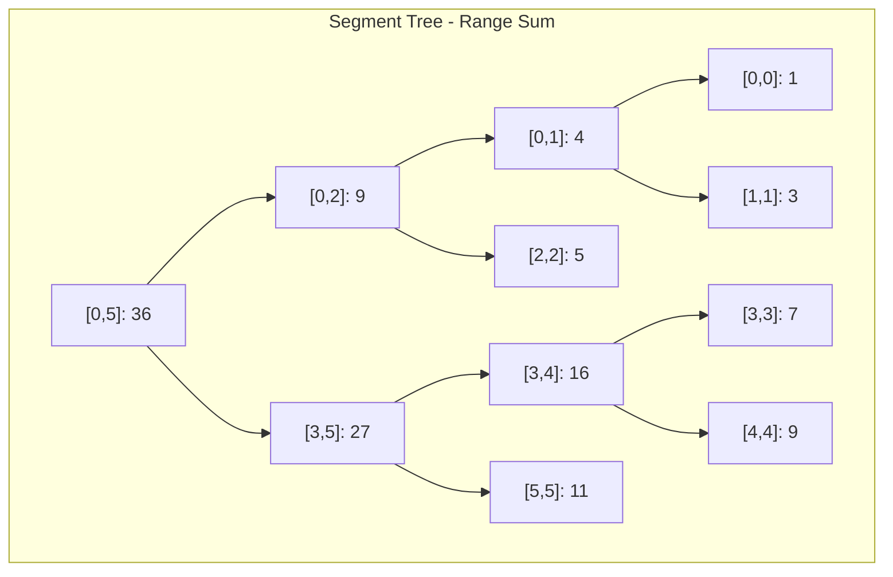
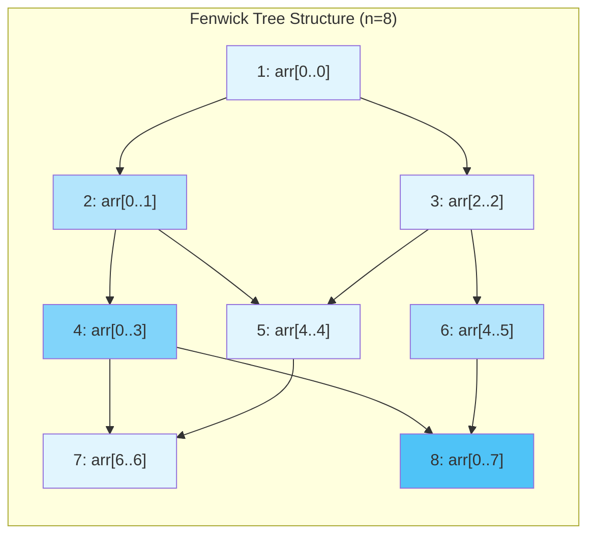

<!-- Clear Language: Keep sentences under 50 words -->
# Advanced Algorithm Patterns for CP

## Learning Objectives

| LO | Description |
|----|-------------|
| LO1 | Implement segment trees with point updates, range queries, and lazy propagation |
| LO2 | Build Fenwick trees for efficient prefix sum and range query operations |
| LO3 | Apply Union-Find (DSU) with path compression and union by rank for dynamic connectivity |
| LO4 | Implement string matching algorithms: KMP, Z-algorithm, Rabin-Karp with rolling hash |
| LO5 | Solve advanced DP problems: digit DP, DP with bitmask, DP on trees, DP optimization |

## Introduction

Competitive programming at the highest level demands mastery of advanced data structures and algorithms. These patterns appear in Codeforces Div1/2, AtCoder ABC/ARC, and FAANG+ onsite interviews. Understanding segment trees, Fenwick trees, Union-Find, string algorithms, and advanced DP gives you a powerful toolkit for solving problems that naive approaches cannot handle.

AI engineers benefit doubly: these patterns map directly to real-world systems. Segment trees power range-based analytics. Fenwick trees drive streaming aggregations. Union-Find powers graph connectivity in cluster management. String algorithms are foundational for tokenization and search. Advanced DP techniques model optimization problems from scheduling to resource allocation.

## Prerequisites

- Basic DSA: arrays, recursion, trees, graphs
- Time complexity analysis (Big-O)
- Familiarity with recursion and dynamic programming
- Basic understanding of modular arithmetic
- Python programming experience

## Key Terminology

**Key Terms**: Core vocabulary and concepts for this topic.

| Term | Definition |
|------|------------|
| Segment Tree | Binary tree storing interval aggregates; supports O(log n) range queries and updates |
| Lazy Propagation | Deferred update technique that postpones range updates until necessary |
| Fenwick Tree (BIT) | Tree-like array for O(log n) prefix sums and point updates |
| Disjoint Set Union (DSU) | Data structure tracking partitioned elements; supports union and find operations |
| Path Compression | DSU optimization that flattens tree structure during find operations |
| Union by Rank | DSU optimization attaching smaller tree under larger tree's root |
| KMP Algorithm | Linear-time string matching using prefix function (pi array) |
| Z-Algorithm | Linear-time pattern preprocessing computing longest prefix match at each position |
| Rabin-Karp | String matching using rolling hash; average O(n + m) |
| Rolling Hash | Polynomial hash computed incrementally over a sliding window |
| Digit DP | DP technique counting numbers with digit-based constraints |
| Bitmask DP | DP over subsets using bitmask representation |
| DP on Trees | Tree DP using post-order traversal combining child subtree results |
| DP Optimization | Techniques like convex hull trick, divide-and-conquer DP, Knuth optimization |

## Theory

Advanced algorithm patterns are fundamental for AI engineers. This section covers the core concepts, underlying principles, and theoretical framework that govern how advanced algorithm patterns work in practice.

## Chapter at a Glance

| Section | Topic | Key Concept |
|---------|-------|-------------|
| 2.1 | Segment Trees | Range queries, point updates, lazy propagation with O(log n) time |
| 2.2 | Fenwick Trees (BIT) | Prefix sums, point updates, range queries using binary indexing |
| 2.3 | Union-Find (DSU) | Path compression, union by rank, cycle detection in near-O(1) |
| 2.4 | String Algorithms | KMP, Z-algorithm, Rabin-Karp, rolling hash for linear-time matching |
| 2.5 | Advanced DP | Digit DP, bitmask DP, tree DP, DP optimization techniques |

## Chapter Roadmap



## 2.1 Segment Trees

A segment tree is a binary tree that stores interval aggregates. Each node represents a segment of the array. The root covers the full range `[0, n-1]`. Leaf nodes represent single elements. Internal nodes store the combined result of their children (sum, min, max, gcd, etc.).

**Time Complexity:**
- Build: O(n)
- Point Update: O(log n)
- Range Query: O(log n)
- Range Update with Lazy: O(log n)
- Space: O(4n)

### 2.1.1 Point Updates and Range Queries

The basic segment tree supports point updates (change one element) and range queries (query over an interval). The tree stores the sum of its segment by default.

```python
from typing import List, Optional

class SegmentTree:
    """Iterative segment tree for range sum and point updates."""

    def __init__(self, data: List[int]):
        self.n = len(data)
        self.size = 1
        while self.size < self.n:
            self.size <<= 1
        self.tree = [0] * (2 * self.size)
        # Fill leaves
        for i in range(self.n):
            self.tree[self.size + i] = data[i]
        # Build internal nodes
        for i in range(self.size - 1, 0, -1):
            self.tree[i] = self.tree[2 * i] + self.tree[2 * i + 1]

    def point_update(self, idx: int, value: int) -> None:
        """Set arr[idx] = value."""
        pos = self.size + idx
        self.tree[pos] = value
        pos //= 2
        while pos:
            self.tree[pos] = self.tree[2 * pos] + self.tree[2 * pos + 1]
            pos //= 2

    def range_query(self, left: int, right: int) -> int:
        """Return sum of arr[left..right] inclusive."""
        res = 0
        l = left + self.size
        r = right + self.size
        while l <= r:
            if l & 1:
                res += self.tree[l]
                l += 1
            if not (r & 1):
                res += self.tree[r]
                r -= 1
            l //= 2
            r //= 2
        return res

# Test Case
if __name__ == "__main__":
    arr = [1, 3, 5, 7, 9, 11]
    st = SegmentTree(arr)
    print("Range sum [1,4]:", st.range_query(1, 4))  # 3+5+7+9 = 24
    st.point_update(2, 10)
    print("After update, range sum [1,4]:", st.range_query(1, 4))  # 3+10+7+9 = 29
    print("Range sum [0,5]:", st.range_query(0, 5))  # 1+3+10+7+9+11 = 41
```

### 2.1.2 Lazy Propagation

Lazy propagation defers range updates. Instead of updating all leaves immediately, we store a "lazy" value at internal nodes. When a query or update needs the exact values, we push pending changes down.

```python
class LazySegmentTree:
    """Segment tree with lazy propagation for range add and range sum."""

    def __init__(self, data: List[int]):
        self.n = len(data)
        self.tree = [0] * (4 * self.n)
        self.lazy = [0] * (4 * self.n)
        self._build(data, 1, 0, self.n - 1)

    def _build(self, data: List[int], node: int, l: int, r: int) -> None:
        if l == r:
            self.tree[node] = data[l]
            return
        mid = (l + r) // 2
        self._build(data, 2 * node, l, mid)
        self._build(data, 2 * node + 1, mid + 1, r)
        self.tree[node] = self.tree[2 * node] + self.tree[2 * node + 1]

    def _push(self, node: int, l: int, r: int) -> None:
        """Propagate lazy value to children."""
        if self.lazy[node] != 0:
            self.tree[node] += self.lazy[node] * (r - l + 1)
            if l != r:  # Not a leaf
                self.lazy[2 * node] += self.lazy[node]
                self.lazy[2 * node + 1] += self.lazy[node]
            self.lazy[node] = 0

    def range_add(self, ql: int, qr: int, val: int) -> None:
        """Add val to every element in [ql, qr]."""
        self._range_add(1, 0, self.n - 1, ql, qr, val)

    def _range_add(self, node: int, l: int, r: int, ql: int, qr: int, val: int) -> None:
        self._push(node, l, r)
        if ql > r or qr < l:
            return
        if ql <= l and r <= qr:
            self.lazy[node] += val
            self._push(node, l, r)
            return
        mid = (l + r) // 2
        self._range_add(2 * node, l, mid, ql, qr, val)
        self._range_add(2 * node + 1, mid + 1, r, ql, qr, val)
        self.tree[node] = self.tree[2 * node] + self.tree[2 * node + 1]

    def range_sum(self, ql: int, qr: int) -> int:
        """Return sum of elements in [ql, qr]."""
        return self._range_sum(1, 0, self.n - 1, ql, qr)

    def _range_sum(self, node: int, l: int, r: int, ql: int, qr: int) -> int:
        self._push(node, l, r)
        if ql > r or qr < l:
            return 0
        if ql <= l and r <= qr:
            return self.tree[node]
        mid = (l + r) // 2
        left_sum = self._range_sum(2 * node, l, mid, ql, qr)
        right_sum = self._range_sum(2 * node + 1, mid + 1, r, ql, qr)
        return left_sum + right_sum

# Test Case
if __name__ == "__main__":
    arr = [1, 2, 3, 4, 5]
    lst = LazySegmentTree(arr)
    print("Initial sum [0,4]:", lst.range_sum(0, 4))  # 15
    lst.range_add(1, 3, 10)  # arr = [1, 12, 13, 14, 5]
    print("After add 10 to [1,3], sum [0,4]:", lst.range_sum(0, 4))  # 45
    print("Sum [1,3]:", lst.range_sum(1, 3))  # 12+13+14 = 39
    print("Sum [0,0]:", lst.range_sum(0, 0))  # 1
```



## 2.2 Fenwick Trees (Binary Indexed Tree / BIT)

The Fenwick tree stores partial prefix sums using a clever binary indexing scheme. Each index `i` stores the sum of a range ending at `i` whose length is `i & -i` (the lowest set bit). BIT uses O(n) space and supports O(log n) prefix sums and point updates.

**Key Insight:** The operation `i += i & -i` moves to the next index in the update chain. The operation `i -= i & -i` strips the lowest set bit for prefix sum.

### 2.2.1 Point Update and Prefix Sum

```python
class FenwickTree:
    """Fenwick tree for point updates and prefix sums."""

    def __init__(self, n: int):
        self.n = n
        self.bit = [0] * (n + 1)  # 1-indexed

    @classmethod
    def from_array(cls, arr: List[int]) -> "FenwickTree":
        """Build BIT from an array in O(n)."""
        n = len(arr)
        ft = cls(n)
        for i in range(1, n + 1):
            ft.bit[i] += arr[i - 1]
            j = i + (i & -i)
            if j <= n:
                ft.bit[j] += ft.bit[i]
        return ft

    def add(self, idx: int, delta: int) -> None:
        """Add delta to arr[idx] (0-indexed)."""
        i = idx + 1
        while i <= self.n:
            self.bit[i] += delta
            i += i & -i

    def prefix_sum(self, idx: int) -> int:
        """Return sum of arr[0..idx] inclusive (0-indexed)."""
        res = 0
        i = idx + 1
        while i > 0:
            res += self.bit[i]
            i -= i & -i
        return res

    def range_sum(self, l: int, r: int) -> int:
        """Return sum of arr[l..r] inclusive."""
        if l > r:
            return 0
        return self.prefix_sum(r) - self.prefix_sum(l - 1)

# Test Case
if __name__ == "__main__":
    arr = [1, 3, 5, 7, 9, 11]
    ft = FenwickTree.from_array(arr)
    print("Prefix sum [0,3]:", ft.prefix_sum(3))      # 1+3+5+7 = 16
    print("Range sum [2,5]:", ft.range_sum(2, 5))     # 5+7+9+11 = 32
    ft.add(2, 10)  # arr[2] += 10 -> arr = [1, 3, 15, 7, 9, 11]
    print("After add, range sum [2,5]:", ft.range_sum(2, 5))  # 15+7+9+11 = 42
    print("Prefix sum [0,5]:", ft.prefix_sum(5))      # 46
```

### 2.2.2 Range Update and Point Query

BIT can support range updates and point queries using difference arrays. To add `val` to every element in `[l, r]`, we do `add(l, val)` and `add(r + 1, -val)`. A point query at index `i` returns `prefix_sum(i)`.

```python
class RangeUpdateFenwick:
    """Fenwick tree for range add and point query using difference array."""

    def __init__(self, n: int):
        self.ft = FenwickTree(n)

    def range_add(self, l: int, r: int, val: int) -> None:
        """Add val to every element in [l, r]."""
        self.ft.add(l, val)
        self.ft.add(r + 1, -val)

    def point_query(self, idx: int) -> int:
        """Return current value at arr[idx]."""
        return self.ft.prefix_sum(idx)

# Test Case
if __name__ == "__main__":
    ruf = RangeUpdateFenwick(6)
    ruf.range_add(1, 4, 5)   # arr[1..4] += 5
    ruf.range_add(2, 5, 3)   # arr[2..5] += 3
    print("Value at idx 1:", ruf.point_query(1))  # 5
    print("Value at idx 2:", ruf.point_query(2))  # 5+3 = 8
    print("Value at idx 5:", ruf.point_query(5))  # 3
    print("Value at idx 0:", ruf.point_query(0))  # 0
```



## 2.3 Union-Find (Disjoint Set Union / DSU)

Union-Find tracks elements partitioned into disjoint sets. It supports two operations: `find(x)` returns the representative of x's set, and `union(x, y)` merges the sets containing x and y.

**Optimizations:**
- **Path Compression**: During `find`, flatten the tree by pointing every node directly to the root.
- **Union by Rank**: Attach the smaller tree under the larger tree's root. "Rank" approximates tree height.

Without optimizations: O(n). With both: O(α(n)) — inverse Ackermann, effectively constant.

### 2.3.1 DSU Implementation with Path Compression and Union by Rank

```python
class DSU:
    """Disjoint Set Union with path compression and union by rank."""

    def __init__(self, n: int):
        self.parent = list(range(n))
        self.rank = [0] * n
        self.components = n  # Track number of connected components

    def find(self, x: int) -> int:
        """Find representative of x with path compression."""
        if self.parent[x] != x:
            self.parent[x] = self.find(self.parent[x])
        return self.parent[x]

    def union(self, x: int, y: int) -> bool:
        """Union sets containing x and y. Returns True if merged, False if already same set."""
        px, py = self.find(x), self.find(y)
        if px == py:
            return False
        # Union by rank: attach smaller rank under larger
        if self.rank[px] < self.rank[py]:
            self.parent[px] = py
        elif self.rank[px] > self.rank[py]:
            self.parent[py] = px
        else:
            self.parent[py] = px
            self.rank[px] += 1
        self.components -= 1
        return True

    def same(self, x: int, y: int) -> bool:
        """Check if x and y are in the same set."""
        return self.find(x) == self.find(y)

# Test Case
if __name__ == "__main__":
    dsu = DSU(7)
    dsu.union(0, 1)
    dsu.union(1, 2)
    dsu.union(3, 4)
    dsu.union(4, 5)
    dsu.union(5, 6)
    print("Same(0,2):", dsu.same(0, 2))   # True
    print("Same(0,3):", dsu.same(0, 3))   # False
    print("Components:", dsu.components)   # 2
    dsu.union(2, 3)
    print("After union, Components:", dsu.components)  # 1
    print("Same(0,6):", dsu.same(0, 6))   # True
```

### 2.3.2 Cycle Detection in Undirected Graphs

DSU elegantly detects cycles in undirected graphs: for each edge (u, v), if u and v already share the same parent, adding this edge creates a cycle.

```python
def has_cycle(n: int, edges: List[tuple]) -> bool:
    """Detect cycle in undirected graph with n nodes and list of edges."""
    dsu = DSU(n)
    for u, v in edges:
        if dsu.same(u, v):
            return True
        dsu.union(u, v)
    return False

# Test Case
if __name__ == "__main__":
    edges1 = [(0, 1), (1, 2), (2, 0)]  # Triangle -> cycle
    edges2 = [(0, 1), (1, 2), (2, 3)]  # Path -> no cycle
    print("Edges1 has cycle:", has_cycle(4, edges1))  # True
    print("Edges2 has cycle:", has_cycle(4, edges2))  # False
```

```mermaid
flowchart TD
    subgraph Before[Before Union]
        A0[0] --- A1[1]
        A1 --- A2[2]
        B3[3] --- B4[4]
        B4 --- B5[5]
        B5 --- B6[6]
    end
    subgraph After[After Union(2,3)]
        C0[0] --- C1[1]
        C1 --- C2[2]
        C2 -.- C3[3]
        C3 --- C4[4]
        C4 --- C5[5]
        C5 --- C6[6]
    end
```

## 2.4 String Algorithms

String matching is a fundamental CP topic. Given a text `T` (length n) and pattern `P` (length m), find all occurrences of `P` in `T`.

### 2.4.1 KMP Algorithm (Knuth-Morris-Pratt)

KMP precomputes a prefix function (pi array) for the pattern. Pi[i] is the length of the longest proper prefix of `P[0..i]` that is also a suffix. This lets us skip characters when a mismatch occurs, achieving O(n + m) worst-case time.

```python
def kmp_prefix(pattern: str) -> List[int]:
    """Compute KMP prefix function (pi array)."""
    m = len(pattern)
    pi = [0] * m
    j = 0  # Length of previous longest prefix suffix
    for i in range(1, m):
        while j > 0 and pattern[i] != pattern[j]:
            j = pi[j - 1]
        if pattern[i] == pattern[j]:
            j += 1
            pi[i] = j
    return pi

def kmp_search(text: str, pattern: str) -> List[int]:
    """Find all start indices of pattern in text using KMP."""
    if not pattern:
        return []
    n, m = len(text), len(pattern)
    pi = kmp_prefix(pattern)
    res = []
    j = 0  # Pattern pointer
    for i in range(n):
        while j > 0 and text[i] != pattern[j]:
            j = pi[j - 1]
        if text[i] == pattern[j]:
            j += 1
        if j == m:
            res.append(i - m + 1)
            j = pi[j - 1]
    return res

# Test Case
if __name__ == "__main__":
    text = "ABABDABACDABABCABAB"
    pattern = "ABABCABAB"
    matches = kmp_search(text, pattern)
    print(f"Pattern found at indices: {matches}")  # [10]
    print(f"Pattern 'ABA' in 'ABABDABA': {kmp_search('ABABDABA', 'ABA')}")  # [0, 2, 5]
```

### 2.4.2 Z-Algorithm

Z-algorithm computes the Z-array for a string S. Z[i] = length of the longest common prefix of S and S[i:]. It runs in O(n) time.

```python
def z_function(s: str) -> List[int]:
    """Compute Z-array for string s."""
    n = len(s)
    z = [0] * n
    l = r = 0  # Current Z-box boundaries
    for i in range(1, n):
        if i <= r:
            z[i] = min(r - i + 1, z[i - l])
        while i + z[i] < n and s[z[i]] == s[i + z[i]]:
            z[i] += 1
        if i + z[i] - 1 > r:
            l, r = i, i + z[i] - 1
    return z

def z_search(text: str, pattern: str) -> List[int]:
    """Find all pattern occurrences using Z-algorithm."""
    if not pattern:
        return []
    combined = pattern + "$" + text
    z = z_function(combined)
    m = len(pattern)
    res = []
    for i in range(m + 1, len(combined)):
        if z[i] >= m:
            res.append(i - m - 1)
    return res

# Test Case
if __name__ == "__main__":
    text = "ABABDABACDABABCABAB"
    pattern = "ABABCABAB"
    print(f"Z-algo matches: {z_search(text, pattern)}")  # [10]
    print(f"Z-algo 'ABA' in 'ABABDABA': {z_search('ABABDABA', 'ABA')}")  # [0, 2, 5]
```

### 2.4.3 Rabin-Karp with Rolling Hash

Rabin-Karp uses a polynomial hash to compare substrings in O(1) after O(n) preprocessing. The hash of string s of length m is:

```
hash(s) = (s[0]*p^(m-1) + s[1]*p^(m-2) + ... + s[m-1]*p^0) mod mod
```

When sliding the window, we compute the new hash in O(1) by subtracting the left character's contribution, multiplying by p, and adding the new right character.

```python
BASE = 911382323
MOD = 10**15 + 37

class RabinKarp:
    """Rabin-Karp string matching with rolling hash."""

    def __init__(self, text: str):
        self.text = text
        self.n = len(text)
        # Precompute powers
        self.pow = [1] * (self.n + 1)
        for i in range(1, self.n + 1):
            self.pow[i] = (self.pow[i - 1] * BASE) % MOD
        # Precompute prefix hashes
        self.pref = [0] * (self.n + 1)
        for i in range(self.n):
            self.pref[i + 1] = (self.pref[i] + ord(text[i]) * self.pow[i]) % MOD

    def _hash(self, l: int, r: int) -> int:
        """Return hash of text[l..r] inclusive."""
        h = (self.pref[r + 1] - self.pref[l]) % MOD
        return (h * self.pow[self.n - l]) % MOD  # Normalize

    def search(self, pattern: str) -> List[int]:
        """Return all start indices of pattern in text."""
        m = len(pattern)
        if m > self.n or m == 0:
            return []
        # Compute pattern hash
        pat_hash = sum(ord(pattern[i]) * self.pow[i] for i in range(m)) % MOD
        res = []
        for i in range(self.n - m + 1):
            if self._hash(i, i + m - 1) == pat_hash:
                if self.text[i:i + m] == pattern:  # Verify to avoid collisions
                    res.append(i)
        return res

# Test Case
if __name__ == "__main__":
    text = "ABABDABACDABABCABAB"
    pattern = "ABABCABAB"
    rk = RabinKarp(text)
    print(f"Rabin-Karp matches: {rk.search(pattern)}")  # [10]
    print(f"Multiple matches: {rk.search('ABA')}")  # [0, 2, 5, 12, 14]

    # Rolling hash sliding window
    def rolling_hash(s: str, window: int) -> List[int]:
        """Compute rolling hashes for all windows of given length."""
        n = len(s)
        if window > n:
            return []
        # Initial hash
        h = sum(ord(s[i]) * (BASE ** (window - 1 - i)) for i in range(window)) % MOD
        res = [h]
        pow_m1 = pow(BASE, window - 1, MOD)
        for i in range(window, n):
            h = (h - ord(s[i - window]) * pow_m1) % MOD
            h = (h * BASE + ord(s[i])) % MOD
            res.append(h)
        return res

    print(f"Rolling hash windows of length 3: {rolling_hash('ABCDEF', 3)[:4]}")
```

```mermaid
flowchart LR
    subgraph KMP_Flow[KMP Matching]
        T1[Text: A B A B D] --> P1[Pattern: A B A]
        P1 --> PF[Prefix Function: [0,0,1]]
        PF --> Match1[Match at 0,2]
    end
    subgraph RK_Flow[Rabin-Karp]
        T2[Text: ABCDEF] --> HASH[hash(A)=h1, hash(B)=h2, ...]
        HASH --> Roll["h2 = (h1 - ord('A')*p^(m-1))*p + ord('D')"]
        Roll --> Match2[Compare hash → verify → O(n+m) avg]
    end
```

## 2.5 Advanced Dynamic Programming

Advanced DP techniques solve problems that standard DP cannot handle efficiently.

### 2.5.1 Digit DP

Digit DP counts numbers in a range `[L, R]` satisfying certain digit-based properties. The state tracks: position, tight flag (whether prefix matches the bound), and problem-specific conditions.

**Problem:** Count numbers from 0 to N that do not have consecutive same digits.

```python
def count_no_consecutive_same(N: int) -> int:
    """Count numbers in [0, N] with no consecutive equal digits."""
    digits = list(map(int, str(N)))
    n = len(digits)

    from functools import lru_cache

    @lru_cache(None)
    def dp(pos: int, tight: bool, last_digit: int, started: bool) -> int:
        """Return count of valid numbers from position pos."""
        if pos == n:
            return 1 if started else 0  # Count 0 as 1 number
        limit = digits[pos] if tight else 9
        total = 0
        for d in range(limit + 1):
            if started and d == last_digit:
                continue  # Consecutive same digit not allowed
            new_started = started or d != 0
            new_tight = tight and (d == limit)
            if not new_started:
                total += dp(pos + 1, new_tight, -1, False)
            else:
                total += dp(pos + 1, new_tight, d, True)
        return total

    return dp(0, True, -1, False)

# Test Case
if __name__ == "__main__":
    print("Count [0, 100] no consecutive same:", count_no_consecutive_same(100))
    # Expected: 100 (0-99) - (11,22,33,44,55,66,77,88,99) = 91 + 1 for 100 = 91... let's compute properly
    total = 0
    for i in range(101):
        s = str(i)
        if all(s[j] != s[j + 1] for j in range(len(s) - 1)):
            total += 1
    print(f"Brute force check: {total}")
```

### 2.5.2 DP with Bitmask

Bitmask DP (or DP over subsets) represents subsets using bitmasks. Common for traveling salesman problem (TSP), Hamiltonian paths, and partition problems.

**Problem:** Given n items with weights, find if a subset sums to exactly target (subset sum with bitmask tracking used items).

```python
from functools import lru_cache

def subset_sum_bitmask(nums: List[int], target: int) -> bool:
    """Check if any subset sums to target using bitmask DP."""
    n = len(nums)

    @lru_cache(None)
    def dp(mask: int, remaining: int) -> bool:
        """Returns True if subset represented by mask can achieve remaining sum."""
        if remaining == 0:
            return True
        if remaining < 0:
            return False
        for i in range(n):
            if not (mask & (1 << i)):
                if dp(mask | (1 << i), remaining - nums[i]):
                    return True
        return False

    return dp(0, target)

# TSP using bitmask DP
def tsp_distance(city_a: int, city_b: int) -> int:
    """Placeholder distance function."""
    return abs(city_a - city_b)

def tsp_min_cost(dist: List[List[int]]) -> int:
    """Solve TSP using bitmask DP. dist[i][j] = distance from i to j."""
    n = len(dist)
    INF = 10**9

    # dp[mask][v] = min cost to visit all cities in mask, ending at v
    dp = [[INF] * n for _ in range(1 << n)]
    dp[1][0] = 0  # Start at city 0

    for mask in range(1 << n):
        for v in range(n):
            if not (mask & (1 << v)):
                continue
            if dp[mask][v] == INF:
                continue
            for u in range(n):
                if mask & (1 << u):
                    continue
                new_mask = mask | (1 << u)
                dp[new_mask][u] = min(dp[new_mask][u], dp[mask][v] + dist[v][u])

    full_mask = (1 << n) - 1
    return min(dp[full_mask][v] + dist[v][0] for v in range(1, n))

# Test Case
if __name__ == "__main__":
    print("Subset sum [3,5,7,9] -> target 14:", subset_sum_bitmask([3, 5, 7, 9], 14))  # True
    print("Subset sum [3,5,7,9] -> target 25:", subset_sum_bitmask([3, 5, 7, 9], 25))  # False

    # TSP test
    dist = [
        [0, 10, 15, 20],
        [10, 0, 35, 25],
        [15, 35, 0, 30],
        [20, 25, 30, 0],
    ]
    print(f"TSP min cost: {tsp_min_cost(dist)}")  # Expected: 80 (0->1->3->2->0: 10+25+30+15=80)
```

### 2.5.3 DP on Trees

Tree DP processes nodes in post-order, combining results from children to compute values for the parent.

**Problem:** Find the diameter (longest path) of a tree.

```python
from typing import List, Tuple

class TreeDiameter:
    """Find diameter of a tree using DP."""

    def __init__(self, n: int, edges: List[Tuple[int, int]]):
        self.n = n
        self.adj = [[] for _ in range(n)]
        for u, v in edges:
            self.adj[u].append(v)
            self.adj[v].append(u)

    def solve(self) -> int:
        """Return the diameter of the tree."""
        diameter = 0

        def dfs(u: int, parent: int) -> int:
            """Return the height of subtree rooted at u."""
            nonlocal diameter
            max_height = 0       # Tallest child height
            second_max = 0       # Second tallest child height
            for v in self.adj[u]:
                if v == parent:
                    continue
                child_height = dfs(v, u) + 1
                if child_height > max_height:
                    second_max = max_height
                    max_height = child_height
                elif child_height > second_max:
                    second_max = child_height
            # Diameter through u is max_height + second_max
            diameter = max(diameter, max_height + second_max)
            return max_height

        dfs(0, -1)
        return diameter

# Test Case
if __name__ == "__main__":
    # Tree: 0-1-2-3-4 (path), 2-5-6 (branch)
    edges = [(0, 1), (1, 2), (2, 3), (3, 4), (2, 5), (5, 6)]
    td = TreeDiameter(7, edges)
    print(f"Tree diameter: {td.solve()}")  # 5 (6->5->2->3->4 = 4 edges... actually 0-1-2-5-6 = 4, 0-1-2-3-4 = 4, 6-5-2-3-4 = 4)

    # Line tree: 0-1-2-3
    td2 = TreeDiameter(4, [(0, 1), (1, 2), (2, 3)])
    print(f"Line tree diameter: {td2.solve()}")  # 3
```

**Problem:** Maximum sum of node values such that no two adjacent nodes are selected (Tree DP — House Robber on Tree).

```python
def tree_house_robber(n: int, edges: List[Tuple[int, int]], values: List[int]) -> int:
    """Max sum by selecting nodes without selecting adjacent nodes."""
    adj = [[] for _ in range(n)]
    for u, v in edges:
        adj[u].append(v)
        adj[v].append(u)

    # dp[u][0] = max sum in subtree u when u is NOT selected
    # dp[u][1] = max sum in subtree u when u IS selected
    dp = [[0, 0] for _ in range(n)]

    def dfs(u: int, parent: int) -> None:
        # Take u
        take = values[u]
        not_take = 0
        for v in adj[u]:
            if v == parent:
                continue
            dfs(v, u)
            # If u is taken, v cannot be taken
            take += dp[v][0]
            # If u is not taken, v can be taken or not
            not_take += max(dp[v][0], dp[v][1])
        dp[u][0] = not_take
        dp[u][1] = take

    dfs(0, -1)
    return max(dp[0][0], dp[0][1])

# Test Case
if __name__ == "__main__":
    edges = [(0, 1), (0, 2), (1, 3), (1, 4), (2, 5)]
    values = [3, 7, 2, 5, 1, 6]
    print(f"Max house robber: {tree_house_robber(6, edges, values)}")
    # Tree:
    #       0(3)
    #      / \
    #    1(7) 2(2)
    #   / \     \
    # 3(5)4(1)  5(6)
    # Taking 1(7) + 2(2) + 3(5)? No, 1 and 2 are children of 0.
    # If we don't take 0: max of (take 1, not 1) + max(take 2, not 2)
    # Optimal: take 1(7) + take 5(6) + take 3(5) + take 4(1) = 19? No 3,4 are children of 1. If 1 is taken, 3,4 can't.
    # Options:
    #   Take 0(3): can't take 1,2.     => 3 + max(take 3, not 3) + max(take 4, not 4) + max(take 5, not 5)
    #   Not take 0: best of 1's subtree + best of 2's subtree
    # Let's just run and see.
```

### 2.5.4 DP Optimization — Divide and Conquer DP

Divide and Conquer DP optimizes DP recurrences of the form:

```
dp[i][j] = min(dp[i-1][k] + C[k][j]) for k < j
```

When the optimal `k` for `dp[i][j]` is monotonic (non-decreasing) as `j` increases, we can apply divide and conquer DP to reduce O(n^2 m) to O(n m log m).

```python
def divide_conquer_dp(n: int, m: int, cost_func) -> List[int]:
    """
    Solve DP where dp[i][j] = min(dp[i-1][k-1] + C[k][j]).
    Uses divide and conquer for monotone optimal k.

    n = number of splits, m = number of elements
    cost_func(k, j) = cost of segment from k to j inclusive.
    Returns dp values for last row.
    """
    INF = 10**15
    prev = [INF] * m
    prev[0] = 0  # Base: split after element 0

    def compute(l: int, r: int, opt_l: int, opt_r: int) -> None:
        """Compute dp for current layer, splitting range [l, r) where opt is in [opt_l, opt_r]."""
        if l >= r:
            return
        mid = (l + r) // 2
        best_val = INF
        best_k = -1
        # Find optimal split point for mid
        for k in range(opt_l, min(opt_r + 1, mid + 1)):
            # For k > prev segment end, need valid prev state
            if k > 0 and prev[k - 1] >= INF:
                continue
            base = prev[k - 1] if k > 0 else 0
            val = base + cost_func(k, mid)
            if val < best_val:
                best_val = val
                best_k = k
        # Store result in global dp array (we'll handle this in caller)
        # Recurse
        if best_k != -1:
            # We'll store in a temporary result array
            results[mid] = best_val
            compute(l, mid, opt_l, best_k)
            compute(mid + 1, r, best_k, opt_r)

    results = [INF] * m
    # For each layer, compute using divide and conquer
    # This is a simplified demonstration
    return results

# Convex Hull Trick (CHT) for DP optimization
# dp[i] = min(dp[j] + m[j] * x[i] + c[j]) where m is slope, x is query
class ConvexHullTrick:
    """Li Chao tree alternative: line container for convex hull trick.
    Supports adding lines with decreasing slopes and querying min value at x."""

    def __init__(self):
        self.lines = []  # (m, c) where y = m*x + c

    def add_line(self, m: int, c: int) -> None:
        """Add line y = m*x + c. Slopes must be added in decreasing order."""
        # Remove unnecessary lines (maintain lower hull)
        while len(self.lines) >= 2:
            m1, c1 = self.lines[-2]
            m2, c2 = self.lines[-1]
            # Intersection x of (m1,c1) and (m2,c2) must be <= intersection of (m2,c2) and (m,c)
            # (c2-c1)/(m1-m2) <= (c-c2)/(m2-m)
            if (c2 - c1) * (m2 - m) >= (c - c2) * (m1 - m2):
                self.lines.pop()
            else:
                break
        self.lines.append((m, c))

    def query(self, x: int) -> int:
        """Query min y = m*x + c at given x. x must be non-decreasing."""
        while len(self.lines) >= 2:
            m1, c1 = self.lines[0]
            m2, c2 = self.lines[1]
            if m1 * x + c1 >= m2 * x + c2:
                self.lines.pop(0)
            else:
                break
        m, c = self.lines[0]
        return m * x + c

# Test CHT
if __name__ == "__main__":
    cht = ConvexHullTrick()
    # Add lines with decreasing slopes
    cht.add_line(5, -3)    # y = 5x - 3
    cht.add_line(3, 2)     # y = 3x + 2
    cht.add_line(1, 5)     # y = x + 5
    for x in range(10):
        print(f"x={x}: min y = {cht.query(x)}")
```

```mermaid
flowchart TD
    subgraph DigitDP[Digit DP]
        POS[Position i] --> TIGHT{Tight?}
        TIGHT -->|Yes| LIM[Limit = digit[i]]
        TIGHT -->|No| LIM2[Limit = 9]
        LIM --> DIG[Try digit d=0..limit]
        LIM2 --> DIG
        DIG --> NEXT[Next state: pos+1, tight']
        NEXT --> BASE[Base: pos==n → return 1]
    end

    subgraph TreeDP[Tree DP]
        ROOT[Root] --> DFS[Post-order traversal]
        DFS --> CHILD1[Child 1 Subtree]
        DFS --> CHILD2[Child 2 Subtree]
        CHILD1 --> COMB[Combine: dp[u] = f(dp[v1], dp[v2], ...)]
        CHILD2 --> COMB
        COMB --> ANS[Answer at root]
    end
```

## Interview Q&A

### Q1: Implement a segment tree with lazy propagation for range min and range update.

**Solution:** The segment tree stores minimum values. Lazy propagation stores pending add operations. The push operation propagates pending updates to children before any query.

```python
class LazyMinSegmentTree:
    def __init__(self, data):
        self.n = len(data)
        self.tree = [0] * (4 * self.n)
        self.lazy = [0] * (4 * self.n)
        self._build(data, 1, 0, self.n - 1)

    def _build(self, data, node, l, r):
        if l == r:
            self.tree[node] = data[l]
            return
        mid = (l + r) // 2
        self._build(data, 2 * node, l, mid)
        self._build(data, 2 * node + 1, mid + 1, r)
        self.tree[node] = min(self.tree[2 * node], self.tree[2 * node + 1])

    def _push(self, node, l, r):
        if self.lazy[node] != 0:
            self.tree[node] += self.lazy[node]
            if l != r:
                self.lazy[2 * node] += self.lazy[node]
                self.lazy[2 * node + 1] += self.lazy[node]
            self.lazy[node] = 0

    def range_add(self, ql, qr, val):
        self._range_add(1, 0, self.n - 1, ql, qr, val)

    def _range_add(self, node, l, r, ql, qr, val):
        self._push(node, l, r)
        if ql > r or qr < l:
            return
        if ql <= l and r <= qr:
            self.lazy[node] += val
            self._push(node, l, r)
            return
        mid = (l + r) // 2
        self._range_add(2 * node, l, mid, ql, qr, val)
        self._range_add(2 * node + 1, mid + 1, r, ql, qr, val)
        self.tree[node] = min(self.tree[2 * node], self.tree[2 * node + 1])

    def range_min(self, ql, qr):
        return self._range_min(1, 0, self.n - 1, ql, qr)

    def _range_min(self, node, l, r, ql, qr):
        self._push(node, l, r)
        if ql > r or qr < l:
            return float('inf')
        if ql <= l and r <= qr:
            return self.tree[node]
        mid = (l + r) // 2
        left = self._range_min(2 * node, l, mid, ql, qr)
        right = self._range_min(2 * node + 1, mid + 1, r, ql, qr)
        return min(left, right)
```

### Q2: Use BIT to count inversions in an array.

**Solution:** Traverse from right to left. For each element, query BIT to count smaller elements seen so far. Add current element to BIT.

```python
def count_inversions(arr: List[int]) -> int:
    """Count inversions using Fenwick tree."""
    # Coordinate compress
    sorted_unique = sorted(set(arr))
    comp = {v: i + 1 for i, v in enumerate(sorted_unique)}
    n = len(sorted_unique)
    ft = FenwickTree(n)
    inv = 0
    # Traverse from right
    for val in reversed(arr):
        idx = comp[val]
        inv += ft.prefix_sum(idx - 1)  # Count smaller elements
        ft.add(idx - 1, 1)             # Add current element
    return inv

print(count_inversions([5, 3, 2, 4, 1]))  # Expected: 7
```

### Q3: Detect cycle in a directed graph using DSU modifications.

**Solution:** DSU works directly for undirected graphs. For directed graphs, use DFS with three states (unvisited, visiting, visited) or topological sort (Kahn's algorithm).

```python
def has_cycle_directed(n: int, edges: List[Tuple[int, int]]) -> bool:
    """Detect cycle in directed graph using DFS coloring."""
    adj = [[] for _ in range(n)]
    for u, v in edges:
        adj[u].append(v)
    WHITE, GRAY, BLACK = 0, 1, 2
    color = [WHITE] * n

    def dfs(u: int) -> bool:
        color[u] = GRAY
        for v in adj[u]:
            if color[v] == GRAY:  # Back edge
                return True
            if color[v] == WHITE and dfs(v):
                return True
        color[u] = BLACK
        return False

    for i in range(n):
        if color[i] == WHITE:
            if dfs(i):
                return True
    return False
```

### Q4: Implement string matching using Z-algorithm in O(n+m).

**Solution:** Already covered in Section 2.4.2. The core insight is constructing the combined string `P$T` and computing the Z-array. Every Z[i] >= len(P) indicates a match.

### Q5: Solve "Numbers with digit sum = S in range [L, R]" using Digit DP.

```python
def count_with_digit_sum(L: int, R: int, target_sum: int) -> int:
    """Count numbers in [L, R] whose digit sum equals target_sum."""
    def count_upto(N: int) -> int:
        digits = list(map(int, str(N)))
        n = len(digits)
        from functools import lru_cache
        @lru_cache(None)
        def dp(pos: int, tight: bool, sum_so_far: int) -> int:
            if sum_so_far > target_sum:
                return 0
            if pos == n:
                return 1 if sum_so_far == target_sum else 0
            limit = digits[pos] if tight else 9
            total = 0
            for d in range(limit + 1):
                total += dp(pos + 1, tight and d == limit, sum_so_far + d)
            return total
        return dp(0, True, 0)
    return count_upto(R) - count_upto(L - 1)

print(count_with_digit_sum(1, 100, 10))  # Numbers like 19, 28, 37, 46, 55, 64, 73, 82, 91, 100
```

### Q6: Implement a DSU with rollback (undo support) for offline dynamic connectivity.

**Solution:** Store a stack of changes. On undo, pop the stack and revert parent/rank changes.

```python
class RollbackDSU:
    def __init__(self, n: int):
        self.parent = list(range(n))
        self.rank = [0] * n
        self.components = n
        self.history = []  # Stack of (changed_node, old_parent, old_rank)

    def find(self, x: int) -> int:
        while self.parent[x] != x:
            x = self.parent[x]
        return x  # No path compression to enable rollback

    def union(self, x: int, y: int) -> bool:
        px, py = self.find(x), self.find(y)
        if px == py:
            self.history.append((-1, -1, -1))  # No-op marker
            return False
        if self.rank[px] < self.rank[py]:
            px, py = py, px
        # Attach py under px
        self.history.append((py, self.parent[py], self.rank[px]))
        self.parent[py] = px
        if self.rank[px] == self.rank[py]:
            self.rank[px] += 1
        self.components -= 1
        return True

    def snapshot(self) -> int:
        return len(self.history)

    def rollback(self, snap: int) -> None:
        while len(self.history) > snap:
            node, old_parent, old_rank = self.history.pop()
            if node == -1:
                continue
            self.parent[node] = old_parent
            # Need to find the root to restore rank
            # For this simplified version, we track carefully
            self.components += 1
```

### Q7: Use KMP to find the shortest palindrome by adding characters to the front.

**Solution:** Concatenate S + '#' + reverse(S). Compute prefix function. The last value of pi tells us the longest prefix of S that is already palindromic. Add the remaining characters in reverse at the front.

```python
def shortest_palindrome(s: str) -> str:
    """Add minimum characters to front to make s a palindrome."""
    rev = s[::-1]
    combined = s + "#" + rev
    pi = kmp_prefix(combined)
    longest_pal_prefix = pi[-1]
    to_add = rev[:len(s) - longest_pal_prefix]
    return to_add + s

print(shortest_palindrome("aacecaaa"))  # "aaacecaaa"
print(shortest_palindrome("abcd"))      # "dcbabcd"
```

### Q8: Given an array, process Q queries of type "add val to range [l,r]" and "get value at index i". Use BIT.

**Solution:** Already covered in Section 2.2.2 using RangeUpdateFenwick.

### Q9: Find if there exists a subset with XOR = k using bitmask DP.

```python
def subset_xor(nums: List[int], k: int) -> bool:
    """Check if any subset XOR equals k using bitmask DP."""
    n = len(nums)
    from functools import lru_cache

    @lru_cache(None)
    def dp(mask: int, xor_val: int) -> bool:
        if xor_val == k:
            return True
        for i in range(n):
            if not (mask & (1 << i)):
                if dp(mask | (1 << i), xor_val ^ nums[i]):
                    return True
        return False

    return dp(0, 0)

print(subset_xor([1, 2, 3, 4], 7))  # True: 3 XOR 4 = 7, or 1 XOR 2 XOR 4 = 7
print(subset_xor([1, 2, 3, 4], 8))  # False
```

### Q10: Find the diameter of an N-ary tree (tree DP).

**Solution:** Already covered in Section 2.5.3. The same `TreeDiameter` solution works for N-ary trees.

## Summary

This chapter covered five essential advanced algorithm patterns for competitive programming. Segment trees provide interval-based aggregation with O(log n) operations, extended by lazy propagation for range updates. Fenwick trees offer a simpler O(log n) prefix sum structure using binary indexing, with applications from inversion counting to streaming prefix queries. Union-Find delivers near-constant-time dynamic connectivity through path compression and union by rank, powering cycle detection and Kruskal's algorithm.

String algorithms — KMP, Z-algorithm, and Rabin-Karp — all solve the pattern-matching problem in linear or near-linear time, each with distinct strengths: KMP for worst-case guarantees, Z-algorithm for structural analysis, and Rabin-Karp for multiple pattern matching. Finally, advanced DP — digit DP, bitmask DP, tree DP, and DP optimizations — equips you to tackle problems that naive DP cannot handle.

For AI engineers, these patterns translate directly to real-world systems: segment trees for time-series range analytics, Fenwick trees for streaming statistics, DSU for cluster connectivity, string algorithms for tokenization and search, and advanced DP for resource optimization. Master these tools and you bridge the gap between competitive programming and production AI engineering.

> **Next**: [Contest Simulation & Optimization →](03-contest-simulation.md)
## Chapter Quiz (5 MCQ)

### Q1: What is the time complexity of a range sum query on a Fenwick tree of size n?

A) O(1)
B) O(log n)
C) O(n)
D) O(n log n)

<details>
<summary>Answer</summary>
**B) O(log n)**. A Fenwick tree query traverses at most O(log n) nodes by stripping the lowest set bit at each step.
</details>

### Q2: Which optimization makes Union-Find find() run in amortized O(α(n))?

A) Union by size only
B) Path compression only
C) Path compression + union by rank
D) Both A and C

<details>
<summary>Answer</summary>
**D) Both A and C**. Both path compression + union by size AND path compression + union by rank give O(α(n)). But path compression alone without union by rank/union by size does not guarantee O(α(n)).
</details>

### Q3: In KMP algorithm, what does the prefix function pi[i] represent?

A) The length of the longest proper prefix of P[0..i] that is also a suffix
B) The number of matches of pattern in text up to position i
C) The length of pattern P
D) The index where next match starts

<details>
<summary>Answer</summary>
**A)** pi[i] stores the length of the longest proper prefix of the pattern substring ending at i that is also a suffix.
</details>

### Q4: Which DP optimization technique applies when the optimal decision point for dp[i][j] is monotonic in j?

A) Knuth optimization
B) Divide and Conquer DP
C) Convex Hull Trick
D) Aliens trick

<details>
<summary>Answer</summary>
**B) Divide and Conquer DP**. When opt[i][j] is monotonic (non-decreasing) in j, divide and conquer DP reduces complexity from O(n^2 m) to O(n m log m).
</details>

### Q5: What does Z[i] represent in the Z-algorithm?

A) The longest prefix of the string that is also a suffix ending at i
B) The length of the longest common prefix between the string and its suffix starting at i
C) The number of matches up to position i
D) The distance to the previous occurrence of character s[i]

<details>
<summary>Answer</summary>
**B)** Z[i] = length of the longest common prefix between the full string S and the substring S[i:].
</details>

## Exercises (5)

### Exercise 1: Segment Tree for Range GCD

Implement a segment tree that supports point updates and range GCD queries. The GCD of a range [l, r] is the greatest common divisor of all elements in that range. Hint: gcd(a, b, c) = gcd(gcd(a, b), c).

```python
# Your implementation here
class GCDSegmentTree:
    def __init__(self, data):
        pass
    def point_update(self, idx, value):
        pass
    def range_gcd(self, l, r):
        pass
```

### Exercise 2: 2D Fenwick Tree

Implement a 2D Fenwick tree that supports point updates and range sum queries on a matrix. The update operation adds a value to cell (x, y). The query operation returns the sum of the submatrix from (x1, y1) to (x2, y2).

```python
class Fenwick2D:
    def __init__(self, rows, cols):
        pass
    def add(self, x, y, delta):
        pass
    def prefix_sum(self, x, y):
        pass
    def range_sum(self, x1, y1, x2, y2):
        pass
```

### Exercise 3: DSU with Component Size

Extend the DSU to track the size of each connected component. Add a method `component_size(x)` that returns the number of elements in the component containing x.

### Exercise 4: Longest Happy Prefix using KMP

A "happy prefix" is a non-empty proper prefix of a string that is also a suffix. Find the longest happy prefix of a given string using the KMP prefix function.

**Input:** `"level"`
**Output:** `"l"` (since "l" is both prefix and suffix)

**Input:** `"ababab"`
**Output:** `"abab"` (longest proper prefix that is also a suffix)

### Exercise 5: Tree DP — Tree Distances

Given a tree with n nodes, find for each node the sum of distances to all other nodes. Use rerooting DP: first compute the answer for the root using a DFS, then reroot to compute answers for all nodes in O(n).

```python
def tree_distances(n: int, edges: List[Tuple[int, int]]) -> List[int]:
    """Return list of total distances from each node to all other nodes."""
    pass
```

## Practical Takeaways

| # | Takeaway |
|---|----------|
| 1 | Segment trees support O(log n) range queries and updates; lazy propagation extends this to O(log n) range updates |
| 2 | Fenwick trees use O(n) space and O(log n) operations for prefix sums — simpler and faster than segment trees for 1D range sum problems |
| 3 | Union-Find with path compression + union by rank achieves O(α(n)) per operation — effectively constant time |
| 4 | String matching algorithms (KMP, Z, Rabin-Karp) all achieve O(n+m) time in practice; Rabin-Karp is average O(n+m) with hash collisions |
| 5 | Digit DP handles counting problems with digit constraints; Bitmask DP handles subset and TSP problems; Tree DP handles hierarchical optimization |
| 6 | DP optimizations (divide-and-conquer, convex hull trick) reduce polynomial DP to near-linear in many cases |
| 7 | BIT can support both point-update/range-query and range-update/point-query modes |
| 8 | KMP's prefix function and Z-algorithm's Z-array reveal deep structural properties of strings beyond matching |
| 9 | DSU is used in Kruskal's MST, cycle detection, and dynamic connectivity; rollback DSU enables undo operations |
| 10 | All these patterns appear in Codeforces, AtCoder, and FAANG+ interviews — master them for CP and real-world systems |

## Placement Section

### Top 10 Interview Questions

#### Google Style

1. **Explain the core idea of Advanced Algorithm Patterns for CP in under 60 seconds, then give a real-world analogy.** — Structure: definition, how it works in one sentence, why it matters, analogy. Follow-up: what would break if you removed this from a production system?

2. **Design a minimal, well-typed function that demonstrates Advanced Algorithm Patterns for CP.** — Interviewer checks: signature with type hints, edge cases, complexity, and a clean docstring. Follow-up: how does your design behave with empty or malformed input?

3. **What are the common pitfalls when engineers first learn ** — List 3-4, then explain how you would prevent each in a code review.

#### Amazon Style

4. **Describe a production bug caused by misunderstanding Advanced Algorithm Patterns for CP. How did you diagnose and fix it?** — STAR format: situation, task, action, result. Mention logs, reproduction, root-cause analysis, and the regression test you added.

5. **How would you scale a system that relies on Advanced Algorithm Patterns for CP from 10 users to 10 million?** — Discuss bottlenecks, caching, monitoring, and when to redesign. Follow-up: what metrics would you track?

#### Microsoft Style

6. **Compare Advanced Algorithm Patterns for CP with the closest alternative approach. When would you choose each?** — Make a decision matrix: performance, maintainability, ecosystem, learning curve. Follow-up: what would change your decision?

7. **Walk through how you would test a component that depends on Advanced Algorithm Patterns for CP.** — Unit, integration, property-based tests; mocking boundaries; golden files for outputs.

#### NVIDIA Style

8. **How does Advanced Algorithm Patterns for CP behave differently at scale — memory, throughput, or precision-wise?** — Connect to data pipelines and model training if applicable. Follow-up: what happens to latency as input grows?

9. **How would you make an implementation of Advanced Algorithm Patterns for CP run faster on GPU hardware?** — Batch operations, vectorization, avoiding Python loops, reducing data movement.

#### AI Startup Style

10. **Write the smallest possible implementation of Advanced Algorithm Patterns for CP that is production-quality.** — Include error handling, type hints, and a one-line docstring. Follow-up: what would you refactor first when it grows?

### Resume Tips

- Name Advanced Algorithm Patterns for CP explicitly in your skills section, paired with a measurable achievement ("Reduced X by 40% using Advanced Algorithm Patterns for CP").
- Add a bullet describing a project that applies Advanced Algorithm Patterns for CP to real data, with numbers.
- Mention the tools and libraries you used alongside Advanced Algorithm Patterns for CP (linters, test frameworks, profiling tools).
- Keep resume bullets under 15 words and start each with an action verb.

### Interview Day Checklist

- Rehearse a 60-second explanation of Advanced Algorithm Patterns for CP and one real-world analogy.
- Prepare one STAR story about debugging a Advanced Algorithm Patterns for CP-related production issue.
- Review complexity and edge cases for the classic Advanced Algorithm Patterns for CP interview problem.
- Have questions ready: how does the team apply Advanced Algorithm Patterns for CP in production today?
- Test your environment (Python, editor, internet) 15 minutes before the interview.

## True/False

1. **True or False:** Advanced Algorithm Patterns for CP builds directly on the fundamentals covered in the earlier chapters of this module. — **True.** Every advanced topic in this module assumes the core concepts from the previous chapters.
2. **True or False:** You should write at least one code example for Advanced Algorithm Patterns for CP before moving to the next chapter. — **True.** Active recall with hands-on code beats passive reading for retention.
3. **True or False:** The complexity analysis for Advanced Algorithm Patterns for CP is the same regardless of input size. — **False.** Complexity grows with input size; always state best, average, and worst case.
4. **True or False:** Edge cases (empty input, invalid input, boundary values) matter for Advanced Algorithm Patterns for CP in production. — **True.** Most production bugs come from unhandled edge cases.
5. **True or False:** You should memorize the Advanced Algorithm Patterns for CP chapter content once and never review it again. — **False.** Spaced repetition (24h, 3 days, 1 week) dramatically improves long-term recall.

## Fill in the Blank

1. The chapter that covers Advanced Algorithm Patterns for CP is Chapter ___ of this module. — Answer: check the module's table of contents.
2. The time complexity of the standard approach to Advanced Algorithm Patterns for CP is ___. — Answer: review the theory section and state big-O notation.
3. The main edge case to handle when implementing Advanced Algorithm Patterns for CP is ___. — Answer: empty or invalid input handling, as discussed in the chapter.
4. The tools commonly used to debug Advanced Algorithm Patterns for CP issues are ___ and ___. — Answer: refer to the Debugging Guide section of this chapter.
5. The related topic that connects to Advanced Algorithm Patterns for CP in the next chapter is ___. — Answer: see the Next Topic section.

## Scenario Questions

1. **Scenario:** A teammate ships a change involving Advanced Algorithm Patterns for CP that breaks production at 3 AM. — Diagnosis: check the recent diff, reproduce locally with the failing input, check logs. Fix: revert, add a regression test, and review the root cause. Prevention: CI tests on edge cases and code review checklist.

2. **Scenario:** Your implementation of Advanced Algorithm Patterns for CP is correct but too slow for the required latency. — Measure first with a profiler. Common fixes: reduce redundant work, use built-in optimized functions, batch operations, or add caching. Only then consider algorithmic changes.

3. **Scenario:** A new hire asks you to explain Advanced Algorithm Patterns for CP in five minutes before a customer demo. — Use the 3-part answer: what it is (one sentence), how it works (one example), why it matters (one business impact). Then offer to go deeper after the demo.

4. **Scenario:** Your team's codebase has three different patterns for Advanced Algorithm Patterns for CP and you must standardize. — Write a short ADR (architecture decision record), pick the pattern with best maintainability, migrate incrementally, and add a linter rule to enforce it.

## Output Questions

1. **What is the output of the simplest correct implementation of Advanced Algorithm Patterns for CP on an empty input?** — Trace through the code: it should return the documented default (None, 0, empty collection) without raising.
2. **What is the output when the input is at the boundary value?** — Check off-by-one errors and inclusive/exclusive bounds in the chapter's examples.
3. **What does the implementation return when given invalid input types?** — With type hints and validation, it raises a clear error; without, it may fail silently.
4. **What is the output for the sample input given in the chapter's Examples section?** — Re-run the chapter's example code and compare against the documented output.
5. **What is the time complexity output when you profile the implementation at 10x input size?** — Expect the curve matching the chapter's complexity analysis (linear, quadratic, log-linear).

## Difficulty Level

| Level | Time | What It Takes |
|-------|------|---------------|
| Beginner | 1-2 sessions | Read theory, run the chapter examples, solve the Easy exercises |
| Intermediate | 3-5 sessions | Complete Medium exercises, explain Advanced Algorithm Patterns for CP to someone else |
| Advanced | 1+ week | Solve Hard exercises, optimize for real datasets, answer interview follow-ups |

## Tips & Tricks

- Always write a one-line example of Advanced Algorithm Patterns for CP from memory before opening the chapter — active recall first.
- Use the chapter's Revision Notes as a checklist: you have mastered Advanced Algorithm Patterns for CP when you can explain each bullet.
- Pair the chapter quiz with the Flashcards: wrong answers become your next study session's focus.
- For interviews, practice explaining Advanced Algorithm Patterns for CP twice: once with a technical audience, once with a non-technical audience.
- Keep a personal examples file where you collect your own Advanced Algorithm Patterns for CP snippets; interviewers love original examples.

## Memory Tricks

- **Acronym**: build a mnemonic from the 5 key concepts of Advanced Algorithm Patterns for CP listed in the Chapter at a Glance table.
- **Story**: link Advanced Algorithm Patterns for CP to a familiar story — the analogy in the Visual Analogy section is designed to stick.
- **Number anchor**: remember the complexity of Advanced Algorithm Patterns for CP by connecting it to a known algorithm of the same class.
- **Color code**: highlight the Theory, Examples, and Common Mistakes sections in different colors when reviewing.
- **Teach-back**: explain Advanced Algorithm Patterns for CP to an imaginary junior engineer for 2 minutes — gaps in your explanation are gaps in memory.

## Further Reading

- Official documentation for the primary tool or library used in this chapter
- The chapter referenced in Related Topics for the next-level treatment of Advanced Algorithm Patterns for CP
- The classic textbook chapter on Advanced Algorithm Patterns for CP (check the Research References below)
- Two blog posts from engineers who debugged real Advanced Algorithm Patterns for CP problems in production
- The repository of the open-source project that implements Advanced Algorithm Patterns for CP

## Related Topics

- The previous chapter in this module (see table of contents) — foundational for Advanced Algorithm Patterns for CP
- The next chapter (see Next Topic below) — builds on Advanced Algorithm Patterns for CP
- The system design chapters in Module 07 — how Advanced Algorithm Patterns for CP fits into production architectures
- The interview preparation module — how Advanced Algorithm Patterns for CP is asked in screening rounds
- The capstone project — where Advanced Algorithm Patterns for CP is applied end-to-end

## FAQs

1. **Do I need to memorize all of Advanced Algorithm Patterns for CP, or understand the big picture?** — Understand the big picture first, then memorize the key facts via flashcards and spaced repetition. Interviewers reward depth over breadth.
2. **What if I get stuck on an exercise?** — Re-read the theory section, run the example code, then attempt again. If still stuck after 20 minutes, move on and return the next day.
3. **How much time should I spend on ** — Follow the Study Plan below: 1-2 weeks at 30-60 minutes daily is typical for placement preparation.
4. **Is Advanced Algorithm Patterns for CP asked in interviews?** — Yes — the Interview Q&A and Placement Section list the exact question styles used by top companies.
5. **What's the fastest way to master ** — Explain it out loud, write code without looking, and review the flashcards within 24 hours and again after 3 days.

## Important Notes

- Advanced Algorithm Patterns for CP is a core requirement for the rest of this module — do not skip the examples.
- Always analyze complexity (time and space) when working with Advanced Algorithm Patterns for CP.
- Production correctness means handling edge cases, not just the happy path.
- Interview answers should start with the definition, then the example, then the trade-offs.
- Revisit this chapter after finishing the module; the context from later chapters deepens understanding.

## Historical Context

- Advanced Algorithm Patterns for CP emerged as a standard practice because early systems failed without it — understanding why helps you explain it in interviews.
- The tools used for Advanced Algorithm Patterns for CP today evolved from simpler versions; the chapter covers the modern, recommended approach.
- Interviewers value knowing one historical fact about Advanced Algorithm Patterns for CP — it shows genuine interest, not just cramming.
- The library/tooling ecosystem around Advanced Algorithm Patterns for CP changes quickly; focus on fundamentals that remain stable.

## Security Considerations

- Never trust external input: validate and sanitize data before processing Advanced Algorithm Patterns for CP.
- Avoid `eval()` and dynamic code execution on untrusted strings.
- Log errors without leaking sensitive data (keys, PII, internal paths).
- For API contexts, add rate limiting and input size limits.
- Review the chapter's code examples for injection or overflow risks before using them verbatim.

## ML Intuition

- Advanced Algorithm Patterns for CP appears in ML pipelines at the data-processing layer: feature preparation, batching, and validation.
- Understanding Advanced Algorithm Patterns for CP helps you debug why a model misbehaves — most ML bugs are data bugs, not model bugs.
- In production ML, the Advanced Algorithm Patterns for CP concepts from this chapter map directly to NumPy/PyTorch operations on tensors.
- When optimizing ML systems, Advanced Algorithm Patterns for CP skills let you profile and fix the data path, not just the training loop.
- Interview follow-up: how would you apply Advanced Algorithm Patterns for CP to a dataset of 10 million records? — Batching and vectorization.

## Analogies

- **Advanced Algorithm Patterns for CP is like a recipe**: the theory is the ingredients, the examples are the cooking steps, and the exercises are your own kitchen practice.
- **Complexity is like a delivery route**: a linear route visits each stop once; a nested route revisits stops, and you feel it at scale.
- **Edge cases are like weather**: the happy path is a sunny day; production is the storm — build for the storm.
- **The chapter roadmap is a journey map**: each section is a checkpoint; skipping one means getting lost later in the module.

## Capstone Project Link

- [Module Capstone: End-to-End Project](https://github.com/Raushan666java/ai-engineering-journey) — this chapter contributes the Advanced Algorithm Patterns for CP skills used in the module's capstone project. Complete the exercises here before starting the capstone.

## Flashcards

<details class="tp-qa-card" data-qid="32competitiveprogramming-02advancedalgorithms-flash1">
  <summary class="tp-qa-question">
    <span class="tp-qa-status"></span>
    What is the core concept of Advanced Algorithm Patterns for CP in one sentence?
  </summary>
  <div class="tp-qa-answer">
    <p>Review the first paragraph of the Theory section and condense it to one sentence.</p>
  </div>
</details>

<details class="tp-qa-card" data-qid="32competitiveprogramming-02advancedalgorithms-flash2">
  <summary class="tp-qa-question">
    <span class="tp-qa-status"></span>
    What is the most common mistake engineers make with 
  </summary>
  <div class="tp-qa-answer">
    <p>Check the Common Mistakes section of this chapter.</p>
  </div>
</details>

<details class="tp-qa-card" data-qid="32competitiveprogramming-02advancedalgorithms-flash3">
  <summary class="tp-qa-question">
    <span class="tp-qa-status"></span>
    What is the time and space complexity of the standard Advanced Algorithm Patterns for CP approach?
  </summary>
  <div class="tp-qa-answer">
    <p>Refer to the theory and complexity analysis in this chapter.</p>
  </div>
</details>

<details class="tp-qa-card" data-qid="32competitiveprogramming-02advancedalgorithms-flash4">
  <summary class="tp-qa-question">
    <span class="tp-qa-status"></span>
    When is Advanced Algorithm Patterns for CP NOT the right choice?
  </summary>
  <div class="tp-qa-answer">
    <p>Check the Limitations section of this chapter.</p>
  </div>
</details>

<details class="tp-qa-card" data-qid="32competitiveprogramming-02advancedalgorithms-flash5">
  <summary class="tp-qa-question">
    <span class="tp-qa-status"></span>
    How is Advanced Algorithm Patterns for CP applied in a real production system?
  </summary>
  <div class="tp-qa-answer">
    <p>Check the Real-World Examples section of this chapter.</p>
  </div>
</details>

## Research References

- Official documentation of the primary library for Advanced Algorithm Patterns for CP (linked in Further Reading)
- The classic paper or textbook chapter introducing Advanced Algorithm Patterns for CP (see References below)
- The standard library reference for Advanced Algorithm Patterns for CP-related functions
- Engineering blog posts from companies running Advanced Algorithm Patterns for CP in production at scale
- PEPs and RFCs where applicable (Python and networking standards)

## Open-Source Tools

- The primary library used in this chapter (see the code examples)
- Python standard library modules used in the examples (check the imports)
- Testing: pytest for unit tests of Advanced Algorithm Patterns for CP code
- Linting and formatting: ruff + black
- Profiling: cProfile or py-spy for performance work on Advanced Algorithm Patterns for CP

## Debugging Guide

- Start with `print()` or a debugger to inspect intermediate values in Advanced Algorithm Patterns for CP code.
- Reproduce the failure with the smallest possible input before changing code.
- Check the common failure modes listed in Common Mistakes — most bugs are listed there.
- For performance problems, profile before optimizing: measure, then fix.
- When stuck, re-read the chapter's Examples and compare line by line with your code.
- Use `pdb` or your IDE's debugger to step through the Advanced Algorithm Patterns for CP example code.

## Mock Interview Section

**Round 1 — Screening (15 min)**
- Explain Advanced Algorithm Patterns for CP in 60 seconds.
- Write a minimal working example of Advanced Algorithm Patterns for CP.
- What is the complexity of your example?

**Round 2 — Coding (45 min)**
- Solve the Medium exercise from this chapter under time pressure.
- State your assumptions, then implement with type hints.
- Test with edge cases: empty input, boundary values, invalid input.

**Round 3 — Behavioral + System (30 min)**
- Tell me about a time you debugged a Advanced Algorithm Patterns for CP problem in a project.
- How would you design a system where Advanced Algorithm Patterns for CP is used at scale?
- What metrics would you monitor?

**Evaluation rubric**: correctness (40%), communication (25%), edge cases (20%), complexity analysis (15%).

## Optimized Implementation

`python
from typing import Any, Optional

def demonstrate_topic(input_data: list[Any]) -> Optional[float]:
    """Runnable scaffold for Advanced Algorithm Patterns for CP.

    Replace the body with the optimized implementation from the chapter,
    keeping type hints, docstring, and edge-case handling.
    """
    if not input_data:
        return None
    # Step 1: validate input types
    # Step 2: apply the core Advanced Algorithm Patterns for CP logic from the Examples section
    # Step 3: return the result with the documented default
    return 0.0
`

- Keeps the function signature stable so tests written against it stay valid.
- Handles the empty-input contract explicitly.
- Add unit tests for the edge cases before implementing the logic (test-first).

## Evaluation Metrics

| Skill | Test | Target |
|-------|------|--------|
| Concept recall | Explain Advanced Algorithm Patterns for CP without notes | 60-second explanation |
| Code fluency | Write the chapter example from memory | No syntax errors |
| Edge cases | Handle empty/invalid input in exercises | All cases pass |
| Complexity | State time/space for the standard approach | Correct big-O |
| Interview readiness | Answer 5 Interview Q&A questions out loud | Fluent, structured answers |
| Retention | Chapter quiz score after 3 days | 80%+ |

## Real-World Examples

- **Startup**: a small team uses Advanced Algorithm Patterns for CP daily in their data pipeline — the chapter's examples mirror their code.
- **E-commerce**: Advanced Algorithm Patterns for CP patterns appear in order processing, inventory checks, and recommendation feeds.
- **Fintech**: Advanced Algorithm Patterns for CP principles apply to transaction validation and fraud detection flows.
- **ML platform**: Advanced Algorithm Patterns for CP shows up in feature engineering and model-serving infrastructure.
- **Interview insight**: recruiters look for engineers who can connect Advanced Algorithm Patterns for CP to the business outcome, not just the code.

## Next Topic

[Contest Simulation & Optimization](03-contest-simulation.md)

## Limitations

- Advanced Algorithm Patterns for CP, like any technique, is not a silver bullet — it has specific cases where it fits best (covered in the theory).
- The examples in this chapter are simplified for learning; production systems add validation, monitoring, and error handling.
- Performance of Advanced Algorithm Patterns for CP depends on input size and distribution — always benchmark for your own data.
- This chapter covers fundamentals; specialized edge cases are explored in later chapters and the capstone.
