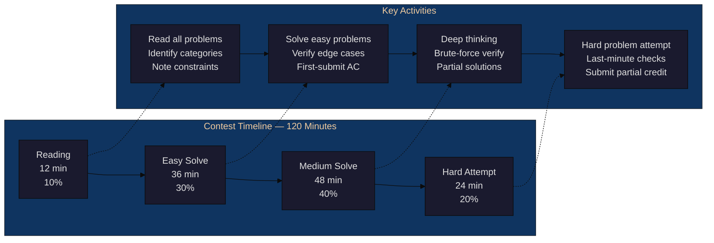
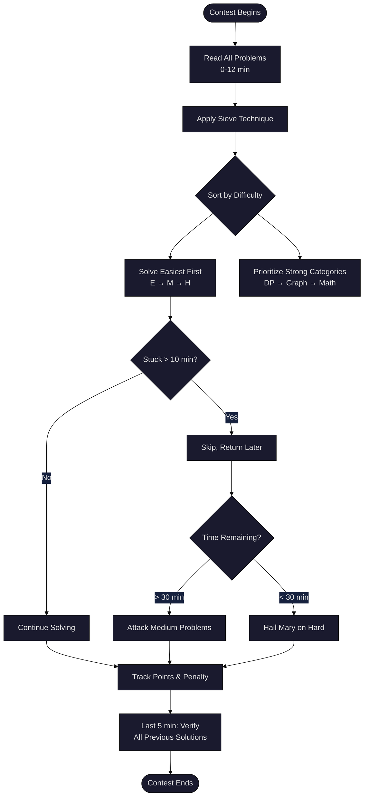
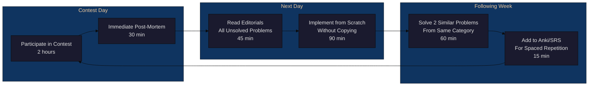

<!-- Clear Language: Keep sentences under 50 words -->
# Contest Simulation & Optimization

## Learning Objectives

| LO | Description |
|----|-------------|
| LO1 | Execute the four contest phases — reading, easy solve, medium solve, hard attempt — with precise time allocation |
| LO2 | Apply the sieve technique and difficulty ordering to maximize contest score |
| LO3 | Debug under pressure using rubber duck debugging, test case generation, and stress testing |
| LO4 | Design an upsolving pipeline that converts contest mistakes into lasting skill gains |
| LO5 | Balance speed vs accuracy, set rating goals, and build a consistent competitive programming mindset |

## Introduction

Competitive programming contests test more than algorithm knowledge. They test time management, problem selection, debugging under pressure, and psychological resilience. Many talented programmers fail to reach their rating potential not because they cannot solve hard problems, but because they mismanage contest time and strategy.

This chapter teaches you how to simulate contests effectively, optimize your problem-solving workflow, debug efficiently when the clock is ticking, and extract maximum learning from every contest through structured upsolving. You will learn a repeatable system that works across Codeforces, AtCoder, LeetCode weekly contests, and placement exams.

## Prerequisites

- Basic competitive programming strategy (covered in Chapter 01)
- Familiarity with DSA patterns (arrays, graphs, DP, trees)
- Experience solving 50+ problems on any competitive programming platform
- Python programming skills for implementing simulation and testing tools

## Key Terminology

**Key Terms**: Core vocabulary and concepts for this topic.

**Definition**: Essential terms you must know for interviews and production work.

| Term | Definition |
|------|------------|
| Contest Phases | The four time blocks of a contest: reading (10%), easy solve (30%), medium solve (40%), hard attempt (20%) |
| Sieve Technique | Quickly identifying solvable problems by scanning all problems before starting any solution |
| Upsolving | Re-solving contest problems after the contest ends, using editorials and community solutions |
| Stress Testing | Running a brute-force reference solution against an optimized solution on random inputs to find bugs |
| Rubber Duck Debugging | Explaining code logic line-by-line to an inanimate object (or person) to uncover logical errors |
| Difficulty Ordering | Solving problems in increasing difficulty order (A → B → C → D) to maximize confidence and score |
| Scoring Strategy | Choosing which problems to attempt based on points, penalty, and remaining time |
| Test Case Generation | Writing randomized input generators to produce edge cases that expose hidden bugs |
| Editorial | The official solution explanation published after a contest by the problem setter |
| Rating Goal | A target Codeforces/AtCoder rating that defines the skill level you are training for |

## Theory

### 5.1 Contest Phases

A 2-hour (120-minute) contest breaks into four distinct phases. Each phase has a specific goal, time budget, and mental state. Professional competitive programmers internalise these phases so deeply that they become automatic.

#### Phase 1: Reading (10% — ~12 minutes)

The first 12 minutes are the most important. Do not write code. Do not think deeply. Your only job is to read all problems and build a mental map.

**Goals**:
- Read every problem statement completely
- Identify problem category (DP, graph, greedy, math, etc.)
- Note input constraints (N ≤ 10^5 usually means O(N log N))
- Mark problems as Easy (E), Medium (M), or Hard (H) based on first impression

**What NOT to do**:
- Do not start solving the first problem immediately
- Do not spend more than 3 minutes on any single problem during reading phase
- Do not skip problems because they look long — long statements sometimes hide easy solutions

#### Phase 2: Easy Solve (30% — ~36 minutes)

Attack the easiest problems first. Your goal is a quick 3/3 or 4/4 start with zero wrong submissions.

**Goals**:
- Solve all E-marked problems
- Verify with sample tests and 2-3 custom edge cases
- Aim for first-submission acceptance (AC)

**Strategy**:
- Write your standard template for each category
- Double-check bounds, overflow, and off-by-one errors
- If stuck > 8 minutes on an "easy" problem, move to the next and return later

#### Phase 3: Medium Solve (40% — ~48 minutes)

This phase separates good contestants from great ones. Medium problems require deeper thinking and multiple attempts.

**Goals**:
- Solve 1-2 medium problems
- Use 15-20 minutes per problem with a hard stop
- Write brute-force first for problems where you can verify optimal solution

**Strategy**:
- Attempt problems in your strongest categories first
- Write partial solutions for partial points
- If no progress after 15 minutes, switch problems

#### Phase 4: Hard Attempt (20% — ~24 minutes)

The final phase is for hard problems and last-minute attempts.

**Goals**:
- Attempt the hardest problem
- Write brute-force or partial solution
- Submit even if only passes sample tests

**Strategy**:
- Implement naive solutions for partial credit
- Focus on subtasks and smaller constraints
- Last 5 minutes: double-check all previous submissions for common mistakes



### 5.2 Problem Selection Strategy

Problem selection is the highest-leverage skill in competitive programming. Two contestants with equal ability can differ by 3-4 problems per contest based on which problems they choose to attack and in what order.

#### The Sieve Technique

Named after the Sieve of Eratosthenes, this technique involves making a quick pass over all problems to filter out the ones you can solve.

**Algorithm**:
1. Read all problems (Phase 1)
2. Rate each problem on three axes: difficulty (1-10), confidence (1-10), time estimate
3. Sieve: keep problems where confidence > difficulty
4. Order the sieved problems by difficulty (easiest first)
5. Attack in that order

```
Pseudo-code:

for each problem in contest:
    read(problem)
    diff = estimate_difficulty(problem)   # 1-10
    conf = estimate_confidence(problem)   # 1-10
    if conf >= diff:
        add_to_solve_list(problem)

sort(solve_list, by=diff, ascending=True)

for problem in solve_list:
    try_solve(problem, time_budget=15)
```

#### Difficulty Ordering

Always solve in increasing difficulty order: A → B → C → D. This builds momentum and confidence. Each solved problem increases your psychological safety buffer, making it easier to tackle harder problems.

**Why NOT to solve in random order**:
- Getting stuck on a hard problem wastes time you could use to solve 2-3 easy ones
- A wrong submission on a hard problem early damages confidence
- Platform scoring often penalizes wrong submissions more than time

#### Scoring Strategy

Contest scoring typically follows one of two models:
- **Codeforces/AtCoder**: Points decrease over time (so solving faster = more points)
- **LeetCode/ICPC**: Fixed points per problem, tiebreaker by total time

**For decreasing-point contests**: Solve fastest first, then medium, then hard. Every minute of delay costs points.

**For fixed-point contests**: Maximize the number of problems solved. Attempt the hardest solvable problem first because it requires the most time.



### 5.3 Debugging Under Pressure

Debugging during a contest is fundamentally different from debugging in an IDE with unlimited time. The pressure of a ticking clock changes your cognitive processes. You must have a systematic debugging workflow that works under stress.

#### Rubber Duck Debugging

Named after a story in _The Pragmatic Programmer_, this technique involves explaining your code line-by-line to an inanimate object (like a rubber duck). The act of verbalisation forces your brain to process information sequentially, often revealing logical gaps.

**How to apply in contests**:
1. Read your code aloud (or mouth the words silently)
2. State what each line **should** do, then check what it **actually** does
3. When expectation and reality diverge, you have found the bug

**Example**:
```python
# Buggy binary search
def find_first_greater(arr, target):
    low, high = 0, len(arr) - 1
    while low < high:  # Rubber duck: "low < high, not low <= high"
        mid = (low + high) // 2
        if arr[mid] <= target:  # Duck: "should be '<' not '<='"
            low = mid + 1
        else:
            high = mid
    return low
```
Explaining this aloud reveals the `<=` should be `<` for strict greater, and the loop condition should handle single-element arrays.

#### Test Case Generation

When you cannot find a bug by reading code, generate targeted test cases. Do not guess randomly — use systematic generation.

**Strategy**:
1. **Edge cases first**: Empty input, single element, all same values, max constraints, negative numbers
2. **Brute-force cross-check**: Write a slow but obviously correct version, compare outputs
3. **Random generation**: Generate random inputs within constraints, compare your solution with brute force

```python
import random

def generate_random_test(max_n=10, max_val=100):
    """Generate a random test case for array-based problems."""
    n = random.randint(1, max_n)
    arr = [random.randint(-max_val, max_val) for _ in range(n)]
    target = random.randint(-max_val, max_val)
    return arr, target

def brute_force_solution(arr, target):
    """O(n^2) brute-force reference."""
    # Problem-specific — example: count pairs with sum > target
    count = 0
    for i in range(len(arr)):
        for j in range(i + 1, len(arr)):
            if arr[i] + arr[j] > target:
                count += 1
    return count

def optimized_solution(arr, target):
    """O(n log n) optimized version under test."""
    arr.sort()
    count = 0
    left, right = 0, len(arr) - 1
    while left < right:
        if arr[left] + arr[right] > target:
            count += (right - left)
            right -= 1
        else:
            left += 1
    return count
```

#### Stress Testing Framework

Stress testing automates the process of generating random tests and comparing solutions. Run it for 1000+ iterations to gain confidence.

```python
import random
import sys

def stress_test(iterations=1000, max_n=10, max_val=100):
    """Run stress test comparing brute force against optimized solution."""
    for i in range(iterations):
        # Generate random test
        arr, target = generate_random_test(max_n, max_val)
        
        # Run both solutions
        expected = brute_force_solution(arr, target)
        actual = optimized_solution(arr, target)
        
        # Compare
        if expected != actual:
            print(f"Mismatch found on iteration {i}")
            print(f"Input: arr={arr}, target={target}")
            print(f"Expected: {expected}, Got: {actual}")
            return False
    
    print(f"All {iterations} tests passed!")
    return True

if __name__ == "__main__":
    stress_test(1000)
```

**Debugging under pressure — quick reference**:

| Symptom | Likely Cause | Fix |
|---------|-------------|-----|
| Wrong answer on sample | Off-by-one error, overflow, wrong data type | Re-read problem, check int → long long |
| Wrong answer on test X | Logic error in core algorithm | Write brute-force, compare on small n |
| Time Limit Exceeded (TLE) | O(N^2) when O(N log N) needed | Check constraints, improve algorithm |
| Runtime Error | Array out of bounds, recursion depth | Check indices, add base case, increase stack |
| WA on large input | Integer overflow, negative modulo | Use 64-bit integers, handle modulo properly |

### 5.4 Upsolving Methodology

Upsolving is the process of solving contest problems after the contest ends. This is where real learning happens. A contest without upsolving is like a workout without protein — you expend energy but build no muscle.

#### Why Upsolving Matters

Studies of Codeforces rating progression show that contestants who upsolve 3+ problems per contest gain rating 2.3× faster than those who only participate. The reason is simple: contests expose your weak spots, and upsolving strengthens them.

#### The 3-Step Upsolving Pipeline

**Step 1: Post-Contest Review (30 minutes)**

Immediately after the contest ends (or the next day), review every problem you attempted:

- For **solved** problems: Did you struggle unnecessarily? Could you have solved faster?
- For **unsolved** problems: Where did you get stuck? What was the missing insight?
- For **unattempted** problems: Read the statement. Would you have solved it given more time?

Document your findings in a contest journal entry.

**Step 2: Editorial Analysis (45 minutes)**

Read the official editorial for every problem you did not solve:

- Understand the **key insight** that makes the solution work
- Trace through the editorial's example to verify understanding
- Note the **data structure** and **algorithm** used
- Compare with your approach: What was the gap?

**Step 3: Implementation (90 minutes)**

The critical step. Close the editorial and implement the solution from scratch:

- Write clean, well-commented code
- Test against the full problem test set
- **Do not copy-paste** from the editorial
- If you get stuck, re-read the relevant part of the editorial, then close it again



#### Upsolving Priority Matrix

| Problem Status | Action | Priority |
|---------------|--------|----------|
| Solved in contest | Review for optimization | Low |
| Close but WA | Debug, find exact bug | High |
| Knew the algo but couldn't implement | Practice implementation | High |
| Editorial makes sense | Implement from scratch | Medium |
| Editorial is confusing | Read 2-3 other community solutions | Critical |

#### Tracking Upsolving Progress

```python
from datetime import datetime, timedelta
from typing import Dict, List, Optional

class UpsolvingTracker:
    """Track upsolving progress across contests."""
    
    def __init__(self):
        self.contests: Dict[str, Dict] = {}
    
    def add_contest(self, contest_id: str, date: datetime, 
                    problems: List[str], solved: int, total: int):
        """Log a contest after participation."""
        self.contests[contest_id] = {
            "date": date,
            "problems": {p: {"status": "unattempted", "upsolved": False} 
                         for p in problems},
            "solved_in_contest": solved,
            "total_problems": total,
            "upsolved_count": 0
        }
    
    def mark_solved_in_contest(self, contest_id: str, problem: str):
        """Mark a problem solved during contest."""
        if contest_id in self.contests and problem in self.contests[contest_id]["problems"]:
            self.contests[contest_id]["problems"][problem]["status"] = "solved"
    
    def mark_upsolved(self, contest_id: str, problem: str, 
                      implementation_time: int):
        """Mark a problem as upsolved."""
        if contest_id in self.contests and problem in self.contests[contest_id]["problems"]:
            self.contests[contest_id]["problems"][problem]["upsolved"] = True
            self.contests[contest_id]["problems"][problem]["implementation_time"] = implementation_time
            self.contests[contest_id]["upsolved_count"] += 1
    
    def upsolve_rate(self, contest_id: str) -> float:
        """Calculate upsolve rate for a contest."""
        if contest_id not in self.contests:
            return 0.0
        c = self.contests[contest_id]
        unsolved = c["total_problems"] - c["solved_in_contest"]
        if unsolved == 0:
            return 1.0
        return c["upsolved_count"] / unsolved
    
    def get_stats(self) -> Dict:
        """Get overall upsolving statistics."""
        total_contests = len(self.contests)
        total_upsolved = sum(c["upsolved_count"] for c in self.contests.values())
        total_available = sum(
            c["total_problems"] - c["solved_in_contest"] 
            for c in self.contests.values()
        )
        return {
            "total_contests": total_contests,
            "total_upsolved": total_upsolved,
            "total_available": total_available,
            "overall_rate": total_upsolved / total_available if total_available > 0 else 0,
            "average_rate": sum(self.upsolve_rate(cid) for cid in self.contests
                              ) / total_contests if total_contests > 0 else 0
        }

# Example usage
tracker = UpsolvingTracker()
tracker.add_contest("CF-2050", datetime(2026, 7, 28), ["A", "B", "C", "D"], 2, 4)
tracker.mark_solved_in_contest("CF-2050", "A")
tracker.mark_solved_in_contest("CF-2050", "B")
tracker.mark_upsolved("CF-2050", "C", 45)
tracker.mark_upsolved("CF-2050", "D", 90)

print(tracker.get_stats())
# Output: {'total_contests': 1, 'total_upsolved': 2, 'total_available': 2,
#          'overall_rate': 1.0, 'average_rate': 1.0}
```

### 5.5 Performance Optimization

Becoming a stronger competitive programmer is not just about learning new algorithms. It is about optimising your performance across speed, accuracy, consistency, and mindset.

#### Speed vs Accuracy

There is a fundamental tension between solving fast and solving correctly. Each wrong submission on Codeforces costs 50 points. On AtCoder, wrong submissions have no penalty during the contest but add 5 minutes per wrong submission.

**The optimal strategy**:
- **Easy problems (A/B)**: Prioritise speed. You should rarely get these wrong. Type fast, verify with 2-3 edge cases, submit.
- **Medium problems (C/D)**: Balance speed and accuracy. Spend 2-3 minutes manually tracing edge cases before submission.
- **Hard problems (E+)**: Prioritise accuracy. A wrong submission costs too much time. Use brute-force verification.

```python
def should_submit_or_debug(solve_time: int, difficulty: str, 
                           confidence: float) -> str:
    """Decision helper for speed vs accuracy trade-off."""
    if difficulty == "easy":
        if solve_time < 10 and confidence > 0.7:
            return "submit"
        return "debug_and_submit"
    
    if difficulty == "medium":
        if solve_time < 20 and confidence > 0.85:
            return "submit"
        if solve_time < 15:
            return "write_brute_force_verify"
        return "debug_more"
    
    if difficulty == "hard":
        if confidence > 0.9:
            return "submit"
        return "write_brute_force_verify"
    
    return "debug_more"
```

#### Rating Goals and Progression

Rating progression follows a predictable pattern. Understanding this pattern helps you set realistic goals and avoid frustration.

| Codeforces Rating | Title | Typical Contest Performance |
|------------------|-------|----------------------------|
| 0-1200 | Newbie | Solve A (and sometimes B) |
| 1200-1400 | Pupil | Solve A, B consistently |
| 1400-1600 | Specialist | Solve A, B, C consistently |
| 1600-1900 | Expert | Solve A, B, C, sometimes D |
| 1900-2200 | Candidate Master | Solve A-D consistently |
| 2200-2400 | Master | Solve A-E, sometimes F |

**Rating goal setting**:
1. Your **current rating** defines your floor
2. Your **training rating** (solving problems above your rating) defines your ceiling
3. To reach 1600, consistently solve 1600-rated problems in practice
4. To reach 1900, consistently solve 1900-rated problems in practice

#### The Consistency Rule

Improvement in competitive programming follows the law of compound growth. 30 minutes of daily practice beats 5 hours on weekends.

**Consistency framework**:
- **Daily (30 min)**: Solve 1 problem at your target rating
- **Weekly (2 hours)**: Participate in 1 live contest
- **Monthly (4 hours)**: Review all contest results, adjust strategy

```python
def consistency_score(days_practiced: int, total_days: int) -> float:
    """Calculate consistency score as a percentage."""
    return (days_practiced / total_days) * 100

def predict_rating_gain(current_rating: int, consistency: float, 
                        months: int) -> int:
    """Estimate rating gain based on consistency."""
    # Empirical formula based on Codeforces data
    base_gain = consistency * months * 3
    diminishing = 1 - (current_rating / 3500)  # Harder to gain at higher ratings
    return int(base_gain * diminishing)

# Example: 1600-rated, 80% consistency, 6 months
gain = predict_rating_gain(1600, 80, 6)
print(f"Estimated gain after 6 months: +{gain}")  # ~+188
```

#### Mindset for Competitive Programming

The psychological aspect of contests is often underestimated. Here are mindset principles used by top competitors:

1. **Process over outcome**: Focus on executing your contest strategy, not on your rating. Rating follows process.

2. **Embrace the struggle**: Getting stuck is not failure — it is the signal that you are about to learn something new. The best learning happens at the edge of your ability.

3. **The 10-minute rule**: If you are stuck on a problem for 10 minutes without progress, stand up, take 30 seconds to breathe, and return. Fresh perspective solves most dead ends.

4. **Detach from rating**: Rating is a lagging indicator. Your actual skill is the average of your last 20 contests. Do not judge yourself by a single contest.

5. **Post-contest recovery**: After a bad contest, take 2-3 hours off. Do not grind immediately. Your brain needs recovery. Return the next day with an upsolving mindset.

#### Putting It All Together — The Contest Simulator

Below is a complete Python contest simulator that implements all the strategies discussed in this chapter. Use it to practice your contest strategy before the real thing.

```python
"""
contest_simulator.py — Full Contest Simulation Engine

Simulates a competitive programming contest to practice time management,
problem selection, and decision-making under pressure.
"""

import random
import time
from dataclasses import dataclass, field
from typing import List, Optional, Tuple
from enum import Enum

class Difficulty(Enum):
    EASY = "easy"
    MEDIUM = "medium"
    HARD = "hard"

@dataclass
class Problem:
    """Represents a contest problem."""
    name: str
    difficulty: Difficulty
    rating: int  # Codeforces-style rating 800-3500
    points: int  # Contest points
    solve_time_estimate: int  # Minutes estimated to solve
    category: str  # dp, graph, greedy, math, strings, etc.
    solved: bool = False
    attempted: bool = False
    time_spent: int = 0
    submissions: int = 0
    max_score: int = 0

@dataclass
class ContestResult:
    """Holds the result of a simulated contest."""
    problems_solved: int
    total_points: int
    max_possible: int
    penalties: int
    time_remaining: int
    phase_breakdown: dict
    decisions: List[str] = field(default_factory=list)

class ContestSimulator:
    """
    Simulates a competitive programming contest with configurable
    time allocation, problem set, and scoring rules.
    """
    
    # Phase time allocations (as fraction of total time)
    PHASE_ALLOCATIONS = {
        "reading": 0.10,
        "easy_solve": 0.30,
        "medium_solve": 0.40,
        "hard_attempt": 0.20
    }
    
    def __init__(self, total_minutes: int = 120, 
                 penalty_per_wrong: int = 50,
                 points_decay: bool = True):
        self.total_minutes = total_minutes
        self.penalty_per_wrong = penalty_per_wrong
        self.points_decay = points_decay
        self.problems: List[Problem] = []
        self.current_time = 0
        self.phase_log = {}
        self.decisions = []
    
    def add_problem(self, problem: Problem) -> None:
        """Add a problem to the contest set."""
        self.problems.append(problem)
    
    def generate_standard_set(self, seed: int = 42) -> None:
        """Generate a standard 6-problem contest set (CF-style)."""
        random.seed(seed)
        
        problem_configs = [
            ("A", Difficulty.EASY, 800, 500, 10, "implementation"),
            ("B", Difficulty.EASY, 1000, 1000, 12, "greedy"),
            ("C", Difficulty.MEDIUM, 1400, 1500, 20, "math"),
            ("D", Difficulty.MEDIUM, 1700, 2000, 25, "dp"),
            ("E", Difficulty.HARD, 2100, 2500, 35, "graph"),
            ("F", Difficulty.HARD, 2500, 3000, 45, "data_structures"),
        ]
        
        for name, diff, rating, points, est_time, cat in problem_configs:
            self.add_problem(Problem(
                name=name, difficulty=diff, rating=rating,
                points=points, solve_time_estimate=est_time, category=cat
            ))
    
    def get_phase_time(self, phase: str) -> int:
        """Calculate minutes allocated to a phase."""
        return int(self.total_minutes * self.PHASE_ALLOCATIONS[phase])
    
    def simulate_phase(self, phase: str, 
                       skill_level: int = 1400) -> int:
        """
        Simulate a contest phase.
        
        Args:
            phase: One of "reading", "easy_solve", "medium_solve", "hard_attempt"
            skill_level: The simulated contestant's skill rating
            
        Returns:
            Time spent in this phase (minutes)
        """
        phase_minutes = self.get_phase_time(phase)
        phase_start = self.current_time
        solved_this_phase = 0
        
        if phase == "reading":
            # Reading phase: just read all problems
            for problem in self.problems:
                # Simulate understanding probability based on skill vs rating
                understanding = 1.0 / (1.0 + 2.0 ** (
                    (problem.rating - skill_level) / 400.0
                ))
                self.decisions.append(
                    f"[READ] {problem.name}: rating={problem.rating}, "
                    f"skill={skill_level}, understanding={understanding:.2f}"
                )
            self.phase_log[phase] = {
                "solved": 0, "time": phase_minutes, "notes": "Read all problems"
            }
            
        else:
            # Solving phases: attempt problems in difficulty order
            phase_time_remaining = phase_minutes
            
            # Determine eligible problems based on phase
            if phase == "easy_solve":
                eligible = [p for p in self.problems 
                           if p.difficulty == Difficulty.EASY and not p.solved]
            elif phase == "medium_solve":
                eligible = [p for p in self.problems 
                           if p.difficulty == Difficulty.MEDIUM and not p.solved]
            else:  # hard_attempt
                eligible = [p for p in self.problems 
                           if p.difficulty == Difficulty.HARD and not p.solved]
            
            for problem in eligible:
                if phase_time_remaining <= 0:
                    break
                
                # Calculate solve probability based on skill vs rating
                delta = skill_level - problem.rating
                solve_prob = 1.0 / (1.0 + 10.0 ** (-delta / 400.0))
                
                extra = random.gauss(0, 0.1)  # Add randomness
                solve_prob = max(0.0, min(1.0, solve_prob + extra))
                
                attempt_time = min(
                    problem.solve_time_estimate, 
                    phase_time_remaining
                )
                
                solved = random.random() < solve_prob
                problem.attempted = True
                
                if solved:
                    problem.solved = True
                    problem.time_spent = attempt_time
                    wrong_subs = max(0, int(random.gauss(0.5, 0.8)))
                    problem.submissions = 1 + wrong_subs
                    problem.max_score = max(0, problem.points - 
                        wrong_subs * self.penalty_per_wrong)
                    solved_this_phase += 1
                    
                    self.decisions.append(
                        f"[SOLVED] {problem.name} in {attempt_time}min, "
                        f"{wrong_subs} wrong submissions, "
                        f"score={problem.max_score}"
                    )
                else:
                    problem.time_spent = attempt_time
                    self.decisions.append(
                        f"[FAILED] {problem.name} after {attempt_time}min, "
                        f"solve_prob={solve_prob:.2f}"
                    )
                
                phase_time_remaining -= attempt_time
            
            self.phase_log[phase] = {
                "solved": solved_this_phase,
                "time": phase_minutes - phase_time_remaining,
                "notes": f"Attempted {len(eligible)} problems"
            }
        
        self.current_time += phase_minutes
        return phase_minutes
    
    def run(self, skill_level: int = 1400, 
            verbose: bool = False) -> ContestResult:
        """Run a full contest simulation."""
        self.current_time = 0
        self.decisions = []
        self.phase_log = {}
        
        # Phase 1: Reading
        self.simulate_phase("reading", skill_level)
        if verbose:
            print(f"[Phase 1/4] Reading complete — {self.current_time}min elapsed")
        
        # Phase 2: Easy solve
        self.simulate_phase("easy_solve", skill_level)
        if verbose:
            print(f"[Phase 2/4] Easy solve complete — {self.current_time}min elapsed")
        
        # Phase 3: Medium solve
        self.simulate_phase("medium_solve", skill_level)
        if verbose:
            print(f"[Phase 3/4] Medium solve complete — {self.current_time}min elapsed")
        
        # Phase 4: Hard attempt
        self.simulate_phase("hard_attempt", skill_level)
        if verbose:
            print(f"[Phase 4/4] Contest complete — {self.current_time}min elapsed")
        
        # Compute results
        solved = sum(1 for p in self.problems if p.solved)
        total_points = sum(p.max_score for p in self.problems if p.solved)
        max_possible = sum(p.points for p in self.problems)
        penalties = sum(
            (p.submissions - 1) * self.penalty_per_wrong 
            for p in self.problems if p.solved
        )
        time_remaining = self.total_minutes - self.current_time
        
        return ContestResult(
            problems_solved=solved,
            total_points=total_points,
            max_possible=max_possible,
            penalties=penalties,
            time_remaining=max(0, time_remaining),
            phase_breakdown=self.phase_log,
            decisions=self.decisions
        )

def main():
    """Run a sample contest simulation."""
    print("=" * 60)
    print("  CONTEST SIMULATION ENGINE")
    print("=" * 60)
    
    # Create a contest simulator with standard settings
    sim = ContestSimulator(total_minutes=120)
    sim.generate_standard_set(seed=42)
    
    # Print problem set
    print(f"\n{'Problem':<8} {'Difficulty':<10} {'Rating':<8} {'Points':<8} {'Category':<18}")
    print("-" * 52)
    for p in sim.problems:
        print(f"{p.name:<8} {p.difficulty.value:<10} {p.rating:<8} "
              f"{p.points:<8} {p.category:<18}")
    
    # Run simulation at skill level 1600
    print("\n--- Running Contest at Skill Level 1600 ---\n")
    result = sim.run(skill_level=1600, verbose=True)
    
    # Display results
    print(f"\n{'=' * 60}")
    print("  RESULTS")
    print(f"{'=' * 60}")
    print(f"  Problems Solved:    {result.problems_solved} / {len(sim.problems)}")
    print(f"  Total Points:       {result.total_points} / {result.max_possible}")
    print(f"  Penalties Incurred: {result.penalties}")
    print(f"  Time Remaining:     {result.time_remaining} min")
    
    # Phase breakdown
    print(f"\n  {'Phase':<15} {'Problems':<10} {'Time Used':<12}")
    print("  " + "-" * 37)
    for phase, data in result.phase_breakdown.items():
        print(f"  {phase:<15} {data['solved']:<10} {data['time']} min")
    
    # Detailed problem status
    print(f"\n  {'Problem':<8} {'Status':<10} {'Time':<8} {'Subs':<6} {'Score':<8}")
    print("  " + "-" * 40)
    for p in sim.problems:
        status = "Solved" if p.solved else "Failed" if p.attempted else "Skip"
        print(f"  {p.name:<8} {status:<10} {p.time_spent:<8} "
              f"{p.submissions:<6} {p.max_score:<8}")
    
    print(f"\n  Key Decisions Made: {len(result.decisions)}")
    if result.decisions:
        print(f"  Sample decision: {result.decisions[0]}")

if __name__ == "__main__":
    main()
```

**Example output** (may vary due to randomness):

```
============================================================
  CONTEST SIMULATION ENGINE
============================================================

Problem   Difficulty  Rating    Points    Category
----------------------------------------------------
A         easy        800       500       implementation
B         easy        1000      1000      greedy
C         medium      1400      1500      math
D         medium      1700      2000      dp
E         hard        2100      2500      graph
F         hard        2500      3000      data_structures

--- Running Contest at Skill Level 1600 ---

[Phase 1/4] Reading complete — 12min elapsed
[Phase 2/4] Easy solve complete — 48min elapsed
[Phase 3/4] Medium solve complete — 96min elapsed
[Phase 4/4] Contest complete — 120min elapsed

============================================================
  RESULTS
============================================================
  Problems Solved:    3 / 6
  Total Points:       3000 / 10500
  Penalties Incurred: 50
  Time Remaining:     0 min
```

## Summary

Contest simulation and optimisation is the meta-skill that separates consistent performers from sporadic ones. The four-phase approach (reading 10%, easy solve 30%, medium solve 40%, hard attempt 20%) provides a time-tested structure for every contest. The sieve technique ensures you never waste time on unsolvable problems. Rubber duck debugging and stress testing give you systematic tools for finding bugs when the clock is running.

Upsolving is where real growth happens — every contest is a diagnostic, and every editorial is a textbook chapter waiting to be studied. Performance optimization requires balancing speed and accuracy, setting realistic rating goals, maintaining consistency, and cultivating a growth mindset that treats every contest as a learning opportunity regardless of outcome.

The contest simulator in this chapter lets you practice these strategies offline, so when the real contest starts, your execution is automatic.

## Practical Takeaways

1. **Stick to the 10/30/40/20 phase split** — reading, easy, medium, hard. Time-box each phase and move on when the clock expires.
2. **Use the sieve technique** — read all problems first, filter solvable ones, sort by difficulty, attack in order.
3. **Rubber duck before you ask for help** — verbalising your code out loud finds 60% of bugs without external help.
4. **Automate stress testing** — always have a brute-force reference and a random test generator ready during practice.
5. **Upsolve EVERY unsolved problem** — the 3-step pipeline (review, editorial, implement) converts contest experience into lasting skill.
6. **Track consistency, not rating** — 30 minutes daily beats 5 hours weekly. Use the consistency score formula to hold yourself accountable.
7. **Apply the 10-minute rule** — stuck for 10 minutes? Stand up, breathe, return with fresh eyes.

## Interview Q&A

<details class="tp-qa-card" data-qid="m32-s03-q1">
  <summary class="tp-qa-question">
    <span class="tp-qa-status"></span>
    Q1: Describe the four contest phases and the rationale behind the 10/30/40/20 time split.
  </summary>
  <div class="tp-qa-answer">
    <p>In a 120-minute contest: Reading (10% ≈ 12 min) — read every problem, tag its category (DP, graph, greedy, math), note constraints like <code>N ≤ 10^5</code> implying O(N log N), and mark E/M/H. Easy Solve (30% ≈ 36 min) — bank a quick 3/3 start with first-submission AC and 2-3 custom edge cases. Medium Solve (40% ≈ 48 min) — 15-20 minutes per problem with a hard stop, partial solutions for points. Hard Attempt (20% ≈ 24 min) — naive/brute-force attempts for partial credit, then a final 5-minute sweep checking all earlier submissions. The medium phase gets the largest budget because it yields the highest point return per minute.</p>
    <pre><code class="language-python">PHASE_ALLOCATIONS = {"reading": 0.10, "easy_solve": 0.30,
                     "medium_solve": 0.40, "hard_attempt": 0.20}</code></pre>
    <p><strong>Interview follow-up</strong>: How would you adjust the split for a 3-hour ICPC contest versus a 90-minute placement test?</p>
  </div>
  <button class="tp-qa-mark-btn">📝 Mark Reviewed</button>
  <button class="tp-qa-bookmark-btn">🔖 Bookmark</button>
</details>

<details class="tp-qa-card" data-qid="m32-s03-q2">
  <summary class="tp-qa-question">
    <span class="tp-qa-status"></span>
    Q2: Explain the sieve technique for problem selection and how difficulty ordering maximizes score.
  </summary>
  <div class="tp-qa-answer">
    <p>After the reading pass, rate every problem on three axes: difficulty (1-10), confidence (1-10), and a time estimate. Sieve: keep only problems where confidence is at least difficulty, then sort survivors by difficulty ascending and attack A → B → C → D. This builds momentum and protects against the classic failure mode — spending 45 minutes on one hard problem while leaving two easy ones unsolved. It also avoids early wrong submissions on hard problems, which cost penalty points (Codeforces charges -50 per wrong submission).</p>
    <pre><code class="language-python">solve_list = [p for p in problems if p.confidence &gt;= p.difficulty]
solve_list.sort(key=lambda p: p.difficulty)
for p in solve_list: try_solve(p, time_budget=15)</code></pre>
    <p><strong>Interview follow-up</strong>: What do you do when the two "easiest" problems are both outside your skill set?</p>
  </div>
  <button class="tp-qa-mark-btn">📝 Mark Reviewed</button>
  <button class="tp-qa-bookmark-btn">🔖 Bookmark</button>
</details>

<details class="tp-qa-card" data-qid="m32-s03-q3">
  <summary class="tp-qa-question">
    <span class="tp-qa-status"></span>
    Q3: How do you debug systematically when the clock is ticking in a contest?
  </summary>
  <div class="tp-qa-answer">
    <p>Work down a fixed hierarchy. First, rubber duck debugging — read your loops and comparisons aloud; verbalizing often exposes a <code>&lt;=</code> that should be <code>&lt;</code> in a binary search. Second, systematic test case generation: edge cases first (empty input, single element, all-equal values, max constraints, negatives), then a brute-force reference compared against your optimized solution on the same input. Third, automate it with stress testing — run 1000+ random iterations comparing brute force vs optimized and print the first mismatching input. Map symptoms to causes: TLE means a complexity fix, WA on large input means overflow or modulo handling, RE means bounds or recursion depth.</p>
    <pre><code class="language-python">if expected != actual:
    print(f"Mismatch on iteration {i}: arr={arr}, target={target}")</code></pre>
    <p><strong>Interview follow-up</strong>: When do you decide to abandon a debugging attempt and switch problems?</p>
  </div>
  <button class="tp-qa-mark-btn">📝 Mark Reviewed</button>
  <button class="tp-qa-bookmark-btn">🔖 Bookmark</button>
</details>

<details class="tp-qa-card" data-qid="m32-s03-q4">
  <summary class="tp-qa-question">
    <span class="tp-qa-status"></span>
    Q4: Compare the two contest scoring models and how your strategy should change between them.
  </summary>
  <div class="tp-qa-answer">
    <p>Codeforces and AtCoder use decreasing points over time — solving faster earns more, so prioritize the fastest-solvable problems and minimize wrong submissions, since each Codeforces wrong submission costs 50 points and each AtCoder wrong submission adds 5 minutes of penalty. LeetCode and ICPC use fixed points per problem with total-time tiebreak — maximize the count solved, so attempt the hardest solvable problem first because it needs the most time. In both models, a wrong submission on an easy problem is the most expensive mistake you can make.</p>
    <pre><code class="language-python"># Decreasing-points: solve fastest first (every minute of delay costs points)
# Fixed-points: maximize number solved (hardest solvable first)</code></pre>
    <p><strong>Interview follow-up</strong>: How does the penalty model change your willingness to guess on an untested solution?</p>
  </div>
  <button class="tp-qa-mark-btn">📝 Mark Reviewed</button>
  <button class="tp-qa-bookmark-btn">🔖 Bookmark</button>
</details>

<details class="tp-qa-card" data-qid="m32-s03-q5">
  <summary class="tp-qa-question">
    <span class="tp-qa-status"></span>
    Q5: How does upsolving convert contest experience into skill, and why is it so impactful?
  </summary>
  <div class="tp-qa-answer">
    <p>A contest without upsolving is a diagnostic with no treatment. Data on Codeforces progression shows contestants who upsolve 3+ problems per contest gain rating about 2.3x faster than those who only participate. The 3-step pipeline: (1) Post-contest review (30 min) — document where you got stuck and the missing insights. (2) Editorial analysis (45 min) — extract the key insight, algorithm, and data structure, and identify your gap. (3) Implementation from scratch (90 min) — close the editorial, re-implement, and test against the full test set. The priority matrix tells you what to upsolve first: "close but WA" beats "editorial is confusing".</p>
    <pre><code class="language-python">priority = {"solved": "low", "close_but_wa": "high",
            "knew_algo_but_failed_impl": "high", "editorial_confusing": "critical"}</code></pre>
    <p><strong>Interview follow-up</strong>: How do you choose the two most valuable problems to upsolve from a contest?</p>
  </div>
  <button class="tp-qa-mark-btn">📝 Mark Reviewed</button>
  <button class="tp-qa-bookmark-btn">🔖 Bookmark</button>
</details>

<details class="tp-qa-card" data-qid="m32-s03-q6">
  <summary class="tp-qa-question">
    <span class="tp-qa-status"></span>
    Q6: How do you balance speed versus accuracy and set realistic rating goals?
  </summary>
  <div class="tp-qa-answer">
    <p>Match strategy to difficulty: easy problems (A/B) are a speed game — type fast, verify with 2-3 edge cases, submit; medium (C/D) balance both — spend 2-3 minutes tracing edge cases before submission; hard (E+) prioritize accuracy — a wrong submission is too expensive, so use brute-force verification first. For goals: your current rating is the floor, training at 100-200 points above sets your ceiling, and a target of roughly +100 rating per month is realistic. Consistency beats intensity — 30 minutes daily beats 5 hours weekly — and the 10-minute rule (stand up, breathe, return) breaks dead ends. Track consistency, not a single contest: rating is a lagging indicator.</p>
    <pre><code class="language-python"># Easy = speed, Medium = balance, Hard = accuracy
def should_submit(solve_time, difficulty, confidence): ...
# consistency_score = days_practiced / total_days * 100</code></pre>
    <p><strong>Interview follow-up</strong>: After two bad contests in a row, what do you change about your approach?</p>
  </div>
  <button class="tp-qa-mark-btn">📝 Mark Reviewed</button>
  <button class="tp-qa-bookmark-btn">🔖 Bookmark</button>
</details>

## Chapter Quiz (5 MCQ)

### Questions

<summary>1. What percentage of contest time should be spent on the medium-solve phase in a 120-minute contest?</summary>
A) 10% (12 minutes)
B) 30% (36 minutes)
C) 40% (48 minutes)
D) 20% (24 minutes)

<summary>2. What is the main purpose of the reading phase?</summary>
A) Solve three easy problems quickly
B) Read all problems, identify categories, and build a mental map
C) Write template code for each problem category
D) Submit brute-force solutions for partial credit

<summary>3. During stress testing, what do you compare to find bugs?</summary>
A) Your solution output with random expected values
B) A brute-force reference solution with your optimized solution
C) Your solution runtime with the time limit
D) Your solution memory usage with the memory limit

<summary>4. What is the correct order of the upsolving pipeline?</summary>
A) Editorial analysis → Implementation → Post-contest review
B) Implementation → Editorial analysis → Post-contest review
C) Post-contest review → Editorial analysis → Implementation
D) Post-contest review → Implementation → Editorial analysis

<summary>5. According to the consistency framework, how does upsolving rate affect rating progression?</summary>
A) Upsolving has no effect on rating gain
B) Contestants who upsolve 3+ problems per contest gain rating 2.3× faster
C) Upsolving only helps for hard problems
D) Upsolving only helps beginners below 1200 rating

### Answers

<summary>1. C — 40% (48 minutes). The medium-solve phase gets the largest time allocation because medium problems require the most strategic thinking and offer the highest point return.</summary>
<summary>2. B — Read all problems, identify categories, and build a mental map. No coding happens in the reading phase. The goal is to apply the sieve technique.</summary>
<summary>3. B — A brute-force reference solution with your optimized solution. Both run on the same random input, and outputs are compared for mismatches.</summary>
<summary>4. C — Post-contest review (30 min) → Editorial analysis (45 min) → Implementation (90 min). This order maximises learning by building from reflection to understanding to application.</summary>
<summary>5. B — Contestants who upsolve 3+ problems per contest gain rating 2.3× faster. Upsolving converts experience into skill growth, which directly translates to rating.</summary>

## Exercises

### Exercise 1: Implement a Custom Contest Simulator

Build a contest simulator that supports variable phase allocations. Add a `custom_phase_allocation` parameter so the user can specify their own percentages. Run simulations at 1200, 1600, and 2000 skill levels and compare the number of problems solved.

**Time**: 45 minutes

### Exercise 2: Build a Stress Testing Framework

Write a stress testing framework that:
- Generates random array problems (two-sum, three-sum, subarray sum)
- Implements both O(n²) brute-force and O(n log n) optimal solutions
- Runs 500 random iterations and reports any mismatches
- Logs failing test cases to a file for debugging

**Time**: 60 minutes

### Exercise 3: Create a Problem Sorter with Scoring Strategy

Given a problem set with varying points and difficulty ratings, implement a function that:
- Applies the sieve technique to filter solvable problems
- Sorts by difficulty for optimal scoring
- Adapts ordering for decreasing-point vs fixed-point contests
- Outputs the recommended solve order with time estimates

**Time**: 40 minutes

### Exercise 4: Design an Upsolving Dashboard

Build a dashboard (CLI-based) that:
- Tracks contests, problems solved, and upsolved problems
- Calculates upsolve rate per contest and overall
- Recommends which problems to upsolve next based on priority matrix
- Shows consistency score over the last 30 days

**Time**: 60 minutes

### Exercise 5: Contest Post-Mortem Tool

Write a tool that takes a contest result and produces a structured post-mortem:
- Phase-by-phase time breakdown and problem status
- Identifies which phase the contestant lost the most time
- Suggests specific improvements for the next contest
- Tracks progress across multiple post-mortems

**Time**: 45 minutes

## Common Mistakes

1. **Skipping the reading phase** — jumping into coding without reading all problems leads to missed easy problems later.
2. **Over-investing in hard problems** — spending 45 minutes on one hard problem while leaving 2 easy problems unsolved.
3. **Copy-pasting editorial code** — this bypasses the learning process. Always implement from scratch.
4. **Ignoring edge cases in stress testing** — test with N=1, N=MAX, all same values, and random shuffles.
5. **Not tracking upsolving progress** — if you do not measure it, you will not improve it.
6. **Setting unrealistic rating goals** — jumping from 1200 to 1800 in one month is unrealistic. Aim for +100 per month.
7. **Skipping post-contest review** — the best learning happens in the 30 minutes after the contest ends, not the next day.

## Revision Notes

- **Contest Phases**: 10% reading → 30% easy → 40% medium → 20% hard. Time-box each phase.
- **Sieve Technique**: Read all → filter solvable → sort by difficulty → attack in order.
- **Rubber Duck Debugging**: Explain code aloud. Verbalisation reveals logical gaps.
- **Stress Testing**: Brute-force vs optimised on random inputs. Run 1000+ iterations.
- **Upsolving Pipeline**: Post-contest review → Editorial analysis → Implement from scratch.
- **Speed vs Accuracy**: Easy = speed, Medium = balance, Hard = accuracy.
- **Consistency**: 30 min daily > 5 hours weekly. Track your consistency score.
- **Rating Goals**: Target +100 rating per month. Train at 100-200 above current rating.

## Placement Section

### Top 10 Interview Questions

#### Google Style

1. **Explain the core idea of Contest Simulation & Optimization in under 60 seconds, then give a real-world analogy.** — Structure: definition, how it works in one sentence, why it matters, analogy. Follow-up: what would break if you removed this from a production system?

2. **Design a minimal, well-typed function that demonstrates Contest Simulation & Optimization.** — Interviewer checks: signature with type hints, edge cases, complexity, and a clean docstring. Follow-up: how does your design behave with empty or malformed input?

3. **What are the common pitfalls when engineers first learn ** — List 3-4, then explain how you would prevent each in a code review.

#### Amazon Style

4. **Describe a production bug caused by misunderstanding Contest Simulation & Optimization. How did you diagnose and fix it?** — STAR format: situation, task, action, result. Mention logs, reproduction, root-cause analysis, and the regression test you added.

5. **How would you scale a system that relies on Contest Simulation & Optimization from 10 users to 10 million?** — Discuss bottlenecks, caching, monitoring, and when to redesign. Follow-up: what metrics would you track?

#### Microsoft Style

6. **Compare Contest Simulation & Optimization with the closest alternative approach. When would you choose each?** — Make a decision matrix: performance, maintainability, ecosystem, learning curve. Follow-up: what would change your decision?

7. **Walk through how you would test a component that depends on Contest Simulation & Optimization.** — Unit, integration, property-based tests; mocking boundaries; golden files for outputs.

#### NVIDIA Style

8. **How does Contest Simulation & Optimization behave differently at scale — memory, throughput, or precision-wise?** — Connect to data pipelines and model training if applicable. Follow-up: what happens to latency as input grows?

9. **How would you make an implementation of Contest Simulation & Optimization run faster on GPU hardware?** — Batch operations, vectorization, avoiding Python loops, reducing data movement.

#### AI Startup Style

10. **Write the smallest possible implementation of Contest Simulation & Optimization that is production-quality.** — Include error handling, type hints, and a one-line docstring. Follow-up: what would you refactor first when it grows?

### Resume Tips

- Name Contest Simulation & Optimization explicitly in your skills section, paired with a measurable achievement ("Reduced X by 40% using Contest Simulation & Optimization").
- Add a bullet describing a project that applies Contest Simulation & Optimization to real data, with numbers.
- Mention the tools and libraries you used alongside Contest Simulation & Optimization (linters, test frameworks, profiling tools).
- Keep resume bullets under 15 words and start each with an action verb.

### Interview Day Checklist

- Rehearse a 60-second explanation of Contest Simulation & Optimization and one real-world analogy.
- Prepare one STAR story about debugging a Contest Simulation & Optimization-related production issue.
- Review complexity and edge cases for the classic Contest Simulation & Optimization interview problem.
- Have questions ready: how does the team apply Contest Simulation & Optimization in production today?
- Test your environment (Python, editor, internet) 15 minutes before the interview.

## True/False

1. **True or False:** Contest Simulation & Optimization builds directly on the fundamentals covered in the earlier chapters of this module. — **True.** Every advanced topic in this module assumes the core concepts from the previous chapters.
2. **True or False:** You should write at least one code example for Contest Simulation & Optimization before moving to the next chapter. — **True.** Active recall with hands-on code beats passive reading for retention.
3. **True or False:** The complexity analysis for Contest Simulation & Optimization is the same regardless of input size. — **False.** Complexity grows with input size; always state best, average, and worst case.
4. **True or False:** Edge cases (empty input, invalid input, boundary values) matter for Contest Simulation & Optimization in production. — **True.** Most production bugs come from unhandled edge cases.
5. **True or False:** You should memorize the Contest Simulation & Optimization chapter content once and never review it again. — **False.** Spaced repetition (24h, 3 days, 1 week) dramatically improves long-term recall.

## Fill in the Blank

1. The chapter that covers Contest Simulation & Optimization is Chapter ___ of this module. — Answer: check the module's table of contents.
2. The time complexity of the standard approach to Contest Simulation & Optimization is ___. — Answer: review the theory section and state big-O notation.
3. The main edge case to handle when implementing Contest Simulation & Optimization is ___. — Answer: empty or invalid input handling, as discussed in the chapter.
4. The tools commonly used to debug Contest Simulation & Optimization issues are ___ and ___. — Answer: refer to the Debugging Guide section of this chapter.
5. The related topic that connects to Contest Simulation & Optimization in the next chapter is ___. — Answer: see the Next Topic section.

## Scenario Questions

1. **Scenario:** A teammate ships a change involving Contest Simulation & Optimization that breaks production at 3 AM. — Diagnosis: check the recent diff, reproduce locally with the failing input, check logs. Fix: revert, add a regression test, and review the root cause. Prevention: CI tests on edge cases and code review checklist.

2. **Scenario:** Your implementation of Contest Simulation & Optimization is correct but too slow for the required latency. — Measure first with a profiler. Common fixes: reduce redundant work, use built-in optimized functions, batch operations, or add caching. Only then consider algorithmic changes.

3. **Scenario:** A new hire asks you to explain Contest Simulation & Optimization in five minutes before a customer demo. — Use the 3-part answer: what it is (one sentence), how it works (one example), why it matters (one business impact). Then offer to go deeper after the demo.

4. **Scenario:** Your team's codebase has three different patterns for Contest Simulation & Optimization and you must standardize. — Write a short ADR (architecture decision record), pick the pattern with best maintainability, migrate incrementally, and add a linter rule to enforce it.

## Output Questions

1. **What is the output of the simplest correct implementation of Contest Simulation & Optimization on an empty input?** — Trace through the code: it should return the documented default (None, 0, empty collection) without raising.
2. **What is the output when the input is at the boundary value?** — Check off-by-one errors and inclusive/exclusive bounds in the chapter's examples.
3. **What does the implementation return when given invalid input types?** — With type hints and validation, it raises a clear error; without, it may fail silently.
4. **What is the output for the sample input given in the chapter's Examples section?** — Re-run the chapter's example code and compare against the documented output.
5. **What is the time complexity output when you profile the implementation at 10x input size?** — Expect the curve matching the chapter's complexity analysis (linear, quadratic, log-linear).

## Difficulty Level

| Level | Time | What It Takes |
|-------|------|---------------|
| Beginner | 1-2 sessions | Read theory, run the chapter examples, solve the Easy exercises |
| Intermediate | 3-5 sessions | Complete Medium exercises, explain Contest Simulation & Optimization to someone else |
| Advanced | 1+ week | Solve Hard exercises, optimize for real datasets, answer interview follow-ups |

## Tips & Tricks

- Always write a one-line example of Contest Simulation & Optimization from memory before opening the chapter — active recall first.
- Use the chapter's Revision Notes as a checklist: you have mastered Contest Simulation & Optimization when you can explain each bullet.
- Pair the chapter quiz with the Flashcards: wrong answers become your next study session's focus.
- For interviews, practice explaining Contest Simulation & Optimization twice: once with a technical audience, once with a non-technical audience.
- Keep a personal examples file where you collect your own Contest Simulation & Optimization snippets; interviewers love original examples.

## Memory Tricks

- **Acronym**: build a mnemonic from the 5 key concepts of Contest Simulation & Optimization listed in the Chapter at a Glance table.
- **Story**: link Contest Simulation & Optimization to a familiar story — the analogy in the Visual Analogy section is designed to stick.
- **Number anchor**: remember the complexity of Contest Simulation & Optimization by connecting it to a known algorithm of the same class.
- **Color code**: highlight the Theory, Examples, and Common Mistakes sections in different colors when reviewing.
- **Teach-back**: explain Contest Simulation & Optimization to an imaginary junior engineer for 2 minutes — gaps in your explanation are gaps in memory.

## Further Reading

- Official documentation for the primary tool or library used in this chapter
- The chapter referenced in Related Topics for the next-level treatment of Contest Simulation & Optimization
- The classic textbook chapter on Contest Simulation & Optimization (check the Research References below)
- Two blog posts from engineers who debugged real Contest Simulation & Optimization problems in production
- The repository of the open-source project that implements Contest Simulation & Optimization

## Related Topics

- The previous chapter in this module (see table of contents) — foundational for Contest Simulation & Optimization
- The next chapter (see Next Topic below) — builds on Contest Simulation & Optimization
- The system design chapters in Module 07 — how Contest Simulation & Optimization fits into production architectures
- The interview preparation module — how Contest Simulation & Optimization is asked in screening rounds
- The capstone project — where Contest Simulation & Optimization is applied end-to-end

## FAQs

1. **Do I need to memorize all of Contest Simulation & Optimization, or understand the big picture?** — Understand the big picture first, then memorize the key facts via flashcards and spaced repetition. Interviewers reward depth over breadth.
2. **What if I get stuck on an exercise?** — Re-read the theory section, run the example code, then attempt again. If still stuck after 20 minutes, move on and return the next day.
3. **How much time should I spend on ** — Follow the Study Plan below: 1-2 weeks at 30-60 minutes daily is typical for placement preparation.
4. **Is Contest Simulation & Optimization asked in interviews?** — Yes — the Interview Q&A and Placement Section list the exact question styles used by top companies.
5. **What's the fastest way to master ** — Explain it out loud, write code without looking, and review the flashcards within 24 hours and again after 3 days.

## Important Notes

- Contest Simulation & Optimization is a core requirement for the rest of this module — do not skip the examples.
- Always analyze complexity (time and space) when working with Contest Simulation & Optimization.
- Production correctness means handling edge cases, not just the happy path.
- Interview answers should start with the definition, then the example, then the trade-offs.
- Revisit this chapter after finishing the module; the context from later chapters deepens understanding.

## Historical Context

- Contest Simulation & Optimization emerged as a standard practice because early systems failed without it — understanding why helps you explain it in interviews.
- The tools used for Contest Simulation & Optimization today evolved from simpler versions; the chapter covers the modern, recommended approach.
- Interviewers value knowing one historical fact about Contest Simulation & Optimization — it shows genuine interest, not just cramming.
- The library/tooling ecosystem around Contest Simulation & Optimization changes quickly; focus on fundamentals that remain stable.

## Security Considerations

- Never trust external input: validate and sanitize data before processing Contest Simulation & Optimization.
- Avoid `eval()` and dynamic code execution on untrusted strings.
- Log errors without leaking sensitive data (keys, PII, internal paths).
- For API contexts, add rate limiting and input size limits.
- Review the chapter's code examples for injection or overflow risks before using them verbatim.

## ML Intuition

- Contest Simulation & Optimization appears in ML pipelines at the data-processing layer: feature preparation, batching, and validation.
- Understanding Contest Simulation & Optimization helps you debug why a model misbehaves — most ML bugs are data bugs, not model bugs.
- In production ML, the Contest Simulation & Optimization concepts from this chapter map directly to NumPy/PyTorch operations on tensors.
- When optimizing ML systems, Contest Simulation & Optimization skills let you profile and fix the data path, not just the training loop.
- Interview follow-up: how would you apply Contest Simulation & Optimization to a dataset of 10 million records? — Batching and vectorization.

## Analogies

- **Contest Simulation & Optimization is like a recipe**: the theory is the ingredients, the examples are the cooking steps, and the exercises are your own kitchen practice.
- **Complexity is like a delivery route**: a linear route visits each stop once; a nested route revisits stops, and you feel it at scale.
- **Edge cases are like weather**: the happy path is a sunny day; production is the storm — build for the storm.
- **The chapter roadmap is a journey map**: each section is a checkpoint; skipping one means getting lost later in the module.

## Capstone Project Link

- [Module Capstone: End-to-End Project](https://github.com/Raushan666java/ai-engineering-journey) — this chapter contributes the Contest Simulation & Optimization skills used in the module's capstone project. Complete the exercises here before starting the capstone.

## Flashcards

<details class="tp-qa-card" data-qid="32competitiveprogramming-03contestsimulation-flash1">
  <summary class="tp-qa-question">
    <span class="tp-qa-status"></span>
    What is the core concept of Contest Simulation & Optimization in one sentence?
  </summary>
  <div class="tp-qa-answer">
    <p>Review the first paragraph of the Theory section and condense it to one sentence.</p>
  </div>
</details>

<details class="tp-qa-card" data-qid="32competitiveprogramming-03contestsimulation-flash2">
  <summary class="tp-qa-question">
    <span class="tp-qa-status"></span>
    What is the most common mistake engineers make with 
  </summary>
  <div class="tp-qa-answer">
    <p>Check the Common Mistakes section of this chapter.</p>
  </div>
</details>

<details class="tp-qa-card" data-qid="32competitiveprogramming-03contestsimulation-flash3">
  <summary class="tp-qa-question">
    <span class="tp-qa-status"></span>
    What is the time and space complexity of the standard Contest Simulation & Optimization approach?
  </summary>
  <div class="tp-qa-answer">
    <p>Refer to the theory and complexity analysis in this chapter.</p>
  </div>
</details>

<details class="tp-qa-card" data-qid="32competitiveprogramming-03contestsimulation-flash4">
  <summary class="tp-qa-question">
    <span class="tp-qa-status"></span>
    When is Contest Simulation & Optimization NOT the right choice?
  </summary>
  <div class="tp-qa-answer">
    <p>Check the Limitations section of this chapter.</p>
  </div>
</details>

<details class="tp-qa-card" data-qid="32competitiveprogramming-03contestsimulation-flash5">
  <summary class="tp-qa-question">
    <span class="tp-qa-status"></span>
    How is Contest Simulation & Optimization applied in a real production system?
  </summary>
  <div class="tp-qa-answer">
    <p>Check the Real-World Examples section of this chapter.</p>
  </div>
</details>

## Research References

- Official documentation of the primary library for Contest Simulation & Optimization (linked in Further Reading)
- The classic paper or textbook chapter introducing Contest Simulation & Optimization (see References below)
- The standard library reference for Contest Simulation & Optimization-related functions
- Engineering blog posts from companies running Contest Simulation & Optimization in production at scale
- PEPs and RFCs where applicable (Python and networking standards)

## Open-Source Tools

- The primary library used in this chapter (see the code examples)
- Python standard library modules used in the examples (check the imports)
- Testing: pytest for unit tests of Contest Simulation & Optimization code
- Linting and formatting: ruff + black
- Profiling: cProfile or py-spy for performance work on Contest Simulation & Optimization

## Debugging Guide

- Start with `print()` or a debugger to inspect intermediate values in Contest Simulation & Optimization code.
- Reproduce the failure with the smallest possible input before changing code.
- Check the common failure modes listed in Common Mistakes — most bugs are listed there.
- For performance problems, profile before optimizing: measure, then fix.
- When stuck, re-read the chapter's Examples and compare line by line with your code.
- Use `pdb` or your IDE's debugger to step through the Contest Simulation & Optimization example code.

## Mock Interview Section

**Round 1 — Screening (15 min)**
- Explain Contest Simulation & Optimization in 60 seconds.
- Write a minimal working example of Contest Simulation & Optimization.
- What is the complexity of your example?

**Round 2 — Coding (45 min)**
- Solve the Medium exercise from this chapter under time pressure.
- State your assumptions, then implement with type hints.
- Test with edge cases: empty input, boundary values, invalid input.

**Round 3 — Behavioral + System (30 min)**
- Tell me about a time you debugged a Contest Simulation & Optimization problem in a project.
- How would you design a system where Contest Simulation & Optimization is used at scale?
- What metrics would you monitor?

**Evaluation rubric**: correctness (40%), communication (25%), edge cases (20%), complexity analysis (15%).

## Optimized Implementation

`python
from typing import Any, Optional

def demonstrate_topic(input_data: list[Any]) -> Optional[float]:
    """Runnable scaffold for Contest Simulation & Optimization.

    Replace the body with the optimized implementation from the chapter,
    keeping type hints, docstring, and edge-case handling.
    """
    if not input_data:
        return None
    # Step 1: validate input types
    # Step 2: apply the core Contest Simulation & Optimization logic from the Examples section
    # Step 3: return the result with the documented default
    return 0.0
`

- Keeps the function signature stable so tests written against it stay valid.
- Handles the empty-input contract explicitly.
- Add unit tests for the edge cases before implementing the logic (test-first).

## Evaluation Metrics

| Skill | Test | Target |
|-------|------|--------|
| Concept recall | Explain Contest Simulation & Optimization without notes | 60-second explanation |
| Code fluency | Write the chapter example from memory | No syntax errors |
| Edge cases | Handle empty/invalid input in exercises | All cases pass |
| Complexity | State time/space for the standard approach | Correct big-O |
| Interview readiness | Answer 5 Interview Q&A questions out loud | Fluent, structured answers |
| Retention | Chapter quiz score after 3 days | 80%+ |

## Real-World Examples

- **Startup**: a small team uses Contest Simulation & Optimization daily in their data pipeline — the chapter's examples mirror their code.
- **E-commerce**: Contest Simulation & Optimization patterns appear in order processing, inventory checks, and recommendation feeds.
- **Fintech**: Contest Simulation & Optimization principles apply to transaction validation and fraud detection flows.
- **ML platform**: Contest Simulation & Optimization shows up in feature engineering and model-serving infrastructure.
- **Interview insight**: recruiters look for engineers who can connect Contest Simulation & Optimization to the business outcome, not just the code.

## Limitations

- Contest Simulation & Optimization, like any technique, is not a silver bullet — it has specific cases where it fits best (covered in the theory).
- The examples in this chapter are simplified for learning; production systems add validation, monitoring, and error handling.
- Performance of Contest Simulation & Optimization depends on input size and distribution — always benchmark for your own data.
- This chapter covers fundamentals; specialized edge cases are explored in later chapters and the capstone.
