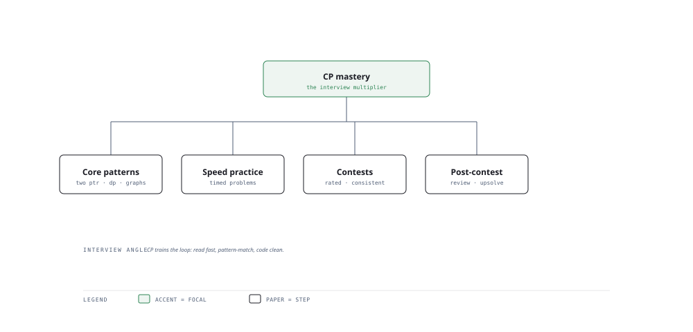

# Visual Notes — Training That Crushes Interviews

> One diagram, the full picture. This page is meant to be glanced at before reading the chapters, and again before interviews.

# What the diagram shows

1. **Patterns** — Recognise common problem patterns (sliding window, graphs, DP) fast.
1. **Speed** — Level-up typing and reasoning speed under time pressure.
1. **Review** — Debrief every contest/round to compound learning.

# Why this matters for placement

- Pattern recognition converts unknown problems into known ones — the core CP skill.
- Consistency over intensity: consistent review compounds faster than cramming.

# Quick revision

- Build a card-index of patterns mapped to their triggers.
- Practice under a clock; interview success is partly a speed skill.
- Participate weekly; always debrief: what pattern, what lapse, what redo.
- Priority: correctness -> complexity -> style, in that order during a round.
- Spaced review (SM-2) prevents forgetting the patterns you cannot develop.

# Related chapters

- [CP strategy](01-cp-strategy.md)
- [Advanced algorithms](02-advanced-algorithms.md)
- [Contest simulation](03-contest-simulation.md)

---

**One-line answer for interviews:** *"Patterns, speed, contests and review feed the interview-crush trunk."*
