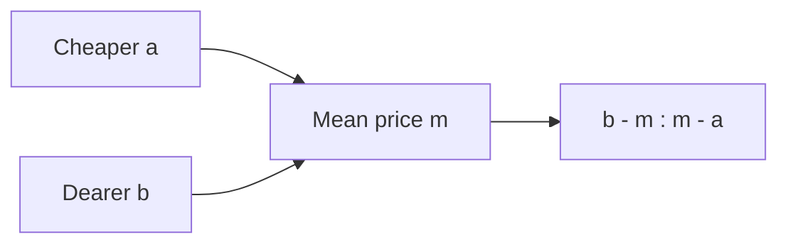
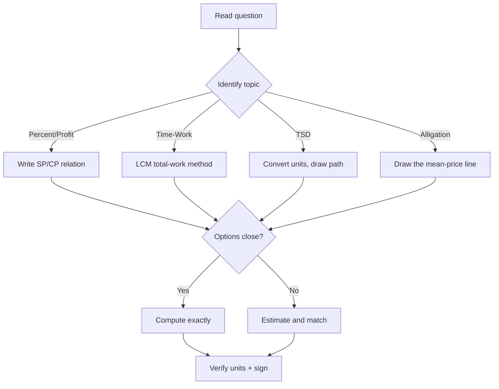

<!-- Clear Language: Keep sentences under 50 words -->
# Quantitative Aptitude for Campus Placements

## Learning Objectives

After this chapter you will be able to solve percentages, profit-loss, simple and compound interest, ratio-proportion, time-work, time-speed-distance, averages, and mixture problems using shortcut methods, manage the 90-minute sectional timing of company tests, and identify the high-yield topics every service company asks.

## Introduction

Aptitude is the first filter in every Indian campus placement: TCS NQT, Infosys SP, Wipro NLTH, Capgemini, Accenture, and Cognizant all test quantitative ability before any technical round. The questions are not hard — they are repetitive. The chapter teaches the ~10 recurring topic families with shortcut techniques that turn a 90-second problem into a 20-second one.

## Prerequisites

- Class 8-10 mathematics: percentages, fractions, basic algebra
- Ability to do mental arithmetic with 2-digit numbers
- A timer: every practice session should be timed

## Key Terminology

**Aptitude**: The ability to apply arithmetic and algebra to word problems under time pressure.

**Sectional timing**: A test where each section has its own time limit — you cannot borrow time from another section.

**Shortcut**: A formula or pattern that solves a problem in fewer steps than the textbook method.

**Approximation**: Rounding intermediate values to estimate the final answer when options differ widely.

**Negative marking**: Deduction for wrong answers; accuracy matters more than speed.

## Theory

### 1. The High-Yield Topic Map

Company tests ask from a small universe of topics. Weightage across TCS NQT, Infosys, and Wipro (approximate share of aptitude section):

| Topic | Share | Difficulty | Frequency |
|-------|-------|-----------|-----------|
| Percentages | 15% | Easy | Every test |
| Profit, Loss & Discount | 12% | Easy-Medium | Every test |
| Simple & Compound Interest | 10% | Easy | Very high |
| Ratio, Proportion & Partnership | 12% | Easy-Medium | Very high |
| Time & Work | 12% | Medium | Very high |
| Time, Speed & Distance | 12% | Medium | Very high |
| Averages | 8% | Easy | High |
| Mixtures & Alligation | 7% | Medium | High |
| Number System & Divisibility | 6% | Easy-Medium | Medium |
| Geometry & Mensuration | 6% | Medium | Medium |

### 2. Percentages — the Master Topic

Percentages are the base of profit-loss, interest, and change problems.

**Core facts:**
- `x% of y = y% of x` (e.g., 12% of 50 = 50% of 12 = 6)
- Percentage change: `(new - old) / old × 100`
- Successive changes: `a + b + ab/100` (for two changes of +a% and +b%; subtract for decreases)
- If a value rises by x%, it must fall by `100x/(100+x)%` to return to the original
- Decimal fractions to memorize: 1/2 = 50%, 1/3 = 33.33%, 1/4 = 25%, 1/5 = 20%, 1/8 = 12.5%, 1/16 = 6.25%, 1/12 = 8.33%

**Shortcut — successive percentage change:** A price is increased by 10% then decreased by 10%. Net change = `10 + (-10) + (10 × -10)/100 = -1%`. A 10% rise then 10% fall always loses 1%.

### 3. Profit, Loss & Discount

**Core formulas:**
- Profit % = `(SP - CP)/CP × 100`
- Loss % = `(CP - SP)/CP × 100`
- SP = `CP × (100 + profit%)/100`
- CP = `SP × 100/(100 + profit%)`
- Discount% = `(MP - SP)/MP × 100`, where MP = marked price
- After two successive discounts of a% and b%: net discount = `a + b - ab/100`

**Key exam traps:**
- Profit % is always calculated on CP, discount % always on MP
- "Sold at 10% profit" means SP = 1.10 × CP
- If an article is sold at a loss of x%, CP = SP × 100/(100 - x)

### 4. Simple & Compound Interest

**Simple interest:** `SI = P × R × T / 100`
- Principal P, rate R% per year, time T years

**Compound interest (yearly compounding):** `CI = P × (1 + R/100)^T - P`
- Half-yearly: divide R by 2, multiply T by 2
- Quarterly: divide R by 4, multiply T by 4

**Shortcut for two years CI vs SI:** For 2 years, `CI - SI = P × (R/100)^2`. For 3 years, `CI - SI = P × (R/100)^2 × (3 + R/100)`.

**Shortcut — doubling time:** Money doubles in ~`72/R` years (rule of 72). At 12%, ~6 years; at 8%, ~9 years.

### 5. Ratio, Proportion & Partnership

- If A:B = 2:3 and B:C = 4:5, then A:B:C = 8:12:15 (multiply the first ratio by B's new value)
- Partnership: profit is split in the ratio of `capital × time`
- If A invests x for m months and B invests y for n months: profit ratio = xm : yn
- If incomes are in ratio a:b and savings are equal, expenses are in ratio `a - s : b - s` where s is the common saving

### 6. Time & Work

**Core rule:** If A does a job in x days, A's rate = `1/x` per day. Work = rate × time.

- A and B together: rate = `1/x + 1/y` → time = `xy/(x+y)`
- If A is twice as good as B, A's rate = 2 × B's rate; ratio of times = 1:2
- Pipes and cisterns use identical logic (inlet = positive, outlet = negative)
- If A can do a job in x days and A+B together in y days, B alone takes `xy/(x - y)` days

**Shortcut — LCM method:** Take LCM of all given days as total work. A does the job in 12 days → A's daily work = LCM/12. Sum rates to find combined time.

### 7. Time, Speed & Distance

- Distance = Speed × Time
- Converting km/h to m/s: multiply by 5/18 (e.g., 72 km/h = 20 m/s)
- If speeds are in ratio a:b, times for the same distance are in ratio b:a
- Average speed for two equal distances at speeds a and b: `2ab/(a+b)` (harmonic mean)
- Average speed for two equal times: `(a+b)/2` (arithmetic mean)
- Relative speed: same direction = difference; opposite direction = sum
- Boats: downstream = boat + stream; upstream = boat - stream; speed of stream = `(down - up)/2`

**Trains:**
- Crossing a pole: time = train length / speed
- Crossing a platform of length L: time = (train + L) / speed
- Crossing another train: combine lengths; relative speed rules apply

### 8. Averages

- Average = sum / count
- If the average of n numbers is A and one number x is replaced by y, new average = `A + (y - x)/n`
- If a person joins a group, change in average × new count = the value added relative to the old average
- Weighted average: `(n1×a1 + n2×a2)/(n1+n2)`
- Average of first n natural numbers = `(n+1)/2`

### 9. Mixtures & Alligation

**Alligation rule:** To mix two ingredients of cost a and b (a < b) to get a mean price m:
- Ratio of quantities = `(b - m) : (m - a)`



**Applications:** mixing rice of two prices, replacing milk with water, alloy problems, and weighted averages in disguise.

### 10. Number System Essentials

- Divisibility: by 3 = sum of digits divisible by 3; by 9 = sum divisible by 9; by 11 = (sum of alternate digits difference) divisible by 11
- Remainder when dividing by 9 = digit sum mod 9 (casting out nines)
- HCF × LCM = product of two numbers
- Number of factors of `p^a × q^b × r^c` = `(a+1)(b+1)(c+1)`
- Last digit of powers cycles in groups of 4 for most bases

### 11. Problem-Solving Workflow



## Examples

### Example 1: Successive Percentage Change (shortcut)

A salary increases by 20% then decreases by 20%. Net change?

Using `a + b + ab/100` with a = 20, b = -20: `20 - 20 + (20 × -20)/100 = -4%`. The salary falls 4%. Textbook double-check: 100 → 120 → 96. Confirmed.

### Example 2: Profit with Discount

A shopkeeper marks an article 25% above cost and gives a 10% discount. Profit %?

Marked = 1.25 × CP. After 10% discount: SP = 1.25 × 0.90 × CP = 1.125 × CP. Profit = 12.5%.

### Example 3: CI - SI Difference (2 years)

The difference between CI and SI on a sum for 2 years at 10% is ₹50. Find the principal.

`CI - SI = P × (R/100)^2` → `50 = P × 0.01` → P = ₹5,000.

### Example 4: Ratio of Three Numbers

If A:B = 2:3 and B:C = 4:5, find A:B:C.

Multiply first ratio by 4 and second by 3: A:B = 8:12, B:C = 12:15 → A:B:C = 8:12:15.

### Example 5: LCM Time & Work

A can do a job in 12 days, B in 18 days. Together?

LCM(12, 18) = 36 units. A = 3 units/day, B = 2 units/day. Together 5 units/day → 36/5 = 7.2 days.

### Example 6: Two-Equal-Distance Average Speed

A car travels 60 km at 40 km/h and 60 km at 60 km/h. Average speed?

`2ab/(a+b) = 2×40×60/(100) = 48 km/h`. Note: NOT the arithmetic mean 50.

### Example 7: Relative Speed (opposite direction)

Two trains, 200 m and 300 m long, moving toward each other at 36 km/h and 54 km/h. Time to cross?

Combined length = 500 m. Combined speed = 90 km/h = 25 m/s. Time = 500/25 = 20 seconds.

### Example 8: Alligation

Rice at ₹40/kg and ₹60/kg mixed to sell at ₹50/kg (cost basis). Ratio?

Mean = 50. Cheaper 40: `60 - 50 = 10`; dearer 60: `50 - 40 = 10`. Ratio = 10:10 = 1:1.

### Example 9: Averages with Replacement

The average of 20 numbers is 30. One number 25 is replaced by 45. New average?

Change per number = `(45 - 25)/20 = 1`. New average = 31.

### Example 10: Partnership

A invests ₹20,000 for 12 months; B invests ₹30,000 for 8 months. Profit ₹72,000. Shares?

Ratio = 20000×12 : 30000×8 = 240000 : 240000 = 1:1. Each gets ₹36,000.

### Example 11: TypeScript — Aptitude Practice Engine

```typescript
interface AptitudeQuestion {
    id: string
    topic: string
    difficulty: 1 | 2 | 3
    solve: () => number
    expected: number
    timeLimitSec: number
}

class AptitudeTrainer {
    private questions: AptitudeQuestion[] = []

    add(q: AptitudeQuestion): void {
        this.questions.push(q)
    }

    runTimedSession(secondsPerQuestion: number, count: number): { score: number; correct: number } {
        let correct = 0
        for (const q of this.questions.slice(0, count)) {
            const start = Date.now()
            const answer = q.solve()
            const elapsed = (Date.now() - start) / 1000
            if (answer === q.expected && elapsed <= q.timeLimitSec) correct++
        }
        return { score: (correct / count) * 100, correct }
    }

    weakTopics(): string[] {
        const misses = new Map<string, number>()
        for (const q of this.questions) {
            const ok = q.solve() === q.expected
            if (!ok) misses.set(q.topic, (misses.get(q.topic) ?? 0) + 1)
        }
        return [...misses.entries()]
            .sort((a, b) => b[1] - a[1])
            .map(([topic]) => topic)
    }
}

const trainer = new AptitudeTrainer()
trainer.add({
    id: "p1", topic: "percent", difficulty: 1,
    solve: () => Math.round(100 * 1.2 * 0.8), expected: 96, timeLimitSec: 20,
})
console.log(trainer.weakTopics())
```

## Visual Analogy

**Aptitude is a sport, not a subject.** Company tests are timed games where the question set is a small, repeated drill list. You do not learn cricket by reading rules; you practice the same shots until they are reflexes. Percentages are the straight drive, time-work is the cover drive — the 10 topics above are the only shots ever bowled. The shortcut formulas are your footwork: they put you in position before the bowler (the timer) pressures you.

## Summary

Quantitative aptitude is the highest-weightage, most repetitive section in Indian campus tests. Ten topic families cover ~95% of questions: percentages, profit-loss, SI/CI, ratio-proportion, time-work, time-speed-distance, averages, mixtures, number system, and mensuration. Master the shortcuts — successive-change formula, LCM time-work method, harmonic mean for average speed, alligation cross, and the CI-SI difference formula — then practice timed. Accuracy matters because negative marking exists; sectionals matter because time does not transfer.

## Practical Takeaways

- Memorize the fraction-percentage table (1/2 to 1/16) — it powers half the shortcuts
- Never calculate where you can estimate: close options → exact, spread options → approximate
- Use the LCM method for every time-work problem; it is faster than fractions
- For two equal distances, average speed is harmonic mean, never the arithmetic mean
- Profit% is on CP; discount% is on MP — the most common trap in the exam
- Do 20 timed questions daily, grouped by topic; track your weak topics in the trainer
- In the real test, solve easy ones first; every company gives easy and hard questions mixed

## Interview Q&A

**Q1: Why do companies test aptitude before technical skills?**
Aptitude is a cheap, scalable screen for processing speed, accuracy under pressure, and basic numeracy — traits correlated with workplace fundamentals. It filters thousands of applicants to a manageable interview pool.

**Q2: What is the fastest way to improve aptitude scores?**
Two weeks of daily timed practice on the 10 topic families with an error log. Most students improve 15-25 percentile points because the question pool is small and repetitive.

**Q3: How do you handle time in a 90-minute aptitude section?**
Budget: easy topics (percent, averages, SI/CI) at 45 seconds each; medium (time-work, TSD, mixtures) at 90 seconds. Skip anything over 2 minutes, mark it, return later.

**Q4: What role does negative marking play in strategy?**
If a wrong answer costs 1/3 of a correct answer's marks, only guess when you can eliminate at least two options.

**Q5: How do shortcut formulas differ from memorizing?**
Shortcuts encode relationships (e.g., successive change `a + b + ab/100`). Memorized lists of facts fail under stress; relationships survive because you derive them in seconds.

## Chapter Quiz

1. A number is increased by 25% then decreased by 25%. Net change?
   - A) 0%
   - B) -6.25%
   - C) +6.25%
   - D) -25%
   // correct: B

2. The difference between CI and SI for 2 years at 10% is ₹121. Principal?
   - A) ₹10,000
   - B) ₹12,100
   - C) ₹11,000
   - D) ₹9,000
   // correct: B

3. A does a job in 20 days, B in 30 days. Together?
   - A) 12 days
   - B) 10 days
   - C) 15 days
   - D) 25 days
   // correct: A

4. A car covers two equal halves of a journey at 30 and 60 km/h. Average speed?
   - A) 45 km/h
   - B) 40 km/h
   - C) 36 km/h
   - D) 50 km/h
   // correct: B

5. Marked price ₹1,200, discount 10%, then sold at 5% profit over CP. CP?
   - A) ₹1,000
   - B) ₹1,026
   - C) ₹1,080
   - D) ₹1,140
   // correct: C

## Exercises

1. Solve 25 percentage questions in 20 minutes; log every wrong answer with the topic.
2. Implement `AverageSpeed` in TypeScript for two-equal-distance journeys and verify against 5 examples.
3. Write 10 time-work problems using the LCM method and solve each with a 60-second timer.
4. Build a mixture solver: given two prices and a mean, output the alligation ratio.
5. Create your own 30-question mock (3 per topic) with time limits; score yourself twice weekly.

## Common Mistakes

1. Applying percentage change to the wrong base (new value instead of original).
2. Using arithmetic mean for average speed over equal distances.
3. Forgetting to convert km/h to m/s in train problems.
4. Adding work rates as days instead of reciprocals (1/x + 1/y).
5. Taking discount % on CP instead of MP.
6. Solving in order of appearance instead of difficulty.

## Revision Notes

- Successive change: `a + b + ab/100`
- CI - SI (2 yr) = `P(R/100)^2`
- A+B time = `xy/(x+y)`; LCM method is safer
- Equal-distance avg speed = `2ab/(a+b)`
- Alligation ratio = `(b-m):(m-a)`
- 72/R rule for doubling money
- Profit on CP, discount on MP

## Placement Section

### Top 10 Interview Questions

#### TCS NQT Style

1. **Solve a 3-step percentage problem aloud, showing the shortcut.** — State the formula, plug values, verify with a small number like 100.
2. **Explain why successive 10% up and down is a net loss.** — Because the fall applies to the bigger base.
3. **A train crosses a pole in 9 s and a platform in 21 s. Lengths?** — Setup: length L, speed v; L/v = 9; (L+P)/v = 21 → platform = 4/3 × L.

#### Infosys SP Style

4. **Two taps fill a tank in 12 and 15 min; a third empties it in 10 min. Time to fill?** — LCM 60: 5 + 4 - 6 = 3 units/min → 20 min.
5. **Present the alligation method on a weighted-average word problem.** — Draw the mean line, compute ratio, interpret.

#### Wipro NLTH Style

6. **Which topic gives the fastest score improvement and why?** — Percentages: easy, high weight, feeds profit-loss and interest.
7. **How do you handle a question you cannot solve in 90 seconds?** — Mark and skip; return only if time remains.

#### Accenture Style

8. **Estimate 17% of 2,540 without a calculator.** — 10% = 254, 5% = 127, 2% = 50.8 → ≈ 431.8.
9. **The average of 11 numbers is 40; first 6 average 38, last 6 average 42. Middle number?** — 6×38 + 6×42 - 11×40 = 480 - 440 = 40.

#### Cognizant Style

10. **Explain partnership profit sharing when investment periods differ.** — Profit ratio = capital × time for each partner.

### Resume Tips

- Add an "Aptitude: consistently scored 90%+ in mock tests" line if true.
- Mention time-management tools (e.g., timed mock practice daily).
- Keep it under 15 words; interviewers check consistency, not claims.

### Interview Day Checklist

- Revise the fraction table and the 6 shortcut formulas above.
- Carry a pen for mental math; practice writing numbers cleanly.
- Solve 10 easy questions the morning of the test to warm up.

## True/False

1. **True or False:** Discount percentage is calculated on the cost price. — **False.** Discount is on marked price.
2. **True or False:** A 10% rise followed by a 10% fall returns to the original value. — **False.** Net change is -1%.
3. **True or False:** Average speed over equal distances is the harmonic mean of the speeds. — **True.**
4. **True or False:** In time-work, rates add as reciprocals of days. — **True.**
5. **True or False:** Money doubles in exactly 6 years at 12% simple interest. — **False.** SI: P = P×12×T/100 → T = 100/12 = 8.33 years (rule of 72 gives ~6 for CI).

## Fill in the Blank

1. Successive change formula is a + b + ___. — Answer: ab/100.
2. CI - SI for two years equals P × ___. — Answer: (R/100)².
3. To convert km/h to m/s, multiply by ___. — Answer: 5/18.
4. In alligation, the ratio is (b - m) : ___. — Answer: (m - a).
5. The rule of 72 divides 72 by the ___ to estimate doubling time. — Answer: rate.

## Scenario Questions

1. **Scenario:** You have 10 minutes left and 15 questions, 5 of them easy. — Solve the 5 easy ones first, then estimate on medium ones, skip anything taking over 60 seconds.

2. **Scenario:** Your mock scores are stuck at 60%. — Analyze the error log: find the 2 topics causing half the mistakes; drill those with 20 questions daily for 3 days.

3. **Scenario:** Negative marking of 1/3 and you are guessing between two options. — Guess only if one option can be eliminated; otherwise skip.

4. **Scenario:** The sectional timer is about to end and one question remains. — If you know the approach, answer it; if not, pick the option that seems numerically sane and move on.

## Output Questions

1. **What is 12% of 50?** — 6 (use x% of y = y% of x).
2. **Successive 20% up, 20% down on 100?** — 96.
3. **LCM of 12 and 18?** — 36.
4. **Average speed for equal distances at 40 and 60?** — 48 km/h.
5. **CI - SI difference for ₹10,000 at 10% for 2 years?** — 10,000 × 0.01 = ₹100.

## Difficulty Level

| Level | Time | What It Takes |
|-------|------|---------------|
| Beginner | 1-2 sessions | Learn the 10 topics, solve 5 examples each |
| Intermediate | 3-5 sessions | Timed 30-question mocks, 80%+ accuracy |
| Advanced | 1-2 weeks | 90%+ accuracy at 40 seconds/question; topic speed drills |

## Tips & Tricks

- Start every mock with percentages — they warm up mental math.
- Write units (%, ₹, km/h) on paper; 30% of errors are unit mistakes.
- When options are spread (e.g., 12, 48, 90, 210), estimate first.
- Practice without a calculator always — company tests are offline or on non-programmable keys.
- Use the trainer example in this chapter to log weak topics.

## Memory Tricks

- **Acronym**: PACT-TAM — Percent, Averages, CI/SI, Time-work, TSD, Alligation, Mixtures.
- **Story**: A 10% rise and fall is like climbing two stairs up then two stairs down from a lower position — you end below the start.
- **Number anchor**: 48 is the average speed of 40 & 60 — remember "4-8" pairs "4-0, 6-0".
- **Color code**: formulas green, traps red, unit-conversions blue.
- **Teach-back**: explain alligation to a friend using chai: mixing ₹200 and ₹300/kg tea to ₹240 — ratio (300-240):(240-200) = 60:40 = 3:2.

## Further Reading

- R.S. Aggarwal — Quantitative Aptitude (chapter-wise drills)
- Arun Sharma — Quantitative Aptitude (advanced)
- IndiaBix topic-wise practice sets
- Your company's official sample test (TCS NQT, Infosys SP samples on their portals)

## Related Topics

- Chapter 02 (Logical Reasoning) — the next section in every company test
- Chapter 08 (PYQ Bank) — real questions from the same topic map
- Chapter 07 (Company-Format Mock Tests) — full-length simulation
- Module 24 (Statistics & Mathematics) — deeper math for AI roles

## FAQs

1. **How much time do I need for aptitude?** — 2-3 weeks at 1 hour daily is enough for service companies; 4 weeks with daily mocks for top scores.
2. **Do shortcuts work in the actual test?** — Yes; the question pool is the same drill set, and shortcuts are just compressed algebra.
3. **Is a calculator allowed in TCS NQT?** — No — the on-screen numeric keypad only. Practice mental math.
4. **What score clears the aptitude cutoff?** — Typical sectional cutoffs: 60-75% depending on company and pool.
5. **Should I prepare aptitude before DSA?** — Yes for service companies (test comes first); no for product companies (DSA dominates).

## Important Notes

- Aptitude is the highest-leverage section: it filters before any technical review happens.
- Accuracy beats speed until accuracy crosses 80%; then push speed.
- The topic map in this chapter is stable across years — trust it, do not chase "new patterns".
- Always attempt easy topics first within a section — questions are not sorted by difficulty.

## Historical Context

Indian aptitude testing standardized in the 1990s when Infosys and TCS scaled hiring to thousands of campus candidates. The question bank has changed little since: the same ten topic families, reworded annually. The NQT (National Qualifier Test) emerged in 2019 as a multi-session model; today most companies run one-shot online tests with sectional timers and negative marking.

## Security Considerations

- Never share your test login or OTP with anyone "helping" you — impersonation is fraud.
- Remote proctoring flags suspicious activity: stay alone, no second device, no screen sharing.
- Report any technical glitch to the proctor immediately and keep the ticket number.

## ML Intuition

- Aptitude measures the same signal models use: pattern recognition under constraints.
- The topic map is a distribution — practice proportionally to weightage, not curiosity.
- Speed drills are like batch size tuning: smaller batches (harder questions) improve precision; larger batches (easy drills) improve recall speed.

## Analogies

- **Shortcuts are like keyboard shortcuts**: slow the first week, indispensable after muscle memory.
- **The 10 topics are like the 10 finger exercises of a pianist**: boring, repeated, and the entire repertoire builds on them.
- **Estimation is like reading a menu in a foreign language**: you do not need every word, just the price range.

## Capstone Project Link

- [Module Capstone: End-to-End Project](https://github.com/Raushan666java/ai-engineering-journey) — combine this chapter with Chapter 07 (Mock Tests) to build a personal aptitude trainer app with the TypeScript engine above.

## Flashcards

<details class="tp-qa-card" data-qid="33campusplacement-01aptitude-flash1">
  <summary class="tp-qa-question">
    <span class="tp-qa-status"></span>
    What is the successive percentage change formula?
  </summary>
  <div class="tp-qa-answer">
    <p>a + b + ab/100 (with signs for decreases).</p>
  </div>
</details>

<details class="tp-qa-card" data-qid="33campusplacement-01aptitude-flash2">
  <summary class="tp-qa-question">
    <span class="tp-qa-status"></span>
    How do you find average speed over two equal distances?
  </summary>
  <div class="tp-qa-answer">
    <p>Harmonic mean: 2ab/(a+b). Never the arithmetic mean.</p>
  </div>
</details>

<details class="tp-qa-card" data-qid="33campusplacement-01aptitude-flash3">
  <summary class="tp-qa-question">
    <span class="tp-qa-status"></span>
    What is the LCM method in time-work?
  </summary>
  <div class="tp-qa-answer">
    <p>Take LCM of the days as total work, divide by each person's days to get daily rates, add rates.</p>
  </div>
</details>

<details class="tp-qa-card" data-qid="33campusplacement-01aptitude-flash4">
  <summary class="tp-qa-question">
    <span class="tp-qa-status"></span>
    Where are profit% and discount% calculated from?
  </summary>
  <div class="tp-qa-answer">
    <p>Profit% on cost price; discount% on marked price.</p>
  </div>
</details>
