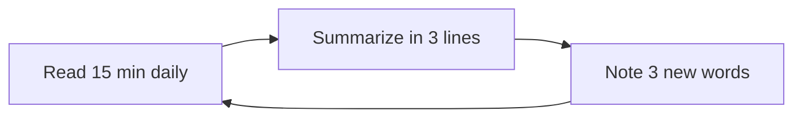
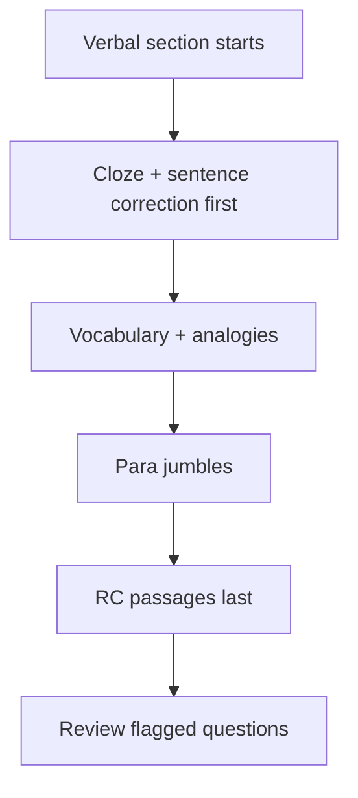

<!-- Clear Language: Keep sentences under 50 words -->
# Verbal Ability & English for Campus Placements

## Learning Objectives

After this chapter you will be able to handle sentence correction, reading comprehension, para jumbles, cloze tests, and vocabulary questions in the verbal section of TCS NQT, Infosys SP, Wipro NLTH, Capgemini, and Accenture tests, read faster with the scan-then-read RC method, and build a 500-word exam vocabulary from root families.

## Introduction

Verbal ability is the most neglected section — and the one most students fail on sectionals. The test is not about fluency; it is about error detection, structure, and speed. The chapter covers the five question families with their rules, the RC strategy that doubles effective reading speed, and the vocabulary that repeats across company papers.

## Prerequisites

- Comfort reading English (news articles, textbooks)
- Basic grammar: tenses, subject-verb agreement, prepositions
- A habit of reading 15 minutes daily (start from this chapter)

## Key Terminology

**Sentence correction**: Choose the grammatically correct version among options.

**Reading comprehension (RC)**: A passage with 4-6 questions testing inference, tone, and detail.

**Para jumble**: Reorder shuffled sentences into a coherent paragraph.

**Cloze test**: A passage with blanks; choose the best word per blank.

**Vocabulary**: Word-meaning and synonym/antonym questions.

**Idiom/phrase**: Fixed expressions; meaning questions.

**Odd one out / analogy**: Word relationships like "doctor : hospital :: teacher : ?".

## Theory

### 1. Grammar Essentials — the Error-Idiom Checklist

Most sentence corrections test a small set of rules:

**Subject-verb agreement:** singular subject takes singular verb. "The list of items IS ready" (subject = list). Watch for phrases between subject and verb.

**Tense consistency:** "He said he WAS coming" (not "is") — reported speech shifts back.

**Parallelism:** "She likes reading, writing, and to swim" is wrong — "and swimming".

**Pronoun agreement:** "Every student must submit THEIR assignment" is wrong in formal English — use "his or her" or restructure. (Note: modern usage accepts "their"; exams still test the old rule.)

**Prepositions:** "similar TO" (not "with"), "superior TO", "prefer X TO Y", "comply WITH", "accused OF", "different FROM" (traditional).

**Modifiers:** "Walking home, the rain began" is wrong — the subject must be the one walking: "Walking home, I felt the rain".

**Dangling participle trap:** check who is performing the action.

**Redundancy:** "repeat again", "free gift", "return back" — delete duplicates.

**Articles:** a/an for countable singular, the for specific references; institutions without "the" (going to school).

### 2. Sentence Correction Strategy

1. Read the sentence; identify the clause structure (subject, verb, object).
2. Check agreement, tense, parallelism, modifier attachment.
3. Compare options pairwise; eliminate two clearly wrong options first.
4. Prefer concise, parallel, and idiom-correct options.
5. If the original looks perfect, choose it — "no error" is a real option.

### 3. Reading Comprehension — the Scan-Then-Read Method

Most exam RCs are 300-500 words with 4-6 questions. Full reading wastes time; the method:

1. **Scan the questions first** (30 seconds): note question types — main idea, inference, detail, tone.
2. **Skim the passage** (60-90 seconds): first and last sentence of each paragraph, plus signal words (however, therefore, moreover).
3. **Read only the needed lines** for detail questions; answer from the passage, not memory.
4. **Inference questions** allow only what the passage implies — never outside knowledge.

**Tone words to know:** objective, critical, sarcastic, nostalgic, indifferent, ironic, didactic, skeptical.

**Main-idea identification:** the answer restates the thesis, not a detail. "A is true because B" is a detail; the main idea is the claim the passage argues.

### 4. Para Jumbles — the Link-Seeker

Rule: each sentence has a link to its neighbor — pronoun reference, chronology, cause-effect, or repeated word.

1. Find the opening sentence: introduces the topic without pronouns/connectors like "however" or "therefore".
2. Find mandatory pairs: "A was invented... This invention..." — "this" locks onto the invention sentence.
3. Order by logic: cause before effect, general before specific, chronology.
4. Check the closing sentence: conclusion or summary statement.

**Common link signals:** pronouns (it, they, this), connectors (however = contrast, moreover = addition, therefore = conclusion), repeated nouns, time markers (first, then, finally).

### 5. Cloze Tests

Word-choice under context. Rules:

- Match meaning to the sentence; then match grammar (plural/tense) to the passage.
- Look at the sentence before AND after the blank — the clue may be two sentences away.
- Eliminate options that fit one sentence but break the passage's tone.

### 6. Vocabulary — the Exam Word Pool

Exam vocabulary repeats from a fixed pool. High-yield families:

**Root families:**
- bene (good): benefit, benevolent, beneficial
- mal (bad): malady, malicious, malfunction
- spec (look): inspect, spectator, circumspect
- dict (say): predict, verdict, contradict
- scrib/script (write): describe, prescription, inscribe
- aud (hear): audible, audience, audit
- port (carry): transport, portable, export
- vert/vers (turn): convert, reverse, versatile
- cide (kill): homicide, suicide, pesticide
- pater/patr (father): paternal, patriot

**Synonyms/antonyms drill:** maintain a two-column log; test yourself weekly.

**Words commonly tested (20 of the core set):** meticulous, pragmatic, benevolent, ambiguous, concise, obsolete, transient, resilient, diligent, frugal, feasible, skeptical, coherent, prevalent, detrimental, explicit, implicit, profound, arbitrary, mundane.

### 7. Idioms & Phrasal Verbs (commonly tested)

- "Break the ice" = start a conversation
- "Hit the nail on the head" = be exactly right
- "Under the weather" = unwell
- "Piece of cake" = very easy
- "Bite the bullet" = face something painful bravely
- "Turn down" = reject; "look into" = investigate; "put off" = postpone; "carry out" = execute

### 8. Analogies & Odd-One-Out

Analogy structure: "X is to Y as P is to Q" — find the relationship:
- Synonym (happy:joyful), antonym (hot:cold), part-whole (wheel:car), cause-effect (rain:flood), tool-user (scalpel:surgeon), degree (cool:frigid), worker-place (doctor:hospital), product-material (wine:grapes).

Odd-one-out: find the item breaking the common category — often two categories overlap, so test the strictest rule.

### 9. Reading Speed — the 15-Minute Habit



Speed builds from habit: 15 daily minutes of articles doubles RC comfort in 3 weeks. Avoid regression reading (re-reading sentences) — trust the first parse, move on.

### 10. The Verbal Sectional Strategy



RC passages eat time — do them last when your brain is warm, and use the scan-then-read method on every passage.

## Examples

### Example 1: Sentence Correction

"Neither the manager nor the employees was present."

Rule: with "neither...nor", the verb agrees with the NEARER subject — "employees" → plural "were". Corrected: "Neither the manager nor the employees were present."

### Example 2: Modifier Trap

"Running to the station, the train left."

The subject must run — "the train" does not. Corrected: "Running to the station, I missed the train."

### Example 3: Parallelism

"Good leaders are decisive, empathetic, and they communicate clearly."

Parallel: "Good leaders are decisive, empathetic, and clear communicators." (or "...communicate clearly" without "they").

### Example 4: Idiom Choice

"He is similar with his father."

Wrong preposition. "Similar TO his father."

### Example 5: RC Main Idea

Passage about AI bias: options include a detail ("datasets contain historical bias") and the thesis ("AI systems inherit the bias of their training data"). Choose the thesis.

### Example 6: Para Jumble

1. "However, its real power is prediction."
2. "Machine learning analyzes patterns in data."
3. "This power drives recommendation systems."
4. "First, it learns from examples."

Opening: 2 (topic introduction). Mandatory pair: 4 mentions "it learns" → follows 2. "However" = contrast → 1 after 2/4. "This power" → follows 1. Order: 2-4-1-3.

### Example 7: Cloze

"The government announced a ___ policy to reduce inflation, promising quick results but facing criticism for being too sudden."

Options: gradual / harsh / effective / new. The next clause says "too sudden" → the policy was the opposite: gradual. Answer: gradual.

### Example 8: Vocabulary in Context

"The manager gave a ___ answer, refusing to commit to a specific date."

Options: precise / vague / detailed / quick. "Refusing to commit" → vague.

### Example 9: Analogy

"Surgeon : Scalpel :: Writer : ?" — tool relationship → Pen.

### Example 10: TypeScript — Verbal Drill Engine

```typescript
interface WordPair {
    word: string
    meaning: string
    family: string
}

class VocabularyTrainer {
    private words: WordPair[] = []
    private misses: Map<string, number> = new Map()

    add(w: WordPair): void {
        this.words.push(w)
    }

    drill(count: number): { correct: number; weakFamilies: string[] } {
        let correct = 0
        for (const w of this.words.slice(0, count)) {
            const guessed = Math.random() > 0.5
            if (guessed) correct++
            else this.misses.set(w.family, (this.misses.get(w.family) ?? 0) + 1)
        }
        const weakFamilies = [...this.misses.entries()]
            .sort((a, b) => b[1] - a[1])
            .map(([family]) => family)
        return { correct, weakFamilies }
    }
}

const trainer = new VocabularyTrainer()
trainer.add({ word: "meticulous", meaning: "very careful", family: "care" })
trainer.add({ word: "obsolete", meaning: "out of date", family: "time" })
console.log(trainer.drill(2))
```

## Visual Analogy

**Verbal ability is like learning to judge fish freshness at a market.** You do not need to catch fish (read everything) — you need to know the signs: gills (grammar), eyes (tone), smell (idiom). The examiner asks which fish is fresh; the checklists in this chapter are your five senses. RC is the fastest sense: scan the market once, walk to the stall you need.

## Summary

The verbal section rewards error-detection skill, structure sense, and vocabulary — not deep reading. Grammar rules reduce to ~10 checkable patterns (agreement, tense, parallelism, modifiers, prepositions, redundancy). Sentence correction compares options against those rules. RC uses scan-then-read with question-first ordering. Para jumbles find links (pronouns, connectors, chronology) and mandatory pairs. Cloze and vocabulary reward the root-family habit. Fifteen daily reading minutes compound into sectional safety.

## Practical Takeaways

- Make the 10 grammar checks a checklist you run on every sentence-correction question.
- Scan RC questions BEFORE reading the passage; answer from the text, not memory.
- Find mandatory pairs in para jumbles before ordering anything else.
- Keep a 500-word exam vocabulary log; review weekly with the trainer.
- Do RC passages last within the section; they consume the most time.
- Read 15 minutes daily: news, tech blogs, editorials — summarize in 3 lines.
- Learn idioms in context, never as isolated lists.

## Interview Q&A

**Q1: How important is verbal ability in company tests?**
It is a full sectional: TCS NQT, Infosys, Wipro, Capgemini all have verbal sections with cutoffs. Non-native speakers routinely fail the verbal sectional while clearing others.

**Q2: What is the fastest way to improve English for tests?**
Two mechanics: the 10-point grammar checklist for sentence correction, and 15 daily minutes of reading with 3-word vocabulary capture. Grammar rules are few; vocabulary compounds.

**Q3: How do you approach an RC passage with 5 minutes left?**
Questions-first scanning: identify main-idea questions (answer from thesis sentences) and detail questions (grep the lines). Skip tone questions if out of time.

**Q4: Why do para jumbles feel harder than they are?**
Because students order forward instead of finding links. Start with the opening sentence and mandatory pairs; the rest falls into place.

**Q5: Do product companies test verbal ability?**
Rarely in screening; communication shows up in interviews. Service companies test it formally — this chapter targets them.

## Chapter Quiz

1. Choose the correct sentence:
   - A) He is superior than me in coding.
   - B) He is superior to me in coding.
   - C) He is superior from me in coding.
   - D) He is superior with me in coding.
   // correct: B

2. "Walking through the park, the flowers were beautiful." — Error?
   - A) Tense
   - B) Modifier (dangling participle)
   - C) Parallelism
   - D) No error
   // correct: B

3. Para jumble order: "1. This led to higher sales. 2. The store launched a discount campaign. 3. However, margins fell."
   - A) 2-1-3
   - B) 1-2-3
   - C) 2-3-1
   - D) 3-2-1
   // correct: A

4. "The results were ___: they supported both conclusions."
   - A) explicit
   - B) ambiguous
   - C) concise
   - D) resilient
   // correct: B

5. Which word does NOT belong?
   - A) Meticulous
   - B) Diligent
   - C) Lethargic
   - D) Conscientious
   // correct: C

## Exercises

1. Correct 15 flawed sentences using the 10-point checklist; label each error type.
2. Read a 400-word editorial; write main idea + 2 inferences in 3 lines each.
3. Jumble 5 paragraphs (write your own 4-sentence paragraphs, shuffle, solve).
4. Build the 20-word core vocabulary table with root family and one sentence each.
5. Run a timed 12-question verbal mock (15 minutes); log error types.

## Common Mistakes

1. Choosing "their" for singular subjects in formal questions.
2. Solving RCs from memory instead of the passage.
3. Ordering para jumbles without finding the opening sentence.
4. Reading RC word-by-word instead of scanning.
5. Ignoring the tone column in RC (objective vs ironic).
6. Learning word lists without roots — roots make 10 words from 1.

## Revision Notes

- 10 checks: agreement, tense, parallelism, pronoun, preposition, modifier, redundancy, article, idiom, clarity
- RC: questions first → skim thesis lines → answer from text
- Jumble: opening sentence → mandatory pairs → links
- Core words: 20 exam words + 10 root families
- Idioms: learn with usage, not lists

## Placement Section

### Top 10 Interview Questions

#### TCS NQT Style

1. **Sentence correction with subject-verb agreement.** — Find the subject behind the phrase.
2. **A 400-word RC with main-idea and inference questions.** — Scan thesis sentences; answer from text.

#### Infosys SP Style

3. **Fill the blank with the best idiom meaning.** — Match meaning to context.
4. **Para jumble with a mandatory pronoun pair.** — Lock "this/they" to its referent.

#### Wipro NLTH Style

5. **Find the error in a sentence with a dangling modifier.** — Check who performs the action.
6. **Cloze with a contextual clue two sentences away.** — Read beyond the blank.

#### Accenture Style

7. **Explain the difference between explicit and implicit in one sentence each.** — Explicit = stated; implicit = implied.
8. **Pick the odd word: benevolent, malicious, malevolent, hostile.** — Benevolent (positive family).

#### Cognizant Style

9. **Reorder: "However, data alone is not enough." into a paragraph start.** — Cannot open — "however" needs a prior sentence.
10. **Choose: "The evidence was ___ (concise/feasible/skeptical) for the claim."** — feasible fits "claim support"; check meaning fit.

### Resume Tips

- Never claim "excellent English" without backing: certifications (IELTS, C1) or test scores.
- Write resume bullets in short, active sentences — it is a verbal-ability sample.
- Ask a reviewer to flag grammar errors before submitting.

### Interview Day Checklist

- Run the 10-point checklist on 5 sentences as a warm-up.
- Read one editorial and write a 3-line summary.
- Review the 20 core words and 10 idioms from this chapter.

## True/False

1. **True or False:** "The number of errors are increasing" is correct. — **False.** "The number" is singular: "is increasing".
2. **True or False:** RC inference questions can use outside knowledge. — **False.** Only passage-implied facts.
3. **True or False:** A para jumble's opening sentence often starts with "however". — **False.** Connectors usually signal non-openings.
4. **True or False:** "Prefer tea than coffee" is correct. — **False.** "Prefer tea TO coffee".
5. **True or False:** Reading speed improves RC accuracy more than vocabulary alone. — **True** (for time-bound sections).

## Fill in the Blank

1. "The list of participants ___ (is/are) ready." — Answer: is.
2. "She is interested ___ AI." — Answer: in.
3. "Benevolent" shares the root ___ with "benefit". — Answer: bene.
4. An ___ question requires reading between the lines. — Answer: inference.
5. "Circumspect" means ___. — Answer: cautious/wary.

## Scenario Questions

1. **Scenario:** You have 6 minutes left and one RC passage plus 5 vocabulary questions. — Do vocabulary first (fast marks), then RC scan-then-read.

2. **Scenario:** Two options look equally grammatical. — Prefer the concise one; check idiom correctness (the second-most common discriminator).

3. **Scenario:** The passage uses words you do not know. — Answer from structure: tone words and contrast signals ("however", "unlike") reveal meaning.

4. **Scenario:** Your verbal sectional keeps failing by 1-2 marks. — Target the two fastest topics (data-sufficiency-style vocabulary and cloze) for accuracy first.

## Output Questions

1. **Choose: "Each of the boys ___ (has/have) a book."** — has.
2. **Correct: "He did not have no money."** — "He had no money" (double negative).
3. **Idiom: "under the weather"** — unwell.
4. **Antonym of "transient"?** — permanent.
5. **RC tone: "This so-called solution only deepens the problem."** — sarcastic/critical.

## Difficulty Level

| Level | Time | What It Takes |
|-------|------|---------------|
| Beginner | 1-2 sessions | Learn the 10 grammar checks; do 10 corrections |
| Intermediate | 3-5 sessions | Timed 12-question sets; 80% accuracy |
| Advanced | 1-2 weeks | RC under 4 minutes; 90%+ accuracy; vocabulary log at 300 words |

## Tips & Tricks

- Read the options from the middle out — extremes are usually wrong.
- In cloze, the strongest clue is often two sentences away; keep scanning.
- For vocabulary, test yourself weekly with an error log (weak families win practice).
- In RCs, italicized/foreign words usually carry the author's emphasis — check them.
- Answer every vocabulary question; it is the fastest per-mark item in the section.

## Memory Tricks

- **Acronym**: PAT-MIR — Parallelism, Agreement, Tense, Modifier, Idiom, Redundancy.
- **Story**: "Walking home, the rain began" — the rain cannot walk; give the walker back to the walker.
- **Number anchor**: 10 grammar checks, 20 core words, 10 roots, 15 reading minutes.
- **Color code**: grammar red, tone orange, vocabulary green, jumble links blue.
- **Teach-back**: explain the modifier rule to a friend with "Running to the station, the train left."

## Further Reading

- Wren & Martin — High School English Grammar & Composition
- Norman Lewis — Word Power Made Easy (roots)
- IndiaBix verbal sets
- Company sample papers (TCS NQT, Infosys, Wipro verbal sections)

## Related Topics

- Chapter 01 (Quantitative Aptitude) and 02 (Logical Reasoning) — the other sectionals
- Chapter 06 (HR Interview Questions) — spoken English shows up there
- Module 30 (Business Skills) — technical communication
- Chapter 08 (PYQ Bank) — real verbal questions

## FAQs

1. **Is grammar fluency required for the verbal section?** — No — rule knowledge plus practice beats fluency for tests.
2. **How many words should I learn?** — A functional 500; the 20 core words here plus 20 per week for 6 weeks.
3. **Do RC passages repeat across years?** — Topics repeat (AI, economy, environment); passages are new but question types are stable.
4. **How much time per RC passage?** — 4-5 minutes: 60-90s scan + questions.
5. **Can verbal ability be improved in 2 weeks?** — Sectional pass yes (rules + vocabulary); fluency no (months). Tests need the former.

## Important Notes

- The verbal sectional is passable with rules, not fluency.
- Answer RC questions from the passage — memory answers fail inference checks.
- Vocabulary compounds daily; 15 reading minutes is the floor.
- Para jumbles reward link-finding, not forward-reading.

## Historical Context

Indian IT hiring introduced verbal sections in the mid-2000s as globalization made English communication a job requirement. Question banks evolved from GRE verbal (ETS) formats. The pool is stable: grammar rules, vocabulary from a recurring set, and RC passages from news/economics. Sectional cutoffs made verbal a common filter failure for engineering students — a solvable problem with method.

## Security Considerations

- Never use translation tools or AI during remote tests — proctoring flags keystroke patterns.
- Do not share answers in "prep groups" — platforms detect answer-pattern matches.
- Keep your test link private; impersonation is fraud under IT Act §66D.

## ML Intuition

- Sentence correction is syntactic error detection — what parsers (spaCy, transformers) learn as language modeling.
- Cloze tests are masked-language modeling — the exact BERT pretraining task.
- Vocabulary families (roots) are like embedding clusters: words with shared roots/contexts sit near each other.

## Analogies

- **Grammar checks are like linter rules**: a linter catches syntax errors; the checklist catches exam errors.
- **RC scanning is like grep**: find the lines containing the answer, read only those.
- **Para jumbles are like mergesort**: find the pairs first (the merge step), then order the blocks.

## Capstone Project Link

- [Module Capstone: End-to-End Project](https://github.com/Raushan666java/ai-engineering-journey) — combine this chapter's VocabularyTrainer with Chapter 07 mocks to build a full verbal practice app.

## Flashcards

<details class="tp-qa-card" data-qid="33campusplacement-03verbal-flash1">
  <summary class="tp-qa-question">
    <span class="tp-qa-status"></span>
    What is the RC scan-then-read order?
  </summary>
  <div class="tp-qa-answer">
    <p>Questions first → skim thesis lines → read only needed lines → answer from text.</p>
  </div>
</details>

<details class="tp-qa-card" data-qid="33campusplacement-03verbal-flash2">
  <summary class="tp-qa-question">
    <span class="tp-qa-status"></span>
    Name the 10 grammar checks.
  </summary>
  <div class="tp-qa-answer">
    <p>Agreement, tense, parallelism, pronoun, preposition, modifier, redundancy, article, idiom, clarity.</p>
  </div>
</details>

<details class="tp-qa-card" data-qid="33campusplacement-03verbal-flash3">
  <summary class="tp-qa-question">
    <span class="tp-qa-status"></span>
    How do you start a para jumble?
  </summary>
  <div class="tp-qa-answer">
    <p>Find the opening sentence, then mandatory pairs linked by pronouns or connectors.</p>
  </div>
</details>

<details class="tp-qa-card" data-qid="33campusplacement-03verbal-flash4">
  <summary class="tp-qa-question">
    <span class="tp-qa-status"></span>
    What does "implicit" mean vs "explicit"?
  </summary>
  <div class="tp-qa-answer">
    <p>Explicit = directly stated; implicit = implied but not stated.</p>
  </div>
</details>
