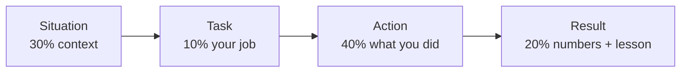

<!-- Clear Language: Keep sentences under 50 words -->
# HR Interview Questions Bank

## Learning Objectives

After this chapter you will be able to answer the 60+ most common HR interview questions using the STAR framework, handle the introduction and career questions that open every HR round, discuss salary with data instead of emotion, and recognize and respond to the stress questions panels use to test composure.

## Introduction

The HR round is the final filter. It is not a formality: companies use it to check fit, integrity, communication, and self-awareness — and they reject strong technical candidates who cannot answer "tell me about yourself" with structure. This chapter is a question bank with answer frameworks, not scripts. The goal is a rehearsed-but-natural set of answers built on your real history.

## Prerequisites

- Chapter 21-09 (Behavioral STAR Interview) — the STAR method in depth
- Module 20 (Portfolio & Branding) — the facts of your own story
- Chapter 30 (Business Skills) — communication polish

## Key Terminology

**STAR**: Situation, Task, Action, Result — the answer structure for behavioral questions.

**HR round**: A mostly non-technical interview covering background, motivation, behavior, and salary.

**Tell-me-about-yourself**: The 60-90 second opening answer every interview begins with.

**Strength/weakness question**: Self-assessment questions testing honesty and growth mindset.

**Compensation question**: "What are your salary expectations?" — a negotiation test, not a formality.

**Stress question**: A question designed to test composure ("Why should we hire you over the topper?").

## Theory

### 1. The 60-90 Second Introduction

The opening answer sets the tone. Structure:

1. **Present** (20 seconds): who you are now — education, current role/study, one achievement.
2. **Past** (20 seconds): how you got here — relevant projects, internships, roles.
3. **Future** (30 seconds): why this company and role — specific, researched reasons.

**Rules:**
- Never recite the resume chronologically.
- Mention one quantitative achievement (e.g., "built a RAG chatbot serving 500 users").
- End with the company link: "and your GenAI team is where I want to grow."

### 2. The Question Bank — Grouped

#### A. Background & Motivation

1. Tell me about yourself.
2. Walk me through your resume.
3. Why do you want to join our company?
4. Why this role, not a similar one?
5. Where do you see yourself in 5 years?
6. Why did you choose this engineering branch/degree?
7. What do you know about our company's products?
8. Why should we hire you?
9. What is your dream job?
10. Are you willing to relocate?

**Why-company answers** need research: products, recent news, tech stack. "Because it is a good company" is a fail.

#### B. Strengths & Weaknesses

11. What are your top three strengths?
12. What is your biggest weakness?
13. Are you a team player or independent worker?
14. How do you handle pressure?
15. What is your proudest achievement?
16. What is your biggest failure?
17. What have you learned from a mistake?
18. How do you handle criticism?
19. Are you a quick learner?
20. What makes you unique?

**Weakness formula**: a real weakness + evidence + the fix in progress. "I used to avoid public speaking; I joined a debate club and presented at 3 events" — never "I work too hard".

**Failure formula**: STAR with the lesson stated explicitly.

#### C. Projects & Technical Awareness

21. Explain your final-year project in 2 minutes.
22. What was the hardest problem you solved in a project?
23. How did you work in your team project?
24. What would you do differently on that project?
25. Which technology are you most comfortable with?
26. What technology do you want to learn next?
27. How do you keep up with new technology?
28. Have you contributed to open source?
29. How do you debug a production issue?
30. What is your favorite programming language and why?

Project answers must be: architecture (2 lines), your contribution, metrics, and one trade-off.

#### D. Behavior & Situational

31. Tell me about a time you led a team.
32. Tell me about a time you failed a deadline.
33. Tell me about a conflict with a teammate.
34. Tell me about a time you helped someone succeed.
35. Describe a time you took initiative.
36. What would you do if you disagreed with your manager?
37. How do you prioritize multiple deadlines?
38. Describe a time you had to learn something fast.
39. What would you do if a colleague was not contributing?
40. How do you handle a task outside your expertise?

Every answer: STAR with 30-45 seconds, results quantified, lesson explicit.

#### E. Career & Plans

41. Why not higher studies?
42. Why do you want to join a service company (vs startup)?
43. Are you open to working in different domains?
44. Do you plan to do an MBA later?
45. What if you are asked to work on legacy tech?
46. How long do you plan to stay with us?
47. What role do you want in 5 years?
48. Would you relocate to another city?
49. Are you willing to work shifts (support roles)?
50. What kind of manager do you prefer?

#### F. Salary & Offer

51. What is your expected salary?
52. What is your current/last compensation?
53. Why should we pay you above average?
54. Are you negotiating on the package?
55. What if the package is lower than expected?
56. Would you accept if we offer the base package?

**Salary rules**: state a range based on market data (placement cell, Glassdoor, friends' offers); anchor with your skills' evidence; stay calm; negotiate once with data, then decide.

#### G. Stress & Closing

57. Why should we hire you over the topper?
58. You seem under-confident today.
59. I think you are overqualified for this role.
60. We have better candidates. Convince us.
61. If you get a better offer, will you leave?
62. Do you have any questions for us?

**Stress rules**: pause, smile, answer with structure, never react emotionally. "That is a fair question. My answer is based on three facts..."

**Closing questions to ask**: "What does the first 90 days look like?" "What skills does the team need most?" — never salary-first or "when will I get the offer?"

### 3. The STAR Master Answer



**Example — conflict question:**
- Situation: two teammates disagreed on the tech stack for our capstone (FastAPI vs Django).
- Task: I owned the backend; the disagreement was blocking progress.
- Action: I scheduled a comparison session — measured development time on one shared endpoint, then we voted with data.
- Result: FastAPI chosen; we shipped 2 weeks early; I learned to use evidence to defuse opinions.

### 4. The Integrity Questions

Companies test integrity deliberately:
- "Have you ever used unfair means in an exam?" — answer honestly with the lesson.
- "Why did you leave your last internship?" — facts only, no bitterness.
- "Did you do all the work in your team project?" — credit distribution matters; claim your part, credit the team.

Never lie — companies verify, and the technical round often exposes resume inflation.

### 5. Company Research Framework

Before any HR round, build a 1-page company sheet:
- Products and services (2 lines)
- Recent news (2 items)
- Tech stack (from job postings/LinkedIn)
- Why this company for you (1 sentence)

## Examples

### Example 1: Tell Me About Yourself (60 seconds)

"Hi, I am Rahul, a final-year CSE student. I built a RAG chatbot that answers placement queries for 500+ students using FastAPI, LangChain, and Qdrant. Earlier, I led a 4-member team for our ML capstone, where we improved loan-default prediction accuracy by 12%. I chose this company because your credit-risk team publishes research I follow, and I want to grow into a machine learning engineer there."

### Example 2: Biggest Weakness

"I used to avoid presentations — I prepared the content but let teammates present. It hurt my ideas' visibility. In my last semester, I presented 3 project demos myself and now seek speaking slots. It is still my weakest area, but I am actively working on it."

### Example 3: Salary Expectation

"My research: campus offers for this role range from 6 to 9 LPA, and my RAG project and capstone leadership justify the higher end. I would be comfortable in the 7-9 range, and I am open to discussing the components — base, variable, and joining bonus — together."

### Example 4: Stress — "Hire you over the topper?"

"The topper has excellent academics; I respect that. I offer three things: a shipped project with 500 real users, cross-domain work (backend, RAG, deployment), and proven teamwork in my capstone. If the role needs academic rigor, the topper is stronger. If it needs shipped experience, my profile fits better."

### Example 5: TypeScript — HR Answer Coach

```typescript
interface STARAnswer {
    questionId: string
    situation: string
    task: string
    action: string
    result: string
}

class STARCoach {
    private answers: STARAnswer[] = []

    add(a: STARAnswer): void {
        this.answers.push(a)
    }

    score(a: STARAnswer): { points: number; feedback: string[] } {
        const points: string[] = []
        if (a.situation.length < 30) points.push("Situation too short - add context")
        if (a.task.length < 15) points.push("Task unclear - state YOUR responsibility")
        if (a.action.length < 60) points.push("Action thin - add 2-3 concrete steps")
        if (!/\d/.test(a.result)) points.push("Result lacks numbers - quantify")
        return { points: 4 - points.length, feedback: points }
    }
}

const coach = new STARCoach()
console.log(coach.score({
    questionId: "q31",
    situation: "Team disagreed on tech stack in capstone.",
    task: "I owned the backend decision.",
    action: "I ran a comparison session measuring dev time on one endpoint, then we voted.",
    result: "We shipped 2 weeks early.",
}))
```

## Visual Analogy

**The HR round is a flight check-in for the job.** The panel is not testing whether you can fly the plane (technical round did that); they are checking your boarding pass: are you who you claim, can you communicate under questions, and will you be pleasant to sit next to for 40 hours a week? Integrity is your passport — one forged stamp (a resume lie) cancels the whole trip.

## Summary

The HR round tests fit, integrity, communication, and composure. The 62-question bank groups into background, strengths, projects, behavior, career, salary, and stress. The 60-90 second introduction opens every interview with present-past-future structure. STAR answers every behavioral question with quantified results and an explicit lesson. The weakness and failure formulas require real stories with progress. Salary answers need market data and calm ranges. Stress questions reward the pause-and-structure response. Closing questions are your chance to show research and intent.

## Practical Takeaways

- Build your 60-second introduction and rehearse it until natural.
- Prepare 5 STAR stories: leadership, failure, conflict, initiative, fast learning.
- Write the company research sheet before every HR round.
- State salary as a range with evidence; negotiate once with data.
- Answer stress questions after a 2-second pause, never emotionally.
- Keep 2-3 closing questions ready, role-focused.
- Record one mock HR round and count fillers and rambling.

## Interview Q&A

**Q1: How long should HR answers be?**
30-45 seconds for behaviorals, 60-90 for the introduction, 20-30 for direct questions. Brevity with structure scores higher than length.

**Q2: Can I negotiate in the HR round?**
Yes, once, with data. After that, decide. Negotiating repeatedly without numbers damages the impression.

**Q3: What if I do not know an answer?**
Say so honestly, then offer what you do know: "I do not know that yet; what I can share is..." Integrity scores more than bluffing.

**Q4: Are HR rounds really pass/fail?**
Yes — fit and integrity rejects happen here even with strong technical rounds.

**Q5: What is the most common HR rejection reason?**
Resume inflation exposed by follow-up questions, salary rigidity, or weak motivation answers ("because the package is good").

## Chapter Quiz

1. How long should the introduction answer be?
   - A) 10 seconds
   - B) 60-90 seconds
   - C) 5 minutes
   - D) Until asked to stop
   // correct: B

2. What does the T in STAR stand for?
   - A) Time
   - B) Task
   - C) Team
   - D) Target
   // correct: B

3. The correct weakness answer:
   - A) "I work too hard"
   - B) "I have no weaknesses"
   - C) A real weakness + evidence + fix in progress
   - D) A fake weakness with no detail
   // correct: C

4. How should salary expectation be stated?
   - A) A fixed number, no discussion
   - B) A range with market-data evidence
   - C) "Whatever you offer"
   - D) The highest number you can think of
   // correct: B

5. How do you handle a stress question?
   - A) React immediately
   - B) Pause, structure, answer calmly
   - C) Joke it away
   - D) Refuse to answer
   // correct: B

## Exercises

1. Write and rehearse your 60-second introduction; record it twice.
2. Draft 5 STAR stories with quantified results; score each with the coach.
3. Build the 1-page company sheet for your target company.
4. Answer 10 questions from the bank aloud with a 2-second pause rule.
5. Conduct one mock HR round with a friend using the stress questions.

## Common Mistakes

1. Reciting the resume in the introduction.
2. Fake weaknesses ("I work too hard").
3. Unquantified STAR results.
4. Salary rigidity without data.
5. Answering stress questions emotionally.
6. No closing questions — panels read it as disinterest.

## Revision Notes

- Introduction: present-past-future, 60-90s, one number, company link
- STAR: Situation 30%, Task 10%, Action 40%, Result 20% + lesson
- Weakness: real + evidence + fix in progress
- Salary: range + market data + calm, one-time negotiation
- Stress: 2-second pause, structure, composure
- Closing: 2 role-focused questions

## Placement Section

### Top 10 Interview Questions

#### TCS Style

1. **Tell me about yourself.** — 60-second present-past-future with a number.
2. **Why TCS?** — Products (TCS iON, digital services), training culture, global exposure.

#### Infosys Style

3. **Why should we hire you?** — 3 evidence points matching the JD.
4. **Are you willing to relocate?** — Yes, with the readiness detail (accommodation planning).

#### Wipro Style

5. **Describe a failure and the lesson.** — STAR failure + explicit lesson.
6. **Why did you choose engineering?** — Interest story + proof (projects, not just marks).

#### Capgemini Style

7. **What do you know about us?** — Products, recent news, tech stack.
8. **How do you handle pressure?** — Stress example with a system (prioritization, breaks).

#### Accenture Style

9. **Where do you see yourself in 5 years?** — Skill trajectory tied to the company, not a title.
10. **Do you have questions for us?** — 90-day onboarding question.

### Resume Tips

- Resume claims must survive HR follow-ups — only list what you can defend.
- One quantified achievement per project line.
- Keep the summary line aligned with your introduction answer.

### Interview Day Checklist

- Rehearse the introduction and 5 STAR stories that morning.
- Read the company sheet once more.
- Prepare 2 closing questions.
- Dress formally; arrive 10 minutes early; camera-on even in virtual rounds.

## True/False

1. **True or False:** HR rounds are always easy formality. — **False.** Fit and integrity rejects are common.
2. **True or False:** STAR results should be quantified. — **True.**
3. **True or False:** "I work too hard" is an acceptable weakness. — **False.** Panels reject fake weaknesses.
4. **True or False:** You should ask about salary in your closing questions. — **False.** Role questions first; salary is the panel's opening.
5. **True or False:** A 2-second pause before stress answers signals confidence. — **True.**

## Fill in the Blank

1. The introduction structure is present, ___, future. — Answer: past.
2. STAR stands for Situation, Task, ___, Result. — Answer: Action.
3. The weakness answer needs a real weakness, evidence, and a ___ in progress. — Answer: fix.
4. Salary is stated as a ___ with evidence. — Answer: range.
5. Before every HR round, build a one-page ___ sheet. — Answer: company research.

## Scenario Questions

1. **Scenario:** The panel asks why you failed a subject. — Own it briefly: reason, what changed, current standing. No blaming professors.

2. **Scenario:** They ask if you will accept a lower package. — Evaluate the components, not just the number; state conditions ("base of X with variable structure") and decide honestly.

3. **Scenario:** The panel finds a resume inconsistency. — Correct it calmly with the accurate fact; do not invent.

4. **Scenario:** They say "we have stronger candidates." — Pause, then 3 evidence points for fit, and close with curiosity: "what would make me competitive in your view?"

## Output Questions

1. **What is the STAR task element?** — Your specific responsibility in the situation.
2. **What is the recommended closing-question count?** — 2-3.
3. **What should every STAR result include?** — A number and a lesson.
4. **What is the first move on a stress question?** — A 2-second pause.
5. **What anchors a salary answer?** — Market data from placement cell/Glassdoor/friends' offers.

## Difficulty Level

| Level | Time | What It Takes |
|-------|------|---------------|
| Beginner | 1-2 sessions | Read the bank; draft 10 answers |
| Intermediate | 1 week | 5 STAR stories + company sheet + 1 mock |
| Advanced | 2-3 weeks | Stress questions calm, salary negotiation comfortable, 2+ mocks |

## Tips & Tricks

- Record your answers; filler words ("basically", "umm") halve in a week of awareness.
- Answer in 3 beats: statement, evidence, link — same structure as GD entries.
- For salary, let the panel state their range first when possible.
- Keep water nearby; a sip resets your pace on long answers.
- Smile on the first and last sentence of every answer — tone scores.

## Memory Tricks

- **Acronym**: STAR (Situation-Task-Action-Result) and PAUSE (Pause, Answer with Structure, Evidence, End).
- **Story**: The HR round is airport check-in: passport (integrity), boarding pass (fit), luggage (salary) — keep each ready.
- **Number anchor**: 60-90s intro, 30-45s answers, 5 STAR stories, 2 closing questions.
- **Color code**: strengths green, weaknesses amber, salary blue, stress red.
- **Teach-back**: explain STAR to a friend by scoring their story with the coach.

## Further Reading

- Module 21-09 (Behavioral STAR Interview) — deeper STAR practice
- Glassdoor interview reviews — real question trends per company
- "Cracking the Coding Interview" HR appendix (Gayle Laakmann)
- Placement cell's previous HR experience notes

## Related Topics

- Chapter 04 (Company Test Patterns) — the process order
- Module 21 (Interview Preparation) — technical + behavioral depth
- Module 20 (Portfolio & Branding) — your story's facts
- Module 30 (Business Skills) — communication polish

## FAQs

1. **Do I need separate HR prep per company?** — Light customization (company sheet); the core bank is universal.
2. **Can I ask about growth paths in HR?** — Yes — it shows intent; frame as "what does growth look like here?"
3. **Is honesty about a gap year required?** — Yes — explain briefly with what you did and learned.
4. **How do I handle "why not a higher package elsewhere"?** — Value alignment + role specifics, not salary avoidance.
5. **What if the panel is silent after my answer?** — Wait quietly; silence is pressure, not failure.

## Important Notes

- Integrity is checked; resume inflation is the top rejection cause.
- Every behavioral answer needs a number or a lesson.
- Salary is a negotiation, done once, with data.
- Stress questions test composure, not content.
- Closing questions are part of the score.

## Historical Context

HR rounds became standard in Indian IT hiring during the 2000s' mass-recruitment era as a cheap fit filter. With campus-to-offer ratios tight, panels moved from formality to behavioral interviewing (STAR adoption from the 1980s management literature). Virtual HR rounds after 2021 added video-scored components, but the question bank has remained stable.

## Security Considerations

- Never share confidential project code or company data in answers — integrity in reverse.
- In virtual rounds, keep the interview link private; recording without consent violates policy.
- Verify the interviewer's identity in remote processes before sharing details.

## ML Intuition

- Video-scored HR rounds extract vocal and facial features — pace, filler ratio, engagement.
- Behavioral questions measure the same signals as personality models: conscientiousness, emotional stability.
- Your STAR stories are training data for the panel's "fit" classifier — make the features consistent across answers.

## Analogies

- **HR is airport check-in**: passport (integrity), boarding pass (fit), luggage (salary).
- **STAR is a sandwich**: context bread, action filling, result sauce.
- **Stress questions are turbulence**: keep the seatbelt (structure) on and wait.

## Capstone Project Link

- [Module Capstone: End-to-End Project](https://github.com/Raushan666java/ai-engineering-journey) — extend the STAR coach app with the 62-question bank and a mock-interview simulator.

## Flashcards

<details class="tp-qa-card" data-qid="33campusplacement-06hr-flash1">
  <summary class="tp-qa-question">
    <span class="tp-qa-status"></span>
    What is the introduction answer structure?
  </summary>
  <div class="tp-qa-answer">
    <p>Present (20s), past (20s), future with company link (30s) — 60-90 seconds total.</p>
  </div>
</details>

<details class="tp-qa-card" data-qid="33campusplacement-06hr-flash2">
  <summary class="tp-qa-question">
    <span class="tp-qa-status"></span>
    What must every STAR result include?
  </summary>
  <div class="tp-qa-answer">
    <p>A quantified outcome and an explicit lesson.</p>
  </div>
</details>

<details class="tp-qa-card" data-qid="33campusplacement-06hr-flash3">
  <summary class="tp-qa-question">
    <span class="tp-qa-status"></span>
    How do you answer a weakness question?
  </summary>
  <div class="tp-qa-answer">
    <p>Real weakness + evidence + the fix you are actively applying.</p>
  </div>
</details>

<details class="tp-qa-card" data-qid="33campusplacement-06hr-flash4">
  <summary class="tp-qa-question">
    <span class="tp-qa-status"></span>
    What is the salary negotiation rule?
  </summary>
  <div class="tp-qa-answer">
    <p>State a range with market data, negotiate once, then decide calmly.</p>
  </div>
</details>
