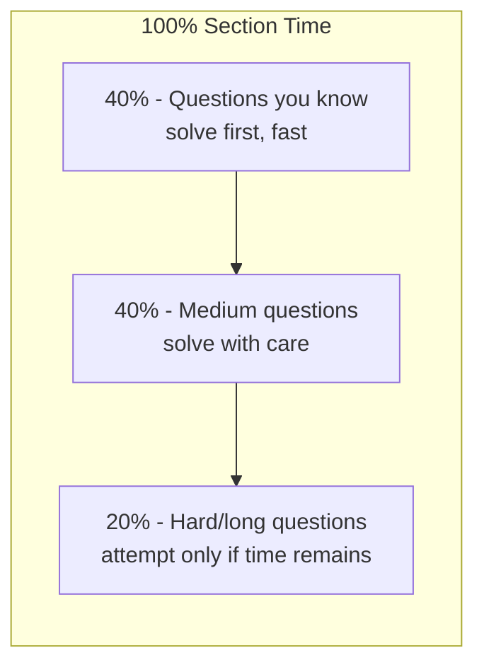

<!-- Clear Language: Keep sentences under 50 words -->
# Company-Format Mock Tests

## Learning Objectives

After this chapter you will be able to run full-length mock tests that exactly mirror the TCS NQT, Infosys SP, Wipro NLTH, Capgemini, Accenture, and Cognizant exam formats, manage sectional timing like a topper, analyze your score report to find weak areas, and design a personal mock-test schedule leading up to your actual campus test.

## Introduction

Practice without format is practice without pressure. The difference between a student who scores 95% in aptitude books and one who clears the TCS NQT is familiarity with the real exam: 60 questions in 60 minutes, sectional cutoffs, no going back, and a timer you cannot pause. Mock tests train exactly that. This chapter gives you the exact format of the six major service-company tests, a sectional timing system, a full-mock protocol, and a score-analysis framework that turns every mock into a study plan.

## Prerequisites

- Chapters 01-03 of this module (aptitude, reasoning, verbal foundations)
- Chapter 04 (Company Test Patterns) — the format tables used here
- Chapter 08 (PYQ Bank) — questions for your mocks

## Key Terminology

**Sectional cutoff**: The minimum score required in each section independently; failing one section fails the test even with a high total.

**Negative marking**: A penalty per wrong answer, usually 0.25 to 0.33 of the question's marks; it changes guessing strategy.

**NQT**: National Qualifier Test of TCS, the general aptitude test for all TCS hiring.

**Adaptive testing**: Some tests change question difficulty based on your previous answers; you cannot go back to earlier questions.

**Percentile vs raw score**: Your rank relative to others versus your actual marks; companies often filter on percentiles.

**Test pattern**: The fixed blueprint of a test — number of sections, questions, marks, and duration.

## Theory

### 1. The Six Company Formats Side by Side

| Company | Sections | Questions | Time | Negative Marking | Key Oddity |
|---------|----------|-----------|------|------------------|------------|
| TCS NQT | Nume, Reasoning, Verbal, Coding | 70-80 | 100 min | No (sectional minimums) | Coding section with 2 programs |
| Infosys SP | Reasoning, English, Math, Coding | 45-55 | 50-60 min | No | Fast-paced; 20s/question average |
| Wipro NLTH | Aptitude, Reasoning, English, Coding | 50-60 | 60-70 min | No | Essays sometimes included in English |
| Capgemini | Aptitude, Logical, English, Coding | 50-55 | 60 min | No | Speed is the killer; simple but long |
| Accenture | Cognitive, English, Coding | 60-70 | 60-90 min | No | Cognitive + Technical sections |
| Cognizant | Aptitude, Reasoning, English | 40-45 | 40 min | No | Short test; cutoff tight |

The table changes every hiring season. Before your attempt, check the current year's official pattern. Practice with a 10% harder version: if the real test gives 60 questions in 60 minutes, mock at 60 questions in 54 minutes.

### 2. The Sectional Timing Budget

Every section gets a budget before the test starts. Use the 40/40/20 rule for three-section tests:



Rules that protect the budget:

1. **Two-pass strategy**: First pass solves all questions you can do in under 60 seconds. Second pass returns to medium. Never pass three times.
2. **Skip rule**: If a question is not solved in 90 seconds, mark it and move. A skipped question costs 1 mark; a spent-budget costs 5 questions' worth.
3. **Guessing rule**: With no negative marking, answer everything (educated guesses). With negative marking, guess only when you can eliminate two options.
4. **Watch-check rule**: Check the clock after every 10 questions, not continuously. Continuous clock-watching raises anxiety.

**Example budget — TCS NQT Numeric (26 questions, 40 minutes):**
- Pass 1 (24 min): 16-18 solvable questions
- Pass 2 (12 min): 5-6 medium questions
- Pass 3 (4 min): revisit flagged questions or guess

### 3. The Full-Mock Protocol

A mock is not a study session. It is a simulation with rules:

1. **Environment**: Sit at a desk, phone in another room, timer visible, earplugs if the real test is in a computer lab.
2. **Tentative schedule**: The TCS NQT and others start on time; begin the mock at a fixed hour, not "whenever".
3. **No books, no calculator** (except the on-screen one), no internet.
4. **Record everything**: start time, per-section time spent, questions attempted, questions skipped, guessed, wrong.
5. **Finish the test fully** — including the code runner screen and the "submit" flow. Never abandon a mock halfway.
6. **Write the post-test log within 10 minutes** of finishing, before you forget which questions you flagged.

### 4. The Score Analysis Framework (SARQ)

After every mock, fill four buckets:

| Bucket | Definition | Action |
|--------|-----------|--------|
| **S** (Solved) | Solved correctly in the allotted time | Review only mistakes; keep speed |
| **A** (Attempted, wrong) | Attempted but wrong | Find the concept gap; study it this week |
| **R** (Ran out) | Knew it but ran out of time | Practice speed drills on that topic |
| **Q** (Quit early) | Skipped without trying | May indicate fear; attempt next time |

The **mock-to-study ratio** is the discipline rule: for every mock test you take, spend twice that time studying the SARQ output. Taking mocks without analysis is entertainment, not preparation.

### 5. Mock Frequency Plan

| Phase | Frequency | Purpose |
|-------|-----------|---------|
| Foundation (2 weeks) | 1 sectional mock per topic | Learn the format, not scores |
| Building (4 weeks) | 1 full mock per week | Build stamina and timing |
| Sharpening (2 weeks) | 2 full mocks per week | Hone weak sections |
| Exam week | 1 full mock every 2 days, at exam time | Peak timing; last one 2 days before |

The last mock must end at least 48 hours before the real test. The final two days are for revision notes and sleep, not for new mocks.

### 6. Coding Section Practice Format

Every service company now includes a coding section. Practicing it as a mock is different from practicing DSA:

1. **10-30-60 rule**: 10 minutes to plan on paper, 30 minutes to code, 60 minutes to debug if stuck. This mirrors the real 2-problem pattern.
2. **Type in an editor with auto-complete off** — the real test editor is bare.
3. **Practice reading constraints**: Input size tells you the expected algorithm (10^5 → O(n log n) or better).
4. **Dry-run your code on the sample cases on paper first**, then run it.
5. **Handle the edge cases first**: empty input, single element, max values. Interviewers rank these above fancy algorithms.

### 7. Anxiety and the Test Day

Mock tests are also anxiety training:

- The 5-4-3-2-1 grounding technique (five things you see, four you hear, three you touch, two you smell, one you taste) calms the surge before the test.
- Breathing pattern: 4 seconds in, 6 seconds out, repeated 5 times. Slow exhalation reduces heart rate.
- Sleep the night before, not the night after studying. All-night study before a test reduces recall by an estimated 20-30%.
- Arrive early, test your login, and verify the browser and internet on the actual machine before the timer starts.

## Examples

### Example 1: TCS NQT Full Mock — 30 Minute Plan

```typescript
interface Section {
    name: string
    totalQuestions: number
    totalMinutes: number
}

class MockPlanner {
    plan(s: Section): { pass1: number; pass2: number; pass3: number } {
        const pass1 = Math.floor(s.totalQuestions * 0.6)
        const pass2 = Math.floor(s.totalQuestions * 0.25)
        const pass3 = s.totalQuestions - pass1 - pass2
        return { pass1, pass2, pass3 }
    }

    timePerQuestion(s: Section): number {
        return s.totalMinutes / s.totalQuestions
    }
}

const tcsNumeric: Section = { name: "Numeric", totalQuestions: 26, totalMinutes: 40 }
console.log(new MockPlanner().plan(tcsNumeric))
console.log("Seconds per question:", (new MockPlanner().timePerQuestion(tcsNumeric) * 60).toFixed(0))
```

Output: pass1 ≈ 16 questions, pass2 ≈ 7, pass3 ≈ 3; about 92 seconds per question average.

### Example 2: SARQ Analysis Engine

```typescript
type Bucket = "S" | "A" | "R" | "Q"

interface MockResult {
    questionId: number
    bucket: Bucket
    topic: string
    timeSpentSec: number
}

class SARQAnalyzer {
    analyze(results: MockResult[]): Record<Bucket, number> {
        return results.reduce((acc, r) => {
            acc[r.bucket] = (acc[r.bucket] || 0) + 1
            return acc
        }, {} as Record<Bucket, number>)
    }

    weakestTopic(results: MockResult[]): string {
        const counts = new Map<string, number>()
        for (const r of results.filter(x => x.bucket !== "S")) {
            counts.set(r.topic, (counts.get(r.topic) || 0) + 1)
        }
        let worst = ""
        let max = 0
        counts.forEach((v, k) => { if (v > max) { max = v; worst = k } })
        return worst || "none - all solved"
    }

    totalTime(results: MockResult[]): number {
        return results.reduce((s, r) => s + r.timeSpentSec, 0)
    }
}
```

### Example 3: Two-Pass Quiz Simulator

```typescript
interface Question { id: number; expectedTimeSec: number }

class TwoPassRunner {
    run(questions: Question[], budgetSec: number): { solved: Question[]; flagged: Question[] } {
        const solved: Question[] = []
        const flagged: Question[] = []
        let spent = 0
        for (const q of questions) {
            if (spent + q.expectedTimeSec > budgetSec) { flagged.push(q); continue }
            solved.push(q)
            spent += q.expectedTimeSec
        }
        return { solved, flagged }
    }
}

const budgetSec = 40 * 60
const questions: Question[] = Array.from({ length: 26 }, (_, i) => ({
    id: i + 1, expectedTimeSec: 90 + (i * 7) % 40,
}))
const result = new TwoPassRunner().run(questions, budgetSec)
console.log("Solved in budget:", result.solved.length, "Flagged:", result.flagged.length)
```

### Example 4: Guess-Efficiency Calculator

```typescript
class GuessStrategy {
    expectedValue(marksPerQuestion: number, negative: number, options: number): number {
        const pCorrect = 1 / options
        return marksPerQuestion * pCorrect - negative * (1 - pCorrect)
    }
}

const g = new GuessStrategy()
console.log("Blind guess, 4 options, -0.25 neg:", g.expectedValue(1, 0.25, 4))
console.log("Guess after eliminating 2, 4 options, -0.25:", g.expectedValue(1, 0.25, 2))
```

Output: blind guessing in a 4-option test with -0.25 negative marking has expected value 0 (neutral); guessing after eliminating two options gives +0.125 per question — always guess when you can eliminate options.

## Visual Analogy

**The mock test is a dress rehearsal for a play.** The real exam is opening night: same script (format), same stage (test interface), same audience (cutoffs). A dress rehearsal with costumes, lights, and a strict stage manager catches the problems that will embarrass you on opening night — the costume that jams, the prop that breaks, the scene you misremember. Nobody watches a dress rehearsal; the point is to break things then, not at the premiere. Your mock tests are the dress rehearsals; the score report is the stage manager's notes. Rehearse exactly what you will perform, and the performance stops being frightening.

## Summary

Mock tests convert knowledge into test performance. Every major service company has a fixed format: sections, time, and cutoffs that you must learn exactly. The two-pass strategy (solve known questions first, medium second, hard last) protects your time budget. The SARQ framework (Solved, Attempted, Ran out, Quit) turns every mock into a targeted study plan. Mock frequency builds from sectional to full mocks as the exam approaches, ending 48 hours before the real test. The coding section needs its own practice format with planning, bare editors, and edge-case discipline. Finally, mocks train anxiety control — breathing, grounding, and sleep hygiene are as testable as percentages.

## Practical Takeaways

- Learn the exact current format of your target company's test before practicing.
- Use the two-pass strategy in every section, every mock.
- Never spend more than 90 seconds on an unknown question.
- Fill the SARQ table within 10 minutes after every mock.
- Study twice as long as the mock itself — analysis beats volume.
- Run the last mock 48 hours before the real test, then revise and rest.
- Practice coding in a bare editor with a 10-30-60 timebox.

## Interview Q&A

**Q1: How many mocks should I take before the real test?**
At least 6 full mocks: 1 format-learning, 3 building, 2 sharpening. More only if each one is analyzed with SARQ; unanalyzed mocks waste time.

**Q2: What if I fail every mock before the exam?**
That is the point of mocks. Failures in mocks are information: your SARQ table tells you exactly what to study. The only bad mock is an unanalyzed one.

**Q3: Should I guess when there is no negative marking?**
Yes — answer every question. With negative marking, guess only when you can eliminate at least two options.

**Q4: How do I handle sectional cutoffs?**
Never sacrifice an entire section for another. Use the per-section budget and two-pass within each section; companies fail candidates on one weak section regardless of total score.

**Q5: Can I practice mocks on my phone?**
For sectional speed drills yes, for full mocks no. Full mocks need a desktop, a keyboard, and a real timer to mirror the exam environment.

**Q6: What if my real test is adaptive?**
Then questions you answer correctly get harder. Never go back in adaptive tests — answer once, move on, and maintain accuracy over speed.

## Chapter Quiz

1. What is the two-pass strategy?
   - A) Solving easy questions first, medium second, hard last
   - B) Doing the test twice
   - C) Skipping all hard questions
   - D) Starting with the last section
   // correct: A

2. What does the A in SARQ stand for?
   - A) Attempted but wrong
   - B) All correct
   - C) Abandoned section
   - D) Average score
   // correct: A

3. With negative marking, when should you guess?
   - A) Never, under any condition
   - B) Always, for every question
   - C) When you can eliminate two options
   - D) Only in the last minute
   // correct: C

4. How long before the real test should your last mock end?
   - A) 2 hours
   - B) 48 hours
   - C) 1 week
   - D) The night before
   // correct: B

5. What is the mock-to-study time rule?
   - A) Study half as long as the mock
   - B) Study twice as long as the mock
   - C) Never study after mocks
   - D) Study only the night before
   // correct: B

## Exercises

1. Build the full mock plan for your target company: sections, questions, time, and cutoffs from the current official pattern.
2. Take one full mock under strict exam conditions; log time per section.
3. Fill the SARQ table for that mock and list your top 3 weak topics.
4. Write a 5-question speed drill set for your weakest topic (90 seconds each).
5. Simulate the coding section with the 10-30-60 rule on two problems from chapter 08.

## Common Mistakes

1. Taking mocks without analyzing them.
2. Spending 5 minutes on one question while 10 others wait.
3. Ignoring sectional cutoffs and over-investing in one section.
4. Practicing on a phone for a desktop test.
5. Guessing blindly when negative marking exists.
6. Studying new topics the night before the exam.

## Revision Notes

- Two-pass: 60% known fast, 25% medium, 15% hard/long
- 90-second skip rule per question
- SARQ: S solved, A attempted-wrong, R ran-out, Q quit — study the non-S
- Mock-to-study ratio: 1:2
- Last mock: 48 hours before the test
- Coding: 10-30-60 timebox, bare editor, edge cases first
- Anxiety: 4-6 breathing, 5-4-3-2-1 grounding, sleep before exam

## Placement Section

### Top 10 Interview Questions

#### TCS Style

1. **How do you prepare for the NQT?** — Format-first answer: learn the pattern, sectional mocks, SARQ analysis, speed drills.
2. **Which section is hardest for you?** — Honest + plan: name the section and your improvement numbers from mocks.

#### Infosys Style

3. **How do you manage time in fast tests?** — Two-pass, 90-second rule, watch-check every 10 questions.
4. **What was your mock test score trend?** — Show improvement: "started at X%, now Y% across 6 mocks."

#### Wipro Style

5. **How do you handle test-day pressure?** — Protocol: breathing pattern, grounding, sleep the night before, early login.
6. **Why do you practice mocks instead of just studying?** — Performance vs knowledge: mocks train timing, cutoffs, and stamina.

#### Capgemini Style

7. **What is your strategy for speed sections?** — Sectional budget, skip rule, guess-when-eliminated rule.
8. **How do you improve your weakest topic?** — SARQ-driven: name the topic, the drill, and the metric.

#### Accenture Style

9. **How do you prepare for the cognitive section?** — Same rules as aptitude: format, mocks, analysis loop.
10. **What do you do in the last week before the test?** — 2 mocks per week max, revision notes, sleep, no new topics.

### Company-Level Insights

- TCS filters heavily on the coding section for Digital roles; your mock must include the code runner.
- Infosys SP is time-starved; drill 20-second-per-question speed on the easier types.
- Capgemini's questions are easy but numerous — stamina and skipping discipline decide scores.
- Accenture has a technical/cognitive split; prepare both sections in the same mock session.
- Cognizant's short test has a tight cutoff — accuracy per question matters more than speed.

## Difficulty Level

Intermediate — requires the aptitude foundations of chapters 01-03 and the format knowledge of chapter 04.

## Tips & Tricks

- **Print the format table** and paste it over your desk; you must be able to recite it.
- **Set a stricter mock**: 10% less time than the real test, so the real test feels easier.
- **Log skipped questions** — they reveal fear topics faster than wrong answers.
- **Do sectional mocks for the exact time** — 20 minutes is 20 minutes, even if you are mid-question.
- **Reuse old mocks**: retake them after a week; the second pass reveals what stuck.

## Memory Tricks

- **SARQ = "Study All Rough Questions"** — S=Solved, A=Attempted, R=Ran out, Q=Quit.
- **40/40/20** — four out of ten questions are yours quickly, four are fought for, two are left behind.
- **90 seconds** — one question is worth 90 seconds; nine questions are worth the whole section.
- **1:2** — for every mock hour, two study hours of analysis.

## Further Reading

- TCS Careers: current NQT pattern and practice tests
- Infosys Springboard: SP mock papers
- Wipro NLTH sample papers on Wipro careers page
- Capgemini India campus hiring page: test guidelines
- Placement Prep platforms: sectional mocks for all six companies

## Related Topics

- Chapter 01 (Quantitative Aptitude) — the content of the numeric sections
- Chapter 02 (Logical Reasoning) — reasoning section drills
- Chapter 03 (Verbal Ability) — English section drills
- Chapter 04 (Company Test Patterns) — the format tables used here
- Chapter 08 (PYQ Bank) — real questions for mocks

## FAQs

1. **Are mock test scores correlated with real test scores?** — Strongly, when the mock format matches the real one; weakly when it does not. Format fidelity is the correlation.
2. **Can I do a mock without timing?** — That is a practice set, not a mock. Timing is the difference between rehearsal and practice.
3. **Which is better: many mocks or deep analysis of few?** — Deep analysis of few. Six analyzed mocks beat twenty unanalyzed ones.
4. **Should I practice on the company's official site?** — Yes, if available — the interface itself is part of the test.
5. **What if my college's test date is near and I am unprepared?** — Run one full mock now, do SARQ on it, and drill the top 3 weak topics for three days. A targeted three days beats two weeks of scattered study.

## Important Notes

- Cutoffs are per section — never trade one section for another.
- The two-pass strategy works for every section of every company.
- Every mock needs a written post-test log within 10 minutes.
- Coding practice must use the bare editor and the 10-30-60 rule.
- Test-day anxiety is trained, not wished away — breathing and grounding work.
- The last mock ends 48 hours before the real test.

## Historical Context

Service-company campus tests evolved from paper aptitude tests in the 1990s to computer-based adaptive exams in the 2010s. TCS pioneered the digital NQT in 2016, adding a coding section that forced colleges to add programming to aptitude training. Mock tests became a separate industry as students realized format familiarity raised scores by 10-15 percentile. The trend continues with remote-proctored tests: since 2021, candidates must also rehearse the proctoring interface — webcam placement, screen sharing, and background checks.

## Security Considerations

- Never share your mock test login or OTP with anyone; proctoring systems flag account sharing.
- Keep your webcam area clean — notes on the desk are detected as cheating.
- Practice in the same browser you will use for the real test; plugins can interfere with the test interface.
- Never open test screenshots or question leaks shared on Telegram — companies blacklist candidates caught with them.
- In remote tests, a stable internet connection is part of your security: a drop mid-section can log you out.

## ML Intuition

- Mock scores over time form a learning curve; the plateau is where you are solving the same question types repeatedly — change the set.
- Time-per-question distributions are skewed: a few questions eat half your budget. Two-pass strategy is the fix for that skew.
- Test designers choose distractors that match common misconceptions; your wrong answers in mocks are the strongest signal of which misconception to fix.
- Adaptive tests estimate your ability with item response theory — accuracy on hard items matters more than volume of easy ones.

## Analogies

- **Mock test is a dress rehearsal**: costumes, lights, stage manager — break things before opening night.
- **SARQ is a triage ward**: S=discharged, A=operate now, R=needs physical therapy, Q=afraid of the doctor.
- **Time budget is a wallet**: every question costs coins; the two-pass strategy is budgeting, not hoarding.
- **Sectional cutoff is a multi-lane toll**: a fast lane cannot pay for a toll you missed in another lane.

## Capstone Project Link

- [Module Capstone: End-to-End Project](https://github.com/Raushan666java/ai-engineering-journey) — build a mock-test runner with per-section timers, SARQ logging, and a score-trend dashboard; the TypeScript classes in this chapter are its core.

## Flashcards

<details class="tp-qa-card" data-qid="33campusplacement-07mock-flash1">
  <summary class="tp-qa-question">
    <span class="tp-qa-status"></span>
    What is the two-pass strategy?
  </summary>
  <div class="tp-qa-answer">
    <p>Pass 1 solves questions you know in under 60 seconds, pass 2 medium ones, pass 3 hard ones only if time remains.</p>
  </div>
</details>

<details class="tp-qa-card" data-qid="33campusplacement-07mock-flash2">
  <summary class="tp-qa-question">
    <span class="tp-qa-status"></span>
    What are the four SARQ buckets?
  </summary>
  <div class="tp-qa-answer">
    <p>Solved, Attempted but wrong, Ran out of time, Quit early — each bucket has a distinct study action.</p>
  </div>
</details>

<details class="tp-qa-card" data-qid="33campusplacement-07mock-flash3">
  <summary class="tp-qa-question">
    <span class="tp-qa-status"></span>
    What is the 90-second skip rule?
  </summary>
  <div class="tp-qa-answer">
    <p>If a question is not solved in 90 seconds, flag it and move on — one question is not worth the whole section.</p>
  </div>
</details>

<details class="tp-qa-card" data-qid="33campusplacement-07mock-flash4">
  <summary class="tp-qa-question">
    <span class="tp-qa-status"></span>
    When should the last mock end before the real test?
  </summary>
  <div class="tp-qa-answer">
    <p>48 hours before — the final two days are for revision notes and sleep, not new mocks.</p>
  </div>
</details>
