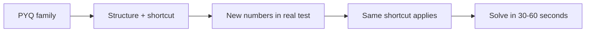

<!-- Clear Language: Keep sentences under 50 words -->
# PYQ Bank (Service Companies)

## Learning Objectives

After this chapter you will be able to solve 20 previous-year questions from TCS, Infosys, Wipro, Capgemini, Accenture, and Cognizant with full solutions, recognize the recurring question families each company reuses, apply the fastest shortcut for each family, and convert PYQ practice into the same question types in your actual test.

## Introduction

Previous year questions are the closest mirror of the actual test. Service companies reuse question families heavily: the numbers change, the structure stays. A candidate who has solved 20 representative PYQs with shortcuts faces a test that looks familiar; one who studied only theory faces every question as if it were new. This chapter is a bank of 20 solved PYQs — 15 aptitude/reasoning/verbal and 5 coding — with the shortcut, the full solution, and the family pattern for each.

## Prerequisites

- Chapters 01-03 of this module (aptitude, reasoning, verbal)
- Chapter 04 (Company Test Patterns) — how each company asks these types
- Chapter 07 (Company-Format Mock Tests) — how to time yourself on these questions

## Key Terminology

**Question family**: A recurring structure of question (e.g., "ratio of ages", "work with pipes") that companies reuse with new numbers.

**Shortcut**: A fast formula or pattern-based method that solves a family in under 30 seconds.

**PYQ**: Previous Year Question — a question from a real past paper.

**Distractor**: A wrong answer option built from a common mistake (e.g., swapping ratio order).

**Trapped choice**: The most-selected wrong option; spotting the trap reveals the correct answer.

## Theory

### 1. Why PYQs Work

Service companies write tests from question banks. The banks have families: 20-30 recurring structures per topic. Every year, 60-80% of questions are new numbers inside old structures. Solving the family once teaches you all its numbers:



The rule: **learn families, not individual questions**. A solved PYQ you cannot recognize in a new dress is wasted.

### 2. The Fastest Shortcuts — Family Cheat Sheet

| Topic | Family | Shortcut |
|-------|--------|----------|
| Percentages | "A is x% more than B" | If A = B × (1 + x/100), then B = A / (1 + x/100) |
| Ages | "Ratio x:y, sum S" | Total parts = x+y; each part = S/(x+y); ages = x·part, y·part |
| Time & Work | "A takes a days, B takes b days" | Together = ab/(a+b) days |
| Pipes | "Pipe A fills in a h, B empties in b h" | Net = ab/(b-a) when b>a (emptier slower) |
| Speed | "x km/h upstream, y downstream" | Boat speed = (x+y)/2; stream = (y-x)/2 |
| Simple Interest | "P at R% for T years" | SI = P·R·T/100 |
| Profit/Loss | "Sold at x% profit, CP = ?" | CP = SP × 100/(100+x) |
| Number series | "Difference pattern" | Check diff of diffs (second-order series) |
| Coding-decoding | "Letter shift pattern" | Map letter positions; find the shift amount |
| Blood relations | "Family tree" | Draw the tree; never answer from memory |

### 3. The 3-Pass PYQ Practice Method

Pass 1 (Study mode): Read the question, solve it fully with the shortcut on paper, then check the solution. Mark the family.

Pass 2 (Timed mode, next day): Re-solve the same set under the real section's time limit. You should be 2x faster than pass 1.

Pass 3 (Spaced mode, after 4-5 days): Solve only the ones you marked hard. Track which families still fail.

Repeat until every family on the cheat sheet is automatic. The goal is recognition speed: read the question, name the family in 5 seconds, apply the shortcut.

### 4. Company Question Mix

| Company | Heaviest Families | Typical Count |
|---------|-------------------|---------------|
| TCS NQT | Percentages, ratios, time-work, coding-decoding, series | 8-10 of 26 numeric |
| Infosys SP | Series, puzzles, blood relations, percentages | 5-7 of ~20 |
| Wipro NLTH | Profit-loss, SI/CI, time-speed, syllogisms | 4-6 of ~18 |
| Capgemini | Percentages, averages, work-time, number series | 5-8 of ~25 |
| Accenture | Ratios, percentages, puzzles, verbal analogies | 5-7 of ~20 |
| Cognizant | Averages, percentages, blood relations, series | 4-6 of ~15 |

Mix your PYQ practice in the same proportions as your target company.

## Examples

### Example 1: Percentage Family (TCS Style)

**Question**: A trader marks an article 25% above cost price and sells it at a 10% discount. What is his profit percentage?

**Shortcut**: Profit% = Marked-up% − Discount% − (Marked-up% × Discount%)/100
= 25 − 10 − (25 × 10)/100 = 25 − 10 − 2.5 = 12.5%

**Full solution**: CP = 100. Marked Price = 125. Discount 10% → SP = 125 × 0.9 = 112.5. Profit = 12.5%. Profit% = 12.5%.

**Family**: "Mark up then discount" — the product term (25×10)/100 = 2.5 is why simple subtraction 25−10 gives the wrong answer 15%.

### Example 2: Time & Work Family (Capgemini Style)

**Question**: A can do a work in 12 days; B in 18 days. They work together for 4 days, then A leaves. How many more days does B need?

**Shortcut**: Work done in 4 days together = 4 × (1/12 + 1/18) = 4 × (5/36) = 20/36 = 5/9. Remaining = 4/9. B's time = (4/9) × 18 = 8 days.

**Trap**: Subtracting 4 from 18−12 and answering with the leftover of A+B is the trapped choice.

### Example 3: Speed Family (Wipro Style)

**Question**: A boat goes 20 km upstream in 5 hours and 36 km downstream in 4 hours. Find the boat's speed in still water and the stream's speed.

**Shortcut**: Upstream speed = 20/5 = 4 km/h. Downstream = 36/4 = 9 km/h.
Boat speed = (9+4)/2 = 6.5 km/h. Stream = (9−4)/2 = 2.5 km/h.

**Family**: "Two trips in opposite directions" — average the two speeds for the boat, half the difference for the stream.

### Example 4: Ages Family (Infosys Style)

**Question**: The ratio of the ages of A and B is 3:4. In 6 years, the ratio will be 4:5. Find A's current age.

**Shortcut**: Let ages be 3x and 4x. (3x+6)/(4x+6) = 4/5 → 5(3x+6) = 4(4x+6) → 15x+30 = 16x+24 → x = 6. A's age = 18.

**Family**: "Ratio now, ratio later" — set the future equation and solve for x. The trapped choice is 24 (B's age).

### Example 5: Number Series Family (Cognizant Style)

**Question**: Find the next number: 3, 8, 18, 38, 78, ?

**Shortcut**: Each term = previous × 2 + 2: 3×2+2=8, 8×2+2=18, 18×2+2=38, 38×2+2=78, 78×2+2=158.

**Family**: "Multiply and add constant" — the constant can be 1, 2, or 3; test the pattern on the first two transitions before trusting it.

### Example 6: Coding-Decoding (TCS Style)

**Question**: If HOUSE is coded as IOUTF, how is CHAIR coded?

**Shortcut**: Each letter shifts +1: H→I, O→P, U→V, S→T, E→F. CHAIR → DJBJS.

**Family**: "Single shift" — count the shift on the given pair first; the trap is reverse shift (−1) or skipping letters.

### Example 7: Blood Relations (Infosys Style)

**Question**: Pointing to a photograph, a man says, "She is the daughter of my grandfather's only son." How is she related to the man?

**Shortcut**: Grandfather's only son = the man's father (or the man himself, if father is the only son — the classic trap). "Daughter of my father" = sister. Answer: sister.

**Trap**: Some solvers answer "niece" by assuming grandfather's only son is the man's uncle — but "only son" of the grandfather has no brother, so it is the father.

### Example 8: Syllogism (Wipro Style)

**Question**: All engineers are graduates. Some graduates are managers. Which conclusion follows?
1. Some managers are engineers.
2. All managers are graduates.

**Shortcut**: Draw two circles. Engineers ⊂ Graduates. Managers ∩ Graduates ≠ ∅. Conclusion 1 does not follow (the intersection may be outside engineers). Conclusion 2 is false. Answer: neither.

**Family**: "All-Some" syllogisms — the safe answer is usually the weak one; "some" reversed claims need the diagram, never intuition.

### Example 9: Profit-Loss (Accenture Style)

**Question**: A shopkeeper sells an item at ₹540 after a 10% loss. What was the cost price?

**Shortcut**: CP = SP × 100/(100 − loss%) = 540 × 100/90 = ₹600.

**Trap**: Adding 10% to 540 gives 594 — wrong, because the loss is on CP, not SP.

### Example 10: Simple Interest (TCS Style)

**Question**: At what rate of simple interest will ₹2,000 become ₹2,600 in 4 years?

**Shortcut**: SI = 2600 − 2000 = 600. R = SI × 100/(P × T) = 600×100/(2000×4) = 7.5%.

**Family**: "SI = PRT/100" rearranged — every SI question is one of the four variables missing.

### Example 11: Ratio Family (Capgemini Style)

**Question**: Divide ₹1,200 between A and B in the ratio 2:3. What is B's share?

**Shortcut**: Total parts = 5. B's share = 3/5 × 1200 = ₹720.

**Trap**: Swapping order (2/5 × 1200 = 480) is the most chosen wrong answer.

### Example 12: Average Family (Cognizant Style)

**Question**: The average of 5 numbers is 27. If one number is removed, the average becomes 25. What was the removed number?

**Shortcut**: Sum of 5 = 135. Sum of remaining 4 = 100. Removed = 135 − 100 = 35.

**Family**: "Average with removal" — multiply both sides by the count; the difference of sums is the answer.

### Example 13: Pipes Family (Wipro Style)

**Question**: Pipe A fills a tank in 6 hours; pipe B empties it in 9 hours. With both open, how long to fill?

**Shortcut**: Net rate = 1/6 − 1/9 = 1/18 per hour → 18 hours.

**Trap**: ab/(b−a) = 54/3 = 18 — matches; but if the emptier were faster (a<b wrong order), the tank never fills.

### Example 14: Data Sufficiency (Accenture Style)

**Question**: What is the cost price of a pen? Statement 1: sold at 20% profit for ₹120. Statement 2: marked price is ₹150.

**Shortcut**: Statement 1 alone: CP = 120/1.2 = 100. Statement 2 alone gives nothing. Answer: 1 alone sufficient.

**Family**: "Sufficiency" — always test each statement alone before combining; the trap is assuming the combined data is needed.

### Example 15: Calendar Family (Infosys Style)

**Question**: If 1 January 2024 was a Monday, what day was 1 January 2025?

**Shortcut**: 2024 is a leap year → 366 days → 366 mod 7 = 2 → shift by 2 days → Wednesday.

**Family**: "Day shift" — count odd days (non-leap = 1, leap = 2). The trap is forgetting February in leap years.

### Example 16: Logical Puzzle (TCS Style)

**Question**: Five friends sit in a row. A is left of B. C is right of D. E is between A and C. B is immediately right of A. Who is in the middle?

**Shortcut**: Draw positions: A B E C D (checking: A left of B ✓, B right of A ✓, E between A and C ✓, C right of D ✓). Middle = E.

**Family**: "Seating arrangement" — draw the row and place constraints one at a time; never answer from reading alone.

### Example 17: Partnership (Capgemini Style)

**Question**: A invests ₹5,000 for 6 months; B invests ₹6,000 for 4 months. Profit is ₹1,800. What is A's share?

**Shortcut**: Ratio = (5000×6) : (6000×4) = 30000:24000 = 5:4. A's share = 5/9 × 1800 = ₹1,000.

**Family**: "Capital × time" — always multiply capital by the duration; forgetting time is the standard trap.

### Example 18: Verbal Analogy (Wipro Style)

**Question**: OCEAN : WATER :: FOREST : ?

**Shortcut**: Ocean is full of water; forest is full of trees. Answer: TREES.

**Family**: "Container-content" analogies — name the relationship precisely first; "water is in ocean" and "trees are in forest" must match in direction.

### Example 19: Sentence Correction (Accenture Style)

**Question**: Choose the correct sentence:
a) He don't know the answer.
b) He doesn't know the answer.
c) He doesn't knew the answer.

**Shortcut**: Third-person singular needs "doesn't" + base verb. Answer: b.

**Family**: "Subject-verb agreement" — find the subject, then check the verb form; the trap is matching the verb to the wrong noun.

### Example 20: Coding — Two Sum Variant (TCS Style)

**Question**: Given an array of numbers and a target, return the indices of two numbers that add up to the target. Assume exactly one solution.

```typescript
function twoSum(nums: number[], target: number): [number, number] {
    const seen = new Map<number, number>()
    for (let i = 0; i < nums.length; i++) {
        const complement = target - nums[i]
        if (seen.has(complement)) {
            return [seen.get(complement)!, i]
        }
        seen.set(nums[i], i)
    }
    throw new Error("No solution")
}

console.log(twoSum([2, 7, 11, 15], 9))
```

Output: [0, 1]. The hash-map version runs in O(n) — required when the array length reaches 10^5.

### Example 21: Coding — Find Duplicates (Infosys Style)

**Question**: Given an array, print numbers that appear more than once, in ascending order.

```typescript
function findDuplicates(nums: number[]): number[] {
    const counts = new Map<number, number>()
    for (const n of nums) counts.set(n, (counts.get(n) || 0) + 1)
    const dups: number[] = []
    counts.forEach((v, k) => { if (v > 1) dups.push(k) })
    return dups.sort((a, b) => a - b)
}

console.log(findDuplicates([4, 3, 2, 7, 8, 2, 3, 1]))
```

Output: [2, 3].

### Example 22: Coding — Valid Parentheses (Capgemini Style)

**Question**: Check if a string of brackets is balanced.

```typescript
function isValid(s: string): boolean {
    const stack: string[] = []
    const pairs: Record<string, string> = { ")": "(", "]": "[", "}": "{" }
    for (const ch of s) {
        if (ch === "(" || ch === "[" || ch === "{") {
            stack.push(ch)
        } else if (stack.pop() !== pairs[ch]) {
            return false
        }
    }
    return stack.length === 0
}

console.log(isValid("{[()]}"), isValid("{[(])}"))
```

Output: true, false. Stack-based matching is the standard solution; the trap is ignoring the final stack emptiness check.

### Example 23: Coding — Merge Sorted Arrays (Wipro Style)

**Question**: Merge two sorted arrays; return the merged sorted array.

```typescript
function mergeSorted(a: number[], b: number[]): number[] {
    const out: number[] = []
    let i = 0, j = 0
    while (i < a.length && j < b.length) {
        out.push(a[i] <= b[j] ? a[i++] : b[j++])
    }
    return [...out, ...a.slice(i), ...b.slice(j)]
}

console.log(mergeSorted([1, 3, 5], [2, 4, 6]))
```

Output: [1, 2, 3, 4, 5, 6]. Two-pointer merging is O(n+m).

### Example 24: Coding — Reverse Words (Accenture Style)

**Question**: Reverse the words of a sentence without reversing the letters of the words.

```typescript
function reverseWords(sentence: string): string {
    return sentence.trim().split(/\s+/).reverse().join(" ")
}

console.log(reverseWords("placement preparation is fun"))
```

Output: "fun is preparation placement". The regex handles multiple spaces — a common edge case.

### Example 25: Coding — First Non-Repeating Character (Cognizant Style)

**Question**: Find the first character that appears only once in a string; return '_' if none.

```typescript
function firstNonRepeating(s: string): string {
    const counts = new Map<string, number>()
    for (const ch of s) counts.set(ch, (counts.get(ch) || 0) + 1)
    for (const ch of s) if (counts.get(ch) === 1) return ch
    return "_"
}

console.log(firstNonRepeating("aabbcde"), firstNonRepeating("aabb"))
```

Output: c, _. Two passes: one to count, one to find the first singleton — O(n) time.

## Visual Analogy

**The PYQ bank is a photo album of the exam's family tree.** Each photo (question) looks different — different clothes, different settings — but the same faces (structures) appear in every picture. The shortcut is knowing the faces: spot "mark up then discount" in any photo and you already know how the story ends. A candidate who memorized individual photos panics when a new costume appears; one who learned the faces solves every picture in seconds. Your job is not to remember 25 photos; it is to know the 15 faces so well that recognition is instant.

## Summary

Previous year questions are the highest-yield practice material for service-company tests. Companies reuse question families with new numbers, so learning the structure and shortcut for each family makes new questions feel familiar. The cheat sheet covers the core families: percentages, ages, time-work, pipes, speed, SI, profit-loss, series, coding-decoding, blood relations, syllogisms, and averages. Practice in three passes — study, timed, spaced — to convert recognition into speed. Company mixes differ: TCS leans on percentages and coding-decoding, Capgemini on speed questions, Cognizant on averages and series. Coding questions follow standard patterns (two-sum, duplicates, parentheses, merging, word reversal, first non-repeating) solvable in O(n) with hashing or stacks.

## Practical Takeaways

- Learn the question families, not isolated questions.
- Practice PYQs in three passes: study, timed (next day), spaced (after 4-5 days).
- Match your practice mix to your target company's proportions.
- Note the trapped choice on every question — it reveals the misconception companies expect.
- Time yourself from pass 2 onward; recognition speed is the real skill.
- For coding PYQs, use the bare editor and the 10-30-60 rule from chapter 07.
- Keep a family log: every PYQ gets a family label; review the log weekly.

## Interview Q&A

**Q1: Where do I find PYQs for my company?**
Official sample papers on company career pages, college placement cells, and curated practice platforms. Avoid Telegram leaks — they are unreliable and can get you disqualified.

**Q2: How many PYQs are enough?**
150-200 per company is the practical range: 5-7 rounds of the ~30 families per topic. The number matters less than recognizing families across all of them.

**Q3: Are PYQs repeated verbatim?**
Occasionally, but rarely. The reliable repetition is structural: same family, new numbers, same shortcut.

**Q4: Should I solve PYQs before learning the topic?**
No. Learn the topic's concepts first, then use PYQs to learn the family shortcuts. PYQs without concepts are memorization; concepts without PYQs are theory.

**Q5: How do I handle PYQs I cannot solve?**
Attempt for 90 seconds, then study the solution in full, label the family, and re-solve it from scratch the next day. The re-solve is where learning happens.

## Chapter Quiz

1. Why do PYQs work as practice material?
   - A) Questions are repeated verbatim every year
   - B) Companies reuse question families with new numbers
   - C) PYQs are easier than real questions
   - D) They cover only easy topics
   // correct: B

2. A trader marks 25% above CP and gives 10% discount. Profit% is?
   - A) 15%
   - B) 12.5%
   - C) 35%
   - D) 2.5%
   // correct: B

3. A does a work in 12 days, B in 18 days. Together for 4 days, then A leaves. B needs how many more days?
   - A) 6 days
   - B) 8 days
   - C) 10 days
   - D) 4 days
   // correct: B

4. A boat goes 20 km upstream in 5 h and 36 km downstream in 4 h. The stream's speed is?
   - A) 6.5 km/h
   - B) 2.5 km/h
   - C) 9 km/h
   - D) 4 km/h
   // correct: B

5. In the series 3, 8, 18, 38, 78, the next term is?
   - A) 118
   - B) 158
   - C) 148
   - D) 138
   // correct: B

## Exercises

1. Solve Examples 1-19 again from a blank page, without the solutions, and time each one.
2. Create 3 new questions in the "mark up then discount" family with fresh numbers; solve them.
3. Run the 3-pass method on 20 questions from this chapter across one week.
4. Build a family log: list every family in this chapter and a one-line shortcut for each.
5. Solve the 6 coding examples in a bare editor with the 10-30-60 rule; then check the outputs.

## Common Mistakes

1. Memorizing answers instead of families.
2. Using the shortcut without understanding the full solution.
3. Practicing only the topics you are good at.
4. Skipping the trapped choice analysis.
5. Solving PYQs without timing from pass 2 onward.
6. Ignoring the company's question mix proportions.

## Revision Notes

- Families, not questions: structure + shortcut + new numbers
- 3 passes: study → timed (next day) → spaced (4-5 days)
- Mark-up then discount: a + b − ab/100
- Time-work together: ab/(a+b)
- Boat speed = (down+up)/2; stream = (down−up)/2
- SI rearranged: R = SI×100/(P×T)
- CP = SP×100/(100+loss%)
- Coding: hash map for two-sum and first non-repeating; stack for parentheses
- Company mixes: TCS percentages, Capgemini speed, Cognizant averages

## Placement Section

### Top 10 Interview Questions

#### TCS Style

1. **How do you use PYQs in preparation?** — Three-pass method: study the family, time yourself, space the review.
2. **Which PYQ family is easiest to slip up on?** — Mark-up/discount: the product term is forgotten.

#### Infosys Style

3. **How do you prepare for the reasoning section?** — Series and blood relations families with diagrams; never from memory.
4. **What is your approach to unknown questions?** — 90-second rule, skip, return in pass 2.

#### Wipro Style

5. **Explain the boat-stream formula.** — Boat speed is the average; stream is half the difference.
6. **How do you handle time-work questions?** — ab/(a+b) for together; fractions of work for partial progress.

#### Capgemini Style

7. **Why do companies reuse question families?** — Question banks with 20-30 structures per topic; new numbers, same structures.
8. **How do you avoid trapped choices?** — Solve fully, then look at options; spot the common-mistake option first.

#### Accenture Style

9. **What is data sufficiency strategy?** — Test each statement alone before combining.
10. **How do you learn from a wrong PYQ?** — Label the family, find the trap, re-solve next day from scratch.

### Company-Level Insights

- TCS asks long-wrapped percentages; practice the multi-step variants.
- Infosys SP time pressure makes the shortcut the differentiator.
- Wipro mixes profit-loss with SI/CI; know both formula families cold.
- Capgemini rewards speed on easy-but-numerous questions.
- Accenture includes verbal correction and analogies; balance aptitude with English practice.
- Cognizant's short test punishes slow starters; drill the first 5 questions of every mock.

## Difficulty Level

Intermediate — needs the aptitude concepts of chapters 01-03; the shortcuts assume you know the basics.

## Tips & Tricks

- **Recognition beats computation**: read, name the family in 5 seconds, apply the shortcut.
- **Log the trap** on every PYQ — it is the companies' favorite distractor.
- **Re-solve the next day** — one-day spacing is the highest-yield review.
- **Do PYQs in company mixes**, not topic by topic, from pass 2 onward.
- **Mark the family on the question paper** — physical annotation boosts recall.

## Memory Tricks

- **FAMILY = Fast Action Makes Instant Years** — families make years of question types instant.
- **"Mark up and discount: plus the product, minus the sum"** — a+b−(ab/100).
- **"Boat: average for the boat, half-difference for the stream."**
- **"Today's PYQ, tomorrow's timed, Friday's spaced"** — the 3-pass rhythm.
- **"Family, not photo"** — learn faces, not individual pictures.

## Further Reading

- TCS Careers: NQT sample papers
- Infosys Springboard: SP practice sets
- Wipro NLTH sample papers (careers page)
- Capgemini India campus hiring: previous test pattern
- Accenture practice portal: cognitive sample tests
- Cognizant placement papers from college placement cells

## Related Topics

- Chapter 01 (Quantitative Aptitude) — the concepts behind every numeric family
- Chapter 02 (Logical Reasoning) — series, blood relations, syllogisms
- Chapter 03 (Verbal Ability) — analogies and sentence correction
- Chapter 04 (Company Test Patterns) — which families each company weights
- Chapter 07 (Company-Format Mock Tests) — timing protocol for these questions

## FAQs

1. **Are PYQs from 5 years ago still useful?** — Yes for families, no for exact numbers. Structures outlive individual questions.
2. **Should I buy PYQ books?** — A curated book is fine if it labels families; otherwise the chapter's method works on free papers.
3. **How do I know which company mixes to practice?** — Match your target company's current pattern from chapter 04.
4. **Can I practice PYQs daily?** — Yes, 15-20 minutes daily beats 3 hours on Sunday; spacing is the mechanism.
5. **What if I finish all PYQs?** — Generate new numbers inside each family; that is exactly what the company's question bank does.

## Important Notes

- Families are the unit of learning; questions are the practice instances.
- The trap reveals the expected misconception — study it.
- Timing starts at pass 2, not pass 1.
- Mix your practice to your company's proportions.
- Coding PYQs follow 5 standard patterns; master them in a bare editor.
- Spacing (4-5 days) makes recognition permanent.

## Historical Context

Service-company tests moved from pen-and-paper to computer-based in the late 2000s, which allowed question banks with random selection. That changed preparation: from "solving last year's paper" to "learning the bank's families." Coaching institutes in India formalized the family system by the mid-2010s, and companies responded by mixing more question types per test. The PYQ remains the anchor of campus prep because the bank structure persists: even as patterns change annually, the underlying families barely shift.

## Security Considerations

- Never pay for "leaked question papers" — they are scams and using them risks disqualification.
- Telegram channels selling "paper solutions" often harvest your credentials; avoid login links from them.
- The official sample papers are free; anything charging money for them is a scam.
- During remote proctored tests, keep only the test window open; PYQ practice must be done beforehand.
- Reporting fake leaks helps your placement cell keep the campus blacklist clean.

## ML Intuition

- A question bank is a generative model over families: same distribution of structures, new samples. Your PYQ practice is training on the distribution, not memorizing samples.
- The trapped choice is the mode of the misconception distribution — the most common wrong answer.
- Recognition speed is classification: reading a question and labeling its family is inference on a learned feature set.
- Spaced pass 3 is spaced repetition: revisiting hard families at increasing intervals matches the forgetting curve.

## Analogies

- **PYQ bank is a photo album**: same faces (families), different costumes (numbers).
- **Trap is a banana peel**: companies lay it exactly where careless solvers step.
- **3-pass method is a gym routine**: study = warm-up, timed = sets, spaced = recovery.
- **Family log is a flight map**: every question marks a destination you have already flown.
- **Shortcut is a bridge**: the full solution is the road; the bridge skips the detour.

## Capstone Project Link

- [Module Capstone: End-to-End Project](https://github.com/Raushan666java/ai-engineering-journey) — extend the mock-test runner from chapter 07 with this PYQ bank as its question source, tagged by family, with per-family accuracy stats.

## Flashcards

<details class="tp-qa-card" data-qid="33campusplacement-08pyq-flash1">
  <summary class="tp-qa-question">
    <span class="tp-qa-status"></span>
    What is a question family?
  </summary>
  <div class="tp-qa-answer">
    <p>A recurring question structure that companies reuse with new numbers; learn the family, not the question.</p>
  </div>
</details>

<details class="tp-qa-card" data-qid="33campusplacement-08pyq-flash2">
  <summary class="tp-qa-question">
    <span class="tp-qa-status"></span>
    What is the mark-up/discount shortcut?
  </summary>
  <div class="tp-qa-answer">
    <p>Profit% = a + b − (a×b)/100 where a is the mark-up% and b the discount%.</p>
  </div>
</details>

<details class="tp-qa-card" data-qid="33campusplacement-08pyq-flash3">
  <summary class="tp-qa-question">
    <span class="tp-qa-status"></span>
    What are the three passes of PYQ practice?
  </summary>
  <div class="tp-qa-answer">
    <p>Study mode, timed mode next day, spaced mode after 4-5 days on only the hard families.</p>
  </div>
</details>

<details class="tp-qa-card" data-qid="33campusplacement-08pyq-flash4">
  <summary class="tp-qa-question">
    <span class="tp-qa-status"></span>
    What is the boat-stream speed formula?
  </summary>
  <div class="tp-qa-answer">
    <p>Boat speed = (downstream + upstream)/2; stream speed = (downstream − upstream)/2.</p>
  </div>
</details>
