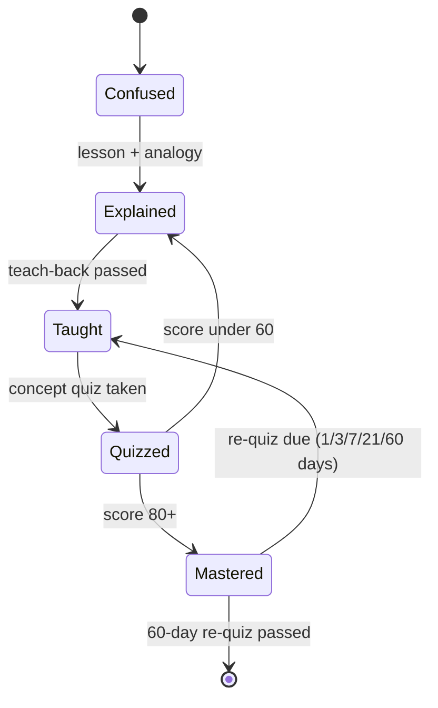

# Chapter 4: Concept Mastery with AI

> **Last Updated:** August 2026 | **Estimated Reading Time:** 60–75 minutes

Knowing a topic's name is not the same as mastering the concept behind it. This chapter is a toolkit of AI-driven drills that push a concept from "I have heard of it" to "I can teach it cold in an interview." Each tool targets one weakness: shallow definitions, hidden misconceptions, missing edge cases, and recall that dies under follow-up questions.

## Learning Objectives

- Climb the Feynman ladder: explain any concept at five difficulty levels, quizzed at each rung
- Run a misconception hunt: surface the 7 most common wrong beliefs about a topic and test yourself against them
- Build an analogy factory and repair weak analogies until they aid recall instead of confusing it
- Generate counterexamples and boundary conditions so you know when a concept does not apply
- Use gap analysis, origin stories, debates, and teach-back critique to find holes in your understanding
- Convert concepts to code with a hide-and-recall cycle and a 90-second interview explain drill
- Compare related concepts with a matrix and interleave practice across them
- Track concept mastery with a TypeScript tool that schedules re-quizzes on a 1/3/7/21/60-day rhythm

## Chapter at a Glance

| Topic | Key Insight | Practical Takeaway |
|-------|-------------|--------------------|
| Feynman ladder | Five rungs of explanation, quizzed at each | Start at the rung you can actually climb |
| Misconception hunter | Wrong beliefs, not gaps, cause most failures | Test yourself with true/false traps |
| Analogy factory | Analogies must be rated and repaired | A broken analogy is worse than none |
| Counterexamples and boundaries | Knowing when a concept fails is mastery | Collect edge cases into your cheat sheet |
| Teach-back critique | Explaining is graded against a rubric | Get a score, not a compliment |
| 90-second drill | Interviewers reward structure, not length | Practice the pitch until it is automatic |

## The Concept Mastery Cycle



## Q1: What is the Feynman ladder?

**Answer:** The Feynman ladder is a five-rung explanation drill: ELI5 (a 10-year-old), high school, undergraduate, graduate, and expert peer. Each rung forces a different kind of precision: the ELI5 rung forces analogy, the undergrad rung forces notation, the grad rung forces edge cases and formalism, the expert rung forces current practice. The trick is that the AI quizzes you at each rung, so you cannot fake a rung by skimming the next one. Most people discover they live on rung two and have never attempted rung four; the ladder makes that obvious.

```text
Run me up the Feynman ladder for {CONCEPT, e.g. "attention in
transformer models"}.

Explain {CONCEPT} at 5 rungs:
1. ELI5: to a 10-year-old, one analogy, no jargon.
2. HIGH SCHOOL: to a smart high-schooler, with the mechanism made
   concrete.
3. UNDERGRAD: to a CS/math undergrad, precise and formal.
4. GRAD: to a grad student, including formalism, edge cases, and
   recent developments.
5. EXPERT: what I would say to a peer who works on it daily.

Then QUIZ each rung: 2 questions at that rung's level. I answer, you
grade me per rung. Do not reveal a higher rung until I pass the one
below.
```

**How it works:** The AI writes five explanations in one pass but gates your progression, so each rung is earned. Your quiz scores per rung show exactly which level of understanding you actually have.

**Try This:** Run the ladder on "backpropagation" (or your current weakest interview topic). Expect to score below 50 on rung 4; that score is your study target for the week.

## Q2: How does the misconception hunter work?

**Answer:** The misconception hunter assumes you are not empty-headed but wrongly headed: you hold confident wrong beliefs, and those are what fail you in interviews. The prompt makes the AI list the 7 most common beginner misconceptions about the topic, then test you with true/false traps built from those exact misconceptions. The key design is that the AI tells you, after each answer, whether you fell for it and why, which converts a wrong answer into a permanent correction. Run this on every concept after your first lesson, because misconceptions are cheapest to kill when they are fresh.

```text
List the 7 most common misconceptions about {CONCEPT} that
beginners hold.

For each: the wrong belief (in quotes), the correct version, and the
one question an interviewer asks that exposes the confusion.

Then test me: ask 5 of those misconceptions as true/false trap
questions, one at a time. After each answer, tell me whether I fell
for it, and restate the correct version in one sentence.
```

**How it works:** By seeding questions from real misconceptions, the AI tests the exact places people fail instead of testing what you already know. The after-answer correction turns each trap into a memory fix.

**Try This:** Run it on "TCP vs UDP" or "synchronous vs asynchronous code". Count how many traps you fell for; anything above two means the topic needs a re-lesson, not more reading.

## Q3: How do I build an analogy factory?

**Answer:** The analogy factory generates analogies from a fixed set of everyday domains, then makes you rate them: does it map correctly, and where does it break? Every analogy breaks somewhere, and knowing where it breaks is exactly the precision an interview answer needs. The factory closes with a recall test: explain the concept using your best analogy from memory. If you can do that, the analogy is load-bearing; if not, it was decoration.

```text
Generate 5 analogies for {CONCEPT}. Draw from: cooking, banking,
post office, gym, city traffic, video games, plumbing, marriage.

For each: the analogy, what it maps correctly, and where it breaks.

Then ask me to explain {CONCEPT} from memory using my favorite
analogy. Grade my attempt: did I get the mapping right, and did I
avoid the places where it breaks?
```

**How it works:** The AI produces the raw material and you do the selection work, which is where learning happens. The grade at the end verifies the analogy actually supports recall instead of just sounding clever.

**Try This:** Build analogies for "caching" (try the post office and the kitchen). Rate each 1-10 on recall power, keep the best, and use it in your next mock answer about cache invalidation.

## Q4: What is the counterexample generator?

**Answer:** The counterexample generator finds where a concept does not apply: situations where it fails, where beginners over-apply it, and edge cases that break the standard explanation. Knowing the failure domain is what separates "knows the definition" from "understands the concept", and interviewers probe it with follow-ups like "and when would you not use this?". The prompt forces the AI to give, for every case, the setup, the tempting wrong reasoning, what actually happens, and why. Paste the results into your cheat sheet; counterexamples are gold there.

```text
For {CONCEPT}, generate counterexamples:
1. When does this concept NOT apply? (5 cases)
2. Where do beginners over-apply it? (3 cases, each with wrong and
   right reasoning)
3. Edge cases where the standard explanation breaks (3 cases)

For each: the situation, what most people assume, what actually
happens, and why.
```

**How it works:** The prompt converts "when does X work?" into "when does X fail?", which produces sharper learning because failures are concrete and memorable. The beginner-over-apply cases train you to check assumptions automatically.

**Try This:** Run it on "eventual consistency" or "SQL indexes". Then write the top 3 failure cases onto a card and review it before your system design mock.

## Q5: What is the "what am I missing?" gap analyzer?

**Answer:** The gap analyzer takes everything you believe you know and hunts for holes: terms you use without being able to define, claims without examples, missing connections to related concepts, and the interview question that would expose each hole. You paste your own summary, so the analysis is personal rather than generic. The output is prioritized: the AI fixes the top 3 holes with short lessons, because trying to fix all holes at once is how plans die. Run this weekly on one concept and your notes file grows into an honest map of your knowledge.

```text
Here is everything I know about {CONCEPT}: {paste your summary,
notes, or a spoken-brain-dump transcription}

Find the holes:
1. Terms I use without being able to define them precisely.
2. Claims I make without evidence or examples.
3. Connections to related concepts I never mention.
4. The most likely interview question that would expose each hole.

Then fix the top 3 holes: teach me each one in 5 sentences.
```

**How it works:** By analyzing your own words, the AI finds your personal gaps instead of generic ones, and the interview-question mapping shows you the consequence of each hole. The 5-sentence fixes are small enough to absorb immediately.

**Try This:** Paste your written explanation of "how DNS works" (or your weakest module). Note which terms you used without defining them; those are your next flashcards.

## Q6: How do I go from concept to code?

**Answer:** Concept-to-code is a three-phase drill: the AI shows a minimal correct implementation with clearly named mechanism variables, then a subtle wrong version for you to debug, then hides the implementation entirely and makes you write it from memory against only the signature. The hide-and-recall phase is where the concept actually lands, because reproducing code from a signature forces you to remember the mechanism, not recognize it. This drill is the bridge between "I can explain it" and "I can build it", which is the 80-89 mastery band from Chapter 3.

```text
Show {CONCEPT} inside runnable code. Use {LANGUAGE, e.g.
"TypeScript"}.

Phase 1: a minimal correct implementation (20-30 lines) with the
concept's mechanism in clearly named variables.
Phase 2: the same concept done WRONG in a subtle way. I will find
the bug; tell me if I am right.
Phase 3: HIDE the implementation. Give me the signature and a one-
line description. I write the body from memory; grade me.
```

**How it works:** Each phase removes one crutch: phase 1 shows, phase 2 tests detection, phase 3 tests production. Grading phase 3 tells you if the concept is truly in your head.

**Try This:** Run it on "a rate limiter" or "LRU cache" in TypeScript. Do all three phases in one sitting; if phase 3 takes more than 15 minutes, schedule a re-run in 3 days.

## Q7: Why does the origin story matter?

**Answer:** The origin story answers the question every interview follow-up eventually reaches: what real problem existed, who solved it, when, and what it replaced. Origin stories anchor a concept in time and purpose, which makes it dramatically easier to recall under pressure because you can reconstruct the concept from the problem. They also give you the "why was this invented" line that interviewers love because it proves you think in problems, not definitions. The prompt has the AI answer its own follow-up questions first, so you have a model answer to compare against.

```text
Tell me the origin story of {CONCEPT}: what real problem existed,
who invented it, what year, what the first version looked like, and
what it replaced.

Then write 3 questions I should be able to answer after hearing the
story, and answer them yourself so I can compare.

End with: one sentence on why the origin story matters in
interviews.
```

**How it works:** Anchoring the concept to a problem, person, and date gives your memory hooks that definitions alone cannot provide. The self-answered questions give you a calibrated model to grade yourself against.

**Try This:** Get the origin stories of "Kafka" (log-centric thinking at LinkedIn), "REST" (Fielding's thesis), and "attention" (Bahdanau 2014). Tell each story aloud once; then notice how much easier recall questions feel.

## Q8: How do I map boundary conditions?

**Answer:** Boundary-condition mapping lists the hidden assumptions a concept makes about data, environment, and users, then describes what breaks when each assumption fails. This is the skill behind answers like "it works, assuming the data fits in memory" and "it breaks under partition". The AI produces a scenario where each assumption actually failed, which turns abstract boundaries into stories. Interviewers test boundary awareness with two-question patterns: first "how does X work?", then "what happens if Y is huge?".

```text
List the hidden assumptions behind {CONCEPT}:
1. Assumptions about the data (size, distribution, noise).
2. Assumptions about the environment (resources, latency, failure).
3. Assumptions about the user (behavior, scale).

For each: what breaks when it fails, and one real scenario where it
did fail. End with 2 interview questions that test assumption-
awareness, with model answers.
```

**How it works:** The three-assumption structure forces you past the happy path into failure thinking, and the real-scenario requirement makes boundaries memorable. The interview questions at the end directly rehearse the two-question pattern interviewers use.

**Try This:** Map boundary conditions for "consistent hashing" and "database transactions". Memorize the two failure scenarios; reuse them in system design answers.

## Q9: What is the debate prompt?

**Answer:** The debate prompt argues for and against a design choice or concept, then renders a verdict with the signals that decide it. This is the single best preparation for design and tradeoff questions, because interviewers grade your ability to hold two sides of an argument, not just your preferred side. The three-round shape (for, against, verdict) forces the AI to be genuinely adversarial rather than agreeable. The final round, where the AI quizzes you on the debate, checks whether you absorbed both sides or just the verdict.

```text
Debate {DESIGN_CHOICE, e.g. "using Kafka instead of RabbitMQ for
order processing"}.

Round 1: argue FOR, your strongest 4 points.
Round 2: argue AGAINST, your strongest 4 points.
Round 3: verdict - when is it right, when is it wrong, and what
signals decide it?

Then ask me 3 follow-up questions and grade my answers against the
debate.
```

**How it works:** The adversarial structure produces the tradeoff language interviewers expect, and the verdict rounds forces decision criteria into explicit form. The follow-up quiz ensures you can reproduce the reasoning, not just the conclusion.

**Try This:** Debate "using a vector database vs PostgreSQL with pgvector" for a RAG app. Write the 4 signals from the verdict onto your system design cheat sheet.

## Q10: How does teach-back critique work?

**Answer:** Teach-back critique is simple in setup and brutal in effect: you explain the concept in your own words, and the AI grades you against a five-dimension rubric (accuracy, completeness, example quality, structure, interview-readiness) out of 50. The output includes your two weakest dimensions with specific fixes and a model 90-second version you can compare against. This is the difference between "the AI said my explanation was good" and knowing why. Do it once per concept, then again after a week; the score delta is your true progress.

```text
I will explain {CONCEPT} in my own words. Grade me on this rubric:
- Accuracy (0-10): no factual errors
- Completeness (0-10): key mechanism included
- Example quality (0-10): example clarifies, does not confuse
- Structure (0-10): tells a story, not a list
- Interview-readiness (0-10): would an interviewer be satisfied in
  90 seconds?

MY EXPLANATION: {paste your explanation}

Give me a total /50, my 2 weakest dimensions with specific fixes,
and a model 90-second version.
```

**How it works:** The rubric converts a vague feeling ("I explained it okay") into five measurable dimensions, and the weakest-two rule focuses your next attempt. The model version is your calibration point.

**Try This:** Explain "how a hash map works" in writing, then grade yourself. Re-explain after 3 days without looking; compare the two totals to measure real growth.

## Q11: How do I build a concept comparison matrix?

**Answer:** The comparison matrix takes two concepts and forces the AI to differentiate them row by row: purpose, mechanism, inputs/outputs, failure modes, complexity, ecosystem, and when to use each. Then it quizzes you with scenarios where you must pick the right tool and justify it. This drill trains exactly what system design and "X vs Y" interview questions test. The scenario quiz is the important half, because the matrix alone is a fact table while the scenarios make you apply it.

```text
Build a comparison matrix: {CONCEPT_A} vs {CONCEPT_B}.

Rows: purpose, mechanism, inputs/outputs, failure modes, complexity,
ecosystem, when to use A, when to use B, when to use neither.

Then quiz me: 4 scenarios, I pick the right one and justify in 2
sentences. Grade me.
```

**How it works:** The row structure guarantees the comparison covers decision-relevant dimensions, not just definitions. The scenario quiz converts the matrix from reference material into decision skill.

**Try This:** Build matrices for "REST vs GraphQL" and "Redis vs a database for caching". Run the scenario quiz for each; a score under 6/8 means the distinction is not yours yet.

## Q12: How do I internalize a concept for interviews?

**Answer:** The 90-second drill is timed explanation practice: the AI gives you a random interview question, you answer in writing within 90 seconds, and the AI grades structure, accuracy, and depth against a model answer. Repeating it three times with different questions builds the automaticity interviewers read as fluency. The key is the time box: long answers read as rambling, and 90 seconds forces you to choose the three points that matter. This is the final stage of the mastery cycle from the diagram at the top of the chapter.

```text
Interview drill on {CONCEPT}.

Give me a random interview question about it. I answer in writing,
max 90 seconds. Then grade me: structure, accuracy, depth, and show
a model answer. Repeat 3 times with different questions. Track my
scores across the three rounds.
```

**How it works:** Random questions plus a hard time limit train retrieval under the same conditions as a real interview. The three-round repetition shows improvement in a single sitting.

**Try This:** Drill "explain database indexes" in 90 seconds for three rounds. Then do the same question in a voice note on your commute; spoken practice exposes filler words that written answers hide.

## Q13: How do I schedule re-quizzes so concepts stay mastered?

**Answer:** Re-quiz scheduling uses a 1/3/7/21/60-day spaced rhythm: first re-quiz the next day, then after 3, 7, 21, and 60 days, with advancement rules (score 5/6 or above to advance, otherwise repeat in 2 days). This is the retention engine behind the mastery state diagram: Mastered loops back to Taught whenever a re-quiz comes due, and only the 60-day pass graduates you. The AI builds the schedule as a table you can put in your calendar, so the loop runs itself. Concepts you never re-quiz are concepts you will re-learn.

```text
I am learning {CONCEPT}. Build me a re-quiz schedule using spaced
repetition:
- 1st re-quiz: next day
- 2nd: after 3 days
- 3rd: after 7 days
- 4th: after 21 days
- 5th: after 60 days

For each re-quiz: 3 questions graded 0-2. Score 5/6 or above to
advance; below that, repeat in 2 days. Output as a table: date |
quiz | questions | pass rule | next action.
```

**How it works:** The escalating intervals match the forgetting curve, so each re-quiz arrives just before you would forget. The pass rule makes advancement data-driven instead of aspirational.

**Try This:** Set up re-quiz schedules for your three weakest concepts from Chapter 3's mastery scoring. Put the five dates per concept into your calendar right now; future-you will thank you.

## Q14: How do I generate flashcards from a concept?

**Answer:** Flashcard generation compresses a concept into 12 cards across three types: definition cards, mechanism cards, and trap cards built from common wrong answers. The trap cards are the unique value: a card that asks "what is the common wrong answer for X?" makes your errors retrievable instead of hidden. The 20-word limit keeps cards import-friendly for spaced-repetition apps. Generate them from your review sheets so the vocabulary matches your notes.

```text
Generate flashcards for {CONCEPT}: 12 cards total.
- 4 definition cards: term -> one-line definition.
- 4 mechanism cards: "how does X work?" -> the mechanism.
- 4 trap cards: common wrong answer -> correct version.

Format each card exactly as:
FRONT: ...
BACK: ...
Keep every card under 20 words.
```

**How it works:** The three card types cover recall, mechanism, and error correction, which is the full failure surface of a concept. The format constraint makes them usable in any flashcard app.

**Try This:** Generate cards for "consistency levels" or "event loop". Import them into your app, and add the trap cards from Q2's misconception hunt to the same deck.

## Q15: How do I build a one-page knowledge map?

**Answer:** The knowledge map centers one concept and lists its 6-8 related concepts with one-line links and dependency arrows, marking the 2 nodes you must master first. The AI outputs it as an indented tree you can draw by hand, because drawing is the point: hand-drawing the map once lodges the topology in memory. The map's real use is exam triage: when you get stuck mid-interview, walking the map from the center outward recovers the answer. It is the visual complement to the gap analyzer from Q5.

```text
Build a one-page knowledge map for {CONCEPT}:
1. CENTER: the concept.
2. 6-8 related concepts as satellite nodes, each with a one-line
   link to the center.
3. Arrows showing dependency direction.
4. Mark the 2 nodes I must master before the center makes sense.

Output as an indented tree I can draw by hand:
Concept
  - depends on: X, Y
  - related to: A (one-line link), B (one-line link)
```

**How it works:** The tree structure forces explicit links and dependencies, and hand-drawing converts the AI's text into your spatial memory. The marked prerequisite nodes tell you what to fix first when the concept feels fuzzy.

**Try This:** Build and hand-draw the map for "Distributed transactions" or "RAG". Then test the recovery technique: cover the map, redraw it from memory, and compare.

## Q16: How do I get multi-perspective explanations?

**Answer:** Multi-perspective explanation asks the AI to explain the concept as a physicist, an economist, a chef, and a police officer would, each using that domain's vocabulary in 3-4 sentences. Different domains expose different facets: the economist brings tradeoffs, the chef brings processes and failure handling, the police officer brings constraints and judgment. The prompt ends by asking which perspective produces the most memorable mental model, which gives you a ready-made hook. This drill is most valuable for concepts that felt abstract after the first lesson.

```text
Explain {CONCEPT} from 4 perspectives, 3-4 sentences each, using
that domain's vocabulary:
- a physicist (energy, conservation, state)
- an economist (tradeoffs, incentives, costs)
- a chef (process, ingredients, failure handling)
- a police officer (constraints, judgment, escalation)

Then tell me which perspective creates the most memorable mental
model for this concept and why.
```

**How it works:** Forcing domain vocabulary exposes facets a single explanation style misses, and the closing recommendation hands you a mnemonic to keep. The concept gets connected to multiple memory networks at once.

**Try This:** Run it on "rate limiting" or "idempotency". Take the winning perspective and use it in your next mock answer.

## Q17: What is key-numbers anchoring?

**Answer:** Key-numbers anchoring extracts the numbers that define a concept: constants, thresholds, defaults, and benchmarks, each with units and a one-line meaning. Interviewers probe numbers because they separate real experience from memorized theory, and anchoring them early means you drop them naturally into answers instead of guessing. The prompt then quizzes you in reverse: AI gives the meaning, you recall the number. Numbers without meaning are trivia, which is why every entry must carry its one-liner.

```text
List the 7 numbers that define {CONCEPT} (constants, thresholds,
defaults, benchmarks) - with units and the one-line meaning of
each.

Then quiz me in reverse: you give the meaning, I recall the number.
Grade me and flag the numbers I should drill this week.
```

**How it works:** The extraction pass builds the list from the AI's knowledge of the concept, and the reverse quiz trains recall in the direction interviews actually ask. The flag list focuses your drill on the numbers you keep missing.

**Try This:** Anchor numbers for "TCP" (ports, MSS, TIME_WAIT, window size) and "Kafka" (replication factor, retention, acks). Drill the flagged ones for 5 minutes daily this week.

## Q18: What is the anti-example gallery?

**Answer:** The anti-example gallery builds fake positive examples: situations that look like the concept but are not, each with the tell-tale detail that reveals the impostor and the corrected version. This is the sharpest version of counterexample training because it mimics exactly how interview trick questions are written. The gallery works on pattern recognition: once you have seen five near-misses, genuine instances feel unmistakable. Keep the gallery in your review sheets and re-read it before mocks.

```text
Build an anti-example gallery for {CONCEPT}: 5 situations that
LOOK like the concept but are not (fake positive examples).

For each: the setup, why it is tempting, the tell-tale detail that
shows it is NOT the concept, and the corrected version.
```

**How it works:** Near-miss examples train discrimination, which is what interviews test when they ask "is this actually X?". The tell-tale detail column gives you a quick-check list for real situations.

**Try This:** Build galleries for "idempotency" and "exactly-once semantics". Then write the 5 tell-tale details on one card and use it to double-check your next mock answers.

## Q19: How do I interleave practice across related concepts?

**Answer:** Interleaving mixes practice problems across related concepts so you must choose the right tool instead of knowing which chapter a problem came from. The prompt generates 8 mixed problems, and after each solution the AI reveals which concept it actually used and why the problem was misleading. This is the highest-value practice mode for interviews, where question topics are deliberately shuffled. Interleave once a week per family of concepts (algorithms, system design patterns, HTTP semantics) and your selection speed becomes the differentiator.

```text
I know {CONCEPTS, e.g. "BFS, DFS, Dijkstra, A*"}. Create an
interleaved practice set: 8 problems mixing them randomly.

After I solve each: tell me which concept it actually used, why it
was designed to be misleading, and the one signal that should have
pointed me there.
```

**How it works:** Random mixing removes the chapter-title hint that makes single-topic practice unrealistic. The post-solution reveal turns each misclassification into a discrimination lesson.

**Try This:** Interleave "REST vs GraphQL vs gRPC" with 8 API-design scenarios, or "DFS vs BFS vs Dijkstra" with 8 graph problems. Track which misclassifications repeat; those are your real gaps.

## Q20: How do I track concept mastery with a TypeScript tool?

**Answer:** The TypeScript concept mastery tracker formalizes the state machine from this chapter's diagram: each concept lives at one rung (confused, explained, taught, quizzed, mastered), carries a self-score, and accumulates quiz scores that determine its next re-quiz date. You rate yourself and record quiz results; the tool promotes or demotes rungs and lists which concepts are due for re-quizzing today. It runs on the 1/3/7/21/60-day rhythm from Q13, so your re-quiz schedule is enforced by data, not memory.

```typescript
type Rung = 'confused' | 'explained' | 'taught' | 'quizzed' | 'mastered'

interface ConceptEntry {
  name: string
  rung: Rung
  selfScore: number
  quizScores: number[]
  nextRequiz: string
  attempts: number
}

const INTERVALS_DAYS = [1, 3, 7, 21, 60]

class ConceptMasteryTracker {
  private concepts = new Map<string, ConceptEntry>()

  add(name: string, rung: Rung = 'confused'): void {
    if (this.concepts.has(name)) return
    this.concepts.set(name, {
      name, rung, selfScore: 0, quizScores: [], nextRequiz: '', attempts: 0,
    })
  }

  rateSelf(name: string, score: number): Rung {
    const entry = this.concepts.get(name)
    if (!entry) throw new Error(`Unknown concept: ${name}`)
    entry.selfScore = Math.max(0, Math.min(100, score))
    if (entry.selfScore >= 90 && entry.rung === 'explained') entry.rung = 'taught'
    return entry.rung
  }

  recordQuiz(name: string, score: number, today: Date): Rung {
    const entry = this.concepts.get(name)
    if (!entry) throw new Error(`Unknown concept: ${name}`)
    entry.quizScores.push(score)
    entry.attempts++
    if (score >= 80) {
      entry.rung = 'mastered'
      const interval = INTERVALS_DAYS[Math.min(entry.attempts - 1, INTERVALS_DAYS.length - 1)]
      const due = new Date(today)
      due.setDate(due.getDate() + interval)
      entry.nextRequiz = due.toISOString().slice(0, 10)
    } else if (score < 60) {
      entry.rung = 'explained'
      const due = new Date(today)
      due.setDate(due.getDate() + 2)
      entry.nextRequiz = due.toISOString().slice(0, 10)
    }
    return entry.rung
  }

  dueOn(date: string): string[] {
    const due: string[] = []
    this.concepts.forEach((c) => {
      if (c.nextRequiz && c.nextRequiz <= date) due.push(c.name)
    })
    return due
  }

  stats(): void {
    console.log('Concept | Rung | Self | Quizzes | Next re-quiz')
    this.concepts.forEach((c) => {
      const last = c.quizScores[c.quizScores.length - 1] ?? '-'
      console.log(`${c.name} | ${c.rung} | ${c.selfScore} | ${last} | ${c.nextRequiz || 'never'}`)
    })
  }
}

const tracker = new ConceptMasteryTracker()
const today = new Date()
tracker.add('consumer groups', 'explained')
tracker.rateSelf('consumer groups', 65)
tracker.recordQuiz('consumer groups', 85, today)
tracker.recordQuiz('consumer groups', 75, today)
tracker.stats()
console.log(`Due today: ${tracker.dueOn(today.toISOString().slice(0, 10)).join(', ') || 'nothing'}`)
```

**How it works:** Every quiz updates the rung and computes the next re-quiz date from the spaced intervals, so the mastery cycle runs itself between study sessions. Run it with `npx ts-node tracker.ts` and check `dueOn(today)` every morning.

**Try This:** Enter your three weakest concepts from this week, record one quiz each, and run the tool. Tomorrow and in 3 days, run `dueOn` before your standup and study only what is due.

## Summary

- The Feynman ladder explains a concept at five levels, quizzed at each rung, so you discover your true depth instantly.
- The misconception hunter surfaces the 7 wrong beliefs beginners hold and tests you with true/false traps built from them.
- Analogies must be rated and repaired; the analogy factory grades whether your favorite analogy actually supports recall.
- Counterexamples, boundary conditions, and anti-example galleries train the failure domain that interviews probe.
- Teach-back critique scores your own explanation against a 5-dimension rubric, not a compliment.
- Concept-to-code, origin stories, debates, and comparison matrices build mechanism-level, decision-level understanding.
- The 90-second drill and interleaved practice train retrieval under interview conditions.
- A TypeScript mastery tracker schedules re-quizzes on the 1/3/7/21/60-day rhythm so mastery is enforced by data.

## Practical Takeaways

| Technique | Prompt / Command | When to Use |
|-----------|------------------|-------------|
| Feynman ladder | "Run me up the Feynman ladder for {CONCEPT}" | First contact with any concept |
| Misconception hunt | "List the 7 most common misconceptions about {CONCEPT}" | Right after the first lesson |
| Analogy factory | "Generate 5 analogies for {CONCEPT}, then grade my recall" | When a concept feels abstract |
| Counterexamples | "When does {CONCEPT} NOT apply? 5 cases + edge cases" | Before moving to the next concept |
| Teach-back critique | "Grade my explanation against this 5-dimension rubric" | After you can explain it at all |
| 90-second drill | "Give me a random {CONCEPT} question; I answer in 90s" | Final week before mocks |
| Comparison matrix | "Build a comparison matrix: {X} vs {Y}, then quiz me" | When two concepts keep blurring |
| Re-quiz schedule | "Build a 1/3/7/21/60-day re-quiz schedule for {CONCEPT}" | After every concept passes 80 percent |
| Knowledge map | "Build a one-page knowledge map for {CONCEPT}" | When you cannot see the big picture |
| Mastery tracker | `npx ts-node tracker.ts` | Every morning, check what is due |

## Chapter Quiz

1. What does the ELI5 rung of the Feynman ladder force you to produce?
   - A. Formal notation
   - B. An analogy without jargon
   - C. Edge cases
   - D. Recent research
   <details><summary>Answer</summary>B. The ELI5 rung forces an analogy and no jargon; formal notation arrives at the undergrad rung.</details>

2. What does the misconception hunter test you with?
   - A. Open-ended essays
   - B. True/false traps built from common wrong beliefs
   - C. Code debugging
   - D. Speed math
   <details><summary>Answer</summary>B. It converts the 7 common misconceptions into true/false trap questions and corrects you after each answer.</details>

3. Why must analogies be repaired?
   - A. AI analogies are always wrong
   - B. Every analogy breaks somewhere, and knowing where is precision
   - C. Interviewers forbid analogies
   - D. Repaired analogies are shorter
   <details><summary>Answer</summary>B. Every analogy breaks somewhere; knowing exactly where it breaks is the interview-grade precision.</details>

4. What does the counterexample generator teach you?
   - A. Where a concept does not apply
   - B. How to write faster code
   - C. The history of the concept
   - D. How to generate flashcards
   <details><summary>Answer</summary>A. It surfaces failure cases, over-application traps, and edge cases, i.e., the failure domain.</details>

5. In teach-back critique, which dimensions are flagged for fixing?
   - A. The two highest-scoring dimensions
   - B. The two weakest dimensions
   - C. All dimensions
   - D. Only accuracy
   <details><summary>Answer</summary>B. The weakest two dimensions get specific fixes, so your next attempt targets real weaknesses.</details>

6. What is the purpose of the 90-second drill?
   - A. Longer answers
   - B. Automatic, structured retrieval under time pressure
   - C. More reading
   - D. Memorizing numbers
   <details><summary>Answer</summary>B. The time box forces you to choose the three points that matter, building interview fluency.</details>

7. In the concept mastery state diagram, what happens when a quiz score is under 60?
   - A. The concept becomes mastered
   - B. It moves back to Explained
   - C. It is archived
   - D. Nothing changes
   <details><summary>Answer</summary>B. A score under 60 demotes the concept to Explained, and the next re-quiz is scheduled in 2 days.</details>

8. What are the spaced re-quiz intervals from Q13?
   - A. 1, 3, 7, 21, 60 days
   - B. 1, 2, 4, 8, 16 days
   - C. 7, 14, 21, 28, 35 days
   - D. Daily for 30 days
   <details><summary>Answer</summary>A. The rhythm is 1/3/7/21/60 days, matching the forgetting curve.</details>

9. What is the tell-tale detail in an anti-example gallery?
   - A. The setup of the story
   - B. The detail that shows the situation is NOT the concept
   - C. The corrected version
   - D. The unit of a number
   <details><summary>Answer</summary>B. The tell-tale detail reveals the impostor, giving you a quick-check list for real situations.</details>

10. In the TypeScript mastery tracker, what does `recordQuiz` do when the score is 85?
    - A. Demotes to confused
    - B. Promotes to mastered and schedules the next interval
    - C. Deletes the concept
    - D. Does nothing
    <details><summary>Answer</summary>B. Scores at or above 80 promote the concept to mastered and schedule the next spaced re-quiz.</details>

## Exercises

1. Run the Feynman ladder on "attention" and record your score per rung. Then run the misconception hunter on the same concept; the trap questions you miss are your study list for the week.
2. Explain "how a database index works" in your own words, paste it into the teach-back critique, and re-explain after 3 days. Track both totals.
3. Build an analogy factory for "eventual consistency", rate the five analogies, and use the best one in a 90-second drill answer.
4. Generate a comparison matrix for "REST vs GraphQL", run the 4-scenario quiz, and paste any wrong scenario picks into your cheat sheet as anti-examples.
5. Set up 1/3/7/21/60-day re-quiz schedules for your three weakest concepts and add the dates to your calendar.
6. Run the TypeScript tracker with five concepts, record quizzes for each, and print `dueOn(today)` for the next 10 days to verify the schedule.

## Further Reading

- [Feynman Technique — Wikipedia's overview of explanation as a learning test](https://en.wikipedia.org/wiki/Feynman_technique)
- [The Feynman Technique — Farnam Street's practical guide to simple-language explanations](https://fs.blog/feynman-technique/)
- [Spaced Repetition — Wikipedia's research overview behind the 1/3/7/21/60 rhythm](https://en.wikipedia.org/wiki/Spaced_repetition)
- [Active Recall — the retrieval practice evidence base for the quizzes in this chapter](https://en.wikipedia.org/wiki/Active_recall)
- [Attention Is All You Need (arXiv 1706.03762) — the paper behind the worked Feynman-ladder example](https://arxiv.org/abs/1706.03762)