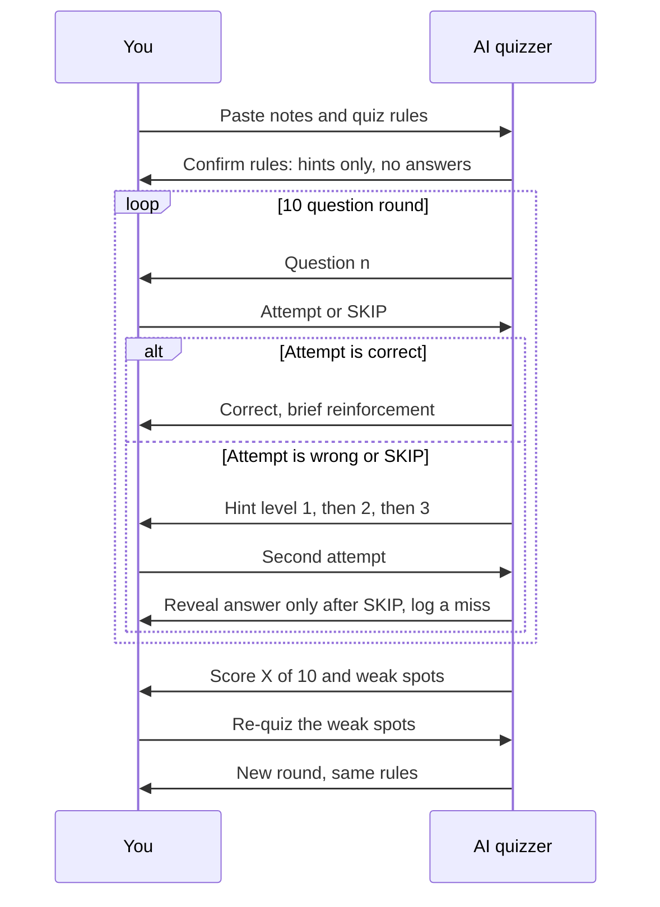
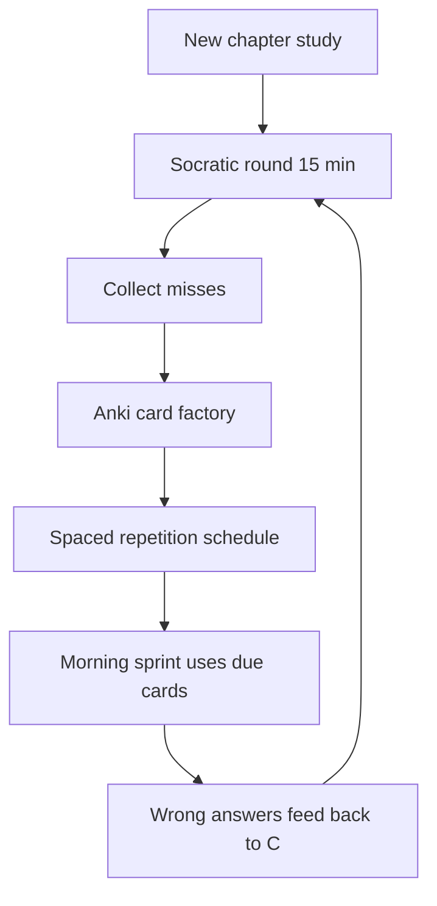

# Chapter 5: Active Recall & Quiz Prompts

> **Last Updated:** August 2026 | **Estimated Reading Time:** 60–75 minutes

Reading notes feels productive but stores very little in long-term memory. The science-backed alternative is active recall: forcing your brain to pull facts out before checking them, which is exactly what placement interviews do to you. This chapter gives you a complete kit of copy-paste prompts that turn ChatGPT, Claude, or Gemini into a personal quiz engine: a Socratic quizzer, an Anki card factory, an exam question generator, and a spaced-repetition scheduler.

> **How to work this chapter** — 15–20 minutes of overhead on top of reading:
>
> 1. **Read** — 60–75 minutes, split across 2–3 commute blocks.
> 2. **Do** — run every **Try This** as you go; the chapter's power is in the prompts you actually execute.
> 3. **Prove** — score 8/10 or better on the Chapter Quiz before moving on.
> 4. **Produce** — 50 Anki cards (CSV) generated from one chapter you have already read, plus one generated exam you actually sat.
>
> **Prerequisites:** Chapter 2. **Next:** Chapter 6.

## Learning Objectives

- Run a Socratic quizzer that gives hints only and never full answers
- Convert any chapter of notes into Anki-ready cards using a prompt plus a TypeScript CSV generator
- Generate five exam question types (MCQ, True/False, Fill-in-the-blank, Scenario, Output) at any difficulty
- Climb a difficulty ladder and track your correct rate per rung
- Force interleaving so AI mixes three topics in a single quiz
- Schedule spaced repetition with again/hard/good/easy ratings
- Convert your own notes into fill-in-the-blank drills
- Feed your wrong answers back into targeted re-quizzes
- Run a 15-minute recall sprint during the morning commute
- Apply the recall-before-check protocol before you ever open your notes

## Chapter at a Glance

| Topic | Key Insight | Practical Takeaway |
|---|---|---|
| Socratic quizzer | AI asks one question at a time and gives hints, never answers | Master prompt in Q1; use for every subject |
| Anki card factory | Notes become front/back and cloze cards automatically | Prompt in Q4 plus TypeScript CSV generator in Q5 |
| Exam question generator | Five question types, three difficulty levels from one prompt | One prompt, instant mock test in Q7-Q8 |
| Difficulty ladder | Start easy, climb rungs, stay where accuracy is below 70% | Ladder prompt in Q9, tracking log in Q10 |
| Interleaving | Mix three topics so retrieval keeps switching | Interleave prompt in Q11-Q12 |
| Spaced repetition | Rate every card again/hard/good/easy, AI schedules the next quiz | Scheduler prompt in Q13-Q14 |

## The Socratic quiz loop



## Q1: What is the Socratic quizzer and why is it the highest-ROI prompt in this course?

**Answer:** Passive reading gives maybe 10-20% retention, while retrieval practice roughly doubles long-term recall because every attempt to answer strengthens the memory trace. The Socratic quizzer makes the AI act as an examiner who asks one question at a time, gives escalating hints when you are stuck, and never reveals the full answer unless you explicitly type SKIP. This mirrors how placement interviews behave: an interviewer will never hand you the answer, they will nudge you with hints and judge how you recover. Used daily, it converts dead study time into measurable improvement, and it works for theory, coding, and behavioral prep alike.

```
You are my Socratic quizzer for placement preparation.

Topic: {topic}
Source material: {paste your notes or chapter text}
Level: {beginner | intermediate | placement}
Questions per round: 10

Rules:
1. Ask ONE question at a time. Never dump all questions at once.
2. If I answer correctly, say Correct and move on in one line.
3. If I am wrong or stuck, give a hint level 1 (a nudge, an analogy, or a sub-question).
   Level 2 is a stronger nudge with a partial outline.
   Level 3 is a yes-or-no probe. NEVER give the full answer unless I type SKIP.
4. On SKIP, reveal the answer, explain it in 2 sentences, and log it as a miss.
5. Every 5 questions, ask me my confidence from 1 to 5.
6. At the end give: score X of 10, the list of misses, and 3 follow-up questions for the next round.

Begin with question 1. Do not introduce yourself.
```

**How it works:** The rules block constrains the AI's behavior: one question per reply keeps focus, hint levels create a graded difficulty ramp, and the SKIP rule guarantees you do the retrieval work before any answer appears.

**Try This:** Copy the prompt, paste your hardest subject's chapter notes into {source material}, and run the full 10-question round without skipping a single question.

## Q2: How do I feed the AI my study material without pasting a wall of text?

**Answer:** You can paste a full chapter, but the AI reads better when you label the paste and set a contract first. The trick is to separate the "reading" phase from the "quizzing" phase: the AI ingests silently, confirms it understood, and only then starts asking. This prevents the AI from summarizing everything back at you (which is passive reading again) and keeps the session focused on retrieval.

```
Here is the material I just studied. Read it silently and do NOT summarize it back to me.
Material:
{paste your notes or chapter text}

Confirm understanding with: Ready.
Then quiz me on it, one question at a time, using these rules:
1. Hints only, never full answers, unless I type SKIP.
2. Ask me to type READY again before you reveal question 1.
```

**How it works:** The explicit instruction "do NOT summarize" blocks the AI's default urge to recap, and the READY gate puts you in control of when the quiz starts so you can mentally prepare.

**Try This:** Take one lecture's worth of notes on {a topic you studied this week}, run the Q1 prompt with this Q2 injection pattern, and compare how much you remember versus how much you thought you knew.

## Q3: What do I do when the AI breaks the rules and hands me the answer?

**Answer:** Model misbehavior is normal: newer models default to being helpful and will blurt out answers. You must correct the behavior immediately, in the same conversation, so the AI learns your session's contract. If it happens twice, start a fresh conversation and paste the rules again, because long conversations dilute instruction-following. Do not silently accept the answer and move on; the moment you accept it, the quiz stops being retrieval practice.

```
You: What is a deadlock?
AI: A deadlock is a situation where two or more processes are each holding a resource
     and waiting for the other to release one, so none can proceed...
You: STOP. We agreed: hints only, no full answers. You gave me the answer.
     From now on, if I am wrong, ask me a hint-level-1 question instead.
     Redo the question from scratch.
AI: You are right, I broke the rules. Let me redo that.
     Hint: what happens when process A holds resource 1 and waits for resource 2,
     while process B holds resource 2 and waits for resource 1? Try again.
You: Both wait forever, so neither completes.
AI: Correct, that is the circular wait. Good recovery.
```

**How it works:** The correction names the broken rule, states the new expectation, and demands a redo; this is exactly how you would handle a junior colleague who jumped to the answer in a code review.

**Try This:** Next time the AI slips, use this exact exchange pattern, then note whether it stayed disciplined for the rest of the round; record the result in your session log.

## Q4: How do I build an Anki card factory with AI?

**Answer:** Anki is a free spaced-repetition flashcard app that runs on desktop and mobile, so it works offline on your commute. The AI card factory converts any chunk of notes into well-formed cards: basic front/back cards, cloze deletion cards, and tags. The quality rules matter more than the prompt itself: one idea per card, answerable in under 20 seconds, and a bias toward WHY and HOW questions, because those are what interviewers ask.

```
Convert the notes below into Anki-ready cards.
Notes:
{paste your notes or chapter text}

Format for every card:
- front: {the question}
- back: {the answer, one or two lines}
- type: basic | cloze
- tags: {tag1} {tag2}

Rules:
1. One idea per card. Split compound ideas into separate cards.
2. Every question must be answerable from memory in under 20 seconds.
3. Make 25% of cards cloze type using this notation: {{c1::answer}}.
4. Prefer WHY and HOW questions over WHAT questions.
5. Skip trivia. Keep only facts a placement interviewer would ask.
6. Output a numbered list. No commentary before or after.
```

**How it works:** The format section fixes the card schema, the one-idea rule prevents bloated cards that are impossible to retrieve, and the cloze quota forces variety between recognition and recall questions.

**Try This:** Run this prompt on one chapter of {your current subject}, then pick the 5 weakest cards and rewrite them so they pass the 20-second rule.

## Q5: How do I get the cards as an Anki-importable CSV?

**Answer:** Anki imports plain text files with a specific header format, and the fastest path is a tiny TypeScript generator: you keep {question, answer} pairs as data, and it emits a CSV with the deck name, tab separators, and HTML line breaks. You can save the output to a .txt file and import it in Anki desktop under File, Import. This also means you can rebuild your whole deck from a chapter in seconds and keep the generator in your learning-playground repo.

```typescript
interface Card {
  front: string;
  back: string;
  tag?: string;
}

function buildAnkiCsv(cards: Card[], deck: string): string {
  const header =
    "#separator:tab\n#html:false\n#deck:" + deck + "\nfront\tback\ttags";
  const rows: string[] = [];
  for (const c of cards) {
    const tag = c.tag === undefined ? "default" : c.tag;
    const front = c.front.replace(/\t/g, " ").replace(/\n/g, "<br>");
    const back = c.back.replace(/\t/g, " ").replace(/\n/g, "<br>");
    rows.push(front + "\t" + back + "\t" + tag);
  }
  return header + "\n" + rows.join("\n");
}

const deck = "placement-os";
const cards: Card[] = [
  {
    front: "What is a deadlock?",
    back: "Two or more processes each waiting for a resource held by the other.",
    tag: "os",
  },
  {
    front: "What are the four necessary deadlock conditions?",
    back: "Mutual exclusion, hold and wait, no preemption, circular wait.",
    tag: "os",
  },
  {
    front: "What does the banker's algorithm prevent?",
    back: "Deadlock, by simulating resource allocation before granting it.",
    tag: "os",
  },
  {
    front: "What is the difference between deadlock and starvation?",
    back: "Starvation means a process waits forever while resources go to others.",
    tag: "os",
  },
];

const csv = buildAnkiCsv(cards, deck);
console.log(csv);
```

**How it works:** The header lines tell Anki the file uses tab separators, plain text, and a specific deck, and the column header front/back/tags maps each line to Anki's card fields; the replace calls turn tabs and newlines inside answers into safe characters.

**Try This:** Save the script as anki-cards.ts, run it with npx ts-node anki-cards.ts, redirect the output to os-deck.txt, and import it in Anki; then review the deck on your phone during tomorrow's commute.

## Q6: How do I write cloze cards that are not trivial to guess?

**Answer:** A cloze card blanks out part of a sentence and asks you to fill it, but deleting random words produces guessing games, not learning. The rule is to delete the key term or the key comparison, and keep enough context that you can reconstruct the sentence. Ask the AI for cloze cards only from dense definitional or comparative notes, and give each cloze a basic-card twin so the same fact is tested both ways.

```
Take these notes and make 5 cloze cards.
Notes:
{paste notes with definitions or comparisons}

Rules:
1. Use {{c1::...}} syntax with the key term or key comparison deleted.
2. Never delete random filler words.
3. Each cloze card must test exactly one idea.
4. For every cloze card, also give a basic-card twin:
   front: {the same fact as a question}, back: {the answer}.
5. Tag cloze cards with {topic}-cloze.
```

**How it works:** Deleting the key term forces retrieval of the central idea rather than vocabulary recognition, and the basic twin ensures the fact is also tested in question form, which covers both recall directions.

**Try This:** Take your {networking notes on TCP vs UDP}, generate the 5 cloze cards, and check that you can complete each one in under 10 seconds after one review pass.

## Q7: What is the exam question generator and how do I use it?

**Answer:** The exam generator is one prompt that produces a realistic mock test in five formats: MCQ, True/False, Fill-in-the-blank, Scenario, and Output prediction. Output prediction questions show a short code snippet and ask what it prints, which is a favorite of placement tests. The generator hides the answer key so you must run the exam honestly before revealing it, and you can set difficulty so the same topic can be tested easy, medium, or hard on different days.

```
Act as a placement exam setter.
Topic: {topic}
Difficulty: {easy | medium | hard}

Create exactly 10 questions:
- 2 MCQ with 4 options each, exactly one correct. Do not mark the correct option.
- 2 True/False statements.
- 2 Fill-in-the-blank sentences.
- 2 Scenario questions: real workplace or interview context, 2 sentences each.
- 2 Output prediction questions. Use TypeScript code and ask what it prints.

Rules:
1. No answer key inline. Put answers in a separate Answer key section at the end.
2. One question per numbered line, compact.
3. Difficulty must match {difficulty} strictly.
```

**How it works:** The five-type split covers recognition, judgment, recall, application, and execution, so a single 10-question run exercises multiple memory systems, and the separated answer key makes the test honest.

**Try This:** Generate a hard set on {operating system scheduling}, answer all 10 in writing with a timer set to 15 minutes, then grade yourself against the key and mark each miss as concept gap, recall slip, or careless error.

## Q8: How do I run a five-type exam drill like a real test?

**Answer:** The transcript below shows the full flow: generate, answer without looking, then self-grade. The discipline that makes it work is answering everything before peeking at the key, and using the AI's corrections to classify each error. Treat the drill as a practice round of an actual placement test: no notes, no pausing on easy questions, and a strict timer.

```
You: Generate the exam set. Topic: OS scheduling. Difficulty: hard. Rules as before.
AI: 1. MCQ: Which scheduler can starve a process indefinitely? A) Round robin
      B) Priority with preemption C) FCFS D) Multilevel feedback
     2. True/False: FCFS minimizes average waiting time in all cases.
     3. Fill: In round robin, the time slice is called the ____.
     4. Scenario: A customer app needs 1ms average response for 1000 requests/s.
        Which scheduler family fits? Justify in 2 lines.
     5. Output: let t = 0; for (let i = 0; i < 3; i++) { t += i; }
        console.log(t); what prints?
     ... [Answer key at the end]
You: Q1: B. Q2: False. Q3: quantum. Q4: Round robin with small quantum. Q5: 3.
AI: Q1 correct. Q2 correct. Q3 correct. Q4 correct but your justification is thin:
      mention preemption and bounded waiting. Q5 wrong: the loop sums 0+1+2 = 3,
      so 3 is right actually. Recheck my key: yes, 3. Full score 5/5 on hard.
You: That was suspicious. Regenerate Q5 as a trickier trace with nested loops.
```

**How it works:** The round is structured as generate, answer, grade, and the AI's terse verdicts mirror interview feedback; the final request for a harder trace shows how to escalate after a perfect run.

**Try This:** Run this exact flow for {DBMS transactions} at medium difficulty, enforce a 15-minute timer, and classify every miss into one of the three error types.

## Q9: What is the difficulty ladder and how do I build one for any topic?

**Answer:** A difficulty ladder is a 5-rung progression from recall to derivation: define terms, explain a process step by step, compare concepts, apply to a scenario, and finally design or derive something. The ladder fights the common mistake of practicing only definition-level questions, which never appear in interviews. Have the AI tell you which rung you are on and always start one rung above your estimate so you feel productive but still challenged.

```
Create a difficulty ladder for {topic} with 5 rungs:
Rung 1: define the key terms.
Rung 2: explain how the mechanism works, step by step.
Rung 3: compare and contrast two concepts in the topic.
Rung 4: apply the concept to a given scenario.
Rung 5: derive or design, for example write the pseudo-flow of a solution.

Give me 2 questions per rung with answers hidden in a separate key.
First ask me which rung I estimate I am on, then start one rung above
my answer and ask one question at a time.
```

**How it works:** The rungs map to Bloom's taxonomy, the standard model of cognitive depth, and starting one rung above your estimate keeps the session in the productive challenge zone.

**Try This:** Build a ladder for {TCP vs UDP}, declare rung 2, and climb from rung 3 until you hit a rung where you score below 70%; that is your real current level.

## Q10: How do I track my correct rate per rung?

**Answer:** The AI can maintain a session log in the conversation, but a permanent record belongs in a notebook or spreadsheet because conversation logs vanish. Log at minimum: date, topic, rung, questions attempted, correct count, and rate. The rule of thumb is 70% to stay, 85% to advance: below 70% means restudy the rung, above 85% means climb. Ask the AI to compute and format the log after every drill so the habit costs zero effort.

```
Keep a session log for me in this conversation.
Table columns: date, topic, rung, questions, correct, rate.
Start a new row for each drill I run and update the table.
Rules:
- If my rate on a rung is below 70%, say: stay on this rung and give a fresh set.
- If my rate is above 85%, say: advance to rung {next}.
- After every row, print the table so I can copy it to my notebook.

Log this drill I just finished:
Topic: {topic}, rung: {rung}, correct: {correct} of {total}.
```

**How it works:** The threshold rules turn the AI into a coach that makes the advance-or-repeat decision for you, and the copy-paste table makes your notebook log effortless.

**Try This:** Run three drills on {DBMS indexing} at rungs 2, 3, and 4, ask the AI to print the accumulated log, and copy it into a notebook page.

## Q11: What is interleaving with AI and why does it beat blocked practice?

**Answer:** Blocked practice drills one topic until it feels easy, which inflates your confidence because your brain knows what is coming. Interleaving mixes several topics in one session, forcing your brain to re-identify the topic before solving, which is exactly what happens in an interview where questions jump between subjects. AI makes interleaving trivial because one prompt can mix three topics and label each question, and the switching itself is the training.

```
Interleave drill. Pool of topics: {topic A}, {topic B}, {topic C}.
Ask 12 questions in mixed order.

Rules:
1. Never ask two questions on the same topic in a row.
2. After I answer, switch to a different topic.
3. Label every question with its topic, like [OS] or [CN] or [DB].
4. Alternate difficulty: easy, medium, hard, repeating.
5. Hints only, no full answers, unless I type SKIP.
6. At the end, show my score per topic and per difficulty.
```

**How it works:** The no-repeat rule guarantees the brain must re-detect the topic each time, and per-topic scoring reveals which subject is actually weak rather than which one feels hardest.

**Try This:** Run the interleave drill on {OS, Computer Networks, DBMS} with 12 questions, then compare your per-topic scores with your single-topic quiz scores from Q7 to see where blocked practice fooled you.

## Q12: How do I stop the AI from dumping everything on one topic before switching?

**Answer:** Models love to finish a subject before moving on, so you need explicit guardrails: one question per reply, no previews, and a hard topic-switch after every answer. If the AI still groups questions, reply with a one-line correction that names the violated rule. You can also request a fixed rotation pattern, such as cycling through A, B, C in order, which is easier for the model to follow than random switching.

```
One question per reply. Strict rules:
1. After my answer, you MUST switch to a different topic from the pool.
2. Never preview the next question. Never group questions.
3. Rotation order: {topic A}, then {topic B}, then {topic C}, repeat.
4. If I point out a rule violation, apologize in one line and continue from
   the rule, not from the violation.
Pool: {topic A}, {topic B}, {topic C}. Start now.
```

**How it works:** A deterministic rotation is easier for the model to enforce than randomness, and the apology rule converts rule breaks into a quick reset instead of a derailed session.

**Try This:** Run this guardrail prompt on {sorting, searching, hashing} and count how many rule violations occur in 12 questions; then run the same pool with the Q11 prompt and compare violation counts.

## Q13: How does the AI spaced-repetition scheduler work?

**Answer:** The scheduler implements a simplified SM-2 algorithm: after every card you rate it again, hard, good, or easy, and the AI keeps a table of each card's rating and next review date. Again means you relearn now, hard means review tomorrow, good means review in 3 days, and easy means review in 7 days. Each morning you ask for the cards due today, and the due set automatically becomes your recall sprint, which closes the loop between the card factory and the commute quiz.

```
Act as my spaced-repetition scheduler.
Cards:
{paste 10 to 20 cards}

For each card I will reply with exactly one of: again | hard | good | easy.
Meaning:
- again = forgot it, show it again now and relearn.
- hard = barely remembered, review tomorrow.
- good = remembered, review in 3 days.
- easy = instant recall, review in 7 days.

Maintain a table: card, last rating, next review date.
When I type TODAY, show the cards due today as a quiz, one at a time,
with the same hint-only rules.
Start with card 1 and wait for my rating after each card.
```

**How it works:** The rating maps directly to the SM-2 intervals that spaced-repetition research recommends, and the TODAY command turns the schedule into a concrete daily quiz list.

**Try This:** Feed it 15 cards from yesterday's Q4 factory run, rate every card honestly (including a few again ratings), then type TODAY and take the resulting quiz.

## Q14: How do I rate cards without gaming my own schedule?

**Answer:** The rating is a self-report, so honesty is the whole system. The trap is rating good on a card you barely remembered because you want a shorter queue tomorrow; that is exactly how decks rot. Use the 10-second rule: if the answer arrives in under 10 seconds without hesitation, it is good or easy; if you stalled, it is hard; if you needed the hint, it is again. Keep the rating key visible during the session.

```
Rating protocol for this session:
- Answer before reading the back. If you peeked, the rating is again.
- Under 10 seconds, no hesitation: good.
- Instant, effortless: easy.
- 10 to 30 seconds of struggle: hard.
- Wrong, guessed, or peeked: again.

Run the cards from {deck name} one by one. After I rate each card,
update the schedule table and show me the next card.
```

**How it works:** The explicit protocol removes ambiguity from the rating, and the peek rule blocks the most common cheat, which is flipping the card before attempting recall.

**Try This:** Take 10 cards on {your current weak topic}, rate them honestly, then predict which three cards will come back tomorrow and check the AI's schedule against your prediction.

## Q15: How do I convert my own notes into fill-in-the-blank drills?

**Answer:** Fill-in-the-blank drills are a middle ground between recognition and recall: the sentence provides structure, you supply the missing key term. Converting your own notes matters because your phrasing becomes the retrieval context, which is what you will see in exams. The prompt blanks out the most important word or phrase, keeps 40-60% of the sentence visible, and orders blanks so earlier ones support later ones.

```
Take my notes and turn them into fill-in-the-blank sentences.
Notes:
{paste your notes}

Rules:
1. Blank out the most important word or phrase with ______.
2. Keep 40 to 60 percent of the sentence visible so the sentence is
   reconstructable.
3. Order the blanks so earlier ones build on later ones.
4. Provide the answer list at the end, shuffled.
Produce 8 blanks.
```

**How it works:** Keeping most of the sentence visible preserves the context clues that make retrieval possible, and the shuffled answer list forces you to match meanings instead of order.

**Try This:** Run this on your {HTTP and HTTPS notes}, complete the 8 blanks from memory, and note which two blanks you missed; those two concepts go straight into the Q4 card factory.

## Q16: What is mistake-driven review and how do I run it?

**Answer:** Mistake-driven review feeds your wrong answers back into a targeted re-quiz, which is the fastest way to fix weak spots because you spend the session exactly where you failed. The AI re-tests the missed concept from multiple angles: the same concept reworded, the same concept from a new perspective such as a scenario instead of a definition, and one linking question that connects the miss to a topic you know well. The output is a score on your own mistakes, which is the most honest metric in this course.

```
Here are my wrong answers from the last quiz on {topic}:
Wrong question: {paste the question}
My answer: {paste my answer}
Correct answer: {paste the correction}

Create a targeted re-quiz:
1. 5 questions that directly test the concepts I missed, reworded.
2. 2 questions that test the SAME concept from a new angle, for example
   a scenario instead of a definition.
3. 1 question that links the missed concept to a topic I know well: {strong topic}.
Same hint rules: hints only, no full answers, unless I type SKIP.
Track how many I fix this round and show the before/after score.
```

**How it works:** Rewording removes answer memorization, the new-angle questions test transfer rather than recall, and the linking question anchors the new concept into an existing knowledge structure.

**Try This:** After your next Q7 exam drill, paste your three worst misses into this prompt and complete the re-quiz; aim for a before/after improvement of at least 2 fixed answers.

## Q17: How do I run a 15-minute recall sprint in the morning commute?

**Answer:** The sprint is a compressed quiz: 10 questions, 15 minutes, hints only on explicit request, with an aggressive pace. It is designed for the commute because it needs no notes, no setup, and fits inside a single train ride or bus trip. The transcript below shows the full loop: fast questions, a single hint request, and a score report that feeds the next day's schedule.

```
You: Sprint mode. Topic: {DB indexes}. 15 minutes, 10 questions.
     Hints only if I say HINT. Go.
AI: Q1: Why does an index speed up SELECT but slow down INSERT?
You: Because the index is an extra structure the database must update on every write.
AI: Correct. Q2: What happens to a range query on an indexed column?
You: The index lets it read only the matching range instead of scanning the table.
AI: Correct. Q3: When would the optimizer ignore a perfectly good index?
You: HINT.
AI: Hint: think about selectivity and what percentage of rows match the filter.
You: When the query matches most of the table, scanning is cheaper than index lookups.
AI: Correct, that is the low-selectivity case. Q4: What is a covering index?
You: An index that contains every column the query needs, so no table lookup.
AI: Correct. Q5: Explain the trade-off of composite index column order.
You: Leftmost prefix rule: the order decides which queries can use the index.
AI: Correct. ...
AI: Sprint over. Score 9 of 10. Miss: Q3 needed one hint but you recovered.
     Suggestion for tomorrow: 3 questions on index internals, harder level.
```

**How it works:** The tight 10-question structure with terse verdicts forces fast retrieval decisions, and the closing report identifies the exact gap for tomorrow's session.

**Try This:** Run the sprint every morning this week on {yesterday's chapter}, keeping a running score in your Q10 log; after 5 days, check whether your average score rose and your hint usage fell.

## Q18: What is the recall-before-check protocol?

**Answer:** The protocol is simple: before opening notes, an AI, or a video, write down everything you can recall on the topic. Only then do you check, and the check's job is purely to mark your dump: correct, missing, wrong. This makes the gap visible before any new information is added, and it turns review sessions into diagnostic sessions. The AI version of this protocol is the brain-dump grader below.

```
I will give you a topic. I will recall in my head for 2 minutes,
then I will paste my brain dump.
Your job:
1. Grade the dump: mark what is correct, what is missing, what is wrong.
2. Do not add new facts. Only mark my dump.
3. Ask me 3 questions that probe the gaps you saw.
4. At the end, give me the corrected outline to restudy, nothing more.

Topic: {topic}
```

**How it works:** Delaying the check keeps the retrieval effort honest, and grading the dump before adding facts isolates your actual gaps from the new material.

**Try This:** Pick {a topic you studied last week}, brain-dump for 2 minutes before touching notes, paste the dump, and compare the AI's gap list with what you thought you knew.

## Q19: How do I debrief a quiz so every wrong answer becomes a card?

**Answer:** A quiz has value only if its mistakes change your study system, and the conversion step makes that explicit: every miss becomes at least one Anki card tagged with the error type. Concept gaps mean the material was never learned and need a restudy step before the card; recall slips mean the knowledge exists but needs repetition; careless errors mean the card should include the trap, for example the wrong option you chose. This turns the error taxonomy from Q8 into a machine that improves the deck.

```
Convert my quiz misses into Anki cards.
Misses:
{paste each missed question, my answer, and the correction}

For each miss produce:
1. One basic card: front as the question, back as the correct answer in 2 lines.
2. One cloze card testing the same idea.
3. A tag naming the error type: concept-gap, recall-slip, or careless-error.

Keep the back shorter than 2 lines. No commentary.
```

**How it works:** The error-type tag lets you sort the deck by failure mode, and the basic-plus-cloze pair tests each miss in both directions so the same gap is hit twice.

**Try This:** Debrief your next Q7 exam, run this prompt on the misses, import the new cards into Anki, and review only the concept-gap tagged cards tomorrow.

## Q20: How do I chain everything into a 60-minute daily loop?

**Answer:** All the tools in this chapter compose into one daily routine: sprint, new-material quiz, error review, card production, and ladder climbing. The sprint warms up retrieval on yesterday's material, the Socratic round covers today's chapter, the re-quiz fixes yesterday's misses, the factory converts today's mistakes into cards, and the ladder deepens one topic. One prompt can generate the entire session plan and then run it step by step.



```
Build my daily recall loop for today.
1. Sprint 15 min: 10 questions on {topic from yesterday}.
2. Socratic round 15 min: {today's chapter}.
3. Error review 10 min: targeted re-quiz on {yesterday's misses}.
4. Card production 10 min: convert today's mistakes into Anki cards.
5. Ladder 10 min: one rung of {topic ladder}.
Output the session plan as a checklist, then run item 1 now.
```

**How it works:** The loop closes at both ends: the sprint draws from the schedule, and the schedule is fed by the card factory, which is fed by the misses from every quiz.

**Try This:** For one week, run this 60-minute loop daily and log only two numbers per day: sprint score and re-quiz improvement; then review the week's trend.

## Summary

- The Socratic quizzer prompt turns any AI into a hint-only examiner, which is the highest-ROI tool in this course
- The Anki card factory plus the TypeScript CSV generator converts any chapter into an importable deck in minutes
- The exam generator produces five question types at three difficulty levels from a single prompt
- The difficulty ladder forces progression from recall to application and derivation, with 70% and 85% thresholds driving advance decisions
- Interleaving mixes topics to train topic detection, which is the real skill in mixed-subject interviews
- The spaced-repetition scheduler with again/hard/good/easy ratings produces a daily due-card list automatically
- Every quiz should end in the mistake-to-card pipeline, tagging misses as concept gap, recall slip, or careless error

## Contradictions

The methods in this chapter are not universally right. Read these before trusting the system blindly:

- Active recall is proven; AI-generated quizzes are not. A badly generated MCQ can teach you a wrong fact with the confidence of a right one — verify question banks before mass-quizzing.
- For pure vocabulary or syntax, plain Anki beats Socratic quizzing. The Socratic quizzer is highest-ROI for concepts, not facts.
- Interleaving slows you down in the short run. If your test is next week, blocked practice may score higher; interleaving wins retention, not speed.
- Self-rated card difficulty (again/hard/good/easy) is biased; learners systematically rate their own cards as easier than they are.

## Open Questions

What this chapter deliberately does not claim to know:

- Your correct-rate-per-rung numbers are self-rated, and overconfidence is one of the best-documented biases in psychology (Kahneman's work). Calibration is unmeasured here.
- Optimal intervals for AI-generated cards are guesses; Anki's SM-2 algorithm was designed for user-made cards, not machine-generated ones.
- Whether generated exams predict real exam performance is untested — that is your experiment to run.

## Practical Takeaways

| Technique | Prompt / Command | When to Use |
|---|---|---|
| Socratic quizzer | Q1 master prompt with {topic} | Daily new-material quiz, every subject |
| Material injection | Q2 "read silently, do not summarize" | First quiz on a fresh chapter |
| Rule enforcement | Q3 "STOP, we agreed hints only" | Whenever the AI blurts answers |
| Anki card factory | Q4 conversion prompt | After every chapter, before the commute |
| CSV generation | `npx ts-node anki-cards.ts` | When you need an importable deck file |
| Exam generator | Q7 five-type prompt | Weekly mock test per subject |
| Difficulty ladder | Q9 ladder prompt | Deepening one topic over several days |
| Interleave drill | Q11 mixed-topic prompt | Pre-interview mixed-subject practice |
| Spaced repetition | Q13 scheduler with TODAY command | Every evening card session |
| Mistake re-quiz | Q16 targeted re-quiz prompt | The day after any quiz with misses |
| Recall sprint | Q17 "Sprint mode" prompt | Morning commute, 15 minutes |
| Daily loop | Q20 60-minute plan prompt | Full study day, all five phases |

## Chapter Quiz

**Q1. What is the single most important rule in the Socratic quizzer prompt?**

- A. Ask all questions at once to save time
- B. Reveal the answer immediately after a wrong attempt
- C. Give hints only and never the full answer unless the student types SKIP
- D. Switch topics after every question

<details>
<summary>Answer: C — hints only, full answer only on SKIP</summary>

Withholding the full answer forces you to do the retrieval work, which is what creates the memory trace. Options A and B both destroy the retrieval effect.
</details>

**Q2. What does the 25% cloze quota in the card factory achieve?**

- A. It makes cards prettier
- B. It forces a mix of recognition and recall-style cards
- C. It reduces the total number of cards
- D. It makes the CSV import faster

<details>
<summary>Answer: B — it forces a mix of card styles</summary>

Cloze cards test reconstruction, basic cards test question-answer recall; the quota guarantees both types appear in every deck.
</details>

**Q3. Which line in the Anki CSV header tells Anki which deck to put the cards in?**

- A. #separator:tab
- B. #html:false
- C. #deck:placement-os
- D. front	back	tags

<details>
<summary>Answer: C — the #deck line</summary>

The #deck line names the destination deck. The header row maps fields, and #separator:tab sets the column delimiter.
</details>

**Q4. The exam generator produces which five question types?**

- A. MCQ, True/False, Fill-in-the-blank, Scenario, Output prediction
- B. MCQ, Essay, Oral, Puzzle, Debate
- C. True/False, Match, Order, Essay, Code review
- D. Multiple select, Drag-drop, Timeline, Map, Ranking

<details>
<summary>Answer: A — MCQ, True/False, Fill-in-the-blank, Scenario, Output prediction</summary>

These five cover recognition, judgment, recall, application, and code execution, which are the modes used in placement exams.
</details>

**Q5. In the difficulty ladder, when should you advance to the next rung?**

- A. When you feel comfortable
- B. When your correct rate is above 85%
- C. When you finish all questions regardless of score
- D. When the AI says the topic is complete

<details>
<summary>Answer: B — above 85% correct</summary>

The rule of thumb is 70% to stay on a rung and 85% to advance; feeling comfortable is unreliable because of the Dunning-Kruger effect.
</details>

**Q6. Why does interleaving beat blocked practice for interview prep?**

- A. It covers more material per session
- B. It trains the brain to detect the topic before solving, like real interviews
- C. It makes questions easier to answer
- D. It uses less AI token budget

<details>
<summary>Answer: B — it trains topic detection</summary>

Interleaving forces your brain to identify the topic first, which is exactly the skill you need when an interview jumps between OS, networking, and DBMS.
</details>

**Q7. In the spaced-repetition scheduler, what does a hard rating mean?**

- A. Review again in 7 days
- B. Review tomorrow
- C. Review in 3 days
- D. Never review again

<details>
<summary>Answer: B — review tomorrow</summary>

Hard means barely remembered: 1 day. Again means now, good means 3 days, easy means 7 days.
</details>

**Q8. Which rating should you use if you peeked at the card back before answering?**

- A. easy
- B. good
- C. hard
- D. again

<details>
<summary>Answer: D — again</summary>

Peeking means you did not retrieve the answer, so the card must be relearned; any other rating would let you cheat your own schedule.
</details>

**Q9. What is the purpose of the error-type tag in mistake-to-card conversion?**

- A. It decorates the deck with colors
- B. It lets you sort cards by failure mode, concept gap, recall slip, or careless error
- C. It is required by Anki for import
- D. It makes cards harder to guess

<details>
<summary>Answer: B — sorting by failure mode</summary>

The tag lets you study concept gaps first because those are the ones that need restudy, not just repetition.
</details>

**Q10. What is the correct order of the 15-minute recall sprint?**

- A. Read notes, then answer questions, then grade
- B. Fast questions, hints only on request, score report that feeds tomorrow
- C. Ask AI to explain the topic, then take one question
- D. Generate cards, then rate them, then quiz

<details>
<summary>Answer: B — fast questions, hints on request, score report</summary>

The sprint is retrieval-first with hints only when you explicitly ask, and the closing score report drives the next day's session.
</details>

## Exercises

1. Run the Q1 Socratic quizzer on one full chapter of your hardest subject, 10 questions, no SKIP allowed, and log your score plus the confidence ratings the AI asks for.
2. Feed one chapter into the Q4 card factory, run the Q5 TypeScript generator on the results, import the deck into Anki, and review it offline during tomorrow's commute.
3. Generate a hard five-type exam (Q7) on a topic you finished last week, answer all 10 in 15 minutes, and classify every miss as concept gap, recall slip, or careless error.
4. Build a difficulty ladder (Q9) for TCP vs UDP, climb from one rung above your estimate, and keep a Q10 log of three sessions with correct rates.
5. Run one interleave drill (Q11) mixing OS, Computer Networks, and DBMS, then compare per-topic scores with your single-topic scores to find where blocked practice fooled you.
6. For one week, run the 60-minute daily loop from Q20 and record only two numbers per day: sprint score and re-quiz improvement; review the trend on day 7.

## Further Reading

- Anki Manual — https://docs.ankiweb.net/
- Importing text files into Anki — https://docs.ankiweb.net/importing/intro.html
- Retrieval Practice: The Most Powerful Learning Strategy You're Already Using — https://www.learningscientists.org/blog/2016/6/23-1
- Spaced Repetition: A comprehensive overview — https://gwern.net/spaced-repetition
- Make It Stick: The Science of Successful Learning — https://www.makeitstick.net/