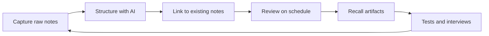
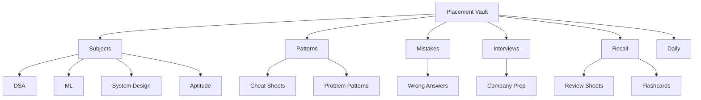

# Chapter 9: AI Note-Taking & Knowledge Management

> **Last Updated:** August 2026 | **Estimated Reading Time:** 60–75 minutes

Most students take notes they never read again. This chapter fixes that with a second brain: a local vault of Markdown notes that AI structures, links, reviews, and converts into recall artifacts you actually use. You will build a placement-prep vault where every note is findable, every note produces a testable artifact, and nothing you studied is ever lost in a chat log again.

The system is a loop — capture, structure, link, review, recall — not a pile. Every prompt in this chapter plugs into that loop, and the TypeScript formatter at the end automates the messiest step. Everything works offline-friendly for your commute: the vault is plain files, and the AI steps run in 5-minute blocks.

> **How to work this chapter** — 15–20 minutes of overhead on top of reading:
>
> 1. **Read** — 60–75 minutes, split across 2–3 commute blocks.
> 2. **Do** — run every **Try This** as you go; the chapter's power is in the prompts you actually execute.
> 3. **Prove** — score 8/10 or better on the Chapter Quiz before moving on.
> 4. **Produce** — your placement-prep vault: the folder structure plus your first 10 structured notes with tags and links.
>
> **Prerequisites:** Chapter 3 (its plans feed the vault). **Next:** Chapter 10.

---

## Learning Objectives

After this chapter you will be able to:

- Explain why a linked vault beats scattered chat logs and build your own second brain
- Run the capture → structure → link → review → recall pipeline for any study material
- Structure raw notes into clean, tagged, frontmattered Markdown using one repeatable prompt
- Build a knowledge graph of your studies and use AI to find connections across subjects
- Generate review sheets, flashcards, and weekly digests automatically from your notes
- Keep a placement-prep vault organized: subjects, patterns, mistakes, interviews, recall
- Apply the hoarding rule so every note produces a recall artifact within 24 hours
- Search your own knowledge with AI when you forget where something lives

---

## Chapter at a Glance

| Topic | Key Insight | Practical Takeaway |
|-------|-------------|-------------------|
| Second brain | Chat logs are silos; a vault is searchable and linked | Keep everything in one Markdown vault, not across apps |
| Capture → structure | Raw notes become tagged, headed, frontmattered notes | Run the structure prompt within 24 hours of capture |
| Knowledge graph | Topics are nodes; AI finds the edges | Do a monthly link-finding pass over your notes |
| Review sheets | Notes are input, review sheets are output | Every chapter produces a one-page recall sheet |
| Evergreen notes | Atomic, self-contained, linked, written in your words | Rewrite heavy notes into evergreen form before tests |
| Hoarding rule | A note you cannot recall is hoarding | Every note must yield a question, card, or sheet in 24h |

---



---

## Q1: What is a second brain with AI, and why does a vault beat scattered chat logs?

**Answer:** A second brain is a single, permanent store of everything you learn — notes, code snippets, mistakes, interview answers — organized so you can find and reuse any of it in seconds. Without one, your knowledge is spread across ChatGPT threads, browser tabs, Telegram saves, and notebooks, and each one is a silo: you cannot search across them, they are hard to link, and they rot. A vault built on plain Markdown files fixes all three: files are searchable, linkable, and yours forever, even offline on a commute. AI turns the vault from storage into a system: it structures your raw notes, finds connections between them, generates review material from them, and answers questions against them. The chat log is a conversation; the vault is a library. Learn once, store forever, retrieve in seconds — that is the whole point of placement prep in a finite schedule.

**Copy-paste prompt:**

```text
You are my second-brain auditor. I have been learning {topic} using
chat threads, screenshots, and random notes. I am going to switch to a
Markdown vault managed with AI. Produce a short audit:

1. What I am at risk of losing with my current scattered workflow (list
   up to 5 losses, tied to my placement goal)
2. A 3-line definition of what my vault should contain
3. The 5 folders I should start with and why

Keep the whole answer under 250 words. No fluff, no motivational text.
```

**How it works:** The prompt forces a concrete before-and-after picture so you see the leak before you build the fix. The audit output becomes the first planning note in your vault.

**Try This:** Paste the prompt with your current learning topic. Save the output as `vault-plan.md` — it becomes your vault's founding document.

---

## Q2: Which tool should I pick — Obsidian, Notion, or plain Markdown files?

**Answer:** Use Obsidian. It stores everything as local Markdown files, so your vault never dies with a subscription, works fully offline (critical for commutes), and gives you backlinks and a graph view for free — both are exactly what the knowledge-graph workflow in this chapter needs. Notion is friendlier to start but locks your data online, and its databases add structure you will rarely use for study notes. Plain files with a code editor work but skip backlinks, templates, and mobile capture, which are the features you actually want. Obsidian also accepts frontmatter, which Chapter 9 workflows rely on for status, tags, and review dates. The tool matters far less than the loop; pick Obsidian, and spend your energy on capture discipline instead of app features.

**Copy-paste prompt:**

```text
I am starting a placement-prep vault and I want to verify my setup.
I will use {tool} (Obsidian / Notion / VS Code + files) for {purpose,
e.g. DSA + ML + interview prep}. Given my constraints — a 10-to-6 job,
about 4 hours of commute time daily, mostly phone-based capture —
give me:

1. My 3 biggest risks with this tool choice
2. A 3-step setup checklist (folder names, template, sync)
3. The one setting or plugin I must configure for backlinks and search

Be specific and short. No marketing paragraphs.
```

**How it works:** The prompt audits your tool choice against your actual constraints (commute capture, offline access) instead of your preferences.

**Try This:** Run the prompt, then create the three folders from step 2 today. Do not reorganize anything else for two weeks — system stability beats system perfection.

---

## Q3: What folder structure works for a placement-prep vault?

**Answer:** Five folders, five jobs: `subjects/` (DSA, ML, system design, aptitude — one note per topic), `patterns/` (reusable templates: problem patterns, formula sheets, cheat sheets), `mistakes/` (one note per wrong answer or misunderstanding, tagged with the subject), `interviews/` (company prep, STAR answers, mock transcripts), and `recall/` (review sheets, flashcards, digests — the artifacts). A `daily/` folder captures the day's raw thinking and feeds the weekly digest loop from Q10. Keep the structure flat and never invent a new folder mid-week; if a note does not fit, it goes to the closest folder and gets a tag. AI can reorganize later; a deep hierarchy now just becomes a place where notes die.



**Copy-paste prompt:**

```text
Here is my placement syllabus: {paste your syllabus or module list}.
Design my vault folder structure. Rules:
- Maximum 6 top-level folders
- One folder for recall artifacts (review sheets, flashcards, digests)
- One folder for mistakes from mocks and practice
- Every folder gets a one-line description of what belongs there
- Add 3 example note titles per folder that match my syllabus

Output a markdown tree diagram, then a 100-word summary of the rules
for deciding where a new note goes.
```

**How it works:** The prompt maps your actual syllabus onto a fixed skeleton, so the structure is yours and not generic. The example titles double as your first checklist of notes to write.

**Try This:** Run it with the 24-module placement syllabus from this repo. Create the folders and the three example notes from one subject this week.

---

## Q4: What is the capture → structure prompt (raw notes to clean, tagged notes)?

**Answer:** This is the most-used prompt in the chapter: it takes whatever you wrote in a hurry — fragments, half-sentences, copied bullets — and returns a clean note with headings, a summary, key terms, and a "don't understand" section. You capture raw during your study session, then run the structure prompt within 24 hours while context is fresh. The prompt must preserve your voice and not add new content, because the whole point is organizing what you learned, not what AI thinks you learned. Keep the output format fixed so every note in your vault looks the same: that consistency is what makes later searches and weekly digests work. Run it on your phone during a commute segment if you captured during the day.

**Copy-paste prompt:**

```text
Here are my raw notes from a study session on {topic}. They are messy
and possibly incomplete — that is expected.

RULES:
1. Reorganize into sections with headings: Key Ideas, Examples,
   Formulas, Confusions, To Do Next
2. Do NOT add facts I did not write. Keep my phrasing where possible.
3. Turn each confusion into a question starting with "Q:".
4. Add a 2-sentence summary in my voice.
5. Suggest 3-5 tags, one of which is the subject {subject}.

RAW NOTES:
{paste your raw notes here}
```

**How it works:** The prompt restructures without inventing, because you explicitly forbid new facts. The fixed output shape is what makes every vault note uniform and machine-processable.

**Try This:** Next study session, write notes fast and messy on purpose. Run this prompt the same evening and save the result as `subjects/{subject}/{topic}.md`.

---

## Q5: How do I build a knowledge graph of my studies?

**Answer:** A knowledge graph is your topics as nodes with connections as edges. Obsidian builds it visually for free: every backlink you add becomes an edge, and the graph view shows clusters (DSA, ML, system design) and bridges (concepts that link across subjects). You build the graph with links — every note gets links to related notes — and AI accelerates it by finding connections you would miss, like "attention mechanism in transformers is the same caching problem as LRU in system design." Run a monthly linking pass: export your note titles, ask AI which pairs belong together, and add the links. The graph is not decoration; it is your map of what you actually know, and interviewers can smell isolated knowledge a mile away.

**Copy-paste prompt:**

```text
Here are the titles of all my notes in my vault, one per line.
{titles, one per line}

Task: find the 10 most valuable connections between them.
For each connection output:
- Note A and Note B (exact titles)
- The relationship in one sentence (what idea links them)
- Why this connection would matter in a {company-style} interview

Only output connections that are TRUE and useful. If fewer than 10,
output fewer. Do not invent topics I have not studied.
```

**How it works:** AI sees titles the way a librarian sees a catalog — it matches topics by underlying concept, not by folder. You review its suggestions and only keep links you can explain, because unearned links pollute the graph.

**Try This:** List 20-30 of your note titles and run the prompt. Add 5 links, then open the graph view in Obsidian and look at what bridges appeared.

---

## Q6: How do I convert course notes into review sheets automatically?

**Answer:** A review sheet is the compressed, testable form of a note: one page with the key definitions, formulas, and 5-8 recall questions you must answer from memory. Notes are input; review sheets are output — the act of generating the sheet is itself the first review pass. AI builds the sheet from your note in seconds, but the value comes from you answering the recall questions without looking, then marking the ones you failed. Save sheets in `recall/` with the same topic name as the source note so the link is obvious. On revision weeks, you read nothing — you only answer sheets. That is how a 224-chapter course becomes 224 one-page exams instead of 224 re-reads.

**Copy-paste prompt:**

```text
Turn this note into a one-page review sheet.

Note: {paste note content}

Output format:
## Definitions (max 6, one line each)
## Formulas / Patterns (max 6)
## Recall Questions (exactly 8 questions, numbered, answerable in
   under 30 seconds each)
## Common Traps (max 3, from the note only)

Rules: everything must come from the note. If the note lacks material
for a section, write "GAP — restudy needed" instead of inventing.
```

**How it works:** The prompt compresses a note into its testable core and flags gaps instead of padding them. The recall questions become your checklist during the review phase of the loop.

**Try This:** Take your most recently structured note and generate its review sheet. Tomorrow morning, answer the 8 questions from memory and mark failures; restudy only the failed ones.

---

## Q7: How do I clean up lecture and meeting notes with AI?

**Answer:** Lectures, meetings, and YouTube tutorials produce the messiest raw material: transcripts. A transcript is 10,000 words of speech; what you need is decisions, questions, action items, and the few ideas that matter. AI compresses this in one pass: feed the transcript (or your own live notes) and ask for the structured distillate. For live sessions, capture shorthand while listening, then run the cleanup prompt after; for recorded ones, paste the transcript directly. Keep the output aligned with your study goals — a meeting about a project is a source of patterns and interview stories, not just logistics. This is also the trick for interview mock transcripts: the cleanup turns a 40-minute mock into a one-page feedback note.

**Copy-paste prompt:**

```text
Here is a transcript/notes from a {lecture / meeting / mock interview}
on {topic}. Compress it into:

## Decisions Made (bullet list, one line each)
## Questions Raised (bullet list, each starting with Q:)
## Action Items (bullet list with owner "me" or "team")
## Ideas Worth Keeping (max 5, in my own words)
## Missing (what was mentioned but never explained — my restudy list)

Rules: no new facts, no fluff, max 200 words total.

TRANSCRIPT:
{paste transcript}
```

**How it works:** The fixed sections force the compression to preserve only what you can act on or study later. Everything else is discarded, which is the point — most of a transcript is noise.

**Try This:** Record yourself (with consent) during the next team meeting or class. Run the prompt on the transcript and save the result as `subjects/{topic}/meeting-{date}.md`.

---

## Q8: How do I organize retrieval with tagging conventions?

**Answer:** Tags are how you find notes when you do not remember the title. Three tag families cover a placement vault: subject tags (`#dsa`, `#ml`, `#system-design`), type tags (`#concept`, `#pattern`, `#formula`, `#mistake`, `#interview`), and status tags (`#growing`, `#evergreen`, `#review`). The rule is simple: every note gets at least one tag from each family, and no tag deeper than one level. When you forget where something is, you retrieve by narrowing — "show all `#mistake` notes tagged `#dsa`" — which beats remembering exact titles. AI maintains the tags for you in the structure step, and a quarterly tag audit (Q20) removes tags that have only one note. Consistent tagging is what makes the search workflow in Q15 actually work.

**Copy-paste prompt:**

```text
Here is a note on {topic}. Suggest tags using my convention.

My convention: exactly 3 tags — subject (#dsa / #ml / #system-design /
#aptitude), type (#concept / #pattern / #formula / #mistake /
#interview / #process), status (#growing / #evergreen / #review).

Note content:
{paste note}

Output: one line with the 3 tags and a one-line justification for each.
If a note deserves 2 type tags, explain why in one sentence.
```

**How it works:** The prompt enforces your convention so tags stay uniform across hundreds of notes — uniform tags are what make later queries and the weekly digest reliable.

**Try This:** Tag 10 existing notes today using this prompt. Then run a search for all `#mistake` notes and confirm the tag family tells you exactly what you got wrong.

---

## Q9: What are evergreen notes, and how do I write them with AI?

**Answer:** Evergreen notes are atomic, self-contained, and linked: one idea per note, written in your own words so they make sense years later, and connected to related notes. They are the opposite of course notes (which follow the course structure) and the opposite of chat answers (which follow the conversation). You turn a good note into an evergreen note by rewriting it as a permanent statement of understanding: "Attention is a weighted average over context, with weights from a learned similarity" is evergreen; "In chapter 5 of the lecture, attention was covered" is not. AI helps by drafting the rewrite and by checking your version against the source material for accuracy. Evergreen notes are what survive the job; the rest of the vault is scaffolding.

**Copy-paste prompt:**

```text
Rewrite this note as an evergreen note.

Rules:
1. One single idea per note — split into multiple notes if needed
2. Written in first-person, my own words, no lecture phrasing
3. Self-contained: readable 6 months from now without context
4. End with 3 links to other topics: [Topic]([[note-name]])
5. Include one real example or analogy I can recall easily
6. Max 150 words per note

Note: {paste note}

If the note contains more than one idea, output them as separate
notes with proposed titles.
```

**How it works:** The prompt forces atomicity and self-containment, then makes AI add the links that grow your graph. The link list doubles as a checklist of notes you still need to write.

**Try This:** Pick your three most important recent notes and rewrite them as evergreen notes. Link them to at least three other notes each.

---

## Q10: How do I run the daily note → weekly digest loop?

**Answer:** Every day ends with a 3-5 line daily note: what you studied, one thing that confused you, one thing you can now do, and tomorrow's one task. Every week, AI reads the seven daily notes plus any new structured notes and produces a digest: what you covered, what you actually retained, the top gaps, and next week's plan. This loop is what turns studying into a closed system — you stop wondering whether you are making progress because the digest tells you. It also feeds the review phase of the pipeline: the gaps in the digest become next week's review sheets and flashcards. Keep the daily note template fixed so the weekly prompt parses it reliably.

**Copy-paste prompt:**

```text
Here are my 7 daily notes from this week. Produce my weekly digest.

Daily notes:
{paste the 7 daily notes, separated by blank lines}

Output:
## Week Summary (5 bullets, what I covered)
## Retention Check (3 recall questions based on my notes, answer them
   from memory in parentheses, then mark which were wrong)
## Top 3 Gaps (from my confusion lines and wrong retention answers)
## Next Week Plan (5 tasks ordered by gap severity, each under 20 words)

Keep it under 300 words. Do not invent study I did not log.
```

**How it works:** The retention check is the loop's engine — it converts "I logged it" into "I can recall it," and the wrong answers become next week's work.

**Try This:** Start tonight with the first daily note. Run the digest after seven days and keep the output as `recall/weekly-2026-W33.md`.

---

## Q11: How do I use NotebookLM as a study corpus over my course materials?

**Answer:** NotebookLM turns your uploaded documents — course chapters, notes, papers, PDFs — into a grounded research assistant that answers questions with citations back to your sources. That grounding is the killer feature: unlike a chat where AI may guess, NotebookLM is constrained to your uploads, so it is the perfect tool for reviewing your own courseware (for example, the 224 chapters of the placement course). Use it for three jobs: cross-document questions ("compare how module 3 and module 12 define loss functions"), outline generation for revision, and its audio overviews to turn a chapter set into a listenable briefing for your commute. NotebookLM is a corpus layer above your vault: the vault stores what you learned; NotebookLM answers from what you gave it to learn.

**Copy-paste prompt (use in NotebookLM):**

```text
You are my study assistant, grounded ONLY in the uploaded sources.

Question: {your question, e.g. "List every formula in the uploaded
chapters, grouped by topic, with the chapter each came from"}

Format the answer as:
- Grouped list with source citation after each item
- One line "Not covered in sources" for anything you could not answer
- Three follow-up questions I should ask next

Do not use outside knowledge. If sources conflict, show both quotes.
```

**How it works:** NotebookLM retrieves passages from your uploads, cites them inline, and refuses to answer outside the corpus — which turns hallucinations into non-issues for course review.

**Try This:** Upload the PDFs or markdown of your next two placement modules. Ask the prompt above, then create an audio overview and listen to it on one commute.

---

## Q12: How do I turn notes into flashcards for spaced repetition?

**Answer:** Flashcards are the recall artifact that survives longest: they drive spaced repetition, and spaced repetition is the difference between recognizing a topic and retrieving it. AI converts any note into Q/A and cloze-deletion cards, and you export them to Anki (or any spaced-repetition app) for daily 10-minute reviews. The conversion prompt is strict about question quality: every card must test one atomic fact, ask from the answer's direction (not "what is X?" but "you see Y, what is it?"), and be self-contained. Generate cards when the note is structured (same session as the structure prompt), not weeks later — the context you have then is the context the cards need. Your daily Anki review becomes the review step of the capture loop, running automatically every morning.

**Copy-paste prompt:**

```text
Convert this note into spaced-repetition flashcards.

Note: {paste note}

Rules:
- One atomic fact per card, self-contained, answerable in 5 seconds
- Mix formats: basic Q/A, cloze deletions, and "identify the error"
- Prefer asking from the application side: give the situation, ask for
  the concept — not the reverse
- Max 15 cards, sorted hardest first
- Output as "Q: ... / A: ..." lines separated by blank lines

Add a header line with: the note title, the subject tag, and today's
date.
```

**How it works:** The prompt enforces application-side questions, which is how interview retrieval actually works. The daily review habit is small (10 minutes), which is why it survives a job schedule.

**Try This:** Generate cards for this week's notes and import them into Anki. Review for 10 minutes every morning for 7 days; log the deck's retention percentage.

---

## Q13: How do I run a mistake bank from mock tests?

**Answer:** A mistake bank is a folder of notes, one per wrong answer, that turns every mock test into learning material. Each mistake note answers four questions: what the question was, what I answered, what the correct answer is, and why I failed (knowledge gap, misread, speed, or silly error). AI accelerates this: paste the mock and your answers, and AI categorizes the failures and writes the notes. The gold is the pattern layer — after 20 mistakes, the weekly digest can group them ("you lose points on graph edge cases") and your revision targets patterns, not single questions. This is the single highest-leverage artifact for placement prep because mocks are infinite but your mistake patterns are few.

**Copy-paste prompt:**

```text
Here are my answers from a mock test and the correct answers.
For each wrong answer, write a mistake note with:
## Question (one line, the topic tested)
## My Wrong Answer (exactly what I wrote)
## Correct Answer (one line)
## Failure Type (one of: knowledge-gap / misread / speed / silly)
## Pattern (one sentence: what class of problem this belongs to,
   e.g. "graph traversal with visited-state")

MOCK:
{paste your answers and the key}
```

**How it works:** The prompt classifies failures into four types and extracts the underlying pattern, so the mistake folder stays structured instead of becoming a graveyard of random wrong answers.

**Try This:** Take your last mock test (or the quiz from the previous chapter), run the prompt, and create the mistake notes. After ten more mocks, ask AI which three patterns to attack first.

---

## Q14: How do I prevent note-hoarding (the hoarding rule)?

**Answer:** Note-hoarding is collecting notes that never produce learning — you feel productive because you wrote, but you recall nothing. The hoarding rule kills this: every note must produce a recall artifact (a review sheet, flashcards, a digest entry, or a mistake-bank entry) within 24 hours, or it gets deleted or merged. Three escape hatches exist, so the rule stays practical: convert it (make the artifact), complete it (it was actually done — archive it), or kill it (delete without guilt). Apply the rule weekly: count notes created and artifacts produced; a ratio below 1:1 is hoarding. This rule is what keeps the vault small, sharp, and honest — the size of a vault is not its value, the recall rate is.

**Copy-paste prompt:**

```text
Audit this list of my notes for hoarding.

Notes (title + one line summary each):
{list your notes}

For each note, classify as:
- CONVERTED: already has a recall artifact → OK
- CONVERTIBLE: can become a review sheet or 5 flashcards → propose the
  artifact in one line
- COMPLETED: learned and done → archive
- DEAD: no recall value → delete

Output a table: Note | Verdict | Next Action. End with a one-line ratio
of artifacts to notes and a verdict: healthy or hoarding.
```

**How it works:** The audit applies the 24-hour rule retroactively and gives every note a verdict, so the weekly cleanup takes minutes instead of hours.

**Try This:** Run the audit on your last 20 notes. Execute the verdicts — delete the dead ones without rereading them first; that is the test of whether you can let go.

---

## Q15: How do I search my own knowledge with AI when I forget where something is?

**Answer:** Search your vault in two layers. Layer one is plain search: grep titles and contents for the term, which finds exact matches instantly in Markdown. Layer two is semantic: when you only remember the idea, not the word, export your note list with summaries and let AI locate the note — "the note about why hash maps beat trees for lookups but not for ranges" should land on your BST note instantly. For bigger vaults, export all notes as one file and ask AI to find the passage, citing the note it came from. This two-layer search is why the vault beats chat logs: a chat log is only searchable by conversation, a vault is searchable by meaning. Remember to fix the note's title or add the missing keyword after you find it, so the next search is faster.

**Copy-paste prompt:**

```text
I remember I have a note about {describe the idea in your own words,
e.g. "a data structure where deletions are expensive but lookups are
O(1)"}. I do not remember the title or the folder.

Here is a list of my notes with one-line summaries:
{title :: summary, one per line}

Find the best 3 matches. For each: note title, why it matches (one
sentence), and the exact tag you would search to find it again.
If no note matches, say so — do not fabricate.
```

**How it works:** The prompt searches by meaning against your summary list, and the tag suggestion at the end improves your retrieval system for next time.

**Try This:** Think of three things you studied last month but cannot find in your notes. Run the prompt for each and fix the worst title on the note you find.

---

## Q16: What frontmatter and template system should I use?

**Answer:** Frontmatter is the YAML block at the top of every note that AI and search tools can filter on. Five fields cover placement prep: `title`, `tags`, `source` (course/module or URL), `status` (`growing` / `evergreen` / `archived`), and `last-reviewed` (the date your review sheet was last tested). Templates make the system consistent: one template for daily notes, one for topic notes, one for mistake notes, each with the fields prefilled. AI fills the fields for you in the structure prompt, but the template is your guardrail when you write by hand. Consistency in these five fields is what powers the weekly digest (Q10), the hoarding audit (Q14), and the semantic search (Q15) — the whole system reads your metadata, so keep it boring and predictable.

**Copy-paste prompt:**

```text
Generate an Obsidian template for a {topic / mistake / daily} note.

Requirements:
- YAML frontmatter with: title, tags, source, status, last-reviewed
- Placeholder values like {{title}} where appropriate
- Sections: Key Ideas, Examples, Formulas, Confusions, Recall
  Questions (for topic notes) or the mistake-note sections
- A one-line comment at the top of the body explaining when to use it

Output the complete template in a single markdown block.
```

**How it works:** The prompt produces a ready-to-paste template tailored to one note type, so your vault gains structure without you hand-rolling YAML.

**Try This:** Generate all three templates (topic, mistake, daily) and install them in Obsidian's template folder. Use the topic template for your next structured note.

---

## Q17: How do I take notes that actually teach me (active recall during capture)?

**Answer:** Most note-taking is passive copying; active capture turns writing into thinking. Two moves do this: write questions instead of summaries (turn each heading into "what is X and when do I use it?"), and pre-question before reading (ask AI for the 5 questions the material should answer, then read looking for those answers). The pre-question step is the highest-leverage habit in this chapter because it forces prediction, and prediction is what makes memory. During capture, your raw note is literally your answers to those questions, which means the structure step (Q4) later just organizes answers — no rewriting needed. This flips the loop: capture stops being the boring step and becomes the first recall pass of the day.

**Copy-paste prompt:**

```text
I am about to study {topic} using {source, e.g. module 7 of the
placement course}. Before I read, give me:

1. 5 questions the material should answer (numbered, phrased as
   "How...", "Why...", "When...")
2. For each question, my prediction prompt: "Write your prediction
   in 1 line BEFORE reading, then correct it AFTER reading."
3. The 3 concepts most likely to confuse a beginner

Do not explain anything yet — this is a pre-reading worksheet.
```

**How it works:** The worksheet turns reading into hypothesis testing: you predict, then verify, then correct — which is the exact cognitive loop that produces durable memory.

**Try This:** Before your next module study block, run the prompt, write your five predictions, then read and correct them. Your raw note for that session is the corrected sheet.

---

## Q18: How do I write interview answer notes that are actually useful?

**Answer:** Interview notes rot unless they are written as reusable answers, not as conversation logs. The reusable form is a structured answer note: the question, a one-line ideal answer, a 60-second spoken answer (written as you would actually say it), a STAR story if it is behavioral, and 3 probing follow-ups the interviewer might ask. AI drafts the notes from your experience and mock transcripts, but you must edit them until they sound like you — canned-sounding answers die in interviews. Link each answer note to the concept notes behind it (a "how do you handle a slow API" answer links to your caching and async evergreen notes). Before the real interview, you do not reread subjects, you rehearse answer notes against the clock.

**Copy-paste prompt:**

```text
Turn this interview question and my experience into a reusable answer
note.

Question: {paste the question}
My experience: {paste 2-3 bullet points of relevant experience or
projects}
Target company style: {e.g. FAANG / service company / AI startup}

Output:
## One-line Ideal Answer
## 60-Second Answer (written in first person, as I would say it)
## STAR Story (situation, task, action, result — 4 short bullets)
## 3 Follow-up Questions (with one-line answers)
## Linked Concepts (3 note titles from my vault)

Keep the answer under 150 words. Sound like a human, not a brochure.
```

**How it works:** The prompt forces the answer into spoken form with a story and follow-ups, which is what interview prep actually needs — rehearsal material, not theory.

**Try This:** Run it on the last behavioral question you were asked at work or in a mock. Record yourself saying the 60-second answer and cut it down until it fits comfortably.

---

## Q19: How do I link notes across subjects with AI (cross-topic connections)?

**Answer:** Cross-subject links are where deep understanding lives: DSA patterns reappear in system design, ML concepts reuse probability from aptitude math, and every interview answer draws from multiple folders. AI finds these bridges because it knows all the subjects at once: give it a sample of your notes and ask for connections that cross folder boundaries. The rule for accepting a link: you must be able to explain it in one sentence, or it is a false bridge that pollutes your graph. Review the graph quarterly and keep only links you can teach. These bridges are also interview gold — "what does this data structure have in common with a vector database index?" is a real question, and your graph has been rehearsing the answer all along.

**Copy-paste prompt:**

```text
Here are 5 notes from different subjects in my vault (DSA, ML, system
design, aptitude, interview).

{5 notes, clearly separated}

Task: find every TRUE cross-subject connection. A connection is true
only if it is technically accurate and would help in a placement
interview. For each connection output:
- The two notes linked
- The shared idea in one sentence
- The interview question this connection answers

Maximum 5 connections. If you cannot justify a connection, omit it.
```

**How it works:** The prompt deliberately mixes folders and demands technical accuracy, so the output is bridges you can defend, not decorative links.

**Try This:** Pick five notes from different folders and run the prompt. Add the 3 best links, then rehearse one of the resulting interview questions out loud.

---

## Q20: How do I maintain and prune the vault monthly?

**Answer:** A vault is a garden, and gardens need monthly weeding: orphan notes (no links, no recall artifacts), duplicates (same idea in three folders), and dead ends (completed topics you will never revisit). The monthly audit runs four checks: orphans (notes with no backlinks), duplicates (similar titles or tags), stale statuses (notes marked `growing` for 30+ days), and hoarding ratio (artifacts vs notes). AI does the analysis; you do the deciding. Archive, merge, or delete — always keep the audit output itself as a note so next month's audit knows what changed. Thirty minutes a month keeps the vault fast and honest, and a fast vault is one you will actually search instead of re-studying from the internet.

**Copy-paste prompt:**

```text
Here is my vault inventory: note title, tag, status, and last-reviewed
date, one note per line.

{paste inventory}

Run these four audits:
1. ORPHANS: no backlinks and status growing for over 30 days
2. DUPLICATES: pairs with similar titles or identical tags
3. STALE: last-reviewed over 30 days ago, still status growing
4. RATIO: count recall artifacts vs topic notes

Output a table: Audit | Findings | Recommended Action per item.
End with a 3-line "This Month's Weeding Plan" listing what to merge,
archive, and delete.
```

**How it works:** The four audits convert a vague "organize my notes" feeling into a concrete action table, and the recommended actions are explicit enough to execute in half an hour.

**Try This:** Export your vault inventory (a quick script or manual list works) and run the audit. Execute the merge and delete actions today while the audit is fresh.

---

## Q21: How do I build a note formatter tool in TypeScript?

**Answer:** The structure prompt works in any chat, but if you process dozens of raw notes a week, a local tool is faster and free: paste messy text, get clean Markdown with frontmatter, tags, and sections in milliseconds. The formatter below does three jobs: splits raw lines into headings and bullets, derives tags from a subject plus keyword hits plus the most frequent meaningful words, and renders frontmatter plus the note body. It is intentionally simple — enough for daily note cleanup, and a template you can extend with your own keyword lists for each subject. Run it with `npx ts-node formatter.ts` or strip the types and run with plain Node.

```typescript
interface NoteSection {
  heading: string;
  content: string[];
}

interface Note {
  title: string;
  tags: string[];
  source: string;
  status: "growing" | "evergreen" | "archived";
  lastReviewed: string;
  sections: NoteSection[];
}

const STOP_WORDS = new Set([
  "the", "and", "for", "with", "this", "that", "from", "when",
  "what", "have", "into", "than", "then", "there", "about",
]);

const SUBJECT_KEYWORDS: Record<string, string[]> = {
  dsa: ["array", "hashmap", "graph", "tree", "dp", "recursion", "pointer", "stack", "queue", "binary"],
  ml: ["loss", "gradient", "attention", "transformer", "pytorch", "vector", "embedding", "regression", "token"],
  "system-design": ["cache", "queue", "shard", "load", "balancer", "index", "transaction", "replica", "latency"],
  aptitude: ["ratio", "percentage", "profit", "speed", "distance", "work", "probability", "permutation", "series"],
};

function deriveTags(text: string, subject: string): string[] {
  const tags = new Set<string>([subject]);
  const lower = text.toLowerCase();
  for (const kw of SUBJECT_KEYWORDS[subject] ?? []) {
    if (lower.includes(kw)) tags.add(kw);
  }
  const words = lower.match(/[a-z]{4,}/g) ?? [];
  const freq = new Map<string, number>();
  for (const w of words) {
    if (STOP_WORDS.has(w)) continue;
    freq.set(w, (freq.get(w) ?? 0) + 1);
  }
  const top = [...freq.entries()].sort((a, b) => b[1] - a[1]).slice(0, 3);
  for (const [w] of top) tags.add(w);
  return [...tags].slice(0, 6);
}

function splitSections(messy: string): NoteSection[] {
  const lines = messy.split(/\r?\n/).map((l) => l.trim()).filter((l) => l.length > 0);
  const sections: NoteSection[] = [];
  let current: NoteSection = { heading: "Overview", content: [] };
  for (const line of lines) {
    const isHeading = line.endsWith(":") || (/^[A-Z][A-Za-z0-9 /]{2,40}$/.test(line) && line.split(" ").length <= 6);
    if (isHeading) {
      if (current.content.length > 0) sections.push(current);
      current = { heading: line.replace(/:$/, ""), content: [] };
    } else {
      current.content.push(line);
    }
  }
  sections.push(current);
  return sections;
}

function formatNote(raw: string, opts: { title: string; subject: string; source: string }): Note {
  return {
    title: opts.title,
    tags: deriveTags(raw, opts.subject),
    source: opts.source,
    status: "growing",
    lastReviewed: new Date().toISOString().slice(0, 10),
    sections: splitSections(raw),
  };
}

function renderMarkdown(note: Note): string {
  const out: string[] = [];
  out.push("---");
  out.push(`title: ${note.title}`);
  out.push(`tags: [${note.tags.join(", ")}]`);
  out.push(`source: ${note.source}`);
  out.push(`status: ${note.status}`);
  out.push(`last-reviewed: ${note.lastReviewed}`);
  out.push("---");
  out.push("");
  out.push(`# ${note.title}`);
  out.push("");
  for (const section of note.sections) {
    out.push(`## ${section.heading}`);
    out.push("");
    for (const line of section.content) out.push(`- ${line}`);
    out.push("");
  }
  return out.join("\n");
}

const raw = `Two Sum: hashmap lookup O(1), store complement before inserting.
Edge case: target - num exists but is the same element - check index.
Follow-up: three sum, sort first then two pointers.
Graph: adjacency list vs matrix, BFS for shortest in unweighted graphs.
Pointer: slow-fast for cycle detection in linked lists, Floyd's algorithm.
DP: state definition is 80 percent of the problem, memo table size n+1.
Recursion: base case first, then trust the subproblem.`;

const note = formatNote(raw, {
  title: "Interview Patterns: Two Sum to Floyd",
  subject: "dsa",
  source: "leetcode-session-2026-08",
});
console.log(renderMarkdown(note));
```

**How it works:** `deriveTags` builds tags from your subject keyword list plus the note's own most frequent words; `splitSections` detects heading lines (short, capitalized, or ending with a colon) and groups the rest as bullets; `renderMarkdown` emits frontmatter-ready output you can paste straight into a note file.

**Try This:** Save the file as `formatter.ts` in your vault, run it with `npx ts-node formatter.ts`, and paste in one of your own messy note dumps. Extend `SUBJECT_KEYWORDS` with terms from your actual syllabus and rerun.

---

## Summary

- A second brain vault beats chat logs because it is searchable, linkable, and yours forever — AI turns it from storage into a study system.
- The pipeline is capture → structure → link → review → recall, and the structure prompt run within 24 hours is the load-bearing step.
- Obsidian with plain Markdown files, five folders, and a fixed frontmatter scheme keeps the vault simple enough to survive a job schedule.
- Review sheets, flashcards, and mistake notes are the recall artifacts; without them a note is hoarding, not learning.
- The daily note → weekly digest loop closes the system: it tells you what you covered, what you retained, and what to fix next week.
- Knowledge graphs and cross-subject links turn isolated facts into interview-ready bridges you can defend in one sentence.
- The hoarding rule (every note produces an artifact within 24 hours) and the monthly audit keep the vault small, sharp, and honest.
- NotebookLM adds a grounded corpus layer over your courseware, and the TypeScript formatter automates the messiest part of capture.

---

## Practical Takeaways

| Technique | Prompt / Command | When to Use |
|-----------|------------------|-------------|
| Structure raw notes | The Q4 capture → structure prompt | Within 24 hours of any study session |
| Review sheets | The Q6 sheet generator | After structuring each chapter |
| Transcript cleanup | The Q7 distillation prompt | After lectures, meetings, mock interviews |
| Weekly digest | The Q10 digest prompt with 7 daily notes | Every Sunday, 10 minutes |
| Flashcards | The Q12 card factory prompt | Same session as note structuring |
| Mistake bank | The Q13 mock-audit prompt | After every mock test |
| Hoarding audit | The Q14 audit prompt | Weekly, before digest |
| Vault weeding | The Q20 monthly audit prompt | First Sunday of the month |
| Local formatting | `npx ts-node formatter.ts` | When you batch-process raw notes |

---

## Chapter Quiz

1. Why does a linked Markdown vault beat scattered chat logs for study?
   A) Chat logs are prettier and easier to read
   B) A vault is searchable, linkable, and permanent; chat logs are silos that rot
   C) Chat logs cannot be exported
   D) AI works faster with Markdown than with chat
   <details><summary>Answer: B</summary>The whole premise of the second brain is searchable, linked, permanent storage; chats are isolated conversations with no cross-search or linking.</details>

2. What is the correct order of the AI note-taking pipeline?
   A) Review → recall → capture → structure → link
   B) Capture → structure → link → review → recall
   C) Recall → capture → review → link → structure
   D) Structure → capture → recall → review → link
   <details><summary>Answer: B</summary>The loop is capture raw notes, structure them, link them, review on schedule, and produce recall artifacts.</details>

3. Which folder should NOT be a top-level folder in the recommended vault?
   A) subjects
   B) patterns
   C) research-papers-all-topics
   D) mistakes
   <details><summary>Answer: C</summary>The recommended structure has five folders: subjects, patterns, mistakes, interviews, recall (plus daily). Deep, topic-specific folders invite note graveyards.</details>

4. What is the one rule the capture → structure prompt must enforce?
   A) AI adds all missing facts automatically
   B) AI never adds facts the student did not write
   C) Output must be at least 500 words
   D) Tags must be exactly 10 per note
   <details><summary>Answer: B</summary>The prompt must preserve the student's content; inventing facts would corrupt the note and the review artifacts built from it.</details>

5. What is the recall artifact for the weekly loop?
   A) The raw daily note
   B) The weekly digest with retention check
   C) The chat transcript
   D) The folder tree
   <details><summary>Answer: B</summary>The digest includes a retention check — recall questions answered from memory — which is what makes the loop test learning.</details>

6. An evergreen note must be:
   A) At least 500 words and include every course detail
   B) Atomic, self-contained, linked, and written in your own words
   C) Written by AI without editing
   D) Stored only in chat logs
   <details><summary>Answer: B</summary>Evergreen notes hold one idea, stand alone, link to related notes, and use your phrasing so they remain readable months later.</details>

7. What does the hoarding rule require?
   A) Every note produces a recall artifact within 24 hours or is deleted/merged
   B) Every note must be 1000 words
   C) All notes must be evergreen immediately
   D) Notes should never be deleted
   <details><summary>Answer: A</summary>Convert, complete, or kill: a note without a recall artifact within 24 hours is hoarding.</details>

8. What are the four failure types in a mistake bank note?
   A) Hard, medium, easy, trivial
   B) Knowledge-gap, misread, speed, silly
   C) Conceptual, mechanical, logical, random
   D) Math, code, design, aptitude
   <details><summary>Answer: B</summary>The classification is knowledge-gap, misread, speed, or silly — and the pattern line groups mistakes into fixable categories.</details>

9. What is the main advantage of NotebookLM over a normal chat for course review?
   A) It is always free
   B) It answers only from your uploaded sources with citations
   C) It writes notes automatically
   D) It works without internet
   <details><summary>Answer: B</summary>NotebookLM grounds answers in your uploaded documents with inline citations, which prevents hallucinated review content.</details>

10. What does the note formatter tool's `deriveTags` function do?
    A) It uploads notes to the cloud
    B) It builds tags from subject keywords plus the note's most frequent meaningful words
    C) It translates notes into English
    D) It scores notes for interview readiness
    <details><summary>Answer: B</summary>`deriveTags` combines the subject's keyword list with frequency analysis of the note's own words (after filtering stop words).</details>

---

## Exercises

1. Build your vault skeleton today: create the five folders (subjects, patterns, mistakes, interviews, recall) plus daily, and install the three templates from Q16. Write your first daily note tonight.
2. Take one chapter you studied this week, deliberately write messy raw notes on it, and run the Q4 structure prompt. Save the result in `subjects/{subject}/` and generate its review sheet with Q6.
3. Run the Q10 weekly digest loop for one week: seven daily notes, then the digest. Write down your top gap and restudy only that gap next week.
4. Convert 10 notes into flashcards with Q12 and review them daily for one week. Record the retention trend in a short note.
5. Run the Q14 hoarding audit on your last 20 notes and execute the verdicts (convert, archive, or delete).
6. Extend the TypeScript formatter with a `#interview` keyword list and format three of your own raw interview-prep notes with it.

---

## Further Reading

- Obsidian help and backlinks guide: https://help.obsidian.md/Home
- Zettelkasten method overview: https://en.wikipedia.org/wiki/Zettelkasten
- Zettelkasten principles explained: https://zettelkasten.de/introduction/
- Building a Second Brain (BASB) overview: https://fortelabs.com/blog/basboverview/
- NotebookLM: https://notebooklm.google.com/
