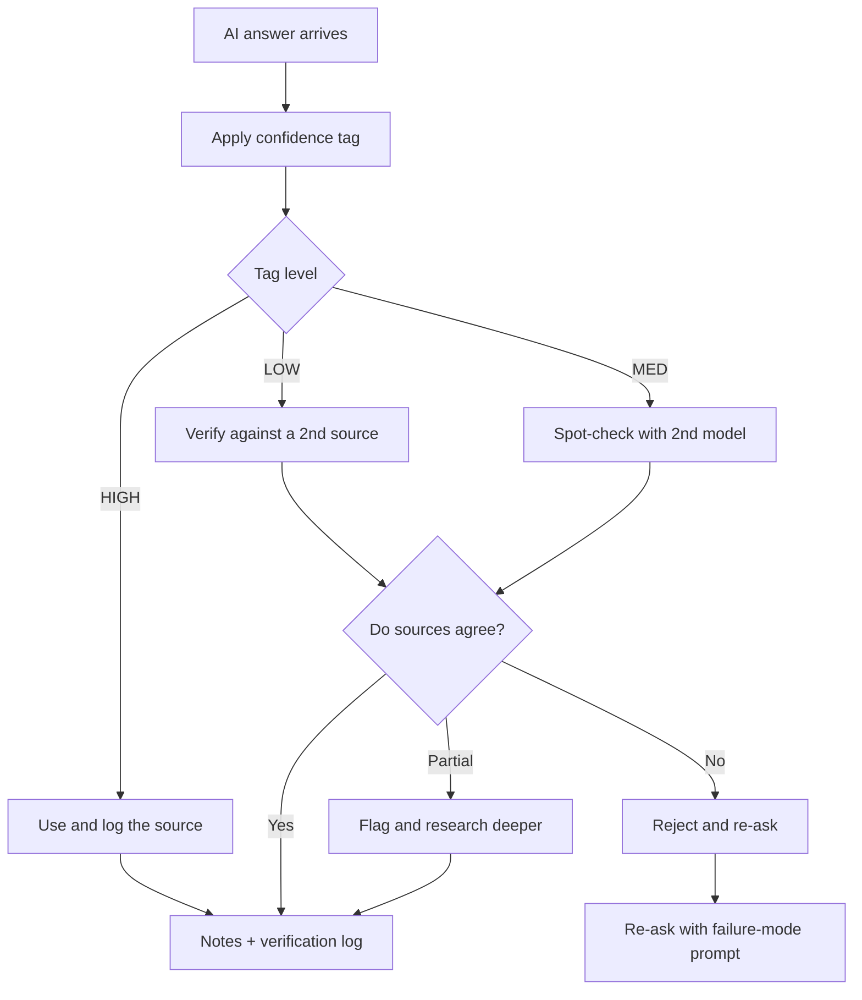
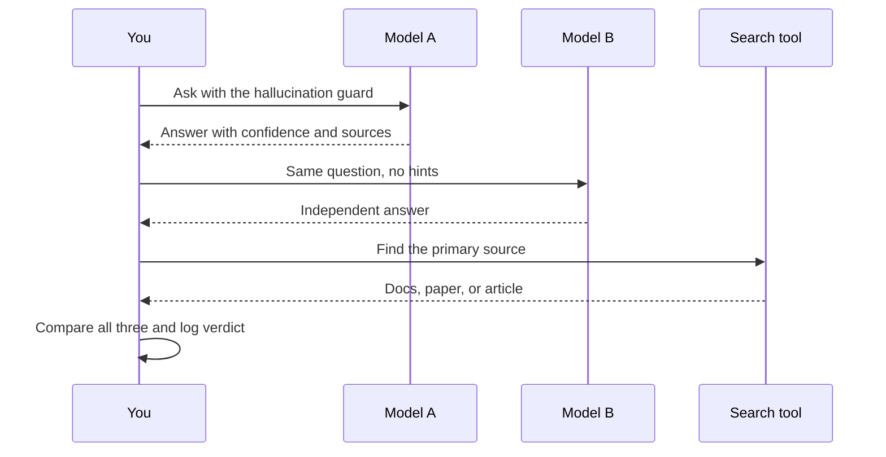

# Chapter 11: Verification & Anti-Hallucination

> **Last Updated:** August 2026 | **Estimated Reading Time:** 60–75 minutes

When you learn fast with AI, the biggest risk is not speed — it is wrongness. A language model does not know anything; it predicts the next most plausible token, which means it can produce a confident, beautifully written, completely false explanation at any moment. This chapter installs your verification layer: guards that force every answer to declare its confidence, protocols that check claims against second sources, a log that separates checked facts from faith, and the discipline to distrust AI exactly when it deserves distrust.

By the end, you will never again copy an AI answer into your notes without a confidence tag, a source, or an explicit "I DON'T KNOW" — and every fact you repeat in an interview will survive a cross-examining senior engineer because you verified it before you memorized it.

> **How to work this chapter** — 15–20 minutes of overhead on top of reading:
>
> 1. **Read** — 60–75 minutes, split across 2–3 commute blocks.
> 2. **Do** — run every **Try This** as you go; the chapter's power is in the prompts you actually execute.
> 3. **Prove** — score 8/10 or better on the Chapter Quiz before moving on.
> 4. **Produce** — your verification log with at least 10 claims checked, tagged, and dated.
>
> **Prerequisites:** none — but run this chapter's guards alongside every chapter from here on. **Next:** Chapter 12.

## Learning Objectives

- Explain why models hallucinate and why confident tone is not evidence
- Apply the hallucination guard to every AI answer before it enters your notes
- Demand structured citations and verify that sources actually support the claims
- Run the cross-verification protocol (second model or search tool) for high-stakes claims
- Read and act on LOW, MED, and HIGH confidence tags
- Verify AI-written code by running it, testing edge cases, and asking for the test
- Date-check claims in fast-moving fields and escape the training-cutoff trap
- Red-team your own notes and maintain a persistent verification log

## Chapter at a Glance

| Topic | Key Insight | Practical Takeaway |
|---|---|---|
| Hallucination guard | Every answer must state confidence, cite a source, or say "I don't know" | Prepend the guard to every prompt you send |
| Source verification | A citation link is not proof; the source must exist and say what the model claims | Open the link, read the paragraph, compare |
| Cross-verification | Two independent answers that agree are far more likely to be true | Ask a second model or a search tool for every critical claim |
| Confidence tagging | AI tags each claim LOW, MED, or HIGH so you know how much to trust it | Verify LOW, spot-check MED, use and log HIGH |
| Code verification | Pasted code is only an opinion until it runs | Run it, add edge cases, demand the test suite |
| Verification log | What you verified beats what you believed | Log every placement-critical claim with a verdict |





## Q1: Why do AI answers sound so confident even when they are wrong?

**Answer:** Language models are next-token predictors, not databases. They are trained to produce text that looks like the text they were trained on, and confident, assertive prose is statistically common in that training data. So the model does not first check a fact and then decide how to phrase it; it simply generates the most plausible-sounding completion. This is why a hallucination feels indistinguishable from a correct answer at first read. The practical consequence: tone is zero evidence of truth, and you must have a mechanical check that runs on every answer regardless of how authoritative it sounds. You are not checking AI because it is usually wrong; you are checking because you cannot tell when it is.

**Prompt:**

```
You are my hallucination detector. I will paste a claim I plan to use in my study notes.
Task: pressure-test it.
1. Identify every factual sub-claim inside it.
2. Rate each sub-claim 1 to 5, where 1 is almost certainly false and 5 is almost
   certainly true.
3. For each rating below 4, explain what evidence would prove or disprove it.
4. Do not soften your verdict to be polite. If any part is uncertain, write
   "UNCERTAIN" in capital letters.
Claim: {paste the claim here}
```

**How it works:** Splitting the claim into sub-claims forces the model to examine parts separately instead of giving a global verdict, and the 1-5 scale makes it commit to a number rather than a vague "mostly correct."

**Try This:** Take one fact you learned from AI this week — for example "quick sort is always faster than merge sort" — and run it through this prompt. Count how many sub-claims the model flags.

## Q2: What is the hallucination guard and how do I make it a habit?

**Answer:** The hallucination guard is a standing instruction you attach to every prompt: the AI must state its confidence, name its source, or say "I DON'T KNOW" — no exceptions. It works for three reasons. First, it converts silent uncertainty into visible uncertainty, so you see the risk before you use the answer. Second, the explicit permission to say "I don't know" removes the pressure to guess, which is where most hallucinations come from. Third, the source requirement makes the model trace its own answer, and models are measurably more careful when they have to justify themselves. Make it a habit by saving the guard as a snippet in your phone's notes app and pasting it into every new chat. It costs five seconds and changes the quality of everything after it.

**Prompt (the guard):**

```
Hallucination guard: apply these rules to every answer in this conversation.
1. Start every answer with a confidence tag: HIGH if you are certain, MED if you
   are fairly sure, LOW if you are guessing, extrapolating, or reasoning by analogy.
2. For every factual claim, name the source you are relying on: general training
   knowledge, a specific document I gave you, or a web search result.
3. If you do not know the answer, say exactly "I DON'T KNOW" and stop. Never guess
   to be helpful.
4. If the answer depends on time, state your knowledge cutoff and today's date.
Topic: {your topic or question}
```

**How it works:** Rules 1-4 make uncertainty mandatory output instead of hidden behavior, and rule 4 handles the fact that every model in 2026 has a finite training date.

**Try This:** Ask the same question about your syllabus once with the guard and once without. Compare: how many times does the guarded answer tag itself LOW or say "I DON'T KNOW"?

## Q3: How do I demand sources and citations for every factual claim?

**Answer:** You cannot verify what is not labeled. Ask the model to attach inline references to every factual claim and to produce a reference list in a fixed format that includes what the source actually says and whether it supports the claim. This does two things: it makes the model slower and more careful (models produce more verifiable text when forced to cite), and it gives you a checklist for your own verification. Treat the reference list as a promise, not a proof — a hallucinating model will happily invent a citation too. The format below is designed so you can paste the references straight into your verification log in one step.

**Prompt:**

```
Answer this question and cite every factual claim with an inline reference like
[1] or [2] placed right after the claim. After the answer, list the references in
exactly this format, one per line:
[1] Title | URL or source name | What this source actually says | Verdict:
SUPPORTS / CONTRADICTS / SILENT
Only cite sources you believe are real. If you cannot name a source for a claim,
say so instead of inventing one.
Question: {your question}
```

**How it works:** The fixed pipe-separated format makes citations machine-checkable — you can paste the list into a spreadsheet or the verification log from Q18 and tick them off one by one.

**Try This:** Ask for three citations on a topic from your syllabus, then open each cited page and confirm the sentence you were quoted exists and means what the model said it means.

## Q4: How do I verify a source once I have it?

**Answer:** Four checks, in order. Existence: open the link; if it 404s, the citation is suspect or dead. Relevancy: does the page actually discuss your claim, or is it a near-miss topic? Support: find the exact sentence that backs the claim and quote it; the source must say what the model said it says, not something adjacent. Priority: prefer primary sources — official docs, papers, specifications — over secondary ones like blogs and forums, and when a primary and secondary source conflict, the primary one wins. Fake citations are common, especially with real-looking titles and dead links, so never skip existence. A source that fails any check moves the claim straight to the flagged column of your log.

**Prompt:**

```
Here are citations an AI gave me for a claim I need for interview prep. Audit them.
For each citation answer:
1. Does the URL look real and accessible? Flag invented or broken-looking patterns.
2. Is this a primary source (official docs, papers, specs) or secondary (blogs,
   forums, news summaries)?
3. Read the linked page and quote the exact sentence that supports my claim. If no
   such sentence exists, mark the citation FAKE.
4. Final label for each: REAL / DEAD / FAKE / MISLEADING.
Citations: {paste citations}
```

**How it works:** The labels are decisive and mutually exclusive, so you can act instantly: REAL claims go to your notes, everything else gets verified differently or dropped.

**Try This:** Generate ten citations from AI, then actually open all ten links. Track how many are real, how many support the claim, and how many are invented.

## Q5: What is the cross-verification protocol?

**Answer:** The single most powerful verification move: get a second independent opinion and compare. Ask model A with your guard; then ask model B — a different company's model — the same question with no hints about A's answer; then check with a search tool if the claim is high-stakes. When two independently trained models agree on specifics, the probability that both hallucinated identically is low. When they disagree, you have found a genuinely contested point, which is itself valuable interview material. The protocol takes five minutes and is reserved for claims you will repeat out loud: interview facts, definitions you quote, numbers, and anything going into your permanent notes. Low-stakes guesses from AI do not deserve this budget.

**Transcript (realistic session):**

```
You (ChatGPT): Hallucination guard on. Question: What is the difference between
stateful and stateless APIs, and which one do placement interviewers expect me to
know first? Level: beginner.
ChatGPT: HIGH confidence. A stateful API keeps the client's context on the server
between requests... [2 paragraphs, sources: general training knowledge]. MED
confidence on the claim that REST is always stateless, because JWT tokens
complicate it.
You: Cross-examine your own answer. List anything a strict reviewer could challenge.
ChatGPT: I flagged three points: the "REST is always stateless" sentence, the
JWT caveat, and my claim that HTTP cookies are stateful by design.

You (Claude, fresh chat): Answer in plain terms: stateful vs stateless APIs, and
what an interviewer testing basics would expect. Tag confidence per paragraph.
Claude: HIGH on the core definitions, which match the standard REST description...
[independent wording, same substance]. Notes that statelessness is a constraint of
the REST architectural style, not of HTTP itself.

You (Perplexity): Search: "stateful vs stateless API REST best practices JWT".
Perplexity: Summaries from AWS docs and MDN support: REST is designed stateless;
server-side sessions are stateful; JWT is a common stateless workaround.

You: Verdict for log — claim 1 (definitions): accepted, 3 sources agree.
Claim 2 (REST always stateless): flagged, all three sources agree it needs the
"by design" caveat. Rewriting my note.
```

**How it works:** Independent agreement is the signal. The transcript shows the three-step rhythm: first model with guard, second model blind, search tool for primary sources, then a logged verdict.

**Try This:** Pick one definitional fact from your current topic and run the full protocol. Write the three verdicts in your log before touching your notes.

## Q6: How do I run cross-verification when I only have one free AI account?

**Answer:** You still have two or three independent sources: your one model, a different model's free tier or web interface (all major providers have one in 2026), and a search engine that shows source snippets. If you really have one model only, use the devil's-advocate technique: ask the model to argue against its own answer first, then argue for it, then reconcile. A single model arguing with itself is weaker than two models, but it still surfaces the assumptions, and it is dramatically better than no check. For code and math, there is a fourth free verifier: the runtime itself. Run the code and let the compiler and test cases be your second source.

**Prompt:**

```
You are two independent experts who are known to disagree. Expert 1 defends the
position that {position A}. Expert 2 defends the opposite: {position B}.
Step 1: Expert 1 argues with full evidence and names its weakest point.
Step 2: Expert 2 attacks Expert 1's weakest point and makes its own case.
Step 3: A neutral judge lists every point where the two actually disagree and says
which side the evidence favors, or says "undecidable without source X".
Question: {your question}
```

**How it works:** Forcing the model to commit to a position and then attack it separates the confident-sounding parts from the reasoned parts, and the judge step forces it to admit what it does not know.

**Try This:** Run this prompt on a claim you have already verified with two real models. Does the single-model debate reach the same verdict?

## Q7: How does confidence tagging work?

**Answer:** Confidence tagging makes the model attach a level to every claim: HIGH (well-established, multiple reliable sources), MED (likely true but single-sourced or inferred), or LOW (best guess, could easily be wrong). The point is not that the tags are perfectly calibrated — they are rough — but that they turn an unlabeled stream of text into an actionable checklist. LOW claims are automatically quarantined until verified, MED claims get a "verify" marker in your notes, and HIGH claims can go in as-is. Over a month of study, you will notice patterns: models consistently tag algorithm complexity HIGH and tag salaries, versions, and prices LOW or MED, which tells you exactly where your remaining risk lives.

**Prompt:**

```
Read the passage below and tag every factual claim with exactly one of:
HIGH — well-established, multiple reliable sources agree
MED — likely true but I am relying on one source or on reasoning
LOW — best guess, could easily be wrong
Return a table with columns: claim | tag | reason for the tag | what to check if I
want certainty. Keep the table tight.
Passage: {paste the passage}
```

**How it works:** Forcing per-claim tags, not one global tag, prevents the model from hedging the whole answer and makes each sentence individually actionable.

**Try This:** Paste a page of AI-generated notes about your current topic. Count the LOW claims; verify all of them this week and watch how many were wrong.

## Q8: How do I calibrate what I do with each confidence level?

**Answer:** Calibration is the policy you run after tagging: LOW claims must be verified before they enter your permanent notes, MED claims enter with a visible "verify" marker, HIGH claims enter as-is with the source named. Without a policy, tags are decoration; with a policy, they are a triage system for your time. The policy also protects you from the most common failure: treating MED claims as facts because they sounded good in the moment. In interview preparation specifically, any claim that you will state out loud upgrades to HIGH only after a second source — interview confidence is built on verified claims, not plausible ones.

**Prompt:**

```
I am building a study note from this raw AI answer. Apply my confidence-action
policy and output the cleaned note:
- LOW claims: exclude from the note. Add a line "CHECKED LATER: {claim}" at the end.
- MED claims: include but write "verify" in square brackets right after the claim.
- HIGH claims: include as-is.
- Add a final section: "Sources to verify" listing everything I must check myself.
Raw answer: {paste the raw answer}
```

**How it works:** The prompt turns your policy into executable behavior, so the output is a ready-to-review note instead of a blob you have to re-triage manually.

**Try This:** Feed it a raw AI answer with at least ten claims. Check that every LOW claim actually landed in the "Sources to verify" section and none leaked into the note body.

## Q9: How do I verify AI-written code before I trust it?

**Answer:** Never trust pasted code on the basis of a screenshot, a reading, or the model's claim that it works. Code is verified by running, and everything else is hope. The verification ladder: run it once with a happy-path input; run it with edge cases; ask the model for the test cases it used in its head; then write those as a small test file. For interview-prep code, add one more step: re-derive the algorithm's complexity yourself and confirm the function actually matches the pattern you are supposed to practice. AI code that compiles and passes its own happy path is common; AI code that handles empty arrays, negative numbers, and duplicates correctly is much rarer — which is why edge cases are the whole game.

**Prompt:**

```
You gave me this TypeScript function. Before I run it, prove to me it works.
1. List every input edge case it must handle: empty input, single element, extremes,
   duplicates, negative numbers, undefined, null, type mismatches.
2. Predict the exact output for each case.
3. Write a plain TypeScript test suite, no framework, that checks each prediction.
4. Tell me which cases you are not sure about and why.
Function:
{paste the code}
```

**How it works:** The prompt forces the model to specify expected outputs first, so when you run the tests you are comparing reality against a committed prediction instead of a vague "it should work."

**Try This:** Take any AI-generated sorting function from your practice folder and run this prompt. Add the empty-array and all-duplicates cases even if the model did not list them.

## Q10: How do I torture-test AI code with edge cases?

**Answer:** Happy paths catch nothing; edge cases catch everything. The fastest way to break AI code is a QA-style prompt that asks for the ten most likely failure inputs before you run anything, because the model will usually list the exact cases its own implementation mishandles. When you get the list, actually run them — do not nod and close the tab. The classic killers for AI-generated code: empty collections, single-element collections, negative or zero values, duplicates, values at the numeric limits, undefined inputs, and async timing where a loop returns before a promise resolves. In 2026, most AI code fails on the combination cases: empty plus undefined, or negative plus duplicate, because each was handled in isolation but not together.

**Prompt:**

```
Torture-test this TypeScript function like a QA engineer with 10 years of
experience who has been burned before.
1. Generate the 10 test cases most likely to break it: boundary values, empty
   strings, negative numbers, duplicates, NaN, undefined, null, and async timing
   if relevant.
2. State the expected output for each case.
3. Walk through the function mentally case by case and tell me exactly where it
   fails, with the line and the input.
Function:
{paste the code}
```

**How it works:** By predicting outputs before running, the prompt makes you the verifier; the model's predictions become a spec, and the actual run becomes the verdict.

**Try This:** Apply it to a function AI wrote for you this week. Run all ten cases. Log how many predictions were wrong — that number is your personal "do not trust without tests" evidence.

## Q11: What is the outdated-information trap?

**Answer:** Every model has a training cutoff, and in fast-moving fields — AI, frameworks, cloud pricing, versions — anything it learned before that date may be stale by years, not months. The trap is subtle because stale information is not wrong-sounding; it is confident-sounding and slightly historical. In 2026, if you are preparing for an AI engineering placement, the model's answer about the current state of a framework, model, or platform may describe a world that no longer exists. The countermeasure is a date-check ritual: whenever the answer depends on time, the model must state its cutoff and mark every time-dependent claim. Anything time-dependent and uncited gets treated as LOW confidence until a dated source confirms it.

**Prompt:**

```
This topic changes fast and I am preparing for a 2026 placement. Assume everything
I believe may be outdated.
1. State your knowledge cutoff, clearly, before answering.
2. Answer my question, and mark every claim that is time-dependent with "TIME".
3. List the 3 most important things about {topic} that changed in the last 12
   months that I must not get wrong, with a dated source for each.
4. Give me one search query per item that would confirm the current state.
Topic: {topic}
```

**How it works:** The TIME marker routes claims into your verification log automatically, and the dated-source requirement forces the model to anchor each change to a real moment you can check.

**Try This:** Ask about the latest version of the framework you use most at work. Run the date-check prompt, then search for release notes and confirm the version number the model gave you.

## Q12: How do I force freshness when the model has no search?

**Answer:** When a chat model has no live search, freshness must come from you: run the dated-source prompt, then go to the search tool yourself and confirm the three claims it marked TIME. A shortcut that works well: paste a dated document — release notes, docs page, changelog — into the chat and say "ground your answer in this document dated {date} and tell me where the document and your training knowledge disagree." The model is excellent at comparing a document it can see against its own memory, and the differences it lists are exactly the stale facts you need to replace. This "ground in a document" move turns any model into a freshness checker without needing search at all.

**Prompt:**

```
I pasted a dated source below. Ground your answer in it, and nothing else.
1. Answer my question using only the document.
2. Then list every place where your training knowledge disagrees with the
   document, with one line each.
3. Mark which version is newer: the document or your memory.
Document: {paste the dated document}
Question: {your question}
```

**How it works:** The model compares two explicit things — the visible document and its latent memory — and the disagreements it surfaces are a ready-made list of stale claims for your log.

**Try This:** Fetch the release notes of the tool you use at work and run this prompt. Count the disagreements; each one is a correction to apply to your notes.

## Q13: How do I red-team my own notes?

**Answer:** Your notes are the most dangerous place for hallucinations, because you stop reading critically the second you wrote something down — "I saved it, so it must be right." Red-teaming reverses that: you deliberately ask AI to attack your notes and find every error, overgeneralization, stale claim, and unsupported assertion. Do this in two passes: first a targeted pass on your newest notes (most likely to contain unverified AI output), then a monthly full-vault pass. The prompt below is the weekly version, and the result is a fix list with severities rather than vague feedback. Interview preparation makes this non-negotiable: a wrong claim you memorized and recite is worse than not knowing the topic at all, because it looks like confident incompetence.

**Transcript (realistic session):**

```
You: Here are my notes on complexity analysis. Your job is adversarial review.
Find every error, overgeneralization, stale claim, or unsupported claim. Quote the
exact line, explain why it is wrong, and give the corrected version. Assume I am
preparing for a technical interview and a wrong claim will embarrass me in front
of a senior engineer. Be harsh; praise nothing.
Claude: Found 6 issues. 1) "O(n log n) is always faster than O(n^2)" — wrong as
stated: constants matter below the crossover point. Correct version... 2) "Merge
sort is stable, quicksort is not" — needs the qualifier that quicksort's stability
depends on implementation... 3) "Hash maps are O(1) for every operation" — should
say "amortized average"; worst case can be O(n)... 4) Your claim that counting sort
works on floating point is false... 5) "Big-O ignores constants entirely" — imprecise
for interviews; say "for asymptotic comparison"... 6) Your example for log n lacks
the "n doubles each step" intuition, which is what interviewers probe.
You: Rewrite my notes applying fixes 1, 3, 4, 6 and mark 2 and 5 as MED.
Claude: [rewritten note with fixes inline]
```

**How it works:** The harshness instruction and the "praise nothing" line flip the model from cheerleader to critic, and requiring exact-line quotes makes the review specific enough to act on.

**Try This:** Run this on your most recent week of notes right now. Keep the model's issue list and fix at least three of them before your next study session.

## Q14: What is the adversarial review prompt for my whole note vault?

**Answer:** The vault-level review is the monthly sweep that catches the errors a weekly review misses: contradictory claims across notes, claims without any source, and stale version numbers that looked fine when you wrote them. The monthly prompt has five checks — unsourced claims, contradictions, absolute language, stale specifics, and missing context — and the output format forces an issue list with locations and severities so you can process it like a bug backlog. The most valuable check is contradictions: when two of your notes disagree, you have discovered a gap in your understanding, and resolving it with a verification pass is worth more than any new material. Run this the first weekend of every month, and keep the issue list as a section in your tracker.

**Prompt:**

```
Act as my personal fact-checker. Review this note set for:
1. Claims without any source or confidence marker
2. Claims that contradict each other across notes
3. Overly absolute statements: "always", "never", "only", "all"
4. Stale specifics: version numbers, prices, company names, model names
5. Missing context that would change the meaning of a claim
Return a table: issue | note location | severity (high/med/low) | suggested fix.
Skip praise entirely.
Notes: {paste your notes}
```

**How it works:** The five fixed checks convert a vague "review my notes" into a checklist the model can complete mechanically, and the severity column tells you what to fix first.

**Try This:** Run the monthly audit on your current vault now. Resolve every high-severity item this week, then schedule the audit as a recurring reminder.

## Q15: What is the fact-check workflow for interview prep?

**Answer:** Interview prep creates a special class of claims you will state out loud under pressure: definitions, complexity bounds, technology facts, and company details. These get the full protocol: the hallucination guard on every question, the citation format, and a cross-verification pass for anything you plan to recite verbatim. The workflow is mechanical — claim, source, check, verdict — and it ends in your log, so that by interview day everything in your answer bank is already verified. Never skip the "PARTIALLY TRUE" verdict: interviewers probe the boundary of a claim ("is it always true?"), and knowing a claim is only partially true is exactly the nuance that separates a memorized answer from a mastered one.

**Prompt:**

```
I have a list of claims I plan to repeat in a placement interview. Fact-check each
one independently.
For each claim output exactly:
CLAIM: {the claim}
VERDICT: TRUE / PARTIALLY TRUE / FALSE / OUTDATED
EVIDENCE: one reliable source, named and dated
BOUNDARY: in one sentence, the conditions under which the claim stops being true
Claims (one per line):
{paste claims}
```

**How it works:** The BOUNDARY line is the interview-proofing step: it forces the model to state where the claim breaks, which is precisely what a follow-up question tests.

**Try This:** Take ten claims from your current topic's notes and run the workflow. Count how many come back PARTIALLY TRUE or OUTDATED, and add the boundary line to each of those notes.

## Q16: How do I fact-check company-specific claims for interviews?

**Answer:** Company claims — tech stack, interview process, salary ranges, recent products — are the most hallucination-prone category because they are time-sensitive, company-specific, and rarely in the model's training data in a usable form. The rules: every claim about a company must have a dated source; anything the model cannot source is discarded; salary and process claims are verified against multiple independent sources (employee posts, offer data, the company's own careers page); and the "about" page of the company wins over any third-party claim. For 2026 placements, note that company details change quarterly — an interview process from last year may be completely different — so date-check everything and prefer the freshest source you can find.

**Prompt:**

```
I am targeting {company} for a {role} role. Fact-check these claims about it and
mark each VERIFIED / UNVERIFIED / FALSE / OUTDATED. For every claim, provide a
dated source. Where sources conflict, say which one wins and why.
Include checks on: tech stack, interview process, salary ranges, recent products or
layoffs, and hiring status.
Claims: {paste claims}
```

**How it works:** The VERIFIED/UNVERIFIED/FALSE/OUTDATED scale is stricter than true/false because it captures the two failure modes that matter for companies: made up, and true last year.

**Try This:** List five claims you currently believe about your target company and run this prompt. Delete or re-verify anything marked UNVERIFIED or OUTDATED.

## Q17: What is the confidence tracker?

**Answer:** The confidence tracker is a running list of every claim you took from AI, with four columns: the claim, the source, the confidence tag the model gave it, and whether you checked it. Its real job is making your unknown unknowns visible: at any moment you can see exactly how many facts you are carrying on faith. A healthy tracker shows most claims checked within a week and the checked column growing. An unhealthy one shows a pile of unchecked claims — which means your notes are a museum of unverified AI output. Review it every Friday, clear the backlog, and feed the weekly numbers into your progress dashboard. In the tracker, "checked" means you actually verified it, not that you read it twice.

**Prompt:**

```
Turn this week's AI-sourced claims into a verification log table.
Columns: claim | source | confidence (LOW/MED/HIGH) | checked (YES/NO) | verdict
(accepted/flagged/rejected/unchecked).
Any claim with no source gets source "none" and confidence LOW.
Keep the table compact, no commentary.
Claims: {paste your claims}
```

**How it works:** The prompt produces the exact schema of your tracker (Q18's CLI uses the same columns), so pasting AI output into your log is one copy-paste.

**Try This:** Generate this week's log right now and count the unchecked rows. Commit to checking them all before your Friday review.

## Q18: How do I build a verification log I can actually run?

**Answer:** A text table works, but a tiny command-line log makes checking painless and gives you weekly stats for free. The TypeScript tool below stores claims, lets you mark verdicts, and prints a report with a summary line — claims checked versus unchecked, accepted versus flagged versus rejected. Run it from your tracker folder every Friday: add new claims during the week, check them as you verify, and let the summary line tell you how much of your knowledge is verified. The verdicts are exactly four: accepted (verified and true), flagged (partially true or needs a caveat), rejected (false), and unchecked (the default — and the dangerous one). A scoreboard that visibly counts unchecked claims is the cheapest accountability device in this chapter.

```typescript
type Confidence = "LOW" | "MED" | "HIGH";
type Verdict = "accepted" | "flagged" | "rejected";

interface Claim {
  id: number;
  claim: string;
  source: string;
  confidence: Confidence;
  checked: boolean;
  verdict: Verdict | "unchecked";
  notes: string;
}

class VerificationLog {
  private claims: Claim[] = [];
  private nextId = 1;

  add(claim: string, source: string, confidence: Confidence): number {
    const id = this.nextId++;
    this.claims.push({
      id, claim, source, confidence,
      checked: false, verdict: "unchecked", notes: ""
    });
    return id;
  }

  check(id: number, verdict: Verdict, notes: string): void {
    const found = this.claims.find((c) => c.id === id);
    if (!found) throw new Error("No claim with id " + id);
    found.checked = true;
    found.verdict = verdict;
    found.notes = notes;
  }

  summary(): string {
    const total = this.claims.length;
    const checked = this.claims.filter((c) => c.checked).length;
    const accepted = this.claims.filter((c) => c.verdict === "accepted").length;
    const flagged = this.claims.filter((c) => c.verdict === "flagged").length;
    const rejected = this.claims.filter((c) => c.verdict === "rejected").length;
    return `Claims: ${total} | Checked: ${checked} | Accepted: ${accepted} | ` +
      `Flagged: ${flagged} | Rejected: ${rejected}`;
  }

  report(): string {
    const rows = this.claims.map((c) =>
      `${c.id}\t${c.confidence}\t${c.checked ? c.verdict : "UNCHECKED"}\t` +
      `${c.claim.slice(0, 55)}\t${c.source}`
    );
    return ["ID\tCONF\tVERDICT\tCLAIM\tSOURCE", ...rows, "", this.summary()].join("\n");
  }
}

const log = new VerificationLog();
const c1 = log.add("Binary search is O(log n)", "CLRS + two sources", "HIGH");
const c2 = log.add("REST APIs are always stateless", "ChatGPT answer", "MED");
const c3 = log.add("Next.js 15 shipped in October 2024", "release notes search", "MED");
const c4 = log.add("Median SDE-1 salary at TCS is 40 LPA", "ChatGPT answer", "LOW");
log.check(c1, "accepted", "Verified in CLRS; two independent models agree");
log.check(c2, "flagged", "JWT and server-side sessions complicate this");
log.check(c4, "rejected", "Contradicted by every dated source found");
console.log(log.report());
```

**How it works:** The CLI maps the guard workflow to code: add claims as they arrive, check them as you verify, and let the summary line expose how many claims are still on faith. It runs in any TS runtime (or as plain JS by removing the types).

**Try This:** Port your last week of AI-sourced claims into this log, mark the ones you have genuinely verified, and see your first summary line. Aim for zero UNCHECKED within a week.

## Q19: When should I fully distrust AI?

**Answer:** Full distrust applies to five categories, regardless of confidence tags: exact math (arithmetic, modular arithmetic, bit manipulation — models famously fail at multi-step calculations), API specifics (exact parameter names, signatures, version behavior), versions and prices (anything with a date attached), people (who said what, who works where, quotes attributed to names), and anything safety-critical (medical, legal, financial, security). For these, the model is not a source; it is a drafting assistant. Get your final answer from documentation, a runtime, or a primary source, and use AI only to suggest where to look. The rule of thumb: if a wrong answer would be embarrassing or expensive, it is in the distrust category. Everything in these five categories goes straight into your verification log as unchecked until a human-grade source confirms it.

**Prompt:**

```
For the question below, apply the strict rule: assume every number, API name,
price, version, person's name, and legal or security claim from your training is
WRONG until proven otherwise. Answer only with claims you can source right now.
For anything else, write "REFUSE" and say what document or command would settle it.
Question: {your question}
```

**How it works:** "REFUSE" turns the model's inclination to guess into a boundary marker, so you leave the session knowing exactly which facts you still need from documentation or a runtime.

**Try This:** Ask it three questions from the distrust list — a price, an API signature, a historical quote — and verify each answer against the real source. Log how many times REFUSE was the right call.

## Q20: What is the "ask for the failure mode" prompt?

**Answer:** The failure-mode prompt is the final question of every important verification session: after the answer, demand that the model explain when it would be wrong. Ask for the circumstances that would invalidate it, the evidence that would change its mind, and the assumptions it silently made. This is the strongest single prompt in this chapter because it makes the model confess its own limits instead of you hunting for them. In practice, the answers are surprisingly specific: "this is wrong if your interviewer uses the older definition", "this assumes single-threaded execution", "this only holds for balanced trees". Every confession is a free interview question you now know the answer to, and a boundary line you can add to your notes.

**Prompt:**

```
Answer my question, then explain the failure modes of your answer:
1. Under what circumstances would this answer be wrong?
2. What assumption did you make that I did not state?
3. What evidence would change your mind?
4. What should I verify myself before I rely on this?
Question: {your question}
```

**How it works:** The four questions force the model to attach boundary conditions to its own output, turning each answer into a claim plus a list of exactly where it breaks — the raw material of mastered notes.

**Try This:** Append this prompt to the next three questions you ask AI this week. Add each confessed failure mode to the relevant note; those boundaries are interview gold.

## Summary

- AI confidence is a tone, not evidence; hallucination guard must be a standing rule on every prompt
- The guard: state confidence, name the source, or say "I DON'T KNOW" — no guessing
- Citations are promises, not proofs: check existence, relevancy, support, and primariness
- Cross-verification with a second model or a search tool is the strongest fact check you have
- Confidence tags are triage: verify LOW, mark MED, log HIGH — never let MED masquerade as fact
- AI code is verified by running, not reading: edge cases and demanded test suites catch what happy paths miss
- Training cutoffs make fast-moving fields permanently suspect: date-check everything time-dependent
- Red-team your own notes monthly — your written notes are the most dangerous place for hallucinations
- Five distrust categories: math, API specifics, versions/prices, people, safety-critical facts
- The failure-mode prompt makes the model confess its own limits, giving you free interview boundaries
- The verification log converts "I think I knew that" into "I checked that" — the only currency that matters

## Contradictions

The methods in this chapter are not universally right. Read these before trusting the system blindly:

- Cross-verification with a second LLM checks consistency, not truth. Two models can share the same hallucination; a second AI is a second guesser, not a fact-checker.
- Demanding sources on every answer slows sessions so much that many learners quietly stop using the guard. A too-strict guard is an unused guard; calibrate it to the stakes.
- Confidence tags are the model's self-report. Calibration studies show LLMs are systematically overconfident; the tag is evidence, not truth.
- The verification log adds overhead; if you log without acting on flags, you are building bureaucracy, not safety.

## Open Questions

What this chapter deliberately does not claim to know:

- Whether verified notes are materially more interview-safe than unverified ones has not been measured here; that is your experiment to run.
- The long-term reliability of source-checked claims is a known open problem — sources and versions go stale.
- Whether two-model disagreement reliably predicts factual error is an active research question.

## Practical Takeaways

| Technique | Prompt / Command | When to Use |
|---|---|---|
| Hallucination guard | "Hallucination guard: confidence tag, name source, or say I DON'T KNOW" | Start of every study chat |
| Citation demand | "Cite every claim inline, then list Title / URL / what it says / SUPPORTS" | Any answer going into permanent notes |
| Source audit | "Quote the exact sentence supporting the claim, or mark FAKE" | After receiving citations |
| Cross-verification | Same question in a second model, no hints, then compare | Interview facts, definitions, numbers |
| Confidence tagging | "Tag each claim HIGH / MED / LOW with reason and what to check" | All AI-generated notes |
| Code verification | "List edge cases, predict output, write a test suite" | Before trusting any AI code |
| Date check | "State your cutoff, mark TIME claims, list what changed in 12 months" | Frameworks, models, prices, versions |
| Note red-team | "Adversarial review: quote the exact line, severity, corrected version" | Weekly on new notes, monthly on vault |
| Failure-mode probe | "When would this answer be wrong? What assumptions did you make?" | End of every high-stakes session |
| Verification log | TypeScript CLI from Q18 | Every Friday, plus after each company prep block |

## Chapter Quiz

1. Why can a language model produce a confident-sounding but false answer?
   A) It queries an incomplete database
   B) It predicts the next most plausible token and has no separate truth check
   C) It only fails on math questions
   D) It hides errors deliberately
   <details><summary>Answer</summary>B. Models generate the most plausible continuation of text; there is no independent lookup of facts, so tone is not evidence.</details>

2. What is the core instruction of the hallucination guard?
   A) Always use a search tool
   B) State confidence, name the source, or say "I DON'T KNOW"
   C) Never answer theory questions
   D) Provide three examples per answer
   <details><summary>Answer</summary>B. The guard converts silent uncertainty into visible uncertainty on every answer.</details>

3. A citation an AI gave you 404s when you open it. What is the correct move?
   A) Keep the claim, the link is optional
   B) Mark the citation DEAD/FAKE and treat the claim as unverified
   C) Copy the claim anyway, it probably exists elsewhere
   D) Ask the model again until it gives a working link
   <details><summary>Answer</summary>B. Existence is the first check; a dead or invented link means the claim has no source until proven otherwise.</details>

4. Which signal is the strongest evidence that a claim is true?
   A) The model tagged it HIGH
   B) Two independently trained models agree on the specifics
   C) The answer is written in a confident tone
   D) The answer is long and detailed
   <details><summary>Answer</summary>B. Independent agreement is far stronger than a single model's tag or tone, which is why cross-verification exists.</details>

5. According to the confidence-action policy, what happens to a MED claim?
   A) It is deleted immediately
   B) It enters notes with a visible "verify" marker
   C) It is treated as fact
   D) It gets tagged LOW
   <details><summary>Answer</summary>B. MED claims may enter notes but must stay visibly marked until verified; they must never masquerade as HIGH.</details>

6. What is the first step in verifying AI-written code?
   A) Read it twice
   B) Run it with a happy-path input, then edge cases
   C) Ask the model if it works
   D) Compare it to a known solution
   <details><summary>Answer</summary>B. Code is verified by running; reading and asking are not verification.</details>

7. Why is the outdated-information trap dangerous in 2026?
   A) Models refuse to give dates
   B) Fast-moving fields make stale training knowledge look current and confident
   C) Search engines are disabled
   D) Models only hallucinate on old topics
   <details><summary>Answer</summary>B. In AI, frameworks, and pricing, model training knowledge may describe a world that no longer exists, phrased with full confidence.</details>

8. Which of these belongs in the "fully distrust AI" category?
   A) An explanation of binary search complexity
   B) Exact API parameter names and version behavior
   C) A general definition of REST
   D) A list of sorting algorithms
   <details><summary>Answer</summary>B. API specifics, exact math, versions, prices, and people are the distrust categories; the runtime and docs must be the source.</details>

9. What is the purpose of the failure-mode prompt?
   A) To make answers shorter
   B) To make the model explain when its own answer would be wrong
   C) To force citations in every answer
   D) To disable hallucinations permanently
   <details><summary>Answer</summary>B. It surfaces boundary conditions, assumptions, and what would change the answer — free interview material and note boundaries.</details>

10. What does a healthy verification log show after a week?
    A) Many HIGH tags
    B) Fewer than half the claims checked
    C) Most claims checked, with clear verdicts and few unchecked rows
    D) No claims at all
    <details><summary>Answer</summary>C. The log's purpose is to make unchecked (faith-based) claims visible and shrink them toward zero.</details>

## Exercises

1. Run the hallucination guard (Q2) on five questions from your current syllabus. Note how many answers carry a LOW tag or an "I DON'T KNOW", and compare with five unguarded questions.
2. Pick ten claims from your most recent AI-generated notes. Verify each with the citation-demand prompt (Q3) and the source-audit prompt (Q4). Log every verdict.
3. Choose one definitional fact central to your placement prep and run the full cross-verification protocol (Q5): two models plus a search tool, then a logged verdict.
4. Take one AI-written function from your practice folder, run the edge-case torture prompt (Q10), execute all ten predicted cases, and fix every failure.
5. Build the TypeScript verification log (Q18), enter the last two weeks of AI-sourced claims, and clear the unchecked backlog before Friday.
6. Red-team your newest week of notes with the adversarial review prompt (Q13). Apply at least three fixes and add the confessed boundary conditions to the notes.

## Further Reading

- [Wikipedia: Hallucination (artificial intelligence)](https://en.wikipedia.org/wiki/Hallucination_(artificial_intelligence))
- [IBM: What are AI hallucinations?](https://www.ibm.com/topics/ai-hallucinations)
- [OpenAI Cookbook: Why did my AI answer wrong?](https://cookbook.openai.com/examples/why_did_my_ai_answer_wrong)
- [Google Developers: Verify AI-generated content and sources](https://developers.google.com/search/docs/fundamentals/verify-ai-generated-content)
- [NotebookLM: Grounding answers in your own sources](https://notebooklm.google.com)
