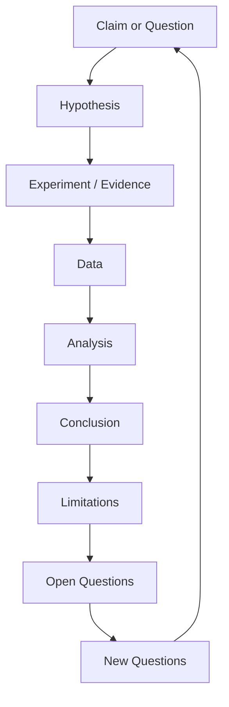
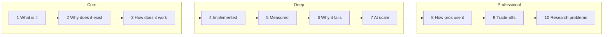

# Chapter 13: The Science of This Course

> **Last Updated:** August 2026 | **Estimated Reading Time:** 60–75 minutes

Every course claims to be "scientifically designed". This one shows you the receipts. This chapter opens the black box: the instructional-design frameworks, the scientific loop, the evidence hierarchy, and the investigation structure that shaped Chapters 1–12 — and gives you the tools to audit any study material, including this course, the same way.

> **How to work this chapter** — this one is a lens, not a toolkit:
>
> 1. **Read** — 60–75 minutes, split across 2–3 commute blocks.
> 2. **Do** — run every **Try This** as you go; the chapter's power is in the prompts you actually execute.
> 3. **Prove** — score 8/10 or better on the Chapter Quiz before moving on.
> 4. **Produce** — your investigation-note template, plus 10 claims from your own notes tagged by evidence level.
>
> **Prerequisites:** Chapters 1–12 — it explains the machinery you just used. **Next:** you are ready to apply.

## Learning Objectives

- Explain why this course is structured as objectives, Q&A, proof, summary, contradictions, and open questions
- Map Gagné's nine events of instruction onto the anatomy of a chapter
- Run the scientific loop (question → hypothesis → experiment → analysis → conclusion → limitations) on any claim you learn
- Use the evidence hierarchy to tag claims as Fact, Observation, Interpretation, or Opinion
- Climb the ten-rung depth ladder from "what is it" to "what are the research problems"
- Apply the golden explanation sequence when you study any technical topic
- Write investigation-structured notes with the investigation-note prompt
- Audit any course — including this one — for scientific rigor instead of trusting its marketing

## Chapter at a Glance

| Topic | Key Insight | Practical Takeaway |
|-------|-------------|--------------------|
| Three layers of design | The course is built from learning science + scientific method + book story arc | Know which layer you are inside before judging it |
| Gagné's nine events | Every chapter is a fixed teaching sequence from instructional design | Use the sequence to structure your own lessons |
| The scientific loop | Claims are hypotheses; evidence is data; conclusions are provisional | Run small experiments instead of trusting vibes |
| Evidence hierarchy | Fact, Observation, Interpretation, Opinion are not the same strength | Tag every claim in your notes before memorizing it |
| Depth ladder | Ten rungs from "what is it" to "research problems" | Route each topic to the rung your goal needs |
| Investigation notes | Notes structured as question → evidence → contrary → conclusion | The AI generates them; you audit them |



## Q1: Why is this course structured the way it is?

**Answer:** The course is assembled from three independent layers, and understanding the layers is the first step to using the material critically:

1. **Learning science** — the evidence on how humans retain (testing effect, spacing, interleaving, dual coding). This determines *what* each chapter does: objectives up front, quizzes at the end, Try This everywhere.
2. **The scientific method** — every claim is treated as a hypothesis with evidence attached. This determines *how* each chapter argues: a question, a mechanism, a worked example as evidence, and limitations at the end.
3. **Book craft** — the story arc, the curiosity gap, and the serial-position effect determine *where* things sit: the strongest question opens, the summary closes.

When a chapter feels padded or missing something, ask which layer failed — the science, the argument, or the storytelling. They fail differently.

**How it works:** A structure you cannot name is a structure you cannot repair. Naming the three layers turns criticism into diagnosis.

**Try This:** Pick the last chapter you read and write down which parts came from which layer. Most of the content is layer 2; most of the layout is layer 3.

## Q2: What are Gagné's nine events of instruction, and where do they appear in this course?

**Answer:** Robert Gagné's nine events are the classic instructional-design sequence, and every chapter in this course follows it:

| # | Event | Where it appears |
|---|-------|------------------|
| 1 | Gain attention | The Q&A question itself — a curiosity gap |
| 2 | State objectives | Learning Objectives |
| 3 | Recall prior learning | The prerequisites line + "from Chapter N" callouts |
| 4 | Present content | The Answer + prompt + transcript |
| 5 | Provide guidance | The "How it works" line under each Q |
| 6 | Elicit performance | Try This |
| 7 | Give feedback | Transcripts showing the expected AI exchange |
| 8 | Assess | Chapter Quiz with answers in details blocks |
| 9 | Enhance retention and transfer | Practical Takeaways + Exercises tied to your syllabus |

The order matters as much as the content. Objectives before content is not a stylistic choice — event 2 before event 4 is what tells the brain what to encode.

**How it works:** Gagné is the skeleton the chapters hang on; the Q&A voice is the skin.

**Try This:** Take one concept you must learn this week and write a mini-lesson with the nine events, one line each. Compare it to how you normally study — you will feel the difference in event 6 (performance) alone.

## Q3: What is Bloom's taxonomy, and how do the chapters climb it?

**Answer:** Bloom's taxonomy is the ladder of cognitive demand: Remember → Understand → Apply → Analyze → Evaluate → Create. A chapter deliberately climbs it:

- **Remember/Understand** — the Q&A answers and the Chapter at a Glance
- **Apply** — Try This and the copy-paste prompts
- **Analyze** — the Contradictions section, which forces you to judge when the method fails
- **Evaluate** — the Chapter Quiz (8/10 gate) and the exercises that ask "which prompt fits this situation"
- **Create** — the chapter deliverables (your plan, your cards, your vault, your system)

Most study material stops at Understand. That is why it feels easy and produces nothing. The chapters force you to the top of the ladder by attaching a **Produce** step to every chapter.

**How it works:** Bloom is the vertical axis of the course; Gagné is the horizontal sequence. Both appear in every chapter.

**Try This:** Look at your last week of studying. Which Bloom rung did most of it happen on? If it was Remember, that explains why it did not stick.

## Q4: What is the scientific loop, and how does it appear inside the chapters?

**Answer:** The scientific loop is: Question → Background → Hypothesis → Experiment → Data → Analysis → Conclusion → Limitations → Application. Every Q&A in this course is a compressed loop:

- **Question** — the Q heading
- **Hypothesis** — the Answer's first sentence ("the most effective way is...")
- **Experiment** — the prompt or TypeScript tool, which you are meant to run
- **Data** — the transcript or your own output
- **Analysis** — How it works
- **Conclusion** — the Summary
- **Limitations** — the Contradictions box

You can run the loop yourself on any claim: instead of "Redis is fast", you run "Redis is fast" as a hypothesis, measure cached vs uncached latency, and record your own numbers. The chapters do this for you with prompts; your job is to actually execute the experiments instead of reading them.

**How it works:** A claim without an experiment is marketing. Every prompt in this course is an experiment you have not run until you run it.

**Try This:** Take the claim "interleaving beats blocked practice" from Chapter 5. Write a one-paragraph hypothesis, run one interleaved quiz session this week, and record your correct rate against a blocked session. That is the loop.

## Q5: Why does every chapter now contain a Contradictions section?

**Answer:** Because a chapter that argues against itself is more trustworthy than a chapter that argues for itself. The Contradictions box lists the cases where the chapter's own methods are wrong, suboptimal, or risky: where cramming beats the pipeline, where Anki beats Socratic quizzing, where summaries leak nuance. This is the "contrary evidence" step of scientific nonfiction — the author shows you the data that does not fit before you find it the hard way.

The trust mechanic is real: a reader who catches a contradiction the author hid will discount everything the author said. A reader who finds the author already listed it will upgrade the author's credibility. This course chooses the second outcome.

**How it works:** Contradictions convert the chapter from persuasion into investigation — from "here is my conclusion, let me defend it" to "here is my question, let's see what survives".

**Try This:** Before you trust any new AI answer, ask it: "List three cases where this advice is wrong or risky." If it cannot, the advice is probably generic. That is the Contradictions prompt, on demand.

## Q6: What is the evidence hierarchy, and how do I tag claims?

**Answer:** Claims are not equal. From strongest to weakest: peer-reviewed research → official standards → official documentation → benchmark results → reproducible experiments → engineering reports → expert opinion → blog posts → random posts. In fast-moving fields like AI, your notes will mix all of them, and the danger is not the weak claims — it is that your memory will treat them as equal.

Tag every claim you save with one of four labels:

- **Fact** — verifiable from a primary source (documented API behavior, published benchmark, standard)
- **Observation** — something you or a reliable reporter measured in one setting ("in our benchmark, A beat B")
- **Interpretation** — an explanation of an observation ("the gap may be due to...")
- **Opinion** — a preference ("I prefer architecture X")

**How it works:** The label changes what you do: Facts are safe to memorize; Observations are safe to repeat with their context; Interpretations are worth testing; Opinions are worth ignoring in interviews.

**Try This:** Open your notes from this week and tag ten claims. You will find that most of what you "learned" is Interpretation wearing Fact's clothes.

## Q7: What is the depth ladder, and how do I climb it per topic?

**Answer:** The depth ladder is ten rungs of understanding: (1) What is it? (2) Why does it exist? (3) How does it work? (4) How is it implemented? (5) How do we measure it? (6) Why does it fail? (7) How does it behave at scale? (8) How do professionals use it? (9) What are the trade-offs? (10) What are the current research problems?

Most people stop at rung 1–3 and call it learning. This course routes topics to rungs by goal:

- **Service-company interviews** — rungs 1–3 plus rung 8 (practical usage) is usually enough
- **Product-company interviews** — rungs 1–6, with 5 and 6 being the differentiators
- **AI engineering roles** — rungs 1–9, with 9 (trade-offs) being what interviewers probe
- **Research-adjacent roles** — rung 10 starts to matter

The ladder is also a diagnostic: when a topic feels "learned but weak", find the rung you skipped. It is almost never rung 1.



**How it works:** The ladder converts "how deep should I go?" from a feeling into a routing decision based on your target.

**Try This:** Take one topic you are "learning" right now and mark the rung you are actually on. Then route it to the rung your target role needs. Example: for Kafka as a backend candidate, rung 8 (how pros use it: consumer groups, retention policies) matters more than rung 10.

## Q8: What is the investigation structure, and why does it beat "introduction → conclusion"?

**Answer:** The investigation structure for nonfiction is: Big Question → What do we know → Observations → Evidence → Hypotheses → Supporting and Contrary evidence → Analysis → Conclusion → Limitations → What we don't know → New questions. Its core principle: **do not write to prove your conclusion; write to discover whether your conclusion survives the evidence.**

Classic persuasive writing starts with the conclusion and recruits reasons for it. Investigation-structured writing starts with the question and lets the evidence decide — which is exactly how the best popular science books work (Kahneman, Sagan, Kolbert). The course applies it in miniature: each chapter is an investigation, each Contradictions box is the contrary evidence, each Open Questions box is the honest ending.

**How it works:** Persuasion is remembered as vibes; investigations are remembered as conclusions with their survival story attached. The survival story is what makes the knowledge defensible in interviews.

**Try This:** Rewrite one study note as an investigation: question, evidence, contrary evidence, conclusion, open question. Run it through the investigation-note prompt in Q12 and compare the quality of what you remember.

## Q9: What is the golden explanation sequence?

**Answer:** The golden sequence for explaining any technical concept: WHAT → WHY → INTUITION → HOW → FORMAL DEFINITION → EXAMPLE → CODE → EXPERIMENT → RESULT → LIMITATIONS → REAL WORLD. Two rules govern it:

1. **Intuition before formal** — the formal definition lands only after the mental model is planted. "A database index is like a book's index" must come before "a B-tree that improves retrieval at the cost of write overhead".
2. **One concept, many representations** — English → analogy → diagram → formula → numbers → code. Each representation is a separate retrieval route; a concept with one representation is a concept you can only recall one way.

This sequence is why the course's Q&As put a copy-paste prompt (the worked example) before the analysis, and why the Mermaid diagram appears before the Q&As, not after.

**How it works:** The sequence respects cognitive load (one chunk at a time) and dual coding (text plus diagram). You are not smarter when reading in this order; your working memory just has room to breathe.

**Try This:** Explain your weakest topic from this week to the AI in the golden sequence order, one stage per message, and ask it to flag any stage you skipped. Skipped stages are where interviews expose you.

## Q10: How do I run a five-minute self-experiment on any claim?

**Answer:** A self-experiment is the scientific loop compressed to five minutes. The prompt that runs one:

```
Act as a lab assistant. I am testing the claim: "{claim}".
Design a 5-minute experiment I can run today with {tool or material}.
Steps: give me (1) the exact setup, (2) the measurement, (3) a table
for recording results, (4) what outcome would support the claim,
(5) what outcome would contradict it. Do not run the experiment for
me — tell me what to do and what to write down.
```

Run it, record numbers, then answer three questions: Did the data support the claim? Where is the data weak? What would I measure next? A claim that survives one honest experiment is worth more than ten videos that assert it.

**How it works:** Measuring turns studying from intake into research. Your five-minute numbers are weak evidence — but they are *your* evidence, and they calibrate the claims you memorize.

**Try This:** Test "Socratic quizzing beats re-reading my notes" tonight: 10 minutes of each on the same topic, recall test after, write down both scores. One data point. That is how the chapter authors would want you to read this chapter.

## Q11: What is the investigation-note prompt?

**Answer:** The investigation-note prompt is the course's signature tool — it forces AI to structure every study note as a scientific investigation instead of a summary:

```
I am studying: {topic}.
Research the topic and produce an investigation note with EXACTLY
these sections:
1. Big Question — what this topic answers
2. What We Know — 3-5 verified claims, each tagged [FACT] or
   [OBSERVATION] or [INTERPRETATION] or [OPINION]
3. Evidence — for each claim, one concrete example, number,
   benchmark, or documentation fact
4. Contrary Evidence — 2-3 ways the common understanding is wrong,
   outdated, or contested; if none exists, say so explicitly
5. Conclusion — what the evidence actually supports, stated in
   one sentence
6. Limitations — what this note does NOT cover or cannot claim
7. Open Questions — 2-3 questions a researcher would ask next
8. Sources — real links for every [FACT] claim
Rules: never invent numbers or sources; mark anything you cannot
verify as [UNVERIFIED]; keep total under 800 words.
```

The note is not finished until the AI has written section 4. If it cannot find contrary evidence, the topic is either too new or the model is being agreeable — run the cross-verification protocol from Chapter 11.

**How it works:** The template enforces the structure you would not write voluntarily. Every section is a different cognitive task: 1–3 build the claim, 4 stress-tests it, 5–7 force honesty.

**Try This:** Generate an investigation note for your current weakest topic and paste it into your vault. Then answer section 7 yourself — that is the point where learning becomes research.

## Q12: How do I audit any course or book for scientific rigor?

**Answer:** Use the audit prompt, which asks the same questions a skeptical reviewer would:

```
You are a rigorous book reviewer. I will give you a chapter of
study material. Answer with evidence from the text:
1. Are claims tagged by strength (fact/observation/opinion), or
   are they all asserted equally?
2. Does the material present contrary evidence, or only support
   for its own conclusion?
3. Are examples reproducible (exact inputs, expected outputs), or
   decorative?
4. Are limitations and failure cases discussed, or only success
   cases?
5. Are sources cited for factual claims?
6. What is the depth ladder rung this material actually reaches?
7. Would a skeptical expert change their view after reading it?
Score each criterion 0-2 and end with a verdict: PASS / PASS WITH
NOTES / FAIL, with the three most damning issues first.
```

Run this on the next tutorial you find. Most tutorials fail on criteria 2 and 4 — no contrary evidence, no failures. That is the difference between a tutorial and a lesson.

**How it works:** Auditing turns you from consumer into critic. The discipline transfers: the same seven questions you ask of a book are the ones you should ask of every AI answer in your study pipeline.

**Try This:** Paste this chapter's Q5 answer into the audit prompt. The expected verdict: PASS WITH NOTES — it cites no external sources, which is an honest weakness of a self-contained course.

## Q13: How do the twelve chapters map to the nineteen-section chapter skeleton?

**Answer:** The ideal technical chapter skeleton has nineteen sections: Objectives, Problem, Motivation, Prerequisites, Intuition, Formal Definition, Mental Model, How It Works, Example, Implementation, Experiment, Results, Analysis, Common Mistakes, Real-World Usage, Limitations, Exercises, Mini-Project, Summary. This course compresses them rather than dropping them:

| Skeleton section | Where it lives in the course |
|------------------|------------------------------|
| Objectives | Learning Objectives |
| Problem + Motivation | The Q&A question + the Answer's opening sentence |
| Prerequisites | The "How to work this chapter" prerequisites line |
| Intuition | The Chapter at a Glance table + analogies inside Q&As |
| Formal Definition | Formal definitions appear inside Answers after intuition |
| Mental Model | Mermaid diagrams + analogy prompts (Chapter 4) |
| How It Works | The "How it works" line under every Q |
| Example + Implementation | Copy-paste prompts + TypeScript tools |
| Experiment + Results | Transcripts + your own Try This runs |
| Analysis | "How it works" + Practical Takeaways |
| Common Mistakes | Contradictions box + anti-slop chapters |
| Real-World Usage | Commute-block workflows + weekly cadence |
| Limitations | Contradictions + Open Questions |
| Exercises + Mini-Project | Exercises + per-chapter deliverables + Chapter 12 |
| Summary | Summary |

The nineteen-section skeleton is the template for any serious technical book; the course is a compressed, conversational version of it. If you ever write your own chapter, write the nineteen sections, then compress.

**How it works:** Knowing the mapping means you can find the missing piece in any material: if a source has no Limitations, you can write them yourself.

**Try This:** Pick the skeleton section this course handles worst in your opinion (Open Questions is a fair candidate) and write one sentence of honest criticism. Chapter 14 of your own knowledge starts there.

## Q14: How do I apply the depth ladder and evidence hierarchy to DSA and ML study?

**Answer:** Two worked routings.

**DSA:** Rungs 1–3 (what a pattern is, why it exists, how it works) come from Chapter 6's pattern mapper. Rung 5 (measure) is complexity analysis — the grader tool forces it. Rung 6 (why it fails) is edge cases and worst-case inputs. Rung 9 (trade-offs) is the interview question "why this over that". Evidence tagging: time-complexity results in a textbook are Facts (provable); "interviewers ask sliding window often" is an Observation (context-bound); "two-pointers is the easiest pattern to master first" is Opinion.

**ML:** Rungs 1–3 from the machine-learning course chapters; rung 5 from evaluation metrics; rung 6 from overfitting and data-leakage chapters; rung 10 from papers. Evidence tagging matters most here: benchmark tables are Observations of one setting, not Facts — "GPT-4o scores X on MMLU" is an Observation, and repeating it as a Fact in an interview is exactly the kind of overclaim the verification chapter warns about.

**How it works:** Routing and tagging are habits, not knowledge. Apply them to one topic a day until they are automatic.

**Try This:** Take one DSA pattern and one ML concept from your current prep. Write the rung each is on and tag the three claims you most often repeat.

## Q15: What is the correlation-vs-causation discipline, and why does it matter for study advice?

**Answer:** Study advice is full of correlations sold as causes: "people who study early mornings succeed" (correlation — morning people may also be more disciplined), "AI users learn faster" (correlation — motivated students adopt AI first). The discipline has three moves:

1. Ask what the direction could be reversed — does the habit cause the outcome, or does the outcome enable the habit?
2. Ask what third variable could explain both (motivation, free time, prior ability)
3. Say "associated with" instead of "causes" until an experiment intervenes

The course's own claims deserve the same treatment: "interleaving improves retention" is cause-backed by experiments; "AI accelerates your placement prep" is mostly correlation in your personal data. Chapter 11's confidence tagging is the operational version of this discipline.

**How it works:** Interviewers test this exactly once: they ask "why did your accuracy improve?" The candidate who says "because I practiced more" states a correlation as a cause. The candidate who says "I changed one variable at a time" has internalized the discipline.

**Try This:** Take your most recent "improvement" — quiz score, solve speed — and write the two alternative explanations (reversed direction, third variable) before crediting your study method.

## Q16: How do I write a chapter of my own using everything in this course?

**Answer:** The writer's recipe, applied to any topic you must master or teach:

1. Write the big question the chapter answers (one sentence)
2. Write the nineteen-section skeleton (Q13) as bullet headings, empty
3. Fill Objectives (Bloom verbs) and Prerequisites first
4. Write the Q&As as the middle: one question per curiosity gap, answer-first, evidence second (prompt/example/code), analysis third
5. Write the Contradictions box by asking the AI for the three cases where your own advice fails
6. Write Open Questions last — they are the easiest to fake and the most valuable to be honest about
7. Add one diagram per major mental model; add one experiment the reader can run in five minutes
8. Compress to the course's chapter anatomy and pass it through the audit prompt from Q12

The point is not to publish — the point is that writing one rigorous chapter about a topic is worth ten hours of reading about it. Generation beats consumption.

**How it works:** The recipe externalizes every framework in this course into a checklist. The checklist is what separates "I should learn this" from "I have a defensible position on this".

**Try This:** Write a 300-word mini-chapter about your current weakest topic using steps 1–6. Keep it, and compare it to your normal notes in two weeks.

## Q17: What is the claim-tagger tool, and how do I use it?

**Answer:** The claim-tagger is a small TypeScript utility that forces you to classify claims before they enter your notes. It takes a list of claims and makes you assign Fact / Observation / Interpretation / Opinion plus a confidence value, and it refuses to export unclassified claims:

```typescript
type Evidence = 'FACT' | 'OBSERVATION' | 'INTERPRETATION' | 'OPINION';

interface TaggedClaim {
  claim: string;
  evidence: Evidence;
  confidence: 0 | 1 | 2 | 3; // 0 = guess, 3 = verified against a source
  source?: string;
  date: string;
}

class ClaimTagger {
  private claims: TaggedClaim[] = [];

  add(claim: string, evidence: Evidence, confidence: 0 | 1 | 2 | 3, source?: string): void {
    if (confidence === 0 && !source) {
      throw new Error(`Rejected unverified claim: "${claim}". Add a source or raise confidence.`);
    }
    this.claims.push({ claim, evidence, confidence, source, date: new Date().toISOString().slice(0, 10) });
  }

  export(): TaggedClaim[] {
    return [...this.claims];
  }

  summary(): string {
    const byEvidence = this.claims.reduce<Record<string, number>>((acc, c) => {
      acc[c.evidence] = (acc[c.evidence] ?? 0) + 1;
      return acc;
    }, {});
    return Object.entries(byEvidence)
      .map(([k, v]) => `${k}: ${v}`)
      .join(' | ');
  }
}

const tagger = new ClaimTagger();
tagger.add('Transformer architecture uses self-attention', 'FACT', 3, 'Vaswani et al. 2017');
tagger.add('GPT-4o scored 87% on MMLU', 'OBSERVATION', 2, 'OpenAI benchmark report');
tagger.add('Chain-of-thought improves reasoning', 'INTERPRETATION', 1);
tagger.add('RAG is better than fine-tuning for docs', 'OPINION', 1);
console.log(tagger.summary()); // FACT: 1 | OBSERVATION: 1 | INTERPRETATION: 1 | OPINION: 1
```

**How it works:** The throw on unverified claims is the point — the tool enforces the rule you would otherwise skip. Run it weekly on the claims you are about to memorize.

**Try This:** Tag ten claims from your current week of study. Count how many are FACT with a real source. The usual answer, 2–3, is the honest calibration the evidence hierarchy is designed to produce.

## Q18: What is the framework audit, and how do I keep this course honest over time?

**Answer:** A framework is a hypothesis about how to learn, and hypotheses get stale: models change, evidence updates, your schedule shifts. Run the framework audit quarterly:

```
Evaluate my study system against these questions:
1. Which claims I memorized were disproven or changed in the last
   quarter? What does that say about my tagging?
2. Which experiments did I actually run vs. which prompts did I
   only read? (be honest about the ratio)
3. Which chapter of the course am I skipping, and why? Is the
   reason valid?
4. Are my mastery scores still tracking reality, or have they
   become self-consistent fiction?
5. What new AI capability changed which part of my system?
6. What should I STOP doing that this course told me to do?
```

Question 6 is the one that keeps the system alive. A course that cannot be outgrown is a cult; the Open Questions boxes exist so you can find the edges where this course stops being right for you.

**How it works:** Quarterly audits convert the system from a fixed process into a living experiment — which is the whole thesis of this chapter.

**Try This:** Answer question 6 honestly for yourself right now. One "stop" is enough; write it in your tracker.

## Q19: What are the limits of this framework itself?

**Answer:** Honesty requires the framework to audit itself:

- **The frameworks overlap and sometimes conflict** — Gagné says present content before practice; interleaving research says mix it. The course resolves this by ordering within a Q&A and mixing across chapters; the resolution is a design judgment, not a finding.
- **The scientific loop is compressed, not run** — most chapters give you the experiment, not its results; your execution is the actual evidence, and most readers will not run most experiments.
- **The evidence hierarchy is a heuristic, not a measurement** — tagging is subjective; two people will tag the same claim differently.
- **Instructional design research is itself contested** — Gagné's nine events were derived from a different era of media; their modern validity is partially assumption.
- **The course cites no external sources inline** — an intentional self-containment trade-off, and a real weakness by its own Q12 audit standard.

These limits are the Open Questions box of this chapter. They are listed here because a chapter about scientific honesty that hid its own weaknesses would be the strongest possible argument against itself.

**How it works:** The framework's credibility depends on naming its failure modes — the same mechanic the Contradictions boxes use.

**Try This:** Pick one of the five limits above and find the chapter in this course where it bites hardest. Write one sentence of that chapter's counterargument.

## Q20: Where does this chapter fit in the bigger learning system?

**Answer:** This chapter is the lens, not the toolbox. Chapters 1–12 give you prompts, tools, and workflows; this chapter gives you the judgment to know when they are right, when they are wrong, and what to do instead. That is the difference between a user of a method and a designer of one.

In the wider repository, this chapter is the bridge between the practical course and the theory: the learning-how-to-learn course covers the cognitive science (spacing, recall, interleaving), and this chapter covers the *metacognition of the material itself* — how to read any course, including these, as an investigation. When you finish your placement prep, the person who survives the interview loop is the one who can explain not just what they know, but how they know it, and when they doubt it. That is exactly the training this chapter is for.

**How it works:** Tools make you fast; frameworks make you correct; the audit makes you durable. All three are now in your vault.

**Try This:** Close the loop: run the audit prompt from Q12 against this chapter, then the framework audit from Q18 against your whole system, and archive both answers in your vault. Your next quarterly review will thank you.

## Summary

- The course is built from three layers — learning science, the scientific method, and book craft — and each layer fails differently
- Gagné's nine events and Bloom's taxonomy are the horizontal and vertical skeleton of every chapter
- Every Q&A is a compressed scientific loop: question, hypothesis, experiment, analysis, conclusion, limitation
- Contradictions boxes present the evidence against the chapter's own methods; Open Questions admit what is unknown
- Claims belong in four buckets — Fact, Observation, Interpretation, Opinion — and tagging changes what you can safely memorize
- The depth ladder routes how deep to go based on your target role, not on your curiosity
- The golden sequence (intuition before formal, many representations per concept) is the default explanation order
- The investigation-note prompt makes AI structure every note as question → evidence → contrary → conclusion → open questions
- The audit prompt lets you critique any material — including this course — instead of trusting its marketing
- A framework that cannot be outgrown is a cult; run the quarterly framework audit and keep your edges sharp

## Contradictions

- A chapter about the scientific method that cites almost no external sources is itself a weak-evidence artifact by its own Q12 standard — the courses in this repo trade inline citations for self-containment.
- The frameworks sometimes conflict (Gagné's sequencing vs. interleaving research), and the course's resolutions are design judgments, not findings.
- Teaching you to distrust every claim includes distrusting this chapter; a reader who rejects the whole framework after finding one error in it has missed the point, and the chapter cannot prevent that misreading.
- The claim-tagger tool enforces rules mechanically; tagging quality still depends on your judgment, which is exactly what the tool was supposed to protect you from.

## Open Questions

- Whether the compressed scientific loop (reader runs the experiment later) retains as well as running experiments inline is unmeasured.
- Whether readers actually run the Contradictions and audit prompts, or only read them, is the silent variable in this course's effectiveness.
- How these frameworks hold up as AI models change the study environment is an open question the quarterly audit is designed to catch.

## Practical Takeaways

| Technique | Prompt / Command | When to Use |
|-----------|------------------|-------------|
| Scientific loop | "Design a 5-minute experiment for: {claim}" | Before memorizing any claim |
| Evidence tagging | Claim-tagger TS tool (Q17) | Weekly, on the claims about to enter notes |
| Investigation note | Investigation-note prompt (Q11) | Every topic you must actually master |
| Course audit | Book-reviewer prompt (Q12) | Before trusting any tutorial or book |
| Depth routing | Rung 1–10 ladder (Q7) | When deciding how deep to study a topic |
| Golden sequence | Explain in WHAT→WHY→INTUITION→FORMAL→CODE→EXPERIMENT→LIMITS order | When explaining anything to yourself or AI |
| Framework audit | Six-question quarterly prompt (Q18) | Every quarter, on your whole study system |

## Chapter Quiz

1. Which Gagné event does "Try This" map to?
   <details><summary>Answer</summary>Event 6 — elicit performance: the learner performs, not just reads.</details>
2. What is the strongest rung on the depth ladder?
   <details><summary>Answer</summary>Rung 10 — current research problems. (Rung 5, "how do we measure it", is often the most interview-differentiating.)</details>
3. "In our benchmark, model A was faster than model B" is which evidence class?
   <details><summary>Answer</summary>Observation — measured in one setting, not a universal fact.</details>
4. Why do chapters contain Contradictions boxes?
   <details><summary>Answer</summary>To present contrary evidence — the cases where the chapter's methods fail — which converts persuasion into investigation and builds trust.</details>
5. Which is NOT one of Gagné's nine events?
   <details><summary>Answer</summary>"Provide entertainment" is not an event; attention, objectives, prior recall, content, guidance, performance, feedback, assessment, transfer are.</details>
6. What is the main risk of a too-strict verification guard, per Chapter 11?
   <details><summary>Answer</summary>Learners quietly stop using it; an unused guard protects nothing.</details>
7. The investigation-note prompt's most important section is which?
   <details><summary>Answer</summary>Contrary Evidence — if the AI cannot produce it, the model is being agreeable or the topic is unexamined.</details>
8. Which layer of course design does the serial-position effect belong to?
   <details><summary>Answer</summary>Book craft — where things sit (strongest question opens, summary closes) is storytelling, not learning science.</details>
9. What does the claim-tagger do when a claim has confidence 0 and no source?
   <details><summary>Answer</summary>It throws an error and refuses to store the claim — enforcing the tagging rule mechanically.</details>
10. What is the purpose of the quarterly framework audit's question 6 ("what should I STOP doing?")?
    <details><summary>Answer</summary>To let the system be outgrown — a framework that cannot be revised is a cult, not a method.</details>

## Exercises

1. **Recall** — List Gagné's nine events without looking, then check the mapping table in Q2.
2. **Apply** — Tag ten claims from your notes using the claim-tagger; fix any claim you cannot tag honestly.
3. **Apply** — Run one 5-minute self-experiment on a claim you currently believe; record the result table.
4. **Analyze** — Generate an investigation note for your weakest topic and grade it against the eight required sections.
5. **Evaluate** — Run the audit prompt (Q12) against a tutorial you were about to follow, and decide whether it is worth your time.
6. **Create** — Write the nineteen-section skeleton for one topic, fill at least six sections, and compress it to the course anatomy.

## Further Reading

- [Gagné's Nine Events of Instruction (Northern Illinois University)](https://www.niu.edu/citl/resources/guides/instructional-guide/gagnes-nine-events-of-instruction.shtml)
- [Bloom's Taxonomy (Vanderbilt University CFT)](https://cft.vanderbilt.edu/guides-sub-pages/blooms-taxonomy/)
- [Make It Stick — Brown, Roediger, McDaniel](https://www.makeitstick.net/)
- [Carl Sagan — The Demon-Haunted World (scientific skepticism)](https://en.wikipedia.org/wiki/The_Demon-Haunted_World)
- [The Sixth Extinction — Elizabeth Kolbert (investigation-structured nonfiction)](https://en.wikipedia.org/wiki/The_Sixth_Extinction_(Kolbert_book))


