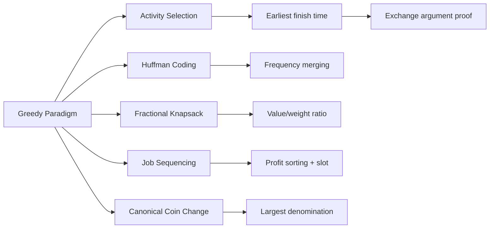

# Chapter 6: Greedy Algorithms

> **Prerequisites:** [Chapter 5: Divide and Conquer](./05-divide-conquer.md) — Recursive problem decomposition | **Next:** [Chapter 7: Dynamic Programming — Foundations](./07-dp-intro.md) — When greedy fails, DP takes over

## Learning Objectives

By the end of this chapter, students will be able to:

<!-- Image Gallery -->
<section class="lesson-visuals" aria-label="Visual learning resources">
  <header><span>VISUAL LEARNING</span><h2>See it. Review it. Remember it.</h2></header>
  <a class="lesson-visual-card" href="../../assets/images/lessons/algorithms/06-greedy/handwritten-notes.png" target="_blank" rel="noopener">
    
    <span><strong>Handwritten notes</strong>Condensed notes for deliberate review.</span>
  </a>
  <a class="lesson-visual-card" href="../../assets/images/lessons/algorithms/06-greedy/sticky-notes.png" target="_blank" rel="noopener">
    
    <span><strong>Sticky-note revision</strong>Fast recall prompts for revision.</span>
  </a>
  <a class="lesson-visual-card" href="../../assets/images/lessons/algorithms/06-greedy/visual-explanation.png" target="_blank" rel="noopener">
    
    <span><strong>Visual concept guide</strong>A connected explanation of the key ideas.</span>
  </a>
</section>
<!-- End Image Gallery -->


1. Understand the greedy paradigm and the conditions under which it produces optimal solutions.
2. Implement activity selection, Huffman coding, fractional knapsack, job sequencing, and canonical coin change.
3. Prove the optimality of greedy algorithms using the exchange argument.
4. Distinguish between problems solvable by greedy algorithms and those requiring dynamic programming.

---

### Why Greedy Algorithms Matter

Imagine you are packing a suitcase for a trip. You have limited space, and you want to carry the most valuable combination of items. One natural approach: grab the item with the best value-per-space ratio first, then the next best, and so on. This is exactly how greedy algorithms think — they make the best immediate choice without worrying about future consequences.

Now imagine making change for a customer at a cash register. You want to use the fewest coins possible. In the US (quarters, dimes, nickels, pennies), the natural strategy is to take the largest coin that fits, again and again. This greedy approach works perfectly for that system.

But what if your coin system was 1, 3, and 4 cents? To make 6 cents, the greedy approach picks 4 + 1 + 1 (three coins), while the optimal is 3 + 3 (two coins). **Greedy fails when local optimization does not align with global optimization.**

This tension — between the seductive simplicity of "take what looks best now" and the mathematical rigor required to prove it actually works — is what makes greedy algorithms both powerful and dangerous. They are the first tool you reach for, but they demand proof before you trust them.

Greedy algorithms power file compression (Huffman coding in ZIP, JPEG), network routing (Dijkstra, OSPF), operating system scheduling (Shortest Job First), and even DNA sequence assembly. Understanding when they work — and when they do not — separates a competent programmer from a master algorithm designer.

---

### Chapter at a Glance

| Topic | Key Insight | Practical Takeaway |
|-------|-------------|-------------------|
| Greedy Paradigm | Local optimal choices lead to global optimum | Requires optimal substructure + greedy-choice property |
| Activity Selection | Pick earliest-finish activity first | Classic exchange argument proof of optimality |
| Huffman Coding | Merge lowest-frequency characters | Optimal prefix code for data compression |
| Fractional Knapsack | Take highest value/weight ratio | Greedy works because you can take fractions |
| Job Sequencing | Schedule by profit, use latest slot | O(n log n) with union-find optimization |
| Canonical Coin Change | Take largest denomination first | Fails for non-canonical systems like 1,3,4 |

### Chapter Roadmap



## Theory


### 6.1 The Greedy Paradigm


A greedy algorithm makes the locally optimal choice at each step, hoping that local optima lead to a global optimum. For many problems this approach fails, but for problems that exhibit **optimal substructure** and the **greedy-choice property**, it yields optimal solutions.

**Greedy-choice property:** A globally optimal solution can be reached by making a locally optimal (greedy) choice.

**Optimal substructure:** An optimal solution to the problem contains optimal solutions to subproblems.

**Exchange argument (proof technique):** Show that any optimal solution can be transformed into the greedy solution without worsening the objective.

> **Pro Tip:** Before using a greedy algorithm, always verify the two properties: optimal substructure and greedy-choice property. If you can find a counterexample where a local choice leads to a suboptimal global solution, you need DP instead.

**One-Sentence Takeaway:** Greedy algorithms work when making the best local choice at each step leads to a globally optimal solution, requiring both optimal substructure and the greedy-choice property.

---

### 6.2 Activity Selection


**Real-World Analogy:** A conference room can host only one meeting at a time. You have a list of meeting requests with start and end times. How do you schedule the maximum number of meetings? The greedy strategy: always pick the meeting that ends the earliest, because it leaves the most room for subsequent meetings.

**Problem:** Given \( n \) activities with start times \( s_i \) and finish times \( f_i \) (where \( s_i &lt; f_i \)), select the maximum number of non-overlapping activities.

**Greedy strategy:** Always select the activity with the earliest finish time that does not conflict with previously selected activities.

#### Algorithm Steps

1. Sort all activities by finish time in ascending order.
2. Select the first activity (earliest finish).
3. Set `lastFinish = f[0]`.
4. For each remaining activity in sorted order:
   - If its start time \( s_i \ge \) `lastFinish`, select it and update `lastFinish = f_i`.
5. Return the selected set.

#### Pseudocode

```
ActivitySelection(s, f, n):
    Sort activities by finish time
    selected = [0]
    lastFinish = f[0]
    for i = 1 to n-1:
        if s[i] >= lastFinish:
            selected.push(i)
            lastFinish = f[i]
    return selected
```

#### Dry Run with Trace Table

**Input:** Activities indexed 0..6 with (start, finish): (0,6), (1,4), (3,5), (3,8), (5,7), (8,9), (6,10)

**Step 1 — Sort by finish time:**

| Index | Start | Finish |
|-------|-------|--------|
| 1     | 1     | 4      |
| 2     | 3     | 5      |
| 0     | 0     | 6      |
| 4     | 5     | 7      |
| 3     | 3     | 8      |
| 5     | 8     | 9      |
| 6     | 6     | 10     |

**Step 2 — Iterate:**

| i | Act (s,f) | s >= lastFinish? | lastFinish | Selected |
|---|-----------|------------------|------------|----------|
| - | (1,4)     | - (selected first) | 4        | [1]      |
| 1 | (3,5)     | 3 >= 4? No       | 4          | [1]      |
| 2 | (0,6)     | 0 >= 4? No       | 4          | [1]      |
| 3 | (5,7)     | 5 >= 4? **Yes**  | 7          | [1,4]    |
| 4 | (3,8)     | 3 >= 7? No       | 7          | [1,4]    |
| 5 | (8,9)     | 8 >= 7? **Yes**  | 9          | [1,4,5]  |
| 6 | (6,10)    | 6 >= 9? No       | 9          | [1,4,5]  |

**Result:** Selected activities: (1,4), (5,7), (8,9) — 3 activities maximum.

#### Implementations

**C++:**
```cpp
#include <vector>
#include <algorithm>

struct Activity { int start, finish; };

std::vector<int> activitySelection(std::vector<Activity>& acts) {
    std::sort(acts.begin(), acts.end(),
              [](const Activity& a, const Activity& b) {
                  return a.finish < b.finish;
              });
    std::vector<int> selected = {0};
    int lastFinish = acts[0].finish;
    for (size_t i = 1; i < acts.size(); ++i) {
        if (acts[i].start >= lastFinish) {
            selected.push_back(static_cast<int>(i));
            lastFinish = acts[i].finish;
        }
    }
    return selected;
}
```

**Python:**
```python
def activity_selection(activities):
    # activities: list of (start, finish)
    activities.sort(key=lambda x: x[1])
    selected = [activities[0]]
    last_finish = activities[0][1]
    for i in range(1, len(activities)):
        if activities[i][0] >= last_finish:
            selected.append(activities[i])
            last_finish = activities[i][1]
    return selected
```

**Java:**
```java
import java.util.*;

class Activity {
    int start, finish;
    Activity(int s, int f) { start = s; finish = f; }
}

public static List<Integer> activitySelection(List<Activity> acts) {
    acts.sort(Comparator.comparingInt(a -> a.finish));
    List<Integer> selected = new ArrayList<>();
    selected.add(0);
    int lastFinish = acts.get(0).finish;
    for (int i = 1; i < acts.size(); i++) {
        if (acts.get(i).start >= lastFinish) {
            selected.add(i);
            lastFinish = acts.get(i).finish;
        }
    }
    return selected;
}
```

#### Complexity Analysis

| Operation | Cost | Why |
|-----------|------|-----|
| Sorting   | \( O(n \log n) \) | Comparison-based sort dominates |
| Single pass | \( O(n) \) | Linear scan through sorted array |
| **Total** | \( O(n \log n) \) | Sorting is the bottleneck |

**Space:** \( O(1) \) extra (or \( O(n) \) to store selected indices).

#### Advantages & Disadvantages

| Advantages | Disadvantages |
|------------|--------------|
| Simple and intuitive | Fails for weighted intervals (needs DP) |
| Optimal for unweighted case | Requires sorting — cannot be used on streaming data directly |
| \( O(n \log n) \) is efficient | Does not minimize number of rooms (that is a different problem) |
| Exchange argument proof is clean | Greedy choice must be proven — not always obvious |

#### Edge Cases

- **Empty input:** Return empty list.
- **Single activity:** Return that activity.
- **All overlapping:** Only the earliest-finishing activity is selected.
- **All non-overlapping:** All activities are selected in sorted order.
- **Same start and finish times:** Activity with finish = start is considered non-overlapping (can start exactly when previous ends).

**Proof of optimality (exchange argument):** Let \( A \) be the greedy solution and \( O \) be any optimal solution. Let the first activity in \( A \) be \( a_1 \) (earliest finish) and the first in \( O \) be \( o_1 \). Since \( f_{a_1} \le f_{o_1} \), we can replace \( o_1 \) with \( a_1 \) in \( O \), yielding another optimal solution. By induction, \( A \) is optimal.

> **Pro Tip:** Activity selection is the canonical example for proving greedy correctness via exchange argument. Master this proof — the same technique applies to many other greedy problems.
>
> **Warning:** If activities have weights instead of just counts, greedy fails. Weighted interval scheduling requires DP.

**One-Sentence Takeaway:** Activity selection picks the earliest-finishing compatible activity at each step, and the exchange argument proves this greedy strategy is optimal.

---

### 6.3 Huffman Coding


**Real-World Analogy:** Imagine you are writing a secret language where common letters like 'E' should be quick to write (short code) and rare letters like 'Z' can be longer. If you assign the shortest codes to the most frequent characters, your average message length shrinks. Huffman coding automates this intuition to produce provably optimal prefix codes.

**Problem:** Given a set of characters with frequencies, construct a binary prefix code that minimizes the total number of bits.

**Greedy strategy:** At each step, merge the two characters (or subtrees) with the smallest frequencies.

#### Algorithm Steps

1. Create a leaf node for each character with its frequency. Insert all into a min-priority queue.
2. While more than one node remains in the queue:
   a. Extract the two nodes with the smallest frequencies.
   b. Create a new internal node whose frequency is the sum of the two extracted nodes.
   c. Make the first extracted node the left child, the second the right child.
   d. Insert the new node back into the queue.
3. The remaining node is the root of the Huffman tree.
4. Assign codes by traversing the tree: left = 0, right = 1.

#### Pseudocode

```
Huffman(C):
    Q = min-priority queue of characters by frequency
    for i = 1 to |C| - 1:
        z = new node
        z.left = ExtractMin(Q)
        z.right = ExtractMin(Q)
        z.freq = z.left.freq + z.right.freq
        Insert(Q, z)
    return ExtractMin(Q)
```

#### Dry Run with Trace Table

**Input:** Characters with frequencies: A:45, B:13, C:12, D:16, E:9, F:5.

**Initial queue:** [F:5, E:9, C:12, B:13, D:16, A:45]

| Step | Extract1 | Extract2 | New Node | Queue State |
|------|----------|----------|----------|-------------|
| 1    | E:9      | F:5      | X:14     | [C:12, B:13, X:14, D:16, A:45] |
| 2    | C:12     | B:13     | Y:25     | [X:14, D:16, Y:25, A:45] |
| 3    | X:14     | D:16     | Z:30     | [Y:25, Z:30, A:45] |
| 4    | Y:25     | Z:30     | W:55     | [A:45, W:55] |
| 5    | A:45     | W:55     | Root:100 | [Root:100] |

**Codes from tree traversal:**

| Char | Code  | Length |
|------|-------|--------|
| A    | 0     | 1      |
| B    | 101   | 3      |
| C    | 100   | 3      |
| D    | 111   | 3      |
| E    | 1101  | 4      |
| F    | 1100  | 4      |

**Total bits:** \( 45 \cdot 1 + 13 \cdot 3 + 12 \cdot 3 + 16 \cdot 3 + 9 \cdot 4 + 5 \cdot 4 = 45 + 39 + 36 + 48 + 36 + 20 = 224 \).

If fixed-length codes (3 bits for 6 symbols) were used: \( 100 \cdot 3 = 300 \) bits. **Savings: 25.3%.**

#### Implementations

**C++:**
```cpp
#include <queue>
#include <vector>
#include <string>
#include <unordered_map>

struct Node {
    char ch;
    int freq;
    Node *left, *right;
    Node(char c, int f) : ch(c), freq(f), left(nullptr), right(nullptr) {}
};

struct Compare {
    bool operator()(Node* a, Node* b) { return a->freq > b->freq; }
};

void encode(Node* root, std::string code,
            std::unordered_map<char, std::string>& codes) {
    if (!root) return;
    if (!root->left && !root->right)
        codes[root->ch] = code;
    encode(root->left, code + "0", codes);
    encode(root->right, code + "1", codes);
}

std::unordered_map<char, std::string> huffman(
        const std::unordered_map<char, int>& freq) {
    std::priority_queue<Node*, std::vector<Node*>, Compare> pq;
    for (auto& p : freq)
        pq.push(new Node(p.first, p.second));
    while (pq.size() > 1) {
        Node* l = pq.top(); pq.pop();
        Node* r = pq.top(); pq.pop();
        Node* n = new Node('\0', l->freq + r->freq);
        n->left = l; n->right = r;
        pq.push(n);
    }
    std::unordered_map<char, std::string> codes;
    encode(pq.top(), "", codes);
    return codes;
}
```

**Python:**
```python
import heapq
from collections import Counter

def huffman_codes(text):
    freq = Counter(text)
    heap = [[w, [ch, ""]] for ch, w in freq.items()]
    heapq.heapify(heap)
    while len(heap) > 1:
        lo = heapq.heappop(heap)
        hi = heapq.heappop(heap)
        for pair in lo[1:]:
            pair[1] = "0" + pair[1]
        for pair in hi[1:]:
            pair[1] = "1" + pair[1]
        heapq.heappush(heap, [lo[0] + hi[0]] + lo[1:] + hi[1:])
    return sorted(heap[0][1:], key=lambda p: len(p[1]))
```

**Java:**
```java
import java.util.*;

class HuffmanNode implements Comparable<HuffmanNode> {
    char ch; int freq;
    HuffmanNode left, right;
    HuffmanNode(char c, int f) { ch = c; freq = f; }
    public int compareTo(HuffmanNode o) { return this.freq - o.freq; }
}

public static Map<Character, String> huffman(Map<Character, Integer> freq) {
    PriorityQueue<HuffmanNode> pq = new PriorityQueue<>();
    for (Map.Entry<Character, Integer> e : freq.entrySet())
        pq.add(new HuffmanNode(e.getKey(), e.getValue()));
    while (pq.size() > 1) {
        HuffmanNode l = pq.poll(), r = pq.poll();
        HuffmanNode n = new HuffmanNode('\0', l.freq + r.freq);
        n.left = l; n.right = r;
        pq.add(n);
    }
    Map<Character, String> codes = new HashMap<>();
    encode(pq.peek(), "", codes);
    return codes;
}

static void encode(HuffmanNode n, String s, Map<Character, String> codes) {
    if (n == null) return;
    if (n.left == null && n.right == null) codes.put(n.ch, s);
    encode(n.left, s + "0", codes);
    encode(n.right, s + "1", codes);
}
```

#### Complexity Analysis

| Operation | Cost | Why |
|-----------|------|-----|
| Building heap | \( O(n) \) | Floyd's heapify |
| ExtractMin x 2 | \( O(\log n) \) each | Heap pop |
| Insert | \( O(\log n) \) | Heap push |
| Total merges | \( n-1 \) | One per iteration |
| **Total** | \( O(n \log n) \) | \( n \) heap operations x \( O(\log n) \) |

**Space:** \( O(n) \) for the tree and priority queue.

#### Advantages & Disadvantages

| Advantages | Disadvantages |
|------------|--------------|
| Optimal prefix code for symbol-by-symbol encoding | Requires frequency table to be transmitted with data |
| Greedy merge is intuitive | Not optimal for correlated symbols (arithmetic coding is better) |
| Prefix-free = unambiguous decoding | Two-pass algorithm (one to count, one to encode) |
| Used in real systems (ZIP, JPEG, MP3) | Fixed codeword width per symbol |

#### Edge Cases

- **Single character:** Code is empty string (or "0"). Tree has one node.
- **Two characters:** One gets "0", the other gets "1".
- **All equal frequencies:** Tree is balanced, codes have similar lengths.
- **Character appears 0 times:** Simply omit from the tree.

> **Pro Tip:** Huffman coding is optimal for symbol-by-symbol encoding with fixed codeword lengths. For correlated symbols, arithmetic coding or Lempel-Ziv (LZ77) usually performs better.
>
> **Remember:** Huffman codes are prefix-free — no codeword is a prefix of another, ensuring unambiguous decoding.

**One-Sentence Takeaway:** Huffman coding builds an optimal prefix code by repeatedly merging the two lowest-frequency nodes, achieving maximum compression for symbol-by-symbol encoding.

---

### 6.4 Fractional Knapsack


**Real-World Analogy:** You are at a bulk candy store with a container that holds 5 lbs. You see gummy bears ($8/lb), chocolate truffles ($15/lb), and licorice ($5/lb). Since you can take any amount of each, the optimal strategy is clear: fill your container starting with the most expensive-per-pound candy, taking as much as you can. If truffles run out, move to gummy bears. This is the fractional knapsack strategy — always take the best value-per-unit first.

**Problem:** Given items with weights and values, and a knapsack capacity \( W \), maximize the value of items placed in the knapsack. Items can be taken fractionally.

**Greedy strategy:** Sort items by value-to-weight ratio \( v_i / w_i \) in decreasing order. Take as much as possible of the highest-ratio item, then the next, etc.

#### Algorithm Steps

1. Compute value/weight ratio for each item.
2. Sort items by ratio descending.
3. Initialize `totalValue = 0`.
4. For each item in sorted order:
   - If the item fits entirely (`W >= w_i`), take it whole: `totalValue += v_i`, `W -= w_i`.
   - Otherwise, take fraction `W / w_i` of it: `totalValue += v_i * (W / w_i)`, `W = 0`, break.
5. Return `totalValue`.

#### Pseudocode

```
FractionalKnapsack(items, W):
    Sort items by v_i / w_i descending
    totalValue = 0
    for each item in sorted order:
        if W >= item.weight:
            totalValue += item.value
            W -= item.weight
        else:
            totalValue += item.value * (W / item.weight)
            break
    return totalValue
```

#### Dry Run with Trace Table

**Input:** Capacity W = 50. Items:

| Item | Weight | Value | Ratio |
|------|--------|-------|-------|
| A    | 10     | 60    | 6     |
| B    | 20     | 100   | 5     |
| C    | 30     | 120   | 4     |

**Sorted by ratio:** A(6), B(5), C(4)

| Step | Item | Weight | Value | Can Fit? | Taken Wt | Taken Val | Remaining W |
|------|------|--------|-------|----------|----------|-----------|-------------|
| 1    | A    | 10     | 60    | 50 >= 10 yes | 10    | 60        | 40          |
| 2    | B    | 20     | 100   | 40 >= 20 yes | 20    | 100       | 20          |
| 3    | C    | 30     | 120   | 20 &lt; 30 no | 20 (fraction) | 120*(20/30)=80 | 0      |

**Total value:** 60 + 100 + 80 = **240**.

#### Implementations

**C++:**
```cpp
#include <vector>
#include <algorithm>

struct Item { double value, weight; };

double fractionalKnapsack(std::vector<Item>& items, double W) {
    std::sort(items.begin(), items.end(),
              [](const Item& a, const Item& b) {
                  return (a.value / a.weight) > (b.value / b.weight);
              });
    double totalValue = 0;
    for (auto& item : items) {
        if (W >= item.weight) {
            totalValue += item.value;
            W -= item.weight;
        } else {
            totalValue += item.value * (W / item.weight);
            break;
        }
    }
    return totalValue;
}
```

**Python:**
```python
def fractional_knapsack(items, W):
    # items: list of (value, weight)
    items.sort(key=lambda x: x[0] / x[1], reverse=True)
    total_value = 0
    for value, weight in items:
        if W >= weight:
            total_value += value
            W -= weight
        else:
            total_value += value * (W / weight)
            break
    return total_value
```

**Java:**
```java
import java.util.*;

class Item {
    double value, weight;
    Item(double v, double w) { value = v; weight = w; }
}

public static double fractionalKnapsack(Item[] items, double W) {
    Arrays.sort(items, (a, b) -> Double.compare(
        b.value / b.weight, a.value / a.weight));
    double totalValue = 0;
    for (Item item : items) {
        if (W >= item.weight) {
            totalValue += item.value;
            W -= item.weight;
        } else {
            totalValue += item.value * (W / item.weight);
            break;
        }
    }
    return totalValue;
}
```

#### Complexity Analysis

| Operation | Cost | Why |
|-----------|------|-----|
| Sorting   | \( O(n \log n) \) | Ratio sort dominates |
| Single pass | \( O(n) \) | Linear scan |
| **Total** | \( O(n \log n) \) | Sorting bottleneck |

**Space:** \( O(1) \) extra (in-place sort).

#### Advantages & Disadvantages

| Advantages | Disadvantages |
|------------|--------------|
| Greedy is provably optimal | Only works because items are divisible |
| Very fast (\( O(n \log n) \)) | Useless for 0/1 knapsack (items cannot be split) |
| Simple to implement | Ratio sort loses precision with floating-point |
| Clear correctness proof | Does not consider minimum-take constraints |

#### Edge Cases

- **Item heavier than capacity:** Skip or take fraction.
- **Zero-weight items:** Division by zero — handle separately (infinite ratio, take first).
- **Zero-value items:** Skip (they do not contribute).
- **All items fit:** Take everything.
- **W = 0:** Return 0.

> **Pro Tip:** The fractional knapsack problem is the perfect interview question to test whether a candidate understands why greedy works for fractional but not 0/1 — the key is fractional divisibility allows you to always fill the knapsack optimally.
>
> **Remember:** The value-to-weight ratio sort is the greedy choice; taking fractions is what makes it optimal.

**One-Sentence Takeaway:** Fractional knapsack is greedy-solvable because items can be divided, so sorting by value-to-weight ratio and taking as much as possible yields the optimal solution.

**Contrast with 0/1 knapsack:** The fractional knapsack problem is solvable by a greedy algorithm, while the 0/1 knapsack problem requires dynamic programming. The difference lies in the ability to take fractions of items.

---

### 6.5 Job Sequencing with Deadlines


**Real-World Analogy:** You are a freelancer with five tasks due this week. Each task pays a different amount and has a different deadline. You can only work on one task per day. The greedy approach: sort by payment (highest first) and schedule each task as late as possible before its deadline without conflicting with higher-paying tasks already scheduled.

**Problem:** Given \( n \) jobs, each with a deadline \( d_i \) and profit \( p_i \), each job takes one unit of time. Schedule jobs to maximize total profit.

**Greedy strategy:** Sort jobs by profit descending. For each job, assign it to the latest available time slot before its deadline.

#### Algorithm Steps

1. Sort jobs by profit in descending order.
2. Find the maximum deadline among all jobs.
3. Create a slot array of size `maxDeadline`, initialized to `-1` (empty).
4. Initialize `totalProfit = 0`.
5. For each job in sorted order:
   - For `t = min(deadline-1, maxDeadline-1)` down to `0`:
     - If slot `t` is empty, assign this job to slot `t`, add profit, break.
6. Return the schedule and total profit.

#### Pseudocode

```
JobSequencing(jobs, n):
    Sort jobs by profit descending
    result = array of size maxDeadline, initialized to -1
    totalProfit = 0
    for each job in sorted order:
        for t = min(d_i, maxDeadline) - 1 down to 0:
            if result[t] == -1:
                result[t] = job
                totalProfit += p_i
                break
    return result, totalProfit
```

#### Dry Run with Trace Table

**Input:** Jobs with (deadline, profit): J1(2,100), J2(1,19), J3(2,27), J4(1,25), J5(3,15)

**Sorted by profit:** J1(2,100), J3(2,27), J4(1,25), J2(1,19), J5(3,15)

**Max deadline = 3** → slots [0, 1, 2] (0-indexed)

| Job | Profit | Deadline | Candidate Slots (desc) | Chosen Slot | Total Profit |
|-----|--------|----------|------------------------|-------------|--------------|
| J1  | 100    | 2        | 1, 0                   | 1           | 100          |
| J3  | 27     | 2        | 1 (taken), 0           | 0           | 127          |
| J4  | 25     | 1        | 0 (taken)              | none        | 127          |
| J2  | 19     | 1        | 0 (taken)              | none        | 127          |
| J5  | 15     | 3        | 2, 1 (taken), 0 (taken)| 2           | 142          |

**Result:** Slot0=J3, Slot1=J1, Slot2=J5. Total profit = 100 + 27 + 15 = **142**.

#### Implementations

**C++ (naive):**
```cpp
#include <vector>
#include <algorithm>

struct Job { int deadline, profit; };

int jobSequencing(std::vector<Job>& jobs) {
    std::sort(jobs.begin(), jobs.end(),
              [](const Job& a, const Job& b) { return a.profit > b.profit; });
    int maxDeadline = 0;
    for (auto& j : jobs) maxDeadline = std::max(maxDeadline, j.deadline);
    std::vector<int> slots(maxDeadline, -1);
    int totalProfit = 0;
    for (auto& job : jobs) {
        for (int t = std::min(job.deadline, maxDeadline) - 1; t >= 0; --t) {
            if (slots[t] == -1) {
                slots[t] = 1;
                totalProfit += job.profit;
                break;
            }
        }
    }
    return totalProfit;
}
```

**Python:**
```python
def job_sequencing(jobs):
    # jobs: list of (deadline, profit)
    jobs.sort(key=lambda x: x[1], reverse=True)
    max_deadline = max(d for d, _ in jobs)
    slots = [-1] * max_deadline
    total_profit = 0
    for deadline, profit in jobs:
        for t in range(min(deadline, max_deadline) - 1, -1, -1):
            if slots[t] == -1:
                slots[t] = 1
                total_profit += profit
                break
    return total_profit
```

**Java:**
```java
import java.util.*;

class Job {
    int deadline, profit;
    Job(int d, int p) { deadline = d; profit = p; }
}

public static int jobSequencing(Job[] jobs) {
    Arrays.sort(jobs, (a, b) -> b.profit - a.profit);
    int maxDeadline = 0;
    for (Job j : jobs) maxDeadline = Math.max(maxDeadline, j.deadline);
    int[] slots = new int[maxDeadline];
    Arrays.fill(slots, -1);
    int totalProfit = 0;
    for (Job job : jobs) {
        for (int t = Math.min(job.deadline, maxDeadline) - 1; t >= 0; --t) {
            if (slots[t] == -1) {
                slots[t] = 1;
                totalProfit += job.profit;
                break;
            }
        }
    }
    return totalProfit;
}
```

#### Complexity Analysis

| Approach | Time | Why |
|----------|------|-----|
| Naive | \( O(n^2) \) | For each job, scan up to maxDeadline slots |
| Union-Find | \( O(n \log n) \) | Find next free slot in near-constant time |

**Space:** \( O(\text{maxDeadline}) \) for slot array.

**Optimization with Union-Find:** Each set tracks the latest available slot. When a slot is filled, union it with the previous slot. `find(i)` returns the latest available slot ≤ i.

#### Advantages & Disadvantages

| Advantages | Disadvantages |
|------------|--------------|
| Simple greedy sorting + slot assignment | Naive O(n²) is slow for large n |
| Union-find optimization is elegant | Assumes each job takes exactly 1 time unit |
| Provably optimal with exchange argument | Cannot handle variable-duration jobs |
| Used in real task schedulers | Requires discrete time slots |

#### Edge Cases

- **All deadlines same:** Only the highest-profit min(deadline, n) jobs fit.
- **Deadlines exceed number of jobs:** Jobs schedule into their own slots.
- **Single job:** Always scheduled.
- **Profits equal:** Order does not matter.
- **No jobs:** Return 0.

> **Pro Tip:** Use a disjoint-set (union-find) data structure to optimize the slot-finding step in job sequencing. Each set tracks the latest available slot, and path compression makes this nearly constant time.

**One-Sentence Takeaway:** Job sequencing with deadlines schedules highest-profit jobs first, placing each in the latest available slot before its deadline — O(n log n) with union-find optimization.

---

### 6.6 Canonical Coin Change


**Real-World Analogy:** A cashier needs to give you 67 cents in change. The drawer has quarters (25¢), dimes (10¢), nickels (5¢), and pennies (1¢). Instinctively, you take 2 quarters (50¢), 1 dime (60¢), 1 nickel (65¢), and 2 pennies (67¢) — 6 coins. This greedy approach works perfectly for US currency. But if a fictional country had coins of 1, 3, and 4 units, greedy would fail.

**Problem:** Given coin denominations \( d_1 > d_2 > \cdots > d_k = 1 \), make change for amount \( A \) using the minimum number of coins.

**Greedy strategy:** Repeatedly take the largest denomination that does not exceed the remaining amount.

#### Algorithm Steps

1. Initialize `count = 0`, `remaining = A`.
2. For each denomination from largest to smallest:
   - While `remaining >= d_i`:
     - `remaining -= d_i`
     - `count++`
3. Return `count`.

#### Pseudocode

```
CoinChange(denoms[], A):
    count = 0
    remaining = A
    for i = 0 to k-1:          // denoms sorted descending
        while remaining >= denoms[i]:
            remaining -= denoms[i]
            count++
    return count
```

#### Dry Run with Trace Table

**Input:** USD denominations [25, 10, 5, 1], Amount A = 67.

| Denom | While Remaining >= Denom | Subtract | Count | Remaining |
|-------|--------------------------|----------|-------|-----------|
| 25    | 67 >= 25 -> yes           | 25       | 1     | 42        |
| 25    | 42 >= 25 -> yes           | 25       | 2     | 17        |
| 25    | 17 >= 25 -> no            | -        | 2     | 17        |
| 10    | 17 >= 10 -> yes           | 10       | 3     | 7         |
| 10    | 7 >= 10 -> no             | -        | 3     | 7         |
| 5     | 7 >= 5 -> yes             | 5        | 4     | 2         |
| 5     | 2 >= 5 -> no              | -        | 4     | 2         |
| 1     | 2 >= 1 -> yes             | 1        | 5     | 1         |
| 1     | 1 >= 1 -> yes             | 1        | 6     | 0         |

**Result:** 6 coins (2 quarters, 1 dime, 1 nickel, 2 pennies).

**Non-canonical counterexample:** Denominations [4, 3, 1], Amount A = 6.

| Step | Coin | Remaining Before | Remaining After | Count |
|------|------|------------------|-----------------|-------|
| 1    | 4    | 6                | 2               | 1     |
| 2    | 1    | 2                | 1               | 2     |
| 3    | 1    | 1                | 0               | 3     |

**Greedy gives 3 coins (4+1+1). Optimal is 2 coins (3+3). Greedy fails.**

#### Implementations

**C++:**
```cpp
#include <vector>

int coinChange(const std::vector<int>& denoms, int amount) {
    int count = 0;
    for (int coin : denoms) {
        while (amount >= coin) {
            amount -= coin;
            count++;
        }
    }
    return count;
}
```

**Python:**
```python
def coin_change(denoms, amount):
    count = 0
    for coin in denoms:
        while amount >= coin:
            amount -= coin
            count += 1
    return count
```

**Java:**
```java
public static int coinChange(int[] denoms, int amount) {
    int count = 0;
    for (int coin : denoms) {
        while (amount >= coin) {
            amount -= coin;
            count++;
        }
    }
    return count;
}
```

#### Complexity Analysis

| Operation | Cost | Why |
|-----------|------|-----|
| Loop over denoms | \( O(k) \) | k denominations |
| While loop total | \( O(A) \) worst-case | If all pennies, amount iterations |
| **Total** | \( O(k + A) \) | Or \( O(k) \) if using division: count += amount / coin |

**Space:** \( O(1) \).

#### Advantages & Disadvantages

| Advantages | Disadvantages |
|------------|--------------|
| Extremely fast (\( O(k) \)) | Only optimal for canonical systems |
| Zero extra memory | Cannot detect non-canonical systems automatically |
| Intuitive and easy to code | Fails spectacularly on simple inputs (1,3,4 -> 6) |

#### Edge Cases

- **Amount = 0:** Return 0 coins.
- **Smallest denomination > 1:** May not make exact change (assumes 1 exists).
- **Denominations not sorted:** Must sort descending first.
- **Negative amount:** Not applicable.
- **Large amount:** Works fine but many iterations if penny-heavy.

> **Warning:** Never assume a coin system is canonical without verifying. Counterexample: coins 1, 3, 4 fail for amount 6 (greedy: 4+1+1=3 coins, optimal: 3+3=2 coins). Use DP for general coin systems.

**One-Sentence Takeaway:** Greedy coin change works optimally only for canonical systems where larger denominations are multiples of smaller ones; otherwise DP is needed.

---

### 6.7 Greedy vs. Dynamic Programming


The most common confusion in algorithm design is when to use greedy vs. dynamic programming. Both rely on **optimal substructure**, but they differ fundamentally.

| Aspect | Greedy | Dynamic Programming |
|--------|--------|-------------------|
| **Decision basis** | Local optimum at each step | Considers all subproblem solutions |
| **Greedy-choice property** | Required | Not required |
| **Overlapping subproblems** | Not needed | Required |
| **Recomputation** | No (single pass) | May recompute subproblems (memoization) |
| **Correctness proof** | Exchange argument | Induction on subproblem optimality |
| **Time complexity** | Usually \( O(n \log n) \) or \( O(n) \) | Often \( O(n^2) \) or exponential (without memoization) |
| **Space complexity** | Usually \( O(1) \) | Often \( O(n) \) or more |
| **Typical failures** | Wrong for non-canonical systems | Works for most optimization problems |
| **When to use** | Fractional knapsack, activity selection | 0/1 knapsack, weighted interval scheduling |

**Key decision rule:** If the problem has optimal substructure AND you can prove that a locally optimal choice never forecloses a better global solution, use greedy. Otherwise, use DP.

| Problem | Greedy? | DP? | Reason |
|---------|---------|-----|--------|
| Activity Selection (unweighted) | Yes | No | Earliest finish maximizes count |
| Weighted Interval Scheduling | No | Yes | Greedy can pick low-weight early activity |
| Fractional Knapsack | Yes | No | Divisibility ensures optimal fill |
| 0/1 Knapsack | No | Yes | Greedy can leave unusable capacity |
| Coin Change (canonical) | Yes | No | Larger denominations are multiples |
| Coin Change (general) | No | Yes | Counterexample exists |
| Huffman Coding | Yes | No | Merge property provably optimal |
| Shortest Path (Dijkstra) | Yes | No | No negative edges |
| Shortest Path (Bellman-Ford) | No | Yes | Handles negative edges |
| MST (Prim, Kruskal) | Yes | No | Cut property guarantees optimality |

---

### 6.8 Exchange Argument — The Proof Technique


The **exchange argument** is the standard method for proving greedy algorithms are optimal. The idea: take any optimal solution, and show you can transform it step-by-step into the greedy solution without decreasing its quality.

#### Framework

1. **Let G be the greedy solution** (what your algorithm produces).
2. **Let O be any optimal solution** (hypothetical best).
3. **Find the first point of difference** between G and O.
4. **Swap** the greedy choice into O, showing the new solution O' is at least as good as O.
5. **Induct** — repeat the swap until O becomes G.

#### Standard Template

```
Given: Problem P with objective function f.

1. Let G = greedy choices (g1, g2, ..., gk).
2. Let O = optimal choices (o1, o2, ..., om).
3. Let i be the first index where gi ≠ oi.
4. Claim: Swapping oi with gi in O yields O' with f(O') >= f(O).
   - Prove by problem-specific reasoning.
5. By induction, G is at least as good as the optimal solution.
6. Therefore G is optimal.
```

#### Example: Activity Selection

- G picks earliest-finish activity a1. O picks some activity o1 (finishes no earlier than a1).
- Swap: replace o1 with a1 in O. Since a1 finishes earlier, all activities compatible with o1 are also compatible with a1.
- O' is at least as good as O.
- Induct on remaining activities.

#### Common Pitfall

An exchange argument must show the swap does not break feasibility. This is the hardest part. For activity selection, the swap works because earlier finish means more remaining time. For job sequencing, swapping a lower-profit job for a higher-profit job in the same slot increases profit without breaking deadlines.

> **Pro Tip:** When writing an exchange argument, always explicitly check: (1) the swap preserves feasibility, and (2) the swap does not worsen the objective. These two checks are the entire proof.

---

### 6.9 Interview Corner


Greedy algorithms are a favorite interview topic because they test whether a candidate can recognize the structural properties that make an optimization problem solvable efficiently.

#### When Greedy Fails — Classic Counterexamples

| Problem | Greedy Choice | Counterexample | Optimal (DP) |
|---------|---------------|----------------|--------------|
| Coin Change [1,3,4] for 6 | 4+1+1=3 coins | 3+3=2 coins | 2 coins |
| 0/1 Knapsack W=50, items: (v=60,w=10), (v=100,w=20), (v=120,w=30) | Ratio sort picks A+B=160 | B+C=220 is better | 220 |
| Weighted Interval Scheduling | Earliest finish first | Low-weight early interval blocks high-weight later one | DP picks max-weight set |

#### How to Approach a Greedy Problem in an Interview

1. **State the greedy choice** clearly: "I propose always picking the item with the largest X."
2. **Test with a small example** — if it works, build confidence.
3. **Describe the algorithm** in steps.
4. **Argue correctness**: "Let me sketch an exchange argument..."
5. **State complexity**: "This runs in O(n log n) because..."
6. **Discuss where it fails**: "If the problem had weights instead of counts, greedy would fail and we would need DP."

#### Proof of Optimality Checklist

- Does the problem have optimal substructure?
- Does the problem have the greedy-choice property?
- Can you construct a counterexample where greedy fails?
- Can you write an exchange argument?

> **Pro Tip:** Interviewers love greedy fail cases. Go in knowing exactly where the line is between greedy and DP. Mentioning the exchange argument unprompted is a strong signal.

---

### 6.10 Applications in Real Systems


Greedy algorithms are not just academic — they power critical infrastructure.

#### Huffman Coding in Compression

- **ZIP/GZIP:** Uses DEFLATE, which combines LZ77 (sliding window) with Huffman coding for the compressed output.
- **JPEG:** Uses Huffman coding (or arithmetic coding) after the DCT and quantization steps.
- **MP3:** Modified Huffman coding in the bit allocation stage.
- **Fax machines:** Group 3 and Group 4 fax compression use modified Huffman run-length encoding.

#### Scheduling in Operating Systems

- **Shortest Job First (SJF):** Greedy — always run the process with the shortest CPU burst. Minimizes average waiting time (provably optimal for preemptive version = Shortest Remaining Time First).
- **Earliest Deadline First (EDF):** Greedy — always run the task with the closest deadline. Used in real-time operating systems.
- **I/O Scheduling:** Elevator (SCAN) algorithm — greedy movement to the nearest request in the current direction.

#### Network Routing

- **OSPF (Open Shortest Path First):** Uses Dijkstra's greedy algorithm for link-state routing.
- **Distance Vector Routing:** Bellman-Ford (not greedy) but RIP uses a greedy-like distance-minimization at each hop.

#### Resource Allocation

- **Memory allocation:** First-fit, best-fit, worst-fit — all greedy strategies for allocating memory blocks.
- **Cloud computing VM placement:** Greedy packing of VMs onto physical servers to minimize active machines (bin packing variant).

#### DNA Sequence Assembly

- Genome assembly algorithms use greedy overlap-layout-consensus (OLC) approaches, though modern assemblers also use de Bruijn graphs.

---

### Concept Comparison Table

| Concept | Definition | Key Distinction | Use Case |
|---------|-----------|-----------------|----------|
| Greedy-Choice Property | Local optimum leads to global optimum | Different from optimal substructure alone | Verifying greedy applicability |
| Exchange Argument | Transform any optimal to greedy solution | Proves optimality by contradiction switching | Greedy correctness proofs |
| Activity Selection | Earliest finish time first | Exchange argument is clean and canonical | Scheduling, resource allocation |
| Huffman Coding | Merge smallest frequencies | Optimal prefix code — prefix-free property | File compression (ZIP, JPEG) |
| Fractional vs 0/1 Knapsack | Divisibility determines approach | Greedy works for fractional only | Resource allocation problems |
| Greedy vs DP | Local vs global optimization | Greedy-choice property distinguishes them | Algorithm selection decision |

### Quick Reference

| Category | Key Points |
|----------|------------|
| **When Greedy Works** | Optimal substructure + greedy-choice property |
| **Proof Technique** | Exchange argument — transform any optimal to greedy |
| **Always Greedy-Solvable** | Activity selection, fractional knapsack, Huffman coding, Dijkstra, Prim's |
| **Greedy Fails** | 0/1 knapsack, weighted interval scheduling, coin change (non-canonical) |
| **Common Pitfall** | Assuming greedy works because it seems intuitive — always verify or test a counterexample |
| **Exchange Argument Steps** | 1) Find first difference 2) Swap 3) Prove not worse 4) Induct |
| **Interview Strategy** | State choice, test example, sketch proof, note limitations |

### Cross-Application Matrix

| Technique | DSA Interviews | Competitive Programming | System Design | Academia/Research |
|-----------|---------------|----------------------|---------------|-------------------|
| Activity Selection | Common — interval scheduling variations | Scheduling problems | Resource allocation, meeting room mgmt | Matroid theory |
| Huffman Coding | Occasionally — compression basics | Rare | Data compression systems | Information theory |
| Fractional Knapsack | Common — greedy vs DP contrast | N/A | Resource allocation | Linear programming duality |
| Job Sequencing | Occasionally asked | Deadline scheduling variations | Task scheduling | Scheduling theory |
| Exchange Arguments | Critical skill — proofs | Required for many greedy proofs | N/A | Algorithm correctness |
| Greedy vs DP | Very common interview question | Algorithm selection | Architecture decisions | Optimization theory |

---

## Summary

- The greedy paradigm works when the greedy-choice property and optimal substructure hold.
- Exchange arguments provide a systematic method for proving greedy optimality.
- Activity selection and Huffman coding are canonical examples of correct greedy algorithms.
- Fractional knapsack is greedy-solvable; 0/1 knapsack is not.
- Greedy coin change requires the coin system to be canonical.
- Greedy vs DP: greedy is faster but requires the greedy-choice property; DP works more generally.
- Exchange argument: find the first difference, swap, prove no loss, induct.
- Real-world uses: Huffman in ZIP/JPEG/MP3, scheduling in OS kernels, Dijkstra in network routing.

---

### Chapter Quiz

**Q1.** Which property must a problem satisfy for a greedy algorithm to produce an optimal solution?

- A) Overlapping subproblems
- B) Greedy-choice property and optimal substructure
- C) Polynomial-time verifiability
- D) Divide-and-conquer compatibility

<details>
<summary>Answer&lt;/summary&gt;
B) Greedy-choice property (local optimum leads to global optimum) and optimal substructure (optimal solution contains optimal sub-solutions).
</details>

**Q2.** Why does greedy work for fractional knapsack but not 0/1 knapsack?

- A) Fractional knapsack has smaller input size
- B) Items can be divided, allowing the greedy to always fill capacity optimally
- C) 0/1 knapsack has negative weights
- D) Fractional knapsack doesn't need sorting

<details>
<summary>Answer&lt;/summary&gt;
B) In fractional knapsack, you can always take a partial item to exactly fill remaining capacity, so the value/weight ratio sort yields an optimal fill.
</details>

**Q3.** What is the greedy choice in Huffman coding?

- A) Merge the two highest-frequency characters
- B) Merge the two lowest-frequency characters
- C) Assign shortest codeword to rarest character
- D) Build a balanced tree

<details>
<summary>Answer&lt;/summary&gt;
B) Merge the two characters/trees with the smallest frequencies. This ensures the least frequent characters get the deepest (longest) codewords.
</details>

**Q4.** Which proof technique is standard for proving greedy algorithm optimality?

- A) Induction
- B) Exchange argument
- C) Contradiction
- D) Case analysis

<details>
<summary>Answer&lt;/summary&gt;
B) Exchange argument — take any optimal solution and transform it step-by-step into the greedy solution without reducing quality.
</details>

**Q5.** Which of the following is NOT solvable by a greedy algorithm?

- A) Activity selection (unweighted)
- B) Minimum spanning tree (Prim's)
- C) 0/1 knapsack
- D) Fractional knapsack

<details>
<summary>Answer&lt;/summary&gt;
C) 0/1 knapsack requires DP because taking a fraction of an item is not allowed, so the greedy ratio sort can leave unusable capacity.
</details>

---

## Exercises

### Review Questions

1. State the greedy-choice property. Give an example of a problem that satisfies it.
2. Explain why fractional knapsack admits a greedy solution but 0/1 knapsack does not.
3. Construct a set of activities where selecting the shortest-duration activity first would fail.
4. Describe the exchange argument framework. Walk through its application to activity selection.
5. What is the difference between greedy and DP? Give a problem where only one works.
6. What makes a coin system canonical? Give an example of a non-canonical system.

### Application Problems

7. Implement Huffman coding in C++ and encode a sample string. Compute the compression ratio.
8. Implement the job sequencing algorithm with union-find optimization and prove its \( O(n \log n) \) bound.
9. Determine whether the coin system 1, 5, 10, 25 is canonical. Prove your answer.
10. Given intervals with weights, find a maximum-weight non-overlapping subset. Show that the greedy earliest-finish-time-first strategy is not optimal.
11. Implement fractional knapsack and verify optimality against brute force for n=5.
12. Prove that the greedy activity selection algorithm selects the maximum number of activities.

### Challenge Problem

13. Design a greedy algorithm for the **Minimum Spanning Tree** problem (Prim's algorithm). Prove its optimality using a cut property. Compare with the MST presented in Chapter 12.
14. **Huffman Decoder:** Given the Huffman tree from Example 6.2, decode the bitstring "100110101101". Show each step.
15. **Meeting Rooms II:** Given meeting times, find the minimum number of conference rooms needed. (Hint: greedy by start time with a min-heap of end times.)
