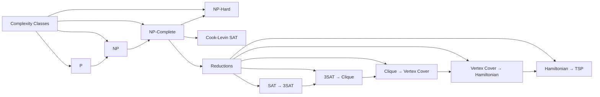

# Chapter 15: NP-Completeness

> **Prerequisites:** [Chapter 14: String Algorithms](./14-string-algorithms.md) — Understanding of polynomial-time algorithms | **Next:** [Chapter 16: Approximation Algorithms](./16-approximation.md) — Coping with NP-hardness via approximation

## Learning Objectives

By the end of this chapter, students will be able to:

1. Define the complexity classes P, NP, NP-complete, and NP-hard.
2. Perform polynomial-time reductions between problems.
3. Understand the statement and significance of the Cook-Levin theorem.
4. Prove NP-completeness of classic problems: SAT, TSP, vertex cover, clique.
5. Apply reduction chains (3-SAT → Clique → Vertex Cover → Hamiltonian → TSP) with concrete implementations.
6. Recognize NP-hard problems in real systems and select appropriate coping strategies.

---

### Why NP-Completeness Matters

Imagine you are tasked with finding the most efficient delivery route for 100 packages across a city. Brute-forcing every possible sequence would take longer than the age of the universe. You spend months trying to design a "fast" algorithm before realizing the problem is provably hard — no polynomial-time solution exists (unless P = NP).

This is the value of NP-completeness theory: it saves you from chasing impossible solutions. When you prove a problem is NP-complete, you know that countless brilliant minds have tried and failed to solve it efficiently. The rational response is not to give up — it is to pivot to **approximation algorithms**, **heuristics**, **parameterized techniques**, or **special-case solvers** that work well in practice.

**Real-world analogy:** NP-completeness is like a geological survey before digging a tunnel. If you discover bedrock that cannot be drilled through with your equipment, you don't keep drilling — you change the plan. NP-completeness tells you bedrock exists, saving years of wasted effort.

---

### Chapter at a Glance

| Topic | Key Insight | Practical Takeaway |
|-------|-------------|-------------------|
| P vs NP | P = solvable in polynomial time; NP = verifiable in polynomial time | The central open question in computer science |
| NP-Complete | In NP and every NP problem reduces to it | Hardest problems in NP; no poly-time algorithm known |
| NP-Hard | At least as hard as NP-complete (not necessarily in NP) | Includes optimization versions and undecidable problems |
| Cook-Levin Theorem | SAT is NP-complete | First NP-completeness proof; all reductions chain from SAT |
| Reductions | Transform problem A to problem B in poly time | If A ≤ₚ B and B ∈ P, then A ∈ P |
| Coping Strategies | Approximate, heuristic, parameterize, brute-force for small n | Industry survival guide for NP-hard problems |

### Chapter Roadmap



## Theory


### 15.1 Complexity Classes


#### The Complexity Zoo — Venn Diagram

| Class | Relationship | Meaning | Real-World Analogy |
|-------|-------------|---------|--------------------|
| **P** | Inside NP | Solvable in polynomial time | Baking a cake from a recipe — you can follow the steps and finish in a predictable time |
| **NP** | Contains P, contains NP-Complete | Verifiable in polynomial time | Checking if someone else baked the cake correctly — verification is easier than creation |
| **NP-Complete** | Inside NP, intersection of NP and NP-Hard | Both in NP and NP-hard | Finding a proof for a mathematical theorem — once found, it is easy to verify but hard to discover |
| **NP-Hard** | Contains NP-Complete, extends beyond NP | At least as hard as any NP problem | Writing a program that decides if any arbitrary program halts — harder than anything in NP |

```
              ┌─────────────────────────────────────┐
              │              NP-Hard                  │
              │     ┌───────────────────────┐        │
              │     │        NP             │        │
              │     │  ┌─────────────────┐  │        │
              │     │  │       P         │  │        │
              │     │  │  Sorting,       │  │        │
              │     │  │  Shortest Path  │  │        │
              │     │  │  MST, Matching  │  │        │
              │     │  └─────────────────┘  │        │
              │     │  ┌─────────────────┐  │        │
              │     │  │   NP-Complete   │  │        │
              │     │  │  SAT, 3SAT,     │  │        │
              │     │  │  Clique, VC,    │  │        │
              │     │  │  TSP, SubsetSum │  │        │
              │     │  └─────────────────┘  │        │
              │     │                       │        │
              │     └───────────────────────┘        │
              │    Optimization TSP,                  │
              │    Halting Problem                    │
              └─────────────────────────────────────┘
```

**Definition 15.1 (P).** The class **P** consists of all decision problems that can be solved in polynomial time by a deterministic Turing machine. Formally: a language \( L \subseteq \{0,1\}^* \) is in P if there exists a deterministic Turing machine \( M \) and a polynomial \( p(n) \) such that for all strings \( x \), \( M \) decides whether \( x \in L \) within \( O(p(|x|)) \) steps.

**Examples:** Finding the shortest path in a graph (Dijkstra's), sorting an array, checking if a number is prime (AKS primality test), finding a maximum matching.

**Definition 15.2 (NP).** The class **NP** (nondeterministic polynomial time) consists of all decision problems for which a YES answer can be **verified** in polynomial time given a **certificate** (witness) of polynomial size. A language \( L \) is in NP if there exists a polynomial-time verifier \( V \) and a polynomial \( p \) such that for every \( x \):

\[
x \in L \iff \exists c \text{ with } |c| \le p(|x|) \text{ and } V(x, c) = \text{accept}
\]

**Real-world analogy:** A student solving a crossword puzzle (hard, in NP-Hard) vs. checking the answer key (easy, certificate verification). NP captures problems where checking a solution is easy even if finding one is hard.

**Examples:** SAT, TSP decision version, graph coloring, knapSack, integer factorization.

**Definition 15.3 (NP-hard).** A problem \( H \) is **NP-hard** if every problem in NP can be reduced to \( H \) in polynomial time. NP-hard problems are **at least as hard** as any problem in NP — they may not even be decision problems.

**Real-world analogy:** NP-hard is like climbing Mount Everest — harder than any hike in a national park (NP problems). Some NP-hard problems (like the halting problem) are not even decision problems — comparable to trying to break a rock with a hammer that does not exist.

**Definition 15.4 (NP-complete).** A problem is **NP-complete** if it is (a) **in NP** and (b) **NP-hard**.

**Real-world analogy:** If NP problems are all "hikes in the park," NP-complete problems are the most difficult trails — still hikes (in NP) but as hard as any possible hike.

**The central question:** Is \( P = NP \)? That is, can every problem whose solution can be verified in polynomial time also be solved in polynomial time? This is one of the seven Millennium Prize Problems — a correct solution carries a $1M prize.

> **Pro Tip:** The P vs NP question asks whether every efficiently verifiable problem is also efficiently solvable. Knowing that a problem is NP-complete is a signal to look for approximation, heuristics, or special cases — not to give up.
>
> **Remember:** P ⊆ NP. Every problem in P is trivially in NP (self-verifiable). The open question is whether the reverse holds.

**One-Sentence Takeaway:** P = efficiently solvable, NP = efficiently verifiable; NP-complete problems are the hardest in NP and no polynomial algorithm is known for any of them.

---

### 15.2 Polynomial-Time Reductions


**Definition 15.5.** A **polynomial-time reduction** from problem \( A \) to problem \( B \) is a polynomial-time algorithm that transforms any instance \( x \) of \( A \) into an instance \( f(x) \) of \( B \) such that:

\[
x \text{ is a YES instance of } A \iff f(x) \text{ is a YES instance of } B
\]

**Notation:** \( A \le_p B \) (A reduces to B in polynomial time).

**Real-world analogy:** Reducing problem A to problem B is like translating a French cookbook to English. If you know how to cook from English recipes, a French-to-English translation lets you cook French cuisine. Similarly, if you can solve B, a reduction from A to B lets you solve A — the reduction translates A's instance into B's language.

**Properties:**
- If \( A \le_p B \) and \( B \in P \), then \( A \in P \).
- If \( A \le_p B \) and \( A \) is NP-hard, then \( B \) is NP-hard.
- Reductions are transitive: \( A \le_p B \) and \( B \le_p C \) implies \( A \le_p C \).

**Why the direction matters (common mistake):** To prove problem B is NP-hard, you reduce **from a known NP-complete problem A to B** (A ≤ₚ B). Beginners often get this backwards — reducing B to A proves nothing about B's hardness.

> **Pro Tip:** Reductions are the most important tool in NP-completeness. To prove a new problem is NP-hard, reduce a known NP-complete problem to it. The reduction must be polynomial time and preserve YES/NO answers.
>
> **Remember:** If A ≤ₚ B and B ∈ P, then A ∈ P. However, if A is NP-hard and A ≤ₚ B, then B is NP-hard.

**One-Sentence Takeaway:** Polynomial-time reductions transform instances of one problem to another, enabling NP-hardness proofs by showing a known NP-complete problem reduces to your problem.

---

### 15.3 Cook-Levin Theorem


**Theorem 15.1 (Cook-Levin, 1971).** SATISFIABILITY (SAT) is NP-complete.

**Proof sketch:**
1. **SAT is in NP:** Given a satisfying assignment (the certificate), evaluate each clause in O(number of clauses) time. Verification is clearly polynomial.
2. **SAT is NP-hard:** For any NP language \( L \), there exists a nondeterministic Turing machine \( M \) and a polynomial \( p(n) \) such that \( M \) decides \( L \) in at most \( p(n) \) steps. We construct a Boolean formula \( \phi \) that is satisfiable iff \( M \) accepts its input \( x \). The formula \( \phi \) has three parts:
   - **Initial configuration:** Encodes the starting tape contents, head position, and state as Boolean variables.
   - **Transition function:** Encodes the NTM's transition relation as clauses — for each time step, the next configuration follows from the current one.
   - **Acceptance condition:** At least one time step shows the machine in an accepting state.

   The formula is of size \( O(p(n)^2) \), polynomial in \( n \).

**Why this matters:** The Cook-Levin theorem established the **first** NP-complete problem. Before 1971, there was no way to claim a problem was "as hard as any in NP." Afterward, proving any problem NP-complete became a matter of reducing from SAT — opening the floodgates for thousands of NP-completeness proofs across every field of computer science.

> **Remember:** SAT gets its power from its expressiveness — any computational process can be encoded as a Boolean formula. This universality is what made Cook-Levin's proof work.

---

### 15.4 The Reduction Chain: SAT to TSP


Here is the canonical reduction chain that connects the major NP-complete problems. Each step transforms instances of one problem into instances of another, preserving YES/NO answers.

```
    SAT
     ↓
    3-SAT
     ↓
   Clique
     ↓
Vertex Cover
     ↓
Hamiltonian Cycle
     ↓
     TSP
     ↓
Subset Sum
```

---

#### 15.4.1 SAT → 3-SAT

**Problem:** Given a CNF formula (any clause length), produce an equisatisfiable 3-CNF formula.

**Construction:** Replace each clause with >3 literals by breaking it into 3-literal clauses using auxiliary variables.

**Algorithm:**
```
For each clause C = (l1 ∨ l2 ∨ ... ∨ lk):
    If k = 1: Replace with (l1 ∨ y1 ∨ y2) ∧ (l1 ∨ ¬y1 ∨ y2) ∧ (l1 ∨ y1 ∨ ¬y2) ∧ (l1 ∨ ¬y1 ∨ ¬y2)
    If k = 2: Replace with (l1 ∨ l2 ∨ y) ∧ (l1 ∨ l2 ∨ ¬y)
    If k = 3: Keep as is
    If k > 3: Introduce k-3 new variables y1, ..., y_{k-3}
              Add clauses: (l1 ∨ l2 ∨ y1), (¬y1 ∨ l3 ∨ y2), (¬y2 ∨ l4 ∨ y3), ..., (¬y_{k-3} ∨ l_{k-1} ∨ lk)
```

**Dry run:** Transform (a ∨ b ∨ c ∨ d) to 3-CNF
```
Formula: (a ∨ b ∨ c ∨ d), k = 4
New variables: y1
New clauses: (a ∨ b ∨ y1) ∧ (¬y1 ∨ c ∨ d)
```

**Correctness logic:** If the original clause is satisfiable, at least one literal is true. The auxiliary variables simply propagate the truth along the chain. If (a ∨ b) is true, y1 = false works and (¬y1 ∨ c ∨ d) holds because the remaining literals still need to satisfy the chain.

---

#### 15.4.2 3-SAT → Clique

**Problem:** Prove CLIQUE is NP-complete by reducing 3-SAT to CLIQUE.

**Given:** A 3-CNF formula \( F = C_1 \land C_2 \land ... \land C_m \) with variables \( x_1, ..., x_n \).

**Construction:**
- Create a vertex for each literal in each clause (3m vertices total).
- Add edges between all vertices **except:**
  - Vertices in the same clause (no intra-clause edges).
  - Vertices representing complementary literals (e.g., \( x_i \) and \( \neg x_i \)).
- Set \( k = m \) (the number of clauses).

**Pseudocode:**
```
function SAT_to_CLIQUE(F):
    // F is a 3-CNF formula with m clauses
    V = {}
    for each clause C_j in F:
        for each literal l in C_j:
            Create vertex v_{j,literal}
            V = V ∪ {v_{j,literal}}
    
    E = {}
    for each pair (v_{a,la}, v_{b,lb}) where a ≠ b:
        if la ≠ ¬lb:
            E = E ∪ {(v_{a,la}, v_{b,lb})}
    
    return (G = (V, E), k = m)
```

**Dry run trace:** Formula: \( (x_1 \lor x_2 \lor x_3) \land (\neg x_1 \lor x_2 \lor x_4) \land (x_1 \lor \neg x_2 \lor \neg x_4) \)

| Clause | Literals | Vertices |
|--------|----------|---------|
| C1 | x1, x2, x3 | v11, v12, v13 |
| C2 | ¬x1, x2, x4 | v21, v22, v23 |
| C3 | x1, ¬x2, ¬x4 | v31, v32, v33 |

Edges between from different clauses except for complementary pairs. C1 vertices connect to all C2 vertices except v11 (x1) to v21 (¬x1) — blocked because complementary. Similarly v12 (x2) to v32 (¬x2) blocked, v13 (x1) to v31 (x1) — allowed (not complementary, same literal is fine). v23 (x4) to v33 (¬x4) blocked.

A satisfying assignment (x1 = T, x2 = F, x4 = T) gives clique {v11, v22, v33} — size 3 = m.

**Correctness:** A clique of size m must select exactly one vertex from each clause (no intra-clause edges). No two selected vertices represent complementary literals (they would not be connected). Thus, the selected vertices define a consistent assignment that satisfies every clause.

**C++ Implementation:**
```cpp
#include <bits/stdc++.h>
using namespace std;

struct Graph {
    int V;
    vector<vector<bool>> adj; // adjacency matrix
    Graph(int n) : V(n), adj(n, vector<bool>(n, false)) {}
    void addEdge(int u, int v) { adj[u][v] = adj[v][u] = true; }
};

// Reduce 3-SAT instance to CLIQUE instance
// Returns (graph, k) where k = number of clauses
pair<Graph, int> threeSATtoClique(vector<vector<string>>& clauses) {
    int m = clauses.size();           // number of clauses
    int totalLiterals = 3 * m;         // each clause has exactly 3 literals
    Graph G(totalLiterals);
    
    // Vertex (i, j) is clause i, literal position j
    // Global index = i * 3 + j
    auto idx = [](int clause, int pos) { return clause * 3 + pos; };
    
    // Add edges between all vertices from different clauses
    // EXCEPT if literals are complementary
    for (int c1 = 0; c1 < m; c1++) {
        for (int p1 = 0; p1 < 3; p1++) {
            for (int c2 = c1 + 1; c2 < m; c2++) {
                for (int p2 = 0; p2 < 3; p2++) {
                    bool complementary = false;
                    string l1 = clauses[c1][p1];
                    string l2 = clauses[c2][p2];
                    // Check if l1 = ¬l2 or ¬l1 = l2
                    if ((l1[0] == '~' && l1.substr(1) == l2) ||
                        (l2[0] == '~' && l2.substr(1) == l1))
                        complementary = true;
                    if (!complementary)
                        G.addEdge(idx(c1, p1), idx(c2, p2));
                }
            }
        }
    }
    return {G, m};
}
```

---

#### 15.4.3 Clique → Vertex Cover

**Problem:** Reduce CLIQUE to VERTEX COVER.

**Observation:** A vertex cover covers all edges. A clique is a set of fully connected vertices. The relationship is through the **complement graph**.

**Construction:** Given graph \( G = (V, E) \), construct the complement \( \overline{G} = (V, \overline{E}) \) where:
\[
\overline{E} = \{(u,v) : u \neq v, (u,v) \notin E\}
\]
Then set \( k' = |V| - k \).

**Pseudocode:**
```
function CLIQUE_to_VERTEX_COVER(G, k):
    // G = (V, E), find if G has a clique of size k
    V' = V
    E' = {}
    for each pair (u, v) in V with u ≠ v:
        if (u, v) ∉ E:
            E' = E' ∪ {(u, v)}
    k' = |V| - k
    return (G' = (V', E'), k')
```

**Dry run trace:** Graph G with 5 vertices, edges as below. Does G have a clique of size 3?

```
G: 1---2---3       Complement G': 1   2   3
   | \ |           |               | X | X |
   4---5           4               4---5
```

If G has clique {1, 2, 4} of size 3, then V \ {1, 2, 4} = {3, 5} must be a vertex cover in G'. Every non-edge in G is an edge in G'. The set {3, 5} covers all edges in G' because G's clique vertices had all edges among them (no non-edges within the clique, so no edges in G' within them).

**Python Implementation:**
```python
def clique_to_vertex_cover(V, E, k):
    """
    Reduce CLIQUE to VERTEX COVER.
    G has a clique of size k iff complement(G) has a vertex cover of size |V| - k.
    
    Args:
        V: list of vertices
        E: set of edges (tuples)
        k: clique size
    
    Returns:
        (V', E', k') for the vertex cover instance
    """
    # Build adjacency for quick lookup
    adj = {v: set() for v in V}
    for u, v in E:
        adj[u].add(v)
        adj[v].add(u)
    
    # Build complement edges
    E_prime = set()
    for i in range(len(V)):
        for j in range(i + 1, len(V)):
            u, v = V[i], V[j]
            if v not in adj[u]:  # non-edge in G
                E_prime.add((u, v))
    
    k_prime = len(V) - k
    return V, E_prime, k_prime

# Example
V = [1, 2, 3, 4, 5]
E = {(1,2), (1,4), (2,3), (2,4), (3,4), (4,5), (2,5)}
k = 3  # Does G have a clique of size 3?

Vp, Ep, kp = clique_to_vertex_cover(V, E, k)
print(f"Vertex Cover instance: |V|={len(Vp)}, k'={kp}")
print(f"Complement edges: {Ep}")
# G has clique {1,2,4} of size 3
# Complement should have vertex cover of size 2
```

**Correctness:** A set \( C \subseteq V \) is a vertex cover in \( \overline{G} \) iff every non-edge in \( G \) has at least one endpoint in \( C \). This is equivalent to \( V \setminus C \) being a clique in \( G \) — because no non-edge in \( G \) connects two vertices both outside \( C \). Therefore \( G \) has a clique of size \( k \) iff \( \overline{G} \) has a vertex cover of size \( |V| - k \).

---

#### 15.4.4 Vertex Cover → Hamiltonian Cycle

**Problem:** Reduce VERTEX COVER to HAMILTONIAN CYCLE.

**The Gadget Approach:** This reduction uses a clever **selector gadget** — a graph structure that encodes the choice of k vertices for the vertex cover.

**Note:** This reduction is more involved than the previous ones. It requires constructing "OR gadgets" (also called "choice gadgets") that represent each vertex and each edge of the original graph.

**High-level construction:**

Given graph \( G = (V, E) \) and integer k (vertex cover size):

1. Create k **selector vertices** \( a_1, a_2, ..., a_k \).
2. For each edge \( (u, v) \in E \), create a **cover-testing gadget** — a subgraph with one "entry" and one "exit" that can be traversed in two ways (representing covering the edge by u or by v).
3. Connect the gadgets in a chain with the selector vertices such that a Hamiltonian cycle exists iff there is a vertex cover of size k.

**Simplified trace for k = 2, G = triangle (3 nodes, 3 edges):**

- Selector path: S1 → S2
- For each edge, create a gadget with two "cover paths"
- Vertices u, v in the cover set select which path through each gadget

The Hamiltonian cycle must visit all gadgets and all selector vertices exactly once. The only way to do this is to pick k vertices that collectively cover all edges.

---

#### 15.4.5 Hamiltonian Cycle → TSP

**Problem:** Reduce HAMILTONIAN CYCLE to TRAVELING SALESMAN PROBLEM (decision version).

**Construction:** Given graph \( G = (V, E) \):

1. Create a complete graph \( K_{|V|} \) on the same vertices.
2. Assign edge weights:
   - If \( (u, v) \in E \), set weight \( w(u, v) = 1 \).
   - If \( (u, v) \notin E \), set weight \( w(u, v) = 2 \) (a large value).
3. Set bound \( B = |V| \).

**Pseudocode:**
```
function HC_to_TSP(V, E):
    n = |V|
    // Build complete graph with weights
    w = n x n matrix
    for each (u, v) in V x V:
        if (u, v) in E or (v, u) in E:
            w[u][v] = 1
        else if u == v:
            w[u][v] = 0
        else:
            w[u][v] = 2
    B = n
    return (complete graph with weights w, B)
```

**Dry run:** Graph G = {A, B, C, D}, edges: (A,B), (B,C), (C,D), (D,A), (A,C)

```
Original HC instance:           TSP instance:
A---B                           A--1--B
|\  |                           |\   |
| \ |                           2 \  |
D---C                           D--1--C
                                
Edges: All edges weight 1
Non-edges: (B,D) weight 2
B = 4

Hamiltonian cycle A→B→C→D→A has total weight 1+1+1+1 = 4 ≤ B
If no Hamiltonian cycle existed (e.g., missing edge), min tour would be ≥ 5 > B
```

**Correctness:** A Hamiltonian cycle in G uses exactly n edges, each of weight 1, giving total weight n = B. Any tour that uses a non-edge has weight ≥ (n-1) + 2 = n+1 > B. Therefore a tour of weight ≤ B exists iff G has a Hamiltonian cycle.

**C++ Implementation:**
```cpp
#include <bits/stdc++.h>
using namespace std;

using Graph = vector<vector<int>>;

struct TSPInstance {
    int n;
    vector<vector<int>> weights;
    int bound;
};

TSPInstance hamiltonianToTSP(int n, const vector<pair<int,int>>& edges) {
    vector<vector<int>> w(n, vector<int>(n, 0));
    
    // Initialize all non-diagonal entries to 2
    for (int i = 0; i < n; i++)
        for (int j = 0; j < n; j++)
            if (i != j) w[i][j] = 2;
    
    // Set existing edges to weight 1
    for (auto [u, v] : edges) {
        w[u][v] = 1;
        w[v][u] = 1;
    }
    
    return {n, w, n};
}

// Helper to verify a tour (useful for correctness checking)
bool verifyTour(const TSPInstance& tsp, const vector<int>& tour) {
    if (tour.size() != tsp.n + 1 || tour[0] != tour[tsp.n])
        return false;
    
    int total = 0;
    for (size_t i = 0; i + 1 < tour.size(); i++) {
        total += tsp.weights[tour[i]][tour[i + 1]];
    }
    
    set<int> visited(tour.begin(), tour.end() - 1);
    return visited.size() == tsp.n && total <= tsp.bound;
}
```

---

### 15.5 Proving NP-Completeness — Step-by-Step Methodology


| Step | Action | What to Do | Common Mistake |
|------|--------|-----------|----------------|
| **1. Show ∈ NP** | Identify the certificate | What is the poly-size witness? (e.g., a set of vertices, a permutation) | Forgetting that NP requires a decision problem |
| **2. Design verifier** | Give poly-time algorithm | Check certificate in O(n^k) time | Exponential-time verifier disqualifies membership |
| **3. Choose source problem** | Pick known NP-complete problem | Select one whose structure matches your problem | Picking a problem with very different constraints |
| **4. Design reduction** | Map source instance → target instance | Must be polynomial-time computable | Creating invalid output (not a valid instance of target) |
| **5. Forward proof** | Source YES ⇒ Target YES | Show that if source instance is satisfiable, the constructed target instance is also a YES | Circular reasoning |
| **6. Backward proof** | Target YES ⇒ Source YES | Show any certificate for target can be decoded into a certificate for source | Non-equivalence of transformations |
| **7. Complexity check** | Verify polynomial bound | Sum up construction costs (vertices, edges, formula size) | Assuming O(1) operations for non-trivial work |

---

### 15.6 Coping with NP-Completeness


When you encounter an NP-hard problem in practice, here is your arsenal:

| Strategy | Description | When to Use | Example Problems |
|----------|-------------|-------------|------------------|
| **Approximation** | Find a solution provably within a factor of optimal | When a "good enough" answer is acceptable | TSP (Christofides: 1.5× optimal), Vertex Cover (2×) |
| **Heuristics** | Problem-specific rules that work well in practice | When approximation is too slow | Simulated annealing for TSP, greedy for set cover |
| **Parameterized** | Algorithm exponential only in a small parameter k | When k is small in practice | Vertex Cover: O(2^k · n), k = cover size |
| **Special Cases** | Exploit structure (tree, bipartite, planar) | When the input has known structure | Planar TSP is still hard, but treewidth-bounded is easier |
| **Fixed-Parameter Tractable** | O(f(k) · n^c) algorithms | When parameter k is small | Vertex cover parameterized by solution size |
| **Backtracking + Pruning** | Branch and bound | When n is small (n ≤ 30) | Maximum clique with branch-and-bound |
| **ILP Solvers** | Formulate as integer program; use CPLEX/Gurobi | When hardware budget allows | Scheduling, resource allocation |
| **Quantum** | Grover's search gives sqrt speedup | When problem is search-heavy | Unstructured search variants |

**Real-world hierarchy of coping:**
```
Your problem is NP-hard?
     │
     ├── Is n tiny (≤ 30)? ──→ Brute force / backtracking
     ├── Has small parameter k? ──→ Parameterized algorithm
     ├── Has special structure? ──→ Exploit it (LP relax, treewidth, etc.)
     ├── Good enough is OK? ──→ Approximation algorithm
     └── None of the above? ──→ Heuristic / Metaheuristic (SA, GA, etc.)
```

---

### 15.7 Interview Corner


#### Decision vs. Optimization

| Aspect | Decision (NP-Complete) | Optimization (NP-Hard) |
|--------|----------------------|----------------------|
| Question | Does a tour of length ≤ B exist? | Find the shortest tour |
| Certificate | A tour with length ≤ B (verifiable) | Not a decision — no certificate |
| Reductions | Used in NP-completeness proofs | Typically solved via decision oracle |
| Example | "Is there a clique of size 10?" | "Find the maximum clique" |

#### Reduction Patterns to Recognize

1. **Constraint satisfaction → Graph problems:** Variables become vertices, clauses become edges/gadgets.
2. **Graph → Numeric:** Use complement graphs (Clique → Vertex Cover).
3. **Graph → Sequence:** Use gadgets to encode choices in a Hamiltonian cycle/TSP.
4. **Numeric → Numeric:** Use base encoding (3-SAT → Subset Sum with digits as place values).

#### How to Think About NP-Hard Problems

- **First, verify it is actually hard.** Many problems that look hard have polynomial solutions (e.g., minimum spanning tree, network flow).
- **Check special cases.** Is your graph planar? Bipartite? Bounded treewidth? Bounded degree?
- **Formulate as an ILP.** Even if NP-hard, modern ILP solvers handle thousands of variables for many problems.
- **Worst-case vs. average-case.** The worst instance may be hard, but typical instances may be easy (e.g., SAT solvers work on industrial circuits).
- **Ask: do I need optimality?** If 95% of optimal is acceptable, approximation is the answer.

> **Pro Tip:** In coding interviews, if you suspect a problem is NP-hard, tell the interviewer why (it is NP-hard). Then pivot to an approximation, heuristic, or pseudo-polynomial solution. This shows depth — recognition of hardness is a signal, not a failure.

---

### 15.8 Applications in Real Systems


NP-hard problems are not just academic curiosities — they appear in critical industrial systems daily. Here is how industry copes:

| Domain | NP-Hard Problem | How Industry Copes |
|--------|----------------|-------------------|
| **Logistics** (UPS, FedEx) | Vehicle Routing / TSP | + 60,000 vehicles: use Concorde TSP solver (branch-and-cut); Clarke-Wright savings heuristic |
| **Chip Design** (Intel, AMD) | VLSI Layout / Graph Coloring | Simulated annealing for placement; register allocation via graph coloring (Chaitin's algorithm) |
| **SAT in Verification** (Synopsys, Cadence) | SAT / Circuit Verification | Conflict-driven clause learning (CDCL) SAT solvers — handle millions of clauses |
| **Manufacturing** (Siemens, Bosch) | Job Shop Scheduling | Shifting Bottleneck heuristic + constraint programming (CP Optimizer) |
| **Protein Folding** | 3D conformation prediction | Deep learning (AlphaFold) + energy minimization heuristics |
| **Network Design** | Steiner Tree | Approximation (1.39×); LP-based algorithms |
| **Compiler Design** | Register Allocation via Graph Coloring | Chaitin-Briggs with iterative coalescing |
| **Bioinformatics** | Sequence Alignment / Motif Finding | Dynamic programming for small n; BLAST heuristics for large |
| **Airline Crew Scheduling** | Set Cover | Column generation + branch-and-price; CPLEX |
| **Telecom** | Frequency Assignment | Graph coloring heuristics; ILP with decomposition |

**Case study — SAT in hardware verification:** Modern chips have billions of transistors. Before fabrication, equivalence checking (is this circuit identical to the specification?) is reduced to SAT. Industrial SAT solvers (MiniSAT, Glucose, Z3) use CDCL — a heuristic extension of the DPLL algorithm — and routinely solve instances with millions of variables. Despite the NP-completeness of SAT, the average case for structured industrial circuits is tractable.

---

### 15.9 Classic NP-Complete Problems


#### 15.9.1 3-SAT

**Problem:** Given a CNF formula where each clause has exactly three literals, determine if there is a satisfying assignment.

**Reduction from SAT:** Replace each clause with up to five 3-literal clauses using auxiliary variables.

#### 15.9.2 Clique

**Problem:** Given a graph \( G = (V, E) \) and an integer \( k \), does \( G \) contain a clique of size \( k \)? (A clique is a set of vertices where every pair is connected by an edge.)

**Reduction from 3-SAT:** For a formula with \( n \) variables and \( m \) clauses, create a graph with \( 3m \) vertices (one per literal). Add edges between all vertices except those in the same clause and those that correspond to complementary literals. There is a clique of size \( m \) if and only if the formula is satisfiable.

#### 15.9.3 Vertex Cover

**Problem:** Given a graph \( G = (V, E) \) and an integer \( k \), does there exist a set of \( k \) vertices such that every edge is incident to at least one selected vertex?

**Reduction from Clique:** For a graph \( G \), the complement graph \( \overline{G} \) has a vertex cover of size \( |V| - k \) if and only if \( G \) has a clique of size \( k \).

#### 15.9.4 Hamiltonian Cycle and TSP

**Problem (Hamiltonian Cycle):** Does a graph contain a cycle that visits each vertex exactly once?

**Problem (Traveling Salesman):** Given a complete graph with edge weights and a bound \( B \), does there exist a tour of total weight \( \le B \) that visits each city exactly once?

**Reduction from Vertex Cover to Hamiltonian Cycle** is involved; TSP reduces directly from Hamiltonian Cycle by assigning weight 1 to existing edges and a large weight to non-edges.

#### 15.9.5 Subset Sum

**Problem:** Given a set of integers \( A \) and a target \( S \), does there exist a subset that sums to \( S \)?

**Reduction from 3-SAT** uses a clever encoding of truth assignments as numbers in a carefully chosen base to prevent cross-digit carries.

### 15.10 NP-Hard Problems


Some problems are NP-hard but not in NP (because they are not decision problems).

- **Optimization TSP:** Find the shortest tour (not just decide if a tour of length \( \le B \) exists).
- **Halting problem:** Undecidable, hence NP-hard.
- **Integer programming:** Maximize a linear function subject to integer constraints.

---

## Examples

### Example 15.1: Clique to Vertex Cover Reduction

**Problem:** Reduce CLIQUE to VERTEX COVER.

**Construction:** Given graph \( G = (V, E) \) and integer \( k \), construct the complement graph \( \overline{G} = (V, \overline{E}) \) where \( \overline{E} = \{(u,v) : u \neq v, (u,v) \notin E\} \). Let \( k' = |V| - k \).

**Correctness:** A set \( C \subseteq V \) is a vertex cover in \( \overline{G} \) if every non-edge in \( G \) has at least one endpoint in \( C \). This is equivalent to \( V \setminus C \) being a clique in \( G \). So \( G \) has a clique of size \( k \) iff \( \overline{G} \) has a vertex cover of size \( |V| - k \).

### Example 15.2: 3-SAT to Clique Reduction

**Problem:** Prove CLIQUE is NP-complete.

**Construction:** Given a 3-CNF formula \( F = C_1 \land C_2 \land \cdots \land C_m \) with variables \( x_1, \ldots, x_n \):

- Create vertices: for each clause \( C_j = (l_{j1} \lor l_{j2} \lor l_{j3}) \), create three vertices \( v_{j1}, v_{j2}, v_{j3} \).
- Add edges between \( v_{jp} \) and \( v_{jq} \) if and only if they are in different clauses AND \( l_{jp} \neq \overline{l_{jq}} \).
- Set \( k = m \).

**Correctness:** A clique of size \( m \) must contain exactly one vertex from each clause (since vertices in the same clause are not connected). The compatibility condition ensures no literal conflicts (a variable and its negation cannot both be selected). The selected vertices correspond to a satisfying assignment.

### Example 15.3: Proving NP-Completeness Checklist

1. **Show the problem is in NP:** Give a certificate and a polynomial-time verification algorithm.
2. **Choose a known NP-complete problem** \( A \) to reduce from.
3. **Construct a reduction** \( f \) that maps instances of \( A \) to instances of your problem.
4. **Prove correctness:** Show \( x \) is YES for \( A \) iff \( f(x) \) is YES for your problem.
5. **Show \( f \) is polynomial-time computable.**

---

### Concept Comparison Table

| Class | Verification | Solution | Examples | Key Question |
|-------|-------------|----------|----------|--------------|
| P | Polynomial | Polynomial known | Sorting, shortest path | Can always solve quickly |
| NP | Polynomial | Unknown | SAT, TSP, Clique | Verified quickly |
| NP-Complete | Polynomial | Believed exponential | 3-SAT, Vertex Cover | Hardest in NP |
| NP-Hard | Not required | Unknown | Optimization TSP, Halting | At least as hard as NP |

### Quick Reference

| Category | Key Points |
|----------|------------|
| **P** | Problems solvable in polynomial time |
| **NP** | Problems verifiable in polynomial time |
| **NP-Complete** | In NP and every NP problem reduces to it |
| **NP-Hard** | At least as hard as NP; not necessarily in NP |
| **Cook-Levin** | SAT is NP-complete — the first proof |
| **Reduction Direction** | Know NP-complete → Your problem (reduces TO) |
| **Reduction Chain** | SAT → 3SAT → Clique → Vertex Cover → Hamiltonian → TSP |
| **5 NP-Complete Proof Steps** | ∈NP, choose source, construct f, prove iff, poly bound |
| **Coping Strategies** | Approx, heuristic, parameterized, special-case, ILP, brute for small n |

### Cross-Application Matrix

| Concept | DSA Interviews | Competitive Programming | Academia | Real-World |
|---------|---------------|----------------------|----------|------------|
| P vs NP | Foundational knowledge | Affects approach to problems | Active research | Algorithm selection |
| Reductions | Occasionally asked | N/A | Core proof technique | Problem modeling |
| NP-Completeness | Common — recognize hard problems | Know when to use heuristics | Exam requirement | When to approximate |
| Approximation | Less common | Common in contests | Core theory | Logistics, scheduling |
| Cook-Levin | Theoretical importance | N/A | Required understanding | Basis for SAT solvers |

---

## Summary

| Class | Definition | Example |
|-------|------------|---------|
| P | Solvable in polynomial time | Shortest path |
| NP | Verifiable in polynomial time | SAT, TSP, clique |
| NP-complete | NP + NP-hard | 3-SAT, vertex cover |
| NP-hard | At least as hard as any NP problem | Optimization TSP |
| Approximable | PTAS or constant-factor in poly time | Euclidean TSP, vertex cover |
| Parameterized | O(f(k) · n^c) for parameter k | Vertex cover (k = solution size) |

The P vs. NP question remains open. If \( P = NP \), every problem with an efficiently verifiable solution can be solved efficiently. If \( P \neq NP \), there are intrinsically hard combinatorial problems. Either way, the theory of NP-completeness gives us a powerful toolkit: recognize hardness, choose the right coping strategy, and never waste years chasing a proof that could reveal bedrock.

---

## Exercises

### Review Questions

1. Explain the difference between NP-complete and NP-hard.
2. What is the significance of the Cook-Levin theorem?
3. List three properties that polynomial-time reductions satisfy.
4. Why is the reduction direction "known NP-complete → your problem" and not the reverse?
5. What is the relationship between a clique in G and a vertex cover in the complement of G?

### Application Problems

6. Reduce VERTEX COVER to SET COVER. (Hint: each edge is an element to cover.)
7. Prove that SUBSET SUM is in NP by describing a certificate and verifier.
8. Show that INDEPENDENT SET is NP-complete by reducing from CLIQUE.
9. Prove that the DOMINATING SET problem is NP-complete by reducing from VERTEX COVER.
10. Implement the 3-SAT to Clique reduction in Python or C++. Test on a small satisfiable formula.
11. Given a graph with 6 vertices and edges {(1,2), (1,3), (2,3), (3,4), (4,5), (5,6), (4,6), (2,5)}, construct the complement graph. Does the original graph have a clique of size 3? What is the corresponding vertex cover?

### Challenge Problem

12. Prove that the **HITTING SET** problem is NP-complete: given a collection of subsets of a universe and an integer \( k \), does there exist a set of size \( k \) that intersects each subset? Reduce from VERTEX COVER.

---

### Chapter Quiz

**Q1.** What does it mean for a problem to be NP-complete?

- A) It cannot be solved by any computer
- B) It is in NP and every NP problem reduces to it in polynomial time
- C) It requires exponential memory
- D) It can only be solved with quantum computers

<details>
<summary>Answer&lt;/summary&gt;
B) NP-complete means the problem is in NP (verifiable in poly time) and NP-hard (every NP problem reduces to it).
</details>

**Q2.** Which of the following was the first problem proven NP-complete?

- A) Traveling Salesman
- B) Clique
- C) SAT (Satisfiability)
- D) Vertex Cover

<details>
<summary>Answer&lt;/summary&gt;
C) The Cook-Levin theorem (1971) proved SAT is NP-complete — the first such proof.
</details>

**Q3.** If problem A reduces to problem B in polynomial time (A ≤ₚ B) and A is NP-hard, what can you conclude?

- A) B is in P
- B) B is NP-hard
- C) B is NP-complete
- D) Nothing

<details>
<summary>Answer&lt;/summary&gt;
B) If A is NP-hard and A ≤ₚ B, then B is NP-hard. If B were also in NP, it would be NP-complete.
</details>

**Q4.** Which of the following is NOT a valid coping strategy for an NP-hard problem encountered in practice?

- A) Approximation algorithm with constant-factor guarantee
- B) Parameterized algorithm exploiting a small hidden parameter
- C) Proving P = NP by constructing a polynomial-time solution
- D) ILP formulation solved with CPLEX/Gurobi

<details>
<summary>Answer&lt;/summary&gt;
C) You will not prove P = NP in your afternoon coding session. Stick to practical strategies that industry actually uses.
</details>

**Q5.** If G has 10 vertices and G has a clique of size 4, what size vertex cover does the complement graph have?

- A) 4
- B) 6
- C) 10
- D) Cannot determine

<details>
<summary>Answer&lt;/summary&gt;
B) The complement graph has a vertex cover of size |V| − k = 10 − 4 = 6.
</details>
