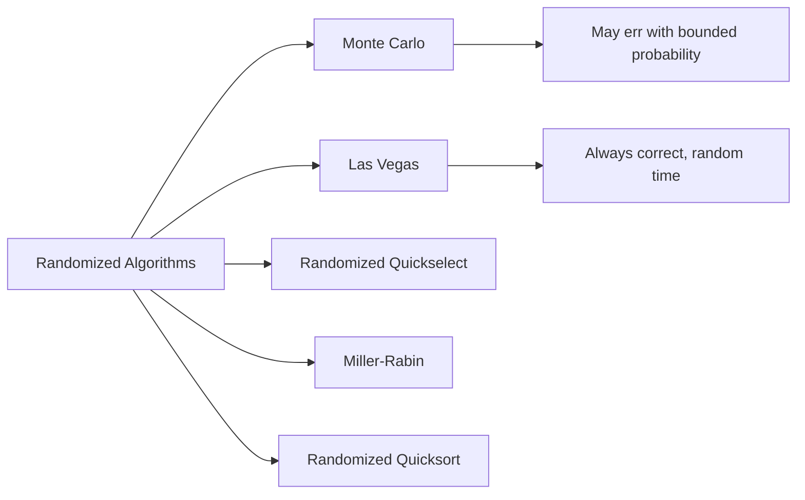

# Chapter 17: Randomized Algorithms

> **Prerequisites:** [Chapter 16: Approximation Algorithms](./16-approximation.md) — Algorithm design for hard problems | **Next:** [Chapter 18: Advanced Topics](./18-advanced.md) — From randomized methods to online and streaming algorithms

## Learning Objectives

By the end of this chapter, students will be able to:

<!-- Image Gallery -->
<section class="lesson-visuals" aria-label="Visual learning resources">
  <header><span>VISUAL LEARNING</span><h2>See it. Review it. Remember it.</h2></header>
  <a class="lesson-visual-card" href="../../assets/images/lessons/algorithms/17-randomized/handwritten-notes.png" target="_blank" rel="noopener">
    
    <span><strong>Handwritten notes</strong>Condensed notes for deliberate review.</span>
  </a>
  <a class="lesson-visual-card" href="../../assets/images/lessons/algorithms/17-randomized/sticky-notes.png" target="_blank" rel="noopener">
    
    <span><strong>Sticky-note revision</strong>Fast recall prompts for revision.</span>
  </a>
  <a class="lesson-visual-card" href="../../assets/images/lessons/algorithms/17-randomized/visual-explanation.png" target="_blank" rel="noopener">
    
    <span><strong>Visual concept guide</strong>A connected explanation of the key ideas.</span>
  </a>
</section>
<!-- End Image Gallery -->


1. Distinguish between Monte Carlo and Las Vegas randomized algorithms.
2. Implement and analyze randomized quickselect and randomized quicksort.
3. Implement the Miller-Rabin primality test.
4. Analyze the expected running time of randomized algorithms.

---

### Chapter at a Glance

| Topic | Key Insight | Practical Takeaway |
|-------|-------------|-------------------|
| Monte Carlo | May give wrong answer with bounded probability | Probability of error can be made arbitrarily small |
| Las Vegas | Always correct; running time is random | Expected time analysis, not worst case |
| Randomized Quicksort | Random pivot avoids worst case | O(n log n) expected; O(n²) worst case with vanishing probability |
| Randomized Quickselect | Random pivot for k-th smallest | O(n) expected time selection |
| Miller-Rabin | Probabilistic primality test | O(log³ n); composite detected with probability ≥ 3/4 |

### Chapter Roadmap



## Why Randomized Algorithms Matter

**Real-world analogy:** Imagine you are the receptionist at a busy clinic with one waiting room and five doctors. If patients arrive in a fixed order (alphabetically), the first doctor gets all the A-L patients while the others sit idle. If you randomly assign patients to doctors, the load balances naturally — no single doctor gets overwhelmed. This is exactly why Google's load balancers random-shuffle requests across servers: randomness prevents systematic worst-case behavior.

Randomized algorithms are not a niche curiosity — they power:

- **Cryptography:** RSA key generation relies on Miller-Rabin to find large primes. Without randomized primality testing, SSL/TLS would not exist.
- **Load balancing:** Randomly assigning requests to servers avoids hot spots with high probability.
- **Machine learning:** Stochastic gradient descent uses random mini-batches to escape local minima.
- **Distributed systems:** Randomized consensus algorithms (like in Apache Kafka) achieve agreement without a central coordinator.
- **Data streaming:** Reservoir sampling gives uniform random samples from arbitrarily large streams using tiny memory.

> **Warning:** Randomization introduces variance. The same algorithm on the same input may have different running times or outputs. Understanding probability bounds is essential for correctness guarantees.

**One-Sentence Takeaway:** Randomized algorithms trade deterministic guarantees for practical efficiency, powering cryptography, load balancing, and distributed systems.

## Theory


### 17.1 Classification


Randomized algorithms are classified into two types:

**Las Vegas algorithms:** Always produce a correct result; the running time is a random variable. Examples: randomized quicksort, randomized quickselect.

**Monte Carlo algorithms:** May produce an incorrect result with bounded probability; the running time is deterministic. Examples: Miller-Rabin primality test, Karger's minimum cut algorithm.

> **Pro Tip:** Las Vegas = always right, sometimes slow. Monte Carlo = always fast, sometimes wrong. Use Las Vegas when correctness is critical (sorting), Monte Carlo when speed matters and errors can be tolerated (primality).
>
> **Remember:** A Monte Carlo algorithm can be converted to a Las Vegas one if you can verify the answer efficiently and retry on failure.

**One-Sentence Takeaway:** Las Vegas algorithms are always correct with random running time; Monte Carlo algorithms have bounded error with fixed running time.

### 17.2 Las Vegas vs Monte Carlo: Detailed Comparison


| Aspect | Las Vegas | Monte Carlo |
|--------|-----------|-------------|
| **Correctness** | Always correct | May be wrong with bounded probability |
| **Running time** | Random variable (expected time) | Deterministic (always fixed) |
| **Error source** | None — answer is always right | Random coins may produce wrong answer |
| **Amplification** | Run many times (always same result) | Run many times, take majority vote to reduce error |
| **Typical use** | Sorting, selection | Primality, minimum cut |
| **Analysis** | Expected time complexity | Probability of correctness |
| **Example** | Randomized Quicksort | Miller-Rabin |
| **Risk profile** | Slow execution is the only risk | Wrong answer is a risk |
| **Conversion** | Can convert Monte Carlo → Las Vegas if verification is fast | Cannot easily convert Las Vegas → Monte Carlo |

### 17.3 Randomized Quickselect (Las Vegas)


**Problem:** Find the \( k \)-th smallest element in an unsorted array.

**Real-world analogy:** You have 1,000 unsorted exam scores and want the median (500th smallest). Instead of sorting all 1,000, you randomly pick a score, arrange others around it, and recursively search only the relevant half. This is like guessing a number between 1 and 1000 — each random guess eliminates roughly half the remaining range.

**Algorithm Steps:**

1. If the subarray has one element, return it.
2. Pick a random pivot index between `low` and `high`.
3. Partition the array so elements ≤ pivot are on the left, > pivot on the right.
4. If `k` equals the pivot's final position, return `A[k]`.
5. If `k < pivotIndex`, recurse on the left subarray.
6. If `k > pivotIndex`, recurse on the right subarray.

**Pseudocode:**
```
RandomizedQuickSelect(A, low, high, k):
    if low == high:
        return A[low]
    pivotIndex = Random(low, high)
    pivotIndex = Partition(A, low, high, pivotIndex)
    if k == pivotIndex:
        return A[k]
    else if k < pivotIndex:
        return RandomizedQuickSelect(A, low, pivotIndex - 1, k)
    else:
        return RandomizedQuickSelect(A, pivotIndex + 1, high, k)

Partition(A, low, high, pivotIndex):
    swap A[pivotIndex] with A[high]
    i = low
    for j = low to high - 1:
        if A[j] <= A[high]:
            swap A[i] with A[j]
            i = i + 1
    swap A[i] with A[high]
    return i
```

**Step-by-Step Dry Run:**

Find the 4th smallest element (k=3, 0-indexed) in array `[7, 10, 4, 3, 20, 15]`.

| Step | Subarray | Pivot | After Partition | k | Action |
|------|----------|-------|-----------------|---|--------|
| 1 | [7,10,4,3,20,15] | Random → index 2 (value 4) | [3,4,7,10,20,15] pivotIndex=1 | 3 | k > 1 → recurse right |
| 2 | [7,10,20,15] | Random → index 0 of subarray (value 7) | [7,10,20,15] pivotIndex=0 (relative) | Need: k - pivot - 1 = 3-1-1=1 | k=1 in this subarray, pivotIndex=0 → recurse right |
| 3 | [10,20,15] | Random → index 2 of subarray (value 15) | [10,15,20] pivotIndex=1 | 1 | k == 1 → return 15 |

**Result:** 15 is the 4th smallest element.

**Complexity Analysis:**

| Case | Time Complexity | Condition |
|------|----------------|-----------|
| **Expected** | \( O(n) \) | Random pivot gives good split |
| **Worst-case** | \( O(n^2) \) | Always pick min or max (probability \( 2/n! \)) |
| **Best-case** | \( O(n) \) | Always pick median |
| **Space** | \( O(\log n) \) expected (recursion stack) | |

**Proof of expected linear time:** Let \( T(n) \) be the expected running time. The pivot divides the array into a left and right portion. The expected size of the smaller portion is \( n/4 \) (the probability that the pivot is in the middle half is \( 1/2 \)). Therefore:

\[
E[T(n)] \le cn + E[T(3n/4)] \implies E[T(n)] = O(n).
\]

**Advantages & Disadvantages:**

| Advantages | Disadvantages |
|------------|---------------|
| Expected linear time — faster than sorting | Worst-case O(n²) (vanishing probability) |
| In-place partitioning (O(1) extra space) | Unstable — equal elements may reorder |
| Simple implementation | Random number generation overhead |
| Good cache performance | Recursive — stack overflow on large arrays |

**Edge Cases:**
- **k = 0:** Returns minimum element.
- **k = n-1:** Returns maximum element.
- **All equal elements:** Every pivot produces equal split; always O(n).
- **Array of size 1:** Returns the only element directly.
- **k out of bounds:** Must validate before calling.

**C++ Implementation:**
```cpp
#include <vector>
#include <cstdlib>
#include <algorithm>
#include <iostream>

int partition(std::vector<int>& A, int low, int high, int pivotIndex) {
    std::swap(A[pivotIndex], A[high]);
    int i = low;
    for (int j = low; j < high; ++j) {
        if (A[j] <= A[high]) {
            std::swap(A[i], A[j]);
            ++i;
        }
    }
    std::swap(A[i], A[high]);
    return i;
}

int quickSelect(std::vector<int>& A, int low, int high, int k) {
    if (low == high) return A[low];
    int pivotIndex = low + std::rand() % (high - low + 1);
    pivotIndex = partition(A, low, high, pivotIndex);
    if (k == pivotIndex) return A[k];
    if (k < pivotIndex) return quickSelect(A, low, pivotIndex - 1, k);
    return quickSelect(A, pivotIndex + 1, high, k);
}
```

**Python Implementation:**
```python
import random

def partition(arr, low, high, pivot_idx):
    arr[pivot_idx], arr[high] = arr[high], arr[pivot_idx]
    i = low
    for j in range(low, high):
        if arr[j] <= arr[high]:
            arr[i], arr[j] = arr[j], arr[i]
            i += 1
    arr[i], arr[high] = arr[high], arr[i]
    return i

def quick_select(arr, low, high, k):
    if low == high:
        return arr[low]
    pivot_idx = random.randint(low, high)
    pivot_idx = partition(arr, low, high, pivot_idx)
    if k == pivot_idx:
        return arr[k]
    elif k < pivot_idx:
        return quick_select(arr, low, pivot_idx - 1, k)
    else:
        return quick_select(arr, pivot_idx + 1, high, k)
```

**Java Implementation:**
```java
import java.util.Random;

public class QuickSelect {
    private static Random rand = new Random();

    private static int partition(int[] A, int low, int high, int pivotIndex) {
        int temp = A[pivotIndex];
        A[pivotIndex] = A[high];
        A[high] = temp;
        int i = low;
        for (int j = low; j < high; j++) {
            if (A[j] <= A[high]) {
                temp = A[i]; A[i] = A[j]; A[j] = temp;
                i++;
            }
        }
        temp = A[i]; A[i] = A[high]; A[high] = temp;
        return i;
    }

    public static int quickSelect(int[] A, int low, int high, int k) {
        if (low == high) return A[low];
        int pivotIndex = low + rand.nextInt(high - low + 1);
        pivotIndex = partition(A, low, high, pivotIndex);
        if (k == pivotIndex) return A[k];
        if (k < pivotIndex) return quickSelect(A, low, pivotIndex - 1, k);
        return quickSelect(A, pivotIndex + 1, high, k);
    }
}
```

### 17.4 Randomized Quicksort (Las Vegas)


**Real-world analogy:** Imagine organizing a deck of cards by repeatedly picking a random card and splitting the deck around it. Even if you pick unlucky splits occasionally, the expected number of comparisons is remarkably small — about 1.39 n log₂ n. This is why real-world sort implementations (Java's `Arrays.sort`, Python's `sorted`) use randomized pivot selection.

**Algorithm Steps:**

1. If the subarray has 0 or 1 elements, return.
2. Pick a random pivot index between `low` and `high`.
3. Partition the array around the pivot.
4. Recursively sort the left and right subarrays.

**Pseudocode:**
```
RandomizedQuickSort(A, low, high):
    if low < high:
        pivotIndex = Random(low, high)
        pivotIndex = Partition(A, low, high, pivotIndex)
        RandomizedQuickSort(A, low, pivotIndex - 1)
        RandomizedQuickSort(A, pivotIndex + 1, high)
```

**Step-by-Step Dry Run:**

Sort array `[10, 7, 8, 9, 1, 5]`.

| Step | Subarray | Pivot (value) | After Partition | Recursive Calls |
|------|----------|---------------|-----------------|-----------------|
| 1 | [10,7,8,9,1,5] | Random → idx 4 (value 1) | [1,7,8,9,10,5] pivotIdx=0 | left=[] right=[7,8,9,10,5] |
| 2 | [7,8,9,10,5] | Random → idx 2 (value 9) | [7,8,5,9,10] pivotIdx=3 | left=[7,8,5] right=[10] |
| 3 | [7,8,5] | Random → idx 1 (value 8) | [7,5,8] pivotIdx=2 | left=[7,5] right=[] |
| 4 | [7,5] | Random → idx 0 (value 7) | [5,7] pivotIdx=1 | left=[5] right=[] |

**Result:** `[1, 5, 7, 8, 9, 10]`

**Complexity Analysis:**

| Case | Time Complexity | Condition |
|------|----------------|-----------|
| **Expected** | \( O(n \log n) \) | Random pivot gives balanced splits |
| **Worst-case** | \( O(n^2) \) | Always pick min/max (probability \( 2/n \)) |
| **Best-case** | \( O(n \log n) \) | Always pick median |
| **Space** | \( O(\log n) \) expected (recursion) | |

**Proof outline:** Let the sorted elements be \( z_1 &lt; z_2 < \cdots < z_n \). Define indicator random variable \( X_{ij} = 1 \) if \( z_i \) and \( z_j \) are compared. The probability that \( z_i \) and \( z_j \) are compared is \( 2/(j-i+1) \). By linearity of expectation:

\[
E[\text{total comparisons}] = \sum_{i=1}^n \sum_{j>i} \frac{2}{j-i+1} = O(n \log n).
\]

The constant factor is small: \( E[\text{comparisons}] = 2n \ln n \approx 1.39 n \log_2 n \).

**Advantages & Disadvantages:**

| Advantages | Disadvantages |
|------------|---------------|
| Expected O(n log n) — avoids deterministic worst case | Random number generation overhead |
| In-place sorting (O(log n) stack space) | Not stable |
| Excellent cache performance (sequential access) | Recursive — may overflow stack |
| Simpler than deterministic pivot schemes | Worst-case O(n²) still possible (though unlikely) |

**Edge Cases:**
- **Already sorted:** Random pivot avoids O(n²) behavior.
- **All equal elements:** Every pivot splits evenly; O(n log n).
- **Reverse sorted:** Same as sorted — random pivot protects.
- **Array of size 0 or 1:** Trivially sorted.

**C++ Implementation:**
```cpp
void quickSort(std::vector<int>& A, int low, int high) {
    if (low < high) {
        int pivotIndex = low + std::rand() % (high - low + 1);
        pivotIndex = partition(A, low, high, pivotIndex);
        quickSort(A, low, pivotIndex - 1);
        quickSort(A, pivotIndex + 1, high);
    }
}
```

**Python Implementation:**
```python
import random

def quicksort(arr, low, high):
    if low < high:
        pivot_idx = random.randint(low, high)
        pivot_idx = partition(arr, low, high, pivot_idx)
        quicksort(arr, low, pivot_idx - 1)
        quicksort(arr, pivot_idx + 1, high)
```

**Java Implementation:**
```java
public static void quickSort(int[] A, int low, int high) {
    if (low < high) {
        int pivotIndex = low + rand.nextInt(high - low + 1);
        pivotIndex = partition(A, low, high, pivotIndex);
        quickSort(A, low, pivotIndex - 1);
        quickSort(A, pivotIndex + 1, high);
    }
}
```

### 17.5 Miller-Rabin Primality Test (Monte Carlo)


**Problem:** Determine if a number \( n \) is prime or composite.

**Real-world analogy:** You are a bouncer at an exclusive club. Instead of checking every ID thoroughly, you randomly ask a few questions. If someone fails a question, you know they are underage for sure. If they pass all questions, they are probably of age. The more questions you ask, the more certain you become. This is exactly how SSL/TLS generates RSA primes — the Miller-Rabin test quickly identifies composites with exponentially small error probability.

**Key insight (Fermat's little theorem):** If \( n \) is prime, then for any \( a \) not divisible by \( n \), \( a^{n-1} \equiv 1 \pmod{n} \). However, there exist Carmichael numbers (e.g., 561) for which the converse fails.

**Strong pseudoprime test:** Write \( n-1 = 2^s \cdot d \) where \( d \) is odd. For a base \( a \):

1. Compute \( x_0 = a^d \bmod n \).
2. For \( i = 1, \ldots, s-1 \): compute \( x_i = x_{i-1}^2 \bmod n \).
3. If \( x_0 \equiv 1 \pmod{n} \) or \( x_i \equiv -1 \pmod{n} \) for some \( i \), then \( n \) passes the test.

**Pseudocode:**
```
MillerRabin(n, k):
    if n < 2: return false
    if n == 2 or n == 3: return true
    if n % 2 == 0: return false
    Write n-1 = 2^s * d with d odd
    repeat k times:
        a = random(2, n-2)
        x = pow(a, d) mod n
        if x == 1 or x == n-1: continue
        for r = 1 to s-1:
            x = x^2 mod n
            if x == n-1: break
            if x == 1: return false
        if x != n-1: return false
    return true
```

**Step-by-Step Dry Run:**

Test if n = 221 is prime with k = 2 rounds.

| Step | a | d | s | x₀ = a^d mod n | x₁ = x₀² mod n | x₂ = x₁² mod n | Result |
|------|---|----|---|----------------|----------------|----------------|--------|
| n-1 = 220 = 2² × 55 | — | d=55 | s=2 | — | — | — | Initial |
| Round 1 | 174 | 55 | 2 | 174⁵⁵ mod 221 = 47 | 47² mod 221 = 220 ≡ -1 | — | Pass (found -1) |
| Round 2 | 85 | 55 | 2 | 85⁵⁵ mod 221 = 168 | 168² mod 221 = 157 | 157² mod 221 = 130 ≠ -1 | **FAIL** — 221 is composite |

**Result:** 221 = 13 × 17. Correctly identified as composite.

**Error probability:** At most \( 4^{-k} \) for a composite \( n \). After \( k \) rounds, if \( n \) passes all tests, it is prime with probability \( 1 - 4^{-k} \). For \( k = 20 \), the error probability is \( 4^{-20} \approx 10^{-12} \).

**Deterministic variants:** For \( n &lt; 2^{64} \), testing bases [2, 3, 5, 7, 11, 13] suffices.

**Complexity Analysis:**

| Metric | Value |
|--------|-------|
| **Time (per round)** | \( O(\log^3 n) \) — modular exponentiation |
| **Time (k rounds)** | \( O(k \log^3 n) \) |
| **Space** | \( O(1) \) |
| **Error prob. (k rounds)** | \( \le 4^{-k} \) |

**Advantages & Disadvantages:**

| Advantages | Disadvantages |
|------------|---------------|
| Fast for large numbers (polylog time) | Probabilistic — not 100% certain |
| Error probability tunable via k | Slower than deterministic sieve for small n |
| Works for any size n | Deterministic variants limited to n &lt; 2⁶⁴ |
| Foundation of RSA key generation | Carmichael numbers need more rounds |

**Edge Cases:**
- **n = 1:** Return false (not prime).
- **n = 2, 3:** Return true.
- **Even numbers > 2:** Return false immediately.
- **Carmichael numbers (e.g., 561, 1105):** Pass Fermat test but fail Miller-Rabin with high probability.
- **n &lt; 2⁶⁴:** Use deterministic base set.

**C++ Implementation:**
```cpp
#include <cstdlib>
#include <cstdint>

int64_t modPow(int64_t a, int64_t d, int64_t n) {
    int64_t result = 1;
    a %= n;
    while (d > 0) {
        if (d & 1) result = (result * a) % n;
        a = (a * a) % n;
        d >>= 1;
    }
    return result;
}

bool millerRabin(int64_t n, int k) {
    if (n < 2) return false;
    if (n == 2 || n == 3) return true;
    if (n % 2 == 0) return false;
    int64_t d = n - 1;
    int s = 0;
    while (d % 2 == 0) { d /= 2; ++s; }
    for (int i = 0; i < k; ++i) {
        int64_t a = 2 + std::rand() % (n - 4);
        int64_t x = modPow(a, d, n);
        if (x == 1 || x == n - 1) continue;
        bool composite = true;
        for (int r = 0; r < s - 1; ++r) {
            x = (x * x) % n;
            if (x == n - 1) { composite = false; break; }
        }
        if (composite) return false;
    }
    return true;
}
```

**Python Implementation:**
```python
import random

def mod_pow(a, d, n):
    result = 1
    a = a % n
    while d > 0:
        if d & 1:
            result = (result * a) % n
        a = (a * a) % n
        d >>= 1
    return result

def miller_rabin(n, k=20):
    if n < 2: return False
    if n in (2, 3): return True
    if n % 2 == 0: return False
    d, s = n - 1, 0
    while d % 2 == 0:
        d //= 2
        s += 1
    for _ in range(k):
        a = random.randrange(2, n - 1)
        x = mod_pow(a, d, n)
        if x == 1 or x == n - 1:
            continue
        for _ in range(s - 1):
            x = (x * x) % n
            if x == n - 1:
                break
        else:
            return False
    return True
```

**Java Implementation:**
```java
import java.math.BigInteger;
import java.util.Random;

public class MillerRabin {
    private static Random rand = new Random();

    public static boolean isPrime(BigInteger n, int k) {
        if (n.compareTo(BigInteger.valueOf(2)) < 0) return false;
        if (n.equals(BigInteger.valueOf(2)) || n.equals(BigInteger.valueOf(3))) return true;
        if (n.mod(BigInteger.valueOf(2)).equals(BigInteger.ZERO)) return false;

        BigInteger d = n.subtract(BigInteger.ONE);
        int s = 0;
        while (d.mod(BigInteger.valueOf(2)).equals(BigInteger.ZERO)) {
            d = d.divide(BigInteger.valueOf(2));
            s++;
        }

        for (int i = 0; i < k; i++) {
            BigInteger a = new BigInteger(n.bitLength() - 1, rand).add(BigInteger.valueOf(2));
            BigInteger x = a.modPow(d, n);
            if (x.equals(BigInteger.ONE) || x.equals(n.subtract(BigInteger.ONE))) continue;
            boolean composite = true;
            for (int r = 0; r < s - 1; r++) {
                x = x.modPow(BigInteger.valueOf(2), n);
                if (x.equals(n.subtract(BigInteger.ONE))) {
                    composite = false;
                    break;
                }
            }
            if (composite) return false;
        }
        return true;
    }
}
```

### 17.6 Karger's Minimum Cut Algorithm (Monte Carlo)


**Real-world analogy:** You run a network of fiber-optic cables and want to find the smallest set of cables whose failure would disconnect the network. Karger's algorithm repeatedly picks a random cable and fuses its two endpoints together, essentially bundling them into a single node. The cut that survives this random contraction process is likely to be the minimum cut.

**Problem:** Find the minimum cut in an undirected graph \( G = (V, E) \).

**Algorithm Steps:**

1. Start with the original graph.
2. While there are more than 2 vertices remaining:
   a. Pick a random edge \( (u, v) \).
   b. Contract \( u \) and \( v \) into a single super-node.
   c. Remove self-loops; keep parallel edges.
3. The remaining edges between the two final super-nodes form a cut.
4. Repeat \( O(n^2 \log n) \) times for high-probability guarantee.

**Pseudocode:**
```
KargerMinCut(G):
    n = |V|
    repeat n^2 * ln(n) times:
        H = copy of G
        while |V(H)| > 2:
            pick random edge (u,v) from H
            contract u and v in H
        cut = number of edges between remaining two vertices
        keep minimum cut seen
    return min_cut
```

**Dry Run (4 vertices with cut size 2):**

Graph: A-B, A-C, A-D, B-C, C-D (5 edges). The min cut is {B, D} with 2 edges.

| Iteration | Random Edge | After Contraction | Remaining Vertices | Cut Size |
|-----------|-------------|-------------------|-------------------|----------|
| 1 | A-B | {AB}, C, D; edges: (AB)-C × 2, (AB)-D, C-D | {ABC}, D with 2 edges | 2 ✓ |
| 2 | C-D | A, B, {CD}; edges: A-B, A-{CD} × 2, B-{CD} | {AB}, {CD} with 2 edges | 2 ✓ |
| 3 | A-C | {AC}, B, D; edges: B-{AC} × 2, D-{AC}, B-D | {ACB}, D with 2 edges | 2 ✓ |

**Complexity Analysis:**

| Case | Value |
|------|-------|
| **One trial** | \( O(m) \) using adjacency list |
| **Total (n² log n trials)** | \( O(n^2 m \log n) \) |
| **Space** | \( O(n + m) \) |
| **Success probability (one trial)** | \( \ge 2/n^2 \) |
| **Overall success probability** | \( 1 - 1/n \) |

**Advantages & Disadvantages:**

| Advantages | Disadvantages |
|------------|---------------|
| Elegant and simple | Slow — O(n² m log n) |
| High-probability guarantee | Needs many trials for certainty |
| Handles parallel edges naturally | May destroy min cut in early contractions |
| Easy to parallelize | Overkill for small graphs |

### 17.7 Freivalds' Algorithm for Matrix Verification (Monte Carlo)


**Real-world analogy:** You are grading 100 student submissions for a matrix multiplication. Instead of recomputing the full product for each student, you pick a random test vector. If the result is wrong, you will catch it with high probability — and if it passes, the student is almost certainly correct.

**Problem:** Verify if \( A \times B = C \) for \( n \times n \) matrices.

**Algorithm Steps:**

1. Generate a random vector \( r \) of 0s and 1s.
2. Compute \( A \cdot (B \cdot r) \) — two matrix-vector multiplications: O(n²).
3. Compare with \( C \cdot r \) — one matrix-vector multiplication: O(n²).
4. If equal, return true; otherwise, return false.

**Pseudocode:**
```
Freivalds(A, B, C, n):
    r = random vector of length n with entries 0 or 1
    Br = B * r          // matrix-vector multiply
    ABr = A * Br        // matrix-vector multiply
    Cr = C * r          // matrix-vector multiply
    if ABr == Cr:
        return true     // probably correct
    else:
        return false    // definitely wrong
```

**Complexity Analysis:**

| Metric | Value |
|--------|-------|
| **Time** | \( O(n^2) \) — three matrix-vector multiplications |
| **Space** | \( O(n) \) — just the vectors |
| **Error prob. (one trial)** | \( \le 1/2 \) |
| **Error prob. (k trials)** | \( \le 2^{-k} \) |

**Advantages & Disadvantages:**

| Advantages | Disadvantages |
|------------|---------------|
| O(n²) vs O(n³) for naive re-computation | Probabilistic — small chance of false positive |
| Extremely simple | Only works for matrices over fields |
| Error probability reduces exponentially | Zero false negatives — always catches errors |

### 17.8 Reservoir Sampling (Las Vegas / Monte Carlo variant)


**Real-world analogy:** You work at a streaming service and want to show users 5 random songs from an infinitely long playlist. You cannot store the entire playlist in memory. Reservoir sampling lets you maintain a perfectly uniform random sample of size 5 using only 5 slots — no matter how long the stream.

**Problem:** Select \( k \) elements uniformly at random from a stream of unknown length \( n \).

**Algorithm Steps:**

1. Fill the reservoir with the first k elements.
2. For each subsequent element at position i (1-indexed):
   a. Generate a random number j between 1 and i.
   b. If j ≤ k, replace reservoir[j-1] with the current element.

**Pseudocode:**
```
ReservoirSampling(stream, k):
    reservoir = first k elements of stream
    i = k
    while stream has more elements:
        i++
        j = random(1, i)
        if j <= k:
            reservoir[j-1] = current element
    return reservoir
```

**Dry Run:** Sample k=2 from stream [A, B, C, D, E].

| Step | i | Element | j (rand 1..i) | j ≤ k? | Reservoir Before | Reservoir After |
|------|---|---------|---------------|--------|-----------------|-----------------|
| Init | k=2 | A, B | — | — | — | [A, B] |
| 1 | 3 | C | 2 | Yes (2 ≤ 2) | [A, B] | [A, C] |
| 2 | 4 | D | 4 | No (4 > 2) | [A, C] | [A, C] |
| 3 | 5 | E | 1 | Yes (1 ≤ 2) | [A, C] | [E, C] |

**Correctness:** At step i, each of the first i elements has probability k/i of being in the reservoir. Proof by induction.

**Complexity Analysis:**

| Metric | Value |
|--------|-------|
| **Time** | \( O(n) \) |
| **Space** | \( O(k) \) |
| **Result** | Exactly uniform random sample |

**Advantages & Disadvantages:**

| Advantages | Disadvantages |
|------------|---------------|
| Exact uniform sampling | Sequential — cannot parallelize easily |
| O(k) space regardless of n | Requires k to be known in advance |
| Only one pass over data | Each element needs one random number |
| Works for infinite streams | Cannot produce weighted samples |

**Edge Cases:**
- **k = 1:** Simplifies to "keep current element with probability 1/i".
- **k ≥ n:** Reservoir contains the entire stream.
- **Empty stream:** Return empty reservoir.

**C++ Implementation:**
```cpp
std::vector<int> reservoirSampling(const std::vector<int>& stream, int k) {
    std::vector<int> reservoir(stream.begin(), stream.begin() + k);
    for (size_t i = k; i < stream.size(); ++i) {
        int j = std::rand() % (i + 1);
        if (j < k) reservoir[j] = stream[i];
    }
    return reservoir;
}
```

**Python Implementation:**
```python
import random

def reservoir_sampling(stream, k):
    reservoir = list(stream[:k])
    for i, elem in enumerate(stream[k:], start=k):
        j = random.randint(0, i)
        if j < k:
            reservoir[j] = elem
    return reservoir
```

**Java Implementation:**
```java
import java.util.*;

public class ReservoirSampling {
    public static List<Integer> sample(List<Integer> stream, int k) {
        List<Integer> reservoir = new ArrayList<>(stream.subList(0, k));
        Random rand = new Random();
        for (int i = k; i < stream.size(); i++) {
            int j = rand.nextInt(i + 1);
            if (j < k) reservoir.set(j, stream.get(i));
        }
        return reservoir;
    }
}
```

### 17.9 Birthday Problem Analysis


**Application to hashing:** The expected number of random samples before a collision in a set of size \( N \) is \( \Theta(\sqrt{N}) \). This principle underlies the **birthday attack** in cryptography and **Pollard's rho algorithm** for integer factorization.

### Concept Comparison Table

| Algorithm | Type | Time | Correctness | Key Intuition |
|-----------|------|------|-------------|---------------|
| Randomized Quicksort | Las Vegas | O(n log n) expected | Always | Random pivot avoids worst case |
| Randomized Quickselect | Las Vegas | O(n) expected | Always | Random pivot gives linear expected time |
| Miller-Rabin | Monte Carlo | O(k log^3 n) | Error ≤ 4^-k | Strong pseudoprime check, k rounds |
| Karger Min-Cut | Monte Carlo | O(n^4 log n) | High probability | Random edge contraction |
| Freivalds | Monte Carlo | O(n²) per trial | Error ≤ 2^-k | Random vector verification |
| Reservoir Sampling | Exact | O(n) time, O(k) space | Exact | Replace with prob k/i |

### Quick Reference

| Category | Key Points |
|----------|------------|
| **Las Vegas** | Always correct; expected time analysis; examples: quicksort, quickselect |
| **Monte Carlo** | Bounded error; deterministic time; amplify via repetition; examples: Miller-Rabin, Karger |
| **Quickselect** | Expected O(n); probability of worst case is 1/n! |
| **Quicksort** | Expected O(n log n); ~1.39 n log₂ n comparisons |
| **Miller-Rabin** | Error ≤ 4^-k; strong pseudoprime; deterministic for n &lt; 2^64 |
| **Karger** | O(n² log n) trials; success prob ≥ 1 - 1/n |
| **Freivalds** | O(n²) verification vs O(n³) compute; error &lt; 2^-k with k trials |
| **Reservoir** | Replace with prob k/i; O(k) space; exact uniform |
| **Other Techniques** | Karger min-cut, Freivalds matrix check, birthday paradox |

### Cross-Application Matrix

| Algorithm | DSA Interviews | Competitive Programming | Cryptography | Real-World |
|-----------|---------------|----------------------|-------------|------------|
| Randomized Quicksort | Common | Standard sorting | N/A | General sorting |
| Randomized Quickselect | Common | Median/order stats | N/A | Order statistics |
| Miller-Rabin | Occasionally | Rare (precomputed primes) | RSA key generation | SSL/TLS |
| Karger Min-Cut | Rare | Advanced | N/A | Network reliability |
| Freivalds | Occasionally | Rare | N/A | Fault-tolerant computing |
| Reservoir Sampling | Common | Common | N/A | Data science streams |

---

## Interview Corner

### Common Interview Questions

**1. Randomized Selection (k-th smallest)**

*Problem:* Find the k-th smallest element in an unsorted array in expected O(n) time.

*Solution:* Use Randomized Quickselect. The key insight is that the random pivot gives expected linear time with probability exponentially close to 1.

*Variation:* Find **all** elements in the top 10% of an unsorted array. Use quickselect to find the 90th percentile element, then scan.

**2. Random Shuffling (Fisher-Yates)**

*Problem:* Generate a uniformly random permutation of an array.

*Solution:* Fisher-Yates shuffle — iterate from the end, swapping each element with a random element before it (inclusive).

```python
import random
def fisher_yates(arr):
    for i in range(len(arr) - 1, 0, -1):
        j = random.randint(0, i)
        arr[i], arr[j] = arr[j], arr[i]
```

*Complexity:* O(n) time, O(1) extra space. All n! permutations equally likely.

**3. Load Balancing with Randomization**

*Problem:* Design a load balancer for k servers handling n requests where you do not know request processing times.

*Solution:* Randomly assign each request to a server. With high probability, no server gets more than O(log n / log log n) extra requests beyond the average.

**4. Karger Min-Cut Variations**

- *Variation 1:* Karger-Stein algorithm — recursively run two trials and pick the better result. Reduces total time to O(n² log² n).
- *Variation 2:* Weighted min-cut — edge probabilities proportional to weight for weighted graphs.

**5. Reservoir Sampling Variations**

- *Variation 1:* **Weighted reservoir sampling** — each element has weight wᵢ; sample proportional to weight.
- *Variation 2:* **Distributed reservoir sampling** — sample independently per partition, then merge.
- *Variation 3:* **Exponential reservoir** — for time-decayed sampling from streams.

**6. Las Vegas vs Monte Carlo in Interview Questions**

- *Question:* "Is Quickselect a Las Vegas or Monte Carlo algorithm?" — Las Vegas (always correct, random time).
- *Question:* "Can you convert Miller-Rabin to Las Vegas?" — Only with a deterministic primality certificate (impossible for large n).

---

## Applications

### Cryptography

| Application | Randomized Algorithm Used |
|-------------|--------------------------|
| RSA key generation | Miller-Rabin to find large primes |
| Diffie-Hellman key exchange | Random private key selection |
| Digital signatures | Random nonce generation |
| Zero-knowledge proofs | Random challenges for verification |
| Birthday attack prevention | Cryptographic hash salt randomization |
| Kerberos authentication | Random session key generation |

### Load Balancing

| System | Randomization Technique |
|--------|------------------------|
| Google Frontend (GFE) | Random request assignment to backends |
| AWS Elastic Load Balancer | Random target selection per request |
| Consistent hashing | Random hash function for distributed caching |
| Apache Kafka | Random partition assignment for producers |
| Docker Swarm | Randomized container scheduling |

### Distributed Systems

| Problem | Randomized Solution |
|---------|-------------------|
| Consensus (e.g., Raft) | Random election timeouts prevent split votes |
| Leader election | Randomized backoff reduces contention |
| Gossip protocols | Random peer selection for information spread |
| Byzantine agreement | Randomized rounds for fault tolerance |
| Database sharding | Consistent hashing with random seeds |
| Membership detection | Random probing in SWIM protocol |

### General Applications

- **Monte Carlo simulation** — financial risk modeling, physics simulations.
- **Randomized rounding** — approximation algorithms for integer programming.
- **Skip lists** — randomized data structure for balanced BST-like performance.
- **Randomized dimensionality reduction** — Johnson-Lindenstrauss lemma for ML.
- **Property testing** — verify graph properties with sublinear queries.
- **Fingerprinting** — Rabin-Karp string matching, polynomial identity testing.

---

## Examples

### Example 17.1: Randomized Quickselect in C++

```cpp
#include <vector>
#include <cstdlib>
#include <algorithm>

int partition(std::vector<int>& A, int low, int high, int pivotIndex) {
    std::swap(A[pivotIndex], A[high]);
    int i = low;
    for (int j = low; j < high; ++j) {
        if (A[j] <= A[high]) {
            std::swap(A[i], A[j]);
            ++i;
        }
    }
    std::swap(A[i], A[high]);
    return i;
}

int quickSelect(std::vector<int>& A, int low, int high, int k) {
    if (low == high) return A[low];
    int pivotIndex = low + std::rand() % (high - low + 1);
    pivotIndex = partition(A, low, high, pivotIndex);
    if (k == pivotIndex) return A[k];
    if (k < pivotIndex) return quickSelect(A, low, pivotIndex - 1, k);
    return quickSelect(A, pivotIndex + 1, high, k);
}
```

### Example 17.2: Miller-Rabin in C++

```cpp
#include <cstdlib>
#include <cstdint>

int64_t modPow(int64_t a, int64_t d, int64_t n) {
    int64_t result = 1;
    a %= n;
    while (d > 0) {
        if (d & 1) result = (result * a) % n;
        a = (a * a) % n;
        d >>= 1;
    }
    return result;
}

bool millerRabin(int64_t n, int k) {
    if (n < 2) return false;
    if (n == 2 || n == 3) return true;
    if (n % 2 == 0) return false;
    int64_t d = n - 1;
    int s = 0;
    while (d % 2 == 0) { d /= 2; ++s; }
    for (int i = 0; i < k; ++i) {
        int64_t a = 2 + std::rand() % (n - 4);
        int64_t x = modPow(a, d, n);
        if (x == 1 || x == n - 1) continue;
        bool composite = true;
        for (int r = 0; r < s - 1; ++r) {
            x = (x * x) % n;
            if (x == n - 1) { composite = false; break; }
        }
        if (composite) return false;
    }
    return true;
}
```

### Example 17.3: Birthday Problem Analysis

**Application to hashing:** The expected number of random samples before a collision in a set of size \( N \) is \( \Theta(\sqrt{N}) \). This principle underlies the **birthday attack** in cryptography and **Pollard's rho algorithm** for integer factorization.

---

## Summary

- **Las Vegas algorithms** are always correct with random running time (quickselect, quicksort).
- **Monte Carlo algorithms** have deterministic running time with bounded error probability (Miller-Rabin, Karger).
- Randomized algorithms often achieve better asymptotic complexity and simpler implementations than deterministic counterparts.
- The Miller-Rabin test is the most practical primality test for large numbers, with error probability \( 4^{-k} \).
- Applications of randomized algorithms span cryptography (RSA), load balancing (GFE), and distributed systems (Raft consensus).

---

## Exercises

### Review Questions

1. Distinguish between Monte Carlo and Las Vegas algorithms with examples.
2. Why does randomized quicksort avoid the worst-case O(n²) behavior?
3. What is the source of error in the Miller-Rabin test?
4. How does reservoir sampling guarantee uniform distribution?
5. Why is Karger's algorithm a Monte Carlo algorithm?

### Application Problems

6. Implement randomized quicksort and empirically compare its running time with deterministic quicksort on sorted, reverse-sorted, and random inputs.
7. Test numbers up to \( 10^6 \) using Miller-Rabin and compare with a deterministic sieve.
8. Implement Karger's minimum cut algorithm and test it on a 10-vertex graph.
9. Compute the expected number of comparisons for randomized quicksort on n = 100 using the formula \( 2n \ln n \).
10. Implement reservoir sampling to select 10 random lines from a 10,000-line file.

### Challenge Problem

11. Design a randomized algorithm for the **distinct elements problem** in data streams (Flajolet-Martin algorithm). The algorithm should use \( O(\log n) \) space and estimate the number of distinct elements with bounded error.

### Chapter Quiz

**Q1.** What is the difference between Las Vegas and Monte Carlo algorithms?

- A) Las Vegas is faster; Monte Carlo is more accurate
- B) Las Vegas always gives correct answers; Monte Carlo may err with bounded probability
- C) Las Vegas uses randomness; Monte Carlo is deterministic
- D) There is no difference

<details>
<summary>Answer&lt;/summary&gt;
B) Las Vegas algorithms are always correct (running time is random); Monte Carlo algorithms have bounded error probability (running time is fixed).
</details>

**Q2.** What is the expected time complexity of randomized quickselect?

- A) O(log n)
- B) O(n)
- C) O(n log n)
- D) O(n²)

<details>
<summary>Answer&lt;/summary&gt;
B) O(n) expected. The recurrence T(n) ≤ T(3n/4) + O(n) solves to O(n).
</details>

**Q3.** What is the source of error in the Miller-Rabin primality test?

- A) Fermat's little theorem is false
- B) Carmichael numbers pass strong pseudoprime tests with some probability
- C) The algorithm uses a fixed number of random bases
- D) Both B and C

<details>
<summary>Answer&lt;/summary&gt;
D) For a composite number, a random base has at most 25% chance of falsely declaring it prime. Running k independent rounds reduces error to 4^-k.
</details>

**Q4.** How does reservoir sampling ensure each element has equal probability?

- A) By storing all elements and picking randomly at the end
- B) By replacing elements with probability k/i at step i
- C) By using a hash function
- D) By randomly discarding half the elements

<details>
<summary>Answer&lt;/summary&gt;
B) At step i, the current element replaces a reservoir element with probability k/i, ensuring each element has exactly k/i probability of being in the reservoir.
</details>

**Q5.** What is the competitive ratio of the randomized ski rental algorithm?

- A) 2
- B) k
- C) e/(e-1)
- D) 1

<details>
<summary>Answer&lt;/summary&gt;
C) e/(e-1) ≈ 1.58, achieved by choosing a random threshold according to a specific exponential distribution.
</details>
