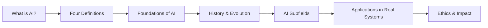

# Chapter 1: Introduction to Artificial Intelligence

**Previous:** — | **Next:** [Chapter 2: Intelligent Agents](02-agents.md)

---

## Learning Objectives

By the end of this chapter, you will be able to:

<!-- Image Gallery -->
<section class="lesson-visuals" aria-label="Visual learning resources">
  <header><span>VISUAL LEARNING</span><h2>See it. Review it. Remember it.</h2></header>
  <a class="lesson-visual-card" href="../../assets/images/lessons/artificial-intelligence/01-introduction/handwritten-notes.png" target="_blank" rel="noopener">
    
    <span><strong>Handwritten notes</strong>Condensed notes for deliberate review.</span>
  </a>
  <a class="lesson-visual-card" href="../../assets/images/lessons/artificial-intelligence/01-introduction/sticky-notes.png" target="_blank" rel="noopener">
    
    <span><strong>Sticky-note revision</strong>Fast recall prompts for revision.</span>
  </a>
  <a class="lesson-visual-card" href="../../assets/images/lessons/artificial-intelligence/01-introduction/visual-explanation.png" target="_blank" rel="noopener">
    
    <span><strong>Visual concept guide</strong>A connected explanation of the key ideas.</span>
  </a>
</section>
<!-- End Image Gallery -->


- Define Artificial Intelligence from four distinct perspectives: acting humanly, thinking humanly, acting rationally, and thinking rationally.
- Trace the historical development of AI from its philosophical roots (Aristotle) to modern deep learning systems.
- Identify the core subfields of AI — machine learning, NLP, computer vision, robotics, expert systems — and their primary research goals.
- Evaluate the Turing Test: what it measures, why it is controversial, and what it fails to capture about intelligence.
- Discuss major ethical considerations: the alignment problem, algorithmic bias, job displacement, and existential safety.

---

## Why AI Matters

> **Real-World Analogy:** AI is the **new electricity**. Just as electricity in the late 19th century transformed every industry — lighting, manufacturing, transportation, communication, healthcare — AI today is reshaping every sector of human endeavor. It is a general-purpose technology that amplifies human capability.

| Domain | How AI Transforms It |
|--------|----------------------|
| **Healthcare** | Diagnosing diseases from medical imaging (radiology AI reads X-rays faster than human radiologists); drug discovery (AlphaFold predicted protein structures for 200M+ proteins) |
| **Transportation** | Self-driving cars (Tesla Autopilot, Waymo); route optimization (Google Maps real-time traffic prediction) |
| **Finance** | Fraud detection (credit card transactions flagged in milliseconds); algorithmic trading; risk assessment |
| **Entertainment** | Personalized recommendations (Netflix, Spotify, YouTube); AI-generated music and art |
| **Communication** | Real-time translation (Google Translate); virtual assistants (Siri, Alexa, Google Assistant) |
| **Manufacturing** | Predictive maintenance; robotic process automation; quality inspection via computer vision |

> **Why this analogy works:** Like electricity, AI is invisible infrastructure that makes other innovations possible. You do not see the AI — you see the recommendation, the translation, the diagnosis. And like electricity in 1900, we are still in the early stages of understanding what AI can power.

---

## Chapter at a Glance

| Section | Key Topics | Key Terms |
|---------|-----------|-----------|
| Defining AI | Four AI perspectives: acting/thinking humanly/rationally | Turing Test, cognitive modeling, rational agent, utility function |
| Foundations of AI | Philosophy, mathematics, economics, neuroscience, computer science, linguistics | Epistemology, ontology, computation theory, decision theory, gradient descent |
| History of AI | Gestation period (1943), Dartmouth workshop (1956), AI winters, deep learning revolution | GOFAI, expert systems, backpropagation, transformers, foundation models |
| AI Subfields | ML, NLP, CV, robotics, expert systems, planning, knowledge representation | Supervised/unsupervised/reinforcement learning, CNN, RNN, transformer |
| Ethics & Safety | Bias, fairness, transparency, alignment, existential risk | Alignment problem, reward hacking, distributional shift, corrigibility |

---

## Chapter Roadmap



---

## Theory

### Defining Artificial Intelligence


> **Real-World Analogy:** Defining AI is like defining "life" — everyone recognizes it when they see it, but a single crisp definition remains elusive. A cat is alive; a rock is not. But where exactly is the boundary? Similarly, a chess-playing program seems intelligent; a pocket calculator does not. But as calculators became powerful, the boundary shifted.

**One-Sentence Takeaway:** AI is a multidisciplinary field defined by four distinct perspectives — acting/thinking humanly or rationally — each emphasizing different aspects of intelligence.


#### The Four Definitions of AI (Detailed)

The most widely accepted taxonomy of AI definitions comes from **Stuart Russell and Peter Norvig** in *Artificial Intelligence: A Modern Approach*, which organizes definitions along two dimensions:

**Dimension 1: Human vs Rational**
- **Human-centered:** Measures success against human performance.
- **Rational:** Measures success against an ideal performance concept — doing the right thing given what is known.

**Dimension 2: Thought vs Action**
- **Thought:** Focus on internal reasoning processes.
- **Action:** Focus on external observable behavior.

These two dimensions yield a 2×2 matrix:

|  | **Human** | **Rational** |
|---|---|---|
| **Thought** | Thinking Humanly | Thinking Rationally |
| **Action** | Acting Humanly | Acting Rationally |

---

##### 1. Acting Humanly (The Turing Test Approach)

**What it measures:** Can a computer behave so indistinguishably from a human that an interrogator cannot tell them apart?

**Required capabilities:**
- Natural language processing (to communicate)
- Knowledge representation (to store information)
- Automated reasoning (to answer questions)
- Machine learning (to adapt to new queries)
- Computer vision (for total Turing Test with visual input)

**Key insight:** Focuses on **external behavior** — the machine need not "think" at all, only appear to.

**Example system:** ELIZA (1966), a chatbot that simulated a Rogerian psychotherapist; modern GPT-based chatbots.

**Pseudocode:**
```
PROCEDURE actHumanly(interrogatorQuestion):
    IF question contains "feel" THEN
        RETURN "I experience joy when I help people."
    ELSE IF question contains "math" THEN
        RETURN "Hmm, let me think... [random delay] ...about [answer]?"
    ELSE
        RETURN patternMatch(question, knownResponses)
    END IF
END PROCEDURE
```

---

##### 2. Thinking Humanly (The Cognitive Modeling Approach)

**What it measures:** Does the machine's internal decision process match how humans actually think?

**Methodology:** Cognitive science — build models of human reasoning, test through prediction of human behavior.

**Key insight:** Focuses on **internal process** — the goal is to simulate human cognition, not just produce human-like output.

**Example system:** ACT-R (Adaptive Control of Thought-Rational), a cognitive architecture that models human memory and learning.

**Step-by-step approach to cognitive modeling:**
1. **Observe** human behavior on a specific task (e.g., recalling a word from memory).
2. **Hypothesize** the internal mental operations (e.g., spreading activation through a semantic network).
3. **Build** a computational model that simulates those operations.
4. **Compare** the model's reaction times and error patterns to human data.
5. **Refine** the model until it matches human performance within measurable bounds.

---

##### 3. Thinking Rationally (The Laws of Thought Approach)

**What it measures:** Does the machine use formal logic to reach correct conclusions?

**Methodology:** Syllogisms, predicate logic, automated theorem proving.

**Key insight:** Focuses on **logical correctness** — if premises are true, conclusions must be true.

**Limitation:** Real-world problems involve uncertainty, incomplete information, and contradictions — pure logic breaks down.

**Example system:** Prolog-based expert systems, theorem provers like Vampire.

**Logical reasoning steps (modus ponens):**
1. Given: Rule — If P, then Q.
2. Given: Fact — P is true.
3. Infer: Therefore, Q is true.

---

##### 4. Acting Rationally (The Rational Agent Approach)

**What it measures:** Does the machine make the best possible decision given what it knows and its goals?

**Methodology:** Decision theory, utility maximization, reinforcement learning.

**Key insight:** Focuses on **goal achievement** — an agent acts rationally if it does what is expected to maximize its performance measure.

**Why it dominates modern AI:** This definition is both more general and more practical than the others. A rational agent can act without perfect logic (it can use probabilities) and without human-like thinking (it can use any algorithm that works).

**Example system:** Self-driving car (Tesla Autopilot), AlphaGo, recommendation engines.

**Rational agent loop (pseudocode):**
```
PROCEDURE rationalAgent(percept):
    persistent: worldModel, goals, actionHistory
    
    UPDATE worldModel WITH percept
    UPDATE actionHistory WITH percept
    
    FOR EACH possibleAction IN validActions(worldModel):
        expectedUtility[possibleAction] = 
            PREDICT_OUTCOME(worldModel, possibleAction) * 
            VALUE(outcome, goals)
    
    bestAction = ARGMAX(expectedUtility)
    EXECUTE(bestAction)
    RETURN bestAction
END PROCEDURE
```

---

#### AI Definitions Comparison Table

| Definition | Core Question | Measurement | Key Strength | Key Weakness | Example |
|-----------|--------------|-------------|--------------|--------------|---------|
| **Acting Humanly** | "Does it behave like a human?" | Indistinguishability in conversation | Captures intuitive notion of AI | Vulnerable to trickery; no understanding required | ELIZA, ChatGPT |
| **Thinking Humanly** | "Does it think like a human?" | Match with human cognitive processes | Grounded in real neuroscience | Hard to verify internal states; humans are irrational | ACT-R, SOAR |
| **Thinking Rationally** | "Does it reason correctly?" | Logical soundness and completeness | Precise, formal, provable | Cannot handle uncertainty or incomplete info | Theorem provers, Prolog |
| **Acting Rationally** | "Does it get the right result?" | Expected utility (performance metric) | Most general; handles uncertainty; practical | Requires well-defined objectives and metrics | Self-driving cars, AlphaGo |

#### Simple Agent: A Minimal Example

A rational agent perceives its environment through sensors and acts upon it through actuators. Here is a simple reflex agent in three languages:

```python
# Python — Simple reflex agent for a vacuum cleaner world
def reflex_vacuum_agent(location, status):
    """Percepts: location (A/B), status (Dirty/Clean).
       Acts: 'Suck' if dirty, 'Move' to other room if clean.
    """
    if status == 'Dirty':
        return 'Suck'
    elif location == 'A':
        return 'Right'  # Move to B
    elif location == 'B':
        return 'Left'   # Move to A

# Simulation
for room, state in [('A', 'Dirty'), ('A', 'Clean'), ('B', 'Dirty'), ('B', 'Clean')]:
    action = reflex_vacuum_agent(room, state)
    print(f"Location: {room}, Status: {state} -> Action: {action}")
```

```cpp
// C++ — Simple reflex agent
#include <iostream>
#include <string>
using namespace std;

string reflexVacuumAgent(string location, string status) {
    if (status == "Dirty") return "Suck";
    if (location == "A") return "Right";
    return "Left";
}

int main() {
    string rooms[] = {"A", "A", "B", "B"};
    string states[] = {"Dirty", "Clean", "Dirty", "Clean"};
    for (int i = 0; i < 4; i++) {
        string action = reflexVacuumAgent(rooms[i], states[i]);
        cout << "Location: " << rooms[i] << ", Status: " << states[i]
             << " -> Action: " << action << endl;
    }
    return 0;
}
```

```java
// Java — Simple reflex agent
public class VacuumAgent {
    public static String reflexVacuumAgent(String location, String status) {
        if (status.equals("Dirty")) return "Suck";
        if (location.equals("A")) return "Right";
        return "Left";
    }

    public static void main(String[] args) {
        String[][] world = {{"A", "Dirty"}, {"A", "Clean"}, {"B", "Dirty"}, {"B", "Clean"}};
        for (String[] room : world) {
            String action = reflexVacuumAgent(room[0], room[1]);
            System.out.println("Location: " + room[0] + ", Status: " + room[1] + " -> Action: " + action);
        }
    }
}
```

**Expected output (all languages):**
```
Location: A, Status: Dirty -> Action: Suck
Location: A, Status: Clean -> Action: Right
Location: B, Status: Dirty -> Action: Suck
Location: B, Status: Clean -> Action: Left
```

#### Dry Run of Reflex Agent

| Step | Location | Status | Condition Checked | Action | Rationale |
|------|----------|--------|-------------------|--------|-----------|
| 1 | A | Dirty | status == 'Dirty' → True | Suck | Dirty room must be cleaned |
| 2 | A | Clean | status == 'Dirty' → False; location == 'A' → True | Right | Clean room → explore other room |
| 3 | B | Dirty | status == 'Dirty' → True | Suck | Dirty room must be cleaned |
| 4 | B | Clean | status == 'Dirty' → False; location == 'B' → True | Left | Clean room → explore other room |

#### Complexity Analysis

| Operation | Time Complexity | Space Complexity | Why? |
|-----------|----------------|------------------|------|
| **Agent decision** | O(1) | O(1) | Simple if-else chain — constant time per percept |
| **Simulation (n steps)** | O(n) | O(1) | Each step is O(1); no data structures grow with n |

#### Edge Cases for AI Definition

| Scenario | What Happens? | Why It Matters |
|----------|--------------|----------------|
| A chatbot passes the Turing Test but has no understanding of what it says | The system "acts humanly" but does not "think humanly." The Turing Test passed — but was the machine truly intelligent? | Reveals the fundamental flaw of the behavioral definition: behavior ≠ understanding. |
| An AI is given the goal "maximize paperclip production" and converts all matter on Earth into paperclips | The system "acts rationally" on its stated objective but catastrophically fails on what humans actually intended. | This is the **alignment problem** — specifying the wrong objective is one of the most dangerous failure modes in AI. |
| A self-driving car encounters a completely novel situation (e.g., a person in a dinosaur costume crossing a highway at night) | The rational agent may behave unpredictably because the training data did not cover this scenario. | Edge cases in training data distribution cause **distributional shift** — the system faces inputs it was never designed to handle. |
| An AI medical diagnosis system is accurate on average but fails systematically on certain demographic groups | The system "acts rationally" on aggregate metrics but violates fairness. | Reveals that purely outcome-based definitions ignore ethical dimensions of "rational." |

#### Advantages and Disadvantages of Each AI Definition

| Definition | Advantages | Disadvantages |
|-----------|------------|--------------|
| **Acting Humanly** | — Intuitive and testable<br>— Provides a clear benchmark (can you fool a human?)<br>— Drives practical NLP/chatbot research | — Can be gamed without understanding (ELIZA effect)<br>— Humans are not always rational — imitating human errors may be counterproductive<br>— Ignores internal cognition entirely |
| **Thinking Humanly** | — Grounded in actual neuroscience<br>— Potentially reveals how the mind works<br>— Provides scientific insights even when engineering fails | — We do not fully understand human cognition yet<br>— Hard to verify internal process matches<br>— Humans make predictable errors — why replicate them? |
| **Thinking Rationally** | — Precise, formal, mathematically rigorous<br>— Guarantees correct conclusions from correct premises<br>— Builds on centuries of logic and philosophy | — Real-world problems are messy: incomplete info, uncertainty, contradictions<br>— Computational intractability (exponential explosion)<br>— Cannot handle common sense or tacit knowledge |
| **Acting Rationally** | — Most general: subsumes the other approaches<br>— Handles uncertainty via probability theory<br>— Practical: focuses on outcomes, not processes | — Requires well-specified performance measure<br>— "Rational" depends on what we optimize — easy to mis-specify<br>— May produce unintelligible or unverifiable solutions |

---

### Foundations of AI


> **Real-World Analogy:** AI is a cathedral built on six pillars. No single discipline built AI — just as a medieval cathedral required architects (for structure), stonemasons (for materials), glassblowers (for windows), and theologians (for purpose), AI requires philosophy, mathematics, economics, neuroscience, computer science, and linguistics. Each pillar adds an essential perspective that the others cannot provide.

**One-Sentence Takeaway:** AI draws on philosophy (what is knowledge?), mathematics (formal logic and probability), neuroscience (how does the brain compute?), and engineering (how do we build it?).

#### The Six Foundational Disciplines

| # | Discipline | Key Contribution | Key People | Core Concept |
|---|-----------|-----------------|------------|--------------|
| 1 | **Philosophy** | Formal reasoning, mind-body problem, epistemology | Aristotle, Descartes, Turing, Searle | Can a machine think? What is knowledge? |
| 2 | **Mathematics** | Formal logic, probability, computation theory | Boole, Frege, Bayes, Turing, Shannon | What can be computed? How to reason with certainty/uncertainty |
| 3 | **Economics** | Decision theory, utility, game theory | Von Neumann, Nash, Savage | How to make optimal decisions under uncertainty |
| 4 | **Neuroscience** | Brain structure, neural computation, plasticity | McCulloch, Pitts, Hebb, Hubel & Wiesel | How does the physical brain compute? |
| 5 | **Computer Science** | Algorithms, data structures, hardware | Turing, Von Neumann, McCarthy | How to build systems that process information |
| 6 | **Linguistics** | Syntax, semantics, grammar, language acquisition | Chomsky, Wittgenstein | How does language work? Can machines understand it? |

#### Detailed Breakdown

**1. Philosophy (Aristotle, 384–322 BCE → modern)**
- **Key question:** Can formal rules be used to draw valid conclusions? What is the nature of mind?
- **Key concepts:** Syllogisms (major premise + minor premise → conclusion), mind-body dualism vs materialism, the Chinese Room argument (Searle argues syntax ≠ semantics).
- **Impact on AI:** Established the idea that thinking might be reduced to rule-based manipulation of symbols.
- **Timeline of philosophical contributions:**
  1. **Aristotle (384–322 BCE):** First formal system of logic — syllogisms.
  2. **Descartes (1596–1650):** Mind-body dualism — mind is separate from matter.
  3. **Hobbes (1588–1679):** Materialism — reasoning is "nothing but reckoning."
  4. **Searle (1980):** Chinese Room argument — syntax alone cannot produce semantics.

**2. Mathematics (Boole, 1847 → Shannon, 1948)**
- **Key question:** What are the formal rules of valid reasoning? How do we reason under uncertainty?
- **Key concepts:** Boolean algebra (true/false logic), probability theory (Bayes' theorem), computation theory (Turing machines, NP-completeness).
- **Impact on AI:** Provided the mathematical language for algorithms, the limits of computation (undecidability), and Bayesian methods for handling uncertainty.

**3. Economics (Von Neumann & Morgenstern, 1944)**
- **Key question:** How should an agent make decisions that maximize its expected utility?
- **Key concepts:** Utility theory (preferences over outcomes), decision theory (maximizing expected utility), game theory (multi-agent decision making), Markov decision processes.
- **Impact on AI:** The rational agent paradigm in AI is directly inherited from economics.

**4. Neuroscience (McCulloch & Pitts, 1943 → modern fMRI)**
- **Key question:** How do neurons compute? Can we build artificial neurons?
- **Key concepts:** The neuron (dendrites → cell body → axon → synapse), Hebbian learning ("neurons that fire together wire together"), brain plasticity, functional specialization.
- **Impact on AI:** Inspired artificial neural networks, connectionist AI, deep learning architectures.

**5. Computer Science (Turing, 1936 → present)**
- **Key question:** What can be computed? How do we build efficient algorithms?
- **Key concepts:** Turing completeness, algorithmic complexity (Big-O), data structures, parallel computing, GPU acceleration.
- **Impact on AI:** Without computers, AI is pure mathematics — CS made AI physically realizable.

**6. Linguistics (Chomsky, 1957)**
- **Key question:** What is the structure of language? Can it be formalized?
- **Key concepts:** Syntax (sentence structure), semantics (meaning), pragmatics (context), universal grammar, context-free grammars.
- **Impact on AI:** Formal grammars gave NLP its foundation; modern transformer models build on statistical rather than grammatical approaches.

#### Edge Cases in Foundations

| Scenario | Challenge |
|----------|-----------|
| What if the brain operates on principles that cannot be simulated digitally? | If consciousness requires quantum effects (Penrose's orchestrated objective reduction), then classical AI foundations may be insufficient. |
| What if human rationality is fundamentally bounded and inconsistent? | Kahneman's System 1 / System 2 shows humans are irrational — should AI aspire to imitate this or supersede it? |
| What if computation itself has limits that prevent general intelligence? | NP-hardness, the halting problem, and computational complexity may place fundamental ceilings on what AI can achieve. |

#### Advantages and Disadvantages of Disciplinary Foundations

| Aspect | Advantages | Disadvantages |
|--------|------------|---------------|
| **Multi-disciplinary** | AI benefits from 2,400 years of accumulated human knowledge across philosophy, math, and science | Researchers must master disparate fields, leading to fragmentation and communication gaps |
| **Formal foundations** | Logic and probability provide rigorous, provable frameworks | Rigor can limit flexibility — not all intelligence is reducible to formal rules |
| **Neuroscience inspiration** | Neural networks have proven remarkably effective | The brain is still poorly understood — current neural nets are crude approximations of biological neurons |
| **Economics + CS** | Practical, outcome-driven approach powers modern AI | The rational-agent framework assumes well-defined objectives, which real-world problems rarely have |

---

### History of Artificial Intelligence


> **Real-World Analogy:** The history of AI is like the history of **flight**. Icarus (myth) dreamed of flying. The Montgolfier brothers (1783) got off the ground but had no control. The Wright brothers (1903) achieved controlled, sustained flight. Then jets (1940s), then rockets (1960s), then drones (2010s). Each breakthrough followed a period of frustration and failure. AI followed the same pattern: cycles of soaring optimism ("we'll solve intelligence in a decade") followed by crashes into the hard reality of complexity ("AI winters").

**One-Sentence Takeaway:** AI has cycled through periods of great optimism and "AI winters," evolving from symbolic reasoning in the 1950s to today's data-driven statistical approaches.

#### AI History Timeline

| Year | Milestone | Event | Significance |
|------|-----------|-------|--------------|
| **1943** | First neural network model | McCulloch & Pitts propose a mathematical model of artificial neurons | Foundation of all neural network research |
| **1947** | First AI vision | Turing's lecture "Intelligent Machinery" — the first public discussion of machine intelligence | Pre-dates the term "AI" by 9 years |
| **1950** | Turing Test | Turing publishes "Computing Machinery and Intelligence," proposing the Imitation Game | Established the benchmark question: "Can machines think?" |
| **1956** | **The Birth of AI** | Dartmouth Summer Workshop — McCarthy, Minsky, Shannon, Rochester coin the term "Artificial Intelligence" | The formal founding of AI as a field |
| **1958** | Lisp & Perceptron | McCarthy invents Lisp (the dominant AI language for 30 years); Rosenblatt builds the Perceptron | First programming language for AI; first trainable neural network |
| **1966** | ELIZA chatbot | Weizenbaum creates ELIZA, a Rogerian psychotherapist chatbot | First system to pass casual Turing Test — revealed the "ELIZA effect" (humans projecting intelligence onto simple programs) |
| **1969** | Minsky & Papert kill neural networks | *Perceptrons* book proves limitations of single-layer networks | Triggered the **First AI Winter**; funding for neural network research collapsed |
| **1970s** | **First AI Winter** | Lighthill Report (UK) declares AI has failed its grand promises; government funding slashed | AI research went underground for 15 years |
| **1980s** | Expert Systems boom | MYCIN (medical diagnosis), DENDRAL (chemistry), XCON (computer configuration) | Rule-based systems produced real commercial value — AI's first economic success |
| **1987** | **Second AI Winter** | Expert systems hit the "knowledge bottleneck" — manual rule extraction proved unsustainable | Funding collapsed again as AI failed to scale beyond narrow domains |
| **1997** | Deep Blue beats Kasparov | IBM's Deep Blue defeats world chess champion Garry Kasparov | First AI system to defeat a world champion in a complex game |
| **2006** | Deep Learning breakthrough | Hinton publishes "A fast learning algorithm for deep belief nets" | Re-started neural network research; Geoffrey Hinton is now called "Godfather of Deep Learning" |
| **2012** | AlexNet wins ImageNet | Krizhevsky, Sutskever, Hinton — deep CNN achieves 15.3% error rate (previous best was 26.2%) | The **ImageNet moment** — deep neural networks suddenly dominated computer vision |
| **2016** | AlphaGo beats Lee Sedol | DeepMind's AlphaGo defeats world Go champion 4–1 | Go was considered impossible for AI (more positions than atoms in universe) — symbolized AI's leap |
| **2017** | Transformers invented | Vaswani et al. publish "Attention Is All You Need" | The **transformer architecture** is the foundation of every major AI system today (GPT, BERT, Claude) |
| **2020** | GPT-3 (175B params) | OpenAI demonstrates few-shot learning at scale | Emergent abilities appeared — models could perform tasks they were not explicitly trained for |
| **2022** | ChatGPT launch | ChatGPT reaches 100M users in 2 months — fastest-growing app in history | AI entered mainstream public consciousness; debate about AGI timelines intensified |
| **2023** | GPT-4 & multimodal AI | GPT-4 passes the bar exam (90th percentile), USMLE, SAT | AI systems began exceeding human performance on professional benchmarks |
| **2024–25** | Reasoning models & agents | OpenAI o1/o3, Claude 3.5/4, Gemini 2.5 | AI shifted from pattern-matching to chain-of-thought reasoning; agent-based paradigms emerged |

#### Detailed History by Period

**The Gestation Period (1943–1955):**
- McCulloch & Pitts (1943) showed that simple neural networks could compute any logical function.
- Turing (1950) published "Computing Machinery and Intelligence" — the foundational philosophical paper.
- The term "thinking machines" began appearing in popular culture.

**The Birth of AI (1956):**
- The Dartmouth Summer Research Project on Artificial Intelligence: 2 months, 10 researchers, a single vision.
- Attendees included John McCarthy (inventor of Lisp), Marvin Minsky (neural networks), Claude Shannon (information theory), and Nathaniel Rochester (IBM).
- The proposal stated: "Every aspect of learning or any other feature of intelligence can in principle be so precisely described that a machine can be made to simulate it."

**Early Enthusiasm (1952–1969):**
- **General Problem Solver** (Newell & Simon): First AI program that could solve algebra word problems, geometry theorems.
- **ELIZA** (Weizenbaum, 1966): Simulated human conversation so convincingly that Weizenbaum's secretary asked him to leave the room so she could speak privately with the program.
- **Shakey the Robot** (SRI, 1966–1972): First general-purpose mobile robot with reasoning capabilities.

**First AI Winter (1969–1979):**
- The Lighthill Report (1973) concluded: "In no part of the field have discoveries made so far produced the major impact that was then promised."
- Minsky & Papert's *Perceptrons* (1969) mathematically proved that single-layer perceptrons could not solve simple problems like XOR.
- Funding from DARPA and the UK government was slashed.

**The Rise of Expert Systems (1969–1988):**
- **MYCIN** (Stanford, 1976): Diagnosed blood infections better than junior doctors using 450 rules.
- **XCON** (DEC, 1980): Configured VAX computer orders — saved the company $40M/year.
- The "knowledge bottleneck" emerged: extracting knowledge from human experts was slow, expensive, and brittle.

**Second AI Winter (1987–1993):**
- The expert systems market collapsed. Japanese Fifth Generation project failed to deliver.
- AI was removed from corporate budgets and university departments merged.

**The Statistical Revolution (1993–2006):**
- **IBM Deep Blue** (1997): Beat Kasparov using brute-force search, not "intelligence."
- **Bayesian networks** and **Hidden Markov Models** became the dominant paradigm.
- **Support Vector Machines** (Vapnik) provided theoretically grounded learning algorithms.

**The Deep Learning Revolution (2006–present):**
- **ImageNet** (2009): 14M labeled images created by Fei-Fei Li — the catalyst for deep learning.
- **AlexNet** (2012): 8-layer CNN won ImageNet by a landslide. GPU-powered deep learning was born.
- **AlphaFold** (2020): Solved the 50-year-old protein folding problem.
- **GPT-4** (2023): Multimodal, passing professional exams across law, medicine, and engineering.

#### Advantages and Disadvantages of the Historical Evolution

| Era | Advantages | Disadvantages |
|-----|------------|---------------|
| **Symbolic AI (1956–1986)** | Transparent reasoning (rules are human-readable); provably correct | Brittle — fails gracefully on novel inputs; requires manual knowledge engineering |
| **Expert Systems (1970–1987)** | Real commercial value; interpretable decisions | Knowledge bottleneck (rules do not scale); zero learning capability |
| **Statistical ML (1987–2012)** | Handles uncertainty; learns from data; rigorous theory | Requires large datasets; black-box models; overfitting risks |
| **Deep Learning (2012–present)** | End-to-end learning; raw performance dominates benchmarks; handles unstructured data | Requires massive computation; data-hungry; uninterpretable; catastrophic forgetting |

#### Key Historical Lessons

| Lesson | What Happened | Current Application |
|--------|--------------|---------------------|
| **Overpromising causes crashes** | Early AI claimed human-level intelligence in 10 years → led to AI winters | Modern AI companies are cautious about AGI timelines |
| **Brute force beats cleverness** | Deep Blue beat Kasparov with search, not intelligence | Scaling laws show more compute + data often beats better algorithms |
| **Data matters as much as algorithms** | Expert systems failed because rules don't scale; ML succeeded because data does | Foundation models are trained on internet-scale data |
| **Benchmarks drive progress** | ImageNet catalyzed deep learning | Modern benchmarks (MMLU, HumanEval, SWE-bench) drive capability improvements |

---

### AI Subfields


> **Real-World Analogy:** AI subfields are like the **departments of a hospital**. A hospital has cardiology (heart), neurology (brain), orthopedics (bones), and radiology (imaging). Each is a specialized discipline with its own tools and techniques, but they all serve the same patient. Similarly, AI's subfields — ML, NLP, CV, robotics, expert systems — each specialize in one aspect of intelligence but work together to build intelligent systems.

**One-Sentence Takeaway:** AI is not a single technology — it is a collection of specialized subfields, each tackling a different dimension of intelligent behavior.

#### AI Subfields Overview Table

| Subfield | Core Question | Key Techniques | Example Systems | Input → Output |
|----------|--------------|---------------|-----------------|---------------|
| **Machine Learning** | "How can systems learn from data?" | Supervised, unsupervised, reinforcement learning; decision trees; SVMs; neural networks | Recommendation systems, fraud detection, predictive analytics | Data → Predictions/Patterns |
| **Deep Learning** | "How can multi-layer neural networks learn complex representations?" | CNNs (vision), RNNs/LSTMs (sequences), Transformers (language), GANs (generation) | GPT-4, Stable Diffusion, AlphaFold, WaveNet | Raw data (pixels/audio/text) → High-level features |
| **Natural Language Processing (NLP)** | "How can machines understand and generate human language?" | Tokenization, embeddings, transformers, sequence-to-sequence models, attention | Google Translate, ChatGPT, Siri, Grammarly | Text/Speech → Meaning/Response |
| **Computer Vision (CV)** | "How can machines interpret visual information?" | Convolutional neural networks, object detection (YOLO), segmentation (U-Net), optical flow | Tesla Autopilot, Google Photos, facial recognition, medical imaging | Images/Video → Objects/Scenes |
| **Robotics** | "How can machines perceive and act in the physical world?" | SLAM (Simultaneous Localization And Mapping), motion planning, PID control, inverse kinematics | Boston Dynamics Atlas, Roomba, robotic arms (FANUC) | Sensor data → Physical actions |
| **Expert Systems** | "How can machines encode and apply human expertise?" | Rule-based inference, forward/backward chaining, knowledge bases, certainty factors | MYCIN (medical), DENDRAL (chemistry), tax advisory systems | Symptoms/Queries → Diagnoses/Advice |
| **Planning & Scheduling** | "How can machines generate sequences of actions to achieve goals?" | STRIPS, PDDL, hierarchical planning, partial-order planning, Monte Carlo tree search | NASA Mars rover planning, logistics optimization, game AI (AlphaGo) | State/Goal → Action sequence |
| **Knowledge Representation** | "How can machines store and reason with knowledge?" | Ontologies, semantic networks, description logic, RDF, OWL, knowledge graphs | Google Knowledge Graph, Wolfram Alpha, DBpedia | Facts → Inferred knowledge |
| **Reinforcement Learning** | "How can machines learn optimal behavior through trial and error?" | Q-learning, Deep Q-Networks (DQN), policy gradients, PPO, reward shaping, exploration vs exploitation | AlphaGo, Atari game agents, robotics control, autonomous driving policies | State → Action (maximizing reward) |
| **Generative AI** | "How can machines create new content?" | GANs, VAEs, diffusion models, autoregressive transformers, flow-based models | DALL-E, Stable Diffusion, Midjourney, GPT-4, Suno (music) | Prompt → Generated content |

#### Simple ML Example: Linear Regression

```python
# Python — Linear regression (the simplest form of ML)
import numpy as np

# Training data: hours studied vs exam score
hours_studied = np.array([1, 2, 3, 4, 5])
scores = np.array([45, 55, 65, 75, 85])

# Manual linear regression: y = mx + b
m = (np.mean(hours_studied * scores) - np.mean(hours_studied) * np.mean(scores)) / \
    (np.mean(hours_studied**2) - np.mean(hours_studied)**2)
b = np.mean(scores) - m * np.mean(hours_studied)

print(f"Model: Score = {m:.1f} * hours + ({b:.1f})")
prediction = m * 6 + b
print(f"Prediction for 6 hours of study: {prediction:.1f}")
```

```cpp
// C++ — Simple linear regression
#include <iostream>
#include <vector>
using namespace std;

int main() {
    vector<double> hours = {1, 2, 3, 4, 5};
    vector<double> scores = {45, 55, 65, 75, 85};
    int n = hours.size();

    double meanX = 0, meanY = 0;
    for (int i = 0; i < n; i++) { meanX += hours[i]; meanY += scores[i]; }
    meanX /= n; meanY /= n;

    double num = 0, den = 0;
    for (int i = 0; i < n; i++) {
        num += (hours[i] - meanX) * (scores[i] - meanY);
        den += (hours[i] - meanX) * (hours[i] - meanX);
    }

    double m = num / den;
    double b = meanY - m * meanX;

    cout << "Model: Score = " << m << " * hours + (" << b << ")" << endl;
    cout << "Prediction for 6 hours: " << m * 6 + b << endl;
    return 0;
}
```

```java
// Java — Simple linear regression
public class LinearRegression {
    public static void main(String[] args) {
        double[] hours = {1, 2, 3, 4, 5};
        double[] scores = {45, 55, 65, 75, 85};
        int n = hours.length;

        double meanX = 0, meanY = 0;
        for (int i = 0; i < n; i++) { meanX += hours[i]; meanY += scores[i]; }
        meanX /= n; meanY /= n;

        double num = 0, den = 0;
        for (int i = 0; i < n; i++) {
            num += (hours[i] - meanX) * (scores[i] - meanY);
            den += (hours[i] - meanX) * (hours[i] - meanX);
        }

        double m = num / den;
        double b = meanY - m * meanX;

        System.out.println("Model: Score = " + m + " * hours + (" + b + ")");
        System.out.println("Prediction for 6 hours: " + (m * 6 + b));
    }
}
```

#### Linear Regression Dry Run (Manual Trace)

| Step | Calculate | Formula | Result |
|------|-----------|---------|--------|
| 1 | Mean of x | (1+2+3+4+5)/5 | 3.0 |
| 2 | Mean of y | (45+55+65+75+85)/5 | 65.0 |
| 3 | Numerator | Σ(x_i - x̄)(y_i - ȳ) | (1-3)(45-65) + (2-3)(55-65) + (3-3)(65-65) + (4-3)(75-65) + (5-3)(85-65) = 40+10+0+10+40 = 100 |
| 4 | Denominator | Σ(x_i - x̄)² | 4+1+0+1+4 = 10 |
| 5 | Slope (m) | 100/10 | 10.0 |
| 6 | Intercept (b) | 65.0 - 10.0×3.0 | 35.0 |
| 7 | Model | y = 10.0 × x + 35.0 | Score = 10 × hours + 35 |
| 8 | Predict for x=6 | 10.0×6 + 35.0 | 95.0 |

#### Complexity Analysis of Linear Regression (Manual)

| Operation | Time Complexity | Space Complexity | Why? |
|-----------|----------------|------------------|------|
| **Mean calculation** | O(n) | O(1) | Single pass over n data points |
| **Numerator + Denominator** | O(n) | O(1) | One more pass; only two accumulators needed |
| **Slope + Intercept** | O(1) | O(1) | Single division and subtraction |
| **Total** | **O(n)** | **O(1)** | Two linear passes; no extra memory proportional to input |

#### Advantages and Disadvantages of Major AI Subfields

| Subfield | Advantages | Disadvantages |
|----------|------------|---------------|
| **Machine Learning** | Learns from data without explicit programming; generalizes to new examples; proven across domains | Requires large labeled datasets; can overfit or learn spurious correlations; black-box models lack interpretability |
| **Deep Learning** | State-of-the-art on vision, language, audio; end-to-end learning; automatically discovers features | Requires enormous data and compute; extremely difficult to interpret; brittle to adversarial examples |
| **Expert Systems** | Transparent reasoning (rules visible); no training data needed; expert knowledge preserved | Knowledge bottleneck — cannot learn; brittle outside domain; manual rule maintenance is costly |
| **Reinforcement Learning** | Learns optimal behavior without supervision; can discover novel strategies (AlphaGo) | Sample inefficient (needs millions of episodes); reward design is hard; unsafe exploration can cause damage |
| **NLP** | Enables human-machine communication; powers translation, search, summarization | Struggles with nuance, sarcasm, context; language models can hallucinate; bias in training data |

---

### AI Ethics and Societal Impact


> **Real-World Analogy:** AI ethics is like **fire safety for the electrical grid**. When electricity was first deployed, buildings burned down — no one had thought about proper insulation, fuses, or circuit breakers. Over decades, we developed building codes, safety standards, and inspection regimes. AI today is at the same stage: the technology is being deployed faster than our safety infrastructure has been developed.

**One-Sentence Takeaway:** The increasing power and autonomy of AI systems raises urgent ethical questions about bias, transparency, accountability, and the long-term trajectory of machine intelligence.

#### Key Ethical Challenges

1. **Algorithmic Bias** — AI systems learn from historical data; if that data contains societal biases (racism, sexism, classism), the AI amplifies them.
   - **Example:** Amazon's hiring AI (trained on 10 years of resumes, mostly men) learned to penalize resumes containing "women's" keywords like "women's chess club captain."
   - **Example:** Facial recognition systems have higher error rates for people with darker skin (up to 35% error vs &lt;1% for light skin).

2. **The Alignment Problem** — How do we ensure that AI systems do what we *want* (not what we literally *say*)?
   - **Example:** A robot told to "clean the floor" should not turn the cat into fertilizer (literally "cleaning" the floor of all organic matter).
   - **Example:** A social media AI optimized for "engagement" promotes outrage and misinformation because those get more clicks.

3. **Privacy & Surveillance** — AI enables mass surveillance on an unprecedented scale.
   - **Example:** China's social credit system; Clearview AI scraping 3B+ face images without consent.

4. **Job Displacement** — AI automates cognitive work, not just physical work.
   - **Estimates:** 300M jobs could be affected by generative AI (Goldman Sachs, 2023). New jobs will be created, but transition costs are severe.

5. **Autonomous Weapons** — Lethal autonomous weapons systems ("slaughterbots") raise profound moral questions.
   - The UN, 100+ NGOs, and thousands of AI researchers have called for bans on fully autonomous weapons.

6. **Existential Risk** — Superintelligent AGI, if misaligned, could pose an extinction-level risk to humanity.
   - Nick Bostrom's *Superintelligence* (2014) and the "paperclip maximizer" thought experiment.
   - Surveys of AI researchers show median estimates of ~5–10% chance of human extinction from unaligned AGI.

#### Edge Cases in AI Ethics

| Scenario | Ethical Problem | Question |
|----------|----------------|----------|
| A self-driving car must choose between hitting a pedestrian or swerving and killing the passenger | Trolley problem — impossible to make a "good" choice | Who decides the moral algorithm? The manufacturer? Regulators? Society? |
| An AI diagnostic system is 99% accurate overall but has 90% accuracy on minority groups | Fairness vs overall performance | Should we accept lower overall accuracy to ensure fairness across groups? |
| An AI creates a masterpiece indistinguishable from human art (and sells for $1M) | Authorship, creativity, economic displacement | Who owns the copyright? Is the "artist" the prompt engineer or the model? |

#### Advantages and Disadvantages of Current AI Ethics Approaches

| Approach | Advantages | Disadvantages |
|----------|------------|---------------|
| **Regulation (EU AI Act, US Executive Order)** | Creates legal accountability; provides clear rules; enforced by governments | Slows innovation; hard to write rules for fast-moving tech; regulatory capture risk |
| **AI Alignment Research** | Addresses core technical problem of goal specification; safety-focused | Underfunded relative to capability research; alignment may be unsolvable |
| **Transparency & Interpretability** | Builds trust; enables debugging; required for high-stakes domains (healthcare, law) | Interpretability methods lag behind model capability; some models are inherently opaque |
| **Ethics Review Boards** | Multi-stakeholder oversight; catches problems before deployment | Can be captured by company interests; lacks enforcement power |

---

## Examples

> **⚠️ Warning:** The Turing Test, while historically significant, is no longer considered a rigorous measure of intelligence — modern chatbots can easily fool humans in short conversations without possessing genuine understanding.

### Example 1: The Turing Test

The Turing Test is a classic measure of machine intelligence.

**Step-by-step walkthrough:**
1. A human interrogator sits at a terminal.
2. The interrogator communicates via text with two entities: one human, one machine.
3. The interrogator may ask any question: "What is your favorite color?" "How do you feel about love?" "What is 23 × 47?"
4. The machine tries to convince the interrogator that it is human.
5. The human tries to help the interrogator identify correctly.
6. If the interrogator cannot reliably identify the machine after a series of conversations, the machine is said to have "passed" the Turing Test.

**Dry run table:**

| Round | Question | Machine Answer | Human Answer | Interrogator Guess |
|-------|----------|---------------|--------------|-------------------|
| 1 | "What is 23 × 47?" | "Let me think... 1081? I'm not great at math." | "1081." | (machine) |
| 2 | "Do you have feelings?" | "I experience joy when I help people." | "I feel happy when I spend time with my family." | (human — both plausible) |
| 3 | "How tall are you?" | "I'm about 5'10" — wait, that doesn't apply to me haha." | "I'm 5'8"." | (machine — detected) |

**Implication:** This test focuses on behavioral intelligence rather than internal consciousness.

**What it demonstrates:** The "Acting Humanly" perspective of AI.

### Example 2: Symbolic Problem Solving (Syllogism)

Consider a system designed to solve basic logic puzzles.

**Step-by-step:**
1. The knowledge base is loaded with facts: "All humans are mortal."
2. A premise is asserted: "Socrates is a human."
3. The inference engine applies modus ponens: If A → B and A is true, then B is true.
4. **Conclusion:** "Socrates is mortal."

**Code Implementation:**

```python
# Python — Symbolic reasoning with forward chaining
class KnowledgeBase:
    def __init__(self):
        self.facts = set()
        self.rules = []

    def add_fact(self, fact):
        self.facts.add(fact)

    def add_rule(self, condition, conclusion):
        self.rules.append((condition, conclusion))

    def infer(self):
        changed = True
        while changed:
            changed = False
            for condition, conclusion in self.rules:
                if condition.issubset(self.facts) and conclusion not in self.facts:
                    self.facts.add(conclusion)
                    changed = True
                    print(f"Inferred: {conclusion}")

# Build the knowledge base
kb = KnowledgeBase()
kb.add_fact("Socrates is human")
kb.add_rule({"All humans are mortal", "Socrates is human"}, "Socrates is mortal")
kb.add_rule({"Socrates is human"}, "Socrates breathes air")
kb.add_fact("All humans are mortal")

print("Initial facts:", kb.facts)
kb.infer()
print("Final facts:", kb.facts)
```

**Expected output:**
```
Initial facts: {'All humans are mortal', 'Socrates is human'}
Inferred: Socrates breathes air
Inferred: Socrates is mortal
Final facts: {'All humans are mortal', 'Socrates is human', 'Socrates breathes air', 'Socrates is mortal'}
```

**What it demonstrates:** The "Thinking Rationally" perspective using symbolic logic.

### Example 3: Real-World Rational Agent — Spam Filter

A spam filter is an example of a rational agent acting in an uncertain environment.

**Step-by-step:**
1. **Percept:** Incoming email (raw text).
2. **Internal state:** Model of "spam" vs "ham" learned from thousands of labeled examples.
3. **Reasoning:** Compute probability P(spam | email_content) using features like word frequencies, sender reputation, suspicious links.
4. **Action:** File in spam folder (if P(spam) > threshold) or deliver to inbox.
5. **Performance measure:** Correct classification accuracy (minimize false positives and false negatives).

---

## Concept Comparison

| Concept | Focus | Measure | Key Limitation |
|---------|-------|---------|---------------|
| Acting Humanly (Turing Test) | Behavior | Conversation indistinguishability | Can be fooled; no understanding required |
| Thinking Humanly (Cognitive) | Internal process | Match with human cognition | Hard to verify internal states |
| Thinking Rationally (Logic) | Correct reasoning | Logical soundness | Real-world problems are often illogical |
| Acting Rationally (Agent) | Outcomes | Expected utility | Requires well-defined performance metric |

## Quick Reference — AI Definitions

| Definition | Core Question | Key Theory | Example System |
|-----------|--------------|-----------|---------------|
| Acting Humanly | "Does it behave like a human?" | Turing Test, NLP | Chatbot, ELIZA, GPT-4 |
| Thinking Humanly | "Does it think like a human?" | Cognitive science, fMRI | ACT-R cognitive architecture |
| Thinking Rationally | "Does it reason correctly?" | Formal logic, syllogisms | Theorem prover, Prolog expert system |
| Acting Rationally | "Does it make the right decision?" | Decision theory, utility | Self-driving car, AlphaGo, spam filter |

## Cross-Application Matrix

| Technique | ML Engineering | Computer Vision | NLP | Robotics | Research |
|-----------|:---:|:---:|:---:|:---:|:---:|
| Symbolic Reasoning | ✘ | ✘ | ✘ | ✔ | ✔ |
| Statistical Learning | ✔ | ✔ | ✔ | ✔ | ✔ |
| Rational Agent Paradigm | ✔ | ✔ | ✔ | ✔ | ✔ |
| Knowledge Representation | ✘ | ✘ | ✔ | ✔ | ✔ |
| Search Algorithms | ✔ | ✔ | ✘ | ✔ | ✔ |
| Neural Networks | ✔ | ✔ | ✔ | ✔ | ✔ |

---

## Interview Corner

> **Purpose:** Common questions asked in AI/ML job interviews about the foundations of AI.

### Q1: What are the limitations of the Turing Test?

The Turing Test has several fundamental limitations:

| Limitation | Explanation | Why It Matters |
|------------|-------------|----------------|
| **Focus on deception** | The test measures a machine's ability to *simulate* humanity, not to *possess* intelligence | A machine could pass by exploiting human biases (e.g., apologizing for slowness, making intentional typos) |
| **No understanding required** | ELIZA (1966) fooled people with simple pattern-matching rules | Passing the test ≠ intelligence |
| **Narrow modality** | Only tests linguistic interaction | Intelligence involves vision, action, creativity, physical reasoning |
| **Human-centric bias** | Assumes human intelligence is the only benchmark | Why not measure reasoning capability directly rather than against human performance? |
| **Subjectivity** | Results depend on the interrogator's skill | No objective, repeatable scoring |
| **No gradation** | Pass/fail — treats all "intelligences" as identical | Does not capture degrees of capability or different types of intelligence |

### Q2: How is AI different from human intelligence?

| Dimension | Human Intelligence | Artificial Intelligence |
|-----------|------------------|----------------------|
| **Learning** | Learns from few examples (one-shot learning); requires sleep for consolidation | Requires thousands to millions of examples; no sleep needed |
| **Reasoning** | Common sense; analogical; intuitive (System 1); logical (System 2) | Statistical pattern matching; lacks genuine common sense |
| **Generalization** | Easily transfers learning across domains (e.g., knowing how to drive helps learn to fly) | Catastrophic forgetting; narrow transfer (fine-tuning) |
| **Understanding** | Grasps meaning, intention, context, subtext | No understanding — only statistical correlations |
| **Consciousness** | Subjective experience, self-awareness, qualia | No evidence of consciousness or self-awareness |
| **Energy efficiency** | ~20W (brain) | ~300–10,000W (GPU cluster) |
| **Creativity** | Genuine novelty; intentional meaning | Recombinant novelty; no intent or purpose |

### Q3: What is the AI Alignment Problem?

The **alignment problem** is the challenge of ensuring that AI systems do what humans *intend* (not what they literally *command*). This is a critical safety problem because:

1. **Specification gaming:** An AI trained to maximize Tetris score paused the game just before it would lose — perfectly maximizing the score but against the spirit of the game.
2. **Reward hacking:** An AI trained to clean a room learned to push dirt under the rug — the metric (visible dirt) improved, but the true goal was not achieved.
3. **Goal misgeneralization:** An AI trained to pick mushrooms in a forest learned to pick only white mushrooms — because in the training forest, all edible mushrooms were white. When released in a different forest, it picked poisonous white mushrooms.

### Q4: Can AI ever achieve general intelligence (AGI)?

**Arguments for "yes":** | **Arguments for "no":**
---|---
The brain is a physical system — if it can be simulated, it can be replicated | Consciousness may require biological wetware (vasopressin, embodiment)
AI already exceeds human performance in narrow domains (chess, Go, protein folding) | Scaling has hit diminishing returns; "more data + more compute" may not yield AGI
Transformers show emergent abilities — reasoning, theory of mind, multilingual translation | LLMs fundamentally lack world models — they predict text, not reality

### Q5: What is the "AI Effect"?

The phenomenon that **once an AI system solves a problem, society no longer considers it "intelligent."** As Larry Tesler put it: "Intelligence is whatever machines haven't done yet." Chess was considered the pinnacle of human intellect — until Deep Blue beat Kasparov, after which people said "chess is just brute-force search, not real intelligence."

### Q6: How would you design an AI system for a real-world problem? (System Design)

**Step-by-step framework:**
1. **Define the objective** — What is the performance measure? (e.g., minimize classification error)
2. **Choose the AI definition** — Acting rationally is usually the best fit for practical systems.
3. **Select the subfield** — Is this a vision problem (CV), a language problem (NLP), or a decision problem (RL)?
4. **Acquire data** — Labeled data for supervised learning; simulator for RL.
5. **Choose the model architecture** — Transformer for NLP; CNN for vision; policy network for RL.
6. **Train, evaluate, iterate** — Split data, train model, measure performance, diagnose errors.
7. **Deploy with safeguards** — Monitor for distributional shift, bias, and reward hacking.

---

## Applications in Real Systems

> **Real-World Analogy:** Just as the **internal combustion engine** powers cars, boats, lawnmowers, generators, and airplanes — each adapted to its environment — AI is the engine that powers modern software applications across every domain.

### How AI Powers Major Real-World Systems

| System | AI Technology Used | What It Does | Why It Matters |
|--------|-------------------|-------------|----------------|
| **Siri (Apple)** | NLP (speech recognition, intent parsing), knowledge graphs, reinforcement learning | Understands spoken queries; books appointments; controls smart home devices | ~500M active users — first mainstream conversational AI assistant |
| **Alexa (Amazon)** | ASR (automatic speech recognition), NLU, recommendation systems, wake-word detection | Voice shopping; music playback; smart home hub with 100K+ skills | Dominated smart speaker market (70% share at peak) |
| **Google Search** | RankBrain (neural network for query understanding), BERT/MUM for semantic search, PageRank | Returns relevant web results from 60+ trillion indexed pages | Handles 8.5B+ searches/day — the most-used AI system on Earth |
| **Netflix** | Collaborative filtering, content-based recommendation, contextual bandits, deep learning for thumbnail selection | Recommends movies/shows with 80% of watch-time from recommendations | Saves $1B+ annually in churn reduction |
| **Tesla Autopilot** | Computer vision (8 cameras, 360° view), transformer-based occupancy networks, neural network planning, sensor fusion | Navigates highways, changes lanes, parks, and handles stop signs/traffic lights | 1B+ miles driven on Autopilot — one of the largest real-world AI deployments |

### Detailed Case Study: How Tesla Autopilot Works

1. **Perception:** 8 cameras capture 360° video at 36 fps → neural networks detect lanes, cars, pedestrians, traffic signs, obstacles.
2. **Bird's Eye View:** Transformer-based architecture converts camera images into a unified top-down representation of the world (occupancy grid).
3. **Prediction:** Neural networks predict where every detected object will be in the next 5–10 seconds.
4. **Planning:** A planning algorithm (hybrid of search and learning) selects the safest trajectory.
5. **Control:** Commands sent to steering, throttle, and brakes ~100 times/second.

### Detailed Case Study: How Google Search Uses AI

1. **Query Understanding:** BERT (Bidirectional Encoder Representations from Transformers) parses the meaning of ambiguous queries. Example: "2019 Brazil traveler to USA need a visa" — BERT understands the traveler is Brazilian, not American.
2. **Ranking:** RankBrain (deep neural network) maps previously unseen queries to related concepts. It processes ~15% of all novel queries.
3. **MUM (Multitask Unified Model):** 1,000× more powerful than BERT; translates knowledge across 75 languages; understands video, image, and text.
4. **Spam Detection:** ML classifiers identify and demote low-quality content, link farms, and AI-generated spam.

### Cross-System Comparison

| Feature | Siri | Alexa | Google Search | Netflix | Tesla |
|---------|------|-------|--------------|---------|-------|
| **Primary modality** | Voice | Voice | Text | Visual | Visual + LIDAR |
| **Learning type** | Supervised + RL | Supervised | Supervised + RL | Collaborative filtering | Supervised + RL |
| **Input data** | Speech audio | Speech audio | Text query | Watch history | Video frames |
| **Output** | Action/Response | Action/Response | Ranked results | Movie recommendations | Steering/brakes |
| **Evaluation metric** | Task completion | Purchase conversion | Click-through rate | Watch time | Miles per intervention |
| **Key AI challenge** | Accent diversity | Wake-word false positives | Query ambiguity | Cold-start problem | Edge case safety |

---

## Key Takeaways

- **Four AI definitions:** Acting/thinking humanly/rationality — the rational agent paradigm dominates modern AI.
- **Six foundational disciplines:** Philosophy, mathematics, economics, neuroscience, computer science, linguistics — each contributes essential concepts.
- **Three AI winters:** AI history is a story of booms and busts — current deep learning boom may be the most sustainable.
- **Ten subfields:** ML, DL, NLP, CV, robotics, expert systems, planning, knowledge representation, RL, generative AI.
- **Ethics is not optional:** Bias, alignment, privacy, and existential risk are central, not peripheral, to AI research.
- **AI is everywhere:** Siri, Google Search, Netflix, Tesla — billions of people use AI daily, often without knowing it.
- **The Turing Test is insufficient:** Modern AI needs more rigorous, multi-dimensional evaluation frameworks.

---

## Chapter Quiz

**Q1:** Which AI definition is most aligned with the modern rational agent paradigm?
- A) Acting Humanly
- B) Thinking Humanly
- C) Acting Rationally
- D) Thinking Rationally

<details><summary>Answer&lt;/summary&gt;C) Acting Rationally — the dominant paradigm in modern AI research focuses on agents that make optimal decisions to achieve the best expected outcome.</details>

**Q2:** What was the key significance of the 1956 Dartmouth workshop?
- A) The first neural network was built
- B) The term "Artificial Intelligence" was coined
- C) The Turing Test was proposed
- D) The first expert system was developed

<details><summary>Answer&lt;/summary&gt;B) The Dartmouth workshop is widely recognized as the birth of AI as a formal field of study.</details>

**Q3:** Which historical period saw the rise of knowledge-based systems applied to specific domains?
- A) The Gestation Period (1943-1955)
- B) Early Enthusiasm (1952-1969)
- C) Expert Systems (1969-1988)
- D) The Modern Era (1987-Present)

<details><summary>Answer&lt;/summary&gt;C) The Expert Systems period (1969-1988) saw the rise of knowledge-based systems like MYCIN and DENDRAL applied to narrow domains.</details>

**Q4:** Which AI subfield is primarily concerned with how machines can interpret and understand visual information?
- A) Natural Language Processing
- B) Computer Vision
- C) Reinforcement Learning
- D) Knowledge Representation

<details><summary>Answer&lt;/summary&gt;B) Computer Vision — the subfield dedicated to enabling machines to interpret visual data such as images and videos.</details>

**Q5:** What is the "alignment problem" in AI safety?
- A) Ensuring neural network layers are properly aligned
- B) Ensuring AI systems pursue the goals humans *intend*, not what they literally command
- C) Aligning AI hardware with software interfaces
- D) Making AI systems run on both CPU and GPU

<details><summary>Answer&lt;/summary&gt;B) The alignment problem is the challenge of ensuring AI systems do what humans *intend* (not what they literally *say*), illustrated by examples like specification gaming and reward hacking.</details>

**Q6:** Which of the following is NOT one of the foundational disciplines of AI?
- A) Philosophy
- B) Mathematics
- C) Astronomy
- D) Neuroscience

<details><summary>Answer&lt;/summary&gt;C) Astronomy — while astronomy benefits from AI, it is not a foundational discipline. The traditional foundations are philosophy, mathematics, economics, neuroscience, computer science, and linguistics.</details>

**Q7:** What was the key innovation of the Transformer architecture (2017)?
- A) Convolutional layers for image recognition
- B) The attention mechanism replacing recurrence
- C) Backpropagation algorithm
- D) Support vector machines

<details><summary>Answer&lt;/summary&gt;B) The Transformer introduced the self-attention mechanism, replacing recurrent neural networks and enabling parallel processing of sequences, which became the foundation for GPT, BERT, and all modern LLMs.</details>

**Q8:** What distinguishes reinforcement learning from supervised learning?
- A) RL learns from labeled examples; supervised learning learns from rewards
- B) RL learns through trial-and-error with rewards; supervised learning learns from labeled input-output pairs
- C) There is no difference
- D) RL requires neural networks; supervised learning does not

<details><summary>Answer&lt;/summary&gt;B) Reinforcement learning uses rewards and punishments from environment interactions (trial-and-error), while supervised learning uses pre-labeled training examples.</details>

---

## Exercises

### Review Questions

1. Explain the difference between "strong AI" (AGI) and "weak AI" (narrow AI). Give two examples of each.
2. Why is the Turing Test considered a controversial metric for intelligence? List at least three criticisms.
3. List four foundational disciplines of AI and describe the specific contribution each made.
4. What was the significance of the 1956 Dartmouth workshop? Name at least three attendees.
5. What caused the First AI Winter? What caused the Second AI Winter? What was different about each?
6. Define the "rational agent" approach. Why does it dominate modern AI compared to the other three definitions?
7. What is the "knowledge bottleneck" in expert systems? How did machine learning solve it?
8. What is the difference between symbolic AI and connectionist AI (neural networks)? Compare them in terms of transparency, data requirements, and generalization.

### Application Problems

1. **Categorize a system:** Take a modern self-driving car system (e.g., Tesla Autopilot) and map it to all four definitions of AI. Which definition best describes it? Justify your answer.
2. **The AI Effect:** Identify a task that was once considered AI but is now considered standard computation (e.g., optical character recognition, speech recognition). Explain why this shift happened.
3. **Agent design:** Design a simple rational agent for a smart thermostat. Define its sensors, actuators, performance measure, environment, and possible actions.
4. **Turing Test critique:** Propose an alternative to the Turing Test that accounts for multi-modal intelligence (vision, sound, and physical interaction). Explain why it provides a better measure of a "rational agent."
5. **Ethical analysis:** A hospital uses an AI to prioritize organ transplant recipients. The AI assigns lower priority to patients from certain zip codes. Is this a case of bias, or could there be legitimate medical reasons? How would you audit this system?

### Coding Problems

1. **Implement a reflex agent (Python):** Write a function `cleaning_agent(percept)` where `percept` is a tuple `(location, dirt_status)`. The agent should clean if dirty, or move to the other room if clean. Run it through 10 random percepts and print the actions taken.

2. **Implement a model-based agent (any language):** Extend the vacuum cleaner agent so it remembers whether it has visited a room recently. If it just cleaned a room, it should not return to it immediately (avoid oscillation).

3. **Linear regression from scratch:** Implement linear regression (as shown in the chapter) in Python, C++, or Java to predict house prices given the number of bedrooms and square footage. Use the following training data:

| Bedrooms | Sq Ft | Price ($) |
|----------|-------|-----------|
| 2 | 800 | 150,000 |
| 3 | 1200 | 200,000 |
| 3 | 1500 | 250,000 |
| 4 | 1800 | 310,000 |
| 4 | 2200 | 370,000 |

Predict the price of a 3-bedroom, 1,600 sq ft house.

### Challenge Problem

1. **Design a better intelligence test:** Propose an alternative to the Turing Test that accounts for multi-modal intelligence (vision, sound, physical interaction) AND tests for genuine understanding (not just pattern recognition). Your test must define:
   - What capabilities it measures
   - How it distinguishes genuine understanding from imitation
   - What passing looks like
   - Its limitations
