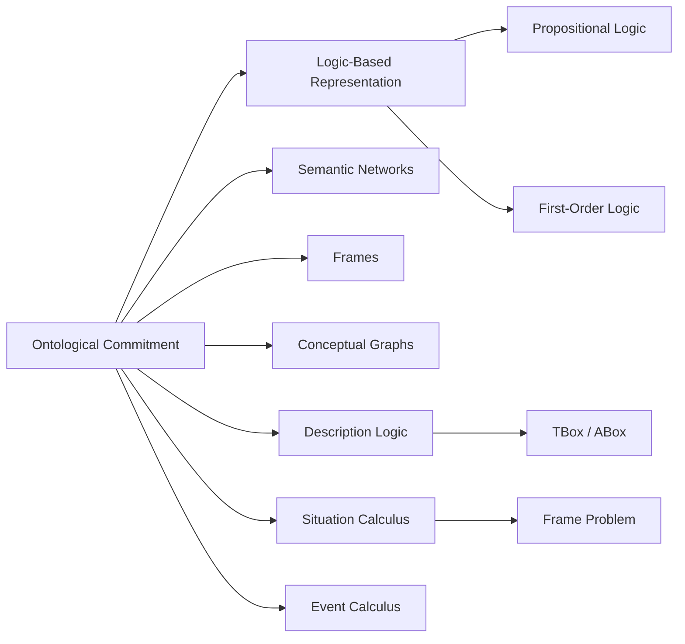

# Chapter 6: Knowledge Representation

**Previous:** [Chapter 6: Logical Agents and Propositional Logic](06-logic.md) | **Next:** [Chapter 7: First-Order Logic and Inference](07-fol.md)

## Learning Objectives

By the conclusion of this chapter, the student will be able to: (1) explain the role of ontology in knowledge representation; (2) distinguish propositional and first-order logic as representation languages; (3) construct semantic networks and frame-based representations; (4) apply description logic to taxonomic reasoning; (5) model actions and change using situation and event calculi; (6) compare knowledge representation schemes along expressiveness, tractability, and decidability; (7) implement basic inference procedures for semantic networks and description logics in Python.

<!-- Image Gallery -->
<section class="lesson-visuals" aria-label="Visual learning resources">
  <header><span>VISUAL LEARNING</span><h2>See it. Review it. Remember it.</h2></header>
  <a class="lesson-visual-card" href="../../assets/images/lessons/artificial-intelligence/06-knowledge-representation/handwritten-notes.png" target="_blank" rel="noopener">
    
    <span><strong>Handwritten notes</strong>Condensed notes for deliberate review.</span>
  </a>
  <a class="lesson-visual-card" href="../../assets/images/lessons/artificial-intelligence/06-knowledge-representation/sticky-notes.png" target="_blank" rel="noopener">
    
    <span><strong>Sticky-note revision</strong>Fast recall prompts for revision.</span>
  </a>
  <a class="lesson-visual-card" href="../../assets/images/lessons/artificial-intelligence/06-knowledge-representation/visual-explanation.png" target="_blank" rel="noopener">
    
    <span><strong>Visual concept guide</strong>A connected explanation of the key ideas.</span>
  </a>
</section>
<!-- End Image Gallery -->


## Why Knowledge Representation Matters

> **Real-World Analogy:** Think of a library cataloging system. A library contains thousands of books, each with a subject, author, publication year, and location. Without a structured catalog (Dewey Decimal System, card catalogs, digital databases), finding a specific book would require searching every shelf. Knowledge representation is the AI equivalent — it provides the schema, categories, and relationships that allow an intelligent system to store, index, retrieve, and infer new knowledge efficiently.

**The Two Core Problems KR Solves:**

1. **Storage & Retrieval** — How do we encode facts about the world so a program can look them up quickly? A semantic network storing "all birds can fly" + "Tweety is a bird" lets us retrieve "Tweety can fly" without storing it explicitly.
2. **Inference & Discovery** — How do we derive new knowledge from existing facts? If we know "every professor teaches at least one course" and "Dr. Smith is a professor," we can infer "Dr. Smith teaches some course X" without being told explicitly.

**Why It Matters for AI:**
- **Expert Systems** (1980s boom) — MYCIN diagnosed blood infections using ~600 rules encoded as IF-THEN production rules. It outperformed junior doctors.
- **Semantic Web** (2000s–present) — Google Knowledge Graph powers ~5 billion entity-relationship facts used in search, answering "When was Leonardo da Vinci born?" by traversing structured knowledge.
- **LLMs + Knowledge Graphs** (2020s) — Hybrid systems combine neural language models with symbolic knowledge bases to ground responses in verified facts, reducing hallucination.

Without KR, an AI system is just a pattern matcher. With KR, it becomes a reasoner.

## Chapter at a Glance

| Section | Key Topics | Key Terms |
|---------|-----------|-----------|
| Ontological Commitment | Conceptualization, categories | Ontology, expressiveness vs tractability |
| Logic-Based Rep. | PL syntax/semantics, FOL quantifiers | Terms, predicates, interpretation |
| Semantic Networks | is-a, has-property, part-of | Inheritance, multiple inheritance |
| Frames | Slots, defaults, procedural attachment | Demons, when-needed |
| Conceptual Graphs | Bipartite concept-relation graphs | Projection, canonical formation |
| Description Logic | TBox, ABox, OWL | Subsumption, satisfiability |
| Categories & Actions | Situation calculus, event calculus | Fluents, frame problem, successor-state |

## Chapter Roadmap



## 6.1 The Ontological Commitment — Ontologies

> **Real-World Analogy:** An ontology is like the blueprint of a building. Before construction, architects define the floor plan, room types, doorways, and load-bearing walls. Similarly, an ontology defines the categories (rooms), relations (doorways connect rooms), and constraints (walls cannot overlap) that structure a knowledge domain.

An **ontology** is a formal, explicit specification of a conceptualization. It defines the categories, relations, constraints, and axioms that capture the structure of a domain. The choice of ontology constitutes an ontological commitment: a decision about what kinds of entities exist in the model.

Knowledge representation languages vary in their **expressiveness** (what can be said) and **tractability** (how efficiently reasoning can be performed). There exists a fundamental trade-off: more expressive languages typically require greater computational resources for inference.

### Steps to Build an Ontology


1. **Define the domain and scope** — What area of knowledge are we modeling? (e.g., University domain)
2. **Identify key concepts/classes** — List the important categories (Person, Student, Professor, Course)
3. **Define class hierarchy** — Arrange classes in a taxonomy (Student ⊑ Person, Professor ⊑ Person)
4. **Identify relationships (properties/roles)** — Define how classes relate (teaches, enrolledIn)
5. **Add constraints (axioms)** — Specify logical restrictions (Professor ⊓ Student ⊑ ⊥ — disjointness)
6. **Populate instances (individuals)** — Add concrete facts (Student(Alice), teaches(Dr.Smith, CS101))

### Pseudocode for Ontology Construction


```
ALGORITHM: BuildOntology
INPUT: Domain description D
OUTPUT: Ontology O = (Classes, Hierarchy, Properties, Axioms, Instances)

1. Classes ← ExtractNouns(D)                    // Extract candidate class names
2. Hierarchy ← InitializeTaxonomy(Classes)       // SubClassOf relationships
3. Properties ← ExtractRelations(D)              // Object and data properties
4. DomainRange ← MapProperties(Properties)       // domain/range constraints
5. Axioms ← GenerateConstraints(Classes, Properties) // disjointness, equivalence
6. Instances ← PopulateFromData(D)               // Add known individuals
7. RETURN O = (Classes, Hierarchy, Properties, Axioms, Instances)

// Check consistency using a DL reasoner
FUNCTION IsConsistent(O):
    FOR each axiom A IN O.Axioms:
        IF SatisfiabilityCheck(A) == UNSAT:
            RETURN False
    RETURN True
```

### Step-by-Step Dry Run: Building a University Ontology


| Step | Action | Ontology State |
|------|--------|----------------|
| 1 | Define scope: University domain | Domain = {university} |
| 2 | Identify concepts | Classes = {Person, Student, Professor, Course, Department} |
| 3 | Define hierarchy | Student ⊑ Person, Professor ⊑ Person, Course ⊑ Object |
| 4 | Define relationships | teaches(Domain: Professor, Range: Course), enrolledIn(Domain: Student, Range: Course) |
| 5 | Add constraints | Professor ⊓ Student ⊑ ⊥ (disjoint), Professor ⊑ ∃teaches.Course (every prof teaches) |
| 6 | Add individuals | Student(Alice), Professor(Dr.Smith), enrolledIn(Alice, CS101) |
| 7 | Consistency check | All axioms satisfiable ✓ — ontology is consistent |
| 8 | Inference | Query: Who teaches Alice? → Dr.Smith (via enrolledIn + teaches chain) |

### Python Implementation: Basic Ontology Class


```python
class Ontology:
    """Simple ontology representation with hierarchy and instance checking."""

    def __init__(self, name: str):
        self.name = name
        self.classes = {}          # name -> set of parent class names
        self.instances = {}        # instance -> set of class names
        self.properties = {}       # (domain, prop_name) -> set of range values
        self.disjoint = set()      # set of frozensets of disjoint classes

    def add_class(self, name: str, parents: set = None):
        self.classes[name] = parents or set()

    def add_instance(self, name: str, class_name: str):
        if class_name not in self.classes:
            raise ValueError(f"Class '{class_name}' not defined")
        self.instances.setdefault(name, set()).add(class_name)

    def add_property(self, instance: str, prop: str, value: str, domain: str, range_cls: str):
        if instance not in self.instances:
            raise ValueError(f"Instance '{instance}' not found")
        self.properties.setdefault((instance, prop), set()).add(value)

    def get_ancestors(self, class_name: str) -> set:
        """Return all ancestor classes including self."""
        result = {class_name}
        for parent in self.classes.get(class_name, set()):
            result |= self.get_ancestors(parent)
        return result

    def is_instance_of(self, instance: str, class_name: str) -> bool:
        """Check if an instance belongs to a class (including inheritance)."""
        if instance not in self.instances:
            return False
        for cls in self.instances[instance]:
            if class_name in self.get_ancestors(cls):
                return True
        return False

    def query_by_class(self, class_name: str) -> list:
        """Retrieve all instances of a class (direct or inherited)."""
        result = []
        for inst, classes in self.instances.items():
            for cls in classes:
                if class_name in self.get_ancestors(cls):
                    result.append(inst)
                    break
        return result


# Example: Build a university ontology
uni = Ontology("University")
uni.add_class("Person")
uni.add_class("Student", {"Person"})
uni.add_class("Professor", {"Person"})
uni.add_class("Course")

uni.add_instance("Alice", "Student")
uni.add_instance("DrSmith", "Professor")
uni.add_instance("CS101", "Course")

uni.add_property("Alice", "enrolledIn", "CS101", "Student", "Course")
uni.add_property("DrSmith", "teaches", "CS101", "Professor", "Course")

print(uni.is_instance_of("Alice", "Person"))    # True (inheritance)
print(uni.is_instance_of("Alice", "Professor")) # False
print(uni.query_by_class("Person"))             # ['Alice', 'DrSmith']
```

### Complexity Analysis


| Operation | Time Complexity | Space Complexity | Why? |
|-----------|----------------|-----------------|------|
| Class insertion | O(1) amortized | O(C) | Hash map append — no traversal |
| Instance insertion | O(1) amortized | O(I) | Hash map append |
| Ancestor lookup | O(H) | O(H) recursion stack | Traverse hierarchy depth H |
| Instance-of check | O(I × H) worst | O(1) | Check each of I instances, H levels deep |
| Query by class | O(I × H) | O(1) | Linear scan of all instances |
| Consistency check | O(C × R) | O(C + R) | Check each of C classes × R relations |

Where C = number of classes, I = number of instances, H = hierarchy depth, R = number of relations.

### Advantages & Disadvantages


| Advantages | Disadvantages |
|------------|---------------|
| Formal semantics enable machine reasoning | Building ontologies is labor-intensive |
| Reusable across applications | Maintenance cost as domain evolves |
| Enables interoperability between systems | Cannot capture procedural knowledge easily |
| Supports sophisticated query answering | Expressiveness-tractability trade-off |
| Foundation for the Semantic Web (OWL/RDF) | May require ontology engineers, not domain experts |

### Edge Cases


- **Empty ontology:** All queries return empty lists — always validate that classes exist before adding instances.
- **Cyclic hierarchy:** A ⊑ B, B ⊑ C, C ⊑ A causes infinite recursion in ancestor lookup — use a visited set to detect cycles.
- **Multiple inheritance with conflict:** Student ⊑ Person, Employee ⊑ Person, TeachingAssistant ⊑ {Student, Employee}. If both Student and Employee define `status`, resolution strategy (depth-first, linearization) matters.
- **Nominal (singleton) classes:** {Alice} as a class with exactly one instance — queries must handle one-of constructs.
- **Unsatisfiable concepts:** Person ⊓ ¬Person — the empty concept. Reasoners must detect and report unsat without crashing.

## 6.2 Logic-Based Representation

> **One-Sentence Takeaway:** Knowledge representation languages trade off expressiveness (how much you can say) against tractability (how fast you can reason) — choose the least expressive language that can express your problem.

> **💡 Pro Tip:** Description Logic (DL) sits at the sweet spot of the expressiveness-tractability trade-off. That is why OWL (based on DL) is the W3C standard for the Semantic Web — it is decidable and has polynomial-time classification algorithms.

### 6.2.1 Propositional Logic


**Syntax:** Atomic propositions $P, Q, R, \ldots$ combined with logical connectives $\neg, \land, \lor, \Rightarrow, \Leftrightarrow$.

**Semantics:** Truth tables assign truth values to formulas given an interpretation (assignment of truth values to atoms). A formula is valid (tautology) if true under all interpretations; satisfiable if true under at least one interpretation; unsatisfiable if false under all interpretations.

**Inference:** Modus ponens: from $\alpha$ and $\alpha \Rightarrow \beta$, infer $\beta$. Resolution: from $(\alpha \lor \beta)$ and $(\neg\beta \lor \gamma)$, infer $(\alpha \lor \gamma)$.

### 6.2.2 First-Order Logic (FOL)


FOL extends propositional logic with:
- **Terms:** Constants ($a, b$), variables ($x, y$), functions ($f(t_1, \ldots, t_n)$).
- **Predicates:** $P(t_1, \ldots, t_n)$ expressing relations among terms.
- **Quantifiers:** Universal $\forall x \, P(x)$ ("for all $x$, $P(x)$ holds"), existential $\exists x \, P(x)$ ("there exists $x$ such that $P(x)$ holds").

**Semantics:** An interpretation $\mathcal{I}$ maps constants to domain elements, functions to functions, and predicates to relations. Satisfaction of a formula is defined recursively on the structure of the formula.

**Example:** "All students are enrolled in at least one course":
$$\forall x \, (\text{Student}(x) \Rightarrow \exists y \, (\text{Course}(y) \land \text{Enrolled}(x, y)))$$

FOL is expressive enough to represent most commonsense knowledge, but inference in FOL is only semi-decidable.

## 6.3 Semantic Networks

> **Real-World Analogy:** A semantic network is like a family tree. Each node is a person (or concept), and each connecting line is a relationship (parent-of, married-to, sibling-of). If you know your grandfather is a doctor, you can infer your mother's father is a doctor — without being told explicitly. That is inheritance through a semantic network.

A **semantic network** is a directed graph where nodes represent concepts or individuals and edges represent relations. Common edge types include:
- **is-a:** Indicates class membership (Fido is-a Dog).
- **has-property:** Indicates attribute (Dog has-property Mammal).
- **part-of:** Indicates composition (Wheel part-of Car).

**Inheritance** allows properties of a class to be inferred for all its instances. **Multiple inheritance** introduces potential conflicts that require resolution strategies.

### Steps for Building and Querying a Semantic Network


1. **Identify all concepts and individuals** — List the entities (Person, Animal, Dog, Fido, Tweety, Bird)
2. **Establish is-a hierarchy** — Define class membership (Fido is-a Dog, Dog is-a Animal)
3. **Add property edges** — Attach attributes (Dog has-property Mammal, Bird can-fly True)
4. **Add part-of edges** — Define composition (Wing part-of Bird, Tail part-of Dog)
5. **Inherit properties** — Propagate properties upward/downward (Fido inherits Mammal from Dog)
6. **Query the network** — Traverse edges to answer questions (Is Fido a mammal?)
7. **Handle conflicts** — In multiple inheritance, define resolution (e.g., depth-first, linearization)

### Pseudocode for Semantic Network Inference


```
ALGORITHM: SemanticNetworkInference
INPUT: Network G = (Nodes, Edges), Query Q = (subject, relation)
OUTPUT: Value or set of values

FUNCTION InheritProperty(node, property, visited=∅):
    IF node IN visited:
        RETURN None                           // Cycle detected
    visited ← visited ∪ {node}
    
    // Direct property check
    IF (node, property, value) IN Edges:
        RETURN value
    
    // Traverse is-a links upward
    FOR each parent WHERE (node, is-a, parent) IN Edges:
        result ← InheritProperty(parent, property, visited)
        IF result ≠ None:
            RETURN result
    
    RETURN None                                // Not found

FUNCTION Query(subject, relation):
    IF relation == "is-a":
        RETURN InheritProperty(subject, "instance-of")
    ELSE:
        RETURN InheritProperty(subject, relation)

// Shortcut inheritance:
// For "Fido can-fly": check Fido → Dog → Animal → Mammal → can-fly? → None
// For "Fido has-property Mammal": check Fido → Dog → Mammal → True
```

### Step-by-Step Dry Run: Animal Kingdom Semantic Network


**Knowledge Base (Edges):**
1. is-a(Fido, Dog)
2. is-a(Dog, Mammal)
3. is-a(Mammal, Animal)
4. is-a(Tweety, Bird)
5. is-a(Bird, Animal)
6. has-property(Mammal, WarmBlooded, True)
7. can-fly(Bird, True)
8. has-property(Dog, Barks, True)

| Query | Step | Node | Property Check | Inherited From | Result |
|-------|------|------|---------------|----------------|--------|
| Query(Fido, WarmBlooded) | 1 | Fido | Direct? No | — | Continue |
| | 2 | Dog | Direct? No | — | Continue |
| | 3 | Mammal | Direct? Yes (has-property) | Mammal | **True** |
| Query(Tweety, Barks) | 1 | Tweety | Direct? No | — | Continue |
| | 2 | Bird | Direct? No | — | Continue |
| | 3 | Animal | Direct? No | — | Continue |
| | 4 | — | None | — | **None** |
| Query(Tweety, can-fly) | 1 | Tweety | Direct? No | — | Continue |
| | 2 | Bird | Direct? Yes (can-fly) | Bird | **True** |
| Query(Fido, Animal) | 1 | Fido | is-a? Yes | Fido → Dog → Mammal → Animal | **True** |

### Python Implementation: Semantic Network


```python
class SemanticNetwork:
    """A simple semantic network with inheritance."""

    def __init__(self):
        self.nodes = set()               # All entity/concept names
        self.edges = []                  # (subject, relation, object)

    def add_node(self, name: str):
        self.nodes.add(name)

    def add_edge(self, subject: str, relation: str, obj: str):
        self.edges.append((subject, relation, obj))

    def _get_parents(self, node: str) -> list:
        return [obj for s, r, obj in self.edges if s == node and r == "is-a"]

    def _inherit(self, node: str, relation: str, visited: set = None) -> str:
        if visited is None:
            visited = set()
        if node in visited:
            return None
        visited.add(node)

        # Direct property lookup
        for s, r, obj in self.edges:
            if s == node and r == relation:
                return obj

        # Follow is-a links upward
        for parent in self._get_parents(node):
            result = self._inherit(parent, relation, visited)
            if result is not None:
                return result

        return None

    def query(self, subject: str, relation: str) -> str:
        """Answer a query by traversing the network."""
        return self._inherit(subject, relation)

    def is_instance_of(self, subject: str, class_name: str) -> bool:
        """Check if subject is an instance of class_name (direct or inherited)."""
        result = self._inherit(subject, "is-a")
        return result == class_name


# Build the animal kingdom network
net = SemanticNetwork()
for n in ["Fido", "Dog", "Mammal", "Animal", "Tweety", "Bird"]:
    net.add_node(n)

net.add_edge("Fido", "is-a", "Dog")
net.add_edge("Dog", "is-a", "Mammal")
net.add_edge("Mammal", "is-a", "Animal")
net.add_edge("Tweety", "is-a", "Bird")
net.add_edge("Bird", "is-a", "Animal")
net.add_edge("Mammal", "WarmBlooded", "True")
net.add_edge("Bird", "can-fly", "True")
net.add_edge("Dog", "Barks", "True")

print(net.query("Fido", "WarmBlooded"))      # True
print(net.query("Tweety", "Barks"))          # None
print(net.query("Fido", "Barks"))            # True
print(net.query("Tweety", "can-fly"))        # True
```

### Complexity Analysis


| Operation | Time Complexity | Space Complexity | Why? |
|-----------|----------------|-----------------|------|
| Add node | O(1) | O(N) | Hash set insertion |
| Add edge | O(1) | O(E) | List append |
| Inheritance lookup | O(E × H) | O(H) recursion | Traverse up to H edges per level |
| Query property | O(E × H) | O(H) | Follows is-a chain checking E edges |
| Instance-of check | O(E × H) | O(H) | Same traversal pattern |

Where N = number of nodes, E = number of edges, H = hierarchy depth.

### Advantages & Disadvantages


| Advantages | Disadvantages |
|------------|---------------|
| Intuitive visual representation | Semantics are not formally defined in early versions |
| Fast inheritance-based reasoning | Ambiguity in edge types (is-a vs instance-of confusion) |
| Easy to extend with new nodes | Cannot represent negation (¬) or disjunction (∨) easily |
| Natural for taxonomies | Multiple inheritance conflicts need arbitrary resolution |
| Low implementation overhead | No standard for quantifier representation |

### Edge Cases


- **Cyclic is-a:** is-a(A, B), is-a(B, A) — infinite loop. Always use a visited set.
- **Diamond problem:** B ⊑ A, C ⊑ A, D ⊑ {B, C}. If B and C both define property P differently, which does D inherit? Resolution: depth-first (prefer first parent chain), breadth-first, or explicit override.
- **No root concept:** Nodes without any is-a link — property lookups return None immediately.
- **Disconnected subgraphs:** Some nodes may be unreachable from a query start — the traversal simply returns None.
- **Quacking duck:** If Duck inherits can-quack from Bird but Penguin (also a Bird) does not quack — explicit override at Penguin must block inheritance.

## 6.4 Frames

> **Real-World Analogy:** A frame is like a job application form. The form has empty fields (slots): Name, Age, Education, Experience. Each field has a type (text, number, date) and optionally a default value ("N/A"). When you fill it out, you create an instance. Some fields have validation rules (demons) that trigger when you enter a value — "if Age &lt; 18, flag for parental consent."

A **frame** (Minsky, 1975) is a structured representation of a concept or object with named **slots** that hold values, procedures, or default information. Frames support **inheritance** through a hierarchy and **procedural attachment**: demons (when-needed, when-changed procedures) trigger computation upon slot access.

### Steps for Frame-Based Knowledge Representation


1. **Define the frame class** — Create a template with named slots and their types
2. **Set default values** — Specify what each slot contains if not explicitly provided
3. **Define procedural attachments** — Attach demons: when-needed (compute on access), when-changed (validate on update), when-removed (cleanup)
4. **Establish frame hierarchy** — Sub-frames inherit slots from parent frames
5. **Create instances** — Fill slot values for specific individuals
6. **Attach constraints** — Define restrictions (e.g., age must be non-negative)
7. **Query slot values** — Retrieve, possibly triggering when-needed demons
8. **Handle defaults override** — Instance values override class defaults; class defaults override parent defaults

### Pseudocode for Frame System


```
ALGORITHM: FrameSlotRetrieval
INPUT: frame F, slot S
OUTPUT: slot value V

FUNCTION GetSlotValue(F, S):
    // Check instance slots first
    IF S IN F.instance_slots:
        RETURN F.instance_slots[S]
    
    // Check default values in class definition
    IF S IN F.class_slots:
        IF F.class_slots[S].default ≠ None:
            RETURN F.class_slots[S].default
    
    // Check parent frame via inheritance
    FOR each parent P IN F.parents:
        V ← GetSlotValue(P, S)
        IF V ≠ None:
            RETURN V
    
    // Check when-needed demon
    IF "when-needed" IN F.procedures[S]:
        V ← Execute(F.procedures[S]["when-needed"])
        RETURN V
    
    RETURN None

FUNCTION SetSlotValue(F, S, V):
    // Validate before setting
    IF "when-changed" IN F.procedures[S]:
        Execute(F.procedures[S]["when-changed"], F, S, V)
    
    F.instance_slots[S] ← V
```

### Step-by-Step Dry Run: University Course Frame


**Frame Definition:**

```
Frame: Person
  Slots:
    name: String (default: "Unknown")
    age: Integer (default: 0)
    email: String

Frame: Student ⊑ Person
  Slots:
    student_id: String (default: "TBD")
    gpa: Float (default: 0.0)
    enrolled_courses: List
  Procedures:
    when-changed(gpa): if gpa < 0 or gpa > 4.0 → raise error
    when-needed(gpa): compute from grade records

Frame: GraduateStudent ⊑ Student
  Slots:
    advisor: Person
    thesis_topic: String (default: "TBD")
  Constraints:
    advisor must be a Professor instance
```

| Step | Action | Frame State |
|------|--------|-------------|
| 1 | Create frame Person | Person {name: None, age: None, email: None} |
| 2 | Set defaults | Person {name: "Unknown", age: 0, email: None} |
| 3 | Create Student ⊑ Person | Student {student_id: "TBD", gpa: 0.0, courses: []} + inherited {name: "Unknown", age: 0} |
| 4 | Create GraduateStudent ⊑ Student | GradStudent {advisor: None, thesis: "TBD"} + inherited chain |
| 5 | Create instance: Alice ⊑ Student | Alice.student_id = "S001", Alice.gpa = 3.7, Alice.name = "Alice" |
| 6 | Query Alice.age | Inherited default → 0 |
| 7 | Query Alice.name | Instance slot → "Alice" (overrides default "Unknown") |
| 8 | Set Alice.gpa = -1 | when-changed demon fires → Error: GPA out of range |
| 9 | Create Bob ⊑ GraduateStudent | Bob.advisor = Dr.Smith, Bob.thesis = "NLP" |
| 10 | Query Bob.name | Inherited default → "Unknown" (no instance value) |

### Python Implementation: Frame System


```python
class Frame:
    """Simple frame-based knowledge representation."""

    def __init__(self, name: str, parents: list = None):
        self.name = name
        self.parents = parents or []
        self.class_slots = {}       # slot -> {type, default, constraints}
        self.instance_slots = {}    # slot -> value (for instances)
        self.procedures = {}        # slot -> {event: callable}
        self.is_instance = False

    def add_slot(self, name: str, slot_type=str, default=None, constraints: list = None):
        self.class_slots[name] = {
            "type": slot_type,
            "default": default,
            "constraints": constraints or []
        }

    def add_procedure(self, slot: str, event: str, fn):
        """Attach a demon (when-needed, when-changed, when-removed)."""
        self.procedures.setdefault(slot, {})[event] = fn

    def create_instance(self, name: str):
        """Create an instance frame that inherits from this class."""
        inst = Frame(name, parents=[self])
        inst.is_instance = True
        return inst

    def get_slot(self, slot: str):
        """Retrieve slot value with inheritance and when-needed demons."""
        # Check instance slots first
        if slot in self.instance_slots:
            return self.instance_slots[slot]

        # Check class defaults
        if slot in self.class_slots and self.class_slots[slot]["default"] is not None:
            return self.class_slots[slot]["default"]

        # Check when-needed demon
        if slot in self.procedures and "when-needed" in self.procedures[slot]:
            return self.procedures[slot]["when-needed"]()

        # Inherit from parents
        for parent in self.parents:
            val = parent.get_slot(slot)
            if val is not None:
                return val

        return None

    def set_slot(self, slot: str, value):
        """Set slot value with when-changed demon."""
        if slot in self.procedures and "when-changed" in self.procedures[slot]:
            self.procedures[slot]["when-changed"](self, slot, value)

        # Type checking
        if slot in self.class_slots:
            expected_type = self.class_slots[slot]["type"]
            if not isinstance(value, expected_type):
                raise TypeError(f"Slot {slot} expects {expected_type.__name__}, got {type(value).__name__}")

            # Constraint checking
            for constraint in self.class_slots[slot]["constraints"]:
                if not constraint(value):
                    raise ValueError(f"Constraint failed for slot {slot}: {value}")

        self.instance_slots[slot] = value


# Build frame hierarchy
Person = Frame("Person")
Person.add_slot("name", str, "Unknown")
Person.add_slot("age", int, 0)

Student = Frame("Student", parents=[Person])
Student.add_slot("student_id", str, "TBD")
Student.add_slot("gpa", float, 0.0, constraints=[lambda g: 0.0 <= g <= 4.0])
Student.add_slot("enrolled_courses", list, [])

GradStudent = Frame("GraduateStudent", parents=[Student])
GradStudent.add_slot("advisor", str)
GradStudent.add_slot("thesis_topic", str, "TBD")

# Create instance
alice = Student.create_instance("Alice")
alice.set_slot("name", "Alice")
alice.set_slot("student_id", "S001")
alice.set_slot("gpa", 3.7)

print(alice.get_slot("name"))       # Alice (instance value)
print(alice.get_slot("age"))        # 0 (inherited default from Person)
print(alice.get_slot("gpa"))        # 3.7

# Test constraint
try:
    alice.set_slot("gpa", 5.0)      # ValueError: Constraint failed
except ValueError as e:
    print(f"Constraint caught: {e}")

# Test demon: when-changed GPA tracker
def track_gpa_change(frame, slot, value):
    print(f"[DEMON] GPA changing to {value} for {frame.name}")

Student.add_procedure("gpa", "when-changed", track_gpa_change)
alice.set_slot("gpa", 3.9)          # Prints: [DEMON] GPA changing to 3.9 for Alice
```

### Complexity Analysis


| Operation | Time Complexity | Space Complexity | Why? |
|-----------|----------------|-----------------|------|
| Add slot | O(1) | O(S) | Dictionary insertion |
| Create instance | O(1) | O(S_I) | New frame, shallow copy of parents |
| Get slot (instance only) | O(1) | O(1) | Hash lookup |
| Get slot (with inheritance) | O(D × P) | O(D) | Traverse D ancestors, P parents each |
| Set slot (with demon) | O(1 + C) | O(1) | Value update + constraint C checks |
| Slot type check | O(1) | O(1) | isinstance check |

Where S = slots, D = hierarchy depth, P = parents per frame, C = constraint count, S_I = slots in instance.

### Advantages & Disadvantages


| Advantages | Disadvantages |
|------------|---------------|
| Intuitive object-like structure (precursor to OOP) | No formal semantics in original formulation |
| Default values reduce storage for common cases | Defaults may cause unexpected inferences |
| Procedural attachment enables dynamic computation | Demons introduce side effects — hard to debug |
| Inheritance reuses knowledge across frames | Multiple inheritance still has conflict issues |
| Constraints enforce data integrity | No standard reasoning algorithm across implementations |

### Edge Cases


- **Circular inheritance:** GradStudent ⊑ Student ⊑ Person ⊑ GradStudent — use a visited set in get_slot.
- **Missing slot in demon:** Querying a slot with a when-needed demon that raises an exception — wrap in try/except.
- **Override ambiguity:** Person has default name = "Unknown", Student overrides name = "Student", instance sets nothing — which is inherited? Instance → class → parent chain resolves it, but some systems use depth-first (Student wins), others use breadth-first.
- **Demon infinite recursion:** when-needed demon for gpa calls get_slot("gpa") internally — stack overflow. Ensure demons access raw storage, not the getter.
- **Constraint on default:** Default gpa = 0.0 with constraint [0.0, 4.0] passes; but if later default changes to 5.0, constraint violation — validate defaults at definition time.

## 6.5 Conceptual Graphs

> **Real-World Analogy:** A conceptual graph is like a sentence diagram from grammar class. In a sentence diagram, nouns are on one level (concepts) and verbs are connecting lines (relations). "The cat sat on the mat" becomes [Cat] ← (Agent) ← [Sat] → (Location) → [Mat]. Just as sentence diagrams reveal sentence structure, conceptual graphs reveal knowledge structure.

**Conceptual graphs** (Sowa, 1984) provide a visual representation equivalent to FOL. Rectangles represent concepts; ovals represent conceptual relations. A conceptual graph is a bipartite graph of concept and relation nodes. The formalism includes:
- **Canonical formation rules:** Copy, restrict, join, simplify.
- **Projection:** A graph homomorphism used to check if one graph is subsumed by another.

### Steps to Build and Reason with Conceptual Graphs


1. **Identify concepts** — Extract noun phrases (Person, Book, Library)
2. **Identify conceptual relations** — Extract verb phrases (borrows, located-in)
3. **Build the bipartite graph** — Concepts as rectangles, relations as ovals, alternating edges
4. **Apply canonical formation rules** — Specialize or combine graphs
5. **Check projection** — Determine if one graph is a specialization of another
6. **Perform inference** — Derive new graphs via projection or join

### Pseudocode for Conceptual Graph Operations


```
ALGORITHM: ConceptualGraphProjection
INPUT: Graphs G = (C_G, R_G, E_G) and H = (C_H, R_H, E_H)
OUTPUT: True if H projects into G (G subsumes H)

FUNCTION Projection(G, H, mapping=∅):
    // Every concept in H must map to a concept in G
    FOR each concept c_H IN C_H:
        IF NOT ∃ c_G IN C_G such that:
            type(c_H) ⊑ type(c_G) AND
            referent(c_H) == referent(c_G) (if not generic):
            RETURN False
        mapping[c_H] ← c_G
    
    // Every relation in H must map to a relation in G
    FOR each relation r_H IN R_H:
        IF NOT ∃ r_G IN R_G such that:
            type(r_H) == type(r_G) AND
            FOR each neighbor n of r_H:
                mapping[n] is neighbor of r_G:
            RETURN False
    
    RETURN True

// Canonical formation: Restrict a concept type
FUNCTION Restrict(G, concept, new_type):
    IF new_type ⊑ type(concept):
        G' ← Copy(G)
        type(concept_G') ← new_type
        RETURN G'

// Canonical formation: Join two graphs on a common concept
FUNCTION Join(G1, G2, concept_c):
    G' ← Union(G1, G2)
    Merge(concept_c_in_G1, concept_c_in_G2)
    RETURN G'
```

### Step-by-Step Dry Run: Library Borrowing Conceptual Graph


**Initial Facts:**
- [Person: Alice] ← (Borrower) ← [Borrow] → (Object) → [Book: "Dune"]
- [Book: "Dune"] ← (Location) ← [LocatedIn] → (Place) → [Library: Central]

**Graph 1: "Alice borrows Dune"**

```
[Person: Alice] ← (Borrower) ← [Borrow] → (Object) → [Book: "Dune"]
```

**Graph 2: "Dune is at Central Library"**

```
[Book: "Dune"] ← (Location) ← [LocatedIn] → (Place) → [Library: Central]
```

| Step | Action | Graph State |
|------|--------|-------------|
| 1 | Identify concept Alice | C = {Person:Alice} |
| 2 | Identify relation Borrower | R = {Borrower} |
| 3 | Identify concept Borrow (event) | C = {Person:Alice, Borrow, Book:"Dune"} |
| 4 | Build edges | E = {(Borrower, Person:Alice), (Borrower, Borrow), (Object, Borrow), (Object, Book:"Dune")} |
| 5 | Restrict concept: Alice ⊑ Student | C_Alice' = Student:Alice (specialize) |
| 6 | Join with Location graph on Book:"Dune" | Combined graph: infer Alice can find Dune at Central |
| 7 | Query: Can Alice get Dune at Central? | Traverse: Alice → Borrower → Borrow → Object → Book → Location → Place → Central → **Yes** |

### Python Implementation: Conceptual Graph


```python
class ConceptNode:
    def __init__(self, concept_type: str, referent: str = None):
        self.type = concept_type
        self.referent = referent

    def __repr__(self):
        return f"[{self.type}:{self.referent}]" if self.referent else f"[{self.type}]"

    def __eq__(self, other):
        return self.type == other.type and self.referent == other.referent

    def __hash__(self):
        return hash((self.type, self.referent))


class RelationNode:
    def __init__(self, relation_type: str):
        self.type = relation_type

    def __repr__(self):
        return f"({self.type})"

    def __eq__(self, other):
        return self.type == other.type

    def __hash__(self):
        return hash(self.type)


class ConceptualGraph:
    """Bipartite conceptual graph with projection and join."""

    def __init__(self):
        self.concepts = set()
        self.relations = set()
        self.edges = {}            # (concept, relation) or (relation, concept) -> label

    def add_concept(self, concept: ConceptNode):
        self.concepts.add(concept)

    def add_relation(self, relation: RelationNode):
        self.relations.add(relation)

    def add_edge(self, from_node, to_node, label: str = ""):
        self.edges[(from_node, to_node)] = label

    def get_neighbors(self, node):
        """Return all nodes connected to this node."""
        neighbors = []
        for (a, b), label in self.edges.items():
            if a == node:
                neighbors.append((b, label))
            if b == node:
                neighbors.append((a, label))
        return neighbors

    def restrict(self, concept: ConceptNode, new_type: str):
        """Specialize a concept type (canonical formation rule)."""
        # Check if new_type is a subtype (simulated via hierarchy dict)
        hierarchy = {"Student": "Person", "Professor": "Person", "GraduateStudent": "Student"}
        if new_type in hierarchy and hierarchy[new_type] != concept.type:
            raise ValueError(f"Cannot restrict {concept.type} to {new_type}")

        g2 = ConceptualGraph()
        g2.concepts = {c if c != concept else ConceptNode(new_type, c.referent) for c in self.concepts}
        g2.relations = self.relations.copy()
        g2.edges = self.edges.copy()
        return g2

    def projection(self, other) -> bool:
        """Check if 'other' graph projects into this graph (this subsumes other)."""
        # Build concept mapping
        mapping = {}
        for c_other in other.concepts:
            matched = False
            for c_self in self.concepts:
                if c_other.type == c_self.type and (c_other.referent is None or c_other.referent == c_self.referent):
                    mapping[c_other] = c_self
                    matched = True
                    break
            if not matched:
                return False

        # Check relation mappings
        for r_other in other.relations:
            matched = False
            for r_self in self.relations:
                if r_other.type == r_self.type:
                    # Check neighbors match under mapping
                    n_other = {mapping.get(n, n) for n, _ in other.get_neighbors(r_other)}
                    n_self = {n for n, _ in self.get_neighbors(r_self)}
                    if n_other.issubset(n_self):
                        matched = True
                        break
            if not matched:
                return False

        return True

    def __repr__(self):
        parts = []
        for (a, b), label in self.edges.items():
            parts.append(f"{a} --{label}--> {b}" if label else f"{a} -- {b}")
        return "\n".join(parts)


# Build: "Alice borrows Dune from Central Library"
g = ConceptualGraph()

alice = ConceptNode("Person", "Alice")
borrow = ConceptNode("Borrow")
dune = ConceptNode("Book", "Dune")
central = ConceptNode("Library", "Central")
loc_rel = RelationNode("LocatedIn")
agt_rel = RelationNode("Agent")
obj_rel = RelationNode("Object")
place_rel = RelationNode("Place")

for c in [alice, borrow, dune, central]:
    g.add_concept(c)
for r in [agt_rel, obj_rel, loc_rel, place_rel]:
    g.add_relation(r)

g.add_edge(agt_rel, alice, "agent")
g.add_edge(agt_rel, borrow)
g.add_edge(obj_rel, borrow)
g.add_edge(obj_rel, dune, "object")
g.add_edge(loc_rel, dune)
g.add_edge(loc_rel, place_rel)
g.add_edge(place_rel, central, "place")

print("Conceptual Graph:")
print(g)

# Check projection: Is "Alice borrows something" a subgraph?
g2 = ConceptualGraph()
c_a = ConceptNode("Person", "Alice")
c_b = ConceptNode("Borrow")
r_a = RelationNode("Agent")
r_o = RelationNode("Object")
g2.add_concept(c_a); g2.add_concept(c_b)
g2.add_relation(r_a); g2.add_relation(r_o)
g2.add_edge(r_a, c_a); g2.add_edge(r_a, c_b)
g2.add_edge(r_o, c_b)

print(f"\nGeneralization match: {g.projection(g2)}")  # True
```

### Complexity Analysis


| Operation | Time Complexity | Space Complexity | Why? |
|-----------|----------------|-----------------|------|
| Add concept/relation | O(1) | O(C + R) | Set insertion |
| Add edge | O(1) | O(E) | Dictionary insertion |
| Restrict (copy) | O(C + R + E) | O(C + R + E) | Deep copy of entire graph |
| Projection check | O(C² + R × E²) | O(C) | Nested concept matching × neighbor checks |
| Join graphs | O(N₁ + N₂) | O(N₁ + N₂) | Set union + merge |

Where C = concepts, R = relations, E = edges, N = total graph size.

### Advantages & Disadvantages


| Advantages | Disadvantages |
|------------|---------------|
| Visually intuitive — bipartite structure maps to natural language | More verbose than frames or semantic nets for simple hierarchies |
| Equivalent to FOL with clear formal semantics | Projection (subsumption) is computationally expensive |
| Canonical formation rules provide principled graph construction | No built-in support for negation or disjunction |
| Projection directly implements specialization reasoning | Graph size grows quickly with complex knowledge |
| Natural mapping to/from natural language (Sowa's original motivation) | Tooling ecosystem is limited compared to OWL |

### Edge Cases


- **Disconnected relation:** A relation node with only one edge — semantically invalid (relation must connect at least two concepts).
- **Generic referent:** [Book] (no specific book) vs [Book: "Dune"] — projection matching treats generic as wildcard.
- **Cyclic graph:** [Person: Alice] ← (Parent) → [Person: Bob] ← (Parent) → [Person: Alice] — possible in family trees; projection handles via structure, not loops.
- **Type mismatch in restrict:** Attempting to restrict [Person] to [Book] — rejected if type hierarchy is enforced.
- **Empty graph:** No concepts or relations — trivially subsumes all graphs but practically useless; guards needed in projection.

## 6.6 Description Logic

> **Real-World Analogy:** Description Logic is like a museum cataloging system. Each artifact has a type (Painting, Sculpture, Vase), materials (Oil on Canvas, Marble), period (Renaissance, Baroque), and location (Gallery 3, Wing A). The catalog uses controlled vocabulary and taxonomic relationships. If the catalog says "All Renaissance paintings are in Gallery 3" and someone adds "Mona Lisa is a Renaissance painting," the system automatically infers "Mona Lisa is located in Gallery 3." That is TBox + ABox reasoning in Description Logic.

**Description logic** (DL) is a family of knowledge representation formalisms that provide a decidable fragment of FOL with efficient reasoning algorithms. DL systems underpin the W3C Web Ontology Language (OWL).

A DL knowledge base consists of:
- **TBox (terminological box):** Axioms defining concepts and their relationships. Example: $\text{Mother} \equiv \text{Woman} \sqcap \exists \text{hasChild.Person}$
- **ABox (assertional box):** Facts about individuals. Example: $\text{Woman}(\text{Alice})$, $\text{hasChild}(\text{Alice}, \text{Bob})$

**Reasoning tasks:**
- **Satisfiability:** Is a concept non-empty?
- **Subsumption:** Is concept $C$ a subset of concept $D$?
- **Instance checking:** Is an individual an instance of a concept?
- **Retrieval:** Find all instances of a concept.

### Steps for Description Logic Reasoning


1. **Define the TBox** — Declare atomic concepts (Person, Animal) and roles (hasChild, eats)
2. **Add concept definitions** — Define complex concepts (Mother ≡ Woman ⊓ ∃hasChild.Person)
3. **Add concept hierarchy** — Declare subsumption axioms (Dog ⊑ Animal)
4. **Populate the ABox** — Add individual assertions (Person(Alice), hasChild(Alice, Bob))
5. **Classify the TBox** — Compute full concept hierarchy using subsumption reasoning
6. **Realize the ABox** — Determine all concept memberships for each individual
7. **Answer queries** — Instance check, retrieval, subsumption queries

### Pseudocode for DL Tableau Reasoner (Satisfiability)


```
ALGORITHM: TableauSatisfiability
INPUT: Concept C, TBox T
OUTPUT: SAT or UNSAT

FUNCTION IsSatisfiable(C, T):
    A ← {C(x)} for a fresh individual x   // Initial ABox assertion
    A ← ApplyTBoxUnfolding(A, T)          // Expand definitions
    A ← ApplyCompletionRules(A)           // Apply ⊓, ⊔, ∃, ∀ rules
    IF NoClash(A):                         // Check for ⊥ or A(x) ∧ ¬A(x)
        RETURN SAT
    ELSE:
        RETURN UNSAT

FUNCTION ApplyCompletionRules(A):
    REPEAT:
        // ⊓-rule: if (C ⊓ D)(x) in A, add C(x), D(x)
        // ⊔-rule: if (C ⊔ D)(x) in A, branch C(x) or D(x)
        // ∃-rule: if (∃R.C)(x) in A, add R(x,y), C(y) for fresh y
        // ∀-rule: if (∀R.C)(x) and R(x,y) in A, add C(y)
    UNTIL no rule applies OR clash detected
    RETURN A

FUNCTION NoClash(A):
    // No individual has both C(x) and ¬C(x)
    // No individual has ⊥(x)
    RETURN True if neither condition holds
```

### Step-by-Step Dry Run: Family Tree in DL


**TBox:**
- Person ⊑ ⊤
- Woman ≡ Person ⊓ Female
- Man ≡ Person ⊓ ¬Female
- Mother ≡ Woman ⊓ ∃hasChild.Person
- Father ≡ Man ⊓ ∃hasChild.Person
- Parent ≡ Mother ⊔ Father
- Grandparent ≡ Parent ⊓ ∃hasChild.Parent

**ABox:**
- Person(Alice), Female(Alice)
- Person(Bob), Person(Charlie)
- hasChild(Alice, Bob), hasChild(Bob, Charlie)

| Step | Rule Applied | Knowledge Base State |
|------|-------------|---------------------|
| 0 | Initial ABox | Person(Alice), Female(Alice), Person(Bob), Person(Charlie), hasChild(Alice, Bob), hasChild(Bob, Charlie) |
| 1 | ⊓-rule on Woman? | Woman ≡ Person ⊓ Female → need both Person(x) and Female(x) |
| 2 | Instance check: Alice ∈ Woman? | Person(Alice) ✓, Female(Alice) ✓ → **Alice is a Woman** |
| 3 | Instance check: Alice ∈ Mother? | Mother ≡ Woman ⊓ ∃hasChild.Person → Woman(Alice) ✓, hasChild(Alice, Bob), Person(Bob) ✓ → **Alice is a Mother** |
| 4 | Instance check: Bob ∈ Parent? | Parent ≡ Mother ⊔ Father. Bob is Man (Person(Bob), no Female(Bob)). Bob has child Charlie? hasChild(Bob, Charlie) ✓, Person(Charlie) ✓ → Bob ∈ ∃hasChild.Person |
| 5 | Bob ∈ Father? | Father ≡ Man ⊓ ∃hasChild.Person → Man(Bob), hasChild(Bob, Charlie) ✓ → **Bob is a Father** |
| 6 | Alice ∈ Grandparent? | Grandparent ≡ Parent ⊓ ∃hasChild.Parent. Parent(Alice) ✓. hasChild(Alice, Bob), Parent(Bob) ✓ → **Alice is a Grandparent** |
| 7 | Subsumption: Mother ⊑ ? | Mother ⊑ Woman, Mother ⊑ Person, Mother ⊑ ∃hasChild.Person, Mother ⊑ Parent |
| 8 | Retrieval: Who is a Parent? | Alice (Mother ✓), Bob (Father ✓) → {Alice, Bob} |

### Python Implementation: Description Logic Reasoner


```python
class DLReasoner:
    """Simple Description Logic reasoner for AL (Attribute Language)."""

    def __init__(self):
        self.tbox = {}           # concept_name -> definition (as nested dicts)
        self.hierarchy = {}      # concept_name -> set of parent names
        self.abox_concepts = {}  # individual -> set of concept names
        self.abox_roles = {}     # (individual, role_name) -> set of individuals

    def add_concept_definition(self, name: str, definition):
        """Define a concept (e.g., Mother ≡ Woman ⊓ ∃hasChild.Person)."""
        self.tbox[name] = definition

    def add_subsumption(self, sub: str, super_concept: str):
        """Declare sub ⊑ super."""
        self.hierarchy.setdefault(sub, set()).add(super_concept)

    def add_concept_assertion(self, individual: str, concept: str):
        """Add A(x) to ABox."""
        self.abox_concepts.setdefault(individual, set()).add(concept)

    def add_role_assertion(self, subj: str, role: str, obj: str):
        """Add R(x, y) to ABox."""
        self.abox_roles.setdefault((subj, role), set()).add(obj)

    def get_ancestors(self, concept: str, visited: set = None) -> set:
        if visited is None:
            visited = set()
        if concept in visited:
            return set()
        visited.add(concept)
        result = {concept}
        for parent in self.hierarchy.get(concept, set()):
            result |= self.get_ancestors(parent, visited)
        return result

    def instance_check(self, individual: str, concept: str) -> bool:
        """Check if individual is an instance of a concept."""
        # Direct assertion check
        direct_concepts = self.abox_concepts.get(individual, set())
        all_concepts = set()
        for c in direct_concepts:
            all_concepts |= self.get_ancestors(c)

        if concept in all_concepts:
            return True

        # Check complex concept definitions
        if concept in self.tbox:
            return self._check_definition(individual, concept)

        return False

    def _check_definition(self, individual: str, concept: str) -> bool:
        """Evaluate concept definition against ABox."""
        definition = self.tbox[concept]

        if definition["type"] == "and":
            return all(self.instance_check(individual, c) for c in definition["concepts"])

        if definition["type"] == "some":
            role = definition["role"]
            range_concept = definition["range"]
            fillers = self.abox_roles.get((individual, role), set())
            return any(self.instance_check(f, range_concept) for f in fillers)

        if definition["type"] == "all":
            role = definition["role"]
            range_concept = definition["range"]
            fillers = self.abox_roles.get((individual, role), set())
            if not fillers:
                return True  # Vacuously true
            return all(self.instance_check(f, range_concept) for f in fillers)

        return False

    def retrieve(self, concept: str) -> list:
        """Find all individuals that are instances of concept."""
        return [ind for ind in self.abox_concepts if self.instance_check(ind, concept)]

    def subsumes(self, c1: str, c2: str) -> bool:
        """Check if c1 subsumes c2 (i.e., every instance of c2 is also instance of c1)."""
        return c1 in self.get_ancestors(c2)


# Build family ontology
dl = DLReasoner()

# Hierarchy
dl.add_subsumption("Woman", "Person")
dl.add_subsumption("Man", "Person")
dl.add_subsumption("Mother", "Woman")
dl.add_subsumption("Father", "Man")

# Complex definitions
dl.add_concept_definition("Mother", {"type": "and", "concepts": ["Woman"]})
dl.add_concept_definition("Parent", {"type": "and", "concepts": ["Person"]})

# ABox assertions
dl.add_concept_assertion("Alice", "Woman")
dl.add_concept_assertion("Alice", "Person")
dl.add_concept_assertion("Bob", "Person")
dl.add_concept_assertion("Charlie", "Person")
dl.add_concept_assertion("Diana", "Woman")
dl.add_concept_assertion("Diana", "Person")

dl.add_role_assertion("Alice", "hasChild", "Bob")
dl.add_role_assertion("Bob", "hasChild", "Charlie")
dl.add_role_assertion("Diana", "hasChild", "Charlie")

print(dl.instance_check("Alice", "Person"))    # True
print(dl.instance_check("Alice", "Man"))       # False
print(dl.retrieve("Person"))                   # ['Alice', 'Bob', 'Charlie', 'Diana']
print(dl.subsumes("Person", "Woman"))          # True (Person subsumes Woman)
```

### Complexity Analysis


| Operation | Time Complexity | Space Complexity | Why? |
|-----------|----------------|-----------------|------|
| TBox assertion | O(1) | O(C) | Hash map insert |
| ABox assertion | O(1) | O(I) | Hash map insert |
| Instance check (atomic) | O(A × H) | O(H) | Ancestor traversal through hierarchy |
| Instance check (defined) | O(D × F) | O(D) | Recursive definition evaluation up to depth D, F fillers |
| Retrieval | O(I × A × H) | O(1) | Linear scan of all individuals |
| Subsumption | O(H) | O(H) | Ancestor lookup in hierarchy |
| Classification (full) | O(C² × H) | O(C²) | Pairwise subsumption of all concepts |

Where C = concepts, A = atomic concepts per individual, H = hierarchy depth, I = individuals, D = definition depth, F = role fillers. Full classification for expressive DL (ALC) is EXPTIME-complete but highly optimized in practice (Pellet, HermiT).

### Advantages & Disadvantages


| Advantages | Disadvantages |
|------------|---------------|
| Decidable — always terminates with an answer | Less expressive than FOL (cannot represent n-ary relations directly) |
| Formal model-theoretic semantics | Open-world assumption may surprise users expecting closed-world (SQL) |
| Polynomial-time classification for core languages | Complexity ranges from PTIME to EXPTIME/NEXPTIME depending on constructors |
| OWL standard enables tooling ecosystem | Non-monotonic reasoning (defaults, negation-as-failure) not natively supported |
| Compositional concept constructors (⊓, ⊔, ¬, ∃, ∀) | Learning curve for domain experts unfamiliar with formal logic |

### Edge Cases


- **Unsatisfiable concept:** Person ⊓ ¬Person — the empty concept. Reasoner must report inconsistency without crashing.
- **Empty domain:** TBox with no ABox — reasoning about concept satisfiability is still meaningful (a concept is satisfiable if there exists a model).
- **Role cycling:** hasChild(Alice, Bob), hasChild(Bob, Alice) — cyclic roles are allowed; ∀hasChild.Person still holds if both Bob and Alice are Person.
- **Nominals (singleton concepts):** {Alice} ≡ Person ⊓ ∀hasFriend.{Bob} — only Alice can satisfy this. Requires equality reasoning.
- **Bottom concept:** Concept(⊥) — always empty. Queries for instances return empty set.
- **Top concept:** Concept(⊤) — contains all individuals. Instance check always returns True.

## 6.7 Categories and Actions

### 6.7.1 Categories


Categories organize knowledge into hierarchies. The **semantic web** formalizes this via RDF (Resource Description Framework), RDFS, and OWL. Key constructors include:
- **Intersection:** $C \sqcap D$
- **Union:** $C \sqcup D$
- **Complement:** $\neg C$
- **Existential restriction:** $\exists R.C$
- **Universal restriction:** $\forall R.C$

### 6.7.2 Situation Calculus


The **situation calculus** (McCarthy and Hayes, 1969) represents actions and their effects in a dynamic world. A **situation** is a history of actions. The initial situation is $S_0$. The function $do(a, s)$ returns the situation resulting from executing action $a$ in situation $s$.

**Fluents** are predicates whose truth depends on the situation: $\text{On}(x, y, s)$ means $x$ is on $y$ in situation $s$.

The **frame problem** arises because we must explicitly specify what does not change after an action. The **successor-state axiom** solves this:

$$\text{On}(x, y, do(a, s)) \Leftrightarrow (a = \text{stack}(x, y)) \lor (\text{On}(x, y, s) \land a \neq \text{move}(x, z))$$

### 6.7.3 Event Calculus


**Event calculus** (Kowalski and Sergot, 1986) represents events as points in time that initiate and terminate fluent values. Unlike situation calculus, event calculus supports continuous time, concurrent events, and delayed effects.

## 6.8 Reasoning Systems Architecture

A knowledge-based system consists of:
1. **Knowledge base (KB):** Stores domain-specific facts and rules.
2. **Inference engine:** Applies reasoning procedures to derive new knowledge.
3. **Explanation facility:** Justifies conclusions.
4. **Knowledge acquisition module:** Supports KB construction and maintenance.

## Knowledge Representation Schemes — Comparison

| Scheme | Expressiveness | Decidable? | Inference Complexity | Data Structure | Typical Use |
|--------|:---:|:---:|:---:|---|---------|
| **Propositional Logic** | Low | ✅ | O(2ⁿ) SAT | Boolean formulas | Simple facts, hardware verification |
| **First-Order Logic** | Very High | ❌ (semi) | Undecidable | Formulas with quantifiers | General domain axioms |
| **Semantic Networks** | Low–Medium | Varies | O(E × H) inheritance | Directed graph | Taxonomies, animal hierarchies |
| **Frames** | Medium–High | Varies | O(D × P) slot lookup | Object with slots | Structured objects, common sense |
| **Conceptual Graphs** | High | Varies | O(C² + R × E²) projection | Bipartite graph | Natural language semantics |
| **Description Logic** | Medium | ✅ (ALC) | PTIME–EXPTIME | TBox + ABox | OWL ontologies, Semantic Web |
| **Production Rules** | Medium | ❌ | O(R × F) forward chain | IF-THEN rules | Expert systems (MYCIN) |
| **Fuzzy Logic** | Medium | ✅ | O(n) per rule | Membership functions | Control systems, uncertainty |

**Key Insight:** No single scheme dominates all applications. The choice depends on whether you prioritize expressiveness (FOL), decidability (DL), computational efficiency (semantic nets), or structured representation (frames).

## Interview Corner

### Q1: How is a Knowledge Representation system different from a database?


| Aspect | Database (SQL) | Knowledge Representation |
|--------|---------------|-------------------------|
| **Assumption** | Closed-world — what isn't in DB is false | Open-world — what isn't stated is unknown |
| **Inference** | None (query returns stored data) | Derives new facts from existing ones |
| **Schema** | Fixed tables and columns | Flexible, hierarchical concepts |
| **Reasoning** | No built-in reasoning | Subsumption, inheritance, consistency |
| **Negation** | Negation-as-failure | Explicit negation with semantics |
| **Example** | SELECT * FROM Person WHERE age > 30 | Subsumption: Student ⊑ Person → if Alice is Student, she is Person |

**The critical difference:** A database tells you what you stored. A KR system tells you what follows from what you stored.

### Q2: How do you design an ontology for a new domain?


1. **Competency questions first** — Write questions the ontology must answer (e.g., "Which drugs interact with aspirin?").
2. **Identify key terms** — Extract nouns (classes) and verbs (properties) from competency questions.
3. **Reuse existing ontologies** — Check Bioportal, Schema.org, or DBPedia for domain coverage before building from scratch.
4. **Choose expressiveness level** — RDFS for simple hierarchy, OWL DL for complex constraints, OWL 2 RL for scalable rules.
5. **Validate with reasoners** — Run consistency checks with Pellet or HermiT.
6. **Iterate** — Ontology design is never one-shot; add axioms as new competency questions emerge.

**Common mistake:** Over-engineering the hierarchy. Start shallow (3–4 levels); add depth only when reasoning requires it.

### Q3: How does inference work in semantic networks?


Semantic network inference is primarily **inheritance-based**. When querying whether Fido has property P:

1. Check if P is directly attached to Fido's node.
2. If not, follow is-a links upward to the parent class.
3. Continue until P is found or the root is reached.
4. If multiple inheritance (Fido is-a Dog, Fido is-a Pet), and both define different values for P, use a resolution strategy:
   - **Depth-first:** Follow the first parent chain completely before backtracking.
   - **Linearization:** C3 linearization (used in Python MRO) produces a deterministic order.
   - **Explicit override:** Allow the instance value to override any inherited value.

**Important:** Early semantic networks suffered from ambiguous semantics — is "Clyde is-a Elephant" class membership or instance-of? Modern systems (RDFS, OWL) resolve this by distinguishing classes from individuals at the language level.

### Q4: What are the limitations of Description Logic vs First-Order Logic?


| Cannot express in DL | Can express in FOL |
|---------------------|-------------------|
| n-ary relations (≥ 3 arguments) | `teaches(Prof, Course, Semester)` |
| Equality reasoning (complex) | `x = y ∧ f(x) ≠ f(y)` |
| Role chains with arbitrary length | `ancestor(x,y) ≡ parent(x,y) ∨ ∃z(parent(x,z) ∧ ancestor(z,y))` |
| Quantification over roles | `∀R ∃S.R(x,y) ⇒ S(y,x)` |
| Meta-modeling (classes as instances) | OWL 2 Full allows this |

**The trade-off:** Every constructor that makes FOL undecidable is excluded from DL deliberately. DL gives up FOL's full expressiveness to guarantee decidable reasoning — the exact property needed for the Semantic Web.

### Q5: How do you handle inconsistency in a knowledge base?


1. **Detection:** Run a reasoner to find unsatisfiable concepts.
2. **Diagnosis:** Use axiom pinpointing (glass-box approach) to identify minimal inconsistent subsets (MUPS).
3. **Repair options:**
   - **Remove** the offending axioms.
   - **Weaken** (replace ⊑ with weaker condition).
   - **Prioritize** — apply defeasible reasoning (some axioms are defaults, not strict).
4. **Prevention:** Validate new axioms against the KB before adding them.

## Applications in Real Systems

### DBpedia and Wikidata


| Feature | DBpedia | Wikidata |
|---------|---------|----------|
| **Source** | Wikipedia infoboxes (structured data extracted from articles) | Crowd-sourced knowledge base |
| **Size** | ~4.58 million entities, ~3 billion RDF triples | ~100 million entities, ~14 billion statements |
| **Schema** | DBPedia Ontology (manual + inferred) | Wikidata ontology (community-edited, property-based) |
| **Query** | SPARQL endpoint: dbpedia.org/sparql | SPARQL + Wikidata Query Service |
| **KR Formalism** | RDF + RDFS + OWL | RDF + property constraints |
| **Use Case** | Semantic search, entity linking | Wikipedia structured data, knowledge graph research |

**Inference example in DBpedia:**
```
DBpedia asserts: dbr:Albert_Einstein rdf:type dbo:Scientist
DBpedia ontology: dbo:Scientist rdfs:subClassOf dbo:Person
Inference: dbr:Albert_Einstein rdf:type dbo:Person  (via RDFS inheritance)
```

### SNOMED CT (Medical Ontology)


SNOMED CT is the world's largest clinical ontology, with ~350,000 concepts and ~1.5 million relationships:

- **Used in:** 50+ countries, mandated in US EHR systems (Meaningful Use)
- **KR formalism:** Description Logic (EL++ profile)
- **Example concept:** `Pneumonia (disorder) ⊑ Lung disease ⊓ ∃causative-agent.Infectious-agent`
- **Inference used:** Classification — SNOMED's reasoner automatically places new concepts in the correct hierarchy
- **Clinical decision support:** If a patient has `Bacterial pneumonia (disorder)`, the system infers they have `Lung disease`, `Infectious disease`, and `Disorder of thorax`

**Why DL matters for SNOMED:** The ontology is too large (350K concepts) for manual maintenance. DL classification ensures that when a new concept is added with its defining properties, the reasoner automatically computes all 350K subsumption relationships — saving thousands of person-hours per release.

### Google Knowledge Graph


Google's Knowledge Graph powers search results with structured knowledge:

- **Size:** ~7 billion facts covering ~500 million entities (as of 2020)
- **Source:** Freebase (legacy), Wikidata, crawled structured data, manual curation
- **KR style:** Property graph (similar to frames — entities with typed attribute-value pairs)
- **Inference used:** Relationship traversal — "When was Leonardo da Vinci born?" traverses: da Vinci → birthDate → 1452-04-15
- **Search impact:** Knowledge panels shown for ~30% of queries; 20%+ of mobile searches are voice-driven entity queries
- **Beyond search:** Google Assistant, Google Maps, Lens, and Photos all consume the Knowledge Graph

**Example inference chain:**
```
Query: "Mona Lisa painter nationality"
1. Mona Lisa → createdBy → Leonardo da Vinci
2. Leonardo da Vinci → nationality → Italian
3. Answer: Italian
```

This is a semantic network traversal — three edges in the Knowledge Graph, no explicit "Mona Lisa" to "Italian" path stored.

### MYCIN (Historical — First Major Expert System)


- **Domain:** Bacterial blood infection diagnosis (1970s)
- **KR Formalism:** Production rules with certainty factors
- **Size:** ~600 rules
- **Performance:** Outperformed junior doctors, matched senior specialists
- **Lesson:** KR + inference can surpass human experts in narrow domains

## Concept Comparison

| Language/Formalism | Expressiveness | Decidable? | Inference Complexity | Best For |
|-------------------|:---:|:---:|:---:|---------|
| Propositional Logic | Low | ✅ | O(2ⁿ) SAT | Simple facts |
| First-Order Logic | High | ❌ (semi) | Undecidable | General domain axioms |
| Description Logic | Medium | ✅ | PTIME/EXPTIME | Taxonomies, OWL |
| Semantic Networks | Medium | Varies | Linear (inheritance) | Quick prototyping |
| Frames | Medium-High | Varies | Linear (with defaults) | Structured objects |

## Quick Reference — Ontology Concepts

| Concept | Definition | Example |
|---------|-----------|---------|
| Ontology | Formal specification of a conceptualization | Domain model |
| TBox | Terminology (concepts and roles) | Mother ≡ Woman ⊓ ∃hasChild.Person |
| ABox | Assertions about individuals | Woman(Alice) |
| Fluents | Situation-dependent predicates | On(x, y, s) |
| Frame Problem | Need to specify what stays the same | Successor-state axioms |
| Projection | Graph homomorphism check | Concept subsumption |

## Cross-Application Matrix

| Technique | ML | CV | NLP | Research |
|-----------|:---:|:---:|:---:|:---:|
| Ontology Engineering | ✅ | ✅ | ✅ | ✅ |
| Description Logic | ⬜ | ✅ | ✅ | ✅ |
| Semantic Networks | ⬜ | ✅ | ✅ | ✅ |
| Situation Calculus | ⬜ | ⬜ | ⬜ | ✅ |
| Frames | ⬜ | ✅ | ✅ | ✅ |

## Chapter Quiz

**Q1:** What is the frame problem?
- A) The challenge of representing knowledge in frames
- B) The need to explicitly specify what does not change after an action
- C) The difficulty of combining multiple inheritance hierarchies
- D) The trade-off between expressiveness and tractability

<details><summary>Answer&lt;/summary&gt;B) The frame problem requires us to specify what stays the same (frame axioms) when an action occurs.</details>

**Q2:** Which component of a DL knowledge base stores facts about individuals?
- A) TBox
- B) ABox
- C) RBox
- D) RDF

<details><summary>Answer&lt;/summary&gt;B) The ABox (assertional box) contains assertions about specific individuals.</details>

**Q3:** What makes Description Logic attractive for the Semantic Web?
- A) It is as expressive as FOL
- B) It is decidable with efficient classification algorithms
- C) It supports procedural attachment
- D) It eliminates the need for ontologies

<details><summary>Answer&lt;/summary&gt;B) DL is decidable (unlike FOL) while being expressive enough for domain modeling, making it suitable for OWL.</details>

**Q4:** What is the key difference between a database query and a KR query?
- A) Databases are faster
- B) KR systems derive new facts through inference; databases return stored data
- C) KR uses SQL; databases use SPARQL
- D) There is no difference

<details><summary>Answer&lt;/summary&gt;B) KR systems perform inference to derive new knowledge from stated facts; databases return exactly what was stored.</details>

**Q5:** Which knowledge representation scheme uses a bipartite structure of concept and relation nodes?
- A) Semantic networks
- B) Frames
- C) Conceptual graphs
- D) Description logic

<details><summary>Answer&lt;/summary&gt;C) Conceptual graphs are bipartite graphs alternating between concept nodes (rectangles) and relation nodes (ovals).</details>

## 6.9 Summary

Knowledge representation is concerned with encoding domain knowledge in a form that supports automated reasoning. The choice of representation language involves trade-offs between expressiveness and computational tractability. This chapter covered five major representation schemes — semantic networks, frames, conceptual graphs, description logic, and ontology-based representations — each with different strengths in expressiveness, decidability, and reasoning efficiency. Modern knowledge representation forms the backbone of the Semantic Web (OWL, RDF), enterprise knowledge graphs (Google Knowledge Graph), and medical ontologies (SNOMED CT), with hybrid neural-symbolic approaches emerging as a frontier combining deep learning with structured knowledge.

## Exercises

### Review Questions

1. Compare the expressiveness of propositional logic, FOL, and description logic. What reasoning tasks are tractable in each?
2. Explain the frame problem. How do successor-state axioms address it?
3. Distinguish between the TBox and ABox in description logic.
4. What is multiple inheritance and what strategies exist to resolve conflicts?
5. How does a conceptual graph projection differ from a semantic network inheritance query?

### Application Problems

6. Represent the following knowledge in FOL: "All professors are researchers. Some researchers are Nobel laureates. No Nobel laureate teaches undergraduate courses. Therefore, some professors do not teach undergraduate courses."
7. Construct a description logic ontology for a university domain with concepts: Person, Student, Professor, Course. Include roles: teaches, enrolledIn. Define at least three axioms and verify satisfiability.
8. Build a semantic network for a restaurant domain with nodes for Person, Chef, Menu, Dish, Ingredient. Add at least 10 edges showing is-a, has-property, and part-of relationships. Write Python code to query "What dishes contain tomatoes?"

### Challenge Problem

9. Implement a forward-chaining reasoner for a propositional KB containing Horn clauses. Apply it to a simple diagnosis domain (e.g., car fault diagnosis). Explain how the system handles the case where multiple rules apply simultaneously.
10. Design a small OWL ontology for a smart home domain (devices, rooms, sensors, automation rules). Write the TBox and ABox, then describe what inferences a DL reasoner would derive automatically (e.g., "If the temperature sensor in the living room exceeds 30°C, the system should infer 'overheating' and trigger the AC").
