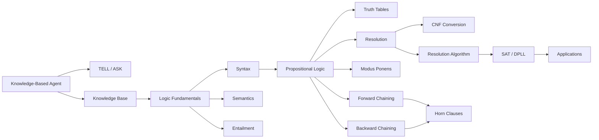

# Chapter 6: Logical Agents and Propositional Logic

**Previous:** [Chapter 5: Constraint Satisfaction Problems](05-csp.md) | **Next:** [Chapter 7: First-Order Logic and Inference](07-fol.md)

---

## Learning Objectives

- Explain the role of knowledge-based agents in AI.
- Define the components of a logic: syntax, semantics, and entailment.
- Translate natural language statements into Propositional Logic formulas.
- Evaluate the validity and satisfiability of logical sentences using truth tables.
- Implement inference rules like Modus Ponens and Resolution.
- Distinguish between forward chaining and backward chaining.
- Understand resolution refutation and its completeness.
- Apply DPLL for SAT solving with unit propagation.

<!-- Image Gallery -->
<section class="lesson-visuals" aria-label="Visual learning resources">
  <header><span>VISUAL LEARNING</span><h2>See it. Review it. Remember it.</h2></header>
  <a class="lesson-visual-card" href="../../assets/images/lessons/artificial-intelligence/06-logic/handwritten-notes.png" target="_blank" rel="noopener">
    
    <span><strong>Handwritten notes</strong>Condensed notes for deliberate review.</span>
  </a>
  <a class="lesson-visual-card" href="../../assets/images/lessons/artificial-intelligence/06-logic/sticky-notes.png" target="_blank" rel="noopener">
    
    <span><strong>Sticky-note revision</strong>Fast recall prompts for revision.</span>
  </a>
  <a class="lesson-visual-card" href="../../assets/images/lessons/artificial-intelligence/06-logic/visual-explanation.png" target="_blank" rel="noopener">
    
    <span><strong>Visual concept guide</strong>A connected explanation of the key ideas.</span>
  </a>
</section>
<!-- End Image Gallery -->


---

## Why Logic in AI Matters

**Real-World Analogy: Legal Reasoning in a Courtroom**

Imagine a courtroom. The prosecution presents evidence (facts), and the judge applies legal statutes (rules) to reach a verdict (conclusion). The process is not arbitrary → every conclusion must follow logically from the evidence and the law.

A lawyer reasons like a logical agent:
- **Facts**: "The defendant was at the crime scene" (P), "The defendant owns a weapon matching the murder weapon" (Q).
- **Rules**: "If someone was at the crime scene and owns the murder weapon, they are a suspect" (P ∧ Q ⇒ R).
- **Inference**: Using Modus Ponens, from P ∧ Q and P ∧ Q ⇒ R, deduce R (the defendant is a suspect).

This is exactly how a **knowledge-based agent** works in AI. The agent stores facts in a Knowledge Base (KB), applies rules of inference, and derives new conclusions. Just as a judge cannot invent facts, a logical agent can only derive what follows from what it knows → making its reasoning **sound**, **transparent**, and **verifiable**.

Why this matters for AI:
- **Explainability**: Every conclusion has a traceable proof chain.
- **Correctness**: Inference rules guarantee truth-preserving transformations.
- **Modularity**: New facts can be added without rewriting the reasoning engine.

Without logic, AI systems are black boxes. With logic, they become reasoning partners.

---

## Chapter at a Glance

| Section | Key Topics | Key Terms |
|---------|-----------|-----------|
| Knowledge-Based Agents | KB, TELL, ASK | Knowledge Base, entailment, soundness |
| Logic Fundamentals | Syntax, semantics, models | Entailment (⊨), soundness, completeness |
| Propositional Logic | Symbols, connectives, truth tables | Modus Ponens, Resolution, CNF |
| Inference Rules | Modus Ponens, Modus Tollens, Resolution | Soundness, refutation completeness |
| Resolution Algorithm | CNF conversion, resolution principle | Empty clause, refutation proof |
| Forward Chaining | Data-driven reasoning, Horn clauses | Agenda, fact derivation |
| Backward Chaining | Goal-driven reasoning, AND-OR search | Subgoals, goal stack |
| Satisfiability & Validity | Valid, satisfiable, unsatisfiable | Tautology, contradiction, SAT, DPLL |
| Applications | Theorem provers, Prolog, circuit verification | Z3, Vampire, SWI-Prolog |

## Chapter Roadmap



---

## Theory


> **One-Sentence Takeaway:** A knowledge-based agent maintains a Knowledge Base that it TELLs and ASKs, using entailment to infer new facts that follow logically from what it already knows.

### Knowledge-Based Agents


**Real-World Analogy: The Librarian**

A librarian manages a library catalog. When new books arrive, the librarian **TELLs** the catalog by adding entries. When a patron asks a question, the librarian **ASKs** the catalog → not by reading every book, but by using the catalog's structure to infer where the answer can be found. If the catalog says "All computer science books are in section 006.3" and a patron asks for an AI book, the librarian infers the correct location.

A **knowledge-based agent** works exactly this way. It maintains a **Knowledge Base (KB)** → a structured set of sentences in a formal language → and interacts through two operations:
- **TELL**: Adds new sentences to the KB (like adding a book to the catalog).
- **ASK**: Queries the KB to determine what follows (like asking the catalog a question).

The agent's reasoning cycle:
1. **Perceive** the environment → get a percept.
2. **TELL** the KB what was perceived.
3. **ASK** the KB what action is best.
4. **Execute** the action.

#### Algorithm: Knowledge-Based Agent Cycle

```
Algorithm: KB-Agent(percept)
1.  TELL(KB, Make-Percept-Sentence(percept, t))
2.  action ← ASK(KB, Make-Action-Query(t))
3.  TELL(KB, Make-Action-Sentence(action, t))
4.  return action
```

#### Pseudocode

```
function KB_AGENT(percept)
    persistent: KB, a knowledge base
                t, a counter (initially 0)
    
    TELL(KB, MAKE_PERCEPT_SENTENCE(percept, t))
    action ← ASK(KB, MAKE_ACTION_QUERY(t))
    TELL(KB, MAKE_ACTION_SENTENCE(action, t))
    t ← t + 1
    return action
```

#### Step-by-Step Dry Run → Wumpus World

The agent is in a 4×4 grid with pits and a Wumpus. Percepts: Stench (Wumpus nearby), Breeze (pit nearby), Glitter (gold).

| Step | Percept | TELL to KB | ASK Result | KB After Inference |
|:----:|---------|-----------|:----------:|-------------------|
| 1 | ¬Stench, ¬Breeze at (1,1) | ¬S₁₁, ¬B₁₁ | Move to (1,2) or (2,1) | {¬S₁₁, ¬B₁₁, S₁₁ ⇔ (W₁₂ ∨ W₂₁), B₁₁ ⇔ (P₁₂ ∨ P₂₁)} |
| 2 | Breeze at (1,2) | B₁₂ | Pit in (1,3) or (2,2) or (1,1)? | {..., B₁₂, B₁₂ ⇔ (P₁₃ ∨ P₂₂ ∨ P₁₁), ¬P₁₁ ⇒ (P₁₃ ∨ P₂₂)} |
| 3 | Agent moved to (2,1) | ... | Safe square? | Backtrack-safe squares inferred |

**What happens**: The agent incrementally builds a map. At each step, the KB grows, and the ASK queries become more precise because more facts constrain the possibilities.

#### Python Implementation

```python
class KnowledgeBase:
    def __init__(self):
        self.facts = set()
        self.rules = []

    def tell(self, fact):
        """Add a fact to the KB."""
        self.facts.add(fact)

    def ask(self, query):
        """Return True if query follows logically from KB."""
        # Simple forward checking for propositional logic
        return query in self.facts or self._resolve(query)

    def _resolve(self, query):
        """Try to derive query using resolution (simplified)."""
        # Full resolution implementation in section below
        return False

# Example usage
kb = KnowledgeBase()
kb.tell("P")           # It is raining
kb.tell("P -> Q")      # If rain then wet ground
print(kb.ask("Q"))     # True (Q can be derived)
```

#### Complexity Analysis

| Operation | Complexity | Why |
|-----------|:----------:|-----|
| TELL (fact) | O(1) | Simple set insertion |
| TELL (rule) | O(1) | Appending to rule list |
| ASK (direct) | O(1) | Set membership test |
| ASK (resolution) | EXP | Resolution is exponential in worst case |

The TELL operation is always fast. ASK complexity depends entirely on the inference algorithm used → from constant-time fact lookup to exponential full resolution.

#### Advantages & Disadvantages

| Advantages | Disadvantages |
|------------|--------------|
| Modular → new facts don't break existing logic | Inefficient for large KBs without indexing |
| Full transparency → every conclusion traceable | Cannot handle uncertainty (use probabilistic reasoning) |
| Sound by construction when using valid inference rules | Requires perfect knowledge → no "partial" truth |
| Separation of knowledge and reasoning | Knowledge acquisition bottleneck |

#### Edge Cases

- **Empty KB**: ASK always returns false (nothing is entailed by nothing).
- **Contradictory KB**: KB containing P and ¬P entails everything (ex falso quodlibet).
- **Tautological query**: P ∨ ¬P is always entailed regardless of KB contents.
- **Cyclic rules**: Rules like P ⇒ Q and Q ⇒ P with no facts lead to no new derivations.
- **Redundant TELL**: Adding P when P is already in KB is idempotent.

---

### Logic Fundamentals


**Real-World Analogy: Grammar of a Natural Language**

A valid English sentence must follow grammar rules (syntax) and carry meaning (semantics). "Colorless green ideas sleep furiously" is syntactically correct but semantically meaningless. Similarly, logic requires both well-formed formulas (syntax) and truth conditions (semantics).

Every logic consists of three pillars:

1. **Syntax**: Rules for constructing valid sentences.
   - Example: In PL, `P ∧ Q` is syntactically valid; `∧ P Q` is not.

2. **Semantics**: Rules for determining the truth of a sentence with respect to a **model** (an assignment of truth values to symbols).
   - Example: In model {P=true, Q=false}, the sentence P ∧ Q evaluates to false.

3. **Entailment (KB ⊨ α)**: Sentence α follows logically from KB if α is true in **every** model where KB is true.
   - Example: {P, P ⇒ Q} ⊨ Q because every model making P and P⇒Q true also makes Q true.

**Soundness**: An inference algorithm is sound if it only derives entailed sentences.
- If KB ⊢ α (derivable), then KB ⊨ α (true in all models).
- "The algorithm never lies."

**Completeness**: An inference algorithm is complete if it can derive any entailed sentence.
- If KB ⊨ α (true in all models), then KB ⊢ α (derivable).
- "The algorithm can find every truth."

> 💡 **Key Insight**: Soundness is non-negotiable for correctness. Completeness is desirable but often traded for efficiency. Resolution is refutation-complete (complete for proving unsatisfiability), which is sufficient for most tasks.

---

### Propositional Logic (PL)


**Real-World Analogy: Boolean Circuit Design**

A computer circuit is built from logic gates connected by wires. Each wire carries either a high voltage (true, 1) or low voltage (false, 0). An AND gate outputs high only when both inputs are high. An OR gate outputs high when at least one input is high. Propositional logic is the mathematical model of these circuits.

#### Syntax

PL uses:
- **Atomic symbols**: P, Q, R, P₁, P₂, ... (represent propositions)
- **Connectives**:
  - ¬ (Negation/Not) → unary operator
  - ∧ (Conjunction/And) → binary operator
  - ∨ (Disjunction/Or) → binary operator
  - ⇒ (Implication) → binary operator
  - ⇔ (Biconditional/Iff) → binary operator
- **Parentheses**: ( and ) for grouping

Every **well-formed formula (WFF)** is:
- An atomic symbol (P, Q, ...), or
- ¬φ where φ is a WFF, or
- φ ∧ ψ, φ ∨ ψ, φ ⇒ ψ, φ ⇔ ψ where φ and ψ are WFFs.

Grammar:
```
Formula := Atom | ¬Formula | Formula ∧ Formula | Formula ∨ Formula
         | Formula ⇒ Formula | Formula ⇔ Formula | (Formula)
```

#### Semantics → Truth Table Conditions

| Connective | True When |
|------------|-----------|
| ¬P | P is false |
| P ∧ Q | Both P and Q are true |
| P ∨ Q | At least one of P, Q is true |
| P ⇒ Q | P is false or Q is true (¬P ∨ Q) |
| P ⇔ Q | P and Q have the same truth value |

#### Algorithm: Truth Table Enumeration

```
Algorithm: TT-Entails(KB, α)
1.  symbols ← list of proposition symbols in KB and α
2.  return TT-Check-All(KB, α, symbols, {})

Algorithm: TT-Check-All(KB, α, symbols, model)
1.  if symbols is empty then
2.      if PL-True(KB, model) then return PL-True(α, model)
3.      else return true (KB false in this model, so KB ⊨ α vacuously)
4.  else
5.      P ← First(symbols)
6.      rest ← Rest(symbols)
7.      return TT-Check-All(KB, α, rest, model ∪ {P = true})
8.         and TT-Check-All(KB, α, rest, model ∪ {P = false})
```

#### Pseudocode

```
function TT_ENTAILS(KB, alpha) returns True if KB entails alpha
    symbols ← all proposition symbols in KB ∪ alpha
    return TT_CHECK_ALL(KB, alpha, symbols, {})

function TT_CHECK_ALL(KB, alpha, symbols, model) returns boolean
    if Empty(symbols) then
        if PL_TRUE(KB, model) then
            return PL_TRUE(alpha, model)
        else
            return True   // KB false → entailment vacuously holds
    else
        P ← Pop(symbols)
        rest ← symbols
        return TT_CHECK_ALL(KB, alpha, rest, model ∪ {P=True})
           AND TT_CHECK_ALL(KB, alpha, rest, model ∪ {P=False})
```

#### Step-by-Step Dry Run → Truth Table Entailment

**Problem**: Does KB = {A ∨ B, ¬B} entail α = A?

**Step 1**: Extract symbols = {A, B}
**Step 2**: Enumerate all models and check.

| Model | A | B | KB = (A∨B) ∧ ¬B | α = A | KB ⊨ α? |
|:-----:|:-:|:-:|:--------------:|:-----:|:-------:|
| 1 | T | T | (T∨T)∧¬T = T∧F = **F** | T | Vacuously true (KB false) |
| 2 | T | F | (T∨F)∧¬F = T∧T = **T** | T | **True** |
| 3 | F | T | (F∨T)∧¬T = T∧F = **F** | F | Vacuously true (KB false) |
| 4 | F | F | (F∨F)∧¬F = F∧T = **F** | F | Vacuously true (KB false) |

**Result**: In every model where KB is true (model 2 only), α is also true. Therefore, KB ⊨ A.

#### Python Implementation

```python
def tt_entails(kb: set, alpha: str, symbols: list[str]) -> bool:
    """Truth-table entailment check."""
    def pl_true(sentence: str, model: dict) -> bool:
        """Evaluate a propositional sentence under a model."""
        s = sentence.strip()
        # Base case: atomic symbol
        if s in model:
            return model[s]
        # NOT
        if s.startswith("¬") or s.startswith("~"):
            return not pl_true(s[1:].strip(), model)
        # OR
        if "∨" in s or "|" in s:
            parts = s.split("∨" if "∨" in s else "|")
            return any(pl_true(p.strip(), model) for p in parts)
        # AND
        if "∧" in s or "&" in s:
            parts = s.split("∧" if "∧" in s else "&")
            return all(pl_true(p.strip(), model) for p in parts)
        # IMPLIES
        if "⇒" in s or "->" in s:
            delim = "⇒" if "⇒" in s else "->"
            left, right = s.split(delim, 1)
            return (not pl_true(left.strip(), model)) or pl_true(right.strip(), model)
        # IFF
        if "⇔" in s or "<->" in s:
            delim = "⇔" if "⇔" in s else "<->"
            left, right = s.split(delim, 1)
            return pl_true(left.strip(), model) == pl_true(right.strip(), model)
        raise ValueError(f"Cannot parse: {s}")

    def check_all(symbols: list, model: dict) -> bool:
        if not symbols:
            kb_true = all(pl_true(s, model) for s in kb)
            if not kb_true:
                return True  # KB false → entailment holds vacuously
            return pl_true(alpha, model)
        sym = symbols[0]
        rest = symbols[1:]
        return (check_all(rest, {**model, sym: True}) and
                check_all(rest, {**model, sym: False}))

    return check_all(symbols, {})

# Example
kb = {"A ∨ B", "¬B"}
alpha = "A"
symbols = ["A", "B"]
print(f"KB entails {alpha}? {tt_entails(kb, alpha, symbols)}")  # True
```

#### Complexity Analysis

| Aspect | Value | Why |
|--------|:-----:|-----|
| Time | O(2ⁿ) | For n symbols, we check 2ⁿ models (each row is one model evaluation) |
| Space | O(n) | Recursion depth equals number of symbols |

The exponential growth makes truth tables impractical for more than 20-30 symbols. A 30-symbol problem requires checking over 1 billion models. This is why modern SAT solvers use DPLL/CDCL instead.

#### Advantages & Disadvantages

| Advantages | Disadvantages |
|------------|--------------|
| Guaranteed correct (sound and complete) | O(2ⁿ) → impractical for large n |
| Intuitive and easy to understand | Only works for propositional logic |
| Every conclusion has a clear proof trace | Cannot handle functions, quantifiers, or relations |
| Foundation for all other logical methods | No support for uncertainty or probabilities |

#### Edge Cases

- **Tautology in KB**: Adding P ∨ ¬P to KB doesn't change entailment (it's always true).
- **Contradictory KB**: KB with P and ¬P entails every possible sentence (explosion).
- **Empty KB**: Only tautologies are entailed (sentences true in all models).
- **Single symbol**: KB={P}, query=Q → false (no relation between P and Q).
- **Cyclic definition**: P ⇒ Q and Q ⇒ P with only P in KB → Q is entailed (using Modus Ponens twice).

---

### Inference Rules


**Real-World Analogy: Legal Inference Patterns**

In law, certain reasoning patterns are standard. If a statute says "If a person is driving over the speed limit, they are speeding" (P ⇒ Q) and evidence shows "The person was driving at 90 mph in a 50 mph zone" (P), the court concludes "The person is speeding" (Q). This is Modus Ponens → the most fundamental rule of inference.

#### Modus Ponens

From P and P ⇒ Q, infer Q.

```
Premise 1: P
Premise 2: P ⇒ Q
Conclusion: Q
```

**Example**: 
- P = "It is raining"
- P ⇒ Q = "If it is raining, the ground is wet"
- Conclusion: "The ground is wet"

#### Modus Tollens

From ¬Q and P ⇒ Q, infer ¬P.

```
Premise 1: ¬Q
Premise 2: P ⇒ Q
Conclusion: ¬P
```

**Example**:
- ¬Q = "The ground is not wet"
- P ⇒ Q = "If it rained, the ground would be wet"
- Conclusion: "It did not rain"

#### AND Elimination

From P ∧ Q, infer P (or Q).

```
Premise: P ∧ Q
Conclusion: P
```

#### AND Introduction

From P and Q (separately), infer P ∧ Q.

```
Premise 1: P
Premise 2: Q
Conclusion: P ∧ Q
```

#### Resolution Rule

The most powerful single inference rule:

From (P ∨ Q) and (¬P ∨ R), infer (Q ∨ R).

```
Premise 1: P ∨ Q
Premise 2: ¬P ∨ R
Conclusion: Q ∨ R
```

The two premises share a complementary literal (P and ¬P). Resolution cancels them and produces the disjunction of the remaining literals.

> **Key Property**: Resolution is the only inference rule needed for refutation-complete proof in propositional logic. Every other rule can be derived from it.

**Special cases of Resolution**:
- From P and ¬P ∨ Q, infer Q (same as Modus Ponens).
- From P and ¬P, infer the empty clause (contradiction).
- From P ∨ Q and ¬P, infer Q (unit resolution).

---

### Resolution Algorithm


**Real-World Analogy: Process of Elimination in a Whodunit**

A detective has a list of suspects. Clues eliminate possibilities one by one. "The murderer is left-handed OR the murderer is tall." Then: "The murderer is not left-handed." Resolution eliminates "left-handed" and concludes "The murderer is tall." Keep eliminating until only one suspect remains → or until you've eliminated everyone (contradiction = empty clause), meaning your assumptions were inconsistent.

Resolution proves KB ⊨ α by **refutation**: show that KB ∧ ¬α is unsatisfiable by deriving the empty clause.

#### Step 1: Convert to Conjunctive Normal Form (CNF)

Every propositional formula can be converted to CNF → a conjunction of clauses where each clause is a disjunction of literals.

Example CNF: (A ∨ ¬B) ∧ (B ∨ C ∨ ¬D) ∧ (¬A)

**Conversion Algorithm**:
1. **Eliminate ⇔**: Replace P ⇔ Q with (P ⇒ Q) ∧ (Q ⇒ P)
2. **Eliminate ⇒**: Replace P ⇒ Q with ¬P ∨ Q
3. **Push ¬ inward** (De Morgan's): ¬(P ∧ Q) → ¬P ∨ ¬Q, ¬(P ∨ Q) → ¬P ∧ ¬Q, ¬¬P → P
4. **Distribute ∨ over ∧**: (P ∨ (Q ∧ R)) → (P ∨ Q) ∧ (P ∨ R)

**Example**: Convert (P ⇒ Q) ∧ (Q ⇒ P) to CNF
1. Eliminate ⇒: (¬P ∨ Q) ∧ (¬Q ∨ P)
2. Already in CNF!

#### Step 2: Resolution Algorithm

```
Algorithm: PL-Resolution(KB, α)
1.  clauses ← CNF(KB ∧ ¬α)
2.  new ← {}
3.  loop:
4.      for each pair (Cᵢ, Cⱼ) in clauses:
5.          resolvents ← PL-Resolve(Cᵢ, Cⱼ)
6.          if empty clause in resolvents then return True  (entailment proven)
7.          new ← new ∪ resolvents
8.      if new ⊆ clauses then return False  (no new clauses, no entailment)
9.      clauses ← clauses ∪ new
```

Where PL-Resolve finds complementary literals and generates the resolvent.

#### Pseudocode

```
function PL_RESOLUTION(KB, alpha) returns True if KB entails alpha
    clauses ← CNF(KB) ∪ CNF(¬alpha)
    
    while True:
        new ← empty set
        for each pair Ci, Cj in clauses:
            resolvents ← PL_RESOLVE(Ci, Cj)
            if resolvents contains empty clause then
                return True
            new ← new ∪ resolvents
        if new ⊆ clauses then
            return False
        clauses ← clauses ∪ new

function PL_RESOLVE(Ci, Cj) returns set of clauses
    resolvents ← empty set
    for each literal Li in Ci:
        for each literal Lj in Cj:
            if Li = ¬Lj or ¬Li = Lj then:
                resolvent ← (Ci - Li) ∪ (Cj - Lj)
                resolvents ← resolvents ∪ {resolvent}
    return resolvents
```

#### Step-by-Step Dry Run → Resolution Proof

**Problem**: KB = {A ⇒ B, B ⇒ C, A}. Prove: C

**Step 1 → Convert KB ∧ ¬C to CNF**:

| Sentence | CNF |
|----------|:---:|
| A ⇒ B | ¬A ∨ B |
| B ⇒ C | ¬B ∨ C |
| A | A |
| ¬C (negated goal) | ¬C |

Clauses: {¬A ∨ B, ¬B ∨ C, A, ¬C}

**Step 2 → Apply resolution**:

| Step | Clause 1 | Clause 2 | Resolvent | Reason |
|:----:|:--------:|:--------:|:---------:|:------:|
| 1 | ¬A ∨ B | A | B | A and ¬A cancel |
| 2 | ¬B ∨ C | B | C | B and ¬B cancel |
| 3 | ¬C | C | **Empty (☐)** | C and ¬C cancel → contradiction! |

**Result**: The empty clause is derived, proving KB ∧ ¬C is unsatisfiable, therefore KB ⊨ C.

**Knowledge Base Trace Table**:

| Iteration | Clauses Set | New Clauses Derived |
|:---------:|:-----------:|:------------------:|
| Initial | {¬A∨B, ¬B∨C, A, ¬C} | → |
| After pair 1 | + {B} | Resolve(¬A∨B, A) |
| After pair 2 | + {C} | Resolve(¬B∨C, B) |
| After pair 3 | + {☐} | Resolve(¬C, C) |
| Done | ☐ derived → KB ⊨ C | → |

#### Python Implementation

```python
def to_cnf(sentence: str) -> set:
    """Convert a propositional sentence to CNF clauses (simplified)."""
    # In practice, use a full CNF converter
    # For this example, we accept pre-CNF clauses
    return sentence

def pl_resolution(kb: list[str], alpha: str) -> bool:
    """Returns True if KB entails alpha using resolution refutation."""
    # Parse clauses
    clauses = set()
    for s in kb:
        clauses.add(s)
    clauses.add(to_cnf(f"¬{alpha}"))  # Negate goal

    def pl_resolve(c1: str, c2: str) -> set:
        """Resolve two clauses to produce new clauses."""
        lits1 = set(c1.replace(" ", "").split("∨")) if "∨" in c1 else {c1}
        lits2 = set(c2.replace(" ", "").split("∨")) if "∨" in c2 else {c2}

        resolvents = set()
        for l1 in lits1:
            for l2 in lits2:
                # Check if they are complementary
                if (l1 == f"¬{l2}" or f"¬{l1}" == l2):
                    new_clause = (lits1 - {l1}) | (lits2 - {l2})
                    if not new_clause:
                        return {"☐"}  # Empty clause
                    resolvents.add("∨".join(sorted(new_clause)))
        return resolvents

    while True:
        new_clauses = set()
        clauses_list = list(clauses)
        for i in range(len(clauses_list)):
            for j in range(i + 1, len(clauses_list)):
                resolvents = pl_resolve(clauses_list[i], clauses_list[j])
                if "☐" in resolvents:
                    return True  # Entailment proven
                new_clauses |= resolvents

        if new_clauses.issubset(clauses):
            return False  # No new clauses → no entailment
        clauses |= new_clauses

# Example
kb = ["¬A∨B", "¬B∨C", "A"]
alpha = "C"
print(f"KB entails {alpha}? {pl_resolution(kb, alpha)}")  # True
```

#### Complexity Analysis

| Aspect | Value | Why |
|--------|:-----:|-----|
| Time (worst) | O(2²ⁿ) | In worst case, number of clauses can double each iteration |
| Space | O(2ⁿ) | New clause storage grows exponentially |
| Refutation-complete | Yes | If KB ⊨ α, resolution will eventually find the proof |

Resolution is **refutation-complete** but not **complete** in general. This means: if KB ∧ ¬α is unsatisfiable, resolution will derive the empty clause. But if KB ⊭ α (i.e., α does not follow), resolution may run forever (semi-decidability in FOL).

In practice, resolution works well for problems with small clause sets and is the foundation of most theorem provers.

#### Advantages & Disadvantages

| Advantages | Disadvantages |
|------------|--------------|
| Single inference rule sufficient for all proofs | Worst-case exponential |
| Refutation-complete | Cannot prove non-entailment in finite time (in FOL) |
| Works with any CNF formula (not just Horn) | Requires all formulas in CNF |
| Foundation for automated theorem provers | Proofs can be very long with many intermediate clauses |
| Easy to implement and understand | Adding new facts requires full re-derivation |

#### Edge Cases

- **Empty KB resolution**: KB={}, proving P → resolution of ¬P alone → no clauses to resolve → false (not entailed). Unless P is a tautology.
- **Contradictory KB**: KB={P, ¬P} → resolution immediately finds empty clause from P and ¬P, trivially entailing everything.
- **Tautological clauses**: (P ∨ ¬P) adds no information → it never resolves to produce anything new.
- **Pure literals**: If a literal appears only positively or only negatively across all clauses, it cannot contribute to finding the empty clause.
- **Unit propagation**: When a clause has only one literal (unit clause), it immediately forces assignments.

---

### Forward Chaining


**Real-World Analogy: Spreading Activation in a Social Network**

When news spreads through a social network, one person tells their friends, who tell their friends, and so on → the information flows forward from what is known. Forward chaining works the same way: starting from known facts, it applies rules to derive new facts, which then trigger more rules.

Forward chaining is **data-driven**: it starts with what you know and derives everything possible.

#### Algorithm: Forward Chaining

Works on **Horn clauses** → clauses with at most one positive literal:
- Rule: (P ∧ Q ∧ R) ⇒ S (premises → single conclusion)
- Fact: P (a clause with no negative literals)
- Goal: Query a fact

**Algorithm**:
```
Algorithm: Forward-Chain(KB, rules)
1.  agenda ← list of known facts in KB
2.  inferred ← empty dictionary (tracks which facts have been processed)
3.  while agenda is not empty:
4.      p ← Pop(agenda)
5.      if p not in inferred:
6.          inferred[p] = True
7.          for each rule in rules where p is a premise:
8.              count[rule] ← count[rule] - 1
9.              if count[rule] == 0:
10.                 conclusion ← Consequent(rule)
11:                 if conclusion not in inferred:
12:                     agenda ← agenda ∪ {conclusion}
13. return inferred
```

#### Pseudocode

```
function FORWARD_CHAINING(KB, rules) returns all derivable facts
    agenda ← KB.facts                                // facts to process
    inferred ← empty dictionary                       // fact → True/False
    
    // Initialize premise counts for each rule
    for each rule in rules:
        count[rule] ← length(Premises(rule))
    
    while agenda is not empty:
        p ← POP(agenda)                              // take next fact
        if not LOOKUP(inferred, p):
            inferred[p] ← True                        // mark as derived
            for each rule in rules where p IN premises(rule):
                count[rule] ← count[rule] - 1
                if count[rule] = 0:                   // all premises satisfied
                    conclusion ← CONSEQUENT(rule)
                    if not LOOKUP(inferred, conclusion):
                        PUSH(agenda, conclusion)
    
    return inferred
```

#### Step-by-Step Dry Run → Forward Chaining

**Knowledge Base**:
- Facts: {A, B}
- Rules:
  1. A ∧ B ⇒ C
  2. C ∧ D ⇒ E
  3. A ⇒ D

**Goal**: Derive all facts

| Step | Fact Processed | Inferred Set | Rules Triggered | Agenda |
|:----:|:-------------:|:------------:|:---------------:|:------:|
| Start | → | {} | → | [A, B] |
| 1 | A | {A} | Rule 1 count: 2→1, Rule 3 count: 1→0 → D | [B, D] |
| 2 | B | {A, B} | Rule 1 count: 1→0 → C | [D, C] |
| 3 | D | {A, B, D} | Rule 2 count: 2→1 | [C] |
| 4 | C | {A, B, D, C} | Rule 2 count: 1→0 → E | [E] |
| 5 | E | {A, B, D, C, E} | None | [] |

**Result**: Derived facts = {A, B, D, C, E}. All derivable facts have been found.

#### Python Implementation

```python
def forward_chaining(facts: set, rules: list) -> dict:
    """Forward chaining on Horn clause KB."""
    inferred = {f: True for f in facts}
    agenda = list(facts)
    
    # Count premises for each rule
    rule_counts = {i: len(r["premises"]) for i, r in enumerate(rules)}
    
    while agenda:
        p = agenda.pop(0)
        for i, rule in enumerate(rules):
            if p in rule["premises"]:
                rule_counts[i] -= 1
                if rule_counts[i] == 0:
                    conc = rule["conclusion"]
                    if conc not in inferred:
                        inferred[conc] = True
                        agenda.append(conc)
    
    return inferred

# Example
facts = {"A", "B"}
rules = [
    {"premises": {"A", "B"}, "conclusion": "C"},
    {"premises": {"C", "D"}, "conclusion": "E"},
    {"premises": {"A"}, "conclusion": "D"},
]

result = forward_chaining(facts, rules)
print(f"Derived facts: {set(result.keys())}")  # {A, B, C, D, E}
```

#### Complexity Analysis

| Aspect | Value | Why |
|--------|:-----:|-----|
| Time | O(n × m × p) | n=agenda size, m=rules, p=avg premises per rule |
| Space | O(n + m) | Stores inferred facts + rule counts |
| Rule firings | Each rule fires at most once | Count decreases monotonically |

Forward chaining is **linear** in the number of rules when the KB size is bounded. Each premise count decreases at most once per rule, making it efficient for large rule sets with many shared premises.

#### Advantages & Disadvantages

| Advantages | Disadvantages |
|------------|--------------|
| Efficient → linear for Horn clauses | Derives many irrelevant facts |
| Data-driven → good for monitoring/alerting | Requires all data before starting |
| Simple to implement and understand | Limited to Horn clause logic |
| Optimal for problems with many goals shared across rules | Can generate large working memory |
| Each fact derived exactly once | No goal-direction → computes all possibilities |

#### Edge Cases

- **No initial facts**: Forward chaining produces no new facts (no triggers).
- **Cyclic rules**: A ⇒ B, B ⇒ A with fact {A} → derives B, then stops (A and B already inferred).
- **Disconnected rules**: Rules sharing no premises with facts never fire.
- **Contradictory rules**: A ⇒ B and A ⇒ ¬B with fact {A} → derives both B and ¬B, making KB inconsistent.
- **Multiple conclusions from same rule**: Not possible in Horn (each rule has exactly one consequent).

---

### Backward Chaining


**Real-World Analogy: Working Backwards from a Destination**

You want to reach a specific destination (the goal). Rather than exploring all possible roads (like forward chaining), you ask: "What intersection leads directly to my destination?" Then: "What intersection leads to that one?" You work backwards from the goal to your current position, finding only the relevant route.

Backward chaining is **goal-driven**: it starts from the query and works backward to find supporting facts.

#### Algorithm: Backward Chaining

```
Algorithm: Backward-Chain(KB, goal)
1.  if goal is a known fact in KB then return True
2.  for each rule where goal is the consequent:
3.      if Backward-Chain(KB, premise1) and
4.         Backward-Chain(KB, premise2) and ...
5.         then return True
6.  return False
```

#### Pseudocode

```
function BACKWARD_CHAINING(KB, goal, inferred) returns boolean
    // inferred tracks facts already being proven (avoid infinite loops)
    
    if goal ∈ KB.facts then
        return True
    
    if goal ∈ inferred then           // already working on this
        return False                   // prevent infinite recursion
    
    inferred ← inferred ∪ {goal}       // mark as in-progress
    
    for each rule in KB.rules where rule.conclusion = goal:
        all_premises_true ← True
        for each premise in rule.premises:
            if not BACKWARD_CHAINING(KB, premise, inferred):
                all_premises_true ← False
                break                     // one premise fails → this rule fails
        if all_premises_true:
            return True                   // found a working rule
    
    return False                         // no rule can prove the goal
```

#### Step-by-Step Dry Run → Backward Chaining

**KB**:
- Facts: {A, B}
- Rules:
  1. A ∧ B ⇒ C
  2. C ∧ D ⇒ E
  3. A ⇒ D

**Goal**: Prove E

| Step | Goal | Subgoal Stack | Rule Tried | Result |
|:----:|:----:|:-------------:|:----------:|:------:|
| 1 | E | [E] | Rule 2: C ∧ D ⇒ E | Need C and D |
| 2 | C | [E, C] | Rule 1: A ∧ B ⇒ C | Need A and B |
| 3 | A | [E, C, A] | Direct fact | **True** (A is known) |
| 4 | B | [E, C, B] | Direct fact | **True** (B is known) |
| 5 | → | [E, C] | All premises satisfied | C = True |
| 6 | D | [E, D] | Rule 3: A ⇒ D | Need A |
| 7 | A | [E, D, A] | Direct fact | **True** (A is known) |
| 8 | → | [E, D] | All premises satisfied | D = True |
| 9 | → | [E] | All premises satisfied | **E = True!** |

**Result**: E is proven. The proof tree (AND-OR tree) shows:
```
E
├── C (via Rule 1: A ∧ B ⇒ C)
│   ├── A ✓ (fact)
│   └── B ✓ (fact)
└── D (via Rule 3: A ⇒ D)
    └── A ✓ (fact)
```

#### Python Implementation

```python
def backward_chaining(kb: set, rules: list, goal: str,
                      inferred: set = None, depth: int = 0) -> bool:
    """Backward chaining on Horn clause KB."""
    if inferred is None:
        inferred = set()
    
    # Known fact?
    if goal in kb:
        return True
    
    # Already working on this goal? (prevents infinite recursion)
    if goal in inferred:
        return False
    
    inferred.add(goal)
    
    for rule in rules:
        if rule["conclusion"] == goal:
            if all(backward_chaining(kb, rules, p, inferred, depth + 1)
                   for p in rule["premises"]):
                return True
    
    return False

# Example
kb = {"A", "B"}
rules = [
    {"premises": {"A", "B"}, "conclusion": "C"},
    {"premises": {"C", "D"}, "conclusion": "E"},
    {"premises": {"A"}, "conclusion": "D"},
]

print(f"KB entails E? {backward_chaining(kb, rules, 'E', set())}")  # True
print(f"KB entails F? {backward_chaining(kb, rules, 'F', set())}")  # False
```

#### Complexity Analysis

| Aspect | Value | Why |
|--------|:-----:|-----|
| Time (worst) | O(b × n) | b=branching factor (rules per goal), n=depth of proof tree |
| Time (best) | O(d) | d=proof depth → directly finds supporting facts |
| Space | O(n) | Recursion depth equals proof tree depth |

Backward chaining only explores rules relevant to the goal, making it much more efficient than forward chaining for single-query scenarios. However, worst-case behavior when the goal cannot be proven requires exploring all possible rules.

#### Advantages & Disadvantages

| Advantages | Disadvantages |
|------------|--------------|
| Goal-directed → only explores relevant rules | May miss derivations that exist (if KB not Horn) |
| Efficient for single queries | Does not work with non-Horn clauses (disjunctions in conclusions) |
| Natural for question-answering | Can get stuck in infinite recursion without cycle detection |
| Produces explanation (proof tree) | Repeated subgoals may be recomputed without memoization |
| Basis for Prolog | Depth-first search may miss shallow proofs if it goes deep first |

#### Edge Cases

- **Unknown goal with no relevant rules**: Returns false immediately (after checking facts).
- **Cyclic rules**: A ⇒ B, B ⇒ A, query A. Backward chaining with cycle detection prevents infinite loop.
- **Multiple rules for same goal**: Tries each in order; first success returns true.
- **Fact is also a rule conclusion**: Direct fact check succeeds before trying rules.
- **Unreachable goal**: Goal with rules that rely on missing premises → returns false.

---

### Propositional Logic vs First-Order Logic


| Feature | Propositional Logic (PL) | First-Order Logic (FOL) |
|---------|:------------------------:|:----------------------:|
| **Atomic unit** | Proposition symbols (P, Q) | Predicates with objects (Loves(John, Mary)) |
| **Objects** | None → only boolean variables | Constants, variables, functions |
| **Quantifiers** | None | ∀ (for all), ∃ (there exists) |
| **Expressiveness** | Fixed facts only | Relations between objects, generalizations |
| **Example** | "It is raining" = R | "All humans are mortal" = ∀x Human(x) ⇒ Mortal(x) |
| **Inference complexity** | Decidable (SAT) | Semi-decidable |
| **Resolution** | Propositional resolution | FOL resolution with unification |
| **Typical use** | Circuit verification, SAT solving | Knowledge graphs, theorem proving |
| **Truth table** | Works (2ⁿ rows) | Impossible (infinite models) |

> **Key Insight**: PL is decidable → there is always an answer (SAT or UNSAT). FOL is only semi-decidable → if a sentence is true, a proof will eventually be found, but if it's false, the prover may run forever.

---

### Inference Methods → Comparison Table


| Method | Sound? | Complete? | Complexity | KB Type | Best For |
|--------|:------:|:---------:|:----------:|:-------:|:--------:|
| Truth Table | ✅ | ✅ | O(2ⁿ) | Any PL | Debugging with ≤10 symbols |
| Resolution | ✅ | Refutation-complete | EXP (worst) | CNF | Automated theorem proving |
| DPLL | ✅ | ✅ (for SAT) | NP-complete avg fast | CNF | Large SAT instances |
| Forward Chaining | ✅ | ✅ (Horn only) | O(n×m) | Horn clauses | Data-driven monitoring |
| Backward Chaining | ✅ | ✅ (Horn only) | O(b×n) | Horn clauses | Goal-directed queries |
| Model Checking | ✅ | ✅ | O(2ⁿ) | Any PL | Verification of small systems |

---

### Satisfiability and Validity


**Real-World Analogy: Puzzle Pieces**

A valid sentence is like a puzzle piece that fits everywhere → no matter how you rotate it, it always fits. A satisfiable sentence fits somewhere, in some configuration. An unsatisfiable sentence fits nowhere → it's inherently contradictory.

#### Definitions

- **Valid (Tautology)**: True in **all** models.
  - Example: P ∨ ¬P (law of excluded middle).
  - Always true, regardless of P's value.
  
- **Satisfiable**: True in **at least one** model.
  - Example: P ∧ Q (true when P=Q=True).
  - Some interpretations make it true.

- **Unsatisfiable (Contradiction)**: True in **no** models.
  - Example: P ∧ ¬P (cannot be true).
  - False under every interpretation.

#### Algorithm: SAT Checking

```
Algorithm: DPLL-SAT(clauses)
1.  clauses ← CNF formula
2.  return DPLL(clauses, {})

Algorithm: DPLL(clauses, model)
1.  clauses ← Unit-Propagate(clauses, model)
2.  if clauses contains empty clause then return false
3.  if all clauses are satisfied then return true
4.  L ← Pure-Literal-Symbol(clauses)
5.  if L is not null then return DPLL(clauses, model ∪ {L=True})
6.  L ← Choose-Unassigned-Symbol(clauses)
7.  return DPLL(clauses, model ∪ {L=True}) OR
           DPLL(clauses, model ∪ {L=False})
```

#### Python Implementation (DPLL)

```python
def dpll(clauses: list, model: dict) -> bool:
    """DPLL SAT solver → returns True if formula is satisfiable."""
    # Unit propagation
    changed = True
    while changed:
        changed = False
        for clause in clauses:
            unassigned = [l for l in clause if l not in model and f"¬{l}" not in model]
            if len(unassigned) == 1:
                lit = unassigned[0]
                model[lit] = True
                changed = True
                break

    # Check for empty clause (contradiction)
    for clause in clauses:
        all_false = True
        for lit in clause:
            if model.get(lit, False) or (f"¬{lit}") not in model:
                all_false = False
                break
        if all_false:
            return False

    # Check if all clauses satisfied
    all_satisfied = True
    for clause in clauses:
        satisfied = False
        for lit in clause:
            val = model.get(lit, None)
            val2 = model.get(f"¬{lit}", None)
            if val == True or val2 == False:
                satisfied = True
                break
        if not satisfied:
            all_satisfied = False
            break
    if all_satisfied:
        return True

    # Choose unassigned symbol
    for clause in clauses:
        for lit in clause:
            if lit not in model and f"¬{lit}" not in model:
                return (dpll(clauses, {**model, lit: True}) or
                        dpll(clauses, {**model, lit: False}))

    return False

# Example
clauses = [["A", "B"], ["¬A", "C"], ["¬C"]]
print(f"SAT? {dpll(clauses, {})}")  # False (unsatisfiable)
```

#### Edge Cases

- **Tautology P ∨ ¬P**: Always satisfiable → every model satisfies it.
- **Unsatisfiable P ∧ ¬P**: No model exists → DPLL immediately finds empty clause.
- **Mixed**: (P ∨ Q) ∧ (¬P ∨ ¬Q) is satisfiable (model: {P=T, Q=F} or {P=F, Q=T}).
- **Empty clause set**: Vacuously satisfiable (no constraints).
- **Single clause {P}**: Trivially satisfiable with P=True.

---

## Concept Comparison

| Inference Method | Sound? | Complete? | Complexity | Best For |
|-----------------|:------:|:---------:|:----------:|---------|
| Truth Table | ✅ | ✅ | O(2ⁿ) | Small n debugging |
| Resolution | ✅ | Refutation-complete | EXP | Automated proving |
| DPLL | ✅ | ✅ (for SAT) | NP-complete avg fast | Large SAT instances |
| Forward Chaining | ✅ | ✅ (Horn) | Linear | Data-driven reasoning |
| Backward Chaining | ✅ | ✅ (Horn) | Linear | Goal-directed reasoning |

## Quick Reference → Logical Connectives

| Name | Operator | Read As | True When |
|------|:-------:|---------|:---------:|
| Negation | ¬P | not P | P is false |
| Conjunction | P ∧ Q | P and Q | Both P and Q are true |
| Disjunction | P ∨ Q | P or Q | At least one of P, Q is true |
| Implication | P ⇒ Q | if P then Q | P is false or Q is true |
| Biconditional | P ⇔ Q | P iff Q | P and Q have the same truth value |

## Cross-Application Matrix

| Technique | ML Engineering | Computer Vision | NLP | Research | Software Verification |
|-----------|:-------------:|:--------------:|:---:|:-------:|:--------------------:|
| Propositional Logic | ⬜ | ⬜ | ✅ | ✅ | ✅ |
| Resolution | ⬜ | ⬜ | ⬜ | ✅ | ✅ |
| SAT Solving | ✅ | ⬜ | ⬜ | ✅ | ✅ |
| Knowledge Bases | ⬜ | ⬜ | ✅ | ✅ | ⬜ |
| Forward Chaining | ✅ | ✅ | ✅ | ✅ | ⬜ |
| Backward Chaining | ⬜ | ⬜ | ✅ | ✅ | ✅ |

---

## Interview Corner

### 1. Resolution Proof Example (Common Interview Question)

**Problem**: Given KB = {A ⇒ B, B ⇒ C, C ⇒ D, A}, prove D using resolution.

**Solution**:

Step 1 → Convert to CNF: {¬A ∨ B, ¬B ∨ C, ¬C ∨ D, A}
Step 2 → Negate goal: ¬D
Step 3 → Resolution chain:

| Step | Resolve | Result |
|:----:|:-------:|:------:|
| 1 | ¬A ∨ B, A | B |
| 2 | ¬B ∨ C, B | C |
| 3 | ¬C ∨ D, C | D |
| 4 | D, ¬D | **☐ (empty clause)** |

**Answer**: KB entails D (proof by refutation success).

### 2. Horn Clauses

**Definition**: A Horn clause has at most one positive literal.
- **Definite clause**: Exactly one positive literal: P ∧ Q ⇒ R (head = R, body = P ∧ Q)
- **Goal clause**: Zero positive literals: P ∧ Q ⇒ False (query asking "does P ∧ Q hold?")
- **Fact**: Positive literal with empty body: A

**Why Horn clauses matter**:
- Forward and backward chaining are both complete for Horn KBs.
- Every definite clause KB has a unique minimal model.
- Prolog is based entirely on Horn clauses.
- Polynomial-time inference is possible.

**Interview question**: Can all propositional formulas be expressed as Horn clauses?
**Answer**: No. Disjunctions like P ∨ Q cannot be expressed (requires two positive literals).

### 3. DPLL Algorithm

**DPLL** (Davis-Putnam-Logemann-Loveland) is a complete SAT solving algorithm that improves on truth tables.

**Key techniques**:

1. **Unit Propagation**: If a clause has only one unassigned literal, that literal must be true for the clause to be satisfied.
   - Example: Clause {P} → P must be true. Clause {P ∨ Q} when P is false → Q must be true.

2. **Pure Literal Elimination**: If a literal appears with only one polarity across all clauses, assign it to make those clauses true.
   - Example: P appears only as ¬P everywhere → set P = False to satisfy all those ¬P.

3. **Early Termination**: If all clauses are satisfied, stop (SAT). If any clause has all false literals, stop (UNSAT).

**Pseudocode**:
```
function DPLL(clauses, model):
    clauses ← unit_propagate(clauses, model)
    if empty clause in clauses: return false
    if all clauses satisfied: return true
    
    L ← choose_unassigned(clauses)
    return DPLL(clauses, model ∪ {L=true})
        or DPLL(clauses, model ∪ {L=false})
```

**Complexity**: NP-complete (worst-case exponential) but fast on average due to unit propagation pruning the search space dramatically.

---

## Applications in Real Systems

### 1. Theorem Provers (Vampire, E, Z3)

Automated theorem provers use resolution and superposition to prove mathematical theorems and verify software correctness.

- **Vampire**: Uses resolution with extensive clause indexing for efficiency. Widely used in program verification.
- **E Prover**: Equational theorem prover specializing in first-order logic with equality.
- **Z3 (Microsoft)**: SMT (Satisfiability Modulo Theories) solver combining SAT with arithmetic, arrays, and bit-vectors. Used in:
  - Software verification (SLAM, Dafny)
  - Test case generation
  - Program synthesis
  - Security analysis (binary decompilation)

**Example → Z3 usage**:
```python
# pip install z3-solver
from z3 import *

P, Q = Bools("P Q")
s = Solver()
s.add(Or(P, Q))   # P ∨ Q
s.add(Not(P))     # ¬P
print(s.check())  # sat
print(s.model())  # [Q = True]
```

### 2. Logic Programming (Prolog)

Prolog (Programming in Logic) uses backward chaining on Horn clauses as its execution model.

```prolog
% Prolog program
mortal(X) :- human(X).
human(socrates).

% Query: ?- mortal(socrates).  →  Yes
```

- Prolog programs are sets of Horn clauses.
- Execution is backward chaining with depth-first search.
- Used in: expert systems, natural language parsing, constraint solving.

### 3. Circuit Verification

Propositional logic is the mathematical foundation of digital circuit design and verification.

- **Model checking**: Verify that a circuit satisfies a specification using SAT or BDDs.
- **Equivalence checking**: Prove two circuits compute the same function.
- **Test generation**: Generate test vectors that expose bugs (SAT-based ATPG).

**Example**: Verify (A ∧ B) ∨ C ≡ (A ∨ C) ∧ (B ∨ C) using a SAT solver:
```
Formula: ((A ∧ B) ∨ C) ⇔ ((A ∨ C) ∧ (B ∨ C))
If UNSAT → equivalence holds (no counterexample)
```

### 4. Planning Systems

STRIPS and GraphPlan use propositional logic to represent actions and states.

- Actions are represented with preconditions and effects.
- Planning reduces to SAT: "Is there a sequence of actions that reaches the goal?"
- SAT-based planners (SATPlan) convert planning problems to SAT problems.

### 5. Expert Systems

Rule-based expert systems (e.g., MYCIN, DENDRAL) use forward chaining to apply expert knowledge encoded as logical rules. Given patient symptoms (facts), the system infers diagnoses (conclusions).

---

## Examples

### Example 1: Truth Table Evaluation

Determine if (P ⇒ Q) ⇔ (¬P ∨ Q) is valid.

**Step-by-step**:
1. Create columns for P and Q (all 4 combinations).
2. Compute P ⇒ Q: True except when P=True, Q=False.
3. Compute ¬P: opposite of P.
4. Compute ¬P ∨ Q: True when ¬P=True or Q=True.
5. Compare columns 2 and 4.

**Truth Table**:

| P | Q | P ⇒ Q | ¬P | ¬P ∨ Q | Match? |
|:-:|:-:|:-----:|:--:|:------:|:-----:|
| T | T | T | F | T | Yes |
| T | F | F | F | F | Yes |
| F | T | T | T | T | Yes |
| F | F | T | T | T | Yes |

**Conclusion**: (P ⇒ Q) ⇔ (¬P ∨ Q) is **valid** → the two formulas are logically equivalent. This shows that implication can be rewritten as a disjunction.

### Example 2: The Wumpus World

A classic AI environment where a logical agent explores a grid containing pits and a Wumpus monster.

**Rule**: "A square is breezy if and only if there is a pit in an adjacent square."
**Formalization**: B₁₁ ⇔ (P₁₂ ∨ P₂₁)
- B₁₁ = breeze at position (1,1)
- P₁₂ = pit at position (1,2)
- P₂₁ = pit at position (2,1)

**Inference**: The agent perceives no breeze at (1,1) (¬B₁₁). Using the biconditional:
- (¬B₁₁ ⇒ ¬(P₁₂ ∨ P₂₁)) by Modus Tollens
- ¬P₁₂ ∧ ¬P₂₁ by De Morgan's Law

The agent concludes that both adjacent squares (1,2) and (2,1) are safe (no pits).

**What it demonstrates**: How an agent uses logical inference to navigate a dangerous environment by eliminating possibilities.

### Example 3: Resolution Proof Demonstration

**Problem**: Show that "If it is raining, the ground is wet. If the ground is wet, the grass is slippery. It is raining. Therefore, the grass is slippery."

**Formalization**:
- P = "It is raining"
- Q = "The ground is wet"
- R = "The grass is slippery"
- KB = {P ⇒ Q, Q ⇒ R, P}
- Goal: Prove R

**Resolution proof**:
1. Convert to CNF: {¬P ∨ Q, ¬Q ∨ R, P, ¬R (negated goal)}
2. Resolve ¬P ∨ Q with P → Q
3. Resolve ¬Q ∨ R with Q → R
4. Resolve R with ¬R → ☐ (empty clause)
5. KB ⊨ R ✓

---

## Chapter Quiz

**Q1:** What does it mean if KB ⊨ α?
- A) KB proves α syntactically
- B) α is true in every model where KB is true
- C) α is consistent with KB
- D) KB and α have no common models

<details><summary>Answer&lt;/summary&gt;B) Entailment KB ⊨ α means α is true in all models of KB → a semantic relationship.</details>

**Q2:** Resolution is the only inference rule needed for refutation-complete proof in PL. What is refutation-completeness?
- A) It can prove any valid sentence
- B) It can derive the empty clause from any unsatisfiable KB
- C) It works only for Horn clauses
- D) It never produces false positives

<details><summary>Answer&lt;/summary&gt;B) Refutation-completeness means the unsatisfiability of KB ∧ ¬α can be proven by deriving the empty clause.</details>

**Q3:** A sentence is valid if and only if:
- A) It is true in at least one model
- B) It is true in no models
- C) It is true in all models
- D) Its negation is satisfiable

<details><summary>Answer&lt;/summary&gt;C) A valid sentence (tautology) is true in all possible interpretations.</details>

**Q4:** Forward chaining is best suited for:
- A) Goal-directed query answering
- B) Data-driven inference from known facts
- C) Proof by contradiction
- D) Converting formulas to CNF

<details><summary>Answer&lt;/summary&gt;B) Forward chaining starts from known facts and derives new facts, making it ideal for data-driven scenarios like monitoring systems.</details>

**Q5:** Which of the following is NOT a valid inference rule?
- A) Modus Ponens
- B) Resolution
- C) Modus Eliminans
- D) AND Elimination

<details><summary>Answer&lt;/summary&gt;C) "Modus Eliminans" is not a standard inference rule. The correct rules are Modus Ponens, Resolution, and AND Elimination.</details>

---

## Summary

- Logical agents use symbolic representations to reason about the world.
- Entailment is the relationship where one fact follows from others.
- Propositional logic uses boolean variables and connectives to build formulas.
- Truth tables provide a sound and complete (but exponential) method for checking entailment.
- Resolution is a powerful inference rule that forms the basis of many automated theorem provers.
- Forward chaining is data-driven → it derives all facts that follow from the KB.
- Backward chaining is goal-driven → it works backward from a query to find supporting facts.
- DPLL/CDCL are practical SAT algorithms that far outperform brute-force truth tables.
- SAT solvers are highly optimized tools for finding models that satisfy propositional formulas.
- Logic is the foundation of theorem provers, Prolog, circuit verification, and expert systems.

---

## Exercises

### Review Questions
1. Define "soundness" and "completeness" in the context of inference.
2. What is the difference between $P \Rightarrow Q$ and $P \models Q$?
3. Construct the truth table for the XOR connective.
4. Convert $(A \wedge B) \Rightarrow C$ into Conjunctive Normal Form (CNF).
5. Explain why resolution is called "refutation-complete" rather than simply "complete."

### Application Problems
1. Prove using a truth table: $\neg(P \wedge Q) \equiv \neg P \vee \neg Q$ (De Morgan's Law).
2. Use Resolution to show that $\{P \vee Q, \neg P\}$ entails $Q$.
3. Formalize the following: "If it rains, the ground is wet. It is raining. Therefore, the ground is wet." Then prove it using Modus Ponens.
4. Given KB = {A ⇒ B, B ⇒ C, D ⇒ E, A}, use forward chaining to derive all possible facts.
5. Given the same KB, use backward chaining to prove C. Show the proof tree.

### Challenge Problem
1. The **DPLL algorithm** is used for solving SAT problems. Explain how it improves upon simple truth table enumeration using techniques like unit propagation and pure literal elimination.
2. Show that the sentence $(P \vee Q) \wedge (\neg P \vee \neg Q)$ is satisfiable but not valid by finding two models → one where it's true and one where it's false.
3. Convert the following into Horn clauses and explain why or why not it's possible: "Either the battery is dead or the fuel tank is empty."