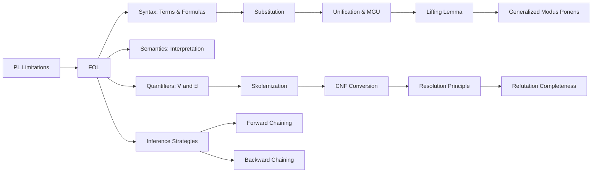

# Chapter 7: First-Order Logic and Inference

**Previous:** [Chapter 6: Knowledge Representation](06-knowledge-representation.md) | **Next:** [Chapter 7: Logical Reasoning and Inference](07-logical-reasoning.md)

---

## Learning Objectives

- Identify the limitations of Propositional Logic and the advantages of First-Order Logic (FOL).
- Define the syntax of FOL: objects, relations, functions, and quantifiers.
- Translate complex natural language sentences into FOL.
- Explain the processes of Unification and Lifting in logical inference.
- Compare Forward Chaining and Backward Chaining inference strategies.
- Convert FOL sentences to Conjunctive Normal Form (CNF) via Skolemization.
- Apply the unification algorithm and resolution principle in FOL theorem proving.

<!-- Image Gallery -->
<section class="lesson-visuals" aria-label="Visual learning resources">
  <header><span>VISUAL LEARNING</span><h2>See it. Review it. Remember it.</h2></header>
  <a class="lesson-visual-card" href="../../assets/images/lessons/artificial-intelligence/07-fol/handwritten-notes.png" target="_blank" rel="noopener">
    
    <span><strong>Handwritten notes</strong>Condensed notes for deliberate review.</span>
  </a>
  <a class="lesson-visual-card" href="../../assets/images/lessons/artificial-intelligence/07-fol/sticky-notes.png" target="_blank" rel="noopener">
    
    <span><strong>Sticky-note revision</strong>Fast recall prompts for revision.</span>
  </a>
  <a class="lesson-visual-card" href="../../assets/images/lessons/artificial-intelligence/07-fol/visual-explanation.png" target="_blank" rel="noopener">
    
    <span><strong>Visual concept guide</strong>A connected explanation of the key ideas.</span>
  </a>
</section>
<!-- End Image Gallery -->


## Why FOL Matters — Contracts, Not Facts

**Real-World Analogy (Contract Law):** Propositional Logic is like a checklist of facts — "It is raining," "The contract was signed." But contracts are far richer: they say "Every party must sign before the effective date" (universal claim) and "There exists a notary who witnessed the signatures" (existential claim). A contract that said only "Party A signed. Party B signed. Effective date passed." would miss the conditional structure and the scope of obligations. FOL is the language of contracts — it says *for every* object of a certain kind, *there exists* some relation or object that satisfies a condition. Without FOL, you cannot represent general truths that span entire classes of objects, and no AI system can reason about the world beyond isolated facts.

**Why it matters in AI:** Every modern knowledge representation system — from Prolog compilers to the Semantic Web (OWL), from automated theorem provers to database query engines — uses FOL or a decidable subset of it. Mastering FOL is the gateway to understanding how machines represent *general knowledge*, not just specific facts.

---

## Chapter at a Glance

| Section | Key Topics | Key Terms |
|---------|-----------|-----------|
| Why FOL? | Objects, relations, functions, quantifiers | Expressive power vs PL |
| Syntax of FOL | Constants, predicates, functions, variables | Atomic sentences, terms, well-formed formulas |
| Semantics of FOL | Interpretation, domain, model, truth conditions | Herbrand interpretation, satisfaction |
| Quantifiers | Universal (∀), Existential (∃), nested quantifiers | Scope, bound vs free variables |
| Substitution | Variable substitution, ground substitution | {var/term}, composition of substitutions |
| Unification | MGU, occurs check, unification algorithm | Most General Unifier, disagreement set |
| Skolemization | Eliminating existential quantifiers | Skolem constant, Skolem function |
| CNF Conversion | Normalization for resolution | Prenex form, conjunctive normal form |
| Inference in FOL | Universal instantiation, lifting, resolution | Soundness, completeness, semi-decidability |
| Inference Strategies | Forward chaining, backward chaining | Data-driven, goal-driven |

## Chapter Roadmap



---

## Theory


> **One-Sentence Takeaway:** FOL extends propositional logic with objects, relations, functions, and quantifiers — enabling the representation of general truths about entire classes of objects rather than just specific facts.

### Propositional Logic vs First-Order Logic


| Feature | Propositional Logic | First-Order Logic |
|---------|-------------------|-------------------|
| **Atomic Unit** | Propositions (A, B, C) | Predicates applied to terms |
| **Objects** | Not representable | Constants, variables, functions |
| **Relations** | Not representable | Predicates of any arity |
| **Quantifiers** | None | ∀ (for all), ∃ (there exists) |
| **Expressiveness** | Specific facts only | General truths about classes |
| **Example** | `Human(Socrates) → Mortal(Socrates)` cannot be expressed as a schema — must enumerate | `∀x (Human(x) → Mortal(x))` captures the general rule once |
| **Inference** | Truth-table decidable | Semi-decidable |
| **Domain Size** | Fixed, implicit | Explicit, any cardinality |
| **Variables** | None | Yes — with substitution |
| **Functions** | None | Yes — term construction |

### Why First-Order Logic?


While Propositional Logic assumes the world contains facts, **First-Order Logic (FOL)** assumes the world contains:

- **Objects**: People, houses, numbers, colors, days of the week.
- **Relations**: Red, round, brother of, bigger than, located-in.
- **Functions**: Father of, best friend, plus one, capital-city-of.

This allows for much more expressive power, especially when combined with **quantifiers**. In PL you would need a separate rule for every person: `Human(Socrates) → Mortal(Socrates)`, `Human(Plato) → Mortal(Plato)`, ... In FOL, one axiom suffices: `∀x (Human(x) → Mortal(x))`.

---

### Syntax of FOL


**Real-World Analogy (Grammar of a Language):** Just as English grammar defines how nouns, verbs, and adjectives combine into valid sentences, FOL syntax defines how terms, predicates, and quantifiers combine into well-formed formulas (WFFs). You cannot write "Runs quickly John" in English; likewise, you cannot write `∀P(x)` in FOL — quantifiers range over objects, not predicates in first-order logic.

**Alphabet of FOL:**

| Symbol Type | Description | Examples |
|-------------|-------------|----------|
| Constants | Specific objects | `john`, `2`, `red`, `null` |
| Variables | Placeholders for objects | `x`, `y`, `z`, `person1` |
| Predicates | Relations or properties | `Brother(_, _)`, `IsMortal(_)`, `< (_, _)` |
| Functions | Map objects to objects | `fatherOf(_)`, `plusOne(_)` |
| Connectives | Logical operators | ∧, ∨, ¬, →, ↔ |
| Quantifiers | Scope operators | ∀, ∃ |
| Punctuation | Grouping | `(`, `)`, `,` |

**Well-Formed Formulas (WFFs):**

1. A **term** is a constant, a variable, or a function applied to terms: `fatherOf(john)`, `x`, `42`.
2. An **atomic formula** is a predicate applied to terms: `Brother(john, richard)`, `IsMortal(x)`.
3. **Complex formulas** are built from atomic formulas using connectives and quantifiers.

**Algorithm: Parse and Validate an FOL WFF**

```
Input: A string expression E
Output: True if E is a valid WFF, False otherwise

1. TOKENIZE E into symbols (constants, variables, predicates, operators)
2. IDENTIFY quantifiers ∀ and ∃; ensure each binds a variable
3. CHECK that every predicate has the correct arity of arguments
4. VERIFY that arguments are valid terms (constants, variables, or function applications)
5. VERIFY that connectives (∧, ∨, ¬, →, ↔) appear between valid subformulas
6. ENSURE all parentheses are balanced
7. RETURN True if all checks pass, else False
```

**Pseudocode:**
```
function isWFF(expr):
    tokens ← tokenize(expr)
    stack ← []
    for token in tokens:
        if token is quantifier:
            expect(variable after quantifier)
        else if token is predicate:
            expect(correct arity of terms in parentheses)
        else if token is '(':
            stack.push(token)
        else if token is ')':
            if stack empty: return False; stack.pop()
    return stack empty
```

**Python Implementation:**
```python
import re

def tokenize(expr):
    pattern = r'∀|∃|[∧∨¬→↔]|[a-zA-Z_][a-zA-Z0-9_]*|[()]'
    return re.findall(pattern, expr)

def is_wff(expr):
    tokens = tokenize(expr)
    paren_count = 0
    i = 0
    while i < len(tokens):
        t = tokens[i]
        if t in {'∀', '∃'}:
            if i + 1 >= len(tokens) or not tokens[i + 1].islower():
                return False
            i += 1
        elif t.isupper() and t not in {'∀', '∃'}:
            if i + 1 < len(tokens) and tokens[i + 1] == '(':
                pass
        elif t == '(':
            paren_count += 1
        elif t == ')':
            paren_count -= 1
            if paren_count < 0: return False
        i += 1
    return paren_count == 0

print(is_wff("∀x Human(x) → Mortal(x)"))
print(is_wff("∀ ∀x Px"))
```

**Complexity Analysis:**
- **Time: O(n)** where n is the number of tokens — each token is visited exactly once.
- **Space: O(1)** auxiliary (only a counter for parentheses), or O(n) if building a parse tree.
- **Why linear?** WFF validation is essentially a parenthesis-checking problem with additional syntactic guards for quantifiers and arity; no backtracking is required.

**Edge Cases:**
- Empty expression → False (no valid formula).
- Quantifier without variable (`∀ (P(x))`) → invalid.
- Free variable in a sentence (formula with no quantifier binding it) — allowed in FOL but not in a closed formula (sentence).
- Nested quantifiers with same variable name — shadowing is allowed but error-prone in practice.


### Semantics of FOL


**Real-World Analogy (Interpretation in Court):** A contract clause means nothing until a judge interprets it against a specific situation. "The vehicle must be registered" — does "vehicle" mean cars only, or bicycles too? In FOL, a **model** (or interpretation) assigns real meaning to symbols: constants pick out objects, predicates pick out sets of tuples, functions pick out mappings. Only then does a formula become true or false.

**Formal Definition:**

An **interpretation** (model) *M* consists of:
- A **domain** *D* (non-empty set of objects)
- An **assignment** that maps:
  - Each constant *c* → an element of *D*
  - Each predicate *P* of arity *n* → a set of *n*-tuples from *D*
  - Each function *f* of arity *n* → a function from *D^n* → *D*

**Truth conditions** under interpretation *M*:
- `P(t₁, ..., tₙ)` is true iff the tuple of interpretations of `t₁...tₙ` is in the set assigned to *P*.
- `∀x φ[x]` is true iff for every *d* ∈ *D*, `φ[d]` is true.
- `∃x φ[x]` is true iff there exists some *d* ∈ *D* such that `φ[d]` is true.
- `φ ∧ ψ` is true iff both φ and ψ are true (similarly for other connectives).

**Dry Run Trace — Semantics of ∀x (Human(x) → Mortal(x)):**

| Interpretation | Domain D | Human | Mortal | Formula True? |
|:---:|:---:|:---:|:---:|:---:|
| M1 | {Socrates, Plato} | {Socrates, Plato} | {Socrates, Plato} | Yes — every human is mortal |
| M2 | {Socrates, Plato, Zeus} | {Socrates, Plato, Zeus} | {Socrates, Plato} | No — Zeus is human but not mortal |
| M3 | {Socrates, Plato, Zeus} | {Socrates, Plato} | {Socrates, Plato} | Yes — the non-human Zeus is irrelevant |
| M4 | {} | — | — | Invalid — domain must be non-empty |

**Complexity Analysis:**
- Checking truth in a finite model of size |*D*| = *k* for a formula of length *n*: **O(k^n)** worst-case (quantifier alternation).
- **Why exponential?** Each universal quantifier adds a factor of *k*: checking `∀x ∀y P(x,y)` requires *k²* evaluations.
- This is why FOL model checking is PSPACE-complete in general, but for finite models, bounded model checking can be practical.

---

### Quantifiers: Universal and Existential


**Real-World Analogy (Employee Handbook):** A company policy might say "Every employee must complete the training" (∀) — this applies universally across all employees. Or "There exists a backup server in case of failure" (∃) — there is at least one, but it does not have to be every server. Mix them: "Every department has at least one manager who approves expense reports" — ∀x (Department(x) → ∃y (Manager(y) ∧ ApprovesExpense(y,x))).

| Quantifier | Meaning | True When | False When |
|:---:|:---:|:---:|:---:|
| ∀x P(x) | For all x, P holds | Every domain element satisfies P | At least one counterexample |
| ∃x P(x) | There exists x such that P | At least one domain element satisfies P | No element satisfies P |

**Nested Quantifier Patterns:**

| Pattern | Meaning | Example in FOL |
|:---:|:---:|:---:|
| ∀x ∀y P(x,y) | For every pair, P holds | ∀x ∀y (Brother(x,y) → Sibling(x,y)) |
| ∃x ∃y P(x,y) | There exists a pair where P holds | ∃x ∃y (Parent(x,y)) |
| ∀x ∃y P(x,y) | Every x has some y related to it | ∀x Person(x) → ∃y Mother(y,x) |
| ∃x ∀y P(x,y) | There is an x that relates to every y | ∃x ∀y (Loves(x,y)) — universal lover |
| ∀x ∃y Loves(y,x) | Everyone is loved by someone (OK) | Distinct from ∀x ∃y Loves(x,y) — everyone loves someone |

**Edge Cases:**
- **Empty domain:** FOL and most logics require a non-empty domain; otherwise ∀x P(x) would be vacuously true and ∃x P(x) would be false for all P.
- **Variable capture:** `∀x (∃x P(x))` — the inner ∃x *shadows* the outer ∀. The outer quantifier is effectively dead. Most practical reasoners rename variables to avoid this.

---

### Substitution


**Real-World Analogy (Mail Merge):** A form letter says "Dear {Name}, your order #{OrderID} has shipped." The substitution `{Name/John, OrderID/1024}` fills in the blanks. In FOL, substitution is the same idea — replace variables with terms before applying inference rules.

**Definition:** A **substitution** θ is a finite set of mappings `{v₁/t₁, v₂/t₂, ..., vₙ/tₙ}` where each `vᵢ` is a distinct variable and each `tᵢ` is a term (not containing `vᵢ` in most practical cases — see occurs check).

**Types of Substitutions:**
- **Ground substitution:** Maps every variable to a ground term (no variables). Example: `{x/john, y/richard}`
- **Variable-pure substitution:** Maps variables to variables. Example: `{x/y, y/z}`
- **Empty substitution:** `{}` — no replacements; identity operation.

**Algorithm: Apply Substitution θ to Expression E**

```
Input: Expression E, substitution θ = {v₁/t₁, ..., vₙ/tₙ}
Output: Expression Eθ with all vᵢ replaced by tᵢ

1. IF E is a constant, RETURN E
2. IF E is a variable vᵢ IN θ, RETURN tᵢ
3. IF E is a variable NOT IN θ, RETURN E
4. IF E is a compound (function or predicate applied to args A₁..Aₙ):
   a. FOR each arg Aᵢ:
      Aᵢ' ← ApplySubstitution(Aᵢ, θ)
   b. RETURN the reconstructed expression with A₁'..Aₙ'
```

**Pseudocode:**
```
function applySubstitution(expr, theta):
    if isConstant(expr) or isPredicateSymbol(expr):
        return expr
    if isVariable(expr):
        return theta[expr] if expr in theta else expr
    if isCompound(expr):
        newArgs ← [applySubstitution(arg, theta) for arg in expr.args]
        return Compound(expr.functor, newArgs)
```

**Python Implementation:**
```python
def apply_substitution(expr, theta):
    """
    expr: tuple ('var', name) or ('const', name) or ('func', name, args) or ('pred', name, args)
    theta: dict {var_name: term}
    """
    kind = expr[0]
    if kind == 'const':
        return expr
    if kind == 'var':
        var_name = expr[1]
        return theta.get(var_name, expr)
    if kind in ('func', 'pred'):
        _, name, args = expr
        new_args = [apply_substitution(a, theta) for a in args]
        return (kind, name, tuple(new_args))

# Example
theta = {'x': ('const', 'john')}
expr = ('pred', 'Knows', (('var', 'x'), ('const', 'mary')))
result = apply_substitution(expr, theta)
print(result)
```

**Composition of Substitutions:** If θ₁ = {x/A} and θ₂ = {y/B}, then θ₁ ∘ θ₂ is the substitution you get by applying θ₂ then θ₁ (or equivalently, combining and resolving).

**Complexity:**
- **Time: O(n)** where n is the number of symbols in the expression — each symbol is visited once.
- **Space: O(n)** for the new expression.
- **Why linear?** No backtracking; it is a simple tree traversal with dictionary lookup at each variable node.

**Edge Cases:**
- **Empty substitution {}** applies no change — identity function.
- **Circular substitution** {x/f(x)} — leads to infinite terms. The occurs check prevents this.
- **Overlapping substitutions** {x/y, y/f(x)} — composition may produce unexpected results if applied sequentially without normalization.


### Unification


**Real-World Analogy (Marriage Registration):** Two incomplete forms say "Bride: Alice Smith" and "Groom: X" and another form says "Bride: Y" and "Groom: Bob Jones." A registrar matches them by finding the substitution {X/Bob Jones, Y/Alice Smith} that makes both forms describe the same couple. Unification is finding a substitution that makes two logical expressions identical.

**Definition:** Two expressions E₁ and E₂ **unify** under substitution θ if E₁θ = E₂θ. The **Most General Unifier (MGU)** is the substitution that makes them identical while imposing the fewest constraints.

**Algorithm: Unification (with Occurs Check)**

```
Input: Two expressions E₁, E₂
Output: MGU θ or FAIL

1. IF E₁ and E₂ are identical constants or variables, RETURN {}
2. IF E₁ is a variable:
   a. IF E₁ occurs in E₂ (occurs check), RETURN FAIL
   b. RETURN {E₁/E₂}
3. IF E₂ is a variable:
   a. IF E₂ occurs in E₁, RETURN FAIL
   b. RETURN {E₂/E₁}
4. IF E₁ and E₂ are both compound (same functor/arity):
   a. θ ← {}
   b. FOR each pair of corresponding arguments (A₁, A₂) in zip(E₁.args, E₂.args):
      θ' ← Unify(A₁θ, A₂θ)
      IF θ' = FAIL, RETURN FAIL
      θ ← compose(θ, θ')
   c. RETURN θ
5. OTHERWISE, RETURN FAIL
```

**Pseudocode:**
```
function unify(E1, E2, theta=empty):
    if theta is FAIL: return FAIL
    E1 ← apply(theta, E1)
    E2 ← apply(theta, E2)
    if E1 == E2: return theta
    if isVariable(E1): return unifyVar(E1, E2, theta)
    if isVariable(E2): return unifyVar(E2, E1, theta)
    if isCompound(E1) and isCompound(E2):
        if E1.functor != E2.functor or len(E1.args) != len(E2.args):
            return FAIL
        for a1, a2 in zip(E1.args, E2.args):
            theta ← unify(a1, a2, theta)
        return theta
    return FAIL

function unifyVar(v, expr, theta):
    if v occurs in expr: return FAIL
    theta[v] ← expr
    return theta
```

**Python Implementation:**
```python
def is_variable(term):
    return isinstance(term, str) and term[0].islower()

def is_compound(term):
    return isinstance(term, tuple)

def unify(e1, e2, theta=None):
    if theta is None:
        theta = {}
    e1 = apply_substitution(e1, theta)
    e2 = apply_substitution(e2, theta)

    if e1 == e2:
        return theta
    if is_variable(e1):
        return unify_var(e1, e2, theta)
    if is_variable(e2):
        return unify_var(e2, e1, theta)
    if is_compound(e1) and is_compound(e2):
        if e1[0] != e2[0] or len(e1[1:]) != len(e2[1:]):
            return None
        for a1, a2 in zip(e1[1:], e2[1:]):
            theta = unify(a1, a2, theta)
            if theta is None:
                return None
        return theta
    return None

def unify_var(v, expr, theta):
    if v == expr:
        return theta
    if occurs_check(v, expr, theta):
        return None
    theta[v] = expr
    return theta

def occurs_check(var, expr, theta):
    if var == expr:
        return True
    if is_variable(expr) and expr in theta:
        return occurs_check(var, theta[expr], theta)
    if is_compound(expr):
        return any(occurs_check(var, arg, theta) for arg in expr[1:])
    return False

def apply_substitution(expr, theta):
    if is_variable(expr):
        return theta.get(expr, expr)
    if is_compound(expr):
        name = expr[0]
        args = tuple(apply_substitution(a, theta) for a in expr[1:])
        return (name,) + args
    return expr

# Dry run example
e1 = ('Knows', 'john', 'x')
e2 = ('Knows', 'y', ('Mother', 'y'))
result = unify(e1, e2)
print(f"MGU: {result}")
```

**Dry Run Trace Table — Unification Trace:**

| Step | E₁θ Current | E₂θ Current | Disagreement | Action | θ Accumulated |
|:---:|:---:|:---:|:---:|:---:|:---:|
| 1 | Knows(john, x) | Knows(y, Mother(y)) | john vs y | {y/john} | {y/john} |
| 2 | Knows(john, x) | Knows(john, Mother(john)) | x vs Mother(john) | {x/Mother(john)} | {y/john, x/Mother(john)} |
| 3 | Knows(john, Mother(john)) | Knows(john, Mother(john)) | — | Done | {y/john, x/Mother(john)} |

**Dry Run — Occurs Check Failure:**

| Step | E₁θ | E₂θ | Disagreement | Action | Result |
|:---:|:---:|:---:|:---:|:---:|:---:|
| 1 | P(x) | P(f(x)) | x vs f(x) | Occurs check: x ∈ f(x) | FAIL |
| 1 | Q(y, y) | Q(z, f(z)) | y vs z | {z/y} | {z/y} |
| 2 | Q(y, y) | Q(y, f(y)) | y vs f(y) | Occurs check: y ∈ f(y) | FAIL |

**Complexity:**
- **Time: O(n·α(n))** in most implementations, where n is expression size (essentially linear with efficient data structures), but worst-case **O(n²)** if terms are repeatedly traversed without structure sharing.
- **Space: O(n)** for the substitution map.
- **Why near-linear?** Each comparison reduces the set of variables needing unification; the occurs check adds an O(n) traversal per variable binding, but in practice most bindings are trivial.

**Advantages & Disadvantages:**

| Advantages | Disadvantages |
|:---|:---|
| Produces the MGU — the least constraining substitution | Without occurs check, can create infinite terms (unsound) |
| Complete for syntactic unification of first-order terms | Variable renaming required to avoid conflicts |
| Determines unifiability in finite time | Cannot unify higher-order terms (undecidable) |

**Edge Cases:**
- **Occurs check failure:** `x` and `f(x)` cannot unify — x occurs inside f(x), creating circular reference.
- **Empty substitution result:** `P(a,b)` and `P(a,b)` unify with θ = {} (already identical).
- **Variable name conflicts:** `P(x)` and `P(y)` — unify with {x/y} or {y/x}, both are MGUs.
- **Function symbol mismatch:** `P(f(x))` and `P(g(y))` — fail (f ≠ g).


### Skolemization


**Real-World Analogy (Witness in Court):** The claim "Someone committed the crime" (∃x Criminal(x)). To prove it, the prosecutor does not say "Let us call the unknown person X" — they find a specific person, say "John Doe," and argue "John Doe committed the crime." Skolemization is the same idea: replace "there exists" with a specific (new) constant or function that serves as a concrete witness.

**Definition:** Skolemization eliminates existential quantifiers from an FOL sentence by replacing existentially quantified variables with **Skolem constants** (when no universal quantifier precedes) or **Skolem functions** (when universals precede the existential).

**Rules:**
- If the existential is not preceded by any universal: replace `∃x P(x)` with `P(c)` where *c* is a fresh constant.
- If the existential is preceded by universals `∀y₁...∀yₙ ∃x`: replace x with `f(y₁,...,yₙ)` where *f* is a fresh function symbol.

**Algorithm: Skolemize an FOL Formula**

```
Input: FOL formula F (in prenex form: all quantifiers at front)
Output: Skolemized formula F' (no existential quantifiers)

1. SET F ← PrenexNormalForm(F) — all quantifiers moved to front
2. WHILE F contains ∃:
   a. FIND the leftmost existential quantifier ∃x in the prefix
   b. GET the list of universal quantifiers ∀y₁...∀yₙ before ∃x
   c. IF n = 0:
      REPLACE x with fresh constant c not used in the formula
   ELSE:
      REPLACE x with fresh function f(y₁,...,yₙ) not used in the formula
   d. REMOVE the existential quantifier ∃x from the prefix
   e. UPDATE the matrix (quantifier-free part) with the replacement
3. RETURN the resulting universal formula
```

**Pseudocode:**
```
function skolemize(F):
    F ← prenexNormalForm(F)
    while hasExistential(F):
        ∀y₁...∀yₙ ∃x, Matrix ← splitPrefix(F)
        if n == 0:
            c ← newSkolemConstant()
            Matrix ← replaceAll(x, c, Matrix)
        else:
            f ← newSkolemFunction(n)
            Matrix ← replaceAll(x, f(y₁,...,yₙ), Matrix)
        F ← (∀y₁...∀yₙ, Matrix)
    return F
```

**Python Implementation:**
```python
import re
from itertools import count

_skolem_counter = count()

def new_skolem(name="sk"):
    return f"{name}_{next(_skolem_counter)}"

def skolemize(prenex_formula):
    match = re.match(
        r'((?:[∀∃]\s*\w+\s*)*)(.*)',
        prenex_formula.strip()
    )
    if not match:
        return prenex_formula

    prefix = match.group(1).strip()
    matrix = match.group(2).strip()
    quantifiers = re.findall(r'([∀∃])\s*(\w+)', prefix)

    universals = []
    for qtype, var in quantifiers:
        if qtype == '∃':
            if not universals:
                sk = new_skolem("c")
            else:
                sk = f"{new_skolem('f')}({','.join(universals)})"
            matrix = re.sub(r'\b' + var + r'\b', sk, matrix)
        else:
            universals.append(var)

    uni_prefix = ' '.join(f'∀{u}' for u in universals)
    return f"{uni_prefix} {matrix}" if universals else matrix


f1 = "∃x ∀y Loves(y, x)"
print(f"Original: {f1}")
print(f"Skolemized: {skolemize(f1)}")

f2 = "∀x ∃y ∀z ∃w P(x,y,z,w)"
print(f"Original: {f2}")
print(f"Skolemized: {skolemize(f2)}")
```

**Dry Run Trace — Skolemization of ∀x ∃y ∀z ∃w P(x,y,z,w):**

| Step | Current Prefix | Matrix | Action | Resulting Formula |
|:---:|:---:|:---:|:---:|:---:|
| Start | ∀x ∃y ∀z ∃w | P(x,y,z,w) | — | ∀x ∃y ∀z ∃w P(x,y,z,w) |
| 1 | ∀x ∃y ∀z | P(x, f₁(x), z, ∃w) | ∃y after ∀x: y→f₁(x) | ∀x ∀z ∃w P(x, f₁(x), z, w) |
| 2 | ∀x ∀z | P(x, f₁(x), z, f₂(x,z)) | ∃w after ∀x∀z: w→f₂(x,z) | ∀x ∀z P(x, f₁(x), z, f₂(x,z)) |

**Complexity:**
- **Time: O(n)** for a single pass scanning the prefix and substituting in the matrix.
- **Space: O(n)** for the transformed formula.
- **Why linear?** Skolemization is a purely syntactic transformation — it replaces variables with terms, no search involved.

**Advantages & Disadvantages:**

| Advantages | Disadvantages |
|:---|:---|
| Eliminates existential quantifiers without losing satisfiability | Skolemized formula is NOT logically equivalent — only equisatisfiable |
| Produces a universal formula simpler for resolution | Introduces new function symbols, increasing term complexity |
| Preserves the existence of a model (if original was satisfiable) | Skolem functions may introduce non-Herbrand interpretations |
| Enables CNF conversion and resolution-based theorem proving | Not reversible — information about which variable was existential is lost |

**Edge Cases:**
- **No existential quantifier:** Skolemization is identity — nothing to remove.
- **Nested existentials with no universals:** Both become distinct Skolem constants `∃x ∃y P(x,y) → P(c₁, c₂)`.
- **Existential inside universal only:** `∀x ∃y P(x,y) → ∀x P(x, f(x))`.
- **Rename conflicts:** Skolem symbols must be fresh; if `f` already exists in the formula, use `f₁`, `f₂`, etc.

---

### CNF Conversion (Conjunctive Normal Form)


**Real-World Analogy (Legal Requirements Checklist):** A contract must meet multiple independent conditions, each of which is a set of alternative ways to satisfy it. For example: "The tenant must (pay rent OR provide service) AND (give notice OR waive rights)." This is CNF — a conjunction of disjunctions. Resolution theorem provers require all FOL formulas in this standard form.

**Definition:** Conjunctive Normal Form (CNF) is a conjunction of **clauses**, where each clause is a disjunction of **literals** (atomic formulas or their negations). Example: `(¬P(x) ∨ Q(x)) ∧ (R(y) ∨ ¬S(y))`.

**Algorithm: Convert FOL to CNF**

```
Input: FOL sentence F
Output: Set of clauses (CNF form)

1. ELIMINATE implications (→, ↔):
   Replace φ → ψ with ¬φ ∨ ψ
   Replace φ ↔ ψ with (¬φ ∨ ψ) ∧ (φ ∨ ¬ψ)

2. MOVE negations inward (De Morgan's laws):
   ¬¬φ → φ
   ¬(φ ∧ ψ) → ¬φ ∨ ¬ψ
   ¬(φ ∨ ψ) → ¬φ ∧ ¬ψ
   ¬∀x φ(x) → ∃x ¬φ(x)
   ¬∃x φ(x) → ∀x ¬φ(x)

3. STANDARDIZE variables apart:
   Rename bound variables so each quantifier has a unique variable name

4. SKOLEMIZE: Remove existential quantifiers (see above)

5. Drop universal quantifiers (implicit — all remaining variables are universal)

6. DISTRIBUTE ∨ over ∧ to get CNF:
   (φ ∧ ψ) ∨ θ → (φ ∨ θ) ∧ (ψ ∨ θ)

7. FLATTEN nested conjunctions/disjunctions into clause sets

8. SEPARATE each conjunct into its own clause
```

**Pseudocode:**
```
function toCNF(F):
    F ← eliminateImplications(F)
    F ← pushNegationsInward(F)
    F ← standardizeVariables(F)
    F ← skolemize(F)
    F ← dropUniversalQuantifiers(F)
    F ← distributeOrOverAnd(F)
    clauses ← splitConjunctions(F)
    return clauses
```

**Python Implementation:**
```python
def to_cnf(formula):
    # Placeholder for full FOL CNF transformation
    return formula


# Dry Run — CNF Conversion of ∀x (Human(x) → Mortal(x)):
```

**Dry Run Trace — CNF Conversion of ∀x (Human(x) → Mortal(x)):**

| Step | Rule Applied | Result |
|:---:|:---:|:---:|
| Original | — | ∀x (Human(x) → Mortal(x)) |
| 1. Eliminate → | φ → ψ → ¬φ ∨ ψ | ∀x (¬Human(x) ∨ Mortal(x)) |
| 2. Push ¬ inward | Already in NNF | ∀x (¬Human(x) ∨ Mortal(x)) |
| 3. Stand. vars | Already unique | ∀x (¬Human(x) ∨ Mortal(x)) |
| 4. Skolemize | No existential quantifier | ∀x (¬Human(x) ∨ Mortal(x)) |
| 5. Drop ∀ | Implicit universal | (¬Human(x) ∨ Mortal(x)) |
| 6. Distribute ∨/∧ | Already a single clause | (¬Human(x) ∨ Mortal(x)) |
| 7. Flatten | Already flat | [¬Human(x) ∨ Mortal(x)] |

**Dry Run — Complex Example: ∀x ( (∃y P(x,y) ∧ ∀z Q(z)) → ¬R(x) )**

| Step | Rule | Result |
|:---:|:---:|:---:|
| Original | — | ∀x ((∃y P(x,y) ∧ ∀z Q(z)) → ¬R(x)) |
| Elim → | φ→ψ ≡ ¬φ∨ψ | ∀x (¬(∃y P(x,y) ∧ ∀z Q(z)) ∨ ¬R(x)) |
| De Morgan | ¬(A∧B) ≡ ¬A∨¬B | ∀x (¬∃y P(x,y) ∨ ¬∀z Q(z) ∨ ¬R(x)) |
| Push ¬ over quantifiers | ¬∃ ≡ ∀¬, ¬∀ ≡ ∃¬ | ∀x (∀y ¬P(x,y) ∨ ∃z ¬Q(z) ∨ ¬R(x)) |
| Standardize vars | Rename z→w | ∀x (∀y ¬P(x,y) ∨ ∃w ¬Q(w) ∨ ¬R(x)) |
| Skolemize | ∃w → c₁ | ∀x (∀y ¬P(x,y) ∨ ¬Q(c₁) ∨ ¬R(x)) |
| Drop ∀ | Implicit | (¬P(x,y) ∨ ¬Q(c₁) ∨ ¬R(x)) |
| CNF | Single clause, already CNF | [¬P(x,y) ∨ ¬Q(c₁) ∨ ¬R(x)] |

**Complexity:**
- **Time: O(2^n)** worst-case for step 6 (distributing ∨ over ∧), as a formula with *n* conjunctions can blow up to O(2^n) clauses. In practice, most KB formulas are small.
- **Space: O(c)** where *c* is the number of clauses.
- **Why exponential blowup possible?** Distributing `(A ∧ B) ∨ (C ∧ D) ∨ (E ∧ F)` produces 8 clauses. Each nested AND under OR doubles the count. Tseitin transformation (introducing auxiliary variables) avoids this blowup at the cost of new variable symbols.

**Advantages & Disadvantages:**

| Advantages | Disadvantages |
|:---|:---|
| Standard input format for resolution theorem provers | Exponential blowup possible during ∨/∧ distribution |
| Clauses are simple — only ∨ and ¬, no → or quantifiers | Original structure is lost; hard to read |
| Resolution on clauses is sound and refutation-complete | Skolemization introduces function symbols |
| Efficient data structures (clause indexing) for retrieval | Grounding can produce infinite clause sets |

**Edge Cases:**
- **Empty clause:** The empty clause (contradiction). Resolution refutation seeks to derive the empty clause.
- **Unit clause:** A clause with one literal `P(x)` — especially efficient in forward chaining.
- **Horn clauses:** Clauses with at most one positive literal — run in polynomial time. Basis of Prolog.


### FOL Inference Methods


**Real-World Analogy (Detective Reasoning):** A detective collects clues (facts) and general rules ("all thieves leave fingerprints"). Two approaches: (1) Forward Chaining — start with every clue, apply all rules, see what conclusions follow. (2) Backward Chaining — start with a hypothesis ("Smith is guilty"), check evidence that supports it. (3) Resolution — when two witnesses contradict each other, deduce that one must be lying.

| Method | Sound? | Complete? | Direction | Data Structure | Best For | Complexity |
|:---:|:---:|:---:|:---:|:---:|:---:|:---:|
| Universal Instantiation | ✅ | ❌ | Top-down | Ground substitutions | Small domains | O(g^n) |
| Generalized Modus Ponens | ✅ | ❌ | Forward | Substitution + implication | Horn clauses | O(n·p²) |
| Forward Chaining | ✅ | ✅ (Horn clauses) | Data-driven | Rule base + agenda | Monitoring, alerting | O(n·k) per cycle |
| Backward Chaining | ✅ | ✅ (Horn clauses) | Goal-driven | Goal stack + proof tree | Diagnosis, Q&A | O(b^d) DFS |
| Resolution (Refutation) | ✅ | ✅ (Refutation) | Refutation | Clause set + resolvents | Theorem proving | Semi-decidable |

**Key Insight — Semi-decidability:** FOL inference is **semi-decidable**. If KB ⊨ α, a complete procedure will eventually find the proof. But if KB ⊭ α, the procedure may never terminate. This is not a practical limitation for most AI applications, which use restricted subsets (Horn clauses, Description Logic) that are decidable.

---

### Lifting Lemma


The **Lifting Lemma** states that any inference made at the ground (propositional) level can be "lifted" to the first-order level by using unification instead of brute-force instantiation. This is the theoretical foundation for efficient FOL inference:

- Instead of grounding every variable to every possible constant (which is infinite in general),
- Unification finds the *minimal* substitution needed to apply an inference rule.
- Generalized Modus Ponens: From `∀x (P(x) → Q(x))` and `P(A)`, we directly infer `Q(A)` via substitution `{x/A}` — no need to ground all x first.

### Resolution Principle in FOL


**Algorithm: Resolution in FOL**

```
Input: Two clauses C₁, C₂ with no common variables
Output: Resolvent clause C (or FAIL)

1. STANDARDIZE variables apart — rename so C₁ and C₂ share no variables
2. FIND a literal L₁ in C₁ and L₂ in C₂ such that:
   - L₁ and ¬L₂ unify with MGU θ (or ¬L₁ and L₂ unify)
3. IF no such pair exists, RETURN FAIL
4. COMPUTE the resolvent:
   C = (C₁ - {L₁})θ ∪ (C₂ - {L₂})θ
5. RETURN C
```

**Example Resolution Proof:**

Given:
1. `∀x (Human(x) → Mortal(x))` → Clause: `¬Human(x) ∨ Mortal(x)`
2. `Human(Socrates)` → Clause: `Human(Socrates)`
Goal: `Mortal(Socrates)` → Negated goal: `¬Mortal(Socrates)`

| Step | Clause Pair | MGU θ | Resolvent |
|:---:|:---:|:---:|:---:|
| 1 | `¬Human(x) ∨ Mortal(x)` + `Human(Socrates)` | {x/Socrates} | `Mortal(Socrates)` |
| 2 | `Mortal(Socrates)` + `¬Mortal(Socrates)` | {} | □ (empty clause — contradiction) |

The empty clause proves `Mortal(Socrates)` follows from the premises.

**Python Implementation (Resolution skeleton):**
```python
class Clause:
    def __init__(self, literals):
        self.literals = set(literals)

    def __repr__(self):
        return f"Clause({self.literals})"

    def apply_substitution(self, theta):
        new_literals = set()
        for lit in self.literals:
            new_literals.add(apply_substitution(lit, theta))
        return Clause(new_literals)


def resolve(c1, c2):
    """Attempt resolution on two clauses. Returns list of resolvents."""
    resolvents = []
    for lit1 in c1.literals:
        for lit2 in c2.literals:
            neg_lit2 = negate(lit2)
            theta = unify(lit1, neg_lit2)
            if theta is not None:
                new_c1 = c1.apply_substitution(theta)
                new_c2 = c2.apply_substitution(theta)
                new_literals = (new_c1.literals - {lit1}) | \
                               (new_c2.literals - {lit2})
                resolvents.append(Clause(new_literals))
    return resolvents


def resolution_prover(kb_clauses, goal_clause):
    """Refutation resolution prover."""
    clauses = kb_clauses + [negate_clause(goal_clause)]
    new = set()
    while True:
        for pair in generate_pairs(clauses):
            resolvents = resolve(pair[0], pair[1])
            for r in resolvents:
                if not r.literals:
                    return True  # Theorem proved
                new.add(r)
        if all(r in clauses for r in new):
            return False  # Not provable (may loop forever)
        clauses.update(new)
```

**Complexity (Resolution):**
- **Time:** Worst-case exponential/hyper-exponential — resolution can generate exponentially many clauses before finding the empty clause.
- **Space:** O(c²) where c is the number of clauses in worst case (every pair resolves).
- **Why semi-decidable?** There is no bound on proof length. Strategies like set-of-support, unit preference, and linear resolution prune the search space but do not guarantee termination when the goal is not entailed.

---

## Concept Comparison

| Inference Method | Sound? | Complete? | Direction | Best For |
|-----------------|:---:|:---:|:---:|---------|
| Universal Instantiation | ✅ | ❌ | Top-down | Grounding general rules |
| Unification | ❌ (matching) | ❌ (matching) | Bidirectional | Pattern matching |
| Forward Chaining | ✅ | ✅ (Horn) | Data-driven | Monitoring, alerting |
| Backward Chaining | ✅ | ✅ (Horn) | Goal-driven | Diagnosis, Q&A |
| Resolution | ✅ | ✅ (Refutation) | Refutation | Theorem proving |

## Quick Reference — FOL Syntax

| Element | Notation | Example |
|---------|----------|---------|
| Constant | Lowercase | `john`, `2`, `red` |
| Predicate | Capital letter | `Brother(john, richard)` |
| Function | Lowercase | `LeftLeg(john)` |
| Variable | Lowercase | `x`, `y`, `z` |
| Universal | ∀x P(x) | "All humans are mortal" |
| Existential | ∃x P(x) | "Someone is mortal" |
| Conjunction | ∧ | P ∧ Q — both true |
| Disjunction | ∨ | P ∨ Q — at least one true |
| Negation | ¬ | ¬P — not P |
| Implication | → | P → Q — if P then Q |
| Biconditional | ↔ | P ↔ Q — P iff Q |

## Edge Cases Summary

| Concept | Edge Case | Handling |
|:---|:---|:---|
| **Unification** | Occurs check (x & f(x)) | Return FAIL — prevents infinite terms |
| **Unification** | Variable name conflict (P(x) & P(y)) | Either {x/y} or {y/x} — both MGU |
| **Unification** | Empty substitution (P(a) & P(a)) | Return {} — already identical |
| **Unification** | Function symbol mismatch (f vs g) | Return FAIL — cannot unify |
| **Skolemization** | No existential quantifiers | Identity — no transformation needed |
| **Skolemization** | Multiple existentials | Distinct Skolem constants/functions each time |
| **CNF** | Empty clause | Contradiction proven — refutation complete |
| **CNF** | Horn clause (≤1 positive literal) | Polynomial time inference (Prolog) |
| **Quantifiers** | Empty domain | Not allowed — FOL requires non-empty domain |
| **Quantifiers** | Variable shadowing | Rename variables apart to avoid confusion |
| **FOL Inference** | Semi-decidability | Procedure terminates if entailed; may not if not |

---

## Interview Corner

### Q1: Explain the Unification Algorithm with Occurs Check

**Answer:** Unification finds a substitution θ such that two expressions E₁ and E₂ become identical (E₁θ = E₂θ). The algorithm:

1. If E₁ and E₂ are identical, return {} (empty substitution).
2. If E₁ is a variable, check if E₁ occurs in E₂ (occurs check) — if so, fail. Otherwise, return {E₁/E₂}.
3. If E₂ is a variable, symmetric to step 2.
4. If both are compound with the same functor and arity, recursively unify corresponding arguments, composing substitutions.
5. Otherwise, fail.

**Occurs check** prevents circular bindings like {x/f(x)} that would create infinite terms. Without it, unification is unsound — `x` and `f(x)` would "unify" producing an infinite term `f(f(f(...)))`.

**Time complexity:** Near-linear in practice, O(n²) worst-case for naive implementations.

### Q2: How Does Resolution Work in FOL? Why is it Refutation-Complete?

**Answer:** Resolution is an inference rule for clauses (disjunctions of literals). Given two clauses C₁ = (A ∨ L₁) and C₂ = (B ∨ ¬L₂), if L₁ and L₂ unify with MGU θ, the resolvent is (A ∨ B)θ.

Resolution is **refutation-complete**: if a set of clauses is unsatisfiable, resolution will eventually derive the empty clause □. The proof strategy:
1. Negate the goal.
2. Convert everything to CNF.
3. Repeatedly apply resolution.
4. If □ is derived, the original goal is proved.

**Why refutation-complete?** The resolution inference rule is a generalization of Modus Ponens. Robinson's 1965 paper proved that if a clause set is unsatisfiable, there exists a resolution derivation of the empty clause. This is the foundation of automated theorem proving.

**Key strategies** for efficiency: Unit preference (prefer resolving with single-literal clauses), set-of-support (prefer clauses derived from the goal), linear resolution (maintain a chain of resolvents).

### Q3: Steps to Convert FOL to CNF

**Answer:** The eight-step process:

1. **Eliminate implications** — replace φ→ψ with ¬φ∨ψ, φ↔ψ with (¬φ∨ψ)∧(φ∨¬ψ)
2. **Move negations inward** — De Morgan's laws: ¬(A∧B) = ¬A∨¬B, ¬∀x P = ∃x ¬P
3. **Standardize variables apart** — rename so no quantifier shares a variable name
4. **Skolemize** — replace existential variables with Skolem constants/functions
5. **Drop universal quantifiers** — all remaining variables are implicitly universally quantified
6. **Distribute ∨ over ∧** — (A∧B)∨C → (A∨C)∧(B∨C)
7. **Flatten** — remove nested conjunctions/disjunctions
8. **Separate into clauses** — each conjunct becomes a separate clause

**Example:** `∀x (∀y P(x,y) → ∃z Q(z))` → after all steps: `[¬P(x, f(x)) ∨ Q(g(x))]`

---

## Applications in Real Systems

| Domain | System/Tool | How FOL is Used |
|:---|:---|:---|
| **Prolog Compilers** | SWI-Prolog, GNU Prolog | FOL restricted to Horn clauses; backward chaining with SLD resolution |
| **Automated Theorem Provers** | Vampire, E Prover, Z3 | Full FOL with resolution, paramodulation, and superposition |
| **Semantic Web** | OWL (Web Ontology Language) | Description Logic (decidable fragment of FOL) for class hierarchies, property restrictions |
| **Knowledge Graphs** | RDF, SPARQL | FOL-inspired triple stores; SPARQL queries use existential/universal semantics |
| **Database Query Engines** | SQL | SQL's `SELECT ... WHERE` is syntactic sugar for FOL formulas with quantifiers; `ALL` = ∀, `EXISTS` = ∃ |
| **Natural Language Understanding** | IBM Watson, ChatGPT | Semantic parsers translate natural language to FOL for logical reasoning and question answering |
| **Software Verification** | Dafny, Why3 | First-order logic with arithmetic used to specify and verify program correctness |
| **Planning Systems** | STRIPS, PDDL | FOL is the representation language for actions, preconditions, and effects |
| **Expert Systems** | CLIPS, JESS | Forward-chaining inference over rule bases encoded as FOL implications |

---

## Cross-Application Matrix

| Technique | ML Engineering | CV | NLP | Research |
|-----------|:---:|:---:|:---:|:---:|
| FOL Representation | ❌ | ❌ | ✅ | ✅ |
| Unification | ❌ | ❌ | ✅ | ✅ |
| Forward Chaining | ❌ | ❌ | ✅ | ✅ |
| Backward Chaining | ❌ | ❌ | ✅ | ✅ |
| Resolution | ❌ | ❌ | ❌ | ✅ |
| CNF Conversion | ❌ | ❌ | ❌ | ✅ |
| Skolemization | ❌ | ❌ | ❌ | ✅ |

## Chapter Quiz

**Q1:** What is the Most General Unifier (MGU) of P(x, f(x)) and P(y, f(y))?
- A) {x/y, f(x)/f(y)}
- B) {y/x}
- C) {x/y} or {y/x} (either is MGU)
- D) They cannot be unified

<details><summary>Answer&lt;/summary&gt;C) {x/y} or {y/x} are both MGUs since the two expressions are identical up to variable renaming.</details>

**Q2:** Which inference strategy is used by the Prolog programming language?
- A) Forward chaining
- B) Backward chaining with depth-first search
- C) Resolution with breadth-first search
- D) Universal instantiation

<details><summary>Answer&lt;/summary&gt;B) Prolog uses backward chaining with depth-first search (SLD resolution).</details>

**Q3:** What makes FOL semi-decidable for inference?
- A) It cannot represent all truths
- B) If KB ⊨ α, the procedure will eventually find the proof, but if KB ⊭ α, it may loop forever
- C) It requires exponential time for all problems
- D) The unification algorithm is incomplete

<details><summary>Answer&lt;/summary&gt;B) FOL is semi-decidable: entailment can be proven if true, but non-entailment may not terminate.</details>

**Q4:** In CNF conversion, why must existential quantifiers be removed before universal quantifiers are dropped?
- A) They create infinite clauses
- B) They require Skolemization first — dropping universals while existentials remain loses variable dependencies
- C) They are redundant in CNF
- D) They cannot appear in clauses

<details><summary>Answer&lt;/summary&gt;B) Existential quantifiers must be Skolemized first because the Skolem function's arguments depend on which universal variables are in scope. Dropping universals first would lose the dependency information.</details>

**Q5:** What prevents the unification {x / f(x)} from being a valid substitution?
- A) Type mismatch
- B) Occurs check violation — x occurs inside f(x), creating a circular term
- C) Both are variables
- D) Function symbols must be Skolemized

<details><summary>Answer&lt;/summary&gt;B) The occurs check detects that x appears within f(x), which would create an infinite term. Standard unification algorithms reject this.</details>

**Q6:** What is the role of Skolem functions vs Skolem constants?
- A) They are interchangeable
- B) Functions are used when the existential follows universal quantifiers; constants when there are no preceding universals
- C) Constants are used for functions with arity > 0
- D) Skolem functions are used in propositional logic

<details><summary>Answer&lt;/summary&gt;B) When an existential comes after universals ∀y₁...∀yₙ ∃x, the witness depends on the universals, so a Skolem function f(y₁,...,yₙ) captures this dependency. Without preceding universals, a fresh constant suffices.</details>

---

## Summary

- First-Order Logic represents the world in terms of objects and relations, extending propositional logic with quantifiers, variables, and functions.
- **Syntax** defines well-formed formulas from constants, predicates, functions, variables, connectives, and quantifiers.
- **Semantics** assigns meaning through interpretations — a domain D and mappings for each symbol.
- **Quantifiers** (∀, ∃) allow general statements about entire classes of objects.
- **Substitution** replaces variables with terms; **Unification** finds the MGU that makes two expressions identical.
- **Skolemization** removes existential quantifiers by introducing fresh constants/functions.
- **CNF conversion** prepares formulas for resolution theorem proving through an 8-step pipeline.
- **Resolution** is refutation-complete for FOL — the foundation of automated theorem provers.
- **Forward Chaining** is data-driven; **Backward Chaining** is goal-driven (used by Prolog).
- FOL is **semi-decidable**: entailment can be proven if true, but non-entailment may not terminate.
- Gödel's Completeness Theorem states that FOL is semantically complete.
- Applications span Prolog compilers, the Semantic Web (OWL), theorem provers (Vampire, Z3), planning systems, and database engines.

---

## Exercises

### Review Questions
1. Contrast Propositional Logic and First-Order Logic across at least 6 dimensions.
2. What is the difference between a Predicate and a Function in FOL? Give an example of each.
3. Explain the "Standardizing Apart" technique in inference. Why is it necessary?
4. Define a "Ground Term" and explain its importance in unification.
5. What is the occurs check and what problem does it prevent?
6. Why must Skolemization happen *after* standardizing variables apart?
7. Describe the difference between soundness and completeness in FOL inference.

### Application Problems
1. Translate to FOL: "No two people have the same DNA, except for identical twins."
2. Translate to FOL: "Every student who takes an exam either passes or fails."
3. Unify the following pairs or state why they cannot be unified:
   - `P(A, B, x)` and `P(y, z, C)`
   - `Q(x, f(x))` and `Q(y, y)`
   - `R(g(x), x)` and `R(y, f(y))`
4. Skolemize: `∀x ∃y ∀z ∃w (P(x,y) ∧ Q(z,w))`
5. Convert to CNF: `∀x ( (∃y P(x,y)) → (∀z Q(z) → R(x)) )`
6. Perform resolution refutation to prove `∀x (P(x) → Q(x)), P(A) ⊢ Q(A)`.

### Challenge Problem
1. **Resolution in FOL:** Implement a minimal resolution prover that can prove the syllogism: "All humans are mortal. Socrates is human. Therefore, Socrates is mortal." Include the clause representation, the unification steps, and the derivation of the empty clause.
2. **Complexity Analysis:** Explain why FOL inference is semi-decidable while propositional inference is decidable. What property of quantifiers causes this difference?
3. **Herbrand's Theorem:** Research and explain how Herbrand's Theorem reduces infinite-domain FOL reasoning to finite propositional reasoning. Why does this make FOL semi-decidable rather than decidable?
